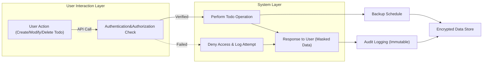

# Todo List Application Requirements

## Introduction & Purpose
The Todo list application is designed to enable end users to efficiently manage personal task lists with minimal friction. It serves users who need to capture, update, complete, and delete tasks on a daily basis. The system is intentionally limited to the minimum essential features to provide a lightweight, easy-to-use experience.

## Actors and Roles
- **User**: An authenticated individual who owns and manages their own todos.
- **System Administrator**: Backend/operator role responsible for audit log and managing system health (not direct end-user).

## Scope of the Application
- Task management (create, read, update, complete, delete)
- Authentication for all actions
- User-specific data privacy and isolation
- System stability, responsiveness, and security
- Business rules and validations for task data
- Error and edge case handling
- Data retention, removal, and privacy controls

## Functional Requirements (EARS Format)
- WHEN a user registers, THE system SHALL require unique username and password.
- WHEN a user logs in, THE system SHALL authenticate credentials and issue a secure session token.
- WHEN a user is authenticated, THE system SHALL allow:
  - Creating a new todo (title, optional description, optional due date)
  - Viewing all their todos
  - Editing an existing todo
  - Marking a todo as completed or uncompleted
  - Deleting a todo
- IF a user is not authenticated, THE system SHALL deny access to any todo actions.
- WHEN a user attempts to access any todo, THE system SHALL verify that the todo belongs to them before permitting read, update, or delete.
- WHEN a todo is deleted, THE system SHALL flag the todo as deleted immediately and SHALL permanently erase the data within 7 days.
- WHEN a user account is deleted, THE system SHALL remove all associated todos and personal data within 7 days.
- WHEN a user requests to view personal data, THE system SHALL provide all stored information for their account.

## Non-Functional Requirements: Performance, Security & Availability
### Responsiveness
- THE system SHALL respond to task operations (create, read, update, delete, complete) within 1 second under normal load (<=10 concurrent users).
- WHEN a user requests their todo list, THE system SHALL return up to 500 items within 1 second.
- THE system SHALL support up to 10 concurrent active users without degradation.

### Rate Limiting & Resource Control
- WHEN user operations exceed 30 per minute, THE system SHALL return a rate limit message.
- THE system SHALL store up to 5,000 active todos per user without impacting system responsiveness.

### Reliability
- THE system SHALL be available 99.5% of the time, excluding planned maintenance.
- IF a system error occurs, THE system SHALL return a user-friendly error message and SHALL not expose system internals.
- THE system SHALL log error events and performance metrics for system monitoring.

### Authentication and Security
- WHEN performing any user action, THE system SHALL require authentication via login session or valid token.
- WHEN using tokens, THE system SHALL expire tokens after 30 minutes of inactivity.
- WHEN a user logs out, THE system SHALL invalidate their session/token.
- THE system SHALL securely store passwords using a salted hash.
- THE system SHALL use HTTPS for all network traffic.
- THE system SHALL prevent SQL injection, cross-site scripting, and brute force attacks (rate limit and account lockout after 10 failed logins in 5 minutes).
- WHEN unauthorized access is attempted, THE system SHALL log the attempt and notify admins upon repeated incidents.
- WHEN a user attempts to access a resource not belonging to them, THE system SHALL deny the action without revealing existence of the resource.

## Business Rules & Validation
- WHEN entering a todo, THE system SHALL require a title (max 100 characters) and allow optional description and due date.
- THE system SHALL not allow duplicate todos (same title and due date) for the same user.
- WHEN a due date is present, THE system SHALL validate it is a valid future date or today.
- WHEN updating a todo, THE system SHALL allow only the owner to make changes.

## Error Handling & Edge Cases
- IF a request fails due to validation, THE system SHALL return a meaningful error message (e.g., "Missing Title", "Due Date Must Be in the Future").
- IF an internal error occurs, THE system SHALL surface a generic error without exposing technical details.
- WHEN a user attempts to access or modify another user’s todo, THE system SHALL respond with a “not found” message (do not indicate the existence of the todo).
- WHEN the system is under maintenance, THE system SHALL return an appropriate message for all endpoints.

## Data Privacy and Retention
- THE system SHALL treat all user data as confidential and SHALL not share data with third parties.
- WHEN an account is deleted, THE system SHALL delete all associated todos and personal data within 7 days unless otherwise legally required.
- WHEN a todo is deleted, THE system SHALL remove the data permanently within 7 days.
- THE system SHALL keep immutable audit logs for authentication and data changes for 90 days, accessible only to admins.
- THE system SHALL allow users to see all data stored about themselves and request deletion of their account and todos.
- THE system SHALL store only necessary data and exclude sensitive fields from logs and responses.
- THE system SHALL use encrypted backups retained for disaster recovery no more than 30 days past data deletion.
- WHEN restoring from backup, THE system SHALL ensure only the relevant user’s data is accessible.

## Glossary
- **Todo**: A record containing a user’s task, with title, optional description, optional due date, completion status, and owner ID.
- **Audit Log**: An immutable record of system and security actions for accountability and compliance.
- **Rate Limiting**: Restricting frequency of user actions to prevent abuse.
- **Soft Delete**: Marking data for deletion before permanent removal.

## Mermaid Diagram: Data Lifecycle and Security Workflow

