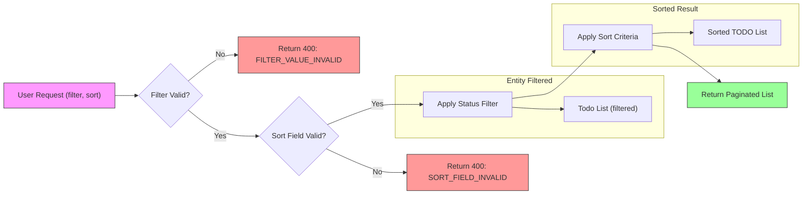

# Multi-User Todo Application Requirements Specification

## Authentication and User Account Management

WHEN a user attempts to sign up, THE system SHALL require a unique email address and a password with a minimum length of 8 characters. THE system SHALL validate the email format against RFC 5322 standards and reject invalid addresses. THE system SHALL store passwords using bcrypt hashing with a cost factor of 12. THE system SHALL NOT store plaintext passwords under any circumstances.

WHEN a user attempts to log in, THE system SHALL verify the provided email and password against the stored credentials. THE system SHALL issue a signed JWT token with a 24-hour expiration upon successful authentication. THE system SHALL return HTTP 401 with error code INVALID_CREDENTIALS for failed login attempts.

WHEN a user requests a password change, THE system SHALL require authentication via current password and new password confirmation. THE system SHALL validate the new password against the same strength requirements as signup. THE system SHALL update the password hash and invalidate all existing session tokens.

WHEN a user deletes their account, THE system SHALL immediately initiate a cascading soft-delete operation: all associated todos, trash items, and edit history entries SHALL be marked as deleted with a tombstone record. THE system SHALL permanently purge all user data from the database within 24 hours, including cryptographic hash destruction. THE system SHALL return HTTP 204 No Content upon successful account deletion.

## User Profile Management

THE user profile SHALL contain exactly one attribute: display name. THE display name SHALL be a UTF-8 string with a maximum length of 50 characters. THE system SHALL allow display name updates at any time. THE system SHALL validate display names to exclude HTML tags, special control characters, and leading/trailing whitespace. THE system SHALL enforce uniqueness of display names across all users within the application.

WHEN a user attempts to view another user's profile, THE system SHALL return HTTP 403 Forbidden with error code PROFILE_ACCESS_DENIED. THE system SHALL NOT return any profile information or metadata for non-self requests. THE profile endpoint SHALL be accessible only to the authenticated user owning the profile.

## Todo Creation

WHEN a user creates a todo, THE system SHALL require a non-empty title field. THE system SHALL accept an optional description field up to 1,000 characters. THE system SHALL accept optional start date and due date fields in ISO 8601 format. THE system SHALL default the completion status to false upon creation. THE system SHALL assign a unique auto-incrementing integer ID and record the creation timestamp with millisecond precision.

WHEN a todo is created with an invalid date format, THE system SHALL reject the request with HTTP 400 Bad Request and error code INVALID_DATE_FORMAT. WHEN no title is provided, THE system SHALL reject the request with HTTP 400 Bad Request and error code TITLE_REQUIRED.

## Todo View and Pagination

WHEN a user requests their todo list, THE system SHALL return only todos created by the authenticated user. THE system SHALL support pagination with page size of 25 items and a maximum page size of 100. THE system SHALL provide total count and pagination metadata in response headers.

THE todo list response SHALL include: title, completion status, creation date, start date (if set), and due date (if set). THE system SHALL omit description field from list responses to optimize network bandwidth. THE full description SHALL be available only when requesting a single todo by ID.

WHEN the requested page exceeds total available pages, THE system SHALL return HTTP 404 Not Found with error code PAGE_OUT_OF_RANGE. WHEN page size exceeds 100 items, THE system SHALL return HTTP 400 Bad Request with error code PAGE_SIZE_EXCEEDED.

## Todo Completion Toggle

WHEN a user toggles a todo's completion status, THE system SHALL perform an atomic update operation. THE system SHALL update the completion status from true to false or false to true. THE system SHALL update the updatedAt timestamp to the current ISO 8601 time with millisecond precision.

WHEN a todo ID does not exist or belongs to another user, THE system SHALL return HTTP 404 Not Found with error code TODO_NOT_FOUND. THE system SHALL validate that the todo is not deleted before processing the toggle request.

## Todo Editing and History

WHEN a user edits a todo, THE system SHALL allow modification of title, description, start date, and due date fields. THE system SHALL NOT allow editing of completion status through this endpoint. All edits SHALL be recorded in the edit history.

EVERY edit SHALL create a new history entry with the following fields: timestamp (ISO 8601), oldTitle, newTitle, oldDescription, newDescription, oldStartDate, newStartDate, oldDueDate, newDueDate. The system SHALL record null values for fields that were unchanged.

WHEN a field is left unprovided in the update request, THE system SHALL preserve its original value and SHALL NOT record any change in the history entry for that field.

THE edit history SHALL support up to 100 entries per todo. Once the limit is reached, the oldest entry SHALL be permanently deleted. THE history SHALL be sortable by timestamp in descending order (newest first).

## Deleted Todos and Trash Management

WHEN a user deletes a todo, THE system SHALL perform a soft delete: the todo remains in the database with a deletedAt timestamp, but SHALL NOT appear in normal todo list queries. THE system SHALL maintain the original createdAt timestamp and preserve all historical edit data.

WHEN a user requests the trash list, THE system SHALL return all todos with a non-null deletedAt timestamp. THE trash list SHALL use the same pagination scheme as the main todo list.

WHEN a user restores a todo from trash, THE system SHALL set deletedAt to null and update updatedAt to the current time. THE todo SHALL return to the main todo list with its original ordering preserved. All previous edit history SHALL be restored and remain accessible.

WHEN a user permanently deletes a todo from trash, THE system SHALL remove the todo entry and all associated edit history records from the database. THIS ACTION SHALL BE IRREVERSIBLE. THE system SHALL return HTTP 204 No Content upon successful permanent deletion.

## Filtering and Sorting

### Status Filters

WHEN a user applies a status filter, THE system SHALL return only todos matching the selected status. THE system SHALL support three status filters:
- "all" - shows all todos regardless of completion status
- "complete" - shows only todos with completion status = true
- "incomplete" - shows only todos with completion status = false

WHEN no filter is specified, THE system SHALL default to "all". WHEN the user provides an invalid filter value, THE system SHALL return HTTP 400 Bad Request with error code FILTER_VALUE_INVALID.

### Sorting Fields

THE system SHALL support sorting by four fields:
- "createdAt" - when the todo was originally created
- "startDate" - the start date field set by the user
- "dueDate" - the due date field set by the user
- "updatedAt" - when the todo was last edited

WHEN sorting by "createdAt", THE system SHALL arrange todos by creation timestamp in the specified order.

WHEN sorting by "startDate", THE system SHALL arrange todos by start date field value in the specified order.

WHEN sorting by "dueDate", THE system SHALL arrange todos by due date field value in the specified order.

WHEN sorting by "updatedAt", THE system SHALL arrange todos by last edit timestamp in the specified order.

### Default Sort Order

WHEN no sort field is specified, THE system SHALL sort by "createdAt" in descending order (newest first).

WHEN no sort direction is specified, THE system SHALL default to descending order (newest first, latest first).

### Missing Date Handling

WHILE sorting by "startDate", THE system SHALL place todos with null or undefined start date at the end of the list.

WHILE sorting by "dueDate", THE system SHALL place todos with null or undefined due date at the end of the list.

WHEN todos have identical values for the sorting field, THE system SHALL use "createdAt" as a secondary sort criterion in descending order to ensure deterministic ordering.

### Sort Priority

WHEN multiple sort criteria are applied, THE system SHALL execute them in the order specified by the user.

THE system SHALL NOT apply any automatic priority override to sorting fields.

### Combined Filters

WHEN both a status filter and a sort direction are applied, THE system SHALL evaluate the filter first, then apply sorting to the filtered result set.

THE system SHALL NOT apply sorting before filtering - filters must reduce the dataset first.

WHEN a user applies multiple sort criteria (e.g., "sort by dueDate then createdAt"), THE system SHALL sort primarily by the first field, then use subsequent fields as tiebreakers.

WHEN a sort field contains identical values across multiple todos, THE system SHALL break ties using the next specified sort field in sequence.

WHEN no further sort fields remain and a tie exists, THE system SHALL maintain stable sorting using todo ID order to preserve consistent pagination.

WHEN sorting by "updatedAt" and "createdAt", THE system SHALL treat both fields as absolute timestamps with millisecond precision.

FOR todos without any date field set (no startDate, no dueDate), THE system SHALL display the date field as empty in responses, but sort them as null values during filtering and sorting operations.

WHEN a user toggles between sorting directions (ascending/descending), THE system SHALL maintain the same sort field and only reverse the order.

THE system SHALL NOT allow sorting by fields that are not in the permitted list: "createdAt", "startDate", "dueDate", "updatedAt".

IF a user requests an invalid sort field, THE system SHALL return HTTP 400 with error code SORT_FIELD_INVALID.

IF a user requests an invalid filter value, THE system SHALL return HTTP 400 with error code FILTER_VALUE_INVALID.

WHEN restoring a todo from trash, THE system SHALL preserve its original "createdAt" timestamp.

WHEN editing a todo, THE system SHALL update "updatedAt" but never modify "createdAt".

WHEN creating a todo, THE system SHALL assign "createdAt" at timestamp of creation and "updatedAt" to the same value.

ISSUES:
- When two todos have identical createdAt, updatedAt, startDate, and dueDate, the order between them must remain stable across requests

HOW TO RESOLVE:
- Use internal unique todo ID as final tiebreaker to ensure deterministic results

LOOP:
- Sorting is always applied after filtering, never before
- Safe defaults: "createdAt" descending is always the fallback
- Missing dates are always sorted last, never first

SHOWCASE:

User sorts by "dueDate" ascending (earliest first)
- Todo A: dueDate = "2026-03-15T10:00:00Z"
- Todo B: dueDate = "2026-03-05T15:30:00Z"
- Todo C: dueDate = null
- Todo D: dueDate = "2026-03-05T15:30:00Z"

RESULT ORDER:
1. Todo B (dueDate: "2026-03-05T15:30:00Z")
2. Todo D (dueDate: "2026-03-05T15:30:00Z") - tiebreaker: createdAt ascending
3. Todo A (dueDate: "2026-03-15T10:00:00Z")
4. Todo C (dueDate: null)

With user sorting "dueDate desc, createdAt desc":
- Todo A
- Todo D
- Todo B
- Todo C

All filters and sorts must be implemented at the API layer and database layer to ensure optimal performance and data integrity.

## Privacy Enforcement

THE system SHALL enforce strict data isolation at the database query layer. ALL database queries SHALL include WHERE userId = :authenticatedUserId. THERE SHALL BE NO ENDPOINTS that expose todos across user boundaries. THE system SHALL validate user ownership on ALL read, write, and delete operations.

THE system SHALL NOT expose any user metadata (user ID, email, join date) in todo responses. THE system SHALL NOT support any form of sharing, collaboration, or group todos. THIS IS A PRIVATE, INDIVIDUAL TASK MANAGEMENT SYSTEM.

## Database Design Constraints

THE system SHALL use PostgreSQL with Prisma ORM. All tables SHALL use snake_case naming convention with prefix todoapp_.

The user table SHALL include: id (UUID), email (unique), passwordHash, displayName, createdAt, updatedAt, deletedAt (timestamp)

The todo table SHALL include: id (serial), userId (foreign key), title, description, startDate, dueDate, createdAt, updatedAt, deletedAt, completed (boolean)

The todoHistory table SHALL include: id (serial), todoId (foreign key), timestamp, oldTitle, newTitle, oldDescription, newDescription, oldStartDate, newStartDate, oldDueDate, newDueDate

THE system SHALL use database-level cascading constraints: ON DELETE CASCADE for todos when user is deleted; ON DELETE SET NULL for history when todo is permanently deleted.

## Error Code Standardization

THE system SHALL use a consistent error code convention:

- INVALID_CREDENTIALS: Authentication failure
- PROFILE_ACCESS_DENIED: Cross-user profile access
- TITLE_REQUIRED: Missing todo title
- INVALID_DATE_FORMAT: Malformed date values
- PAGE_OUT_OF_RANGE: Invalid pagination page
- PAGE_SIZE_EXCEEDED: Page size exceeds 100
- TODO_NOT_FOUND: Todo ID does not exist or belongs to another user
- FILTER_VALUE_INVALID: Invalid status filter value
- SORT_FIELD_INVALID: Invalid sort field provided

All error responses SHALL include: error code, message, and HTTP status code. The message SHALL be user-friendly, while the error code SHALL be machine-parsable.

## Mermaid Diagram: Todo Lifecycle

```mermaid
graph TD
  A["Todo Created"] --> B["Active"]
  B --> C["Deleted"]
  B --> D["Completed"]
  C --> E["In Trash"]
  E --> F["Restored"]
  F --> B
  E --> G["Permanently Deleted"]
  G --> H["Purged"]
  D --> I["Archived"]
  
  style A fill:#F9F,stroke:#333
  style B fill:#9F9,stroke:#333
  style C fill:#F99,stroke:#333
  style D fill:#FF9,stroke:#333
  style E fill:#FDD,stroke:#333
  style F fill:#9F9,stroke:#333
  style G fill:#F99,stroke:#333
  style H fill:#333,stroke:#000
  style I fill:#FF9,stroke:#333
  
  subgraph "User Workflow"
    A
    B
    C
    E
    F
    G
    H
    I
  end
  
  subgraph "Data State"
    C
    E
    G
    H
  end
```

## Mermaid Diagram: Filter and Sort Flow

## Access Control Matrix

| Actor | Sign Up | Login | Change Password | Delete Account | View Profile | Edit Profile | Create Todo | View Todo List | View Todo Detail | Toggle Completion | Edit Todo | Delete Todo | View Trash | Restore Todo | Permanently Delete | View History |
|-------|---------|-------|-----------------|----------------|--------------|--------------|-------------|----------------|------------------|-------------------|-----------|-------------|------------|--------------|---------------------|--------------|
| Guest | ❌      | ❌    | ❌              | ❌             | ❌           | ❌           | ❌          | ❌             | ❌               | ❌                | ❌        | ❌          | ❌         | ❌           | ❌                  | ❌           |
| Member | ✅     | ✅    | ✅              | ✅             | ✅           | ✅           | ✅          | ✅             | ✅               | ✅                | ✅        | ✅          | ✅         | ✅           | ✅                  | ✅           |

## Security Requirements

THE system SHALL implement rate limiting: 100 requests per minute per IP address. THE system SHALL use CSRF protection for all state-changing endpoints. THE system SHALL reject all requests without valid JWT token. THE system SHALL validate all input with strict schema validation (JSON Schema). THE system SHALL use HTTPS exclusively.

## Performance Requirements

THE database SHALL maintain query response times under 100ms for 95% of requests with up to 10,000 todos per user. THE system SHALL cache frequently accessed todo lists with 5-minute TTL. INDEXES SHALL be created on: userId, deletedAt, completed, createdAt, startDate, dueDate, updatedAt. THE system SHALL avoid N+1 query problems through efficient Prisma JOIN operations.

## Audit Trail

THE system SHALL record all critical operations in an audit log table: timestamp, userId, action, targetId, ipAddress, userAgent. Actions SHALL include: create_todo, update_todo, delete_todo, restore_todo, permanent_delete, change_password, delete_account, login, logout.

## Scalability and Availability Requirements

THE system SHALL support 100,000 concurrent users with 99.95% uptime. THE system SHALL be deployable in multiple regions with database replication. THE system SHALL have automated failover and retry mechanisms for database connection failures. THE system SHALL handle batch operations (bulk restore, bulk delete) with queue-based processing.