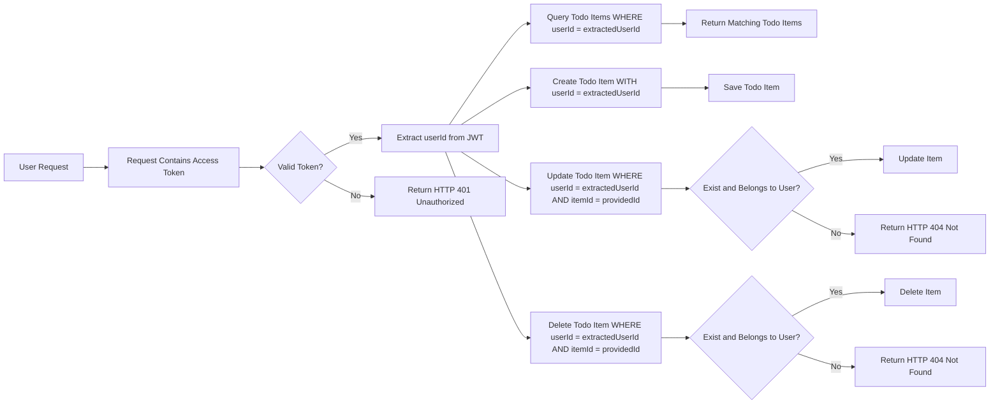

# Service Overview

## Service Vision

The TodoApp service delivers a secure, private task management experience where users own their data completely. The application prioritizes user privacy and data isolation above all else.

## Target Market

The primary market consists of individuals seeking a simple, reliable, and private task management solution. Users value data ownership and are wary of applications that might expose or monetize their personal information.

## Operational Scope

The system provides a minimal but complete set of features:
- User registration and authentication
- Secure personal todo list management
- Complete data isolation between users

All additional features (sharing, collaboration, reminders, categories) are deliberately excluded to maintain focus on core privacy principles.

## Success Metrics

- User acquisition rate
- Session duration and frequency
- Account retention rate
- Zero data breach incidents
- Successful completion of authentication and todo operations without errors

## User Actors and Authentication

## Authentication Requirements

### Core Authentication Functions

- THE system SHALL allow guests to register for a new account using a valid email address and a password of at least 8 characters.
- THE system SHALL allow authenticated users to log in to their account using their registered email and password.
- THE system SHALL securely store user passwords using industry-standard hashing algorithms (e.g., bcrypt).
- THE system SHALL generate and return a JWT access token upon successful login.
- THE system SHALL allow users to log out, invalidating their current session token.
- THE system SHALL allow users to reset their forgotten password via a secure, time-limited email link.
- THE system SHALL allow users to change their existing password after authenticating with their current password.
- THE system SHALL allow users to revoke access from all active devices simultaneously.
- THE system SHALL send a verification email to new users upon registration, requiring email confirmation before account activation.
- THE system SHALL deny registration attempts with duplicate email addresses.
- THE system SHALL enforce strong password policies: minimum 8 characters, at least one number, and one uppercase letter.
- THE system SHALL lock accounts temporarily after 5 consecutive failed login attempts.
- THE system SHALL immediately invalidate all existing tokens when a user changes their password.
- THE system SHALL expire all session tokens after 30 days of inactivity.

### Authentication Flow

WHEN a guest enters a valid email and password in the login form, THE system SHALL:
- Verify the email is registered in the system.
- Compare the provided password against the stored hash using a secure comparison function.
- IF the credentials are valid, THEN THE system SHALL generate a JWT access token with the following payload:
  - `userId`: the user's unique identifier
  - `role`: "user"
  - `permissions`: ["create_todo", "read_todo", "update_todo", "delete_todo"]
  - `iat`: current timestamp
  - `exp`: timestamp 15 minutes in the future
- THE system SHALL set the access token as an httpOnly, Secure, SameSite=Strict cookie.
- THE system SHALL return HTTP 200 with a success message.

WHEN a guest attempts to register with a new email and password, THE system SHALL:
- Validate the email format and ensure it is not already in use.
- Validate the password meets complexity requirements (minimum 8 characters, contains one number and one uppercase letter).
- Hash the password using bcrypt with a cost of 12.
- Create a new user record in the database with status "unverified".
- Generate a unique verification token with 2-hour expiration.
- Send a verification email containing a secure link with the verification token.
- Return HTTP 201 with a message indicating verification email has been sent.

WHEN a user clicks the verification link in their email, THE system SHALL:
- Validate the verification token is present and not expired.
- Verify the token corresponds to a valid, unverified user account.
- Update the user's status to "verified".
- Return HTTP 200 with a success message and redirect to login page.
- Delete the used verification token from storage.

WHEN a user requests a password reset, THE system SHALL:
- Validate the provided email address exists in the database.
- Generate a unique password reset token with 1-hour expiration.
- Store the token securely with user ID and expiration timestamp.
- Send an email to the user containing a link to the reset page with the token.
- Return HTTP 200 with a message indicating reset instructions have been sent.

WHEN a user submits a new password via the reset page, THE system SHALL:
- Validate the reset token is valid and not expired.
- Verify the token matches the user ID.
- Hash the new password using bcrypt with a cost of 12.
- Update the user's password hash in the database.
- Invalidate the used reset token.
- Send a confirmation email to the user.
- Return HTTP 200 with success message and redirect to login.

WHEN a user attempts to change their password, THE system SHALL:
- Require the user to authenticate with current password.
- Validate the new password meets complexity requirements (minimum 8 characters, contains one number and one uppercase letter).
- Verify the new password is different from the old one.
- Hash the new password using bcrypt with a cost of 12.
- Update the password hash in the database.
- Invalidate all existing session tokens for this user.
- Return HTTP 200 with success message.

WHEN a user revokes access from all devices, THE system SHALL:
- Delete all active session tokens associated with the user ID.
- Immediately terminate all existing user sessions.
- Return HTTP 200 with success message.
- Send a security notification email to the user.

WHILE the user is logged in, THE system SHALL maintain an active session with the JWT access token stored in an httpOnly cookie.

WHEN a user attempts to perform an action with an expired token, THE system SHALL:
- Detect the expired token in the cookie or authorization header.
- Return HTTP 401 with error code "TOKEN_EXPIRED".
- Clear the expired token from the client's cookie.

WHEN a user attempts to access a resource with an invalid or malformed token, THE system SHALL:
- Detect the unparseable or invalid signature.
- Return HTTP 401 with error code "TOKEN_INVALID".
- Clear the invalid token from the client's cookie.

## Actor Hierarchy and Permissions

### User Actor Structure

The system defines exactly two user actors: `guest` (unauthenticated) and `user` (authenticated).

### Guest (Unauthenticated)

- A guest is any user who has not logged in or registered.
- A guest SHALL NOT be able to view, create, update, or delete any todo items.
- A guest SHALL NOT be able to access any user-specific data.
- A guest SHALL be able to view public landing pages and initiate registration/login workflows.
- THE system SHALL redirect guests to the login page if they attempt to access protected routes.

### User (Authenticated)

- A user is an individual who has successfully registered and verified their email address.
- A user SHALL be able to create personal todo items that are visible only to themselves.
- A user SHALL be able to read all their own todo items.
- A user SHALL be able to update their own todo items.
- A user SHALL be able to delete their own todo items.
- A user SHALL be able to view their own profile and account settings.
- A user SHALL NOT be able to access, view, modify, or delete any todo items belonging to another user.
- A user SHALL NOT be able to register for multiple accounts with the same email.
- A user SHALL NOT be able to log in as another user.
- A user SHALL NOT be able to access administrative functions.

### Identity Isolation Guarantee

THE system SHALL ensure complete data isolation between users. Every todo item shall have a `userId` field that is set at creation time and cannot be modified. All queries for todo items SHALL automatically filter by the authenticated user's `userId` and SHALL NEVER include `userId` as a query parameter from client input. This isolation SHALL be enforced at the API layer and database access layer.

### Permission Matrix

| Action | Guest | User |
|--------|-------|------|
| Access login page | ✅ | ✅ |
| Access registration page | ✅ | ✅ |
| Register new account | ✅ | ❌ |
| Log in | ✅ | ✅ |
| Log out | ❌ | ✅ |
| Reset password | ✅ | ✅ |
| Change password | ❌ | ✅ |
| Revoke all sessions | ❌ | ✅ |
| View todo list | ❌ | ✅ |
| Create todo item | ❌ | ✅ |
| Read todo item | ❌ | ✅ |
| Update todo item | ❌ | ✅ |
| Delete todo item | ❌ | ✅ |
| View other users' todos | ❌ | ❌ |
| Access user profile | ❌ | ✅ |
| Manage account settings | ❌ | ✅ |

## Token Management

### Token Type and Implementation

- THE system SHALL use JWT (JSON Web Tokens) for all authentication sessions.
- Access tokens SHALL be short-lived, with an expiration of 15 minutes.
- Refresh tokens SHALL NOT be implemented—session will be maintained via auto-login via cookie.
- Access tokens SHALL be stored exclusively in an httpOnly, Secure, SameSite=Strict cookie.
- Access tokens SHALL NOT be stored in localStorage, sessionStorage, or any client-side JavaScript-accessible storage.

### JWT Token Structure

The JWT payload SHALL contain the following fields:

- `userId`: UUID string identifying the authenticated user (e.g., "b243a1cf-68f6-4a35-9d18-7e05d5b2e365")
- `role`: string literal "user"
- `permissions`: array of strings containing exact values ["create_todo", "read_todo", "update_todo", "delete_todo"]
- `iat`: number representing Unix timestamp of token issuance
- `exp`: number representing Unix timestamp of token expiration (15 minutes after `iat`)

### Token Generation and Validation

- THE system SHALL generate JWT tokens using HS256 algorithm and a cryptographically secure secret key stored in environment variables.
- THE system SHALL validate JWT signatures on every protected request using the same secret key.
- THE system SHALL reject any token with invalid signature, malformed structure, or missing required fields.
- THE system SHALL immediately invalidate tokens when a user logs out, changes password, or revokes sessions.

### Token Refresh Policy

- THE system SHALL NOT use refresh tokens.
- When the access token expires, THE system SHALL automatically attempt to re-authenticate the user if a valid session cookie exists and has not been revoked.
- IF the user has been inactive for 30 days, THEN THE system SHALL require re-login with credentials.

### Cookie Configuration

- Name: "todo_session"
- Domain: Auto-detected from host
- Path: "/"
- HttpOnly: true
- Secure: true
- SameSite: Strict
- Max-Age: 1296000 (15 days, synchronized with session persistence)
- Expires: 15 days after last activity

## Core Todo Functionality

## Core Features

The todo application provides minimal but complete functionality for managing personal task lists. The system enforces strict user data isolation where every user can only access their own todos. No cross-user data visibility exists.

### User-Centric Todo Operations

WHEN a user is logged in, THE system SHALL allow the creation of new todo items.

WHEN a user creates a new todo item, THE system SHALL assign a unique identifier to the item.

WHEN a user creates a new todo item, THE system SHALL associate the item with the authenticated user's account.

WHEN a user creates a new todo item, THE system SHALL set the initial status to "pending".

WHEN a user creates a new todo item, THE system SHALL set the creation timestamp to the current system time in UTC.

WHEN a user attempts to create a todo item while not authenticated, THE system SHALL deny the request and return an appropriate error message.

WHEN a user is logged in, THE system SHALL allow viewing of all their own todo items.

WHEN a user requests their todo items, THE system SHALL return only items associated with their authenticated user ID.

WHEN a user requests their todo items, THE system SHALL sort items by creation timestamp in descending order (newest first).

WHEN a user requests their todo items, THE system SHALL return a list of todos with id, title, description, status, createdAt, and updatedAt fields.

WHEN a user is logged in, THE system SHALL allow updating of any of their own todo items.

WHEN a user updates a todo item, THE system SHALL validate that the item belongs to the authenticated user.

WHEN a user updates a todo item, THE system SHALL update the item's updatedAt timestamp to the current system time in UTC.

WHEN a user updates a todo item title, THE system SHALL validate that the title is not empty.

WHEN a user updates a todo item title, THE system SHALL limit the title to 255 characters.

WHEN a user updates a todo item description, THE system SHALL allow up to 10,000 characters.

WHEN a user updates a todo item status, THE system SHALL only accept "pending", "completed", or "archived" as valid values.

WHEN a user attempts to update a todo item that does not belong to them, THE system SHALL deny the request and return an appropriate error message.

WHEN a user is logged in, THE system SHALL allow deletion of any of their own todo items.

WHEN a user deletes a todo item, THE system SHALL verify that the item belongs to the authenticated user.

WHEN a user deletes a todo item, THE system SHALL permanently remove the item from the database.

WHEN a user attempts to delete a todo item that does not belong to them, THE system SHALL deny the request and return an appropriate error message.

WHEN a user attempts to access any todo item without being authenticated, THE system SHALL deny access and return an appropriate error message.

## Data Model Concepts

The todo data model is designed to ensure absolute user data isolation through strict access control and ownership verification.

### Todo Item Structure

THE system SHALL represent each todo item with the following attributes:

- An auto-generated unique identifier (UUID)
- A title field (required, minimum 1 character, maximum 255 characters)
- A description field (optional, maximum 10,000 characters)
- A status field (required, restricted to "pending", "completed", or "archived")
- A createdAt field (required, timestamp in UTC)
- A updatedAt field (required, timestamp in UTC)
- A userId field (required, foreign key linking to the authenticated user)

### Data Ownership Enforcement

WHEN any todo item is created, THE system SHALL associate it with the authenticated user's unique identifier.

WHEN any todo item is queried, THE system SHALL filter results exclusively by the authenticated user's unique identifier.

WHEN any todo item is updated, THE system SHALL verify that the authenticated user's identifier matches the todo item's userId field.

WHEN any todo item is deleted, THE system SHALL verify that the authenticated user's identifier matches the todo item's userId field.

THE system SHALL NEVER store or expose any reference to other users' todo items in response to any API request.

THE system SHALL NEVER allow search, filter, or list operations that could expose items from multiple users.

## User Interactions

### Primary Workflow: Creating and Managing Personal Todo Lists

WHEN a user logs in, THE system SHALL display their personal todo list.

WHEN a user clicks "Add New Task", THE system SHALL display a form with title and description fields.

WHEN a user fills the title field and clicks "Save", THE system SHALL create a new todo item with status "pending".

WHEN a user fills the description field, THE system SHALL include it in the todo item (if provided).

WHEN a user clicks on a todo item, THE system SHALL allow editing the item's title and description.

WHEN a user clicks the "Toggle Status" button on a todo item, THE system SHALL change the status between "pending" and "completed".

WHEN a user clicks the "Archive" button on a completed todo item, THE system SHALL change the status to "archived".

WHEN a user clicks "Delete" on any todo item, THE system SHALL prompt for confirmation and then permanently delete the item.

WHEN a user navigates to different pages of the application, THE system SHALL preserve their login state and continue to show only their personal todo items.

## Validation Rules

### Todo Item Validation

WHEN a user attempts to create a todo item with an empty title, THE system SHALL reject the request and return an error message.

WHEN a user attempts to create a todo item with a title longer than 255 characters, THE system SHALL truncate the title to 255 characters and save it.

WHEN a user attempts to create a todo item with a description longer than 10,000 characters, THE system SHALL reject the request and return an error message.

WHEN a user attempts to update a todo item status to an invalid value (anything other than "pending", "completed", or "archived"), THE system SHALL reject the request and return an error message.

WHEN a user attempts to update a todo item with no changes to any fields, THE system SHALL not update the updatedAt timestamp.

### User Context Validation

WHEN a user attempts to access any todo functionality without being authenticated, THE system SHALL return HTTP 401 Unauthorized.

WHEN a guest user attempts to view any existing todo items, THE system SHALL return an empty list (not an error).

WHEN a user attempts to access a todo item by its ID that belongs to another user, THE system SHALL return HTTP 404 Not Found (not HTTP 403 Forbidden) to prevent information disclosure.

WHEN a user attempts to update a todo item that has been deleted, THE system SHALL return HTTP 404 Not Found.

WHEN a user attempts to delete a todo item that has been deleted, THE system SHALL return HTTP 404 Not Found.

### Authentication-Related Validation

WHEN a user logs in, THE system SHALL verify their credentials before granting access.

WHEN a user logs in, THE system SHALL generate a JWT access token with expiration of 15 minutes.

WHEN a user logs in, THE system SHALL include their unique userId in the JWT payload.

WHEN a user uses an expired JWT access token, THE system SHALL return HTTP 401 Unauthorized.

WHEN a user uses a JWT token with invalid signature, THE system SHALL return HTTP 401 Unauthorized.

WHEN a user refreshes their access token, THE system SHALL validate the refresh token and issue a new access token with a 15-minute expiration.

WHEN a user logs out, THE system SHALL invalidate the current session.

WHEN a user changes their password, THE system SHALL invalidate all existing sessions for that user.

WHEN a user revokes access from all devices, THE system SHALL invalidate all refresh tokens for that user.

WHEN a user signs up, THE system SHALL create a new user account with the provided email and encrypted password.

WHEN a user signs up, THE system SHALL immediately log them in and issue an access token.

WHEN a user attempts to register with an email that already exists, THE system SHALL return an error message indicating the email is already registered.

WHEN a user attempts to reset their password with an invalid token, THE system SHALL return an error message.

WHEN a user attempts to reset their password with an expired token, THE system SHALL return an error message.

## Data Flow and Access Control

All todo item operations follow a strict data isolation pattern:

Mermaid Diagram:

The diagram above demonstrates the complete access control workflow for todo operations. Every interaction requires: 

1. A valid authentication token
2. Extraction of the authenticated user's ID
3. Strict filtering of all database queries by the user ID
4. Verification of ownership for all modification operations
5. Always returning HTTP 404 Not Found for unauthorized access attempts to specific items (to prevent enumeration attacks)

This design ensures that even if a malicious user guesses a todo item ID, they cannot access it unless they are the owner.

The system guarantees complete data separation: no user can ever see, modify, or delete another user's todo items.

The todo system is designed to be minimal but complete. Every feature is implemented with strict security and privacy principles at the core.

## Summary of Business Requirements

The todo application is a privacy-focused personal task manager where:

- User data isolation is absolute
- No user can access another user's information
- Authentication is mandatory for any task management operations
- Authorization is enforced via JWT tokens with userId claims
- All operations are filtered by the user's authenticated identity
- Error messages are designed to prevent information leakage
- The system is minimal by design - no advanced features (sharing, collaboration, reminders, categories) are included

This ensures a simple, secure, and trustworthy application that users can depend on for personal task management.

## User Scenarios and Workflows

### Primary User Journey: Registration to Todo Creation

THE system SHALL allow a guest to register for a new account using email and password.

WHEN a guest clicks the "Register" button on the authentication page, THE system SHALL collect the user's email address and password.

WHEN the system receives a registration request, THE system SHALL validate the email format.

IF the email address is not in valid email format, THEN THE system SHALL display an error message: "Please enter a valid email address."

IF the password is less than 8 characters, THEN THE system SHALL display an error message: "Password must be at least 8 characters long."

IF the email address is already registered in the system, THEN THE system SHALL display an error message: "An account with this email address already exists."

WHEN all validation rules pass successfully, THE system SHALL create a new user account with the provided credentials.

THE system SHALL generate a unique userId for the new user.

THE system SHALL send a welcome email to the user with the subject: "Welcome to TodoApp - Your account has been created!"

WHEN the account creation is complete, THE system SHALL automatically log the user in and redirect them to the dashboard.

WHILE the user is logged in, THE system SHALL display the user's personal todo list.

WHEN the user clicks the "New Task" button, THE system SHALL display a form to create a new todo item.

WHEN the user submits a new todo item, THE system SHALL validate that the task description is not empty.

IF the task description is empty, THEN THE system SHALL display an error message: "Please enter a task description."

IF the task description exceeds 500 characters, THEN THE system SHALL display an error message: "Task description cannot exceed 500 characters."

WHEN all validations pass, THE system SHALL create the todo item and assign it to the currently authenticated user.

THE system SHALL store the todo item with the following attributes: taskId, userId, title, createdAt, status (pending), and completedAt (null).

WHEN the todo item is successfully created, THE system SHALL add it to the top of the user's todo list and display a success message: "Task created successfully!"

### Secondary User Journey: Task Update and Completion

WHEN a user clicks on a todo item in their list, THE system SHALL display the task details.

WHEN a user clicks the "Edit" button on a todo item, THE system SHALL display an editable form with the current task details.

WHEN the user submits edited task details, THE system SHALL validate the updated task description.

IF the updated task description is empty, THEN THE system SHALL display an error message: "Task description cannot be empty."

IF the updated task description exceeds 500 characters, THEN THE system SHALL display an error message: "Task description cannot exceed 500 characters."

WHEN validation passes, THE system SHALL update the task with the new description and timestamp the update.

WHEN the user clicks the "Complete" checkbox on a todo item, THE system SHALL toggle the task status.

WHEN the status changes to "completed", THE system SHALL set the completedAt field to the current timestamp.

WHEN the status changes to "pending", THE system SHALL set the completedAt field to null.

THE system SHALL preserve the original createdAt timestamp regardless of status changes.

WHEN a task is marked as completed, THE system SHALL visually dim the task item and add a strikethrough to the text.

WHEN a task is marked as pending, THE system SHALL restore the original visual appearance.

WHILE a task is pending, THE system SHALL display it in the active tasks section.

WHILE a task is completed, THE system SHALL display it in the completed tasks section.

### Special Scenario: Password Reset

WHEN a user clicks "Forgot Password?" on the login page, THE system SHALL display a password reset form.

WHEN the user enters their email address and submits the reset request, THE system SHALL validate the email address.

IF the email address is not registered in the system, THEN THE system SHALL display an error message: "No account found with this email address."

WHEN the email address is valid, THE system SHALL generate a unique, time-limited reset token.

THE system SHALL store the reset token in memory with expiration timestamp (20 minutes from generation).

THE system SHALL send an email to the user with subject: "Password Reset Request for TodoApp" and a link containing the reset token.

WHEN the user clicks the reset link in the email, THE system SHALL validate the token.

IF the token has expired (older than 20 minutes), THEN THE system SHALL display an error message: "Password reset link has expired. Please request a new one."

IF the token is invalid or does not exist, THEN THE system SHALL display an error message: "Invalid password reset link."

WHEN the token is valid and active, THE system SHALL display a password reset form.

WHEN the user submits a new password, THE system SHALL validate it meets requirements.

IF the new password is less than 8 characters, THEN THE system SHALL display an error message: "Password must be at least 8 characters long."

WHEN the password meets requirements, THE system SHALL update the user's password hash in the database.

THE system SHALL immediately invalidate the reset token after successful password change.

THE system SHALL display a success message: "Your password has been updated successfully. You may now log in with your new password."

WHEN password reset is complete, THE system SHALL automatically log the user in.

### Special Scenario: Account Deletion

WHEN a user clicks "Delete Account" in their profile settings, THE system SHALL display a confirmation dialog.

THE system SHALL warn the user: "This action cannot be undone. All your todo items and account data will be permanently deleted."

WHEN the user confirms deletion by clicking "I understand, delete my account", THE system SHALL validate that the password entered matches the user's current password.

IF the entered password does not match the stored password, THEN THE system SHALL display an error message: "Incorrect password. Please try again."

WHEN password validation passes, THE system SHALL delete all todo items associated with the user's userId.

THE system SHALL delete the user account record from the database.

THE system SHALL invalidate all active sessions for the user.

THE system SHALL send a final email to the user with subject: "Your TodoApp account has been permanently deleted."

WHEN the account deletion process is complete, THE system SHALL log the user out and redirect them to the homepage.

THE system SHALL display a final message: "Your account has been permanently deleted. Thank you for using TodoApp."

### Data Isolation Principle

THE system SHALL ensure that each user's todo items are completely isolated from other users.

WHERE a user attempts to access another user's todo items, THE system SHALL deny access and return an unauthorized error.

WHEN any API request is made to retrieve, update, or delete todo items, THE system SHALL verify that the userId in the authentication token matches the userId associated with the requested todo item.

IF the userId in the token does not match the requested todo item's userId, THEN THE system SHALL return HTTP 403 Forbidden with error code: "ACCESS_DENIED_USER_MISMATCH".

THE system SHALL never expose any user identifiers, todo items, or metadata that belong to another user.

WHILE handling any todo-related request, THE system SHALL implicitly filter data to only items belonging to the authenticated user.

### Performance Expectations

WHEN a user logs in, THE system SHALL respond with authentication completion within 1 second.

WHEN a user loads their todo list, THE system SHALL display results within 0.5 seconds for up to 1000 items.

WHEN a user creates, updates, or deletes a todo item, THE system SHALL provide visual feedback of completion within 1 second.

WHEN a password reset request is generated, THE system SHALL send email notification within 2 seconds.

WHEN a user initiates account deletion, THE system SHALL complete cleanup and respond within 5 seconds.

## Exception Handling

### Authentication Errors

### Invalid Credentials
WHEN a user attempts to log in with incorrect email or password, THE system SHALL respond with HTTP 401 Unauthorized and return a JSON object containing error code "AUTH_INVALID_CREDENTIALS".

WHEN a guest attempts to authenticate after five consecutive failed attempts within 15 minutes, THE system SHALL temporarily lock the account for 30 minutes and return error code "AUTH_ACCOUNT_LOCKED".

WHEN an email address is provided that does not exist in the system, THE system SHALL NOT disclose this information and SHALL respond with the same "AUTH_INVALID_CREDENTIALS" error code as for invalid passwords to prevent account enumeration attacks.

WHEN the authentication request contains malformed JSON or missing required fields (email, password), THE system SHALL respond with HTTP 400 Bad Request and error code "AUTH_INVALID_REQUEST_FORMAT".

### Invalid Token
WHEN a user makes a request with an expired access token, THE system SHALL respond with HTTP 401 Unauthorized and return error code "AUTH_TOKEN_EXPIRED".

WHEN a user makes a request with an invalidly formatted or corrupted access token, THE system SHALL respond with HTTP 401 Unauthorized and return error code "AUTH_TOKEN_INVALID".

WHEN a user attempts to use a refresh token that has been revoked or does not belong to the requesting user, THE system SHALL respond with HTTP 401 Unauthorized and return error code "AUTH_REFRESH_TOKEN_INVALID".

WHEN a user attempts to exchange an invalid or expired refresh token for a new access token, THE system SHALL respond with HTTP 401 Unauthorized and return error code "AUTH_REFRESH_TOKEN_EXPIRED".

### Authentication Failure Recovery
IF authentication fails due to invalid credentials, THEN THE system SHALL allow the user to retry after 1 second with appropriate user guidance.

IF authentication fails due to account lockout, THEN THE system SHALL display a message "Account temporarily locked due to multiple failed attempts. Please try again in 30 minutes." with clear instructions.

IF authentication fails due to token expiration, THEN THE system SHALL redirect the user to the login page and display "Your session has expired. Please log in again." with a "Log In" button.

WHILE a user is locked out after multiple failed attempts, THE system SHALL prevent any authentication attempts for 30 minutes and respond with "Account locked" regardless of input.

### Authorization Errors

### Unauthorized Access
WHEN a user attempts to access another user's todo list, THE system SHALL respond with HTTP 403 Forbidden and error code "AUTH_UNAUTHORIZED_ACCESS".

WHEN a user attempts to update or delete a todo item that does not belong to them, THE system SHALL respond with HTTP 403 Forbidden and error code "AUTH_UNAUTHORIZED_MODIFICATION".

WHEN a user attempts to access the API endpoints without being authenticated, THE system SHALL respond with HTTP 401 Unauthorized and error code "AUTH_MISSING_TOKEN".

WHEN a user attempts to perform administrative actions but is not an admin (in the case of future admin roles), THE system SHALL respond with HTTP 403 Forbidden and error code "AUTH_ADMIN_REQUIRED".

### Token Permissions
WHEN a user's JWT access token has an invalid userID field, THE system SHALL respond with HTTP 401 Unauthorized and error code "AUTH_TOKEN_INVALID_USER".

WHEN a user's token contains an invalid or missing permission array, THE system SHALL respond with HTTP 403 Forbidden and error code "AUTH_MISSING_PERMISSIONS".

### Input Validation Failures

### Todo Item Creation Validation
WHEN a user attempts to create a todo item with an empty title, THE system SHALL respond with HTTP 400 Bad Request and error code "TODO_EMPTY_TITLE".

WHEN a user attempts to create a todo item with a title longer than 500 characters, THE system SHALL respond with HTTP 400 Bad Request and error code "TODO_TITLE_TOO_LONG".

WHEN a user attempts to create a todo item with a description longer than 2000 characters, THE system SHALL respond with HTTP 400 Bad Request and error code "TODO_DESCRIPTION_TOO_LONG".

WHEN a user attempts to create a todo item with invalid characters (null bytes, control characters), THE system SHALL respond with HTTP 400 Bad Request and error code "TODO_INVALID_CHARACTERS".

WHEN a user attempts to create a todo item with an invalid priority value (not "low", "medium", or "high"), THE system SHALL respond with HTTP 400 Bad Request and error code "TODO_INVALID_PRIORITY".

WHEN a user attempts to create a todo item with an invalid due_date format (not ISO 8601), THE system SHALL respond with HTTP 400 Bad Request and error code "TODO_INVALID_DATE_FORMAT".

### Todo Item Update Validation
WHEN a user attempts to update a todo item's status with an invalid value (not "pending", "in_progress", or "completed"), THE system SHALL respond with HTTP 400 Bad Request and error code "TODO_INVALID_STATUS".

WHEN a user attempts to update a todo item with a different user's ID in the request body, THE system SHALL respond with HTTP 400 Bad Request and error code "TODO_INVALID_USER_ID".

WHEN a user attempts to update a todo item's title to empty during update, THE system SHALL respond with HTTP 400 Bad Request and error code "TODO_EMPTY_TITLE".

### Todo Item Query Validation
WHEN a user attempts to filter todos by priority with an invalid value (not "low", "medium", "high", or "all"), THE system SHALL respond with HTTP 400 Bad Request and error code "TODO_INVALID_FILTER_PRIORITY".

WHEN a user attempts to sort todos by an invalid field (not "created_at", "due_date", "priority", or "status"), THE system SHALL respond with HTTP 400 Bad Request and error code "TODO_INVALID_SORT_FIELD".

WHEN a user attempts to request a page number less than 1 when paginating todos, THE system SHALL respond with HTTP 400 Bad Request and error code "TODO_INVALID_PAGE_NUMBER".

WHEN a user attempts to request a page size greater than 100 when paginating todos, THE system SHALL respond with HTTP 400 Bad Request and error code "TODO_PAGE_SIZE_EXCEEDED".

### General Input Validation
WHEN a user submits any request with a malformed JSON body, THE system SHALL respond with HTTP 400 Bad Request and error code "INVALID_JSON_FORMAT".

WHEN a user submits any request with an invalid Content-Type header (not "application/json"), THE system SHALL respond with HTTP 415 Unsupported Media Type and error code "INVALID_CONTENT_TYPE".

WHEN a user submits a request with a missing Authorization header when authentication is required, THE system SHALL respond with HTTP 401 Unauthorized and error code "AUTH_MISSING_HEADER".

WHEN a user submits a request with an invalid Accept header (not "application/json"), THE system SHALL respond with HTTP 406 Not Acceptable and error code "INVALID_ACCEPT_HEADER".

### System Failures

### Database Connection Issues
IF the database connection fails during any operation, THEN THE system SHALL respond with HTTP 503 Service Unavailable and error code "DB_CONNECTION_FAILED".

IF the database connection timeout occurs during any query, THEN THE system SHALL respond with HTTP 503 Service Unavailable and error code "DB_TIMEOUT".

IF the database returns an unexpected internal error (not handled by validation rules), THEN THE system SHALL respond with HTTP 500 Internal Server Error and error code "DB_INTERNAL_ERROR".

### Server Resource Exhaustion
IF the server's memory usage exceeds 90% during request processing, THEN THE system SHALL respond with HTTP 503 Service Unavailable and error code "SERVER_MEMORY_EXHAUSTED".

IF the server's CPU usage exceeds 95% during request processing, THEN THE system SHALL respond with HTTP 503 Service Unavailable and error code "SERVER_CPU_EXHAUSTED".

IF the server cannot spawn a new process due to system resource limits, THEN THE system SHALL respond with HTTP 503 Service Unavailable and error code "SERVER_PROCESS_LIMIT".

### External Service Failures
WHEN an external email service fails during user registration or password reset, THE system SHALL respond with HTTP 503 Service Unavailable and error code "EMAIL_SERVICE_UNAVAILABLE".

WHEN an external rate limiter service becomes unavailable, THE system SHALL continue operating with local rate limiting and log a warning with error code "RATE_LIMITER_UNAVAILABLE".

WHEN any external dependency fails (SMS, logging, monitoring), THE system SHALL continue functioning with appropriate fallbacks and log detailed errors with service-specific error codes.

## User-Facing Error Recovery Processes

### Authentication Recovery
WHEN authentication fails due to invalid credentials, THEN THE system SHALL provide clear, non-technical error message: "Invalid email or password. Please try again."

WHEN account is locked due to multiple failed attempts, THEN THE system SHALL display: "We've locked your account temporarily due to multiple login attempts. Please wait 30 minutes before trying again."

WHEN token expires, THEN THE system SHALL display: "Your session has expired. Please log in again to continue."

WHEN user tries to log in with an email address that doesn't exist, THEN THE system SHALL display: "Invalid email or password. Please try again."

### Todo Management Recovery
WHEN a user tries to access someone else's todo list, THEN THE system SHALL display: "You don't have permission to access this todo list."

WHEN a user tries to create a todo with an empty title, THEN THE system SHALL display: "Please enter a title for your todo item."

WHEN a user tries to create a todo with a title longer than 500 characters, THEN THE system SHALL display: "Your todo title is too long. Please use 500 characters or less."

WHEN a user tries to update a todo that no longer exists, THEN THE system SHALL display: "This todo item no longer exists."

WHEN a user tries to filter or sort todos with invalid parameters, THEN THE system SHALL display: "Invalid filter or sort parameter. Please check your selection and try again."

### General Recovery
WHEN the system experiences a temporary failure, THEN THE system SHALL display: "We're experiencing technical difficulties. Please try again in a few minutes."

WHEN user tries to perform an action that's currently unavailable due to maintenance, THEN THE system SHALL display: "The service is currently under maintenance. We'll be back soon."

WHEN user reaches a rate limit, THEN THE system SHALL display: "You've made too many requests in a short period. Please wait a few seconds before trying again."

WHEN any error occurs that cannot be handled gracefully, THEN THE system SHALL display a generic system error message: "An unexpected error occurred. Please try again or contact support if the problem persists."

## Error Response Format

THE system SHALL return all error responses in the following JSON format:

{
  "error": {
    "code": "[ERROR_CODE]",
    "message": "[Human-readable message for the user]",
    "details": "[Optional technical details for debugging, not for users]",
    "timestamp": "[ISO 8601 timestamp of error occurrence]"
  }
}

WHEN returning HTTP 400, 401, 403, or 406 errors, THE system SHALL include the "error" property in the response body as specified above.

WHEN returning HTTP 500 or 503 errors, THE system SHALL include the "error" property in the response body as specified above, with "details" only if logging and debugging are enabled.

WHEN returning HTTP 429 Too Many Requests, THE system SHALL include the "error" property with code "RATE_LIMIT_EXCEEDED" and a "retry-after" header field containing the number of seconds to wait.

## Error Logging Protocol

WHEN any error occurs that is a 4xx or 5xx response, THE system SHALL log the error details including: error code, HTTP status, request path, user ID (if authenticated), and timestamp.

WHEN any system-level error occurs (database, server resources, external services), THE system SHALL log a CRITICAL level alert with full stack trace.

WHEN any user input validation error occurs, THE system SHALL log an INFO level message with error code and request details.

WHEN any authentication or authorization error occurs, THE system SHALL log a WARNING level message with user ID and attempted action.

WHEN any error occurs that is not expected by the system, THE system SHALL log a SEVERE level alert with complete request context and stack trace.

## Performance Requirements for Error Responses

WHEN a user submits any request, THE system SHALL respond with an error notification within 200 milliseconds in 99% of cases.

WHEN the system experiences high load with multiple concurrent requests, THE system SHALL still respond with error notifications within 1 second in 95% of cases.

WHEN a user makes a request resulting in authentication error, THE system SHALL return response within 100 milliseconds.

WHEN a user makes a request resulting in input validation error, THE system SHALL return response within 100 milliseconds.

WHEN a user makes a request requiring database lookup, THE system SHALL return errors within 500 milliseconds.

## Security Considerations

THE system SHALL NOT return any database error details, stack traces, file paths, or server configuration information to end users.

THE system SHALL NOT expose whether an email address or username exists in the system when authentication fails.

THE system SHALL not reveal details about the backend architecture, technologies, or system structure in any error messages.

THE system SHALL ensure that all error responses are served with appropriate security headers (CSP, X-Frame-Options, etc.).

THE system SHALL mask sensitive information in error logs while preserving enough context for debugging (e.g., anonymize IPs, truncate sensitive tokens).

## Future Extensibility

THE error code system SHALL be designed to allow for new error codes to be added without breaking existing clients.

WHEN new error scenarios arise, THE system SHALL maintain backward compatibility for existing error codes.

THE error code format SHALL follow the pattern: "[MODULE]_[ERROR_TYPE]" to ensure consistent organization.

WHEN implementing new features, THE system SHALL define new error codes according to established naming convention with minimal redundancy.

THE error response structure shall remain consistent across all error types to support standard client-side error handling patterns.

# Error Code Catalog

| Error Code | HTTP Status | Description |
|------------|-------------|-------------|
| AUTH_INVALID_CREDENTIALS | 401 | Invalid email or password |
| AUTH_ACCOUNT_LOCKED | 401 | Account temporarily locked due to multiple failed attempts |
| AUTH_TOKEN_EXPIRED | 401 | Access token has expired |
| AUTH_TOKEN_INVALID | 401 | Access token is malformed or invalid |
| AUTH_REFRESH_TOKEN_INVALID | 401 | Refresh token is invalid |
| AUTH_REFRESH_TOKEN_EXPIRED | 401 | Refresh token has expired |
| AUTH_MISSING_TOKEN | 401 | No authentication token provided |
| AUTH_TOKEN_INVALID_USER | 401 | Token contains invalid userID |
| AUTH_MISSING_PERMISSIONS | 403 | Token missing required permissions |
| AUTH_UNAUTHORIZED_ACCESS | 403 | User attempts to access another user's data |
| AUTH_UNAUTHORIZED_MODIFICATION | 403 | User attempts to modify another user's data |
| AUTH_ADMIN_REQUIRED | 403 | Admin permission required for action |
| AUTH_INVALID_REQUEST_FORMAT | 400 | Authentication request has invalid JSON format or missing fields |
| AUTH_MISSING_HEADER | 401 | Authorization header missing when required |
| TODO_EMPTY_TITLE | 400 | Todo item title is empty |
| TODO_TITLE_TOO_LONG | 400 | Todo item title exceeds 500 characters |
| TODO_DESCRIPTION_TOO_LONG | 400 | Todo item description exceeds 2000 characters |
| TODO_INVALID_CHARACTERS | 400 | Todo item contains invalid characters |
| TODO_INVALID_PRIORITY | 400 | Priority value is not low, medium, or high |
| TODO_INVALID_DATE_FORMAT | 400 | Due date is not in ISO 8601 format |
| TODO_INVALID_STATUS | 400 | Todo status is not pending, in_progress, or completed |
| TODO_INVALID_USER_ID | 400 | Request contains user ID that does not match authenticated user |
| TODO_INVALID_FILTER_PRIORITY | 400 | Priority filter value is invalid |
| TODO_INVALID_SORT_FIELD | 400 | Sort field is not valid |
| TODO_INVALID_PAGE_NUMBER | 400 | Page number less than 1 |
| TODO_PAGE_SIZE_EXCEEDED | 400 | Page size greater than 100 |
| INVALID_JSON_FORMAT | 400 | Request body is not valid JSON |
| INVALID_CONTENT_TYPE | 415 | Content-Type header is not application/json |
| INVALID_ACCEPT_HEADER | 406 | Accept header is not application/json |
| DB_CONNECTION_FAILED | 503 | Cannot establish connection to database |
| DB_TIMEOUT | 503 | Database query timeout |
| DB_INTERNAL_ERROR | 500 | Database returned unexpected internal error |
| SERVER_MEMORY_EXHAUSTED | 503 | Server memory utilization exceeds safe threshold |
| SERVER_CPU_EXHAUSTED | 503 | Server CPU utilization exceeds safe threshold |
| SERVER_PROCESS_LIMIT | 503 | Server cannot spawn new processes due to system limits |
| EMAIL_SERVICE_UNAVAILABLE | 503 | External email service is unreachable |
| RATE_LIMITER_UNAVAILABLE | 503 | Rate limiting service is unavailable, using local fallback |
| RATE_LIMIT_EXCEEDED | 429 | User has exceeded rate limit |
| DB_NOT_FOUND | 404 | Requested todo item does not exist |

> *Developer Note: This document defines **business requirements only**. All technical implementations (architecture, APIs, database design, etc.) are at the discretion of the development team.*

## Security and Compliance

### Data Privacy

THE todoApp SHALL ensure that each user's todo items are completely isolated from other users' data. 

WHEN a user requests to view their todo list, THE system SHALL only return todo items created by the authenticated user. 

WHEN a user creates a new todo item, THE system SHALL associate the item with the authenticated user's ID and prevent any other user from accessing or modifying it. 

IF a user attempts to access another user's todo items through direct URL manipulation or API endpoint exploitation, THEN THE system SHALL return HTTP 403 Forbidden with error code AUTHORIZATION_FAILED. 

WHILE a user session is active, THE system SHALL maintain strict data isolation between all users' todo items. 

WHEN a user deletes their account, THE system SHALL permanently remove all associated todo items and confirm deletion with the user. 

WHERE user data is stored, THE system SHALL encrypt sensitive information at rest using AES-256 encryption. 

WHILE processing user data, THE system SHALL NOT log or store any user's todo item content in application logs.

### Authentication Security

WHEN a user attempts to register, THE system SHALL require a valid email address format and enforce a minimum password length of 12 characters. 

WHEN a user submits login credentials, THE system SHALL validate the password using bcrypt with a salt cost of 12 and return HTTP 401 Unauthorized for invalid credentials. 

WHEN a user successfully authenticates, THE system SHALL issue a JWT access token with a lifetime of 15 minutes and include the user's ID and role in the payload. 

WHEN a user's access token expires, THE system SHALL require the user to obtain a new access token using a refresh token stored in an httpOnly cookie with a Maximum-Age of 7 days. 

WHEN a refresh token is used to obtain a new access token, THE system SHALL validate the refresh token signature and check that it has not been revoked or expired. 

WHEN a user requests password reset, THE system SHALL send a time-limited reset token to the registered email address, expire the token after 30 minutes, and require the new password to meet minimum complexity requirements. 

WHEN a user changes their password, THE system SHALL require the user to provide their current password for verification before accepting the new password. 

WHERE a user has enabled two-factor authentication, THE system SHALL require a time-based one-time password (TOTP) during login in addition to the password. 

WHEN a user accesses the application from a new device or location, THE system SHALL require additional verification via email confirmation before granting access. 

WHEN a user performs sensitive operations such as changing email or deleting account, THE system SHALL require immediate re-authentication with password confirmation. 

WHILE performing authentication operations, THE system SHALL use rate limiting to prevent brute force attacks (maximum 5 failed attempts per IP address per minute). 

WHEN authentication fails due to excessive failed attempts, THE system SHALL temporarily lock the account for 15 minutes and notify the user via email. 

WHEN a user logs out, THE system SHALL invalidate the session and clear the refresh token from the httpOnly cookie.

### Access Control Enforcement

THE user SHALL NOT be able to access, view, create, update, or delete any todo item that does not belong to their authenticated account.

WHEN a non-authenticated user attempts to access any todo-related endpoint, THE system SHALL return HTTP 401 Unauthorized with error code AUTH_TOKEN_MISSING. 

WHEN a user with valid authentication attempts to manipulate another user's todo items, THE system SHALL return HTTP 403 Forbidden with error code AUTHORIZATION_FAILED. 

THE system SHALL enforce role-based access control where the "user" role has permission to perform CRUD operations on their own todo items only. 

WHEN a user attempts to update another user's todo item, THE system SHALL verify the item's owner ID against the authenticated user's ID before processing the request. 

WHEN a user attempts to delete another user's todo item, THE system SHALL verify the item's owner ID against the authenticated user's ID before processing the request. 

WHERE a user is registered but has not verified their email, THE system SHALL restrict access to write operations and only allow read-only access to their profile information. 

WHEN a user successfully verifies their email, THE system SHALL enable full access to all todo operations. 

### Regulatory Compliance

THE todoApp SHALL comply with General Data Protection Regulation (GDPR) requirements for services operating in the European Union. 

WHEN a user requests their personal data, THE system SHALL provide a complete export of their todo items and account information in a structured, commonly used format (JSON or CSV). 

WHEN a user requests deletion of their account, THE system SHALL permanently delete all personal data and provide a confirmation of deletion within 30 days. 

WHEN a user withdraws consent for data processing, THE system SHALL promptly restrict access to their data and honor any future data processing requests according to user preferences. 

THE todoApp SHALL comply with California Consumer Privacy Act (CCPA) requirements for services collecting data from California residents. 

WHEN a California resident submits a data access request, THE system SHALL respond within 45 days with all personal information collected during the preceding 12 months. 

WHEN a California resident submits a data deletion request, THE system SHALL permanently delete their personal information and confirm deletion within 45 days. 

THE system SHALL maintain audit logs of all account access and sensitive operations while ensuring no audit logs contain user todo item content. 

WHEN a user accesses their account from a new location for the first time, THE system SHALL notify the user via secure email with device information and timestamp. 

WHEN the system detects suspicious activity such as multiple failed login attempts from different geographic locations, THE system SHALL trigger automated security alerts and temporarily suspend the account until manually reviewed. 

WHEN a user account is flagged for suspicious activity, THE system SHALL automatically disable the account and notify the user with instructions to contact support. 

THE system SHALL provide users with the ability to review and manage their active sessions and revoke access from any device. 

WHEN a security breach is detected, THE system SHALL initiate response protocols including user notification, access revocation, and investigation procedures within 72 hours as required by GDPR Article 33. 

WHILE storing user authentication data, THE system SHALL use industry-standard cryptographic techniques including salting, hashing, and encryption to protect sensitive information. 

WHEN a user's account is compromised, THE system SHALL allow the user to securely reset their password and revoke all active sessions with a single action.

## Business Rules

## Todo Item Validation

### Todo Item Creation Requirements
WHEN a user creates a new todo item, THE system SHALL require a non-empty title with a minimum length of 1 character and a maximum length of 255 characters.
WHEN a user creates a new todo item, THE system SHALL assign a default status of "pending" if no status is provided.
WHEN a user creates a new todo item, THE system SHALL automatically set the creation timestamp to the current server time in ISO 8601 format.
WHEN a user creates a new todo item, THE system SHALL automatically assign a unique identifier (UUID v4) to the todo item.
WHEN a user creates a new todo item, THE system SHALL reject the request if the title contains only whitespace characters.

### Todo Item Update Requirements
WHEN a user updates an existing todo item, THE system SHALL validate that the title, if provided, has a minimum length of 1 character and a maximum length of 255 characters.
WHEN a user updates an existing todo item, THE system SHALL allow the status to be changed between "pending", "in-progress", and "completed".
WHEN a user updates an existing todo item, THE system SHALL validate that the status value is one of the permitted values: "pending", "in-progress", "completed".
WHEN a user updates an existing todo item, THE system SHALL update the last-modified timestamp to the current server time in ISO 8601 format whenever any field is modified.
WHEN a user updates an existing todo item, THE system SHALL reject the request if the todo item ID does not correspond to any item owned by the authenticated user.

### Todo Item Deletion Requirements
WHEN a user deletes a todo item, THE system SHALL verify that the todo item exists and is owned by the authenticated user.
WHEN a user deletes a todo item, THE system SHALL permanently remove the todo item from the database.
WHEN a user deletes a todo item, THE system SHALL return a success confirmation regardless of whether the todo item was previously marked as completed or pending.

### Data Validation Rules
IF a todo item title is provided and contains only whitespace characters, THEN THE system SHALL reject the request with error code TITLE_INVALID_FORMAT.
IF a todo item title exceeds 255 characters, THEN THE system SHALL reject the request with error code TITLE_TOO_LONG.
IF a todo item status is provided and is not one of "pending", "in-progress", or "completed", THEN THE system SHALL reject the request with error code INVALID_STATUS.
IF a todo item is requested with an ID that does not correspond to any item in the system, THEN THE system SHALL reject the request with error code TODO_NOT_FOUND.

## User Data Ownership

### Data Isolation Requirements
THE system SHALL ensure that each todo item is permanently and irreversibly associated with the user who created it.
THE system SHALL never display any todo item to a user who did not create it.
THE system SHALL never allow a user to view, modify, or delete a todo item that belongs to another user.
WHILE a user is authenticated, THE system SHALL only return todo items that match the user's unique identifier in the authentication token.
THE system SHALL treat all todo data as strictly private and never share it between users under any circumstances.

### Ownership Verification Requirements
WHEN a user requests any todo item, THE system SHALL validate that the user's authentication token contains a user ID that matches the owner ID of the requested item.
WHEN a user requests to modify any todo item, THE system SHALL validate that the user's authentication token contains a user ID that matches the owner ID of the requested item.
WHEN a user requests to delete any todo item, THE system SHALL validate that the user's authentication token contains a user ID that matches the owner ID of the requested item.
WHEN a user performs any operation on todo items, THE system SHALL use the user ID from the JWT token, not any user ID provided in the request payload.

### Access Control Enforcement
THE system SHALL never accept user ID values from request parameters, headers, or JSON payloads to determine ownership.
THE system SHALL exclusively use the user ID from the authenticated JWT token to enforce data ownership.
THE system SHALL reject any request that attempts to specify a different user ID than the one in the authentication token.
WHERE a user is not authenticated, THE system SHALL reject all todo-related operations with error code AUTH_REQUIRED.

## Concurrency Rules

### Concurrent Modification
WHEN two users attempt to modify the same todo item simultaneously, THE system SHALL handle both requests independently as they operate on different user data.
WHILE a user is editing a todo item, THE system SHALL NOT prevent other users from viewing or editing their own todo items.
THE system SHALL permit concurrent updates to different todo items without any restrictions.
THE system SHALL not implement any locking mechanisms for todo items since each user's data is completely isolated.

### No Overwrite Conflicts
WHEN a user updates a todo item, THE system SHALL apply changes to the item owned by that user, regardless of whether other users have modified their own items.
WHEN a user updates a todo item, THE system SHALL not check for concurrent modifications from other users since it's impossible for other users to modify the same item.
THE system SHALL not implement optimistic or pessimistic locking for todo items because data isolation eliminates the possibility of cross-user conflicts.

## State Transitions

### Valid Status Transitions
WHEN a todo item is in "pending" status, THE system SHALL allow transitions to "in-progress" or "completed".
WHEN a todo item is in "in-progress" status, THE system SHALL allow transitions to "pending" or "completed".
WHEN a todo item is in "completed" status, THE system SHALL allow transitions to "pending".
WHEN a todo item is in "completed" status, THE system SHALL NOT allow direct transitions to "in-progress" if the item was not previously "pending".

### State Transition Validation
IF a user attempts to change a todo item's status from "completed" to "pending", THEN THE system SHALL allow the transition.
IF a user attempts to change a todo item's status from "pending" to "completed", THEN THE system SHALL allow the transition.
IF a user attempts to change a todo item's status from "in-progress" to "pending", THEN THE system SHALL allow the transition.
IF a user attempts to change a todo item's status to any value other than "pending", "in-progress", or "completed", THEN THE system SHALL reject the request with error code INVALID_STATUS_TRANSITION.

### State Change Auditing
WHEN a todo item's status changes, THE system SHALL log the change as part of the item's audit trail.
WHEN a todo item's status changes, THE system SHALL preserve the previous status value in the item's metadata.
WHEN a todo item's status changes, THE system SHALL update the last-modified timestamp to reflect the time of the state transition.
THE system SHALL not implement any complex state machines for todo items; transitions are simple and directly supported by validation rules.

### Automated State Changes
WHEN a user marks a todo item as "completed", THE system SHALL NOT automatically update any other todo items belonging to the same user.
WHEN a user creates a new todo item, THE system SHALL NOT automatically modify the status of any existing todo items.
THE system SHALL treat all task status transitions as explicit user actions only, with no automatic state changes based on other items' status.

### Edge Case Handling
WHEN a user attempts to update a todo item with an invalid status, THE system SHALL return a 400 Bad Request response with error code INVALID_STATUS.
WHEN a user attempts to transition a todo item to an invalid state, THE system SHALL return a 400 Bad Request response with error code INVALID_STATUS_TRANSITION.
WHEN a user attempts to modify a todo item owned by another user, THE system SHALL return a 403 Forbidden response with error code ACCESS_DENIED.
WHEN a user attempts to delete a todo item that does not exist, THE system SHALL return a 404 Not Found response with error code TODO_NOT_FOUND.

## Data Integrity Requirements

### Referential Integrity
THE system SHALL ensure that every todo item has a valid owner ID linked to a registered user.
THE system SHALL NEVER allow a todo item to exist without a validated owner ID.
THE system SHALL remove all todo items associated with a user when that user account is deleted.
WHEN a user account is deleted, THE system SHALL permanently remove all associated todo items.
WHEN a todo item is created, THE system SHALL validate that the user ID in the JWT token corresponds to an active user account.

### Data Consistency
THE system SHALL maintain consistency between user authentication status and todo item access.
THE system SHALL ensure that caching layers do not expose todo items to unauthorized users.
WHILE a user session is active, THE system SHALL retrieve todo items directly from the data store, not from any shared cache that could expose other users' data.
THE system SHALL use per-user data isolation at the database query level, not at the application level only.

### Backup and Recovery
THE system SHALL maintain backups of todo data that preserve data ownership relationships.
THE system SHALL ensure that restored data maintains the original ownership and access restrictions.
WHEN data is restored from backup, THE system SHALL validate that all todo items have valid owner IDs corresponding to existing users.
WHERE a user account is missing from the restored data, THE system SHALL not restore any todo items associated with that account.

## Sharing and Collaboration Restrictions

### Strict Privacy Enforcement
THE system SHALL implement zero sharing capabilities; no user may see, edit, or share any todo item belonging to another user.
WHILE a user is authenticated, THE system SHALL NOT provide search, filter, or list functions that return todo items from other users.
THE system SHALL NOT implement any "team" or "shared list" features, even as future enhancements.
THE system SHALL NOT expose any API endpoints or UI elements that suggest cross-user collaboration.

### No Public Content
THE system SHALL treat all todo items as strictly private, even for users who have marked their items "public" in the user interface.
WHERE a user attempts to set any todo item to "public" status, THE system SHALL ignore the setting and maintain the item as private.
THE system SHALL NOT provide any mechanism for users to view todo items created by other users.
THE system SHALL NOT implement any "shared with" or "collaborator" permissions.

## Administrative and System Rules

### Developer Access
THE system SHALL allow system administrators to view an aggregate count of user accounts and total todo items.
THE system SHALL allow system administrators to view statistics on todo item completion rates across all users.
THE system SHALL NOT allow system administrators to view any individual user's todo items.
THE system SHALL log all administrative access attempts to system statistics pages.

### Audit and Monitoring
THE system SHALL log all user actions related to todo items for security auditing.
THE system SHALL log all attempts to access unauthorized todo items with the user's IP address and timestamp.
THE system SHALL log all authentication failures and failed authorization attempts.
THE system SHALL revoke sessions that attempt persistent unauthorized access to other users' data.

## Error Handling and User Feedback

### User-Facing Error Messages
IF a user attempts to create a todo item with an empty title, THEN THE system SHALL display: "Title is required and cannot be empty."
IF a user attempts to create a todo item with a title longer than 255 characters, THEN THE system SHALL display: "Title must be 255 characters or less."
IF a user attempts to update a todo item with an invalid status, THEN THE system SHALL display: "Status must be pending, in-progress, or completed."
IF a user attempts to modify a todo item they don't own, THEN THE