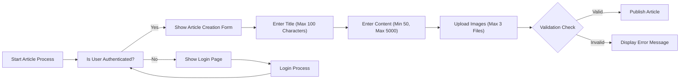
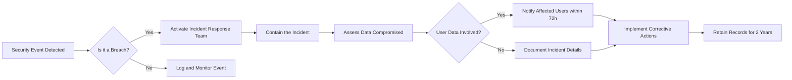

# Economic BBS Requirements Analysis Report

## 1. Service Purpose and Overview

The Economic BBS platform exists to provide a minimal, user-focused environment for economic and political discussions. This service addresses critical gaps in current online forums where overly complex interfaces, excessive moderation, and advertising overload hinder casual participation.

WHEN a user visits the homepage, THE system SHALL immediately provide access to economic and political articles without requiring registration or authentication. This low-barrier entry point is essential for attracting new users and increasing community engagement.

WHEN a user attempts to create new content without authentication, THE system SHALL display "Login required to post" and provide a clear link to the registration page.

THE system SHALL serve as a neutral space where citizens can freely exchange ideas on topics affecting their daily lives. This service exists because users have expressed frustration with existing platforms that either require extensive registration processes, have biased editorial policies, or fail to maintain community-focused discussions.

## 2. Key Features

### Article Management

WHEN a user views the homepage, THE system SHALL display a list of the latest economic and political articles in reverse chronological order. Each article shall include its title, an excerpt of up to 150 characters, and the publication date.

WHEN a member creates a new article, THE system SHALL accept a title (maximum 100 characters), content (minimum 50 characters, maximum 5000 characters), and up to three image attachments (JPEG, PNG, or GIF formats only).

WHEN a user opens an article detail page, THE system SHALL render the full content of the article while hiding the 'create article' option for guests.

WHILE a guest user accesses the system, THE system SHALL prevent them from viewing article creation forms or attempting to publish new content.

### Commenting System

WHEN a user opens an article detail page, THE system SHALL display all comments associated with that article in chronological order (newest comments first).

WHEN a member posts a comment, THE system SHALL accept text input (maximum 500 characters) and allow up to one image attachment per comment (JPEG, PNG formats only).

WHILE a comment is being displayed, THE system SHALL show the username of the member who posted it, along with the timestamp indicating when the comment was created.

THE system SHALL immediately process all new comments without moderation, as long as the content does not trigger predefined hate speech detection rules.

### Attachment Handling

WHERE an article supports attachments, THE system SHALL accept image files up to 5MB in size each.

WHERE a comment supports attachments, THE system SHALL accept image files up to 2MB in size each.

WHEN a user uploads a file, THE system SHALL only accept approved image formats (JPEG, PNG, GIF) and SHALL reject all other file types (PDF, DOCX, ZIP, etc.) immediately upon upload.

THE system SHALL automatically resize uploaded images to a maximum width of 1920 pixels while maintaining aspect ratio, to optimize display across devices.

### User Accounts

THE system SHALL allow users to create a member account using a valid email address and password.

WHEN a user registers, THE system SHALL require email verification through a link sent to the provided address before allowing posting or commenting.

WHEN a member logs in, THE system SHALL maintain their session for 30 days of inactivity before requiring re-authentication.

WHEN a member edits their own article within 24 hours of creation, THE system SHALL update the article content and SHALL update the 'last modified' timestamp.

## 3. User Actors and Capabilities

### Guest Actor Specifications

Guests are unauthenticated users who can view and read all public articles and comments but cannot create or edit content.

#### Guest Capabilities

- Guests can browse and read articles in the public feed
- Guests can view all article details including text content
- Guests can see article comments and their content
- Guests can view article metadata such as publication date and author
- Guests can view basic article statistics (e.g., comment count)

#### Guest Limitations

- Guests cannot create new articles
- Guests cannot post comments
- Guests cannot edit or delete any content
- Guests cannot upload files or images
- Guests cannot view personal information of other users
- Guests cannot access system administration or moderation features

### Member Actor Specifications

Members are authenticated users who have registered with a unique email address and password. Members are the primary creators of content and engage with the system through article creation and commenting.

#### Member Capabilities

- Members can create new articles on economic or political topics
- Members can write comments on articles and engage in discussions
- Members can edit their own posts within a 24-hour window of publication
- Members can delete their own posts without restriction
- Members can attach images to their content for visual support of their arguments
- Members can view their own published content history
- Members can log out to terminate their session
- Members can receive notifications of replies to their comments

#### Member Limitations

- Members cannot edit other users' content
- Members cannot delete other users' comments or articles
- Members cannot moderate or approve content from other users
- Members cannot change article publication dates or access other users' personal data
- Members cannot access system administration or moderation functionality
- Members cannot upload files other than images (JPEG, PNG, GIF)

### Permission Matrix

| Action | Guest | Member |
|--------|-------|--------|
| View public articles | ✅ | ✅ |
| View article details (text and comments) | ✅ | ✅ |
| View article metadata (author, date, comment count) | ✅ | ✅ |
| Create new article | ❌ | ✅ |
| Edit own articles | ❌ | ✅ (within 24 hours window) |
| Delete own articles | ❌ | ✅ (immediately) |
| Create comments on articles | ❌ | ✅ |
| Edit own comments | ❌ | ✅ (within 24 hours window) |
| Delete own comments | ❌ | ✅ (immediately) |
| Add image attachments to articles | ❌ | ✅ (up to 3 images) |
| Add image attachments to comments | ❌ | ✅ (one image per comment) |
| Edit other users' content | ❌ | ❌ |
| Delete other users' content | ❌ | ❌ |
| Access moderation tools | ❌ | ❌ |
| View personal information of other users | ❌ | ❌ |
| Access admin features | ❌ | ❌ |
| Login functionality | ❌ | ✅ (as required for member actions) |
| Logout functionality | ❌ | ✅ (when logged in) |

## 4. Business Rules and Constraints

### Content Validation Rules

WHEN a member submits an article title, THE system SHALL validate it contains between 5 and 200 characters.
IF the title is shorter than 5 characters, THE system SHALL reject the submission and return: "Title must be at least 5 characters long."
WHEN the title exceeds 200 characters, THE system SHALL reject it and return: "Title must be under 200 characters."

WHEN a member submits article content, THE system SHALL ensure it contains a minimum of 20 characters and maximum of 10,000 characters.
IF the content is less than 20 characters, THE system SHALL return: "Content must be at least 20 characters long."
WHEN content exceeds 10,000 characters, THE system SHALL return: "Content must be under 10,000 characters."

WHEN an article contains hate speech, personal attacks, or misinformation, THE system SHALL reject the submission.
THE system SHALL block articles containing any of these keywords: 'hate', 'racism', 'sexism', 'bullying', 'assault', 'violence', 'terrorism', 'weapons', 'insult', or 'threat'.
IF prohibited content is detected during validation, THE system SHALL return: "Your submission contains prohibited content. Please revise and try again."

### Attachment Size Limits

WHEN a member uploads an image attachment for an article, THE system SHALL only accept files with these extensions: .jpg, .jpeg, .png, .gif.
IF a non-image file is uploaded (e.g., .pdf, .docx), THE system SHALL reject it immediately and display: "Unsupported file type. Only image files (JPG, PNG, GIF) are allowed."

WHEN uploading an image file, THE system SHALL ensure it does not exceed 5 MB in size.
IF the file size is larger than 5 MB, THE system SHALL reject it and show: "File size must be under 5MB."
WHILE uploading multiple files, THE system SHALL only permit one image attachment per article.

### Post Editing Restrictions

WHEN a member creates an article, THE system SHALL start a 24-hour editing window from the time of publication.
WHILE within this 24-hour window, THE member SHALL be permitted to edit both title and content of their article.
AFTER the 24-hour period expires, THE system SHALL block all edit attempts and return: "Editing is no longer allowed. This article can only be edited within 24 hours of creation."

## 5. Business Model and Growth Strategy

### Revenue Model

The Economic BBS platform will generate revenue through two sustainable streams: targeted advertising and premium membership tiers.

**Advertising Revenue**

The platform will display non-intrusive advertisements from relevant businesses such as financial news services, book publishers, and educational institutions. Advertisements will be limited to one static banner at the top of the page and one sidebar ad on article pages. The system SHALL support automated ad placement through Google AdSense to ensure relevant ads without manual curation. Additionally, the platform SHALL pursue direct ad sales to businesses aligned with the platform's audience.

**Premium Membership Tiers**

When the platform reaches 5,000 active users, a premium membership tier will be introduced. The basic tier will cost $4.99 per month and remove all advertisements. The advanced tier at $9.99 per month will include additional features such as the ability to create private discussion groups for up to 50 members, access to monthly expert Q&A sessions, and ad-free article reading.

### Cost Structure

**Hosting and Infrastructure**

The system SHALL be deployed on a cloud infrastructure provider (e.g., DigitalOcean or AWS) using a shared server instance with 1GB RAM and 25GB storage. Initial hosting costs SHALL be $5 per month.

**Domain Registration**

The domain name "economicbbs.com" SHALL be registered annually at a cost of $12.00. The system SHALL automatically renew the domain to prevent service disruption.

**Image Storage**

User-uploaded images SHALL be stored in a cloud storage service. The first 100GB of storage SHALL be free for the first year. Beyond that, costs SHALL be $0.023 per GB per month. A backup system SHALL maintain a second copy of all uploaded content, increasing storage costs by 50%.

### Growth Strategy

The growth strategy for Economic BBS is centered on organic community building and strategic partnerships.

**Content-Driven Growth**

The system SHALL encourage users to share interesting articles and comments on social media platforms like Twitter and LinkedIn. WHEN a user shares an article, THE system SHALL generate a custom link that includes a content snippet and attribution. This strategy SHALL drive traffic back to the platform and increase engagement.

**SEO Optimization**

The platform SHALL optimize all articles for search engines by using relevant keywords in headers and meta descriptions. The system SHALL target long-tail keywords in the economic and political niche to attract organic traffic.

**Partnerships**

The system SHALL seek partnerships with university economics departments and think tanks to host moderated discussions. WHEN a partnership is formed, THE platform SHALL create dedicated discussion areas for the partner's topics and promote them through the partner's channels.

## 6. Current Challenges and User Pain Points

### Current Challenges

Current platforms for economic and political discussion face significant challenges that hinder meaningful engagement. 

1. **Advertising Overload**: Platforms such as Reddit, Twitter (now X), and others bombard users with advertisements and sponsored content. For instance, a single page of news or discussion may contain 8-12 ad units, including intrusive video ads, interstitials, and native advertisements that mimic organic content.

2. **Noise and Misinformation**: Without dedicated moderation for economic and political topics, current platforms are flooded with low-quality content, clickbait, and deliberate misinformation. For example, on Twitter, a single trending topic can have over 50% of contributions from accounts that are not credible experts but rather bots or accounts spreading propaganda.

3. **Fragmented Communities**: Economic discussions are scattered across multiple platforms without a unified space. A user might find economic analysis on a dedicated subreddit, political commentary on Twitter, and news on news websites.

4. **Lack of Media Support**: Current platforms often have limitations on attaching supporting data. For instance, Twitter restricts images to 4 per tweet, and YouTube requires separate video uploads for data visualizations.

5. **Poor Content Discovery**: Algorithms prioritize engagement over quality, pushing sensational content over nuanced analysis. Well-researched economic articles get buried under viral posts.

### User Pain Points

#### For Guests (Unauthenticated Users)
- Guests cannot post articles or comments on any platform that requires registration, forcing them to share insights on social media where their thoughts get buried in noise.
- On platforms that allow guest posting, they often encounter CAPTCHAs that are difficult and then face long moderation delays for their one-off contribution.

#### For Members (Authenticated Users)
- Members who want to share detailed economic analysis are frustrated by having to switch between apps to attach data visualizations.
- Members report that the algorithms of current platforms actively work against their goals. When they post a well-researched article, the platform shows it to a small number of people because it's not "engaging" enough to the algorithm.
- Members want to have meaningful debates without encountering personal attacks.
- Members want to read about topics like "inflation" but current platforms mix in unrelated political debates and non-economic news.
- When members try to share a data chart as an image, the platform compresses it so much that the text on the chart becomes unreadable.

## 7. Primary User Scenarios

### Reading Articles

**WHEN a guest accesses the homepage**, THE system SHALL display a list of the most recent 20 articles in chronological order, newest first.

**WHEN a guest selects an article to read**, THE system SHALL display the full article content and any attached images. The article title and content must be clearly displayed.

**WHEN a guest visits a specific article page**, THE system SHALL show:
- Article title (max 100 characters)
- Publication date (in ISO format)
- Article content (max 10,000 characters)
- Up to 2 attached images (with caption below each)
- No comment section

### Creating New Article

**WHEN a member navigates to the 'New Article' page**, THE system SHALL display a form with fields for title and content (a text area). The form SHALL include an option to attach one image file.

**WHEN a member submits an article**, THE system SHALL validate:
- The title is not empty and does not exceed 100 characters
- The content is not empty and does not exceed 10,000 characters
- The attached file is of an acceptable image type (only .jpg, .jpeg, or .png)
- The file size does not exceed 5MB

**WHEN all validations pass**, THE system SHALL save the article and the image attachment in a secure storage system. The member SHALL be redirected to the article's read page.

### Commenting on an Article

**WHEN a member is viewing an article**, THE system SHALL display a comment section below the article content. The comment section SHALL include:
- 'Add a comment' heading
- Text input field for comment content
- 'Attach image' option
- 'Post comment' button

**WHEN a member submits a comment**, THE system SHALL validate:
- The comment text is not empty and does not exceed 500 characters
- The attached image file (if any) is of an acceptable image type (.jpg, .jpeg, .png)
- The attached image file size does not exceed 5MB

**WHEN the comment passes validation**, THE system SHALL attach the image to the comment and save it. The new comment SHALL appear immediately in the comment section below the article.

### Editing Own Posts

**WHEN a member is viewing their own article or comment**, THE system SHALL display an 'Edit' button if the post is within 24 hours of creation.

**WHEN a member edits a comment**, THE system SHALL display the current comment text in an editable field with same validation rules as initial comment creation.

**WHEN a member submits the edited article**, THE system SHALL:
- Apply all new content and image attachment (if changed)
- Preserve the original publication timestamp
- Update the 'last edited' field to current timestamp
- Show confirmation message: 'Article updated successfully'

## 8. Secondary User Scenarios

### File Upload and Management

The Economic BBS system is designed around extreme simplicity for content creation. As part of this minimal design philosophy, articles are permitted to include exactly one image attachment only.

WHEN a member user initiates article creation, THE system SHALL provide a single file upload interface. THE system SHALL strictly limit this interface to accept only one file selection at a time. ANY attempt to select multiple files will result in immediate rejection before upload begins.

WHEN a file is selected for upload during article creation, THE system SHALL validate the file extension against the approved image format list. Only the following extensions are permitted:
- .jpg
- .jpeg
- .png
- .gif

IF any file extension does not match one of these approved types, THEN THE system SHALL display a clear, actionable error message: "Invalid file type. Only JPG, JPEG, PNG, or GIF image files are permitted for article attachments."

WHEN the file passes extension validation, THE system SHALL check whether any image has already been attached to this article. IF an image already exists for this article, THEN THE system SHALL display an error message: "Only one image attachment is permitted per article. Please remove the existing attachment before adding another."

### Media Processing Requirements

This system adopts a "no-processing" approach to image handling to maintain simplicity and security. No modifications to uploaded images occur at any stage of the system workflow.

WHILE the upload process is occurring, THE system SHALL NOT resize, compress, or modify any aspect of the image data. THE system SHALL not alter EXIF metadata, color spaces, or any embedded content within the image file.

WHEN images are stored in the system, THE system SHALL preserve the original file exactly as received from the uploader. No transcoding or format conversion will be performed during storage.

WHEN images are served to end-users, THE system SHALL deliver the exact original file without modification. THE system SHALL not generate thumbnails, apply filters, or adjust quality settings during delivery.

### Anonymous Posting and Privilege Restrictions

The Economic BBS system does not support anonymous posting under any circumstances. All content creation and modification require authenticated user accounts.

WHEN any user attempts to create a new article without authentication, THE system SHALL immediately block the request and return: "Authentication required. Please sign in or register to create new articles."

WHEN any user attempts to submit a new comment without authentication, THE system SHALL immediately block the request and return: "Authentication required. Please sign in or register to post comments."

The Economic BBS system intentionally eliminates all role-based permissions beyond the basic guest/member distinction. Every authenticated user receives identical capabilities with no special privileges.

WHEN a member attempts to edit another member's article, THE system SHALL reject the request with: "You do not have permission to edit this content."

WHEN a member attempts to delete another member's comment, THE system SHALL reject the request with: "You do not have permission to delete this content."

### Performance Requirements

WHEN a user loads the homepage, THE system SHALL display the first page of articles within 2 seconds.

WHEN a user loads a specific article page, THE system SHALL display the article content and images within 1.5 seconds.

WHEN a user uploads an image for an article or comment, THE system SHALL provide real-time progress feedback during the upload process and complete upload within 10 seconds for 5MB files.

WHEN a user submits an article or comment, THE system SHALL confirm the submission within 2 seconds.

WHEN a user searches for keywords, THE system SHALL return results within 1 second for common queries (up to 20 results).

### Security Compliance

WHEN user data is stored at rest, THE system SHALL encrypt all personal information using AES-256 encryption standards.
WHEN data is transmitted between client and server, THE system SHALL enforce HTTPS with TLS 1.2 or higher protocols to prevent interception.
THE system SHALL implement secure password storage by hashing passwords with bcrypt and a cost factor of at least 12.

WHEN a security breach affects user data, THE system SHALL activate the incident response team immediately.
THE system SHALL identify the scope and impact of the breach within 24 hours of detection.
IF user data is compromised, THE system SHALL notify all affected users within 72 hours of confirming the breach.

