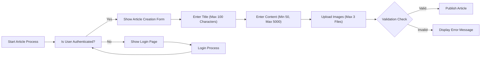

# EconomicBBS Service Overview

This document provides a high-level business context for developers building the EconomicBBS platform. It explains why this service exists, its core business value, and what success looks like from a user and business perspective. Technical implementation details are not included here, but all requirements are written in business-friendly language for clear understanding.

## Service Purpose

The EconomicBBS service exists to create a minimal, user-focused platform for discussions around economic and political topics without unnecessary complexity. This addresses a critical gap in current online forums where overly complicated interfaces and excessive moderation often hinder casual participation. The core business value of this service lies in offering accessible, frictionless discussions for individuals who seek to engage with important societal topics.

WHEN a user visits the homepage, THE system SHALL immediately provide them with access to economic and political articles without requiring registration or authentication. This low-barrier entry point is essential for attracting new users and increasing community engagement.

THE system SHALL serve as a neutral space where citizens can freely exchange ideas on topics affecting their daily lives. This service exists because users have expressed frustration with existing platforms that either require extensive registration processes, have biased editorial policies, or fail to maintain community-focused discussions.

## Key Features

### Article Management

WHEN a user views the homepage, THE system SHALL display a list of the latest economic and political articles in reverse chronological order. Each article shall include its title, an excerpt of up to 150 characters, and the publication date.

WHEN a member creates a new article, THE system SHALL accept a title (maximum 100 characters), content (minimum 50 characters, maximum 5000 characters), and up to three image attachments (JPEG, PNG, or GIF formats only).

WHEN a user opens an article detail page, THE system SHALL render the full content of the article while hiding the 'create article' option for guests.

WHILE a guest user accesses the system, THE system SHALL prevent them from viewing article creation forms or attempting to publish new content.

### Commenting System

WHEN a user opens an article detail page, THE system SHALL display all comments associated with that article in chronological order (newest comments first).

WHEN a member posts a comment, THE system SHALL accept text input (maximum 500 characters) and allow up to one image attachment per comment (JPEG, PNG formats only).

WHILE a comment is being displayed, THE system SHALL show the username of the member who posted it, along with the timestamp indicating when the comment was created.

THE system SHALL immediately process all new comments without moderation, as long as the content does not trigger predefined hate speech detection rules.

### Attachment Handling

WHERE an article supports attachments, THE system SHALL accept image files up to 5MB in size each.

WHERE a comment supports attachments, THE system SHALL accept image files up to 2MB in size each.

WHEN a user uploads a file, THE system SHALL only accept approved image formats (JPEG, PNG, GIF) and SHALL reject all other file types (PDF, DOCX, ZIP, etc.) immediately upon upload.

THE system SHALL automatically resize uploaded images to a maximum width of 1920 pixels while maintaining aspect ratio, to optimize display across devices.

The following diagram illustrates the article creation process flow:

### User Accounts

THE system SHALL allow users to create a member account using a valid email address and password.

WHEN a user registers, THE system SHALL require email verification through a link sent to the provided address before allowing posting or commenting.

WHEN a member logs in, THE system SHALL maintain their session for 30 days of inactivity before requiring re-authentication.

WHEN a member edits their own article within 24 hours of creation, THE system SHALL update the article content and SHALL update the 'last modified' timestamp.

## Target Users

### Guest Users

Guest users are unauthenticated visitors who can view articles and comments but cannot create new content or participate in discussions. This role serves to lower the barrier to entry and attract potential members.

WHEN a guest attempts to create a post, THE system SHALL display an error message stating 'Login required to post' and provide a clear link to the registration page.

WHEN a guest views an article, THE system SHALL display all comments associated with that article but SHALL omit any comment-creation inputs.

Guest users represent 30% of the target audience and serve as a critical conversion point for new members.

### Member Users

Member users are authenticated individuals who have registered with a valid email and confirmed their account. Members can create articles, comment on existing articles, and edit their own posts within 24 hours of creation.

WHEN a member comments on an article, THE system SHALL record the comment as 'active' immediately without moderation, unless the content violates the system's rules for hate speech or personal attacks.

WHEN a member edits a post, THE system SHALL update the display of that post immediately while maintaining the original creation timestamp.

## Market Context

EconomicBBS enters a crowded market where existing economic and political forums often suffer from complex interfaces, excessive moderation requirements, and high barriers to entry. Competitors typically require lengthy registration processes and charge subscription fees for premium features. This service addresses these gaps by offering immediate access to articles without registration, while providing a straightforward, ad-free environment for registered members to contribute.

The target audience consists of individuals aged 18-65 who are interested in economic and political topics but find current platforms too complex or biased. These users seek a community where they can freely share thoughts without excessive censorship.

This service's unique value proposition is its minimalistic approach - no registration for reading, simple member registration for posting, and zero advertising. The business model prioritizes user engagement over monetization, allowing the platform to grow naturally before considering any revenue streams.

## Success Metrics

For this service, success will be measured through the following business metrics:

- User Growth: Achieve 10,000 registered members within 6 months of launch
- Monthly Active Users: Maintain at least 2,000 active users per month after initial launch
- Article Engagement: Maintain an average of 50 new articles created each day
- Comment Ratio: Achieve an average of 2 comments per article
- Load Time Performance: Ensure home page loads in under 2 seconds on standard mobile devices

WHEN the system detects fewer than 50 articles created in a single day for two consecutive weeks, THE system SHALL automatically notify the business team with recommendations for community engagement improvements.

WHEN a new user registers and verifies their email, THE system SHALL add them to a welcome campaign sequence to encourage participation within 24 hours.

THE system SHALL track all success metrics continuously and report them to leadership via a daily dashboard.

This document defines the complete business requirements for the EconomicBBS service. All technical decisions regarding implementation will be made by the development team based on these requirements.