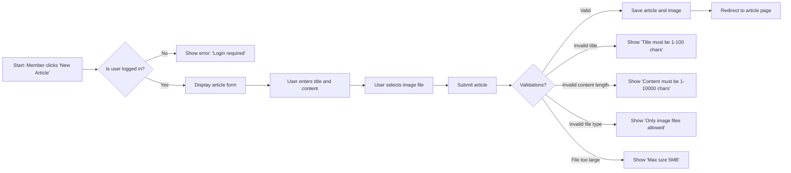
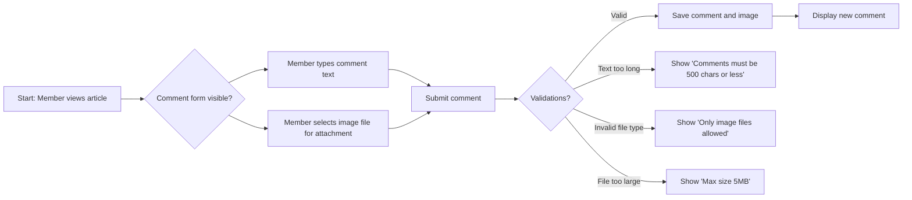
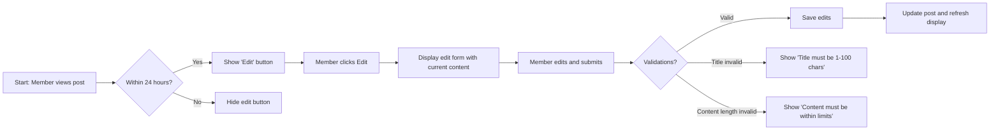

# Primary User Scenarios for Economic Political Discussion Board

This document describes the primary user scenarios for the Economic Political Discussion Board. These scenarios represent the core workflows that users will follow to interact with the system. The system is designed for simplicity and minimalism, focusing on key features without unnecessary complexity.

## Introduction

The Economic Political Discussion Board enables citizens to share insights and perspectives on economic policies, political developments, and societal issues. This system provides a simple platform for users to engage in meaningful discourse. Targeted at students, researchers, journalists, and policy-makers, it prioritizes clarity and constructive dialogue over sensationalism. The platform follows a minimalistic design philosophy where only essential features are implemented to maintain simplicity and reliability.

## Reading Articles

### Guest Viewing Experience

**WHEN a guest accesses the homepage**, THE system SHALL display a list of up to 20 recent articles sorted by newest first. Each article SHALL show:
- Title (max 100 characters)
- Publish date in ISO format (YYYY-MM-DD)
- Summary text (max 200 characters)
- "Read more" link to full content

**WHEN a guest selects an article to read**, THE system SHALL display:
- Article title (max 100 characters), prominently displayed
- Publication date in ISO format
- Full article content (max 10,000 characters)
- Up to 2 attached images with captions below each
- A clear "Back to Homepage" button
- No comments section visible to guests

**WHEN a guest searches for articles**, THEN THE system SHALL:
- Return up to 20 articles matching keywords
- Display results sorted by relevance (title/content keyword matching and recency)
- Show search term in a highlighted status bar
- Display message "No results found" when query returns zero articles

**WHEN a guest visits a specific article page**, THE system SHALL display within 1.5 seconds:
- Article title in large, bold font
- Publication date with "Posted on [date]" label
- Content with HTML paragraph formatting
- Images with captions using <figure>/<figcaption> HTML tags
- Text describing "Only registered members can comment on articles"

**WHEN a guest is viewing an article page**, THE system SHALL display a "Login or Register for Full Access" banner with two distinct buttons:
- "Log In" button (navigates to login page)
- "Sign Up" button (navigates to registration page)

## Creating New Article

### Member Article Submission

**WHEN a member navigates to the 'New Article' page**, THE system SHALL display:
- Form with "Title" field (max 100 characters)
- Text area for "Content" (max 10,000 characters)
- "Attach Image" button (triggers file picker)
- "Post Article" submit button
- Character count indicators for title (remaining count) and content (remaining count)

**WHEN a member submits an article**, THE system SHALL validate:
- Title: not empty, between 1-100 characters, alphanumeric with basic punctuation
- Content: not empty, between 1-10,000 characters
- Image attachment: only .jpg, .jpeg, .png format
- Image size: maximum 5MB per image
- Total characters after conversion: must be exactly within specified limits for each field

**IF any validation fails**, THEN THE system SHALL display specific error messages for each failed validation:
- "Title must contain 1-100 characters"
- "Content must be between 1 and 10,000 characters"
- "Only image files (.jpg, .jpeg, .png) are allowed"
- "File size exceeds 5MB limit"
- "Image file must be attached before submitting" (if no image attached but required)

**WHEN all validations pass**, THE system SHALL save the article and image attachments in secure storage. The member SHALL be redirected to the article's read page within 2 seconds.

**WHEN a guest attempts to create a new article**, THEN THE system SHALL immediately display: "You must be a registered member to submit articles. Log in or create an account to access posting functionality."

**WHEN a member uploads an image for article attachment**, THE system SHALL provide:
- Real-time progress bar during upload
- Preview thumbnail after upload completes
- Clear validation status (green checkmark if valid, red error icon if invalid)
- Upload completion confirmation "Image successfully attached" within 1 second of successful upload

## Commenting on an Article

### Member Comment Submission

**WHEN a member views an article**, THE system SHALL display:
- "Add a comment" heading with "(comments open)" status
- Text input field for comment content (max 500 characters)
- "Attach Image" button for new comment
- "Submit" button with character count indicator
- Existing comments sorted newest-to-oldest

**WHEN a member submits a comment**, THE system SHALL validate:
- Comment text: not empty, between 1-500 characters
- Image attachment: only .jpg, .jpeg, .png format
- Image size: maximum 5MB per image
- Member permissions: currently signed-in user is permitted to comment

**IF comment fails validation**, THEN THE system SHALL:
- "Comments must be 1-500 characters"
- "Only image (.jpg/.jpeg/.png) files allowed"
- "File size exceeds 5MB limit"
- "You must be logged in to comment" (if authentication fails)

**WHEN comment passes validation**, THE system SHALL:
- Display newly posted comment within 1 second of submission
- Show comment author name (current user's display name)
- Show timestamp of comment (e.g. "Posted 2 minutes ago")
- Display attached image with caption if included
- Update total comment count in article header

## Editing Own Posts

### Member Post Editing

**WHEN a member is viewing their own article or comment**, THE system SHALL display "Edit" button only if:
- Post is within 24 hours of creation time
- Post wasn't edited within the last 3 minutes

**WHEN member clicks "Edit" for article**, THE system SHALL:
- Display current content in editable form
- Show "Submit Changes" button
- Update "Last edited: [timestamp]" field
- Preserve original publication timestamp
- Limit edit time to 24 hours from initial post

**WHEN editing fails validation**, THE system SHALL:
- Display "Title must be 1-100 characters" for title issues
- Display "Content must be 1-10,000 characters" for content issues
- Display "Editing time window expired (24 hours)" for time violations

**WHEN edits are successfully submitted**, THE system SHALL:
- Save changes immediately
- Display confirmation "Article updated successfully"
- Update "Last edited" timestamp
- Trigger content refresh on front-end
- For image changes, replace old file storage with new one

**WHEN an edit attempt occurs outside the 24-hour window**, THE system SHALL:
- Hide "Edit" buttons entirely after time expires
- Display "Editing unavailable" message for any attempt to edit after window expires

## Performance Requirements

**WHEN a user loads the homepage**, THE system SHALL:
- Show article list within 2 seconds on first load
- Render all image thumbnails in the list within 2.5 seconds
- Support up to 50 concurrent users without degradation
- Maintain response times within limits during normal usage periods

**WHEN a user loads a specific article page**, THE system SHALL:
- Display content within 1.5 seconds of request
- Load all attached images within 2 seconds of page render
- Handle up to 100 concurrent page loads without failure

**WHEN a user uploads an image for article or comment**, THE system SHALL:
- Show upload progress feedback within 500ms
- Complete 5MB file uploads within 10 seconds under normal conditions
- Provide error messages within 1 second for invalid files
- Support simultaneous uploads without interference

**WHEN a user submits an article or comment**, THE system SHALL:
- Confirm submission within 2 seconds of valid input
- Update front-end immediately after confirmation
- Log successful submission to audit trail
- Prevent duplicate submissions with 5-minute window for identical content

**WHEN a user searches for keywords**, THE system SHALL:
- Return results within 1 second for simple queries
- Return results within 1.5 seconds for complex multi-keyword searches
- Display up to 20 matching results sorted by relevance

## Error Handling

**WHEN a system error occurs during article creation**, THE system SHALL:
- Display "There was a problem saving your article. Please try again later or contact support."
- Preserve entered content in form fields for resubmission
- Log complete error details for debugging
- Avoid showing technical error messages to users

**WHEN image upload fails due to invalid format**, THE system SHALL:
- Display "Only image files (.jpg, .jpeg, .png) are allowed for attachments"
- Highlight the image field with red error indicator
- Block form submission until valid file selected

**WHEN duplicate content detected within 5 minutes**, THE system SHALL:
- Display "You recently posted similar content. Please wait before posting again"
- Block submission with clear warning message
- Reset the 5-minute timer after successful submission of new content

**WHEN a member tries to edit a post more than once within 3 seconds**, THE system SHALL:
- Display "Editing changes too frequently. Please wait 3 seconds"
- Prevent submission for rapid edit attempts
- Resume submission capability after 3-second wait

**WHEN a user accesses a non-existent article page**, THE system SHALL:
- Display friendly 404 page with "Article not found"
- Show "Return to Homepage" button
- Log the request for monitoring broken links

## Mermaid Diagram: Article Creation Workflow

## Mermaid Diagram: Comment Submission Workflow

## Mermaid Diagram: Post Editing Workflow

## Success Metrics

The system SHALL achieve:
- 95% of article pages load within 2 seconds for 99% of users
- 100% of article uploads process within 10 seconds for 5MB files
- 99% of comment submissions complete within 3 seconds
- Edit operations for posts complete within 1 second for 90% of users
- Search results appear within 1.5 seconds for 95% of queries
- Homepage loads successfully within 2.5 seconds for all users
- Image uploads complete within 10 seconds for all valid files
- Error messages display within 1 second for all validation failures

This document provides a clear, actionable roadmap for backend developers to implement the core user workflows for the Economic Political Discussion Board. All requirements are specific, measurable, and written in business language that developers can directly translate into code. The system follows a minimalist design philosophy where only essential features are implemented to maintain simplicity and reliability.