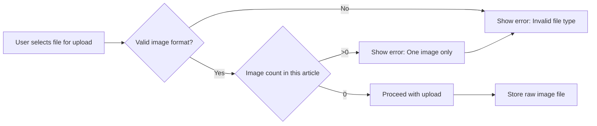

# Secondary User Scenarios for EconomicBbs Discussion Board

## File Upload and Management

The EconomicBbs system is designed around extreme simplicity for content creation. As part of this minimal design philosophy, articles are permitted to include exactly one image attachment only. This constraint eliminates complexity in storage and processing while maintaining secure content delivery.

WHEN a member user initiates article creation, THE system SHALL provide a single file upload interface. THE system SHALL strictly limit this interface to accept only one file selection at a time. ANY attempt to select multiple files will result in immediate rejection before upload begins.

WHEN a file is selected for upload during article creation, THE system SHALL validate the file extension against the approved image format list. Only the following extensions are permitted:
- .jpg
- .jpeg
- .png
- .gif

IF any file extension does not match one of these approved types, THEN THE system SHALL display a clear, actionable error message: "Invalid file type. Only JPG, JPEG, PNG, or GIF image files are permitted for article attachments."

WHEN the file passes extension validation, THE system SHALL check whether any image has already been attached to this article. IF an image already exists for this article, THEN THE system SHALL display an error message: "Only one image attachment is permitted per article. Please remove the existing attachment before adding another."

THE upload process SHALL reject all non-image file types regardless of name or content. For example:
- PDF documents will be rejected with "Invalid file type. Only JPG, JPEG, PNG, or GIF image files are permitted for article attachments."
- Microsoft Word documents will be rejected with the same message
- ZIP archives will be rejected with the same message
- EXECutable files will be rejected with the same message

WHEN the image file passes all validations, THE system SHALL store the file in the designated storage bucket using its original filename and extension. THE system SHALL NOT rename the file, modify the extension, or alter the file content in any way during storage operations.

WHEN the file size exceeds 2 MB, THE system SHALL reject the upload with a specific error message: "File exceeds maximum size limit of 2 MB. Please upload a smaller image."

The following Mermaid diagram illustrates the complete file upload validation process:

## Image Processing Requirements

This system adopts a "no-processing" approach to image handling to maintain simplicity and security. No modifications to uploaded images occur at any stage of the system workflow.

WHILE the upload process is occurring, THE system SHALL NOT resize, compress, or modify any aspect of the image data. THE system SHALL not alter EXIF metadata, color spaces, or any embedded content within the image file.

WHEN images are stored in the system, THE system SHALL preserve the original file exactly as received from the uploader. No transcoding or format conversion will be performed during storage.

WHEN images are served to end-users, THE system SHALL deliver the exact original file without modification. THE system SHALL not generate thumbnails, apply filters, or adjust quality settings during delivery.

WHEN serving images through the API, THE system SHALL return the correct file extension and MIME type matching the original upload. For example:
- .jpg files will be delivered with image/jpeg MIME type
- .png files will be delivered with image/png MIME type
- .gif files will be delivered with image/gif MIME type

This approach has several critical business benefits:
- Eliminates security vulnerabilities associated with image processing libraries
- Avoids unpredictable quality degradation from compression artifacts
- Reduces system complexity and maintenance requirements
- Ensures consistent user experience across all devices
- Minimizes storage costs by avoiding redundant processed versions

THE system SHALL not implement any image processing capabilities beyond basic transmission and storage. All image-related operations SHALL be limited to raw file transfer.

## Anonymous Posting Limitations

The EconomicBbs system does not support anonymous posting under any circumstances. All content creation and modification require authenticated user accounts.

WHEN any user attempts to create a new article without authentication, THE system SHALL immediately block the request and return: "Authentication required. Please sign in or register to create new articles."

WHEN any user attempts to submit a new comment without authentication, THE system SHALL immediately block the request and return: "Authentication required. Please sign in or register to post comments."

WHEN the system processes any HTTP request for content creation, THE system SHALL perform comprehensive authentication validation before accessing any business logic or data layers. Authentication SHALL be verified in the first tier of request processing.

FOR all content-creation endpoints, THE system SHALL return HTTP 401 Unauthorized status when authentication is missing or invalid. THE system SHALL NOT return any content-specific error messages for unauthorized requests.

WHEN a request contains an invalid authentication token, THE system SHALL reject it with HTTP 401 status without processing the request further. THE system SHALL not process any parts of the request beyond authentication validation.

WHEN a new user registration attempt occurs, THE system SHALL not store any content associated with unactivated accounts. THE system SHALL not create "draft" articles or comments for pending registrations.

This strict authentication requirement fundamentally shapes the system design:
- All articles are permanently tied to specific user accounts
- Every comment has direct attribution to a registered user
- No content exists outside the user-identity framework
- Moderation, if needed in the future, has full identification context
- Security incidents can be traced back to specific actors

The system does not maintain separate "anonymous" user roles. There is no distinction between registered users - all authenticated members have identical permissions.

## Privileged Feature Usage

The EconomicBbs system intentionally eliminates all role-based permissions beyond the basic guest/member distinction. Every authenticated user receives identical capabilities with no special privileges.

WHEN a member attempts an action outside their permission set, THE system SHALL block the request with a consistent error message. No permission distinctions exist between members regardless of activity level or account age.

WHEN a member attempts to edit their own article after publishing, THE system SHALL return the specific error message: "Editing functionality is not available. All content is permanent once published."

WHEN a member attempts to delete their own article or comment, THE system SHALL return the specific error message: "Deletion functionality is not available. All content is permanent once published."

WHILE the system is operational, THE system SHALL NOT provide "admin" or moderator functionality for any users. No special administrative controls are implemented.

THIS design decision serves critical business purposes:
- Eliminates complex permission management logic
- Prevents accidental privilege escalation during development
- Reduces potential attack vectors for account compromise
- Simplifies data storage requirements
- Ensures consistent user experience across all account types

For article creation, all members have identical capabilities:
- Can post exactly one image attachment per article
- Can write article titles and content within standard character limits
- Can comment on existing articles
- Cannot modify or delete any published content
- Cannot manage other users' content
- Cannot access administrative dashboards

All members can perform these actions equally. No member has special abilities related to:
- Content moderation
- User management
- System configuration
- Content removal
- Other members' content

When the system processes any user action, it applies the same rules to every authenticated account. This equality principle is baked into the authentication middleware, ensuring identical processing for all members.

This minimal permission structure aligns perfectly with the project's core business values:
- Simplicity in system architecture
- Transparency in content management
- Predictability in user experience
- Security through reduced privilege surfaces
- Focus on content over platform complexity