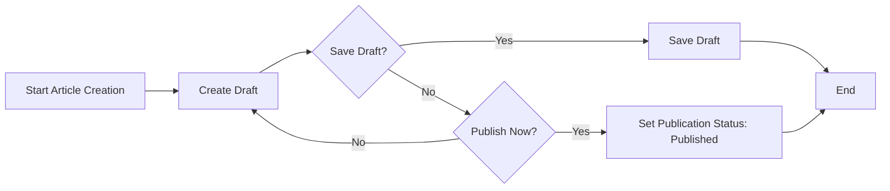

# EconomicBBS Functional Requirements

This document defines all business functions of the EconomicBBS system from a business perspective for backend developers. It specifies what the system must do, not how to implement it. All requirements are written in natural language using EARS format where applicable, and focus solely on business logic and user processes.

## Article Management

### Article Creation and Publication

WHEN a member wants to create a new article, THE system SHALL allow them to submit a title, content, and optionally attachments.

THE system SHALL automatically set the publication status to "draft" until published.

WHEN a member publishes an article, THE system SHALL set the status to "published" and make it visible to all users.

IF the article title is empty, THEN THE system SHALL display an error: "Title cannot be empty".

IF the article content is empty, THEN THE system SHALL display an error: "Content cannot be empty".

WHEN a member attempts to publish without valid content, THE system SHALL prevent publication and show an appropriate error.

### Article Reading and Listing

THE system SHALL display the latest published articles first on the main feed.

WHEN a guest (unauthenticated user) visits the main page, THE system SHALL show a list of published articles without author details (only title and excerpt).

WHEN a member visits the main page, THE system SHALL show a list of published articles including the author's username and publish date.

WHERE article tags exist, THE system SHALL allow filtering by tag.

WHEN searching for articles, THE system SHALL return results for matching titles and content within 2 seconds.

### Article Editing and Deletion

WHILE an article is in "draft" status, THE system SHALL allow the author to edit it freely.

WHEN a published article is edited, THE system SHALL set it to "pending-review" status and notify moderators.

IF the article has been published for more than 24 hours, THEN THE system SHALL prevent the author from deleting it.

WHEN a member edits their published article, THE system SHALL automatically mark it as "pending-review" until approved by a moderator.

## Commenting System

### Comment Creation

WHEN a member views an article, THE system SHALL display a comment form for submitting new comments.

GUEST actors SHALL NOT be able to see or interact with comment forms.

IF a member tries to post an empty comment, THEN THE system SHALL display an error: "Comment cannot be empty".

THE system SHALL limit comments to 500 characters.

WHEN a comment is submitted, THE system SHALL immediately display it in the article's comment section (no moderator approval needed).

### Comment Reading and Listing

THE system SHALL display all comments for an article in chronological order (oldest first).

FOR ALL users, THE system SHALL show only comments that have been successfully submitted and validated.

WHEN viewing an article, THE system SHALL display all comments made by members associated with that article.

### Comment Editing and Deletion

WHILE a comment is less than 24 hours old, THE system SHALL allow the author to edit or delete it.

AFTER 24 hours, THE system SHALL prevent the comment author from editing or deleting the comment.

WHEN a comment is edited after 24 hours, THE system SHALL display an error: "Comments cannot be edited after 24 hours".

WHEN a comment is deleted after 24 hours, THE system SHALL display an error: "Comments cannot be deleted after 24 hours".

## Attachment Handling

### Image and File Uploads for Articles

WHEN a member adds an attachment to an article, THE system SHALL accept only image files (JPEG, PNG, GIF) and PDF documents.

THE system SHALL limit the maximum file size for images to 5MB and for PDFs to 10MB.

IF an unsupported file type is uploaded, THEN THE system SHALL display an error: "Unsupported file type".

IF the file size exceeds the limit, THEN THE system SHALL display an error: "File too large".

### Attachment Validation and Processing

WHEN an attachment is uploaded, THE system SHALL store it securely on the server and associate it with the article.

THE system SHALL generate a thumbnail image for any uploaded image (maximum size 200x200 pixels).

WHEN displaying an article with attachments, THE system SHALL show thumbnails for images and icons for PDFs.

WHEN an image attachment is uploaded, THE system SHALL resize it to a maximum dimension of 2000 pixels while maintaining aspect ratio.

## User Accounts

### Registration and Authentication

WHEN a user wants to register, THE system SHALL require an email address and password.

THE system SHALL send a verification email to the user's email address after registration.

WHEN a user logs in with a valid email and password, THE system SHALL create a session and return a token.

IF the email or password is incorrect, THEN THE system SHALL display an error: "Invalid credentials".

WHEN a user clicks the verification link in their email, THE system SHALL activate their account.

### Session Management

THE user session SHALL expire after 30 days of inactivity.

WHEN a session expires, THE system SHALL automatically log out the user.

WHEN a user logs out, THE system SHALL immediately expire their session token.

### Guest and Member Permissions

GUEST actors SHALL be able to:
  - Read published articles
  - Read article comments
  - View article attachments (images and PDFs)
  - Filter articles by tags
  - Search for articles

MEMBER actors SHALL be able to:
  - Create articles (in draft or published)
  - Upload attachments to their articles
  - Comment on articles
  - Edit their own articles and comments within 24 hours
  - Delete their own articles and comments within 24 hours
  - Receive verification emails during registration

BOTH actor types SHALL NOT be able to:
  - Edit or delete articles or comments after 24 hours
  - Access moderation tools

## Navigation Controls

### Article Index Navigation

THE system SHALL display articles in pages of 20 items per page.

WHEN a user reaches the end of the current page, THE system SHALL display a "Next" button to load the next page.

WHEN a user is on the first page, THE system SHALL disable the "Previous" button.

WHEN a user is on the last page, THE system SHALL disable the "Next" button.

### Single Article Navigation

WHEN a user clicks on an article title, THE system SHALL display the full article with its comments and attachments.

WHEN viewing a single article, THE system SHALL show:
  - Article title
  - Article content
  - Published date
  - Author username
  - All comments associated with the article
  - Any attachments uploaded with the article

### Pagination and Sorting

WHEN a user requests the article index, THE system SHALL sort articles by "most recent" first by default.

WHERE a "Sort by" option exists, THE system SHALL allow users to sort by:
  - Date (newest first)
  - Date (oldest first)
  - Most comments
  - Least comments

WHEN a user applies a sort option, THE system SHALL update the article list immediately within 1 second.

## Article Publication Workflow

## Business Rule Summary

- Articles require both title AND content to be published.
- Users cannot create comments without being logged in as a member.
- Comment editing and deletion windows are strictly 24 hours from creation.
- All uploaded files must be within size limits and approved file types.
- Guest users can only view content and cannot interact with it directly.
- Members can only edit/delete their own content within the time window.
- Published articles must be reviewed before changes can be made after 24 hours.

This document provides all business requirements needed for backend development. No technical implementation details are included. Developers have full autonomy to design the technical solution based on these business rules.