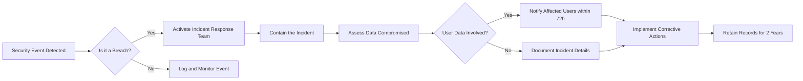

# EconomicBBS Requirements Analysis Report

## Service Overview

EconomicBBS is a straightforward economic and political discussion board designed for public discourse on economic and political topics. The system provides a minimalistic platform where users can share articles, engage in discussions via comments, and upload relevant media attachments. The focus is on clear communication rather than complex social features, with a strict focus on content quality and meaningful discussions.

## Core Value Proposition

EconomicBBS delivers an uncluttered, focused discussion platform where:
- Users can easily find and follow economic and political discussions
- Content remains the central focus without distracting features
- Users can share relevant documents and images to support their arguments
- The system is designed for ease of use with minimal technical requirements
- The platform respects user privacy with strong compliance protections
- All interactions are focused on information sharing rather than social media engagement

## Problem Definition

Current economic and political discussion platforms are overwhelming due to:
- Excessive distractions from non-relevant features
- Complex interaction patterns that frustrate users
- Poorly designed content management systems
- Inadequate privacy and data protection measures
- Overemphasis on social interaction metrics over content quality

EconomicBBS solves these problems by providing a clean, simple platform where:
- Only the essential features for discussion are included
- Content remains the primary focus rather than user interactions
- Strict validation rules ensure high-quality discussions
- The system is compliant with international privacy regulations

## User Actors & Permissions

### Guest Actor

Guest actors (unregistered users) can:
- View published articles
- View article comments
- View article attachments (images and PDFs)
- Search and filter articles by topic

Guest actors cannot:
- Create articles or comments
- Upload attachments
- Edit or delete content
- Access administration tools
- Access personal account features

### Member Actor

Member actors (registered users) can:
- Create articles (with draft and publish options)
- Upload images and PDF files to articles
- Comment on articles
- Edit and delete their own content within 24 hours
- Access their personal profile

Member actors cannot:
- Edit or delete content after 24 hours
- Access moderation tools
- Delete other users' content
- Bypass article validation requirements

## Functional Requirements

### Article Management

#### Article Creation and Publication

WHEN a member wants to create a new article, THE system SHALL allow them to submit a title, content, and optionally attachments.

THE system SHALL automatically set the publication status to "draft" until published.

WHEN a member publishes an article, THE system SHALL set the status to "published" and make it visible to all users.

IF the article title is empty, THEN THE system SHALL display an error: "Title cannot be empty".

IF the article content is empty, THEN THE system SHALL display an error: "Content cannot be empty".

WHEN a member attempts to publish without valid content, THE system SHALL prevent publication and show an appropriate error.

#### Article Reading and Listing

THE system SHALL display the latest published articles first on the main feed.

WHEN a guest (unauthenticated user) visits the main page, THE system SHALL show a list of published articles without author details (only title and excerpt).

WHEN a member visits the main page, THE system SHALL show a list of published articles including the author's username and publish date.

WHERE article tags exist, THE system SHALL allow filtering by tag.

WHEN searching for articles, THE system SHALL return results for matching titles and content within 2 seconds.

#### Article Editing and Deletion

WHILE an article is in "draft" status, THE system SHALL allow the author to edit it freely.

WHEN a published article is edited, THE system SHALL set it to "pending-review" status and notify moderators.

IF the article has been published for more than 24 hours, THEN THE system SHALL prevent the author from deleting it.

WHEN a member edits their published article, THE system SHALL automatically mark it as "pending-review" until approved by a moderator.

### Commenting System

#### Comment Creation

WHEN a member views an article, THE system SHALL display a comment form for submitting new comments.

GUEST actors SHALL NOT be able to see or interact with comment forms.

IF a member tries to post an empty comment, THEN THE system SHALL display an error: "Comment cannot be empty".

THE system SHALL limit comments to 500 characters.

WHEN a comment is submitted, THE system SHALL immediately display it in the article's comment section (no moderator approval needed).

#### Comment Reading and Listing

THE system SHALL display all comments for an article in chronological order (oldest first).

FOR ALL users, THE system SHALL show only comments that have been successfully submitted and validated.

WHEN viewing an article, THE system SHALL display all comments made by members associated with that article.

#### Comment Editing and Deletion

WHILE a comment is less than 24 hours old, THE system SHALL allow the author to edit or delete it.

AFTER 24 hours, THE system SHALL prevent the comment author from editing or deleting the comment.

WHEN a comment is edited after 24 hours, THE system SHALL display an error: "Comments cannot be edited after 24 hours".

WHEN a comment is deleted after 24 hours, THE system SHALL display an error: "Comments cannot be deleted after 24 hours".

### Attachment Handling

#### Image and File Uploads for Articles

WHEN a member adds an attachment to an article, THE system SHALL accept only image files (JPEG, PNG, GIF) and PDF documents.

THE system SHALL limit the maximum file size for images to 5MB and for PDFs to 10MB.

IF an unsupported file type is uploaded, THEN THE system SHALL display an error: "Unsupported file type".

IF the file size exceeds the limit, THEN THE system SHALL display an error: "File too large".

#### Attachment Validation and Processing

WHEN an attachment is uploaded, THE system SHALL store it securely on the server and associate it with the article.

THE system SHALL generate a thumbnail image for any uploaded image (maximum size 200x200 pixels).

WHEN displaying an article with attachments, THE system SHALL show thumbnails for images and icons for PDFs.

WHEN an image attachment is uploaded, THE system SHALL resize it to a maximum dimension of 2000 pixels while maintaining aspect ratio.

### User Accounts

#### Registration and Authentication

WHEN a user wants to register, THE system SHALL require an email address and password.

THE system SHALL send a verification email to the user's email address after registration.

WHEN a user logs in with a valid email and password, THE system SHALL create a session and return a token.

IF the email or password is incorrect, THEN THE system SHALL display an error: "Invalid credentials".

WHEN a user clicks the verification link in their email, THE system SHALL activate their account.

#### Session Management

THE user session SHALL expire after 30 days of inactivity.

WHEN a session expires, THE system SHALL automatically log out the user.

WHEN a user logs out, THE system SHALL immediately expire their session token.

#### Guest and Member Permissions

GUEST actors SHALL be able to:
- Read published articles
- Read article comments
- View article attachments (images and PDFs)
- Filter articles by tags
- Search for articles

MEMBER actors SHALL be able to:
- Create articles (in draft or published)
- Upload attachments to their articles
- Comment on articles
- Edit their own articles and comments within 24 hours
- Delete their own articles and comments within 24 hours
- Receive verification emails during registration

BOTH actor types SHALL NOT be able to:
- Edit or delete articles or comments after 24 hours
- Access moderation tools

### Navigation Controls

#### Article Index Navigation

THE system SHALL display articles in pages of 20 items per page.

WHEN a user reaches the end of the current page, THE system SHALL display a "Next" button to load the next page.

WHEN a user is on the first page, THE system SHALL disable the "Previous" button.

WHEN a user is on the last page, THE system SHALL disable the "Next" button.

#### Single Article Navigation

WHEN a user clicks on an article title, THE system SHALL display the full article with its comments and attachments.

WHEN viewing a single article, THE system SHALL show:
- Article title
- Article content
- Published date
- Author username
- All comments associated with the article
- Any attachments uploaded with the article

#### Pagination and Sorting

WHEN a user requests the article index, THE system SHALL sort articles by "most recent" first by default.

WHERE a "Sort by" option exists, THE system SHALL allow users to sort by:
- Date (newest first)
- Date (oldest first)
- Most comments
- Least comments

WHEN a user applies a sort option, THE system SHALL update the article list immediately within 1 second.

## Primary User Scenarios

### Reading Articles

WHEN a guest visits the economic discussion board,
THE system SHALL display a list of recently published articles with titles and excerpt summaries.

WHEN a guest clicks on an article title,
THE system SHALL display the full article content with attached images and PDF attachments displayed as thumbnails.

WHEN viewing a single article,
THE system SHALL display the article title, content, publication date, and author information (for members).

WHEN a guest scrolls through the article list,
THE system SHALL paginate the results in groups of 20 articles with appropriate previous/next controls.

WHEN a guest types search terms in the search bar,
THE system SHALL return results matching the search terms in titles and content within 2 seconds.

### Creating New Article

WHEN a member clicks "New Article",
THE system SHALL display an empty editor with title and content fields.

WHEN a member enters a title and content and clicks "Save Draft",
THE system SHALL save the article as "draft" status with no publication date.

WHEN a member enters a title and content and clicks "Publish",
THE system SHALL validate the content, then set the status to "published" and assign publication date.

WHEN a member tries to publish an article with empty title,
THE system SHALL show error message: "Title cannot be empty" and prevent publication.

WHEN a member tries to publish an article with empty content,
THE system SHALL show error message: "Content cannot be empty" and prevent publication.

WHEN a member uploads image attachments during article creation,
THE system SHALL verify file type and size, then display thumbnails during editing.

### Commenting on an Article

WHEN a member views an article,
THE system SHALL display a comment form below the article content.

WHEN a member types a comment and submits it,
THE system SHALL validate the comment (500 characters max), then immediately display it in the comment section.

WHEN a member tries to comment while logged out,
THE system SHALL hide the comment form and display "Please log in to comment".

WHEN a member types an empty comment, 
THE system SHALL display "Comment cannot be empty" error and prevent submission.

WHEN a member edits their own comment within 24 hours,
THE system SHALL update the comment content and timestamp with "Edited" indicator.

WHEN a member tries to edit a comment older than 24 hours,
THE system SHALL show "Comments cannot be edited after 24 hours" error.

WHEN a member deletes their own comment within 24 hours,
THE system SHALL remove it from the comment section immediately.

WHEN a member tries to delete a comment older than 24 hours,
THE system SHALL show "Comments cannot be deleted after 24 hours" error.

### Editing Own Posts

WHEN a member views their own unpublished draft article,
THE system SHALL allow full editing of title, content, and attachments.

WHEN a draft article is edited and saved, THE system SHALL update the draft immediately without publication.

WHEN a member edits a published article, THE system SHALL set the status to "pending-review".

WHEN an article has been published for more than 24 hours, THE system SHALL prevent the author from deleting it.

WHEN a member requests to delete an article published for more than 24 hours,
THE system SHALL display "Articles published longer than 24 hours cannot be deleted by authors".

WHEN a draft article has been published for less than 24 hours, THE system SHALL allow deletion before submission.

## Secondary User Scenarios

### File Upload and Management

WHEN a member uploads an image file for an article,
THE system SHALL automatically resize it to a maximum dimension of 2000 pixels.

WHEN a member uploads multiple images in one article,
THE system SHALL display each image with a thumbnail preview below the content editor.

WHEN a member uploads a PDF file for an article,
THE system SHALL display a PDF icon thumbnail rather than an image preview.

WHEN a member tries to upload a file larger than 5MB (images) or 10MB (PDF),
THE system SHALL show "File too large" error and prevent upload.

WHEN a member tries to upload a .docx file, THE system SHALL show "Unsupported file type" error.

WHEN a member uploads an image, THE system SHALL generate a 200x200 thumbnail for display during article rendering.

WHEN an image attachment is deleted, THE system SHALL remove the thumbnail and the original image from storage.

### Anonymous Posting Limitations

WHEN an unregistered visitor visits the main discussion feed,
THE system SHALL provide only read-only access without ability to interact.

WHEN a guest tries to click on "Post New Article",
THE system SHALL display "Please log in to create content".

WHEN a guest attempts to submit a comment,
THE system SHALL display "Please login to comment".

WHEN a guest tries to upload attachments,
THE system SHALL prevent attachment upload attempt and show message "Only registered users can upload files".

WHEN a guest navigates to a profile page,
THE system SHALL redirect to login page with message "You must be logged in to view profiles".

### Privileged Feature Usage

WHEN a member posts a draft article and returns later,
THE system SHALL preserve the draft until explicitly published or deleted.

WHEN a member uploads an image, THE system SHALL automatically create a 200x200 thumbnail for quick loading.

WHEN a member edits their own article after publication,
THE system SHALL set status to "pending-review" and notify moderators.

WHEN a moderator receives a pending review notification,
THE system SHALL display a clear list of articles awaiting review.

WHEN a moderator approves an edited article,
THE system SHALL update status to "published" with latest timestamp.

WHEN a moderator rejects an edited article,
THE system SHALL revert to previous published version and notify author.

## Business Rules

### Content Validation Rules

- Article titles must have at least 10 characters
- Article content must have at least 50 characters
- Comments must have at most 500 characters
- Image attachments must be under 5MB in size
- PDF attachments must be under 10MB in size
- Only JPEG, PNG, GIF, and PDF file types are allowed

### Attachment Size Limits

Images: 5MB maximum (after resizing operation)
PDFs: 10MB maximum

### User Permission Rules

- Guests can view articles and comments but cannot interact
- Members can create articles and comments but not edit others' content
- Comments can be edited by authors only for first 24 hours after creation
- Article publications can be edited by authors only for first 24 hours
- Articles published over 24 hours cannot be deleted by authors

### Post Editing Restrictions

- Published articles marked "pending-review" when edited after publication
- Draft articles can be fully edited at any time by the author
- Published articles over 24 hours old require moderator approval for changes
- Comment edits are only possible within 24 hours of creation
- Comment deletions are only possible within 24 hours of creation

## Performance Requirements

When users load the main article feed with 200 articles:
- Full page load shall complete within 2 seconds
- Pagination shall update content within 500ms

When users search for articles:
- Search results shall update within 2 seconds
- Results shall include exact matches first

When a member publishes an article:
- The article shall appear in the public feed within 300ms

When a member adds comments:
- Comments shall appear immediately after submission

Image thumbnails shall generate within 100ms after upload
PDF icons shall display for PDF attachments within 150ms

## Error Handling

### Article Publishing Errors

WHEN article title is empty,
THE system SHALL display error: "Title cannot be empty"

WHEN article content is empty,
THE system SHALL display error: "Content cannot be empty"

WHEN article exceeds character limit,
THE system SHALL display suitable error notification

### Comment Submission Errors

WHEN a comment is empty,
THE system SHALL display error: "Comment cannot be empty"

WHEN a comment exceeds character limit,
THE system SHALL display error: "Comments cannot exceed 500 characters"

### Attachment Upload Errors

WHEN a member uploads a .docx file,
THE system SHALL display error: "Unsupported file type"

WHEN an uploaded file exceeds size limit,
THE system SHALL display error: "File too large"

WHEN attachment upload fails due to server error,
THE system SHALL display: "Unable to upload attachment. Please try again."

WHEN an attachment is corrupted,
THE system SHALL display: "Unable to process attachment. File is damaged."

### Session Management Errors

WHEN a session expires during edit action,
THE system SHALL display: "Your session has expired. Please log in again."

WHEN a user tries to access unauthorized feature while logged out,
THE system SHALL display: "You must be logged in to access this feature."

WHEN authentication parameters are invalid,
THE system SHALL display: "Invalid credentials"

### System Errors

WHEN the server encounters an unexpected error,
THE system SHALL display a generic error message: "An error occurred. Please try again later."

WHEN database connectivity fails,
THE system SHALL display: "Service unavailable. Please try again later."

WHEN third-party service fails,
THE system SHALL display: "External service unavailable. Please try again later."

## Security Compliance

### Data Security Measures

WHEN user data is stored at rest, THE system SHALL encrypt all personal information using AES-256 encryption standards.
WHEN data is transmitted between client and server, THE system SHALL enforce HTTPS with TLS 1.2 or higher protocols to prevent interception.
THE system SHALL implement secure password storage by hashing passwords with bcrypt and a cost factor of at least 12.
WHERE media files (images and attachments) are uploaded, THE system SHALL ensure secure storage and encryption of all submitted files.
THE system SHALL avoid logging sensitive user data such as passwords or email addresses in application logs.
WHEN backup files are created, THE system SHALL automatically encrypt backups and restrict access to authorized personnel only.
THE system SHALL implement role-based access control to ensure only verified administrators can access sensitive data.
IF database credentials or encryption keys are used, THE system SHALL rotate them quarterly and store them in secure vault services.
WHERE users authenticate, THE system SHALL implement rate limiting to prevent brute force attacks and lock accounts after 5 failed attempts.
THE system SHALL enforce session expiration after 30 minutes of inactivity.
THE system SHALL use HttpOnly and Secure flags for session cookies.

### External Compliance Standards

THE system SHALL comply with the General Data Protection Regulation (GDPR) for users located within the European Union.
WHEN processing personal data of EU citizens, THE system SHALL collect explicit, informed consent prior to data collection.
IF user data is subject to GDPR, THE system SHALL provide mechanisms for users to request data deletion or access.
THE system SHALL adhere to the California Consumer Privacy Act (CCPA) for residents of California, United States.
WHEN handling California user data, THE system SHALL allow users to opt-out of data sales and request data deletion.
IF third-party services process personal data, THE system SHALL confirm they have Data Processing Agreements (DPAs) in place meeting GDPR Article 28 requirements.
THE system SHALL maintain comprehensive audit logs of all access to personal data for compliance verification.
WHERE the system processes payment information, it SHALL comply with Payment Card Industry Data Security Standards (PCI DSS).
IF data crosses international borders, THE system SHALL implement appropriate safeguards per GDPR Chapter V, such as Standard Contractual Clauses.
WHERE analytics services are used, THE system SHALL anonymize IP addresses and obtain user consent.

### User Privacy Protocols

WHEN users register for an account, THE system SHALL collect only essential information (email and display name) with clear consent.
THE system SHALL provide a dedicated privacy policy page explaining data collection practices and usage.
WHEN a user requests to delete their account, THE system SHALL permanently remove all personally identifiable information within 30 days.
THE system SHALL enable users to access, modify, or delete their personal data through a self-service portal.
WHERE newsletters or marketing communications are sent, THE system SHALL provide clear opt-out instructions in every message.
THE system SHALL not retain user data longer than necessary for the original purpose it was collected.
IF a user's data is shared with third parties for legitimate business purposes, THE system SHALL anonymize non-essential information where possible.
THE system SHALL encrypt all personal data during database backups and transmission.

### Security Incident Procedures

WHEN a security breach affects user data, THE system SHALL activate the incident response team immediately.
THE system SHALL identify the scope and impact of the breach within 24 hours of detection.
IF user data is compromised, THE system SHALL notify all affected users within 72 hours of confirming the breach.
THE system SHALL provide a clear and actionable summary of the incident to affected users, including steps taken to mitigate risks.
THE system SHALL document all details of security incidents in a centralized incident log with timestamps and evidence.
WHEN a breach is resolved, THE system SHALL conduct a root cause analysis and implement corrective actions to prevent recurrence.
THE system SHALL maintain incident records for a minimum of two years from the resolution date for regulatory audit purposes.
WHEN security incidents involve data from the EU, THE system SHALL report to the relevant supervisory authority within 72 hours as required by GDPR.

### Security Incident Response Workflow

