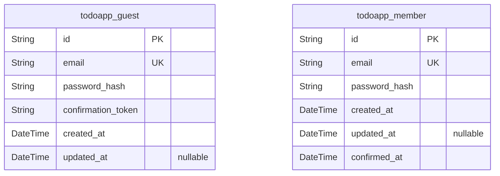
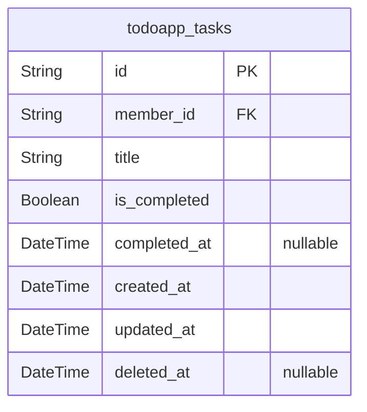

# Prisma Markdown

> Generated by [`prisma-markdown`](https://github.com/samchon/prisma-markdown)

- [Actors](#actors)
- [Todo](#todo)

## Actors

### `todoapp_guest`

Stores unconfirmed user registrations for new members. Contains temporary
account details before email verification.

This table serves the purpose of holding pending user accounts prior to
email verification. The guest table includes all necessary information to
initiate the registration process but is only transient until verified.
Once confirmation is complete, the associated data is moved to the Member
table and removed from Guest.

Fields include an email address for contact, a hashed password for
security, and a confirmation token for verification. The created_at
timestamp records the initial registration time, and updated_at tracks
modifications to the record.

Properties as follows:

- `id`: Primary Key.
- `email`: User's email for registration; must be unique across all guest accounts.
- `password_hash`
  > bcrypt hash of the password; stored securely to prevent exposure of
  > plaintext passwords.
- `confirmation_token`
  > Temporary token for email verification; expires 24 hours after creating
  > the account.
- `created_at`
  > Timestamp of when the guest account was created; used for tracking
  > registration dates.
- `updated_at`
  > Last modified time for this guest record; updates when token is refreshed
  > or data changed.

### `todoapp_member`

Stores verified user accounts that can manage tasks. This is the primary
user entity for task ownership.

This table represents the active users of the Todo List application who
have completed email verification. The Member table contains all
necessary data to manage personal tasks securely. It does not support
guest functionality but is the main user entity that owns all tasks.

Each member's account includes their email, password hash, and timestamps
for when the account was created and confirmed. The confirmed_at field
clearly marks when the user became a verified member.

Properties as follows:

- `id`: Primary Key.
- `email`: Verified user email address; must be unique among all members.
- `password_hash`
  > bcrypt hash of the password; securely stored to authenticate user login
  > without exposing plaintext passwords.
- `created_at`: Timestamp of when the member account was created; helps track account age.
- `updated_at`: Last time the member record was modified; useful for passive ID tracking.
- `confirmed_at`
  > Datetime when the email confirmation was completed; marks the transition
  > from guest to member status.

## Todo

### `todoapp_tasks`

Core task entity for the Todo application containing user tasks.

Stores individual to-do items with management capabilities like creation,
completion, and deletion.
Each task is associated with a specific member and has a unique title
within that member's scope.

Primary purpose is to store task data in a simple, performant structure
with proper historical tracking via soft deletion.

Properties as follows:

- `id`: Primary Key.
- `member_id`: The member who owns this task. [todoapp_member.id](#todoapp_member)
- `title`
  > Task title content (max 255 characters). Strictly validates input size
  > and doesn't allow empty values.
- `is_completed`
  > Binary flag indicating whether task is completed (true) or pending
  > (false). Defaults to false on creation.
- `completed_at`
  > Timestamp when task was marked as completed. Set to NULL when task is
  > uncompleted.
- `created_at`
  > Timestamp of when the task was created. Automatically assigned by
  > database on creation.
- `updated_at`
  > Timestamp of the most recent modification to the task. Updated
  > automatically on any change to task data.
- `deleted_at`
  > Timestamp when task was soft-deleted. Remains NULL for active tasks. Only
  > used for soft delete mechanism.
