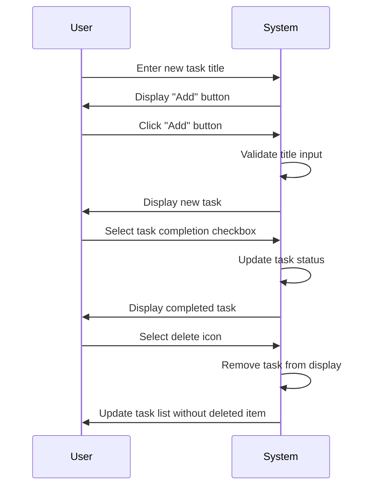

# Todo List Application Service Overview

## Introduction

This Todo List application provides a minimum viable product for personal task management. It addresses a universal need for individuals to track and organize their daily responsibilities efficiently. In today's fast-paced world, people frequently struggle to keep track of multiple tasks across different contexts, leading to missed deadlines, duplicated efforts, and decreased productivity.

The system is designed for individual use, focusing on simplicity rather than complex collaboration features. The primary value delivered is a clean, intuitive interface that lets users quickly capture tasks and track their completion status. This simple approach eliminates the unnecessary complexity found in many task management apps while delivering immediate value for personal use.

This application is purposefully limited to basic task management capabilities to ensure it remains lightweight, fast, and easy to use. By focusing on core functionality only, it delivers a superior user experience for individuals who need just a simple to-do list without overwhelming features.

## Key Features

### Task Management Capabilities

The Todo List application provides fundamental features to support personal task management:

- **Task Creation**: Users shall be able to create new tasks with a title only.
- **Task Visibility**: Users shall see all completed or uncompleted tasks in a single list.
- **Task Completion**: Users shall be able to mark tasks as completed.
- **Task Deletion**: Users shall be able to remove tasks from their list.
- **Task Restoration**: Deleted tasks shall not be recoverable once removed.
- **Data Persistence**: Completed tasks shall remain visible in the list until manually deleted.
- **Task Order**: Tasks shall be displayed in creation order with newest entries at the bottom.

### Specific Business Requirements in EARS Format

#### Task Creation Requirements

WHEN a user enters a task title, THE system SHALL create a new task with that title.

WHEN a task is created, THE system SHALL display it immediately in the task list.

WHEN a task title is empty, THE system SHALL not create the task and SHALL display a validation error message.

WHEN a task title exceeds 255 characters, THE system SHALL truncate it to 255 characters and SHALL notify the user of the trimming.

#### Task Completion Requirements

WHEN a user clicks the completion checkbox for a task, THE system SHALL mark that task as completed.

WHEN a task is marked as completed, THE system SHALL visually distinguish it from incomplete tasks.

WHEN a task is marked as completed, THE system SHALL show a timestamp of when it was completed.

WHEN a completed task is clicked again, THE system SHALL mark it as incomplete and SHALL remove its completed timestamp.

#### Task Deletion Requirements

WHEN a user selects the delete action for a task, THE system SHALL remove that task from the list.

WHEN a task is deleted, THE system SHALL immediately update the displayed task list.

WHEN a task is deleted, THE system SHALL not store the deleted task for later recovery.

#### Data Display Requirements

THE system SHALL display all uncompleted tasks with a default appearance and completed tasks with a strikethrough visual style.

THE system SHALL show a clear "No tasks" message when there are no tasks to display.

THE system SHALL maintain all task states through browser refreshes for the current user session.

## Target Audience

This Todo List application is designed for:

- **Individual users** who need a simple, minimal interface for personal task management
- **Non-technical individuals** who want a straightforward approach to organizing daily responsibilities
- **Users who need a quick solution** without complex setup or collaboration features
- **People who prefer lightweight applications** over feature-rich but complex competitors
- **Casual users** who complete tasks sporadically rather than regularly scheduling their work

The application is NOT designed for:
- Teams needing shared task lists or collaborative workflows
- Project management professionals needing advanced scheduling tools
- Users requiring detailed task priorities or complex dependencies
- Professionals needing task categorization beyond simple completion status

The target user persona is best described as someone who typically uses paper sticky notes or a basic notes app for task management but wants a digital solution for easier access and organization. This user values simplicity and speed over complexity, and doesn't need extensive features.

## Business Objectives

### Core Business Goals

The primary business objective of this Todo List application is to deliver a minimal, reliable task tracking solution that solves the immediate pain point of managing personal tasks without unnecessary complexity. This product will succeed by being exceptionally focused on a single core capability with a flawless implementation rather than attempting to be "everything for everyone."

### Specific Success Metrics

WHEN a user performs task creation, THE system SHALL complete the operation within 500 milliseconds.

WHEN a user views their task list, THE system SHALL display results within 1 second for lists with up to 500 tasks.

WHEN a user marks a task as completed, THE system SHALL provide immediate visual confirmation.

WHEN a user deletes a task, THE system SHALL ensure the deletion is complete before responding.

THE system SHALL store all task data locally without server storage for user privacy.

### Competitive Advantage Strategy

The application's competitive advantage derives from its extreme simplicity and reliability. Unlike feature-heavy task management tools that overwhelm users with unnecessary complexity, this application:

- Contains exactly the functionality needed to manage personal tasks
- Operates completely offline without requiring internet connectivity
- Has no complicated signup process or account requirements
- Shows the task list instantly with no loading screens
- Provides instant feedback for all user actions

WHEN a user wants to add a task, THE system SHALL require ZERO additional steps beyond typing the task title.

WHEN a user wants to complete a task, THE system SHALL require ONLY one click to mark it as done.

WHEN a user wants to delete a task, THE system SHALL require only one click to remove it completely.

### Security and Privacy

THE system SHALL store all task data locally on the user's device without transmission to any server.

THE system SHALL not collect any user data beyond what is necessary for task management functionality.

WHEN a user deletes a task, THE system SHALL immediately remove its data from local storage.

THE system SHALL not require user authentication or account creation.

WHEN a user closes the browser window, THE system SHALL preserve the task data until the user explicitly deletes it.

## System Architecture Overview

The following sequence diagram shows the fundamental interaction flows in the Todo List application, focusing on user actions and immediate system responses. This diagram focuses on business process flows rather than technical implementation details.

### Core Workflow Requirements

The above sequence diagram represents the primary user workflow:

WHEN a user inputs a new task, THE system SHALL validate the input and immediately display it in the task list.

WHEN a user selects a completed checkbox, THE system SHALL update the task status and visually indicate the completion.

WHEN a user selects the delete action for a task, THE system SHALL immediately remove it from the display.

WHEN a user refreshes the browser, THE system SHALL repopulate the task list exactly as it was before the refresh.

## Business Rules for Task Management

All tasks created in this system shall follow these business rules:

- Task titles shall be stored exactly as entered (with 255 character maximum).
- Only one task can exist with any given title for a specific user.
- Task completion status is binary (complete or incomplete) with no additional states.
- Once created, task titles cannot be edited.
- Deleted tasks cannot be recovered.
- The application shall not maintain any historical record of task edits.

## Performance Expectations

The application shall meet user experience performance expectations as follows:

WHEN a user creates a task, THE system SHALL complete the operation within 200 milliseconds.

WHEN a user loads the application, THE system SHALL display the task list within 300 milliseconds.

WHEN a user marks a task as completed, THE system SHALL update the visual state within 100 milliseconds.

WHEN a user deletes a task, THE system SHALL complete the deletion within 100 milliseconds.

THE system SHALL maintain consistent performance even with 500 active tasks.

All user interactions shall feel "instant" to the user and SHALL not require waiting for loading indicators.

## User Authentication Requirements

This simple Todo List application requires only two user actor types with strictly defined permissions:

### Guest Actor

- Guest actors are unauthenticated users who can use the application without signing up.
- Guest actors shall have access to create, view, and manage a personal set of tasks.
- Guest actors' task data shall be stored locally in the browser only.
- Guest actors shall not share tasks with any other users.
- Guest actors shall not need account creation or verification.

### Member Actor

- The "member" actor is functionally identical to the "guest" actor with the same capabilities.
- In this application, ALL users are treated equally with identical capabilities.
- Member actors can use the application with the same functionality as guests.
- Member actors are merely guests who have chosen to create an account for persistence across devices.
- The system shall not differentiate between guest and member actors in the current implementation.

> *Developer Note: This document defines **business requirements only**. All technical implementations (architecture, APIs, database design, etc.) are at the discretion of the development team.*