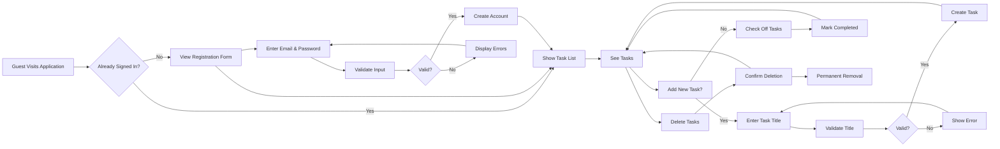

# Todo List Application - Business Requirements Analysis

## Business Model

### Why This Service Exists
The Todo list application exists to solve the universal challenge of managing daily tasks efficiently. In today's fast-paced world, people frequently forget important tasks, struggle to organize their responsibilities, and need a simple way to track what needs to be done. Existing solutions often require complex setups, unnecessary features, or paid subscriptions. This application addresses these challenges by providing a minimal, user-friendly task management system that anyone can use immediately without technical expertise.

### Revenue Strategy
The application will initially be offered as a free service with optional premium features for power users. The core focus is on building a large user base first, then introducing value-added services such as team collaboration features, advanced organization tools, and calendar integrations. This approach allows the service to grow organically while validating market demand for expanded functionality.

### Growth Plan
The application will acquire users through word-of-mouth recommendations and social media sharing of productivity tips. The focus will be on providing a superior user experience that encourages users to share their positive experiences with others. Early adopters will be encouraged to invite colleagues and friends, and referral rewards will be used to accelerate growth. The goal is to reach 10,000 active users within the first six months of launch.

### Success Metrics
- Daily Active Users (DAU): 1,000+ within six months
- Monthly Active Users (MAU): 5,000+ within six months
- Task Creation Rate: Average of 5 tasks per user per day
- Retention Rate: 70% of users return within 30 days
- Feedback Rate: 90% of users rate the experience "easy" or "very easy" on initial usage

## User Actors and Authentication Requirements

### Guest Actors
Guests are unauthenticated users who can register for an account but cannot access any tasks or functionality. The business purpose of guests is to serve as a pathway to becoming a full member. Guests cannot see, create, or manage tasks. They can:

- View simple landing page information about the application
- Register for a new account
- Log in to create an account

### Member Actors
Members are authenticated users who own and manage their own tasks. Members can create, view, edit, and delete tasks on their own account. Members cannot see other users' tasks or modify tasks created by other users. Members can:

- Create new task items with simple titles
- Mark tasks as completed
- Delete tasks
- View their complete list of tasks

The system distinguishes between guests and members through a simple authentication flow that ensures only members can access task management functionality. Task ownership is strictly separated by user account.

## Core Functional Requirements

### Task Creation
WHEN a member wants to create a new task, THE system SHALL display a simple input field where the member may type the task title. THE system SHALL accept task titles up to 255 characters in length. IF a title is empty or contains only spaces, THEN THE system SHALL show an error message that says "Please enter a task description" and not save the task.

### Task Completion
WHEN a member views their task list, THE system SHALL display a checkbox next to each task. WHEN a member checks the checkbox for a task, THE system SHALL mark that task as completed and visually indicate it as completed (typically with strikethrough text).

### Task Deletion
WHEN a member views their task list, THE system SHALL display a delete button next to each task. WHEN a member clicks the delete button, THE system SHALL permanently remove that task from the list and not preserve it for recovery.

### Task List Display
WHEN a member views their task list, THE system SHALL display all tasks in reverse chronological order, with the most recently created task at the top. THE system SHALL display both completed and incomplete tasks simultaneously, each with clear visual indicators of their status.

### Account Registration
WHEN a guest wants to create an account, THE system SHALL display a registration form with email and password fields. WHILe the guest is entering information, THE system SHALL validate the email format and password strength requirements. IF the email is invalid or the password is too weak, THEN THE system SHALL show error messages specific to each issue. WHEN the guest submits the registration information and all validations pass, THEN THE system SHALL create a new member account with that information.

### Account Login
WHEN a member wants to access their account, THE system SHALL display a login form with email and password fields. WHEN the member provides correct credentials, THE system SHALL authenticate the member and grant access to their account. WHEN authentication fails for any reason (invalid email, wrong password), THEN THE system SHALL show a message "Invalid email or password".

### Task Editing
WHEN a member wants to edit an existing task, THE system SHALL display the task details in an editable form. WHEN the member makes changes to the task title and clicks save, THE system SHALL update the task with the new title. IF the updated title is empty or contains only spaces, THEN THE system SHALL show an error message and keep the original title.

## User Workflows

### Creating a New Task
1. A member logs into their account
2. The member sees a page with a list of tasks and a "New Task" input field
3. The member types a task description (e.g., "Buy groceries")
4. The member presses Enter or clicks a "Create" button
5. The system displays the new task in the list immediately

### Completing a Task
1. A member views their task list
2. The member sees a checkbox next to each task
3. The member checks the checkbox for the task they want to complete
4. The system immediately marks the task as completed with visual indication
5. The completed task remains visible but is clearly differentiated from incomplete tasks

### Deleting a Task
1. A member views the task list containing a task they want to remove
2. The member locates the task's delete button (typically an "X" icon)
3. The member clicks the delete button
4. The system immediately removes the task from the list
5. The task cannot be recovered

### Logging In
1. A member navigates to the application
2. The member sees a login form with email and password fields
3. The member enters their registered email and password
4. The system validates the credentials
5. If valid, the member is taken to their personal task list
6. If invalid, the system displays an error message

### User Account Creation
1. A guest navigates to the application
2. The guest sees a "Sign Up" option instead of a login form
3. The guest enters an email address and password
4. The system validates:
   - Email format is correct
   - Password has sufficient length
5. If validations pass, the account is created
6. If validations fail, specific error messages guide the guest

## Performance Expectations

### Task Loading Performance
WHEN a member logs in or views their task list, THE system SHALL load tasks within 1.5 seconds for normal usage conditions. WHEN a member has 100+ tasks, THE system SHALL still load tasks in under 2 seconds. THE system SHALL display "loading" indicators while tasks are being retrieved.

### Response Time for Operations
WHEN a member performs standard operations like creating, completing, or deleting tasks, THE system SHALL complete the action and update the UI within 1 second. THIS includes showing visual feedback that the action was successful.

### User Experience Performance
THE task list SHALL be interactive and responsive at all times. USERS SHALL feel that the interface is "instant" when performing common operations like checking off a task.

## Business Rules

### Task Ownership Rules
THE system SHALL enforce strict task ownership where each task is associated with only one user account. WHERE a task is created by a member, THE system SHALL NOT allow any other user to view, modify, or delete that task. IF a user attempts to perform an action on a task they don't own, THEN THE system SHALL prevent the action and display an appropriate message.

### Task Title Rules
THE task title SHALL be required for any task to be created or saved. WHERE a task title has fewer than 1 character or contains only whitespace characters, THE system SHALL NOT save the task and SHALL notify the user that an empty title is not permitted.

### Completion Status Rules
WHEN a task is marked as completed, THE system SHALL maintain that status until it is explicitly marked incomplete again. THE system SHALL allow tasks to be completed and uncompleted as many times as necessary.

### Deletion Rule
WHEN a task is deleted, THE system SHALL permanently remove it from the database with no recovery option. THIS is considered a final action that cannot be undone.

### Account Creation Rules
WHEN a user attempts to register using an email address that already exists in the system, THE system SHALL prevent registration and display an error message that says "An account already exists for this email address". WHERE authentication has not been completed, THE system SHALL NOT create a new user profile.

### Session Management Rules
WHILE a user is authenticated, THE system SHALL maintain their session until explicitly signed out. IF a session expires due to inactivity, THE system SHALL require the user to re-authenticate to access task data.

## Error Handling Scenarios

### Invalid Task Title
WHEN a user tries to create a task with an empty title, THEN THE system SHALL display a clear error message "Please enter a task description", and the task SHALL NOT be created. THE user SHALL see input field remain focused with the error text visible.

### Duplicate Registration
WHEN a user attempts to create a new account using an email address that already exists in the system, THEN THE system SHALL display an error message "An account already exists for this email address". THE system SHALL NOT create a new account and SHALL preserve the registration form with error messages highlighted.

### Invalid Authentication
WHEN a user enters incorrect credentials during login, THEN THE system SHALL display an error message "Invalid email or password", and SHALL NOT grant access to the account. THE system SHALL maintain the login form to allow for re-attempt.

### Network Failure During Save
WHEN a network failure prevents the system from saving task changes, THEN THE system SHALL display a "Network error" message and SHALL maintain the current state of the task. THE system SHALL also provide retry functionality for the operation.

## System Boundaries

### What's Included (In-Scope)
- Task creation with simple titles
- Task completion tracking
- Task deletion
- User account registration
- User authentication
- Personal task organization (only user's own tasks)

### What's Excluded (Out-of-Scope)
- Task categories or tags
- Task due dates, priorities, or descriptions beyond titles
- Shared tasks or collaborative features
- Notifications or reminders
- Mobile application development (this is a web application only)
- Admin controls or user management
- Payment processing or subscription management

## System Operation

Below is a Mermaid diagram showing the high-level user workflow for the Todo List application from account creation through task management:

This diagram represents the primary user journey from guest to member to task management, showing how the system handles the core functionality from start to finish. The diagram is intentionally simplified to focus on business operations rather than technical implementation details. It shows the logical flow of user actions and system responses without specifying technical details like API endpoints or database structures.