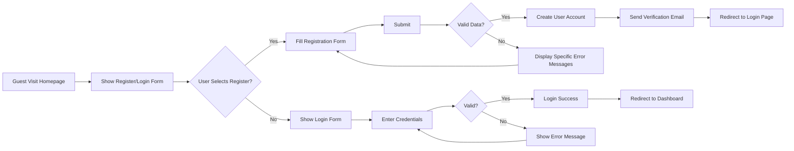
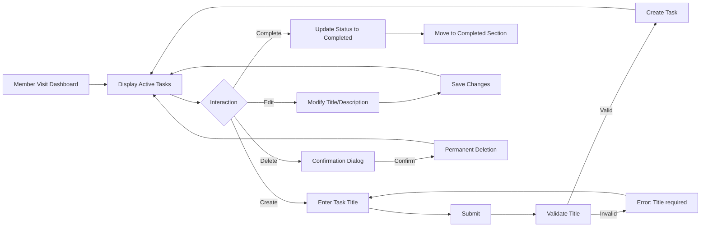

# User Actors and Personas Analysis

## Introduction

This document defines the distinct user personas and their specific requirements for the Todo list application. As part of the backend development process, understanding these user types is critical for implementing proper access control, authentication flows, and business rules. This analysis will focus exclusively on business requirements and user needs, with all technical implementation details left to the development team's discretion.

## Guest Persona

### Role and Context

Guests represent unauthenticated users who interact with the application before creating a personal account. These users have no access to task data and can only perform registration and login actions. Guests must complete the registration process to become authenticated Members who can manage their tasks. This persona is essential to the application's user acquisition funnel and serves as the primary entry point for new users.

### Common User Scenarios

1. **Homepage Access**
   - A new visitor arrives at the application's homepage without any prior session.
   - They are immediately presented with a clean welcome message and clear options to either register or login.
   - No task-related features are visible or accessible to this user.

2. **Registration Process**
   - User clicks "Register" button on the welcome screen.
   - They fill in required fields including a valid email address and password.
   - Upon submission, the system checks if the email is available and password meets strength requirements.
   - Successful registration triggers an account creation and sends a confirmation email.
   - The user is redirected to the login page with a message: "Your account has been created. Please check your email to confirm your registration."

3. **Login Attempt**
   - Registered users attempt to log in using their email and password.
   - If credentials are correct, they are authenticated and granted access to the task management interface.
   - If incorrect, they receive a clear error message: "Invalid email or password. Please try again."

4. **Guest Attempting Task Access**
   - A guest tries to directly access the task list page without authentication.
   - The system immediately redirects them to the login page with the message: "You must be logged in to view your tasks."
   - No data is exposed, and no task-related functionality is available.

### Business Rules in EARS Format

- WHEN a guest visits the application homepage, THE system SHALL display a welcome message and clear call-to-action buttons to register or login.
- WHEN a guest attempts to create a new task via any URL or interface, THE system SHALL immediately deny access and display "Please register or login to manage your tasks."
- WHEN a guest enters an invalid email format during registration, THE system SHALL display "Please enter a valid email address (e.g., name@example.com)."
- WHEN a guest submits a registration with password less than 8 characters, THE system SHALL display "Password must be at least 8 characters."
- WHEN a guest submits a registration with duplicate email, THE system SHALL display "This email address is already registered."
- WHEN a guest enters incorrect login credentials, THE system SHALL display "Invalid email or password. Please check your input and try again."
- WHEN a guest completes successful registration, THE system SHALL authenticate them as a Member and redirect to the task dashboard page.
- IF a guest attempts to access task data through API URLs without authentication, THE system SHALL return HTTP status code 401 (Unauthorized).

### Error Handling

- Email validation errors: For incorrect formats, empty fields, or duplicate entries, the system provides specific feedback per field.
- Password errors: Explicit messages for each validation rule failure (minimum length, missing uppercase, etc.).
- Login errors: Generic "invalid credentials" message to prevent revealing if email exists.

## Member Persona

### Role and Context

Members are authenticated users who have successfully registered and verified their accounts. This persona represents the core users the application is designed to serve. Members have full control over their own task data but cannot access other users' information. This persona requires robust data isolation and personalized task management capabilities.

### Common User Scenarios

1. **Task Creation Workflow**
   - Member clicks "Add Task" button in the task dashboard.
   - They enter a task title (required) and optional description.
   - Upon submission, the system validates the title is non-empty and creates the task with "pending" status.
   - The new task immediately appears in the task list, allowing immediate interaction.

2. **Task Completion Process**
   - Member views task in the active list.
   - They click "Complete" button, which updates the task status to "completed".
   - The task smoothly transitions to the completed section without page refresh.
   - Members can mark tasks as incomplete again, restoring them to active list.

3. **Task Editing**
   - Member selects an existing task and clicks "Edit" icon.
   - They modify the title or description as needed.
   - The system validates the title has content and updates the task instantly.
   - Changes are immediately reflected in the task list.

4. **Task Deletion**
   - Member selects a task and clicks "Delete" action.
   - The system shows a confirmation dialog: "Are you sure you want to delete this task?"
   - After confirmation, the task is permanently removed from the system with no recovery options.

5. **Password Management**
   - Member navigates to account settings and updates their password.
   - The system requires current password verification for security.
   - Updated credentials are securely saved, and session is maintained.

### Business Rules in EARS Format

- WHEN a member creates a new task, THE system SHALL store the task with the member's unique user ID, current timestamp, and default "pending" status.
- WHEN a member edits an existing task, THE system SHALL verify ownership before allowing modifications.
- WHEN a member marks a task as completed, THE system SHALL transition the status from "pending" to "completed" and move it to the completed tasks section.
- WHEN a member deletes a task, THE system SHALL permanently remove the task with no possibility of retrieval.
- IF a member attempts to edit another user's task, THEN THE system SHALL reject the request with "You do not have permission to modify this task" and log the security event.
- IF a member submits a task with empty title, THEN THE system SHALL display "Task title is required."
- WHILE a member is working on tasks, THE system SHALL ensure isolation between users by enforcing strict data access controls.
- WHERE a member resets their password, THE system SHALL require current password verification for security.

### Performance Requirements

- Task creation must complete within 1 second from submission.
- Task list loads should appear within 1.5 seconds for up to 100 tasks.
- Task status updates should process immediately without perceptible delay.

### Error Handling

- For empty task titles: "Task title is required."
- For accessing unauthorized tasks: "Access denied. You do not own this task."
- For invalid task IDs in API requests: "Task not found."

## Actor Coverage Matrix

### Capability Table

| Action | Guest | Member |
|--------|-------|--------|
| Register Account | ✅ | ❌ |
| Login | ✅ | ✅ |
| View Task List | ❌ | ✅ |
| Create New Task | ❌ | ✅ |
| Edit Own Task | ❌ | ✅ |
| Delete Own Task | ❌ | ✅ |
| View Other Users' Tasks | ❌ | ❌ |
| Change Password | ❌ | ✅ |
| Password Reset | ✅ | ✅ |

### Visual Workflow Diagrams

#### Guest Registration Flow

#### Member Task Management Workflow

> *Developer Note: This document defines **business requirements only**. All technical implementations (architecture, APIs, database design, etc.) are at the discretion of the development team.*