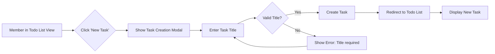
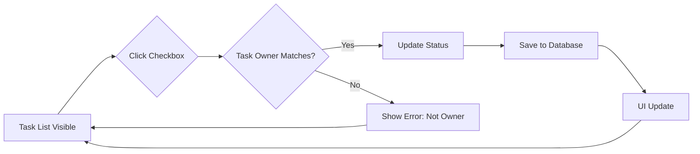

# Primary User Scenarios for Todo Application

This document outlines the primary user journeys required for the Todo application. These scenarios reflect the minimum viable functionality needed for the system to operate effectively, focusing on core user interactions that form the backbone of daily usage.

## Task Creation Flow

When a member initiates the creation of a new task, the following steps occur:

- WHEN a member navigates to the Todo list interface, THE system SHALL display the 'New Task' button in the upper-right corner.
- WHEN the member clicks the 'New Task' button, THE system SHALL display a modal dialog containing a text input field labeled "Task Title".
- THE text input field for Task Title SHALL allow a maximum of 255 characters and SHALL require at least 1 character.
- IF the Task Title field is empty when the 'Create' button is clicked, THE system SHALL display an error message "Title is required" and prevent submission.
- WHEN a valid title is submitted, THE system SHALL create a new task with the provided title, status of "pending", and a timestamp of the current time.
- THE new task SHALL appear in the task list with the following elements: a checkbox (initially unchecked), the task title, and a timestamp showing creation time.
- THE system SHALL also save the task details to the database, associating it with the authenticated member's account.

Below is a Mermaid diagram illustrating the Task Creation Flow:



## Task Completion Flow

When a member marks a task as completed or uncompleted:

- WHEN a member checks the checkbox next to a task, THE system SHALL update the task's status to "completed".
- WHEN a member unchecks the checkbox of a completed task, THE system SHALL update the status to "pending".
- THE system SHALL immediately reflect the status change in the local UI without requiring a page refresh.
- IF the task belongs to another member, THE system SHALL display an error "You cannot modify another user's task" and revert the checkbox state.
- THE task update SHALL be sent to the server for persistence, with validation to ensure only the owning member can modify it.
- THE server SHALL confirm the update and return a success response.

Below is a Mermaid diagram for Task Completion Flow:



## Account Registration Flow

The process for a guest to become a member:

- WHEN a guest selects 'Register' on the login screen, THE system SHALL display a registration form with email and password fields.
- THE email field SHALL validate format using standard email validation (e.g., username@domain.com).
- THE password field SHALL require a minimum of 8 characters and shall not allow empty submissions.
- IF the email format is invalid, THE system SHALL display "Invalid email format".
- IF the password is too short, THE system SHALL display "Password must be at least 8 characters".
- WHEN valid credentials are submitted, THE system SHALL create a new user account with pending status and send a confirmation email to the provided address.
- WHEN the guest clicks the confirmation link in the email, THE system SHALL activate the account and set status to active.
- THE system SHALL subsequently log the user in automatically and redirect them to the Todo list view.
- IF the email is already registered, THE system SHALL display "Email is already in use".

Below is a Mermaid diagram for Account Registration Flow:

```mermaid
graph LR
    A["Guest Accesses Page"] --> B{"View Registration Option?"}
    B -->|"Yes"| C["Click Register"]
    C --> D["Show Registration Form"]
    D --> E["Input Email & Password"]
    E --> F{"Valid?"}
    F -->|"No"| G["Show Validation Error"]
    G --> E
    F -->|"Yes" --> H["Create Pending Account"]
    H --> I["Send Confirmation Email"]
    I --> J["Await Confirmation Link Click"]
    J --> K{"Confirmed?"}
    K -->|"Yes"| L["Activate Account"]
    K -->|"No"| M["Timeout/Re-send email"]
    L --> N["Log In User"]
    N --> O["Redirect to Todo List"]
```

## Account Login Flow

The steps for authenticating a member:

- WHEN a member enters their email and password on the login screen, THE system SHALL validate the input against stored credentials.
- THE email SHALL match an existing account with active status.
- THE password SHALL match the hashed value stored in the database.
- IF authentication fails, THE system SHALL display "Invalid email or password" and log the failed attempt.
- IF the account is not confirmed, THE system SHALL display "Please confirm your email first".
- WHEN credentials are valid, THE system SHALL generate a JWT token with a 30-minute expiration and store it in secure cookies.
- THE member SHALL be redirected to the Todo list view with their tasks loaded.
- THE system SHALL log the successful login time.

Below is a Mermaid diagram for Account Login Flow:

```mermaid
graph LR
    A["Member Enters Login"] --> B{"Submit Credentials"}
    B --> C{"Validate Email & Password"}
    C -->|"Valid"| D["Check Account Status"]
    C -->|"Invalid" E["Show Error: Invalid Credentials"]
    E --> A
    D -->|"Active" F["Generate JWT Token"]
    D -->|"Pending" G["Show Error: Confirm Email"]
    G --> A
    F --> H["Store Token in Cookie"]
    H --> I["Redirect to Todo List"]
```

## References to Related Documents

- For detailed user actors and permissions, refer to the [User Actors and Personas](./05-user-actors-and-personas.md) document.
- Authentication security details including token management and data privacy can be found in the [Security and Compliance](./10-security-compliance.md) document.
- For error handling beyond basic validation, see the [Secondary and Exception Scenarios](./07-secondary-and-exception-scenarios.md) document.