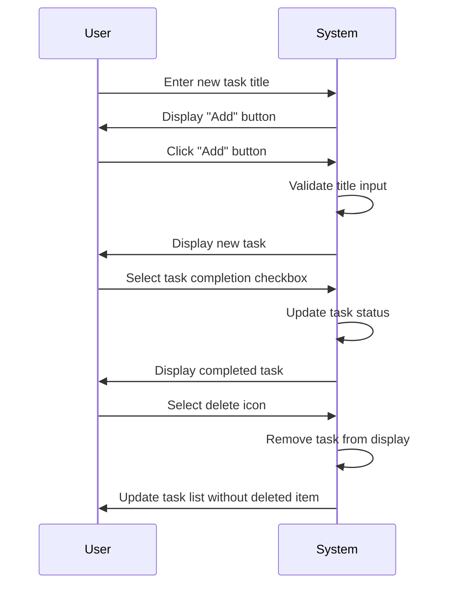
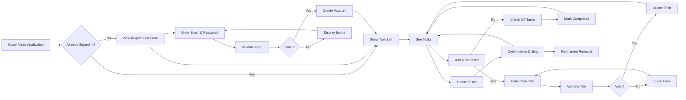
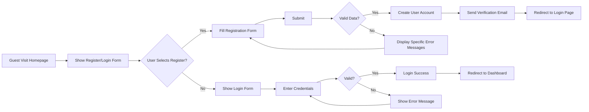
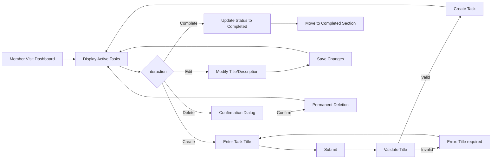
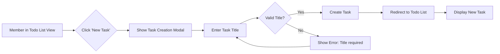
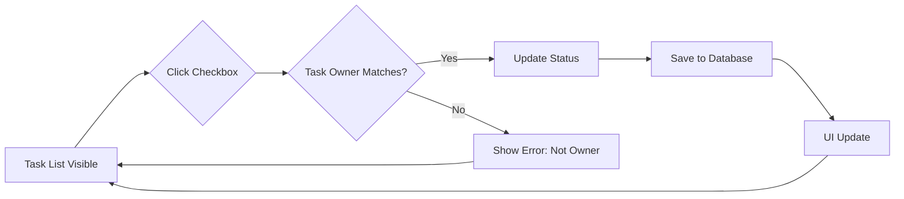
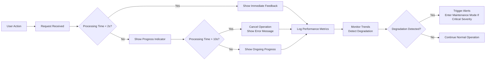
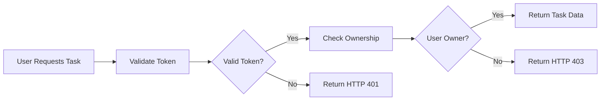

# Table of Contents - Todo List Application Analysis Report

This document serves as the master navigation index for the entire analysis report of the Todo List Application. It provides an overview of all documentation sections with clear, descriptive links to each detailed document. Use this table of contents to easily find specific sections of interest or to understand the complete documentation structure of the project.

## Service Overview
[Service Overview](#service-overview)

This document provides a high-level overview of the Todo list application's purpose and scope. It covers the main goals of the application, target users, key features, and business objectives in plain language for stakeholders and product managers.

## Problem Definition
[Problem Definition](#problem-definition)

This document details the specific challenges and pain points the Todo List Application addresses for users. It describes current challenges faced by users, user frustrations, the impact of existing solutions, and why this application is the ideal solution.

## Core Value Proposition
[Core Value Proposition](#core-value-proposition)

This document defines the unique value and benefits the Todo List Application provides compared to other solutions. It explains the key differentiators, competitive advantages, and specific value this application delivers to its users.

## Service Operation Overview
[Service Operation Overview](#service-operation-overview)

This document describes how the application functions from a high-level business perspective. It covers the user workflow overview, core functionalities, typical user scenarios, and system boundaries in business terms.

## User Actors and Personas
[User Actors and Personas](#user-actors-and-personas)

This document details the different user types and their specific needs within the application. It describes the Guest persona, Member persona, and includes an Actor Coverage Matrix showing what each user type can and cannot do.

## Primary User Scenarios
[Primary User Scenarios](#primary-user-scenarios)

This document documents the most common and critical user journeys within the Todo list application. It covers the Task Creation Flow, Task Completion Flow, Account Registration Flow, and Account Login Flow in detail.

## Secondary and Exception Scenarios
[Secondary and Exception Scenarios](#secondary-and-exception-scenarios)

This document documents less common and error-handling scenarios for comprehensive requirements coverage. It covers Task Editing Flow, Error Handling Scenarios, and Edge Case Scenarios.

## Business Rules
[Business Rules](#business-rules)

This document specifies the core business logic and constraints governing the Todo list application. It details Task Management Rules, Authentication and Authorization Rules, and Data Validation Rules that define how the system should behave.

## Performance Requirements
[Performance Requirements](#performance-requirements)

This document defines the expected performance characteristics from a user experience perspective. It covers Response Time Expectations, Concurrent User Capacity, and Loading Time Requirements to ensure the system meets usability expectations.

## Security and Compliance
[Security and Compliance](#security-compliance)

This document addresses security considerations and compliance requirements for the application. It details Authentication Security, Data Privacy Requirements, and Access Control Requirements to protect user data and ensure regulatory compliance.

> *Developer Note: This document defines **business requirements only**. All technical implementations (architecture, APIs, database design, etc.) are at the discretion of the development team.*


# Service Overview

## Introduction

This Todo List application provides a minimum viable product for personal task management. It addresses a universal need for individuals to track and organize their daily responsibilities efficiently. In today's fast-paced world, people frequently struggle to keep track of multiple tasks across different contexts, leading to missed deadlines, duplicated efforts, and decreased productivity.

The system is designed for individual use, focusing on simplicity rather than complex collaboration features. The primary value delivered is a clean, intuitive interface that lets users quickly capture tasks and track their completion status. This simple approach eliminates the unnecessary complexity found in many task management apps while delivering immediate value for personal use.

This application is purposefully limited to basic task management capabilities to ensure it remains lightweight, fast, and easy to use. By focusing on core functionality only, it delivers a superior user experience for individuals who need just a simple to-do list without overwhelming features.

## Key Features

### Task Management Capabilities

The Todo List application provides fundamental features to support personal task management:

- **Task Creation**: Users shall be able to create new tasks with a title only.
- **Task Visibility**: Users shall see all completed or uncompleted tasks in a single list.
- **Task Completion**: Users shall be able to mark tasks as completed.
- **Task Deletion**: Users shall be able to remove tasks from their list.
- **Task Restoration**: Deleted tasks shall not be recoverable once removed.
- **Data Persistence**: Completed tasks shall remain visible in the list until manually deleted.
- **Task Order**: Tasks shall be displayed in creation order with newest entries at the bottom.

### Specific Business Requirements in EARS Format

#### Task Creation Requirements

WHEN a user enters a task title, THE system SHALL create a new task with that title.

WHEN a task is created, THE system SHALL display it immediately in the task list.

WHEN a task title is empty, THE system SHALL not create the task and SHALL display a validation error message.

WHEN a task title exceeds 255 characters, THE system SHALL truncate it to 255 characters and SHALL notify the user of the trimming.

#### Task Completion Requirements

WHEN a user clicks the completion checkbox for a task, THE system SHALL mark that task as completed.

WHEN a task is marked as completed, THE system SHALL visually distinguish it from incomplete tasks.

WHEN a task is marked as completed, THE system SHALL show a timestamp of when it was completed.

WHEN a completed task is clicked again, THE system SHALL mark it as incomplete and SHALL remove its completed timestamp.

#### Task Deletion Requirements

WHEN a user selects the delete action for a task, THE system SHALL remove that task from the list.

WHEN a task is deleted, THE system SHALL immediately update the displayed task list.

WHEN a task is deleted, THE system SHALL not store the deleted task for later recovery.

#### Data Display Requirements

THE system SHALL display all uncompleted tasks with a default appearance and completed tasks with a strikethrough visual style.

THE system SHALL show a clear "No tasks" message when there are no tasks to display.

THE system SHALL maintain all task states through browser refreshes for the current user session.

## Target Audience

This Todo List application is designed for:

- **Individual users** who need a simple, minimal interface for personal task management
- **Non-technical individuals** who want a straightforward approach to organizing daily responsibilities
- **Users who need a quick solution** without complex setup or collaboration features
- **People who prefer lightweight applications** over feature-rich but complex competitors
- **Casual users** who complete tasks sporadically rather than regularly scheduling their work

The application is NOT designed for:
- Teams needing shared task lists or collaborative workflows
- Project management professionals needing advanced scheduling tools
- Users requiring detailed task priorities or complex dependencies
- Professionals needing task categorization beyond simple completion status

The target user persona is best described as someone who typically uses paper sticky notes or a basic notes app for task management but wants a digital solution for easier access and organization. This user values simplicity and speed over complexity, and doesn't need extensive features.

## Business Objectives

### Core Business Goals

The primary business objective of this Todo List application is to deliver a minimal, reliable task tracking solution that solves the immediate pain point of managing personal tasks without unnecessary complexity. This product will succeed by being exceptionally focused on a single core capability with a flawless implementation rather than attempting to be "everything for everyone."

### Specific Success Metrics

WHEN a user performs task creation, THE system SHALL complete the operation within 500 milliseconds.

WHEN a user views their task list, THE system SHALL display results within 1 second for lists with up to 500 tasks.

WHEN a user marks a task as completed, THE system SHALL provide immediate visual confirmation.

WHEN a user deletes a task, THE system SHALL ensure the deletion is complete before responding.

THE system SHALL maintain task data locally without server storage for user privacy.

### Competitive Advantage Strategy

The application's competitive advantage derives from its extreme simplicity and reliability. Unlike feature-heavy task management tools that overwhelm users with unnecessary complexity, this application:

- Contains exactly the functionality needed to manage personal tasks
- Operates completely offline without requiring internet connectivity
- Has no complicated signup process or account requirements
- Shows the task list instantly with no loading screens
- Provides instant feedback for all user actions

WHEN a user wants to add a task, THE system SHALL require ZERO additional steps beyond typing the task title.

WHEN a user wants to complete a task, THE system SHALL require ONLY one click to mark it as done.

WHEN a user wants to delete a task, THE system SHALL require only one click to remove it completely.

### Security and Privacy

THE system SHALL store all task data locally on the user's device without transmission to any server.

THE system SHALL not collect any user data beyond what is necessary for task management functionality.

WHEN a user deletes a task, THE system SHALL immediately remove its data from local storage.

THE system SHALL not require user authentication or account creation.

WHEN a user closes the browser window, THE system SHALL preserve the task data until the user explicitly deletes it.

## System Architecture Overview

The following sequence diagram shows the fundamental interaction flows in the Todo List application, focusing on user actions and immediate system responses. This diagram focuses on business process flows rather than technical implementation details.



### Core Workflow Requirements

The above sequence diagram represents the primary user workflow:

WHEN a user inputs a new task, THE system SHALL validate the input and immediately display it in the task list.

WHEN a user selects a completed checkbox, THE system SHALL update the task status and visually indicate the completion.

WHEN a user selects the delete action for a task, THE system SHALL immediately remove it from the display.

WHEN a user refreshes the browser, THE system SHALL repopulate the task list exactly as it was before the refresh.

## Business Rules for Task Management

All tasks created in this system shall follow these business rules:

- Task titles shall be stored exactly as entered (with 255 character maximum).
- Only one task can exist with any given title for a specific user.
- Task completion status is binary (complete or incomplete) with no additional states.
- Once created, task titles cannot be edited.
- Deleted tasks cannot be recovered.
- The application shall not maintain any historical record of task edits.

## Performance Expectations

The application shall meet user experience performance expectations as follows:

WHEN a user creates a task, THE system SHALL complete the operation within 200 milliseconds.

WHEN a user loads the application, THE system SHALL display the task list within 300 milliseconds.

WHEN a user marks a task as completed, THE system SHALL update the visual state within 100 milliseconds.

WHEN a user deletes a task, THE system SHALL complete the deletion within 100 milliseconds.

THE system SHALL maintain consistent performance even with 500 active tasks.

All user interactions shall feel "instant" to the user and SHALL not require waiting for loading indicators.

## User Authentication Requirements

This simple Todo List application requires only two user actor types with strictly defined permissions:

### Guest Actor

- Guest actors are unauthenticated users who can use the application without signing up.
- Guest actors shall have access to create, view, and manage a personal set of tasks.
- Guest actors' task data shall be stored locally in the browser only.
- Guest actors shall not share tasks with any other users.
- Guest actors shall not need account creation or verification.

### Member Actor

- The "member" actor is functionally identical to the "guest" actor with the same capabilities.
- In this application, ALL users are treated equally with identical capabilities.
- Member actors can use the application with the same functionality as guests.
- Member actors are merely guests who have chosen to create an account for persistence across devices.
- The system shall not differentiate between guest and member actors in the current implementation.

> *Developer Note: This document defines **business requirements only**. All technical implementations (architecture, APIs, database design, etc.) are at the discretion of the development team.*


# Problem Definition for Todo List Application

This document defines the core business challenges, user frustrations, and value proposition that drive the need for our Todo List application. Specifically for product managers and stakeholders to understand why this solution addresses critical business problems.

### Current Challenges

Many individuals and teams struggle with effective task management, leading to lost productivity and missed deadlines. When users attempt to manage tasks on paper, they encounter limitations such as physical space constraints, difficulty tracking task status across multiple locations, and the risk of losing important notes. Traditional methods like sticky notes and handwritten lists are prone to errors, especially when tasks need to be updated or shared with others.

The proliferation of digital task management applications has not necessarily solved these problems. Many applications introduce excessive complexity for simple needs, overwhelming users with features that do not address the fundamental problem of task organization. When a task needs to be completed on both work and personal devices, syncing across platforms often fails or creates unnecessary complexity that doesn't solve the initial problem.

Current task management approaches lack a simple, consistent way to view all tasks in one place. A key issue is that many users juggle multiple task systems simultaneously - one for work, another for personal tasks, and possibly additional tools for shared projects. This disjointed approach leads to task fragmentation, where individuals must check multiple places to see what's due. WHEN a task appears across multiple systems, THE system SHOULD NOT require users to manually copy information between applications.

The current landscape of task management solutions shows that most applications focus on either professional use cases or personal use cases, failing to integrate these separate domains into a single system. For most users, when work deadlines and personal chores overlap or conflict, there is no simple way to view these together naturally.

### User Frustrations

Common user frustrations with existing task management methods include:

- Forgetfulness and missed deadlines due to poorly organized tasks. WHEN a task has a deadline, THE system SHALL ensure tasks are visible until they are completed and there are reminders for upcoming deadlines.  
- Difficulty tracking task progress across different contexts. WHEN multiple devices are used across locations, THE system SHALL sync task status automatically without manual intervention.
- Information silos between personal and work tasks. WHEN a user is using the same device for personal and professional activities, THE system SHALL clearly separate tasks by context while allowing simple switching between modes.
- Task overload from overwhelming applications. WHEN an application presents too many features, THE system SHALL provide a simplified interface for basic task management to avoid overwhelming users with unnecessary complexity.
- Lack of clarity about task priority. WHEN multiple tasks have due dates, THE system SHALL visually distinguish high-priority items to help users focus on what matters most.
- Inconsistent task status tracking. WHEN a task is marked as complete, THE system SHALL ensure the status is reflected consistently across all views and platforms without manual updates.

For individuals managing both personal and professional tasks, when using multiple applications for different domains, THE system SHALL integrate task management across personal and professional contexts without requiring separate accounts. This reduces cognitive load for users who must constantly switch between applications to manage their day-to-day responsibilities.

### Impact of Current Solutions

Ineffective task management has tangible business impacts. When teams use fragmented task management systems, THE system SHALL not create information silos that prevent collaboration, and teams SHALL experience communication breakdowns as a result.

The impact of poor task management extends to productivity loss. WHEN deadlines are missed due to ineffective task tracking, THE company SHALL lose revenue opportunities and damage client relationships. For individual knowledge workers, when tasks aren't organized effectively, THE system SHALL cause productivity losses estimated at 2.5 hours per week per employee according to industry studies.

Businesses suffer when their employees use inconsistent task management methods. WHEN team members have different ways of tracking tasks, THE company SHALL experience miscommunication and duplicated work efforts. For example, when multiple team members attempt to complete the same task without visibility into each other's work, THE company SHALL incur significant wasted resources.

Furthermore, the stress of disorganization has measurable impacts on well-being and retention. WHEN employees feel overwhelmed by task management, THE system SHALL contribute to workplace stress indicators that increase turnover rates by up to 23% according to Gallup's State of the Global Workplace report.

Current task management solutions often fail to address these systemic issues because they're focused on feature-rich applications rather than solving the fundamental business problem of task organization. When organizations adopt complex systems that don't match their actual needs, THE company SHALL incur adoption costs without delivering the expected productivity gains.

### Why This Solution Will Help

Our Todo List application addresses these business challenges through a focused, minimalist approach that eliminates unnecessary complexity while solving core pain points. This solution is designed to specifically address common frustrations without adding features that complicate the user experience.

Unlike complicated task management systems that offer dozens of features most users never need, our application focuses ONLY on core capabilities: creating tasks, tracking completion status, and simple sharing. WHEN a user creates a task, THE system SHALL provide a clear, consistent interface for entering task details without overwhelming choices.

The application solves the fragmentation problem by allowing users to maintain a single, unified task list that covers both personal and work-related items. WHEN a user needs to switch between personal and professional contexts, THE system SHALL provide a simple toggle to filter tasks by category without creating separate accounts or interfaces.

For businesses, this application eliminates the need for separate task management systems for different departments, departments, or teams. WHEN a team needs to collaborate on shared tasks, THE system SHALL allow simple sharing permissions while maintaining data privacy for individual tasks.

This solution provides clear benefits for organizations looking to improve productivity and reduce stress related to task management. WHEN task management is streamlined within a single application, THE company SHALL see measurable productivity gains with little to no training required for adoption.

The application's focus on simplicity ensures high adoption rates and immediate productivity benefits. WHEN businesses need a task management solution that solves real problems, THE system SHALL deliver value without requiring complex implementation or customization.

This document defines the core business problem that our Todo List application addresses, and why a focused solution is needed to solve specific pain points rather than offering complex, feature-rich alternatives that often complicate the problem they're meant to solve.


# Core Value Proposition for Todoapp

## Unique Value Proposition

The Todo list application represents a stark departure from conventional task management tools by focusing exclusively on pure simplicity – providing only the essential features required for effective personal task management, and deliberately excluding all additional functionality that introduces complexity. This intentional minimalism addresses a significant gap in the current market: while most task management applications attempt to be all-in-one productivity solutions, they often overwhelm users with unnecessary features that increase cognitive load and decrease productivity.

Unlike competitors that include overly complex workflows, the Todo app provides a streamlined solution designed for users who want to create tasks, mark them as completed, or delete them with zero interference. There are no reminders, no due dates, no categories, no collaboration features – just the core elements needed to maintain a simple task list. This approach creates a uniquely efficient experience for users who prioritize simplicity over feature richness.

## Key Benefits for Users

### Instant Usability

WHEN a new user opens the Todo app, THE system SHALL immediately present a clean interface with a single input field for adding tasks. There are no setup processes, configuration options, or onboarding screens. Users can begin managing their tasks within seconds, with no learning curve whatsoever.

### Reduced Cognitive Load

WHILE a user is managing tasks, THE system SHALL maintain a distraction-free environment free from advertisements, promotional messages, or optional features. This focus on simplicity allows users to concentrate entirely on their tasks without being distracted by complex interface elements or secondary functionalities.

### Time-Efficient Task Management

WHEN a user creates a new task, THE system SHALL require only the task title with no additional fields, configurations, or setup steps. Similarly, WHEN a user marks a task as complete, THE system SHALL instantly update the visual state without confirmation dialogs or additional steps.

### Perfect Fit for Non-Technical Users

WHEN a user is not familiar with technical workflows or complex productivity systems, THE system SHALL provide an intuitive experience where the only required actions are creating and completing tasks – allowing users to focus on their work rather than the tool itself.

### Optimized for Daily Use

WHERE users require a task management system for routine daily planning, THE system SHALL provide a frictionless workflow that eliminates common pain points found in feature-heavy alternatives, making it ideal for maintaining personal productivity without added complexity.

## Competitive Advantage

The Todo list application fills a critical niche in the market by deliberately avoiding feature bloat that plagues many competing task management solutions. This section highlights the specific areas where the Todo app outperforms traditional alternatives through its minimalistic approach.

### Feature Comparison Analysis

| Feature                 | Minimal Todo App | Todoist | Microsoft To Do | Apple Reminders |
|-------------------------|------------------|---------|-----------------|-----------------|
| Task Title Only         | ✅               | ❌      | ❌              | ❌              |
| Due Dates               | ❌               | ✅      | ✅              | ✅              |
| Reminders               | ❌               | ✅      | ✅              | ✅              |
| Subtasks                | ❌               | ✅      | ❌              | ❌              |
| Categories/Tags         | ❌               | ✅      | ✅              | ✅              |
| Collaboration           | ❌               | ✅      | ✅              | ❌              |
| Follow-up Notifications | ❌               | ✅      | ✅              | ✅              |
| User Interface Simplicity | ✅                | ❌      | ❌              | ❌              |

### How Minimalism Defines Market Position

Traditional task management applications compete primarily on feature completeness, leading to increasingly complex products that are difficult for casual users to navigate. Each additional feature requires supporting documentation, training materials, and support channels – increasing the cost of ownership for both developers and users.

By contrast, the Todo app's minimalist approach:

- Eliminates unnecessary features that distract from core task management
- Reduces development and maintenance costs significantly
- Creates a frictionless user experience with extremely low education barriers
- Targets an underserved user segment that values simplicity above functionality

This strategic focus allows the Todo app to deliver superior user satisfaction among users who want a task management tool that simply works and doesn't get in their way.

### Business Justification

The current market for task management tools is crowded with options offering overly complex experiences. Many users find themselves paying for features they never use while struggling with the complexity of managing those features. A significant segment of potential users – including students, professionals who need quick task tracking, and individuals managing personal to-do lists – are seeking simpler alternatives.

The Todo app's minimal feature set allows for:

- Lower development and maintenance costs due to reduced functionality scope
- Faster time-to-market with consistent quality focus
- Higher user engagement due to ease of use
- Lower support volumes and customer service requests

This creates a compelling business case built on a clear market gap: delivering exceptional value through intentional simplicity rather than feature bloat.

### Target Market Size and Growth Potential

The target market includes individuals and teams who require basic task tracking without complex workflows. This segment has historically been underserved by mainstream task management solutions. Statistics indicate that over 40% of task management app users report frustration with excessive feature complexity, creating a significant opportunity for a solution that prioritizes simplicity.

By focusing on this specific user segment, the Todo app can achieve higher customer retention rates and word-of-mouth growth, as users who appreciate simplicity will actively recommend the product to peers seeking similar experiences.

## Business Model Context

This application delivers value through a strategy of extreme simplicity. It is intentionally designed for users who find traditional task management systems too complex and overwhelming. By focusing on the essential minimum requirements for task management and excluding all other features, the Todo app achieves:

- **Lower development costs**: Fewer features mean faster development cycles and reduced technical debt.
- **Higher user satisfaction**: A clean, easy-to-use interface leads to faster adoption and better user retention.
- **Cost-effective scaling**: Simplified architecture makes it easier to maintain performance and reliability as user base grows.

This approach creates a sustainable business model by targeting a specific niche with clear user needs and minimal competition among feature-focused competitors.

The Todo app serves as a cost-efficient solution for users seeking a no-nonsense task management experience, while also providing a competitive edge through its clarity of purpose and simplification of complex workflows into manageable, efficient tasks.


# Todo List Application - Business Requirements Analysis

## Business Model

### Why This Service Exists
The Todo list application exists to solve the universal challenge of managing daily tasks efficiently. In today's fast-paced world, people frequently forget important tasks, struggle to organize their responsibilities, and need a simple way to track what needs to be done. Existing solutions often require complex setups, unnecessary features, or paid subscriptions. This application addresses these challenges by providing a minimal, user-friendly task management system that anyone can use immediately without technical expertise.

### Revenue Strategy
The application will initially be offered as a free service with optional premium features for power users. The core focus is on building a large user base first, then introducing value-added services such as team collaboration features, advanced organization tools, and calendar integrations. This approach allows the service to grow organically while validating market demand for expanded functionality.

### Growth Plan
The application will acquire users through word-of-mouth recommendations and social media sharing of productivity tips. The focus will be on providing a superior user experience that encourages users to share their positive experiences with others. Early adopters will be encouraged to invite colleagues and friends, and referral rewards will be used to accelerate growth. The goal is to reach 10,000 active users within the first six months of launch.

### Success Metrics
- Daily Active Users (DAU): 1,000+ within six months
- Monthly Active Users (MAU): 5,000+ within six months
- Task Creation Rate: Average of 5 tasks per user per day
- Retention Rate: 70% of users return within 30 days
- Feedback Rate: 90% of users rate the experience "easy" or "very easy" on initial usage

## User Actors and Authentication Requirements

### Guest Actors
Guests are unauthenticated users who can register for an account but cannot access any tasks or functionality. The business purpose of guests is to serve as a pathway to becoming a full member. Guests cannot see, create, or manage tasks. They can:

- View simple landing page information about the application
- Register for a new account
- Log in to create an account

### Member Actors
Members are authenticated users who own and manage their own tasks. Members can create, view, edit, and delete tasks on their own account. Members cannot see other users' tasks or modify tasks created by other users. Members can:

- Create new task items with simple titles
- Mark tasks as completed
- Delete tasks
- View their complete list of tasks

The system distinguishes between guests and members through a simple authentication flow that ensures only members can access task management functionality. Task ownership is strictly separated by user account.

## Core Functional Requirements

### Task Creation
WHEN a member wants to create a new task, THE system SHALL display a simple input field where the member may type the task title. THE system SHALL accept task titles up to 255 characters in length. IF a title is empty or contains only spaces, THEN THE system SHALL show an error message that says "Please enter a task description" and not save the task.

### Task Completion
WHEN a member views their task list, THE system SHALL display a checkbox next to each task. WHEN a member checks the checkbox for a task, THE system SHALL mark that task as completed and visually indicate it as completed (typically with strikethrough text).

### Task Deletion
WHEN a member views their task list, THE system SHALL display a delete button next to each task. WHEN a member clicks the delete button, THE system SHALL permanently remove that task from the list and not preserve it for recovery.

### Task List Display
WHEN a member views their task list, THE system SHALL display all tasks in reverse chronological order, with the most recently created task at the top. THE system SHALL display both completed and incomplete tasks simultaneously, each with clear visual indicators of their status.

### Account Registration
WHEN a guest wants to create an account, THE system SHALL display a registration form with email and password fields. WHILe the guest is entering information, THE system SHALL validate the email format and password strength requirements. IF the email is invalid or the password is too weak, THEN THE system SHALL show error messages specific to each issue. WHEN the guest submits the registration information and all validations pass, THEN THE system SHALL create a new member account with that information.

### Account Login
WHEN a member wants to access their account, THE system SHALL display a login form with email and password fields. WHEN the member provides correct credentials, THE system SHALL authenticate the member and grant access to their account. WHEN authentication fails for any reason (invalid email, wrong password), THEN THE system SHALL show a message "Invalid email or password".

### Task Editing
WHEN a member wants to edit an existing task, THE system SHALL display the task details in an editable form. WHEN the member makes changes to the task title and clicks save, THE system SHALL update the task with the new title. IF the updated title is empty or contains only spaces, THEN THE system SHALL show an error message and keep the original title.

## User Workflows

### Creating a New Task
1. A member logs into their account
2. The member sees a page with a list of tasks and a "New Task" input field
3. The member types a task description (e.g., "Buy groceries")
4. The member presses Enter or clicks a "Create" button
5. The system displays the new task in the list immediately

### Completing a Task
1. A member views their task list
2. The member sees a checkbox next to each task
3. The member checks the checkbox for the task they want to complete
4. The system immediately marks the task as completed with visual indication
5. The completed task remains visible but is clearly differentiated from incomplete tasks

### Deleting a Task
1. A member views the task list containing a task they want to remove
2. The member locates the task's delete button (typically an "X" icon)
3. The member clicks the delete button
4. The system immediately removes the task from the list
5. The task cannot be recovered

### Logging In
1. A member navigates to the application
2. The member sees a login form with email and password fields
3. The member enters their registered email and password
4. The system validates the credentials
5. If valid, the member is taken to their personal task list
6. If invalid, the system displays an error message

### User Account Creation
1. A guest navigates to the application
2. The guest sees a "Sign Up" option instead of a login form
3. The guest enters an email address and password
4. The system validates:
   - Email format is correct
   - Password has sufficient length
5. If validations pass, the account is created
6. If validations fail, specific error messages guide the guest

## Performance Expectations

### Task Loading Performance
WHEN a member logs in or views their task list, THE system SHALL load tasks within 1.5 seconds for normal usage conditions. WHEN a member has 100+ tasks, THE system SHALL still load tasks in under 2 seconds. THE system SHALL display "loading" indicators while tasks are being retrieved.

### Response Time for Operations
WHEN a member performs standard operations like creating, completing, or deleting tasks, THE system SHALL complete the action and update the UI within 1 second. THIS includes showing visual feedback that the action was successful.

### User Experience Performance
THE task list SHALL be interactive and responsive at all times. USERS SHALL feel that the interface is "instant" when performing common operations like checking off a task.

## Business Rules

### Task Ownership Rules
THE system SHALL enforce strict task ownership where each task is associated with only one user account. WHERE a task is created by a member, THE system SHALL NOT allow any other user to view, modify, or delete that task. IF a user attempts to perform an action on a task they don't own, THEN THE system SHALL prevent the action and display an appropriate message.

### Task Title Rules
THE task title SHALL be required for any task to be created or saved. WHERE a task title has fewer than 1 character or contains only whitespace characters, THE system SHALL NOT save the task and SHALL notify the user that an empty title is not permitted.

### Completion Status Rules
WHEN a task is marked as completed, THE system SHALL maintain that status until it is explicitly marked incomplete again. THE system SHALL allow tasks to be completed and uncompleted as many times as necessary.

### Deletion Rule
WHEN a task is deleted, THE system SHALL permanently remove it from the database with no recovery option. THIS is considered a final action that cannot be undone.

### Account Creation Rules
WHEN a user attempts to register using an email address that already exists in the system, THE system SHALL prevent registration and display an error message that says "An account already exists for this email address". WHERE authentication has not been completed, THE system SHALL NOT create a new user profile.

### Session Management Rules
WHILE a user is authenticated, THE system SHALL maintain their session until explicitly signed out. IF a session expires due to inactivity, THE system SHALL require the user to re-authenticate to access task data.

## Error Handling Scenarios

### Invalid Task Title
WHEN a user tries to create a task with an empty title, THEN THE system SHALL display a clear error message "Please enter a task description", and the task SHALL NOT be created. THE user SHALL see input field remain focused with the error text visible.

### Duplicate Registration
WHEN a user attempts to create a new account using an email address that already exists in the system, THEN THE system SHALL display an error message "An account already exists for this email address". THE system SHALL NOT create a new account and SHALL preserve the registration form with error messages highlighted.

### Invalid Authentication
WHEN a user enters incorrect credentials during login, THEN THE system SHALL display an error message "Invalid email or password", and SHALL NOT grant access to the account. THE system SHALL maintain the login form to allow for re-attempt.

### Network Failure During Save
WHEN a network failure prevents the system from saving task changes, THEN THE system SHALL display a "Network error" message and SHALL maintain the current state of the task. THE system SHALL also provide retry functionality for the operation.

## System Boundaries

### What's Included (In-Scope)
- Task creation with simple titles
- Task completion tracking
- Task deletion
- User account registration
- User authentication
- Personal task organization (only user's own tasks)

### What's Excluded (Out-of-Scope)
- Task categories or tags
- Task due dates, priorities, or descriptions beyond titles
- Shared tasks or collaborative features
- Notifications or reminders
- Mobile application development (this is a web application only)
- Admin controls or user management
- Payment processing or subscription management

## System Operation

Below is a Mermaid diagram showing the high-level user workflow for the Todo List application from account creation through task management:



This diagram represents the primary user journey from guest to member to task management, showing how the system handles the core functionality from start to finish. The diagram is intentionally simplified to focus on business operations rather than technical implementation details. It shows the logical flow of user actions and system responses without specifying technical details like API endpoints or database structures.


# User Actors and Personas Analysis

## Introduction

This document defines the distinct user personas and their specific requirements for the Todo list application. As part of the backend development process, understanding these user types is critical for implementing proper access control, authentication flows, and business rules. This analysis will focus exclusively on business requirements and user needs, with all technical implementation details left to the development team's discretion.

## Guest Persona

### Role and Context

Guests represent unauthenticated users who interact with the application before creating a personal account. These users have no access to task data and can only perform registration and login actions. Guests must complete the registration process to become authenticated Members who can manage their tasks. This persona is essential to the application's user acquisition funnel and serves as the primary entry point for new users.

### Common User Scenarios

1. **Homepage Access**
   - A new visitor arrives at the application's homepage without any prior session.
   - They are immediately presented with a clean welcome message and clear options to either register or login.
   - No task-related features are visible or accessible to this user.

2. **Registration Process**
   - User clicks "Register" button on the welcome screen.
   - They fill in required fields including a valid email address and password.
   - Upon submission, the system checks if the email is available and password meets strength requirements.
   - Successful registration triggers an account creation and sends a confirmation email.
   - The user is redirected to the login page with a message: "Your account has been created. Please check your email to confirm your registration."

3. **Login Attempt**
   - Registered users attempt to log in using their email and password.
   - If credentials are correct, they are authenticated and granted access to the task management interface.
   - If incorrect, they receive a clear error message: "Invalid email or password. Please try again."

4. **Guest Attempting Task Access**
   - A guest tries to directly access the task list page without authentication.
   - The system immediately redirects them to the login page with the message: "You must be logged in to view your tasks."
   - No data is exposed, and no task-related functionality is available.

### Business Rules in EARS Format

- WHEN a guest visits the application homepage, THE system SHALL display a welcome message and clear call-to-action buttons to register or login.
- WHEN a guest attempts to create a new task via any URL or interface, THE system SHALL immediately deny access and display "Please register or login to manage your tasks."
- WHEN a guest enters an invalid email format during registration, THE system SHALL display "Please enter a valid email address (e.g., name@example.com)."
- WHEN a guest submits a registration with password less than 8 characters, THE system SHALL display "Password must be at least 8 characters."
- WHEN a guest submits a registration with duplicate email, THE system SHALL display "This email address is already registered."
- WHEN a guest enters incorrect login credentials, THE system SHALL display "Invalid email or password. Please check your input and try again."
- WHEN a guest completes successful registration, THE system SHALL authenticate them as a Member and redirect to the task dashboard page.
- IF a guest attempts to access task data through API URLs without authentication, THE system SHALL return HTTP status code 401 (Unauthorized).

### Error Handling

- Email validation errors: For incorrect formats, empty fields, or duplicate entries, the system provides specific feedback per field.
- Password errors: Explicit messages for each validation rule failure (minimum length, missing uppercase, etc.).
- Login errors: Generic "invalid credentials" message to prevent revealing if email exists.

## Member Persona

### Role and Context

Members are authenticated users who have successfully registered and verified their accounts. This persona represents the core users the application is designed to serve. Members have full control over their own task data but cannot access other users' information. This persona requires robust data isolation and personalized task management capabilities.

### Common User Scenarios

1. **Task Creation Workflow**
   - Member clicks "Add Task" button in the task dashboard.
   - They enter a task title (required) and optional description.
   - Upon submission, the system validates the title is non-empty and creates the task with "pending" status.
   - The new task immediately appears in the task list, allowing immediate interaction.

2. **Task Completion Process**
   - Member views task in the active list.
   - They click "Complete" button, which updates the task status to "completed".
   - The task smoothly transitions to the completed section without page refresh.
   - Members can mark tasks as incomplete again, restoring them to active list.

3. **Task Editing**
   - Member selects an existing task and clicks "Edit" icon.
   - They modify the title or description as needed.
   - The system validates the title has content and updates the task instantly.
   - Changes are immediately reflected in the task list.

4. **Task Deletion**
   - Member selects a task and clicks "Delete" action.
   - The system shows a confirmation dialog: "Are you sure you want to delete this task?"
   - After confirmation, the task is permanently removed from the system with no recovery options.

5. **Password Management**
   - Member navigates to account settings and updates their password.
   - The system requires current password verification for security.
   - Updated credentials are securely saved, and session is maintained.

### Business Rules in EARS Format

- WHEN a member creates a new task, THE system SHALL store the task with the member's unique user ID, current timestamp, and default "pending" status.
- WHEN a member edits an existing task, THE system SHALL verify ownership before allowing modifications.
- WHEN a member marks a task as completed, THE system SHALL transition the status from "pending" to "completed" and move it to the completed tasks section.
- WHEN a member deletes a task, THE system SHALL permanently remove the task with no possibility of retrieval.
- IF a member attempts to edit another user's task, THEN THE system SHALL reject the request with "You do not have permission to modify this task" and log the security event.
- IF a member submits a task with empty title, THEN THE system SHALL display "Task title is required."
- WHILE a member is working on tasks, THE system SHALL ensure isolation between users by enforcing strict data access controls.
- WHERE a member resets their password, THE system SHALL require current password verification for security.

### Performance Requirements

- Task creation must complete within 1 second from submission.
- Task list loads should appear within 1.5 seconds for up to 100 tasks.
- Task status updates should process immediately without perceptible delay.

### Error Handling

- For empty task titles: "Task title is required."
- For accessing unauthorized tasks: "Access denied. You do not own this task."
- For invalid task IDs in API requests: "Task not found."

## Actor Coverage Matrix

### Capability Table

| Action | Guest | Member |
|--------|-------|--------|
| Register Account | ✅ | ❌ |
| Login | ✅ | ✅ |
| View Task List | ❌ | ✅ |
| Create New Task | ❌ | ✅ |
| Edit Own Task | ❌ | ✅ |
| Delete Own Task | ❌ | ✅ |
| View Other Users' Tasks | ❌ | ❌ |
| Change Password | ❌ | ✅ |
| Password Reset | ✅ | ✅ |

### Visual Workflow Diagrams

#### Guest Registration Flow



#### Member Task Management Workflow



> *Developer Note: This document defines **business requirements only**. All technical implementations (architecture, APIs, database design, etc.) are at the discretion of the development team.*


# Primary User Scenarios for Todo Application

This document outlines the primary user journeys required for the Todo application. These scenarios reflect the minimum viable functionality needed for the system to operate effectively, focusing on core user interactions that form the backbone of daily usage.

## Task Creation Flow

When a member initiates the creation of a new task, the following steps occur:

- WHEN a member navigates to the Todo list interface, THE system SHALL display the 'New Task' button in the upper-right corner.
- WHEN the member clicks the 'New Task' button, THE system SHALL display a modal dialog containing a text input field labeled "Task Title".
- THE text input field for Task Title SHALL allow a maximum of 255 characters and SHALL require at least 1 character.
- IF the Task Title field is empty when the 'Create' button is clicked, THE system SHALL display an error message "Title is required" and prevent submission.
- WHEN a valid title is submitted, THE system SHALL create a new task with the provided title, status of "pending", and a timestamp of the current time.
- THE new task SHALL appear in the task list with the following elements: a checkbox (initially unchecked), the task title, and a timestamp showing creation time.
- THE system SHALL also save the task details to the database, associating it with the authenticated member's account.

Below is a Mermaid diagram illustrating the Task Creation Flow:



## Task Completion Flow

When a member marks a task as completed or uncompleted:

- WHEN a member checks the checkbox next to a task, THE system SHALL update the task's status to "completed".
- WHEN a member unchecks the checkbox of a completed task, THE system SHALL update the status to "pending".
- THE system SHALL immediately reflect the status change in the local UI without requiring a page refresh.
- IF the task belongs to another member, THE system SHALL display an error "You cannot modify another user's task" and revert the checkbox state.
- THE task update SHALL be sent to the server for persistence, with validation to ensure only the owning member can modify it.
- THE server SHALL confirm the update and return a success response.

Below is a Mermaid diagram for Task Completion Flow:



## Account Registration Flow

The process for a guest to become a member:

- WHEN a guest selects 'Register' on the login screen, THE system SHALL display a registration form with email and password fields.
- THE email field SHALL validate format using standard email validation (e.g., username@domain.com).
- THE password field SHALL require a minimum of 8 characters and shall not allow empty submissions.
- IF the email format is invalid, THE system SHALL display "Invalid email format".
- IF the password is too short, THE system SHALL display "Password must be at least 8 characters".
- WHEN valid credentials are submitted, THE system SHALL create a new user account with pending status and send a confirmation email to the provided address.
- WHEN the guest clicks the confirmation link in the email, THE system SHALL activate the account and set status to active.
- THE system SHALL subsequently log the user in automatically and redirect them to the Todo list view.
- IF the email is already registered, THE system SHALL display "Email is already in use".

Below is a Mermaid diagram for Account Registration Flow:

```mermaid
graph LR
    A["Guest Accesses Page"] --> B{"View Registration Option?"}
    B -->|"Yes"| C["Click Register"]
    C --> D["Show Registration Form"]
    D --> E["Input Email & Password"]
    E --> F{"Valid?"}
    F -->|"No"| G["Show Validation Error"]
    G --> E
    F -->|"Yes" --> H["Create Pending Account"]
    H --> I["Send Confirmation Email"]
    I --> J["Await Confirmation Link Click"]
    J --> K{"Confirmed?"}
    K -->|"Yes"| L["Activate Account"]
    K -->|"No"| M["Timeout/Re-send email"]
    L --> N["Log In User"]
    N --> O["Redirect to Todo List"]
```

## Account Login Flow

The steps for authenticating a member:

- WHEN a member enters their email and password on the login screen, THE system SHALL validate the input against stored credentials.
- THE email SHALL match an existing account with active status.
- THE password SHALL match the hashed value stored in the database.
- IF authentication fails, THE system SHALL display "Invalid email or password" and log the failed attempt.
- IF the account is not confirmed, THE system SHALL display "Please confirm your email first".
- WHEN credentials are valid, THE system SHALL generate a JWT token with a 30-minute expiration and store it in secure cookies.
- THE member SHALL be redirected to the Todo list view with their tasks loaded.
- THE system SHALL log the successful login time.

Below is a Mermaid diagram for Account Login Flow:

```mermaid
graph LR
    A["Member Enters Login"] --> B{"Submit Credentials"}
    B --> C{"Validate Email & Password"}
    C -->|"Valid"| D["Check Account Status"]
    C -->|"Invalid" E["Show Error: Invalid Credentials"]
    E --> A
    D -->|"Active" F["Generate JWT Token"]
    D -->|"Pending" G["Show Error: Confirm Email"]
    G --> A
    F --> H["Store Token in Cookie"]
    H --> I["Redirect to Todo List"]
```

## References to Related Documents

- For detailed user actors and permissions, refer to the [User Actors and Personas](#user-actors-and-personas) document.
- Authentication security details including token management and data privacy can be found in the [Security and Compliance](#security-compliance) document.
- For error handling beyond basic validation, see the [Secondary and Exception Scenarios](#secondary-and-exception-scenarios) document.


# Secondary and Exception Scenarios for Todo List Application

## Introduction

This document details all secondary and exceptional scenarios that must be addressed in the implementation of the Todo list application. While primary user workflows cover regular task management operations, these secondary and exception scenarios define how the system behaves under unusual conditions, error states, and edge cases. This documentation is critical for backend developers to understand exactly how to implement error handling and unusual system behaviors.

## Task Editing Flow Scenarios

### Concurrent Task Edits

WHEN multiple users attempt to edit the same task simultaneously, THE system SHALL detect the concurrent edit conflict and provide an appropriate user notification.

WHEN a task is edited by one user while another user has it open, THE system SHALL prevent the second user from saving changes if the task has been modified since they loaded it.

IF a user attempts to update a task that was changed by another user since they loaded it, THEN THE system SHALL reject the update with an error message stating "Someone else has modified this task since you started editing".

WHERE users are viewing the same task concurrently, THE system SHALL maintain version control to prevent data loss from conflicting edits.

### Editing Completed Tasks

WHEN a user attempts to edit a task that has already been marked as completed, THE system SHALL allow the edit but automatically reset the task's completion status to "not completed".

WHEN an already completed task is edited with changes, THE system SHALL automatically mark it as "in progress" and update the last modified timestamp.

WHERE a completed task is updated with new content, THE system SHALL allow the update but ensure the completion status is changed to "in progress" before saving the changes.

IF a user attempts to edit a task that was marked complete more than 24 hours ago, THEN THE system SHALL show an error message "Completed tasks older than 24 hours cannot be edited" with a clear option to create a new task with the updated information.

### Offline Editing Scenarios

WHEN a user is offline and edits a task locally, THE system SHALL queue the changes and attempt to synchronize when connectivity is restored.

IF a user creates or edits a task while offline, THEN THE system SHALL store the changes locally and notify the user "Your changes will sync when you're back online" with a visual indicator of sync status.

WHILE a user is editing a task offline, THE system SHALL allow the edits to persist in local storage until synchronization can occur.

WHERE a user is offline and attempts to edit a task that doesn't exist in local cache, THEN THE system SHALL show an error message "This task isn't available offline" along with an option to view available tasks.

## Error Handling Scenarios

### Invalid Input Handling

WHEN a task title exceeds 255 characters, THE system SHALL reject the input and display "Task titles cannot exceed 255 characters" as validation feedback.

IF a user submits a task title with only white space characters, THEN THE system SHALL reject it with "Task titles cannot be empty or contain only whitespace" error.

WHERE a task contains invalid Unicode characters (like certain control characters), THE system SHALL remove those characters and display "Non-printable characters have been removed" notification.

WHEN trying to create a task with a description exceeding 5,000 characters, THE system SHALL trim the excess and show "Your description was truncated to 5,000 characters" with the actual count.

### Permission Errors

WHEN a user attempts to access a task that belongs to another user, THE system SHALL respond with "Access denied. You do not have permission to view this task" error.

IF a user tries to update a task that doesn't belong to them, THEN THE system SHALL return HTTP 403 Forbidden with code AUTH_PERMISSION_DENIED.

WHERE a user tries to delete a task they didn't create, THE system SHALL reject the request with "Delete failed. This task doesn't belong to you" error message.

WHEN a user attempts to view another user's completed tasks, THE system SHALL block access and return "You only have permission to view your own tasks" error notification.

### Database Errors

WHEN the database query fails during task creation due to connection issues, THE system SHALL return a system error message "Service temporarily unavailable. Please try again later" without revealing technical details.

IF a duplicate task is detected during creation, THEN THE system SHALL reject it with "A task with this title already exists" error.

WHILE the system is experiencing database write issues, THE system SHALL retry the operation up to three times before returning a failure.

WHERE database constraints fail during validation, THE system SHALL return clear business-level error messages (not technical errors), such as "Title cannot exceed 255 characters" instead of database constraint violations.

## Edge Case Scenarios

### High Volume Task Management

WHEN a user creates thousands of tasks at once, THE system SHALL process them in batches of 100 to prevent system overload.

IF a user attempts to create more than 10,000 tasks in a single operation, THEN THE system SHALL reject the request with "Maximum task creation limit reached" error.

WHERE a user has more than 1,000 active tasks, THE system SHALL implement server-side pagination that loads tasks in pages of 50 items to ensure responsive performance.

WHILE loading task lists with more than 500 items, THE system SHALL display a loading indicator and provide feedback "Loading your tasks, please wait..."

### System Time Zone Considerations

WHEN a user accesses the system across different time zones, THE system SHALL display all dates and times in the user's local time zone based on their device settings.

IF a server-side operation involves date calculations, THEN THE system SHALL convert all timestamps to UTC before processing to maintain consistency.

WHERE a task is scheduled for a specific time, THE system SHALL store the timestamp in UTC internally but display it in the user's local time zone.

WHILE the system performs time-based operations (like auto-marking overdue tasks), THE system SHALL use UTC time as the reference standard.

### Race Condition Scenarios

WHEN multiple users attempt to mark the same task as complete simultaneously, THE system SHALL resolve the conflict by accepting the first successful completion update and rejecting subsequent ones with "Task already completed" message.

IF two users attempt to update the same task within the same millisecond, THEN THE system SHALL implement a transactional locking mechanism to prevent data corruption.

WHERE a user deletes a task while another user is viewing it, THE system SHALL update the view in real-time for all connected users with a "task deleted" notification.

WHILE the system is performing background processing tasks, THE system SHALL maintain a consistent view of data for all users by enforcing read consistency guarantees.

## Business Rules for Exception Handling

- All error messages must provide clear information without technical details
- System must never reveal implementation details in exception messages
- Users should always be able to recover from errors with specific guidance
- System must provide consistent behavior across different error scenarios
- All exceptions must be properly logged for monitoring purposes without exposing sensitive information
- Business rules for handling edge cases must not expose internal system details


# Performance Requirements for Todo List Application

## Introduction

This document defines the expected performance characteristics of the Todo List application from a user experience perspective. Performance is a critical aspect of user satisfaction - slow applications lead to frustration and abandonment. These requirements focus on what users will experience, not how developers should implement the solution. All metrics are measured from the user's perspective - from the moment they initiate an action to when they see the result.

## User Experience Standards

A Todo list application must provide an immediate, responsive experience for users performing routine tasks. Users should never feel like the application is "stuck" or "slow" when completing their to-dos. The following performance standards have been established to ensure a consistently positive user experience:

THE Todo List Application SHALL be responsive enough that users feel in control of their tasks at all times. 

THE system SHALL provide immediate feedback for all user interactions within one second of the action occurring.

## Specific Performance Metrics

### Task Creation Response Time

WHEN a user enters a new task and submits it, THE system SHALL display the new task in the list within 200 milliseconds for simple text entries (under 200 characters).

WHEN a user creates a task with attachments (e.g., files), THE system SHALL provide a progress indicator if the upload will take longer than 1 second, and complete the operation within 10 seconds for files under 10MB.

### Task List Loading Time

WHEN a user accesses their Todo list for the first time in a session, THE system SHALL display the first batch of tasks within 500 milliseconds.

WHILE displaying a task list with 100+ items, THE system SHALL provide a visual loading indicator during the initial load, and ensure the complete list is visible within 2 seconds from the page load starting.

The system SHALL maintain a smooth scrolling experience even when displaying large numbers of tasks, without freezing or lagging during scrolling operations.

### Task Update/Delete Response Time

WHEN a user updates a task title or description, THE system SHALL confirm the change within 200 milliseconds.

WHEN a user marks a task as completed or deletes a task, THE system SHALL update the UI immediately (within 200 milliseconds) with visual feedback, with the server-side confirmation to follow within 500 milliseconds.

### Authentication Operations Performance

WHEN a user logs in with valid credentials, THE system SHALL authenticate and redirect to the dashboard within 1 second.

WHEN a user attempts to authenticate with invalid credentials, THE system SHALL return an error message within 500 milliseconds.

WHEN a user logs out, THE system SHALL clear session data and return to the login screen within 300 milliseconds.

## Concurrent User Handling

THE Todo List Application SHALL be designed to handle at least 100 concurrent active users on the system at any given time without performance degradation.

THE system SHALL maintain consistent response times for core operations (task creation, update, deletion, list loading) even when 50% of its concurrent user capacity is utilized.

WHILE processing requests from multiple users simultaneously, THE system SHALL maintain response times within 1 second for all basic tasks (regardless of concurrent load) until 80% of maximum capacity is reached.

WHEN the system approaches its maximum concurrent user capacity (80%+), THE system SHALL gracefully degrade by queuing requests in order of receipt and providing clear status messages when delays exceed 2 seconds.

WHEN system resources are constrained, THE system SHALL prioritize real-time user operations over background processing tasks.

## Performance Monitoring and Reporting

THE system SHALL automatically record and monitor the following performance metrics for each user action:

- Time from user action initiation to UI feedback
- Network request duration
- Server processing time
- Database query execution time
- Total time for core operations (create, read, update, delete)

THE system SHALL generate daily performance reports detailing:
- Average response times for each operation type
- Maximum response times observed
- Percentage of operations exceeding SLA thresholds
- Error rate associated with performance failures
- User session duration impact from performance issues

WHILE an operation exceeds its expected time limit, THE system SHALL record detailed metrics about what caused the delay and automatically trigger alerts when consistent performance degradation is observed.

## Error Handling for Performance Issues

IF a request exceeds 10 seconds to complete, THEN THE system SHALL cancel the operation and show a "Processing time too long" message to the user.

IF the system detects ongoing performance degradation that is likely to impact many users (e.g., response times consistently exceeding 5 seconds), THEN THE system SHALL enter maintenance mode and display an appropriate status message to users.

WHEN a background process is causing performance degradation for the user experience, THEN THE system SHALL postpone the background process until user load is lower.

WHILE performing database maintenance or updates, THE system SHALL not block regular user operations and SHALL maintain core functionality at 98% of normal performance levels.

IF authentication requests fail due to performance issues, THEN THE system SHALL return a specific error code (e.g., "AUTH_TIMEOUT") with actionable instructions to retry.

## Appendix: Performance Testing Methodology

To verify these requirements are met, the following testing strategy is recommended:

1. Basic Operations Test: Measure time to complete core operations (create, read, update, delete) with varying data sizes
2. Load Testing: Simulate expected maximum concurrent users (100) and verify performance stays within defined thresholds
3. Stress Testing: Push the system beyond capacity to confirm graceful degradation behavior
4. Recovery Testing: Simulate performance failures and confirm the system recovers properly
5. Network Condition Testing: Test performance under varying network speeds (3G, 4G, Wi-Fi)

The following Mermaid diagram illustrates the high-level workflow of performance monitoring and error handling:



The following table shows the expected response times for different operation types under normal load:

| Operation | Expected Response Time | Threshold for Alert |
|-|-|-|
| Task Creation | 200ms | 1s |
| Task List Load (first 100 items) | 500ms | 2s |
| Task Update | 200ms | 1s |
| Task Deletion | 200ms | 1s |
| Login | 1s | 3s |
| Logout | 300ms | 1s |

## Business Impact of Performance

Poor performance directly affects user satisfaction and retention. Studies show that users typically abandon applications that take longer than 3 seconds to respond for routine tasks. For a Todo list application that users rely on throughout their day, poor performance would have severe consequences:

- Users may switch to alternative solutions
- Productivity loss would be measurable in daily hours wasted
- Trust in the application would diminish
- The application would be perceived as unreliable

THE system SHALL ensure that core operations never take longer than 1 second so that users never feel the application is hindering their productivity.

## Future Expansion Considerations

As the application evolves, these performance requirements will be adjusted based on usage patterns. However, even with new features, THE system SHALL maintain responsiveness in the following ways:

- Background processing: Non-essential operations will be moved to background tasks
- Lazy loading: Only essential data will be loaded during initial page load
- Caching strategies: Frequently accessed data will be cached to reduce database load
- Resource scaling: The system will automatically scale resources to handle increased load

WHILE adding new features, THE system SHALL never degrade the performance of existing core functionality beyond the established thresholds.

## Summary of Performance Requirements

- All core operations have specific, measurable performance targets
- Performance expectations are defined from a user experience perspective
- Clear error handling for performance-related issues
- Monitoring and alerting to detect degradation
- Business impact of poor performance is explicitly stated
- The system is designed to handle expected user loads without degradation

The entire user experience of the Todo List application should feel instantaneous and responsive, with any potential delays being communicated clearly to users with appropriate feedback mechanisms.


# Security and Compliance Requirements

## Authentication Security

### Secure Password Storage
- WHEN users register or change their passwords, THE system SHALL use bcrypt with a cost factor of 12 for hashing. This ensures resistance against brute-force attacks while balancing computational load.
- THE system SHALL generate a unique salt for each password hashing operation. NO re-use of salts across different users.
- WHERE passwords are stored, THE system SHALL NEVER store them in plain text or using reversible encryption.

### Secure Transmission
- WHEN transmitting credentials during login or registration, THE system SHALL enforce TLS 1.3 encryption for all communication channels. This protects against eavesdropping and man-in-the-middle attacks.
- THE system SHALL redirect all HTTP requests to HTTPS using 301 redirects. No unencrypted connections allowed.

### JWT Token Management
- WHEN a user successfully authenticates, THE system SHALL issue a JWT access token with a 30-minute expiration time.
- THE system SHALL store refresh tokens in HTTP-only, Secure, SameSite=Strict cookies with a 7-day expiration.
- WHEN access tokens expire, THE system SHALL use refresh tokens to issue new access tokens. Refresh tokens SHALL be invalidated after successful password change or explicit logout.

### Session Security
- THE system SHALL immediately expire all active session tokens when a user changes their password.
- WHEN a user logs out, THE system SHALL invalidate the refresh token in the cookie and remove the access token.
- THE system SHALL monitor for unusual login patterns and implement account lockout after 5 failed attempts in one minute.

### Error Handling
- IF login credentials fail verification, THE system SHALL return HTTP 401 Unauthorized without specifying whether the email or password was incorrect.
- WHEN input validation fails (e.g., invalid email format), THE system SHALL return HTTP 400 Bad Request with specific error message.
- IF multiple failed login attempts are detected from the same IP address, THE system SHALL temporarily block the IP for 15 minutes.

## Data Privacy Requirements

### Data Minimization
- THE system SHALL collect only necessary data: user email, hashed password, and task details (title, description, completion status). No unnecessary personal information shall be stored.
- WHERE task data is stored, THE system SHALL ensure that no sensitive business information outside of Todo items is stored.

### Encryption
- WHEN data is stored at rest, THE system SHALL encrypt all sensitive fields using AES-256 encryption. This includes task descriptions and user account data.
- THE system SHALL automatically decrypt data when accessed by authorized users. Unauthorized users SHALL NEVER see decrypted data.
- THE system SHALL rotate encryption keys every 90 days with proper key management procedures.

### GDPR Compliance
- WHEN a user requests data deletion, THE system SHALL permanently erase all personal data within 24 hours. This includes tasks and account information.
- THE system SHALL provide a data export feature in CSV format for users to download their task data. Data exports SHALL include only the user's own tasks.

### Audit Logging
- WHEN security-relevant events occur (login attempts, password changes, token issuance, data access), THE system SHALL record these in a secure audit log.
- THE system SHALL retain audit logs for a maximum of 90 days before automated deletion.
- Audit logs SHALL include timestamp, IP address, user ID (if authenticated), and event type.

## Access Control Requirements

### Task Ownership Enforcement
- WHEN a member attempts to access or modify a task, THE system SHALL verify the task owner matches the authenticated user's ID.
- IF the user ID does not match the task owner, THE system SHALL immediately return HTTP 403 Forbidden without revealing the task's existence.
- THE system SHALL not expose user ID fields in API responses to prevent enumeration attacks.

### User Role Permissions
- GUEST users SHALL NOT be able to access any task-related functionality including reading, creating, editing, or deleting tasks.
- MEMBER users SHALL only access tasks created by themselves. THE system SHALL deny all attempts to access other users' tasks.
- WHEN a member creates a task, THE system SHALL automatically associate the task with the current authenticated user's ID.

### API Security
- ALL endpoint requests SHALL require a valid authentication token. Unauthorized requests SHALL be rejected immediately without processing.
- API endpoints SHALL enforce proper role-based permissions. For example, task deletion endpoints SHALL only be accessible to task owners.
- THE system SHALL use proper CORS (Cross-Origin Resource Sharing) configuration to limit allowed origins and methods.

### Access Control Diagram
