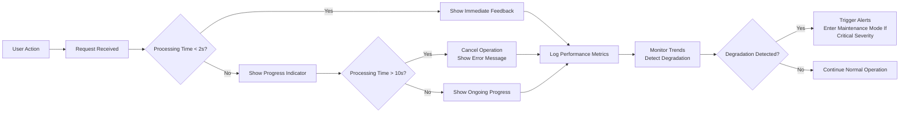

# Performance Requirements for Todo List Application

## Introduction

This document defines the expected performance characteristics of the Todo List application from a user experience perspective. Performance is a critical aspect of user satisfaction - slow applications lead to frustration and abandonment. These requirements focus on what users will experience, not how developers should implement the solution. All metrics are measured from the user's perspective - from the moment they initiate an action to when they see the result.

## User Experience Standards

A Todo list application must provide an immediate, responsive experience for users performing routine tasks. Users should never feel like the application is "stuck" or "slow" when completing their to-dos. The following performance standards have been established to ensure a consistently positive user experience:

WHEN a user interacts with the Todo List application, THE system SHALL provide immediate feedback within one second of the action occurring.

## Specific Performance Metrics

### Task Creation Response Time

WHEN a user enters a new task and submits it, THE system SHALL display the new task in the list within 200 milliseconds for simple text entries (under 200 characters).

WHEN a user creates a task with attachments (e.g., files), THE system SHALL provide a progress indicator if the upload will take longer than 1 second, and complete the operation within 10 seconds for files under 10MB.

### Task List Loading Time

WHEN a user accesses their Todo list for the first time in a session, THE system SHALL display the first batch of tasks within 500 milliseconds.

WHILE displaying a task list with 100+ items, THE system SHALL provide a visual loading indicator during the initial load, and ensure the complete list is visible within 2 seconds from the page load starting.

The system SHALL maintain a smooth scrolling experience even when displaying large numbers of tasks, without freezing or lagging during scrolling operations.

### Task Update/Delete Response Time

WHEN a user updates a task title or description, THE system SHALL confirm the change within 200 milliseconds.

WHEN a user marks a task as completed or deletes a task, THE system SHALL update the UI immediately (within 200 milliseconds) with visual feedback, with the server-side confirmation to follow within 500 milliseconds.

### Authentication Operations Performance

WHEN a user logs in with valid credentials, THE system SHALL authenticate and redirect to the dashboard within 1 second.

WHEN a user attempts to authenticate with invalid credentials, THE system SHALL return an error message within 500 milliseconds.

WHEN a user logs out, THE system SHALL clear session data and return to the login screen within 300 milliseconds.

## Concurrent User Handling

THE Todo List Application SHALL be designed to handle at least 100 concurrent active users on the system at any given time without performance degradation.

THE system SHALL maintain consistent response times for core operations (task creation, update, deletion, list loading) even when 50% of its concurrent user capacity is utilized.

WHILE processing requests from multiple users simultaneously, THE system SHALL maintain response times within 1 second for all basic tasks (regardless of concurrent load) until 80% of maximum capacity is reached.

WHEN the system approaches its maximum concurrent user capacity (80%+), THE system SHALL gracefully degrade by queuing requests in order of receipt and providing clear status messages when delays exceed 2 seconds.

WHEN system resources are constrained, THE system SHALL prioritize real-time user operations over background processing tasks.

## Performance Monitoring and Reporting

THE system SHALL automatically record and monitor the following performance metrics for each user action:

- Time from user action initiation to UI feedback
- Network request duration
- Server processing time
- Database query execution time
- Total time for core operations (create, read, update, delete)

THE system SHALL generate daily performance reports detailing:
- Average response times for each operation type
- Maximum response times observed
- Percentage of operations exceeding SLA thresholds
- Error rate associated with performance failures
- User session duration impact from performance issues

WHILE an operation exceeds its expected time limit, THE system SHALL record detailed metrics about what caused the delay and automatically trigger alerts when consistent performance degradation is observed.

## Error Handling for Performance Issues

IF a request exceeds 10 seconds to complete, THEN THE system SHALL cancel the operation and show a "Processing time too long" message to the user.

IF the system detects ongoing performance degradation that is likely to impact many users (e.g., response times consistently exceeding 5 seconds), THEN THE system SHALL enter maintenance mode and display an appropriate status message to users.

WHEN a background process is causing performance degradation for the user experience, THEN THE system SHALL postpone the background process until user load is lower.

WHILE performing database maintenance or updates, THE system SHALL not block regular user operations and SHALL maintain core functionality at 98% of normal performance levels.

IF authentication requests fail due to performance issues, THEN THE system SHALL return a specific error code (e.g., "AUTH_TIMEOUT") with actionable instructions to retry.

## Appendix: Performance Testing Methodology

To verify these requirements are met, the following testing strategy is recommended:

1. Basic Operations Test: Measure time to complete core operations (create, read, update, delete) with varying data sizes
2. Load Testing: Simulate expected maximum concurrent users (100) and verify performance stays within defined thresholds
3. Stress Testing: Push the system beyond capacity to confirm graceful degradation behavior
4. Recovery Testing: Simulate performance failures and confirm the system recovers properly
5. Network Condition Testing: Test performance under varying network speeds (3G, 4G, Wi-Fi)

The following Mermaid diagram illustrates the high-level workflow of performance monitoring and error handling:

The following table shows the expected response times for different operation types under normal load:

| Operation | Expected Response Time | Threshold for Alert |
|-|-|-|
| Task Creation | 200ms | 1s |
| Task List Load (first 100 items) | 500ms | 2s |
| Task Update | 200ms | 1s |
| Task Deletion | 200ms | 1s |
| Login | 1s | 3s |
| Logout | 300ms | 1s |

## Business Impact of Performance

Poor performance directly affects user satisfaction and retention. Studies show that users typically abandon applications that take longer than 3 seconds to respond for routine tasks. For a Todo list application that users rely on throughout their day, poor performance would have severe consequences:

- Users may switch to alternative solutions
- Productivity loss would be measurable in daily hours wasted
- Trust in the application would diminish
- The application would be perceived as unreliable

THE system SHALL ensure that core operations never take longer than 1 second so that users never feel the application is hindering their productivity.

## Future Expansion Considerations

As the application evolves, these performance requirements will be adjusted based on usage patterns. However, even with new features, THE system SHALL maintain responsiveness in the following ways:

- Background processing: Non-essential operations will be moved to background tasks
- Lazy loading: Only essential data will be loaded during initial page load
- Caching strategies: Frequently accessed data will be cached to reduce database load
- Resource scaling: The system will automatically scale resources to handle increased load

WHILE adding new features, THE system SHALL never degrade the performance of existing core functionality beyond the established thresholds.

## Summary of Performance Requirements

- All core operations have specific, measurable performance targets
- Performance expectations are defined from a user experience perspective
- Clear error handling for performance-related issues
- Monitoring and alerting to detect degradation
- Business impact of poor performance is explicitly stated
- The system is designed to handle expected user loads without degradation

The entire user experience of the Todo List application should feel instantaneous and responsive, with any potential delays being communicated clearly to users with appropriate feedback mechanisms.