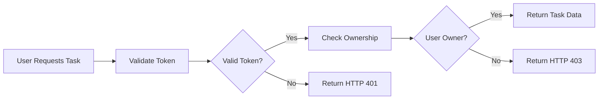

# Security and Compliance Requirements

## Authentication Security

### Secure Password Storage
- WHEN users register or change their passwords, THE system SHALL use bcrypt with a cost factor of 12 for hashing. This ensures resistance against brute-force attacks while balancing computational load.
- THE system SHALL generate a unique salt for each password hashing operation. NO re-use of salts across different users.
- WHERE passwords are stored, THE system SHALL NEVER store them in plain text or using reversible encryption.

### Secure Transmission
- WHEN transmitting credentials during login or registration, THE system SHALL enforce TLS 1.3 encryption for all communication channels. This protects against eavesdropping and man-in-the-middle attacks.
- THE system SHALL redirect all HTTP requests to HTTPS using 301 redirects. No unencrypted connections allowed.

### JWT Token Management
- WHEN a user successfully authenticates, THE system SHALL issue a JWT access token with a 30-minute expiration time.
- THE system SHALL store refresh tokens in HTTP-only, Secure, SameSite=Strict cookies with a 7-day expiration.
- WHEN access tokens expire, THE system SHALL use refresh tokens to issue new access tokens. Refresh tokens SHALL be invalidated after successful password change or explicit logout.

### Session Security
- THE system SHALL immediately expire all active session tokens when a user changes their password.
- WHEN a user logs out, THE system SHALL invalidate the refresh token in the cookie and remove the access token.
- THE system SHALL monitor for unusual login patterns and implement account lockout after 5 failed attempts in one minute.

### Error Handling
- IF login credentials fail verification, THE system SHALL return HTTP 401 Unauthorized without specifying whether the email or password was incorrect.
- WHEN input validation fails (e.g., invalid email format), THE system SHALL return HTTP 400 Bad Request with specific error message.
- IF multiple failed login attempts are detected from the same IP address, THE system SHALL temporarily block the IP for 15 minutes.

## Data Privacy Requirements

### Data Minimization
- THE system SHALL collect only necessary data: user email, hashed password, and task details (title, description, completion status). No unnecessary personal information shall be stored.
- WHERE task data is stored, THE system SHALL ensure that no sensitive business information outside of Todo items is stored.

### Encryption
- WHEN data is stored at rest, THE system SHALL encrypt all sensitive fields using AES-256 encryption. This includes task descriptions and user account data.
- THE system SHALL automatically decrypt data when accessed by authorized users. Unauthorized users SHALL NEVER see decrypted data.
- THE system SHALL rotate encryption keys every 90 days with proper key management procedures.

### GDPR Compliance
- WHEN a user requests data deletion, THE system SHALL permanently erase all personal data within 24 hours. This includes tasks and account information.
- THE system SHALL provide a data export feature in CSV format for users to download their task data. Data exports SHALL include only the user's own tasks.

### Audit Logging
- WHEN security-relevant events occur (login attempts, password changes, token issuance, data access), THE system SHALL record these in a secure audit log.
- THE system SHALL retain audit logs for a maximum of 90 days before automated deletion.
- Audit logs SHALL include timestamp, IP address, user ID (if authenticated), and event type.

## Access Control Requirements

### Task Ownership Enforcement
- WHEN a member attempts to access or modify a task, THE system SHALL verify the task owner matches the authenticated user's ID.
- IF the user ID does not match the task owner, THE system SHALL immediately return HTTP 403 Forbidden without revealing the task's existence.
- THE system SHALL not expose user ID fields in API responses to prevent enumeration attacks.

### User Role Permissions
- GUEST users SHALL NOT be able to access any task-related functionality including reading, creating, editing, or deleting tasks.
- MEMBER users SHALL only access tasks created by themselves. THE system SHALL deny all attempts to access other users' tasks.
- WHEN a member creates a task, THE system SHALL automatically associate the task with the current authenticated user's ID.

### API Security
- ALL endpoint requests SHALL require a valid authentication token. Unauthorized requests SHALL be rejected immediately without processing.
- API endpoints SHALL enforce proper role-based permissions. For example, task deletion endpoints SHALL only be accessible to task owners.
- THE system SHALL use proper CORS (Cross-Origin Resource Sharing) configuration to limit allowed origins and methods.

### Access Control Diagram
