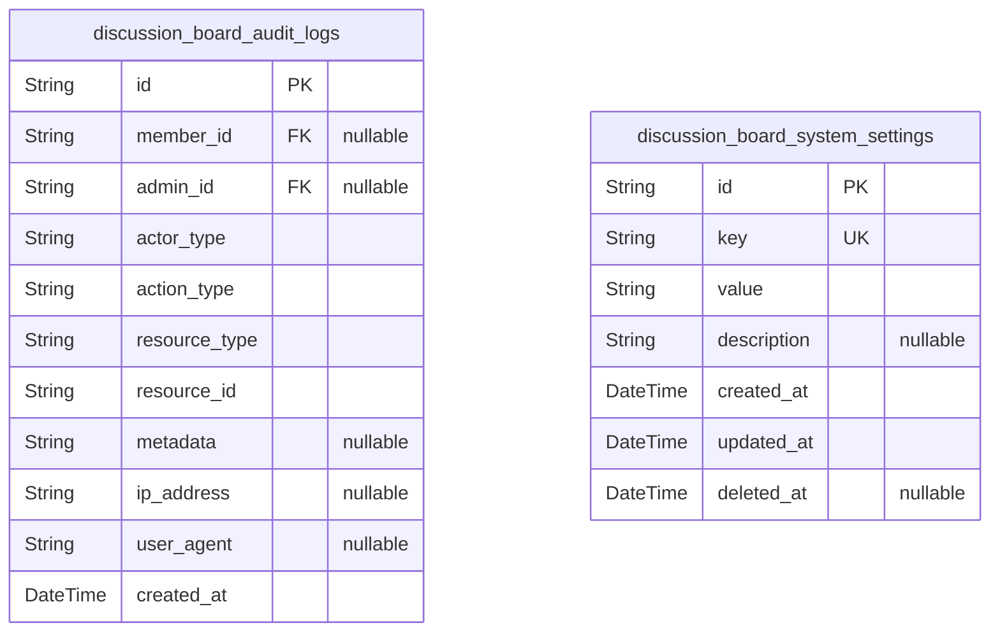
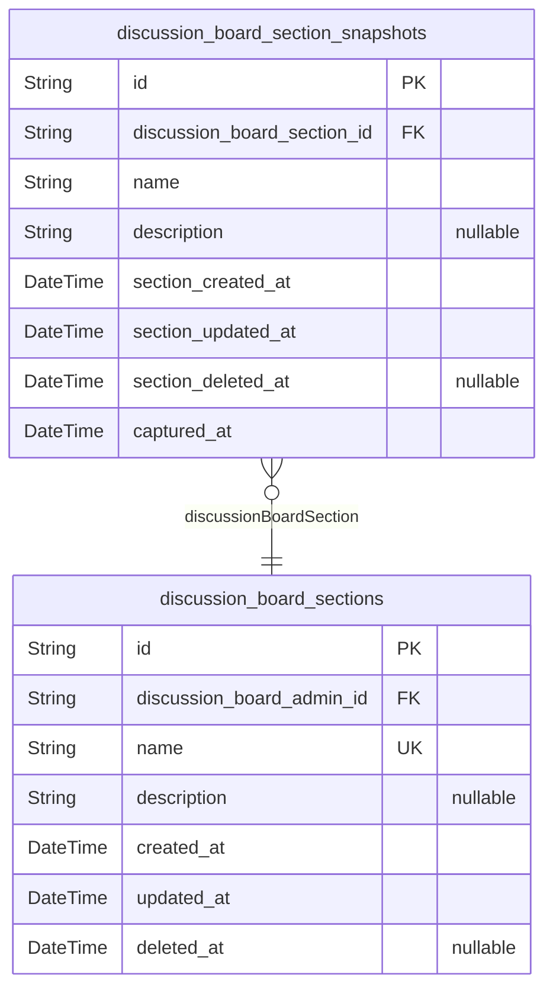
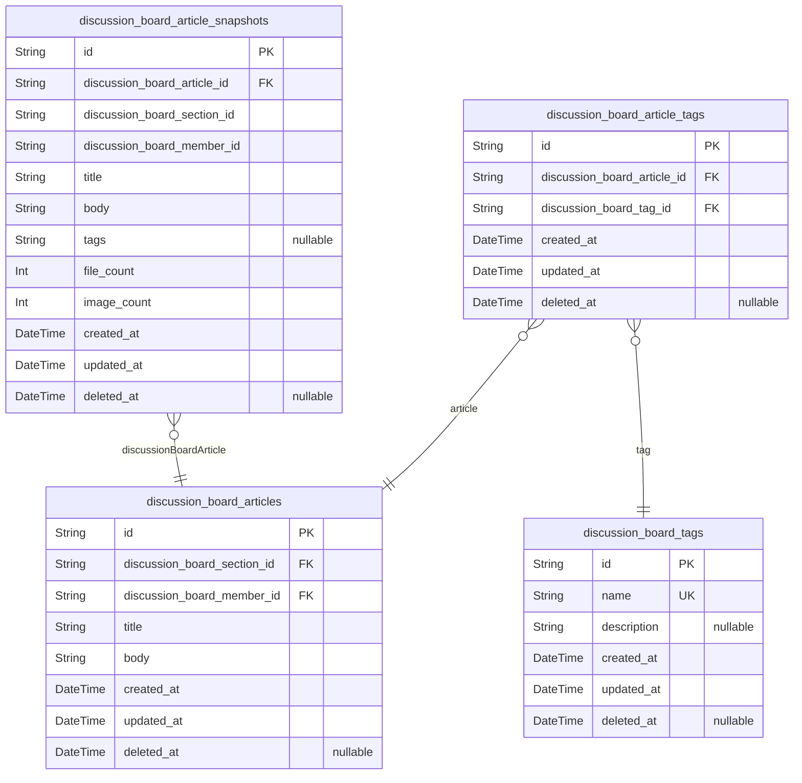
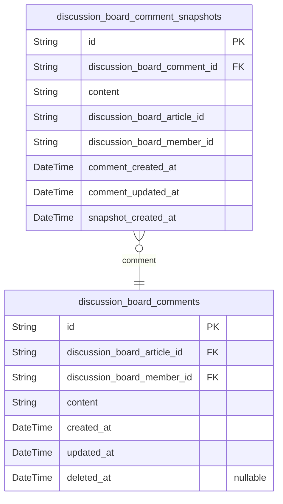
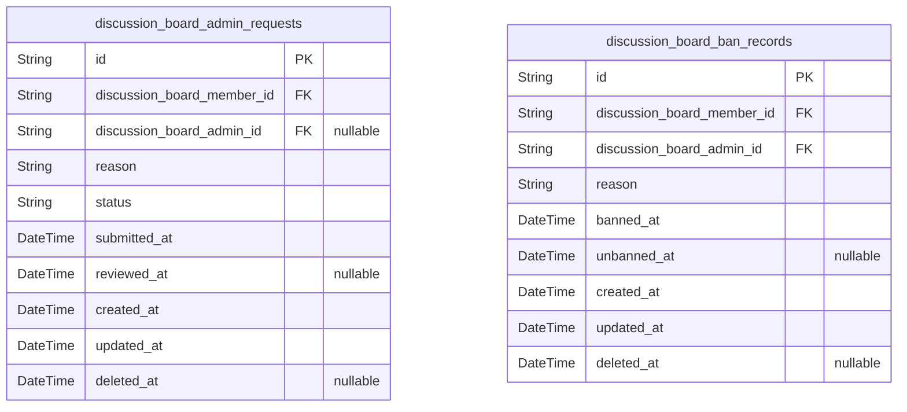

# Prisma Markdown

> Generated by [`prisma-markdown`](https://github.com/samchon/prisma-markdown)

- [Actors](#actors)
- [Systematic](#systematic)
- [Sections](#sections)
- [Articles](#articles)
- [Comments](#comments)
- [Moderation](#moderation)

## Actors

```mermaid
erDiagram
"discussion_board_guests" {
  String id PK
  String device_fingerprint UK
  DateTime created_at
  DateTime updated_at
  DateTime deleted_at "nullable"
}
"discussion_board_guest_sessions" {
  String id PK
  String discussion_board_guest_id FK
  String ip
  String href
  String referrer
  DateTime created_at
  DateTime expired_at
}
"discussion_board_members" {
  String id PK
  String email UK
  String password_hash
  String display_name
  String bio "nullable"
  String ban_status
  String ban_reason "nullable"
  DateTime created_at
  DateTime updated_at
  DateTime deleted_at "nullable"
}
"discussion_board_member_sessions" {
  String id PK
  String discussion_board_member_id FK
  String ip
  String href
  String referrer
  DateTime created_at
  DateTime updated_at
  DateTime expired_at
}
"discussion_board_member_password_resets" {
  String id PK
  String discussion_board_member_id FK
  String token UK
  DateTime expires_at
  DateTime used_at "nullable"
  DateTime created_at
  DateTime updated_at
  DateTime deleted_at "nullable"
}
"discussion_board_member_email_verifications" {
  String id PK
  String discussion_board_member_id FK
  String token UK
  DateTime expires_at
  DateTime verified_at "nullable"
  DateTime created_at
  DateTime updated_at
  DateTime deleted_at "nullable"
}
"discussion_board_admins" {
  String id PK
  String email UK
  String password_hash
  String display_name
  String bio "nullable"
  String grade
  DateTime created_at
  DateTime updated_at
  DateTime deleted_at "nullable"
}
"discussion_board_admin_sessions" {
  String id PK
  String discussion_board_admin_id FK
  String ip
  String href
  String referrer "nullable"
  DateTime created_at
  DateTime expired_at
}
"discussion_board_admin_password_resets" {
  String id PK
  String discussion_board_admin_id FK
  String token UK
  DateTime expires_at
  DateTime created_at
  DateTime updated_at
  DateTime deleted_at "nullable"
}
"discussion_board_admin_audit_logs" {
  String id PK
  String discussion_board_admin_id FK
  String action_type
  String resource_type
  String resource_id "nullable"
  String description
  String ip_address "nullable"
  DateTime created_at
  DateTime updated_at
  DateTime deleted_at "nullable"
}
"discussion_board_guest_sessions" }o--|| "discussion_board_guests" : guest
"discussion_board_member_sessions" }o--|| "discussion_board_members" : member
"discussion_board_member_password_resets" }o--|| "discussion_board_members" : member
"discussion_board_member_email_verifications" }o--|| "discussion_board_members" : member
"discussion_board_admin_sessions" }o--|| "discussion_board_admins" : discussionBoardAdmin
"discussion_board_admin_password_resets" }o--|| "discussion_board_admins" : admin
"discussion_board_admin_audit_logs" }o--|| "discussion_board_admins" : admin
```

### `discussion_board_guests`

Temporary guest accounts identified by device fingerprint for anonymous
browsing access. Guest actors can view sections, articles, comments, and
search content without full authentication. Each guest is uniquely
identified by their device fingerprint for session continuity across
requests. This table serves as the root identity record for guest actors,
with sessions tracked in discussion_board_guest_sessions.

Properties as follows:

- `id`: Primary Key.
- `device_fingerprint`
  > Unique device fingerprint identifying the guest user across sessions.
  > Generated from device characteristics for anonymous identification.
- `created_at`: Timestamp when the guest account was created.
- `updated_at`: Timestamp when the guest account was last updated.
- `deleted_at`
  > Timestamp when the guest account was soft deleted. Null indicates active
  > account.

### `discussion_board_guest_sessions`

Temporary session tokens for guest access with device-based
identification. This table tracks all active sessions for guest users,
storing connection metadata including IP address, page href, and referrer
information for security auditing and session management. Sessions are
append-only records that expire based on the expired_at timestamp.

Key relationships:
- Belongs to [discussion_board_guests](#discussion_board_guests) via discussion_board_guest_id
- One guest can have multiple sessions (1:N relationship)
- Sessions are managed through authentication flows, not direct user CRUD
operations

Properties as follows:

- `id`: Primary Key.
- `discussion_board_guest_id`: Guest account this session belongs to. [discussion_board_guests.id](#discussion_board_guests).
- `ip`
  > Client IP address for the session connection. Used for security auditing
  > and session validation.
- `href`
  > Current page URL (href) when session was created. Tracks user navigation
  > context.
- `referrer`
  > Referrer URL that led to session creation. Used for analytics and
  > security tracking.
- `created_at`
  > Session creation timestamp. Records when the guest logged in or accessed
  > the system.
- `expired_at`
  > Session expiration timestamp. Sessions are invalidated after this time
  > for security purposes. NOT NULL to ensure all sessions have defined
  > lifecycles.

### `discussion_board_members`

Registered member accounts with email/password authentication credentials
and profile information. Members can create articles, write comments, and
request administrator access. This table serves as the primary identity
record for member actors, with sessions tracked separately in
discussion_board_member_sessions. Ban status is tracked here to control
login and content access permissions.

Properties as follows:

- `id`: Primary Key.
- `email`
  > Email address for authentication and account identification. Must be
  > unique across all member accounts.
- `password_hash`
  > BCrypt hashed password for secure authentication. Never stored or
  > transmitted in plaintext.
- `display_name`
  > Public display name shown on articles, comments, and user profiles. Used
  > to identify the member in the discussion board.
- `bio`
  > Optional user biography or profile description. Provides additional
  > context about the member to other users.
- `ban_status`
  > Current ban status controlling login and content access. Values: 'active'
  > (normal access), 'banned' (login blocked). Updated via
  > discussion_board_ban_records.
- `ban_reason`
  > Reason for ban if ban_status is 'banned'. Set by administrator when
  > creating ban record in discussion_board_ban_records.
- `created_at`: Account creation timestamp. Records when the member registered.
- `updated_at`
  > Last profile update timestamp. Updated on display_name, bio, or ban
  > status changes.
- `deleted_at`
  > Soft deletion timestamp for account removal. When set, account is
  > logically deleted but data preserved for audit.

### `discussion_board_member_sessions`

JWT session tokens for member authentication with access and refresh
token support.

This table tracks login sessions for discussion_board_members, storing
connection context including IP address, page href, and referrer for
security auditing. Each member can have multiple concurrent sessions, and
sessions are managed through authentication flows rather than direct user
CRUD operations.

Sessions are append-only audit trails that record when members log in and
when their sessions expire. The expired_at field is mandatory (NOT NULL)
to enforce session timeout policies and prevent indefinite access.

Properties as follows:

- `id`: Primary Key.
- `discussion_board_member_id`: Member's [discussion_board_members.id](#discussion_board_members) that owns this session.
- `ip`: Client IP address for session tracking and security auditing.
- `href`: Page href where login occurred for connection context.
- `referrer`: Referrer URL for connection context and analytics.
- `created_at`: Session creation timestamp for audit trail.
- `updated_at`: Session last update timestamp for audit trail.
- `expired_at`
  > Session expiration timestamp. NOT NULL by default for security to enforce
  > session timeout.

### `discussion_board_member_password_resets`

Password reset tokens for member account recovery with expiration
timestamps. This table stores one-time use tokens that members receive
via email to reset their passwords. Each token has a limited validity
period and is invalidated after use.

Relationships: Belongs to [discussion_board_members](#discussion_board_members) via
discussion_board_member_id. A member can have multiple password reset
requests over time, but only one active reset token at a time.

Usage Pattern: When a member requests a password reset, a new token is
generated with an expiration time. The token is sent via email and can be
used once to reset the password. After use or expiration, the token
becomes invalid.

Properties as follows:

- `id`: Primary Key.
- `discussion_board_member_id`
  > Target member's [discussion_board_members.id](#discussion_board_members). The member
  > requesting the password reset.
- `token`
  > Unique password reset token. This is a cryptographically secure random
  > string sent to the member's email for account recovery.
- `expires_at`
  > Token expiration timestamp. Password reset tokens are valid only until
  > this time and become invalid after expiration.
- `used_at`
  > Timestamp when the token was used for password reset. Null if the token
  > has not been used yet. After use, the token is invalidated.
- `created_at`: Record creation timestamp. When the password reset request was initiated.
- `updated_at`
  > Record last update timestamp. Updated when token is used or status
  > changes.
- `deleted_at`
  > Soft deletion timestamp. Marks the record as deleted while preserving
  > audit trail.

### `discussion_board_member_email_verifications`

Email verification tokens for member registration confirmation. Stores
temporary tokens sent to member email addresses during registration
process, tracking expiration and verification status for account
activation workflow.

This table supports the member registration authentication flow by
maintaining verification tokens that must be validated before account
activation. Tokens expire after a configured duration and are marked as
verified upon successful confirmation.

Related entities:
- [discussion_board_members](#discussion_board_members): Parent member account that requested
verification
- [discussion_board_member_sessions](#discussion_board_member_sessions): Session created after
successful email verification

Properties as follows:

- `id`: Primary Key.
- `discussion_board_member_id`
  > Member account requesting email verification. {@link
  > discussion_board_members.id}
- `token`: Cryptographically secure verification token sent to member email address.
- `expires_at`: Token expiration timestamp. Token becomes invalid after this time.
- `verified_at`
  > Timestamp when email verification was successfully completed. Null if not
  > yet verified.
- `created_at`: Record creation timestamp.
- `updated_at`: Record last update timestamp.
- `deleted_at`: Soft deletion timestamp for audit trail.

### `discussion_board_admins`

Administrator accounts with email/password authentication and elevated
privilege levels. This table represents the primary identity record for
administrators who manage sections, moderate content, ban/unban users,
and review administrator requests. Each administrator has one-to-many
sessions stored in [discussion_board_admin_sessions](#discussion_board_admin_sessions), password
reset tokens in [discussion_board_admin_password_resets](#discussion_board_admin_password_resets), and audit
logs in [discussion_board_admin_audit_logs](#discussion_board_admin_audit_logs).

Properties as follows:

- `id`: Primary Key.
- `email`: Administrator's unique email address for authentication and communication.
- `password_hash`: Bcrypt hashed password for secure authentication.
- `display_name`: Public display name shown to users in the discussion board.
- `bio`: Optional biography or description of the administrator.
- `grade`
  > Administrator grade level: 'regular' for standard admins, 'super' for
  > super administrators who can manage other administrators.
- `created_at`: Timestamp when the administrator account was created.
- `updated_at`: Timestamp when the administrator account was last updated.
- `deleted_at`
  > Timestamp when the administrator account was soft-deleted. Null if
  > account is active.

### `discussion_board_admin_sessions`

JWT session tokens for administrator authentication with access and
refresh token support.

This table tracks all login sessions for [discussion_board_admins](#discussion_board_admins)
administrators, storing connection metadata including IP address, page
reference, and referrer information for security auditing and session
management. Each session record represents a single authenticated session
with expiration tracking for automatic logout enforcement.

Key relationships:
- Belongs to exactly one [discussion_board_admins](#discussion_board_admins) administrator
account
- Many sessions per administrator (1:N relationship)
- Append-only audit trail of login events

Behavioral notes:
- Sessions are managed through authentication flows, not direct user CRUD
- Expired sessions should be periodically cleaned up
- Connection context enables security monitoring and anomaly detection

Properties as follows:

- `id`: Primary Key.
- `discussion_board_admin_id`: Administrator's [discussion_board_admins.id](#discussion_board_admins) who owns this session.
- `ip`: Client IP address for connection tracking and security auditing.
- `href`: Current page URL (href) where authentication occurred.
- `referrer`: Referrer URL indicating the page that led to authentication.
- `created_at`: Session creation timestamp marking when the administrator logged in.
- `expired_at`
  > Session expiration timestamp for automatic logout enforcement. NOT NULL
  > by default for security.

### `discussion_board_admin_password_resets`

Password reset tokens for administrator account recovery with expiration
timestamps.

This table stores one-time use tokens generated when administrators
request password resets. Each token is associated with a specific admin
account and has a limited validity period for security purposes. After
successful password reset or expiration, tokens are soft-deleted.

Key relationships:
- Belongs to [discussion_board_admins](#discussion_board_admins) through
discussion_board_admin_id
- Tokens are single-use and expire automatically

Security notes:
- Tokens should be cryptographically secure random strings
- Tokens expire after a short period (e.g., 1 hour)
- Old tokens are invalidated when new ones are generated

Properties as follows:

- `id`: Primary Key.
- `discussion_board_admin_id`
  > Administrator account requesting password reset. {@link
  > discussion_board_admins.id}
- `token`: Cryptographically secure random token for password reset verification.
- `expires_at`: Token expiration timestamp. Tokens become invalid after this time.
- `created_at`: Token creation timestamp.
- `updated_at`: Token last update timestamp.
- `deleted_at`: Soft deletion timestamp for token cleanup.

### `discussion_board_admin_audit_logs`

Audit trail recording all administrator actions for security and
compliance tracking. This table captures immutable records of
administrative operations including article/comment CRUD, user
bans/unbans, section management, and admin request approvals. Each record
references the acting administrator, action type, affected resource, and
timestamp for accountability and forensic analysis. {@link
discussion_board_admins.id}.

Use cases:
- Security audit trails for compliance requirements
- Forensic analysis of administrative actions
- Accountability tracking for moderator actions
- System monitoring and anomaly detection

Properties as follows:

- `id`: Primary Key.
- `discussion_board_admin_id`
  > Administrator who performed the action. {@link
  > discussion_board_admins.id}.
- `action_type`
  > Type of administrative action performed (e.g., ARTICLE_CREATE,
  > ARTICLE_DELETE, USER_BAN, SECTION_UPDATE, ADMIN_REQUEST_APPROVE).
- `resource_type`
  > Type of resource affected by the action (e.g., article, comment, section,
  > user, admin_request, ban_record).
- `resource_id`
  > UUID of the affected resource. Nullable for actions without specific
  > resource target.
- `description`: Human-readable description of the action performed with business context.
- `ip_address`: IP address from which the action was performed for security tracking.
- `created_at`: Timestamp when the audit record was created.
- `updated_at`: Timestamp when the audit record was last updated.
- `deleted_at`
  > Timestamp when the audit record was soft-deleted. Audit records are
  > typically never deleted for compliance.

## Systematic

### `discussion_board_audit_logs`

Immutable audit trail recording all system actions including
article/comment CRUD operations, user bans/unbans, section management,
and admin request approvals.

This table serves as a centralized compliance and accountability
mechanism, tracking every significant action performed across the
platform. Each record captures the actor who performed the action, the
action type, the affected resource, and contextual metadata.

Key relationships:
- References [discussion_board_members](#discussion_board_members) for member actions
- References [discussion_board_admins](#discussion_board_admins) for administrator actions
- References various resources through polymorphic resource_type and
resource_id fields

Behavioral notes:
- Append-only: Records are never modified or deleted
- No soft delete: deleted_at is always null for audit integrity
- Polymorphic references: Uses resource_type + resource_id to track
different entity types
- Actor tracking: Uses member_id or admin_id based on actor type
performing the action

Properties as follows:

- `id`: Primary Key.
- `member_id`
  > Member who performed the action, if applicable. References {@link
  > discussion_board_members.id}. Null for admin actions or system-triggered
  > events.
- `admin_id`
  > Administrator who performed the action, if applicable. References {@link
  > discussion_board_admins.id}. Null for member actions or system-triggered
  > events.
- `actor_type`
  > Type of actor who performed the action: 'member' for registered users,
  > 'admin' for administrators, 'system' for automated processes.
- `action_type`
  > Specific action performed. Values: 'article.create', 'article.update',
  > 'article.delete', 'comment.create', 'comment.update', 'comment.delete',
  > 'section.create', 'section.update', 'section.delete', 'user.ban',
  > 'user.unban', 'admin_request.submit', 'admin_request.approve',
  > 'admin_request.reject', 'file.upload', 'file.delete', 'image.upload',
  > 'image.delete'.
- `resource_type`
  > Type of resource affected by the action: 'article', 'comment', 'section',
  > 'user', 'admin_request', 'file_attachment', 'image_attachment'. Used with
  > resource_id for polymorphic reference.
- `resource_id`
  > UUID of the affected resource. Combined with resource_type for
  > polymorphic reference to [discussion_board_articles.id](#discussion_board_articles), {@link
  > discussion_board_comments.id}, [discussion_board_sections.id](#discussion_board_sections), etc.
- `metadata`
  > Optional JSON string containing additional context about the action
  > (e.g., ban reason, old/new values for updates, request details). Stored
  > as string to maintain database portability.
- `ip_address`
  > IP address of the client that performed the action. Used for security
  > auditing and abuse detection.
- `user_agent`
  > User agent string from the client request. Used for device/browser
  > identification in audit trails.
- `created_at`: Timestamp when the action occurred. Immutable once set.

### `discussion_board_system_settings`

System-wide configuration settings for platform parameters, feature
flags, and operational thresholds accessible across all domains. Stores
key-value pairs with audit trail for centralized system configuration
management.

Properties as follows:

- `id`: Primary Key.
- `key`
  > Unique setting identifier used to reference this configuration value
  > across the system.
- `value`
  > The configuration value for this setting. Format depends on the setting
  > type (boolean, number, string, JSON).
- `description`
  > Optional human-readable description explaining the purpose and valid
  > values of this setting.
- `created_at`: Timestamp when this system setting was created.
- `updated_at`: Timestamp when this system setting was last updated.
- `deleted_at`
  > Timestamp when this system setting was soft-deleted. Null if the setting
  > is active.

## Sections

### `discussion_board_sections`

Discussion board sections organizing articles into topic categories with
administrator-managed lifecycle states. Each section represents a
distinct topic area (e.g., Politics, Economy, Current Affairs) and serves
as the primary organizational structure for content browsing and
filtering. Sections are created and managed exclusively by
administrators, while all actors can browse and view articles within
sections. [discussion_board_articles](#discussion_board_articles) belong to sections through a
many-to-one relationship, and [discussion_board_admins](#discussion_board_admins) create and
maintain sections.

Properties as follows:

- `id`: Primary Key.
- `discussion_board_admin_id`
  > Administrator who created this section. {@link
  > discussion_board_admins.id}.
- `name`
  > Unique section name identifying the topic category (e.g., 'Politics',
  > 'Economy', 'Technology'). Used for URL slugs and display purposes.
- `description`
  > Detailed description explaining the section's topic focus and content
  > guidelines.
- `created_at`: Timestamp when the section was created.
- `updated_at`: Timestamp when the section was last modified.
- `deleted_at`
  > Timestamp when the section was soft-deleted. Null indicates active
  > section.

### `discussion_board_section_snapshots`

Point-in-time snapshots of section data for audit trail and historical
tracking. Captures denormalized section states at specific moments to
enable historical reconstruction and compliance auditing. Each snapshot
is immutable and append-only, recording the complete state of a {@link
discussion_board_sections} entity at the time of capture.

Properties as follows:

- `id`: Primary Key.
- `discussion_board_section_id`: Referenced section's [discussion_board_sections.id](#discussion_board_sections).
- `name`: Section name denormalized from parent entity.
- `description`: Section description denormalized from parent entity.
- `section_created_at`: Original section creation timestamp denormalized from parent entity.
- `section_updated_at`: Original section last update timestamp denormalized from parent entity.
- `section_deleted_at`: Original section soft-delete timestamp denormalized from parent entity.
- `captured_at`: Timestamp when this snapshot was captured.

## Articles

### `discussion_board_articles`

Core article entities representing user-generated content with title,
body text, and metadata. Each article belongs to exactly one section for
categorization and is owned by one member who has full control over
editing and deletion. Articles support soft deletion to preserve content
history while removing them from public views. The article body and title
are indexed for full-text search capabilities, enabling users to discover
content through keyword matching. Article attachments (files and images)
are managed through separate junction tables to maintain normalization
principles. Comment counts are computed dynamically rather than stored to
ensure data consistency.

Properties as follows:

- `id`: Primary Key.
- `discussion_board_section_id`
  > Section that categorizes this article. {@link
  > discussion_board_sections.id}. Articles must belong to exactly one
  > section for organizational purposes.
- `discussion_board_member_id`
  > Member who owns and authored this article. {@link
  > discussion_board_members.id}. Only the owner can edit or delete the
  > article, unless an administrator performs moderation actions.
- `title`
  > Article title displayed in lists and article pages. Required for article
  > creation with maximum character limit enforcement for display purposes.
  > Used for search indexing.
- `body`
  > Main content text of the article. Required for article creation with
  > minimum and maximum character length validation. Used for search
  > indexing.
- `created_at`
  > Timestamp when the article was originally published. Preserved throughout
  > article lifecycle and editing operations.
- `updated_at`
  > Timestamp when the article was last modified. Updated whenever title,
  > body, or metadata changes.
- `deleted_at`
  > Timestamp when the article was soft-deleted. When null, article is
  > visible; when set, article is hidden from lists but preserved for audit
  > purposes. Administrators can permanently remove articles.

### `discussion_board_tags`

Tag definitions for article categorization and search. Tags are reusable
across multiple articles enabling flexible content organization and
filtering. Each tag has a unique name and optional description for
context.

Tags support:
- Article categorization through M:N relationship with {@link
discussion_board_articles}
- Search and filtering across articles
- Independent tag management and discovery

See [discussion_board_article_tags](#discussion_board_article_tags) for the junction table linking
tags to articles.

Properties as follows:

- `id`: Primary Key.
- `name`: Unique tag name used for article categorization and search filtering.
- `description`: Optional description providing context about the tag's purpose and usage.
- `created_at`: Timestamp when the tag was created.
- `updated_at`: Timestamp when the tag was last updated.
- `deleted_at`: Timestamp when the tag was soft-deleted for archival purposes.

### `discussion_board_article_tags`

Junction table linking articles to tags in a many-to-many relationship
for flexible categorization and search.

This table enables articles to have multiple tags and tags to be
associated with multiple articles. Each row represents a single
article-tag association, allowing for efficient filtering and browsing by
tag categories.

Key relationships:
- References [discussion_board_articles.id](#discussion_board_articles) for article ownership
- References [discussion_board_tags.id](#discussion_board_tags) for tag categorization
- Composite unique constraint prevents duplicate article-tag associations

Business behavior:
- Created when tags are assigned to articles during creation or editing
- Deleted when tags are removed from articles or when articles are
deleted (cascade)
- Supports efficient tag-based article queries and tag popularity
calculations

Properties as follows:

- `id`: Primary Key.
- `discussion_board_article_id`: Referenced article's [discussion_board_articles.id](#discussion_board_articles).
- `discussion_board_tag_id`: Referenced tag's [discussion_board_tags.id](#discussion_board_tags).
- `created_at`: Record creation timestamp for audit trail.
- `updated_at`: Record last update timestamp for modification tracking.
- `deleted_at`
  > Soft deletion timestamp for logical removal while preserving historical
  > data.

### `discussion_board_article_snapshots`

Point-in-time snapshots of articles capturing historical states for audit
trail and version history tracking. Each snapshot records the complete
article data at a specific moment, enabling reconstruction of article
states over time and compliance with data retention policies. Snapshots
are created automatically when articles are created, updated, or deleted
to preserve immutable historical records. References {@link
discussion_board_articles} for the current article state and {@link
discussion_board_members} for article ownership.

Properties as follows:

- `id`: Primary Key.
- `discussion_board_article_id`
  > Target article's [discussion_board_articles.id](#discussion_board_articles). Links this
  > snapshot to its parent article for historical tracking.
- `discussion_board_section_id`
  > Section identifier where the article was categorized at snapshot time.
  > Denormalized from [discussion_board_sections.id](#discussion_board_sections) for historical
  > accuracy.
- `discussion_board_member_id`
  > Article owner's member identifier at snapshot time. Denormalized from
  > [discussion_board_members.id](#discussion_board_members) for ownership audit trail.
- `title`
  > Article title captured at snapshot time. Preserves historical title even
  > if article is later edited.
- `body`
  > Article body content captured at snapshot time. Preserves historical
  > content for version comparison and audit purposes.
- `tags`
  > Comma-separated tag list at snapshot time. Preserves historical
  > categorization for search and filtering audit trails.
- `file_count`
  > Number of file attachments at snapshot time. Tracks attachment history
  > for storage audit.
- `image_count`
  > Number of image attachments at snapshot time. Tracks image history for
  > storage audit.
- `created_at`
  > Snapshot creation timestamp. Records when this historical state was
  > captured.
- `updated_at`: Last update timestamp for the snapshot record.
- `deleted_at`
  > Soft deletion timestamp for snapshot records. Allows archival while
  > preserving audit trail.

## Comments

### `discussion_board_comments`

Single-level comments on articles with author attribution and article
references. Each comment belongs to exactly one article and one member,
supporting independent editing and deletion by owners. Comments enable
article discussion without threading capabilities.

Key relationships:
- Belongs to [discussion_board_articles](#discussion_board_articles) via
discussion_board_article_id (1:N relationship)
- Written by [discussion_board_members](#discussion_board_members) via
discussion_board_member_id (1:N relationship)

Behavioral notes:
- Article deletion cascades to all associated comments
- Owners can edit and delete their own comments
- Administrators can delete any comment for moderation
- Soft deletion via deleted_at field preserves audit trail
- Chronological display ordered by created_at (oldest first)

Properties as follows:

- `id`: Primary Key.
- `discussion_board_article_id`
  > Referenced article's [discussion_board_articles.id](#discussion_board_articles). Comment
  > belongs to this article.
- `discussion_board_member_id`
  > Author member's [discussion_board_members.id](#discussion_board_members). Comment written by
  > this member.
- `content`
  > Comment text content. The actual message or response written by the
  > member.
- `created_at`
  > Timestamp when the comment was initially created. Used for chronological
  > ordering.
- `updated_at`
  > Timestamp when the comment was last modified. Updated on each edit
  > operation.
- `deleted_at`
  > Timestamp when the comment was soft-deleted. Null if comment is active.
  > Preserves audit trail while hiding from normal queries.

### `discussion_board_comment_snapshots`

Point-in-time snapshots of comments for audit trail and historical
tracking. Captures comment state at the time of edits or deletions,
enabling review of comment modification history and accountability. Each
snapshot is immutable once created and references its parent {@link
discussion_board_comments}.

Snapshots are automatically created when:
- A comment is edited (captures previous state)
- A comment is deleted (captures state before deletion)

This table supports audit requirements and enables administrators to
review comment modification history for moderation purposes.

Properties as follows:

- `id`: Primary Key.
- `discussion_board_comment_id`
  > Parent comment's [discussion_board_comments.id](#discussion_board_comments). Each snapshot
  > belongs to exactly one comment.
- `content`
  > Comment content at the time of snapshot. Denormalized from parent comment
  > for historical accuracy.
- `discussion_board_article_id`
  > Article's [discussion_board_articles.id](#discussion_board_articles) that the comment belonged
  > to. Denormalized for efficient querying without joining parent comment.
- `discussion_board_member_id`
  > Member's [discussion_board_members.id](#discussion_board_members) who authored the comment.
  > Denormalized for efficient querying without joining parent comment.
- `comment_created_at`
  > Original comment creation timestamp. Denormalized from parent comment for
  > historical accuracy.
- `comment_updated_at`
  > Comment's last update timestamp at the time of snapshot. Denormalized
  > from parent comment.
- `snapshot_created_at`
  > Timestamp when this snapshot was created. Records the exact moment the
  > comment state was captured.

## Moderation

### `discussion_board_admin_requests`

Administrator privilege requests submitted by members for super
administrator review. Members request admin status with justification
reasons, and super administrators review/approve/reject these requests.
Tracks request lifecycle from submission through final decision with
accountability timestamps.

Key relationships:
- [discussion_board_members.id](#discussion_board_members): The member who submitted the request
- [discussion_board_admins.id](#discussion_board_admins): The super administrator who
reviewed the request (null until reviewed)

Status workflow: pending → approved/rejected (terminal states)

Properties as follows:

- `id`: Primary Key.
- `discussion_board_member_id`
  > Submitting member's [discussion_board_members.id](#discussion_board_members). The member
  > requesting administrator privileges.
- `discussion_board_admin_id`
  > Reviewing super administrator's [discussion_board_admins.id](#discussion_board_admins). Null
  > until request is reviewed.
- `reason`
  > Member's justification for requesting administrator privileges. Explains
  > why they believe they should have admin access.
- `status`
  > Request status in workflow. Values: 'pending' (awaiting review),
  > 'approved' (granted admin status), 'rejected' (denied). Terminal states:
  > approved, rejected.
- `submitted_at`: Timestamp when member submitted the administrator request.
- `reviewed_at`
  > Timestamp when super administrator reviewed and made decision on the
  > request. Null if still pending.
- `created_at`: Record creation timestamp.
- `updated_at`: Record last update timestamp.
- `deleted_at`: Soft deletion timestamp for administrative archival.

### `discussion_board_ban_records`

User ban records with moderation accountability and audit trail.

This table tracks all user ban actions taken by administrators, including
the reason for banning, timestamp, and the administrator who performed
the action. Ban records enable:

- Login restriction enforcement for banned users
- Ban reason recording and visibility to administrators
- User unbanning process with audit history
- Banned user list management and review
- Ban accountability through administrator attribution

Each ban record references [discussion_board_members.id](#discussion_board_members) for the
banned user and [discussion_board_admins.id](#discussion_board_admins) for the administrator
who created the ban. When a user is unbanned, the unbanned_at timestamp
is recorded but the ban record remains for historical audit purposes.

Related entities: [discussion_board_members](#discussion_board_members), {@link
discussion_board_admins}, [discussion_board_audit_logs](#discussion_board_audit_logs)

Properties as follows:

- `id`: Primary Key.
- `discussion_board_member_id`
  > Banned user's [discussion_board_members.id](#discussion_board_members). This reference enables
  > login restriction enforcement and content visibility rules for banned
  > accounts.
- `discussion_board_admin_id`
  > Administrator who created the ban's [discussion_board_admins.id](#discussion_board_admins).
  > Provides accountability and audit trail for moderation actions.
- `reason`
  > Reason for banning the user. Required field documenting the moderation
  > decision and violation details.
- `banned_at`
  > Timestamp when the user was banned. Used for enforcing login restrictions
  > and calculating ban duration.
- `unbanned_at`
  > Timestamp when the user was unbanned. Nullable to track active vs
  > historical bans. When set, login restrictions are lifted but record
  > remains for audit.
- `created_at`: Record creation timestamp for audit trail and ordering.
- `updated_at`: Record last update timestamp for tracking modifications.
- `deleted_at`
  > Soft deletion timestamp. Ban records are typically retained permanently
  > for audit purposes but may be soft-deleted for data management.
