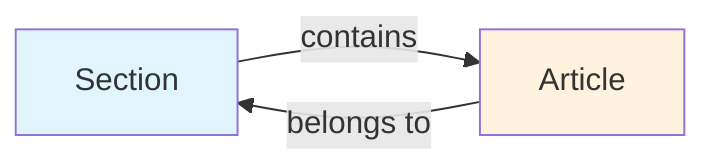
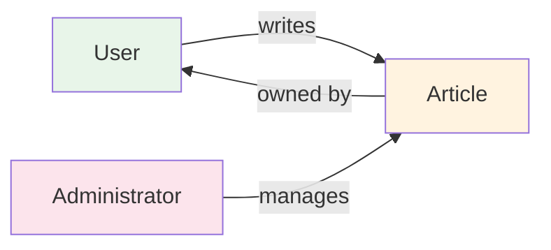
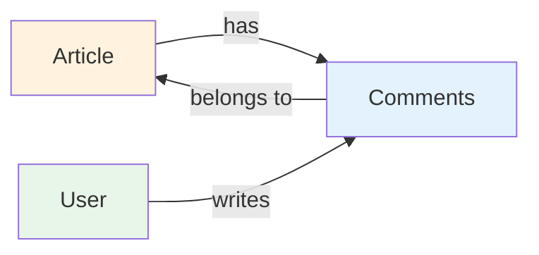
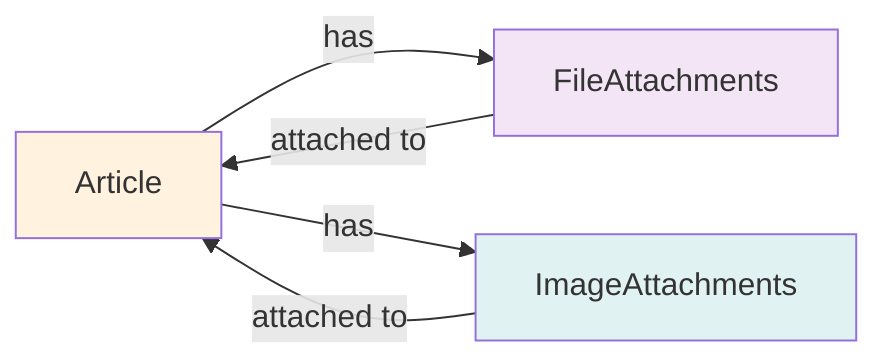
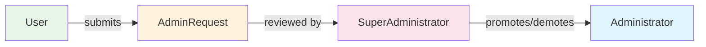
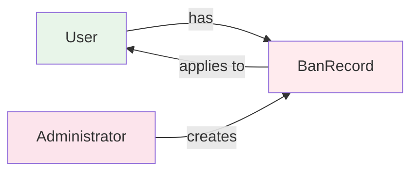

**discussionBoard — Business concepts, relationships, and states from user perspective**

Business concepts, relationships, and states from user perspective

# Domain Concepts

Describe what each concept means to users and why it exists.

## User Concept

Users are the primary actors on the discussion board platform. Each user has a unique account created with email and password credentials. Users maintain a public profile containing a display name and bio text that represents them to the community. Users can edit their own display name and bio information at any time. Users can view other members' profiles to learn about contributors and their participation history. A user's profile displays all articles they have authored and all comments they have written across the platform. Users can change their password to maintain account security. Users have the option to delete their account, which removes all their articles and comments from the system. The platform tracks user activity through their articles and comments for profile visibility.

### User Registration

WHEN a new user registers on the platform, THE system SHALL require a valid email address.

WHEN a new user registers on the platform, THE system SHALL require a password.

WHEN a user completes registration, THE system SHALL create a unique user identity.

WHEN a user registers, THE system SHALL store the email address for authentication purposes.

WHEN a user registers, THE system SHALL store the password securely.

IF the email address is already registered, THE system SHALL reject the registration request.

IF the password does not meet security requirements, THE system SHALL reject the registration request.

THE system SHALL require users to provide a display name upon registration.

THE system SHALL allow users to provide an optional bio text during registration.

THE system SHALL ensure each registered user has a unique identifier for identity tracking.

### Login Authentication

WHEN a registered user attempts to log in, THE system SHALL verify the provided email address.

WHEN a registered user attempts to log in, THE system SHALL verify the provided password.

WHEN login credentials are valid, THE system SHALL establish an authenticated session.

WHEN login credentials are invalid, THE system SHALL reject the login attempt.

WHEN a user is banned, THE system SHALL prevent the user from logging in.

WHEN a user is banned, THE system SHALL display a message indicating the account is restricted.

WHEN a user successfully logs in, THE system SHALL maintain the session for the duration of activity.

IF the session expires, THE system SHALL require the user to re-authenticate.

THE system SHALL ensure login authentication protects user account access.

THE system SHALL prevent unauthorized access to user accounts through authentication.

### Profile Management

WHEN a user views their profile, THE system SHALL display their display name.

WHEN a user views their profile, THE system SHALL display their bio text.

WHEN a user views their profile, THE system SHALL display a list of articles they have written.

WHEN a user views their profile, THE system SHALL display a list of comments they have written.

WHEN a user edits their profile, THE system SHALL allow them to update their display name.

WHEN a user edits their profile, THE system SHALL allow them to update their bio text.

WHEN another user views a profile, THE system SHALL show the public profile information.

WHEN another user views a profile, THE system SHALL display the articles written by that user.

WHEN another user views a profile, THE system SHALL display the comments written by that user.

THE system SHALL ensure profile visibility allows users to discover other members.

THE system SHALL ensure profile information represents user identity to the community.

THE system SHALL allow users to customize their profile appearance through display name and bio.

### Account Security

WHEN a user changes their password, THE system SHALL verify the current password.

WHEN a user changes their password, THE system SHALL require a new password.

WHEN a user changes their password, THE system SHALL update the stored credentials securely.

IF the current password is incorrect, THE system SHALL reject the password change request.

IF the new password does not meet security requirements, THE system SHALL reject the password change request.

WHEN a user deletes their account, THE system SHALL remove all articles written by the user.

WHEN a user deletes their account, THE system SHALL remove all comments written by the user.

WHEN a user deletes their account, THE system SHALL remove the user profile.

WHEN a user deletes their account, THE system SHALL require confirmation before deletion.

THE system SHALL ensure account deletion is permanent and irreversible.

THE system SHALL ensure account security protects user credentials from unauthorized access.

THE system SHALL maintain account security through secure password storage.

THE system SHALL allow users to maintain account security by changing passwords periodically.

## Section Concept

Sections organize the discussion board into distinct topic areas for better content navigation. Common sections include Politics, Economy, and Current Affairs based on the platform's focus. Each section has a name and description that explains its purpose to users. Administrators exclusively create and manage all sections on the platform. Regular users can view the complete list of available sections to understand the board's structure. Users browse articles within specific sections to find content relevant to their interests. When creating an article, users must select exactly one section to categorize their contribution. Sections provide the primary organizational framework for all discussion content on the board.

### Section Organization and Topic Categorization

Sections organize the discussion board into distinct topic areas for better content navigation.

WHEN users access the discussion board, THE system SHALL present sections as the primary organizational structure for all content.

THE system SHALL support topic areas including Politics, Economy, and Current Affairs based on the platform's focus.

WHEN content is added to the board, THE system SHALL categorize it under an appropriate section for discoverability.

THE system SHALL ensure each section represents a coherent topic area that users can understand and navigate.

WHILE browsing the platform, users SHALL see content grouped by section to facilitate topic-based exploration.

THE system SHALL maintain clear boundaries between sections to prevent content overlap and confusion.

WHEN a user searches for content, THE system SHALL allow filtering results by section to narrow the scope.

THE system SHALL ensure section organization supports both casual browsing and targeted content discovery.

### Section Management and Administrator Control

Administrators have exclusive control over section creation, modification, and deletion.

WHEN a section needs to be created, THE system SHALL require administrator authentication before allowing the operation.

THE system SHALL prevent regular users from creating new sections on the platform.

WHEN an administrator creates a section, THE system SHALL record the administrator as the creator.

WHEN a section needs modification, THE system SHALL restrict updates to administrators only.

THE system SHALL prevent regular users from editing section names or descriptions.

WHEN a section needs deletion, THE system SHALL require administrator authorization.

THE system SHALL allow administrators to remove sections that are no longer relevant to the platform.

WHILE managing sections, administrators SHALL have full control over the section lifecycle.

THE system SHALL ensure section management operations are logged for administrative accountability.

WHEN section changes occur, THE system SHALL propagate updates to all users viewing affected content.

THE system SHALL prevent unauthorized users from accessing section management functions.

### Section Browsing and Navigation

Users can view and navigate through all available sections on the platform.

WHEN a user accesses the board homepage, THE system SHALL display the complete list of available sections.

THE system SHALL present section names and descriptions in a browsable format.

WHEN users click on a section, THE system SHALL navigate them to the section's article listing.

THE system SHALL allow users to browse articles within any section without restrictions.

WHILE viewing a section, users SHALL see all articles categorized under that section.

THE system SHALL provide clear navigation indicators showing the current section context.

WHEN users move between sections, THE system SHALL maintain their browsing state appropriately.

THE system SHALL ensure section navigation is intuitive and requires minimal clicks to reach content.

WHEN a section has no articles, THE system SHALL display an appropriate message indicating no content exists.

THE system SHALL allow guests to browse sections without requiring authentication.

### Article Categorization by Section

Every article must be assigned to exactly one section upon creation.

WHEN a user creates an article, THE system SHALL require selection of one section for categorization.

THE system SHALL prevent article creation without an assigned section.

WHEN users create content, THE system SHALL present available sections for selection.

THE system SHALL ensure each article belongs to only one section at any time.

WHEN an article is viewed, THE system SHALL display its assigned section clearly.

THE system SHALL allow users to see all articles within a specific section.

WHEN users browse a section, THE system SHALL show only articles belonging to that section.

THE system SHALL maintain the section-article relationship for content organization.

WHEN an article is edited, THE system SHALL allow changing its assigned section if needed.

THE system SHALL ensure section assignment affects article visibility and discoverability.

WHEN content is filtered by section, THE system SHALL return only articles from that section.

### Section Description and Identification

Each section has a name and description that identifies its purpose to users.

THE system SHALL require a unique name for each section to distinguish it from others.

WHEN displaying sections, THE system SHALL show the section name prominently.

THE system SHALL require a description for each section to explain its purpose.

WHEN users view a section, THE system SHALL display the description to provide context.

THE system SHALL ensure section descriptions are visible to all users browsing the board.

WHEN administrators create a section, THE system SHALL validate that both name and description are provided.

THE system SHALL allow administrators to update section names and descriptions as needed.

WHEN section names change, THE system SHALL update all references throughout the platform.

THE system SHALL ensure section descriptions help users understand what topics belong in each section.

WHEN users encounter a new section, THE system SHALL provide sufficient information through the description.

THE system SHALL maintain section identification information for consistent display across the platform.

### Section State and Lifecycle

Sections follow a lifecycle from creation through potential removal.

WHEN a section is created, THE system SHALL set its initial state as active.

THE system SHALL maintain section visibility for all active sections.

WHILE a section is active, THE system SHALL allow users to view and contribute to it.

WHEN an administrator deletes a section, THE system SHALL mark it as removed from the platform.

THE system SHALL prevent users from accessing deleted sections.

WHEN a section is deleted, THE system SHALL handle existing articles according to deletion policies.

THE system SHALL ensure section state changes are reflected immediately across all user views.

WHILE managing sections, administrators SHALL see the current state of each section.

THE system SHALL prevent orphaned content when sections are removed.

WHEN section lifecycle events occur, THE system SHALL notify affected users appropriately.

## Article Concept

Articles are the primary content units where users share economic and political discussions. Each article requires a title and content text to be published on the platform. Users must assign every article to one section for proper categorization. Authors can attach multiple files and images to enrich their articles with supporting materials. Users can add free-text tags to articles for improved discoverability and filtering. Authors retain full ownership and can edit their own articles including title, content, attachments, and tags. Users can delete their own articles when they no longer wish to publish them. Articles display the author's name, tags, comment count, and posting time in article lists. The full article content becomes visible when users view individual articles on the platform.

### Article Creation

WHEN a user creates an article, THE system SHALL:
1. Require the user to provide a title
2. Require the user to provide content text
3. Require the user to select exactly one section for categorization
4. Allow the user to attach multiple files to the article
5. Allow the user to attach multiple images to the article
6. Allow the user to add multiple free-text tags to the article
7. Record the creation timestamp when the article is published
8. Associate the article with the creating user as the author

IF the title is missing, THE system SHALL reject the article creation.
IF the content is missing, THE system SHALL reject the article creation.
IF no section is selected, THE system SHALL reject the article creation.

WHEN an article is created, THE system SHALL make it visible to all users in the article list of the assigned section.

### Article Visibility

WHEN a user views an article in a section list, THE system SHALL display:
1. The article title
2. The author's display name
3. The article's tags
4. The comment count for the article
5. The time the article was posted

WHEN a user views a single article page, THE system SHALL display:
1. The full article title
2. The author's display name
3. The complete article content
4. All attached files with download capability
5. All attached images with download capability
6. All tags associated with the article
7. The posting time of the article

IF the article belongs to a section, THE system SHALL show the article in that section's article list.
IF the article has no attachments, THE system SHALL display that no attachments are available.

### Article Attachments

WHEN a user attaches files to an article, THE system SHALL:
1. Allow multiple files to be attached to a single article
2. Record the filename for each attached file
3. Record the file size for each attached file
4. Record the upload date for each attached file
5. Allow users to download attached files

WHEN a user attaches images to an article, THE system SHALL:
1. Allow multiple images to be attached to a single article
2. Record the filename for each attached image
3. Record the file size for each attached image
4. Record the upload date for each attached image
5. Allow users to download attached images

IF no files are attached, THE system SHALL indicate that no file attachments exist.
IF no images are attached, THE system SHALL indicate that no image attachments exist.

### Article Tagging

WHEN a user adds tags to an article, THE system SHALL:
1. Allow the user to enter free-text tags
2. Allow multiple tags to be added to a single article
3. Store each tag as a separate tag entry
4. Display all tags on the article page
5. Display all tags in the article list

WHEN users search or filter articles, THE system SHALL:
1. Allow filtering articles by tags
2. Include tagged articles in search results when tags match

IF no tags are added, THE system SHALL display that no tags are associated with the article.

### Article Editing

WHEN an article owner edits their article, THE system SHALL:
1. Allow the owner to update the article title
2. Allow the owner to update the article content
3. Allow the owner to modify attached files
4. Allow the owner to modify attached images
5. Allow the owner to add, remove, or modify tags
6. Preserve the original creation timestamp
7. Record the update timestamp when changes are made

IF the user is not the article owner, THE system SHALL reject the edit request.
IF the article has been deleted, THE system SHALL reject the edit request.

### Article Deletion and Ownership

WHEN an article owner deletes their article, THE system SHALL:
1. Remove the article from all article lists
2. Remove the article from the assigned section
3. Delete all file attachments associated with the article
4. Delete all image attachments associated with the article
5. Remove all tags associated with the article
6. Remove all comments associated with the article
7. Update the comment count on the author's profile

IF the user is not the article owner, THE system SHALL reject the deletion request.
IF the user is an administrator, THE system SHALL allow deletion of any article regardless of ownership.

WHEN an article is deleted, THE system SHALL permanently remove all associated content and comments from the platform.

## Comment Concept

Comments enable users to engage in discussions beneath published articles. Each comment contains content text created by a registered user. Comments are single-level only with no nested reply structure. Users can view all comments posted on any article they are reading. Comments display the author name, content text, and posting time to readers. Comments are sorted chronologically with oldest comments appearing first. Authors can edit their own comments to correct errors or update their thoughts. Users can delete their own comments when they no longer wish to participate in a discussion. Comments facilitate community engagement and dialogue around article topics.

### Comment Creation

WHEN a user writes a comment on an article, THE system SHALL:
1. Require the user to be logged in
2. Require comment content text
3. Associate the comment with the specific article
4. Record the posting timestamp
5. Record the author identity

IF the user is not logged in, THE system SHALL prevent comment submission.
IF the comment content is empty, THE system SHALL reject the request.
IF the target article does not exist, THE system SHALL reject the request.

Comment content SHALL be plain text that users can write to express their opinions on article topics.

### Comment Structure and Authorship

THE system SHALL support single-level comments only, with no nested reply structure.

WHEN viewing comments on an article, THE system SHALL display:
1. The author's display name (defined in User Concept)
2. The comment content text
3. The posting timestamp

Comment authorship SHALL be permanently associated with the original author.

THE system SHALL NOT support reply-to-reply functionality.
THE system SHALL NOT support threading or nested comment structures.

### Comment Viewing and Article Discussion

WHEN a user views an article, THE system SHALL display all comments posted on that article.

Comments SHALL be visible to all users who can view the article.

WHEN a user accesses an article page, THE system SHALL load:
1. All comments associated with the article
2. Author information for each comment
3. Content text for each comment
4. Timestamp for each comment

Comment visibility SHALL follow the same access rules as the parent article.

### Comment Sorting and Chronology

Comments SHALL be sorted chronologically with oldest comments appearing first.

WHEN displaying comments, THE system SHALL order them by:
1. Primary sort: creation timestamp (ascending)
2. This ensures chronological discussion flow

THE system SHALL maintain chronological order when new comments are added.

Comment chronology SHALL reflect the actual posting sequence, enabling readers to follow the discussion timeline from start to current state.

### Comment Editing and Deletion

WHEN a user edits their own comment, THE system SHALL:
1. Allow modification of the comment content text
2. Preserve the original posting timestamp
3. Record the update timestamp
4. Maintain the author association

IF the user attempts to edit another user's comment, THE system SHALL reject the request.
IF the comment does not exist, THE system SHALL reject the request.

WHEN a user deletes their own comment, THE system SHALL:
1. Remove the comment from the article
2. Update the article's comment count
3. Permanently delete the comment content

IF the user attempts to delete another user's comment, THE system SHALL reject the request.
IF the comment does not exist, THE system SHALL reject the request.

Administrators SHALL have the ability to delete any comment (defined in Administrator Capabilities).

## FileAttachment Concept

File attachments allow users to share supporting documents with their articles. Users can attach multiple files to a single article to provide additional context or evidence. Common file types include documents, spreadsheets, and other data files relevant to discussions. Files are associated with specific articles and become part of the article content. Readers can download attached files when viewing articles that contain them. File attachments enhance articles by providing tangible resources for readers to reference. Authors manage file attachments when creating or editing their articles. The platform supports multiple file uploads per article for comprehensive content sharing.

### File Attachment Creation

WHEN a user creates an article, THE system SHALL allow them to attach supporting documents to the article.
WHEN a user edits an article, THE system SHALL allow them to add new file attachments.
WHEN a user creates or edits an article, THE system SHALL require them to specify which files to attach.
THE system SHALL associate each uploaded file with the specific article for which it was submitted.
THE system SHALL maintain the relationship between file attachments and their parent article.

IF the file upload fails, THE system SHALL inform the user that the attachment could not be added.
IF the user attempts to attach files to an article they cannot access, THE system SHALL reject the request.
IF the file exceeds the platform's size limits, THE system SHALL prevent the upload and notify the user.

File attachments become an integral part of the article content and are managed together with the article's title, content, and tags.

### Document Sharing

THE system SHALL enable users to share supporting documents through file attachments on articles.
THE system SHALL make attached files accessible to all users who can view the parent article.
WHEN a user views an article with file attachments, THE system SHALL display a list of available supporting documents.
THE system SHALL indicate that files are attached to an article in the article list view.

Document sharing through attachments SHALL enhance the discussion by providing tangible resources for readers to reference.
THE system SHALL preserve the original document when sharing it through the attachment feature.

IF an article has no file attachments, THE system SHALL indicate that no supporting documents are available.
IF a user does not have permission to view an article, THE system SHALL not display its attached files.

### Multiple File Uploads

WHEN a user attaches files to an article, THE system SHALL support uploading multiple files in a single operation.
THE system SHALL allow users to attach several supporting documents to a single article simultaneously.
THE system SHALL process each file in a multi-file upload independently.

IF the total number of attachments exceeds the platform limit, THE system SHALL reject the additional files and inform the user.
IF one file in a multi-file upload fails, THE system SHALL complete the upload for successful files and report the failure for the failed file.

Multiple file uploads SHALL enable comprehensive content sharing for articles that require multiple supporting resources.

### File Download

WHEN a user views an article with file attachments, THE system SHALL provide a download option for each attached file.
THE system SHALL allow users to download attached files when they have permission to view the parent article.
WHEN a user initiates a file download, THE system SHALL deliver the file in its original format.
THE system SHALL preserve the original filename when files are downloaded by users.

IF the attached file no longer exists, THE system SHALL inform the user that the download cannot be completed.
IF the user does not have permission to view the article, THE system SHALL prevent them from downloading its attachments.

File downloads SHALL enable readers to save supporting documents for offline reference.

### Article Enrichment

THE system SHALL enhance articles by allowing file attachments as supplementary materials to the main content.
File attachments SHALL provide additional context, evidence, or resources that support the article's discussion topic.
THE system SHALL treat file attachments as an integral component of article content.

WHEN an article is viewed, THE system SHALL display attached files alongside the article's title, content, and tags.
THE system SHALL indicate the presence of attachments in the article summary view.

Article enrichment through attachments SHALL enable users to provide comprehensive discussions with supporting documentation.

IF an article has no attachments, THE system SHALL display the article content normally without attachment indicators.

### File Association

THE system SHALL maintain the relationship between file attachments and their parent articles.
WHEN an article is created, THE system SHALL establish file associations for all uploaded attachments.
THE system SHALL ensure that file attachments remain linked to their parent article throughout the article's lifecycle.

IF an article is moved to a different section, THE system SHALL maintain all file associations with the article.
IF an article is edited, THE system SHALL preserve existing file associations unless explicitly removed by the user.

File association SHALL ensure that supporting documents remain accessible only through their parent articles.

THE system SHALL track which user uploaded each file attachment for audit purposes.

### Attachment Management

WHEN a user edits their article, THE system SHALL allow them to manage attached files.
THE system SHALL enable article authors to add new file attachments when editing their articles.
THE system SHALL enable article authors to remove existing file attachments from their articles.
THE system SHALL allow article authors to replace file attachments when editing their articles.

IF a user attempts to manage attachments on an article they do not own, THE system SHALL reject the request.
IF an administrator deletes an article, THE system SHALL also remove all associated file attachments.

Attachment management SHALL be restricted to article authors and administrators with appropriate permissions.

WHEN a user deletes their account, THE system SHALL remove all file attachments from their articles as part of account deletion.

### Resource Sharing

THE system SHALL enable users to share resources through file attachments on articles.
Resource sharing through attachments SHALL support the platform's goal of facilitating comprehensive economic and political discussions.
THE system SHALL make attached resources discoverable when users browse articles in sections.

WHEN users search for articles, THE system SHALL include information about attached resources in search results.
THE system SHALL allow users to identify articles with resource attachments before viewing full content.

Resource sharing SHALL enhance the value of articles by providing downloadable supporting materials.

IF a resource attachment becomes unavailable, THE system SHALL indicate that the resource cannot be accessed.

## ImageAttachment Concept

Image attachments enable users to include visual content within their articles. Users can attach multiple images to a single article to illustrate points or provide visual evidence. Images are displayed alongside article content for enhanced reader engagement. Readers can download attached images when viewing articles that contain them. Image attachments complement text content with charts, graphs, photographs, and other visual materials. Authors manage image attachments during article creation and editing. The platform supports multiple image uploads per article for rich visual storytelling. Images help make complex economic and political topics more accessible through visualization.

### Image Attachment Basics

WHEN a user creates an article, THE system SHALL allow attaching images to illustrate the content.

WHEN a user edits an article, THE system SHALL allow adding new images to existing attachments.

THE system SHALL display attached images alongside the article content for enhanced reader engagement.

THE system SHALL support common image formats for user convenience.

THE system SHALL render images in a readable size within the article view.

THE system SHALL preserve the visual quality of uploaded images for clear presentation.

WHEN images are attached to an article, THE system SHALL associate them with that specific article.

THE system SHALL make images visible to all users who can view the article.

IF an article has no images attached, THE system SHALL display the article content without image placeholders.

### Multiple Image Uploads

WHEN a user attaches images to an article, THE system SHALL allow multiple image uploads in a single operation.

THE system SHALL support uploading several images to enrich article content with visual materials.

THE system SHALL enable visual storytelling by allowing authors to present multiple images in sequence.

WHEN multiple images are uploaded, THE system SHALL preserve the upload order for consistent display.

THE system SHALL display all uploaded images in the article view without requiring pagination.

WHEN a user views an article with multiple images, THE system SHALL show all images in a logical flow.

THE system SHALL allow authors to arrange images to support narrative progression.

IF the number of images exceeds system limits, THE system SHALL reject the excess uploads with a clear message.

### Image Display and Download

WHEN a user views an article, THE system SHALL display all attached images with the article content.

WHEN a user clicks on an attached image, THE system SHALL provide a download option.

THE system SHALL allow downloading images in their original resolution.

WHEN an image is downloaded, THE system SHALL preserve the original filename.

THE system SHALL ensure images are clearly visible on both desktop and mobile devices.

IF an image fails to load, THE system SHALL display an error message indicating the issue.

THE system SHALL show image captions or filenames to help readers identify each image.

WHEN viewing an article, THE system SHALL display images in a consistent layout for readability.

### Image Association with Articles

WHEN an image is attached to an article, THE system SHALL create a permanent association between them.

THE system SHALL ensure images remain linked to their parent article throughout the article lifecycle.

WHEN an article is deleted by its author, THE system SHALL also remove all associated images.

WHEN an article is deleted by an administrator, THE system SHALL also remove all associated images.

THE system SHALL maintain image order within an article to preserve visual narrative.

WHEN images are associated with an article, THE system SHALL track them as part of the article metadata.

IF an article is moved to a different section, THE system SHALL preserve all image associations.

THE system SHALL prevent images from being associated with multiple articles simultaneously.

### Attachment Management

WHEN a user edits an article, THE system SHALL allow removing specific images from attachments.

WHEN a user edits an article, THE system SHALL allow reordering the sequence of attached images.

THE system SHALL provide visual feedback during image upload to indicate progress.

WHEN an image upload fails, THE system SHALL allow the user to retry the upload.

THE system SHALL validate image files before accepting them as attachments.

WHEN managing attachments, THE system SHALL display a preview of each uploaded image.

THE system SHALL allow authors to replace images during article editing.

IF an image is corrupted or invalid, THE system SHALL reject it and notify the user.

WHEN viewing their own articles, THE system SHALL provide attachment management controls to the author.

## AdminRequest Concept

Admin requests allow any user to apply for administrator privileges on the platform. Users submit requests with a written reason explaining why they should become administrators. Super administrators review and manage all pending administrator requests. Super administrators can approve requests to grant administrator status to users. Super administrators can reject requests when they do not meet platform needs. Approved users transition from regular users to regular administrators with expanded capabilities. The request system ensures administrator positions are filled through a controlled approval process. This maintains platform governance and prevents unauthorized privilege escalation.

### Admin Request Submission

WHEN a registered user wants administrator privileges, THE system SHALL allow them to submit an administrator application.

WHEN a user submits an administrator application, THE system SHALL:
1. Require the user to provide a reason explaining why they should become an administrator
2. Record the submission timestamp
3. Set the request status to pending
4. Associate the request with the submitting user

THE system SHALL store the request reason as provided by the user without modification.

THE system SHALL prevent users from submitting multiple pending administrator requests simultaneously.

IF a user already has a pending administrator request, THE system SHALL reject any new submission attempt.

IF the user is banned, THE system SHALL prevent them from submitting an administrator request.

IF the user is already an administrator, THE system SHALL prevent them from submitting a new administrator application.

### Request Review Process

WHEN an administrator application is submitted, THE system SHALL make it visible to administrators for review.

WHEN an administrator reviews administrator requests, THE system SHALL display:
1. The submitting user's identity
2. The request reason provided by the user
3. The submission timestamp
4. The current request status

WHEN an administrator accesses the pending requests list, THE system SHALL show all requests with pending status.

WHILE a request has pending status, THE system SHALL prevent any user other than administrators from modifying it.

THE system SHALL allow administrators to view the complete history of all administrator requests, including approved and rejected ones.

IF a request is approved, THE system SHALL transition the submitting user from regular user to regular administrator status.

IF a request is rejected, THE system SHALL maintain the user's current status as a regular user.

IF a request is rejected, THE system SHALL record the rejection with a timestamp but SHALL NOT require a reason to be stored.

### Request Decision Outcomes

WHEN an administrator approves an administrator request, THE system SHALL:
1. Change the request status from pending to approved
2. Record the review timestamp
3. Grant the submitting user regular administrator privileges
4. Notify the user of the approval decision

WHEN an administrator rejects an administrator request, THE system SHALL:
1. Change the request status from pending to rejected
2. Record the review timestamp
3. Maintain the submitting user as a regular user
4. Notify the user of the rejection decision

THE system SHALL prevent regular administrators from approving or rejecting administrator requests.

THE system SHALL prevent regular administrators from viewing the administrator request review interface.

IF a request status is approved, THE system SHALL prevent any further status changes to that request.

IF a request status is rejected, THE system SHALL allow the user to submit a new administrator application after a reasonable period.

### Administrator Onboarding and Governance

WHEN a user's administrator request is approved, THE system SHALL transition them from regular user to regular administrator through controlled privilege escalation.

THE system SHALL enforce governance control by requiring administrator approval for all administrator onboarding.

WHEN a user becomes a regular administrator through the request process, THE system SHALL grant them capabilities including:
1. Creating, editing, and deleting sections
2. Deleting any article on the platform
3. Deleting any comment on the platform
4. Banning and unbanning users
5. Viewing the list of banned users

THE system SHALL prevent unauthorized privilege escalation by blocking any direct assignment of administrator status without administrator approval.

WHEN a user transitions to administrator status, THE system SHALL maintain a record of the transition including the approving administrator.

THE system SHALL ensure that administrator onboarding follows the established approval workflow without exceptions.

IF a user is demoted from administrator status, THE system SHALL revoke all administrator capabilities immediately.

THE system SHALL prevent privilege escalation attempts through any channel other than the official administrator request process.

## BanRecord Concept

Ban records document when administrators restrict user access to the platform. When a user is banned, they cannot log in or access any platform features. Banned users' existing articles and comments remain visible to other users for historical context. Administrators record a reason when banning a user to document the violation or issue. Administrators can view the list of all banned users and their ban reasons. Administrators have the ability to unban users when restrictions should be lifted. Ban records maintain accountability and transparency in moderation decisions. The system tracks who imposed each ban for audit purposes.

### User Banning Process

WHEN an administrator bans a user, THE system SHALL:
1. Restrict the user's access to all platform features
2. Record the ban with a reason provided by the administrator
3. Document the administrator who imposed the ban for accountability
4. Record the timestamp when the ban was imposed
5. Prevent the user from logging in to the platform

WHILE a user is banned, THE system SHALL:
1. Deny access to all platform features including article creation, commenting, and profile access
2. Maintain visibility of the user's existing articles and comments for other users
3. Prevent the user from submitting requests to become an administrator

IF an administrator attempts to ban themselves, THE system SHALL reject the action.

THE system SHALL ensure that banning a user is a moderation action that can be reversed through the unbanning process.

### Login Prevention

WHEN a banned user attempts to log in, THE system SHALL:
1. Prevent authentication from succeeding
2. Display a message indicating the account has been restricted
3. Not reveal whether the account exists or the specific ban reason to the user

WHEN a banned user attempts to access the platform with an active session, THE system SHALL:
1. Terminate the session immediately
2. Redirect the user to a restriction notification page

THE system SHALL enforce login prevention for all banned users regardless of their previous role or privileges.

IF a user's ban status changes from banned to unbanned, THE system SHALL allow them to log in normally.

### Ban Reason Recording

WHEN an administrator bans a user, THE system SHALL:
1. Require a text reason explaining the ban justification
2. Store the ban reason with the ban record for administrative review
3. Associate the ban reason with the administrator who imposed the ban

WHEN an administrator views a banned user's record, THE system SHALL:
1. Display the recorded ban reason
2. Show the administrator who imposed the ban
3. Display the timestamp when the ban was imposed

THE system SHALL maintain the ban reason as part of the ban record for accountability and audit purposes.

THE system SHALL ensure ban reasons are visible to administrators but not to the banned user or other platform users.

### Banned User List and Review

WHEN an administrator requests to view banned users, THE system SHALL:
1. Display a list of all currently banned users
2. Show each user's display name and ban reason
3. Show the administrator who imposed each ban
4. Show the timestamp when each ban was imposed

THE system SHALL allow administrators to review the complete ban history for accountability purposes.

WHEN an administrator reviews a banned user, THE system SHALL:
1. Display the user's ban reason (defined in Ban Reason Recording)
2. Display the administrator who imposed the ban (defined in Ban Reason Recording)
3. Display the ban timestamp (defined in Ban Reason Recording)

THE system SHALL ensure only administrators can access the banned user list.

### User Unbanning

WHEN an administrator unbans a user, THE system SHALL:
1. Remove the access restriction from the user's account
2. Allow the user to log in to the platform normally
3. Restore the user's ability to create articles and comments
4. Maintain the historical record of the ban for administrative review

WHEN a user is unbanned, THE system SHALL:
1. Allow the user to access all platform features immediately
2. Preserve the user's existing articles and comments
3. Preserve the user's profile information

THE system SHALL ensure that unbanning is a moderation action that can only be performed by administrators.

THE system SHALL maintain the ban record even after unbanning for audit and accountability purposes.

### Ban Accountability and Moderation

THE system SHALL maintain ban records for all user bans to ensure moderation action accountability.

WHEN an administrator imposes a ban, THE system SHALL:
1. Record the administrator's identity with the ban record
2. Require a justification reason for the ban
3. Timestamp the ban action for audit purposes

THE system SHALL ensure that all moderation actions related to banning are traceable to the administrator who performed them.

WHEN reviewing ban records, THE system SHALL display:
1. The banned user's identity
2. The ban reason provided by the administrator
3. The administrator who imposed the ban
4. The timestamp of the ban action

THE system SHALL ensure ban accountability supports administrative oversight and prevents abuse of moderation powers.

# Domain Relationships

Describe how concepts relate to each other from a business perspective.

## Conceptual Relationships

Describe how concepts relate to each other in business terms.

### Section-Article Relationship

WHEN an article is created, THE system SHALL associate it with exactly one section.
WHILE an article exists, THE system SHALL maintain its association with a section.

### Section-Article Association

THE system SHALL allow administrators to create sections.
THE system SHALL allow administrators to edit section names and descriptions.
THE system SHALL allow administrators to delete sections.
THE system SHALL prevent deletion of sections that contain articles.

### Article-Section Belongs-To Relationship

WHEN a user creates an article, THE system SHALL require selection of one section.
WHEN viewing a section, THE system SHALL display all articles belonging to that section.
WHEN an article is deleted, THE system SHALL remove it from its section's article list.

### Section Content Visibility

WHEN a user browses a section, THE system SHALL show articles within that section.
WHEN a section has no articles, THE system SHALL display an empty state message.

### User-Article Ownership Relationship

WHEN a user creates an article, THE system SHALL record the user as the article owner.
WHILE an article exists, THE system SHALL maintain ownership by the creating user.

### User-Article Ownership

THE system SHALL allow users to create multiple articles.
THE system SHALL allow users to view all articles they have written.
THE system SHALL allow article owners to edit their articles.
THE system SHALL allow article owners to delete their articles.

### Article Ownership Restrictions

IF a user is not the article owner, THE system SHALL prevent editing the article.
IF a user is not the article owner, THE system SHALL prevent deleting the article.
IF an article owner deletes their account, THE system SHALL delete all their articles.

### Administrator Article Management

WHEN an administrator deletes an article, THE system SHALL remove it regardless of ownership.
WHEN an administrator deletes an article, THE system SHALL record the deletion action.

### Article-Comment Relationship

WHEN an article exists, THE system SHALL allow multiple comments to be associated with it.
WHILE comments exist on an article, THE system SHALL maintain their association.

### Article-Comment Association

THE system SHALL allow users to create comments on articles.
THE system SHALL allow users to view all comments on an article.
THE system SHALL display comments sorted by oldest first.
THE system SHALL show comment count on article listings.

### Comment Ownership

WHEN a user creates a comment, THE system SHALL record the user as the comment owner.
THE system SHALL allow comment owners to edit their comments.
THE system SHALL allow comment owners to delete their comments.

### Comment Ownership Restrictions

IF a user is not the comment owner, THE system SHALL prevent editing the comment.
IF a user is not the comment owner, THE system SHALL prevent deleting the comment.
IF a comment owner deletes their account, THE system SHALL delete all their comments.

### Administrator Comment Management

WHEN an administrator deletes a comment, THE system SHALL remove it regardless of ownership.
WHEN an administrator deletes a comment, THE system SHALL record the deletion action.

### Article-Attachment Relationship

WHEN an article is created, THE system SHALL allow multiple file attachments to be associated with it.
WHILE an article exists, THE system SHALL maintain all file attachment associations.

### Article-FileAttachment Association

THE system SHALL allow users to upload multiple files to an article.
THE system SHALL allow users to download files attached to articles.
THE system SHALL store filename, file path, file size, and upload date for each file.

### Article-ImageAttachment Association

THE system SHALL allow users to upload multiple images to an article.
THE system SHALL allow users to download images attached to articles.
THE system SHALL store filename, image path, file size, and upload date for each image.

### Attachment Ownership

WHEN a user attaches files or images, THE system SHALL record the user as the uploader.
THE system SHALL allow article owners to manage attachments on their articles.

### Attachment Deletion

WHEN an article is deleted, THE system SHALL delete all associated attachments.
WHEN an article owner deletes their account, THE system SHALL delete all their attachments.

### User-AdminRequest Relationship

WHEN a user submits an admin request, THE system SHALL associate it with that user.
WHILE a request exists, THE system SHALL maintain the user-request association.

### User-AdminRequest Association

THE system SHALL allow any user to submit an admin request with a reason.
THE system SHALL record the submission date for each request.
THE system SHALL track the request status (pending, approved, rejected).

### Request Review Relationship

WHEN a super administrator reviews a request, THE system SHALL record the review date.
WHEN a request is approved, THE system SHALL grant administrator access to the user.
WHEN a request is rejected, THE system SHALL retain the rejection record.

### Administrator Grade Association

WHEN a user becomes an administrator, THE system SHALL assign a grade (regular or super).
THE system SHALL allow super administrators to promote regular administrators.
THE system SHALL allow super administrators to demote other super administrators.
THE system SHALL prevent super administrators from demoting themselves.

### User-BanRecord Relationship

WHEN a user is banned, THE system SHALL create a ban record associated with that user.
WHILE a ban exists, THE system SHALL maintain the user-ban association.

### User-BanRecord Association

THE system SHALL record the ban reason for each banned user.
THE system SHALL record the ban date for each ban.
THE system SHALL record which administrator created the ban.

### Ban Enforcement

WHEN a user is banned, THE system SHALL prevent them from logging in.
WHEN a user is banned, THE system SHALL keep their existing articles visible.
WHEN a user is banned, THE system SHALL keep their existing comments visible.

### Administrator Ban Management

THE system SHALL allow administrators to view the list of banned users.
THE system SHALL allow administrators to view ban reasons for each banned user.
THE system SHALL allow administrators to unban users.

## Lifecycle and Retention

Describe business rules for concept lifecycle and data retention from a user perspective.

### Article Lifecycle

WHEN a user creates an article, THE system SHALL:
1. Record the creation timestamp
2. Associate the article with the author user
3. Assign the article to a selected section
4. Store the article title and content
5. Allow attachment of multiple files and images
6. Allow addition of multiple free-text tags

WHEN a user edits their own article, THE system SHALL:
1. Update the title and content
2. Modify attachments (add, remove, or replace files and images)
3. Update the tags
4. Preserve the original creation timestamp
5. Record the update timestamp

WHEN a user deletes their own article, THE system SHALL:
1. Remove the article from the section
2. Remove all associated file and image attachments
3. Remove all comments associated with the article (cascade deletion)
4. Preserve the deletion in accordance with retention policy

IF an administrator deletes an article, THE system SHALL:
1. Remove the article from the section
2. Remove all associated file and image attachments
3. Remove all comments associated with the article (cascade deletion)
4. Record the administrator who performed the deletion

WHILE an article exists, THE system SHALL:
1. Make it visible to all users in the section article list
2. Display the title, author, tags, comment count, and posting time
3. Allow any user to view the full article content
4. Allow any user to download attached files and images

### Comment Lifecycle

WHEN a user creates a comment on an article, THE system SHALL:
1. Record the creation timestamp
2. Associate the comment with the author user
3. Link the comment to the target article
4. Store the comment content

WHEN a user edits their own comment, THE system SHALL:
1. Update the comment content
2. Record the update timestamp
3. Preserve the original creation timestamp

WHEN a user deletes their own comment, THE system SHALL:
1. Remove the comment from the article
2. Remove the comment from the user's profile comment list

IF an administrator deletes a comment, THE system SHALL:
1. Remove the comment from the article
2. Remove the comment from the user's profile comment list
3. Record the administrator who performed the deletion

WHILE a comment exists, THE system SHALL:
1. Display the author, content, and posting time on the article page
2. Sort comments by oldest first
3. Include the comment in the article's comment count

WHEN an article is deleted, THE system SHALL:
1. Cascade delete all comments on that article
2. Remove the comments from all users' profile comment lists

### User Account Lifecycle

WHEN a user registers an account, THE system SHALL:
1. Record the registration timestamp
2. Store the email and password hash
3. Initialize the display name and bio as optional fields
4. Set the account as unbanned by default
5. Set the account as non-administrator by default

WHEN a user logs in, THE system SHALL:
1. Verify the email and password match
2. Check that the account is not banned
3. If banned, reject the login and display the ban reason

WHEN a user changes their password, THE system SHALL:
1. Verify the current password
2. Update to the new password hash
3. Preserve all user content (articles and comments)

WHEN a user requests to become an administrator, THE system SHALL:
1. Create an admin request record with the submitted reason
2. Set the request status as pending
3. Record the submission timestamp
4. Make the request visible to super administrators for review

WHEN a user deletes their account, THE system SHALL:
1. Remove the user's display name and bio
2. Remove the email and password hash
3. Delete all articles written by the user (cascade deletion)
4. Delete all comments written by the user (cascade deletion)
5. Remove any pending administrator requests
6. Preserve the deletion in accordance with retention policy

WHILE an account exists, THE system SHALL:
1. Allow the user to edit their display name and bio
2. Display the user's articles on their profile
3. Display the user's comments on their profile
4. Allow other users to view the profile

### Data Retention Policy

WHEN an article is deleted (by author or administrator), THE system SHALL:
1. Permanently remove the article content from active storage
2. Permanently remove all file attachments
3. Permanently remove all image attachments
4. Permanently remove all associated comments

WHEN a user account is deleted, THE system SHALL:
1. Permanently remove all articles written by the user
2. Permanently remove all comments written by the user
3. Permanently remove all file and image attachments from deleted articles
4. Remove the user profile data

WHEN a user is banned, THE system SHALL:
1. Preserve all articles written by the user (remain visible)
2. Preserve all comments written by the user (remain visible)
3. Record the ban reason in a ban record
4. Record the administrator who performed the ban
5. Record the ban timestamp

WHILE a ban record exists, THE system SHALL:
1. Prevent the banned user from logging in
2. Display the ban reason to administrators viewing the banned user list
3. Keep all user content visible to other users

IF an administrator unbans a user, THE system SHALL:
1. Allow the user to log in again
2. Preserve the ban record for audit purposes
3. Preserve all user content (articles and comments)

WHEN an administrator request is approved, THE system SHALL:
1. Update the request status to approved
2. Record the review timestamp
3. Grant administrator privileges to the user

WHEN an administrator request is rejected, THE system SHALL:
1. Update the request status to rejected
2. Record the review timestamp
3. The user remains a regular member

### Content Recovery and Restoration

THE system SHALL NOT provide user-initiated recovery for deleted articles.

THE system SHALL NOT provide user-initiated recovery for deleted comments.

THE system SHALL NOT provide user-initiated recovery for deleted user accounts.

WHEN a user accidentally deletes their article, THE system SHALL:
1. Permanently remove the article and all associated content
2. Not provide a restore or undo function
3. Notify the user that deletion is permanent

WHEN an administrator deletes an article, THE system SHALL:
1. Permanently remove the article and all associated content
2. Not provide a restore or undo function
3. Record the deletion for audit purposes

WHEN a user deletes their account, THE system SHALL:
1. Permanently remove all user content
2. Not provide a restore or undo function
3. Notify the user that all content will be permanently deleted

IF recovery of deleted content is required for legal or compliance purposes, THE system SHALL:
1. Require super administrator authorization
2. Log the recovery request and action
3. Only restore content if backup systems retain the data
4. Document the reason for recovery

# Enums and State Machines

Enum type definitions and state transitions.

## Enum Definitions

Define all enum types with their allowed values and descriptions.

### Admin Request Status Enumeration

THE system SHALL define the following allowed values for admin request status:

- **pending**: The admin request has been submitted and awaits review by a super administrator.
- **approved**: The admin request has been approved, and the user becomes a regular administrator.
- **rejected**: The admin request has been denied by a super administrator.

WHEN a user submits a request to become an administrator, THE system SHALL set the request status to "pending".

WHEN a super administrator approves an admin request, THE system SHALL:
1. Update the request status to "approved"
2. Record the review timestamp
3. Grant administrator privileges to the requesting user

WHEN a super administrator rejects an admin request, THE system SHALL:
1. Update the request status to "rejected"
2. Record the review timestamp
3. Maintain the user's current role (non-administrator)

THE system SHALL display the current status of an admin request to super administrators reviewing pending requests.

THE system SHALL NOT allow status changes from "approved" or "rejected" back to "pending".

### User Status Enumeration

THE system SHALL define the following allowed values for user status:

- **active**: The user account is in normal standing and can access all permitted features.
- **banned**: The user account has been restricted and cannot log in to the platform.

WHEN a user registers, THE system SHALL set their status to "active" by default.

WHEN an administrator bans a user, THE system SHALL:
1. Update the user status to "banned"
2. Record the ban reason
3. Record the timestamp of the ban
4. Record which administrator performed the ban

WHEN an administrator unbans a user, THE system SHALL update the user status back to "active".

WHILE a user has status "banned", THE system SHALL prevent them from logging in to the platform.

WHILE a user has status "banned", THE system SHALL maintain visibility of their existing articles and comments.

THE system SHALL allow administrators to view the current status of all users.

THE system SHALL allow administrators to view the ban reason for users with status "banned".

### Article List Sort Order Enumeration

THE system SHALL define the following allowed values for article list sorting:

- **newest_first**: Articles are displayed with the most recently posted articles appearing first.
- **oldest_first**: Articles are displayed with the earliest posted articles appearing first.

WHEN a user views an article list in a section, THE system SHALL allow them to select a sort order from the allowed values.

WHEN a user selects "newest_first" sort order, THE system SHALL display articles with the most recent creation timestamp first.

WHEN a user selects "oldest_first" sort order, THE system SHALL display articles with the earliest creation timestamp first.

WHEN a user searches for articles, THE system SHALL allow them to apply sort order to the search results.

THE system SHALL persist the user's sort order preference for the duration of their browsing session.

THE system SHALL apply pagination consistently regardless of the selected sort order.

### Comment Display Order Enumeration

THE system SHALL define the following allowed value for comment display order:

- **oldest_first**: Comments are displayed with the earliest posted comments appearing first.

WHEN a user views comments on an article, THE system SHALL display all comments sorted by "oldest_first".

WHEN a new comment is added to an article, THE system SHALL display it after all existing comments (maintaining oldest_first order).

WHEN a user edits their comment, THE system SHALL maintain the original creation timestamp for sorting purposes.

THE system SHALL NOT allow users to change the comment sort order.

THE system SHALL display the author, content, and time posted for each comment in the sorted order.

WHEN comments are paginated (if applicable), THE system SHALL maintain the oldest_first ordering across all pages.

### Section Type Enumeration

THE system SHALL define section types based on topic categories for organizing articles.

THE system SHALL allow administrators to create sections with custom names and descriptions.

WHEN an administrator creates a section, THE system SHALL require a unique name for the section.

WHEN an administrator creates a section, THE system SHALL require a description explaining the section's topic focus.

WHEN a user creates an article, THE system SHALL require them to select exactly one section from the available sections.

WHEN a user browses articles, THE system SHALL allow them to filter by section.

THE system SHALL display the section name and description when viewing articles within that section.

WHEN an administrator deletes a section, THE system SHALL:
1. Prevent the deletion if articles exist in the section, OR
2. Require reassignment of articles to another section before deletion

THE system SHALL allow administrators to update section names and descriptions.

THE system SHALL display the list of all sections to all users (guests and authenticated users).

## State Transitions

Define valid state transition paths for stateful concepts.

### Admin Request Status Workflow

WHEN a user submits a request to become an administrator, THE system SHALL set the request status to "pending".

WHEN a super administrator reviews a pending admin request, THE system SHALL change the status to "approved" or "rejected".

WHEN an admin request status changes to "approved", THE system SHALL grant the user regular administrator privileges.

WHEN an admin request status changes to "rejected", THE system SHALL notify the user of the rejection.

WHILE an admin request has status "pending", THE system SHALL prevent the user from submitting another request.

IF a super administrator approves a request, THEN THE system SHALL record the review timestamp.

IF a super administrator rejects a request, THEN THE system SHALL record the review timestamp.

THE system SHALL maintain the following admin request status states: "pending", "approved", "rejected".

### User Ban Status Transitions

WHEN an administrator bans a user, THE system SHALL change the user's ban status from "active" to "banned".

WHEN an administrator unbans a user, THE system SHALL change the user's ban status from "banned" to "active".

WHILE a user has ban status "banned", THE system SHALL prevent the user from logging in.

WHILE a user has ban status "banned", THE system SHALL keep their existing articles and comments visible.

WHEN a user is banned, THE system SHALL record the ban reason.

WHEN a user is unbanned, THE system SHALL retain the ban reason in the ban record.

IF a banned user attempts to log in, THEN THE system SHALL deny access and display the ban status.

THE system SHALL maintain the following user ban status states: "active", "banned".

### Article Lifecycle Transitions

WHEN a user creates an article, THE system SHALL set the article to an active state.

WHEN a user edits their own article, THE system SHALL update the article content while maintaining its active state.

WHEN a user deletes their own article, THE system SHALL change the article state to "deleted".

WHEN an administrator deletes any article, THE system SHALL change the article state to "deleted".

WHILE an article has state "active", THE system SHALL display it in article lists and on the article page.

WHILE an article has state "deleted", THE system SHALL remove it from article lists and prevent viewing.

IF an article is deleted, THEN THE system SHALL retain its comments for visibility by other users.

THE system SHALL maintain the following article states: "active", "deleted".

### Comment Lifecycle Transitions

WHEN a user creates a comment on an article, THE system SHALL set the comment to an active state.

WHEN a user edits their own comment, THE system SHALL update the comment content while maintaining its active state.

WHEN a user deletes their own comment, THE system SHALL change the comment state to "deleted".

WHEN an administrator deletes any comment, THE system SHALL change the comment state to "deleted".

WHILE a comment has state "active", THE system SHALL display it in the article's comment list.

WHILE a comment has state "deleted", THE system SHALL remove it from the comment list.

IF a comment is deleted, THEN THE system SHALL retain the record for administrative audit purposes.

THE system SHALL maintain the following comment states: "active", "deleted".

### Section Management Transitions

WHEN an administrator creates a section, THE system SHALL set the section to an active state.

WHEN an administrator edits a section, THE system SHALL update the section name and description.

WHEN an administrator deletes a section, THE system SHALL change the section state to "deleted".

WHILE a section has state "active", THE system SHALL display it in the section list.

WHILE a section has state "deleted", THE system SHALL remove it from the section list.

IF a section is deleted, THEN THE system SHALL retain articles within that section for historical visibility.

THE system SHALL maintain the following section states: "active", "deleted".