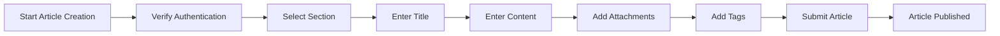

**discussionBoard — What operations users can perform, use cases, business workflows**

What operations users can perform, use cases, business workflows

# Core Business Operations

What the system must do for each business concept.

## User Operations

Users create accounts by providing email and password. Email addresses must be unique across all active accounts. Users log in with their registered email and password credentials. Each user maintains a profile with a display name and bio text that others can view. Users can update their own display name and bio at any time. Users have the ability to change their password for account security. Users can request to delete their account, which removes all their articles and comments from the platform. Account deletion is permanent and cannot be undone once completed.

### Account Registration

WHEN a new user registers for the platform, THE system SHALL:
1. Require a valid email address
2. Require a password that meets security requirements
3. Require a display name for the user profile
4. Create a user account with the provided credentials

WHEN a user submits registration information, THE system SHALL:
1. Validate the email format is correct
2. Verify the email address is not already registered
3. Validate the password meets minimum security criteria
4. Create the user account only if all validations pass

IF the email address is already registered, THE system SHALL reject the registration request and inform the user.
IF the email format is invalid, THE system SHALL reject the registration request and inform the user.
IF the password does not meet security requirements, THE system SHALL reject the registration request and inform the user.
IF the display name is missing, THE system SHALL reject the registration request and inform the user.

### Login Authentication

WHEN a registered user attempts to log in, THE system SHALL:
1. Verify the email address exists in the system
2. Verify the password matches the stored credentials
3. Check if the user account is not banned
4. Grant access to the platform if all checks pass

WHEN login credentials are provided, THE system SHALL:
1. Authenticate the user against stored credentials
2. Create an active session for authenticated users
3. Deny access if credentials are invalid
4. Deny access if the user account is banned

IF the email address does not exist, THE system SHALL deny access and display a generic authentication error.
IF the password is incorrect, THE system SHALL deny access and display a generic authentication error.
IF the user account is banned, THE system SHALL deny access and inform the user that their account has been restricted.

A user session remains active until the user logs out or the session expires.

### Profile Viewing

WHEN a user views their profile, THE system SHALL:
1. Display the user's display name
2. Display the user's bio text
3. Show a list of all articles written by the user
4. Show a list of all comments written by the user

WHEN another user views a user's profile, THE system SHALL:
1. Display the target user's display name
2. Display the target user's bio text
3. Show a list of all articles written by the target user
4. Show a list of all comments written by the target user

A user's profile is visible to all platform users.
Article and comment lists on a profile show publicly visible content only.

### Profile Editing

WHEN a user edits their profile, THE system SHALL:
1. Allow the user to update their display name
2. Allow the user to update their bio text
3. Save the changes to the user's profile
4. Display the updated profile information

WHEN a user updates their display name, THE system SHALL:
1. Validate the new display name is provided
2. Update the display name in the user profile
3. Reflect the change across all user content

WHEN a user updates their bio text, THE system SHALL:
1. Accept the new bio text
2. Save the bio text to the user profile
3. Display the updated bio on the user's profile

IF the display name is empty, THE system SHALL reject the update and inform the user.
IF the bio text exceeds maximum length, THE system SHALL reject the update and inform the user.

### Password Change

WHEN a user changes their password, THE system SHALL:
1. Verify the current password is correct
2. Require a new password that meets security requirements
3. Update the password in the user account
4. Invalidate all existing sessions after password change

WHEN a password change request is submitted, THE system SHALL:
1. Authenticate the user with current credentials
2. Validate the new password meets security requirements
3. Update the password only if all validations pass
4. Require re-login with the new password

IF the current password is incorrect, THE system SHALL reject the password change request and inform the user.
IF the new password does not meet security requirements, THE system SHALL reject the password change request and inform the user.
IF the new password matches the current password, THE system SHALL reject the password change request and inform the user.

### Account Deletion

WHEN a user requests account deletion, THE system SHALL:
1. Confirm the user's intent to delete their account
2. Permanently remove all user data from the platform
3. Delete all articles written by the user
4. Delete all comments written by the user
5. Remove the user account from the system

WHEN account deletion is confirmed, THE system SHALL:
1. Remove the user's display name and bio
2. Remove the user's email and password credentials
3. Delete all file and image attachments owned by the user
4. Remove all associated data linked to the user account

Account deletion is permanent and cannot be undone.
Articles and comments are removed entirely from the platform, not just hidden.

IF the user cancels the deletion request, THE system SHALL retain all user data and maintain the account.

## Section Operations

The discussion board is organized into sections that categorize content by topic such as Politics, Economy, or Current Affairs. Only administrators can create new sections for the board. Each section has a name and description that explains its focus area. Administrators can edit section names and descriptions to update their purpose. Administrators can delete sections when they are no longer needed. All users can view the complete list of available sections on the board. Users can browse and read articles that belong to a specific section. Section management is restricted to administrators to maintain board organization.

### Section Creation

WHEN an administrator creates a section, THE system SHALL:
1. Require a section name
2. Require a section description
3. Associate the section with the creating administrator
4. Record the creation timestamp for tracking purposes

IF the section name is missing or empty, THE system SHALL reject the request.
IF the section description is missing or empty, THE system SHALL reject the request.

Only administrators can create new sections on the board to maintain organizational control.

### Section Editing

WHEN an administrator edits a section, THE system SHALL:
1. Allow updating the section name
2. Allow updating the section description
3. Verify the administrator has permission to modify sections
4. Preserve existing articles within the section
5. Record the update timestamp

IF the administrator is not authorized, THE system SHALL reject the request.
IF the section name becomes empty after editing, THE system SHALL reject the request.
IF the section description becomes empty after editing, THE system SHALL reject the request.

### Section Deletion

WHEN an administrator deletes a section, THE system SHALL:
1. Verify the section exists before deletion
2. Verify the administrator has permission to delete sections
3. Check if the section contains any articles
4. Prevent deletion if articles exist in the section
5. Remove the section metadata when deletion is allowed

IF articles exist in the section, THE system SHALL reject the deletion request and inform the administrator.
IF the administrator is not authorized, THE system SHALL reject the request.
IF the section does not exist, THE system SHALL reject the request.

### Section Listing

WHEN a user views the section list, THE system SHALL:
1. Display all available sections on the board
2. Show each section's name and description
3. Allow users to identify topic categories at a glance
4. Present sections in a browsable list format

THE system SHALL include all sections regardless of article count.

### Section Browsing

WHEN a user browses articles within a section, THE system SHALL:
1. Display all articles belonging to the selected section
2. Show article titles without full content in the list view
3. Display the author name for each article
4. Show tags associated with each article
5. Display comment count for each article
6. Show the time posted for each article
7. Allow users to access full article content by selecting an article

Users can browse articles organized by topic category through sections.

## Article Operations

Users can create articles within any section of the discussion board. Every article requires a title and content, and must be assigned to one section. Users can attach multiple files to their articles for additional information. Users can attach multiple images to their articles to enhance visual presentation. Users can add free-text tags to their articles for categorization and discovery. Users can edit their own articles to update title, content, attachments, or tags. Users can delete their own articles when they are no longer relevant. Administrators have the ability to delete any article on the board. Article lists show title, author, tags, comment count, and posting time without displaying full content.

### Article Creation

WHEN a user creates an article, THE system SHALL:
1. Require a title for the article
2. Require content for the article
3. Require assignment to exactly one section
4. Allow the user to attach multiple files to the article
5. Allow the user to attach multiple images to the article
6. Allow the user to add multiple free-text tags to the article
7. Associate the article with the creating user as the author
8. Record the creation timestamp for the article

IF the title is missing or empty, THE system SHALL reject the article creation request.
IF the content is missing or empty, THE system SHALL reject the article creation request.
IF no section is selected, THE system SHALL reject the article creation request.
IF the user is banned, THE system SHALL reject the article creation request.
IF the user does not have permission to create articles, THE system SHALL reject the article creation request.

### Article Attachments

WHEN a user attaches files to an article, THE system SHALL:
1. Allow multiple files to be attached to a single article
2. Associate each file with the article
3. Record the filename, file size, and upload date for each file
4. Allow users to download attached files from the article

WHEN a user attaches images to an article, THE system SHALL:
1. Allow multiple images to be attached to a single article
2. Associate each image with the article
3. Record the filename, image size, and upload date for each image
4. Allow users to view and download attached images from the article

IF the user is not the article owner, THE system SHALL reject file or image attachment requests.
IF the article does not exist, THE system SHALL reject the attachment request.
IF the user is banned, THE system SHALL reject the attachment request.

### Article Tagging

WHEN a user adds tags to an article, THE system SHALL:
1. Allow free-text tags to be added to the article
2. Allow multiple tags to be associated with a single article
3. Store tags for search and filtering purposes

WHEN users search or filter articles, THE system SHALL:
1. Allow filtering articles by tags
2. Include tagged articles in search results when tags match

IF the user is not the article owner, THE system SHALL reject tag modification requests.
IF the article does not exist, THE system SHALL reject the tag modification request.

### Article Editing

WHEN a user edits their own article, THE system SHALL:
1. Allow updating the article title
2. Allow updating the article content
3. Allow modifying file attachments (add, remove, or replace files)
4. Allow modifying image attachments (add, remove, or replace images)
5. Allow modifying the article tags
6. Preserve the original creation timestamp
7. Record the update timestamp for the article

WHILE the article exists, THE system SHALL allow the owner to view and edit their article.

IF the user is not the article owner, THE system SHALL reject the article edit request.
IF the article does not exist, THE system SHALL reject the article edit request.
IF the user is banned, THE system SHALL reject the article edit request.
IF the new title is missing or empty, THE system SHALL reject the edit request.
IF the new content is missing or empty, THE system SHALL reject the edit request.

### Article Deletion

WHEN a user deletes their own article, THE system SHALL:
1. Remove the article from the system
2. Remove all associated file attachments
3. Remove all associated image attachments
4. Remove all comments on the article
5. Record the deletion timestamp

WHEN an administrator deletes an article, THE system SHALL:
1. Remove the article from the system
2. Remove all associated file attachments
3. Remove all associated image attachments
4. Remove all comments on the article
5. Record the deletion timestamp and the administrator who performed the deletion

IF the user is not the article owner and not an administrator, THE system SHALL reject the article deletion request.
IF the article does not exist, THE system SHALL reject the deletion request.
IF the user is banned, THE system SHALL reject the deletion request.

### Article Listing and Preview

WHEN users view the article list in a section, THE system SHALL:
1. Display article title, author, tags, comment count, and posting time
2. Display only the title (not full content) in the list view
3. Paginate the article list
4. Allow sorting by newest first or oldest first

WHEN users view a single article, THE system SHALL:
1. Display the full article content
2. Display the article title, author, tags, and posting time
3. Display all file attachments with download capability
4. Display all image attachments with view and download capability
5. Display all comments on the article (sorted by oldest first)

IF the article does not exist, THE system SHALL display an error message.
IF the user does not have permission to view the article, THE system SHALL display an error message.

## Comment Operations

Users can write comments on articles to share their thoughts and engage in discussion. Comments are single-level and do not support nested replies. Users can view all comments posted on any article. Comments are displayed in chronological order from oldest to newest. Each comment shows the author name, content, and posting time. Users can edit their own comments to correct or improve their message. Users can delete their own comments when they are no longer appropriate. Administrators have the ability to delete any comment on the board. Comment functionality enables ongoing discussion around article topics.

### Comment Creation

WHEN a user writes a comment on an article, THE system SHALL:
1. Require the comment to have content
2. Associate the comment with the article being commented on
3. Record the author as the user who posted the comment
4. Record the timestamp when the comment was created
5. Store the comment in single-level format without nested replies

WHEN a banned user attempts to post a comment, THE system SHALL reject the request and prevent the comment from being created.

WHEN a user attempts to comment on a deleted article, THE system SHALL reject the request.

IF the comment content is empty, THE system SHALL reject the request and inform the user that content is required.

IF the user does not have permission to comment on the article, THE system SHALL reject the request.

### Comment Display and Viewing

WHEN a user views an article, THE system SHALL display all comments posted on that article.

WHEN comments are displayed, THE system SHALL show each comment with:
1. The author's display name
2. The comment content
3. The timestamp when the comment was posted

WHEN multiple comments exist on an article, THE system SHALL display them in chronological order from oldest to newest.

THE system SHALL maintain comments in single-level structure without nested replies.

WHEN a user views comments on an article, THE system SHALL make all comments visible regardless of whether the article author is still active.

THE system SHALL ensure comments remain visible even if the comment author later deletes their account, unless the comment itself is deleted.

WHEN a user views the article discussion, THE system SHALL display the total number of comments on the article.

### Comment Editing

WHEN a user edits their own comment, THE system SHALL:
1. Allow the user to modify the comment content
2. Update the timestamp to reflect when the edit occurred
3. Preserve the original author association

WHEN a user attempts to edit another user's comment, THE system SHALL reject the request and prevent the modification.

WHEN a user attempts to edit a comment on a deleted article, THE system SHALL reject the request.

IF the edited comment content is empty, THE system SHALL reject the request and inform the user that content is required.

THE system SHALL allow users to edit their comments at any time after posting.

WHEN a comment is edited, THE system SHALL maintain the comment's position in the chronological order based on its original creation timestamp.

### Comment Deletion

WHEN a user deletes their own comment, THE system SHALL permanently remove the comment from the article.

WHEN a user attempts to delete another user's comment, THE system SHALL reject the request.

WHEN an administrator deletes a comment, THE system SHALL permanently remove the comment regardless of who authored it.

WHEN a comment is deleted, THE system SHALL update the article's comment count to reflect the removal.

WHEN an article is deleted, THE system SHALL automatically delete all comments associated with that article.

WHEN a user is banned, THE system SHALL NOT automatically delete their existing comments; comments remain visible.

IF the comment does not exist, THE system SHALL reject the deletion request.

WHEN a comment is deleted, THE system SHALL remove the author, content, and timestamp from display.

## FileAttachment Operations

Users can attach files to their articles to share documents and other file types. Multiple files can be attached to a single article for comprehensive information sharing. Users can download attached files from articles they are viewing. File attachments are associated with the article and its author. When an article is deleted, all its file attachments are also removed. Administrators can delete articles along with their attached files. File attachments enhance article content with supplementary materials. Users can manage file attachments when editing their articles.

### File Attachment Creation

WHEN a user creates an article, THE system SHALL allow the user to attach one or more files as supplementary materials to the article.

WHEN a user edits an article, THE system SHALL allow the user to add additional file attachments to the existing article.

THE system SHALL associate each file attachment with the article to which it was uploaded.

THE system SHALL associate each file attachment with the user who uploaded it.

WHEN a user uploads a file attachment, THE system SHALL record the file as part of the article's supplementary materials.

IF a user attempts to attach a file to an article they do not own, THE system SHALL reject the attachment request.

IF a user attempts to attach a file to an article that does not exist, THE system SHALL reject the attachment request.

WHEN a user uploads multiple files during article creation, THE system SHALL process each file as a separate attachment.

### Multiple File Attachments

THE system SHALL allow users to attach multiple files to a single article for comprehensive information sharing.

WHEN a user attaches multiple files to an article, THE system SHALL maintain each file as an independent attachment within the article.

THE system SHALL display the list of all file attachments associated with an article when the article is viewed.

WHEN a user views an article with file attachments, THE system SHALL show all attached files as supplementary materials.

THE system SHALL allow users to manage multiple file attachments when editing their articles.

WHEN an article is deleted, THE system SHALL remove all file attachments associated with that article.

IF an article has multiple file attachments, THE system SHALL ensure all attachments are accessible to users viewing the article.

### File Download and Access

WHEN a user views an article with file attachments, THE system SHALL allow the user to download each attached file.

THE system SHALL make file attachments accessible to any user who can view the article to which they are attached.

WHEN a user requests to download a file attachment, THE system SHALL provide the file for download.

IF a file attachment does not exist, THE system SHALL indicate that the file is unavailable.

IF an article has been deleted, THE system SHALL make its file attachments inaccessible.

THE system SHALL allow users to download file attachments as supplementary materials when viewing articles.

WHEN a user downloads a file attachment, THE system SHALL serve the file associated with the article.

IF a user attempts to download a file from an article they cannot access, THE system SHALL deny the download request.

### File Association and Lifecycle

THE system SHALL maintain the association between file attachments and their parent articles.

WHEN an article is deleted by its owner, THE system SHALL delete all file attachments associated with that article.

WHEN an article is deleted by an administrator, THE system SHALL delete all file attachments associated with that article.

THE system SHALL ensure file attachments remain associated with the article throughout the article's lifecycle.

WHEN a user edits an article, THE system SHALL allow the user to modify the file attachments associated with that article.

THE system SHALL track which user uploaded each file attachment to an article.

WHEN a file attachment is removed from an article, THE system SHALL disassociate the file from that article.

THE system SHALL ensure file attachments are treated as supplementary materials linked to their parent articles.

IF an article is archived or removed, THE system SHALL handle all associated file attachments according to the article's lifecycle rules.

## ImageAttachment Operations

Users can attach images to their articles to provide visual content and illustrations. Multiple images can be attached to a single article for rich visual presentation. Users can view and download attached images from articles. Image attachments are linked to the article and its author. When an article is deleted, all its image attachments are also removed. Administrators can delete articles along with their attached images. Image attachments make articles more engaging and informative. Users can manage image attachments when editing their articles.

### Image Attachment Creation

WHEN a user attaches an image to an article, THE system SHALL:
1. Accept image files in supported formats
2. Validate the image file size does not exceed the maximum limit
3. Associate the image with the article being edited
4. Record the image filename, path, size, and upload date
5. Link the image to the article author

WHEN a user creates a new article with images, THE system SHALL:
1. Allow image attachments during article creation
2. Store images before saving the article
3. Associate all uploaded images with the new article

IF the image file exceeds the size limit, THE system SHALL reject the upload and inform the user.
IF the image format is not supported, THE system SHALL reject the upload and inform the user.
IF the user is banned, THE system SHALL prevent image attachment to articles.
IF the article does not exist, THE system SHALL reject the image attachment request.

### Multiple Image Attachments

WHEN a user attaches multiple images to an article, THE system SHALL:
1. Allow more than one image per article
2. Process each image independently during upload
3. Maintain the order of uploaded images
4. Display all attached images on the article page

WHEN viewing an article with multiple images, THE system SHALL:
1. Show all attached images in the article content
2. Present images as visual content within the article
3. Enable rich media presentation for readers

IF the total number of images exceeds the maximum allowed, THE system SHALL reject additional uploads.
IF the article already has the maximum number of attachments (files and images combined), THE system SHALL prevent further image uploads.

### Image Viewing

WHEN a user views an article, THE system SHALL:
1. Display all attached images with the article content
2. Show image thumbnails or previews in the article
3. Make images visible to all users who can view the article
4. Render images as part of the article's visual content

WHEN a user clicks on an attached image, THE system SHALL:
1. Allow the user to view the full-size image
2. Display the image filename and metadata
3. Enable image download functionality

IF the article has no attached images, THE system SHALL display the article without image content.
IF the image file is corrupted or unavailable, THE system SHALL display an error message instead of the image.

### Image Download

WHEN a user downloads an attached image, THE system SHALL:
1. Provide download functionality for each image
2. Deliver the original image file to the user
3. Record the download action for analytics

WHEN a user accesses a deleted article, THE system SHALL:
1. Prevent download of images from deleted articles
2. Return an appropriate error for unavailable images

IF the image file no longer exists on storage, THE system SHALL inform the user that the image is unavailable.
IF the user does not have permission to view the article, THE system SHALL prevent image download.

### Image Deletion and Management

WHEN a user edits their article, THE system SHALL:
1. Allow removal of existing image attachments
2. Enable addition of new images during editing
3. Preserve other images when removing specific ones
4. Update the article's image list after changes

WHEN a user deletes their article, THE system SHALL:
1. Remove all attached images from storage
2. Delete image associations with the article
3. Free up storage space occupied by images

WHEN an administrator deletes an article, THE system SHALL:
1. Remove all attached images regardless of ownership
2. Delete image records from the system
3. Ensure no orphaned image files remain

IF the user is not the article owner, THE system SHALL prevent image deletion from that article.
IF the article does not exist, THE system SHALL reject the image management request.

## AdminRequest Operations

Any user can submit a request to become an administrator of the platform. The request includes a text reason explaining why the user wants administrator privileges. Super administrators can view all pending administrator requests. Super administrators can approve requests to grant administrator access. Super administrators can reject requests to deny administrator access. When approved, the user becomes a regular administrator with full administrator capabilities. Administrator requests track the submission reason and approval status. The request process ensures proper vetting before granting elevated privileges.

### Administrator Request Submission

WHEN a user submits an administrator request, THE system SHALL:
1. Allow the user to provide a reason for requesting administrator privileges
2. Record the submission timestamp
3. Set the initial request status to pending
4. Associate the request with the submitting user
5. Prevent users who are already administrators from submitting duplicate requests

WHEN a user submits a request, THE system SHALL:
- Require the reason field to contain text content
- Store the reason for review by super administrators

IF a user already has an active pending request, THE system SHALL reject the new submission.
IF a user is already an administrator (regular or super), THE system SHALL reject the request submission.

THE system SHALL maintain a record of all administrator requests for audit purposes.

### Request Reason Requirements

WHEN a user submits an administrator request, THE system SHALL:
1. Require the reason field to be provided
2. Accept text content for the reason
3. Store the reason with the request record

THE system SHALL require the request reason to:
- Contain meaningful content explaining why the user wants administrator privileges
- Be visible to super administrators during the review process

WHILE reviewing a request, THE system SHALL display the submitted reason to the super administrator.

THE system SHALL preserve the original reason text throughout the request lifecycle.

IF the reason field is empty or contains only whitespace, THE system SHALL reject the request submission.

### Pending Request Review

WHEN a super administrator accesses the pending requests list, THE system SHALL:
1. Display all administrator requests with pending status
2. Show the submitting user's display name
3. Display the request reason for each request
4. Show the submission timestamp for each request
5. Allow super administrators to review each request individually

THE system SHALL:
- Filter the pending requests list to show only requests awaiting review
- Exclude approved and rejected requests from the pending list
- Sort pending requests by submission timestamp (newest first)

WHEN a super administrator views a pending request, THE system SHALL:
- Display all request details including reason and submission time
- Show the user's current status and profile information
- Provide options to approve or reject the request

THE system SHALL ensure only super administrators can access the pending requests list.

### Request Approval Process

WHEN a super administrator approves an administrator request, THE system SHALL:
1. Change the request status from pending to approved
2. Record the approval timestamp
3. Associate the reviewing super administrator with the request
4. Convert the requesting user to a regular administrator
5. Grant the user all regular administrator capabilities

WHEN a user is converted to regular administrator through approval, THE system SHALL:
- Update the user's role to regular administrator
- Preserve all existing user content (articles, comments, profile)
- Notify the user of their new administrator status

IF the approval is processed, THE system SHALL:
- Prevent the same request from being approved again
- Remove the request from the pending requests list

THE system SHALL maintain an audit trail of the approval action including who approved and when.

### Request Rejection Process

WHEN a super administrator rejects an administrator request, THE system SHALL:
1. Change the request status from pending to rejected
2. Record the rejection timestamp
3. Associate the reviewing super administrator with the request
4. Prevent the user from automatically becoming an administrator
5. Remove the request from the pending requests list

WHEN a request is rejected, THE system SHALL:
- Preserve the original request reason for record-keeping
- Maintain the user's current status (non-administrator)
- Allow the user to submit a new request in the future with a different reason

IF the rejection is processed, THE system SHALL:
- Notify the user that their request was not approved
- Ensure the user retains all non-administrator capabilities

THE system SHALL maintain an audit trail of the rejection action including who rejected and when.

### Administrator Status Tracking

THE system SHALL track each administrator request with the following information:
1. Submission timestamp
2. Request reason
3. Current status (pending, approved, rejected)
4. Review timestamp (when approved or rejected)
5. Reviewing super administrator (when reviewed)
6. Associated user who submitted the request

WHEN viewing a request, THE system SHALL display:
- The complete request history and status transitions
- All timestamps associated with the request lifecycle
- The identity of the super administrator who reviewed the request

THE system SHALL ensure request status is immutable once changed:
- Pending requests can transition to approved or rejected
- Approved requests cannot change status again
- Rejected requests cannot change status again

WHILE a request is pending, THE system SHALL:
- Allow the super administrator to review and make a decision
- Prevent status changes by any other actor
- Display the pending status to the submitting user

THE system SHALL support privilege escalation tracking by maintaining the complete audit trail of how each user became an administrator.

## BanRecord Operations

Administrators can ban users who violate platform rules or engage in inappropriate behavior. When a user is banned, they cannot log in to the platform. A ban reason is recorded to document why the ban was issued. Administrators can view the list of all banned users on the platform. Administrators can view the ban reason for each banned user. Administrators can unban users to restore their access to the platform. Banned users' existing articles and comments remain visible to other users. Ban records track the reason, timing, and administrator who issued the ban.

### User Banning Process

WHEN an administrator bans a user, THE system SHALL:
1. Record the ban reason provided by the administrator
2. Record the timestamp when the ban was issued
3. Record the administrator who issued the ban
4. Immediately prevent the banned user from logging in
5. Preserve all existing articles written by the banned user
6. Preserve all existing comments written by the banned user

IF an administrator attempts to ban a user without providing a ban reason, THE system SHALL reject the ban request.

IF a user is already banned, THE system SHALL reject any attempt to ban them again.

IF a non-administrator attempts to ban a user, THE system SHALL reject the ban request.

### Ban Reason Recording

WHEN an administrator issues a ban, THE system SHALL record:
1. The ban reason text explaining why the user was banned
2. The timestamp when the ban was issued
3. The identity of the administrator who issued the ban

THE system SHALL maintain ban records for all banned users.

THE system SHALL NOT allow modification of ban records after creation.

IF an administrator attempts to issue a ban without a reason, THE system SHALL reject the request with an error.

### Login Restriction Enforcement

WHEN a user is banned, THE system SHALL:
1. Block all login attempts by the banned user
2. Display an appropriate message indicating the account is banned
3. Prevent access to any platform features requiring authentication

WHILE a user is banned, THE system SHALL:
1. Continue to display their articles to other users
2. Continue to display their comments to other users
3. Maintain all their content in the system

IF a banned user attempts to log in, THE system SHALL deny access and display the ban notification.

### Banned User List Management

WHEN an administrator requests to view banned users, THE system SHALL:
1. Display a list of all users currently banned on the platform
2. Show the ban reason for each banned user
3. Show the timestamp when each ban was issued
4. Show the administrator who issued each ban

THE system SHALL allow administrators to filter the banned user list.

THE system SHALL paginate the banned user list when it exceeds display limits.

### Ban Reason Viewing

WHEN an administrator views a banned user's record, THE system SHALL:
1. Display the complete ban reason provided at the time of banning
2. Display the timestamp when the ban was issued
3. Display the identity of the administrator who issued the ban

IF a non-administrator attempts to view ban reasons, THE system SHALL deny access.

IF an administrator views a non-banned user, THE system SHALL indicate that no ban record exists.

### User Unbanning Process

WHEN an administrator unbans a user, THE system SHALL:
1. Remove the login restriction for the banned user
2. Restore full platform access to the user
3. Record the unban action in the system
4. Preserve all articles and comments created by the previously banned user

WHEN access is restored to an unbanned user, THE system SHALL:
1. Allow the user to log in with their existing credentials
2. Allow the user to create new articles
3. Allow the user to post new comments
4. Maintain all previously created content

IF a non-administrator attempts to unban a user, THE system SHALL reject the unban request.

IF an administrator attempts to unban a user who is not banned, THE system SHALL indicate that no unban action is necessary.

### Content Visibility Retention

WHILE a user remains banned, THE system SHALL:
1. Keep all articles created by the banned user visible to other users
2. Keep all comments created by the banned user visible to other users
3. Not modify or remove any content associated with the banned user

WHEN a user is unbanned, THE system SHALL:
1. Continue to display all their historical content
2. Not require any content review or approval
3. Maintain all content in its original state

IF an administrator deletes a banned user's article, THE system SHALL remove that specific article from visibility.

IF an administrator deletes a banned user's comment, THE system SHALL remove that specific comment from visibility.

# Business Actions and Workflows

Business actions and workflows beyond basic CRUD.

## User Actions

Users register for accounts using email and password credentials. Email addresses must be unique among active accounts to prevent duplicate registrations. New accounts require email verification before full access is granted. Users log in with their registered email and password combination. Users can change their password at any time after logging in. Users can edit their display name and bio information in their profile. Users can view other users' profiles to see their articles and comments. Users can delete their own account, which triggers deletion of all their articles and comments. Deleted accounts cannot be recovered. Banned users cannot log in to the platform until the ban is lifted.

### User Registration Process

WHEN a user registers for an account, THE system SHALL:
1. Require email address and password
2. Validate email format is correct
3. Ensure email address is unique among active accounts
4. Create account in unverified state
5. Send email verification link to the registered email

WHEN an email verification link is clicked, THE system SHALL:
1. Verify the link is valid and not expired
2. Mark the account as verified
3. Grant full platform access to the user

WHILE an account is unverified, THE system SHALL:
1. Allow login to the platform
2. Restrict access to posting articles and comments
3. Display notification about pending email verification

IF the email address is already registered, THE system SHALL reject the registration request.
IF the email format is invalid, THE system SHALL reject the registration request.
IF the verification link is expired, THE system SHALL reject the verification request.

### Login Authentication

WHEN a user attempts to log in, THE system SHALL:
1. Validate email and password combination
2. Check if the account is verified
3. Check if the account is banned
4. Create an authenticated session upon success

WHEN a user is banned, THE system SHALL:
1. Reject all login attempts
2. Display ban notification with reason (if user has access to view ban records)
3. Prevent access to any platform features

IF the email or password is incorrect, THE system SHALL reject the login request.
IF the account is not verified, THE system SHALL reject the login request.
IF the account is banned, THE system SHALL reject the login request and display ban status.

### Password Change Process

WHEN a user changes their password, THE system SHALL:
1. Require current password verification
2. Validate new password meets security requirements
3. Ensure new password is different from current password
4. Invalidate all existing sessions after successful change
5. Require re-login with new password

IF the current password is incorrect, THE system SHALL reject the password change request.
IF the new password does not meet security requirements, THE system SHALL reject the password change request.
IF the new password matches the current password, THE system SHALL reject the password change request.

### Profile Editing and Viewing

WHEN a user edits their profile, THE system SHALL:
1. Allow updating display name
2. Allow updating bio text
3. Validate display name is not empty
4. Validate display name length is within acceptable limits
5. Save changes immediately

WHEN a user views another user's profile, THE system SHALL:
1. Display the user's display name
2. Display the user's bio text
3. Show list of all articles written by the user
4. Show list of all comments written by the user
5. Display article and comment timestamps

IF the display name is empty, THE system SHALL reject the profile update request.
IF the profile does not exist, THE system SHALL display an error message.

### Account Deletion and Ban Restrictions

WHEN a user deletes their account, THE system SHALL:
1. Permanently remove the user account
2. Delete all articles written by the user
3. Delete all comments written by the user
4. Remove all file and image attachments associated with user's content
5. Record the deletion timestamp

WHEN an account is deleted, THE system SHALL:
1. Prevent any recovery of the deleted account
2. Prevent re-registration with the same email address
3. Remove the user from all platform data

WHEN a banned user attempts any action, THE system SHALL:
1. Block access to all platform features
2. Display ban notification if the user can view ban records
3. Prevent article creation, comment posting, and profile editing

Account deletion is permanent and irreversible. Users cannot recover deleted accounts or their content. Banned users remain banned until an administrator lifts the ban.

## Section Actions

Administrators create new sections for organizing discussion topics. Each section requires a name and description when created. Administrators can edit existing section names and descriptions. Administrators can delete sections when they are no longer needed. Users can view the complete list of all available sections. Users can browse articles within a specific section. Section creation is restricted to administrators only. Regular users cannot create or modify sections. When a section is deleted, articles within it may be affected depending on system behavior.

### Section Creation Workflow

WHEN an administrator creates a new section, THE system SHALL:
1. Require a section name
2. Require a section description
3. Associate the section with the creating administrator
4. Record the creation timestamp

WHEN a non-administrator user attempts to create a section, THE system SHALL reject the request.

IF the section name is empty, THE system SHALL reject the request.
IF the section description is empty, THE system SHALL reject the request.

### Section Name and Description

THE section SHALL have a name that uniquely identifies it within the board.
THE section SHALL have a description that explains its purpose and topic focus.

### Administrator-Only Section Management

THE system SHALL restrict section creation to administrators only.
THE system SHALL restrict section modification to administrators only.
THE system SHALL restrict section deletion to administrators only.

Regular users SHALL NOT be able to create sections.
Regular users SHALL NOT be able to edit sections.
Regular users SHALL NOT be able to delete sections.

### Section Editing Process

WHEN an administrator edits an existing section, THE system SHALL:
1. Allow modification of the section name
2. Allow modification of the section description
3. Preserve the section's existing articles
4. Preserve the section's creation timestamp
5. Record the update timestamp

WHEN an administrator updates a section name, THE system SHALL ensure the new name is unique.

IF the new section name is empty, THE system SHALL reject the request.
IF the new section description is empty, THE system SHALL reject the request.
IF the new section name conflicts with an existing section, THE system SHALL reject the request.

WHEN a non-administrator user attempts to edit a section, THE system SHALL reject the request.

### Section Deletion

WHEN an administrator deletes a section, THE system SHALL:
1. Remove the section from the board
2. Archive all articles within the section to preserve their content
3. Record the deletion timestamp

WHEN a non-administrator user attempts to delete a section, THE system SHALL reject the request.

IF the section does not exist, THE system SHALL reject the deletion request.

### Section Access Restrictions

THE system SHALL enforce that only administrators can delete sections.
THE system SHALL prevent regular users from modifying section metadata.

### Viewing Section List

WHEN a user views the section list, THE system SHALL:
1. Display all available sections
2. Show each section's name
3. Show each section's description
4. Allow navigation to individual sections

THE system SHALL display sections in a consistent order (e.g., by creation date or name).

GUEST users SHALL be able to view the section list.
MEMBER users SHALL be able to view the section list.
ADMIN users SHALL be able to view the section list.

WHEN the section list is empty, THE system SHALL display a message indicating no sections are available.

### Browsing Section Articles

WHEN a user browses articles within a section, THE system SHALL:
1. Display the section name
2. Display the list of articles in that section
3. Show article metadata (title, author, tags, comment count, time posted)
4. Apply pagination to the article list
5. Allow sorting by newest first or oldest first

WHEN a user selects a section to browse, THE system SHALL display all articles belonging to that section.

GUEST users SHALL be able to browse articles in a section.
MEMBER users SHALL be able to browse articles in a section.
ADMIN users SHALL be able to browse articles in a section.

THE article list SHALL NOT display full article content (only title and metadata).

### Article List Pagination

THE system SHALL paginate the article list to improve performance.
THE system SHALL allow users to navigate between pages of articles.

### Article List Sorting

WHEN a user sorts articles by newest first, THE system SHALL display articles with the most recent creation date first.
WHEN a user sorts articles by oldest first, THE system SHALL display articles with the earliest creation date first.

## Article Actions

Users create articles by providing a title, content, and selecting a section. Users can attach multiple files and images to their articles. Users can add multiple free-text tags to categorize their articles. Users can edit their own articles including title, content, attachments, and tags. Users can delete their own articles at any time. Administrators can delete any article regardless of ownership. Article creation requires choosing exactly one section. Tags allow flexible categorization beyond section boundaries. When an article is deleted by the owner, all associated attachments are removed. When an administrator deletes an article, it is removed from public view.

### Article Creation Workflow

WHEN a user creates an article, THE system SHALL:
1. Require a title for the article
2. Require content text for the article
3. Require selection of exactly one section from available sections
4. Allow the user to attach multiple files to the article
5. Allow the user to attach multiple images to the article
6. Allow the user to add multiple free-text tags to the article
7. Record the creation timestamp for the article
8. Associate the article with the creating user as the author

WHEN a user attempts to create an article, THE system SHALL verify the user is authenticated and not banned.

IF the user is not authenticated (guest), THE system SHALL reject the article creation request.
IF the user is banned, THE system SHALL reject the article creation request.
IF the title is missing or empty, THE system SHALL reject the article creation request.
IF the content is missing or empty, THE system SHALL reject the article creation request.
IF no section is selected, THE system SHALL reject the article creation request.
IF the selected section does not exist, THE system SHALL reject the article creation request.

Article creation requires user authentication. Guest users cannot create articles. Only registered members and administrators can create articles.

### Article Editing Process

WHEN a user edits their own article, THE system SHALL:
1. Allow the user to update the article title
2. Allow the user to update the article content
3. Allow the user to modify attached files (add new files, remove existing files)
4. Allow the user to modify attached images (add new images, remove existing images)
5. Allow the user to update the article tags (add new tags, remove existing tags)
6. Preserve the original creation timestamp
7. Record an update timestamp when changes are made

WHEN a user attempts to edit an article, THE system SHALL verify the user is authenticated and not banned.

IF the user is not authenticated (guest), THE system SHALL reject the edit request.
IF the user is not the article owner, THE system SHALL reject the edit request.
IF the user is banned, THE system SHALL reject the edit request.
IF the article has been deleted, THE system SHALL reject the edit request.
IF the updated title is empty, THE system SHALL reject the edit request.
IF the updated content is empty, THE system SHALL reject the edit request.

Article editing requires user authentication. Guest users cannot edit articles. Administrators cannot edit articles owned by other users unless they are the article owner.

### Article Deletion by Owner

WHEN an article owner deletes their article, THE system SHALL:
1. Remove the article from public view
2. Remove all file attachments associated with the article
3. Remove all image attachments associated with the article
4. Remove all comments associated with the article
5. Permanently delete the article and all related data

WHEN a user attempts to delete an article, THE system SHALL verify the user is authenticated and not banned.

IF the user is not authenticated (guest), THE system SHALL reject the deletion request.
IF the user is not the article owner, THE system SHALL reject the deletion request.
IF the user is banned, THE system SHALL reject the deletion request.
IF the article has already been deleted, THE system SHALL reject the deletion request.

Article deletion by the owner is permanent and cannot be undone. All associated attachments and comments are removed as part of the deletion process.

### Administrator Article Deletion

WHEN an administrator deletes an article, THE system SHALL:
1. Remove the article from public view
2. Remove all file attachments associated with the article
3. Remove all image attachments associated with the article
4. Remove all comments associated with the article
5. Permanently delete the article and all related data

WHEN an administrator attempts to delete an article, THE system SHALL verify the user has administrator privileges.

Administrators can delete any article regardless of ownership.
Super administrators can delete any article regardless of ownership.

IF the article has already been deleted, THE system SHALL reject the deletion request.

Administrator deletion is permanent and cannot be undone. This capability allows administrators to remove inappropriate or policy-violating content from the platform.

### Multi-Tag Categorization

WHEN a user creates or edits an article, THE system SHALL:
1. Allow the user to add multiple free-text tags
2. Allow the user to remove existing tags
3. Allow duplicate tag prevention within the same article
4. Store tags as plain text strings associated with the article

WHEN users search or filter articles, THE system SHALL:
1. Allow filtering articles by one or more tags
2. Display tags on the article list view
3. Display tags on the article detail view

Tags enable multi-dimensional categorization beyond the single section assignment. An article can belong to only one section but can have multiple tags for flexible discovery and organization.

### Article Attachment Management

WHEN a user creates an article, THE system SHALL:
1. Allow uploading multiple file attachments
2. Allow uploading multiple image attachments
3. Associate uploaded files with the article
4. Associate uploaded images with the article

WHEN a user edits an article, THE system SHALL:
1. Allow adding new file attachments
2. Allow adding new image attachments
3. Allow removing existing file attachments
4. Allow removing existing image attachments

WHEN viewing an article, THE system SHALL:
1. Display all attached files with download capability to all users who can view the article
2. Display all attached images with view and download capability to all users who can view the article

WHEN the article is deleted, THE system SHALL remove all associated attachments.
WHEN the user is not the article owner, THE system SHALL reject file/image upload requests.

Attachments remain visible to all users who can view the article, regardless of who uploaded them. File accessibility is tied to article visibility, not user authentication status for viewing.

### Article Visibility Control

WHEN an article is created, THE system SHALL:
1. Make the article visible to all authenticated users
2. Make the article visible to guests (unauthenticated users)
3. Display article metadata (title, author, tags, comment count, timestamp) in article lists

WHEN an article owner deletes their article, THE system SHALL:
1. Remove the article from all public views
2. Remove the article from search results
3. Remove the article from section browsing

WHEN an administrator deletes an article, THE system SHALL:
1. Remove the article from all public views
2. Remove the article from search results
3. Remove the article from section browsing

WHEN a user is banned, THE system SHALL:
1. Keep their existing articles visible to other users
2. Prevent the banned user from accessing the platform

Article visibility is controlled by deletion status, not by author ban status. Banned users' content remains visible to preserve discussion history. All users including guests can view articles that have not been deleted.

### Section Selection for Articles

WHEN a user selects a section for an article, THE system SHALL:
1. Require selection of exactly one section
2. Validate that the selected section exists
3. Associate the article with the selected section
4. Display the section name on the article view

WHEN browsing articles by section, THE system SHALL:
1. Display only articles belonging to the selected section
2. Allow pagination through section articles
3. Allow sorting section articles by newest first or oldest first

A section must be selected during article creation and cannot be changed after creation. Users cannot assign an article to multiple sections simultaneously.

## Comment Actions

Users write comments on articles to participate in discussions. Comments are single-level without nested replies. Users can view all comments on an article in chronological order. Comments display author, content, and posting time. Users can edit their own comments after posting. Users can delete their own comments. Administrators can delete any comment regardless of ownership. Comment editing preserves the edit history. Deleted comments are removed from public view. Comment creation requires the user to be logged in.

### Comment Creation

WHEN a guest user attempts to create a comment, THE system SHALL require the user to authenticate before allowing comment creation.

WHEN a member user creates a comment, THE system SHALL associate the comment with the target article.

WHEN a member user creates a comment, THE system SHALL associate the comment with the creating user.

WHEN a member user creates a comment, THE system SHALL require non-empty comment content.

WHEN a comment is created, THE system SHALL record the creation timestamp.

WHEN a banned user attempts to create a comment, THE system SHALL reject the request.

WHEN a user attempts to create a comment on a deleted article, THE system SHALL reject the request.

WHEN a user creates a comment, THE system SHALL NOT allow nested replies (single-level structure only).

### Comment Viewing

WHEN a user views an article, THE system SHALL display all comments associated with that article.

WHEN comments are displayed, THE system SHALL sort them in chronological order with oldest first.

WHEN comments are displayed, THE system SHALL show the comment author's display name.

WHEN comments are displayed, THE system SHALL show the comment content.

WHEN comments are displayed, THE system SHALL show the comment posting timestamp.

WHEN comments are displayed, THE system SHALL NOT display nested replies or hierarchical structure.

WHEN a user views comments, THE system SHALL show comments regardless of whether the article author is still active.

WHEN comments are displayed, THE system SHALL show comments in the order they were created (oldest to newest).

### Comment Editing

WHEN a member user edits their own comment, THE system SHALL allow the user to update the comment content.

WHEN a member user edits their own comment, THE system SHALL update the comment's modification timestamp.

WHEN a user attempts to edit another user's comment, THE system SHALL reject the request.

WHEN a user attempts to edit a comment on a deleted article, THE system SHALL reject the request.

WHEN a member user edits their comment, THE system SHALL preserve the edit history for audit purposes.

WHEN a banned user attempts to edit their comment, THE system SHALL reject the request.

WHEN a member user edits their comment, THE system SHALL allow updating the content but not the author association.

### Comment Deletion

WHEN a member user deletes their own comment, THE system SHALL remove the comment from public view.

WHEN a member user deletes their own comment, THE system SHALL permanently delete the comment content.

WHEN an administrator deletes any comment, THE system SHALL remove the comment from public view regardless of ownership.

WHEN an administrator deletes any comment, THE system SHALL permanently delete the comment content.

WHEN a user attempts to delete another user's comment, THE system SHALL reject the request.

WHEN a user attempts to delete a comment on a deleted article, THE system SHALL reject the request.

WHEN a banned user attempts to delete their comment, THE system SHALL reject the request.

WHEN a comment is deleted, THE system SHALL update the article's comment count accordingly.

WHEN an administrator deletes a comment, THE system SHALL NOT require the administrator to be the comment owner.

## FileAttachment Actions

Users can attach files to their articles during article creation or editing. Multiple files can be attached to a single article. Users can download attached files from articles they view. File attachments are associated with the parent article. When an article is deleted, all attached files are removed from the system. Administrators can delete articles with their attached files. File upload occurs during article creation or editing workflows. Downloaded files retain their original filenames. File attachments support various document formats for economic and political discussions.

### File Attachment Workflow

WHEN a user attaches a file to an article, THE system SHALL:
1. Allow the user to select one or more files from their device
2. Validate each file against supported format requirements
3. Validate each file against size limits
4. Associate the file with the target article
5. Record the upload timestamp

WHEN a user uploads files during article creation, THE system SHALL:
1. Accept file attachments as part of the article submission
2. Store file metadata before article publication
3. Make files accessible after article is saved

WHEN a user uploads files during article editing, THE system SHALL:
1. Accept additional file attachments to existing articles
2. Allow removal of previously attached files
3. Preserve existing article content during file operations

WHEN file upload fails, THE system SHALL:
1. Inform the user of the failure reason
2. Preserve any successfully uploaded files
3. Allow the user to retry the failed upload

### Multiple File Uploads

WHEN a user attaches multiple files to an article, THE system SHALL:
1. Allow uploading multiple files in a single operation
2. Process each file independently
3. Track the total number of attachments per article
4. Display all attached files in the article view

WHILE managing multiple file attachments, THE system SHALL:
1. Maintain individual file metadata for each attachment
2. Allow individual file removal without affecting other attachments
3. Preserve upload order for display purposes

WHEN the maximum attachment limit is reached, THE system SHALL:
1. Reject additional file uploads
2. Inform the user of the current attachment count
3. Allow removal of existing files before adding new ones

### File Download Process

WHEN a user views an article with file attachments, THE system SHALL:
1. Display a list of all attached files
2. Provide download links for each attached file
3. Show file metadata (filename, size, upload date)

WHEN a user requests to download an attached file, THE system SHALL:
1. Verify the user has permission to view the parent article
2. Stream the file content to the user
3. Preserve the original filename in the download
4. Record the download access

WHEN the user does not have permission to view the article, THE system SHALL:
1. Block access to the file download
2. Display an appropriate access restriction message

WHEN the attached file no longer exists, THE system SHALL:
1. Remove the download link from the article view
2. Display an indication that the file is unavailable

### File-Article Association

WHEN a file is attached to an article, THE system SHALL:
1. Create a permanent association between the file and the article
2. Store the association in the system's attachment records
3. Ensure the file is only accessible through the parent article

WHILE the article exists, THE system SHALL:
1. Maintain the file-article association
2. Allow the file to be downloaded through the article interface
3. Include the file in article export operations

WHEN the article is moved to a different section, THE system SHALL:
1. Preserve all file attachments
2. Maintain the file-article association

WHEN the article is archived or hidden, THE system SHALL:
1. Preserve all file attachments
2. Restrict file access according to article visibility rules

### File Deletion on Article Removal

WHEN a user deletes their own article, THE system SHALL:
1. Remove all file attachments associated with the article
2. Permanently delete the file data from storage
3. Remove all file-article associations from the system

WHEN an administrator deletes an article, THE system SHALL:
1. Remove all file attachments associated with the article
2. Permanently delete the file data from storage
3. Record the deletion in the system audit log

WHEN the article deletion fails, THE system SHALL:
1. Preserve all file attachments
2. Maintain the file-article association
3. Roll back any partial deletion operations

WHEN files are deleted due to article removal, THE system SHALL:
1. Ensure no orphaned file records remain
2. Free up storage space allocated to the deleted files
3. Update the article's attachment count to zero

### Administrator File Management

WHEN an administrator views an article, THE system SHALL:
1. Display all file attachments with download capability
2. Allow administrators to download any attached file
3. Show file metadata for all attachments

WHEN an administrator deletes an article, THE system SHALL:
1. Remove all associated file attachments
2. Permanently delete all file data from storage
3. Record the deletion action with administrator identity

WHEN an administrator needs to review file content, THE system SHALL:
1. Allow the administrator to download and view any attached file
2. Log the administrator's file access for audit purposes

WHILE an administrator manages banned users, THE system SHALL:
1. Preserve file attachments on the banned user's articles
2. Maintain file accessibility for other users viewing those articles
3. Prevent banned users from accessing file downloads

### File Upload During Article Creation

WHEN a user creates a new article, THE system SHALL:
1. Provide an interface for attaching files during article composition
2. Allow file selection before article submission
3. Validate files before article creation is finalized
4. Include files in the article save operation

WHEN a user submits an article with file attachments, THE system SHALL:
1. Process all file uploads before article publication
2. Associate uploaded files with the new article
3. Confirm successful attachment in the article view

WHEN file uploads fail during article creation, THE system SHALL:
1. Prevent article submission until files are resolved
2. Allow the user to retry failed uploads
3. Permit article submission without files if user chooses

WHEN the article creation succeeds, THE system SHALL:
1. Make all attached files immediately accessible
2. Display attachment count in the article list view
3. Include attachments in article export operations

### File Format Support

WHEN a user uploads a file, THE system SHALL:
1. Validate the file format against supported types
2. Accept common document formats for economic and political discussions
3. Reject files with unsupported formats

WHEN a file has an unsupported format, THE system SHALL:
1. Reject the file upload
2. Inform the user of supported file formats
3. Allow the user to select a different file

WHEN displaying supported file formats, THE system SHALL:
1. List all accepted file types in the upload interface
2. Provide guidance on acceptable formats
3. Update format support based on system configuration

WHILE processing file uploads, THE system SHALL:
1. Check file extensions against the allowed format list
2. Verify file content matches the declared format
3. Prevent upload of executable or potentially harmful files

## ImageAttachment Actions

Users can attach images to their articles during article creation or editing. Multiple images can be attached to a single article. Users can view attached images when reading articles. Images are displayed inline or as thumbnails in the article view. Users can download attached images from articles. Image attachments are associated with the parent article. When an article is deleted, all attached images are removed from the system. Administrators can delete articles with their attached images. Image uploads occur during article creation or editing workflows. Image display supports various formats for visual content in discussions.

### Image Attachment Creation Workflow

WHEN a user creates an article, THE system SHALL allow them to attach images during the article creation process.

WHEN a user edits an article they own, THE system SHALL allow them to add additional images to the article.

THE system SHALL support multiple image attachments per article.

THE system SHALL associate each uploaded image with the parent article.

THE system SHALL allow users to upload images as part of the article creation workflow.

THE system SHALL allow users to upload images as part of the article editing workflow.

IF the user is banned, THE system SHALL block image attachment to articles.

IF the article does not exist, THE system SHALL reject the image attachment request.

IF the user does not own the article, THE system SHALL reject the image attachment request.

IF the image exceeds the size limit, THE system SHALL reject the upload.

IF the image format is not supported, THE system SHALL reject the upload.

WHEN multiple images are uploaded, THE system SHALL process each image independently.

THE system SHALL store image metadata including filename, path, size, and upload date.

### Image Viewing Process

WHEN a user views an article, THE system SHALL display all attached images associated with the article.

THE system SHALL display images inline or as thumbnails within the article view.

THE system SHALL show image attachments for all users regardless of their role.

THE system SHALL display images for articles written by any user.

IF the article is deleted, THE system SHALL not display the attached images.

IF the image file is missing, THE system SHALL display an error indicator in place of the image.

WHEN viewing a user's profile, THE system SHALL show images attached to their articles in the article list.

THE system SHALL support viewing images in various formats for visual content in discussions.

### Image Download Process

WHEN a user views an article with attached images, THE system SHALL allow them to download the images.

THE system SHALL provide download functionality for each attached image.

THE system SHALL allow guests to download images from public articles.

THE system SHALL allow members to download images from articles they can view.

IF the image does not exist, THE system SHALL reject the download request.

IF the article is deleted, THE system SHALL not allow image download.

THE system SHALL preserve the original filename when downloading images.

THE system SHALL track download attempts for analytics purposes.

### Image-Article Association

THE system SHALL maintain a one-to-many relationship between articles and image attachments.

THE system SHALL ensure each image attachment is associated with exactly one article.

WHEN an article is created, THE system SHALL initialize an empty image attachment collection.

WHEN images are added to an article, THE system SHALL record the association.

THE system SHALL allow querying images by their parent article.

THE system SHALL allow querying articles by their attached images.

IF the article is updated, THE system SHALL preserve existing image attachments unless explicitly removed.

THE system SHALL ensure image attachments are visible only through their parent article context.

### Image Deletion on Article Removal

WHEN a user deletes their article, THE system SHALL remove all attached images from the system.

WHEN an administrator deletes an article, THE system SHALL remove all attached images from the system.

THE system SHALL cascade delete image attachments when the parent article is removed.

THE system SHALL ensure no orphaned image attachments remain after article deletion.

WHEN images are removed, THE system SHALL free the associated storage space.

IF the article deletion fails, THE system SHALL preserve all image attachments.

THE system SHALL log image deletion events for audit purposes.

### Administrator Image Management

WHEN an administrator deletes an article, THE system SHALL allow deletion of all attached images.

THE system SHALL allow administrators to view all images attached to any article.

THE system SHALL allow administrators to identify images attached to banned users' articles.

THE system SHALL allow administrators to access image attachments when reviewing reported content.

IF an administrator deletes an article, THE system SHALL remove all associated images.

THE system SHALL provide administrators with visibility into image storage usage per article.

THE system SHALL allow administrators to audit image attachments for policy compliance.

### Image Format Support

THE system SHALL support JPEG image format for attachments.

THE system SHALL support PNG image format for attachments.

THE system SHALL support GIF image format for attachments.

THE system SHALL support WebP image format for attachments.

THE system SHALL validate image format before accepting uploads.

IF an unsupported image format is submitted, THE system SHALL reject the upload with an appropriate error message.

THE system SHALL display a list of supported formats to users during upload.

THE system SHALL handle image format conversion if required for display purposes.

## AdminRequest Actions

Any user can submit a request to become an administrator. The request includes a text reason explaining why they want administrator privileges. Super administrators can view the list of all pending administrator requests. Super administrators can approve requests, making the user a regular administrator. Super administrators can reject requests, leaving the user as a regular member. Approved requests change the user's status to regular administrator. Rejected requests remain visible in the pending list until resolved. The request submission process requires the user to be logged in. Request status is tracked from submission through approval or rejection.

### Administrator Request Submission

WHEN a registered user wants administrator privileges, THE system SHALL allow the user to submit an administrator request.

WHEN a user submits an administrator request, THE system SHALL:
1. Require the user to be logged in
2. Require a reason text explaining why the user wants administrator privileges
3. Record the submission timestamp
4. Set the request status to pending
5. Prevent duplicate pending requests from the same user

WHEN the user is not logged in, THE system SHALL block the request submission.
WHEN the reason text is empty or missing, THE system SHALL reject the request.
WHEN the user already has a pending administrator request, THE system SHALL reject the new request.

A user can submit only one pending administrator request at a time. Once a request is approved or rejected, the user may submit a new request.

### Request Review and Processing

WHEN a super administrator reviews administrator requests, THE system SHALL:
1. Display the list of all pending administrator requests
2. Show each request's reason, submission timestamp, and requesting user
3. Allow the super administrator to approve or reject each request

WHEN a super administrator approves a request, THE system SHALL:
1. Change the request status to approved
2. Record the review timestamp
3. Promote the requesting user to regular administrator grade
4. Allow the user to perform administrator capabilities

WHEN a super administrator rejects a request, THE system SHALL:
1. Change the request status to rejected
2. Record the review timestamp
3. Leave the requesting user as a regular member
4. Keep the rejected request visible in the request history

WHEN the user reviewing the request is not a super administrator, THE system SHALL block the approval or rejection action.
WHEN the request has already been approved or rejected, THE system SHALL prevent status changes.

Super administrators can view all requests regardless of status. Regular administrators cannot view or review administrator requests.

### Administrator Grade Management

WHEN a super administrator manages administrator grades, THE system SHALL:
1. Allow promotion of regular administrators to super administrator
2. Allow demotion of super administrators to regular administrator
3. Prevent a super administrator from demoting themselves

WHEN a regular administrator is promoted to super administrator, THE system SHALL grant them all super administrator capabilities.
WHEN a super administrator is demoted to regular administrator, THE system SHALL remove their super administrator capabilities while maintaining regular administrator capabilities.

THE system SHALL track all grade changes with timestamps and the acting super administrator's identity.

Regular administrators cannot promote or demote other administrators. Only super administrators can perform grade management actions.

## BanRecord Actions

Administrators can ban users from the platform with a recorded reason. Banned users cannot log in to the platform until the ban is lifted. Administrators can unban previously banned users. Administrators can view the list of all banned users. Administrators can view the ban reason for each banned user. When a user is banned, their existing articles and comments remain visible to other users. Ban records include the reason, ban timestamp, and the administrator who issued the ban. Unbanned users regain full platform access. Ban enforcement occurs at the login level. Multiple administrators can manage bans across the system.

### User Ban Workflow

WHEN an administrator initiates a user ban, THE system SHALL:
1. Require a ban reason to be recorded
2. Record the timestamp when the ban was issued
3. Record which administrator issued the ban
4. Apply the ban restriction to the user account

WHEN a ban is issued, THE system SHALL:
1. Prevent the banned user from logging in to the platform
2. Keep all existing articles and comments visible to other users
3. Create a ban record with complete information

IF an attempt is made to ban an already-banned user, THE system SHALL reject the request.

WHEN a user is banned, THE system SHALL:
1. Immediately enforce login restrictions
2. Maintain all user content for visibility by other users
3. Store the ban record for administrative review

### Ban Record Information

THE system SHALL record the following information for each ban:
1. The reason for the ban (required text)
2. The timestamp when the ban was issued
3. The administrator who issued the ban

WHEN viewing a ban record, THE system SHALL display:
1. The banned user's identity
2. The recorded ban reason
3. The ban timestamp
4. The administrator who issued the ban

THE system SHALL maintain ban records permanently for administrative audit purposes.

Administrators SHALL be able to view complete ban record information for any banned user.

### Login Restriction Enforcement

WHEN a banned user attempts to log in, THE system SHALL:
1. Verify the user's ban status during authentication
2. Reject the login attempt if the user is banned
3. Prevent access to the platform

WHILE a user is banned, THE system SHALL:
1. Block all login attempts with valid credentials
2. Prevent access to all platform features
3. Maintain visibility of their existing content for other users

WHEN a user attempts to access the platform, THE system SHALL:
1. Check the user's ban status before allowing login
2. Enforce the ban restriction at the authentication level

IF a user is not banned, THE system SHALL allow normal login access.

### User Unban Process

WHEN an administrator unbans a user, THE system SHALL:
1. Remove the login restriction from the user account
2. Restore full platform access to the user
3. Maintain the ban record in history

WHEN a user is unbanned, THE system SHALL:
1. Allow the user to log in with their existing credentials
2. Restore access to all platform features
3. Keep the user's existing articles and comments visible

THE system SHALL NOT delete ban history when a user is unbanned.

WHEN an unban is processed, THE system SHALL:
1. Update the user's ban status immediately
2. Allow login attempts to succeed on next attempt
3. Notify the system that the user has regained access

### Banned User List Management

WHEN an administrator requests to view banned users, THE system SHALL:
1. Display a list of all currently banned users
2. Show ban information for each banned user
3. Include the ban reason for each entry

WHEN viewing the banned user list, THE system SHALL display:
1. User identity (display name)
2. Ban reason (as recorded)
3. Ban timestamp
4. Administrator who issued the ban

Administrators SHALL be able to:
1. View the complete list of banned users
2. View individual ban reasons upon request
3. Access ban record information for audit purposes

THE system SHALL allow administrators to filter and search the banned user list.

IF an unauthorized user attempts to view the banned user list, THE system SHALL reject the request.

### Administrator Ban Management Capabilities

Administrators SHALL be able to:
1. Ban users from the platform with a recorded reason
2. Unban previously banned users
3. View the list of all banned users
4. View ban reasons for each banned user

WHEN an administrator bans a user, THE system SHALL:
1. Require a ban reason to be provided
2. Record the administrator's identity
3. Apply the ban restriction immediately

WHEN an administrator unbans a user, THE system SHALL:
1. Remove the login restriction
2. Restore user access to the platform
3. Preserve the ban record for history

THE system SHALL ensure that only administrators can perform ban and unban operations.

Multiple administrators SHALL be able to manage bans across the system simultaneously.

# Error Scenarios and Edge Cases

Business-level error scenarios, edge case coverage, and expected system behaviors for exceptional conditions.

## User Error Scenarios

Users attempting to register with an email already associated with an active account receive an error indicating the email is in use. Registration fails when the email format is invalid or the password does not meet security requirements. Users with unverified accounts cannot log in until they complete email verification. Login attempts with incorrect credentials are rejected, and multiple failed attempts may trigger rate limiting. Banned users are prevented from logging in and receive a notification about their ban status. Users attempting to change their password must provide the correct current password. New passwords must meet the same security requirements as during registration. Account deletion is blocked if the user has administrative privileges that must be transferred first. Users receive confirmation that all their articles and comments will be permanently deleted before finalizing account removal. Display name changes may be rejected if the new name violates content policies or is already in use. Bio text updates are validated to ensure they do not exceed length limits or contain prohibited content. Profile viewing is always available for non-banned users regardless of their activity status.

### Registration Validation Errors

WHEN a user attempts to register with an email address, THE system SHALL verify that the email is not already associated with an active account.

IF the email is already registered, THE system SHALL reject the registration and inform the user that the email is in use.

IF the email format is invalid, THE system SHALL reject the registration and indicate the format error.

WHEN a user submits a registration request, THE system SHALL validate that the password meets security requirements.

IF the password does not meet security requirements, THE system SHALL reject the registration and specify the password requirements.

THE system SHALL require email verification before allowing the user to log in.

WHEN a user has not verified their email, THE system SHALL block login attempts and prompt for email verification.

### Login Authentication Errors

WHEN a user attempts to log in with incorrect credentials, THE system SHALL reject the login and display a generic authentication failure message.

THE system SHALL implement rate limiting on failed login attempts to prevent brute force attacks.

IF a user exceeds the maximum number of failed login attempts, THE system SHALL temporarily block further login attempts.

WHEN a user account is banned, THE system SHALL prevent login and display a notification about the ban status.

THE system SHALL record the ban reason and make it accessible to administrators.

Banned users SHALL remain unable to log in until the ban is lifted by an administrator.

### Password Change Validation

WHEN a user attempts to change their password, THE system SHALL require verification of the current password.

IF the current password is incorrect, THE system SHALL reject the password change request.

WHEN a new password is submitted, THE system SHALL validate it meets the same security requirements as during registration.

IF the new password does not meet security requirements, THE system SHALL reject the change and specify the requirements.

THE system SHALL ensure the new password is different from the current password.

### Account Deletion Constraints

WHEN a user requests account deletion, THE system SHALL check if the user holds administrative privileges.

IF the user is an administrator, THE system SHALL block deletion and require privilege transfer first.

IF the user is a super administrator, THE system SHALL require demotion to regular user before deletion.

WHEN all prerequisites are met, THE system SHALL present a confirmation dialog indicating that all articles and comments will be permanently deleted.

THE system SHALL require explicit user confirmation before proceeding with account deletion.

ON account deletion completion, THE system SHALL permanently remove all user articles and comments from the platform.

### Profile Update Validation

WHEN a user updates their display name, THE system SHALL validate the new name against content policies.

IF the display name violates content policies, THE system SHALL reject the update and explain the policy violation.

IF the display name is already in use by another user, THE system SHALL reject the update and indicate the name is taken.

WHEN a user updates their bio text, THE system SHALL validate the length does not exceed the maximum limit.

IF the bio text exceeds the length limit, THE system SHALL reject the update and specify the maximum length.

THE system SHALL validate bio text does not contain prohibited content.

### Profile Viewing Accessibility

THE system SHALL allow all users to view other users' profiles regardless of activity status.

WHEN viewing a profile, THE system SHALL display the user's display name and bio.

THE system SHALL show a list of all articles written by the profile owner.

THE system SHALL show a list of all comments written by the profile owner.

IF the profile owner is banned, THE system SHALL still allow profile viewing but indicate the ban status.

Profile viewing SHALL NOT require authentication for non-banned users.

## Section Error Scenarios

Only administrators can create new sections, and regular users receive an access denied error when attempting this action. Section names must be unique across the board, and duplicate names trigger a conflict error during creation or editing. Empty section names or descriptions are rejected during validation. When an administrator attempts to delete a section containing articles, the system prevents deletion and requires articles to be moved or deleted first. Section editing is restricted to administrators, and non-admin users attempting to modify sections receive an access denied response. Section descriptions have length limits that must be respected during creation and updates. Administrators cannot delete sections they do not have permission to manage. The system prevents creating sections with names that closely resemble existing sections to avoid confusion. Section browsing by users always succeeds even if the section is empty. Section lists remain accessible to all users regardless of their account status, except for banned users who cannot access any board features.

### Section Creation Validation

WHEN a non-administrator user attempts to create a section, THE system SHALL reject the request and display an access denied message.

WHEN an administrator creates a section with a name that duplicates an existing section name, THE system SHALL reject the request and display a conflict error message.

WHEN an administrator creates a section with an empty or whitespace-only name, THE system SHALL reject the request and display a validation error indicating the name is required.

WHEN an administrator creates a section with an empty or whitespace-only description, THE system SHALL reject the request and display a validation error indicating the description is required.

WHEN an administrator creates a section with a name that closely resembles an existing section name (e.g., differing only by case, spacing, or common abbreviations), THE system SHALL reject the request and display an error suggesting the use of a more distinct name.

WHEN a section name exceeds the maximum allowed length, THE system SHALL reject the request and display a validation error indicating the name length limit.

THE system SHALL ensure section names are unique across all sections, regardless of case sensitivity.

WHEN section creation validation fails for any reason, THE system SHALL preserve the entered data to allow the administrator to correct the errors without re-entering all information.

### Section Modification Restrictions

WHEN a non-administrator user attempts to edit any section, THE system SHALL reject the request and display an access denied message.

WHEN an administrator attempts to edit a section they do not have permission to manage, THE system SHALL reject the request and display an access denied message.

WHEN an administrator edits a section description that exceeds the maximum allowed length, THE system SHALL reject the request and display a validation error indicating the description length limit.

WHEN an administrator attempts to change a section name to a duplicate of an existing section name, THE system SHALL reject the request and display a conflict error message.

WHEN an administrator attempts to change a section name to one that closely resembles another existing section name, THE system SHALL reject the request and display an error suggesting a more distinct name.

WHEN an administrator edits a section name to be empty or whitespace-only, THE system SHALL reject the request and display a validation error indicating the name is required.

THE system SHALL require administrators to verify their permission level before allowing any section modification operations.

### Section Deletion Constraints

WHEN an administrator attempts to delete a section that contains one or more articles, THE system SHALL prevent the deletion and display an error message indicating that all articles must be removed or moved first.

WHEN an administrator attempts to delete a section they do not have permission to manage, THE system SHALL reject the request and display an access denied message.

WHEN an administrator attempts to delete a non-existent section, THE system SHALL reject the request and display an error indicating the section was not found.

BEFORE allowing section deletion, THE system SHALL verify that the section contains zero articles.

WHEN a section is successfully deleted, THE system SHALL confirm the deletion to the administrator and remove the section from all visible section lists.

THE system SHALL NOT allow deletion of sections that are referenced by any existing articles, even if the articles are in draft or archived state.

### Section Access Control

WHEN a banned user attempts to access any section or browse the section list, THE system SHALL block the request and display a message indicating their account has been banned.

WHEN any user attempts to browse articles within an empty section (a section with no articles), THE system SHALL display the section with an empty article list and no error message.

WHEN a guest user attempts to access the section list, THE system SHALL display all available sections without requiring authentication.

WHEN a member user attempts to access the section list, THE system SHALL display all available sections they are permitted to view.

WHEN a banned user's ban is lifted by an administrator, THE system SHALL immediately restore their ability to access all sections and browse articles.

THE system SHALL ensure section browsing operations succeed regardless of whether the section contains articles or not.

WHEN a user accesses a section that has been deleted, THE system SHALL display an error indicating the section no longer exists.

## Article Error Scenarios

Users attempting to create articles without a title receive a validation error requiring the title field. Article content cannot be empty, and submissions without content are rejected. Users must select a valid section when creating an article, and missing section selection triggers an error. Banned users cannot create new articles and receive a notification about their ban status. Users can only edit their own articles, and attempts to modify others' articles result in an access denied error. Article deletion is restricted to the article owner or administrators, with appropriate error messages for unauthorized attempts. Tag lists with duplicate entries are automatically deduplicated or rejected based on system configuration. Empty tag lists are allowed, but tags with only whitespace are rejected. File and image attachments have size limits, and oversized attachments fail during upload. Users cannot attach files to articles they do not own. Article search returns no results when searching for non-existent terms, and the system handles empty search queries gracefully. Article pagination displays appropriate messages when no articles exist in a section.

### Missing Title Validation

WHEN a user attempts to create an article without providing a title, THE system SHALL reject the submission and display a validation error indicating the title is required.

WHEN a user attempts to create an article with an empty or blank title, THE system SHALL reject the submission and display a validation error indicating the title must contain text.

WHILE creating an article, THE system SHALL require the title field to be populated before the article can be saved.

### Empty Content Rejection

WHEN a user attempts to create an article without providing content, THE system SHALL reject the submission and display a validation error indicating the content field is required.

WHEN a user attempts to create an article with only whitespace in the content field, THE system SHALL reject the submission and display a validation error indicating the content must contain actual text.

WHILE creating an article, THE system SHALL require the content field to be populated before the article can be saved.

### Missing Section Selection Error

WHEN a user attempts to create an article without selecting a section, THE system SHALL reject the submission and display an error indicating a section must be chosen.

WHEN a user attempts to create an article with an invalid or non-existent section ID, THE system SHALL reject the submission and display an error indicating the selected section is not available.

WHILE creating an article, THE system SHALL require the user to select exactly one valid section from the available sections list.

### Banned User Article Creation Block

WHEN an authenticated user with a banned status attempts to create a new article, THE system SHALL block the action and display a notification indicating the user account is banned.

WHEN an authenticated user with a banned status attempts to access the article creation form, THE system SHALL prevent access and redirect to an appropriate page with a ban notification.

THE system SHALL verify user authentication status and ban status when any article creation attempt is made by a user.

### Non-Owner Article Edit Block

WHEN an authenticated user attempts to edit an article they do not own, THE system SHALL block the action and display an access denied error.

WHEN a non-owner authenticated user attempts to modify article title, content, attachments, or tags, THE system SHALL reject the modification request.

Administrators MAY edit any article regardless of ownership (defined in Administrator Capabilities section).

THE system SHALL verify article ownership after confirming user authentication before allowing any edit operation to proceed.

### Non-Owner Article Delete Block

WHEN an authenticated user attempts to delete an article they do not own, THE system SHALL block the action and display an access denied error.

WHEN a non-owner authenticated user attempts to delete another user's article, THE system SHALL reject the deletion request.

Administrators MAY delete any article regardless of ownership (defined in Administrator Capabilities section).

THE system SHALL verify article ownership after confirming user authentication before allowing any deletion operation to proceed.

### Duplicate Tag Handling

WHEN a user submits tags with duplicate entries, THE system SHALL automatically deduplicate the tag list before saving.

WHEN a user submits tags containing duplicate values, THE system SHALL preserve only one instance of each unique tag.

THE system SHALL treat tags as case-sensitive when determining duplicates (e.g., "Economy" and "economy" are different tags).

THE system SHALL display the deduplicated tag list to the user after saving the article.

### Whitespace-Only Tag Rejection

WHEN a user submits a tag containing only whitespace characters, THE system SHALL reject the tag and display a validation error.

WHEN a user submits multiple tags where some contain only whitespace, THE system SHALL reject the entire tag submission and prompt the user to correct the invalid tags.

THE system SHALL trim leading and trailing whitespace from valid tags before saving.

Empty tag lists (no tags at all) ARE allowed, but individual tags must contain at least one non-whitespace character.

### Oversized Attachment Rejection

WHEN an authenticated user attempts to attach a file or image that exceeds the maximum allowed size, THE system SHALL reject the attachment and display an error indicating the file size limit.

WHEN multiple attachments are uploaded and any single attachment exceeds the size limit, THE system SHALL reject only the oversized attachment while allowing valid attachments to proceed.

THE system SHALL display the maximum file size limit to authenticated users before they attempt to upload attachments.

Oversized attachments SHALL NOT be partially uploaded or stored on the server.

### Non-Owner Attachment Block

WHEN an authenticated user attempts to attach files or images to an article they do not own, THE system SHALL block the action and display an access denied error.

WHEN a non-owner authenticated user attempts to add attachments during article editing, THE system SHALL reject the attachment addition request.

Administrators MAY add attachments to any article regardless of ownership (defined in Administrator Capabilities section).

THE system SHALL verify article ownership after confirming user authentication before allowing any attachment operation to proceed.

### Empty Search Result Handling

WHEN a search query returns no matching articles, THE system SHALL display a message indicating no results were found.

WHEN a user submits an empty search query, THE system SHALL handle the request gracefully and display all articles or a message indicating the search requires input.

WHEN search results are paginated and no articles match the search criteria, THE system SHALL display the appropriate empty results message instead of showing pagination controls.

THE system SHALL preserve the search query in the display so users can modify their search terms.

### Empty Section Pagination Message

WHEN a section contains no articles, THE system SHALL display a message indicating no articles exist in this section.

WHEN pagination is applied to an empty section, THE system SHALL display the empty section message instead of pagination controls.

WHEN users browse a section with no articles, THE system SHALL show the section description and the empty articles message.

THE system SHALL NOT display pagination controls when there are no articles to paginate.

## Comment Error Scenarios

Users attempting to comment on articles that have been deleted receive an error indicating the article no longer exists. Banned users cannot post new comments and are notified of their restricted status. Comment content cannot be empty, and submissions without text are rejected. Users can only edit their own comments, and attempts to modify others' comments result in an access denied error. Comment deletion is restricted to the comment owner or administrators, with appropriate error messages for unauthorized attempts. Comments on articles by banned users remain visible but new comments cannot be added. Users receive confirmation before deleting comments to prevent accidental loss. Comment editing preserves the original timestamp while recording an updated timestamp for reference. The system handles concurrent comment edits by the same user appropriately. Pagination for comment lists displays messages when no comments exist on an article. Comment sorting by oldest first is always applied, and the system handles articles with zero comments gracefully.

### Comment Creation Error Scenarios

WHEN a user attempts to post a comment on a deleted article, THE system SHALL reject the comment submission.

WHEN a banned user attempts to post a comment on any article, THE system SHALL reject the comment submission and notify the user of their restricted status.

WHEN a user submits a comment with empty content, THE system SHALL reject the submission.

WHEN an unauthenticated user attempts to post a comment, THE system SHALL require login verification before allowing the submission.

IF the article no longer exists, THE system SHALL display an error indicating the article has been deleted.

IF the user is banned, THE system SHALL display an error indicating their account is restricted from posting.

IF the user is not authenticated, THE system SHALL display a login prompt before allowing comment submission.

### Comment Modification Error Scenarios

WHEN a user attempts to edit a comment they do not own, THE system SHALL reject the edit request.

WHEN a user attempts to delete a comment they do not own, THE system SHALL reject the delete request.

WHEN a user attempts to delete their own comment, THE system SHALL require confirmation before proceeding.

WHEN a user edits their comment, THE system SHALL preserve the original creation timestamp while recording an updated timestamp.

WHEN multiple edit requests are submitted concurrently by the same user for the same comment, THE system SHALL handle the conflict appropriately and prevent data corruption.

WHEN an unauthenticated user attempts to modify any comment, THE system SHALL require login verification before allowing the action.

IF the user is not the comment owner, THE system SHALL display an access denied error.

IF the user is not the comment owner or an administrator, THE system SHALL display an access denied error for deletion attempts.

IF the user is not authenticated, THE system SHALL display a login prompt before allowing comment modification.

### Comment Display Error Scenarios

WHEN an article has no comments and the comment list is requested, THE system SHALL display a message indicating no comments exist.

WHEN pagination is applied to an empty comment list, THE system SHALL display appropriate messaging for zero results.

WHEN an article with zero comments is viewed, THE system SHALL display the article content without errors.

WHEN an unauthenticated user attempts to view comments on restricted content, THE system SHALL require login verification before displaying the comments.

IF the comment list is empty, THE system SHALL show a friendly message instead of an empty page.

WHEN sorting comments by oldest first on an article with no comments, THE system SHALL handle the request gracefully without errors.

IF the user is not authenticated and comments require authentication, THE system SHALL display a login prompt before showing the comment list.

## FileAttachment Error Scenarios

File uploads fail when the file size exceeds the system limit, and users receive an error with the maximum allowed size. Unsupported file formats are rejected during upload, and users are informed of acceptable formats. Users cannot upload files to articles they do not own, and access denied errors are returned. File download requests for non-existent files return appropriate error responses. Files attached to deleted articles remain accessible for download unless the article owner explicitly removes them. Multiple file uploads in a single request are processed individually, with failures isolated to specific files. File metadata such as filename and size are validated before storage. Corrupted files are detected during upload and rejected with an error message. File upload permissions are verified against the user's account status, and banned users cannot upload files. File download links expire after a configured period for security purposes. The system handles file naming conflicts by appending unique identifiers to prevent overwrites.

### Oversized File Rejection

WHEN a user uploads a file, THE system SHALL validate the file size against the configured maximum limit.

WHEN the file size exceeds the maximum allowed limit, THE system SHALL reject the upload and display an error message indicating the maximum allowed size.

WHEN a file exceeds the size limit, THE system SHALL NOT store any partial file data.

WHEN multiple files are uploaded and some exceed the size limit, THE system SHALL process valid files independently while rejecting oversized files.

WHEN a file size cannot be determined, THE system SHALL reject the upload with an error message.

### Unsupported File Format Rejection

WHEN a user uploads a file, THE system SHALL validate the file format against the list of supported formats.

WHEN the file format is not in the supported formats list, THE system SHALL reject the upload and display an error message indicating acceptable formats.

WHEN a file extension does not match the actual file content type, THE system SHALL reject the upload as an unsupported format.

WHEN multiple files are uploaded and some have unsupported formats, THE system SHALL process valid files while rejecting unsupported format files individually.

WHEN the file format validation fails, THE system SHALL NOT store any data from the rejected file.

### Non-Owner File Upload Block

WHEN a user attempts to upload a file to an article, THE system SHALL verify that the user owns the article.

WHEN the user does not own the target article, THE system SHALL reject the file upload and return an access denied error.

WHEN a user attempts to upload files to a deleted article, THE system SHALL reject the upload with an appropriate error.

WHEN the article ownership cannot be determined, THE system SHALL reject the file upload request.

### Non-Existent File Download Error

WHEN a user requests to download a file attachment, THE system SHALL verify that the file exists.

WHEN the requested file does not exist, THE system SHALL return an error indicating the file is not available.

WHEN the file was deleted from the article, THE system SHALL return an error indicating the file is no longer accessible.

WHEN the file exists but the user lacks permission to download it, THE system SHALL return an access denied error.

### Deleted Article File Accessibility

WHEN an article is deleted, THE system SHALL make all attached files inaccessible for download.

WHEN a user attempts to access a file from a deleted article, THE system SHALL return an error indicating the file is no longer accessible.

WHEN file attachments are removed from an article, THE system SHALL make those files inaccessible for download.

WHEN files become inaccessible after article deletion, THE system SHALL NOT display the file within the article content view.

### Individual File Upload Failure Isolation

WHEN multiple files are uploaded in a single request, THE system SHALL process each file independently.

WHEN an individual file upload fails during batch processing, THE system SHALL continue processing remaining files.

WHEN a specific file fails to upload, THE system SHALL return an error for that file only, not for the entire batch.

WHEN some files succeed and others fail in a batch upload, THE system SHALL return partial success with details of failed files.

### File Metadata Validation

WHEN a user uploads a file, THE system SHALL validate the filename for prohibited characters and length.

WHEN the file metadata cannot be read, THE system SHALL reject the upload with an error message.

WHEN the file size metadata does not match the actual uploaded data, THE system SHALL reject the upload.

WHEN the filename contains invalid characters, THE system SHALL reject the upload and request a valid filename.

### Corrupted File Detection

WHEN a file is uploaded, THE system SHALL verify the file integrity during the upload process.

WHEN a corrupted file is detected, THE system SHALL reject the upload and display an error message.

WHEN file corruption is detected after partial upload, THE system SHALL discard the incomplete data.

WHEN the file checksum validation fails, THE system SHALL reject the upload as corrupted.

### Banned User File Upload Block

WHEN a user is banned, THE system SHALL prevent the user from uploading any files.

WHEN a banned user attempts to upload a file, THE system SHALL reject the upload and display an error indicating the account is banned.

WHEN the user's ban status is checked during file upload, THE system SHALL verify the ban status before processing the file.

WHEN a previously banned user is unbanned, THE system SHALL restore file upload permissions.

### Download Link Expiration

WHEN a file download link is generated, THE system SHALL assign an expiration time to the link.

WHEN a download link has expired, THE system SHALL reject the download request and require a new link.

WHEN a user attempts to use an expired link, THE system SHALL display an error indicating the link is no longer valid.

WHEN a file is accessed through a valid link, THE system SHALL verify the link has not expired before allowing download.

### File Naming Conflict Resolution

WHEN a file with a duplicate name is uploaded, THE system SHALL append a unique identifier to prevent naming conflicts.

WHEN a naming conflict is detected, THE system SHALL automatically generate a unique filename without user intervention.

WHEN files are renamed to resolve conflicts, THE system SHALL preserve the original filename in the metadata.

WHEN multiple files with the same name are uploaded in a batch, THE system SHALL apply unique identifiers to each conflicting file.

## ImageAttachment Error Scenarios

Image uploads fail when the image file size exceeds the system limit, and users receive an error with the maximum allowed size. Unsupported image formats are rejected during upload, and users are informed of acceptable formats. Users cannot upload images to articles they do not own, and access denied errors are returned. Image download requests for non-existent images return appropriate error responses. Images attached to deleted articles remain accessible for download unless the article owner explicitly removes them. Multiple image uploads in a single request are processed individually, with failures isolated to specific images. Image metadata such as filename and dimensions are validated before storage. Corrupted images are detected during upload and rejected with an error message. Image upload permissions are verified against the user's account status, and banned users cannot upload images. Image preview generation fails gracefully for unsupported image types. The system handles image naming conflicts by appending unique identifiers to prevent overwrites. Image display in articles handles missing or broken image links appropriately.

### Image Upload Validation and Processing

WHEN a user uploads an image to an article, THE system SHALL validate the image file size against the maximum allowed limit.

WHEN the image file size exceeds the maximum limit, THE system SHALL reject the upload and inform the user of the maximum allowed size.

IF the image file size exceeds the limit, THE system SHALL return an error indicating the upload was rejected due to oversized file.

WHEN a user uploads an image with an unsupported format, THE system SHALL reject the upload.

IF the image format is not in the list of acceptable formats, THE system SHALL inform the user of the acceptable image formats.

WHEN an image file is corrupted, THE system SHALL detect the corruption during upload and reject the file.

IF the image file is corrupted or unreadable, THE system SHALL return an error message indicating the image cannot be processed.

WHEN a user uploads an image, THE system SHALL validate image metadata including filename and dimensions before storage.

IF the image metadata is invalid or missing required information, THE system SHALL reject the upload.

WHEN multiple images are uploaded in a single request, THE system SHALL process each image individually.

IF one image fails to upload during a batch upload, THE system SHALL continue processing remaining images and isolate the failure to the specific image.

WHEN an image upload fails for a specific image in a batch, THE system SHALL report the failure for that image only without affecting other images.

### Image Upload Authorization

WHEN a user attempts to upload an image to an article, THE system SHALL verify the user owns the article.

IF the user does not own the article they are attempting to attach an image to, THE system SHALL block the upload and return an access denied error.

WHEN a banned user attempts to upload an image, THE system SHALL block the upload.

IF the user account is banned, THE system SHALL prevent all image upload operations and return an appropriate error.

WHEN a user uploads an image, THE system SHALL verify the user has permission to attach images to the target article.

IF the user lacks upload permissions for the article, THE system SHALL reject the image attachment request.

### Image Download and Access Control

WHEN a user requests to download an image that does not exist, THE system SHALL return an error response.

IF the requested image file cannot be found, THE system SHALL inform the user that the image is not available.

WHEN an article is deleted, THE system SHALL remove all attached images from accessible storage.

IF an article is deleted, THE system SHALL revoke access to all image attachments associated with that article.

WHEN an image link is broken or the image cannot be displayed, THE system SHALL handle the broken link gracefully.

IF an image fails to load in the article view, THE system SHALL display a placeholder or error message indicating the image is unavailable.

WHEN a user views an article with missing images, THE system SHALL continue displaying the article content without the broken images.

### Image Storage and Preview Handling

WHEN an image filename conflicts with an existing image, THE system SHALL resolve the naming conflict by appending a unique identifier.

IF two images have the same filename, THE system SHALL prevent overwrites by modifying the stored filename with a unique identifier.

WHEN the system attempts to generate an image preview and the image type is unsupported, THE system SHALL handle the failure gracefully.

IF image preview generation fails, THE system SHALL display the original image or a fallback representation.

WHEN an image preview cannot be generated, THE system SHALL continue allowing the image to be viewed in its original format.

IF preview generation encounters an error, THE system SHALL log the error and proceed without blocking image access.

## AdminRequest Error Scenarios

Users attempting to submit admin requests without providing a reason receive a validation error requiring the reason field. Duplicate admin requests from the same user are rejected if a pending request already exists. Only super administrators can approve or reject admin requests, and regular administrators receive access denied errors. Admin requests from already-administrative users are rejected with an appropriate error message. Request status changes from approved to rejected or vice versa are not permitted once finalized. Admin requests with empty or whitespace-only reasons are rejected during validation. The system prevents super administrators from demoting themselves through the admin grade management system. Regular administrators cannot access the pending requests list, and they receive access denied errors. Admin request submission is blocked for banned users who cannot perform any platform actions. The system handles concurrent admin request submissions from the same user appropriately. Pagination for admin request lists displays messages when no pending requests exist. Super administrators cannot promote users who have been banned or have pending disciplinary actions.

### Admin Request Reason Validation

WHEN a user submits an administrator request, THE system SHALL require a reason field to be provided.

IF the reason field is missing from the request, THE system SHALL reject the submission with a validation error.

IF the reason field contains only whitespace characters, THE system SHALL reject the submission with a validation error.

WHEN a user provides an empty string as the reason, THE system SHALL reject the submission with a validation error.

THE system SHALL validate the reason field before processing any administrator request submission.

WHEN validation fails due to missing or empty reason, THE system SHALL inform the user that a reason is required.

THE system SHALL accept administrator request submissions only when a non-empty reason is provided.

### Duplicate Request Prevention

WHEN a user submits an administrator request while a pending request already exists, THE system SHALL reject the new submission.

IF a user has a pending administrator request, THE system SHALL prevent submission of additional requests.

THE system SHALL check for existing pending requests before accepting new administrator request submissions.

WHEN duplicate submission is detected, THE system SHALL inform the user that a pending request already exists.

IF a user attempts to submit multiple requests simultaneously, THE system SHALL handle the concurrent submissions appropriately.

THE system SHALL process only one pending administrator request per user at any given time.

WHEN concurrent requests are detected from the same user, THE system SHALL accept the first valid request and reject subsequent ones.

THE system SHALL maintain request uniqueness at the user level to prevent duplicate pending requests.

### Super Administrator Permission Requirements

WHEN a user attempts to approve or reject an administrator request, THE system SHALL verify the user has super administrator privileges.

IF a regular administrator attempts to approve a request, THE system SHALL deny the action with an access error.

IF a regular administrator attempts to reject a request, THE system SHALL deny the action with an access error.

WHEN a non-administrator user attempts to access the pending requests list, THE system SHALL deny access.

THE system SHALL restrict administrator request approval and rejection operations to super administrators only.

WHEN access is denied for non-super-admins, THE system SHALL inform the user that this operation requires super administrator privileges.

IF a guest user attempts to approve or reject requests, THE system SHALL deny the action.

THE system SHALL validate user permissions before processing any request status change operation.

### Existing Administrator Request Rejection

WHEN a user who is already an administrator submits an administrator request, THE system SHALL reject the submission.

IF a super administrator submits an administrator request, THE system SHALL reject the submission with an appropriate error.

IF a regular administrator submits an administrator request, THE system SHALL reject the submission with an appropriate error.

THE system SHALL check the user's current administrative status before accepting administrator request submissions.

WHEN an existing administrator attempts to submit a request, THE system SHALL inform the user that they already have administrator access.

THE system SHALL prevent administrator users from submitting requests for administrator privileges they already possess.

IF a user's administrator status changes during request processing, THE system SHALL validate the status at submission time.

### Request Status Finality Protection

WHEN an administrator request reaches a final status (approved or rejected), THE system SHALL prevent further status changes.

IF a request has been approved, THE system SHALL not allow it to be changed to rejected status.

IF a request has been rejected, THE system SHALL not allow it to be changed to approved status.

THE system SHALL mark administrator requests as immutable once a final decision is recorded.

WHEN a super administrator attempts to change a finalized request status, THE system SHALL deny the operation.

THE system SHALL maintain the integrity of administrator request decisions by preventing status reversals.

IF a request is in pending status, THE system SHALL allow status changes to approved or rejected.

WHEN a status change is attempted on a finalized request, THE system SHALL inform the user that the request cannot be modified.

### Self-Demotion Prevention

WHEN a super administrator attempts to demote themselves, THE system SHALL prevent the demotion action.

IF a super administrator tries to demote their own account, THE system SHALL deny the operation with an error.

THE system SHALL validate that the target user is not the same as the acting super administrator before processing demotions.

WHEN self-demotion is attempted, THE system SHALL inform the super administrator that they cannot demote themselves.

THE system SHALL ensure at least one super administrator remains capable of managing administrator grades.

IF demotion would leave no super administrators, THE system SHALL prevent the operation regardless of the target user.

WHEN a super administrator attempts to modify their own grade, THE system SHALL reject any grade change request.

### Banned User Access Restrictions

WHEN a user who is banned attempts to submit an administrator request, THE system SHALL block the submission.

IF a banned user attempts any platform action, THE system SHALL prevent the action including administrator request submission.

THE system SHALL verify user ban status before accepting administrator request submissions.

WHEN a banned user attempts to submit a request, THE system SHALL inform the user that their account is banned.

THE system SHALL prevent all banned users from accessing any request submission functionality.

IF a user is banned after submitting a request but before review, THE system SHALL still process the existing request according to its status.

WHEN ban status is checked, THE system SHALL use the current ban status at the time of the action attempt.

### Empty Request List Handling

WHEN the pending administrator requests list is empty, THE system SHALL display an appropriate empty state message.

IF no pending requests exist, THE system SHALL inform super administrators that there are no requests to review.

THE system SHALL handle pagination correctly when the requests list contains zero items.

WHEN a super administrator views the pending requests list with no items, THE system SHALL display the empty state without errors.

THE system SHALL not display pagination controls when no requests exist.

IF the requests list is empty due to all requests being processed, THE system SHALL indicate that all requests have been reviewed.

WHEN pagination is applied to an empty list, THE system SHALL return an empty result set with appropriate metadata.

### Ineligible User Promotion Prevention

WHEN a super administrator attempts to promote a banned user, THE system SHALL prevent the promotion.

IF a user has pending disciplinary actions, THE system SHALL block administrator grade promotion.

THE system SHALL validate user eligibility before processing any administrator grade changes.

WHEN promotion is attempted on an ineligible user, THE system SHALL inform the super administrator of the restriction.

THE system SHALL check both ban status and disciplinary action status before allowing promotions.

IF a user becomes banned after promotion approval but before completion, THE system SHALL cancel the promotion.

WHEN a user with disciplinary actions is selected for promotion, THE system SHALL require resolution of those actions first.

## BanRecord Error Scenarios

User bans require a recorded reason, and attempts to ban without providing one are rejected. Administrators cannot ban users who are already banned, and duplicate ban attempts are rejected with an appropriate error. Only administrators can create ban records, and regular users receive access denied errors when attempting this action. Unban operations require the user to have an active ban record, and unbanning non-banned users triggers an error. Administrators cannot view ban reasons for users they do not have permission to manage. Ban record updates are restricted to administrators with appropriate permissions. The system prevents administrators from banning themselves to avoid loss of administrative access. Ban records are created with timestamps that cannot be modified after creation. Pagination for banned user lists displays messages when no users are currently banned. Ban reason visibility is restricted to administrators, and regular users cannot access this information. The system handles concurrent ban operations on the same user appropriately. Unban operations automatically restore user access without requiring additional verification steps.

### Ban Creation Error Scenarios

WHEN an administrator attempts to ban a user, THE system SHALL:
1. Require a ban reason to be provided
2. Validate that the target user exists in the system
3. Verify the administrator has ban permissions
4. Check that the target user is not already banned

IF the ban reason is missing or empty, THE system SHALL reject the ban request.
IF the target user does not exist, THE system SHALL reject the ban request with a user not found error.
IF the requesting user does not have administrator privileges, THE system SHALL reject the ban request with an access denied error.
IF the target user is already banned, THE system SHALL reject the duplicate ban attempt with an appropriate error.
IF an administrator attempts to ban themselves, THE system SHALL reject the request to prevent loss of administrative access.

WHEN multiple ban requests are submitted concurrently for the same user, THE system SHALL handle the race condition by processing only one ban and rejecting subsequent attempts as duplicates.

### Unban Operation Error Scenarios

WHEN an administrator attempts to unban a user, THE system SHALL:
1. Verify the target user has an active ban record
2. Confirm the administrator has unban permissions
3. Remove the ban status and restore user access

IF the target user does not have an active ban record, THE system SHALL reject the unban request with an error indicating the user is not banned.
IF the requesting user does not have administrator privileges, THE system SHALL reject the unban request with an access denied error.

WHEN a user is successfully unbanned, THE system SHALL automatically restore their login access following the standard login verification procedures.

IF the unban operation fails due to system error, THE system SHALL maintain the existing ban status and notify the administrator of the failure.

### Ban Record Access Error Scenarios

WHEN users attempt to view ban records, THE system SHALL:
1. Restrict ban reason viewing to administrators only
2. Validate administrator permissions before revealing ban details
3. Prevent unauthorized access to ban record updates

IF a non-administrator attempts to view ban reasons, THE system SHALL deny access and return an unauthorized error.
IF a non-administrator attempts to update ban records, THE system SHALL deny the request with an access denied error.
IF an administrator attempts to view ban reasons for users they do not have permission to manage, THE system SHALL restrict access to those records.

WHEN an administrator attempts to update a ban record, THE system SHALL verify they have appropriate permissions before allowing the modification.

### Ban Record System Behaviors

WHEN a ban record is created, THE system SHALL:
1. Record the ban timestamp automatically
2. Prevent modification of the ban timestamp after creation
3. Associate the ban with the administrator who created it

THE ban timestamp SHALL remain immutable after the ban record is created.

WHEN administrators view the banned user list, THE system SHALL:
1. Display paginated results of all banned users
2. Show an appropriate message when no users are currently banned
3. Include ban reasons for each banned user in the list view

IF the banned user list is empty, THE system SHALL display a message indicating no users are currently banned instead of showing an empty table.

WHEN concurrent ban operations target the same user, THE system SHALL serialize the operations to ensure only one ban record is created and subsequent attempts are rejected as duplicates.

# End-to-End User Scenarios

Cross-domain user scenarios, multi-step business flows, and end-to-end use cases.

## User User Scenarios

New users begin by registering with an email address and password. The system sends a verification email to confirm the email address is valid. After verification, users can log in to access the discussion board. Users can update their display name and bio text at any time through their profile settings. Users can change their password if they forget it or want to enhance security. Users can view other users' profiles to see their articles and comments. When users decide to leave, they can delete their account, which removes all their articles and comments from the platform. Users who are banned cannot log in, but their existing content remains visible to others.

### User Registration and Verification

WHEN a new user registers for the discussion board, THE system SHALL:
1. Require a valid email address
2. Require a password that meets security requirements
3. Create a user account in pending verification status
4. Send a verification email to the provided email address

WHEN a user submits a registration request, THE system SHALL:
1. Validate the email format is correct
2. Check that the email is not already registered
3. Validate the password meets security requirements
4. Store the account with unverified status

IF the email is already registered, THE system SHALL reject the registration request.
IF the email format is invalid, THE system SHALL reject the registration request.
IF the password does not meet security requirements, THE system SHALL reject the registration request.

WHEN a user receives the verification email, THE system SHALL provide a verification link that:
1. Contains a unique verification token
2. Expires after a defined time period
3. Can only be used once

WHEN a user clicks the verification link, THE system SHALL:
1. Validate the verification token
2. Mark the user account as verified
3. Allow the user to log in with their credentials

IF the verification token is invalid, THE system SHALL display an error message.
IF the verification token has expired, THE system SHALL request the user to request a new verification email.

### Login Authentication

WHEN a registered user attempts to log in, THE system SHALL:
1. Accept email and password credentials
2. Validate the email exists in the system
3. Validate the password matches the stored hash
4. Check that the user account is verified
5. Check that the user is not banned
6. Create a session for the authenticated user

WHEN login credentials are provided, THE system SHALL:
1. Verify the email address matches a registered account
2. Verify the password matches the stored credential
3. Confirm the account verification status is complete
4. Confirm the account ban status is inactive

IF the email does not exist, THE system SHALL display a generic authentication error.
IF the password is incorrect, THE system SHALL display a generic authentication error.
IF the account is not verified, THE system SHALL inform the user to complete email verification.
IF the account is banned, THE system SHALL inform the user that access is restricted.

WHEN a user successfully logs in, THE system SHALL:
1. Create an active session
2. Redirect the user to the discussion board homepage
3. Display the user's display name in the interface

### Profile Display Name and Bio Editing

WHEN a logged-in user edits their profile, THE system SHALL:
1. Allow the user to update their display name
2. Allow the user to update their bio text
3. Validate the display name is not empty
4. Save the profile changes immediately

WHEN a user submits a display name update, THE system SHALL:
1. Validate the display name contains text
2. Update the display name in the user profile
3. Reflect the change on all user-facing displays

WHEN a user submits a bio text update, THE system SHALL:
1. Accept the bio text content
2. Save the bio text to the user profile
3. Make the bio visible on the user's profile page

IF the display name is empty, THE system SHALL reject the update request.

THE system SHALL display the updated profile information immediately after saving.

### Password Change Workflow

WHEN a logged-in user requests to change their password, THE system SHALL:
1. Require the current password for verification
2. Require a new password that meets security requirements
3. Require confirmation of the new password
4. Update the password hash in the system
5. Invalidate all existing sessions for security

WHEN a user submits a password change request, THE system SHALL:
1. Verify the current password matches the stored hash
2. Validate the new password meets security requirements
3. Confirm the new password and confirmation match
4. Update the password in the user account

IF the current password is incorrect, THE system SHALL reject the password change request.
IF the new password does not meet security requirements, THE system SHALL reject the request.
IF the new password and confirmation do not match, THE system SHALL reject the request.

WHEN the password is successfully changed, THE system SHALL:
1. Log the user out from all devices
2. Require the user to log in again with the new password

### Account Deletion Process

WHEN a user requests to delete their account, THE system SHALL:
1. Require authentication to confirm user identity
2. Confirm the deletion request with the user
3. Delete all articles written by the user
4. Delete all comments written by the user
5. Remove the user account from the system
6. Invalidate all active sessions for the user

WHEN a user initiates account deletion, THE system SHALL:
1. Display a warning about data loss
2. List the content that will be deleted (articles and comments)
3. Require explicit confirmation from the user

IF the user confirms deletion, THE system SHALL proceed with account removal.
IF the user cancels the deletion, THE system SHALL preserve all user data.

WHEN the account deletion is complete, THE system SHALL:
1. Remove the user from the active user list
2. Delete all associated articles and comments
3. Log out the user from the system

### User Profile Viewing

WHEN a user views another user's profile, THE system SHALL:
1. Display the user's display name
2. Display the user's bio text
3. Display a list of articles written by the user
4. Display a list of comments written by the user
5. Show the profile to all authenticated users

WHEN displaying the profile article list, THE system SHALL:
1. Show all articles written by the user
2. Display article title, section, and posting time
3. Allow clicking on articles to view full content
4. Update the list when new articles are created

WHEN displaying the profile comment list, THE system SHALL:
1. Show all comments written by the user
2. Display comment content preview and article reference
3. Display the posting time for each comment
4. Update the list when new comments are created

IF the user has no articles, THE system SHALL display a message indicating no articles exist.
IF the user has no comments, THE system SHALL display a message indicating no comments exist.

THE system SHALL prevent viewing profiles of deleted users.

### Banned User Access Control

WHEN a banned user attempts to log in, THE system SHALL:
1. Block the login attempt
2. Display a message indicating the account is banned
3. Prevent access to all platform features

WHEN a user account is banned, THE system SHALL:
1. Record the ban reason in the system
2. Restrict all login attempts by the banned user
3. Preserve all articles written by the banned user
4. Preserve all comments written by the banned user
5. Make preserved content visible to other users

WHEN viewing content from a banned user, THE system SHALL:
1. Display the banned user's articles normally
2. Display the banned user's comments normally
3. Show the original author information
4. Not indicate the ban status to regular users

THE system SHALL allow administrators to view the ban reason for banned users.
THE system SHALL allow administrators to unban users and restore login access.

## Section User Scenarios

Users can view the complete list of all sections on the discussion board. Each section has a name and description that helps users understand its focus area. Users can browse articles within a specific section to find relevant discussions. Administrators have the ability to create new sections for emerging topics. Administrators can edit existing section names and descriptions to keep them current. Administrators can delete sections when they are no longer relevant or active. Section management is restricted to administrators only, ensuring proper governance of the discussion board structure.

### Section Discovery and Browsing

### Viewing All Sections

WHEN a user views the discussion board, THE system SHALL display a complete list of all available sections.

THE system SHALL show each section with its name and description.

THE system SHALL present sections in a browsable format that allows users to understand each section's focus area.

### Section Discovery

WHEN a user explores the discussion board, THE system SHALL provide access to view all sections regardless of user role.

THE system SHALL display section names prominently for easy identification.

THE system SHALL show section descriptions to help users understand the topic focus of each section.

### Section Information Display

THE system SHALL present section name as the primary identifier for each section.

THE system SHALL present section description to provide context about the section's purpose.

IF a section has no description, THE system SHALL display the section name only.

### Browsing Articles Within a Section

WHEN a user selects a section from the list, THE system SHALL display all articles within that section.

THE system SHALL show the article list with title, author, tags, comment count, and time posted for each article.

THE system SHALL NOT display full article content in the section browsing view.

### Section-Based Article Navigation

WHEN a user browses articles in a section, THE system SHALL paginate the article list.

THE system SHALL allow users to sort articles by newest first or oldest first.

THE system SHALL maintain the section context while users navigate through paginated results.

### Administrator Section Management

### Administrator Section Creation

WHEN an administrator creates a new section, THE system SHALL require a section name.

WHEN an administrator creates a new section, THE system SHALL require a section description.

THE system SHALL associate the created section with the administrator who created it.

IF a non-administrator attempts to create a section, THE system SHALL reject the request.

### Administrator Section Editing

WHEN an administrator edits an existing section, THE system SHALL allow updating the section name.

WHEN an administrator edits an existing section, THE system SHALL allow updating the section description.

THE system SHALL maintain the section's article association when editing section details.

IF a non-administrator attempts to edit a section, THE system SHALL reject the request.

### Administrator Section Deletion

WHEN an administrator deletes a section, THE system SHALL remove the section from the board.

THE system SHALL archive articles within the deleted section to preserve content history.

THE system SHALL prevent permanent deletion of articles when a section is removed.

IF a non-administrator attempts to delete a section, THE system SHALL reject the request.

### Section Management Permissions

THE system SHALL restrict section creation to administrators only.

THE system SHALL restrict section editing to administrators only.

THE system SHALL restrict section deletion to administrators only.

THE system SHALL allow all users to view sections regardless of role.

### Section Governance and Organization

### Section Topic Organization

THE system SHALL organize discussion topics into distinct sections for structured navigation.

THE system SHALL allow sections to represent major topic areas such as Politics, Economy, and Current Affairs.

THE system SHALL ensure each article belongs to exactly one section.

### Section Governance Structure

THE system SHALL ensure section management is restricted to administrators for proper governance.

THE system SHALL allow administrators to create sections for emerging topics as needed.

THE system SHALL allow administrators to edit section names and descriptions to keep them current.

THE system SHALL allow administrators to delete sections when they are no longer relevant or active.

### Section-Article Relationship

WHEN an article is created, THE system SHALL require assignment to an existing section.

THE system SHALL display articles grouped by their assigned section.

THE system SHALL maintain the section assignment when articles are edited.

### Section Visibility Rules

THE system SHALL make all sections visible to all users including guests.

THE system SHALL display section information consistently across the platform.

THE system SHALL update section visibility when sections are created or deleted.

## Article User Scenarios

Users can create new articles in any available section by providing a title, content, and selecting a section. Users can attach multiple files and images to their articles to support their discussion points. Users can add free-text tags to articles for better discoverability and categorization. Users can edit their own articles to update the title, content, attachments, or tags. Users can delete their own articles when they are no longer relevant or contain errors. Users can view the full content of articles posted by others, including all attachments and tags. Users can search articles by title or content to find specific discussions. Users can filter search results by tags to narrow down their findings.

### Article Creation Workflow

WHEN a user creates a new article, THE system SHALL:
1. Require the user to be authenticated (logged in) before article creation
2. Require the user to select an existing section for the article
3. Require a title for the article
4. Require content for the article
5. Allow the user to add multiple file attachments
6. Allow the user to add multiple image attachments
7. Allow the user to add free-text tags to the article
8. Record the creation timestamp for the article
9. Associate the article with the creating user as the author

IF the user is not authenticated, THE system SHALL reject the article creation.
IF the user does not have a selected section, THE system SHALL reject the article creation.
IF the title is empty, THE system SHALL reject the article creation.
IF the content is empty, THE system SHALL reject the article creation.
IF the user is banned, THE system SHALL reject the article creation.

### Section Selection Process

WHEN a user creates an article, THE system SHALL:
1. Display the list of all available sections
2. Require the user to select exactly one section
3. Show the section name and description to help the user choose

IF no sections exist, THE system SHALL inform the user that sections are not available.
IF the selected section does not exist, THE system SHALL reject the article creation.

### Title and Content Entry

WHEN a user enters article title and content, THE system SHALL:
1. Accept text input for the title
2. Accept text input for the content
3. Allow the user to preview their content before submission

WHILE the user is entering content, THE system SHALL:
1. Allow the user to save their work as a draft
2. Preserve entered content if the user navigates away

### Article Creation Flow

## Comment User Scenarios

Users can write comments on any article to participate in discussions. Comments are displayed in a single-level format without nested replies. Comments are sorted by oldest first to show the discussion timeline. Each comment shows the author's display name, content, and posting time. Users can edit their own comments to correct mistakes or add clarifications. Users can delete their own comments when they are no longer appropriate. Users can view all comments on an article to follow the complete discussion thread. Administrators can delete any comment if it violates community guidelines.

### Comment Creation

WHEN a user writes a comment on an article, THE system SHALL:
1. Verify the user is authenticated before allowing comment submission
2. Require comment content to be provided and non-empty
3. Associate the comment with the target article
4. Record the comment author's display name
5. Record the comment posting time
6. Display the comment in single-level format without nested replies

WHEN a user attempts to create a comment, THE system SHALL:
1. Verify the user is not banned from the system
2. Verify the target article exists and is accessible
3. Reject the request if any verification fails

WHEN a comment is successfully created, THE system SHALL:
1. Make the comment immediately visible on the article page
2. Update the article's comment count
3. Maintain the single-level comment structure

### Single-Level Comment Structure

Comments are displayed in a single-level format. THE system SHALL:
1. Not support nested replies to comments
2. Display all comments at the same visual level
3. Maintain chronological order without hierarchical grouping

### Comment Display and Information

WHEN viewing comments on an article, THE system SHALL:
1. Display all comments associated with the article
2. Sort comments by posting time, oldest first
3. Show the author's display name for each comment
4. Show the comment content for each comment
5. Show the posting time for each comment
6. Display the author information consistently across all comments

WHEN the article has no comments, THE system SHALL:
1. Display an appropriate message indicating no comments exist
2. Allow users to create the first comment if authenticated

### Comment Author Display

FOR each comment displayed, THE system SHALL:
1. Show the author's display name (as defined in their profile)
2. Link the display name to the author's profile page
3. Maintain display name consistency even if the author updates their profile

### Comment Content Display

FOR each comment displayed, THE system SHALL:
1. Show the full comment content text
2. Preserve formatting and line breaks in the content
3. Display content in a readable format

### Comment Posting Time Display

FOR each comment displayed, THE system SHALL:
1. Show when the comment was posted
2. Display time in a user-friendly format
3. Maintain chronological accuracy for sorting purposes

### Comment Editing

WHEN a user edits their own comment, THE system SHALL:
1. Verify the user owns the comment being edited
2. Verify the user is authenticated
3. Allow the user to update the comment content
4. Preserve the original author information
5. Record the updated timestamp
6. Maintain the original posting time for display purposes

WHEN a user attempts to edit a comment, THE system SHALL:
1. Verify the user is not banned from the system
2. Verify the target article exists and is accessible
3. Reject the request if any verification fails
4. Reject the request if the updated comment content is empty

WHEN a comment is successfully edited, THE system SHALL:
1. Update the comment content immediately
2. Preserve all other comment metadata (author, original posting time)

### Comment Deletion

WHEN a user deletes their own comment, THE system SHALL:
1. Verify the user owns the comment being deleted
2. Verify the user is authenticated
3. Remove the comment from the article
4. Update the article's comment count
5. Preserve the deletion for audit purposes

WHEN a user attempts to delete a comment, THE system SHALL:
1. Verify the user is not banned from the system
2. Verify the target article exists and is accessible
3. Reject the request if any verification fails

WHEN a comment is successfully deleted, THE system SHALL:
1. Immediately remove the comment from view
2. Decrement the article's comment count
3. Prevent further edits to the deleted comment

### Comment Viewing

WHEN viewing all comments on an article, THE system SHALL:
1. Display all comments associated with the article
2. Sort comments by posting time, oldest first
3. Show the complete discussion thread
4. Update the display when new comments are added

WHEN a user attempts to view comments, THE system SHALL:
1. Verify the target article exists and is accessible
2. Display an appropriate message if the article has been deleted
3. Display an appropriate message if the article exists but has no comments

WHEN new comments are added to an article, THE system SHALL:
1. Include them in the comment list
2. Maintain the oldest-first sorting order
3. Update the comment count displayed on the article

### Administrator Comment Moderation

WHEN an administrator deletes any comment, THE system SHALL:
1. Verify the user has administrator privileges
2. Remove the comment from the article
3. Update the article's comment count
4. Record the deletion for audit purposes

WHEN a super administrator deletes any comment, THE system SHALL:
1. Verify the user has super administrator privileges
2. Remove the comment from the article
3. Update the article's comment count
4. Record the deletion for audit purposes

WHEN an administrator attempts to delete a comment, THE system SHALL:
1. Verify the target article exists and is accessible
2. Reject the request if the article has been deleted
3. Reject the request if the comment does not exist
4. Reject the request if the user lacks appropriate privileges

WHEN an administrator successfully deletes a comment, THE system SHALL:
1. Immediately remove the comment from view
2. Decrement the article's comment count
3. Preserve the deletion record for moderation history

## FileAttachment User Scenarios

Users can upload multiple files to their articles as attachments to share documents and resources. Users can download attached files from articles posted by others. File attachments are associated with specific articles and remain visible as long as the article exists. When users edit their articles, they can add new file attachments or remove existing ones. Administrators can delete any article along with all its file attachments. File attachments are stored securely and can only be accessed by users who can view the parent article.

### File Upload to Articles

WHEN a user creates an article, THE system SHALL allow attaching multiple files to the article.

WHEN a user uploads files to an article, THE system SHALL:
1. Accept multiple file attachments in a single upload operation
2. Associate each file with the specific article being created
3. Record the filename, file size, and upload date for each attachment
4. Store files securely with access controlled by article visibility

WHEN a user uploads files during article editing, THE system SHALL allow adding new files to an existing article.

IF a user attempts to upload files without proper authentication, THE system SHALL reject the upload.

IF a user attempts to upload files to an article they do not own, THE system SHALL reject the upload.

IF a user is banned, THE system SHALL prevent them from uploading files to any article.

THE system SHALL maintain the association between file attachments and their parent article throughout the article's lifecycle.

### File Download and Access

WHEN a user views an article, THE system SHALL display all attached files associated with that article.

WHEN a user requests to download an attached file, THE system SHALL provide the file for download.

WHEN a user views an article, THE system SHALL show the filename and file size for each attachment.

IF a user attempts to download a file from an article they cannot access, THE system SHALL deny the download request.

IF a user attempts to download a file that no longer exists, THE system SHALL display an error message.

FILE ATTACHMENT VISIBILITY RULES:
- Files are visible to all users who can view the parent article
- Files remain accessible as long as the article exists
- Files from deleted articles become inaccessible
- Banned users cannot access any file attachments

THE system SHALL ensure file attachments are stored securely and can only be accessed through authorized article viewing.

### Article Editing with Files

WHEN a user edits their own article, THE system SHALL allow adding new file attachments.

WHEN a user edits their own article, THE system SHALL allow removing existing file attachments.

WHEN a user removes a file attachment, THE system SHALL permanently delete the file from storage.

IF a user attempts to add files to an article they do not own, THE system SHALL reject the request.

IF a user attempts to remove files from an article they do not own, THE system SHALL reject the request.

WHEN a user edits an article with file attachments, THE system SHALL preserve all existing attachments unless explicitly removed.

THE system SHALL update the attachment list immediately when files are added or removed during article editing.

### File-Article Association

THE system SHALL maintain a permanent association between each file attachment and its parent article.

WHEN an article is deleted, THE system SHALL automatically remove all associated file attachments.

WHEN an article is moved to a different section, THE system SHALL preserve all file attachments.

FILE-ARTICLE ASSOCIATION RULES:
- Each file attachment belongs to exactly one article
- File attachments cannot exist independently of their parent article
- File attachments are transferred when the article is transferred between sections
- File attachments are deleted when the article is deleted

THE system SHALL ensure file attachments remain linked to their parent article through all article lifecycle events.

### Administrator File Attachment Deletion

WHEN an administrator deletes an article, THE system SHALL automatically delete all file attachments associated with that article.

WHEN a super administrator deletes an article, THE system SHALL automatically delete all file attachments associated with that article.

THE system SHALL permanently remove file attachments from storage when their parent article is deleted by any administrator.

IF an administrator attempts to delete an article without file attachments, THE system SHALL proceed with the article deletion.

THE system SHALL ensure no orphaned file attachments remain after article deletion.

ADMINISTRATOR FILE DELETION SCOPE:
- Regular administrators can delete any article and its attachments
- Super administrators can delete any article and its attachments
- File deletion is automatic and cannot be prevented during article deletion
- Deleted file attachments cannot be recovered after article deletion

## ImageAttachment User Scenarios

Users can upload multiple images to their articles to enhance their posts with visual content. Users can view images attached to articles directly in the article view. Image attachments are associated with specific articles and remain visible as long as the article exists. When users edit their articles, they can add new image attachments or remove existing ones. Administrators can delete any article along with all its image attachments. Image attachments are stored securely and can only be accessed by users who can view the parent article.

### #### Image Upload During Article Creation

WHEN a member creates an article, THE system SHALL allow the member to upload one or more images as attachments to the article.

WHEN a member uploads images during article creation, THE system SHALL associate each image with the article being created.

WHEN a member uploads images during article creation, THE system SHALL store the images before the article is saved.

WHERE a member does not upload any images during article creation, THE system SHALL allow the article to be created without image attachments.

WHEN an image file exceeds the maximum size limit, THE system SHALL reject the image upload and inform the member.

WHEN an image file format is not supported, THE system SHALL reject the image upload and inform the member.

WHEN images are successfully uploaded during article creation, THE system SHALL confirm the upload to the member before saving the article.

### #### Multiple Image Attachments Per Article

WHEN a member creates or edits an article, THE system SHALL allow multiple images to be attached to a single article.

WHEN multiple images are attached to an article, THE system SHALL maintain the order in which images were uploaded.

WHEN a member views an article with multiple image attachments, THE system SHALL display all attached images in the article view.

WHEN the number of image attachments reaches the maximum allowed limit, THE system SHALL prevent additional image uploads and inform the member.

WHEN images are attached to an article, THE system SHALL track each image as a separate attachment entity associated with the article.

### #### Viewing Attached Images

WHEN a member views an article, THE system SHALL display all images attached to that article.

WHEN a guest views a public article, THE system SHALL display all images attached to that article.

WHEN a member views an article with image attachments, THE system SHALL display the images in a viewable format within the article content.

WHEN a member clicks on an attached image, THE system SHALL allow the member to view the image in full size.

WHEN a member downloads an attached image, THE system SHALL provide the image file for download.

WHEN an image attachment is corrupted or unavailable, THE system SHALL display a message indicating the image cannot be loaded.

### #### Image Attachment Visibility Rules

WHEN a member can view an article, THE system SHALL allow the member to view all image attachments associated with that article.

WHEN a guest can view a public article, THE system SHALL allow the guest to view all image attachments associated with that article.

WHEN a member cannot view an article due to access restrictions, THE system SHALL prevent access to all image attachments of that article.

WHEN an article is deleted by its owner or an administrator, THE system SHALL make all associated image attachments inaccessible.

WHEN an article is deleted, THE system SHALL cascade the deletion to all associated image attachments.

WHEN an administrator reviews content for moderation, THE system SHALL allow the administrator to view all image attachments in articles under review.

### #### Adding Images During Article Editing

WHEN a member edits their own article, THE system SHALL allow the member to add new image attachments to the article.

WHEN a member adds images during article editing, THE system SHALL associate the new images with the existing article.

WHEN a member edits an article with existing image attachments, THE system SHALL preserve all existing image attachments unless explicitly removed.

WHEN a member is not the owner of the article, THE system SHALL prevent the member from adding image attachments to the article.

WHEN images are added during article editing, THE system SHALL update the article's attachment list and confirm the changes to the member.

### #### Removing Image Attachments

WHEN a member edits their own article, THE system SHALL allow the member to remove existing image attachments from the article.

WHEN a member removes an image attachment, THE system SHALL delete the image file and remove the association with the article.

WHEN a member removes an image attachment, THE system SHALL confirm the removal action before deleting the image.

WHEN a member is not the owner of the article, THE system SHALL prevent the member from removing image attachments from the article.

WHEN all image attachments are removed from an article, THE system SHALL update the article view to reflect no attached images.

WHEN an image attachment removal fails, THE system SHALL inform the member and maintain the existing attachment.

### #### Image-Article Association

WHEN an image is attached to an article, THE system SHALL create an association between the image and the article.

WHEN an article is viewed, THE system SHALL retrieve and display all images associated with that article.

WHEN an article is deleted, THE system SHALL cascade the deletion to all associated image attachments.

WHEN an image attachment is accessed, THE system SHALL verify that the associated article exists and is accessible.

WHEN the associated article is deleted or inaccessible, THE system SHALL prevent access to the image attachment.

WHEN an image is uploaded, THE system SHALL record metadata including upload date, filename, file size, and associated article identifier.

### #### Administrator Image Attachment Management

WHEN an administrator deletes an article, THE system SHALL delete all image attachments associated with that article.

WHEN an administrator views an article, THE system SHALL display all image attachments to the administrator.

WHEN an administrator deletes an image attachment directly, THE system SHALL remove the image file and update the article's attachment list.

WHEN an administrator bans a user, THE system SHALL preserve all image attachments of that user's articles for visibility.

WHEN an administrator reviews content for moderation, THE system SHALL allow the administrator to view all image attachments in articles under review.

WHEN an administrator attempts to access an image attachment from a deleted article, THE system SHALL inform the administrator that the article and attachments are no longer accessible.

## AdminRequest User Scenarios

Any user can submit a request to become an administrator by providing a reason for their request. The request is submitted to super administrators for review and decision. Super administrators can view the list of all pending administrator requests. Super administrators can approve requests, which grants the user regular administrator status. Super administrators can reject requests if the reason is insufficient or inappropriate. Regular administrators can perform administrative duties but cannot manage other administrators. Super administrators can promote regular administrators to super administrator status. Super administrators can demote other super administrators to regular administrator status, but cannot demote themselves.

### Administrator Request Submission

WHEN a user wants to become an administrator, THE system SHALL allow them to submit an administrator request.

THE system SHALL require the user to provide a reason for their administrator request.

THE system SHALL record the submission timestamp for each administrator request.

WHEN a user has a pending administrator request, THE system SHALL prevent them from submitting a duplicate request.

WHEN a user submits an administrator request, THE system SHALL transition the request to pending status.

THE system SHALL associate the request with the submitting user.

THE system SHALL make the request reason visible to super administrators during review.

### Request Review and Decision

WHEN a super administrator accesses the administrator request management interface, THE system SHALL display all pending administrator requests.

THE system SHALL show each pending request's reason for the requesting user.

THE system SHALL display the submission timestamp for each pending request.

WHEN a super administrator approves an administrator request, THE system SHALL transition the requesting user to regular administrator status.

WHEN a super administrator approves an administrator request, THE system SHALL record the approval timestamp.

WHEN a super administrator rejects an administrator request, THE system SHALL transition the request to rejected status.

WHEN a super administrator rejects an administrator request, THE system SHALL record the rejection timestamp.

THE system SHALL prevent super administrators from approving or rejecting their own administrator requests.

THE system SHALL prevent status changes on requests that have already been approved or rejected.

### Becoming Regular Administrator

WHEN an administrator request is approved, THE system SHALL transition the user to regular administrator status.

THE system SHALL notify the user of their new administrator status upon their next login.

THE system SHALL grant the user access to administrator capabilities defined in the permission system.

THE system SHALL allow the new administrator to create, edit, and delete sections in accordance with section management rules.

THE system SHALL allow the new administrator to delete any article or comment.

THE system SHALL allow the new administrator to ban and unban users.

THE system SHALL allow the new administrator to view the list of banned users.

THE system SHALL allow the new administrator to perform all regular user operations (write articles, comments, etc.).

### Administrator Grade Management

WHEN a super administrator promotes a regular administrator, THE system SHALL transition the user to super administrator status.

WHEN a super administrator demotes a super administrator, THE system SHALL transition the user to regular administrator status.

THE system SHALL prevent super administrators from demoting themselves.

THE system SHALL record all grade promotion and demotion actions.

THE system SHALL make grade change records visible to super administrators.

WHEN a user is promoted to super administrator, THE system SHALL grant them the ability to manage other administrators.

WHEN a user is demoted from super administrator, THE system SHALL remove their ability to manage other administrators.

THE system SHALL preserve all other administrator capabilities when grade changes occur.

## BanRecord User Scenarios

Administrators can ban users who violate community guidelines or engage in harmful behavior. When banning a user, administrators must record a reason for the ban. Banned users cannot log in to the platform until they are unbanned. Banned users' existing articles and comments remain visible to other users. Administrators can view the list of all banned users on the platform. Administrators can view the ban reason for each banned user to understand the context. Administrators can unban users when appropriate, restoring their ability to log in. The ban record preserves the history of user restrictions for accountability.

### Banning Users Workflow

WHEN an administrator bans a user, THE system SHALL:
1. Require the administrator to specify a ban reason
2. Record the ban reason in the ban record
3. Record the timestamp when the ban was applied
4. Record which administrator applied the ban
5. Immediately prevent the user from logging in

IF the ban reason is missing, THE system SHALL reject the ban request.
IF the user is already banned, THE system SHALL reject the ban request.
IF the user performing the ban is not an administrator, THE system SHALL reject the request.

WHEN a ban is applied, THE system SHALL:
1. Update the user's ban status to banned
2. Create a ban record with all required information
3. Preserve all existing articles and comments from the banned user
4. Maintain visibility of the banned user's content to other users

### Recording Ban Reasons

WHEN an administrator bans a user, THE system SHALL require a ban reason to be recorded.

THE system SHALL store the ban reason as part of the ban record.
THE system SHALL make the ban reason viewable to administrators.
THE system SHALL NOT allow ban records without a reason.

WHEN viewing a ban record, THE system SHALL display:
1. The ban reason provided by the administrator
2. The timestamp when the ban was applied
3. The administrator who applied the ban

IF an administrator attempts to ban without providing a reason, THE system SHALL reject the request.

WHILE the ban record exists, THE system SHALL preserve the ban reason for audit purposes.
THE system SHALL NOT allow modification of the ban reason after the ban is applied.

### Banned User Login Restriction

WHEN a user is banned, THE system SHALL prevent them from logging in to the platform.

WHILE a user's ban status is active, THE system SHALL:
1. Reject all login attempts with an appropriate message
2. Block access to any authenticated functionality
3. Allow the user's existing content to remain visible to others

THE system SHALL NOT delete or hide the banned user's articles when the ban is applied.
THE system SHALL NOT delete or hide the banned user's comments when the ban is applied.

WHEN a banned user attempts to access the platform, THE system SHALL:
1. Display a message indicating their account is banned
2. Provide information about how to appeal (if applicable)
3. Prevent any authenticated actions

### Banned User Content Visibility

WHEN a user is banned, THE system SHALL keep their existing articles visible to other users.

WHEN a user is banned, THE system SHALL keep their existing comments visible to other users.

THE system SHALL display the banned user's display name on their articles and comments.
THE system SHALL display the banned user's articles in article lists and section views.
THE system SHALL display the banned user's comments on the articles they commented on.

WHEN viewing content from a banned user, THE system SHALL:
1. Show the content normally without indicating the user is banned (unless specified otherwise)
2. Allow other users to interact with the content according to normal rules
3. Preserve all attachments and media associated with the content

THE system SHALL NOT automatically remove or hide content when the author is banned.

### Viewing Banned Users List

WHEN an administrator requests to view banned users, THE system SHALL display a list of all banned users.

THE system SHALL show for each banned user:
1. The user's display name
2. The ban reason
3. The timestamp when the ban was applied
4. The administrator who applied the ban

THE system SHALL allow administrators to filter the banned users list.
THE system SHALL allow administrators to sort the banned users list.

WHEN viewing the banned users list, THE system SHALL:
1. Only show users with active ban status
2. Display complete ban record information for each user
3. Allow administrators to access individual ban record details

IF the user requesting the list is not an administrator, THE system SHALL reject the request.

### Viewing Ban Reasons

WHEN an administrator views a ban record, THE system SHALL display the ban reason.

THE system SHALL allow administrators to view the complete ban record including:
1. The ban reason
2. The timestamp when the ban was applied
3. The administrator who applied the ban
4. The current ban status of the user

WHEN viewing ban reasons, THE system SHALL:
1. Display the reason in a readable format
2. Preserve the original text provided by the administrator
3. Show the reason alongside other ban record information

IF the user requesting to view ban reasons is not an administrator, THE system SHALL reject the request.

THE system SHALL NOT allow non-administrators to view ban reasons for any user.

### Unbanning Users Process

WHEN an administrator unbans a user, THE system SHALL restore the user's access to the platform.

WHEN an administrator unbans a user, THE system SHALL:
1. Update the user's ban status to active
2. Record the unban action in the ban record
3. Record the timestamp when the unban was applied
4. Record which administrator performed the unban

WHILE processing an unban request, THE system SHALL:
1. Verify the user is currently banned
2. Verify the requesting user has administrator privileges
3. Update the ban status immediately upon approval

IF the user is not currently banned, THE system SHALL reject the unban request.
IF the user performing the unban is not an administrator, THE system SHALL reject the request.

WHEN a user is unbanned, THE system SHALL allow them to access the platform according to normal authentication rules.

### Ban Record History Preservation

WHEN a ban record is created, THE system SHALL preserve the complete ban history.

THE system SHALL store all ban and unban actions for each user.
THE system SHALL maintain a chronological record of all ban-related events.

WHEN viewing ban record history, THE system SHALL display:
1. All ban actions with timestamps
2. All unban actions with timestamps
3. The administrators who performed each action
4. The reasons provided for each ban

THE system SHALL NOT delete or modify historical ban records.
THE system SHALL preserve ban records even after a user is unbanned.

WHEN an administrator reviews a user's ban history, THE system SHALL show the complete timeline of restrictions.

THE system SHALL make ban history available for audit and accountability purposes.
THE system SHALL ensure ban record history cannot be altered after creation.

# File Storage

File upload capabilities, media processing, and storage requirements.

## File Upload and Management

Define file upload capabilities, supported formats, processing requirements, and access control for stored files.

### File and Image Upload Process

WHEN a user uploads a file to an article, THE system SHALL:
1. Accept the file through the article creation or editing interface
2. Associate the uploaded file with the specific article
3. Record the filename, file size, and upload date
4. Store the file in the designated storage location
5. Allow multiple files to be attached to a single article

WHEN a user uploads an image to an article, THE system SHALL:
1. Accept the image through the article creation or editing interface
2. Associate the uploaded image with the specific article
3. Record the filename, image size, and upload date
4. Store the image in the designated storage location
5. Allow multiple images to be attached to a single article

IF the user is banned, THE system SHALL reject the file or image upload request.
IF the user does not own the article, THE system SHALL reject the file or image upload request.
IF the article has been deleted, THE system SHALL reject the file or image upload request.

### File Format and Validation Rules

THE system SHALL support common image formats for image attachments (e.g., JPEG, PNG, GIF).
THE system SHALL support common document formats for file attachments (e.g., PDF, DOC, TXT).
THE system SHALL validate file formats before accepting uploads.
THE system SHALL validate image formats before accepting uploads.

WHEN a file or image exceeds the maximum size limit, THE system SHALL reject the upload.
WHEN an unsupported file format is detected, THE system SHALL reject the upload.
WHEN the number of attachments exceeds the maximum allowed, THE system SHALL reject the additional attachment.

IF the storage system is unavailable, THE system SHALL display an error message to the user.
IF the upload process is interrupted, THE system SHALL allow the user to retry the upload.

### File Storage and Retention

THE system SHALL store all uploaded files in a secure storage location.
THE system SHALL store all uploaded images in a secure storage location.
THE system SHALL maintain file metadata including filename, size, and upload date.
THE system SHALL maintain image metadata including filename, size, and upload date.

WHEN an article is deleted by its owner, THE system SHALL delete all associated file attachments.
WHEN an article is deleted by its owner, THE system SHALL delete all associated image attachments.
WHEN an article is deleted by an administrator, THE system SHALL delete all associated file attachments.
WHEN an article is deleted by an administrator, THE system SHALL delete all associated image attachments.

THE system SHALL ensure files remain accessible while the article exists.
THE system SHALL ensure images remain accessible while the article exists.

WHEN a user views an article, THE system SHALL display all attached files and images.

### Attachment Viewing and Management

WHEN a user views an article, THE system SHALL display all attached files with their filenames.
WHEN a user views an article, THE system SHALL display all attached images with their filenames.

WHEN a user clicks to download a file attachment, THE system SHALL initiate the file download.
WHEN a user clicks to download an image attachment, THE system SHALL initiate the image download.

IF the file attachment no longer exists, THE system SHALL display an error message.
IF the image attachment no longer exists, THE system SHALL display an error message.

WHEN a user edits an article, THE system SHALL allow adding new file attachments.
WHEN a user edits an article, THE system SHALL allow adding new image attachments.
WHEN a user edits an article, THE system SHALL allow removing existing file attachments.
WHEN a user edits an article, THE system SHALL allow removing existing image attachments.

IF the user does not own the article, THE system SHALL prevent file or image attachment modifications.
IF the user is banned, THE system SHALL prevent file or image attachment modifications.