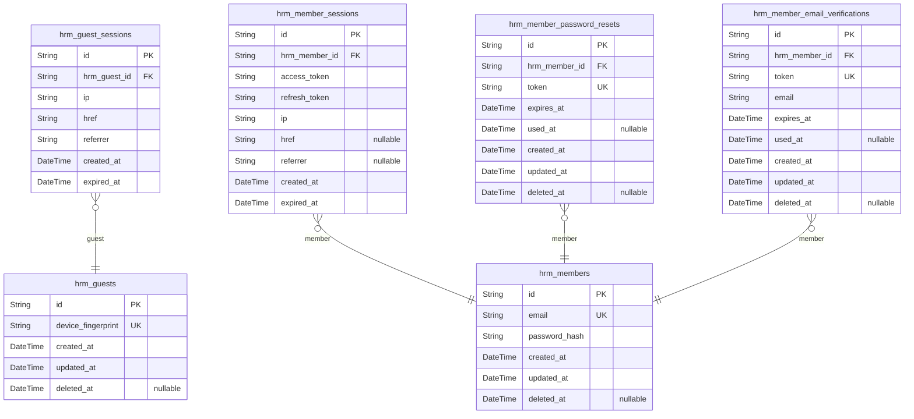
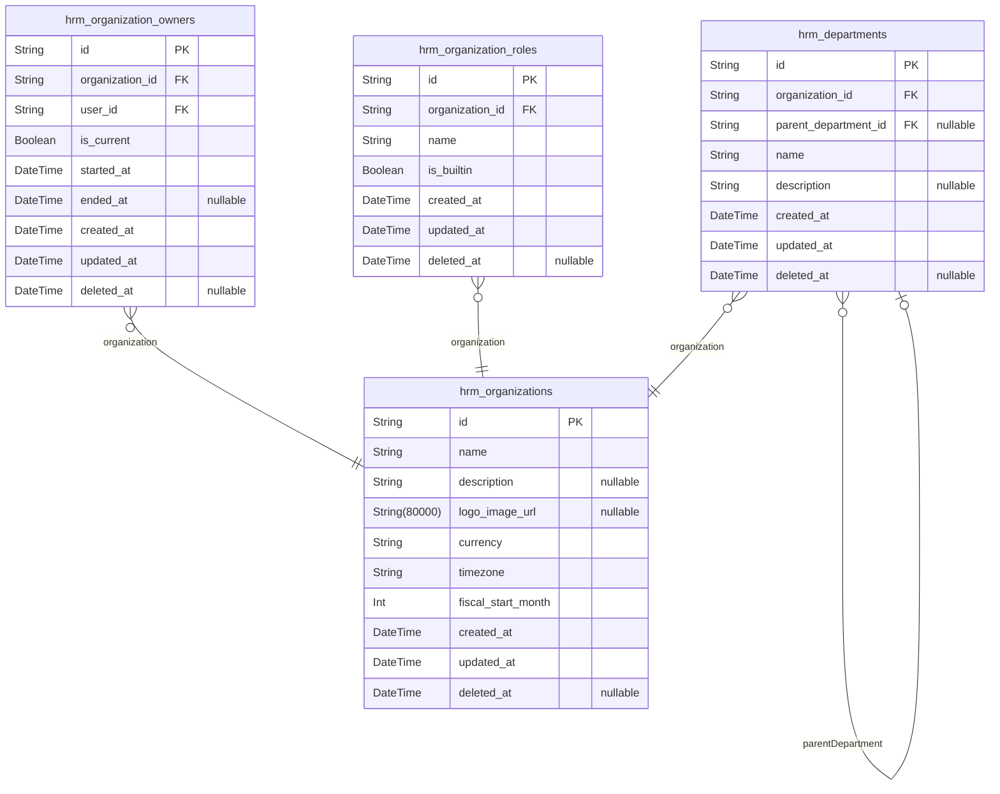
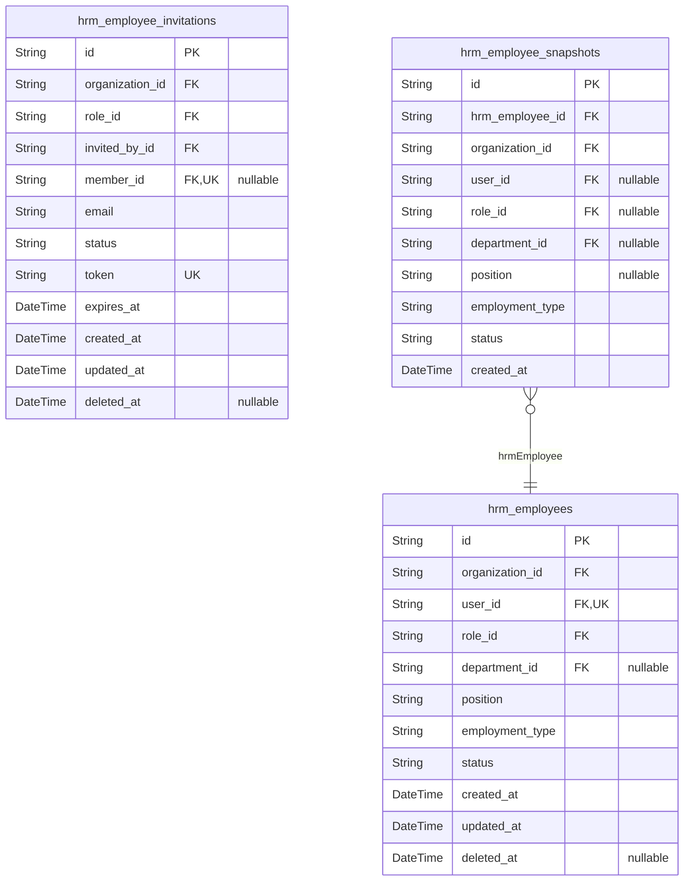
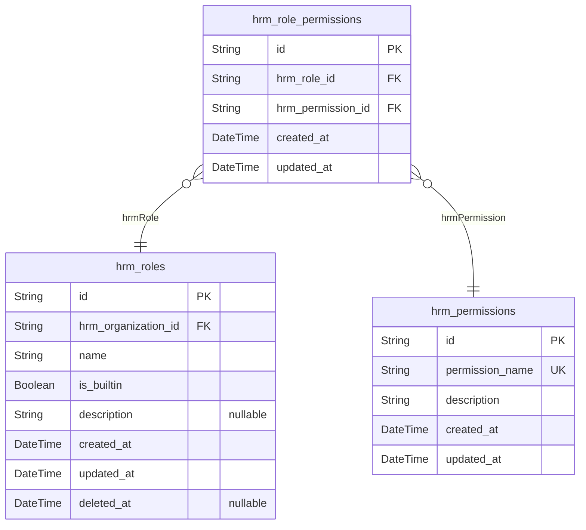
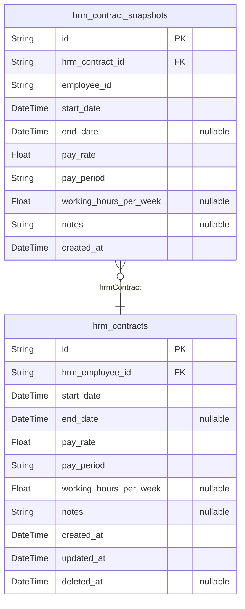
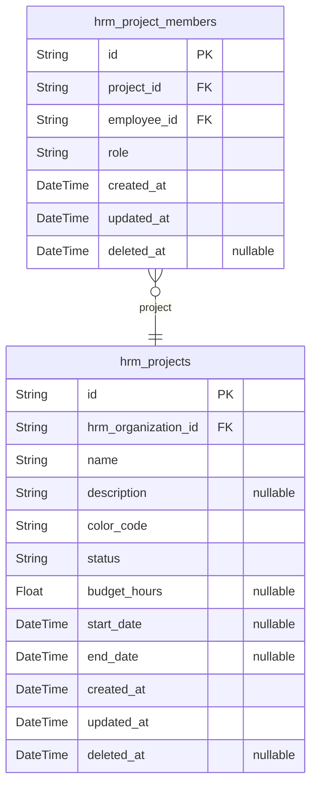
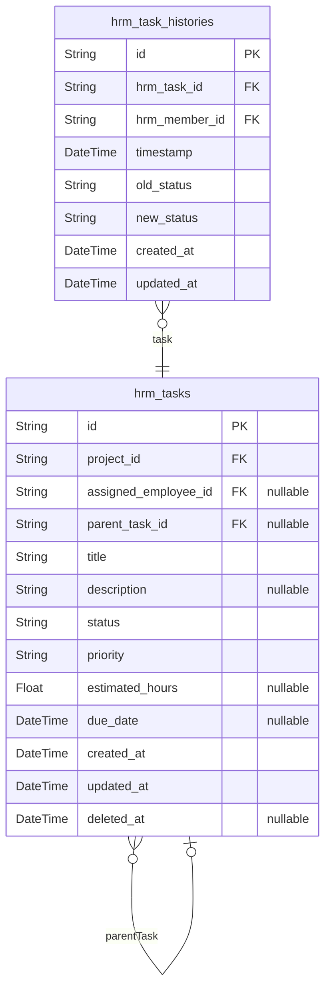
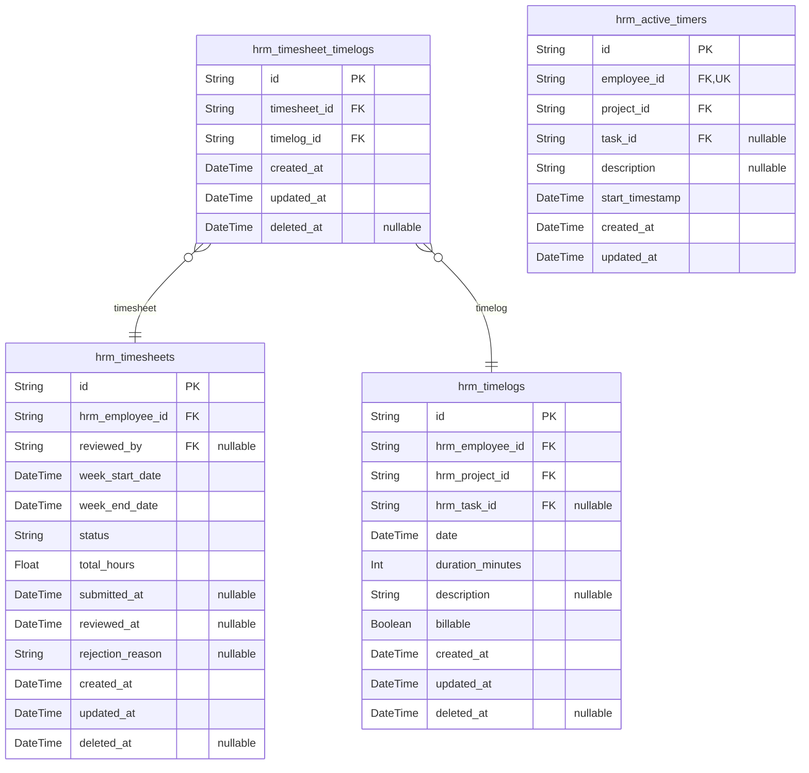
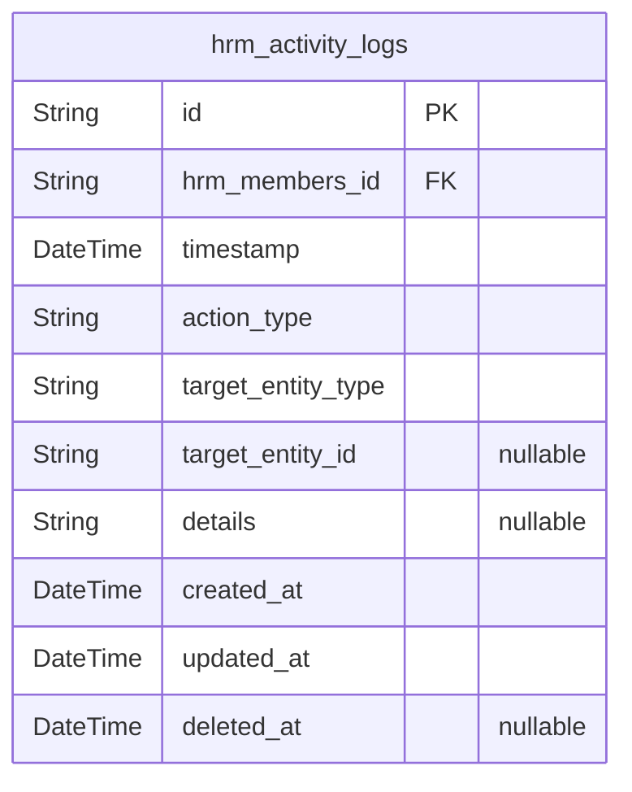

# Prisma Markdown

> Generated by [`prisma-markdown`](https://github.com/samchon/prisma-markdown)

- [authorization](#authorization)
- [organization](#organization)
- [employee](#employee)
- [role](#role)
- [contract](#contract)
- [project](#project)
- [task](#task)
- [time](#time)
- [activity](#activity)

## authorization

### `hrm_guests`

Temporary guest accounts identified by device fingerprint for
unauthenticated access.

Guest accounts enable device-based tracking and temporary session
management without requiring email registration or password
authentication. Each device is uniquely identified by its fingerprint,
allowing the system to maintain continuity across browsing sessions for
unauthenticated users.

**Identification**

The device_fingerprint field serves as the primary identifier for guest
accounts, generated from browser and device characteristics. This enables
recognition of returning devices without requiring user registration.

**Lifecycle**

Guest accounts support soft delete via the deleted_at field, allowing
temporary deactivation while preserving historical data. Active guests
have a null deleted_at value.

Properties as follows:

- `id`: Unique identifier for each guest account.
- `device_fingerprint`
  > Unique device fingerprint identifying the guest's device.
  >
  > This field enables device-based identification without requiring user
  > registration. Each device should have a unique fingerprint generated from
  > browser/device characteristics such as user agent, screen resolution,
  > installed fonts, and other browser APIs.
- `created_at`: Timestamp when the guest account was created.
- `updated_at`: Timestamp when the guest account was last updated.
- `deleted_at`
  > Timestamp when the guest account was soft-deleted. Null indicates active
  > status.

### `hrm_guest_sessions`

Temporary session tokens for guest device access with expiration.

This table stores authentication session records for guest users who
access the system without creating a full member account. Each session is
tied to a specific guest device and includes metadata for security
auditing.

Session Lifecycle

Sessions are created when a guest device first accesses the system and
are automatically invalidated after expiration. The expired_at field is
NOT NULL to enforce explicit session timeout policies.

Security Considerations

Each session tracks the originating IP address, href, and referrer for
audit purposes. Sessions belong to exactly one [hrm_guests](#hrm_guests) record
and support multiple concurrent sessions per guest device.

Properties as follows:

- `id`: Primary key for the session record.
- `hrm_guest_id`
  > Reference to the guest account that owns this session.
  >
  > This foreign key establishes the relationship to [hrm_guests](#hrm_guests),
  > ensuring each session belongs to exactly one guest device. The guest
  > record is identified by device fingerprint and temporary credentials.
- `ip`
  > IP address of the client device that created this session.
  >
  > Used for security auditing and detecting suspicious access patterns from
  > different locations.
- `href`
  > The href URL where the session was initiated.
  >
  > Tracks the entry point of the guest session for analytics and security
  > purposes.
- `referrer`
  > The referrer URL that led to this session creation.
  >
  > Captures the source page or external link that directed the guest to the
  > system.
- `created_at`
  > Timestamp when this session was created.
  >
  > Marks the beginning of the session lifecycle.
- `expired_at`
  > Timestamp when this session expires and becomes invalid.
  >
  > This field is NOT NULL to enforce explicit session timeout policies.
  > Sessions beyond this timestamp are automatically considered invalid.

### `hrm_members`

Member user accounts with email/password authentication credentials and
global profile data.

This table represents the core actor entity for authenticated users in
the system. Each member has a unique email address for login and a
securely hashed password. The global profile data is stored here and
shared across all organizations the user belongs to.

Authentication: Members authenticate using email and password
credentials. The password_hash field stores a bcrypt hash of the user's
password for secure authentication.

Soft Delete Support: The deleted_at field enables soft deletion, allowing
member accounts to be deactivated without permanent data loss. When
deleted_at is null, the account is active.

Multi-Organization Membership: Members can belong to multiple
organizations through the hrm_employees table, which links members to
organizations with role and department assignments.

Account Lifecycle: Members can delete their accounts, subject to
constraints around organization ownership and employee records in other
organizations.

Properties as follows:

- `id`: Primary key identifier for the member account.
- `email`
  > Unique email address for authentication.
  >
  > This field serves as the primary identifier for member login. It must be
  > unique across all member accounts and is used for authentication,
  > password reset, and email verification flows.
- `password_hash`
  > Bcrypt hash of the user's password.
  >
  > The password is never stored in plain text. This field contains the
  > securely hashed password using bcrypt or equivalent algorithm for
  > authentication.
- `created_at`
  > Timestamp when the account was created.
  >
  > Set automatically upon account registration. Used for audit trails and
  > account age calculations.
- `updated_at`
  > Timestamp when the account was last updated.
  >
  > Automatically updated on any modification to the account. Used for
  > tracking account changes and synchronization.
- `deleted_at`
  > Timestamp when the account was soft-deleted. Null if active.
  >
  > When set, the account is considered deleted but data is retained. This
  > enables account recovery and audit compliance. Null value indicates an
  > active account.

### `hrm_member_sessions`

JWT session tokens for member authentication with access and refresh
token support.

This table tracks authenticated member sessions and their lifecycle. Each
session contains JWT tokens for API authentication and metadata about the
session origin.

## Session Lifecycle

Sessions are created upon successful member login and expire based on
configured token expiration policies. Sessions are append-only audit
trails managed exclusively through authentication flows.

## Security Considerations

Sessions include IP address and referrer information for security
auditing. The expired_at field enforces session expiration and is NOT
NULL by default to ensure all sessions have defined lifecycles.

Properties as follows:

- `id`: Primary key for the session record.
- `hrm_member_id`
  > Reference to the member user who owns this session.
  >
  > Each session belongs to exactly one [hrm_members](#hrm_members) record. Multiple
  > sessions may exist for the same member across different devices or
  > browsers.
- `access_token`
  > JWT access token for API authentication.
  >
  > This token is used to authenticate API requests and contains claims about
  > the member's identity and permissions. Tokens are short-lived and must be
  > refreshed periodically.
- `refresh_token`
  > JWT refresh token for obtaining new access tokens.
  >
  > This token is used to generate new access tokens when the current one
  > expires. Refresh tokens have longer lifespans than access tokens and are
  > rotated on use for security.
- `ip`
  > IP address of the client that created this session.
  >
  > Used for security auditing and detecting suspicious session activity from
  > unusual locations.
- `href`
  > Current page URL (href) when session was created.
  >
  > Captures the page context where the user initiated the login or session
  > refresh.
- `referrer`
  > Referrer URL when session was created.
  >
  > Tracks the source page that led to the authentication action.
- `created_at`
  > Timestamp when this session was created.
  >
  > Used for session ordering and calculating session age.
- `expired_at`
  > Timestamp when this session expires.
  >
  > Sessions are invalidated after this timestamp. This field is NOT NULL to
  > enforce explicit session expiration policies.

### `hrm_member_password_resets`

Password reset tokens for member account recovery with expiration and
single-use constraint.

This table stores one-time use tokens that members can use to reset their
passwords. Each token is valid for a limited time and becomes invalid
after use.

## Token Lifecycle

Tokens are created when a member requests a password reset. The token is
sent via email and must be used within the expiration period. Once used,
the token is marked as consumed and cannot be reused.

## Security Constraints

- Tokens are single-use only
- Tokens expire after a configured time period
- Multiple tokens can exist for the same member, but only unexpired,
unused tokens are valid
- Old tokens are cleaned up via scheduled job

Properties as follows:

- `id`: Primary key identifier for this password reset token record.
- `hrm_member_id`
  > Reference to the member account requesting password reset.
  >
  > This foreign key links the reset token to the specific member whose
  > password will be reset. The member must exist in [hrm_members](#hrm_members)
  > table.
- `token`
  > Unique cryptographic token sent to member's email for password reset.
  >
  > This token is generated using a secure random algorithm and is unique
  > across all password reset requests. It must be included in the password
  > reset request URL.
- `expires_at`
  > Timestamp when this token becomes invalid.
  >
  > Tokens are automatically considered invalid after this time. A background
  > job should periodically delete expired tokens to maintain table
  > cleanliness.
- `used_at`
  > Timestamp when this token was consumed for password reset.
  >
  > Once this field is populated, the token cannot be used again. This
  > enforces the single-use constraint. Null indicates the token is still
  > valid for use.
- `created_at`: Timestamp when this password reset token was created.
- `updated_at`: Timestamp when this record was last updated.
- `deleted_at`: Timestamp when this record was soft-deleted.

### `hrm_member_email_verifications`

Email verification tokens for member registration with expiration and
single-use constraint.

This table stores temporary verification tokens sent to users during
registration to confirm email ownership. Each token is valid for a
limited time and can only be used once.

**Token Lifecycle**
- Created when user registers or requests email verification
- Sent via email to the user
- Validated when user clicks verification link
- Marked as used after successful verification
- Expired tokens are cleaned up periodically

**Security Constraints**
- Single-use: token is invalidated after first use
- Expiration: tokens expire after configured time period
- Unique token per verification request

Properties as follows:

- `id`: Primary key for the email verification record.
- `hrm_member_id`
  > Reference to the member account whose email is being verified.
  >
  > This foreign key links the verification token to the user account created
  > during registration. The member record exists before verification is
  > complete.
  >
  > [hrm_members](#hrm_members)
- `token`
  > Unique verification token sent to the user's email address.
  >
  > This is a cryptographically secure random string used to validate email
  > ownership. The token is included in the verification email link and must
  > match exactly for verification to succeed.
- `email`
  > Email address being verified.
  >
  > Stored for reference and to allow re-sending verification emails. This
  > should match the email provided during member registration.
- `expires_at`
  > Timestamp when the verification token expires.
  >
  > Tokens are invalidated after this time to prevent reuse of old
  > verification links. Typical expiration is 24 hours from creation.
- `used_at`
  > Timestamp when the token was successfully used for verification.
  >
  > This field is null until the user completes email verification. Once set,
  > the token cannot be used again (single-use constraint).
- `created_at`: Timestamp when the verification token was created.
- `updated_at`: Timestamp when the verification record was last updated.
- `deleted_at`: Timestamp when the verification record was soft-deleted.

## organization

### `hrm_organizations`

Organization entities with multi-tenancy configuration including name,
description, logo, currency, timezone, and fiscal period settings.

Organizations serve as the foundational isolation boundary for all
business data. Each organization operates independently with its own
configuration settings, employees, projects, and time tracking records.

**Configuration Fields**
- Currency: ISO 4217 currency code (e.g., USD, EUR, KRW) for financial
calculations
- Timezone: IANA timezone identifier for date/time formatting
- Fiscal Start Month: Month number (1-12) defining the organization's
fiscal year

**Deletion Constraints**
- Cannot delete if pending timesheets exist (not approved or rejected)
- Cannot delete if active employee contracts exist
- Cascades to all employees, projects, tasks, timelogs, and timesheets
- Owner accounts remain but are disassociated from the deleted organization

Properties as follows:

- `id`: Primary key for the organization record.
- `name`
  > Organization display name.
  >
  > Required for identification and user-facing references.
- `description`
  > Organization description or tagline.
  >
  > Optional field for additional context about the organization.
- `logo_image_url`
  > URL to organization logo image.
  >
  > Used for branding in user interfaces and communications.
- `currency`
  > ISO 4217 currency code (e.g., USD, EUR, KRW).
  >
  > Used for all financial calculations including contract pay rates and
  > project budgets.
- `timezone`
  > IANA timezone identifier (e.g., America/New_York, Asia/Seoul).
  >
  > Used for date/time formatting and timesheet week boundaries.
- `fiscal_start_month`
  > Fiscal year start month (1-12).
  >
  > January=1, December=12. Used for financial reporting periods.
- `created_at`
  > Record creation timestamp.
  >
  > Automatically set on organization creation.
- `updated_at`
  > Record last update timestamp.
  >
  > Automatically updated on any field modification.
- `deleted_at`
  > Soft delete timestamp.
  >
  > When null, organization is active. When set, organization is marked for
  > deletion but retained for audit purposes.

### `hrm_organization_owners`

Organization ownership tracking with current and historical owner records
to support ownership transfer lifecycle

This table maintains a complete audit trail of organization ownership
changes, enabling ownership transfer workflows and historical analysis.
Each organization can have multiple ownership records over time, but only
one current owner at any given point.

Ownership Lifecycle

When an organization is created, an initial ownership record is created
with is_current=true and ended_at=NULL. When ownership is transferred,
the current record's ended_at is set to the transfer date and
is_current=false, while a new record is created for the new owner. When
an organization is deleted, all ownership records are cascade deleted.

Data Integrity

Application-level enforcement ensures only one current owner per
organization (is_current=true with ended_at=NULL). The unique constraint
on (organization_id, is_current) prevents duplicate current or historical
flags, while business logic ensures single current ownership.

Properties as follows:

- `id`: Primary key uniquely identifying each ownership record.
- `organization_id`
  > Reference to the organization whose ownership is being tracked.
  >
  > This foreign key establishes the relationship to {@link
  > hrm_organizations}. Ownership records cannot exist without a valid
  > organization. When an organization is deleted, all associated ownership
  > records are cascade deleted per multi-tenancy data isolation rules.
- `user_id`
  > Reference to the user who owns or owned the organization.
  >
  > This foreign key establishes the relationship to [hrm_members](#hrm_members).
  > Users can own multiple organizations over time, creating separate
  > ownership records for each. When a user account is deleted, ownership
  > records are handled per account deletion constraints (must transfer
  > ownership or delete organization first if sole owner).
- `is_current`
  > Flag indicating whether this is the current active ownership record.
  >
  > When true, this record represents the active owner of the organization.
  > Only one record per organization should have is_current=true at any time.
  > Application logic enforces this constraint during ownership transfers.
  >
  > Current ownership: is_current=true, ended_at=NULL
  > Historical ownership: is_current=false, ended_at=transfer date
- `started_at`
  > Timestamp when this ownership record became effective.
  >
  > For initial ownership, this is the organization creation time. For
  > transferred ownership, this is the transfer date. This field is never
  > null and establishes the ownership period start.
- `ended_at`
  > Timestamp when this ownership record became inactive (NULL if currently
  > active).
  >
  > When NULL, indicates this is the current ownership record. When set,
  > indicates the ownership ended due to transfer or organization deletion.
  > This field enables historical ownership queries and audit trails.
- `created_at`: Timestamp when this record was created in the database.
- `updated_at`
  > Timestamp when this record was last updated. Updated during ownership
  > transfers when ended_at is set.
- `deleted_at`
  > Timestamp when this record was soft deleted. NULL if the record is
  > active. Used for audit trail preservation before cascade deletion.

### `hrm_organization_roles`

Organization-specific roles including built-in roles (Owner, Manager,
Employee) and custom roles defined by organization owners.

Role Types

Built-in roles (is_builtin=true) are system-defined and cannot be
deleted: Owner, Manager, Employee. Custom roles (is_builtin=false) can be
created and deleted by organization owners, subject to assignment
constraints.

Deletion Constraints

Built-in roles cannot be deleted under any circumstances. Custom roles
cannot be deleted if employees are currently assigned to them. This
ensures role assignments remain valid.

Organization Scope

Each role belongs to exactly one [HrmOrganizations](#HrmOrganizations) and is visible
only within that organization's context. Role names must be unique within
each organization to prevent ambiguity.

Properties as follows:

- `id`: Primary key for the role record.
- `organization_id`
  > References the organization this role belongs to.
  >
  > Each role is scoped to exactly one organization and inherits the
  > organization's data isolation boundaries. Role permissions and
  > assignments are valid only within this organization context.
- `name`
  > Role name within the organization.
  >
  > Must be unique within the organization (enforced by unique index).
  > Built-in roles use fixed names: Owner, Manager, Employee. Custom roles
  > can use any descriptive name chosen by the organization owner.
- `is_builtin`
  > Indicates whether this is a system-built-in role.
  >
  > Built-in roles (Owner, Manager, Employee) cannot be deleted and have
  > fixed permission sets. Custom roles created by organization owners have
  > is_builtin=false and can be modified or deleted if not assigned to
  > employees.
- `created_at`: Timestamp when the role was created.
- `updated_at`: Timestamp when the role was last updated.
- `deleted_at`: Timestamp when the role was soft-deleted (nullable for active roles).

### `hrm_departments`

Department structure within organizations supporting one-level nesting
via parent department reference

This table organizes employees into hierarchical department groups within
each organization. Departments support a single level of nesting where a
department can have one parent department but multiple child departments.

Department Lifecycle

Departments are created by organization administrators and can be
deleted. When a department is deleted, all employees assigned to it have
their department_id set to null rather than being deleted themselves.
This preserves employee records while removing the department grouping.

Soft deletion is supported via the deleted_at field, allowing departments
to be hidden without permanent data loss.

Hierarchy Constraints

The parent_department_id field enables one-level nesting only. A
department can reference another department in the same organization as
its parent, but nested hierarchies beyond one level are not supported.
This keeps the department structure flat and manageable.

Properties as follows:

- `id`: Primary key uniquely identifying each department record
- `organization_id`
  > Reference to the organization that owns this department
  >
  > All departments belong to exactly one organization and are isolated
  > within that organization's data scope. The organization_id ensures data
  > separation in the multi-tenancy architecture.
  >
  > [hrm_organizations](#hrm_organizations)
- `parent_department_id`
  > Reference to the parent department for one-level hierarchy nesting
  >
  > This self-referencing foreign key allows a department to have one parent
  > department within the same organization. Null value indicates a top-level
  > department with no parent.
  >
  > Only one level of nesting is supported - child departments cannot have
  > their own children.
  >
  > [hrm_departments](#hrm_departments)
- `name`
  > Department name displayed to users
  >
  > Must be unique within the organization. Common examples include
  > "Engineering", "Human Resources", "Sales", "Marketing".
- `description`
  > Optional detailed description of the department's purpose and
  > responsibilities
- `created_at`: Timestamp when the department was created
- `updated_at`: Timestamp when the department was last updated
- `deleted_at`
  > Timestamp when the department was soft-deleted. Null if the department is
  > active.

## employee

### `hrm_employees`

Employee records linking users to organizations with role, department,
position, employment type, and status.

This table represents the employment relationship between a user and an
organization. Each employee record connects a user account to their role
within a specific organization, capturing their position, employment
type, and current status.

**Relationships**

- [hrm_organizations](#hrm_organizations): Each employee belongs to exactly one
organization. Organization deletion cascades to all employee records.
- [hrm_members](#hrm_members): Each employee links to exactly one user account. A
user can have multiple employee records across different organizations.
- [hrm_roles](#hrm_roles): Each employee has exactly one role within their
organization. Role changes are tracked through role_id updates.
- [hrm_departments](#hrm_departments): Employees may optionally belong to a
department within their organization. Department is nullable to support
employees without department assignment.

**Business Rules**

- One employee record per user per organization (enforced by unique
constraint on organization_id and user_id)
- Status field controls employee lifecycle: active employees can log time
and access organization resources; deactivated employees lose access but
records are preserved
- Employment type categorizes the nature of employment: full-time,
part-time, contractor, or intern
- Soft delete support via deleted_at field for employee record archival

Properties as follows:

- `id`: Primary key uniquely identifying each employee record.
- `organization_id`
  > References the organization this employee belongs to.
  >
  > Each employee is associated with exactly one organization. All employee
  > data is scoped to their organization for multi-tenancy isolation.
  >
  > **Business Rules**
  >
  > - Required field - every employee must belong to an organization
  > - Organization deletion cascades to all employee records
  > - Employee can only access data within their organization context
- `user_id`
  > References the user account associated with this employee record.
  >
  > Links the employee record to the global user account ({@link
  > hrm_members}). A single user can have multiple employee records across
  > different organizations.
  >
  > **Business Rules**
  >
  > - Required field - every employee must be linked to a user account
  > - One employee record per user per organization (unique constraint)
  > - User account deletion deactivates all associated employee records
- `role_id`
  > References the role assigned to this employee within their organization.
  >
  > Defines the employee's permissions and access level within the
  > organization. Each employee has exactly one role at a time.
  >
  > **Business Rules**
  >
  > - Required field - every employee must have a role
  > - Role changes update this field directly
  > - Custom roles cannot be deleted if employees are assigned to them
  > - Built-in roles (Owner, Manager, Employee) always available
- `department_id`
  > References the department this employee belongs to within their
  > organization.
  >
  > Optional department assignment for organizational hierarchy. Employees
  > can exist without department assignment.
  >
  > **Business Rules**
  >
  > - Nullable field - employees may not belong to any department
  > - Department deletion sets this field to null (does not delete employee)
  > - Supports one-level department nesting through department's
  > parent_department_id
- `position`
  > Job title or position name for this employee.
  >
  > Captures the employee's specific role or title within the organization
  > (e.g., "Senior Developer", "Marketing Manager", "HR Specialist").
- `employment_type`
  > Type of employment arrangement for this employee.
  >
  > **Allowed Values**
  >
  > - `full-time`: Standard full-time employment
  > - `part-time`: Part-time employment with reduced hours
  > - `contractor`: Contract-based worker
  > - `intern`: Internship position
- `status`
  > Current employment status of this employee.
  >
  > **Allowed Values**
  >
  > - `active`: Employee is currently active and can access organization
  > resources
  > - `deactivated`: Employee has been deactivated (loses access but record
  > preserved)
  >
  > **Business Rules**
  >
  > - Status changes affect employee access to organization features
  > - Deactivated employees cannot log time or access protected resources
  > - Status can be reactivated for former employees returning to the
  > organization
- `created_at`
  > Timestamp when this employee record was created.
  >
  > Recorded automatically upon employee creation for audit trail purposes.
- `updated_at`
  > Timestamp when this employee record was last updated.
  >
  > Updated automatically on any modification to the employee record.
- `deleted_at`
  > Timestamp when this employee record was soft-deleted.
  >
  > Null while employee is active or deactivated. Set to current timestamp
  > when employee is deleted, enabling soft delete functionality for record
  > preservation.

### `hrm_employee_invitations`

Pending invitations for users to join organizations with email, role, and
invitation status tracking

Invitations are created by organization members to invite new employees
to join their organization. Each invitation specifies the target
organization, the role to assign upon acceptance, and an expiration date.
When an invited user signs up with the matching email address, they can
accept the invitation and be automatically added as an employee with the
specified role.

Invitation Lifecycle:
- Pending: Invitation sent, awaiting user acceptance via email token
- Accepted: User has signed up and accepted the invitation, employee
record created
- Expired: Invitation past expiration date, cannot be accepted
- Cancelled: Manually cancelled by the inviter before acceptance

The invited_by field tracks which member sent the invitation for audit
purposes. The member_id field is populated when the invited user accepts
the invitation, creating the link between the invitation and the actual
member account.

Properties as follows:

- `id`: Primary key for the invitation record.
- `organization_id`
  > Organization the invited user will join.
  >
  > Each invitation is scoped to a specific organization and cannot be
  > transferred between organizations. The organization must exist and be
  > active when the invitation is created.
- `role_id`
  > Role assigned to the invited user upon acceptance.
  >
  > The role must exist within the target organization. Both built-in roles
  > (Owner, Manager, Employee) and custom roles defined by the organization
  > are supported. The role determines the permissions the new employee will
  > have.
- `invited_by_id`
  > Member who created and sent this invitation.
  >
  > Tracks which organization member initiated the invitation for audit and
  > accountability purposes. This references the hrm_members table,
  > representing the authenticated user who sent the invitation.
- `member_id`
  > Member who accepted this invitation.
  >
  > Remains null while the invitation is pending. Populated with the member
  > ID when the invited user signs up and accepts the invitation via the
  > unique token. This creates the link between the invitation and the actual
  > member account.
- `email`
  > Email address of the invited user.
  >
  > Used to match the invitation when the user signs up. The invited user
  > must register with this exact email address to accept the invitation.
  > Combined with organization_id and status, ensures only one pending
  > invitation per email per organization.
- `status`
  > Current status of the invitation.
  >
  > Allowed values:
  > - pending: Invitation sent, awaiting acceptance via email token
  > - accepted: User has signed up and accepted the invitation, employee
  > record created
  > - expired: Invitation past expiration date, cannot be accepted
  > - cancelled: Manually cancelled by the inviter before acceptance
  >
  > Status transitions: pending → accepted, pending → expired, pending →
  > cancelled. Once accepted, expired, or cancelled, the invitation cannot be
  > reactivated.
- `token`
  > Unique token for invitation acceptance.
  >
  > Generated when the invitation is created and sent to the invited user's
  > email address. Used to verify and accept the invitation securely. Must be
  > unique across all invitations to prevent token collision attacks.
- `expires_at`
  > Expiration date and time for the invitation.
  >
  > Invitations become invalid after this timestamp and cannot be accepted.
  > Expired invitations remain in the database for audit purposes but are
  > filtered out from active invitation lists. Typical expiration is 7-30
  > days from creation.
- `created_at`: Timestamp when the invitation was created.
- `updated_at`
  > Timestamp when the invitation was last updated, such as when status
  > changed or member_id was populated.
- `deleted_at`
  > Timestamp when the invitation was soft-deleted.
  >
  > Soft deletes allow audit trail preservation while hiding invitations from
  > active queries. Typically used for compliance or data retention policies.

### `hrm_employee_snapshots`

Point-in-time snapshots of employee records for audit trail and change
tracking

This table captures historical states of employee records at specific
moments in time. Each snapshot represents the complete state of an
employee record when it was created, enabling audit trails and change
tracking across the organization.

Snapshots are immutable once created and serve as a read-only historical
record. They reference the original employee record through a foreign key
relationship, allowing reconstruction of employee states at any point in
time.

Properties as follows:

- `id`: Primary key for the snapshot record
- `hrm_employee_id`
  > Reference to the employee record being snapshot
  >
  > This foreign key links the snapshot to its source employee record in
  > [HrmEmployees](#HrmEmployees). The relationship is one-to-many, as an employee can
  > have multiple snapshots over time.
- `organization_id`
  > Organization identifier denormalized from the employee record
  >
  > This field captures the organization context at the time of the snapshot,
  > enabling historical queries even if the employee's organization changes.
- `user_id`
  > User identifier denormalized from the employee record
  >
  > This field captures the user association at the time of the snapshot,
  > enabling historical queries even if the employee's user association
  > changes.
- `role_id`
  > Role identifier denormalized from the employee record
  >
  > This field captures the role assignment at the time of the snapshot,
  > enabling historical queries even if the employee's role changes.
- `department_id`
  > Department identifier denormalized from the employee record
  >
  > This field captures the department assignment at the time of the
  > snapshot, enabling historical queries even if the employee's department
  > changes.
- `position`
  > Employee position/title denormalized from the employee record
  >
  > Captures the position at the time of snapshot for historical tracking.
- `employment_type`
  > Employment type denormalized from the employee record
  >
  > Values: full-time, part-time, contractor, intern. Captures the employment
  > type at the time of snapshot.
- `status`
  > Employee status denormalized from the employee record
  >
  > Values: active, deactivated. Captures the status at the time of snapshot.
- `created_at`
  > Timestamp when this snapshot was created
  >
  > Records the point-in-time when this historical record was captured.

## role

### `hrm_roles`

Organization-specific roles including built-in (Owner, Manager, Employee)
and custom roles.

Built-in roles cannot be deleted; custom roles cannot be deleted if
employees are assigned.

## Role Types

**Built-in Roles**: Three system-defined roles (Owner, Manager, Employee)
that exist in every organization and cannot be deleted. These roles have
predefined permission sets.

**Custom Roles**: Organization-defined roles created by organization
owners to implement custom permission configurations. Custom roles can be
deleted only if no employees are assigned to them.

## Business Constraints

- Role names must be unique within each organization
- Built-in roles have `is_builtin = true` and cannot be deleted
- Custom roles (`is_builtin = false`) cannot be deleted if any {@link
hrm_employees} reference them
- Soft delete via `deleted_at` preserves historical role assignments

Properties as follows:

- `id`: Primary key uniquely identifying each role record.
- `hrm_organization_id`
  > References the organization this role belongs to. Roles are scoped to a
  > single organization and cannot be shared across organizations.
  >
  > Each role must belong to exactly one [hrm_organizations](#hrm_organizations). This
  > foreign key enforces data isolation between organizations.
- `name`
  > Role name unique within the organization.
  >
  > Built-in roles use fixed names: "Owner", "Manager", "Employee". Custom
  > roles can have any name chosen by the organization owner.
- `is_builtin`
  > Indicates whether this is a system-defined built-in role.
  >
  > Built-in roles (Owner, Manager, Employee) have `is_builtin = true` and
  > cannot be deleted. Custom roles have `is_builtin = false` and can be
  > deleted if no employees are assigned.
- `description`
  > Optional description explaining the role's purpose and responsibilities.
  >
  > Custom roles typically include descriptions to help organization members
  > understand the role's scope. Built-in roles may have system-generated
  > descriptions.
- `created_at`
  > Timestamp when this role was created.
  >
  > Built-in roles are created automatically when an organization is
  > initialized. Custom roles are created when organization owners define new
  > role configurations.
- `updated_at`
  > Timestamp when this role was last modified.
  >
  > Updated whenever role properties (name, description) are changed.
  > Built-in role properties typically cannot be modified.
- `deleted_at`
  > Timestamp when this role was soft-deleted.
  >
  > Custom roles can be soft-deleted when no longer needed, preserving
  > historical employee assignments. Built-in roles cannot be deleted. Null
  > indicates the role is active.

### `hrm_permissions`

Permission definitions available for assignment to roles within the HRM
system.

This table stores system-defined permission names that control access to
various features and operations. Each permission represents a specific
capability that can be granted to roles.

Permission Categories

Organization permissions: org:manage - Full organization configuration
and lifecycle management

Employee permissions: employee:manage - Create, edit, deactivate
employees; employee:view - View employee records and details

Project permissions: project:manage - Create, edit, archive projects;
project:view - View project information and member lists

Time permissions: time:manage - Create, edit, delete timelogs;
time:approve - Approve or reject timesheets; time:view_all - View all
timelogs across the organization

Reporting permissions: report:view - Access organization-wide reports and
analytics

Usage

Permissions are assigned to roles through the {@link
hrm_role_permissions} junction table. Roles then grant these permissions
to employees within an organization. The permission names follow a
{domain}:{action} naming convention for clarity and consistency.

Properties as follows:

- `id`: Primary key uniquely identifying each permission definition.
- `permission_name`
  > Unique permission identifier following {domain}:{action} convention.
  >
  > Examples: org:manage, employee:manage, employee:view, project:manage,
  > project:view, time:manage, time:approve, time:view_all, report:view
- `description`: Human-readable description of what this permission allows users to do.
- `created_at`: Timestamp when this permission definition was created.
- `updated_at`: Timestamp when this permission definition was last updated.

### `hrm_role_permissions`

Junction table assigning permissions to roles. Each role must have at
least one permission. Custom roles require at least one permission to be
created.

This table establishes the many-to-many relationship between roles and
permissions within an organization. It enforces that every role has at
least one permission assigned, and custom roles cannot be created without
permissions.

Relationships:
- Each record links one [hrm_roles](#hrm_roles) to one [hrm_permissions](#hrm_permissions)
- A role can have multiple permissions
- A permission can be assigned to multiple roles
- Composite unique constraint prevents duplicate role-permission assignments

Properties as follows:

- `id`: Primary key uniquely identifying each role-permission assignment record.
- `hrm_role_id`
  > References the role to which this permission is assigned. Each role must
  > have at least one permission assigned.
  >
  > This foreign key establishes the relationship to [hrm_roles](#hrm_roles) and
  > enforces referential integrity. Cascade delete ensures permissions are
  > removed when a role is deleted.
- `hrm_permission_id`
  > References the permission assigned to the role. Each permission can be
  > assigned to multiple roles.
  >
  > This foreign key establishes the relationship to [hrm_permissions](#hrm_permissions)
  > and enforces referential integrity. Cascade delete ensures
  > role-permission assignments are removed when a permission is deleted.
- `created_at`
  > Timestamp when this role-permission assignment was created. Automatically
  > set on record creation.
- `updated_at`
  > Timestamp when this role-permission assignment was last updated.
  > Automatically updated on record modification.

## contract

### `hrm_contracts`

Employment contracts tracking compensation and terms for employees with
lifecycle states.

Each contract records the financial and working terms between an employee
and their organization. The contract lifecycle is managed through
start_date and end_date fields, where a NULL end_date indicates an active
contract. Application logic enforces that only one active contract exists
per employee at any time.

**Lifecycle Management**

When a new contract is created, the system automatically terminates the
previous active contract by setting its end_date to one day before the
new contract's start_date. This ensures a continuous employment history
without gaps. Once a contract's end_date is set, the record becomes
immutable to preserve historical accuracy for audit and compliance
purposes.

**Compensation Details**

The contract captures pay_rate as a numeric value, pay_period as a
categorical value (hourly, daily, weekly, or monthly), and
working_hours_per_week as an optional numeric field. These fields support
payroll calculations and employment verification across different
employment types including full-time, part-time, contractor, and intern
arrangements.

**Relationships**

Each contract belongs to exactly one [hrm_employees](#hrm_employees) record through
the hrm_employee_id foreign key. The contract is a subsidiary entity that
cannot exist independently of its parent employee record. When an
employee is deleted, all associated contracts are cascade deleted to
maintain referential integrity.

Properties as follows:

- `id`: Primary key uniquely identifying each employment contract record.
- `hrm_employee_id`
  > References the employee record to which this contract belongs. Each
  > employee can have multiple contracts over time, but only one active
  > contract (NULL end_date) at any given time.
  >
  > **Relationship**
  >
  > This foreign key establishes a many-to-one relationship from contracts to
  > employees. The hrm_employees table is the parent entity, and contracts
  > are managed through the employee context.
  >
  > **Constraints**
  >
  > This field is NOT NULL, ensuring every contract is associated with a
  > valid employee record. Cascade delete is applied when the parent employee
  > is removed.
- `start_date`
  > The effective start date of this employment contract. Marks when the
  > contractual terms become active.
  >
  > **Business Rule**
  >
  > This field is required and cannot be null. When creating a new contract,
  > the system validates that the start_date does not overlap with existing
  > active contracts for the same employee.
- `end_date`
  > The effective end date of this employment contract. A NULL value
  > indicates the contract is currently active.
  >
  > **Business Rule**
  >
  > When a new contract is created for an employee, the previous active
  > contract's end_date is automatically set to one day before the new
  > contract's start_date. Once end_date is populated, the contract becomes
  > immutable to preserve historical accuracy.
- `pay_rate`
  > The compensation rate specified in this contract. The actual unit (per
  > hour, day, week, or month) is determined by the pay_period field.
  >
  > **Usage**
  >
  > This numeric value is used for payroll calculations, budget tracking, and
  > employment verification. The value should be stored in the organization's
  > base currency.
- `pay_period`
  > The frequency at which the pay_rate is applied. Valid values are: hourly,
  > daily, weekly, monthly.
  >
  > **Enumeration**
  >
  > - hourly: Pay rate per hour worked
  > - daily: Pay rate per day worked
  > - weekly: Pay rate per week
  > - monthly: Pay rate per month
  >
  > This field determines how the pay_rate value should be interpreted for
  > payroll calculations.
- `working_hours_per_week`
  > The expected number of working hours per week under this contract.
  > Optional field for contracts where hourly tracking is relevant.
  >
  > **Usage**
  >
  > This value is used for full-time vs part-time classification, overtime
  > calculations, and compliance with labor regulations. May be null for
  > contractor or irregular work arrangements.
- `notes`
  > Optional text field for additional contract terms, special conditions, or
  > administrative notes not captured in structured fields.
  >
  > **Usage**
  >
  > This field stores free-form text for edge cases or custom arrangements
  > that don't fit the standard contract schema. Examples include remote work
  > agreements, bonus structures, or special benefits.
- `created_at`
  > Timestamp when this contract record was created in the system. Used for
  > audit trail and record-keeping purposes.
- `updated_at`
  > Timestamp when this contract record was last modified. Updated
  > automatically on any change to the contract fields.
  >
  > **Immutability**
  >
  > Once end_date is set (contract terminated), this field should not change
  > as the record becomes immutable.
- `deleted_at`
  > Timestamp when this contract was soft-deleted. NULL indicates the record
  > is active in the system.
  >
  > **Usage**
  >
  > Soft delete allows contracts to be marked for deletion while preserving
  > historical data for audit purposes. Cascade delete applies when the
  > parent employee is removed.

### `hrm_contract_snapshots`

Point-in-time snapshots of contract changes for audit trail and
historical tracking.

This table captures immutable versions of [hrm_contracts](#hrm_contracts) at
specific moments, enabling audit trails and historical analysis of
contract modifications. Each snapshot preserves the complete state of a
contract including compensation terms, employment dates, and work
arrangements.

**Snapshot Behavior**

Snapshots are created automatically when contracts are modified,
providing a complete history of changes over time. The table is
append-only and read-only from a user perspective, with no update or
delete operations permitted.

**Relationship to Contracts**

Each snapshot references exactly one [hrm_contracts](#hrm_contracts) record via
hrm_contract_id. Multiple snapshots can exist for the same contract,
representing different points in time as the contract evolves through its
lifecycle.

Properties as follows:

- `id`: Primary key uniquely identifying each contract snapshot record.
- `hrm_contract_id`
  > References the parent contract record that this snapshot captures.
  >
  > Each snapshot is tied to exactly one [hrm_contracts](#hrm_contracts) record,
  > preserving the contract's state at the time the snapshot was created.
- `employee_id`
  > Employee identifier at the time of snapshot, denormalized from the parent
  > contract for historical accuracy.
- `start_date`: Contract start date as recorded when the snapshot was created.
- `end_date`
  > Contract end date as recorded when the snapshot was created. Null
  > indicates an ongoing active contract.
- `pay_rate`
  > Compensation rate (hourly, daily, weekly, or monthly) as recorded when
  > the snapshot was created.
- `pay_period`
  > Pay period type: hourly, daily, weekly, or monthly. Captured at snapshot
  > creation time.
- `working_hours_per_week`: Expected weekly working hours as recorded when the snapshot was created.
- `notes`
  > Additional contract notes or special terms as recorded when the snapshot
  > was created.
- `created_at`
  > Timestamp when this snapshot was created, marking the point-in-time of
  > the captured contract state.

## project

### `hrm_projects`

Main project entity with organization, name, color, status, and timeline.

Projects represent work initiatives within an organization. Each project
has a name, optional description, visual color code for UI
identification, and lifecycle status. Projects track budget hours and
timeline dates for planning purposes.

**Status Lifecycle**

Projects transition through three states: active (current work), archived
(inactive but preserved), and completed (finished work). Archived and
completed projects cannot receive new timelogs but existing timelogs are
preserved for historical records.

**Deletion Constraints**

Projects cannot be deleted if timelogs exist. Soft delete is supported
via deleted_at field for recovery purposes. Use status transitions
(archived/completed) instead of deletion for most lifecycle management.

**Relationships**

Projects belong to [hrm_organizations](#hrm_organizations) and contain {@link
hrm_tasks}, [hrm_timelogs](#hrm_timelogs), and [hrm_project_members](#hrm_project_members).
Project members link employees to projects with role assignments.

Properties as follows:

- `id`: Primary key identifier for the project.
- `hrm_organization_id`
  > References the organization that owns this project.
  >
  > Every project must belong to exactly one organization. Organization
  > context is enforced on all project operations for multi-tenancy data
  > isolation.
- `name`
  > Project name for display and identification.
  >
  > Required field used throughout the UI for project references and
  > navigation.
- `description`
  > Detailed description of the project scope and objectives.
  >
  > Optional field providing additional context about project goals,
  > deliverables, and requirements.
- `color_code`
  > Hex color code for visual identification in UI.
  >
  > Used for project badges, timeline indicators, and dashboard
  > visualizations. Format: #RRGGBB or #RRGGBBAA.
- `status`
  > Current project status: active, archived, or completed.
  >
  > Active projects accept new timelogs and task assignments. Archived
  > projects are inactive but preserved for historical reference. Completed
  > projects are finished and cannot receive new timelogs.
- `budget_hours`
  > Estimated budget hours for the project.
  >
  > Optional planning field tracking allocated time resources. Used for
  > capacity planning and progress tracking against estimates.
- `start_date`
  > Planned or actual project start date.
  >
  > Optional field marking when project work began or is scheduled to begin.
- `end_date`
  > Planned or actual project completion date.
  >
  > Optional field marking when project is expected to finish or has finished.
- `created_at`: Timestamp when the project was created.
- `updated_at`: Timestamp when the project was last updated.
- `deleted_at`
  > Timestamp when the project was soft deleted.
  >
  > Null for active projects. Set to current timestamp when project is soft
  > deleted for recovery purposes.

### `hrm_project_members`

Links employees to projects with role assignment (member or project-lead).

This junction table establishes the many-to-many relationship between
[hrm_employees](#hrm_employees) and [hrm_projects](#hrm_projects). Each record represents an
employee's assignment to a specific project with an associated role that
determines their permissions within that project context.

**Role Assignment**

The role field specifies the employee's capacity within the project.
Project leads have elevated permissions to manage tasks and oversee
project activities, while regular members have standard access to
contribute to project work. This role-based access control is enforced at
the application layer.

**Relationship Constraints**

Each employee can be assigned to multiple projects, and each project can
have multiple employees. A unique constraint on the combination of
project_id and employee_id ensures that an employee cannot be assigned to
the same project more than once, preventing duplicate records and
maintaining data integrity.

Properties as follows:

- `id`: Primary key uniquely identifying each project member assignment record.
- `project_id`
  > References the project this member assignment belongs to.
  >
  > Establishes the relationship to [hrm_projects](#hrm_projects). This foreign key
  > ensures referential integrity and enables querying all members of a
  > specific project.
- `employee_id`
  > References the employee assigned to this project.
  >
  > Establishes the relationship to [hrm_employees](#hrm_employees). This foreign key
  > enables querying all projects an employee is assigned to across the
  > organization.
- `role`
  > The employee's role within this project.
  >
  > Allowed values:
  > - `member`: Standard project member with basic access permissions
  > - `project-lead`: Project lead with elevated permissions to manage tasks
  > and oversee project activities
  >
  > This field determines the access control level for the employee within
  > the project context.
- `created_at`: Timestamp when this project member assignment was created.
- `updated_at`: Timestamp when this project member assignment was last updated.
- `deleted_at`
  > Timestamp when this project member assignment was soft-deleted. Null
  > indicates the assignment is active.

## task

### `hrm_tasks`

Tasks within projects with status, priority, assignment, and one-level
nesting support.

This table represents individual work items that belong to projects. Each
task can have a status indicating its progress, a priority level for
scheduling, optional time estimates, and due dates. Tasks can be assigned
to employees and support one-level parent-child nesting for subtasks.

**Status Workflow**
Tasks progress through states: open → in-progress → completed → closed.
Status changes are logged in [hrm_task_histories](#hrm_task_histories) for audit
purposes.

**Assignment**
Tasks can be assigned to employees within the organization. Unassigned
tasks remain available for assignment by project members with appropriate
permissions.

**Parent-Child Relationship**
The parent_task_id field enables one-level task nesting for subtasks. A
task can have at most one parent but can have multiple children. This
supports hierarchical task breakdown without deep nesting complexity.

Properties as follows:

- `id`: Primary key uniquely identifying each task.
- `project_id`
  > Reference to the parent project that contains this task.
  >
  > Tasks cannot exist without a project. All tasks in a project share the
  > same organization context through the project relationship.
  >
  > [hrm_projects](#hrm_projects)
- `assigned_employee_id`
  > Reference to the employee assigned to work on this task.
  >
  > Tasks may be unassigned (nullable). When assigned, only the designated
  > employee can update the task in most workflows, though project leads and
  > users with appropriate permissions can reassign.
  >
  > [hrm_employees](#hrm_employees)
- `parent_task_id`
  > Reference to the parent task for one-level subtask nesting.
  >
  > Enables hierarchical task organization where a task can be a subtask of
  > another task. Circular references are prevented by application logic. A
  > task cannot be its own parent.
  >
  > [hrm_tasks](#hrm_tasks)
- `title`: Short descriptive title of the task.
- `description`: Detailed description of the task requirements and context.
- `status`
  > Current workflow state of the task.
  >
  > Allowed values: open, in-progress, completed, closed.
  >
  > Status transitions are logged in [hrm_task_histories](#hrm_task_histories) for audit
  > trail.
- `priority`
  > Priority level for task scheduling and visibility.
  >
  > Allowed values: low, medium, high, urgent.
  >
  > Higher priority tasks appear first in task lists and dashboards.
- `estimated_hours`
  > Estimated time to complete the task in hours.
  >
  > Used for project planning and capacity forecasting. Nullable for tasks
  > where estimation is not available or not applicable.
- `due_date`
  > Target completion date for the task.
  >
  > Used for deadline tracking and overdue notifications. Nullable for tasks
  > without a specific deadline.
- `created_at`: Timestamp when the task was created.
- `updated_at`: Timestamp when the task was last updated.
- `deleted_at`: Timestamp when the task was soft-deleted. Null indicates active task.

### `hrm_task_histories`

Audit trail for task status changes with timestamp and user who made the
change.

This table records every status transition for tasks, creating an
immutable history of task lifecycle events. Each row captures the before
and after status values along with the timestamp and the member who
initiated the change.

**Relationships**

- References [hrm_tasks](#hrm_tasks) to identify which task was modified
- References [hrm_members](#hrm_members) to identify the user who made the change

**Usage**

- Audit trail for compliance and debugging
- Track task workflow progression over time
- Identify who made specific status changes

Properties as follows:

- `id`: Primary key for this audit record.
- `hrm_task_id`
  > References the task whose status was changed.
  >
  > This foreign key establishes the relationship to [hrm_tasks](#hrm_tasks),
  > linking each history record to its parent task. Multiple history records
  > can reference the same task, creating a chronological audit trail.
- `hrm_member_id`
  > References the member who made the status change.
  >
  > This foreign key links to [hrm_members](#hrm_members) to identify which
  > authenticated user initiated the task status transition. This enables
  > accountability and audit capabilities.
- `timestamp`
  > The exact time when the task status change occurred.
  >
  > This field captures the precise moment of the status transition, enabling
  > chronological ordering of task history events.
- `old_status`
  > The task status before the change.
  >
  > Stores the previous status value (e.g., 'open', 'in-progress',
  > 'completed', 'closed') to enable comparison and audit of status
  > transitions.
- `new_status`
  > The task status after the change.
  >
  > Stores the new status value (e.g., 'open', 'in-progress', 'completed',
  > 'closed') to complete the status transition record.
- `created_at`: Timestamp when this audit record was created.
- `updated_at`: Timestamp when this audit record was last updated.

## time

### `hrm_timelogs`

Individual time entries with project, task, and billable tracking.

Stores granular time tracking records for employee work activities. Each
timelog represents a discrete work session with associated project,
optional task, duration, and billable status. Timelogs are aggregated
into timesheets for weekly reporting and approval workflows.

Relationships: Each timelog belongs to exactly one [hrm_employees](#hrm_employees)
record, one [hrm_projects](#hrm_projects) record, and optionally one {@link
hrm_tasks} record. Billable flag determines if time is chargeable to
clients.

Constraints: Timelogs cannot be edited or deleted if included in approved
timesheets. Users with time:manage permission can override these
restrictions.

Properties as follows:

- `id`: Primary key uniquely identifying each timelog entry.
- `hrm_employee_id`
  > Reference to the employee who created this timelog. Each timelog is owned
  > by exactly one employee and cannot be transferred.
  >
  > This foreign key establishes the ownership relationship to {@link
  > hrm_employees}. Employees can only create timelogs for themselves,
  > enforced at the application layer.
- `hrm_project_id`
  > Reference to the project this timelog belongs to. All time entries must
  > be associated with a project for proper tracking and reporting.
  >
  > This foreign key establishes the relationship to [hrm_projects](#hrm_projects).
  > Project status (archived/completed) affects whether new timelogs can be
  > created.
- `hrm_task_id`
  > Optional reference to the specific task this timelog is associated with.
  > Tasks provide granular breakdown of work within projects.
  >
  > This foreign key establishes an optional relationship to {@link
  > hrm_tasks}. Timelogs can exist without task assignment for general
  > project work.
- `date`
  > The calendar date when the work was performed. Used for grouping timelogs
  > into weekly timesheets.
  >
  > Stored as datetime with time component set to midnight for consistency.
  > Indexed for efficient date range queries.
- `duration_minutes`
  > Total duration of work in minutes. Represents the actual time spent on
  > the project/task.
  >
  > Calculated from timer sessions or manually entered. Rounded to nearest
  > minute for consistency.
- `description`
  > Optional notes describing the work performed. Provides context for the
  > time entry beyond project/task assignment.
  >
  > Free-form text field for additional details about the work activity.
- `billable`
  > Flag indicating whether this time entry is billable to clients.
  > Determines if time is chargeable or internal.
  >
  > Defaults to true. Non-billable time is typically internal work, training,
  > or administrative tasks.
- `created_at`
  > Timestamp when this timelog record was created. Used for audit trail and
  > sorting.
- `updated_at`
  > Timestamp when this timelog record was last modified. Updated on any
  > field change.
- `deleted_at`
  > Timestamp when this timelog was soft-deleted. Null for active records.
  >
  > Soft delete preserves timelogs that may be referenced by timesheets while
  > hiding them from active queries.

### `hrm_timesheets`

Weekly time summaries with approval workflow and review tracking.

This table captures employee timesheets organized by week, tracking time
entry aggregations through an approval workflow. Each timesheet
represents a week of work (Monday to Sunday) and transitions through
draft, submitted, approved, or rejected states.

Workflow States

Timesheets progress through a review lifecycle: employees create draft
timesheets that automatically include all timelogs for the week, submit
them for review, and receive approval or rejection from managers.
Approved timesheets lock all included timelogs to prevent modifications,
while rejected timesheets return to draft status for correction.

Referenced by [HrmTimesheetTimelogs](#HrmTimesheetTimelogs) for the many-to-many
relationship with individual timelogs.

Properties as follows:

- `id`: Primary key uniquely identifying each timesheet record.
- `hrm_employee_id`
  > References the employee who owns this timesheet.
  >
  > Each timesheet belongs to exactly one employee. Employees can have
  > multiple timesheets across different weeks.
  >
  > [HrmEmployees](#HrmEmployees)
- `reviewed_by`
  > References the member who reviewed and approved or rejected this
  > timesheet.
  >
  > Nullable for draft and submitted states. Populated when the timesheet
  > transitions to approved or rejected status.
  >
  > [HrmMembers](#HrmMembers)
- `week_start_date`
  > The Monday date marking the start of the weekly period covered by this
  > timesheet.
  >
  > Used for grouping timelogs and preventing duplicate submissions for the
  > same week.
- `week_end_date`
  > The Sunday date marking the end of the weekly period covered by this
  > timesheet.
  >
  > Calculated as week_start_date + 6 days.
- `status`
  > Current workflow state of the timesheet.
  >
  > Allowed values: draft, submitted, approved, rejected.
  >
  > - draft: Initial state, timelogs can be modified
  > - submitted: Awaiting review, timelogs locked
  > - approved: Reviewed and approved, timelogs permanently locked
  > - rejected: Returned to employee for correction, returns to draft state
- `total_hours`
  > Sum of all timelog durations included in this timesheet, expressed in
  > hours.
  >
  > Calculated from the hrm_timesheet_timelogs junction table.
- `submitted_at`
  > Timestamp when the timesheet was submitted for review.
  >
  > Nullable for draft status. Populated when status transitions to submitted.
- `reviewed_at`
  > Timestamp when the timesheet was reviewed (approved or rejected).
  >
  > Nullable until review occurs. Populated when status transitions to
  > approved or rejected.
- `rejection_reason`
  > Reason provided when a timesheet is rejected.
  >
  > Nullable for non-rejected statuses. Required when status is rejected.
- `created_at`: Timestamp when the timesheet record was created.
- `updated_at`: Timestamp when the timesheet record was last updated.
- `deleted_at`
  > Timestamp when the timesheet was soft-deleted.
  >
  > Nullable; null indicates active record.

### `hrm_timesheet_timelogs`

Junction table linking timesheets to timelogs for flexible inclusion.

This table enables many-to-many relationship between {@link
hrm_timesheets} and [hrm_timelogs](#hrm_timelogs), allowing timesheets to include
specific timelog entries for weekly summaries and approval workflows.
Each timesheet can contain multiple timelogs, and each timelog can be
associated with multiple timesheets during draft and revision stages.

**Relationships**

- Links to [hrm_timesheets](#hrm_timesheets) via timesheet_id
- Links to [hrm_timelogs](#hrm_timelogs) via timelog_id

**Constraints**

- Composite unique constraint prevents duplicate timesheet-timelog pairs
- Both foreign keys are required (NOT NULL)
- Soft delete support via deleted_at field

Properties as follows:

- `id`: Primary key for the junction record.
- `timesheet_id`
  > Reference to the timesheet that includes this timelog.
  >
  > Links to [hrm_timesheets](#hrm_timesheets). This foreign key establishes the parent
  > timesheet context for the included timelog entry.
- `timelog_id`
  > Reference to the timelog entry included in the timesheet.
  >
  > Links to [hrm_timelogs](#hrm_timelogs). This foreign key identifies the specific
  > time tracking record being included in the timesheet summary.
- `created_at`: Timestamp when this junction record was created.
- `updated_at`: Timestamp when this junction record was last updated.
- `deleted_at`: Timestamp when this junction record was soft-deleted.

### `hrm_active_timers`

Live timer sessions tracking ongoing work with start timestamp.

Each employee can have at most one active timer at a time, ensuring
accurate real-time tracking of current work activities. When a timer is
stopped, it creates a [hrm_timelogs](#hrm_timelogs) entry with calculated
duration. Discarding a timer deletes the record without creating a
timelog.

**Relationships**

- [hrm_employees](#hrm_employees) - The employee actively tracking time
- [hrm_projects](#hrm_projects) - The project being worked on
- [hrm_tasks](#hrm_tasks) - Optional specific task within the project

Properties as follows:

- `id`: Primary key uniquely identifying each active timer session.
- `employee_id`
  > Reference to the employee actively tracking time.
  >
  > Each employee can have at most one active timer at a time, enforced by a
  > unique constraint on this field. When the timer is stopped, this employee
  > is credited with the recorded time in a [hrm_timelogs](#hrm_timelogs) entry.
- `project_id`
  > Reference to the project the employee is currently working on.
  >
  > This links the timer session to a specific project for time tracking and
  > reporting purposes. The project must belong to the same organization as
  > the employee.
- `task_id`
  > Optional reference to the specific task within the project being worked
  > on.
  >
  > Allows granular time tracking at the task level. When null, time is
  > tracked at the project level only. The task must belong to the referenced
  > project.
- `description`
  > Optional description of the current work activity.
  >
  > Provides context for what the employee is working on during this timer
  > session. This description will be copied to the [hrm_timelogs](#hrm_timelogs)
  > entry when the timer is stopped.
- `start_timestamp`
  > Timestamp when the timer was started.
  >
  > Used to calculate the elapsed duration when the timer is stopped.
  > Duration is rounded to the nearest minute for the resulting {@link
  > hrm_timelogs} entry.
- `created_at`
  > Timestamp when this timer record was created, typically matching
  > start_timestamp.
- `updated_at`
  > Timestamp when this timer record was last updated, used for concurrency
  > control and audit purposes.

## activity

### `hrm_activity_logs`

Audit trail of significant actions across all domains with user, action
type, and target entity information.

This table records system-wide activity events for compliance and
debugging purposes. Each entry captures who performed an action, what
type of action it was, and which entity was affected. The append-only
design ensures an immutable historical record of all significant system
events.

Actions logged include employee invitations and status changes, contract
modifications, project lifecycle events, task status transitions,
timesheet workflow changes, and role assignments. Users can query logs by
action type, user, or date range for auditing and troubleshooting.

The polymorphic target_entity_type and target_entity_id fields allow this
single table to reference entities across all domain components without
requiring foreign keys to each specific table.

Properties as follows:

- `id`: Primary key for the activity log entry.
- `hrm_members_id`
  > Reference to the user who performed the action.
  >
  > This foreign key links the activity log to the [hrm_members](#hrm_members) table,
  > identifying which authenticated user triggered the logged event. For
  > system-generated actions, this field may reference a system service
  > account.
- `timestamp`
  > When the action occurred.
  >
  > Captures the exact moment the logged event happened, independent of when
  > the log entry was created. This allows for accurate chronological
  > ordering of events even if log entries are written asynchronously.
- `action_type`
  > Type of action performed.
  >
  > Enumerates the category of business event being logged. Examples include:
  > employee_invited, employee_deactivated, employee_reactivated,
  > contract_created, contract_edited, project_created, project_archived,
  > project_completed, project_deleted, task_status_changed,
  > timesheet_submitted, timesheet_approved, timesheet_rejected,
  > role_assigned, role_changed.
- `target_entity_type`
  > Type of entity that was targeted by the action.
  >
  > Identifies the domain entity class affected by the action (e.g.,
  > "Employee", "Project", "Task", "Timesheet", "Contract", "Role"). Used in
  > conjunction with target_entity_id to form a polymorphic reference to the
  > affected entity.
- `target_entity_id`
  > ID of the targeted entity.
  >
  > The primary key of the entity affected by the action. Combined with
  > target_entity_type, this forms a polymorphic reference. Nullable for
  > actions that do not target a specific entity (e.g., system-wide events).
- `details`
  > JSON-formatted details about the action.
  >
  > Contains contextual information about the event, including before/after
  > values for changed fields, additional metadata, and any relevant context.
  > The structure varies by action_type and is documented in the activity
  > logging specification.
- `created_at`: When this log entry was created in the database.
- `updated_at`: When this log entry was last updated.
- `deleted_at`
  > When this log entry was soft-deleted. Audit logs are typically retained
  > indefinitely, but soft delete support allows for compliance-driven data
  > removal when required.
