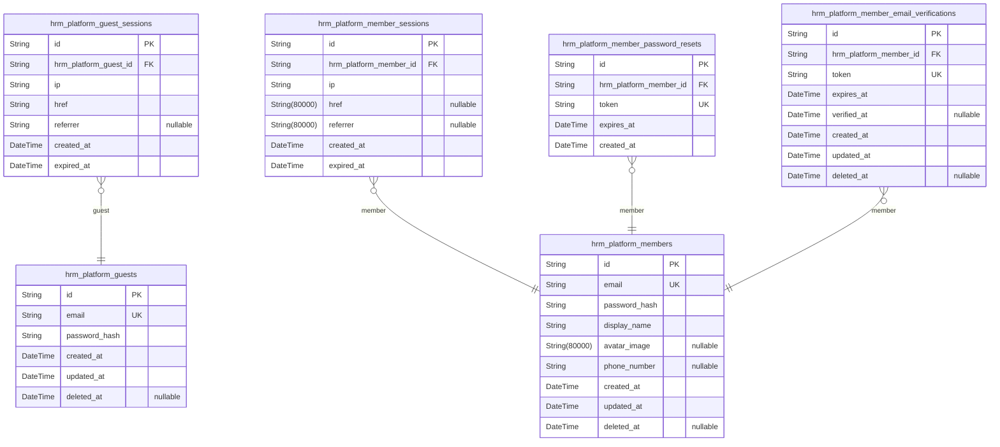
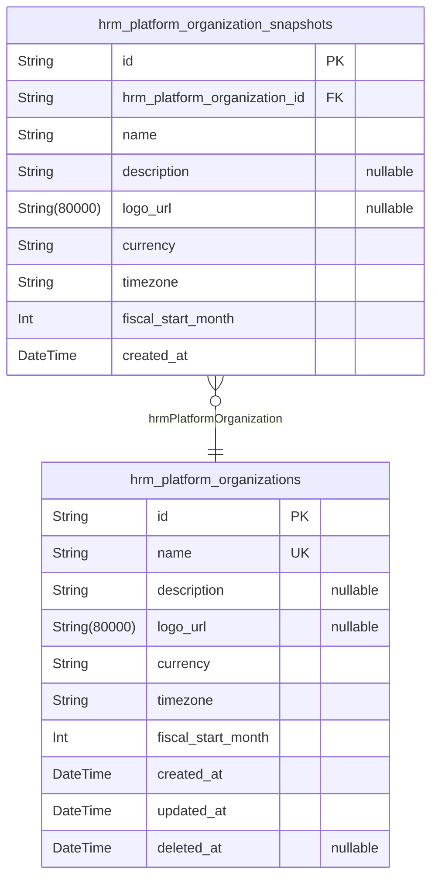
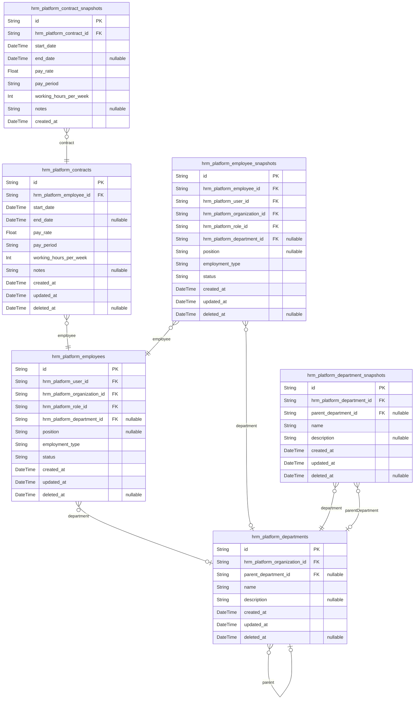
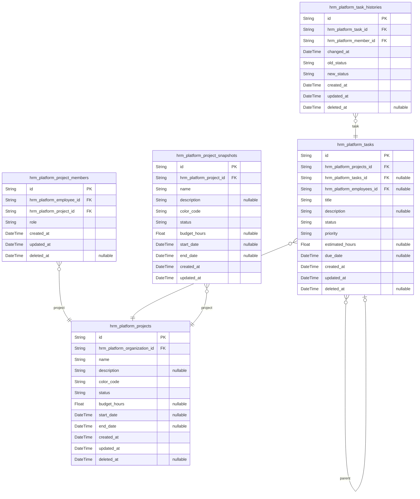
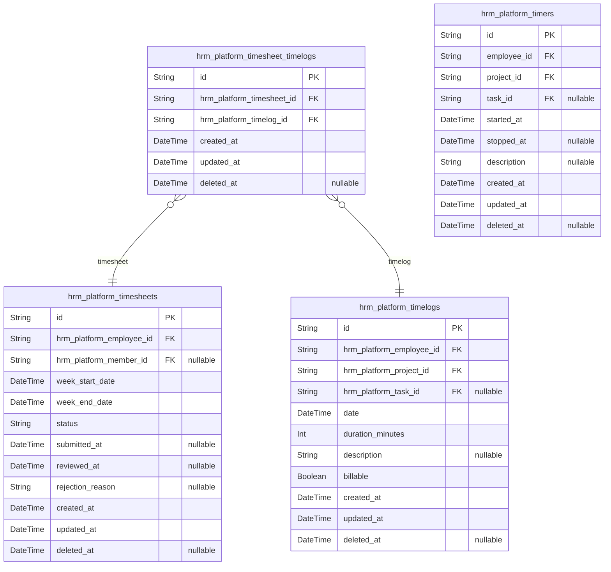
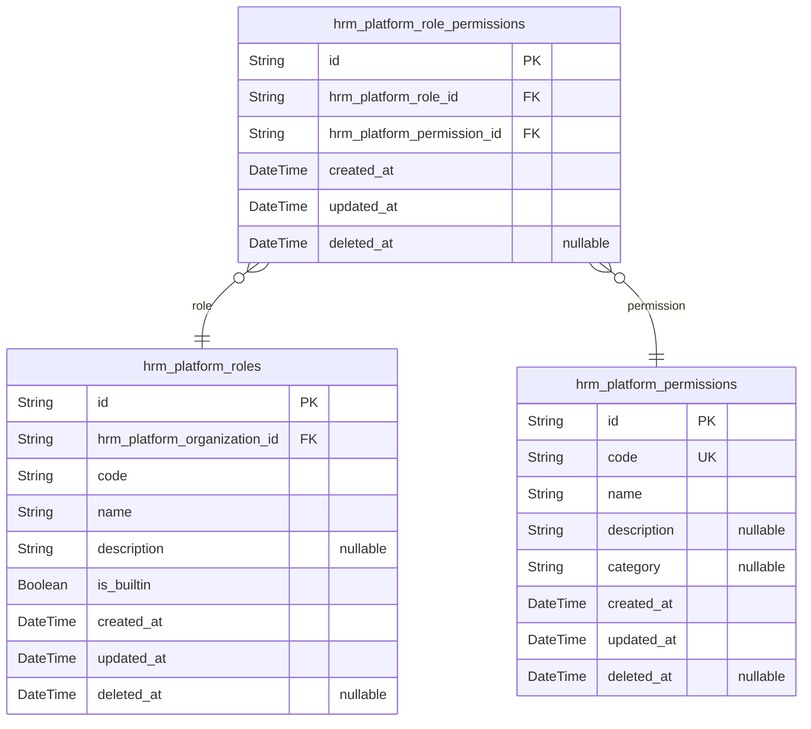
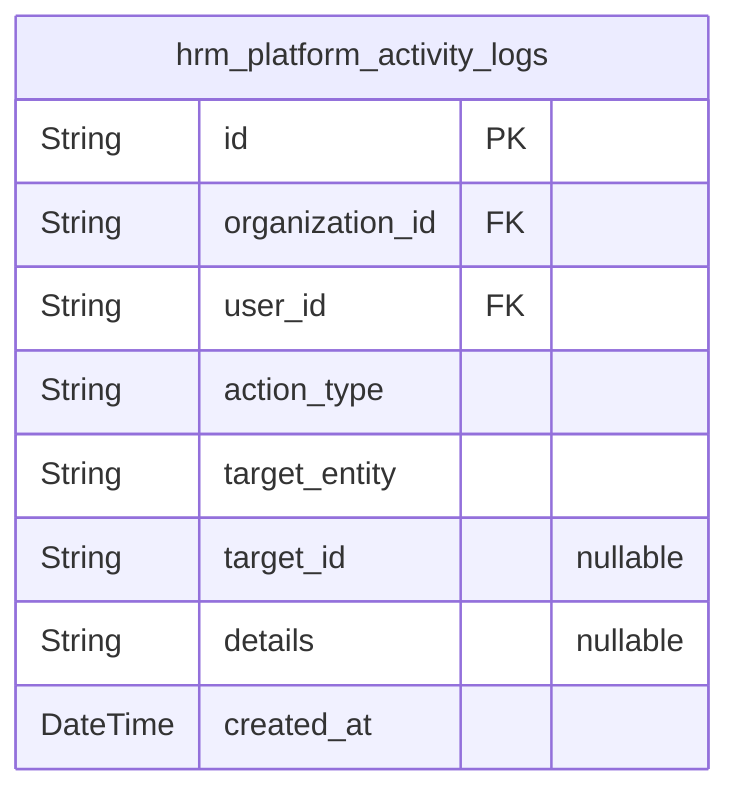

# Prisma Markdown

> Generated by [`prisma-markdown`](https://github.com/samchon/prisma-markdown)

- [Actors](#actors)
- [Systematic](#systematic)
- [Employees](#employees)
- [Projects](#projects)
- [TimeTracking](#timetracking)
- [Roles](#roles)
- [Activity](#activity)

## Actors

### `hrm_platform_guests`

Guest actor accounts with temporary identification for unauthenticated
access before registration. Stores email and password hash for
authentication flow. Guest accounts transition to member accounts upon
registration completion.

Properties as follows:

- `id`: Primary Key.
- `email`
  > Guest email address for authentication and registration. Must be unique
  > across all guest accounts.
- `password_hash`
  > Hashed password for guest authentication. Stored using secure password
  > hashing algorithm.
- `created_at`: Record creation timestamp for audit trail.
- `updated_at`: Record last update timestamp for tracking changes.
- `deleted_at`: Record soft deletion timestamp for account deactivation.

### `hrm_platform_guest_sessions`

Temporary session tokens for guest actor authentication and access
control. This table tracks anonymous user sessions before registration,
storing connection context and temporal information for auditing
purposes. Each guest session is identified by a unique token and includes
metadata such as IP address, referrer, and expiration time for security
enforcement.

Properties as follows:

- `id`: Primary Key.
- `hrm_platform_guest_id`: Belonged guest's [hrm_platform_guests.id](#hrm_platform_guests).
- `ip`
  > IP address of the client connection for security auditing and fraud
  > detection.
- `href`: Current page URL where the session was created.
- `referrer`: Referrer URL that led to the session creation.
- `created_at`: Session creation timestamp for audit trail.
- `expired_at`
  > Session expiration timestamp for automatic cleanup and security
  > enforcement.

### `hrm_platform_members`

Member actor accounts with email/password authentication credentials and
global profile information shared across all organizations. This table
represents the canonical identity record for authenticated users, serving
as the root of permission and ownership relationships throughout the
system. Users can belong to multiple organizations through
hrm_platform_employees, but maintain a single global account here.

Properties as follows:

- `id`: Primary Key.
- `email`
  > Unique email address used for authentication and account identification.
  > Must be unique across all member accounts.
- `password_hash`
  > BCrypt hashed password for secure authentication. Never store plain text
  > passwords.
- `display_name`
  > User's display name shown across all organizations. Part of the global
  > profile shared by all employee records.
- `avatar_image`: URL to user's avatar/profile picture. Optional global profile image.
- `phone_number`
  > User's phone number for account recovery and notifications. Optional
  > global profile field.
- `created_at`
  > Timestamp when the member account was created. Used for auditing and
  > account age tracking.
- `updated_at`
  > Timestamp when the member account was last updated. Automatically updated
  > on profile changes.
- `deleted_at`
  > Timestamp when the member account was soft-deleted. Null indicates active
  > account. Used for account deletion with data preservation.

### `hrm_platform_member_sessions`

JWT session tokens for member authentication with access and refresh
token support. Tracks login sessions for member actors including
connection metadata (IP, referrer, href) and temporal information for
session lifecycle management and security auditing. Each session is
associated with exactly one member account and contains expiration data
for token validation.

Properties as follows:

- `id`: Primary Key.
- `hrm_platform_member_id`: Belonged member's [hrm_platform_members.id](#hrm_platform_members).
- `ip`: Client IP address from which the session was created.
- `href`: Current page URL where the session was initiated.
- `referrer`: Referrer URL that led to the session creation.
- `created_at`: Session creation timestamp.
- `expired_at`: Session expiration timestamp for token validity period.

### `hrm_platform_member_password_resets`

Password reset tokens with expiration for member password recovery flow.
Stores one-time use tokens generated when members request password
resets, with automatic expiration to ensure security.

Properties as follows:

- `id`: Primary Key.
- `hrm_platform_member_id`: Member account requesting password reset. [hrm_platform_members.id](#hrm_platform_members).
- `token`
  > Unique password reset token. Generated cryptographically and used for
  > verification.
- `expires_at`: Token expiration timestamp. Token becomes invalid after this time.
- `created_at`: Token creation timestamp.

### `hrm_platform_member_email_verifications`

Email verification tokens for member registration and account activation.
Stores temporary verification tokens sent to user emails during
registration or email change processes. Each token has an expiration time
and tracks whether verification was completed. Used to prevent automated
account creation and ensure email ownership before activating member
accounts.

Properties as follows:

- `id`: Primary Key.
- `hrm_platform_member_id`: Target member's [hrm_platform_members.id](#hrm_platform_members) being verified.
- `token`: Unique verification token string sent to user email.
- `expires_at`: Token expiration timestamp. Token becomes invalid after this time.
- `verified_at`: Timestamp when email verification was completed. Null if not yet verified.
- `created_at`: Record creation timestamp.
- `updated_at`: Record last update timestamp.
- `deleted_at`: Soft deletion timestamp for audit trail.

## Systematic

### `hrm_platform_organizations`

Multi-tenancy root entity containing organization identity, branding, and
operational settings.

This table represents the foundational business entity for the HRM
platform's multi-tenancy architecture. Each organization operates
independently with its own employees, projects, departments, and data.
Organization settings include currency preferences, timezone
configuration, and fiscal period definitions that affect all downstream
business operations.

Key relationships:
- All employee records ([hrm_platform_employees](#hrm_platform_employees)) belong to an
organization
- All projects ([hrm_platform_projects](#hrm_platform_projects)) belong to an organization
- All departments ([hrm_platform_departments](#hrm_platform_departments)) belong to an
organization
- All roles ([hrm_platform_roles](#hrm_platform_roles)) belong to an organization
- All activity logs ([hrm_platform_activity_logs](#hrm_platform_activity_logs)) reference an
organization context

Organization deletion cascades to all dependent entities while preserving
the owner's user account.

Properties as follows:

- `id`: Primary Key.
- `name`: Organization name displayed to users and used in branding.
- `description`
  > Optional organization description providing additional context about the
  > organization.
- `logo_url`: URL to organization logo image for branding purposes.
- `currency`
  > Default currency code for the organization (e.g., USD, EUR, KRW). Used
  > for contract pay rates and financial reporting.
- `timezone`
  > Organization timezone identifier (e.g., Asia/Seoul, America/New_York).
  > Affects timesheet periods, timer calculations, and report aggregations.
- `fiscal_start_month`
  > Fiscal year start month (1-12). January is 1, December is 12. Used for
  > financial reporting and budget tracking.
- `created_at`: Timestamp when the organization was created.
- `updated_at`: Timestamp when the organization was last updated.
- `deleted_at`
  > Timestamp when the organization was soft deleted. Null indicates active
  > organization.

### `hrm_platform_organization_snapshots`

Point-in-time snapshots of organization settings for audit trail and
change history tracking.

Captures historical states of organization configurations including
branding (name, description, logo), operational settings (currency,
timezone), and fiscal period configuration. Each snapshot represents the
complete organization state at a specific moment, enabling compliance
tracking, change auditing, and historical reconstruction.

Snapshots are created automatically when organization settings are
modified, forming an immutable append-only audit trail. Unlike the main
hrm_platform_organizations table which reflects current state, snapshots
preserve all historical versions for regulatory compliance and change
analysis.

Referenced by [hrm_platform_organizations](#hrm_platform_organizations) for organization context.

Properties as follows:

- `id`: Primary Key.
- `hrm_platform_organization_id`: Target organization's [hrm_platform_organizations.id](#hrm_platform_organizations).
- `name`: Organization name at snapshot time.
- `description`: Organization description at snapshot time.
- `logo_url`: Organization logo image URL at snapshot time.
- `currency`: Organization currency code (e.g., USD, EUR, KRW) at snapshot time.
- `timezone`: Organization timezone at snapshot time.
- `fiscal_start_month`: Fiscal year start month (1-12) at snapshot time.
- `created_at`: Snapshot creation timestamp.

## Employees

### `hrm_platform_employees`

Core employee records linking users to organizations with role
assignment, department, position, employment type, and status. Each
employee represents a user's employment relationship within a specific
organization and serves as the primary entity for time tracking, project
membership, contract management, and activity logging. Employees can be
deactivated while preserving historical data for compliance and audit
purposes.

Properties as follows:

- `id`: Primary Key.
- `hrm_platform_user_id`
  > User account this employee record belongs to. {@link
  > hrm_platform_members.id}
- `hrm_platform_organization_id`
  > Organization this employee belongs to. {@link
  > hrm_platform_organizations.id}
- `hrm_platform_role_id`
  > Role assigned to this employee within the organization. {@link
  > hrm_platform_roles.id}
- `hrm_platform_department_id`
  > Department this employee belongs to (optional). {@link
  > hrm_platform_departments.id}
- `position`: Job title or position of the employee within the organization.
- `employment_type`: Type of employment: full-time, part-time, contractor, or intern.
- `status`
  > Current employment status: active or deactivated. Deactivated employees
  > cannot log time or submit timesheets but historical data is preserved.
- `created_at`: Timestamp when this employee record was created.
- `updated_at`: Timestamp when this employee record was last updated.
- `deleted_at`
  > Timestamp when this employee record was soft-deleted. Null if still
  > active.

### `hrm_platform_departments`

Department hierarchy within organizations with optional parent department
for one-level nesting. Each organization can have multiple departments,
and departments can have a parent department for hierarchical
organizational structure. Supports soft deletion for data preservation
while maintaining referential integrity with employee records.

Properties as follows:

- `id`: Primary Key.
- `hrm_platform_organization_id`: Belonged organization's [hrm_platform_organizations.id](#hrm_platform_organizations).
- `parent_department_id`
  > Parent department's [hrm_platform_departments.id](#hrm_platform_departments) for hierarchical
  > nesting. Null for top-level departments.
- `name`: Department name. Must be unique within an organization.
- `description`
  > Optional department description providing additional context about the
  > department's purpose and responsibilities.
- `created_at`: Timestamp when the department was created.
- `updated_at`: Timestamp when the department was last updated.
- `deleted_at`
  > Timestamp when the department was soft-deleted. Null if the department is
  > active.

### `hrm_platform_contracts`

Employment contracts with historical tracking, allowing multiple
contracts per employee with only one active at a time. Each contract
records start date, end date, pay rate, pay period, working hours per
week, and optional notes. Past contracts are immutable historical records
used for compliance and employment history verification.

Each employee can have multiple contracts over time, but only one
contract can be active at any given time (indicated by null end_date).
Creating a new contract automatically ends the previous active contract
by setting its end date. Employees can view their own contracts, while
users with employee:view permission can view any employee's contracts
within their organization.

Related to [hrm_platform_employees](#hrm_platform_employees) through employee reference.

Properties as follows:

- `id`: Primary Key.
- `hrm_platform_employee_id`: Employee who holds this contract. [hrm_platform_employees.id](#hrm_platform_employees).
- `start_date`
  > Contract start date. Required field indicating when the employment
  > contract begins.
- `end_date`
  > Contract end date. Null value indicates an ongoing contract with no
  > specified end date.
- `pay_rate`
  > Pay rate amount for the contract. Required numeric value representing
  > compensation rate.
- `pay_period`
  > Pay period type for compensation calculation. Valid values: hourly,
  > daily, weekly, monthly.
- `working_hours_per_week`
  > Number of working hours per week as defined in the contract. Required for
  > full-time and part-time employees.
- `notes`: Optional contract notes or additional information about employment terms.
- `created_at`: Record creation timestamp for audit trail.
- `updated_at`: Record last update timestamp for tracking modifications.
- `deleted_at`
  > Soft deletion timestamp for archival purposes. Null indicates active
  > record.

### `hrm_platform_employee_snapshots`

Point-in-time snapshots of employee records for audit trail and
historical compliance tracking. This table captures the complete state of
an employee record at specific moments in time, enabling historical
reconstruction and compliance auditing. Each snapshot is immutable and
records the employee's user reference, organization assignment, role,
department, position, employment type, and status at the time of snapshot
creation. Snapshots are automatically created when employee records are
modified to maintain a complete audit history.

Properties as follows:

- `id`: Primary Key.
- `hrm_platform_employee_id`
  > Employee record's [hrm_platform_employees.id](#hrm_platform_employees) that this snapshot
  > represents.
- `hrm_platform_user_id`
  > User account's [hrm_platform_members.id](#hrm_platform_members) referenced by this
  > employee at snapshot time.
- `hrm_platform_organization_id`
  > Organization's [hrm_platform_organizations.id](#hrm_platform_organizations) where this employee
  > belonged at snapshot time.
- `hrm_platform_role_id`
  > Role's [hrm_platform_roles.id](#hrm_platform_roles) assigned to this employee at
  > snapshot time.
- `hrm_platform_department_id`
  > Department's [hrm_platform_departments.id](#hrm_platform_departments) assigned to this
  > employee at snapshot time, or null if not assigned.
- `position`: Job position or title of the employee at snapshot time.
- `employment_type`
  > Employment type classification: full-time, part-time, contractor, or
  > intern.
- `status`: Employee status: active or deactivated.
- `created_at`
  > Timestamp when this snapshot was created, indicating the point-in-time
  > state captured.
- `updated_at`: Timestamp when this snapshot record was last updated.
- `deleted_at`
  > Timestamp when this snapshot was soft-deleted, preserving audit trail
  > while marking as deleted.

### `hrm_platform_department_snapshots`

Point-in-time snapshots of department records for audit trail and
organizational change tracking. This table captures historical states of
departments including name, description, and parent department reference
at the time of snapshot creation. Used for compliance tracking,
organizational change history, and rollback capabilities.

Each snapshot record represents a frozen state of a department at a
specific point in time, enabling:
- Historical department structure reconstruction
- Organizational change audit trails
- Compliance verification for department modifications
- Rollback to previous department configurations

Related entities:
- [hrm_platform_departments](#hrm_platform_departments) - Parent department entity

Properties as follows:

- `id`: Primary Key.
- `hrm_platform_department_id`: Referenced department's [hrm_platform_departments.id](#hrm_platform_departments).
- `parent_department_id`
  > Referenced parent department's [hrm_platform_departments.id](#hrm_platform_departments) at
  > snapshot time, nullable if department had no parent.
- `name`: Department name denormalized at snapshot time.
- `description`: Department description denormalized at snapshot time, nullable if not set.
- `created_at`
  > Timestamp when this snapshot was created, capturing the point-in-time
  > state.
- `updated_at`: Timestamp when this snapshot record was last updated.
- `deleted_at`
  > Timestamp when this snapshot was soft-deleted, nullable for active
  > snapshots.

### `hrm_platform_contract_snapshots`

Point-in-time snapshots of contract records for audit trail and
employment history verification. Each snapshot captures the complete
state of a contract at a specific moment, including start date, end date,
pay rate, pay period, working hours per week, and optional notes. These
immutable records enable compliance tracking, employment history
verification, and historical analysis of contract changes over time.

Properties as follows:

- `id`: Primary Key.
- `hrm_platform_contract_id`: Belonged contract's [hrm_platform_contracts.id](#hrm_platform_contracts).
- `start_date`: Contract start date.
- `end_date`
  > Contract end date. Null indicates an ongoing contract without a specified
  > end date.
- `pay_rate`: Employee pay rate amount for this contract period.
- `pay_period`
  > Pay period type for compensation calculation: hourly, daily, weekly, or
  > monthly.
- `working_hours_per_week`: Number of working hours expected per week under this contract.
- `notes`: Optional notes or remarks associated with this contract snapshot.
- `created_at`
  > Timestamp when this snapshot was created, marking the point-in-time state
  > capture.

## Projects

### `hrm_platform_projects`

Work initiatives with status tracking, budget hours allocation, and
timeline management. Projects belong to organizations and serve as
containers for tasks and timelogs. Projects can transition through
active, archived, and completed states, with archived and completed
projects preventing new timelog entries while preserving historical data.

Key relationships:
- Belongs to [hrm_platform_organizations](#hrm_platform_organizations) for multi-tenancy isolation
- Has many tasks through [hrm_platform_tasks](#hrm_platform_tasks)
- Has many project members through [hrm_platform_project_members](#hrm_platform_project_members)
- Has many timelogs through [hrm_platform_timelogs](#hrm_platform_timelogs)
- Has snapshots through [hrm_platform_project_snapshots](#hrm_platform_project_snapshots) for audit
trail

Properties as follows:

- `id`: Primary Key.
- `hrm_platform_organization_id`
  > Belonged organization's [hrm_platform_organizations.id](#hrm_platform_organizations). Enforces
  > multi-tenancy data isolation.
- `name`: Project name. Required identifier for the work initiative.
- `description`: Optional detailed description of the project scope and objectives.
- `color_code`
  > Visual color code for project identification in UI (e.g., hex color).
  > Required for project branding.
- `status`
  > Project lifecycle state. Values: 'active' (accepts timelogs), 'archived'
  > (read-only, no new timelogs), 'completed' (finalized, no new timelogs).
- `budget_hours`
  > Allocated budget hours for the project. Optional field for capacity
  > planning and budget tracking.
- `start_date`: Planned or actual project start date. Optional timeline marker.
- `end_date`: Planned or actual project end date. Optional timeline marker.
- `created_at`: Record creation timestamp. Automatically set on insert.
- `updated_at`: Record last update timestamp. Automatically updated on modification.
- `deleted_at`
  > Soft deletion timestamp. Null indicates active record, non-null indicates
  > deleted but preserved for audit.

### `hrm_platform_project_members`

Junction table linking employees to projects with assigned roles (member
or project-lead). Project leads can manage tasks within their project.
Users with project:manage permission can assign or remove employees from
projects. Employees can view which projects they are assigned to.

Properties as follows:

- `id`: Primary Key.
- `hrm_platform_employee_id`: Belonged employee's [hrm_platform_employees.id](#hrm_platform_employees).
- `hrm_platform_project_id`: Belonged project's [hrm_platform_projects.id](#hrm_platform_projects).
- `role`
  > Assigned role in the project: 'member' or 'project-lead'. Project leads
  > can manage tasks within their project.
- `created_at`: Record creation timestamp.
- `updated_at`: Record update timestamp.
- `deleted_at`: Soft deletion timestamp for archival purposes.

### `hrm_platform_tasks`

Work items with hierarchical support, status tracking, and employee
assignment. Tasks belong to projects and can have parent-child
relationships for subtasks. Tasks support status workflow (open,
in-progress, completed, closed) and priority levels (low, medium, high,
urgent). Status change history is tracked separately in {@link
hrm_platform_task_histories}.

Properties as follows:

- `id`: Primary Key.
- `hrm_platform_projects_id`: Belonged project's [hrm_platform_projects.id](#hrm_platform_projects).
- `hrm_platform_tasks_id`: Parent task's [hrm_platform_tasks.id](#hrm_platform_tasks) for subtask hierarchy.
- `hrm_platform_employees_id`
  > Assigned employee's [hrm_platform_employees.id](#hrm_platform_employees). Must be a project
  > member.
- `title`: Task title (required).
- `description`: Task description (optional).
- `status`: Task status: open, in-progress, completed, or closed.
- `priority`: Task priority: low, medium, high, or urgent.
- `estimated_hours`: Estimated hours to complete the task.
- `due_date`: Task due date (optional).
- `created_at`: Record creation timestamp.
- `updated_at`: Record last update timestamp.
- `deleted_at`: Soft deletion timestamp.

### `hrm_platform_task_histories`

Audit trail recording task status changes with timestamps and actors.
This table maintains a complete historical record of all task status
transitions for compliance tracking and workflow analysis. Each record
captures the previous status, new status, timestamp of change, and the
member who initiated the change. Referenced by [hrm_platform_tasks](#hrm_platform_tasks)
for task lifecycle tracking and [hrm_platform_members](#hrm_platform_members) for
accountability.

Key characteristics:
- Append-only historical records (rarely modified or deleted)
- Supports audit trail queries and compliance reporting
- Enables task workflow analysis and status transition tracking
- Maintains accountability through member reference

Properties as follows:

- `id`: Primary Key.
- `hrm_platform_task_id`: Target task's [hrm_platform_tasks.id](#hrm_platform_tasks).
- `hrm_platform_member_id`: Member who made the change's [hrm_platform_members.id](#hrm_platform_members).
- `changed_at`: Timestamp when the task status change occurred.
- `old_status`
  > Previous task status value before the change (e.g., "open",
  > "in-progress", "completed", "closed").
- `new_status`
  > New task status value after the change (e.g., "open", "in-progress",
  > "completed", "closed").
- `created_at`: Record creation timestamp.
- `updated_at`: Record last update timestamp.
- `deleted_at`: Soft deletion timestamp for audit trail preservation.

### `hrm_platform_project_snapshots`

Point-in-time snapshots of project records for audit trail and compliance
tracking. Captures the complete state of a project at specific moments,
enabling historical review and change tracking. Each snapshot is
immutable and append-only, preserving the exact project state when
created. References [hrm_platform_projects.id](#hrm_platform_projects) for the source
project.

Properties as follows:

- `id`: Primary Key.
- `hrm_platform_project_id`: Reference to the project being snapshot. [hrm_platform_projects.id](#hrm_platform_projects).
- `name`: Project name at the time of snapshot.
- `description`: Project description at the time of snapshot.
- `color_code`: Color code for project identification at the time of snapshot.
- `status`: Project status at the time of snapshot: active, archived, or completed.
- `budget_hours`: Budgeted hours for the project at the time of snapshot.
- `start_date`: Project start date at the time of snapshot.
- `end_date`: Project end date at the time of snapshot.
- `created_at`
  > Timestamp when this snapshot was created, representing the point-in-time
  > of the captured state.
- `updated_at`
  > Timestamp when this snapshot record was last updated, for audit trail
  > consistency.

## TimeTracking

### `hrm_platform_timelogs`

Individual time entries recording work duration with date, project, task,
and billable status. Each timelog represents a single time tracking entry
created by an employee for their work activities. Timelogs can be
included in timesheets for weekly aggregation and approval workflows.

Key relationships:
- Belongs to one [hrm_platform_employees](#hrm_platform_employees) (the employee who logged
the time)
- Belongs to one [hrm_platform_projects](#hrm_platform_projects) (the project worked on)
- Optionally belongs to one [hrm_platform_tasks](#hrm_platform_tasks) (the specific task
within the project)

Business rules:
- Employees can only create timelogs for themselves
- Timelogs can be edited or deleted only if not part of an approved
timesheet
- Billable flag indicates whether the time is chargeable to the client

Properties as follows:

- `id`: Primary Key.
- `hrm_platform_employee_id`: Employee who logged this time entry.
- `hrm_platform_project_id`: Project this time entry belongs to.
- `hrm_platform_task_id`: Optional task this time entry is associated with.
- `date`: Date when the work was performed.
- `duration_minutes`: Duration of work in minutes.
- `description`: Optional description of the work performed.
- `billable`: Whether this time entry is billable. Defaults to true.
- `created_at`: Timestamp when this timelog was created.
- `updated_at`: Timestamp when this timelog was last updated.
- `deleted_at`: Timestamp when this timelog was soft deleted.

### `hrm_platform_timesheets`

Weekly timesheet aggregations with approval workflow and calculated total
hours. Each timesheet represents a week (Monday to Sunday) for a specific
employee and tracks time entry submissions through draft, submitted,
approved, and rejected states. Timesheets aggregate individual timelogs
from [hrm_platform_timelogs](#hrm_platform_timelogs) and manage the approval workflow where
managers can approve or reject submitted timesheets. When rejected,
timesheets return to draft status for employee modification and
resubmission. Approved timesheets lock all included timelogs to prevent
further edits.

Properties as follows:

- `id`: Primary Key.
- `hrm_platform_employee_id`: Owner employee's [hrm_platform_employees.id](#hrm_platform_employees).
- `hrm_platform_member_id`
  > Member who reviewed/approved/rejected this timesheet's {@link
  > hrm_platform_members.id}. Nullable until reviewed.
- `week_start_date`
  > Monday of the timesheet week. Defines the start of the weekly period
  > (inclusive).
- `week_end_date`
  > Sunday of the timesheet week. Defines the end of the weekly period
  > (inclusive).
- `status`
  > Timesheet workflow status: draft, submitted, approved, or rejected.
  > Determines allowed operations and visibility.
- `submitted_at`
  > Timestamp when employee submitted this timesheet for approval. Null if
  > still in draft status.
- `reviewed_at`
  > Timestamp when manager reviewed this timesheet (approved or rejected).
  > Null if not yet reviewed.
- `rejection_reason`
  > Reason provided when rejecting a timesheet. Required when status is
  > rejected. Employee can view this to understand why timesheet was
  > rejected.
- `created_at`: Record creation timestamp.
- `updated_at`: Record last update timestamp.
- `deleted_at`: Soft deletion timestamp. Null if not deleted.

### `hrm_platform_timesheet_timelogs`

Junction table linking timesheets to timelogs for flexible draft
management. Allows employees to add or remove timelogs from draft
timesheets before submission. Each record represents a single timelog
included in a specific timesheet, enabling the many-to-many relationship
between timesheets and timelogs while supporting draft state
modifications.

Properties as follows:

- `id`: Primary Key.
- `hrm_platform_timesheet_id`: Target timesheet's [hrm_platform_timesheets.id](#hrm_platform_timesheets).
- `hrm_platform_timelog_id`: Target timelog's [hrm_platform_timelogs.id](#hrm_platform_timelogs).
- `created_at`: Record creation timestamp.
- `updated_at`: Record last update timestamp.
- `deleted_at`: Soft deletion timestamp for archival purposes.

### `hrm_platform_timers`

Active timer sessions tracking real-time work duration for employees.
Each employee can have at most one active timer at a time (stopped_at is
null). When stopped, a timelog is automatically created with calculated
duration. Employees can also discard timers without creating timelogs.

Properties as follows:

- `id`: Primary Key.
- `employee_id`
  > Belonged employee's [hrm_platform_employees.id](#hrm_platform_employees). Each employee can
  > have at most one active timer (stopped_at is null).
- `project_id`: Tracked project's [hrm_platform_projects.id](#hrm_platform_projects).
- `task_id`
  > Optional tracked task's [hrm_platform_tasks.id](#hrm_platform_tasks). Must belong to the
  > selected project.
- `started_at`: When the timer started tracking work duration.
- `stopped_at`
  > When the timer was stopped. Null means timer is still running. Stopping
  > creates a timelog with calculated duration.
- `description`: Optional description of the work being tracked.
- `created_at`: Record creation timestamp for audit trail.
- `updated_at`: Record last update timestamp for audit trail.
- `deleted_at`: Soft deletion timestamp for data preservation and recovery.

## Roles

### `hrm_platform_roles`

Role definitions per organization including built-in (Owner, Manager,
Employee) and custom roles. Built-in roles cannot be deleted, while
custom roles can be removed only when no employees are assigned. Each
employee in an organization is assigned exactly one role via the
hrm_platform_employees table.

Properties as follows:

- `id`: Primary Key.
- `hrm_platform_organization_id`: Belonged organization's [hrm_platform_organizations.id](#hrm_platform_organizations).
- `code`: Unique role code within organization for programmatic reference.
- `name`: Role display name shown to users.
- `description`: Optional role description explaining permissions and purpose.
- `is_builtin`
  > Whether this is a built-in system role (Owner, Manager, Employee) that
  > cannot be deleted.
- `created_at`: Record creation timestamp.
- `updated_at`: Record update timestamp.
- `deleted_at`
  > Soft deletion timestamp for custom roles only. Built-in roles are never
  > deleted.

### `hrm_platform_role_permissions`

Permission assignments mapping roles to available permissions like
org:manage, employee:manage, project:view. This junction table implements
the many-to-many relationship between roles and permissions, allowing
roles to have multiple permissions and permissions to be assigned to
multiple roles.

Properties as follows:

- `id`: Primary Key.
- `hrm_platform_role_id`: Target role's [hrm_platform_roles.id](#hrm_platform_roles).
- `hrm_platform_permission_id`: Target permission's [hrm_platform_permissions.id](#hrm_platform_permissions).
- `created_at`: Record creation timestamp.
- `updated_at`: Record update timestamp.
- `deleted_at`: Soft deletion timestamp for audit trail.

### `hrm_platform_permissions`

Available permission definitions that can be assigned to roles, including
org:manage, employee:manage, project:view, time:approve, and other access
control rights. This is a reference table containing predefined
permissions that roles can be granted. Permissions support soft deletion
for audit trail and recovery purposes.

Properties as follows:

- `id`: Primary Key.
- `code`
  > Unique permission code identifier (e.g., 'org:manage', 'employee:view',
  > 'time:approve'). Used as the reference key in role_permissions table.
- `name`: Human-readable name of the permission for UI display.
- `description`: Detailed description explaining what this permission allows users to do.
- `category`
  > Permission category grouping (e.g., 'org', 'employee', 'project', 'time',
  > 'report') for organizational purposes.
- `created_at`: Timestamp when this permission definition was created.
- `updated_at`: Timestamp when this permission definition was last updated.
- `deleted_at`
  > Timestamp when this permission definition was soft deleted. Null
  > indicates active permission.

## Activity

### `hrm_platform_activity_logs`

Immutable audit trail records tracking all significant organizational
actions for compliance, debugging, and oversight. Logs employee
management events (invited, deactivated, reactivated), contract changes
(created, edited), project lifecycle events (created, archived,
completed, deleted), task status transitions, timesheet workflow actions
(submitted, approved, rejected), and role assignments. Each record
captures the actor user, action type, target entity type and ID, and
contextual details. Users with org:manage permission can view the full
activity log with filtering by action type, user, and date range.
Supports pagination for efficient browsing of historical organizational
events.

Properties as follows:

- `id`: Primary Key.
- `organization_id`
  > Target organization's [hrm_platform_organizations.id](#hrm_platform_organizations). All activity
  > logs are scoped to an organization for multi-tenancy isolation.
- `user_id`
  > Actor member's [hrm_platform_members.id](#hrm_platform_members) who performed the action.
  > May reference a member who was later deactivated.
- `action_type`
  > Type of action performed. Examples: employee:invited,
  > employee:deactivated, employee:reactivated, contract:created,
  > contract:edited, project:created, project:archived, project:completed,
  > project:deleted, task:status_changed, timesheet:submitted,
  > timesheet:approved, timesheet:rejected, role:assigned, role:changed.
- `target_entity`
  > Type of target entity affected by the action. Examples: employee,
  > contract, department, project, task, timesheet, role.
- `target_id`
  > Target entity's ID. Nullable for actions without a specific entity target
  > (e.g., system events).
- `details`
  > Additional contextual information about the action in JSON format.
  > Contains action-specific data like old/new values, rejection reasons, or
  > metadata.
- `created_at`: Timestamp when the action occurred. Automatically set on record creation.
