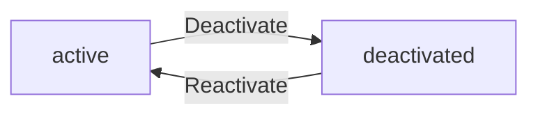
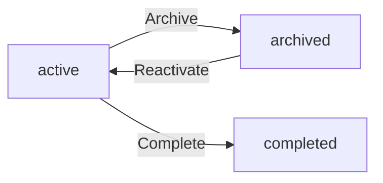
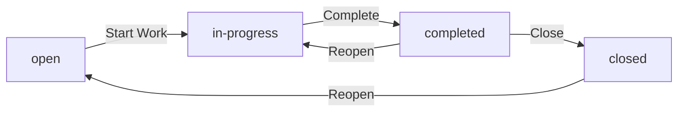
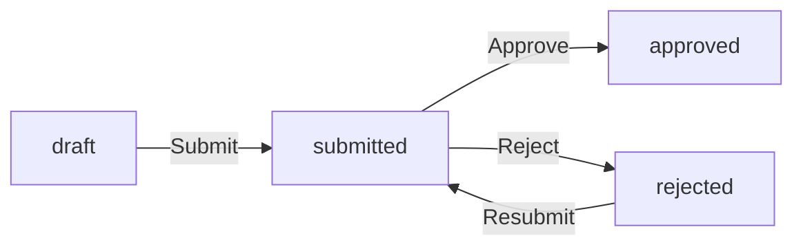
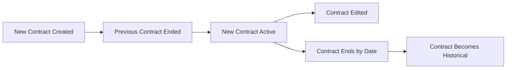

**hrmPlatform — Business concepts, relationships, and states from user perspective**

Business concepts, relationships, and states from user perspective

# Domain Concepts

Describe what each concept means in the business domain and its key attributes.

## Organization Concept

An organization represents a business entity within the platform that operates independently from other organizations. Each organization has its own employees, projects, and data that remain isolated from other organizations. The organization is identified by a name and description that describe the business entity. Organizations have a logo image for visual identification and branding purposes. Each organization operates with a specific currency for financial tracking, such as USD, EUR, or KRW. The timezone setting determines how dates and times are displayed for all users in that organization. Organizations also define a fiscal start month for financial reporting periods. Organization owners have the ability to modify these settings throughout the organization's lifecycle. When an organization is removed, all associated employees, projects, tasks, timelogs, and timesheets are permanently deleted. The organization owner's account persists but becomes unassociated with any organization after deletion.

### Organization Multi-Tenancy

The platform supports multiple organizations, each operating as an independent business entity. Each organization maintains its own employees, projects, tasks, timelogs, and timesheets that remain completely isolated from other organizations. Users who belong to multiple organizations can switch between them without logging out, and all subsequent actions are scoped to the currently selected organization context. Data from one organization cannot be accessed or viewed by employees in another organization, ensuring strict data isolation across the platform.

### Organization Identification and Branding

Each organization is identified by a name that describes the business entity. A description may be provided to give additional context about the organization. Organizations have a logo image for visual identification and branding purposes within the platform interface. The organization name, description, and logo collectively establish the organization's identity and distinguish it from other organizations in the system.

### Organization Operational Settings

Each organization operates with a specific currency setting for financial tracking and reporting, such as USD, EUR, or KRW. The timezone setting determines how dates and times are displayed for all users within that organization, ensuring consistent time representation across the organization. Organizations also define a fiscal start month for financial reporting periods, which establishes when the organization's fiscal year begins. Organization owners have the ability to modify these operational settings throughout the organization's lifecycle.

### Organization Deletion and Data Cascade

When an organization is deleted, all associated data is permanently removed from the platform. This includes all employees, projects, tasks, timelogs, and timesheets that belonged to the organization. The deletion is a cascade operation that ensures no orphaned data remains after the organization is removed. However, the organization owner's user account persists after the organization is deleted, but the account becomes unassociated with any organization. The owner can create a new organization or join other organizations after deletion, but the deleted organization's data cannot be recovered.

## User Concept

A user represents an individual person who can access the platform with their personal credentials. Users authenticate with an email address and password combination. Each user maintains a global profile containing their display name, avatar image, and phone number. This profile information is shared across all organizations the user belongs to. A single user can be a member of multiple organizations simultaneously. When accessing the platform, users select which organization they want to work in for that session. All actions performed by the user are scoped to their currently selected organization. Users can switch between their organizations without needing to log out and log back in. The user account can be deleted, but ownership transfer or organization deletion may be required first. When deleted, the user's employee records in other organizations are marked as deactivated.

### User Account and Authentication

Users access the platform through email and password authentication. Each user account is identified by a unique email address. Users sign up by providing their email address and creating a password. Users log in by entering their registered email address and password. Users can change their password at any time after logging in. Authentication is required for all platform operations except viewing public content.

### Global User Profile

Each user maintains a global profile that is shared across all organizations they belong to. The profile contains a display name that identifies the user to others in the platform. Users can upload an avatar image to represent themselves visually. Users can provide a phone number for contact purposes. All profile information can be edited by the user at any time. Profile changes are immediately visible across all organizations the user belongs to.

### Multi-Organization Membership

A single user can belong to multiple organizations simultaneously. When logging in, users select which organization they want to work in for that session. This selection establishes the organization context for all subsequent actions. All data accessed and operations performed are scoped to the selected organization. Users can switch between their organizations without logging out. When switching organizations, the user's context changes immediately and they can access data from the newly selected organization. Data from one organization is never visible when working in another organization.

### Account Lifecycle and Deactivation

Users can delete their account from the platform. If the user is the sole owner of any organization, they must first transfer ownership to another member or delete the organization before their account can be deleted. When a user account is deleted, their employee records in all other organizations are marked as deactivated. Deactivated employee records preserve historical data such as timelogs and timesheets but the user can no longer access the platform or perform any actions. The user's global profile and authentication credentials are removed upon account deletion.

## Employee Concept

An employee represents a person's record within a specific organization. Each employee record links to a user account that provides authentication access. The employee has a role assigned within the organization that determines their permissions. Employees can belong to a department that represents their organizational unit. Each employee has a position or title describing their job role. The employment type categorizes the worker as full-time, part-time, contractor, or intern. Employees have a status indicating whether they are active or deactivated in the organization. Deactivated employees cannot log time or submit timesheets but their historical data remains preserved. Employees can be reactivated to restore their ability to work in the organization. The employee record is specific to one organization and does not transfer across organizations.

### Employee Record Definition

An employee represents a person's employment record within a specific organization. Each employee record serves as the link between a user account and their work within an organization.

Every employee record is associated with exactly one user account that provides authentication access to the system. The user account exists independently and can belong to multiple organizations, but each employee record is specific to a single organization.

An employee record contains the following business attributes:
- Department assignment, which places the employee within an organizational unit (optional)
- Position or title that describes their job role
- Employment type that categorizes the worker
- Current status indicating their active or deactivated state
- Role assignment that determines their permissions within the organization

The employee record is created when a user is invited to or joins an organization. It remains in the system even when deactivated, preserving all historical data including time logs and timesheets.

### Employee Role and Position

Each employee in an organization is assigned exactly one role that determines their permissions and access within that organization. Role assignment is managed by users with employee management permission.

The three built-in roles available in every organization are:
- Owner: full access to all features, can manage roles and members
- Manager: can manage employees, projects, approve timesheets, view reports
- Employee: can track time, submit timesheets, view own data

Organization owners can create custom roles with specific permissions. Each custom role has a name and a set of permissions assigned to it. The role assignment can be changed by users with employee management permission.

Department assignment places an employee within an organizational unit. An employee may belong to one department or have no department assignment. Departments can be viewed by all employees in the organization.

The position or title field describes the employee's job role within the organization. This is an optional field that can be updated by users with employee management permission.

### Employment Type and Status

Employment type categorizes the worker into one of four categories: full-time, part-time, contractor, or intern. This classification is required for every employee record and can be updated by users with employee management permission.

Employee status indicates whether the employee is currently active or deactivated in the organization. There are two status values:
- Active: the employee can log time, submit timesheets, and access their data
- Deactivated: the employee cannot log time or submit timesheets

When an employee is deactivated:
- They lose the ability to log time entries
- They cannot submit timesheets for approval
- Their historical data including timelogs and timesheets remains preserved in the system
- They can still view their own historical records

Deactivated employees can be reactivated by users with employee management permission. Reactivation restores the employee's ability to log time and submit timesheets. The employee retains all their historical data and previous assignments.

### Deactivated Employee Data Preservation

When an employee is deactivated, all their historical data remains preserved in the system. This includes:
- All time logs they have recorded
- All timesheets they have submitted or that were approved for them
- All project memberships and task assignments
- All contract records

Deactivation does not remove or alter any historical records. The data remains available for reporting, auditing, and historical reference.

When an employee is reactivated, they regain access to their historical data and can continue working. Their previous project assignments and memberships are preserved. The employee can resume logging time and submitting timesheets immediately upon reactivation.

If a user deletes their account and they are an employee in other organizations, their employee records in those organizations are marked as deactivated. Their historical data in those organizations remains preserved for the organization's records.

### Employee Organization Isolation

Each employee record exists only within a single organization and cannot transfer across organizations. When a user belongs to multiple organizations, they have separate employee records in each organization.

Data isolation is enforced at the organization level. An employee in one organization cannot see or access data from another organization. This includes:
- Employee lists and details
- Projects and tasks
- Time logs and timesheets
- Reports and activity logs

When switching between organizations, the user's context changes completely. All subsequent actions are scoped to the selected organization only. The user sees only the data relevant to their current organization context.

If an organization is deleted, all employee records within that organization are permanently deleted along with all associated data including projects, tasks, timelogs, and timesheets. The user account itself remains but is no longer associated with that organization.

## Contract Concept

A contract represents an employment agreement between the organization and an employee. Each employee can have multiple contracts stored as a historical record over time. Only one contract can be active for an employee at any given moment. The contract includes a required start date marking when the employment terms begin. An optional end date indicates when the contract terminates, with null meaning the contract is ongoing. The pay rate specifies the compensation amount for the employee. The pay period defines how compensation is calculated, such as hourly, daily, weekly, or monthly. Working hours per week is a required field indicating the expected weekly commitment. Notes can be added to provide additional context about the employment terms. Past contracts are immutable and cannot be edited once they become inactive. The current active contract can be modified while maintaining historical accuracy.

### Employment Contract Record

A contract represents an employment agreement between the organization and an employee. Each employee can have multiple contracts stored as a historical record over time, allowing the organization to track changes in employment terms throughout the employee's tenure.

Only one contract can be active for an employee at any given moment. When a new contract is created, the previous active contract automatically becomes inactive, ensuring a clear historical timeline of employment agreements.

The contract serves as the authoritative record for compensation terms, working expectations, and employment conditions. It is a core business entity that links the employee to their current employment status within the organization.

### Contract Terms and Compensation

Each contract includes a required start date that marks when the employment terms begin. An optional end date indicates when the contract terminates, with no end date meaning the contract is ongoing.

The pay rate specifies the compensation amount for the employee as a numeric value. The pay period defines how compensation is calculated, with supported types including hourly, daily, weekly, or monthly.

Working hours per week is a required field indicating the expected weekly commitment from the employee. This represents the standard number of hours the employee is expected to work each week under this contract.

Notes can be added to provide additional context about the employment terms. These notes are optional and can include special arrangements, conditions, or other relevant information about the contract.

### Contract History and Modifications

Past contracts are immutable and cannot be edited once they become inactive. This ensures the historical record remains accurate and auditable. The organization maintains a complete timeline of all employment agreements for each employee.

The current active contract can be modified while maintaining historical accuracy. Changes to the active contract update the current employment terms without affecting the integrity of past contract records.

When a new contract is created for an employee, the system automatically ends the previous active contract by setting its end date to the day before the new contract's start date. This automatic transition ensures there are no gaps or overlaps in the employment record.

## Department Concept

A department represents an organizational unit within the company structure. Each department has a name that identifies the functional area or team. A description provides additional context about the department's purpose or focus. Departments can have a parent department, allowing for one level of hierarchical nesting. This creates a simple two-level organizational structure with parent and child departments. When a department is deleted, employees assigned to it have their department set to null. The department deletion does not remove employees from the organization. Departments are scoped to a single organization and cannot be shared across organizations. All employees in the organization can view the list of departments. The department structure helps organize employees into logical business units.

### Department Definition and Attributes

A department represents an organizational unit within the company structure. Each department has a name that identifies the functional area or team, such as Engineering, Human Resources, or Sales. The department name serves as the primary identifier for the organizational unit.

Each department includes an optional description that provides additional context about the department's purpose, focus, or responsibilities. This helps employees understand what work the department handles.

Departments are scoped to a single organization and cannot be shared across organizations. Each organization maintains its own independent set of departments. This ensures data isolation between different businesses using the platform.

All employees within an organization can view the list of departments, regardless of their role or permissions. This visibility supports organizational transparency and helps employees understand the company structure.

### Department Hierarchy and Organizational Structure

Departments support a hierarchical organizational structure through parent department relationships. Each department can optionally have a parent department, creating a two-level hierarchy with parent and child departments.

This one-level nesting limitation means departments can be organized as:
- Top-level departments (no parent)
- Sub-departments (with one parent department)

For example, Engineering could be a top-level department with Software Development and QA as sub-departments. However, Software Development cannot have its own sub-departments.

The department hierarchy helps represent the organizational structure in a simple, manageable way that reflects typical business unit arrangements without creating overly complex nested structures.

### Department Employee Assignment and Deletion

Employees can be assigned to a department as part of their employee record. This assignment is optional, meaning employees can exist without being assigned to any department.

When a department is deleted, employees who were assigned to that department have their department assignment set to null. The employees themselves are not deleted from the organization. This ensures that department deletion does not affect employee records or their access to the organization.

The department structure helps organize employees into logical business units for reporting, management, and organizational clarity. Employees can view the list of departments to understand how the organization is structured.

## Project Concept

A project represents a work initiative or endeavor within the organization. Each project has a required name that identifies the work effort. An optional description provides details about the project's scope and objectives. A color code is required for visual identification in the user interface. Projects have a status indicating their current state as active, archived, or completed. Active projects can receive new timelogs from employees. Archived and completed projects cannot accept new time entries but preserve existing timelogs. The budget hours field represents the total estimated hours for the project. Start and end dates can be optionally defined to track the project timeline. Projects are scoped to a single organization and cannot be shared across organizations. Existing timelogs on archived or completed projects remain preserved for historical records.

### Project Definition and Attributes

A project represents a work initiative or endeavor within the organization. Each project is identified by a required name that distinguishes it from other projects. An optional description provides details about the project's scope and objectives. A color code is required for visual identification in the user interface, allowing projects to be easily distinguished in reports and dashboards. Projects are scoped to a single organization and cannot be shared across organizations. Each employee in the organization can be assigned to one or more projects through project membership.

### Project Status States

Projects have a status indicating their current state in the lifecycle. The status can be active, archived, or completed. Active projects are ongoing work initiatives that can receive new timelogs from assigned employees. Archived projects represent work that has been paused or suspended; they cannot accept new time entries but preserve all existing timelogs for historical records. Completed projects represent finished work initiatives; they cannot accept new time entries but preserve all existing timelogs. When a project is archived or completed, the system prevents any new timelogs from being created against that project.

### Project Budget and Timeline

Projects can include planning information to track scope and timeline. Budget hours represent the total estimated hours for the project and are optional. When defined, budget hours enable tracking of actual hours against planned effort. Start and end dates can be optionally defined to establish the project timeline. Projects without budget hours are excluded from budget utilization reports. The project timeline dates help organize work within expected timeframes but do not restrict timelog creation.

### Project Timelog Preservation

Timelogs created on projects are preserved according to project status. Timelogs on active projects can be edited or deleted by the employee who created them, subject to timesheet approval status. When a project is archived or completed, all existing timelogs on that project are preserved and remain visible in reports and historical records. The preservation of timelogs ensures that historical time tracking data remains available for reporting and analysis even after project status changes. Deleting a project is only permitted if no timelogs are associated with it, ensuring data integrity.

## ProjectMember Concept

A project member represents the assignment relationship between an employee and a project. Each project membership connects one employee to one project. The membership includes an assigned role that defines the employee's capacity within the project. The role can be either member or project-lead. Project leads have the ability to manage tasks within their assigned project. An employee can be assigned to multiple projects simultaneously. Each project membership is independent and maintains its own role assignment. Project members can view the projects they are assigned to. The project membership is scoped to a single organization. Removing an employee from a project terminates their membership but does not affect their employment status.

### Project Membership Definition

A project membership represents the assignment relationship between an employee and a project within an organization. Each membership connects exactly one employee to exactly one project. The membership serves as the link that enables an employee to log time against a project and view project-related information.

Each project membership includes an assigned role that defines the employee's capacity and responsibilities within the project. The role can be either member or project-lead. This role assignment is specific to the project membership and does not affect the employee's role in other projects or their organization-wide role.

Project memberships are scoped to a single organization. An employee can only be assigned to projects within organizations they belong to. The membership cannot exist outside the organization context.

When an employee is removed from a project, their membership is terminated. This removal does not affect the employee's employment status or their ability to remain employed in the organization. Historical timelogs and timesheets associated with the project membership are preserved.

### Project Roles and Responsibilities

Each project membership assigns the employee one of two roles that determine their capabilities within the project:

**Member Role**
Employees with the member role can log time against the project and view project information. They can view tasks within the project and see task assignments. Members cannot create, edit, or manage tasks.

**Project-Lead Role**
Employees with the project-lead role have all the capabilities of a member, plus the ability to manage tasks within their assigned project. Project leads can create tasks, edit task details, change task status, and assign tasks to other project members. Project leads cannot manage the project itself (such as changing project status or deleting the project) — that capability belongs to users with the project:manage permission at the organization level.

An employee can hold different roles in different projects. For example, an employee can be a project-lead in one project while being a member in another project. The role assignment is independent for each project membership.

### Multiple Project Assignments

An employee can be assigned to multiple projects simultaneously within the same organization. Each project assignment creates a separate, independent project membership with its own role assignment.

For example, an employee can be assigned to three different projects at the same time, with the project-lead role in one project and member role in the other two. Each membership maintains its own role and is managed independently.

The employee's ability to log time is scoped to the projects they are assigned to. An employee can only create timelogs for projects where they have an active project membership. The employee can switch between projects when logging time, and each timelog is associated with the specific project membership.

There is no limit to the number of projects an employee can be assigned to. The organization can assign employees to as many projects as needed based on their work responsibilities.

### Project Membership Visibility and Organization Scope

Project members can view the list of projects they are assigned to within their current organization context. This visibility allows employees to see which projects they are working on and access project-related information.

All data associated with project memberships is strictly isolated per organization. An employee can only see project memberships for projects within the organization they are currently working in. If an employee belongs to multiple organizations, they must switch organization context to view project memberships in a different organization.

The project membership list shows the project name and the employee's assigned role for each project. This information helps employees understand their responsibilities and access rights within each project.

### Project Membership Assignment and Removal

Users with the employee:manage permission can assign employees to projects and remove employees from projects. The assignment creates a new project membership, while removal terminates the existing membership.

When an employee is removed from a project, their project membership is terminated immediately. The employee loses access to project-specific features such as logging time against the project and viewing project tasks. However, the employee's employment status within the organization remains unchanged.

Historical data associated with the terminated membership is preserved. Timelogs that were created while the employee was a project member remain in the system and continue to be associated with the project. Timesheets containing those timelogs are also preserved. This ensures that historical time tracking records remain intact even after an employee is removed from a project.

An employee can be reassigned to a project after being removed, creating a new project membership with a new role assignment.

## Task Concept

A task represents a discrete piece of work within a project. Each task has a required title that identifies the work item. An optional description provides additional details about what needs to be accomplished. The task status indicates its current state as open, in-progress, completed, or closed. Priority levels categorize urgency as low, medium, high, or urgent. Estimated hours can be defined to indicate the expected effort required. A due date can be optionally set to establish when the task should be completed. An employee can be assigned to the task, but only if they are a project member. Tasks can have a parent task to create subtask relationships with one level of nesting. Task status changes are recorded in the task history for audit purposes. Tasks are scoped to a single project and cannot exist outside of a project.

### Task Definition and Attributes

A task represents a discrete work item within a project that needs to be completed. Each task is identified by a required title that serves as its primary name. An optional description can be provided to give additional details about what needs to be accomplished.

Tasks include optional estimated hours to indicate the expected effort required for completion. A due date can also be optionally set to establish when the task should be completed by.

Tasks are scoped to a single project and cannot exist independently outside of a project context.

### Task Status and Priority

Each task has a status that indicates its current state in the workflow. The available status values are:

- **Open**: The task has been created but not yet started
- **In-Progress**: Work on the task has begun
- **Completed**: The task work is finished
- **Closed**: The task is finalized and no longer active

Tasks also have a priority level that categorizes their urgency. The available priority values are:

- **Low**: Normal priority work item
- **Medium**: Standard urgency
- **High**: Important task requiring attention
- **Urgent**: Critical task requiring immediate action

Task status changes are tracked and recorded in the task history for audit purposes. Each status transition records the timestamp, the previous status, the new status, and the user who made the change.

### Task Assignment and Relationships

An employee can be assigned to a task, but only if they are a member of the project that contains the task. This ensures that only employees with access to the project can work on its tasks.

Tasks can have a parent task relationship to create subtask structures. This allows a task to be broken down into smaller, more manageable subtasks. The parent-child relationship supports only one level of nesting, meaning a subtask cannot have its own subtasks.

When a task's status changes, the change is recorded in the task history. This history provides an audit trail showing when status transitions occurred, what the previous and new statuses were, and which user made the change.

All tasks are strictly scoped to their parent project. A task belongs to exactly one project and cannot be moved between projects or exist independently outside of a project context.

## Timelog Concept

A timelog represents a record of time spent on work activities. Each timelog has a required date indicating when the work was performed. The duration is recorded in minutes to capture the exact time spent. A project is required and must be one the employee is assigned to. An optional task can be specified if it belongs to the selected project. A description field captures what work was accomplished during that time entry. The billable flag indicates whether the time should be charged to the client. Timelogs are created by employees for their own work entries. Timelogs are scoped to a single organization through the project relationship. Timelogs can be paginated and filtered by various criteria for reporting purposes. Timelogs become locked when included in an approved timesheet.

### Timelog Definition and Purpose

A timelog represents a record of time spent on work activities. Each timelog captures when the work was performed through a required date field. The duration is recorded in minutes to capture the exact time spent on the activity. A description field is available to document what work was accomplished during that time entry. Timelogs serve as the foundational data for timesheet creation, project tracking, and reporting purposes. Timelogs become locked when included in an approved timesheet, preventing further modification.

### Project and Task Association

Each timelog must be associated with a project, which is a required field. The project must be one that the employee is assigned to as a project member. This project association ensures proper organization scope and enables project-level reporting. An optional task can be specified if it belongs to the selected project, allowing for more granular tracking of work within a project. When a task is specified, it must be a valid task under the chosen project.

### Billable Time Classification

Each timelog includes a billable flag that indicates whether the time should be charged to a client. The default value for this flag is true, meaning time entries are considered billable unless explicitly marked otherwise. When the billable flag is set to false, the time is classified as non-billable. This classification supports accurate client billing and internal cost tracking. Reports can break down hours by billable and non-billable categories.

### Timelog Ownership and Scope

Employees can only create timelogs for themselves. Each timelog is owned by the employee who created it. Timelogs are scoped to a single organization through the project relationship, ensuring data isolation across organizations. Timelogs can be paginated for efficient browsing. The timelog list can be filtered by date range, project, task, and billable status to support various reporting and review needs. When a timelog is included in an approved timesheet, it becomes locked and cannot be edited or deleted.

## Timesheet Concept

A timesheet represents a weekly collection of timelogs for an employee. Each timesheet covers a specific week from Monday to Sunday. The week start date and end date define the reporting period boundaries. Each timesheet has a status indicating its current state as draft, submitted, approved, or rejected. The total hours are calculated from all timelogs included in the timesheet. A submitted timestamp records when the timesheet was sent for approval. A reviewed timestamp indicates when the timesheet was approved or rejected. The reviewed by field identifies the user who performed the approval or rejection. When rejected, a rejection reason is required to explain the decision. Timesheets are owned by a specific employee within an organization. Timesheets can be paginated and filtered by status and date range for reporting.

### Weekly Timesheet Collection and Period

A timesheet represents a weekly collection of time entries logged by an employee. Each timesheet covers a specific week period defined by a week start date and week end date. The week always begins on Monday and ends on Sunday, establishing consistent reporting boundaries across the organization. This weekly structure ensures that all time tracking is organized into standard calendar weeks for payroll and reporting purposes.

### Timesheet Status States

Each timesheet has a status that indicates its current state in the approval workflow. The status can be draft, submitted, approved, or rejected. A draft status means the timesheet is being prepared and can still be modified. A submitted status indicates the timesheet has been sent for approval and is awaiting review. An approved status means the timesheet has been accepted and all included time entries are locked. A rejected status means the timesheet was sent back for corrections and returns to draft state for resubmission.

### Timesheet Calculation and Metadata

The total hours field is automatically calculated from all time entries included in the timesheet. This calculation sums the duration of all timelogs associated with the timesheet for that week. A submitted timestamp records when the timesheet was sent for approval. A reviewed timestamp indicates when the timesheet was approved or rejected. The reviewed by field identifies the user who performed the approval or rejection action. When a timesheet is rejected, a rejection reason must be provided to explain the decision and guide corrections.

### Timesheet Ownership and Organization Scope

Each timesheet is owned by a specific employee within an organization. The employee owner is the person whose time entries are included in the timesheet. Timesheets are scoped to a single organization, meaning an employee can have separate timesheets for each organization they belong to. This ensures data isolation and prevents timesheets from crossing organization boundaries. An employee can have multiple timesheets across different weeks, but only one timesheet per week within an organization.

### Timesheet Data Access and Filtering

Timesheets can be browsed and accessed through paginated lists. The timesheet list can be filtered by status to show only draft, submitted, approved, or rejected timesheets. The timesheet list can also be filtered by date range to view timesheets within a specific period. These filtering capabilities support reporting and approval workflows by allowing users to focus on timesheets in specific states or time periods.

## Timer Concept

A timer represents a real-time time tracking session for an employee. Each timer records a start timestamp marking when time tracking began. The timer is associated with a project that the employee is working on. An optional task can be selected to specify the work item being tracked. A description field captures what work is being performed during the timer session. Each employee can have at most one active timer at any given moment. The timer continues running until the employee stops it manually. There is no automatic stop mechanism for forgotten timers. When stopped, the timer creates a timelog with the calculated duration rounded to the nearest minute. Employees can discard the timer without creating any timelog record. The running timer can be viewed and edited by the employee.

### Timer Overview and Composition

A timer represents a real-time time tracking session for an employee. It allows employees to track work hours as they happen rather than recording time retrospectively.

Each timer is associated with the following information:

- **Start timestamp**: Records when the timer was started, marking the beginning of the time tracking session.
- **Project**: The timer must be associated with a project that the employee is assigned to. This indicates which project the employee is working on.
- **Task**: An optional task can be selected from the associated project to specify the particular work item being tracked.
- **Description**: A text field where the employee can describe what work is being performed during the timer session.

**Constraint**: Each employee can have at most one active timer at any given moment. An employee must stop or discard their current timer before starting a new one.

### Timer Lifecycle and Duration

Timers follow a simple lifecycle with manual control over when tracking begins and ends.

**Starting a Timer**: An employee starts a timer by selecting a project and optionally a task, along with providing a description of the work.

**Stopping a Timer**: An employee manually stops their timer when the work session is complete. When stopped, the system calculates the duration between the start timestamp and the stop time. The duration is rounded to the nearest minute and automatically creates a timelog record with this calculated duration.

**Discarding a Timer**: An employee can discard their timer without stopping it. Discarding a timer does not create any timelog record. The timer session is simply abandoned with no time recorded.

**No Automatic Stop**: Timers continue running indefinitely until the employee manually stops or discards them. There is no automatic stop mechanism for forgotten timers. If an employee forgets to stop their timer, it will keep running until they take action.

### Running Timer Visibility and Editing

Employees have visibility and control over their currently running timer.

**Visibility**: An employee can view their currently running timer at any time. This allows them to see how long they have been tracking time, which project and task are associated with the timer, and the description they provided.

**Editing**: While a timer is running, the employee can edit the following fields:
- **Description**: Update the description of what work is being performed.
- **Project**: Change the project association to a different project the employee is assigned to.
- **Task**: Change the task association to a different task within the selected project, or clear the task association.

These edits take effect immediately and are reflected in the timelog that will be created when the timer is stopped.

## ActivityLog Concept

An activity log represents an audit trail of significant actions within the organization. Each log entry has a timestamp recording when the action occurred. The user who performed the action is recorded for accountability. An action type identifies the category of action that was performed. The target entity specifies what object was affected by the action. Details provide additional context about the specific action taken. Logged actions include employee invitations, deactivations, and reactivations. Contract creation and modifications are recorded in the activity log. Project lifecycle events such as creation, archiving, completion, and deletion are logged. Task status changes are captured in the activity history. Timesheet submissions, approvals, and rejections are recorded. Role assignments and changes are tracked for audit purposes. The activity log is scoped to a single organization.

### Activity Log Definition

An activity log represents an audit trail record of significant actions performed within an organization. Each activity log entry captures when an action occurred through an activity timestamp. The user who performed the action is recorded as the activity user performer for accountability and traceability. An activity type classification identifies the category of action that was performed, such as employee management, contract changes, project events, task updates, timesheet actions, or role modifications. The target entity specifies what business object was affected by the action, such as an employee, contract, project, task, timesheet, or role. Activity details provide additional context about the specific action taken, including relevant information about the change or event. All activity log entries are scoped to a single organization, ensuring that employees in one organization cannot see activity records from another organization. This organization isolation maintains data privacy and security across the multi-tenant platform.

### Employee and Contract Activity Records

Employee management actions are recorded in the activity log for audit purposes. When a user invites a new employee to the organization, an employee invitation logging entry is created. When an employee is deactivated, an employee deactivation logging entry is recorded. When a deactivated employee is reactivated, an employee reactivation logging entry is created. Contract creation and modifications are also tracked in the activity log. When a new contract is created for an employee, a contract modification logging entry is recorded. When an existing contract is edited, another contract modification logging entry is created. Past contracts are immutable historical records, and their creation is logged but subsequent edits to past contracts are not permitted. All employee and contract activity entries include the timestamp of the action, the user who performed it, and relevant details about the employee or contract involved.

### Project, Task, Timesheet, and Role Activity Records

Project, task, timesheet, and role lifecycle events are captured in the activity log. Project lifecycle logging records when a project is created, archived, completed, or deleted. Task status change logging captures when a task transitions between states such as open, in-progress, completed, or closed, including who made the change and when. Timesheet action logging records when a timesheet is submitted for approval, approved, or rejected, including the reviewer and any rejection reason. Role change logging tracks when a role is assigned to an employee or when an employee's role is modified within the organization. Each of these activity entries includes the activity timestamp, the activity user performer who made the change, the activity type classification, the target entity affected, and activity details describing the specific action. All activity records remain scoped to their respective organization.

## Role Concept

A role represents a set of permissions within an organization. Each organization has its own set of roles that are independent from other organizations. There are three built-in roles that cannot be deleted: Owner, Manager, and Employee. The Owner role has full access to all features and can manage roles and members. The Manager role can manage employees, projects, approve timesheets, and view reports. The Employee role can track time, submit timesheets, and view their own data. Organization owners can create custom roles beyond the built-in roles. Each custom role has a name and a set of permissions assigned to it. Available permissions control access to specific features and data. Each employee in an organization is assigned exactly one role. The role assignment determines what actions the employee can perform within the organization.

### Role Definition and Organization Scope

A role represents a set of permissions within an organization. Each organization maintains its own independent set of roles that are not shared with other organizations.

Each employee in an organization is assigned exactly one role. The role assignment determines what actions the employee can perform within that organization. Role assignments can be changed by users with employee management permission.

Roles are scoped to the organization context. When a user belongs to multiple organizations, they may have different roles in each organization, and their permissions change based on the selected organization context.

### Built-in Roles

Each organization has three built-in roles that cannot be deleted:

**Owner**: The Owner role has full access to all features within the organization. Owners can manage roles and members, access all organization settings, and perform all administrative functions.

**Manager**: The Manager role can manage employees and projects, approve timesheets, and view organization reports. Managers have elevated access for operational oversight but do not have full administrative control.

**Employee**: The Employee role can track time, submit timesheets, and view their own data. This is the basic access level for regular organization members.

These built-in roles are automatically created when an organization is established and serve as the foundation for role-based access control.

### Custom Roles and Permissions

Organization owners can create custom roles beyond the three built-in roles. Each custom role has a unique name within the organization and a set of permissions assigned to it.

Custom roles allow organizations to tailor access control to their specific needs. Owners can edit custom roles to modify their permissions and can delete custom roles when they are no longer needed (provided no employees are assigned to them).

The available permissions control access to specific features and data, including organization management, employee management, project management, time tracking, timesheet approval, report viewing, and activity log access. Each permission grants access to a specific capability within the system.

## Permission Concept

A permission represents an individual access right within the platform. Permissions are grouped into roles and assigned to employees through their role assignment. The org:manage permission allows editing organization settings. The employee:manage permission enables adding, editing, and deactivating employees. The employee:view permission allows viewing the employee list and details. The project:manage permission enables creating, editing, and deleting projects and tasks. The project:view permission allows viewing projects and tasks. The time:manage permission enables editing or deleting any employee's timelogs. The time:approve permission allows approving or rejecting timesheets. The time:view_all permission enables viewing all employees' timelogs and timesheets. The report:view permission allows viewing organization reports. Permissions are scoped to a single organization and cannot be shared across organizations.

### Permission as Access Right

A permission represents an individual access right within the HRM platform. Each permission grants the holder the ability to perform a specific type of action or access a specific type of data. Permissions are the atomic building blocks of the access control system.

Each permission is identified by a unique name that describes the capability it grants. Permissions are scoped to a single organization and cannot be shared across organizations. A user's effective permissions in any given context are determined by the role assigned to them within that organization.

The platform defines the following permission categories:

- Organization management permissions (org:manage)
- Employee management permissions (employee:manage, employee:view)
- Project management permissions (project:manage, project:view)
- Time tracking permissions (time:manage, time:approve, time:view_all)
- Reporting permissions (report:view)

Permissions are assigned to roles, and roles are assigned to employees. This two-level structure allows for flexible access control while maintaining organizational independence.

### Permission Categories and Capabilities

Permissions are grouped into logical categories based on the business domain they govern. Each category corresponds to a major feature area of the platform.

**Organization Management Permission**
The org:manage permission allows a user to edit organization settings. This includes modifying the organization name, description, logo, currency, timezone, and fiscal start month. Users with this permission can also manage departments within the organization.

**Employee Management Permissions**
The employee:manage permission enables a user to add new employees to the organization, edit existing employee records, and deactivate employees. The employee:view permission allows a user to view the employee list and access employee details including department, position, employment type, and status.

**Project Management Permissions**
The project:manage permission enables a user to create new projects, edit project details, archive or complete projects, and delete projects that have no associated timelogs. The project:view permission allows a user to view all projects and their details including name, description, color code, status, and budget hours.

**Time Tracking Permissions**
The time:manage permission enables a user to edit or delete any employee's timelogs, regardless of who created them. The time:approve permission allows a user to view submitted timesheets and approve or reject them with a reason. The time:view_all permission enables a user to view all employees' timelogs and timesheets for reporting and oversight purposes.

**Reporting Permission**
The report:view permission allows a user to access organization-wide reports including time reports, project budget reports, and weekly summary reports.

### Permission Organization Scope

All permissions in the platform are scoped to a single organization. This means that a permission granted in one organization does not apply to any other organization the user may belong to.

When a user belongs to multiple organizations, they must select which organization context to work in. Once an organization context is selected, all permission checks are evaluated against the role assigned to the user within that specific organization. The user's permissions in Organization A are completely independent from their permissions in Organization B.

This organization scoping ensures strict data isolation between organizations. An employee in one organization cannot access or view data from another organization, even if they are the same user account. Permission checks are performed on every request to enforce this isolation.

The organization owner role has full access to all features within their organization. However, this access does not extend to other organizations the owner may belong to, where they may have different roles and different permissions.

### Permission Role Assignment and Determination

Each employee in an organization is assigned exactly one role. The role determines the set of permissions that the employee has within that organization. When a user performs an action, the system checks whether their assigned role includes the permission required for that action.

The platform includes three built-in roles that cannot be deleted:

**Owner Role**
The Owner role has full access to all features within the organization. Owners can manage roles and members, and they have all available permissions including org:manage, employee:manage, employee:view, project:manage, project:view, time:manage, time:approve, time:view_all, and report:view.

**Manager Role**
The Manager role can manage employees, manage projects, approve timesheets, and view reports. Managers have the following permissions: employee:manage, employee:view, project:manage, project:view, time:approve, time:view_all, and report:view.

**Employee Role**
The Employee role can track time, submit timesheets, and view their own data. Employees have the following permissions: employee:view (to view their own record), project:view (to view projects they are assigned to), and time:view_all (limited to their own timelogs and timesheets).

Organization owners can create custom roles with any combination of available permissions. Custom roles can be edited or deleted (if no employees are assigned to them). Role assignments can be changed by users with the employee:manage permission.

# Domain Relationships

Describe how concepts relate to each other from a business perspective.

## Conceptual Relationships

Describe how concepts relate to each other in business terms.

### Organization Ownership and Data Containment

An organization is the central business entity that owns and contains all other data within the platform. Each organization operates independently with its own employees, projects, departments, roles, and time tracking records.

Every employee record belongs to exactly one organization. An employee cannot exist outside of an organization, and an employee record is specific to that organization even if the same user belongs to multiple organizations.

Every project belongs to exactly one organization. Projects cannot be shared across organizations.

Every department belongs to exactly one organization. Departments help organize employees within an organization.

Every role belongs to exactly one organization. Roles define what employees can do within that specific organization.

Every timelog, timesheet, task, contract, and activity log belongs to an organization through its association with an employee, project, or user within that organization.

When an organization is deleted, all employees, projects, tasks, timelogs, timesheets, contracts, departments, roles, and activity logs within that organization are permanently deleted. The organization owner's user account remains but is no longer associated with any organization.

### User and Employee Relationship

A user is a global account holder who can sign up with email and password. A user has a single profile with display name, avatar image, and phone number that is shared across all organizations.

An employee record is the connection between a user and an organization. Each employee record belongs to one user and one organization. The same user can have multiple employee records, one for each organization they belong to.

Each employee record has its own role within the organization, department assignment, position/title, employment type, and status. These attributes are specific to that employee's relationship with that organization.

When a user is invited to an organization, an employee record is created or updated. If the user already has an account, they are added to the organization. If the user does not have an account, a pending invitation is created, and when they sign up with that email, they are automatically added to the pending organizations.

When a user account is deleted, their employee records in other organizations are marked as deactivated. The user can no longer access any organization.

### Employee Contract History

An employee can have multiple contracts over time, forming a historical record of their employment terms. Each contract belongs to one employee.

At any given time, only one contract can be active for an employee. When a new contract is created with a start date, the previous active contract is automatically ended by setting its end date to the day before the new contract starts.

Each contract records the employment period with a start date and optional end date, the pay rate, pay period, and working hours per week. Past contracts are immutable and cannot be edited once ended, preserving the historical record.

Employees can view their own contracts. Users with permission to view employees can view any employee's contracts within their organization.

### Project, Task, and Membership Structure

A project contains work items called tasks. Each task belongs to exactly one project. Tasks cannot exist outside of a project.

A project can have multiple tasks. Tasks can be organized hierarchically with one level of nesting: a task can have a parent task, and a task can have child tasks (subtasks). A task can have only one parent.

Each project has project members who are employees assigned to that project. Each project membership belongs to one employee and one project. An employee can be a member of multiple projects.

Project members have an assigned role within the project: member or project-lead. Project leads can manage tasks within their project.

When a project is deleted, all tasks within that project are also deleted. When a project is archived or completed, existing timelogs on that project are preserved but no new timelogs can be added.

### Timesheet and Timelog Association

A timesheet is a weekly collection of timelogs. Each timesheet belongs to one employee and covers a specific week from Monday to Sunday.

Each timelog belongs to one employee, one project, and optionally one task. Timelogs are automatically included in the timesheet for their week when a draft timesheet is created.

Employees can add or remove timelogs from their draft timesheets. When a timesheet is submitted, approved, or rejected, the included timelogs are associated with that timesheet.

When a timesheet is approved, all timelogs included in that timesheet are locked and cannot be edited or deleted. When a timesheet is rejected, the timelogs remain editable and the timesheet returns to draft status.

A timesheet cannot contain timelogs from multiple weeks. Each timesheet is specific to one employee and one week period.

### Department Hierarchy and Employee Assignment

A department can have a parent department, creating a one-level hierarchy. Each department belongs to one organization and optionally belongs to one parent department.

Employees can be assigned to departments. Each employee record has an optional department assignment. An employee can belong to only one department at a time.

When a department is deleted, employees who were assigned to that department have their department assignment set to null. The employees themselves are not deleted.

Departments help organize employees within an organization and can be used for filtering and reporting purposes.

### Timer and Time Tracking Association

A timer is associated with one employee and tracks time in real-time. Each timer belongs to one employee and one project, and optionally to one task.

An employee can have at most one active timer at a time. When the timer is stopped, it creates a timelog with the calculated duration.

The timer association with project and task follows the same rules as timelogs: the employee must be assigned to the project, and if a task is selected, it must belong to that project.

When an employee switches organizations, their timer context is scoped to the selected organization.

## Lifecycle and Retention

Describe concept lifecycle states and transitions only. Detailed retention/recovery policies belong in 05-non-functional. Operation details belong in 03-functional-requirements.

### Employee Lifecycle

Employees have two lifecycle states: active and deactivated. An active employee can log time, submit timesheets, and access organization data. A deactivated employee cannot log time or submit timesheets, but their historical timelogs and timesheets are preserved and remain visible. Deactivated employees can be reactivated to restore their full access. State transitions are: active → deactivated (by users with employee:manage permission), deactivated → active (by users with employee:manage permission).

### Contract Lifecycle

Employment contracts follow a lifecycle where only one contract can be active at a time for each employee. When a new contract is created with a start date, the previous active contract automatically ends (its end date is set to the day before the new contract starts). Contracts have a start date (required) and an optional end date (null means ongoing). Once a contract is superseded by a new contract, it becomes a past contract and cannot be edited—it is an immutable historical record. State transitions: draft → active (on creation), active → ended (when superseded by new contract).

### Project Lifecycle

Projects progress through three lifecycle states: active, archived, and completed. An active project can receive new timelogs and tasks. When a project is archived or completed, it cannot receive new timelogs, but existing timelogs are preserved and remain visible. Archived projects are typically paused temporarily, while completed projects are finished. State transitions: active → archived (by users with project:manage permission), active → completed (by users with project:manage permission). Archived or completed projects cannot transition back to active.

### Task Lifecycle

Tasks progress through four lifecycle states: open, in-progress, completed, and closed. An open task can be started by assigning it to an employee or changing its status to in-progress. An in-progress task can be marked as completed when work finishes. A completed task can be closed when final review is done. Each status change is recorded in task history with timestamp, old status, new status, and the user who made the change. State transitions: open → in-progress, in-progress → completed, completed → closed. Status changes can be made by project leads or users with project:manage permission.

### Timesheet Lifecycle

Timesheets have five lifecycle states: draft, submitted, approved, rejected, and locked. A draft timesheet can be created, modified, and submitted. Once submitted, it awaits approval. An approved timesheet locks all included timelogs—they cannot be edited or deleted. A rejected timesheet returns to draft status with a rejection reason, allowing the employee to modify and resubmit. A timesheet cannot be submitted if it has no timelogs or if another timesheet for the same week is already submitted or approved. State transitions: draft → submitted, submitted → approved, submitted → rejected, rejected → draft.

### Organization Deletion Policy

Organization deletion follows a strict policy: an organization can only be deleted if all pending timesheets are resolved (approved or rejected) and there are no active employee contracts. When an organization is deleted, all associated data—employees, projects, tasks, timelogs, timesheets, and contracts—are permanently deleted. The organization owner's user account remains but is no longer associated with any organization. This is a destructive operation with no recovery path.

### Project Deletion Policy

Project deletion is restricted: a project can only be deleted if it has no timelogs associated with it. This prevents accidental loss of time tracking data. If a project has timelogs, it must be archived or completed instead of deleted. This ensures historical time records are preserved even when projects are no longer active.

### Custom Role Deletion Policy

Custom role deletion follows a safety policy: a custom role can only be deleted if no employees are assigned to it. This prevents orphaned employee records and ensures role assignments remain valid. If employees are assigned to a role, they must be reassigned to a different role before the role can be deleted.

### User Account Deletion Policy

User account deletion requires handling organization ownership first: if the user is the sole owner of an organization, they must transfer ownership to another user or delete the organization before their account can be deleted. When a user account is deleted, their employee records in other organizations are marked as deactivated (not deleted), preserving historical data integrity. This ensures audit trails and time records remain attributable even after account deletion.

### Deactivated Employee Retention

Deactivated employee records are retained with full historical data preserved. When an employee is deactivated, their timelogs, timesheets, contracts, and project memberships remain in the system. This enables reporting and audit purposes even for former employees. Deactivated employees can be reactivated at any time, restoring their access to the organization.

### Contract Historical Retention

Past employment contracts are retained as immutable historical records. Once a contract is superseded by a new contract (becoming a past contract), it cannot be edited or deleted. This ensures payroll and employment history remain accurate and auditable over time. Employees and users with employee:view permission can view all historical contracts for an employee.

### Archived Project Retention

Archived and completed projects retain all associated data. When a project is archived or completed, all existing timelogs, tasks, and project memberships are preserved and remain viewable. The project cannot receive new timelogs or new task assignments, but historical data remains accessible for reporting and reference purposes. This supports project retrospectives and historical analysis.

### Approved Timesheet Lock and Retention

Approved timesheet timelogs are locked and retained permanently. When a timesheet is approved, all timelogs included in that timesheet cannot be edited or deleted. This ensures payroll and billing records remain accurate and auditable. Users with time:manage permission cannot override this lock—the approval creates a permanent record of the time worked.

### Activity Log Retention

Activity log entries are retained as an audit trail of significant organizational actions. Each entry records timestamp, user who performed the action, action type, target entity, and details. Logged actions include employee invitations, deactivations, reactivations, contract changes, project lifecycle events, task status changes, timesheet submissions/approvals/rejections, and role assignments. Users with org:manage permission can view the full activity log. This provides accountability and historical tracking of all important system events.

# Business Categories and State Flows

Business category classifications and state flow definitions.

## Business Category Definitions

Define all business category classifications with their allowed values and descriptions.

### Employment Classifications

The system classifies employees by employment type to distinguish different working arrangements.

**Employment Type Values:**
- **Full-time**: Standard full-time employment with regular working hours
- **Part-time**: Reduced hours employment, less than full-time
- **Contractor**: Independent contractor or freelance arrangement
- **Intern**: Temporary position for learning or training purposes

Each employee must be assigned exactly one employment type. The employment type is set when the employee record is created and can be updated by users with employee management permission.

### Employee Status

The system tracks employee status to indicate their current relationship with the organization.

**Employee Status Values:**
- **Active**: The employee is currently employed and can perform all work activities including logging time and submitting timesheets
- **Deactivated**: The employee is no longer actively employed and cannot log time or submit timesheets. Historical data including timelogs and timesheets is preserved for reporting and records.

Users with employee management permission can deactivate and reactivate employees. When deactivated, the employee retains access to view their historical data but cannot create new time entries or submit new timesheets.

### Project Status

Projects progress through defined lifecycle states that control their availability for time tracking.

**Project Status Values:**
- **Active**: The project is currently ongoing and can receive new timelogs from assigned employees
- **Archived**: The project has been archived for reference. No new timelogs can be added, but existing timelogs remain preserved for reporting
- **Completed**: The project has been formally completed. No new timelogs can be added, but existing timelogs remain preserved for reporting

Users with project management permission can transition projects between active, archived, and completed states. Projects can only be deleted if they have no timelogs associated with them.

### Task Status

Tasks within projects have status values that track their progress through the workflow.

**Task Status Values:**
- **Open**: The task has been created but work has not yet begun
- **In-progress**: Work on the task is currently underway
- **Completed**: The work on the task is finished and meets the acceptance criteria
- **Closed**: The task is formally closed, typically after completion verification

Task status changes are recorded in task history with timestamp, previous status, new status, and the user who made the change. Project leads and users with project management permission can update task status.

### Task Priority

Tasks are prioritized to indicate their relative importance and urgency.

**Task Priority Values:**
- **Low**: The task has minimal urgency and can be scheduled flexibly
- **Medium**: The task has standard priority and should be completed in normal course of work
- **High**: The task requires attention sooner than lower priority items
- **Urgent**: The task requires immediate attention and should be prioritized above other work

Priority is set when creating a task and can be updated by project leads and users with project management permission. Tasks can be sorted and filtered by priority.

### Timesheet Status

Timesheets follow a workflow through submission and approval states.

**Timesheet Status Values:**
- **Draft**: The timesheet is being prepared and can be modified by the employee. Timelogs can be added or removed.
- **Submitted**: The timesheet has been submitted for approval and cannot be modified by the employee. It awaits review by users with time approval permission.
- **Approved**: The timesheet has been approved. All timelogs included in the timesheet are locked and cannot be edited or deleted.
- **Rejected**: The timesheet was rejected with a reason. It returns to draft status and the employee can modify and resubmit.

Employees can submit draft timesheets for approval. Users with time approval permission can approve or reject submitted timesheets. A timesheet cannot be submitted if it contains no timelogs.

### Pay Period Classifications

Employee contracts specify how compensation is calculated based on work performed.

**Pay Period Values:**
- **Hourly**: Compensation is calculated based on hours worked
- **Daily**: Compensation is calculated based on days worked
- **Weekly**: Compensation is calculated based on weeks worked
- **Monthly**: Compensation is calculated based on months worked

Each contract must specify a pay period along with a pay rate. The pay period determines how the pay rate is applied for compensation calculations.

### Project Assignment Roles

Employees assigned to projects have roles that define their responsibilities within the project.

**Project Assignment Role Values:**
- **Member**: The employee is a regular project member who can log time and view project information
- **Project-lead**: The employee has leadership responsibilities and can manage tasks within the project, including creating and editing tasks

Users with project management permission can assign employees to projects and set their role. Project leads can manage tasks within their assigned projects. An employee can have different roles across different projects.

## State Transitions

Define valid state transition paths for stateful concepts.

### Employee Status Flow

An employee record has two possible states: active and deactivated.

**Active State**
An employee in active status can log time, submit timesheets, and access all features permitted by their role.

**Deactivated State**
An employee in deactivated status cannot log time or submit timesheets. Their historical data including timelogs, timesheets, and contracts is preserved for reporting and audit purposes.

**State Transition: Deactivation**
Users with employee:manage permission can deactivate an active employee. Deactivation takes effect immediately.

**State Transition: Reactivation**
Users with employee:manage permission can reactivate a deactivated employee. The employee regains full access based on their assigned role.

**Restrictions**
- An employee cannot be deactivated if they are the sole owner of the organization
- Deactivated employees retain access to view their historical data
- Reactivation does not restore any permissions beyond what their current role provides

### Project Status Flow

A project progresses through three states: active, archived, and completed.

**Active State**
An active project accepts new timelogs, task assignments, and member additions. This is the default state when a project is created.

**Archived State**
An archived project preserves all existing data but cannot receive new timelogs or task assignments. The project remains visible for historical reference and reporting.

**Completed State**
A completed project indicates all work is finished. Like archived projects, completed projects cannot receive new timelogs but preserve all existing data.

**State Transition: Archive**
Users with project:manage permission can archive an active project. Archiving is reversible - an archived project can be reactivated to active status.

**State Transition: Complete**
Users with project:manage permission can mark an active project as completed. Completion indicates final closure of the project.

**State Transition: Reactivate**
Users with project:manage permission can reactivate an archived project back to active status. Completed projects cannot be reactivated.

**Restrictions**
- Projects with timelogs cannot be deleted, only archived or completed
- Archiving or completing a project does not affect existing timelogs or tasks
- Project members retain visibility to archived and completed projects based on their project:view permission

### Task Status Flow

A task progresses through four states: open, in-progress, completed, and closed.

**Open State**
An open task is created but work has not started. This is the default state when a task is created.

**In-Progress State**
An in-progress task indicates work has begun. Employees assigned to the task can log time against it.

**Completed State**
A completed task has finished work but may require final review or approval. Time can still be logged against completed tasks.

**Closed State**
A closed task is fully finished and no further action is required. No additional timelogs should be created for closed tasks.

**State Transition: Start Work**
Project leads or users with project:manage permission can change a task from open to in-progress to indicate work has begun.

**State Transition: Mark Complete**
Project leads or users with project:manage permission can change a task to completed when work is finished.

**State Transition: Close**
Project leads or users with project:manage permission can change a task to closed when no further action is needed.

**State Transition: Reopen**
Project leads or users with project:manage permission can change a task from completed or closed back to open or in-progress if additional work is required.

**Task History**
Every status change is recorded in task history with timestamp, previous status, new status, and the user who made the change.

### Timesheet Workflow

A timesheet follows a submission workflow with four states: draft, submitted, approved, and rejected.

**Draft State**
A draft timesheet is being prepared by the employee. Timelogs can be added or removed. The timesheet is not visible to approvers.

**Submitted State**
A submitted timesheet is awaiting approval. No further edits can be made by the employee. Approvers with time:approve permission can review and approve or reject.

**Approved State**
An approved timesheet is finalized. All timelogs within the timesheet are locked and cannot be edited or deleted. The employee cannot make changes.

**Rejected State**
A rejected timesheet is returned to the employee for correction. The timesheet reverts to draft status and can be modified and resubmitted.

**State Transition: Submit**
Employees can submit a draft timesheet for approval. A timesheet cannot be submitted if it contains no timelogs or if another timesheet for the same week is already submitted or approved.

**State Transition: Approve**
Users with time:approve permission can approve a submitted timesheet. Approval locks all included timelogs.

**State Transition: Reject**
Users with time:approve permission can reject a submitted timesheet with a required rejection reason. The timesheet returns to draft status.

**State Transition: Resubmit**
Employees can resubmit a rejected timesheet after making corrections, following the same rules as initial submission.

**State Transition: Edit Draft**
Employees can modify a draft timesheet by adding or removing timelogs before submission.

### Contract Lifecycle

Employment contracts maintain a historical record where only one contract can be active at any time for an employee.

**Contract States**
Contracts do not have explicit status fields. Instead, the active state is determined by date range:
- An active contract has a start date in the past and either no end date or an end date in the future
- An inactive contract has an end date that has passed

**Contract Creation**
Users with employee:manage permission can create a new contract for an employee. The new contract requires a start date, pay rate, pay period, and working hours per week.

**Contract Activation**
When a new contract is created with a start date, any existing active contract is automatically ended. The previous contract's end date is set to the day before the new contract's start date.

**Contract Editing**
Users with employee:manage permission can edit the currently active contract. Changes take effect immediately.

**Contract Immutability**
Past contracts (those with an end date in the past) cannot be edited. This preserves the historical record of compensation changes.

**Contract Viewing**
Employees can view all their own contracts. Users with employee:view permission can view any employee's contracts within the organization.

**Multiple Contracts**
An employee can have multiple contracts over time, representing different employment periods, rate changes, or employment type changes. All contracts are preserved for historical and reporting purposes.

