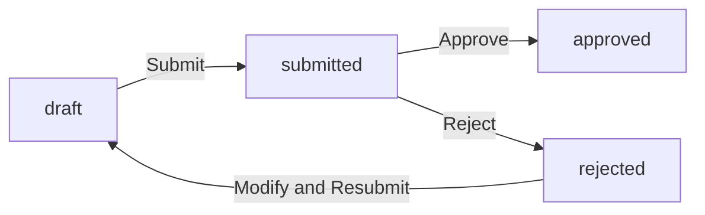
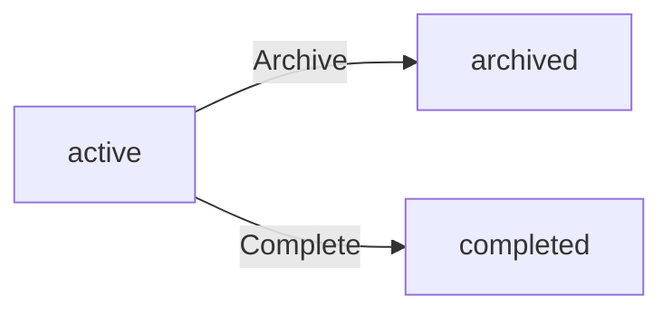
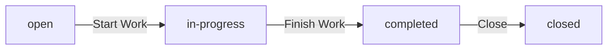
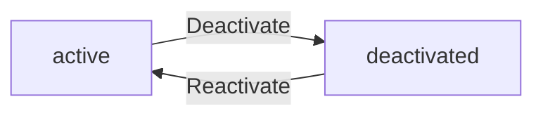

**hrm — Business concepts, relationships, and states from user perspective**

Business concepts, relationships, and states from user perspective

# Domain Concepts

Describe what each concept means in the business domain and its key attributes.

## Organization Concept

An Organization represents a distinct business entity within the platform, operating independently with its own employees, projects, and data. Each organization has a name, description, and logo image for identification. Organizations are configured with currency settings such as USD, EUR, or KRW, and a timezone for time-related operations. A fiscal start month is defined for financial reporting cycles. The organization owner has full control to edit these settings. Organizations can be deleted only when all pending timesheets are resolved and no active employee contracts exist. When deleted, all associated employees, projects, tasks, timelogs, and timesheets are permanently removed while the owner's account remains unassociated.

### Multi-Tenancy and Organization Independence

The platform supports multiple organizations operating independently within a single system. Each organization is a distinct business entity with its own employees, projects, tasks, timelogs, and timesheets. Data is strictly isolated between organizations, meaning employees in one organization cannot access or view data from another organization.

Users can belong to multiple organizations simultaneously. When logging in, users select which organization to work in, establishing the organization context for all subsequent actions. Users can switch between organizations without logging out, and all actions remain scoped to the currently selected organization.

Each organization is identified by a unique name and may include a description to provide additional context about the business entity. Organizations may also display a logo image for visual identification within the platform interface.

### Organization Configuration Settings

Each organization is configured with settings that define its operational parameters. The organization has a currency setting (such as USD, EUR, or KRW) that applies to financial operations like pay rates and budget tracking. A timezone is configured for the organization to standardize time-related operations across all employees and projects.

A fiscal start month is defined for the organization, establishing the beginning of the financial reporting cycle. This setting is used for financial reports and budget tracking purposes.

Organization owners have full permissions to edit all organization settings including name, description, logo, currency, timezone, and fiscal start month.

### Organization Ownership and Deletion

Each organization has a designated owner who has full administrative control over the organization. The owner can manage all organization settings, roles, members, and data within the organization.

An organization can be deleted by its owner only when specific conditions are met. All pending timesheets must be resolved (either approved or rejected) before deletion is allowed. Additionally, there must be no active employee contracts within the organization at the time of deletion.

When an organization is deleted, all associated data is permanently removed. This includes all employees, projects, tasks, timelogs, and timesheets. The deletion is irreversible and all data is lost.

The organization owner's user account is retained after organization deletion, but the account is no longer associated with any organization. The owner may join or create new organizations after deletion.

## User Concept

A User represents an individual account holder who can access the platform across multiple organizations. Users authenticate with an email address and password for sign-up and login. Each user maintains a global profile with a display name, avatar image, and phone number that is shared across all organizations. Users can change their password for security purposes. When logging in, users select which organization to work in, establishing an organization context for all subsequent actions. Users can switch between organizations without logging out. A user can belong to multiple organizations simultaneously, with each organization maintaining separate employee records for that user.

### User Account and Authentication

Users access the platform through a user account created with an email address and password. The email address serves as the unique identifier for authentication purposes. Users sign up by providing a valid email address and creating a password. Users log in by entering their email address and password. Users can change their password at any time for security purposes. The system validates the email and password during login and rejects invalid credentials.

### Global Profile

Each user maintains a global profile that is shared across all organizations they belong to. The global profile contains a display name that identifies the user throughout the platform. Users can upload an avatar image to personalize their profile. Users can provide a phone number in their profile for contact purposes. Users can edit their display name, avatar image, and phone number at any time. The profile information remains consistent regardless of which organization context the user is working in.

### Multi-Organization Membership

A user can belong to multiple organizations simultaneously. Each organization maintains separate employee records for the same user. When logging in, users select which organization to work in, establishing an organization context for all subsequent actions. All data accessed and operations performed are scoped to the selected organization. Users can switch between organizations without logging out. The organization context persists until the user switches to a different organization or logs out. Employee records, including role, department, and position, are specific to each organization.

### Account Deletion

Users can delete their account from the platform. If the user is the sole owner of an organization, they must transfer ownership to another employee or delete the organization before account deletion. When a user deletes their account, their employee records in other organizations are marked as deactivated. Deactivated employee records preserve historical data such as timelogs and timesheets. The user's global profile and account credentials are permanently removed from the system.

## Employee Concept

An Employee represents a user's role within a specific organization, linking the global user account to organizational data. Each employee record references the user account and includes the role assigned in that organization. Employees have optional department and position or title information. Employment type is classified as full-time, part-time, contractor, or intern. Employee status can be active or deactivated, with deactivated employees unable to log time or submit timesheets. Historical data including timelogs and timesheets is preserved when an employee is deactivated. Employees can be reactivated to restore their access. Employee records are created through invitations by email.

### Employee Record

An employee record represents a user's participation within a specific organization. It serves as the link between a global user account and organization-specific data. Each employee record is uniquely identified by the combination of the user account and the organization. The record stores organization-specific attributes while referencing the shared user profile. An employee record is created when a user is invited to join an organization via email or when an existing user accepts an invitation. The employee record persists even when the user switches between different organizations, maintaining separate data for each organizational context.

### Role Assignment

Each employee is assigned exactly one role within an organization. The role determines the employee's permissions and access level for that organization. Role assignment occurs when the employee record is created and can be updated by users with employee management permissions. The available roles include built-in roles (Owner, Manager, Employee) and custom roles defined by the organization. When a role is changed, the employee immediately gains or loses the permissions associated with the new role. Role assignment is scoped to the specific organization and does not affect the employee's roles in other organizations.

### Employment Type

Employees are classified by employment type to reflect their working relationship with the organization. The system supports four employment types: full-time, part-time, contractor, and intern. Full-time employment indicates standard full-time work arrangements. Part-time employment indicates reduced working hours compared to full-time. Contractor employment indicates independent contractor or freelance arrangements. Intern employment indicates temporary internship positions. The employment type is stored as part of the employee record and can be updated by users with employee management permissions.

### Department and Position

Each employee record includes optional department and position information. The department field associates the employee with an organizational department (defined in the Department concept). The position or title field stores the employee's job title or role description within the organization. Both fields are optional and can be left blank if not applicable. These fields can be updated by users with employee management permissions and are used for organizational reporting and employee filtering.

### Employee Status

An employee can have one of two status values: active or deactivated. Active status indicates the employee can perform all normal functions including logging time and submitting timesheets. Deactivated status indicates the employee's access has been temporarily or permanently suspended. When an employee is deactivated, they cannot log time or submit timesheets. However, all historical data including timelogs, timesheets, and contracts is preserved. Deactivated employees can be reactivated by users with employee management permissions, restoring their access to the organization.

### Historical Data Preservation

When an employee is deactivated, all their historical data remains intact and accessible. This includes all timelogs they created, timesheets they submitted or were associated with, contracts they held, and tasks assigned to them. The data is preserved for reporting, auditing, and historical reference purposes. Deactivation does not delete or anonymize any data. When an employee is reactivated, all their historical data becomes accessible again. This preservation policy ensures that organizational records remain complete even when employee access changes.

### Employee Creation via Invitation

Employees can be added to an organization through email invitation. The invitation process works as follows: if the invited email address already has a user account, that user is immediately added to the organization as an employee. If the email address has no existing account, a pending invitation is created. When the invited user later signs up with that email address, they are automatically added to all pending invitations. Invitations are scoped to the inviting organization and do not affect the user's membership in other organizations. The invitation process creates the employee record and assigns an initial role.

## Role Concept

A Role represents a set of permissions assigned to employees within an organization. Each organization maintains its own set of roles independent of other organizations. Three built-in roles exist and cannot be deleted: Owner with full access, Manager who can manage employees and projects, and Employee who can track time and view own data. Organization owners can create custom roles with a name and specific permissions. Available permissions include organization management, employee management, project management, time management, time approval, time viewing, and report viewing. Each employee is assigned exactly one role within an organization. Role assignments can be changed by users with employee management permission.

### Role Definition and Organization Scope

A Role represents a set of permissions that define what an employee can do within an organization. Each organization maintains its own independent set of roles, separate from all other organizations.

Every employee in an organization is assigned exactly one role. The role determines the employee's access to features and data within that organization.

Roles are organization-specific and do not transfer when an employee moves between organizations. An employee may have different roles in different organizations they belong to.

### Built-in and Custom Roles

The system provides three built-in roles that exist in every organization and cannot be deleted:

**Owner** — Has full access to all features within the organization. Owners can manage organization settings, manage all employees, manage all projects, approve timesheets, view all time records, and view reports. Owners can also create and manage custom roles.

**Manager** — Can manage employees (add, edit, deactivate), manage projects and tasks, approve timesheets, and view organization reports. Managers have access to view all employees and all timelogs.

**Employee** — Can track time, submit timesheets for approval, and view their own data. Employees cannot manage other employees, projects, or approve timesheets.

Organization owners can create custom roles beyond the three built-in roles. Each custom role has a name and a set of permissions selected from the available permission types. Owners can edit custom roles and delete them only if no employees are currently assigned to that role.

### Permissions and Role Assignment

Roles are composed of permissions that grant specific capabilities. The available permissions are:

- **org:manage** — Edit organization settings including name, description, logo, currency, timezone, and fiscal start month
- **employee:manage** — Add, edit, and deactivate employees within the organization
- **employee:view** — View the employee list and employee details
- **project:manage** — Create, edit, and delete projects and tasks
- **project:view** — View projects and tasks
- **time:manage** — Edit or delete any employee's timelogs
- **time:approve** — Approve or reject submitted timesheets
- **time:view_all** — View all employees' timelogs and timesheets
- **report:view** — View organization reports including time reports, project budget reports, and weekly summaries

Role assignment is the process of assigning a role to an employee within an organization. Users with the employee:manage permission can change an employee's role assignment. When a role is changed, the employee immediately gains or loses the permissions associated with the new role.

## Contract Concept

A Contract represents an employment agreement between an employee and an organization, maintaining a historical record of employment terms. Each employee can have multiple contracts over time, but only one contract can be active at any given moment. Contracts include a required start date and an optional end date where null indicates ongoing employment. A pay rate is required as a numeric value, with the pay period specified as hourly, daily, weekly, or monthly. Working hours per week is a required numeric value. Optional notes can be included for additional context. When a new contract is created, the previous active contract automatically ends with its end date set to the day before the new contract starts. Past contracts are immutable historical records that cannot be edited.

### Employment Contract Definition

An employment contract represents a formal agreement between an employee and an organization that defines the terms of their employment relationship. Each employee can have multiple contracts throughout their tenure with the organization, maintaining a complete historical record of all employment agreements.

Only one contract can be active at any given time for an employee. An active contract is identified by having no end date, indicating ongoing employment. When a new contract is created, the system automatically ends the previously active contract by setting its end date to the day before the new contract's start date.

Each contract includes a required start date that marks when the employment terms begin. The end date is optional; when absent, it signifies that the employment is ongoing. If an end date is specified, it marks when that particular contract period concluded.

### Contract Financial Terms

Each contract specifies financial compensation terms that define how the employee is paid. A pay rate is required and represents the numeric compensation value. The pay period determines how the pay rate is applied and can be hourly, daily, weekly, or monthly.

Hourly pay means the employee is compensated based on hours worked. Daily pay means compensation is based on days worked. Weekly pay means compensation is provided on a weekly basis. Monthly pay means compensation is provided on a monthly basis.

Working hours per week is a required numeric value that specifies the expected number of work hours in a standard week. This value is used for planning and reporting purposes.

Optional notes can be included with each contract to provide additional context or special terms that do not fit into the standard fields.

### Contract Lifecycle and History

The contract lifecycle begins when a contract is created for an employee. Contract creation requires authorization from users with employee management permissions. When a new contract is created, any previously active contract for that employee is automatically terminated by setting its end date.

Contract termination occurs either when an end date is explicitly set or when a new contract replaces the active one. Once a contract is no longer active (has an end date), it becomes part of the employee's contract history.

All past contracts form an immutable historical record that cannot be edited or deleted. This ensures the organization maintains a complete and unalterable history of all employment agreements. Only the currently active contract can be modified, and only by authorized users.

Employees can view their own complete contract history. Users with employee view permissions can view the contract history of any employee within the organization.

## Department Concept

A Department represents an organizational unit within an organization, used to group employees by function or team. Each department has a name and description for identification. Departments support one level of nesting through an optional parent department reference. Users with organization management permission can create, edit, and delete departments. When a department is deleted, employees previously assigned to it have their department set to null without affecting their employment status. All employees can view the list of departments within their organization. Departments help organize the employee structure and enable filtering of employee lists by department.

### Department Definition and Structure

A Department represents an organizational unit within an organization, used to group employees by function, team, or business area. Each department is identified by a name and may include a description to clarify its purpose or scope.

Departments support hierarchical organization through parent department references, allowing one level of nesting. A department can optionally reference a parent department, creating a two-level hierarchy (parent and child). Child departments inherit the organizational context of their parent for reporting and filtering purposes.

All departments belong to a single organization and are visible to all employees within that organization. Department data is isolated per organization, meaning employees in one organization cannot view or reference departments from another organization.

### Department and Employee Relationship

Each employee record includes a department assignment that indicates which organizational unit the employee belongs to. Department assignment is optional—an employee may exist without being assigned to any department.

The department assignment enables filtering and grouping of employee lists by organizational unit. Employees can view the complete list of departments within their organization, including department names, descriptions, and parent-child relationships.

When an employee's department is changed, the employee retains all other employment attributes (position, employment type, role, contracts). When a department is deleted, employees previously assigned to that department have their department assignment set to null, without affecting their employment status or other attributes.

### Department Lifecycle and Changes

Departments are created within an organization to represent new organizational units. Department attributes (name, description, parent department) can be edited after creation to reflect organizational changes.

When a department is deleted, all timelogs, timesheets, and other employee data remain intact. Only the department assignment on employee records is affected, with assignments set to null. Projects, tasks, and other organizational entities are not affected by department deletion.

Department changes are recorded in the activity log, including department creation, edits to department attributes, and department deletions. This provides an audit trail of organizational structure changes over time.

## Project Concept

A Project represents a work initiative within an organization where employees can log time and complete tasks. Each project has a required name and an optional description. A color code is required for UI display purposes. Projects have a status that can be active, archived, or completed. An optional budget hours field tracks the total estimated hours for the project. Start date and end date are optional for project timelines. Active projects can receive timelogs while archived and completed projects cannot. Existing timelogs on archived or completed projects are preserved. Projects can be deleted only if no timelogs are associated with them.

### Project Definition

A project represents a work initiative within an organization where employees can log time and complete tasks. Each project is owned by the organization and exists independently of individual employees.

Every project must have a name that uniquely identifies it within the organization. An optional description may be provided to give additional context about the project's purpose or scope.

A color code is required for each project to enable visual identification in the user interface. This allows employees to quickly distinguish between different projects when viewing time entries or task lists.

### Project Attributes

Projects may include optional attributes to support planning and tracking:

- **Budget hours**: An optional field that represents the total estimated hours expected for the project. This enables organizations to track planned versus actual time investment.
- **Start date**: An optional date indicating when the project is scheduled to begin.
- **End date**: An optional date indicating when the project is expected to be completed.

These fields support reporting and budget tracking but are not required for project creation.

### Project Status

Each project has a status that reflects its current state in the organization's workflow:

- **Active**: The project is currently in progress and can receive new timelogs from assigned employees.
- **Archived**: The project has been paused or put on hold. No new timelogs can be added to archived projects.
- **Completed**: The project has been finished. No new timelogs can be added to completed projects.

When a project transitions to archived or completed status, all existing timelogs associated with the project are preserved for historical reporting and audit purposes.

### Project Deletion

A project can be deleted only if it has no timelogs associated with it. This restriction ensures that time tracking data is not lost accidentally.

When a project is deleted, all related data is permanently removed from the organization, including:
- All timelogs associated with the project
- All tasks within the project
- All project member assignments

The deletion restriction exists because timelogs represent historical work records that may be needed for reporting, billing, or compliance purposes.

## ProjectMember Concept

A ProjectMember represents the assignment of an employee to a project within an organization. Each project membership links an employee to a project with an assigned role of either member or project-lead. An employee can be assigned to multiple projects simultaneously. Project leads have the ability to manage tasks within their assigned project. Project memberships are created and removed by users with project management permission. Employees can view which projects they are assigned to. This concept establishes the relationship between employees and projects, enabling task assignment and time tracking within the project context.

### Project Membership Definition

A project membership represents the assignment of an employee to a project within an organization. Each membership establishes a formal link between an employee and a project, enabling the employee to contribute to project work and track time against the project.

Each project membership includes:
- The employee being assigned
- The project they are assigned to
- A project role that defines their responsibilities within the project

An employee can be assigned to multiple projects simultaneously, allowing them to work across different initiatives. Each assignment is independent, with its own role and permissions within that specific project context.

Project memberships are scoped to the organization. Employees in one organization cannot be assigned to projects in another organization, even if the same user account exists in both organizations.

### Project Roles and Responsibilities

Each project membership assigns the employee one of two project roles: member or project-lead.

**Member Role**
Employees with the member role can:
- View project details and tasks
- Log time against the project
- View tasks assigned to them

**Project-Lead Role**
Employees with the project-lead role have all member capabilities plus:
- Create tasks within the project
- Edit tasks within the project
- Assign tasks to other project members
- Manage task status and priorities

Project leads have management authority over tasks but do not have authority to modify project-level settings or add/remove other employees from the project. Those capabilities remain with users who have project management permission at the organization level.

An employee's project role is specific to each project. An employee can be a project-lead in one project and a member in another project simultaneously.

### Project Membership Lifecycle

Project memberships are created when users with project management permission assign an employee to a project. The assignment requires selecting both the employee and the project role (member or project-lead).

Project memberships can be removed by users with project management permission. When a membership is removed:
- The employee loses access to the project
- The employee can no longer log time against the project
- Existing timelogs remain preserved as historical records
- Tasks previously assigned to the employee remain in the project but are no longer assigned to that employee

Employees can view the list of projects they are currently assigned to, along with their role in each project. This view helps employees understand their current project commitments and responsibilities.

### Project Assignment Visibility

Employees can view all projects they are assigned to within their current organization. This visibility includes the project name, their assigned role, and the project status.

Users with project view permission can view all projects in the organization, regardless of whether they are assigned to them. This allows managers and owners to see the complete project portfolio.

Project assignments are visible to:
- The assigned employee (their own assignments)
- Users with project view permission (all project assignments)
- Users with project management permission (all project assignments)

Employees who are not assigned to a project cannot see that project's details, tasks, or timelogs. This ensures that project work remains visible only to those who are formally part of the project team.

## Task Concept

A Task represents a unit of work within a project that employees can be assigned to complete. Each task has a required title and an optional description. Task status can be open, in-progress, completed, or closed. Priority levels include low, medium, high, and urgent. Optional estimated hours track the expected effort. An optional due date indicates when the task should be completed. Tasks can be assigned to an employee who must be a project member. Tasks support one level of nesting through an optional parent task for subtasks. Task status changes are recorded in task history with timestamp, old status, new status, and the user who made the change.

### Task Definition

A task represents a unit of work within a project that employees can be assigned to complete. Tasks are the fundamental building blocks for organizing and tracking work effort within projects. Each task belongs to exactly one project and can be assigned to employees who are members of that project.

### Task Attributes

Each task has a required title that identifies the work item. An optional description provides additional details about the task. Optional estimated hours track the expected effort required to complete the task. An optional due date indicates when the task should be completed.

### Task Status and Priority

Task status tracks the current state of work. Available status values are: open, in-progress, completed, and closed. Priority levels indicate urgency and importance: low, medium, high, and urgent. Status and priority are used for filtering and sorting tasks in views and reports.

### Task Assignment

Tasks can be assigned to an employee who must be a member of the project. An employee can only be assigned to tasks in projects where they have project membership. Tasks can remain unassigned if no specific employee is responsible for the work.

### Task Hierarchy

Tasks support one level of nesting through an optional parent task relationship. A task with a parent is considered a subtask. Subtasks inherit the project context from their parent task. This hierarchy allows breaking down larger work items into smaller, manageable components.

### Task History

Task status changes are recorded in task history as an audit trail. Each history entry records the timestamp of the change, the old status, the new status, and the user who made the change. Task history provides visibility into how task states evolved over time.

## Timelog Concept

A Timelog represents a record of time spent by an employee on a project or task. Each timelog includes a required date and duration in minutes. A project is required and must be one the employee is assigned to. An optional task must belong to the selected project. A description can be added to note what was done. A billable flag indicates whether the time is billable, defaulting to true. Employees can only create timelogs for themselves. Timelogs can be edited if not part of an approved timesheet. Timelogs can be deleted if not part of any submitted or approved timesheet. Timelogs support filtering by date range, project, task, and billable status.

### Timelog Definition

A Timelog is a record of time spent by an employee on work. Each timelog represents a single work session and contains the following information:

- **Date**: The calendar date when the work was performed (required)
- **Duration**: The length of time worked, measured in minutes (required)
- **Project**: The project the work was done on (required). The employee must be assigned to this project.
- **Task**: The specific task within the project (optional). If provided, the task must belong to the selected project.
- **Description**: A note describing what work was done (optional)
- **Billable Flag**: Indicates whether the time is billable or non-billable. Defaults to billable.

Timelogs are the fundamental unit of time tracking in the system. Multiple timelogs are grouped into a timesheet for weekly review and approval.

### Billable and Non-Billable Time

Each timelog is classified as either billable or non-billable time through the billable flag.

**Billable Time** represents work that can be charged to a client or customer. This is the default classification when creating a timelog.

**Non-Billable Time** represents internal work, training, administrative tasks, or other activities that are not charged to clients.

This classification is used in reports to distinguish between revenue-generating work and internal overhead.

## Timesheet Concept

A Timesheet represents a weekly collection of timelogs submitted for approval, covering Monday to Sunday. Each timesheet is owned by an employee and includes the week start date and week end date. Status can be draft, submitted, approved, or rejected. Total hours are calculated from included timelogs. A submitted at timestamp records when submission occurred. A reviewed at timestamp and reviewed by user record approval or rejection details. A rejection reason is required when rejecting a timesheet. Draft timesheets automatically include all timelogs for the employee in that week. A timesheet cannot be submitted without timelogs or if another timesheet for the same week is already submitted or approved. Approved timesheets lock all included timelogs from editing or deletion.

### Timesheet Definition

A timesheet represents a weekly collection of time entries submitted for approval. It covers a period from Monday (week start date) to Sunday (week end date). Each timesheet is owned by a single employee and contains a collection of timelogs recorded during that week. The timesheet tracks the total hours worked, which is calculated from all included timelogs. A timesheet can exist in different states throughout its lifecycle, from initial draft to final approval or rejection.

### Timesheet Status States

A timesheet has a status that indicates its current state in the approval workflow. The status can be:

- **Draft**: The timesheet is being prepared and has not been submitted for approval. In this state, the employee can add or remove timelogs.
- **Submitted**: The timesheet has been sent for approval and is awaiting review by someone with approval permissions.
- **Approved**: The timesheet has been reviewed and approved. All timelogs included in the timesheet are locked and cannot be edited or deleted.
- **Rejected**: The timesheet was reviewed but not approved. It returns to draft status and the employee can modify and resubmit it. A rejection reason is recorded to explain why it was not approved.

### Timesheet Review Information

When a timesheet is submitted, the system records the timestamp of submission. When a timesheet is approved or rejected, the system records both the timestamp of the review and identifies the user who performed the review. If a timesheet is rejected, a rejection reason must be provided as text to explain the reason for rejection. This information provides an audit trail of the approval process.

### Timelog Collection and Hours Calculation

A timesheet includes timelogs that belong to the employee who owns the timesheet and fall within the week's date range. The total hours shown on a timesheet are calculated automatically by summing the duration of all included timelogs. Employees can manually add or remove timelogs from a draft timesheet before submission. Once a timesheet is approved, all timelogs included in it become locked and cannot be modified or deleted.

## ActivityLog Concept

An ActivityLog represents a record of significant actions performed within the organization for audit and tracking purposes. Each activity log entry includes a timestamp, the user who performed the action, the action type, the target entity, and details about the action. Logged actions include employee invitations, deactivations, and reactivations. Contract creation and edits are recorded. Project creation, archiving, completion, and deletion are tracked. Task status changes are logged. Timesheet submissions, approvals, and rejections are recorded. Role assignments and changes are captured. Users with organization management permission can view the full activity log. Activity logs support filtering by action type, user, and date range.

### Activity Log Definition

An activity log entry represents a recorded action performed within the organization for audit and tracking purposes. Each entry captures when an action occurred, who performed it, what type of action was taken, which entity was affected, and relevant details about the action.

Activity logs serve as an audit trail for organizational changes, enabling users with organization management permission to review historical actions and maintain accountability.

Each activity log entry includes:
- Timestamp: when the action was performed
- Action performer: the user who executed the action
- Action type: the category of action that occurred
- Target entity: the business object that was affected
- Action details: additional context specific to the action type

### Logged Action Types

The system records the following action types in the activity log:

**Employee Actions**
- Employee invitation: when a new employee is invited to the organization
- Employee deactivation: when an employee's status is changed to deactivated
- Employee reactivation: when a deactivated employee is reactivated

**Contract Actions**
- Contract creation: when a new employment contract is created for an employee
- Contract edit: when an existing contract's details are modified

**Project Actions**
- Project creation: when a new project is created
- Project archiving: when a project's status is changed to archived
- Project completion: when a project's status is changed to completed
- Project deletion: when a project is permanently removed

**Task Actions**
- Task status change: when a task's status transitions to a different state

**Timesheet Actions**
- Timesheet submission: when an employee submits a timesheet for approval
- Timesheet approval: when a submitted timesheet is approved
- Timesheet rejection: when a submitted timesheet is rejected with a reason

**Role Actions**
- Role assignment: when an employee is assigned a role within the organization
- Role change: when an employee's role is modified

### Activity Log Visibility and Filtering

Users with organization management permission can view the full activity log for their organization. The activity log is paginated to support browsing through historical entries.

Activity logs can be filtered by:
- Action type: view only specific categories of actions
- Action performer: view only actions performed by a specific user
- Date range: view actions within a specified time period

Each organization maintains its own separate activity log. Users can only view activity logs for their currently selected organization and cannot access activity logs from other organizations.

# Domain Relationships

Describe how concepts relate to each other from a business perspective.

## Conceptual Relationships

Describe how concepts relate to each other in business terms.

### Organization Ownership and Boundaries

The platform operates on a multi-tenant organization model where each organization is an independent business entity. Users create an organization during initial sign-up and become the owner of that organization.

Organization Ownership:
- Each organization has exactly one owner at any time
- The owner has full administrative access to all organization features
- Ownership can be transferred to another employee within the organization
- When an owner transfers ownership, they become a regular employee or can leave the organization

Organization Boundaries:
- All data is strictly scoped to the organization where it was created
- Employees in one organization cannot access or view data from another organization
- Users who belong to multiple organizations maintain separate data contexts for each organization
- When a user switches organizations, all subsequent actions apply only to the selected organization

Organization Lifecycle:
- An organization can be deleted by its owner only when all pending timesheets are resolved and there are no active employee contracts
- When an organization is deleted, all associated employees, projects, tasks, timelogs, and timesheets are permanently removed
- The user account of the deleted organization's owner remains active but is no longer associated with any organization

### User and Employee Association

A user account represents a global identity that can belong to multiple organizations. Within each organization, a user has an employee record that contains organization-specific information.

User-Employee Relationship:
- Each user can have at most one employee record per organization
- The employee record links to the user account and stores organization-specific attributes
- Employee attributes include department, position, employment type, and status
- The user's global profile (display name, avatar, phone number) is shared across all organizations

Employee Status:
- An employee record can be active or deactivated
- Deactivated employees cannot log time or submit timesheets
- Deactivated employees retain access to view their historical data
- When a user deletes their account, their employee records in other organizations are marked as deactivated
- If a user is the sole owner of an organization, they must transfer ownership or delete the organization before deleting their account

### Project and Task Relationships

Employees are assigned to projects through project memberships. Each membership defines the employee's role within a specific project.

Project Membership:
- An employee can be assigned to multiple projects
- Each project can have multiple employee members
- Each membership has an assigned role: member or project-lead
- Project leads can manage tasks within their assigned project
- Project membership can be added or removed by users with project management permissions

Project-Task Relationship:
- Tasks belong to a specific project
- Each project can contain multiple tasks
- Tasks can have one parent task for subtask organization (one level of nesting)
- Tasks can be assigned to employees who are members of the project
- When a project is archived or completed, no new timelogs can be created for it, but existing timelogs are preserved

### Time Tracking Records

Time tracking involves two related concepts: individual time entries (timelogs) and weekly collections (timesheets).

Timelog Ownership:
- Each timelog is created by and belongs to a specific employee
- Timelogs reference a project the employee is assigned to
- Timelogs can optionally reference a task within that project
- Employees can only create and manage their own timelogs
- Users with time management permissions can edit or delete any employee's timelogs

Timesheet Composition:
- A timesheet represents a week (Monday to Sunday) of work for a specific employee
- Each timesheet contains the timelogs for that employee within the week
- Employees can create draft timesheets that automatically include all timelogs for the week
- Employees can add or remove timelogs from a draft timesheet before submission
- Once a timesheet is approved, all included timelogs are locked and cannot be edited or deleted
- Rejected timesheets return to draft status, allowing the employee to modify and resubmit

### Employment Contracts

Employment contracts represent the formal agreement between an organization and an employee. Contracts are maintained as a historical record.

Contract Ownership:
- Each employee can have multiple contracts over time
- Only one contract can be active at any time for an employee
- Each contract belongs to a specific employee within an organization
- Contracts contain start date, end date, pay rate, pay period, and working hours per week

Contract Lifecycle:
- Creating a new contract automatically ends the previous active contract by setting its end date
- The current active contract can be edited by users with employee management permissions
- Past contracts are immutable and cannot be edited (historical record)
- Employees can view their own contracts
- Users with employee view permissions can view any employee's contracts
- An organization cannot be deleted while any employee has an active contract

### Role and Permission Assignment

Roles define what actions employees can perform within an organization. Each employee is assigned exactly one role per organization.

Role Assignment:
- Each employee has one role within their organization
- Roles can be built-in (Owner, Manager, Employee) or custom-created by the organization owner
- Role assignments can be changed by users with employee management permissions
- Custom roles can be deleted only if no employees are assigned to them

Permission Inheritance:
- Each role contains a set of permissions that define allowed actions
- Permissions control access to organization settings, employee management, projects, time tracking, and reports
- When an employee's role changes, their permissions update immediately
- Role changes are recorded in the activity log

### Department Organization

Departments organize employees into functional units within an organization. Departments can be nested to one level.

Department Structure:
- Each department has a name and optional description
- Departments can have one parent department (one level of nesting)
- Employees can be assigned to at most one department
- When a department is deleted, employees previously in that department have their department cleared (set to null)

Department Membership:
- An employee record includes an optional department reference
- Users with employee management permissions can assign employees to departments
- Users with employee view permissions can view the department list
- Employees can filter the employee list by department

## Lifecycle and Retention

Describe concept lifecycle states and transitions only. Detailed retention/recovery policies belong in 05-non-functional. Operation details belong in 03-functional-requirements.

### Entity Lifecycle States

Each entity in the system has a defined lifecycle with specific states and transitions.

**Organization Lifecycle**

An organization is created when a user signs up. The organization exists until the owner deletes it.

An organization can be deleted only when:
- All pending timesheets are resolved (approved or rejected)
- There are no active employee contracts

When an organization is deleted, all associated data (employees, projects, tasks, timelogs, timesheets) is permanently deleted. The owner's user account remains but is no longer associated with any organization.

**Employee Lifecycle**

An employee record is created when a user is invited to or joins an organization.

An employee has a status of either active or deactivated.

A deactivated employee cannot log time or submit timesheets. Historical data (timelogs, timesheets, contracts) is preserved. A deactivated employee can be reactivated to restore their ability to work.

When a user deletes their account, their employee records in other organizations are marked as deactivated.

**Contract Lifecycle**

An employee can have multiple contracts as a historical record. Only one contract can be active at a time.

When a new contract is created, the previous active contract automatically ends (its end date is set to the day before the new contract's start date).

Past contracts (those with an end date) cannot be edited. They serve as an immutable historical record.

**Project Lifecycle**

A project has a status of active, archived, or completed.

An active project can be archived or completed by users with project management permissions.

Archived or completed projects cannot receive new timelogs. Existing timelogs on archived or completed projects are preserved.

A project can be deleted only if it has no timelogs associated with it.

**Task Lifecycle**

A task has a status of open, in-progress, completed, or closed.

Status changes are recorded in task history with timestamp, old status, new status, and the user who made the change.

**Timesheet Lifecycle**

A timesheet has a status of draft, submitted, approved, or rejected.

A draft timesheet can be submitted for approval. A timesheet cannot be submitted if it has no timelogs.

A submitted timesheet can be approved or rejected.

An approved timesheet locks all included timelogs (they cannot be edited or deleted).

A rejected timesheet returns to draft status, allowing the employee to modify and resubmit.

### Data Retention Rules

The system enforces data retention rules based on entity type and state.

**Organization Data Retention**

All data within an organization (employees, projects, tasks, timelogs, timesheets) is retained while the organization exists.

When an organization is deleted, all its data is permanently deleted and cannot be recovered.

**Employee Data Retention**

Deactivated employees retain all historical data (timelogs, timesheets, contracts). The employee record itself is retained but marked as deactivated.

When a user deletes their account, their employee records in other organizations are retained but marked as deactivated. The user's global profile data is deleted.

**Contract Data Retention**

All contracts are retained as historical records, even after they end.

Past contracts cannot be edited or deleted. They remain as an immutable record of employment history.

**Project Data Retention**

Archived and completed projects are retained with all their associated timelogs and tasks.

Projects can only be deleted if they have no timelogs. Once timelogs exist, the project and its data are retained indefinitely.

**Timelog Data Retention**

Timelogs are retained as long as they are not deleted.

Timelogs that are part of an approved timesheet cannot be edited or deleted.

Timelogs that are part of a submitted timesheet (not yet approved) cannot be deleted.

**Timesheet Data Retention**

Timesheets are retained regardless of status (draft, submitted, approved, or rejected).

Approved timesheets serve as a permanent record of work completed and cannot have their timelogs modified.

### Archival Rules

The system supports archival of work items to preserve historical data while preventing new activity.

**Project Archival**

Projects can be archived or marked as completed.

Archived and completed projects cannot receive new timelogs.

Existing timelogs, tasks, and other data associated with archived or completed projects are preserved.

Archived and completed projects remain visible to users with project view permissions.

**Timesheet Archival**

Approved timesheets serve as an archival record of work completed for a specific week.

Once a timesheet is approved, all included timelogs are locked and cannot be edited or deleted.

Approved timesheets remain visible for reporting and audit purposes.

**Contract Archival**

Contracts that have an end date are considered historical (archived) records.

Archived contracts cannot be edited but remain visible for reference.

The system automatically archives a contract when a new active contract is created for the same employee.

### Deletion Policies

The system defines strict deletion policies to protect data integrity and maintain audit trails.

**Organization Deletion**

An organization can be deleted only by its owner.

Deletion is blocked if:
- Any timesheets are in pending (submitted) status
- Any employee has an active contract

When an organization is deleted, all its data (employees, projects, tasks, timelogs, timesheets, departments, roles) is permanently deleted.

**User Account Deletion**

A user can delete their account only if they are not the sole owner of any organization.

If a user is the sole owner of an organization, they must either transfer ownership to another user or delete the organization first.

When a user deletes their account:
- Their global profile data is deleted
- Their employee records in other organizations are marked as deactivated (not deleted)
- Their historical work data (timelogs, timesheets) is preserved and attributed to the deactivated employee record

**Project Deletion**

A project can be deleted only if it has no timelogs associated with it.

Projects with timelogs cannot be deleted to preserve the historical record of work performed.

**Task Deletion**

Tasks do not have a deletion operation. Tasks are completed or closed to mark them as finished.

**Timelog Deletion**

An employee can delete their own timelog only if:
- The timelog is not part of any submitted timesheet
- The timelog is not part of any approved timesheet

Users with time management permissions can delete any employee's timelog under the same conditions.

**Timesheet Deletion**

Timesheets cannot be deleted. They can only transition through states (draft, submitted, approved, rejected).

**Employee Record Deletion**

Employee records cannot be deleted. They can only be deactivated.

Deactivated employee records retain all historical data for audit and reporting purposes.

### Recovery Limitations

The system does not support data recovery once deletion occurs. Users must exercise caution before confirming deletion actions.

**Irrecoverable Deletions**

The following deletions are permanent and cannot be recovered:
- Organization deletion (all associated data is lost)
- User account deletion (global profile data is lost)
- Project deletion (when allowed, all project data is lost)
- Timelog deletion (individual time entries are lost)

**Preserved Data**

The following data is retained even when related entities change state:
- Deactivated employee records (including all historical timelogs and timesheets)
- Archived contracts (immutable historical record)
- Archived/completed projects (with all timelogs and tasks)
- Approved timesheets (permanent record of work)
- Task status history (all status changes are recorded)
- Activity log entries (audit trail is maintained)

**Prevention Mechanisms**

The system prevents accidental data loss through:
- Deletion guards (blocking organization deletion when pending timesheets or active contracts exist)
- State-based restrictions (preventing deletion of timelogs in submitted or approved timesheets)
- Confirmation requirements (implied by the permanent nature of deletions)

**Data Recovery Limitations**

Users cannot recover:
- Deleted organizations or their data
- Deleted user account profile information
- Deleted timelogs
- Deleted projects

Users can restore:
- Deactivated employees (reactivation restores ability to log time and submit timesheets)
- Rejected timesheets (return to draft status for resubmission)

# Business Categories and State Flows

Business category classifications and state flow definitions.

## Business Category Definitions

Define all business category classifications with their allowed values and descriptions.

### Employment Type and Employee Status

The system classifies employees by employment type to distinguish work arrangements. The allowed values are:

- **full-time**: Standard full-time employment
- **part-time**: Reduced hours employment
- **contractor**: Contract-based work arrangement
- **intern**: Temporary intern position

Each employee record must have exactly one employment type assigned.

The system also tracks employee status to indicate current work eligibility. The allowed values are:

- **active**: Employee is currently working and can perform all permitted actions
- **deactivated**: Employee is no longer active and cannot log time or submit timesheets

Deactivated employees retain their historical data including timelogs, timesheets, and contracts.

### Project and Task Status Types

Projects have a lifecycle status that indicates their current state in the organization. The allowed values are:

- **active**: Project is ongoing and can receive new timelogs
- **archived**: Project is temporarily paused; no new timelogs can be added but existing records are preserved
- **completed**: Project is finished; no new timelogs can be added but existing records are preserved

Archived and completed projects cannot receive new timelogs, but historical timelogs remain intact for reporting purposes.

Tasks within projects also have status to track work progress. The allowed values are:

- **open**: Task has been created but work has not started
- **in-progress**: Work on the task is currently underway
- **completed**: Work on the task is finished
- **closed**: Task is finalized and locked

Task status changes are recorded in task history with timestamp, old status, new status, and the user who made the change.

### Task Priority Classification

Tasks have a priority classification to indicate urgency and importance. The allowed values are:

- **low**: Task has minimal urgency
- **medium**: Task has standard priority
- **high**: Task requires attention sooner than lower priority items
- **urgent**: Task requires immediate attention

Priority can be used for sorting and filtering tasks in the task list view.

### Timesheet Workflow States

Timesheets follow a workflow state to track the approval process. The allowed values are:

- **draft**: Timesheet is being prepared; employee can add or remove timelogs
- **submitted**: Timesheet has been submitted for approval; employee cannot modify it
- **approved**: Timesheet has been approved; all included timelogs are locked from editing or deletion
- **rejected**: Timesheet was rejected with a reason; returns to draft status for employee to modify and resubmit

A timesheet represents one week of work (Monday to Sunday). Each employee can have at most one timesheet per week. A timesheet cannot be submitted if it contains no timelogs.

### Contract Pay Period Classification

Contracts define compensation terms for employees. Each contract has a pay period classification indicating how compensation is calculated. The allowed values are:

- **hourly**: Compensation based on hours worked
- **daily**: Compensation based on days worked
- **weekly**: Compensation based on weeks worked
- **monthly**: Compensation based on months worked

Each employee can have multiple contracts over time, but only one contract can be active at any given time. When a new contract is created, the previous active contract is automatically ended with its end date set to the day before the new contract's start date. Past contracts cannot be edited as they form an immutable historical record.

### Project Membership Roles

Employees assigned to projects have a membership role that defines their responsibilities within that project. The allowed values are:

- **member**: Standard project participant who can log time and view project tasks
- **project-lead**: Project leader who can manage tasks within the project, including creating and editing tasks

An employee can be assigned to multiple projects with different roles in each. Project leads can create and edit tasks in their assigned project. Users with project:manage permission can also manage tasks regardless of project membership role.

## State Transitions

Define valid state transition paths for stateful concepts.

### Timesheet State Flow

A timesheet progresses through the following states during its lifecycle:

**Draft** → **Submitted** → **Approved**
**Draft** → **Submitted** → **Rejected** → **Draft**

### Draft State

A timesheet begins in draft status when created by an employee. In this state:
- The employee can add or remove timelogs from the timesheet
- The employee can modify the timesheet contents
- The employee can submit the timesheet for approval

### Submitted State

When an employee submits a draft timesheet, it transitions to submitted status. In this state:
- The timesheet is pending review by a user with time approval permission
- The employee cannot modify the timesheet contents
- A reviewer can approve or reject the timesheet

### Approved State

When a reviewer approves a submitted timesheet, it transitions to approved status. In this state:
- All timelogs included in the timesheet are locked and cannot be edited or deleted
- The timesheet is finalized for payroll and reporting purposes
- No further state transitions are possible

### Rejected State

When a reviewer rejects a submitted timesheet, it transitions to rejected status. In this state:
- A rejection reason is recorded and visible to the employee
- The timesheet returns to draft status, allowing the employee to modify and resubmit
- The employee can add, remove, or edit timelogs before resubmission

### Project State Flow

Projects progress through the following states during their lifecycle:

**Active** → **Archived**
**Active** → **Completed**

### Active State

A project begins in active status when created. In this state:
- Employees assigned to the project can log time against it
- Tasks can be created and managed within the project
- Project details can be edited by users with project management permission

### Archived State

When a project is archived, it transitions to archived status. In this state:
- No new timelogs can be created for the project
- Existing timelogs and tasks are preserved and viewable
- The project is effectively frozen for historical reference
- No further state transitions are possible

### Completed State

When a project is marked as completed, it transitions to completed status. In this state:
- No new timelogs can be created for the project
- Existing timelogs and tasks are preserved and viewable
- The project is closed for active work
- No further state transitions are possible

### Task State Flow

Tasks progress through the following states during their lifecycle:

**Open** → **In-Progress** → **Completed** → **Closed**

### Open State

A task begins in open status when created. In this state:
- The task is available for assignment to an employee
- No work has started on the task
- The task can be transitioned to in-progress when work begins

### In-Progress State

When an employee starts working on a task, it transitions to in-progress status. In this state:
- Time can be logged against the task
- The task is actively being worked on
- The task can be transitioned to completed when work is finished

### Completed State

When work on a task is finished, it transitions to completed status. In this state:
- The task work is finished but not yet formally closed
- Time logging against the task may continue depending on organizational policy
- The task can be transitioned to closed when formal closure is required

### Closed State

When a task is formally closed, it transitions to closed status. In this state:
- The task is fully completed and closed
- No further time can be logged against the task
- No further state transitions are possible

### Status Change History

Each task status change is recorded in task history, including:
- Timestamp of the change
- Previous status
- New status
- User who made the change

### Employee Lifecycle State Flow

Employees progress through the following states during their lifecycle within an organization:

**Active** ↔ **Deactivated**

### Active State

An employee begins in active status when invited or hired. In this state:
- The employee can log time against assigned projects
- The employee can submit timesheets for approval
- The employee can view their own data and assigned tasks
- The employee can access organization resources according to their role

### Deactivated State

When an employee is deactivated, they transition to deactivated status. In this state:
- The employee cannot log time or submit timesheets
- The employee cannot access organization resources
- Historical data (timelogs, timesheets, contracts) is preserved
- The employee can be reactivated to restore access

### Reactivation

A deactivated employee can be reactivated by a user with employee management permission. Upon reactivation:
- The employee transitions back to active status
- Access to organization resources is restored according to their role
- Historical data remains intact and accessible

### Contract State Flow

Contracts represent employment agreements and have the following lifecycle:

**Inactive** → **Active** → **Inactive** (historical)

### Contract Creation

When a contract is created for an employee:
- If no active contract exists, the new contract becomes active
- If an active contract exists, the previous contract's end date is set to the day before the new contract starts, making it inactive
- The new contract becomes the active contract

### Active Contract

Only one contract can be active at a time for an employee. In this state:
- The contract has a start date and no end date (ongoing)
- The contract can be edited by users with employee management permission
- The contract defines current pay rate, pay period, and working hours

### Inactive Contract (Historical)

When a contract is superseded by a new contract, it becomes inactive. In this state:
- The contract has both a start date and an end date
- The contract cannot be edited (immutable historical record)
- The contract is preserved for historical and audit purposes
- Employees can view their own contract history
- Users with employee view permission can view any employee's contract history

### Contract Editing Rules

- Active contracts can be edited by users with employee management permission
- Inactive (historical) contracts cannot be edited under any circumstances
- Editing an active contract does not create a new contract; it modifies the existing one