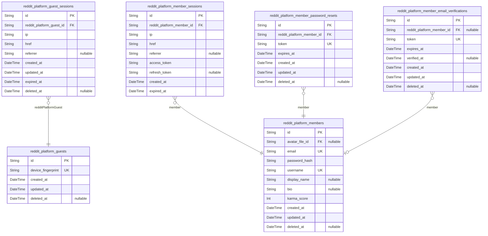
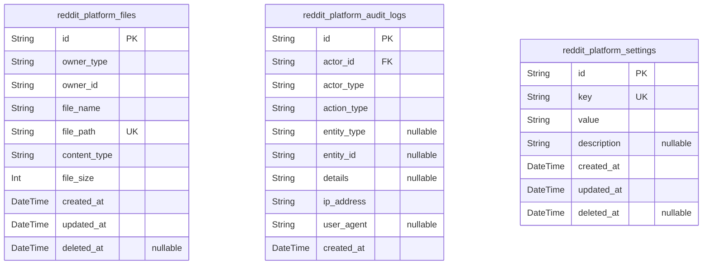
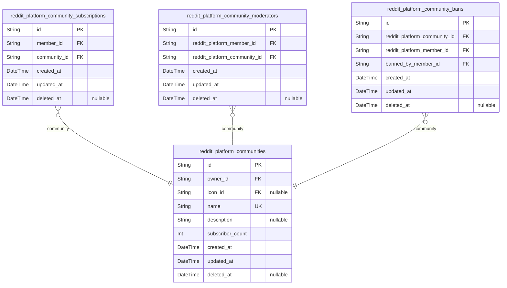
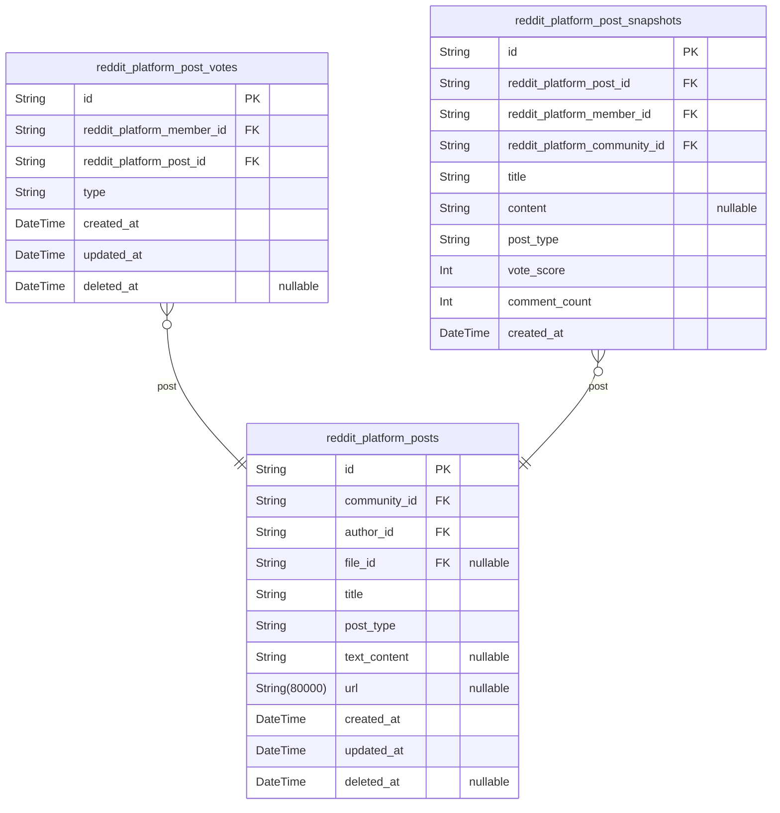
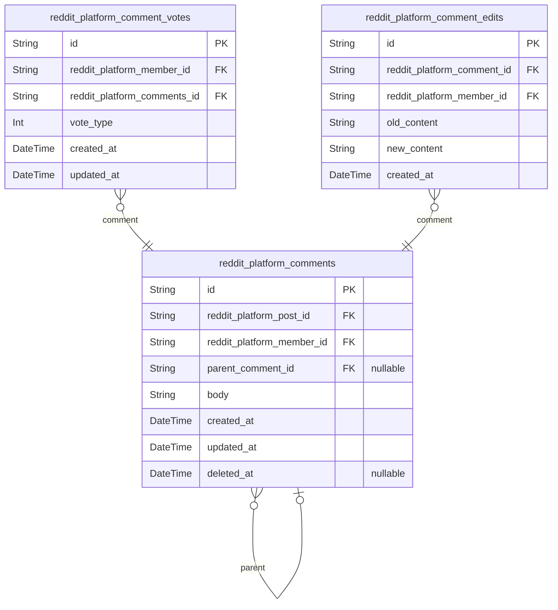
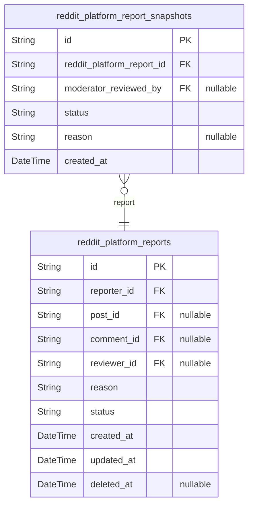

# Prisma Markdown

> Generated by [`prisma-markdown`](https://github.com/samchon/prisma-markdown)

- [Actors](#actors)
- [Systematic](#systematic)
- [Communities](#communities)
- [Posts](#posts)
- [Comments](#comments)
- [Reports](#reports)

## Actors

### `reddit_platform_guests`

Temporary guest accounts identified by device fingerprint for anonymous
browsing access. Guest accounts enable unauthenticated users to browse
public content including popular and community feeds without
registration. Each guest is uniquely identified by their device
fingerprint, allowing session continuity across requests. Guest accounts
have limited capabilities compared to registered members and are subject
to expiration and cleanup policies.

Properties as follows:

- `id`: Primary Key.
- `device_fingerprint`
  > Unique device fingerprint used to identify and track guest accounts
  > across sessions. Enables session continuity for anonymous browsing
  > without registration.
- `created_at`: Timestamp when the guest account was created.
- `updated_at`: Timestamp when the guest account was last updated.
- `deleted_at`
  > Timestamp when the guest account was soft-deleted for cleanup. Null
  > indicates active guest account.

### `reddit_platform_guest_sessions`

Temporary session tokens for guest authentication and access control.
This table tracks login sessions for guest actors identified by device
fingerprint, storing connection metadata including IP address, access
URL, and referrer information for security auditing. Sessions are
append-only records that support session lifecycle management and
expiration policies.

Properties as follows:

- `id`: Primary Key.
- `reddit_platform_guest_id`: Belonged guest's [reddit_platform_guests.id](#reddit_platform_guests)
- `ip`: Client IP address for session tracking and security auditing.
- `href`: Session access URL or endpoint that initiated the session.
- `referrer`: HTTP referrer header for session context and analytics.
- `created_at`: Session creation timestamp for audit trail and expiration calculation.
- `updated_at`: Last session activity timestamp for tracking user engagement.
- `expired_at`
  > Session expiration timestamp for security policy enforcement. NOT NULL by
  > default to ensure all sessions have defined lifetimes.
- `deleted_at`: Soft deletion timestamp for session archival and audit trail retention.

### `reddit_platform_members`

Registered member accounts with email/password authentication credentials
and profile information. This table represents the primary identity
record for authenticated users who can create posts, comments, vote,
subscribe to communities, and participate as moderators. Each member has
a unique username and email, password hash for authentication, profile
fields including display name, bio, and avatar reference, and a karma
score that tracks their reputation based on votes received on their
content. [reddit_platform_member_sessions](#reddit_platform_member_sessions) tracks login sessions,
[reddit_platform_member_password_resets](#reddit_platform_member_password_resets) handles account recovery,
and [reddit_platform_member_email_verifications](#reddit_platform_member_email_verifications) manages
registration confirmation.

Properties as follows:

- `id`: Primary Key.
- `avatar_file_id`: Avatar image file reference. [reddit_platform_files.id](#reddit_platform_files).
- `email`
  > Unique email address for account authentication and communication. Used
  > for login and password recovery.
- `password_hash`
  > Bcrypt hashed password for secure authentication. Never stored in plain
  > text.
- `username`
  > Unique username identifier for public profile display and mentions.
  > Immutable after registration.
- `display_name`: Public display name shown on profile and content. Can be changed by user.
- `bio`: Optional biography text describing the user. Shown on profile page.
- `karma_score`
  > Reputation score calculated from votes received on posts and comments.
  > Increases by 1 for upvotes, decreases by 1 for downvotes. Can be
  > negative.
- `created_at`: Account creation timestamp. Used for audit trail and account age display.
- `updated_at`
  > Last profile update timestamp. Automatically updated on any profile
  > modification.
- `deleted_at`
  > Soft deletion timestamp for account deletion. When set, account is
  > deactivated and content is anonymized.

### `reddit_platform_member_sessions`

JWT session tokens with access and refresh token support for member
authentication. Tracks login sessions for authenticated members with
connection metadata including IP address, href, and referrer for audit
trail purposes. Sessions are append-only records that enable session
management, token refresh, and security auditing.

Related entities:
- [reddit_platform_members](#reddit_platform_members) - Parent member account that owns this
session
- [reddit_platform_member_password_resets](#reddit_platform_member_password_resets) - Password reset tokens
for account recovery
- [reddit_platform_member_email_verifications](#reddit_platform_member_email_verifications) - Email verification
tokens for registration

Properties as follows:

- `id`: Primary Key.
- `reddit_platform_member_id`: Member account that owns this session. [reddit_platform_members.id](#reddit_platform_members)
- `ip`: IP address of the client that created this session.
- `href`: Current page URL (href) where the session was created.
- `referrer`: Referrer URL that led to the session creation.
- `access_token`: JWT access token for authentication and API authorization.
- `refresh_token`
  > JWT refresh token for obtaining new access tokens without
  > re-authentication.
- `created_at`: Timestamp when this session was created.
- `expired_at`
  > Timestamp when this session expires. Used for automatic session cleanup
  > and security.

### `reddit_platform_member_password_resets`

Password reset tokens with expiration for member account recovery. Stores
one-time use tokens generated during password reset requests, linked to
member accounts for identity verification. Tokens expire after a
configured duration and are consumed upon successful password change.
This table supports the account recovery workflow by enabling secure,
time-limited password reset operations without requiring immediate email
verification.

Properties as follows:

- `id`: Primary Key.
- `reddit_platform_member_id`
  > Member account requesting password reset. {@link
  > reddit_platform_members.id}.
- `token`
  > Unique password reset token for secure account recovery. Generated
  > cryptographically and validated during reset process.
- `expires_at`
  > Token expiration timestamp. Tokens are invalid after this time and must
  > be regenerated.
- `created_at`: Token creation timestamp for audit trail and expiration calculation.
- `updated_at`: Last update timestamp for token lifecycle tracking.
- `deleted_at`: Soft deletion timestamp for consumed or expired tokens.

### `reddit_platform_member_email_verifications`

Email verification tokens for member account registration and email
confirmation. Tracks pending verification requests with expiration
timestamps and completion status. Each member can have multiple
verification attempts over time, but only unverified tokens remain
active. Used during registration flow to confirm email ownership before
activating the member account.

Relationships:
- Belongs to [reddit_platform_members](#reddit_platform_members) - the member account being
verified
- Append-only audit trail of verification attempts

Behavioral Notes:
- Tokens expire after configured duration (typically 24 hours)
- Once verified, the record is marked with verified_at timestamp
- Old unverified tokens are cleaned up by expiration
- Multiple verification attempts allowed for same member
- Email address accessed via FK join to parent member table

Properties as follows:

- `id`: Primary Key.
- `reddit_platform_member_id`
  > Member account requesting email verification. {@link
  > reddit_platform_members.id}
- `token`
  > Cryptographically secure verification token. Must be unique across all
  > verification records.
- `expires_at`
  > Token expiration timestamp. Tokens beyond this time are invalid and
  > should be rejected.
- `verified_at`
  > Timestamp when email verification was completed. Null indicates pending
  > verification. Once set, token cannot be reused.
- `created_at`: Record creation timestamp. Required for audit trail and temporal tracking.
- `updated_at`: Record last update timestamp. Updated when verification status changes.
- `deleted_at`
  > Soft deletion timestamp. Null for active records, set when record is
  > logically deleted.

## Systematic

### `reddit_platform_files`

Unified file storage for all uploaded media including user avatars,
community icons, and post images. Stores file metadata with polymorphic
owner references using owner_type discriminator to link files to member,
community, or post entities. Files are created through parent entity
operations rather than independently managed.

Properties as follows:

- `id`: Primary Key.
- `owner_type`
  > Type of owner entity: member, community, or post. Used with owner_id for
  > polymorphic reference.
- `owner_id`
  > ID of the owner entity referenced by owner_type. Links to
  > reddit_platform_members, reddit_platform_communities, or
  > reddit_platform_posts.
- `file_name`: Original filename of the uploaded file as provided by the user.
- `file_path`: Storage path or CDN URL where the file is stored.
- `content_type`: MIME type of the file (e.g., image/jpeg, image/png, application/pdf).
- `file_size`: File size in bytes for storage quota tracking and display purposes.
- `created_at`: Timestamp when the file was uploaded to the system.
- `updated_at`: Timestamp when the file metadata was last updated.
- `deleted_at`
  > Timestamp for soft deletion, allowing file recovery before permanent
  > removal.

### `reddit_platform_audit_logs`

System-wide audit trail recording user actions, content changes, and
moderation events for compliance and observability.

This table captures all significant events in the platform including:

- User authentication events (login, logout, password changes)
- Content operations (post creation, comment editing, vote casting)
- Moderation actions (bans, report approvals, moderator assignments)
- Administrative operations (settings changes, system events)

The audit log is append-only and serves as the authoritative record for:

- Security incident investigation
- Compliance requirements
- User activity tracking
- Moderation analytics
- System observability

All actions are linked to the actor via {@link
reddit_platform_members.id} and can reference any affected entity through
polymorphic entity_type and entity_id fields.

Properties as follows:

- `id`: Primary Key.
- `actor_id`: Member who performed the action. [reddit_platform_members.id](#reddit_platform_members).
- `actor_type`
  > Type of actor who performed the action. Values: 'member', 'guest',
  > 'moderator', 'system'. Distinguishes between regular users, guest
  > accounts, moderator actions, and automated system events.
- `action_type`
  > The specific action that was performed. Examples: 'login', 'logout',
  > 'create_post', 'edit_comment', 'vote_up', 'vote_down', 'ban_user',
  > 'approve_report', 'dismiss_report', 'create_community', 'subscribe',
  > 'unsubscribe'.
- `entity_type`
  > Type of entity that was affected by the action. Values: 'user',
  > 'community', 'post', 'comment', 'vote', 'report', 'subscription',
  > 'settings'. Null if action has no specific entity target.
- `entity_id`
  > ID of the entity affected by the action. References the primary key of
  > the entity table based on entity_type. Null if action has no specific
  > entity target.
- `details`
  > Additional context about the action in JSON format. Contains
  > action-specific metadata such as old/new values for updates, reason for
  > bans, report reason, vote type, etc.
- `ip_address`
  > IP address of the client that performed the action. Used for security
  > audit and fraud detection.
- `user_agent`
  > User agent string from the client request. Provides browser/client
  > information for audit trail.
- `created_at`: Timestamp when the action occurred. Immutable once recorded.

### `reddit_platform_settings`

Platform-wide configuration key-value pairs for runtime system settings
and feature flags. Stores application configuration as atomic key-value
records with unique constraints on the key field to prevent duplicate
settings. This table enables dynamic system behavior modification without
code deployments, supporting feature flags, system parameters, and
operational settings. Each setting includes metadata for audit trails
with creation and update timestamps.

Properties as follows:

- `id`: Primary Key.
- `key`
  > Unique configuration key identifier. Each setting must have a distinct
  > key name that serves as the primary lookup mechanism for retrieving
  > configuration values.
- `value`
  > Configuration value stored as string. All setting values are normalized
  > to string format to accommodate various data types (booleans, numbers,
  > JSON strings) through application-level parsing.
- `description`
  > Optional human-readable description explaining the purpose and valid
  > values of this configuration setting. Useful for documentation and admin
  > interface display.
- `created_at`: Timestamp when this configuration setting was first created.
- `updated_at`
  > Timestamp when this configuration setting was last modified. Updated
  > automatically on each change.
- `deleted_at`
  > Timestamp when this configuration setting was soft-deleted. Null
  > indicates active setting.

## Communities

### `reddit_platform_communities`

Core community entity representing user-created communities with unique
name, description, icon, and owner reference. Communities serve as the
primary container for posts and comments, with subscriber count tracking
for display purposes.

Key relationships:
- Owned by a [reddit_platform_members](#reddit_platform_members) member who becomes the
community owner with highest authority
- Icon stored as file reference in [reddit_platform_files](#reddit_platform_files)
- Related subscription records in {@link
reddit_platform_community_subscriptions} table
- Related moderator assignments in {@link
reddit_platform_community_moderators} table
- Related ban records in [reddit_platform_community_bans](#reddit_platform_community_bans) table

Behavioral notes:
- Community name must be unique across the platform
- Owner cannot be changed after creation
- Soft deletion via deleted_at field preserves historical data

Properties as follows:

- `id`: Primary Key.
- `owner_id`
  > Owner member's [reddit_platform_members.id](#reddit_platform_members). The user who creates
  > the community becomes its owner with highest authority for moderator
  > management and community deletion.
- `icon_id`
  > Community icon file's [reddit_platform_files.id](#reddit_platform_files). Optional
  > reference to uploaded icon image.
- `name`
  > Unique community name. Must be unique across the platform and used for
  > community identification and URL routing.
- `description`: Community description text explaining the community's purpose and rules.
- `subscriber_count`
  > Current subscriber count for display purposes. Updated when users
  > subscribe/unsubscribe.
- `created_at`: Timestamp when the community was created.
- `updated_at`: Timestamp when the community was last updated.
- `deleted_at`
  > Timestamp when the community was soft deleted. Null if community is
  > active.

### `reddit_platform_community_subscriptions`

Many-to-many relationship table tracking member subscriptions to
communities. This table enforces subscription requirements for posting
eligibility, enables home feed filtering by subscribed communities, and
supports subscriber count aggregation. Each subscription record
represents a member's active subscription to a specific community, with
soft deletion support for unsubscription while preserving historical
data.

Key relationships:
- [reddit_platform_members.id](#reddit_platform_members): The subscribing member
- [reddit_platform_communities.id](#reddit_platform_communities): The subscribed community

Business rules:
- Unique constraint prevents duplicate subscriptions
- Owner auto-subscribes when creating a community
- Subscription required before posting in community
- Unsubscription preserves past post/comment ownership

Properties as follows:

- `id`: Primary Key.
- `member_id`: Subscribing member's [reddit_platform_members.id](#reddit_platform_members).
- `community_id`: Subscribed community's [reddit_platform_communities.id](#reddit_platform_communities).
- `created_at`: Subscription creation timestamp.
- `updated_at`: Last update timestamp.
- `deleted_at`: Soft deletion timestamp for unsubscription.

### `reddit_platform_community_moderators`

Junction table establishing many-to-many relationship between members and
communities to assign moderator privileges. Moderators can manage content
(delete posts/comments) and enforce community rules (ban/unban users).
This table is managed through community owner and moderator actions
rather than independent user operations. [reddit_platform_members](#reddit_platform_members)
can moderate multiple communities, and {@link
reddit_platform_communities} can have multiple moderators. The owner
(community creator) has highest authority and can add/remove moderators,
while moderators can only add other moderators but cannot remove the
owner or each other.

Properties as follows:

- `id`: Primary Key.
- `reddit_platform_member_id`
  > Member who holds moderator privilege in this community. {@link
  > reddit_platform_members.id}.
- `reddit_platform_community_id`
  > Community where this member holds moderator privilege. {@link
  > reddit_platform_communities.id}.
- `created_at`: Timestamp when moderator assignment was created.
- `updated_at`: Timestamp when moderator assignment was last updated.
- `deleted_at`
  > Timestamp when moderator assignment was soft-deleted (removed). Null
  > while active.

### `reddit_platform_community_bans`

Records user bans within communities to enforce posting and commenting
restrictions while allowing content viewing. Tracks which moderator
performed the ban and when the ban was issued. Banned users retain read
access but cannot create posts or comments in the banned community.

This table supports the community moderation workflow where owners and
moderators can restrict specific users from participating while
maintaining content visibility for other community members.

Related entities:
- [reddit_platform_communities](#reddit_platform_communities) - Target community where ban applies
- [reddit_platform_members](#reddit_platform_members) - Banned user and moderator who issued ban

Properties as follows:

- `id`: Primary Key.
- `reddit_platform_community_id`: Target community's [reddit_platform_communities.id](#reddit_platform_communities).
- `reddit_platform_member_id`: Banned member's [reddit_platform_members.id](#reddit_platform_members).
- `banned_by_member_id`: Moderator who issued the ban's [reddit_platform_members.id](#reddit_platform_members).
- `created_at`: Ban creation timestamp.
- `updated_at`: Last update timestamp.
- `deleted_at`: Soft delete timestamp for unbanning users.

## Posts

### `reddit_platform_posts`

Main post entities with title, content, and type differentiation for
text, link, and image posts. Posts belong to communities and are created
by members, supporting vote scoring and comment threading through related
entities.

Post types are differentiated via the post_type field with separate
content storage:
- Text posts: content stored in text_content field
- Link posts: URL stored in url field
- Image posts: file reference stored in file_id field

Vote scores and comment counts are calculated from
reddit_platform_post_votes and reddit_platform_comments respectively, not
stored as denormalized fields to maintain data integrity.

Related entities:
- [reddit_platform_communities](#reddit_platform_communities): Parent community for the post
- [reddit_platform_members](#reddit_platform_members): Author who created the post
- [reddit_platform_files](#reddit_platform_files): Attached image file for image posts
- [reddit_platform_post_votes](#reddit_platform_post_votes): Vote records for score calculation
- [reddit_platform_comments](#reddit_platform_comments): Comments on this post
- [reddit_platform_reports](#reddit_platform_reports): Reports for content moderation

Properties as follows:

- `id`: Primary Key.
- `community_id`
  > Target community's [reddit_platform_communities.id](#reddit_platform_communities). Posts must
  > belong to a community for organization and access control.
- `author_id`
  > Author member's [reddit_platform_members.id](#reddit_platform_members). The member who
  > created this post and owns it.
- `file_id`
  > Attached image file's [reddit_platform_files.id](#reddit_platform_files). Only populated
  > for image posts; null for text and link posts.
- `title`
  > Post title. Required for all post types. Used for display in feeds and
  > post lists.
- `post_type`
  > Post type discriminator: 'text' for text posts, 'link' for link posts,
  > 'image' for image posts. Determines which content field is populated.
- `text_content`
  > Text content for text posts. Null for link and image posts. First 200
  > characters shown in feed previews.
- `url`
  > URL for link posts. Null for text and image posts. Domain extracted for
  > display in feeds.
- `created_at`: Creation timestamp. Used for feed sorting and 'time since posted' display.
- `updated_at`: Last update timestamp. Updated when post title or content is edited.
- `deleted_at`
  > Soft deletion timestamp. Null for active posts, populated when post is
  > deleted by author or moderator.

### `reddit_platform_post_votes`

Vote records tracking user votes on posts with upvote/downvote types,
enforcing one-vote-per-user-per-post constraint for score calculation and
vote management.

Each vote represents a member's voting action on a specific post. The
table maintains vote history through soft deletion (deleted_at), allowing
vote changes and removals while preserving audit trails. The unique
composite index on (reddit_platform_member_id, reddit_platform_post_id)
enforces the business rule that each member can cast at most one vote per
post at any given time.

Votes are linked to [reddit_platform_members](#reddit_platform_members) for voter
identification and [reddit_platform_posts](#reddit_platform_posts) for the voted content.
The vote type field stores "upvote" or "downvote" values, which determine
the score impact (+1 or -1) used in post ranking calculations.

Properties as follows:

- `id`: Primary Key.
- `reddit_platform_member_id`: Voting member's [reddit_platform_members.id](#reddit_platform_members).
- `reddit_platform_post_id`: Voted post's [reddit_platform_posts.id](#reddit_platform_posts).
- `type`: Vote type: "upvote" or "downvote". Determines score impact (+1 or -1).
- `created_at`: Timestamp when the vote was cast.
- `updated_at`: Timestamp when the vote was last modified (e.g., vote changed or removed).
- `deleted_at`: Timestamp when the vote was soft-deleted (vote removed by user).

### `reddit_platform_post_snapshots`

Point-in-time snapshots of posts capturing historical states for audit
trail and version tracking. Each snapshot preserves the complete state of
a post at a specific moment, including title, content, type, vote score,
and comment count. These snapshots enable content history review,
moderation analytics, and data recovery without denormalizing the main
post entity. Referenced by [reddit_platform_posts](#reddit_platform_posts) for historical
state preservation.

Properties as follows:

- `id`: Primary Key.
- `reddit_platform_post_id`
  > Referenced post's [reddit_platform_posts.id](#reddit_platform_posts). Links this snapshot
  > to its parent post entity.
- `reddit_platform_member_id`
  > Post author's [reddit_platform_members.id](#reddit_platform_members) at the time of snapshot.
  > Preserves historical authorship even if post is transferred.
- `reddit_platform_community_id`
  > Post's community [reddit_platform_communities.id](#reddit_platform_communities) at the time of
  > snapshot. Maintains community association history.
- `title`
  > Post title at the time of snapshot. Preserves historical title even if
  > post is edited.
- `content`
  > Post content at the time of snapshot. For text posts, contains the full
  > text. For link posts, contains the URL. For image posts, may contain
  > metadata or description.
- `post_type`
  > Post type enumeration at snapshot time: 'text' for text posts, 'link' for
  > URL posts, 'image' for image posts. Preserves historical type
  > classification.
- `vote_score`
  > Vote score at the time of snapshot. Calculated as total upvotes minus
  > downvotes. Preserves historical scoring state.
- `comment_count`
  > Comment count at the time of snapshot. Number of comments on the post
  > when snapshot was created. Preserves historical engagement metrics.
- `created_at`
  > Timestamp when this snapshot was created. Indicates the point-in-time
  > when post state was captured.

## Comments

### `reddit_platform_comments`

Main comment entities with threaded discussion support, associated with
posts and enabling unlimited reply nesting through self-referential
parent_comment_id. Comments require independent CRUD operations for user
management and moderation workflows.

Key relationships:
- Belongs to a [reddit_platform_posts](#reddit_platform_posts) post
- Created by a [reddit_platform_members](#reddit_platform_members) member
- Optional parent comment for reply threading via {@link
reddit_platform_comments.id}

Vote scores are calculated from [reddit_platform_comment_votes](#reddit_platform_comment_votes)
records, not stored directly. Edit history is tracked separately in
[reddit_platform_comment_edits](#reddit_platform_comment_edits).

Properties as follows:

- `id`: Primary Key.
- `reddit_platform_post_id`: Target post's [reddit_platform_posts.id](#reddit_platform_posts).
- `reddit_platform_member_id`: Author member's [reddit_platform_members.id](#reddit_platform_members).
- `parent_comment_id`
  > Parent comment's [reddit_platform_comments.id](#reddit_platform_comments) for reply threading.
  > Null for top-level comments.
- `body`: Comment content text.
- `created_at`: Record creation timestamp.
- `updated_at`: Record last update timestamp.
- `deleted_at`: Soft deletion timestamp for moderation and account deletion.

### `reddit_platform_comment_votes`

Vote records tracking member votes on comments for score calculation.
Enforces one-vote-per-member-per-comment constraint through unique index.
Vote type is stored as +1 for upvote or -1 for downvote, enabling
accurate score computation via aggregation. Votes support modification
(changing vote type) but not deletion - removed votes are handled by
updating vote_type to null or removing the record.

Properties as follows:

- `id`: Primary Key.
- `reddit_platform_member_id`
  > Voting member's [reddit_platform_members.id](#reddit_platform_members). Only authenticated
  > members can vote on comments.
- `reddit_platform_comments_id`
  > Voted comment's [reddit_platform_comments.id](#reddit_platform_comments). The comment
  > receiving this vote.
- `vote_type`
  > Vote direction: +1 for upvote, -1 for downvote. Used to calculate comment
  > vote score via aggregation.
- `created_at`: Timestamp when the vote was cast.
- `updated_at`
  > Timestamp when the vote was last modified (e.g., vote changed from upvote
  > to downvote).

### `reddit_platform_comment_edits`

Edit history for comment transparency, tracking content changes over time
with timestamps. Each record captures the previous content (old_content)
and new content (new_content) when a member edits a comment, enabling
audit trails and edit transparency for [reddit_platform_comments](#reddit_platform_comments).
Automatically created when comments are modified by {@link
reddit_platform_members}. Edit records are immutable and permanently
retained for moderator review and compliance purposes.

Properties as follows:

- `id`: Primary Key.
- `reddit_platform_comment_id`
  > Referenced comment's [reddit_platform_comments.id](#reddit_platform_comments). Each edit
  > record belongs to exactly one comment.
- `reddit_platform_member_id`
  > Editing member's [reddit_platform_members.id](#reddit_platform_members). Records who made
  > this content change.
- `old_content`
  > Previous content before the edit. Captures the comment body text prior to
  > modification.
- `new_content`: New content after the edit. Captures the updated comment body text.
- `created_at`: Timestamp when this edit was recorded.

## Reports

### `reddit_platform_reports`

User-submitted content violation reports with status workflow
(pending/approved/dismissed), linking to reported posts or comments via
polymorphic reference, including reason text, timestamps, and moderator
review tracking. Reports enable community moderation by allowing users to
flag inappropriate content for moderator review.

Properties as follows:

- `id`: Primary Key.
- `reporter_id`: Member who submitted the report. [reddit_platform_members.id](#reddit_platform_members).
- `post_id`
  > Reported post, if the report targets a post. Null for comment reports.
  > [reddit_platform_posts.id](#reddit_platform_posts).
- `comment_id`
  > Reported comment, if the report targets a comment. Null for post reports.
  > [reddit_platform_comments.id](#reddit_platform_comments).
- `reviewer_id`
  > Moderator who reviewed and resolved the report. Null for pending reports.
  > [reddit_platform_members.id](#reddit_platform_members).
- `reason`
  > Text reason provided by the reporter explaining why the content violates
  > community rules.
- `status`
  > Current status of the report: pending (awaiting review), approved
  > (content deleted), or dismissed (content kept).
- `created_at`: Timestamp when the report was submitted.
- `updated_at`: Timestamp when the report was last updated (e.g., status changed).
- `deleted_at`: Timestamp when the report was soft-deleted. Null if active.

### `reddit_platform_report_snapshots`

Audit trail capturing status change history for reports, enabling
moderation analytics and compliance tracking of report lifecycle
transitions. Each snapshot records the state of a report at a specific
point in time, including status (pending/approved/dismissed), reason
text, and moderator reviewer information. This table supports historical
analysis of moderation workflows and regulatory compliance requirements.

Relationships:
- Belongs to [reddit_platform_reports](#reddit_platform_reports) - one report has many snapshots
- Snapshots are append-only records of status transitions

Properties as follows:

- `id`: Primary Key.
- `reddit_platform_report_id`
  > Target report's [reddit_platform_reports.id](#reddit_platform_reports). Each snapshot belongs
  > to exactly one report.
- `moderator_reviewed_by`
  > Member who reviewed and resolved the report at snapshot time. Nullable
  > for pending reports awaiting moderation. {@link
  > reddit_platform_members.id}.
- `status`
  > Report status at snapshot time. Values: pending (awaiting review),
  > approved (content deleted), dismissed (content kept).
- `reason`
  > Report reason text captured at snapshot time. Nullable if reason was not
  > provided or removed.
- `created_at`
  > Timestamp when this snapshot was created, marking the point-in-time state
  > capture.
