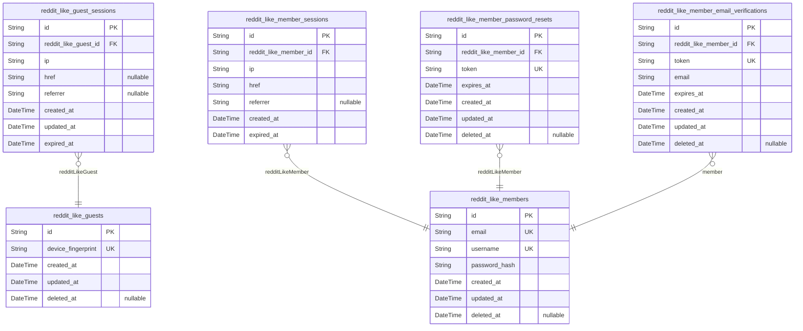
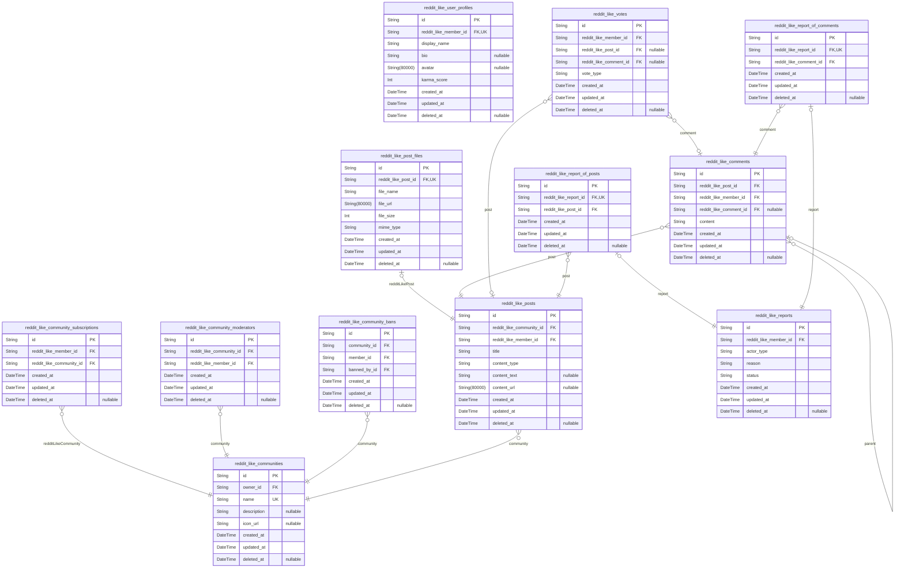

# Prisma Markdown

> Generated by [`prisma-markdown`](https://github.com/samchon/prisma-markdown)

- [reddit_like_auth](#reddit_like_auth)
- [reddit_like](#reddit_like)

## reddit_like_auth

### `reddit_like_guests`

Temporary guest accounts identified by device for anonymous browsing of
public content.

Guest accounts enable unauthenticated users to browse communities, posts,
and comments without registration. Each device/browser session creates a
unique guest identity tracked by device fingerprint.

**Identity Management**
Guest accounts are temporary and device-based. When a user registers,
their guest account can be merged or abandoned. Soft deletion via {@link
reddit_like_guests.deleted_at} allows cleanup of inactive guests.

**Relationship to Sessions**
Each guest account can have multiple [reddit_like_guest_sessions](#reddit_like_guest_sessions)
over time. The session table references this table via foreign key,
following the child→parent relationship pattern.

Properties as follows:

- `id`: Primary key uniquely identifying each guest account.
- `device_fingerprint`
  > Unique device/browser fingerprint identifying the guest.
  >
  > Generated from device characteristics (user agent, screen resolution,
  > timezone, etc.) to persist guest identity across sessions. Used to link
  > multiple guest sessions to the same guest account.
- `created_at`: Timestamp when the guest account was created.
- `updated_at`: Timestamp when the guest account was last updated.
- `deleted_at`: Timestamp when the guest account was soft deleted. Null for active guests.

### `reddit_like_guest_sessions`

Temporary session tokens for guest access to public feeds and communities.

Session records track authenticated guest sessions for anonymous
browsing. Each session is tied to a temporary guest account and stores
connection metadata for audit and security purposes.

**Session Lifecycle**

Sessions are created upon guest login and expire after a configured
duration. The `expired_at` field enforces automatic session invalidation
for security.

**Connection Tracking**

Stores client IP address, current page URL, and referrer information for
analytics and security monitoring.

Properties as follows:

- `id`: Primary key for the session record.
- `reddit_like_guest_id`
  > References the guest account this session belongs to.
  >
  > Each session is associated with exactly one [reddit_like_guests](#reddit_like_guests)
  > account. Multiple sessions may exist for the same guest across different
  > devices or browsers.
- `ip`
  > Client IP address that created the session.
  >
  > Used for security monitoring and session validation.
- `href`
  > Current page URL when session was created.
  >
  > Tracks the landing page for analytics purposes.
- `referrer`
  > Referring page URL.
  >
  > Captures the source page that led to session creation.
- `created_at`
  > Session creation timestamp.
  >
  > Records when the session was initially established.
- `updated_at`
  > Last update timestamp.
  >
  > Updated on session activity or refresh.
- `expired_at`
  > Session expiration timestamp.
  >
  > Sessions are automatically invalidated after this time for security.

### `reddit_like_members`

Registered member accounts with email/password authentication and profile
information.

This table stores the core authentication credentials and identity for
authenticated users. Profile information including display name, bio, and
avatar are stored in [reddit_like_user_profiles](#reddit_like_user_profiles). Session tokens
and password reset tokens are managed in separate tables ({@link
reddit_like_member_sessions}, {@link
reddit_like_member_password_resets}).

**Authentication**: Members log in using their email address and
password. The email serves as the primary login credential, while the
username provides public identification.

**Account Lifecycle**: Accounts support soft deletion via the deleted_at
field, allowing for account recovery within retention policies. When an
account is deleted, all associated content (posts, comments) is also
removed per cascade deletion policies.

Properties as follows:

- `id`: Primary key for the member account.
- `email`
  > Email address used for login and account recovery.
  >
  > Must be unique across all member accounts. Used as the primary credential
  > for authentication during login flows. Also used for password reset and
  > email verification communications.
- `username`
  > Unique username chosen by the member during registration.
  >
  > Used for public identification on posts, comments, and profile pages.
  > Must be unique across all member accounts. Forms part of the member's
  > public identity and profile URL.
- `password_hash`
  > Bcrypt hash of the member's password.
  >
  > Stored as a secure hash to protect credentials. Never stored or
  > transmitted in plain text. Updated when the member changes their
  > password.
- `created_at`
  > Timestamp when the member account was created.
  >
  > Set automatically during account registration. Used for account age
  > calculations and audit trails.
- `updated_at`
  > Timestamp when the member account was last updated.
  >
  > Updated whenever any field in this record changes. Used for tracking
  > account modifications and sync purposes.
- `deleted_at`
  > Timestamp when the member account was soft-deleted.
  >
  > When set, the account is considered deleted but data is retained for
  > recovery purposes per retention policies. NULL for active accounts.

### `reddit_like_member_sessions`

JWT session tokens with access and refresh support for member authentication

This table tracks authenticated member sessions as an append-only audit
trail. Each session belongs to exactly one [reddit_like_members](#reddit_like_members)
member and contains metadata about the login request including client IP,
referrer, and href for security tracking.

Session Lifecycle

Sessions are created upon successful login and expire based on the
expired_at timestamp. The session management system handles token
validation, refresh, and cleanup of expired sessions. Members can view
and terminate their active sessions through account security features.

Security Considerations

The ip, href, and referrer fields enable detection of suspicious session
activity by tracking the origin of authentication requests. Sessions are
managed exclusively through authentication flows and should not be
directly manipulated by application business logic.

Properties as follows:

- `id`: Primary key for the session record.
- `reddit_like_member_id`
  > References the member account that owns this session.
  >
  > This foreign key establishes the one-to-many relationship between {@link
  > reddit_like_members} and their sessions. Each session belongs to exactly
  > one member, and a member can have multiple active sessions across
  > different devices or browsers.
  >
  > The relationship is mandatory - every session must be associated with a
  > valid member account.
- `ip`
  > Client IP address from the login request.
  >
  > Captures the IPv4 or IPv6 address of the client that initiated the
  > authentication. This field supports security auditing and detection of
  > suspicious login patterns from unusual locations.
- `href`
  > Current page URL at the time of login.
  >
  > Records the full URL of the page where the member initiated the login
  > process. This provides context for the authentication event and supports
  > user experience features like redirect after login.
- `referrer`
  > Referrer header from the login request.
  >
  > Captures the HTTP referrer indicating the page that linked to the login
  > page. This field is nullable as some clients may not send referrer
  > information for privacy or technical reasons.
- `created_at`
  > Timestamp when the session was created.
  >
  > Records the exact moment the session was established during successful
  > authentication. Used for session ordering, expiration calculations, and
  > audit trail purposes.
- `expired_at`
  > Timestamp when the session expires.
  >
  > Defines the absolute expiration time for this session. Sessions are
  > considered invalid after this timestamp and must be refreshed or
  > re-authenticated. This field is mandatory for security to ensure sessions
  > have a defined lifetime.

### `reddit_like_member_password_resets`

Password reset tokens with expiration for member account recovery.

This table stores one-time use tokens that allow members to reset their
passwords securely. Each token is associated with a specific member
account and has an expiration time for security purposes.

**Token Lifecycle**

Tokens are generated when a member requests password reset via email. The
token is included in a reset link sent to the member's registered email
address. Once used or expired, the token becomes invalid.

**Security Considerations**

Tokens are cryptographically random strings that cannot be guessed. The
expiration timestamp limits the window of opportunity for token misuse.
After successful password reset or expiration, tokens are soft-deleted
for audit purposes.

Properties as follows:

- `id`: Primary key for the password reset record.
- `reddit_like_member_id`
  > Reference to the member account requesting password reset.
  >
  > This foreign key establishes the relationship to the {@link
  > reddit_like_members} table, linking each reset token to a specific user
  > account.
- `token`
  > Unique password reset token string.
  >
  > This token is generated when a member requests a password reset and must
  > be included in the reset URL. Tokens are single-use and expire after a
  > configured time period.
- `expires_at`
  > Token expiration timestamp.
  >
  > Tokens become invalid after this time and cannot be used for password
  > reset. This is a security measure to limit the window of opportunity for
  > token misuse.
- `created_at`: Record creation timestamp.
- `updated_at`: Record last update timestamp.
- `deleted_at`: Soft delete timestamp for record archival.

### `reddit_like_member_email_verifications`

Email verification tokens for member account registration.

This table stores temporary verification tokens sent to users during
account registration. Each token is valid for a limited time and must be
verified before the account becomes fully active.

Token Lifecycle

Tokens are created when a user registers and must be verified within the
expiration window. Once verified, the token is soft-deleted. Expired
tokens are also cleaned up.

Security Considerations

Tokens are single-use and expire automatically. The token field is unique
to prevent collisions and ensure each verification attempt is tracked
separately.

Properties as follows:

- `id`: Primary key for the email verification token record.
- `reddit_like_member_id`
  > Reference to the member account being verified.
  >
  > This foreign key links the verification token to the {@link
  > reddit_like_members} table. The member account exists but is not fully
  > activated until email verification is completed.
- `token`
  > Unique verification token string.
  >
  > This is the actual token value sent to the user's email address. It must
  > be unique across all verification records to prevent collisions and
  > ensure security.
- `email`
  > Email address being verified.
  >
  > Stores the email address that this token is intended to verify. This
  > allows verification even if the member record is updated before
  > verification completes.
- `expires_at`
  > Token expiration timestamp.
  >
  > The datetime when this verification token becomes invalid. Tokens should
  > be validated against this field to reject expired verification attempts.
- `created_at`
  > Record creation timestamp.
  >
  > When this verification token was generated and sent to the user.
- `updated_at`
  > Record last update timestamp.
  >
  > Tracks when this record was last modified, such as when verification
  > status changes.
- `deleted_at`
  > Soft delete timestamp.
  >
  > When this verification token was invalidated (either through successful
  > verification or manual cancellation).

## reddit_like

### `reddit_like_user_profiles`

User profile information including display name, bio, avatar, and karma
score.

This table stores the public-facing profile data for each registered
member. The profile is intrinsically linked to the member account and
cannot exist independently.

**Profile Fields**
- Display name: The public name shown on posts and comments
- Bio: Optional biography text describing the user
- Avatar: URI reference to the user's profile image
- Karma score: Cumulative score from upvotes and downvotes on posts and
comments

**Relationships**
- Each profile belongs to exactly one [reddit_like_members](#reddit_like_members) account
(1:1 relationship)
- Posts and comments reference the member account, not the profile directly

**Lifecycle**
- Profile is created automatically when a member account is registered
- Profile is soft-deleted when the member account is deleted
- Karma score updates automatically when votes are cast on user's content

Properties as follows:

- `id`: Primary key for the user profile record.
- `reddit_like_member_id`
  > Reference to the member account this profile belongs to.
  >
  > Each profile is linked to exactly one [reddit_like_members](#reddit_like_members) account
  > in a 1:1 relationship. The profile cannot exist without its associated
  > member account.
  >
  > When the member account is deleted, the profile is also soft-deleted.
- `display_name`
  > Public display name shown on posts, comments, and profile pages.
  >
  > This is the name that appears alongside the user's content throughout the
  > platform. Users can change their display name at any time.
- `bio`
  > Optional biography text describing the user.
  >
  > Users can write a short bio to introduce themselves to the community.
  > This field is optional and can be empty.
- `avatar`
  > URI reference to the user's profile avatar image.
  >
  > Points to the uploaded image file stored in the file storage system. Can
  > be null if the user has not uploaded an avatar.
- `karma_score`
  > Cumulative karma score from votes on user's posts and comments.
  >
  > Increases by 1 for each upvote received, decreases by 1 for each
  > downvote. Can be positive, negative, or zero. Updated automatically when
  > votes are cast or removed.
- `created_at`
  > Timestamp when the profile was created.
  >
  > Automatically set when the member account is registered.
- `updated_at`
  > Timestamp when the profile was last updated.
  >
  > Updated whenever any profile field is modified.
- `deleted_at`
  > Timestamp when the profile was soft-deleted.
  >
  > Set when the associated member account is deleted. Allows for potential
  > recovery within retention period.

### `reddit_like_communities`

Communities with unique name, description, icon, and owner reference

Communities serve as the primary organizational unit for content
aggregation and user interaction. Each community has a unique name that
identifies it across the platform, a description explaining its purpose,
and an optional icon image for visual identification.

The community owner is the member who created it and holds the highest
authority within that community. The owner can manage moderators,
configure community settings, and has ultimate control over community
governance.

Communities support soft deletion through the deleted_at timestamp,
allowing for recovery while preventing active access. The unique name
constraint ensures no two communities can have the same identifier.

Related entities:
- [reddit_like_community_subscriptions](#reddit_like_community_subscriptions) tracks which members
subscribe to this community
- [reddit_like_community_moderators](#reddit_like_community_moderators) tracks which members have
moderation authority
- [reddit_like_community_bans](#reddit_like_community_bans) tracks which members are banned from
this community
- [reddit_like_posts](#reddit_like_posts) contains posts created within this community

Properties as follows:

- `id`: Primary key identifier for the community.
- `owner_id`
  > Reference to the member who owns this community.
  >
  > The owner is the member who created the community and holds the highest
  > authority. Only the owner can remove moderators and has ultimate control
  > over community governance.
- `name`
  > Unique community name used for identification and URL.
  >
  > This field must be unique across all communities and is used in community
  > URLs and search results. It serves as the primary human-readable
  > identifier for the community.
- `description`
  > Text description of the community's purpose and focus.
  >
  > Provides context about what the community is about, its rules, and what
  > type of content is appropriate. This helps potential subscribers
  > understand the community before joining.
- `icon_url`
  > URL or path to the community icon image.
  >
  > This is optional and may be null if no icon has been uploaded. Stores the
  > location of the icon image for display purposes.
- `created_at`
  > Timestamp when the community was created.
  >
  > Records the exact moment when the community was initially created by the
  > owner.
- `updated_at`
  > Timestamp when the community was last updated.
  >
  > Updated whenever any mutable field (name, description, icon) is modified.
- `deleted_at`
  > Timestamp when the community was soft-deleted.
  >
  > When present, indicates the community has been deleted but retained for
  > potential recovery. Active queries should filter out communities with
  > non-null deleted_at values.

### `reddit_like_community_subscriptions`

User subscriptions to communities for feed access and posting permissions.

This table tracks which members are subscribed to which communities,
enabling feed aggregation and posting permissions. A subscription is
required before a member can create posts in a community.

Relationships:
- [reddit_like_members](#reddit_like_members): The member who subscribes
- [reddit_like_communities](#reddit_like_communities): The community being subscribed to

Properties as follows:

- `id`: Primary key for the subscription record.
- `reddit_like_member_id`
  > References the member who subscribes to the community.
  >
  > This foreign key establishes the relationship to {@link
  > reddit_like_members}. Each subscription record belongs to exactly one
  > member.
- `reddit_like_community_id`
  > References the community that the member subscribes to.
  >
  > This foreign key establishes the relationship to {@link
  > reddit_like_communities}. Each subscription record references exactly one
  > community.
- `created_at`
  > Timestamp when the subscription was created.
  >
  > Records the exact moment when a member subscribed to a community.
- `updated_at`
  > Timestamp when the subscription record was last updated.
  >
  > Used for tracking subscription modifications and cache invalidation.
- `deleted_at`
  > Timestamp when the subscription was soft-deleted.
  >
  > When null, the subscription is active. When set, the subscription is
  > inactive (member unsubscribed) but the record is retained for audit
  > purposes.

### `reddit_like_community_moderators`

Moderators assigned to communities with moderation authority.

This table tracks which members have moderator privileges in specific
communities. Moderators can delete posts and comments, ban users, and
manage community content. The community owner has the highest authority
and can add or remove moderators.

**Relationships**:
- Each record links one [reddit_like_communities](#reddit_like_communities) to one {@link
reddit_like_members}
- A community can have multiple moderators
- A member can be a moderator in multiple communities

Properties as follows:

- `id`: Primary key for the moderator assignment record.
- `reddit_like_community_id`
  > Reference to the community where this member serves as moderator.
  >
  > This foreign key establishes the relationship to {@link
  > reddit_like_communities}.
  >
  > The community owner has the highest authority and can add or remove
  > moderators from this community.
- `reddit_like_member_id`
  > Reference to the member who has moderator privileges in this community.
  >
  > This foreign key establishes the relationship to {@link
  > reddit_like_members}.
  >
  > Members can be moderators in multiple communities simultaneously.
- `created_at`: Timestamp when this moderator assignment was created.
- `updated_at`: Timestamp when this moderator assignment was last updated.
- `deleted_at`
  > Timestamp when this moderator assignment was soft-deleted. Null if the
  > assignment is active.

### `reddit_like_community_bans`

Records users banned from specific communities, restricting their posting
and commenting permissions while allowing content viewing.

This table enforces community moderation by tracking which members are
banned from which communities. Bans are issued by community moderators
and can be lifted at their discretion.

## Relationships

- [reddit_like_communities](#reddit_like_communities) - The community where the ban applies
- [reddit_like_members](#reddit_like_members) (member_id) - The user who is banned
- [reddit_like_members](#reddit_like_members) (banned_by_id) - The moderator who issued
the ban

## Business Rules

- Banned users cannot create posts or comments in the banned community
- Banned users can still view community content
- Only community moderators and owners can create or remove bans
- A user can be banned from multiple communities independently

Properties as follows:

- `id`: Unique identifier for each community ban record.
- `community_id`
  > Reference to the community where this ban applies.
  >
  > This foreign key establishes the relationship to {@link
  > reddit_like_communities}. Only moderators and owners of this community
  > can create or remove bans.
  >
  > ## Business Context
  >
  > - Determines which community the ban restricts access to
  > - Used to check if a user is banned when attempting to post or comment
  > - Enables moderators to view all bans in their community
- `member_id`
  > Reference to the member who is banned from this community.
  >
  > This foreign key establishes the relationship to {@link
  > reddit_like_members}. The banned user loses posting and commenting
  > privileges in this community but retains viewing access.
  >
  > ## Business Context
  >
  > - Identifies which user is restricted
  > - Used to check ban status before allowing content creation
  > - Enables viewing all communities where a user is banned
- `banned_by_id`
  > Reference to the member who issued this ban.
  >
  > This foreign key establishes the relationship to {@link
  > reddit_like_members}. The banning member must be a moderator or owner of
  > the target community.
  >
  > ## Business Context
  >
  > - Tracks who is responsible for the ban decision
  > - Enables audit trail for moderation actions
  > - Used to notify or contact the moderator about ban-related issues
- `created_at`
  > Timestamp when this ban was created.
  >
  > Records the exact moment when the moderator issued the ban against the
  > member in this community.
- `updated_at`
  > Timestamp when this ban record was last updated.
  >
  > Updated when ban information changes, such as when the ban is lifted
  > (soft delete via deleted_at).
- `deleted_at`
  > Timestamp when this ban was lifted (soft delete).
  >
  > When null, the ban is active and the member cannot post or comment in
  > this community. When set, the ban has been removed and the member regains
  > full privileges.

### `reddit_like_posts`

Posts with title, content type, community reference, and author.

Posts are the primary content unit in communities. Each post belongs to
exactly one community and is created by a member. Posts support three
content types: text posts with body content, link posts with URLs, and
image posts with file attachments managed through the
reddit_like_post_files child table.

**Content Type Handling**

The content_type field determines which content field is populated: text
posts use content_text, link posts use content_url, and image posts
reference attached files through the reddit_like_post_files table. Only
the appropriate content field should be non-null based on content_type.

**Lifecycle and Moderation**

Posts can be soft-deleted by their author or by community moderators.
Moderators can delete any post in their community regardless of author.
When a post is deleted, associated votes and comments are also removed
per cascade deletion policies.

**Scoring and Engagement**

Vote scores are computed from the reddit_like_votes table (upvotes minus
downvotes). Comment counts are derived from the reddit_like_comments
table. These are not stored as denormalized fields to maintain data
integrity.

Properties as follows:

- `id`: Primary key uniquely identifying each post.
- `reddit_like_community_id`
  > References the community where this post is published.
  >
  > Each post belongs to exactly one community. Users must be subscribed to
  > the community to create posts there (enforced at application layer).
  > Community owners and moderators can delete posts in their community.
- `reddit_like_member_id`
  > References the member who created this post.
  >
  > The post author owns the content and can edit or delete their own posts.
  > Author information is used for profile pages showing all posts by a
  > member.
- `title`
  > Post title displayed in feeds and post detail views.
  >
  > Required for all posts. Used for full-text search with GIN index.
- `content_type`
  > Type of post content: text, link, or image.
  >
  > Determines which content field is populated: text posts use content_text,
  > link posts use content_url, and image posts reference files through
  > reddit_like_post_files. Valid values are 'text', 'link', 'image'.
- `content_text`
  > Text content for text-type posts.
  >
  > Populated only when content_type is 'text'. Null for link and image posts.
- `content_url`
  > URL for link-type posts.
  >
  > Populated only when content_type is 'link'. Null for text and image posts.
- `created_at`: Timestamp when the post was created.
- `updated_at`
  > Timestamp when the post was last updated. Updated when post title or
  > content is modified.
- `deleted_at`
  > Timestamp when the post was soft-deleted. Null for active posts. Used to
  > hide deleted posts from feeds while preserving data for audit purposes.

### `reddit_like_post_files`

Image files attached to image posts with metadata for storage and retrieval.

This table stores file information for image-type posts, enabling users
to upload and display images alongside their post content. Each image
post can have at most one attached file.

Relationships:
- [reddit_like_posts](#reddit_like_posts): One-to-one relationship, each file belongs
to exactly one post

Properties as follows:

- `id`: Primary key for unique identification of each file record.
- `reddit_like_post_id`
  > Reference to the parent post that this file is attached to.
  >
  > Each image post can have at most one file attachment, making this a
  > one-to-one relationship. The post must be of type 'image' to have an
  > associated file.
  >
  > [reddit_like_posts](#reddit_like_posts)
- `file_name`
  > Original filename of the uploaded image as provided by the user.
  >
  > This preserves the user's original filename for display purposes and
  > download headers.
- `file_url`
  > Public URL where the uploaded image file can be accessed.
  >
  > This URI points to the file storage location (e.g., S3, CDN) where the
  > actual image binary is stored.
- `file_size`
  > Size of the uploaded file in bytes.
  >
  > Used for validation against storage limits and display to users.
- `mime_type`
  > MIME type of the uploaded file (e.g., 'image/jpeg', 'image/png').
  >
  > Used for content-type headers and validation to ensure only image files
  > are stored.
- `created_at`: Timestamp when the file was uploaded and record created.
- `updated_at`: Timestamp when the file record was last updated.
- `deleted_at`
  > Timestamp when the file was soft-deleted. Null if still active.
  >
  > Used for soft delete to allow recovery and maintain referential integrity
  > during deletion workflows.

### `reddit_like_comments`

Threaded comments on posts with parent-child nesting support.

Comments are user-generated content that can be nested infinitely through
parent-child relationships. Each comment belongs to a post and is
authored by a member. Comments support voting and reporting through
separate related tables.

**Nesting Structure**

Top-level comments have a null parent reference. Replies reference their
parent comment through the parent_id foreign key, enabling unlimited
nesting depth for discussion threads.

**Lifecycle**

Comments can be soft-deleted via the deleted_at timestamp. Moderators and
authors can delete comments, which marks them as deleted without removing
the record from the database.

Properties as follows:

- `id`: Primary key uniquely identifying each comment.
- `reddit_like_post_id`
  > References the post this comment belongs to.
  >
  > Every comment must be associated with exactly one post. This foreign key
  > ensures referential integrity and enables efficient querying of all
  > comments for a given post.
- `reddit_like_member_id`
  > References the member who authored this comment.
  >
  > Tracks comment ownership for permission checks, profile pages, and karma
  > calculations. The author can edit or delete their own comments.
- `reddit_like_comment_id`
  > References the parent comment for nested replies.
  >
  > Null for top-level comments. When set, this comment is a reply to the
  > referenced parent comment, enabling unlimited nesting depth for threaded
  > discussions.
- `content`
  > The text content of the comment.
  >
  > Contains the actual message text written by the member. Supports
  > full-text search via GIN index for finding comments by keyword.
- `created_at`
  > Timestamp when the comment was initially created.
  >
  > Records the exact time the comment was first posted. Used for sorting
  > comments chronologically and displaying relative timestamps to users.
- `updated_at`
  > Timestamp when the comment was last modified.
  >
  > Updated whenever the comment content is edited. Allows users to see when
  > comments were last changed.
- `deleted_at`
  > Timestamp when the comment was soft-deleted.
  >
  > Null if the comment is active. When set, the comment is hidden from users
  > but retained in the database for audit purposes. The author or moderators
  > can delete comments.

### `reddit_like_votes`

Votes cast by users on posts or comments with up/down types.

This table tracks user voting behavior on content, enabling vote score
calculations and preventing duplicate votes. Each vote is uniquely
identified and supports vote changes and removals through updates and
soft deletes.

**Vote Target Polymorphism**

Votes can target either a post or a comment, but not both simultaneously.
The table uses nullable foreign keys to both target types with a
composite unique constraint ensuring each user can only vote once per
content item.

**Vote Lifecycle**

Users can cast an initial vote, change their vote type (upvote to
downvote or vice versa), or remove their vote entirely by soft deleting
the record. Vote score calculations sum upvotes minus downvotes for each
content item.

**Karma Impact**

When a vote is cast on a user's content, the content author's karma score
adjusts accordingly. Upvotes increase karma by 1, downvotes decrease
karma by 1, and vote removals reverse the previous adjustment.

Properties as follows:

- `id`: Primary key uniquely identifying each vote record.
- `reddit_like_member_id`
  > Reference to the member who cast this vote.
  >
  > This foreign key establishes the relationship to the voting user's
  > account. Each vote is attributed to exactly one member for karma
  > calculations and vote history queries.
  >
  > [reddit_like_members](#reddit_like_members)
- `reddit_like_post_id`
  > Reference to the post being voted on.
  >
  > This foreign key is nullable and used when the vote targets a post. When
  > set, reddit_like_comment_id must be null. The composite unique constraint
  > ensures each member can only vote once per post.
  >
  > [reddit_like_posts](#reddit_like_posts)
- `reddit_like_comment_id`
  > Reference to the comment being voted on.
  >
  > This foreign key is nullable and used when the vote targets a comment.
  > When set, reddit_like_post_id must be null. The composite unique
  > constraint ensures each member can only vote once per comment.
  >
  > [reddit_like_comments](#reddit_like_comments)
- `vote_type`
  > Type of vote cast by the member.
  >
  > Allowed values are "upvote" and "downvote". This field determines how the
  > vote affects the content score and the author's karma. Users can change
  > this value to switch between upvote and downvote.
  >
  > **Value Constraints**
  >
  > - "upvote": Increases content score by 1 and author karma by 1
  > - "downvote": Decreases content score by 1 and author karma by 1
- `created_at`
  > Timestamp when this vote was initially cast.
  >
  > Records the exact moment a member first voted on the content. Used for
  > vote history tracking and chronological sorting of votes.
- `updated_at`
  > Timestamp when this vote was last modified.
  >
  > Updated whenever the vote_type changes (e.g., switching from upvote to
  > downvote). Used for tracking vote modification history.
- `deleted_at`
  > Timestamp when this vote was soft deleted.
  >
  > When a member removes their vote, this field is set instead of
  > permanently deleting the record. This enables audit trails and potential
  > vote recovery. A non-null value indicates the vote has been removed.

### `reddit_like_reports`

Content reports submitted by users for moderator review

Reports allow users to flag posts or comments that violate community
guidelines. Moderators review reports and can approve (delete content) or
dismiss (keep content) them.

## Relationship to Reported Content

Reports use a polymorphic ownership pattern to reference either posts or
comments. The main table stores common fields with an `actor_type`
discriminator, while subtype tables (`{@link
reddit_like_report_of_posts}`, [reddit_like_report_of_comments](#reddit_like_report_of_comments))
store the specific content reference with 1:1 constraints.

## Status Workflow

Reports progress through three states: pending (awaiting review),
approved (content deleted), or dismissed (content kept, report removed
from active list).

## Moderation Access

Moderators can view all reports for their communities. Each report
displays the reported content, the reporter, and the reason provided.

Properties as follows:

- `id`: Primary key uniquely identifying this report.
- `reddit_like_member_id`
  > The member who submitted this report.
  >
  > This foreign key establishes the relationship to the {@link
  > reddit_like_members} table, identifying which authenticated user flagged
  > the content for review.
- `actor_type`
  > Discriminator indicating whether the reported content is a post or
  > comment.
  >
  > Allowed values:
  > - "post": Report targets a [reddit_like_posts](#reddit_like_posts) entry
  > - "comment": Report targets a [reddit_like_comments](#reddit_like_comments) entry
  >
  > This field works with the polymorphic ownership pattern, determining
  > which subtype table contains the actual content reference.
- `reason`
  > The reason provided by the reporter explaining why the content should be
  > reviewed.
  >
  > This text field contains the reporter's description of the violation,
  > such as spam, harassment, hate speech, or other guideline breaches.
  > Moderators use this information when evaluating the report.
- `status`
  > Current review status of this report.
  >
  > Allowed values:
  > - "pending": Report is awaiting moderator review
  > - "approved": Moderator approved the report and deleted the content
  > - "dismissed": Moderator dismissed the report and kept the content
  >
  > When a report is dismissed, it is removed from the active report list
  > visible to moderators.
- `created_at`
  > Timestamp when this report was submitted.
  >
  > Records the exact moment the member created this report for moderation
  > review.
- `updated_at`
  > Timestamp when this report was last modified.
  >
  > Updated when the report status changes (e.g., from pending to approved or
  > dismissed).
- `deleted_at`
  > Timestamp when this report was soft-deleted.
  >
  > Used for audit trail and potential recovery. Null while the report is
  > active.

### `reddit_like_report_of_posts`

1:1 subtype table linking reports to posts in the polymorphic ownership
pattern.

This table represents the specific relationship when a report targets a
post. Each report can only target either a post or a comment, never both.
This table enforces that constraint through a unique foreign key on the
report reference.

Relationships

- [reddit_like_reports](#reddit_like_reports): Each report targeting a post has exactly
one entry here (1:1)
- [reddit_like_posts](#reddit_like_posts): References the specific post being reported
(N:1)

Properties as follows:

- `id`: Primary key for this report-post linkage record.
- `reddit_like_report_id`
  > References the report that targets a post.
  >
  > This is a unique foreign key ensuring each report can only appear in this
  > table once, enforcing the 1:1 relationship with {@link
  > reddit_like_reports}. A report must exist in either this table or {@link
  > reddit_like_report_of_comments}, never both.
- `reddit_like_post_id`
  > References the post being reported.
  >
  > This foreign key points to [reddit_like_posts](#reddit_like_posts) and identifies which
  > specific post the report is about.
- `created_at`
  > Timestamp when this report-post linkage was created.
  >
  > Set automatically when the report is submitted and targets a post.
- `updated_at`
  > Timestamp when this record was last updated.
  >
  > Updated automatically on any modification to maintain audit trail.
- `deleted_at`
  > Timestamp when this record was soft-deleted.
  >
  > Null while active, set to current timestamp when deleted. Allows recovery
  > and maintains referential integrity.

### `reddit_like_report_of_comments`

1:1 subtype table linking reports to comments for polymorphic ownership
pattern.

Each report targeting a comment has exactly one entry here, establishing
the relationship between [reddit_like_reports](#reddit_like_reports) and {@link
reddit_like_comments}. The unique constraint on the report reference
ensures a report can only target one comment.

**Relationship Pattern**

This table implements the polymorphic ownership pattern where reports can
target either posts or comments. The main [reddit_like_reports](#reddit_like_reports)
table stores common fields (reporter, reason, status) and uses an
actor_type discriminator. This subsidiary table then links to the
specific comment being reported.

**1:1 Constraint**

The unique index on reddit_like_report_id enforces that each report can
only be associated with one comment, preventing duplicate or ambiguous
report targets.

Properties as follows:

- `id`: Primary key for this report-comment linkage record.
- `reddit_like_report_id`
  > Reference to the parent report entity that targets this comment.
  >
  > This foreign key establishes the relationship to {@link
  > reddit_like_reports}, which contains the common report data including
  > reporter, reason, and status. The unique constraint on this field ensures
  > each report can only target one comment (1:1 relationship).
  >
  > **Relationship Semantics**
  >
  > - Each report targeting a comment has exactly one entry in this table
  > - Reports targeting posts are stored in {@link
  > reddit_like_report_of_posts} instead
  > - Cascade delete: when a report is deleted, this linkage record is also
  > removed
- `reddit_like_comment_id`
  > Reference to the comment being reported.
  >
  > This foreign key points to the [reddit_like_comments](#reddit_like_comments) table that
  > contains the reported content. Moderators review this comment when
  > processing the associated report.
  >
  > **Relationship Semantics**
  >
  > - Identifies the specific comment that was reported
  > - The comment author can be notified about the report
  > - Moderators use this to access the reported content for review
- `created_at`
  > Timestamp when this report-comment linkage was created.
  >
  > Records when the report was first submitted targeting this comment. Used
  > for audit trails and sorting reports by submission time.
- `updated_at`
  > Timestamp when this record was last updated.
  >
  > Tracks modifications to this linkage record for audit purposes.
- `deleted_at`
  > Timestamp when this record was soft-deleted.
  >
  > Used for soft delete functionality, allowing recovery of mistakenly
  > deleted report linkages. Null if the record is active.
