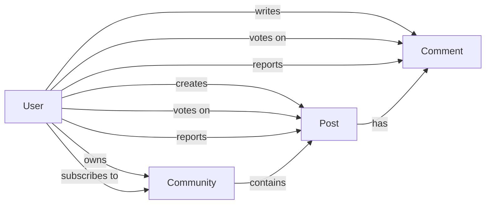
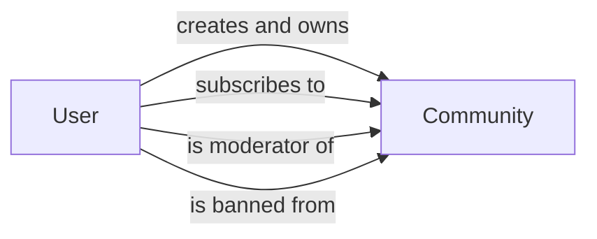
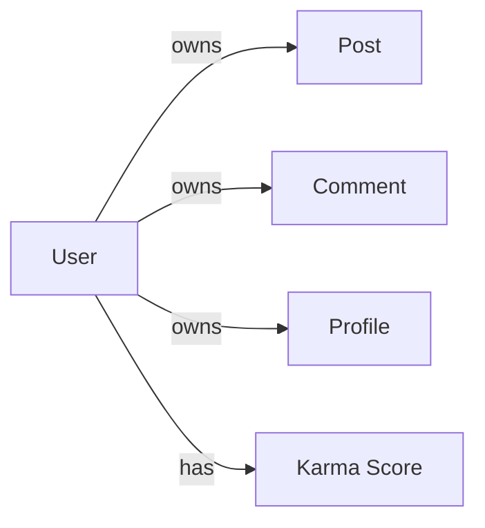
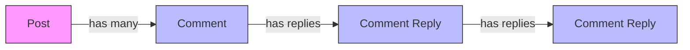
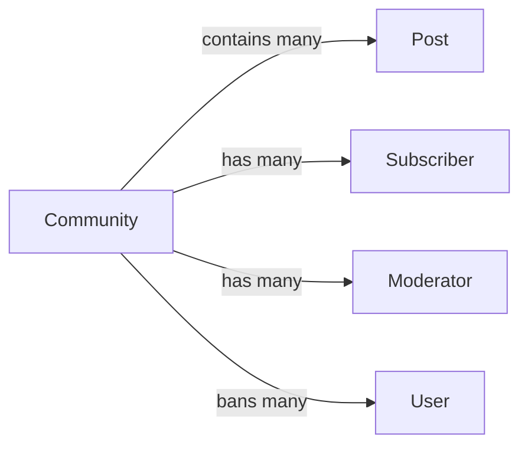
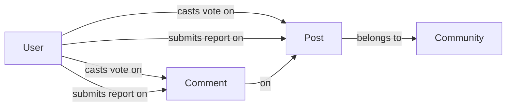

**redditLike — Business concepts, relationships, and states from user perspective**

Business concepts, relationships, and states from user perspective

# Domain Concepts

Describe what each concept means in the business domain and its key attributes.

## User Concept

A User represents an individual person who registers and participates on the platform. Each user has a unique username that identifies them publicly across all their activities. Users authenticate with email and password credentials to access their accounts. A user's profile contains a display name for personalization, a bio text for self-description, and an avatar image for visual identity. Every user maintains a karma score that reflects community engagement through upvotes and downvotes on their content. The user account serves as the foundation for ownership relationships, as users create posts, comments, communities, and reports. When a user deletes their account, all their associated content is also removed from the platform.

### User Registration and Identity

Users register on the platform by providing an email address and choosing a password. During registration, users must select a unique username that will serve as their public identifier across the platform. The username must be unique and cannot be duplicated by another user. Users authenticate to their accounts using their email address and password credentials. Users can change their password after registration.

### User Profile Information

Each user has a profile that displays their identity to other users. The profile includes a display name that can differ from the username and is used for personalization. Users can write a bio text to describe themselves or provide information about their interests. Users can upload an avatar image that represents them visually on the platform. Users can edit their own display name, bio text, and avatar image at any time. Other users can view any user's profile to see this information.

### Karma Score Tracking

Every user has a karma score represented as a single number. Karma reflects community engagement and is calculated from votes received on the user's content. When another user upvotes a post or comment created by this user, the karma score increases by 1. When another user downvotes a post or comment created by this user, the karma score decreases by 1. If a user removes their vote on content, the karma score adjusts accordingly to reflect the change. A user's karma score can be positive, zero, or negative.

### Account Deletion and Content Removal

Users can delete their own account from the platform. When a user deletes their account, all content created by that user is also permanently deleted from the platform. This includes all posts written by the user and all comments made by the user.

### User Ownership and Community Participation

Users own all content they create on the platform. A user owns the posts they write and can edit or delete their own posts. A user owns the comments they write and can edit or delete their own comments. Users participate in communities by subscribing to them. Users can create communities and become the owner of those communities. A user's participation identity is established through their username, which appears alongside all their posts, comments, and votes across the platform.

## Community Concept

A Community represents a topic-based gathering space where users share content around common interests. Each community has a unique name that distinguishes it from all others on the platform. Communities include a description text that explains their purpose and focus area. An icon image provides visual branding for the community. The subscriber count reflects how many users have joined the community. The creator of a community automatically becomes its owner with highest authority. Communities serve as containers for posts and comments, organizing content by subject matter. Users must subscribe to a community before they can create posts within it.

### Community Definition and Attributes

A community is a topic-based gathering space where users share content around common interests. Each community has a unique name that distinguishes it from all others on the platform, serving as its primary identifier. Communities include a description text that explains their purpose and focus area to help users understand what the community is about. An icon image provides visual branding for the community, making it recognizable in lists and feeds. The subscriber count metric reflects how many users have joined the community, displayed on the community page to indicate its size and activity level.

### Community Ownership and Authority

The user who creates a community automatically becomes its owner, establishing initial ownership and highest authority within that community. The owner has the ability to add moderators to help manage the community. The owner can also remove moderators they have added. This ownership structure ensures clear accountability and governance for each community on the platform. Community creation ownership is permanent and cannot be transferred to another user.

### Community Membership and Content Access

Users can browse all communities through a platform-wide list view. Users can search for communities by name to find specific communities of interest. Each community page displays the subscriber count so users can see how many members have joined. To create posts within a community, users must first subscribe to that community. This subscription requirement ensures that only interested users can contribute content to a community. Subscribing does not restrict users from viewing community content; non-subscribers can still browse posts and comments in any community.

## Post Concept

A Post represents a primary piece of content shared within a community to start discussions. Every post requires a title that summarizes its subject matter. Posts come in three distinct types: text posts with written content, link posts with external URLs, or image posts with uploaded pictures. Each post belongs to one specific community where it is displayed in feeds. Posts have an author who created them and owns the content. Posts accumulate vote scores through community upvotes and downvotes. Posts display comment counts showing discussion activity. Posts include timestamps indicating when they were created for sorting and chronological reference.

### Post as Primary Content Unit

A Post serves as the primary content unit within the platform, representing the main vehicle for users to share information and initiate discussions. Each post belongs to exactly one community, which serves as its container and determines where it appears in feeds. Posts are the fundamental building blocks that populate community feeds and drive platform engagement.

### Post Title and Content Types

Every post requires a title that summarizes its subject matter. The title is mandatory and cannot be left empty. Posts are classified into three distinct types determined at creation time: text posts, link posts, and image posts. Text posts contain written content that can be read directly on the platform. Link posts contain a URL that directs users to external resources. Image posts include uploaded picture files. Each post supports only one content type, and the type determines what additional content is required beyond the title.

### Post Metadata and Scoring

Posts accumulate a vote score calculated from community member upvotes and downvotes. The vote score represents the net difference between upvotes and downvotes received. Posts track a comment count that reflects the total number of comments and replies associated with the post. Each post includes a creation timestamp that indicates when it was published, enabling chronological sorting and time-based filtering in feeds.

### Post Ownership and Feed Display

The post author is the user who created the post and retains ownership of the content. When viewing posts in any feed, the display includes the title, author username, community name, vote score, comment count, and time since posted. Text posts show the first 200 characters of content, image posts display a thumbnail, and link posts show the domain name of the URL.

## Comment Concept

A Comment represents a response to a post or another comment that builds conversation threads. Comments contain text content expressing opinions, answers, or reactions. Each comment has an author who wrote it and maintains ownership rights. Comments accumulate vote scores through upvotes and downvotes from other users. Comments support nested replies with unlimited depth, allowing multi-level discussions. Comments include timestamps showing when they were created. Comments belong to specific posts, creating a hierarchical relationship where multiple comments can exist under one post. Comments can be replied to, creating parent-child relationships in the discussion structure.

### Comment Definition and Purpose

A comment is a response that users write to express opinions, answers, or reactions to posts or other comments. Comments form the basis of conversation threads on the platform.

Each comment contains text content that the author writes. The author of a comment is the user who created it and maintains ownership of that comment.

Comments are always associated with a specific post. Multiple comments can belong to the same post, creating a collection of responses under that post.

### Comment Threading and Reply Structure

Comments can be replies to other comments, creating a nested structure that supports multi-level discussions. A comment can have a parent comment, and that parent can itself be a reply to another comment. This parent-child relationship can continue with no depth limit, allowing conversations to branch into unlimited levels of replies.

When a comment is a reply to another comment, it maintains the parent-child hierarchy. The original comment on a post has no parent comment. Replies to comments have the replied-to comment as their parent. This structure enables threaded discussions where related responses group together visually.

### Comment Voting and Metadata

Each comment has a vote score that reflects community feedback. Users can upvote or downvote comments, and the vote score equals total upvotes minus total downvotes. Each user can cast only one vote per comment, but can change their vote or remove it entirely.

Comments include a timestamp showing when they were created, displayed as time elapsed since posting (e.g., "3 hours ago"). This allows users to understand the recency of contributions in a discussion thread.

## Vote Concept

A Vote represents user preference feedback on posts or comments within the platform. Votes have two types: upvotes indicating approval or downvotes indicating disapproval. Each user can cast only one vote per post or comment at any given time. Users can change their vote from upvote to downvote or vice versa. Users can also remove their vote entirely, reverting the content score. Votes directly affect the vote score of the content, which equals total upvotes minus total downvotes. Votes contribute to the karma score of the content author. Votes have timestamps recording when they were cast for tracking purposes.

### Vote Definition and Voting Rules

A Vote represents user preference feedback on posts or comments within the platform. Users can express approval of content by casting an upvote, which indicates they find the content valuable or agreeable. Users can express disapproval of content by casting a downvote, which indicates they find the content unhelpful or disagreeable.

Each user can cast only one vote per post or comment at any given time. This one vote per content rule ensures that each user's opinion is counted exactly once for each piece of content.

Users can change their vote from upvote to downvote or vice versa at any time. When a user changes their vote, the previous vote is replaced with the new vote type. Users can also remove their vote entirely, which reverts the content score as if the vote had never been cast.

### Vote Impact and Relationships

Votes directly affect the vote score of the content they are cast on. The vote score equals total upvotes minus total downvotes for that content. When a user upvotes, the vote score increases by one. When a user downvotes, the vote score decreases by one. When a user removes their vote, the vote score adjusts accordingly.

Votes also contribute to the karma score of the content author. When someone upvotes a user's post or comment, that user's karma increases by one. When someone downvotes a user's post or comment, that user's karma decreases by one. When someone removes their vote from a user's content, the karma adjusts accordingly. Karma scores can be negative if a user receives more downvotes than upvotes across their content.

Votes are associated with either a post or a comment. A vote on a post affects the post's vote score and the post author's karma. A vote on a comment affects the comment's vote score and the comment author's karma. Each vote is recorded with a timestamp that tracks when the vote was cast.

## Report Concept

A Report represents a user flagging of posts or comments that violate community standards. Reports include a reason text explaining why the content was flagged. Reports have a status indicating their moderation progress: pending, approved, or dismissed. Reports are created by users against specific posts or comments within communities. Reports are visible to moderators of the community where the reported content exists. Approved reports result in deletion of the reported content. Dismissed reports are removed from the moderation queue and content remains. Reports help maintain community quality through user-driven moderation.

### Report Definition

A Report represents a user flagging of posts or comments that violate community standards. This user content flagging mechanism allows community members to identify problematic content for moderator review. When creating a report, users must provide a report reason text explaining why the content was flagged. This reason is stored and visible to moderators during their review process. Reports serve as a tool for community quality maintenance through user-driven moderation, enabling the community to self-police content that may violate established norms.

### Report Status States

Reports have three status states that track their moderation progress:

- **Pending**: A pending report status indicates the report has been submitted and is awaiting moderator review
- **Approved**: An approved report status indicates the moderator has reviewed and confirmed the report
- **Dismissed**: A dismissed report status indicates the moderator has reviewed and rejected the report

A report begins with pending status when created by a user. The status transitions to either approved or dismissed based on moderator review decisions. Dismissed reports are removed from the moderation queue.

### Reported Content Association

A report is associated with exactly one piece of content that is being flagged. This content can be either a post or a comment within a community. The report to post relationship and report to comment relationship are both one-to-one: each report targets a single post or a single comment. When a report is approved, the specific content it targets is deleted from the community, resulting in content deletion on approval.

# Domain Relationships

Describe how concepts relate to each other from a business perspective.

## Conceptual Relationships

Describe how concepts relate to each other in business terms.

### Entity Relationship Overview

The platform consists of interconnected business entities that form a cohesive community ecosystem. Users interact with communities, create content, and participate through voting and reporting mechanisms.

Users are the central actors who own communities, create posts and comments, cast votes, and submit reports. Each user maintains a unique identity through their username and can build reputation through karma accumulation.

Communities serve as topic-based gathering spaces where users subscribe, create posts, and engage in discussions. Communities are owned by their creators and can have additional moderators who help manage content.

Posts are the primary content units within communities. Each post belongs to exactly one community and is authored by a single user. Posts can contain text, links, or images, and receive votes and comments from other users.

Comments provide threaded discussion on posts. Each comment is written by a user on a specific post and can have nested replies, creating unlimited depth conversation threads.

Votes represent user feedback on posts and comments. Each user can cast one vote (upvote or downvote) per piece of content, and can change or remove their vote at any time.

Reports allow users to flag inappropriate content for moderator review. Reports are submitted on posts or comments and contain a reason text for the flagging.

### User-Community Association

Users have multiple types of relationships with communities:

**Ownership**: The user who creates a community becomes its owner. Ownership is permanent and cannot be transferred. The owner has the highest authority within the community and can manage moderators.

**Subscription**: Users can subscribe to any community to access its content feed and create posts within it. Subscribing is optional and users can unsubscribe at any time. A user's subscription list is visible on their profile.

**Moderation**: Community owners can appoint other users as moderators. Moderators can also appoint additional moderators but cannot remove the owner or other moderators. Moderators share content management responsibilities with the owner.

**Membership**: All users can view community content, but only subscribers can create posts. Banned users can still view content but cannot participate.

### Content Ownership and Belongs-To

Users maintain ownership over content they create:

**Post Ownership**: Each post is created by and belongs to a single user. The post author can edit or delete their own posts. When a user deletes their account, all their posts are also deleted.

**Comment Ownership**: Each comment is written by and belongs to a single user. The comment author can edit or delete their own comments. When a user deletes their account, all their comments are also deleted.

**Profile Ownership**: Each user owns their profile information including display name, bio, and avatar. Users can modify their own profile at any time.

**Karma Ownership**: Each user has a single karma score that reflects their reputation across the platform. Karma is calculated from votes received on the user's posts and comments.

### Post-Comment Hierarchy

Posts and comments form a hierarchical content structure:

**Post-Comment Relationship**: Each post can have many comments. Comments are associated with exactly one post. When a post is deleted, all its comments are also deleted.

**Comment-Nesting Relationship**: Comments can have replies, and replies can have further replies with no depth limit. Each reply belongs to exactly one parent comment (or directly to a post for top-level comments). This creates an unlimited nesting structure for discussions.

**Content Deletion Cascade**: When a post is deleted, all comments and nested replies within that post are also deleted. When a comment is deleted, only that specific comment is removed, but its replies remain attached to the parent.

### Community-Content Association

Communities serve as containers for posts and organize content by topic:

**Community-Post Relationship**: Each post belongs to exactly one community. A community can have many posts. Posts are visible in the community's feed and can be viewed by anyone.

**Subscriber Relationship**: Each community has many subscribers. Each subscriber is subscribed to one community (but can subscribe to many communities). The subscriber count is displayed on the community page.

**Moderator Relationship**: Each community can have many moderators. Each moderator is assigned to exactly one community (but can moderate multiple communities). Moderators are appointed by the owner or existing moderators.

**Ban Relationship**: A community can ban many users. A banned user is restricted from one specific community (but can participate in other communities). Banned users can still view community content but cannot create posts or comments.

### Vote and Report Associations

Votes and reports create feedback and moderation associations with content:

**Vote-Content Relationship**: Each vote is cast by one user on one piece of content (either a post or a comment). A user can cast only one vote per piece of content. Votes directly affect the vote score of the content and the karma of the content author.

**Vote-Karma Relationship**: When a user receives an upvote on their post or comment, their karma increases by one. When a user receives a downvote, their karma decreases by one. When a vote is removed or changed, karma adjusts accordingly.

**Report-Content Relationship**: Each report is submitted by one user on one piece of content (either a post or a comment). Reports are reviewed by community moderators. The reported content remains visible until a moderator approves the report.

**Report-Community Relationship**: Reports are associated with the community where the reported content exists. Moderators can only view and act on reports within their own communities.

## Lifecycle and Retention

Describe concept lifecycle states and transitions only. Detailed retention/recovery policies belong in 05-non-functional. Operation details belong in 03-functional-requirements.

### User Account Lifecycle

A user account begins in an active state after successful registration. The account remains active until the user chooses to delete it or the account is otherwise terminated.

When a user deletes their account, the following occurs:
- The account is permanently removed from the platform
- All posts created by the user are deleted
- All comments written by the user are deleted
- The user's profile information is removed
- The user's karma score is removed

User account deletion is irreversible. Once deleted, the account and all associated content cannot be recovered.

### Content Deletion and Cascade

Posts and comments exist in an active state while they remain visible on the platform. Content can be removed through deletion.

Content deletion occurs in three scenarios:
1. **Owner deletion**: The creator of a post or comment can delete their own content
2. **Moderator deletion**: Community moderators can delete any post or comment within their community
3. **Account deletion**: When a user deletes their account, all their posts and comments are automatically deleted

When a post is deleted, the post content is removed from all feeds and views. The post no longer contributes to the author's karma.

When a comment is deleted, the comment content is removed from the post. The comment no longer contributes to the author's karma.

Deleted content is permanently removed and cannot be recovered.

### Report Lifecycle

A report begins in a pending state when a user submits it. The report remains pending until a moderator reviews and takes action.

A moderator can take one of two actions:
- **Approve**: The reported content is deleted, and the report moves to the approved state
- **Dismiss**: The reported content remains, and the report is removed from the pending report list

Once a report is approved or dismissed, it is no longer visible in the active report queue. Approved reports result in content deletion. Dismissed reports do not affect the reported content.

### Vote Lifecycle

A vote is created when a user upvotes or downvotes a post or comment. The vote remains active until the user changes or removes it.

A user can modify their vote in three ways:
- **Change vote**: Switch from upvote to downvote, or from downvote to upvote
- **Remove vote**: Delete their vote entirely, returning the content's score to its previous state

When a vote is removed or changed, the content's vote score adjusts accordingly. The vote is no longer counted in the total.

Vote removal is immediate and the score update is reflected across all views of the content.

### Deletion Policy and Recovery

When content is deleted through any mechanism (owner deletion, moderator deletion, or account deletion), the deletion is permanent. There is no archival state or recovery mechanism for deleted posts, comments, or accounts.

The platform does not maintain deleted content for any retention period. Once deletion occurs, content is immediately removed from all user-visible surfaces.

Users should be aware that deletion is final and irreversible before confirming any deletion action.

# Business Categories and State Flows

Business category classifications and state flow definitions.

## Business Category Definitions

Define all business category classifications with their allowed values and descriptions.

### Post Content Types

Posts can be created in three content formats, each with specific content requirements:

**Text Post**: Contains written text content. The user provides the full text when creating the post.

**Link Post**: Contains a URL to external content. The system extracts and displays the domain name for identification.

**Image Post**: Contains an uploaded image file. The system generates a thumbnail for preview in post lists.

Each post must be exactly one of these three types at creation time. The post type cannot be changed after creation.

### Report Status States

Reports submitted by users progress through the following status states:

**Pending**: The report has been submitted and awaits moderator review. The content remains visible while under review.

**Approved**: The moderator has reviewed and confirmed the report. The reported content is deleted as a result.

**Dismissed**: The moderator has reviewed the report and determined no action is needed. The content remains visible and the report is removed from the moderator's review queue.

Only moderators can change a report's status from pending to either approved or dismissed.

### Vote Types

Users can express their preference on posts and comments using two vote types:

**Upvote**: Indicates approval or agreement with the content. Adds 1 to the vote score.

**Downvote**: Indicates disapproval or disagreement with the content. Subtracts 1 to the vote score.

Each user can cast only one vote per post or comment at a time. Users may change their vote from upvote to downvote or vice versa. Users may also remove their vote entirely, which reverses the score impact.

### Feed Sorting Options

Posts across all feeds can be sorted using four ordering options:

**Hot**: Posts with recent activity and high upvote counts appear first. This emphasizes currently trending content.

**New**: Posts are ordered by creation time, with the most recently created posts appearing first.

**Top**: Posts are ordered by vote score (upvotes minus downvotes), with highest scoring posts appearing first. This sorting requires a time filter selection.

**Controversial**: Posts with many total votes but a score close to zero appear first. This highlights content that has generated divided opinions.

All three feed types (Home, Popular, Community) support these same sorting options.

### Time Filter Categories

When viewing the time filter for Top sorting, users can select from five time periods:

**Today**: Shows top posts from the current day

**This Week**: Shows top posts from the past seven days

**This Month**: Shows top posts from the past thirty days

**This Year**: Shows top posts from the past year

**All Time**: Shows top posts from the entire history of the platform

This filter only applies when the Top sorting option is selected.

### Comment Sorting Options

Comments on a post can be sorted using three ordering options:

**Best**: Comments are ordered by vote score, with highest scoring comments appearing first. This emphasizes the most upvoted content.

**New**: Comments are ordered by creation time, with the most recently created comments appearing first.

**Controversial**: Comments with many total votes but a score close to zero appear first. This highlights comments that have generated divided opinions.

These sorting options apply to all comments on a post, including nested replies.

## State Transitions

Define valid state transition paths for stateful concepts.

### Report Status Lifecycle

Reports progress through a lifecycle from submission to resolution. When a user reports content, the report starts in a pending status. Moderators review pending reports and take one of two actions: approve or dismiss.

When a moderator approves a report, the reported content is deleted and the report status changes to approved. When a moderator dismisses a report, the content remains visible and the report is removed from the pending list with a dismissed status.

Approved and dismissed reports are final states and cannot be changed back to pending.

### Vote State Transitions

Users can cast votes on posts and comments. A user starts with no vote on any piece of content. From this state, a user can either upvote or downvote.

Once a vote is cast, the user can change their vote. An upvote can be changed to a downvote, and a downvote can be changed to an upvote. A user can also remove their vote entirely, returning to the no-vote state.

Each user maintains only one vote state per post or comment at any time. The system tracks whether a user has upvoted, downvoted, or has no vote on each piece of content.

### Community Subscription State

Users can subscribe to communities to follow their content. A user starts in a not-subscribed state for each community. When a user subscribes, they transition to the subscribed state.

Subscribed users can unsubscribe from any community, returning to the not-subscribed state. Subscribing is required to create posts in a community, but unsubscribing does not delete existing posts.

Users can view the list of communities they are currently subscribed to at any time.

### Community Ban Status

Community owners and moderators can ban users from their community. A user starts in a not-banned state for each community. When banned, the user transitions to the banned state for that specific community.

Banned users cannot create new posts or comments in the banned community, but they can still view all content. Owners and moderators can unban a user, returning them to the not-banned state and restoring their ability to post and comment.

Ban status is tracked per user per community. A user banned from one community can still participate in other communities.

### Content Deletion Lifecycle

Posts and comments exist in an active state when created. Owners can delete their own posts or comments at any time, transitioning them to a deleted state. Moderators can also delete any post or comment in their community.

When content is deleted, it is removed from all feeds and user profile listings. Deleted content is no longer visible to any users, including the original author.

Once deleted, posts and comments cannot be restored. The deletion is permanent.