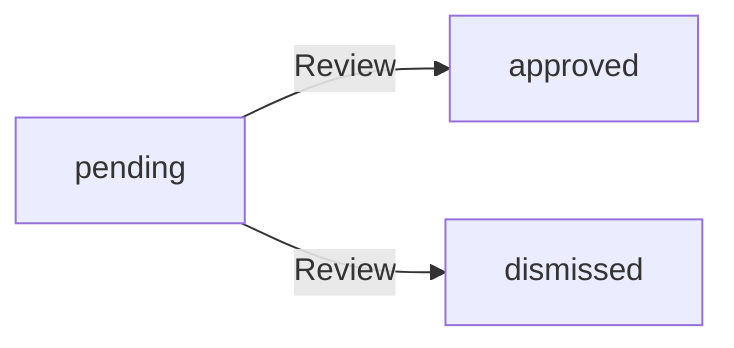
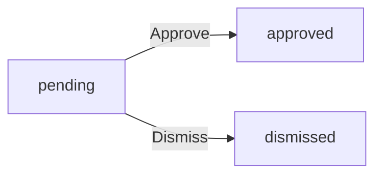
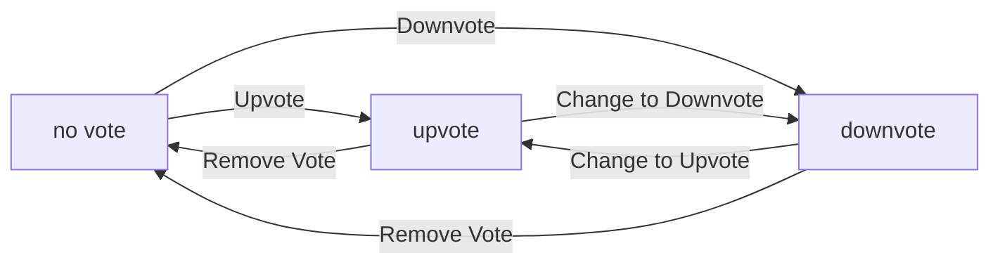
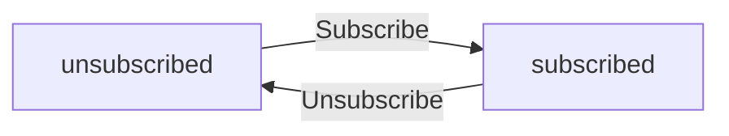
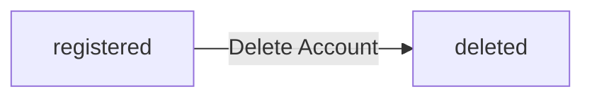
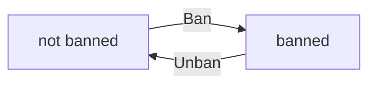

**redditPlatform — Business concepts, relationships, and states from user perspective**

Business concepts, relationships, and states from user perspective

# Domain Concepts

Describe what each concept means to users and why it exists.

## User Concept

Users are the individuals who participate in the community platform by creating accounts and engaging with content. Each user registers with a unique email address, password, and username that identifies them across the platform. Users can log in securely to access their personalized features and manage their account settings. Every user maintains a public profile that includes a display name, bio text, and avatar image that others can view. Users have the ability to edit their own profile information at any time to update how they appear to the community. Each user accumulates a karma score based on the upvotes and downvotes their posts and comments receive from other users. Users can create posts and comments within communities they subscribe to, contributing to discussions and sharing content. Users can also vote on posts and comments created by others to express agreement or disagreement. When users decide to leave the platform, they can delete their accounts, which removes all their posts and comments from the system. Users can view any other user's public profile to learn about their contributions and community activity.

### User Registration and Account Creation

WHEN a new user registers for the platform, THE system SHALL:
1. Require a valid email address
2. Require a password
3. Require a unique username
4. Create a user account with the provided information

WHEN a user attempts to register with an email that already exists, THE system SHALL reject the registration request.

WHEN a user attempts to register with a username that already exists, THE system SHALL reject the registration request.

WHEN a user logs in, THE system SHALL:
1. Accept email and password credentials
2. Authenticate the user against stored credentials
3. Grant access to authenticated features upon successful authentication

WHEN authentication fails due to invalid credentials, THE system SHALL deny access and indicate the failure.

THE system SHALL ensure each user has exactly one account associated with their email address.

THE system SHALL ensure each username is unique across all registered users.

### User Profile Management

WHEN a user views their own profile, THE system SHALL display:
1. Their display name
2. Their bio text
3. Their avatar image
4. Their total karma score
5. A list of all posts they have created
6. A list of all comments they have written

WHEN a user views another user's profile, THE system SHALL display the same information as above.

WHEN a user edits their display name, THE system SHALL update the display name on their profile.

WHEN a user edits their bio text, THE system SHALL update the bio text on their profile.

WHEN a user uploads or changes their avatar image, THE system SHALL update the avatar image on their profile.

WHEN a user attempts to edit another user's profile information, THE system SHALL deny the edit request.

THE system SHALL allow any user to view any other user's public profile information.

THE system SHALL store the display name, bio text, and avatar image as part of the user's public profile.

### User Identity and Karma Tracking

THE system SHALL maintain a single karma score for each user.

WHEN someone upvotes a user's post, THE system SHALL increase that user's karma score by 1.

WHEN someone upvotes a user's comment, THE system SHALL increase that user's karma score by 1.

WHEN someone downvotes a user's post, THE system SHALL decrease that user's karma score by 1.

WHEN someone downvotes a user's comment, THE system SHALL decrease that user's karma score by 1.

WHEN someone removes their upvote from a user's post or comment, THE system SHALL decrease that user's karma score by 1.

WHEN someone removes their downvote from a user's post or comment, THE system SHALL increase that user's karma score by 1.

WHEN a user changes their vote from upvote to downvote on a post or comment, THE system SHALL decrease the original author's karma score by 2.

WHEN a user changes their vote from downvote to upvote on a post or comment, THE system SHALL increase the original author's karma score by 2.

THE system SHALL allow karma scores to be negative values.

THE system SHALL make each user's karma score visible on their profile page.

THE system SHALL identify each user by their unique username across the platform.

### Account Deletion

WHEN a user requests account deletion, THE system SHALL:
1. Remove the user's account from the system
2. Delete all posts created by the user
3. Delete all comments created by the user
4. Remove all votes cast by the user from posts and comments
5. Remove all subscriptions the user has to communities

WHEN a user's account is deleted, THE system SHALL ensure their content (posts and comments) is no longer visible on the platform.

WHEN a user's account is deleted, THE system SHALL remove their username from the system, making it available for future registration.

THE system SHALL require explicit confirmation from the user before proceeding with account deletion.

THE system SHALL make account deletion irreversible once completed.

## Community Concept

Communities are topic-based spaces where users gather to share content and discuss specific subjects of interest. Any registered user can create a new community by providing a unique name, description text, and icon image that represents the community's theme. The user who creates a community automatically becomes its owner with the highest level of authority over community management. Communities can be browsed by all users through a list view that shows all available communities on the platform. Users can search for communities by name to find specific topics or interests they want to join. Each community displays its subscriber count so users can see how many people are part of the community. Community owners and moderators have special privileges to manage posts, comments, and member access within their communities. Communities serve as the primary organizational structure for content, with all posts belonging to a specific community. Users must subscribe to a community before they can create posts within it, ensuring active participation. Communities enable focused discussions around shared interests while maintaining separation from other topics on the platform.

### Community Creation and Ownership

### Community Creation Requirements

WHEN a registered user creates a community, THE system SHALL:
1. Require a unique community name that does not already exist on the platform
2. Require a description text that explains the community's purpose and topic
3. Allow an optional icon image to visually represent the community
4. Automatically assign ownership of the community to the creating user
5. Record the creation timestamp for the community

THE system SHALL ensure that community names are unique across the entire platform.

THE system SHALL prevent duplicate community names from being registered.

### Community Ownership

THE system SHALL assign the highest level of authority to the community owner.

THE system SHALL allow the owner to manage community settings and membership.

THE system SHALL allow the owner to add moderators to the community.

THE system SHALL allow the owner to remove moderators from the community.

THE system SHALL prevent moderators from removing the community owner.

THE system SHALL prevent moderators from removing other moderators (only the owner can do this).

### Community Content Requirements

WHEN a community is created, THE system SHALL:
1. Initialize with zero subscribers
2. Allow posts to be created by subscribed members
3. Allow comments to be made on posts within the community
4. Display all community content to guests and members

THE system SHALL associate all posts with the community in which they are created.

THE system SHALL maintain the community as the primary organizational unit for content.

### Community Discovery and Browsing

### Community Discovery

THE system SHALL display all communities in a browsable list view.

THE system SHALL allow all users (including guests) to browse the complete list of communities.

THE system SHALL display the following information for each community in the list:
1. Community name
2. Community description (truncated if necessary)
3. Subscriber count

THE system SHALL allow users to search for communities by name.

THE system SHALL return matching communities when a search query is provided.

THE system SHALL perform case-insensitive matching for community name searches.

### Subscriber Count Display

THE system SHALL display the current subscriber count on each community's page.

THE system SHALL update the subscriber count when users subscribe or unsubscribe.

THE system SHALL display the subscriber count in the community list view.

THE system SHALL ensure the subscriber count reflects active subscriptions only.

### Community Page Information

WHEN a user views a community page, THE system SHALL display:
1. Community name
2. Community description
3. Community icon image (if provided)
4. Current subscriber count
5. List of posts within the community
6. Information about whether the viewing user is subscribed

THE system SHALL allow all users to view any community's public page.

THE system SHALL indicate to subscribed users their subscription status.

### Community Structure and Organization

### Topic-Based Organization

Communities serve as topic-based spaces where users gather to share content.

THE system SHALL organize all posts under their respective communities.

THE system SHALL maintain separation between different community topics.

THE system SHALL allow users to participate in multiple communities simultaneously.

THE system SHALL ensure content from one community remains distinct from other communities.

### Community Subscription Model

THE system SHALL require users to subscribe to a community before creating posts within it.

THE system SHALL allow users to subscribe to any community.

THE system SHALL allow users to unsubscribe from any community.

THE system SHALL maintain a list of communities each user is subscribed to.

THE system SHALL allow users to view their subscribed communities list.

THE system SHALL prevent unsubscribed users from creating posts in a community.

THE system SHALL allow unsubscribed users to view community content.

### Content Organization by Community

THE system SHALL associate each post with exactly one community.

THE system SHALL associate each comment with the post it belongs to.

THE system SHALL display community context when viewing posts and comments.

THE system SHALL allow filtering and browsing content by community.

### Community Management and Moderation

### Community Management Authority

THE system SHALL grant the community owner full management authority over the community.

THE system SHALL allow the owner to appoint moderators to assist with community management.

THE system SHALL allow moderators to perform management actions within their assigned community.

THE system SHALL establish a clear hierarchy: owner has highest authority, moderators have secondary authority.

### Moderator Capabilities

WHEN a user is a moderator of a community, THE system SHALL allow them to:
1. Delete any post within the community (regardless of author)
2. Delete any comment within the community (regardless of author)
3. Ban users from participating in the community
4. Unban previously banned users
5. View the list of banned users for the community
6. Add other moderators to the community

THE system SHALL prevent moderators from removing the community owner.

THE system SHALL prevent moderators from removing other moderators.

### Banned User Restrictions

WHILE a user is banned from a community, THE system SHALL:
1. Prevent them from creating new posts in that community
2. Prevent them from creating new comments in that community
3. Allow them to view community content
4. Prevent them from voting on posts or comments in that community

THE system SHALL allow banned users to view posts and comments after being banned.

THE system SHALL maintain the ban status until explicitly removed by a moderator or owner.

## Post Concept

Posts are the primary content units that users create to share information, links, images, or text with community members. Every post requires a title that summarizes its content and must be created within a community the user is subscribed to. Posts can take one of three forms: text posts with written content, link posts with external URLs, or image posts with uploaded pictures. Users who create posts can edit their content to correct mistakes or update information over time. Users can delete their own posts when they are no longer relevant or appropriate. Each post displays its vote score, comment count, author username, community name, and posting timestamp to provide context. Posts appear in various feeds based on their community, popularity, or recency to help users discover content. Text posts show a preview of the first 200 characters in feed listings to give readers a taste of the content. Link posts display the domain name so users know where the link leads before clicking. Image posts show thumbnails in feed listings to attract visual engagement. Posts enable users to contribute meaningful content to their subscribed communities and spark discussions with other members.

### Post Creation and Types

WHEN a user creates a post, THE system SHALL require the user to be subscribed to the target community.
WHEN a user creates a post, THE system SHALL require a title that summarizes the post content.
WHEN a user creates a post, THE system SHALL allow the user to select one of three post types: text, link, or image.

WHEN a user creates a text post, THE system SHALL require text content to be provided.
WHEN a user creates a link post, THE system SHALL require a valid URL to be provided.
WHEN a user creates an image post, THE system SHALL require an image file to be uploaded.

IF the user is not subscribed to the community, THE system SHALL prevent post creation in that community.
IF the title is missing or empty, THE system SHALL reject the post creation request.
IF the post type is selected but required content is missing, THE system SHALL reject the post creation request.

### Post Management Operations

WHEN a user edits their own post, THE system SHALL allow updating the title and content.
WHEN a user edits their own post, THE system SHALL preserve the original post timestamp.
WHEN a user edits their own post, THE system SHALL allow changing the post type if content is updated.

IF the user is not the post author, THE system SHALL prevent editing the post.
IF the post has been deleted, THE system SHALL prevent any editing operations.

WHEN a user deletes their own post, THE system SHALL remove the post from all feeds and community listings.
WHEN a user deletes their own post, THE system SHALL preserve the comment count for historical accuracy.

IF the user is not the post author, THE system SHALL prevent post deletion.
IF the post is being actively viewed by other users, THE system SHALL still allow deletion but mark it as removed.

### Post Display and Metadata

THE system SHALL display the vote score for each post, calculated as total upvotes minus total downvotes.
THE system SHALL display the comment count for each post, showing total number of comments and replies.
THE system SHALL display the post author username on all post views.
THE system SHALL display the community name where the post was created.
THE system SHALL display the post timestamp showing when the post was created.
THE system SHALL display time-relative formatting for timestamps (e.g., "3 hours ago").

WHEN viewing a feed listing, THE system SHALL show vote score, comment count, author, community, and timestamp for each post.
WHEN viewing a single post, THE system SHALL show full content along with vote score, comment count, author, community, and timestamp.

### Post Discovery and Feeds

WHEN a user views the home feed, THE system SHALL show posts only from communities the user is subscribed to.
WHEN a user views the popular feed, THE system SHALL show posts from all communities across the platform.
WHEN a user views a community feed, THE system SHALL show posts from that specific community.

THE system SHALL support sorting posts by hot (recent posts with many upvotes).
THE system SHALL support sorting posts by new (most recently created first).
THE system SHALL support sorting posts by top (highest vote score with time filters: today, this week, this month, this year, all time).
THE system SHALL support sorting posts by controversial (posts with many votes but score close to zero).

WHEN displaying text posts in feed listings, THE system SHALL show the first 200 characters of content as preview.
WHEN displaying image posts in feed listings, THE system SHALL show a thumbnail of the uploaded image.
WHEN displaying link posts in feed listings, THE system SHALL show the domain name of the URL.

THE system SHALL paginate all post feeds to manage content volume.
THE system SHALL make the home feed available only to logged-in users.
THE system SHALL make the popular feed available to all users including guests.
THE system SHALL make community feeds available to all users including guests.

## Comment Concept

Comments are user responses to posts that enable discussion and dialogue around shared content. Users can write comments on any post to share their thoughts, opinions, or additional information with the community. Comments support nested replies, allowing users to respond directly to other comments with unlimited depth. Each comment displays the author's username, content text, vote score, and timestamp when it was posted. Users who create comments can edit their content to clarify their points or fix errors after posting. Users can delete their own comments when they no longer want them visible in the discussion. Comments contribute to the overall engagement of a post and help build community conversations. The nested reply structure allows for organized discussions where related points stay grouped together. Comments can be sorted by best score, newness, or controversy to help users find the most relevant responses. Comments enable deeper engagement with posts beyond simple voting and help communities develop rich discussions around shared interests.

### Comment Creation and Authorship

WHEN a user creates a comment on a post, THE system SHALL associate the comment with the user as the author.

WHEN a user creates a comment, THE system SHALL require text content for the comment.

WHEN a user creates a comment, THE system SHALL record the timestamp of creation.

THE system SHALL allow any logged-in user to create a comment on any post.

THE system SHALL display the author's username on each comment.

THE system SHALL display the author's display name when viewing the author's profile.

IF a user is not logged in, THE system SHALL prevent comment creation.

IF a user attempts to create a comment with empty content, THE system SHALL reject the request.

THE comment authorship SHALL be immutable once the comment is created.

### Comment Content and Structure

WHEN a user creates a comment, THE system SHALL store the text content of the comment.

WHEN a user replies to a comment, THE system SHALL create a nested reply associated with the parent comment.

THE system SHALL support unlimited nesting depth for comment replies.

WHEN viewing a comment, THE system SHALL display all nested replies in a threaded format.

THE system SHALL visually indicate the nesting level of each reply.

WHEN a comment has no replies, THE system SHALL display it as a top-level comment.

THE system SHALL allow users to expand or collapse nested reply threads.

THE comment content SHALL be displayed in full when viewing a single post.

THE system SHALL show a preview of comment content in the post feed (first 200 characters for text content).

IF a reply is created, THE system SHALL associate it with both the parent comment and the original post.

### Comment Display and Timestamps

THE system SHALL display the time since posting for each comment (e.g., "3 hours ago").

THE system SHALL display comments in a threaded discussion format when viewing a post.

THE system SHALL organize nested replies under their parent comments.

THE system SHALL show the comment count on each post in the feed.

WHEN viewing a post, THE system SHALL display all comments and their replies.

THE discussion thread SHALL remain intact when comments are sorted.

THE system SHALL preserve the parent-child relationship between comments and replies during sorting.

THE system SHALL display the nested reply structure in a visually clear manner.

### Comment Voting

WHEN a user votes on a comment, THE system SHALL allow upvote or downvote.

WHEN a user upvotes a comment, THE system SHALL increase the comment's vote score by 1.

WHEN a user downvotes a comment, THE system SHALL decrease the comment's vote score by 1.

THE system SHALL allow each user to cast only one vote per comment.

WHEN a user changes their vote from upvote to downvote, THE system SHALL adjust the vote score accordingly.

WHEN a user removes their vote from a comment, THE system SHALL adjust the vote score accordingly.

THE system SHALL display the vote score for each comment.

THE system SHALL allow users to view the vote score on both individual comments and comment previews in feeds.

IF a user attempts to vote on a comment they have already voted on, THE system SHALL update their existing vote instead of creating a new one.

### Comment Editing and Deletion

WHEN a user edits their comment, THE system SHALL allow modification of the comment content.

THE system SHALL allow only the comment author to edit their comment.

WHEN a user deletes their comment, THE system SHALL remove the comment from display.

THE system SHALL allow only the comment author to delete their comment.

WHEN a comment is deleted, THE system SHALL also delete all nested replies to that comment.

THE system SHALL prevent editing or deletion of comments by users who are not the author.

IF a moderator deletes a comment in their community, THE system SHALL remove the comment and all nested replies.

THE system SHALL display an indicator when a comment has been edited.

### Comment Sorting and Organization

THE system SHALL support sorting comments by best (highest vote score first).

THE system SHALL support sorting comments by new (most recent first).

THE system SHALL support sorting comments by controversial (many votes but score close to zero).

WHEN comments are sorted, THE system SHALL preserve the nested reply structure.

THE system SHALL allow users to change the comment sorting order at any time.

THE reply conversations SHALL remain grouped under their parent comments regardless of sorting.

THE system SHALL display the currently selected sorting option.

THE default comment sorting SHALL be by best score.

## Vote Concept

Votes are the mechanism by which users express agreement or disagreement with posts and comments on the platform. Users can upvote content they find valuable, helpful, or interesting, which increases the content's score by one point. Users can downvote content they find inappropriate, misleading, or unhelpful, which decreases the content's score by one point. Each user can cast only one vote per post or comment, preventing manipulation of scores through multiple votes. Users can change their vote from upvote to downvote or vice versa if they reconsider their opinion. Users can also remove their vote entirely, returning the content's score to its previous state. Vote scores are calculated as the total number of upvotes minus the total number of downvotes for each piece of content. When users receive upvotes on their posts or comments, their personal karma score increases by one point. When users receive downvotes on their posts or comments, their personal karma score decreases by one point. Vote removal adjusts karma accordingly to reflect the change in community reception. Votes help surface quality content through sorting algorithms and provide feedback to content creators about how their contributions are received.

### Vote Types and Actions

WHEN a user views a post or comment, THE system SHALL display upvote and downvote action options.

WHEN a user upvotes a post, THE system SHALL:
1. Record the upvote action associated with the user and the post
2. Increase the post's vote score by one
3. Increase the post author's karma score by one

WHEN a user upvotes a comment, THE system SHALL:
1. Record the upvote action associated with the user and the comment
2. Increase the comment's vote score by one
3. Increase the comment author's karma score by one

WHEN a user downvotes a post, THE system SHALL:
1. Record the downvote action associated with the user and the post
2. Decrease the post's vote score by one
3. Decrease the post author's karma score by one

WHEN a user downvotes a comment, THE system SHALL:
1. Record the downvote action associated with the user and the comment
2. Decrease the comment's vote score by one
3. Decrease the comment author's karma score by one

THE system SHALL display the current vote score for each post and comment.

THE system SHALL indicate to users whether they have already voted on a specific post or comment.

### Vote Constraints and Uniqueness

WHEN a user attempts to vote on a post or comment, THE system SHALL verify whether the user has already cast a vote on that content.

IF a user has already upvoted a post or comment, THE system SHALL prevent the user from casting another upvote on the same content.

IF a user has already downvoted a post or comment, THE system SHALL prevent the user from casting another downvote on the same content.

THE system SHALL allow each user to cast exactly one vote per post.

THE system SHALL allow each user to cast exactly one vote per comment.

WHEN a user has not voted on a post or comment, THE system SHALL allow the user to cast either an upvote or a downvote.

THE system SHALL prevent vote manipulation by ensuring users cannot create multiple accounts to cast additional votes on the same content.

### Vote Score Calculation

THE system SHALL calculate the vote score for each post as the total number of upvotes minus the total number of downvotes.

THE system SHALL calculate the vote score for each comment as the total number of upvotes minus the total number of downvotes.

THE system SHALL display the vote score as a single numeric value for each post and comment.

THE system SHALL update the vote score immediately when a user casts, changes, or removes their vote.

THE system SHALL allow vote scores to be positive, zero, or negative values.

WHEN a post or comment receives no votes, THE system SHALL display a vote score of zero.

THE system SHALL ensure vote score calculations remain consistent across all views and feeds where the content appears.

### Vote Modification and Removal

WHEN a user who has upvoted a post or comment decides to change their vote, THE system SHALL allow the user to switch to a downvote.

WHEN a user who has downvoted a post or comment decides to change their vote, THE system SHALL allow the user to switch to an upvote.

WHEN a user changes their vote from upvote to downvote, THE system SHALL:
1. Remove the previous upvote record
2. Create a new downvote record
3. Adjust the content's vote score by subtracting two (removing upvote effect and adding downvote effect)
4. Adjust the content author's karma score by subtracting two

WHEN a user changes their vote from downvote to upvote, THE system SHALL:
1. Remove the previous downvote record
2. Create a new upvote record
3. Adjust the content's vote score by adding two (removing downvote effect and adding upvote effect)
4. Adjust the content author's karma score by adding two

WHEN a user removes their vote from a post or comment, THE system SHALL:
1. Remove the vote record completely
2. Adjust the content's vote score to reflect the removal
3. Adjust the content author's karma score to reflect the removal

WHEN a user removes an upvote, THE system SHALL decrease the content's vote score by one and decrease the author's karma by one.

WHEN a user removes a downvote, THE system SHALL increase the content's vote score by one and increase the author's karma by one.

### Karma Adjustment System

WHEN a user receives an upvote on their post, THE system SHALL increase their karma score by one.

WHEN a user receives an upvote on their comment, THE system SHALL increase their karma score by one.

WHEN a user receives a downvote on their post, THE system SHALL decrease their karma score by one.

WHEN a user receives a downvote on their comment, THE system SHALL decrease their karma score by one.

WHEN a user removes their upvote from another user's content, THE system SHALL decrease the content author's karma score by one.

WHEN a user removes their downvote from another user's content, THE system SHALL increase the content author's karma score by one.

WHEN a user changes their vote from upvote to downvote on another user's content, THE system SHALL decrease the content author's karma score by two.

WHEN a user changes their vote from downvote to upvote on another user's content, THE system SHALL increase the content author's karma score by two.

THE system SHALL display each user's total karma score on their profile page.

THE system SHALL allow karma scores to be positive, zero, or negative values.

THE system SHALL provide karma as feedback to content creators about how their contributions are received by the community.

### Vote-Based Content Sorting

WHEN users view the Hot sorting option in any feed, THE system SHALL order posts by recent activity combined with upvote density, prioritizing posts with many upvotes that were posted recently.

WHEN users view the Top sorting option in any feed, THE system SHALL order posts by vote score in descending order (highest score first).

WHEN users select the Top sorting option with a time filter, THE system SHALL:
1. Filter posts created within the selected time period (today, this week, this month, this year, or all time)
2. Order the filtered posts by vote score in descending order

WHEN users view the Controversial sorting option in any feed, THE system SHALL order posts by vote volume with scores close to zero, prioritizing posts that have received many votes but have a low absolute score.

WHEN users view comments on a post with Best sorting, THE system SHALL order comments by vote score in descending order (highest score first).

WHEN users view comments on a post with Controversial sorting, THE system SHALL order comments by vote volume with scores close to zero.

THE system SHALL apply vote-based sorting consistently across Home Feed, Popular Feed, and Community Feed.

THE system SHALL ensure sorting algorithms reflect community reception and content quality as indicated by vote patterns.

## Report Concept

Reports are the tool users employ to flag posts or comments that violate community guidelines or platform rules. Users can submit reports on any post or comment they encounter that they believe is inappropriate or problematic. When creating a report, users must provide a text reason explaining why they believe the content should be reviewed. Reports are visible only to moderators of the community where the reported content exists. Moderators can view all pending reports for their community along with the reported content, reporter information, and reason provided. Moderators have two options for handling reports: approve or dismiss. When a moderator approves a report, the reported content is deleted from the platform to protect the community. When a moderator dismisses a report, the content remains visible and the report is removed from the pending list. This system empowers community members to help maintain content quality and safety through collective oversight. Reports enable moderation teams to address problematic content that automated systems or community guidelines cannot automatically handle.

### Report Submission

WHEN a user encounters a post or comment that violates community guidelines, THE system SHALL allow the user to submit a report.

WHEN a user submits a report, THE system SHALL:
1. Require the user to provide a text reason explaining why the content is problematic
2. Associate the report with the specific post or comment being reported
3. Record the submitting user as the reporter
4. Set the initial report status to pending
5. Record the timestamp of report submission

IF a user attempts to report content without providing a reason, THE system SHALL reject the report submission.

IF a user attempts to report the same content multiple times, THE system SHALL allow multiple reports but track each separately with its own reason.

### Report Visibility and Access

Reports are visible only to moderators of the community where the reported content exists.

THE system SHALL display reports to moderators with:
1. The reported content (post or comment)
2. The reporter's username
3. The reason provided by the reporter
4. The timestamp when the report was submitted
5. The current status of the report (pending, approved, or dismissed)

WHEN a moderator views reports for their community, THE system SHALL show all pending reports.

IF a user is not a moderator of the community, THE system SHALL NOT display any reports to that user.

THE system SHALL NOT expose report information to the reporter after submission, except for viewing their own report status if needed.

### Moderator Review Workflow

WHEN a moderator reviews reports for their community, THE system SHALL:
1. Display all pending reports in a dedicated moderation queue
2. Allow moderators to view the full reported content
3. Show the reporter information and reason for each report
4. Provide options to approve or dismiss each report

WHEN a moderator approves a report, THE system SHALL:
1. Delete the reported content from the platform
2. Update the report status to approved
3. Remove the report from the pending list
4. Record the moderator who approved the report

WHEN a moderator dismisses a report, THE system SHALL:
1. Keep the reported content visible on the platform
2. Update the report status to dismissed
3. Remove the report from the pending list
4. Record the moderator who dismissed the report

Moderators can review reports at any time after submission. There is no time limit for report review.

### Content Deletion on Report Approval

WHEN a report is approved by a moderator, THE system SHALL delete the reported content from the platform.

IF the reported content is a post, THE system SHALL:
1. Remove the post from all feeds
2. Remove the post from the community
3. Remove all comments on the deleted post
4. Update the author's karma accordingly
5. Remove any votes on the deleted post

IF the reported content is a comment, THE system SHALL:
1. Remove the comment from the post
2. Remove all replies to the deleted comment
3. Update the author's karma accordingly
4. Remove any votes on the deleted comment

THE system SHALL NOT allow recovery of content deleted through report approval.

WHEN content is deleted due to report approval, THE system SHALL notify the content author that their content was removed due to a community report.

### Report Tracking and Moderation Analytics

WHEN a user submits a report for problematic content, THE system SHALL track the report through its entire lifecycle.

THE system SHALL maintain report history including:
1. Initial submission timestamp and reporter information
2. Review timestamp when a moderator first viewed the report
3. Resolution timestamp when the report was approved or dismissed
4. Moderator identity who made the final decision

THE system SHALL associate reports with community guidelines violations to help moderators identify patterns of problematic content.

IF a community receives multiple reports for the same user's content, THE system SHALL allow moderators to view all related reports together.

THE system SHALL provide moderators with a list of all reports (pending, approved, and dismissed) for their community for tracking purposes.

Report tracking enables moderation teams to:
1. Monitor report volume and response times
2. Identify repeat offenders in the community
3. Analyze common violation types
4. Ensure all reports receive timely review

## Subscription Concept

Subscriptions represent the relationship between users and communities that enables content participation and personalized feeds. Users can subscribe to any community to indicate their interest in that community's content and discussions. Users can unsubscribe from any community at any time to stop receiving content from that community in their feeds. Subscribing to a community is required before a user can create posts within that community, ensuring only interested members contribute. Users can view a list of all communities they are currently subscribed to for easy management. The home feed shows posts only from communities the user has subscribed to, creating a personalized content experience. Subscriptions help users curate their content consumption by following only communities relevant to their interests. Community creators automatically subscribe to their own communities when they create them. Subscriptions do not affect a user's ability to view content from communities they are not subscribed to, as public feeds remain accessible. This subscription model balances community participation requirements with open content visibility for all platform users.

### Community Subscription

WHEN a user subscribes to a community, THE system SHALL:
1. Create a subscription record linking the user to the community
2. Increment the community's subscriber count by 1
3. Allow the subscription to be created regardless of current subscription status
4. Update the subscription visibility to the user immediately

WHEN a user views a community, THE system SHALL display whether the user is currently subscribed to that community.

THE system SHALL ensure each user can subscribe to unlimited communities.

THE system SHALL ensure each subscription is unique per user-community pair.

IF a user attempts to subscribe to a non-existent community, THE system SHALL reject the request.

IF a user is already subscribed to a community, THE system SHALL maintain the existing subscription without duplication.

THE system SHALL notify the user when a subscription is successfully created.

### Automatic Subscription on Community Creation

WHEN a user creates a community, THE system SHALL automatically subscribe that user to the newly created community.

THE system SHALL count the community creator as the first subscriber to their own community.

WHEN the community creator unsubscribes from their own community, THE system SHALL allow the action but maintain their ownership status.

### Subscription Visibility

WHEN viewing any community, THE system SHALL display the current subscriber count to all users.

WHEN viewing their own subscription status, THE system SHALL indicate whether the user is subscribed or not subscribed to each community.

### Subscription Management

WHEN a user unsubscribes from a community, THE system SHALL:
1. Remove the subscription record linking the user to the community
2. Decrement the community's subscriber count by 1
3. Update the subscription visibility to the user immediately
4. Allow the user to re-subscribe at any time

THE system SHALL allow users to unsubscribe from any community they are currently subscribed to.

THE system SHALL allow users to manage subscriptions without affecting their account or other communities.

IF a user unsubscribes from a community, THE system SHALL remove that community's posts from their home feed.

### Subscription Actions

WHEN a user subscribes to a community, THE system SHALL confirm the subscription action to the user.

WHEN a user unsubscribes from a community, THE system SHALL confirm the unsubscription action to the user.

THE system SHALL allow subscription changes to take effect immediately without requiring page refresh.

### Subscription Limits

THE system SHALL NOT impose a maximum limit on the number of communities a user can subscribe to.

THE system SHALL NOT require a minimum number of subscriptions for account functionality.

### Unsubscribe Confirmation

WHEN a user initiates an unsubscribe action, THE system SHALL process the request without requiring additional confirmation.

IF a user unsubscribes from their last subscribed community, THE system SHALL allow the action without restriction.

THE system SHALL preserve the user's ability to re-subscribe to any previously unsubscribed community.

### Posting Eligibility

WHEN a user attempts to create a post in a community, THE system SHALL verify the user is subscribed to that community.

IF a user is not subscribed to a community, THE system SHALL prevent post creation in that community.

IF a user is subscribed to a community, THE system SHALL allow post creation in that community.

THE system SHALL display an error message when a user attempts to post without subscription.

### Subscription Requirement Enforcement

WHEN a user views a community they are not subscribed to, THE system SHALL indicate that subscription is required to post.

WHEN a user views a community they are subscribed to, THE system SHALL indicate that posting is available.

THE system SHALL enforce subscription requirements for all post types (text, link, and image posts).

### Eligibility for Other Actions

WHEN a user attempts to comment on a post, THE system SHALL NOT require community subscription.

WHEN a user attempts to vote on a post, THE system SHALL NOT require community subscription.

WHEN a user attempts to report content, THE system SHALL NOT require community subscription.

### Subscription Verification

THE system SHALL verify subscription status in real-time before allowing post creation.

IF subscription status changes between viewing and posting, THE system SHALL re-verify before allowing the post.

THE system SHALL cache subscription status for performance but validate on critical actions.

### Subscribed Communities List

WHEN a user views their subscribed communities list, THE system SHALL display all communities the user is currently subscribed to.

THE system SHALL display the following information for each subscribed community:
1. Community name
2. Community icon image
3. Current subscriber count
4. Subscription status indicator

THE system SHALL allow users to access their subscribed communities list from their profile or account settings.

### List Display Requirements

WHEN displaying the subscribed communities list, THE system SHALL show communities in a scrollable or paginated format.

WHEN a user has no subscribed communities, THE system SHALL display an empty state message.

THE system SHALL update the list immediately when subscription status changes.

### List Interaction

WHEN a user selects a community from their subscribed list, THE system SHALL navigate to that community's feed.

WHEN viewing the subscribed communities list, THE system SHALL allow users to unsubscribe directly from the list.

THE system SHALL allow users to search or filter their subscribed communities by name.

### List Accuracy

THE system SHALL ensure the subscribed communities list reflects current subscription status.

IF a community is deleted, THE system SHALL remove it from the user's subscribed list.

THE system SHALL ensure subscriber counts displayed in the list are current.

### Home Feed Personalization

WHEN a logged-in user accesses their home feed, THE system SHALL display posts only from communities the user is subscribed to.

THE system SHALL exclude posts from communities the user is not subscribed to from the home feed.

WHEN a user subscribes to a new community, THE system SHALL include posts from that community in the home feed.

WHEN a user unsubscribes from a community, THE system SHALL remove posts from that community from the home feed.

### Feed Content Rules

WHEN displaying the home feed, THE system SHALL show posts in the user's preferred sort order.

THE system SHALL support all sorting options (hot, new, top, controversial) in the home feed.

THE system SHALL paginate home feed results consistently with other feed types.

THE system SHALL display the same post information in the home feed as in other feeds.

### Feed Availability

THE system SHALL require user authentication to access the home feed.

IF a user is not logged in, THE system SHALL redirect to the popular feed instead.

THE system SHALL allow the home feed to display posts even when the user has no subscribed communities (empty state).

### Feed Updates

WHEN new posts are created in subscribed communities, THE system SHALL make them appear in the home feed according to the sort order.

WHEN posts are deleted from subscribed communities, THE system SHALL remove them from the home feed.

THE system SHALL refresh the home feed when subscription status changes.

### Content Curation

THE system SHALL enable users to curate their home feed by managing their subscriptions.

WHEN users subscribe to communities, THE system SHALL tailor their home feed to those interests.

THE system SHALL allow users to control their content consumption through subscription management.

THE system SHALL ensure the home feed reflects the user's community following preferences.

### Participation Eligibility Rules

WHEN a user wants to participate in a community through posting, THE system SHALL verify subscription eligibility.

THE system SHALL distinguish between content consumption (viewing) and content creation (posting) eligibility.

### Consumption Eligibility

WHEN a user wants to view community content, THE system SHALL NOT require subscription.

THE system SHALL allow all users to browse community feeds regardless of subscription status.

THE system SHALL allow all users to view individual posts and comments regardless of subscription status.

### Creation Eligibility

WHEN a user wants to create a post, THE system SHALL require active subscription to the target community.

WHEN a user wants to create a comment, THE system SHALL require active subscription to the target community.

THE system SHALL allow all authenticated users to comment on posts in communities they are subscribed to.

### Eligibility Enforcement

THE system SHALL enforce participation eligibility rules consistently across all communities.

IF eligibility requirements are not met, THE system SHALL display a clear message explaining the restriction.

THE system SHALL provide guidance on how to meet eligibility requirements (e.g., subscribe to post).

### Special Cases

WHEN a community owner posts in their own community, THE system SHALL allow posting (automatic subscription applies).

WHEN a moderator posts in a moderated community, THE system SHALL require subscription (unless they are the owner).

THE system SHALL apply the same eligibility rules to all user types (regular users, moderators, owners).

# Domain Relationships

Describe how concepts relate to each other from a business perspective.

## Conceptual Relationships

Describe how concepts relate to each other in business terms.

### Community Ownership

THE system SHALL associate each community with exactly one owner user.

WHEN a user creates a community, THE system SHALL assign that user as the community owner.

THE owner SHALL have exclusive authority to remove moderators from the community.

THE owner SHALL have exclusive authority to remove other moderators.

THE system SHALL prevent moderators from removing the community owner.

THE system SHALL prevent moderators from removing each other.

THE system SHALL maintain the ownership relationship even when the owner modifies their profile.

THE system SHALL preserve ownership when the community receives new moderators.

### Post-Community Association

THE system SHALL associate each post with exactly one community.

THE system SHALL require a post to belong to a community before it can be created.

WHEN a user creates a post, THE system SHALL record the community association.

THE system SHALL display the community name when viewing a post.

THE system SHALL filter posts by community when displaying a community feed.

THE system SHALL prevent a post from being moved to a different community after creation.

THE system SHALL delete all posts in a community when the community is removed.

### Comment Hierarchy

THE system SHALL associate each comment with exactly one post.

THE system SHALL allow comments to have a parent comment for replies.

THE system SHALL support unlimited nesting depth for comment replies.

WHEN a comment is created, THE system SHALL record its parent relationship.

THE system SHALL display nested replies under their parent comments.

THE system SHALL maintain reply order within each comment thread.

THE system SHALL delete all replies when a parent comment is deleted.

### User-Content Ownership

THE system SHALL associate each post with exactly one author user.

THE system SHALL associate each comment with exactly one author user.

THE author SHALL have exclusive rights to edit their own posts.

THE author SHALL have exclusive rights to delete their own posts.

THE author SHALL have exclusive rights to edit their own comments.

THE author SHALL have exclusive rights to delete their own comments.

WHEN a user account is deleted, THE system SHALL remove all posts authored by that user.

WHEN a user account is deleted, THE system SHALL remove all comments authored by that user.

### Vote Associations

THE system SHALL associate each vote with exactly one user.

THE system SHALL associate each vote with exactly one target (post or comment).

THE system SHALL allow a user to cast one vote per post.

THE system SHALL allow a user to cast one vote per comment.

THE system SHALL record the vote type (upvote or downvote) for each association.

WHEN a user changes their vote, THE system SHALL update the existing association.

WHEN a user removes their vote, THE system SHALL delete the vote association.

### Report Associations

THE system SHALL associate each report with exactly one user (the reporter).

THE system SHALL associate each report with exactly one target (post or comment).

THE system SHALL record the reason provided when a report is created.

THE system SHALL allow moderators to view reports associated with their community.

WHEN a report is approved, THE system SHALL delete the reported content.

WHEN a report is dismissed, THE system SHALL remove the report from the active list.

### Subscription Relationships

THE system SHALL associate each user with zero or more communities through subscriptions.

THE system SHALL require a subscription association before a user can create posts in a community.

THE system SHALL allow users to create new subscription associations.

THE system SHALL allow users to remove subscription associations.

THE system SHALL display subscribed communities on a user's profile.

THE system SHALL filter the home feed to show only posts from subscribed communities.

THE system SHALL update the subscriber count when a new subscription is created.

THE system SHALL update the subscriber count when a subscription is removed.

### Community Member Associations

THE system SHALL associate each community with zero or more subscribers.

THE system SHALL associate each community with zero or more moderators.

THE system SHALL associate each community with zero or more banned users.

THE system SHALL display the subscriber count on the community page.

THE system SHALL allow moderators to view the list of banned users.

THE system SHALL prevent banned users from creating posts in the community.

THE system SHALL prevent banned users from creating comments in the community.

THE system SHALL allow banned users to view community content.

## Lifecycle and Retention

Describe business rules for concept lifecycle and data retention from a user perspective.

### User Account Lifecycle

WHEN a user registers, THE system SHALL require a unique username and valid email address.

WHEN a user registers, THE system SHALL require a password for authentication.

WHEN a user creates an account, THE system SHALL assign an initial karma score of zero.

WHEN a user logs in, THE system SHALL authenticate using email and password.

WHEN a user changes their password, THE system SHALL require the current password for verification.

WHEN a user deletes their account, THE system SHALL remove all posts created by the user.

WHEN a user deletes their account, THE system SHALL remove all comments created by the user.

WHEN a user deletes their account, THE system SHALL remove all votes cast by the user.

WHEN a user deletes their account, THE system SHALL remove all subscriptions associated with the user.

WHEN a user deletes their account, THE system SHALL remove all reports created by the user.

WHEN a user deletes their account, THE system SHALL make their username available for future registration.

IF a user requests account deletion, THE system SHALL permanently remove all associated data without recovery.

WHILE an account exists, THE system SHALL maintain the user's profile information (display name, bio, avatar).

THE system SHALL NOT allow account recovery after deletion is completed.

THE system SHALL NOT allow duplicate usernames during registration.

### Content Lifecycle (Posts and Comments)

WHEN a user creates a post, THE system SHALL require a title.

WHEN a user creates a post, THE system SHALL require the user to be subscribed to the target community.

WHEN a user creates a post, THE system SHALL associate the post with the creating user and community.

WHEN a user creates a post, THE system SHALL record the creation timestamp.

WHEN a user edits their own post, THE system SHALL allow modification of title and content.

WHEN a user deletes their own post, THE system SHALL remove the post and all associated comments.

WHEN a user deletes their own post, THE system SHALL remove all votes associated with the post.

WHEN a moderator deletes a post in their community, THE system SHALL remove the post and all associated comments.

WHEN a moderator deletes a post in their community, THE system SHALL remove all votes associated with the post.

WHEN a user creates a comment, THE system SHALL associate the comment with the target post and creating user.

WHEN a user creates a comment, THE system SHALL record the creation timestamp.

WHEN a user creates a comment, THE system SHALL allow the comment to be a reply to another comment.

WHEN a user edits their own comment, THE system SHALL allow modification of the comment content.

WHEN a user deletes their own comment, THE system SHALL remove the comment and all nested replies.

WHEN a user deletes their own comment, THE system SHALL remove all votes associated with the comment.

WHEN a moderator deletes a comment in their community, THE system SHALL remove the comment and all nested replies.

WHEN a moderator deletes a comment in their community, THE system SHALL remove all votes associated with the comment.

IF a user is banned from a community, THE system SHALL prevent creation of new posts in that community.

IF a user is banned from a community, THE system SHALL prevent creation of new comments in that community.

THE system SHALL NOT allow recovery of deleted posts or comments.

THE system SHALL maintain comment nesting structure with unlimited reply depth.

### Report Lifecycle

WHEN a user reports a post or comment, THE system SHALL require a reason for the report.

WHEN a user reports a post or comment, THE system SHALL record the reporter and the reported content.

WHEN a user reports a post or comment, THE system SHALL assign the report a pending status.

WHEN a moderator reviews a report, THE system SHALL display the reported content, reporter, and reason.

WHEN a moderator approves a report, THE system SHALL delete the reported content.

WHEN a moderator approves a report, THE system SHALL remove all votes associated with the reported content.

WHEN a moderator approves a report, THE system SHALL mark the report as approved.

WHEN a moderator approves a report, THE system SHALL remove the report from the pending list.

WHEN a moderator dismisses a report, THE system SHALL mark the report as dismissed.

WHEN a moderator dismisses a report, THE system SHALL remove the report from the report list.

WHEN a moderator dismisses a report, THE system SHALL retain the reported content.

WHEN content is deleted via report approval, THE system SHALL remove all associated comments (for posts).

WHEN content is deleted via report approval, THE system SHALL remove all nested replies (for comments).

THE system SHALL only allow moderators to approve or dismiss reports for their communities.

THE system SHALL NOT allow recovery of content deleted via approved reports.

THE system SHALL remove dismissed reports from the moderator view.

### Vote Lifecycle

WHEN a user votes on a post, THE system SHALL record the vote type (upvote or downvote).

WHEN a user votes on a post, THE system SHALL associate the vote with the user and post.

WHEN a user upvotes a post, THE system SHALL increase the post vote score by one.

WHEN a user downvotes a post, THE system SHALL decrease the post vote score by one.

WHEN a user upvotes a comment, THE system SHALL increase the comment vote score by one.

WHEN a user downvotes a comment, THE system SHALL decrease the comment vote score by one.

WHEN a user changes their vote from upvote to downvote, THE system SHALL decrease the score by two.

WHEN a user changes their vote from downvote to upvote, THE system SHALL increase the score by two.

WHEN a user removes their vote, THE system SHALL adjust the score based on the previous vote type.

WHEN a user removes their vote, THE system SHALL remove the vote record.

IF a user has already voted on a post, THE system SHALL prevent a second vote without removing the first.

IF a user has already voted on a comment, THE system SHALL prevent a second vote without removing the first.

WHEN a post is deleted, THE system SHALL remove all votes associated with the post.

WHEN a comment is deleted, THE system SHALL remove all votes associated with the comment.

WHEN a user account is deleted, THE system SHALL remove all votes cast by the user.

THE system SHALL calculate vote score as total upvotes minus total downvotes.

THE system SHALL allow vote score to be negative.

### Subscription Lifecycle

WHEN a user subscribes to a community, THE system SHALL record the subscription relationship.

WHEN a user subscribes to a community, THE system SHALL increase the community subscriber count.

WHEN a user subscribes to a community, THE system SHALL allow the user to create posts in that community.

WHEN a user subscribes to a community, THE system SHALL include posts from that community in the user's home feed.

WHEN a user unsubscribes from a community, THE system SHALL remove the subscription relationship.

WHEN a user unsubscribes from a community, THE system SHALL decrease the community subscriber count.

WHEN a user unsubscribes from a community, THE system SHALL prevent the user from creating new posts in that community.

WHEN a user unsubscribes from a community, THE system SHALL remove posts from that community from the user's home feed.

WHEN a user views their subscribed communities, THE system SHALL display all communities they are subscribed to.

WHEN a user deletes their account, THE system SHALL remove all subscriptions associated with the user.

IF a user is banned from a community, THE system SHALL prevent new post creation but retain subscription.

THE system SHALL NOT require subscription to view community content or feeds.

THE system SHALL allow users to subscribe to unlimited communities.

THE system SHALL allow users to unsubscribe from any community at any time.

# Enums and State Machines

Enum type definitions and state transitions.

## Enum Definitions

Define all enum types with their allowed values and descriptions.

### Post Type Enumeration

WHEN a post is created, THE system SHALL assign one of the following post types:

**Text Post**
- Contains written text content
- Displayed with full text in the feed (truncated to first 200 characters)
- Users can read the complete content when viewing the post

**Link Post**
- Contains a URL to external content
- Displayed with the domain name in the feed (e.g., "youtube.com")
- Users can click to navigate to the external URL

**Image Post**
- Contains an uploaded image file
- Displayed with a thumbnail preview in the feed
- Users can view the full image when viewing the post

THE system SHALL enforce that every post has exactly one post type.
THE system SHALL validate that the content matches the selected post type (text for text posts, URL for link posts, image file for image posts).

### Vote Type Enumeration

WHEN a user casts a vote on a post or comment, THE system SHALL assign one of the following vote types:

**Upvote**
- Increases the vote score by 1
- Increases the author's karma by 1
- Indicates approval or positive sentiment

**Downvote**
- Decreases the vote score by 1
- Decreases the author's karma by 1
- Indicates disapproval or negative sentiment

THE system SHALL allow users to change their vote from upvote to downvote or vice versa.
THE system SHALL allow users to remove their vote entirely.
THE system SHALL adjust the vote score and karma when a vote type changes or is removed.

### Report Status Enumeration

WHEN a report is created, THE system SHALL assign a status from the following allowed values:

**Pending**
- Report has been submitted and awaits moderator review
- Visible in the moderator reports queue
- Content remains visible to users

**Approved**
- Moderator has reviewed and validated the report
- The reported content is deleted
- Report is removed from the queue

**Dismissed**
- Moderator has reviewed but rejected the report
- The reported content remains visible
- Report is removed from the queue

WHEN a moderator approves a report, THE system SHALL delete the reported content and update the status to approved.
WHEN a moderator dismisses a report, THE system SHALL keep the content and update the status to dismissed.

### Feed Sort Options Enumeration

WHEN a user views a post feed, THE system SHALL support the following sort options:

**Hot**
- Posts with recent activity and high upvote counts appear first
- Balances recency and popularity
- Default view for active communities

**New**
- Most recently created posts appear first
- Chronological order from newest to oldest
- Shows the latest content regardless of engagement

**Top**
- Posts with highest vote scores appear first
- Requires time filter selection (today, this week, this month, this year, all time)
- Shows the most upvoted content within the selected time range

**Controversial**
- Posts with many votes but scores close to zero appear first
- Indicates divisive content with mixed opinions
- Useful for identifying heated discussions

THE system SHALL apply the selected sort option to all feed types (Home, Popular, Community).
THE system SHALL paginate results based on the selected sort order.

### Comment Sort Options Enumeration

WHEN a user views comments on a post, THE system SHALL support the following sort options:

**Best**
- Comments with highest vote scores appear first
- Prioritizes quality and community agreement
- Default view for comment threads

**New**
- Most recently created comments appear first
- Chronological order from newest to oldest
- Shows the latest discussion activity

**Controversial**
- Comments with many votes but scores close to zero appear first
- Indicates divisive comments with mixed opinions
- Useful for identifying heated debates

THE system SHALL apply the selected sort option to the comment thread.
THE system SHALL maintain nested reply structure regardless of sort order.

### Top Sort Time Filter Enumeration

WHEN a user selects the Top sort option for a feed, THE system SHALL require one of the following time filters:

**Today**
- Shows top posts from the current day only
- Resets at midnight in the user's timezone

**This Week**
- Shows top posts from the current week (7 days)
- Resets at the start of each week

**This Month**
- Shows top posts from the current month
- Resets at the start of each month

**This Year**
- Shows top posts from the current year
- Resets at the start of each year

**All Time**
- Shows top posts from the entire history of the community or platform
- No time restriction applied

THE system SHALL require time filter selection when Top sort is chosen.
THE system SHALL apply the time filter before calculating vote scores for ranking.

## State Transitions

Define valid state transition paths for stateful concepts.

### Report Status Workflow

WHEN a user reports a post or comment, THE system SHALL create a report with pending status.

WHEN a moderator reviews a pending report, THE system SHALL allow them to approve the report.

WHEN a moderator reviews a pending report, THE system SHALL allow them to dismiss the report.

WHEN a report is approved, THE system SHALL delete the reported content.

WHEN a report is approved, THE system SHALL remove the report from the pending list.

WHEN a report is dismissed, THE system SHALL keep the reported content visible.

WHEN a report is dismissed, THE system SHALL remove the report from the pending list.

THE system SHALL track each report's status as pending, approved, or dismissed.

THE system SHALL display the report reason when moderators review reports.

THE system SHALL display the reporter information when moderators review reports.

IF a report is approved, THEN THE system SHALL NOT allow the content to be restored.

IF a report is dismissed, THEN THE system SHALL NOT count it as an active report.

### Vote State Machine

WHEN a user upvotes a post or comment, THE system SHALL record an upvote for that user on that content.

WHEN a user downvotes a post or comment, THE system SHALL record a downvote for that user on that content.

WHEN a user changes their vote from upvote to downvote, THE system SHALL update the vote and adjust the score.

WHEN a user changes their vote from downvote to upvote, THE system SHALL update the vote and adjust the score.

WHEN a user removes their vote, THE system SHALL clear the vote and adjust the score.

THE system SHALL ensure each user can only have one vote per post at any time.

THE system SHALL ensure each user can only have one vote per comment at any time.

THE system SHALL calculate vote score as total upvotes minus total downvotes.

WHEN a vote is added, THE system SHALL immediately update the vote score.

WHEN a vote is removed, THE system SHALL immediately update the vote score.

WHEN a vote is changed, THE system SHALL immediately update the vote score.

### Subscription State Transitions

WHEN a user subscribes to a community, THE system SHALL record the subscription relationship.

WHEN a user unsubscribes from a community, THE system SHALL remove the subscription relationship.

THE system SHALL allow users to view all communities they are subscribed to.

THE system SHALL require subscription before a user can create posts in a community.

WHEN a user subscribes, THE system SHALL increment the community's subscriber count.

WHEN a user unsubscribes, THE system SHALL decrement the community's subscriber count.

THE system SHALL allow users to subscribe to any community regardless of their current subscription status.

THE system SHALL allow users to unsubscribe from any community they are subscribed to.

IF a user is not subscribed to a community, THEN THE system SHALL prevent them from creating posts in that community.

### User Account Lifecycle

WHEN a user registers with email and password, THE system SHALL create an account with active status.

WHEN a user logs in with valid credentials, THE system SHALL establish an authenticated session.

WHEN a user changes their password, THE system SHALL update the password hash.

WHEN a user deletes their account, THE system SHALL remove all posts created by that user.

WHEN a user deletes their account, THE system SHALL remove all comments created by that user.

WHEN a user deletes their account, THE system SHALL remove their profile information.

WHEN a user deletes their account, THE system SHALL invalidate their authentication session.

THE system SHALL prevent login attempts for deleted accounts.

THE system SHALL display the user's display name, bio, and avatar on their profile page.

THE system SHALL display the user's total karma score on their profile page.

THE system SHALL display all posts created by the user on their profile page.

THE system SHALL display all comments created by the user on their profile page.

### Community Banning State Transitions

WHEN a moderator bans a user from a community, THE system SHALL record the ban relationship.

WHEN a moderator unbans a user from a community, THE system SHALL remove the ban relationship.

WHEN a user is banned from a community, THE system SHALL prevent them from creating posts in that community.

WHEN a user is banned from a community, THE system SHALL prevent them from creating comments in that community.

WHEN a user is banned from a community, THE system SHALL allow them to view the community content.

THE system SHALL allow moderators to view the list of banned users for their community.

THE system SHALL track the ban status for each user-community pair.

THE system SHALL allow the community owner to add moderators.

THE system SHALL allow the community owner to remove moderators.

THE system SHALL allow moderators to add other moderators.

THE system SHALL prevent moderators from removing the community owner.

THE system SHALL prevent moderators from removing other moderators.

