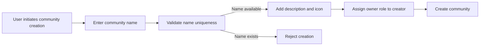
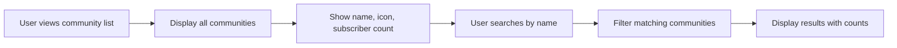
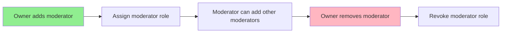
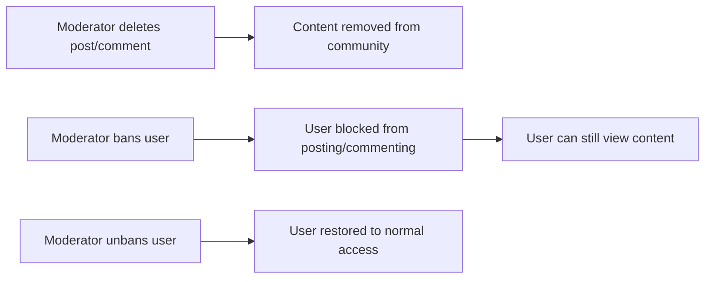
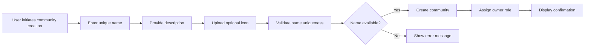
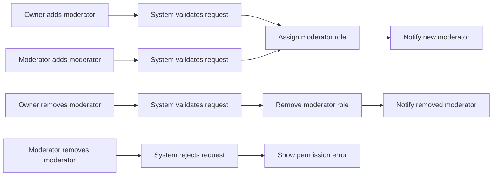

**redditPlatform — What operations users can perform, use cases, business workflows**

What operations users can perform, use cases, business workflows

# Core Business Operations

What the system must do for each business concept.

## User Operations

Users create accounts by providing an email address, password, and choosing a unique username. Email addresses must be unique among active accounts to prevent duplicate registrations. Passwords must meet security requirements to protect user accounts. Users log in with their email and password to access the platform. Account deletion removes the user account and all their associated posts and comments from the platform. Users maintain personal profiles with display names, bio text, and avatar images. Profile information is publicly viewable by any user on the platform. Users can edit their own display name, bio, and avatar at any time. Each user has a karma score that reflects community engagement through upvotes and downvotes on their content. Profile pages display total karma scores and lists of all posts and comments created by that user.

### Account Registration

WHEN a guest registers for an account, THE system SHALL:
1. Require a valid email address
2. Require a password that meets security requirements
3. Require a unique username
4. Create a new user account with the provided credentials
5. Initialize the user's karma score to zero

IF the email address is already registered to an active account, THE system SHALL reject the registration.
IF the username is already taken by another user, THE system SHALL reject the registration.
IF the password does not meet security requirements, THE system SHALL reject the registration.
IF the email format is invalid, THE system SHALL reject the registration.
IF the username contains invalid characters, THE system SHALL reject the registration.

WHEN registration is successful, THE system SHALL:
1. Create the user account
2. Log the user in automatically
3. Redirect the user to their profile page

### User Login Authentication

WHEN a user logs in, THE system SHALL:
1. Accept email and password credentials
2. Verify the email exists in the system
3. Verify the password matches the stored hash
4. Create an authenticated session
5. Redirect the user to their home feed

IF the email does not exist, THE system SHALL reject the login attempt.
IF the password does not match, THE system SHALL reject the login attempt.
IF the account has been deleted, THE system SHALL reject the login attempt.

WHEN a user is authenticated, THE system SHALL:
1. Maintain the session for the duration of the visit
2. Allow access to member-only features
3. Display the user's username in the interface

WHEN a user logs out, THE system SHALL:
1. Terminate the current session
2. Redirect the user to the popular feed

### Account Deletion and Password Management

WHEN a user changes their password, THE system SHALL:
1. Require the current password for verification
2. Require a new password that meets security requirements
3. Update the password hash in the system
4. Invalidate all existing sessions except the current one

IF the current password is incorrect, THE system SHALL reject the password change.
IF the new password does not meet security requirements, THE system SHALL reject the password change.

WHEN a user deletes their account, THE system SHALL:
1. Require confirmation of the deletion action
2. Require password verification for security
3. Remove the user account from the system
4. Delete all posts created by the user
5. Delete all comments created by the user
6. Remove the user from all community subscriptions
7. Remove the user from all community moderator lists
8. Preserve the content of other users' posts and comments

IF the user does not confirm the deletion, THE system SHALL cancel the operation.
IF the password verification fails, THE system SHALL reject the deletion.

### Profile Management

WHEN a user manages their profile, THE system SHALL:
1. Display the current display name, bio, and avatar
2. Allow editing of the display name
3. Allow editing of the bio text
4. Allow updating of the avatar image
5. Save changes immediately upon submission

WHEN a user edits their display name, THE system SHALL:
1. Accept the new display name
2. Update the profile immediately
3. Reflect the change across all user content

IF the display name is empty, THE system SHALL reject the change.

WHEN a user edits their bio, THE system SHALL:
1. Accept the new bio text
2. Update the profile immediately
3. Allow empty bio text

WHEN a user updates their avatar, THE system SHALL:
1. Accept an image file upload
2. Process and store the image
3. Display the new avatar across all user content

IF the image upload fails, THE system SHALL keep the existing avatar.

### Karma Score Tracking

WHEN a user's content receives votes, THE system SHALL:
1. Track upvotes and downvotes on posts
2. Track upvotes and downvotes on comments
3. Adjust the user's karma score accordingly
4. Update the karma score immediately

WHEN someone upvotes a user's post or comment, THE system SHALL increase the user's karma by 1.
WHEN someone downvotes a user's post or comment, THE system SHALL decrease the user's karma by 1.
WHEN someone removes their vote from a user's content, THE system SHALL adjust the karma score accordingly.

WHEN a user's vote is removed from their own content, THE system SHALL NOT adjust the karma score.

WHEN the karma score changes, THE system SHALL:
1. Update the user's total karma score
2. Display the updated score on the user's profile
3. Allow negative karma scores

### Public Profile Viewing and User Content Listing

WHEN a guest views a user's profile, THE system SHALL:
1. Display the user's display name
2. Display the user's bio text
3. Display the user's avatar image
4. Display the user's total karma score
5. Display a list of all posts created by the user
6. Display a list of all comments created by the user

WHEN a member views a user's profile, THE system SHALL:
1. Display all the same information as for guests
2. Allow the member to subscribe to communities the user has created

WHEN viewing a user's posts, THE system SHALL:
1. Show all posts created by the user
2. Display post title, community, vote score, and creation time
3. Paginate the post list

WHEN viewing a user's comments, THE system SHALL:
1. Show all comments created by the user
2. Display comment content, post, vote score, and creation time
3. Paginate the comment list

IF the user account has been deleted, THE system SHALL display a message indicating the user no longer exists.

## Community Operations

Any registered user can create a new community on the platform. Communities require a unique name, description text, and icon image for identification. The user who creates a community automatically becomes its owner with full administrative privileges. Users can browse through all communities available on the platform in a list view. Community search functionality allows users to find communities by name. Each community page displays its subscriber count to show community size and popularity. Community owners have the authority to add and remove moderators from their community. Moderators can add other moderators but cannot remove the owner or each other. Moderators can delete any post or comment within their community. Moderators can ban and unban users from their community. Banned users cannot create posts or comments but can still view community content.

### Community Creation

WHEN a user creates a community, THE system SHALL:
1. Require a unique community name that does not conflict with existing communities
2. Require a description text that explains the community's purpose
3. Require an icon image for community identification
4. Automatically assign the creating user as the community owner
5. Associate the community with the creating user's account

IF the community name already exists, THE system SHALL reject the creation request.
IF the community name is empty or invalid, THE system SHALL reject the creation request.
IF the description text is missing or exceeds the maximum length, THE system SHALL reject the creation request.
IF the icon image upload fails, THE system SHALL reject the creation request.

THE system SHALL ensure the owner has full administrative privileges over the community.
THE system SHALL prevent duplicate community names from being created.

### Community Discovery and Search

WHEN a user browses communities, THE system SHALL:
1. Display a list of all communities on the platform
2. Show each community's name and icon
3. Display the subscriber count for each community
4. Paginate the community list for efficient browsing

WHEN a user searches for communities, THE system SHALL:
1. Accept a search query based on community name
2. Filter communities matching the search query
3. Display matching communities with their subscriber counts
4. Return no results when no communities match the search

IF no communities match the search query, THE system SHALL display an empty result set.
IF the search query is empty, THE system SHALL return all communities.

THE system SHALL allow any registered user to browse communities.
THE system SHALL allow any registered user to search communities by name.
THE system SHALL display subscriber counts to indicate community popularity.

### Moderator Role Assignment

WHEN a community owner assigns moderators, THE system SHALL:
1. Allow the owner to add moderators to the community
2. Allow moderators to add other moderators to the community
3. Record the moderator-role relationship with the community
4. Display the list of moderators on the community page

WHEN a community owner removes moderators, THE system SHALL:
1. Allow the owner to remove any moderator from the community
2. Prevent moderators from removing the community owner
3. Prevent moderators from removing other moderators
4. Remove the moderator-role relationship when removal occurs

IF a user is not the owner, THE system SHALL prevent them from removing the owner.
IF a user is a moderator but not the owner, THE system SHALL prevent them from removing other moderators.

THE system SHALL ensure the owner retains ultimate authority over moderator management.
THE system SHALL notify moderators when they are added or removed from a community.

### Moderator Privileges and User Banning

WHEN a moderator performs moderation actions, THE system SHALL:
1. Allow moderators to delete any post in their community
2. Allow moderators to delete any comment in their community
3. Allow moderators to ban users from their community
4. Allow moderators to unban previously banned users
5. Allow moderators to view the list of banned users
6. Restrict these actions to the moderator's own community only

WHILE a user is banned from a community, THE system SHALL:
1. Prevent the banned user from creating new posts in that community
2. Prevent the banned user from creating new comments in that community
3. Allow the banned user to view community content and existing posts
4. Allow the banned user to view existing comments in the community

IF a banned user attempts to create a post, THE system SHALL reject the request.
IF a banned user attempts to create a comment, THE system SHALL reject the request.
IF a non-moderator attempts moderation actions, THE system SHALL reject the request.

THE system SHALL ensure moderators can only act within their assigned communities.
THE system SHALL maintain the ban status until explicitly removed by a moderator or owner.

### Banned User Restrictions and Unbanning

WHEN a user is banned from a community, THE system SHALL:
1. Record the ban status associated with the user and community
2. Prevent the banned user from creating posts in that community
3. Prevent the banned user from creating comments in that community
4. Allow the banned user to browse and view the community
5. Allow the banned user to view posts and comments in the community

WHEN a user is unbanned from a community, THE system SHALL:
1. Remove the ban status from the user-community relationship
2. Restore the user's ability to create posts in that community
3. Restore the user's ability to create comments in that community
4. Allow the user to subscribe to the community if desired

IF a banned user attempts to post, THE system SHALL display an access denied message.
IF a banned user attempts to comment, THE system SHALL display an access denied message.

THE system SHALL ensure banned users retain viewing access to community content.
THE system SHALL allow moderators and owners to view the list of banned users.
THE system SHALL allow moderators and owners to unban users at their discretion.

## Post Operations

Users can create posts in any community they are subscribed to. Each post requires a title and must be one of three types: text post with content, link post with a URL, or image post with an uploaded image. Users can edit their own posts after creation. Users can delete their own posts at any time. When viewing a single post, users see the title, full content, author username, community name, vote score, comment count, and posting timestamp. Post feeds display posts in different ways: home feed shows posts from subscribed communities, popular feed shows posts from all communities, and community feed shows posts from a specific community. All feeds support sorting options including hot, new, top, and controversial. Post list displays show title, author, community, vote score, comment count, time since posted, and content previews.

### Post Creation

WHEN a user creates a post, THE system SHALL:
1. Require the user to be subscribed to the target community
2. Require a post title to be provided
3. Require the user to select one of three post types: text, link, or image
4. For text posts, require text content to be provided
5. For link posts, require a valid URL to be provided
6. For image posts, require an image file to be uploaded
7. Associate the post with the creating user as the author
8. Associate the post with the selected community
9. Record the creation timestamp

IF the user is not subscribed to the community, THE system SHALL reject the post creation request.
IF the title is missing, THE system SHALL reject the post creation request.
IF the post type is not specified, THE system SHALL reject the post creation request.
IF a text post is selected without content, THE system SHALL reject the post creation request.
IF a link post is selected without a URL, THE system SHALL reject the post creation request.
IF an image post is selected without an image, THE system SHALL reject the post creation request.
IF the user is banned from the community, THE system SHALL reject the post creation request.

### Post Management

WHEN a user edits their own post, THE system SHALL:
1. Allow the user to update the post title
2. Allow the user to update the post content (text, URL, or image based on post type)
3. Preserve the original creation timestamp
4. Record the update timestamp
5. Maintain the post's vote score and comment count

WHEN a user deletes their own post, THE system SHALL:
1. Remove the post from all feeds
2. Remove the post from the community feed
3. Remove all associated votes on the post
4. Remove all comments on the post and their associated votes
5. Update the author's karma if votes are removed

IF the user is not the post author, THE system SHALL reject the edit request.
IF the user is not the post author, THE system SHALL reject the deletion request.
IF the post has been deleted, THE system SHALL reject any edit or deletion requests.

### Single Post Viewing

WHEN a user views a single post, THE system SHALL display:
1. The post title
2. The full post content (text, image, or link)
3. The author's username
4. The community name
5. The current vote score
6. The total comment count
7. The time since the post was created
8. A list of all comments on the post with their replies

WHEN viewing a single post, THE system SHALL:
1. Allow any user to view posts in public communities
2. Allow banned users to view posts but not interact
3. Display vote score as total upvotes minus total downvotes
4. Display comment count as total number of comments including nested replies
5. Display time as relative duration (e.g., "3 hours ago")

IF the post does not exist, THE system SHALL display an error.
IF the post belongs to a private community and the user is not a subscriber, THE system SHALL deny access.

### Post Feed Access

WHEN a logged-in user accesses the home feed, THE system SHALL:
1. Display posts only from communities the user is subscribed to
2. Exclude posts from communities the user has not subscribed to
3. Apply the selected sorting option to the feed
4. Paginate the results

WHEN any user (logged-in or logged-out) accesses the popular feed, THE system SHALL:
1. Display posts from all communities across the platform
2. Apply the selected sorting option to the feed
3. Paginate the results

WHEN any user accesses a community feed, THE system SHALL:
1. Display posts only from the selected community
2. Apply the selected sorting option to the feed
3. Paginate the results
4. Show the community name and subscriber count

IF the user is not logged in, THE system SHALL deny access to the home feed.
IF the community does not exist, THE system SHALL display an error for the community feed.

### Feed Sorting and Display

WHEN a user views any post feed, THE system SHALL provide sorting options:
1. Hot: display posts with recent activity and high upvote counts first
2. New: display posts by most recent creation time first
3. Top: display posts by highest vote score first, with time filter options (today, this week, this month, this year, all time)
4. Controversial: display posts with many votes but score close to zero first

WHEN a feed displays posts in list format, THE system SHALL show for each post:
1. The post title
2. The author's username
3. The community name
4. The vote score
5. The comment count
6. The time since posted (e.g., "3 hours ago")
7. For text posts: the first 200 characters of content as preview
8. For image posts: a thumbnail of the uploaded image
9. For link posts: the domain name of the URL (e.g., "youtube.com")

IF the Top sort is selected without a time filter, THE system SHALL default to "all time".
IF no posts match the feed criteria, THE system SHALL display an empty state message.

### Post Voting Integration

WHEN a user views a post, THE system SHALL display the current vote score.

WHEN a user casts a vote on a post, THE system SHALL:
1. Allow only one vote per user per post
2. Update the vote score immediately
3. Adjust the author's karma based on the vote
4. Record the vote timestamp

WHEN a user changes their vote on a post, THE system SHALL:
1. Remove the previous vote
2. Apply the new vote
3. Adjust the vote score accordingly
4. Adjust the author's karma accordingly

WHEN a user removes their vote from a post, THE system SHALL:
1. Remove the vote record
2. Adjust the vote score accordingly
3. Adjust the author's karma accordingly

IF the user has already voted on the post, THE system SHALL allow vote change or removal instead of creating a new vote.
IF the post has been deleted, THE system SHALL reject any vote actions.

## Comment Operations

Users can write comments on any post on the platform. Users can reply to any existing comment, creating nested reply threads with no depth limit. Each comment displays the author username, content, vote score, time since posted, and nested replies. Users can edit their own comments after posting. Users can delete their own comments at any time. Comment sorting options include best by vote score, new by most recent, and controversial by many votes with scores close to zero. Comment voting follows the same rules as post voting. Each comment shows engagement metrics including vote score and reply count. Nested replies maintain the same display format as top-level comments. Deleted comments are removed from the comment thread entirely.

### Comment Creation

WHEN a user creates a comment on a post, THE system SHALL:
1. Require the comment to have content text
2. Associate the comment with the user who created it
3. Link the comment to the specific post
4. Record the creation timestamp
5. Initialize the vote score to zero

WHEN a user creates a reply to a comment, THE system SHALL:
1. Require the reply to have content text
2. Associate the reply with the user who created it
3. Link the reply to the parent comment
4. Record the creation timestamp
5. Initialize the vote score to zero

IF the post has been deleted, THE system SHALL prevent the user from creating a comment on that post.
IF the parent comment has been deleted, THE system SHALL prevent the user from replying to that comment.
IF the user is banned from the community containing the post, THE system SHALL prevent the user from creating a comment.

WHEN a comment is created, THE system SHALL:
1. Display the comment immediately in the comment thread
2. Include the comment in the user's activity history
3. Notify relevant community moderators if the content is reported

### Comment Reply Threading

WHEN a user replies to a comment, THE system SHALL:
1. Create a nested reply under the parent comment
2. Maintain the parent-child relationship between comments
3. Allow unlimited nesting depth for replies
4. Display replies indented under their parent comment

WHILE viewing a comment thread, THE system SHALL:
1. Show all replies nested under their respective parent comments
2. Maintain the hierarchical structure of the comment tree
3. Display each level of nesting with appropriate indentation
4. Preserve the order of replies based on the selected sorting method

IF a comment has multiple replies, THE system SHALL:
1. Display all replies as a group under the parent comment
2. Allow each reply to have its own nested replies
3. Support unlimited depth of nested reply levels

WHEN a user creates a reply, THE system SHALL:
1. Associate the reply with the same post as the parent comment
2. Inherit the community context from the parent comment
3. Apply the same voting rules as top-level comments

### Comment Display Format

WHEN a comment is displayed, THE system SHALL:
1. Show the author's username prominently
2. Display the comment content in full
3. Show the current vote score
4. Display the time since the comment was posted (e.g., "3 hours ago")
5. Show the number of nested replies for that comment

WHEN a top-level comment is displayed, THE system SHALL:
1. Include all direct replies nested underneath
2. Show each nested reply with the same display format as top-level comments
3. Maintain consistent formatting across all nesting levels

WHEN viewing a nested reply, THE system SHALL:
1. Display the reply author's username
2. Show the reply content
3. Display the reply vote score
4. Show the time since the reply was posted
5. Indicate if the reply has its own nested replies

IF a comment has been deleted, THE system SHALL:
1. Remove the comment content from the thread
2. Remove all nested replies under that comment
3. Adjust the comment count on the parent post accordingly

### Comment Editing and Deletion

WHEN a user edits their own comment, THE system SHALL:
1. Allow the user to modify the comment content text
2. Preserve the original creation timestamp
3. Record that the comment has been edited
4. Update the displayed content immediately

WHEN a user deletes their own comment, THE system SHALL:
1. Remove the comment content from the thread
2. Remove all nested replies under that comment
3. Adjust the comment count on the parent post
4. Remove all votes associated with the deleted comment
5. Adjust karma scores for affected users accordingly

IF a moderator deletes a comment in their community, THE system SHALL:
1. Remove the comment content from the thread
2. Remove all nested replies under that comment
3. Adjust the comment count on the parent post
4. Remove all votes associated with the deleted comment
5. Adjust karma scores for affected users accordingly

IF the user does not own the comment, THE system SHALL:
1. Prevent the user from editing the comment
2. Prevent the user from deleting the comment (unless they are a moderator of the community)

### Comment Sorting Options

WHEN a user sorts comments by best, THE system SHALL:
1. Order comments by vote score (highest first)
2. Display the highest-voted comments at the top
3. Apply the same sorting to nested replies within each comment

WHEN a user sorts comments by new, THE system SHALL:
1. Order comments by creation timestamp (most recent first)
2. Display the newest comments at the top
3. Apply the same sorting to nested replies within each comment

WHEN a user sorts comments by controversial, THE system SHALL:
1. Order comments with many votes but scores close to zero first
2. Calculate controversy based on vote volume and score proximity to zero
3. Display the most controversial comments at the top
4. Apply the same sorting to nested replies within each comment

WHEN comments are sorted, THE system SHALL:
1. Maintain the nested structure of replies under each parent comment
2. Apply the selected sorting method consistently across the entire thread
3. Update the display immediately when the user changes the sorting option

### Comment Voting Rules

WHEN a user votes on a comment, THE system SHALL:
1. Allow the user to upvote the comment (adds 1 to score)
2. Allow the user to downvote the comment (subtracts 1 from score)
3. Enforce one vote per user per comment
4. Allow the user to change their vote from upvote to downvote or vice versa
5. Allow the user to remove their vote entirely

WHEN a vote is cast on a comment, THE system SHALL:
1. Update the comment's vote score immediately
2. Adjust the author's karma score by +1 for upvote or -1 for downvote
3. Record the vote with a timestamp

WHEN a vote is changed or removed, THE system SHALL:
1. Adjust the comment's vote score accordingly
2. Adjust the author's karma score to reflect the change
3. Remove the previous vote record and record the new vote or removal

IF a user attempts to vote on a deleted comment, THE system SHALL:
1. Reject the vote request
2. Display an error indicating the comment no longer exists

IF a user attempts to vote on their own comment, THE system SHALL:
1. Reject the vote request
2. Display an error indicating self-voting is not allowed

## Vote Operations

Users can upvote posts and comments to express approval. Users can downvote posts and comments to express disapproval. Each user can only cast one vote per post or comment at any time. Users can change their vote from upvote to downvote or vice versa. Users can remove their vote entirely from posts and comments. Vote scores equal total upvotes minus total downvotes. When someone upvotes your content, your karma score increases by one. When someone downvotes your content, your karma score decreases by one. When someone removes their vote, your karma score adjusts accordingly. Karma scores can be negative if downvotes exceed upvotes. Vote changes are reflected immediately in vote scores and karma calculations.

### Vote Casting

WHEN a user casts an upvote on a post, THE system SHALL:
1. Record the upvote associated with the user and post
2. Increase the post's vote score by 1
3. Increase the post author's karma score by 1
4. Prevent the user from casting another vote on the same post

WHEN a user casts an upvote on a comment, THE system SHALL:
1. Record the upvote associated with the user and comment
2. Increase the comment's vote score by 1
3. Increase the comment author's karma score by 1
4. Prevent the user from casting another vote on the same comment

WHEN a user casts a downvote on a post, THE system SHALL:
1. Record the downvote associated with the user and post
2. Decrease the post's vote score by 1
3. Decrease the post author's karma score by 1
4. Prevent the user from casting another vote on the same post

WHEN a user casts a downvote on a comment, THE system SHALL:
1. Record the downvote associated with the user and comment
2. Decrease the comment's vote score by 1
3. Decrease the comment author's karma score by 1
4. Prevent the user from casting another vote on the same comment

THE system SHALL ensure that each user can only have one active vote (upvote or downvote) per post at any time.

THE system SHALL ensure that each user can only have one active vote (upvote or downvote) per comment at any time.

### Vote Modification

WHEN a user changes their vote from upvote to downvote on a post, THE system SHALL:
1. Remove the existing upvote record
2. Record the new downvote
3. Decrease the post's vote score by 2 (from +1 to -1)
4. Decrease the post author's karma score by 2

WHEN a user changes their vote from downvote to upvote on a post, THE system SHALL:
1. Remove the existing downvote record
2. Record the new upvote
3. Increase the post's vote score by 2 (from -1 to +1)
4. Increase the post author's karma score by 2

WHEN a user changes their vote from upvote to downvote on a comment, THE system SHALL:
1. Remove the existing upvote record
2. Record the new downvote
3. Decrease the comment's vote score by 2
4. Decrease the comment author's karma score by 2

WHEN a user changes their vote from downvote to upvote on a comment, THE system SHALL:
1. Remove the existing downvote record
2. Record the new upvote
3. Increase the comment's vote score by 2
4. Increase the comment author's karma score by 2

WHEN a user removes their vote from a post, THE system SHALL:
1. Remove the existing vote record (upvote or downvote)
2. Adjust the post's vote score accordingly (decrease by 1 if upvote was removed, increase by 1 if downvote was removed)
3. Adjust the post author's karma score accordingly

WHEN a user removes their vote from a comment, THE system SHALL:
1. Remove the existing vote record (upvote or downvote)
2. Adjust the comment's vote score accordingly
3. Adjust the comment author's karma score accordingly

### Vote Score and Karma Calculation

THE system SHALL calculate a post's vote score as the total number of upvotes minus the total number of downvotes.

THE system SHALL calculate a comment's vote score as the total number of upvotes minus the total number of downvotes.

THE system SHALL maintain each user's karma score as a cumulative total that can be positive, zero, or negative.

WHEN a user's content receives an upvote, THE system SHALL increase their karma score by 1.

WHEN a user's content receives a downvote, THE system SHALL decrease their karma score by 1.

WHEN a user's vote on content is removed (by the voter), THE system SHALL adjust the content author's karma score accordingly (decrease by 1 if upvote was removed, increase by 1 if downvote was removed).

WHEN a user's vote on content is changed from upvote to downvote, THE system SHALL decrease the content author's karma score by 2.

WHEN a user's vote on content is changed from downvote to upvote, THE system SHALL increase the content author's karma score by 2.

THE system SHALL allow karma scores to be negative when downvotes exceed upvotes.

THE system SHALL reflect vote score and karma changes immediately upon vote casting, modification, or removal.

### Vote Score Display

THE system SHALL display the vote score on each post in post lists and individual post views.

THE system SHALL display the vote score on each comment in comment threads.

WHEN viewing a post in any feed, THE system SHALL display the current vote score alongside other post metadata (title, author, community, comment count, timestamp).

WHEN viewing a comment in a post's comment section, THE system SHALL display the current vote score alongside other comment metadata (author, content, timestamp, replies).

THE system SHALL update the displayed vote score immediately when votes are cast, modified, or removed.

THE system SHALL display vote scores for all posts and comments regardless of the viewer's authentication status (guest or member).

## Report Operations

Users can report any post or comment that violates community guidelines. When reporting content, users must provide a text reason explaining the issue. Reports are submitted to moderators of the community where the content appears. Moderators can view all pending reports for their community. Each report displays the reported content, the user who reported it, and the reason provided. Moderators can approve a report, which deletes the reported content. Moderators can dismiss a report, which keeps the content and removes the report from the list. Approved reports result in permanent content removal. Dismissed reports are removed from the moderator report queue. Moderators have the authority to make final decisions on all reports in their community.

### Report Creation

WHEN a user reports a post, THE system SHALL:
1. Require the user to provide a text reason for the report
2. Record the reported post and the reporting user
3. Associate the report with the community where the post belongs
4. Set the report status to pending
5. Make the report visible to community moderators

WHEN a user reports a comment, THE system SHALL:
1. Require the user to provide a text reason for the report
2. Record the reported comment and the reporting user
3. Associate the report with the community where the post belongs
4. Set the report status to pending
5. Make the report visible to community moderators

IF the report reason is empty or missing, THE system SHALL reject the report submission.

THE system SHALL prevent users from reporting the same content multiple times.

THE system SHALL prevent users from reporting their own content.

THE system SHALL allow users to report content even if they are not subscribed to the community.

### Report Viewing

WHEN a moderator views reports for their community, THE system SHALL:
1. Display all pending reports for posts and comments in their community
2. Show the reported content (post title and content, or comment text)
3. Display the reporter's username for identification
4. Show the reason provided by the reporter
5. Display when the report was submitted
6. Distinguish between post reports and comment reports

THE system SHALL display reports in a list format with key information visible.

THE system SHALL allow moderators to view the full reported content in context.

WHILE a report is pending, THE system SHALL keep it visible in the moderator report queue.

THE system SHALL only show reports from the moderator's own community.

THE system SHALL not show reports from communities where the user is not a moderator.

### Report Resolution

WHEN a moderator approves a report, THE system SHALL:
1. Permanently delete the reported content (post or comment)
2. Change the report status to approved
3. Remove the report from the pending report queue
4. Record that the moderator took this action

WHEN a moderator dismisses a report, THE system SHALL:
1. Keep the reported content visible to users
2. Change the report status to dismissed
3. Remove the report from the pending report queue
4. Record that the moderator took this action

IF the reported content is a post, THE system SHALL delete all associated comments when the post is deleted.

IF the reported content is a comment, THE system SHALL preserve any replies to that comment.

THE system SHALL allow moderators to make final decisions on all reports in their community.

THE system SHALL enforce community guidelines through moderator report decisions.

Approved reports result in permanent content removal that cannot be restored.

Dismissed reports are removed from the moderator view but remain logged for audit purposes.

## Subscription Operations

Users can subscribe to any community on the platform. Users can unsubscribe from any community they are subscribed to. Users can view a list of all communities they are currently subscribed to. Subscribing to a community is required before creating posts in that community. Subscribed communities appear in the user's home feed. Unsubscribing removes the community from the user's home feed. Subscription status does not affect the ability to view community content or posts. Users can resubscribe to communities they previously unsubscribed from. Community subscriber counts update when users subscribe or unsubscribe. Subscription management is available through the user interface at any time.

### Community Subscription

WHEN a member wants to subscribe to a community, THE system SHALL:
1. Allow the member to initiate a subscription to any community
2. Verify the member is authenticated before processing the subscription
3. Create a subscription relationship between the member and the community
4. Update the community's subscriber count to reflect the new subscription
5. Add the community to the member's subscribed communities list

WHEN a guest attempts to subscribe to a community, THE system SHALL:
1. Redirect the guest to the login or registration page
2. Prevent the subscription from being created until authentication is complete

IF the member is already subscribed to the community, THE system SHALL:
1. Display that the subscription already exists
2. Prevent creation of a duplicate subscription
3. Offer the option to unsubscribe instead

IF the community does not exist, THE system SHALL:
1. Reject the subscription request
2. Display an appropriate error message to the member

IF the member has been banned from the community, THE system SHALL:
1. Prevent the subscription from being created
2. Display an error indicating the ban status

### Community Unsubscription

WHEN a member wants to unsubscribe from a community, THE system SHALL:
1. Allow the member to initiate an unsubscription from any community they are subscribed to
2. Remove the subscription relationship between the member and the community
3. Update the community's subscriber count to reflect the removal
4. Remove the community from the member's subscribed communities list
5. Remove the community's posts from the member's home feed

WHEN a member unsubscribes from a community, THE system SHALL:
1. Allow the member to resubscribe to the same community at a later time
2. Preserve the member's ability to view the community's public content after unsubscription
3. Preserve the member's ability to view the community's posts after unsubscription

IF the member is not subscribed to the community, THE system SHALL:
1. Display that no subscription exists
2. Prevent the unsubscription operation from proceeding
3. Offer the option to subscribe instead

IF the member is the owner of the community, THE system SHALL:
1. Allow the unsubscription but warn about potential ownership implications
2. Prevent deletion of the community ownership role through unsubscription

### Subscription List Viewing

WHEN a member views their subscription list, THE system SHALL:
1. Display all communities the member is currently subscribed to
2. Show the community name for each subscribed community
3. Show the community icon for each subscribed community
4. Show the subscriber count for each subscribed community
5. Allow the member to navigate to any community from the list
6. Allow the member to unsubscribe from any community directly from the list

WHEN a member has no subscribed communities, THE system SHALL:
1. Display an empty state message indicating no subscriptions exist
2. Provide suggestions or links to browse available communities
3. Allow the member to search for communities to subscribe to

IF the subscription list is large, THE system SHALL:
1. Paginate the results for manageable display
2. Maintain consistent ordering across pagination

### Subscription Requirement for Posting

WHEN a member attempts to create a post in a community, THE system SHALL:
1. Verify the member is subscribed to that community
2. Allow the post creation if the subscription exists
3. Reject the post creation if no subscription exists
4. Display an error message indicating subscription is required
5. Provide a link or option to subscribe to the community

WHEN a member is not subscribed to a community, THE system SHALL:
1. Display a message indicating subscription is required before posting
2. Prevent access to the post creation interface for that community
3. Offer a clear path to subscribe to the community

IF the member has been banned from the community, THE system SHALL:
1. Prevent post creation even if subscribed
2. Display an error indicating the ban status

IF the community does not exist or has been deleted, THE system SHALL:
1. Prevent post creation
2. Display an appropriate error message

### Home Feed Subscription Filter

WHEN a member views their home feed, THE system SHALL:
1. Display posts only from communities the member is subscribed to
2. Exclude posts from communities the member is not subscribed to
3. Include posts from all subscribed communities in the feed
4. Apply the selected sorting option to filter and order the posts

WHEN a member unsubscribes from a community, THE system SHALL:
1. Immediately remove that community's posts from the home feed
2. Update the feed to reflect the current subscription list

WHEN a member subscribes to a new community, THE system SHALL:
1. Include posts from that community in the home feed
2. Update the feed to reflect the new subscription

IF the member has no subscribed communities, THE system SHALL:
1. Display an empty state in the home feed
2. Suggest communities to subscribe to
3. Provide links to browse popular communities

IF the member is not logged in, THE system SHALL:
1. Prevent access to the home feed
2. Redirect to the popular feed or login page

### Subscriber Count Updates

WHEN a member subscribes to a community, THE system SHALL:
1. Immediately increment the community's subscriber count by one
2. Display the updated subscriber count to all viewers of the community
3. Ensure the count reflects all active subscriptions

WHEN a member unsubscribes from a community, THE system SHALL:
1. Immediately decrement the community's subscriber count by one
2. Display the updated subscriber count to all viewers of the community
3. Ensure the count never displays a negative value

WHEN a member resubscribes to a previously unsubscribed community, THE system SHALL:
1. Increment the subscriber count accordingly
2. Reflect the change in real-time across the platform

IF the subscriber count update fails, THE system SHALL:
1. Roll back the subscription operation
2. Display an error to the member
3. Prevent the subscription from being recorded

### Subscription Status Independence

WHEN a member's subscription status changes, THE system SHALL:
1. Not affect the member's ability to view the community's public content
2. Not affect the member's ability to view posts in the community
3. Not affect the member's ability to view comments in the community
4. Only affect the member's ability to create new posts in that community

WHEN a member unsubscribes from a community, THE system SHALL:
1. Preserve the member's existing posts in that community
2. Preserve the member's existing comments in that community
3. Allow the member to view their own past content in the community
4. Allow other users to view the member's past content in the community

WHEN a member resubscribes to a community, THE system SHALL:
1. Restore posting capabilities immediately
2. Not require re-verification or additional steps
3. Treat the member as a regular subscriber with full posting rights

IF the member is banned from a community, THE system SHALL:
1. Prevent posting and commenting regardless of subscription status
2. Still allow viewing of community content if the ban does not restrict viewing
3. Display appropriate messaging about the ban status

# Business Actions and Workflows

Business actions and workflows beyond basic CRUD.

## User Actions

Users create new accounts by providing an email address, password, and choosing a unique username. The system validates that the email is not already associated with an active account and that the username is unique across the platform. Users log in with their registered email and password to access their account. Once logged in, users can change their password at any time for security purposes. Users have the ability to delete their own account, which triggers cascading deletion of all their posts and comments across the platform. Each user maintains a profile containing a display name, bio text, and avatar image that can be customized. Users can edit their own display name, bio, and avatar at any time. Any user can view another user's public profile page, which displays their karma score, posts, and comments. Account deletion is permanent and removes all user-generated content from the platform. The system prevents duplicate registrations by checking email and username uniqueness during account creation.

### Account Registration

WHEN a user creates a new account, THE system SHALL:
1. Require an email address
2. Require a password
3. Require a unique username
4. Validate that the email is not already associated with an active account
5. Validate that the username is unique across the platform
6. Create the user account with the provided information

IF the email is already registered, THE system SHALL reject the registration request.
IF the username is already taken, THE system SHALL reject the registration request.
IF the password does not meet security requirements, THE system SHALL reject the registration request.

WHEN the registration is successful, THE system SHALL:
1. Create the user account
2. Initialize the user with a karma score of zero
3. Create an empty profile with default values

### Login and Authentication

WHEN a user attempts to log in, THE system SHALL:
1. Require the registered email address
2. Require the password
3. Validate the credentials against stored account information
4. Create an authenticated session upon successful validation

IF the email is not registered, THE system SHALL reject the login attempt.
IF the password does not match the stored credentials, THE system SHALL reject the login attempt.

WHEN a user is successfully authenticated, THE system SHALL:
1. Grant access to member-only features
2. Maintain the session for subsequent requests
3. Allow access to the home feed and subscribed communities

### Password Management

WHEN a logged-in user wants to change their password, THE system SHALL:
1. Require the current password for verification
2. Require a new password that meets security requirements
3. Update the password hash in the system
4. Invalidate existing sessions for security

IF the current password is incorrect, THE system SHALL reject the password change request.
IF the new password does not meet security requirements, THE system SHALL reject the password change request.

WHEN the password is successfully changed, THE system SHALL:
1. Update the stored password hash
2. Require re-authentication for all active sessions

### Account Deletion

WHEN a user requests to delete their account, THE system SHALL:
1. Require authentication to verify account ownership
2. Confirm the deletion request with the user
3. Permanently remove the user account from the system
4. Cascade delete all posts created by the user
5. Cascade delete all comments created by the user
6. Remove the user from all community subscriptions
7. Remove the user from all vote records
8. Remove the user from all report records

IF the user is a community owner, THE system SHALL require the community to be transferred or deleted first.

WHEN the account deletion completes, THE system SHALL:
1. Remove all user data from the platform
2. Invalidate all active sessions
3. Make the username available for future registration

### Profile Management

WHEN a user edits their profile, THE system SHALL:
1. Allow updating the display name
2. Allow updating the bio text
3. Allow uploading a new avatar image
4. Validate that the display name is not empty
5. Persist all changes to the user profile

WHEN a user uploads an avatar image, THE system SHALL:
1. Accept image file uploads
2. Validate the file format and size
3. Store the image and associate it with the user profile
4. Generate a thumbnail for display purposes

IF the display name is empty, THE system SHALL reject the profile update.
IF the bio text exceeds the maximum length, THE system SHALL reject the profile update.
IF the avatar image does not meet requirements, THE system SHALL reject the upload.

WHEN the profile update is successful, THE system SHALL:
1. Save the new display name, bio, and avatar
2. Update the profile visible to all users

### Public Profile Viewing

WHEN a user views another user's public profile, THE system SHALL:
1. Display the user's display name
2. Display the user's bio text
3. Display the user's avatar image
4. Display the user's total karma score
5. Display a list of all posts created by the user
6. Display a list of all comments created by the user

WHEN displaying the user's posts, THE system SHALL:
1. Show all posts created by the user across all communities
2. Display post title, community name, vote score, and creation time
3. Apply pagination to the post list

WHEN displaying the user's comments, THE system SHALL:
1. Show all comments created by the user across all posts
2. Display comment content, vote score, and creation time
3. Apply pagination to the comment list

WHILE viewing a profile, THE system SHALL:
1. Allow any user (including guests) to view public profile information
2. Hide private information not intended for public display
3. Update the karma score in real-time as votes change

### Karma Score Display

WHEN displaying a user's karma score, THE system SHALL:
1. Show the total karma as a single numeric value
2. Include positive karma from upvotes on posts and comments
3. Include negative karma from downvotes on posts and comments
4. Update the score when votes are cast, changed, or removed

WHEN a user receives an upvote on their post or comment, THE system SHALL:
1. Increase their karma score by 1

WHEN a user receives a downvote on their post or comment, THE system SHALL:
1. Decrease their karma score by 1

WHEN a user removes their vote from another user's content, THE system SHALL:
1. Adjust the karma score accordingly
2. Reverse the previous vote effect

WHILE displaying karma, THE system SHALL:
1. Allow karma to be negative
2. Display the karma score prominently on the user's profile
3. Show the karma score next to the user's name in posts and comments

## Community Actions

Any registered user can create a new community by providing a unique name, description text, and optional icon image. The community creator automatically becomes the owner with the highest authority level. Community names must be unique across the entire platform to prevent confusion. Users can browse all communities through a searchable list view. Users can search for communities by name using text search functionality. Each community displays its subscriber count to show its popularity. Community owners can add other users as moderators to help manage the community. Owners can remove moderators they have added, but moderators cannot remove each other or the owner. Moderators can add additional moderators but cannot remove the owner or other moderators. Community content is publicly viewable, but posting requires subscription. The system validates community name uniqueness during creation to prevent duplicates.

### Community Creation Workflow

WHEN a user creates a community, THE system SHALL:
1. Require a unique community name
2. Accept a description text
3. Allow an optional icon image upload
4. Automatically assign the creating user as the community owner
5. Record the creation timestamp

IF the community name already exists, THE system SHALL reject the creation request.
IF the community name is empty or invalid, THE system SHALL reject the creation request.
IF the description exceeds the maximum allowed length, THE system SHALL reject the creation request.

THE system SHALL ensure the owner has full authority over the community.
THE system SHALL notify the owner when moderator actions are performed.

### Owner Role and Authority

THE system SHALL allow any registered user to create a community.
THE system SHALL enforce unique community names across the platform.
THE system SHALL validate community names during creation to prevent duplicates.

WHEN a community is created, THE system SHALL:
1. Assign the creator as the owner with highest authority
2. Initialize subscriber count to zero
3. Make community content publicly viewable
4. Require subscription for posting

IF a user attempts to create a community with an existing name, THE system SHALL display an error indicating the name is unavailable.
IF a user attempts to create a community with an invalid name format, THE system SHALL display appropriate validation feedback.

THE owner SHALL have authority to:
- Add moderators to the community
- Remove moderators from the community
- Delete any posts or comments in the community
- Ban and unban users from the community

Moderators SHALL have authority to:
- Add other moderators to the community
- Delete any posts or comments in the community
- Ban and unban users from the community

Moderators SHALL NOT have authority to:
- Remove the community owner
- Remove other moderators (only the owner can do this)

### Moderator Addition and Removal Workflow

WHEN a community owner adds a moderator, THE system SHALL:
1. Verify the target user exists
2. Confirm the adding user is the owner
3. Assign the moderator role to the target user
4. Notify the new moderator of their role

WHEN a community owner removes a moderator, THE system SHALL:
1. Verify the target user is a moderator
2. Confirm the removing user is the owner
3. Remove the moderator role from the target user
4. Notify the removed moderator

WHEN a moderator adds another moderator, THE system SHALL:
1. Verify the target user exists
2. Confirm the adding user has moderator privileges
3. Assign the moderator role to the target user
4. Notify the new moderator of their role

THE system SHALL prevent moderators from removing the community owner.
THE system SHALL prevent moderators from removing other moderators.
THE system SHALL allow the owner to remove any moderator at any time.

### Community Discovery and Browsing

THE system SHALL allow all users to browse all communities through a list view.
THE system SHALL allow all users to search for communities by name.
THE system SHALL display subscriber count for each community.
THE system SHALL make all community content publicly viewable.

WHEN a user browses communities, THE system SHALL:
1. Display a list of all available communities
2. Show community name, icon, and description for each
3. Display subscriber count for each community
4. Support pagination for large result sets

WHEN a user searches for communities by name, THE system SHALL:
1. Accept text input for search queries
2. Return matching communities based on name
3. Display results with community name, icon, description, and subscriber count
4. Handle cases where no matches are found

WHEN a user views a community page, THE system SHALL display:
1. Community name and icon
2. Community description
3. Subscriber count
4. List of posts in the community
5. Options to subscribe or unsubscribe (for logged-in users)

THE system SHALL allow users to filter communities by various criteria.
THE system SHALL update subscriber count in real-time when users subscribe or unsubscribe.

### Subscription Requirements for Posting

THE system SHALL require users to subscribe to a community before posting in it.
THE system SHALL allow users to subscribe to any community.
THE system SHALL allow users to unsubscribe from any community they are subscribed to.

WHEN a user attempts to create a post without being subscribed, THE system SHALL:
1. Prevent the post creation
2. Display a message indicating subscription is required
3. Offer an option to subscribe first

WHEN a user subscribes to a community, THE system SHALL:
1. Record the subscription relationship
2. Increment the community's subscriber count
3. Add the community to the user's subscribed communities list
4. Include posts from this community in the user's home feed

WHEN a user unsubscribes from a community, THE system SHALL:
1. Remove the subscription relationship
2. Decrement the community's subscriber count
3. Remove the community from the user's subscribed communities list
4. Exclude posts from this community from the user's home feed

IF a user is banned from a community, THE system SHALL:
1. Prevent the user from subscribing to that community
2. Prevent the user from posting or commenting in that community
3. Allow the user to still view community content

THE system SHALL prevent duplicate subscriptions from the same user to the same community.

## Post Actions

Users can create posts only in communities they are subscribed to, enforcing subscription requirements. Every post requires a title, which is mandatory for all post types. Users can create three types of posts: text posts with content, link posts with URLs, or image posts with uploaded images. Users can edit their own posts after creation to correct or update content. Users can delete their own posts at any time, removing them from the community feed. When viewing a single post, users see the title, full content, author username, community name, vote score, comment count, and posting timestamp. Moderators can delete any post in their community regardless of author. The system enforces subscription requirements before allowing post creation in a community. Post edits preserve the original authorship and community association. Deleted posts are permanently removed and cannot be recovered. Post content is displayed differently based on type, with text showing content preview, links showing domain, and images showing thumbnails.

### Post Creation Workflow

WHEN a user creates a post, THE system SHALL:
1. Verify the user is subscribed to the target community
2. Require a post title as mandatory input
3. Accept exactly one post type: text, link, or image
4. Validate post content based on selected type
5. Associate the post with the creating user as author
6. Associate the post with the target community
7. Record the creation timestamp
8. Initialize vote score to zero
9. Initialize comment count to zero

WHEN a user attempts to create a post in a community they are not subscribed to, THE system SHALL reject the request.

WHEN a user creates a text post, THE system SHALL:
1. Require text content field
2. Store the full text content for display

WHEN a user creates a link post, THE system SHALL:
1. Require a URL field
2. Validate the URL format
3. Extract and store the domain name for display

WHEN a user creates an image post, THE system SHALL:
1. Require an image upload
2. Generate a thumbnail for feed display
3. Store the full image for single post view

IF the user is banned from the community, THE system SHALL reject the post creation request.

IF the post title is empty or missing, THE system SHALL reject the request.

IF the post content is invalid for the selected type, THE system SHALL reject the request.

### Post Editing and Deletion

WHEN a user edits their own post, THE system SHALL:
1. Verify the user is the post author
2. Allow modification of the post title
3. Allow modification of the post content
4. Preserve the original authorship
5. Preserve the community association
6. Maintain the creation timestamp
7. Preserve existing vote score
8. Preserve existing comment count

WHEN a user deletes their own post, THE system SHALL:
1. Verify the user is the post author
2. Permanently remove the post from the community feed
3. Remove the post from all user feeds
4. Remove all associated votes on the post
5. Remove all comments on the post
6. Record the deletion as irreversible

WHEN a moderator deletes any post in their community, THE system SHALL:
1. Verify the user has moderator role in the target community
2. Permanently remove the post from the community feed
3. Remove the post from all user feeds
4. Remove all associated votes on the post
5. Remove all comments on the post
6. Preserve the deletion record for moderation audit

IF the user is not the post author, THE system SHALL reject the post edit request.

IF the user is not the post author, THE system SHALL reject the post deletion request.

IF the user does not have moderator privileges in the community, THE system SHALL reject the moderator deletion request.

WHEN a deleted post is referenced, THE system SHALL indicate the content no longer exists.

Post edits do not modify the original creation timestamp or authorship information.

### Single Post Viewing

WHEN a user views a single post, THE system SHALL display:
1. The post title
2. The full post content based on type
3. The author username
4. The community name
5. The current vote score
6. The comment count
7. The time since posted (relative timestamp)

WHEN displaying a text post, THE system SHALL show the complete text content.

WHEN displaying a link post, THE system SHALL show the full URL and the domain name.

WHEN displaying an image post, THE system SHALL show the full image.

WHEN displaying the author, THE system SHALL show the username as it appears on the user profile.

WHEN displaying the community, THE system SHALL show the community name as a clickable link to the community feed.

WHEN displaying the vote score, THE system SHALL show the calculated score (upvotes minus downvotes).

WHEN displaying the comment count, THE system SHALL show the total number of comments and replies.

WHEN displaying the timestamp, THE system SHALL show a relative time format (e.g., "3 hours ago", "2 days ago").

IF the post does not exist, THE system SHALL display an error indicating the content is unavailable.

IF the post has been deleted, THE system SHALL display an error indicating the content no longer exists.

IF the user does not have permission to view the post, THE system SHALL display an access denied message.

The single post view is available to both logged-in users and guests, subject to content visibility rules.

### Post Type Differentiation and Display

WHEN displaying posts in any feed, THE system SHALL differentiate post types by visual indicators.

WHEN displaying a text post in a feed, THE system SHALL show:
1. The post title
2. A preview of the first 200 characters of content
3. An indicator that this is a text post

WHEN displaying a link post in a feed, THE system SHALL show:
1. The post title
2. The domain name extracted from the URL (e.g., "youtube.com")
3. An indicator that this is a link post

WHEN displaying an image post in a feed, THE system SHALL show:
1. The post title
2. A thumbnail of the uploaded image
3. An indicator that this is an image post

WHEN a user selects a post type during creation, THE system SHALL:
1. Present all three options: text, link, image
2. Require selection of exactly one type
3. Show appropriate input fields based on selection
4. Prevent changing the post type after creation

Post type is immutable after creation and cannot be changed through editing.

The post type indicator is visible in both feed views and single post views.

## Comment Actions

Users can write comments on any post within the platform. Users can reply to any existing comment, creating nested conversation threads. Reply threads can have unlimited depth, allowing deep discussion chains. Users can edit their own comments after creation to correct mistakes or add information. Users can delete their own comments, removing them from the thread permanently. Each comment displays the author username, content, vote score, and time since posting. Nested replies are shown under their parent comments in a threaded format. Moderators can delete any comment in their community regardless of author. When a comment is deleted, its replies remain visible but are disconnected from the deleted parent. The system preserves comment threading structure during edits and deletions. Users can view the complete comment tree for any post, showing all nested replies. Comment visibility is not affected by user bans, only posting ability is restricted.

### Comment Creation

WHEN a user creates a comment on a post, THE system SHALL:
1. Require the user to be logged in
2. Require comment content to be provided
3. Associate the comment with the user who created it
4. Associate the comment with the target post
5. Record the creation timestamp
6. Display the author's username on the comment
7. Display the initial vote score (0) on the comment
8. Display the time since posting (e.g., "2 hours ago")

IF the user is not logged in, THE system SHALL prevent comment creation.
IF the comment content is empty, THE system SHALL reject the request.
IF the target post does not exist, THE system SHALL reject the request.
IF the target post has been deleted, THE system SHALL reject the request.

WHEN a banned user attempts to create a comment, THE system SHALL prevent the action but allow viewing of existing comments.

### Comment Replies and Threading

WHEN a user replies to a comment, THE system SHALL:
1. Require the user to be logged in
2. Require reply content to be provided
3. Link the reply to the parent comment
4. Create a nested threading structure
5. Allow unlimited reply depth with no restriction on nesting levels
6. Display the reply under its parent comment in the thread

WHEN viewing a post, THE system SHALL display the complete comment tree showing all nested replies in threaded format.

IF the parent comment has been deleted, THE system SHALL prevent new replies to that comment.
IF the target comment does not exist, THE system SHALL reject the reply request.

WHEN a user views a comment thread, THE system SHALL show all replies connected to their parent comments, maintaining the threading structure.

A reply can itself have replies, creating multi-level nested conversations with no depth limit.

### Comment Editing and Deletion

WHEN a user edits their own comment, THE system SHALL:
1. Allow the user to modify the comment content
2. Preserve the original creation timestamp
3. Update the displayed content immediately
4. Maintain all existing replies connected to the comment

WHEN a user deletes their own comment, THE system SHALL:
1. Remove the comment content from display
2. Keep the comment structure in the thread but disconnect it from replies
3. Preserve all replies which remain visible but orphaned from the deleted parent
4. Update the comment count on the parent post

IF the user is not the comment author, THE system SHALL reject the edit request.
IF the user is not the comment author, THE system SHALL reject the delete request.

WHEN a comment is deleted, THE system SHALL preserve the comment threading structure so that nested replies remain visible to users viewing the post.

### Moderator Comment Management

WHEN a moderator deletes a comment in their community, THE system SHALL:
1. Allow deletion of any comment regardless of author
2. Remove the comment content from display
3. Keep replies visible but disconnected from the deleted parent
4. Update the comment count on the affected post

WHEN a user is banned from a community, THE system SHALL:
1. Prevent the user from creating new comments in that community
2. Allow the user to view existing comments in that community
3. Prevent the user from replying to comments in that community

Moderators can only delete comments within communities they moderate.

IF the user is not a moderator of the community, THE system SHALL reject the comment deletion request.

WHEN viewing comments in a community, banned users SHALL see all existing comments but SHALL NOT be able to create new comments or replies.

### Comment Vote Score Display

WHEN a comment is displayed, THE system SHALL show the current vote score calculated as total upvotes minus total downvotes.

WHEN a user upvotes a comment, THE system SHALL increase the vote score by 1.
WHEN a user downvotes a comment, THE system SHALL decrease the vote score by 1.
WHEN a user removes their vote, THE system SHALL adjust the vote score accordingly.

IF a user has already voted on a comment, THE system SHALL allow them to change their vote (upvote to downvote or vice versa).
IF a user has already voted on a comment, THE system SHALL allow them to remove their vote entirely.

The vote score SHALL be visible to all users viewing the comment, including guests.

WHEN the vote score changes, THE system SHALL update the displayed score in real-time for all users viewing the comment.

## Vote Actions

Users can upvote or downvote any post or comment on the platform. Each user can cast only one vote per post or comment at any given time. Users can change their vote from upvote to downvote or vice versa, updating the vote score accordingly. Users can remove their vote entirely, reverting the vote score to its previous state. Vote scores are calculated as total upvotes minus total downvotes for each post or comment. When a user upvotes a post or comment, the author's karma increases by one. When a user downvotes a post or comment, the author's karma decreases by one. Vote removal adjusts the author's karma back to its prior value. The system prevents multiple votes from the same user on the same content. Vote changes are reflected immediately in the displayed vote score. Vote history is tracked per user per content item to enforce the one-vote rule. Karma adjustments happen automatically when votes are cast, changed, or removed.

### Post Upvoting

WHEN a user upvotes a post, THE system SHALL:
1. Record the upvote action with a timestamp
2. Increase the post's vote score by 1
3. Increase the post author's karma by 1
4. Prevent the same user from upvoting the same post again
5. Reflect the updated vote score immediately in the post display

IF the user has already upvoted the post, THE system SHALL reject the upvote request.
IF the user has downvoted the post, THE system SHALL convert the downvote to an upvote and adjust karma accordingly.
IF the post has been deleted, THE system SHALL reject the upvote request.
IF the user is banned from the community, THE system SHALL reject the upvote request.

THE system SHALL track each user's vote state for every post to enforce the one-vote-per-user rule.

### Post Downvoting

WHEN a user downvotes a post, THE system SHALL:
1. Record the downvote action with a timestamp
2. Decrease the post's vote score by 1
3. Decrease the post author's karma by 1
4. Prevent the same user from downvoting the same post again
5. Reflect the updated vote score immediately in the post display

IF the user has already downvoted the post, THE system SHALL reject the downvote request.
IF the user has upvoted the post, THE system SHALL convert the upvote to a downvote and adjust karma accordingly.
IF the post has been deleted, THE system SHALL reject the downvote request.
IF the user is banned from the community, THE system SHALL reject the downvote request.

THE system SHALL track each user's vote state for every post to enforce the one-vote-per-user rule.

### Vote Change and Removal

WHEN a user changes their vote on a post (from upvote to downvote or vice versa), THE system SHALL:
1. Remove the original vote from the vote score calculation
2. Apply the new vote type to the vote score
3. Adjust the author's karma by 2 (remove original karma effect, apply new karma effect)
4. Update the vote timestamp to reflect the change
5. Display the updated vote score immediately

WHEN a user removes their vote from a post, THE system SHALL:
1. Remove the vote from the vote score calculation
2. Adjust the author's karma back to its value before the vote was cast
3. Clear the vote record for that user-post combination
4. Display the updated vote score immediately

IF the user has not voted on the post, THE system SHALL reject the vote change or removal request.
IF the post has been deleted, THE system SHALL reject the vote change or removal request.

### Vote Score Calculation and Display

THE system SHALL calculate vote score as the total number of upvotes minus the total number of downvotes for each post.

THE system SHALL display the vote score as an integer value next to each post in all feeds and on the post detail page.

WHEN a vote is cast, changed, or removed, THE system SHALL update the vote score in real-time for all users viewing the post.

THE system SHALL ensure vote score calculations are consistent across all feeds (Home, Popular, Community) and sorting options (Hot, New, Top, Controversial).

THE system SHALL handle concurrent vote operations to prevent race conditions that could corrupt vote scores.

### Comment Voting

WHEN a user upvotes a comment, THE system SHALL:
1. Record the upvote action with a timestamp
2. Increase the comment's vote score by 1
3. Increase the comment author's karma by 1
4. Prevent the same user from upvoting the same comment again
5. Reflect the updated vote score immediately in the comment display

WHEN a user downvotes a comment, THE system SHALL:
1. Record the downvote action with a timestamp
2. Decrease the comment's vote score by 1
3. Decrease the comment author's karma by 1
4. Prevent the same user from downvoting the same comment again
5. Reflect the updated vote score immediately in the comment display

IF the user has already cast a vote on the comment, THE system SHALL allow vote conversion (upvote to downvote or vice versa) with appropriate karma adjustments.
IF the comment has been deleted, THE system SHALL reject the vote request.
IF the user is banned from the community, THE system SHALL reject the vote request.

### Karma System

THE system SHALL maintain a single karma score for each user, represented as a single integer value.

WHEN a user receives an upvote on any of their posts or comments, THE system SHALL increase their karma by 1.

WHEN a user receives a downvote on any of their posts or comments, THE system SHALL decrease their karma by 1.

WHEN a user removes their vote from another user's post or comment, THE system SHALL adjust the author's karma back to its value before that vote was cast.

THE system SHALL allow karma scores to be negative, zero, or positive.

THE system SHALL display each user's total karma score on their profile page.

THE system SHALL ensure karma calculations are accurate across all voting actions (posts and comments) and vote modifications (changes and removals).

### Vote Enforcement Rules

THE system SHALL enforce a one-vote-per-user-per-content rule for both posts and comments.

THE system SHALL maintain vote history tracking for each user-content pair to enforce the single vote rule.

WHEN a user attempts to vote on content they have already voted on, THE system SHALL either reject the request or convert their existing vote based on the new vote type.

THE system SHALL prevent voting on deleted posts or comments.

THE system SHALL prevent users who are banned from a community from voting on content within that community.

THE system SHALL ensure vote state management is consistent across all voting operations (cast, change, remove).

THE system SHALL track vote timestamps to support audit and debugging of voting behavior.

THE system SHALL prevent self-voting (users cannot vote on their own posts or comments).

## Report Actions

Users can report any post or comment they believe violates community guidelines. When submitting a report, users must provide a text reason explaining why the content should be reviewed. Reports are submitted to moderators of the community where the reported content exists. Moderators can view all pending reports for their community in a dedicated report list. Each report displays the reported content, the reporter username, and the reported reason. Moderators can approve a report, which deletes the reported content from the platform. Moderators can dismiss a report, which keeps the content and removes the report from the pending list. Dismissed reports are permanently removed from the report queue and cannot be reopened. Approved reports result in immediate content deletion without user notification. The system tracks report status as pending, approved, or dismissed. Multiple users can report the same content, creating separate report entries. Report handling is restricted to community moderators and owners only.

### Content Reporting Submission

WHEN a user reports a post, THE system SHALL require a text reason explaining why the content violates community guidelines.

WHEN a user reports a comment, THE system SHALL require a text reason explaining why the content violates community guidelines.

WHEN a user submits a report, THE system SHALL associate the report with the reported content (post or comment).

WHEN a user submits a report, THE system SHALL record the identity of the reporter.

WHEN a report is submitted, THE system SHALL set its initial status to pending.

WHEN a user submits a report, THE system SHALL make the report visible to moderators of the community where the reported content exists.

WHEN multiple users report the same content, THE system SHALL create separate report entries for each report.

IF a user attempts to report content without providing a reason, THE system SHALL reject the report submission.

IF the report reason is empty or contains only whitespace, THE system SHALL reject the report submission.

### Moderator Report Management

WHEN a moderator views reports for their community, THE system SHALL display all pending reports in a report list.

WHEN a moderator views a report, THE system SHALL display the full reported content (post title and content, or comment content).

WHEN a moderator views a report, THE system SHALL display the username of the reporter.

WHEN a moderator views a report, THE system SHALL display the reason provided by the reporter.

WHEN a moderator views a report, THE system SHALL display the timestamp when the report was submitted.

WHEN a moderator accesses the report queue, THE system SHALL restrict access to community owners and moderators only.

WHEN a guest or non-moderator member attempts to view reports, THE system SHALL deny access to the report list.

WHEN a moderator views the report list, THE system SHALL show the total count of pending reports for the community.

WHEN a moderator views a report, THE system SHALL indicate whether the reported content has been previously reported by other users.

### Report Resolution Workflows

WHEN a moderator approves a report, THE system SHALL delete the reported content from the platform.

WHEN a moderator approves a report, THE system SHALL update the report status to approved.

WHEN a moderator approves a report, THE system SHALL remove the report from the pending queue.

WHEN a moderator dismisses a report, THE system SHALL update the report status to dismissed.

WHEN a moderator dismisses a report, THE system SHALL remove the report from the pending queue.

WHEN a report is dismissed, THE system SHALL permanently remove it from the report list.

WHEN a report is dismissed, THE system SHALL prevent the same report from being reopened.

WHEN a report status changes, THE system SHALL track the current status as pending, approved, or dismissed.

WHEN a report is approved, THE system SHALL delete the content without notifying the original content author.

WHEN a report is approved, THE system SHALL delete all associated votes on the reported content.

IF multiple reports exist for the same content, THE system SHALL process each report independently.

IF a moderator approves one report for content that has multiple reports, THE system SHALL delete the content and mark all related reports as approved.

WHILE content exists in the system, THE system SHALL allow any user to report it.

IF the reported content has already been deleted, THE system SHALL prevent new reports from being submitted.

## Subscription Actions

Users can subscribe to any community they wish to follow and participate in. Users can unsubscribe from any community they are currently subscribed to. Each user can view a list of all communities they are subscribed to from their account. Subscribing to a community is required before a user can create posts in that community. Subscription status determines which communities appear in a user's home feed. Users can subscribe and unsubscribe multiple times without restriction. The system maintains subscription records to enforce posting permissions. Unsubscribing does not affect past posts or comments made in that community. Home feed only shows posts from subscribed communities, filtering out others. Popular feed shows posts from all communities regardless of subscription status. Community feed shows posts from a specific community to all viewers. Subscription changes take effect immediately for feed filtering and posting permissions.

### Community Subscription Workflow

WHEN a user subscribes to a community, THE system SHALL create a subscription record linking the user to the community.

WHEN a user unsubscribes from a community, THE system SHALL remove the subscription record.

WHEN a subscription is created, THE system SHALL increment the community's subscriber count.

WHEN a subscription is removed, THE system SHALL decrement the community's subscriber count.

THE system SHALL maintain subscription records for each user-community pair.

Users can subscribe to any community at any time.

Users can unsubscribe from any community at any time.

THE system SHALL allow users to subscribe and unsubscribe multiple times without restriction.

Subscribing to a community the user is already subscribed to SHALL have no effect.

Unsubscribing from a community the user is not subscribed to SHALL have no effect.

Subscription changes SHALL take effect immediately for all system features.

### Subscribed Communities List

WHEN a user views their subscribed communities list, THE system SHALL display all communities they are currently subscribed to.

THE system SHALL show the community name for each subscribed community.

THE system SHALL show the community icon for each subscribed community.

THE system SHALL show the subscriber count for each subscribed community.

Users can view their subscribed communities list at any time.

Users can subscribe to new communities from their subscribed list view.

Users can unsubscribe from communities directly from their subscribed list view.

THE system SHALL update the subscribed communities list immediately when subscription status changes.

THE system SHALL maintain accurate subscription status for each community in the user's list.

### Posting Permission Enforcement

WHEN a user attempts to create a post in a community, THE system SHALL verify the user is subscribed to that community.

IF the user is not subscribed to the community, THE system SHALL prevent post creation.

IF the user is subscribed to the community, THE system SHALL allow post creation.

Subscribing to a community is required before a user can create posts in that community.

THE system SHALL enforce subscription requirements for all post creation attempts.

Banned users SHALL be prevented from creating posts even if subscribed (defined in Community Moderation section).

Subscription status SHALL be validated at the time of post creation.

### Home Feed Subscription Filtering

WHEN displaying the home feed, THE system SHALL show only posts from communities the user is subscribed to.

WHEN displaying the popular feed, THE system SHALL show posts from all communities regardless of subscription status.

WHEN displaying a community feed, THE system SHALL show posts from that specific community.

THE home feed SHALL be available only to logged-in users.

THE popular feed SHALL be available to all users including logged-out users.

THE community feed SHALL be available to all users including logged-out users.

WHEN a user subscribes to a new community, THE system SHALL immediately include posts from that community in the home feed.

WHEN a user unsubscribes from a community, THE system SHALL immediately exclude posts from that community in the home feed.

Subscription changes SHALL propagate immediately to feed filtering.

THE system SHALL filter home feed content based on current subscription status at the time of feed retrieval.

### Past Content Subscription Independence

WHEN a user unsubscribes from a community, THE system SHALL preserve all posts they created in that community.

WHEN a user unsubscribes from a community, THE system SHALL preserve all comments they wrote in that community.

Past posts and comments SHALL remain visible to other users after unsubscribing.

Past posts and comments SHALL remain attributed to the original author after unsubscribing.

Unsubscribing from a community SHALL NOT affect the user's ability to view past content in that community.

THE system SHALL maintain content-subscription independence for all historical posts and comments.

# Error Scenarios and Edge Cases

Business-level error scenarios, edge case coverage, and expected system behaviors for exceptional conditions.

## User Error Scenarios

Users attempting to register with an email already associated with an active account receive a conflict notification. Duplicate username attempts are rejected with a clear message suggesting alternative names. Password submissions that fail security requirements prompt users to strengthen their credentials. Account deletion requests trigger validation checks to ensure no orphaned content remains. Login attempts with incorrect credentials are limited to prevent brute force attacks. Email verification links expire after a configurable time period, requiring users to request new verification. Users cannot access their account while email verification is pending. Rate limiting applies to registration and login attempts to prevent automated abuse. Account recovery flows require valid email ownership confirmation before allowing password changes.

### Registration Validation Errors

WHEN a user attempts to register with an email already associated with an active account, THE system SHALL reject the registration and display a conflict notification.

WHEN a user attempts to register with a username that already exists, THE system SHALL reject the registration and suggest alternative username options.

WHEN duplicate email registration is detected, THE system SHALL prevent account creation and inform the user that the email is already in use.

WHEN duplicate username registration is detected, THE system SHALL prevent account creation and inform the user that the username is not available.

WHEN a user encounters a registration conflict, THE system SHALL provide clear guidance on how to resolve the issue.

IF the email format is invalid during registration, THE system SHALL reject the request and prompt the user to enter a valid email address.

IF the username contains invalid characters during registration, THE system SHALL reject the request and specify the allowed character format.

### Authentication Error Handling

WHEN a user submits login credentials that do not match stored credentials, THE system SHALL reject the login attempt and display a generic error message.

WHEN multiple consecutive failed login attempts occur from the same account, THE system SHALL implement rate limiting to prevent brute force attacks.

WHEN rate limiting is triggered during login, THE system SHALL temporarily block further login attempts and notify the user.

WHEN credential mismatch occurs, THE system SHALL NOT reveal whether the email or password was incorrect.

WHEN a user exceeds the login attempt limit, THE system SHALL require a cooldown period before allowing additional attempts.

IF a login attempt is made with an unverified email, THE system SHALL reject the request and prompt the user to verify their email first.

IF a login attempt is made while the account is pending verification, THE system SHALL deny access and explain the verification requirement.

### Password and Recovery Validation

WHEN a user submits a password that does not meet security requirements, THE system SHALL reject the password and prompt the user to strengthen their credentials.

WHEN a user attempts to change their password, THE system SHALL validate the new password meets all security requirements.

WHEN password security validation fails, THE system SHALL provide specific feedback on which requirements were not met.

WHEN account recovery is initiated, THE system SHALL verify email ownership before allowing password changes.

WHEN a password recovery request is made, THE system SHALL send a verification link to the registered email address.

IF the recovery verification link is expired, THE system SHALL reject the password change and require a new recovery request.

IF the recovery verification link is used multiple times, THE system SHALL invalidate all links and require a fresh recovery request.

### Account Lifecycle Error Conditions

WHEN a user requests account deletion, THE system SHALL validate that all prerequisites are met before proceeding.

WHEN account deletion is requested, THE system SHALL ensure all user content (posts and comments) will be properly removed.

WHEN a user has pending verification, THE system SHALL restrict account deletion until verification is complete or expired.

WHEN a verification link expires, THE system SHALL mark the account as unverified and require new verification for access.

WHEN a user attempts to access their account while email verification is pending, THE system SHALL deny access and prompt for verification.

WHEN verification links expire after the configured time period, THE system SHALL require users to request new verification links.

IF account deletion would create orphaned content, THE system SHALL validate and handle content removal as part of the deletion process.

IF a user attempts to recover an account after deletion, THE system SHALL reject the request as the account and all data have been permanently removed.

## Community Error Scenarios

Community creation fails when the requested name already exists in the system. Community names that are too short or contain invalid characters are rejected with specific guidance. Users attempting to create communities without proper authentication are redirected to login. Community description text exceeding length limits is truncated or rejected. Icon image uploads that fail validation require users to provide alternative images. Community search queries with no matching results display an empty state with suggestions. Users cannot modify community names after creation to maintain URL consistency. Community deletion by owners requires confirmation and checks for active subscriptions. Non-owner users attempting moderator actions receive permission denied responses.

### Community Name Conflicts

WHEN a user attempts to create a community with a name that already exists in the system, THE system SHALL reject the request and inform the user of the name conflict.

WHEN the community name conflict is detected, THE system SHALL suggest the user choose a different name.

IF the requested community name differs only by case from an existing name, THE system SHALL treat it as a conflict and reject the request.

IF the requested community name contains whitespace at the beginning or end, THE system SHALL trim the name before checking for conflicts.

WHEN a community name conflict occurs, THE system SHALL NOT allow the user to proceed with community creation until a unique name is provided.

### Invalid Community Naming

WHEN a user attempts to create a community with a name that is too short, THE system SHALL reject the request and provide guidance on minimum length requirements.

WHEN a user attempts to create a community with a name containing invalid characters, THE system SHALL reject the request and specify which characters are not allowed.

IF the community name contains special characters, symbols, or non-alphanumeric characters beyond the allowed set, THE system SHALL reject the request with a clear error message.

WHEN the community name validation fails, THE system SHALL highlight the specific validation rule that was violated.

IF the community name is empty or contains only whitespace, THE system SHALL reject the request and require a valid name.

WHEN invalid community naming is detected, THE system SHALL prevent community creation until a properly formatted name is provided.

### Community Description Validation

WHEN a user attempts to create or update a community with a description that exceeds the maximum length limit, THE system SHALL reject the request and inform the user of the length restriction.

IF the community description contains invalid formatting or prohibited content, THE system SHALL reject the request with specific guidance.

WHEN the community description validation fails, THE system SHALL preserve the user's input and display the validation error without losing their work.

IF the community description is empty when a description is required, THE system SHALL reject the request or allow creation without a description based on business rules.

WHEN a community description is updated, THE system SHALL validate the new description against the same rules as during creation.

### Icon Upload Failures

WHEN an icon image upload fails validation, THE system SHALL reject the upload and prompt the user to provide an alternative image.

IF the uploaded icon image exceeds the maximum file size limit, THE system SHALL reject the upload and inform the user of the size restriction.

WHEN the uploaded icon image has invalid dimensions or aspect ratio, THE system SHALL reject the upload and specify the required image specifications.

IF the uploaded icon image has an unsupported file format, THE system SHALL reject the upload and list the accepted image formats.

WHEN an icon upload fails due to server error or network issues, THE system SHALL allow the user to retry the upload without losing other community information.

IF icon upload fails repeatedly, THE system SHALL allow community creation to proceed without an icon or with a default placeholder image.

### Community Search No Results

WHEN a community search query returns no matching results, THE system SHALL display an empty state with suggestions for the user.

IF no communities match the search criteria, THE system SHALL suggest alternative search terms or show popular communities.

WHEN a search query is too short or ambiguous, THE system SHALL inform the user to enter more specific search terms.

IF the search returns no results due to spelling errors, THE system SHALL suggest similar community names that might match the user's intent.

WHEN a community search yields no results, THE system SHALL allow the user to browse all communities or create a new community instead.

### Community Name Immutability

WHEN a user attempts to modify a community name after creation, THE system SHALL reject the request to maintain URL consistency.

IF a community owner requests to change the community name, THE system SHALL inform them that community names are immutable once created.

WHEN community name immutability is enforced, THE system SHALL allow other community attributes (description, icon) to be modified while keeping the name unchanged.

IF a user needs a different community name, THE system SHALL guide them to create a new community and migrate subscribers.

WHEN the community name cannot be changed, THE system SHALL display this restriction clearly in the community settings interface.

### Owner-Only Deletion

WHEN a non-owner user attempts to delete a community, THE system SHALL reject the request with a permission denied response.

IF a community owner attempts to delete a community with active subscriptions, THE system SHALL require confirmation before proceeding.

WHEN a community deletion is initiated by the owner, THE system SHALL check for active subscriptions and warn the owner about the impact on subscribers.

IF the community deletion fails due to system error, THE system SHALL preserve the community and allow the owner to retry.

WHEN a community is successfully deleted by the owner, THE system SHALL remove all associated content (posts, comments) and notify affected users.

IF a non-owner user attempts any deletion action on a community, THE system SHALL reject the request and display the appropriate error message.

### Moderator Permission Errors

WHEN a moderator attempts to delete the community owner, THE system SHALL reject the request as only the owner can remove moderators.

IF a moderator attempts to remove another moderator, THE system SHALL reject the request and inform them that only the owner can perform this action.

WHEN a moderator attempts to access owner-only features, THE system SHALL reject the request with a permission denied error.

IF a moderator attempts to delete content they do not have authority over, THE system SHALL verify their community association before allowing the action.

WHEN a moderator permission error occurs, THE system SHALL display a clear message explaining which role is required for the requested action.

IF a moderator's permissions are revoked by the owner, THE system SHALL immediately invalidate any pending moderator actions and prevent future moderator-only operations.

## Post Error Scenarios

Post creation fails when the user is not subscribed to the target community. Post titles that are empty or exceed character limits are rejected with validation messages. Users attempting to post in communities where they are banned receive access denied notifications. Text posts with content exceeding maximum length require truncation or rejection. Link posts with invalid URLs are flagged for format correction. Image posts with unsupported file types or sizes fail upload validation. Users trying to edit posts created by others receive permission denied errors. Post deletion by non-authors is blocked regardless of moderation status. Posting to deleted or archived communities is prevented with clear messaging.

### Subscription Requirement Enforcement

WHEN a user attempts to create a post in a community, THE system SHALL verify the user has an active subscription to that community.

WHEN a user is not subscribed to the target community, THE system SHALL reject the post creation request.

WHEN a user attempts to create a post in a community they have unsubscribed from, THE system SHALL notify the user that subscription is required.

WHEN a user is banned from a community and attempts to post, THE system SHALL reject the request with an access denied message (defined in Banned User Posting Restrictions).

WHEN a user tries to post to a community that no longer exists, THE system SHALL prevent the action and display a community not found message (defined in Deleted Community Posting).

IF the subscription verification fails during post creation, THE system SHALL not create the post and return a validation error.

IF the user's subscription status is unclear or cannot be verified, THE system SHALL prevent post creation until the status is confirmed.

### Post Title Validation

WHEN a user creates a post, THE system SHALL require a title to be provided.

WHEN a post title is empty or contains only whitespace, THE system SHALL reject the post creation request.

WHEN a user attempts to submit a post without a title, THE system SHALL display a validation message indicating the title is required.

IF the post title exceeds the maximum allowed length, THE system SHALL reject the request and inform the user of the length limit.

IF a user edits an existing post and removes the title, THE system SHALL prevent the save operation and require a valid title.

WHEN a post title contains only special characters or formatting, THE system SHALL validate that meaningful content is present.

IF the title validation fails during post editing, THE system SHALL preserve the existing title until a valid one is provided.

### Banned User Posting Restrictions

WHEN a banned user attempts to create a post in the community where they are banned, THE system SHALL reject the request.

WHEN a banned user attempts to create a comment in the community where they are banned, THE system SHALL reject the request.

WHEN a user is banned from a community, THE system SHALL allow them to view community content but prevent all posting actions.

WHEN a banned user attempts to subscribe to the community that banned them, THE system SHALL prevent the subscription.

IF a moderator removes a user ban, THE system SHALL restore the user's ability to post and comment in that community.

WHEN a banned user attempts any community interaction that requires posting privileges, THE system SHALL display a ban notification.

IF the ban status changes while a user is viewing the community, THE system SHALL refresh their access permissions on the next action attempt.

### Text Content Length Limits

WHEN a user creates a text post, THE system SHALL enforce a maximum content length limit.

WHEN text post content exceeds the maximum allowed length, THE system SHALL reject the submission and notify the user.

WHEN a user edits a text post and the content exceeds the length limit, THE system SHALL prevent saving until the content is reduced.

IF the text content is too long during post creation, THE system SHALL display a message indicating the maximum length exceeded.

WHEN a user attempts to paste content that exceeds the limit, THE system SHALL truncate the input or reject it with a warning.

IF the text content length validation fails, THE system SHALL preserve the user's input for editing rather than discarding it.

### Invalid URL Rejection

WHEN a user creates a link post, THE system SHALL validate that the provided URL is properly formatted.

WHEN a URL does not include a valid protocol (http/https), THE system SHALL reject the link post and suggest adding the protocol.

WHEN a URL points to an invalid or unreachable domain, THE system SHALL allow the post but flag it for potential review.

IF the URL format is malformed (missing domain, invalid characters), THE system SHALL reject the post creation request.

WHEN a user submits a URL with suspicious patterns, THE system SHALL validate the format before accepting the post.

IF URL validation fails during post editing, THE system SHALL preserve the existing URL until a valid one is provided.

WHEN a link post URL points to a blocked or prohibited domain, THE system SHALL reject the post based on platform policies.

### Unsupported Image Formats

WHEN a user uploads an image for an image post, THE system SHALL validate the file format is supported.

WHEN an unsupported image format is uploaded, THE system SHALL reject the file and display a list of accepted formats.

WHEN an image file exceeds the maximum allowed size, THE system SHALL reject the upload and notify the user of the size limit.

IF the image file is corrupted or cannot be processed, THE system SHALL reject the upload and request a valid image file.

WHEN a user attempts to upload a non-image file with an image extension, THE system SHALL validate the actual file type and reject mismatches.

IF image upload validation fails, THE system SHALL preserve any previously uploaded valid images during post editing.

WHEN an image format is supported but requires conversion, THE system SHALL process the conversion before accepting the post.

### Post Ownership Validation

WHEN a user attempts to edit a post, THE system SHALL verify the user is the original author of the post.

WHEN a non-author user attempts to edit a post, THE system SHALL reject the request with a permission denied message.

WHEN a moderator attempts to edit a post they did not create, THE system SHALL reject the edit but allow deletion (defined in Moderator Actions).

IF post ownership cannot be verified, THE system SHALL prevent the edit operation until the user's identity is confirmed.

WHEN a user attempts to delete a post they do not own, THE system SHALL reject the deletion request.

IF a user's ownership status changes (e.g., account transfer), THE system SHALL update edit permissions accordingly.

WHEN a post author attempts to edit their own post, THE system SHALL allow the modification of title and content.

### Deleted Community Posting

WHEN a user attempts to create a post in a community that has been deleted, THE system SHALL reject the request.

WHEN a user attempts to post in a community that is archived or inactive, THE system SHALL prevent the action and notify the user.

WHEN a community no longer exists at the time of post creation, THE system SHALL display a community not found error.

IF the target community is deleted while a user is composing a post, THE system SHALL prevent submission and inform the user.

WHEN a user browses to a deleted community and attempts to post, THE system SHALL redirect them and show an appropriate error message.

IF a community is restored after deletion, THE system SHALL allow posting only after the restoration is complete.

WHEN a post creation request targets a non-existent community ID, THE system SHALL validate the community exists before processing.

## Comment Error Scenarios

Comment creation on deleted posts is blocked with appropriate error messaging. Users attempting to reply to deleted comments cannot complete the action. Comment content exceeding length limits triggers validation errors. Users trying to edit comments they do not own receive permission denied responses. Comment deletion by non-authors requires moderator privileges or owner confirmation. Comments posted by users banned from the community are rejected. Nested reply depth limits prevent infinite comment chains. Comment voting on deleted content is disabled. Users cannot comment in communities where they have been banned.

### Commenting on Deleted Posts

WHEN a user attempts to create a comment on a deleted post, THE system SHALL reject the comment creation request.

WHEN a user views a deleted post, THE system SHALL display an indicator that the post has been removed.

IF the post no longer exists, THE system SHALL prevent any new comments from being associated with it.

IF a user tries to navigate to a comment creation form for a deleted post, THE system SHALL redirect them with an error message.

WHEN a post is deleted, THE system SHALL preserve existing comments for moderation purposes but mark them as associated with deleted content.

THE system SHALL display appropriate error messaging when comment creation on deleted content is attempted.

WHEN a moderator views a deleted post, THE system SHALL allow them to see existing comments for review purposes.

### Replying to Deleted Comments

WHEN a user attempts to reply to a deleted comment, THE system SHALL reject the reply creation request.

IF the parent comment has been deleted, THE system SHALL prevent any new replies from being created under it.

WHEN a user views a thread containing deleted comments, THE system SHALL display an indicator showing the comment was removed.

IF a reply chain includes a deleted comment, THE system SHALL maintain the visibility of replies that were posted before the deletion.

WHEN a user tries to access the reply form for a deleted comment, THE system SHALL disable the reply functionality.

THE system SHALL preserve the comment hierarchy structure even when parent comments are deleted.

IF a user refreshes the page after attempting to reply to a deleted comment, THE system SHALL clear any pending reply form data.

### Comment Content Validation

WHEN a user creates or edits a comment, THE system SHALL validate that the content does not exceed the maximum allowed length.

IF the comment content exceeds the length limit, THE system SHALL reject the save operation with a validation error.

WHEN a user types in the comment form, THE system SHALL display a character count indicator showing remaining characters.

THE system SHALL prevent submission of comments that contain only whitespace or empty content.

IF a comment contains prohibited content patterns, THE system SHALL flag it for moderation review.

WHEN comment content validation fails, THE system SHALL highlight the specific validation error to the user.

THE system SHALL enforce consistent length limits across all comment creation and editing operations.

### Comment Ownership and Editing

WHEN a user attempts to edit a comment, THE system SHALL verify that the user is the original author of the comment.

IF the user is not the comment author, THE system SHALL deny the edit request with a permission error.

WHEN a user tries to delete a comment they do not own, THE system SHALL reject the deletion unless they have moderator privileges.

IF the comment author is no longer available (deleted account), THE system SHALL preserve the comment with anonymized author information.

WHEN a user edits their comment, THE system SHALL record the edit timestamp for transparency.

THE system SHALL display an "edited" indicator on comments that have been modified after creation.

IF a comment is locked by a moderator, THE system SHALL prevent the original author from editing it further.

### Moderator Comment Deletion

WHEN a moderator attempts to delete any comment in their community, THE system SHALL authorize the deletion regardless of authorship.

IF a moderator deletes a comment, THE system SHALL record the moderator's identity for audit purposes.

WHEN a moderator deletes a comment, THE system SHALL notify the original comment author of the removal.

THE system SHALL allow moderators to view a log of all comments they have deleted.

IF a comment is deleted by a moderator, THE system SHALL preserve the deletion record for reporting purposes.

WHEN a moderator deletes a comment, THE system SHALL also remove all nested replies associated with that comment.

THE owner SHALL have the same deletion rights as moderators for comments in their community.

IF a user reports a comment, THE system SHALL notify community moderators for review before deletion.

### Banned User Comment Restrictions

WHEN a banned user attempts to create a comment in the community where they are banned, THE system SHALL reject the comment creation.

IF a user is banned from a community, THE system SHALL prevent them from viewing the comment creation interface.

WHEN a user's ban status is checked before comment submission, THE system SHALL verify their current membership status.

IF a user is banned after creating comments, THE system SHALL preserve existing comments but prevent new ones.

WHEN a moderator unbans a user, THE system SHALL restore their commenting privileges immediately.

THE system SHALL display a ban notice when a banned user attempts to interact with community content.

IF a banned user tries to access comment threads, THE system SHALL allow view access but block all interaction.

WHEN a comment is created by a user who was banned during the posting process, THE system SHALL reject it with appropriate messaging.

### Comment Reply Depth Management

WHEN a user creates nested replies, THE system SHALL enforce a maximum depth limit to prevent infinite comment chains.

IF a reply would exceed the maximum depth, THE system SHALL reject the reply with a depth limit error.

WHEN a user views deeply nested comments, THE system SHALL display the nesting level indicator.

THE system SHALL provide a visual indicator showing when the maximum reply depth is approaching.

IF the maximum depth is reached, THE system SHALL suggest starting a new top-level comment instead.

WHEN a comment reaches maximum depth, THE system SHALL disable the reply button for that comment.

THE system SHALL maintain consistent depth limits across all communities on the platform.

### Voting on Deleted Comments

WHEN a user attempts to vote on a deleted comment, THE system SHALL reject the vote request.

IF the comment has been deleted, THE system SHALL disable all voting functionality for that comment.

WHEN a comment is deleted, THE system SHALL preserve the existing vote count for display purposes.

IF a user tries to change their vote on a deleted comment, THE system SHALL deny the vote modification.

WHEN viewing a deleted comment, THE system SHALL display the last known vote score before deletion.

THE system SHALL prevent vote updates from affecting the score of deleted comments.

IF a comment is restored by a moderator, THE system SHALL re-enable voting functionality.

WHEN a comment is deleted by its author, THE system SHALL remove all associated votes from the system.

## Vote Error Scenarios

Users attempting to vote on content they have already voted on can only modify their existing vote. Voting on deleted posts or comments is blocked entirely. Users cannot vote on their own posts or comments. Vote changes are processed atomically to prevent race conditions. Rapid successive vote submissions are rate-limited to prevent manipulation. Vote removal requires an existing vote to be present. Users logged out cannot vote and are prompted to authenticate. Vote score calculations handle negative values correctly when downvotes exceed upvotes. Vote conflicts during concurrent submissions are resolved with last-write-wins semantics.

### Duplicate Vote Handling

WHEN a user attempts to vote on a post or comment they have already voted on, THE system SHALL allow them to modify their existing vote.

WHEN a user casts an upvote on content where they previously cast an upvote, THE system SHALL maintain the existing upvote without creating a duplicate.

WHEN a user casts a downvote on content where they previously cast an upvote, THE system SHALL replace the upvote with the downvote and adjust the vote score accordingly.

WHEN a user casts an upvote on content where they previously cast a downvote, THE system SHALL replace the downvote with the upvote and adjust the vote score accordingly.

WHEN a user attempts to remove their vote on content where no vote exists, THE system SHALL reject the request and inform the user that no vote is present to remove.

IF a user attempts to submit multiple votes on the same content in rapid succession, THE system SHALL process only the most recent valid vote submission.

### Deleted Content Voting

WHEN a user attempts to vote on a deleted post, THE system SHALL reject the vote request and inform the user that the content no longer exists.

WHEN a user attempts to vote on a deleted comment, THE system SHALL reject the vote request and inform the user that the content no longer exists.

WHEN a post or comment is deleted after receiving votes, THE system SHALL prevent any new votes from being cast on that content.

WHEN a user views vote options on deleted content, THE system SHALL hide or disable the voting interface to prevent vote submission attempts.

IF a user navigates to a deleted post or comment and attempts to vote, THE system SHALL display an error message indicating the content has been removed.

### Self-Vote Prevention

WHEN a user attempts to vote on their own post, THE system SHALL reject the vote request and inform the user that they cannot vote on their own content.

WHEN a user attempts to vote on their own comment, THE system SHALL reject the vote request and inform the user that they cannot vote on their own content.

WHEN a user views their own post or comment, THE system SHALL hide or disable the voting interface to prevent self-voting attempts.

IF a user attempts to submit a vote on content they created, THE system SHALL validate ownership before processing and block the vote if ownership is confirmed.

WHEN a user attempts to change their vote on their own content, THE system SHALL reject the request even if a previous vote was somehow recorded.

### Concurrent Vote Conflicts

WHEN multiple vote submissions occur simultaneously for the same user on the same content, THE system SHALL process them using last-write-wins semantics.

WHEN a vote conflict is detected during concurrent submissions, THE system SHALL accept the most recent vote submission and discard earlier conflicting submissions.

WHEN a user rapidly changes their vote (e.g., from upvote to downvote to upvote), THE system SHALL process each vote atomically to maintain vote score accuracy.

IF concurrent vote submissions result in conflicting vote states, THE system SHALL ensure the final vote score reflects the last valid vote submission.

WHEN vote processing encounters a race condition, THE system SHALL queue submissions sequentially to prevent vote score calculation errors.

### Vote Rate Limiting

WHEN a user submits votes too rapidly, THE system SHALL rate-limit the vote submissions to prevent manipulation.

WHEN a user exceeds the vote rate limit threshold, THE system SHALL temporarily block further vote submissions and inform the user to wait before voting again.

WHEN rate limiting is triggered, THE system SHALL allow the user to retry after a specified cooldown period.

IF a user attempts to bypass rate limiting through automated means, THE system SHALL log the suspicious activity and may temporarily suspend voting privileges.

WHEN a user resumes voting after rate limiting, THE system SHALL reset the rate limit counter and allow normal voting operations.

### Vote Removal Prerequisites

WHEN a user attempts to remove their vote, THE system SHALL verify that an existing vote is present on the content before processing removal.

WHEN a user attempts to remove a vote that does not exist, THE system SHALL reject the request and inform the user that no vote is present to remove.

WHEN a vote is successfully removed, THE system SHALL adjust the vote score by reversing the effect of the original vote.

IF a vote was an upvote, THE system SHALL decrement the vote score by 1 when the vote is removed.

IF a vote was a downvote, THE system SHALL increment the vote score by 1 when the vote is removed.

WHEN a user removes their vote, THE system SHALL update the user's vote record to reflect no active vote on that content.

### Authenticated Voting Requirement

WHEN a guest (logged-out user) attempts to vote on any content, THE system SHALL reject the vote request and prompt the user to log in.

WHEN a user is not authenticated and views voting options, THE system SHALL display a login prompt instead of allowing vote submission.

IF a user's session expires while viewing content with voting options, THE system SHALL disable the voting interface and require re-authentication.

WHEN a user successfully logs in after attempting to vote as a guest, THE system SHALL restore the voting interface and allow vote submission.

WHEN a user is authenticated, THE system SHALL allow them to vote on posts and comments according to all applicable voting rules.

### Negative Vote Score Handling

WHEN a post or comment receives more downvotes than upvotes, THE system SHALL display a negative vote score.

WHEN calculating vote scores, THE system SHALL correctly handle negative values when downvotes exceed upvotes.

WHEN a user removes a downvote from content with a negative score, THE system SHALL increment the vote score by 1, potentially making it less negative or positive.

WHEN a user removes an upvote from content with a negative score, THE system SHALL decrement the vote score by 1, making it more negative.

IF a vote score becomes negative, THE system SHALL continue to track and display the score accurately without imposing a minimum threshold.

WHEN sorting content by vote score, THE system SHALL include negative scores in calculations and ranking algorithms.

## Report Error Scenarios

Users attempting to report content they have already reported receive duplicate notification. Reporting one's own content is prevented with explanatory messaging. Report submissions without a reason text are rejected as incomplete. Reports on already deleted content cannot be created. Non-moderators attempting to view community reports are denied access. Report approval by non-moderators is blocked. Reports submitted for non-existent posts or comments fail validation. Report dismissal by moderators removes the report from pending queues. Multiple reports for the same content are consolidated to avoid redundant moderation work.

### Duplicate Report Prevention

WHEN a user attempts to report content they have already reported, THE system SHALL prevent the duplicate report submission.

WHEN a user attempts to report content that has already been reported by another user, THE system SHALL consolidate the reports and notify the user of the existing report.

IF a user submits a report for content they previously reported, THEN THE system SHALL display a message indicating this content has already been reported.

THE system SHALL track report submissions by user and content to prevent duplicate reporting.

WHEN duplicate reports are detected, THE system SHALL increment a report count on the existing report rather than creating a new report entry.

THE system SHALL maintain a record of all users who reported the same content for moderator visibility.

IF the same user attempts to report the same post or comment multiple times within a session, THEN THE system SHALL reject all subsequent attempts after the first.

### Self-Reporting Restriction

WHEN a user attempts to report their own post or comment, THE system SHALL reject the report submission.

IF a user tries to report content they authored, THEN THE system SHALL display an explanatory message stating that users cannot report their own content.

THE system SHALL validate content ownership before allowing report submission.

WHEN self-reporting is attempted, THE system SHALL provide guidance on alternative actions such as editing or deleting their own content.

THE system SHALL log self-reporting attempts for potential abuse monitoring.

IF a user's ownership status cannot be determined, THEN THE system SHALL default to rejecting the report request for safety.

### Report Reason Validation

WHEN a user submits a report without providing a reason text, THE system SHALL reject the submission as incomplete.

THE system SHALL require a reason text field for all report submissions.

IF the reason text is empty or contains only whitespace, THEN THE system SHALL display an error message requesting a valid reason.

THE system SHALL enforce a minimum length requirement for report reasons to ensure meaningful submissions.

WHEN a report reason is submitted, THE system SHALL validate that the text provides sufficient context for moderation review.

THE system SHALL store the complete reason text with the report for moderator reference.

IF a user attempts to bypass reason validation through technical means, THEN THE system SHALL reject the request at the server level.

### Deleted Content Reporting

WHEN a user attempts to report content that has been deleted, THE system SHALL prevent the report creation.

IF the reported post or comment no longer exists, THEN THE system SHALL display a message indicating the content has been removed.

THE system SHALL validate content existence before accepting a report submission.

WHEN content is deleted after a report has been submitted, THE system SHALL retain the report but mark the content as deleted.

IF a user tries to report content that was deleted by a moderator, THEN THE system SHALL notify the user that the content is no longer available.

THE system SHALL handle cases where content deletion and report submission occur simultaneously through proper transaction handling.

### Report Access Permissions

WHEN a non-moderator user attempts to view community reports, THE system SHALL deny access to the reports list.

THE system SHALL restrict report viewing permissions to community moderators and owners only.

IF a user without moderator privileges requests to view reports, THEN THE system SHALL return an access denied response.

WHEN moderators view reports, THE system SHALL display all pending reports for their community.

THE system SHALL validate moderator status before granting access to any report-related functionality.

IF a moderator is removed from their community, THEN THE system SHALL immediately revoke their access to view reports.

WHEN a community owner views reports, THE system SHALL grant the same access level as moderators with additional administrative privileges.

### Report Approval Authorization

WHEN a non-moderator attempts to approve or dismiss a report, THE system SHALL block the action.

THE system SHALL restrict report approval and dismissal actions to community moderators and owners only.

IF a user without proper authorization attempts to modify report status, THEN THE system SHALL reject the request.

WHEN a moderator approves a report, THE system SHALL delete the reported content and mark the report as approved.

WHEN a moderator dismisses a report, THE system SHALL keep the content and remove the report from pending queues.

THE system SHALL log all report approval and dismissal actions with moderator identification for audit purposes.

IF report status modification fails due to authorization issues, THEN THE system SHALL return a clear error message indicating insufficient permissions.

### Non-Existent Content Reports

WHEN a user attempts to report a post or comment that does not exist, THE system SHALL fail the report validation.

THE system SHALL verify content existence before processing any report submission.

IF the reported content ID cannot be found, THEN THE system SHALL display a message indicating the content is unavailable.

WHEN content is deleted between report submission and validation, THE system SHALL handle this race condition gracefully.

THE system SHALL validate both post and comment existence for all report types.

IF a report targets a non-existent entity, THEN THE system SHALL reject the submission without creating a partial report record.

THE system SHALL provide appropriate error messaging that does not reveal whether content was deleted or never existed.

### Report Consolidation

WHEN multiple users report the same content, THE system SHALL consolidate the reports into a single moderation queue entry.

THE system SHALL track the number of unique users who reported each piece of content.

IF a report already exists for specific content, THEN THE system SHALL add the new reporter to the existing report record.

WHEN reports are consolidated, THE system SHALL display all reporter information to moderators for context.

THE system SHALL prioritize content with higher report counts in the moderator review queue.

IF consolidated reports reach a threshold, THE system SHALL flag the content for immediate moderator attention.

WHEN a moderator resolves a consolidated report, THE system SHALL notify all users who reported the content about the resolution.

## Subscription Error Scenarios

Users attempting to subscribe to communities they already follow receive confirmation without creating duplicates. Unsubscribe actions on communities not followed are handled gracefully with no errors. Subscription to non-existent communities fails with appropriate messaging. Users cannot subscribe to communities where they are banned. Subscription limits per user prevent excessive following. Home feed generation fails when user has no subscriptions, showing empty state. Subscription conflicts during concurrent operations are resolved consistently. Users cannot create posts in communities they have unsubscribed from. Subscription changes are reflected immediately in feed content.

### Duplicate Subscription Handling

WHEN a user attempts to subscribe to a community they are already subscribed to, THE system SHALL:
1. Return a success response without creating a duplicate subscription
2. Display a message confirming the user is already following this community
3. Maintain the original subscription timestamp
4. Not increment the subscriber count

IF a user attempts to subscribe to a community while another subscription request is pending, THE system SHALL:
1. Process the requests sequentially to maintain data consistency
2. Ensure only one active subscription exists per user-community pair
3. Return the current subscription status after both operations complete

WHEN duplicate subscription requests occur simultaneously, THE system SHALL:
1. Resolve the conflict by accepting the first request
2. Reject subsequent duplicate requests with a "already subscribed" status
3. Log the conflict for audit purposes

### Unsubscribe Prerequisites

WHEN a user attempts to unsubscribe from a community, THE system SHALL:
1. Verify the user has an active subscription to that community
2. Remove the subscription relationship if it exists
3. Decrease the community's subscriber count by one
4. Immediately reflect the change in the user's subscribed communities list

IF a user attempts to unsubscribe from a community they are not subscribed to, THE system SHALL:
1. Return a success response without error
2. Display a message indicating the user is not following this community
3. Not modify any subscription data or counts

WHEN a user unsubscribes from a community, THE system SHALL:
1. Remove the user from the community's subscriber list
2. Clear the user's access to the home feed posts from that community
3. Allow the user to re-subscribe at any time
4. Not delete any historical posts or comments the user created in that community

### Non-Existent Community Subscription

WHEN a user attempts to subscribe to a non-existent community, THE system SHALL:
1. Reject the subscription request
2. Display an error message indicating the community does not exist
3. Not create any subscription record
4. Not modify any user or community data

IF a community is deleted after a user subscribes to it, THE system SHALL:
1. Automatically remove the subscription relationship
2. Remove the community from the user's subscribed communities list
3. Display an appropriate message when the user views their subscription list
4. Not allow the user to create posts referencing the deleted community

### Banned User Subscription

WHEN a banned user attempts to subscribe to the community that banned them, THE system SHALL:
1. Reject the subscription request
2. Display an error message indicating the user is banned from this community
3. Not create any subscription record
4. Maintain the ban status until explicitly removed by a moderator

IF a user is banned from a community while having an active subscription, THE system SHALL:
1. Automatically remove the subscription relationship
2. Prevent the user from re-subscribing until the ban is lifted
3. Remove the community from the user's subscribed communities list
4. Allow the user to still view public content from that community

WHEN a moderator unbans a user from a community, THE system SHALL:
1. Clear the ban restriction
2. Allow the user to subscribe to the community again
3. Not automatically re-subscribe the user
4. Maintain the user's historical posts and comments in that community

### Subscription Limits

THE system SHALL allow users to subscribe to unlimited communities.

WHEN a user subscribes to a new community, THE system SHALL:
1. Create the subscription relationship without artificial limits
2. Immediately add the community to the user's subscribed communities list
3. Include posts from the new community in the user's home feed
4. Update the community's subscriber count

IF a user reaches device or browser storage limits for subscription data, THE system SHALL:
1. Paginate the subscription list for display
2. Load subscription data on demand
3. Not prevent new subscriptions due to display limitations

### Empty Subscription Feed

WHEN a logged-in user with no subscriptions accesses the home feed, THE system SHALL:
1. Display an empty state message indicating no subscribed communities
2. Provide suggestions to browse and subscribe to communities
3. Not display posts from communities the user is not subscribed to
4. Allow navigation to the popular feed to view all platform posts

IF a user unsubscribes from their last community, THE system SHALL:
1. Clear the home feed content immediately
2. Display the empty state message
3. Maintain access to the popular and community-specific feeds
4. Allow the user to subscribe to new communities at any time

WHEN a user's subscriptions are removed due to community deletions, THE system SHALL:
1. Update the home feed to reflect remaining subscriptions
2. Display an empty state if no subscriptions remain
3. Provide options to discover and join new communities

### Concurrent Subscription Conflicts

WHEN multiple subscription requests occur simultaneously for the same user-community pair, THE system SHALL:
1. Process requests in a serialized manner to prevent race conditions
2. Ensure only one subscription record exists after all operations complete
3. Return consistent subscription status to all concurrent requests
4. Use optimistic locking to detect and resolve conflicts

IF a subscription operation conflicts with a concurrent unsubscribe operation, THE system SHALL:
1. Process operations in the order received
2. Return the final state after both operations complete
3. Ensure data consistency across all system components
4. Log the conflict for monitoring purposes

WHEN network failures occur during subscription operations, THE system SHALL:
1. Implement retry logic with exponential backoff
2. Verify the final subscription state after retry attempts
3. Provide clear feedback to users about operation success or failure
4. Maintain data consistency even after partial failures

### Subscription Post Access

WHEN a user attempts to create a post in a community they are not subscribed to, THE system SHALL:
1. Reject the post creation request
2. Display an error message indicating subscription is required
3. Provide a link to subscribe to the community
4. Not create any draft or partial post data

IF a user unsubscribes from a community after creating posts in it, THE system SHALL:
1. Allow the user to view their existing posts in that community
2. Allow the user to edit and delete their existing posts
3. Prevent the user from creating new posts until re-subscribing
4. Maintain the posts in the community feed

WHEN a user's subscription expires or is removed, THE system SHALL:
1. Immediately prevent new post creation in that community
2. Preserve existing posts and comments made while subscribed
3. Allow continued viewing of community content
4. Notify the user if they attempt to create new content

# End-to-End User Scenarios

Cross-domain user scenarios, multi-step business flows, and end-to-end use cases.

## User User Scenarios

New users begin by creating an account with email, password, and a unique username. After registration, users receive an email verification link to confirm their account. Once verified, users log in using their email and password to access the platform. Users can view and edit their profile including display name, bio text, and avatar image. Users can change their password at any time for security purposes. When users decide to leave the platform, they can delete their account which removes all their posts and comments. Users can view any other user's profile to see their display name, bio, avatar, total karma score, and lists of their posts and comments. Each user's profile page shows their complete activity history across the platform. Users must be logged in to access personalized features like the home feed and subscription management.

### Account Registration and Verification Flow

WHEN a new user registers for an account, THE system SHALL require:
1. A valid email address
2. A password meeting security requirements
3. A unique username

WHEN a user submits registration information, THE system SHALL:
1. Validate the email format
2. Check if the email is already registered
3. Check if the username is already taken
4. Create a pending user account

WHEN registration is successful, THE system SHALL:
1. Send an email verification link to the provided email address
2. Require email verification before full account activation

WHEN a user clicks the verification link, THE system SHALL:
1. Verify the link is valid and not expired
2. Mark the account as verified
3. Enable full platform access

IF the email is already registered, THE system SHALL reject the registration and inform the user.
IF the username is already taken, THE system SHALL reject the registration and prompt for a different username.
IF the verification link is expired or invalid, THE system SHALL reject verification and allow requesting a new link.

### Login Authentication

WHEN a user attempts to log in, THE system SHALL:
1. Require email and password credentials
2. Verify the email exists in the system
3. Validate the password against the stored hash
4. Create an authenticated session upon success

WHEN login is successful, THE system SHALL:
1. Grant access to personalized features
2. Enable home feed and subscription management
3. Maintain session until logout or expiration

WHEN login fails, THE system SHALL:
1. Deny access to the platform
2. Provide a generic error message without revealing which credential failed
3. Allow retry attempts

IF the email does not exist, THE system SHALL reject the login attempt.
IF the password is incorrect, THE system SHALL reject the login attempt.
IF the account is not verified, THE system SHALL require email verification before allowing login.

### Profile Management and Customization

WHEN a user views their profile, THE system SHALL display:
1. Their display name (customizable)
2. Their bio text (customizable)
3. Their avatar image (customizable)
4. Their total karma score
5. A list of all posts they have created
6. A list of all comments they have written

WHEN a user edits their profile, THE system SHALL:
1. Allow updating the display name
2. Allow updating the bio text
3. Allow uploading or changing the avatar image
4. Save changes immediately

WHEN a user changes their password, THE system SHALL:
1. Require the current password for verification
2. Require a new password meeting security requirements
3. Confirm the new password matches
4. Update the password hash
5. Invalidate all existing sessions for security

IF the display name conflicts with existing data, THE system SHALL reject the change.
IF the bio text exceeds length limits, THE system SHALL reject the update.
IF the avatar upload fails, THE system SHALL keep the existing avatar.

### Account Deletion

WHEN a user requests account deletion, THE system SHALL:
1. Require password confirmation for security
2. Permanently delete all the user's posts
3. Permanently delete all the user's comments
4. Remove the user account from the system
5. Remove the user from all community subscriptions
6. Remove the user from all moderator roles
7. Invalidate all active sessions

WHEN account deletion is completed, THE system SHALL:
1. Remove the user's karma score
2. Disassociate all content from the deleted account
3. Prevent the username from being reused immediately

IF the user has active moderator roles, THE system SHALL remove them before deletion.
IF the user is subscribed to communities, THE system SHALL unsubscribe them before deletion.
IF the deletion request is cancelled, THE system SHALL preserve all account data.

### Profile Viewing and User Discovery

WHEN any user views another user's profile, THE system SHALL display:
1. The user's display name
2. The user's bio text
3. The user's avatar image
4. The user's total karma score
5. A list of all posts the user has created
6. A list of all comments the user has written

WHEN viewing the profile, THE system SHALL:
1. Show the complete activity history
2. Display posts and comments chronologically
3. Show vote scores on the user's content
4. Display timestamps for all activities

IF the user has deleted their account, THE system SHALL show a placeholder or indicate the account is unavailable.
IF the user has no posts, THE system SHALL display an empty state for the posts section.
IF the user has no comments, THE system SHALL display an empty state for the comments section.

### Access Requirements and Session Management

WHEN a user is logged in, THE system SHALL:
1. Enable access to the home feed showing subscribed community posts
2. Allow subscription and unsubscription to communities
3. Enable post creation in subscribed communities
4. Allow voting on posts and comments
5. Enable comment creation and replies
6. Allow profile editing and management
7. Enable access to subscribed communities list

WHEN a user is logged out, THE system SHALL:
1. Restrict access to the home feed
2. Allow viewing the popular feed from all communities
3. Allow viewing community feeds
4. Allow viewing user profiles
5. Require login for any personalized actions

WHEN a session expires, THE system SHALL:
1. Redirect the user to the login page
2. Preserve any unsaved work when possible
3. Require re-authentication for protected actions

IF a user is not logged in, THE system SHALL prevent access to subscription management.
IF a user is not logged in, THE system SHALL prevent access to the home feed.
IF a user is not logged in, THE system SHALL prevent post and comment creation.

## Community User Scenarios

Any user can create a new community by providing a unique name, description text, and icon image. The user who creates a community automatically becomes its owner with the highest authority level. Users can browse through a list of all communities available on the platform. Users can search for communities by their name to find specific communities of interest. Each community page displays its description, icon, and current subscriber count. Users can view the complete list of posts within any community. Community owners can add moderators to help manage their community. Community owners can remove moderators from their community. Moderators can add other moderators but cannot remove the owner or other moderators. Moderators can delete any post or comment in their community and ban users from participating.

### Community Creation Flow

WHEN a user creates a new community, THE system SHALL:
1. Require a unique community name that does not conflict with existing communities
2. Require a description text that explains the community's purpose
3. Allow an optional icon image to represent the community visually
4. Automatically assign the creating user as the community owner with highest authority
5. Create the community with an initial subscriber count of one (the owner)

IF the community name already exists, THE system SHALL reject the creation request and inform the user to choose a different name.
IF the community name contains invalid characters or violates naming conventions, THE system SHALL reject the request.
IF the description text exceeds the maximum allowed length, THE system SHALL reject the request.
IF the icon image upload fails or exceeds size limits, THE system SHALL reject the request.

THE system SHALL ensure that only authenticated members can create communities.
THE system SHALL ensure that guests cannot create communities.

### Community Discovery and Browsing

WHEN a user browses communities, THE system SHALL:
1. Display a list of all communities on the platform
2. Show each community's name, description, icon, and subscriber count
3. Allow pagination through the community list for large result sets

WHEN a user searches for communities by name, THE system SHALL:
1. Filter communities based on name matching the search query
2. Display matching communities with their name, description, icon, and subscriber count
3. Return no results when no communities match the search query

WHEN a user views a community page, THE system SHALL:
1. Display the community's name, description, icon, and subscriber count
2. Show the list of all posts within that community
3. Indicate whether the current user is subscribed to the community

THE system SHALL allow both guests and members to browse communities.
THE system SHALL allow both guests and members to search for communities.
THE system SHALL allow both guests and members to view community pages.

### Moderator Hierarchy and Permissions

WHEN a community is created, THE system SHALL:
1. Automatically assign the creating user as the community owner
2. Grant the owner the highest authority level within the community
3. Allow the owner to add moderators to the community
4. Allow the owner to remove moderators from the community
5. Prevent moderators from removing the owner

WHEN the owner adds a moderator, THE system SHALL:
1. Grant the moderator permission to add other moderators
2. Grant the moderator permission to delete any post in the community
3. Grant the moderator permission to delete any comment in the community
4. Grant the moderator permission to ban users from the community
5. Grant the moderator permission to unban users from the community
6. Grant the moderator permission to view the list of banned users
7. Grant the moderator permission to view and manage reports for the community

WHEN a moderator adds another moderator, THE system SHALL:
1. Grant the new moderator the same permissions as other moderators
2. Prevent the new moderator from removing the owner
3. Prevent the new moderator from removing other moderators

THE system SHALL establish a clear hierarchy where the owner has ultimate authority over moderator management.

### Community Subscription Management

WHEN a user subscribes to a community, THE system SHALL:
1. Add the user to the community's subscriber list
2. Increment the community's subscriber count by one
3. Allow the user to view posts from that community in their home feed
4. Enable the user to create posts in that community

WHEN a user unsubscribes from a community, THE system SHALL:
1. Remove the user from the community's subscriber list
2. Decrement the community's subscriber count by one
3. Remove the community's posts from the user's home feed
4. Prevent the user from creating new posts in that community

WHEN a user views their subscribed communities, THE system SHALL:
1. Display a list of all communities the user is subscribed to
2. Show each community's name, icon, and current subscriber count

IF a user is banned from a community, THE system SHALL:
1. Prevent the user from subscribing to that community
2. Prevent the user from creating posts or comments in that community
3. Allow the user to still view the community's content

THE system SHALL ensure that only authenticated members can subscribe or unsubscribe from communities.

### Post Creation and Viewing

WHEN a user creates a post in a community, THE system SHALL:
1. Verify that the user is subscribed to that community
2. Require a post title
3. Accept one of three post types: text content, URL link, or uploaded image
4. Associate the post with the user as the author
5. Associate the post with the selected community
6. Initialize the vote score to zero
7. Initialize the comment count to zero

WHEN a user views a single post, THE system SHALL:
1. Display the post title and full content
2. Show the author's username
3. Show the community name
4. Display the current vote score
5. Display the comment count
6. Show when the post was created

IF the user is not subscribed to the community, THE system SHALL prevent post creation.
IF the user is banned from the community, THE system SHALL prevent post creation.

THE system SHALL allow both guests and members to view posts in any community feed.

### Post Voting System

WHEN a user casts a vote on a post, THE system SHALL:
1. Allow the user to upvote (adds 1 to the vote score)
2. Allow the user to downvote (subtracts 1 from the vote score)
3. Record only one vote per user per post
4. Update the post's vote score immediately after voting

WHEN a user changes their vote on a post, THE system SHALL:
1. Remove the previous vote from the vote score calculation
2. Apply the new vote to the vote score calculation
3. Update the post's vote score accordingly

WHEN a user removes their vote from a post, THE system SHALL:
1. Remove the user's vote from the vote score calculation
2. Update the post's vote score accordingly

IF a user has already voted on a post, THE system SHALL prevent duplicate votes.

THE system SHALL allow both guests and members to vote on posts.

### Comment Creation and Display

WHEN a user creates a comment on a post, THE system SHALL:
1. Associate the comment with the user as the author
2. Associate the comment with the target post
3. Allow the comment to be a reply to an existing comment (threaded structure)
4. Support unlimited reply depth for nested comments
5. Initialize the comment's vote score to zero

WHEN a user views comments on a post, THE system SHALL:
1. Display each comment's author username
2. Display the comment content
3. Display the current vote score
4. Show when the comment was created
5. Show nested replies in a hierarchical structure

WHEN a user sorts comments, THE system SHALL:
1. Support sorting by best (highest vote score first)
2. Support sorting by new (most recent first)
3. Support sorting by controversial (many votes but score close to zero)

IF the post has been deleted, THE system SHALL prevent new comments.
IF the user is banned from the community, THE system SHALL prevent commenting.

THE system SHALL allow both guests and members to view comments.

### Content Reporting and Moderation

WHEN a user reports a post or comment, THE system SHALL:
1. Require the user to provide a reason for the report
2. Associate the report with the user who created it
3. Associate the report with the reported content (post or comment)
4. Set the report status to pending
5. Route the report to the community moderators for review

WHEN a moderator views reports for their community, THE system SHALL:
1. Display all pending reports for posts and comments in the community
2. Show the reported content
3. Show who reported the content
4. Show the reason provided by the reporter

WHEN a moderator approves a report, THE system SHALL:
1. Delete the reported content
2. Change the report status to approved
3. Remove the report from the pending report list

WHEN a moderator dismisses a report, THE system SHALL:
1. Keep the reported content visible
2. Change the report status to dismissed
3. Remove the report from the pending report list

THE system SHALL allow only moderators to view and manage reports for their community.

## Post User Scenarios

Users can create posts in any community they are subscribed to after subscribing. Each post requires a title and must be one of three types: text post with content, link post with a URL, or image post with an uploaded image. Users can edit their own posts after creation to update the title or content. Users can delete their own posts at any time. When viewing a single post, users see the title, full content, author username, community name, vote score, comment count, and posting timestamp. Users can view posts through three different feeds: home feed for subscribed communities, popular feed for all platform posts, and community feed for specific communities. All feeds support sorting by hot, new, top with time filters, or controversial. Text posts display the first 200 characters in feed lists, image posts show thumbnails, and link posts display the domain name.

### Post Creation

WHEN a user creates a post, THE system SHALL require the user to be subscribed to the target community.

WHEN a user creates a post, THE system SHALL require a title.

WHEN a user creates a post, THE system SHALL require the user to select one of three post types: text, link, or image.

WHEN a user creates a text post, THE system SHALL require text content.

WHEN a user creates a link post, THE system SHALL require a valid URL.

WHEN a user creates an image post, THE system SHALL require an uploaded image file.

IF the user is not subscribed to the community, THE system SHALL reject the post creation request.

IF the title is missing, THE system SHALL reject the post creation request.

IF the post type is not selected, THE system SHALL reject the post creation request.

IF the required content for the selected post type is missing, THE system SHALL reject the post creation request.

### Post Editing

WHEN a user edits their own post, THE system SHALL allow updating the title.

WHEN a user edits their own post, THE system SHALL allow updating the content based on the post type.

WHEN a user edits their own post, THE system SHALL preserve the original post type.

IF the user does not own the post, THE system SHALL reject the edit request.

IF the post has been deleted, THE system SHALL reject the edit request.

### Post Deletion

WHEN a user deletes their own post, THE system SHALL remove the post from all feeds.

WHEN a user deletes their own post, THE system SHALL remove all associated comments.

WHEN a user deletes their own post, THE system SHALL remove all votes on the post.

IF the user does not own the post, THE system SHALL reject the deletion request.

IF the post has already been deleted, THE system SHALL reject the deletion request.

### Single Post Viewing

WHEN a user views a single post, THE system SHALL display the post title.

WHEN a user views a single post, THE system SHALL display the full content based on post type.

WHEN a user views a single post, THE system SHALL display the author username.

WHEN a user views a single post, THE system SHALL display the community name.

WHEN a user views a single post, THE system SHALL display the vote score.

WHEN a user views a single post, THE system SHALL display the comment count.

WHEN a user views a single post, THE system SHALL display the posting timestamp.

WHEN a user views a single post, THE system SHALL display nested comment replies.

### Post Feed Access

WHEN a logged-in user accesses the home feed, THE system SHALL display posts from communities they are subscribed to.

WHEN a guest user attempts to access the home feed, THE system SHALL require authentication.

WHEN a user browses the popular feed, THE system SHALL display posts from all communities across the platform.

WHEN a user views a community feed, THE system SHALL display posts from that specific community.

IF the community does not exist, THE system SHALL display an error.

IF the user is banned from the community, THE system SHALL still allow viewing the community feed.

### Feed Sorting Options

WHEN a user sorts posts by hot, THE system SHALL display recent posts with many upvotes first.

WHEN a user sorts posts by new, THE system SHALL display most recently created posts first.

WHEN a user sorts posts by top, THE system SHALL display posts with highest vote score first.

WHEN a user sorts posts by top, THE system SHALL provide time filter options: today, this week, this month, this year, all time.

WHEN a user sorts posts by controversial, THE system SHALL display posts with many votes but score close to zero first.

IF an invalid sort option is requested, THE system SHALL default to hot sorting.

### Feed Pagination

WHEN a user views any feed, THE system SHALL paginate the post list.

WHEN a user navigates to the next page, THE system SHALL display the next set of posts.

WHEN a user navigates to the previous page, THE system SHALL display the previous set of posts.

WHEN pagination reaches the end, THE system SHALL indicate no more posts are available.

IF the requested page does not exist, THE system SHALL display an appropriate message.

### Post List Display

WHEN a user views a feed list, THE system SHALL display the post title.

WHEN a user views a feed list, THE system SHALL display the author username.

WHEN a user views a feed list, THE system SHALL display the community name.

WHEN a user views a feed list, THE system SHALL display the vote score.

WHEN a user views a feed list, THE system SHALL display the comment count.

WHEN a user views a feed list, THE system SHALL display time since posted (e.g., "3 hours ago").

WHEN a user views a text post in feed list, THE system SHALL display the first 200 characters of content.

WHEN a user views an image post in feed list, THE system SHALL display an image thumbnail.

WHEN a user views a link post in feed list, THE system SHALL display the domain name of the URL.

## Comment User Scenarios

Users can write comments on any post to share their thoughts and opinions. Users can reply to any existing comment, creating nested conversation threads with no depth limit. Each comment displays the author username, content, vote score, time since posted, and nested replies. Users can edit their own comments after creation to correct or update their content. Users can delete their own comments at any time. Comments on a post can be sorted by best (highest vote score), new (most recent), or controversial (many votes with score close to zero). When a user deletes their account, all their comments are also removed from the platform. Moderators can delete any comment in their community regardless of who wrote it. Banned users cannot create new comments in the community they are banned from.

### Comment Creation

WHEN a user creates a comment on a post, THE system SHALL:
1. Require the user to be logged in
2. Require comment content to be provided
3. Associate the comment with the user who created it
4. Associate the comment with the target post
5. Record the creation timestamp

WHEN a user creates a comment on a post in a community, THE system SHALL:
1. Verify the user is not banned from that community
2. Verify the post still exists

IF the user is banned from the community, THE system SHALL reject the comment creation.
IF the post has been deleted, THE system SHALL reject the comment creation.
IF the user is not logged in, THE system SHALL reject the comment creation.
IF the comment content is empty, THE system SHALL reject the comment creation.

### Comment Replies and Nested Threads

WHEN a user replies to an existing comment, THE system SHALL:
1. Require the user to be logged in
2. Require reply content to be provided
3. Associate the reply with the parent comment
4. Record the creation timestamp
5. Display the reply nested under the parent comment

WHEN a user replies to a comment, THE system SHALL:
1. Verify the parent comment still exists
2. Verify the parent comment is not deleted
3. Verify the user is not banned from the parent comment's community

WHEN viewing a comment thread, THE system SHALL display:
1. All replies nested under their parent comments
2. Unlimited depth of nested replies
3. The complete hierarchy from top-level comment to deepest reply

IF the parent comment has been deleted, THE system SHALL reject the reply creation.
IF the user is banned from the community, THE system SHALL reject the reply creation.
IF the user is not logged in, THE system SHALL reject the reply creation.

### Comment Editing

WHEN a user edits their own comment, THE system SHALL:
1. Verify the user owns the comment
2. Allow the user to modify the comment content
3. Preserve the original creation timestamp
4. Update the comment content immediately

IF the user does not own the comment, THE system SHALL reject the edit request.
IF the comment has been deleted, THE system SHALL reject the edit request.
IF the user is not logged in, THE system SHALL reject the edit request.

### Comment Deletion

WHEN a user deletes their own comment, THE system SHALL:
1. Verify the user owns the comment
2. Remove the comment content from display
3. Remove all replies to that comment
4. Preserve the comment record for audit purposes
5. Update the parent post's comment count

WHEN a user deletes their account, THE system SHALL:
1. Remove all comments created by that user
2. Remove all replies to those comments
3. Update affected post comment counts
4. Preserve the comment thread structure for other users' comments

IF the user does not own the comment, THE system SHALL reject the deletion request.
IF the user is not logged in, THE system SHALL reject the deletion request.

### Comment Voting and Score Display

WHEN a user upvotes a comment, THE system SHALL:
1. Verify the user has not already voted on that comment
2. Increase the comment's vote score by 1
3. Record the vote with the user's identity and timestamp

WHEN a user downvotes a comment, THE system SHALL:
1. Verify the user has not already voted on that comment
2. Decrease the comment's vote score by 1
3. Record the vote with the user's identity and timestamp

WHEN a user changes their vote on a comment, THE system SHALL:
1. Adjust the vote score based on the change (e.g., upvote to downvote decreases score by 2)
2. Update the vote record with the new vote type and timestamp

WHEN a user removes their vote from a comment, THE system SHALL:
1. Adjust the vote score accordingly (remove the previous vote's impact)
2. Remove the vote record for that user and comment

THE system SHALL display the comment's vote score as the total upvotes minus total downvotes.

### Comment Display and Sorting

WHEN displaying a comment, THE system SHALL show:
1. The author's username
2. The comment content
3. The vote score
4. The time since posted (e.g., "3 hours ago")
5. All nested replies in hierarchical order

WHEN displaying a comment thread, THE system SHALL allow sorting by:
1. Best: comments with highest vote score appear first
2. New: most recently created comments appear first
3. Controversial: comments with many votes but score close to zero appear first

WHEN sorting by "Top" time filter, THE system SHALL support:
1. Today
2. This week
3. This month
4. This year
5. All time

THE system SHALL paginate comment lists when the number of comments exceeds the display limit.

### Moderator Actions and Banned User Restrictions

WHEN a moderator deletes a comment in their community, THE system SHALL:
1. Verify the user has moderator or owner role in that community
2. Remove the comment content from display
3. Remove all replies to that comment
4. Update the parent post's comment count
5. Allow deletion regardless of comment ownership

WHEN a banned user attempts to create a comment in the banned community, THE system SHALL:
1. Reject the comment creation
2. Display an appropriate message indicating the ban
3. Allow the user to view existing comments in the community

IF the user is not a moderator or owner of the community, THE system SHALL reject the moderator deletion request.
IF the comment has already been deleted, THE system SHALL reject the deletion request.

## Vote User Scenarios

Users can upvote posts and comments to show appreciation, which adds 1 to the vote score. Users can downvote posts and comments to express disagreement, which subtracts 1 from the vote score. Each user can only cast one vote per post or comment at any given time. Users can change their vote from upvote to downvote or vice versa, adjusting the score accordingly. Users can remove their vote entirely, which reverses the previous vote impact. Vote score equals total upvotes minus total downvotes and is displayed publicly. When someone upvotes your post or comment, your karma score increases by 1. When someone downvotes your post or comment, your karma score decreases by 1. When someone removes their vote from your content, your karma adjusts accordingly. Karma can be negative if a user receives more downvotes than upvotes across their content.

### Post Voting

WHEN a user upvotes a post, THE system SHALL:
1. Increase the post's vote score by 1
2. Record the vote with the current timestamp
3. Associate the vote with the user and the post
4. Prevent duplicate upvotes from the same user
5. Increase the post author's karma by 1

WHEN a user downvotes a post, THE system SHALL:
1. Decrease the post's vote score by 1
2. Record the vote with the current timestamp
3. Associate the vote with the user and the post
4. Prevent duplicate downvotes from the same user
5. Decrease the post author's karma by 1

IF a user attempts to vote on a post they have already voted on, THE system SHALL update their existing vote instead of creating a new one.

IF a user attempts to vote on a deleted post, THE system SHALL reject the vote request.

IF a user attempts to vote on a post in a community where they are banned, THE system SHALL reject the vote request.

### Comment Voting

WHEN a user upvotes a comment, THE system SHALL:
1. Increase the comment's vote score by 1
2. Record the vote with the current timestamp
3. Associate the vote with the user and the comment
4. Prevent duplicate upvotes from the same user
5. Increase the comment author's karma by 1

WHEN a user downvotes a comment, THE system SHALL:
1. Decrease the comment's vote score by 1
2. Record the vote with the current timestamp
3. Associate the vote with the user and the comment
4. Prevent duplicate downvotes from the same user
5. Decrease the comment author's karma by 1

IF a user attempts to vote on a comment they have already voted on, THE system SHALL update their existing vote instead of creating a new one.

IF a user attempts to vote on a deleted comment, THE system SHALL reject the vote request.

IF a user attempts to vote on a comment in a community where they are banned, THE system SHALL reject the vote request.

### Single Vote Enforcement and Vote Change

THE system SHALL enforce a single vote per user per post at any given time.
THE system SHALL enforce a single vote per user per comment at any given time.

WHEN a user changes their vote from upvote to downvote on a post or comment, THE system SHALL:
1. Decrease the vote score by 2 (removing +1 and adding -1)
2. Update the vote record with the new vote type and timestamp
3. Decrease the content author's karma by 2

WHEN a user changes their vote from downvote to upvote on a post or comment, THE system SHALL:
1. Increase the vote score by 2 (removing -1 and adding +1)
2. Update the vote record with the new vote type and timestamp
3. Increase the content author's karma by 2

IF a user attempts to cast a second vote without removing their first vote, THE system SHALL update the existing vote instead of creating a duplicate.

### Vote Removal

WHEN a user removes their vote from a post, THE system SHALL:
1. Remove the vote record from the system
2. Adjust the post's vote score based on the previous vote type
3. Adjust the post author's karma based on the previous vote type
4. Record the removal timestamp

WHEN a user removes their upvote from a post, THE system SHALL decrease the vote score by 1 and decrease the author's karma by 1.

WHEN a user removes their downvote from a post, THE system SHALL increase the vote score by 1 and increase the author's karma by 1.

WHEN a user removes their vote from a comment, THE system SHALL:
1. Remove the vote record from the system
2. Adjust the comment's vote score based on the previous vote type
3. Adjust the comment author's karma based on the previous vote type
4. Record the removal timestamp

WHEN a user removes their upvote from a comment, THE system SHALL decrease the vote score by 1 and decrease the author's karma by 1.

WHEN a user removes their downvote from a comment, THE system SHALL increase the vote score by 1 and increase the author's karma by 1.

IF a user attempts to remove a vote they do not have, THE system SHALL reject the request.

### Vote Score Calculation and Display

THE system SHALL calculate vote score as total upvotes minus total downvotes for each post.
THE system SHALL calculate vote score as total upvotes minus total downvotes for each comment.

THE system SHALL display the vote score publicly on all post listings and post detail views.
THE system SHALL display the vote score publicly on all comment displays.

WHEN the vote score changes, THE system SHALL update the displayed score immediately.

IF the vote score is zero, THE system SHALL display "0".
IF the vote score is negative, THE system SHALL display the negative number (e.g., "-5").
IF the vote score is positive, THE system SHALL display the positive number (e.g., "+5" or "5").

### Karma Impact from Voting

THE system SHALL track the karma score for each user as a single numeric value.

WHEN a user receives an upvote on their post, THE system SHALL increase their karma by 1.
WHEN a user receives an upvote on their comment, THE system SHALL increase their karma by 1.

WHEN a user receives a downvote on their post, THE system SHALL decrease their karma by 1.
WHEN a user receives a downvote on their comment, THE system SHALL decrease their karma by 1.

WHEN a user removes their upvote from another user's content, THE system SHALL decrease the content author's karma by 1.
WHEN a user removes their downvote from another user's content, THE system SHALL increase the content author's karma by 1.

THE system SHALL allow karma to be negative when a user receives more downvotes than upvotes.
THE system SHALL display the user's total karma score on their profile page.

IF a post or comment is deleted, THE system SHALL NOT retroactively adjust karma for votes on that content.

### Vote Timestamp Tracking

THE system SHALL record a timestamp for each vote cast.
THE system SHALL record a timestamp for each vote removal.

WHEN a vote is cast, THE system SHALL store the exact time of the vote.
WHEN a vote is changed, THE system SHALL update the timestamp to reflect the change time.
WHEN a vote is removed, THE system SHALL store the removal timestamp.

THE system SHALL make vote timestamps available for audit and moderation purposes.
THE system SHALL NOT display individual vote timestamps publicly to users.

IF a vote record is queried, THE system SHALL return the associated timestamp.

## Report User Scenarios

Users can report any post or comment they find inappropriate or violating community rules. When submitting a report, users must provide a text reason explaining why the content should be reviewed. Reports are submitted to moderators of the community where the reported content exists. Moderators can view all pending reports for their community in a dedicated report list. Each report displays the reported content, the user who reported it, and the reason provided. Moderators can approve a report which deletes the reported content from the platform. Moderators can dismiss a report which keeps the content and removes the report from the pending list. Approved reports result in permanent deletion of the reported post or comment. Dismissed reports are removed from the moderator report queue. Moderators cannot approve reports for content outside their own communities.

### Content Reporting Submission

WHEN a user views a post or comment, THE system SHALL display a report option for that content.

WHEN a user selects the report option, THE system SHALL present a form to submit a report.

WHEN a user submits a report, THE system SHALL require a text reason explaining why the content should be reviewed.

WHEN a user submits a report, THE system SHALL associate the report with the reported post or comment.

WHEN a user submits a report, THE system SHALL record the reporting user as the reporter.

WHEN a user submits a report, THE system SHALL set the report status to pending.

WHEN a user submits a report, THE system SHALL record the submission timestamp.

IF the report reason is empty, THE system SHALL reject the report submission.

IF the content has already been deleted, THE system SHALL reject the report submission.

IF the user has already reported this specific content, THE system SHALL reject the duplicate report submission.

IF the user attempts to report their own content, THE system SHALL reject the self-reporting submission.

WHEN a report is successfully submitted, THE system SHALL notify the moderators of the community where the content exists.

### Report Routing to Community Moderators

WHEN a report is submitted for a post, THE system SHALL route the report to the moderators of the post's community.

WHEN a report is submitted for a comment, THE system SHALL route the report to the moderators of the comment's post community.

WHEN reports are submitted, THE system SHALL ensure each report is associated with exactly one community.

WHEN a user submits a report, THE system SHALL ensure the report is only visible to moderators of that specific community.

IF a community has no moderators, THE system SHALL queue the report for future moderator assignment.

WHEN a user submits a report, THE system SHALL prevent the report from being visible to moderators of other communities.

WHEN reports are routed, THE system SHALL maintain community-specific isolation between report queues.

### Moderator Report Viewing and List Display

WHEN a moderator views the report list for their community, THE system SHALL display all pending reports for that community.

WHEN a moderator views the report list, THE system SHALL display the reported content for each report.

WHEN a moderator views the report list, THE system SHALL display the reporter's username for each report.

WHEN a moderator views the report list, THE system SHALL display the reason provided by the reporter for each report.

WHEN a moderator views the report list, THE system SHALL display the report submission timestamp.

WHEN a moderator views the report list, THE system SHALL display the report status (pending/approved/dismissed).

WHEN a moderator views the report list, THE system SHALL display the type of reported content (post or comment).

WHEN a moderator views the report list, THE system SHALL allow filtering by report status.

WHEN a moderator views the report list, THE system SHALL allow sorting by submission timestamp.

IF the report list is empty, THE system SHALL display a message indicating no pending reports.

IF a reported post or comment has been deleted, THE system SHALL indicate the content is no longer available in the report list.

WHEN a moderator selects a report, THE system SHALL display full details of the reported content.

WHEN a moderator views reported content, THE system SHALL display the content author's username.

WHEN a moderator views reported content, THE system SHALL display the content creation timestamp.

WHEN a moderator views reported content, THE system SHALL display the community where the content exists.

### Moderator Report Review and Resolution

WHEN a moderator reviews a report, THE system SHALL allow the moderator to approve the report.

WHEN a moderator approves a report, THE system SHALL delete the reported post or comment from the platform.

WHEN a moderator approves a report, THE system SHALL update the report status to approved.

WHEN a moderator approves a report, THE system SHALL record the approval timestamp.

WHEN a moderator approves a report, THE system SHALL record the approving moderator's identity.

WHEN a moderator reviews a report, THE system SHALL allow the moderator to dismiss the report.

WHEN a moderator dismisses a report, THE system SHALL keep the reported content on the platform.

WHEN a moderator dismisses a report, THE system SHALL update the report status to dismissed.

WHEN a moderator dismisses a report, THE system SHALL remove the report from the pending report list.

WHEN a moderator dismisses a report, THE system SHALL record the dismissal timestamp.

WHEN a moderator dismisses a report, THE system SHALL record the dismissing moderator's identity.

IF the moderator attempts to approve a report for content outside their community, THE system SHALL reject the action.

IF the moderator attempts to dismiss a report for content outside their community, THE system SHALL reject the action.

WHEN a report is approved, THE system SHALL ensure the deletion is permanent and irreversible.

WHEN a report is dismissed, THE system SHALL ensure the report remains accessible in the report history for audit purposes.

## Subscription User Scenarios

Users can subscribe to any community to follow its content and participate in discussions. Users can unsubscribe from any community they are currently subscribed to at any time. Users can view a list of all communities they are subscribed to from their profile. Subscribing to a community is required before users can create posts in that community. Subscribing does not restrict users from viewing community content or posts. The home feed shows posts only from communities the user is subscribed to. The home feed is available only to logged-in users. Unsubscribing removes the community from the user's home feed but does not delete any posts or comments the user created there. Users can resubscribe to a community they previously unsubscribed from. The subscriber count on each community page updates when users subscribe or unsubscribe.

### Community Subscription

WHEN a user subscribes to a community, THE system SHALL:
1. Record the subscription relationship between the user and the community
2. Increment the community's subscriber count by 1
3. Make the community appear in the user's subscribed communities list
4. Enable the community's posts to appear in the user's home feed
5. Allow the user to create posts in the community

WHEN a user resubscribes to a previously unsubscribed community, THE system SHALL:
1. Re-establish the subscription relationship
2. Increment the community's subscriber count by 1
3. Add the community back to the user's subscribed communities list
4. Restore the community's posts to the user's home feed

IF a user attempts to subscribe to a community they are already subscribed to, THE system SHALL reject the subscription request.

IF a user attempts to subscribe to a non-existent community, THE system SHALL reject the subscription request.

THE system SHALL update the subscriber count displayed on the community page when a subscription is recorded.

### Community Unsubscription

WHEN a user unsubscribes from a community, THE system SHALL:
1. Remove the subscription relationship between the user and the community
2. Decrement the community's subscriber count by 1
3. Remove the community from the user's subscribed communities list
4. Remove the community's posts from the user's home feed
5. Preserve all posts and comments the user created in that community

WHEN a user unsubscribes from a community, THE system SHALL:
1. Allow the user to still view the community's content and posts
2. Prevent the user from creating new posts in that community
3. Prevent the user from creating new comments in that community

IF a user attempts to unsubscribe from a community they are not subscribed to, THE system SHALL reject the unsubscription request.

IF a user attempts to unsubscribe from a non-existent community, THE system SHALL reject the unsubscription request.

THE system SHALL update the subscriber count displayed on the community page when an unsubscription is recorded.

### Subscribed Communities List

WHEN a user views their subscribed communities list, THE system SHALL:
1. Display all communities the user is currently subscribed to
2. Show each community's name and icon
3. Display the subscriber count for each community
4. Allow the user to navigate to any community from the list

WHEN a user subscribes to a new community, THE system SHALL add it to their subscribed communities list.

WHEN a user unsubscribes from a community, THE system SHALL remove it from their subscribed communities list.

THE system SHALL ensure the subscribed communities list reflects only active subscriptions.

### Subscription Requirement for Posting

WHEN a user attempts to create a post in a community, THE system SHALL:
1. Verify the user is subscribed to that community
2. Allow the post creation if the subscription exists
3. Reject the post creation if no subscription exists

WHEN a user attempts to create a post in a community, THE system SHALL:
1. Require the user to subscribe first if not already subscribed
2. Allow the user to subscribe and then create the post

IF a user is not subscribed to a community, THE system SHALL prevent them from creating posts in that community.

IF a user is not subscribed to a community, THE system SHALL prevent them from creating comments in that community.

THE subscription requirement applies to all post types: text posts, link posts, and image posts.

THE subscription requirement applies to all users regardless of their karma score or account age.

### Home Feed Subscription Filter

WHEN a user views their home feed, THE system SHALL:
1. Display posts only from communities the user is subscribed to
2. Exclude posts from communities the user is not subscribed to
3. Apply the selected sorting method (hot, new, top, controversial) to the filtered posts
4. Paginate the results according to the feed pagination rules

WHEN a user subscribes to a new community, THE system SHALL include posts from that community in their home feed.

WHEN a user unsubscribes from a community, THE system SHALL exclude posts from that community from their home feed.

THE home feed SHALL reflect the user's current subscription list at the time of viewing.

### Logged-in Home Feed Requirement

WHEN a guest (non-logged-in user) attempts to access the home feed, THE system SHALL:
1. Redirect the user to the login page
2. Prevent access to the home feed without authentication

WHEN a member (logged-in user) accesses the home feed, THE system SHALL display posts from their subscribed communities.

THE home feed SHALL only be available to authenticated users.

IF a user's session expires while viewing the home feed, THE system SHALL redirect them to the login page.

### Subscription and Content Access

WHEN a user subscribes to a community, THE system SHALL:
1. Allow the user to view all posts in that community
2. Allow the user to view all comments in that community
3. Allow the user to view the community's profile and information

WHEN a user is not subscribed to a community, THE system SHALL:
1. Allow the user to view all posts in that community
2. Allow the user to view all comments in that community
3. Allow the user to view the community's profile and information
4. Allow the user to access the community feed

Subscription SHALL NOT restrict content viewing capabilities.

Subscription SHALL ONLY affect post and comment creation permissions.

### Subscriber Count Updates

WHEN a user subscribes to a community, THE system SHALL increment the community's subscriber count.

WHEN a user unsubscribes from a community, THE system SHALL decrement the community's subscriber count.

THE subscriber count SHALL be displayed on the community page.

THE subscriber count SHALL be displayed in the subscribed communities list.

THE subscriber count SHALL reflect the current number of active subscriptions at all times.

IF a subscription is created, THE system SHALL update the subscriber count immediately.

IF a subscription is removed, THE system SHALL update the subscriber count immediately.

# File Storage

File upload capabilities, media processing, and storage requirements.

## File Upload and Management

Define file upload capabilities, supported formats, processing requirements, and access control for stored files.

### File Upload Requirements

WHEN a user uploads an avatar image, THE system SHALL accept common image formats (JPEG, PNG, GIF).
WHEN a user uploads a community icon, THE system SHALL accept common image formats (JPEG, PNG, GIF).
WHEN a user creates an image post, THE system SHALL accept common image formats (JPEG, PNG, GIF).
WHEN a user uploads any file, THE system SHALL validate the file format before accepting it.
IF the uploaded file format is unsupported, THE system SHALL reject the upload with an appropriate message.
IF the uploaded file exceeds the maximum size limit, THE system SHALL reject the upload.
THE system SHALL require users to be authenticated before uploading files.
THE system SHALL associate uploaded files with the creating user for ownership tracking.

### Media Processing

WHEN an avatar image is uploaded, THE system SHALL generate a thumbnail for profile list views.
WHEN a community icon is uploaded, THE system SHALL generate a thumbnail for community list views.
WHEN an image post is uploaded, THE system SHALL generate a thumbnail for feed list views.
WHEN an image is uploaded, THE system SHALL store both the thumbnail and the original full-size version.
THE system SHALL process images to appropriate dimensions for different display contexts.
THE system SHALL compress images to optimize storage and loading performance.
WHEN a user views a thumbnail, THE system SHALL display the generated thumbnail version.
WHEN a user clicks to view full content, THE system SHALL display the original full-size image.

### Storage Management

THE system SHALL store all uploaded files in a secure storage location.
THE system SHALL enforce access control rules for stored files based on content visibility.
WHEN a user deletes their account, THE system SHALL remove all files associated with that user.
WHEN a community is deleted, THE system SHALL remove the community icon and all posts within it.
WHEN a post is deleted, THE system SHALL remove any image attached to that post.
WHEN a comment is deleted, THE system SHALL remove any image attached to that comment.
THE system SHALL maintain file integrity during storage operations.
THE system SHALL provide backup mechanisms to prevent data loss for stored files.

### Attachment Handling

WHEN a user views a post list, THE system SHALL display image thumbnails for image posts.
WHEN a user views a community list, THE system SHALL display the community icon thumbnail.
WHEN a user views a profile, THE system SHALL display the avatar thumbnail.
WHEN an image fails to load, THE system SHALL display a placeholder or error indicator.
THE system SHALL provide appropriate alt text for images to support accessibility.
WHEN a user uploads an image post, THE system SHALL associate the image as the post attachment.
THE system SHALL limit the number of attachments per post to prevent abuse.
WHEN a user downloads or views a full image, THE system SHALL track the access for analytics purposes.