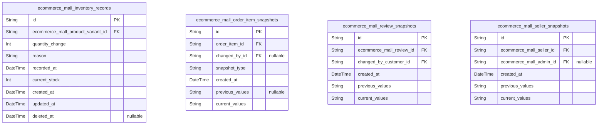
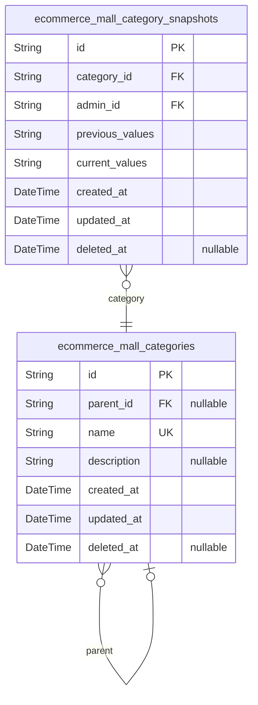
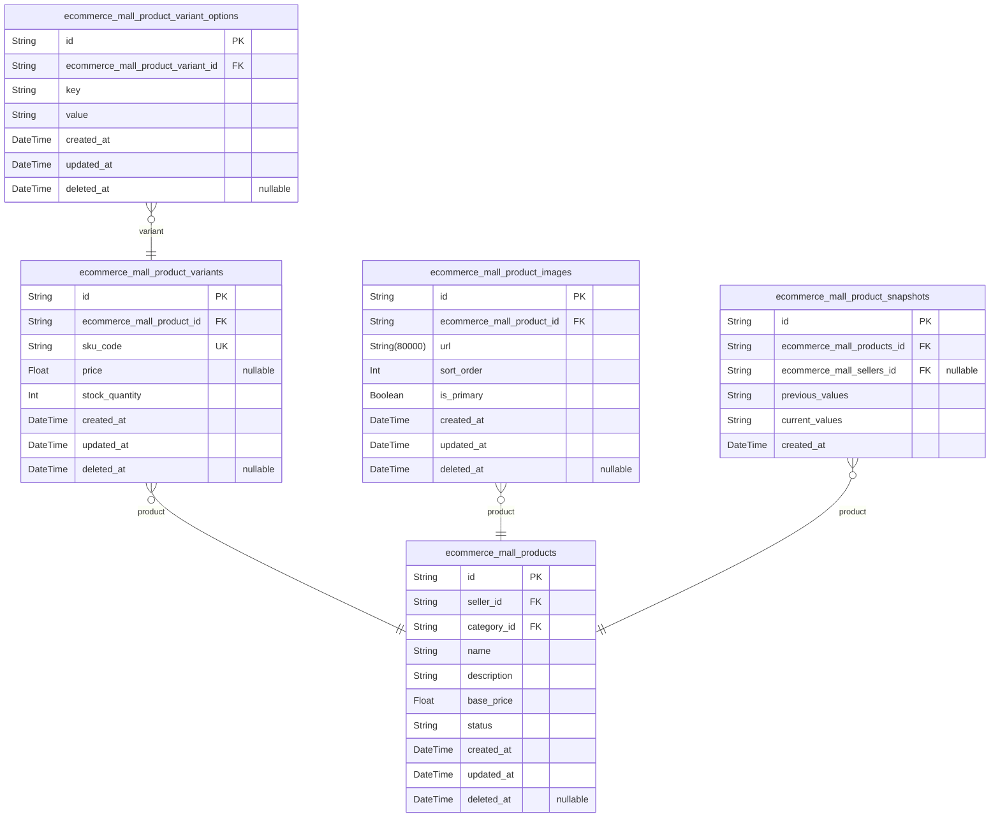
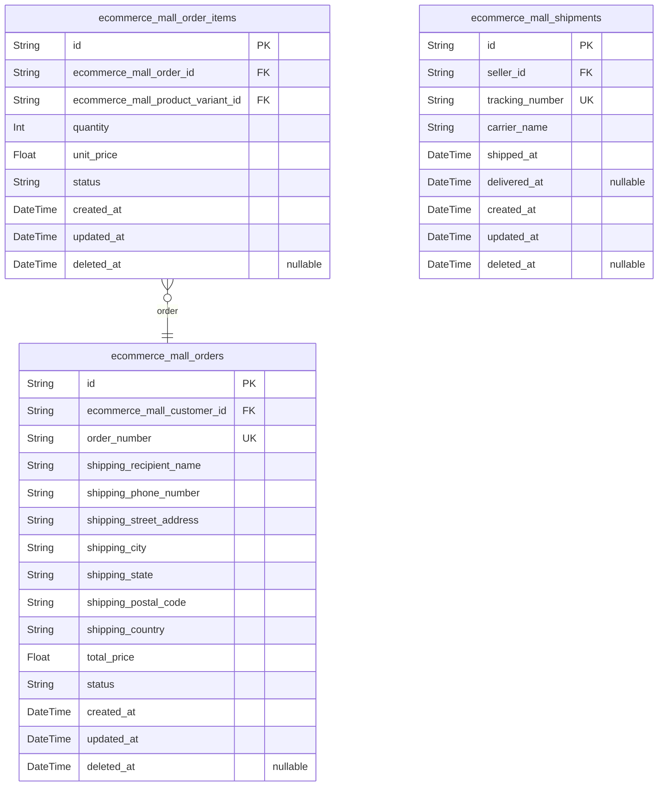
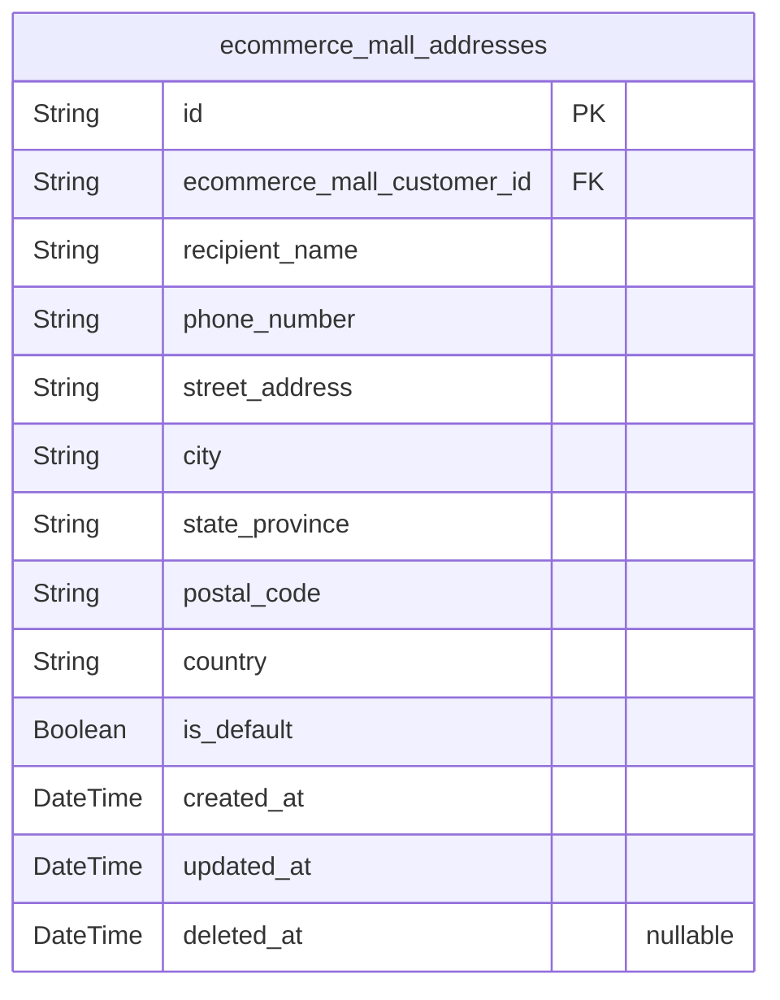
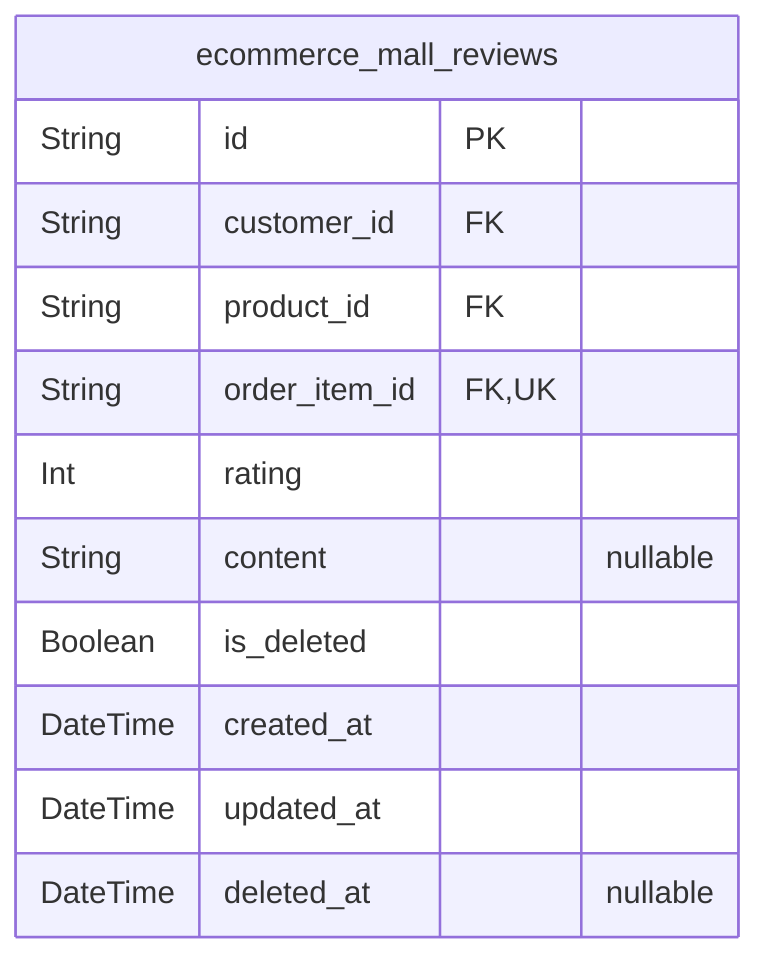
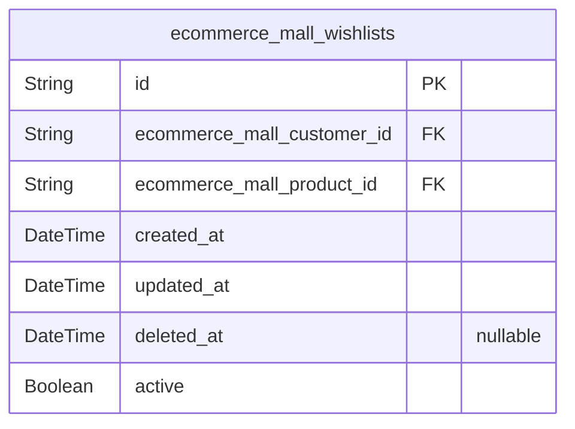
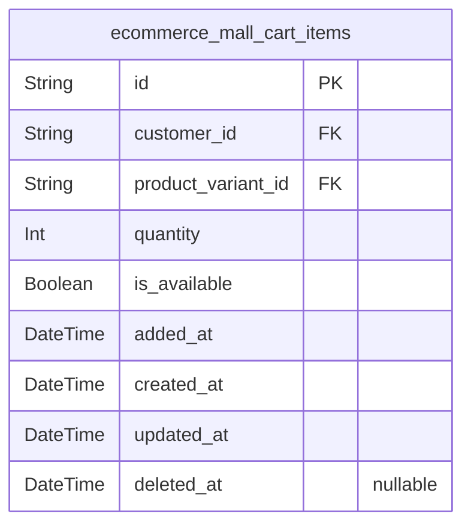
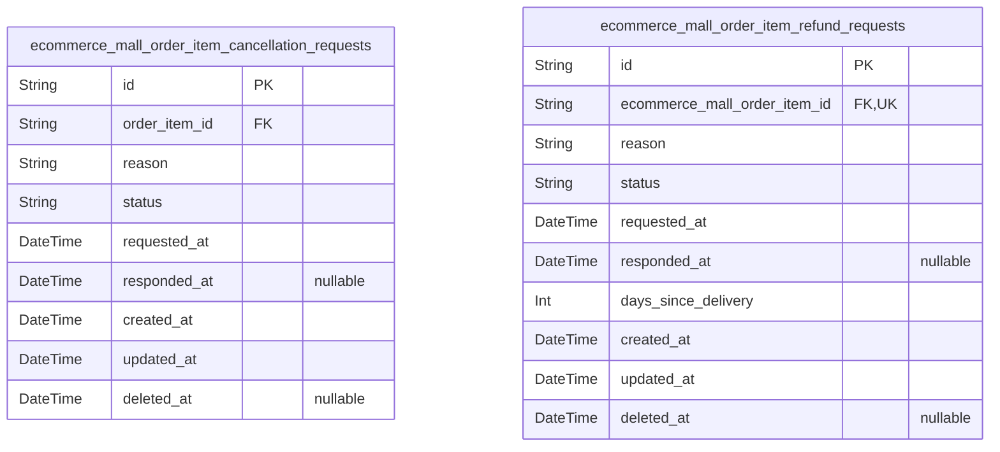

# Prisma Markdown

> Generated by [`prisma-markdown`](https://github.com/samchon/prisma-markdown)

- [Actors](#actors)
- [Systematic](#systematic)
- [Categories](#categories)
- [Products](#products)
- [Orders](#orders)
- [Addresses](#addresses)
- [Reviews](#reviews)
- [Wishlist](#wishlist)
- [Carts](#carts)
- [Requests](#requests)

## Actors

```mermaid
erDiagram
"ecommerce_mall_customers" {
  String id PK
  String email UK
  String password_hash
  String display_name "nullable"
  String phone_number "nullable"
  String account_status
  DateTime created_at
  DateTime updated_at
  DateTime deleted_at "nullable"
}
"ecommerce_mall_customer_sessions" {
  String id PK
  String ecommerce_mall_customer_id FK
  String ip
  String href
  String referrer
  DateTime created_at
  DateTime expired_at
}
"ecommerce_mall_customer_password_resets" {
  String id PK
  String ecommerce_mall_customer_id FK
  String token UK
  DateTime created_at
  DateTime expired_at
  DateTime used_at "nullable"
  DateTime updated_at
}
"ecommerce_mall_customer_email_verifications" {
  String id PK
  String ecommerce_mall_customer_id FK
  String token UK
  DateTime expires_at
  DateTime verified_at "nullable"
  DateTime created_at
  DateTime updated_at
  DateTime deleted_at "nullable"
}
"ecommerce_mall_sellers" {
  String id PK
  String email UK
  String password_hash
  String shop_name
  String shop_description "nullable"
  String approval_status
  String rejection_reason "nullable"
  String account_status
  DateTime created_at
  DateTime updated_at
  DateTime deleted_at "nullable"
}
"ecommerce_mall_seller_sessions" {
  String id PK
  String ecommerce_mall_sellers_id FK
  String access_token
  String refresh_token UK
  String ip
  String href
  String referrer "nullable"
  DateTime created_at
  DateTime expired_at
}
"ecommerce_mall_seller_password_resets" {
  String id PK
  String ecommerce_mall_seller_id FK
  String token UK
  DateTime expires_at
  DateTime created_at
  DateTime updated_at
  DateTime deleted_at "nullable"
}
"ecommerce_mall_admins" {
  String id PK
  String email UK
  String password_hash
  String admin_grade
  String account_status
  DateTime created_at
  DateTime updated_at
  DateTime deleted_at "nullable"
}
"ecommerce_mall_admin_sessions" {
  String id PK
  String ecommerce_mall_admin_id FK
  String ip
  String href "nullable"
  String referrer "nullable"
  DateTime created_at
  DateTime updated_at
  DateTime deleted_at "nullable"
  DateTime expired_at
}
"ecommerce_mall_admin_password_resets" {
  String id PK
  String ecommerce_mall_admin_id FK
  String token UK
  String ip
  String href
  String referrer
  DateTime expired_at
  DateTime created_at
  DateTime updated_at
  DateTime deleted_at "nullable"
}
"ecommerce_mall_customer_sessions" }o--|| "ecommerce_mall_customers" : customer
"ecommerce_mall_customer_password_resets" }o--|| "ecommerce_mall_customers" : customer
"ecommerce_mall_customer_email_verifications" }o--|| "ecommerce_mall_customers" : customer
"ecommerce_mall_seller_sessions" }o--|| "ecommerce_mall_sellers" : seller
"ecommerce_mall_seller_password_resets" }o--|| "ecommerce_mall_sellers" : seller
"ecommerce_mall_admin_sessions" }o--|| "ecommerce_mall_admins" : admin
"ecommerce_mall_admin_password_resets" }o--|| "ecommerce_mall_admins" : admin
```

### `ecommerce_mall_customers`

Customer account records with email/password authentication credentials
and profile information including display name, phone number, and account
status. This table serves as the primary identity record for customers
who browse products, add to cart, place orders, write reviews, and manage
wishlists. Account deletion removes profile information but preserves
order history, reviews, and other transactional data for seller records
and legal purposes.

Properties as follows:

- `id`: Primary Key.
- `email`
  > Customer email address for authentication and account identification.
  > Must be unique across all customer accounts.
- `password_hash`
  > Hashed password for secure authentication. Never store plain text
  > passwords.
- `display_name`
  > Customer's display name shown in reviews, order history, and
  > public-facing areas. Optional field that customers can edit.
- `phone_number`
  > Customer's phone number for account verification and order notifications.
  > Optional field that customers can edit.
- `account_status`
  > Account status enum: 'active' for normal accounts, 'suspended' for
  > temporary restrictions, 'banned' for permanent access denial. Controls
  > login capability and platform access.
- `created_at`
  > Timestamp when the customer account was created. Used for audit trail and
  > account age tracking.
- `updated_at`
  > Timestamp when the customer account was last modified. Updated on profile
  > changes and status transitions.
- `deleted_at`
  > Timestamp when the customer account was soft-deleted. When null, account
  > is active. Account deletion removes profile data but preserves orders,
  > reviews, and transactional history.

### `ecommerce_mall_customer_sessions`

JWT session tokens for customer authentication with access and refresh
token support for secure session management. Stores connection metadata
including IP address, page href, and referrer for security auditing.
Sessions are append-only records tracked through authentication flows,
not direct user CRUD operations. Each session has an expiration timestamp
for security compliance.

Relationships:
- Belongs to [ecommerce_mall_customers](#ecommerce_mall_customers) - the authenticated
customer actor
- One customer can have multiple active sessions simultaneously

Security Notes:
- Sessions are immutable once created
- expired_at timestamp enforces session lifetime limits
- Connection metadata enables security auditing and anomaly detection

Properties as follows:

- `id`: Primary Key.
- `ecommerce_mall_customer_id`: Authenticated customer's [ecommerce_mall_customers.id](#ecommerce_mall_customers).
- `ip`: Client IP address for connection tracking and security auditing.
- `href`: Page href where authentication occurred for connection context.
- `referrer`: Referrer URL for connection context and security auditing.
- `created_at`: Session creation timestamp for audit trail.
- `expired_at`
  > Session expiration timestamp for security compliance. Sessions beyond
  > this timestamp are considered invalid.

### `ecommerce_mall_customer_password_resets`

Password reset tokens for customer account recovery with expiration
timestamps for security. Each reset request creates a new token that
expires after a configured duration. When a customer successfully resets
their password, the used_at timestamp is recorded. Multiple reset
requests can exist per customer, but only unexpired unused tokens are
valid for password recovery.

Properties as follows:

- `id`: Primary Key.
- `ecommerce_mall_customer_id`
  > Customer account requesting password reset. {@link
  > ecommerce_mall_customers.id}.
- `token`: Secure password reset token generated for the request.
- `created_at`: Timestamp when the password reset request was created.
- `expired_at`
  > Timestamp when the password reset token expires. Tokens cannot be used
  > after this time.
- `used_at`
  > Timestamp when the password reset token was used. Nullable until the
  > token is consumed for password reset.
- `updated_at`: Timestamp when the password reset record was last updated.

### `ecommerce_mall_customer_email_verifications`

Email verification tokens for customer registration to confirm email
ownership before account activation. Each record stores a unique
verification token linked to a pending customer account, with expiration
timestamps and verification completion tracking. These records are
created during registration and consumed upon successful email
verification.

Properties as follows:

- `id`: Primary Key.
- `ecommerce_mall_customer_id`: Customer account being verified. [ecommerce_mall_customers.id](#ecommerce_mall_customers).
- `token`
  > Unique verification token sent to customer email for ownership
  > confirmation.
- `expires_at`: Token expiration timestamp. Verification must complete before this time.
- `verified_at`
  > Timestamp when email verification was completed. Null before
  > verification, set upon successful confirmation.
- `created_at`: Record creation timestamp.
- `updated_at`: Record last update timestamp.
- `deleted_at`: Soft deletion timestamp for record archival.

### `ecommerce_mall_sellers`

Seller account records with email/password authentication credentials and
shop profile including shop name, description, and approval status for
administrator review workflow. Sellers require administrator approval
before they can sell products, and their accounts can be suspended or
banned by administrators. When sellers delete their accounts, their order
history and snapshots are preserved for business records while their
products are removed from listings.

Properties as follows:

- `id`: Primary Key.
- `email`: Unique email address for seller authentication and account identification.
- `password_hash`: Hashed password for secure authentication.
- `shop_name`
  > Public shop name displayed to customers on product listings and seller
  > profiles.
- `shop_description`: Optional descriptive text about the seller's shop, products, or business.
- `approval_status`
  > Administrator approval status: pending (awaiting review), approved (can
  > sell), rejected (must reapply). Determines seller's ability to create
  > products and process orders.
- `rejection_reason`
  > Optional reason provided by administrator when seller approval is
  > rejected. Visible to seller for reapplication guidance.
- `account_status`
  > Account lifecycle status: active (normal operation), suspended (temporary
  > restriction by admin), banned (permanent access denial). Affects login
  > ability and product visibility.
- `created_at`: Timestamp when the seller account was created.
- `updated_at`: Timestamp when the seller account was last modified.
- `deleted_at`
  > Timestamp when the seller account was soft-deleted. Null for active
  > accounts. Account deletion removes products from listings but preserves
  > order history and snapshots.

### `ecommerce_mall_seller_sessions`

JWT session tokens for seller authentication with access and refresh
token support for secure session management. Each session record tracks
connection metadata (IP address, origin, referrer) and expiration
timestamps for security auditing. Sessions are append-only records that
support the seller login workflow and are managed through authentication
flows rather than direct CRUD operations. Sessions belong to {@link
ecommerce_mall_sellers} and enable secure stateless authentication with
token refresh capabilities.

Properties as follows:

- `id`: Primary Key.
- `ecommerce_mall_sellers_id`: Seller account this session belongs to. [ecommerce_mall_sellers.id](#ecommerce_mall_sellers).
- `access_token`
  > JWT access token for authenticated API requests. Short-lived token used
  > for authorization.
- `refresh_token`
  > JWT refresh token for obtaining new access tokens. Long-lived token used
  > for session renewal.
- `ip`
  > Client IP address from the login request. Used for security auditing and
  > anomaly detection.
- `href`
  > Client origin URL (window.location.href) from the login request. Used for
  > session context tracking.
- `referrer`
  > HTTP referrer header from the login request. Used for security auditing
  > and navigation tracking.
- `created_at`
  > Timestamp when the session was created (login time). Used for session age
  > calculation and auditing.
- `expired_at`
  > Timestamp when the session expires. Sessions beyond this timestamp are
  > invalid and should be rejected. NOT NULL for security.

### `ecommerce_mall_seller_password_resets`

Password reset tokens for seller account recovery with expiration
timestamps for security. These tokens are generated when a seller
requests password reset and are validated during the reset process. Each
token is single-use and expires after a defined period to prevent
unauthorized access.

Properties as follows:

- `id`: Primary Key.
- `ecommerce_mall_seller_id`
  > Seller account requesting password reset. {@link
  > ecommerce_mall_sellers.id}.
- `token`: Unique password reset token generated for verification.
- `expires_at`
  > Token expiration timestamp. Tokens become invalid after this time for
  > security.
- `created_at`: Record creation timestamp.
- `updated_at`: Record last update timestamp.
- `deleted_at`: Soft deletion timestamp for audit trail.

### `ecommerce_mall_admins`

Administrator account records with email/password authentication
credentials and admin grade (regular/super) for privilege-based access
control. Regular administrators can manage sellers, categories, products,
orders, and users. Super administrators have additional privileges to
promote/demote administrators and manage system-wide settings. Account
status supports active, suspended, and banned states for access control.

Properties as follows:

- `id`: Primary Key.
- `email`
  > Administrator email address for authentication. Must be unique across all
  > administrator accounts.
- `password_hash`
  > Hashed password for secure authentication. Never stored or transmitted in
  > plain text.
- `admin_grade`
  > Administrator privilege level. "regular" for standard administrators with
  > management capabilities. "super" for super administrators with additional
  > privileges including admin promotion/demotion.
- `account_status`
  > Account access state. "active" for normal operation. "suspended" for
  > temporary access restriction. "banned" for permanent access denial
  > preventing login.
- `created_at`: Timestamp when the administrator account was created.
- `updated_at`: Timestamp when the administrator account was last updated.
- `deleted_at`
  > Timestamp when the administrator account was soft-deleted. Null for
  > active accounts.

### `ecommerce_mall_admin_sessions`

JWT session tokens for administrator authentication with access and
refresh token support for secure session management. Stores connection
metadata including IP address, client URL, and referrer for audit trails.
Sessions are append-only records managed through authentication flows
with expiration timestamps for security.

Properties as follows:

- `id`: Primary Key.
- `ecommerce_mall_admin_id`: Administrator account's [ecommerce_mall_admins.id](#ecommerce_mall_admins).
- `ip`: Client IP address from the login request for security auditing.
- `href`: Client URL/URI from the login request.
- `referrer`: Client referrer URL/URI from the login request.
- `created_at`: Session creation timestamp.
- `updated_at`: Session last update timestamp.
- `deleted_at`: Session soft delete timestamp for session invalidation.
- `expired_at`
  > Session expiration timestamp for security. Sessions are automatically
  > invalidated after this time.

### `ecommerce_mall_admin_password_resets`

Password reset tokens for administrator account recovery with expiration
timestamps for security. Each token is single-use and expires after a
configured duration to prevent unauthorized access. Tokens are created
when an administrator requests password reset and invalidated after use
or expiration.

This table supports the [ecommerce_mall_admins](#ecommerce_mall_admins) actor's
authentication recovery workflow. Tokens reference the requesting
administrator and contain cryptographic reset tokens with connection
context for security auditing.

Security considerations:
- Tokens are single-use and invalidated after password change
- Expiration timestamps prevent indefinite token validity
- Connection metadata (ip, href, referrer) enables audit trails
- Indexes optimize token lookup and cleanup queries

Properties as follows:

- `id`: Primary Key.
- `ecommerce_mall_admin_id`
  > Administrator account requesting password reset. {@link
  > ecommerce_mall_admins.id}.
- `token`
  > Cryptographic reset token for password recovery. Single-use token that is
  > invalidated after successful password change or expiration.
- `ip`
  > Client IP address from password reset request. Records the source IP for
  > security auditing and fraud detection.
- `href`
  > Request URL/URI where password reset was initiated. Tracks the endpoint
  > that triggered the reset request.
- `referrer`
  > HTTP referrer header from password reset request. Provides context about
  > the requesting page for audit trails.
- `expired_at`
  > Token expiration timestamp. Tokens become invalid after this time to
  > prevent unauthorized access.
- `created_at`
  > Token creation timestamp. Records when the password reset request was
  > initiated.
- `updated_at`
  > Record update timestamp. Tracks last modification to the reset token
  > record.
- `deleted_at`
  > Soft deletion timestamp. Marks the token as used or invalidated while
  > preserving audit history.

## Systematic

### `ecommerce_mall_inventory_records`

Stock quantity change history for product variants, tracking all
inventory modifications including restocking, order deductions,
cancellation/refund restorations, and manual adjustments. Each record
captures the quantity change amount, reason for change, timestamp, and
current stock level after the change. Current stock is calculated by
summing all historical records for a variant. This table supports audit
trails and dispute resolution for inventory discrepancies.

Properties as follows:

- `id`: Primary Key.
- `ecommerce_mall_product_variant_id`
  > Product variant whose inventory is being tracked. {@link
  > ecommerce_mall_product_variants.id}.
- `quantity_change`
  > Amount of stock quantity change. Positive values indicate restocking or
  > restorations (cancellation/refund). Negative values indicate deductions
  > (orders, adjustments, losses).
- `reason`
  > Reason for the inventory change. Examples: 'restock', 'order_placement',
  > 'cancellation_approved', 'refund_approved', 'manual_adjustment',
  > 'inventory_loss'.
- `recorded_at`
  > Timestamp when the inventory change occurred. Server-generated to ensure
  > accurate chronological ordering of inventory history.
- `current_stock`
  > Stock quantity after this change was applied. Snapshot of current stock
  > at the time of recording, useful for quick verification without
  > recalculating from history.
- `created_at`: Record creation timestamp for audit trail.
- `updated_at`: Record last update timestamp for audit trail.
- `deleted_at`
  > Soft deletion timestamp. Inventory records should typically not be
  > deleted to maintain audit trail integrity.

### `ecommerce_mall_order_item_snapshots`

Immutable audit trail snapshots capturing order item state at purchase
time. Records complete product details (name, description), variant
options (SKU, option values), pricing information, and seller profile
(shop name, logo) as they existed when the order was placed. These
snapshots are critical for dispute resolution, purchase history
verification, and preserving seller profile information even after
sellers modify their shops or delete accounts. Snapshots are append-only
and cannot be deleted, maintaining a permanent record of all transactions
on this money-exchange platform. Each order item may have multiple
snapshots if modified after purchase (e.g., status changes,
cancellation/refund requests).

Properties as follows:

- `id`: Primary Key.
- `order_item_id`
  > Referenced order item's [ecommerce_mall_order_items.id](#ecommerce_mall_order_items). Each order
  > item can have multiple snapshots over its lifecycle (purchase, status
  > changes, cancellation, refund).
- `changed_by_id`
  > Administrator who triggered this snapshot change. Nullable for
  > system-created snapshots (e.g., automatic purchase snapshots). References
  > [ecommerce_mall_admins.id](#ecommerce_mall_admins).
- `snapshot_type`
  > Type of snapshot event. Values: 'purchase' (initial order creation),
  > 'status_change' (item status update), 'cancellation' (cancellation
  > request), 'refund' (refund request). Distinguishes different lifecycle
  > events for the same order item.
- `created_at`
  > Timestamp when this snapshot was created. For purchase snapshots, this
  > equals the order creation time. For subsequent snapshots, this captures
  > when the change occurred.
- `previous_values`
  > JSON object containing the order item state before this change. Null for
  > initial purchase snapshots. Contains fields like: productName,
  > productDescription, variantSku, variantOptions, unitPrice,
  > sellerShopName, sellerLogo, itemStatus, etc.
- `current_values`
  > JSON object containing the complete order item state after this change.
  > Always populated. Contains: productName, productDescription, variantSku,
  > variantOptions, unitPrice, sellerShopName, sellerLogo, itemStatus,
  > quantity, and all other order item fields at snapshot time.

### `ecommerce_mall_review_snapshots`

Immutable audit trail snapshots capturing all review modifications
including rating changes, content edits, and deletion status. Each
snapshot records the complete state of a review before and after
modification, with timestamp and the customer who made the change.
Snapshots are preserved even after review deletion for dispute resolution
and audit purposes. [ecommerce_mall_reviews](#ecommerce_mall_reviews) {@link
ecommerce_mall_customers}

Properties as follows:

- `id`: Primary Key.
- `ecommerce_mall_review_id`
  > Target review's [ecommerce_mall_reviews.id](#ecommerce_mall_reviews). The review entity that
  > was modified and triggered this snapshot creation.
- `changed_by_customer_id`
  > Customer who made the change's [ecommerce_mall_customers.id](#ecommerce_mall_customers).
  > Records the actor responsible for the review modification.
- `created_at`
  > Timestamp when the snapshot was created. Server-enforced to ensure audit
  > trail integrity.
- `previous_values`
  > JSON string containing the review state before modification. Includes
  > rating (1-5), content (text), and isDeleted (boolean) fields.
- `current_values`
  > JSON string containing the review state after modification. Includes
  > rating (1-5), content (text), and isDeleted (boolean) fields.

### `ecommerce_mall_seller_snapshots`

Immutable audit trail capturing seller profile modifications including
shop name, description, and logo changes. Each snapshot records the
complete seller state at the time of modification with previous and
current values, timestamp, and the administrator who made the change (if
applicable). Snapshots are preserved for dispute resolution and
administrator oversight, even after seller account deletion. This table
supports the snapshot principle requiring all data modifications in this
money-exchange platform to be recorded with before/after values.

Properties as follows:

- `id`: Primary Key.
- `ecommerce_mall_seller_id`
  > Seller account whose profile was modified. {@link
  > ecommerce_mall_sellers.id}.
- `ecommerce_mall_admin_id`
  > Administrator who made the profile change. Null when seller updates their
  > own profile. [ecommerce_mall_admins.id](#ecommerce_mall_admins).
- `created_at`
  > Timestamp when the snapshot was created. Always set by server at
  > modification time.
- `previous_values`
  > JSON string containing seller profile values before the modification.
  > Includes shop_name, shop_description, and logo fields.
- `current_values`
  > JSON string containing seller profile values after the modification.
  > Includes shop_name, shop_description, and logo fields.

## Categories

### `ecommerce_mall_categories`

Product categories with hierarchical structure supporting one level of
nesting (parent categories and subcategories). Categories organize
products for customer browsing and filtering. Each category can have a
parent category to create subcategories, but nesting is limited to one
level. Categories are managed exclusively by administrators. Referenced
by [ecommerce_mall_products](#ecommerce_mall_products) for product categorization.

Properties as follows:

- `id`: Primary Key.
- `parent_id`
  > Parent category for subcategory hierarchy. Null for top-level categories.
  > Enables one-level nesting structure (parent → subcategory). {@link
  > ecommerce_mall_categories.id}.
- `name`
  > Category name. Must be unique across all categories. Used for display and
  > product filtering.
- `description`
  > Optional category description providing additional context about the
  > category's purpose and product types.
- `created_at`
  > Timestamp when the category was created. Records the initial creation
  > time for audit purposes.
- `updated_at`
  > Timestamp when the category was last modified. Updated on every edit
  > operation.
- `deleted_at`
  > Timestamp when the category was soft-deleted. Null for active categories.
  > Preserves category for historical product records.

### `ecommerce_mall_category_snapshots`

Immutable audit trail capturing all category modifications with
before/after values. Preserves category change history for administrator
oversight and dispute resolution as required by the snapshot principle.
Each snapshot records the complete category state at the time of
modification, including name, description, and parent relationship
changes.

Properties as follows:

- `id`: Primary Key.
- `category_id`
  > Target category's [ecommerce_mall_categories.id](#ecommerce_mall_categories). The category
  > entity that was modified.
- `admin_id`: Administrator who made the modification. [ecommerce_mall_admins.id](#ecommerce_mall_admins).
- `previous_values`
  > JSON string containing the category state before modification. Includes
  > name, description, and parentId fields as they existed prior to the
  > change.
- `current_values`
  > JSON string containing the category state after modification. Includes
  > name, description, and parentId fields as they exist after the change.
- `created_at`
  > Timestamp when the category modification occurred and snapshot was
  > created.
- `updated_at`
  > Timestamp when the snapshot record was last updated. Maintains schema
  > consistency with other entities.
- `deleted_at`
  > Soft deletion timestamp. Snapshots are typically immutable and preserved,
  > but this field maintains schema consistency with other entities.

## Products

### `ecommerce_mall_products`

Core product catalog entities representing items sold by sellers. Each
product has a name, description, category classification, and base price.
Products belong to a seller who owns and manages them. Products can be
edited, with each modification creating a snapshot in
ecommerce_mall_product_snapshots for audit trail. Products can be
soft-deleted or suspended by administrators. Products have multiple
variants (ecommerce_mall_product_variants) representing different SKUs
with options like color and size, and multiple images
(ecommerce_mall_product_images) with the first image serving as
thumbnail.

Properties as follows:

- `id`: Primary Key.
- `seller_id`
  > Seller who owns and manages this product. {@link
  > ecommerce_mall_sellers.id}.
- `category_id`
  > Category classification for product organization and browsing. {@link
  > ecommerce_mall_categories.id}.
- `name`: Product name. Required field for product identification and search.
- `description`: Product description providing detailed information about the product.
- `base_price`
  > Base price of the product in currency units. Variants can override this
  > price.
- `status`
  > Product lifecycle status: active (visible and purchasable), deleted
  > (soft-deleted, hidden from listings), suspended (hidden by administrator
  > for policy violations).
- `created_at`: Timestamp when the product was created.
- `updated_at`: Timestamp when the product was last modified. Triggers snapshot creation.
- `deleted_at`
  > Timestamp when the product was soft-deleted. Null if product is active or
  > suspended.

### `ecommerce_mall_product_variants`

SKU variants for products with unique SKU codes, optional price override,
and stock quantity tracking. Each variant belongs to exactly one {@link
ecommerce_mall_products} and represents a specific product configuration
that customers can purchase. Variant option values (e.g., color, size)
are stored in [ecommerce_mall_product_variant_options](#ecommerce_mall_product_variant_options) for 1NF
compliance. Variant edits create snapshots in {@link
ecommerce_mall_product_snapshots} for audit trail. Stock quantity is
tracked through [ecommerce_mall_inventory_records](#ecommerce_mall_inventory_records) history rather
than stored directly.

Properties as follows:

- `id`: Primary Key.
- `ecommerce_mall_product_id`
  > Parent product's [ecommerce_mall_products.id](#ecommerce_mall_products). Each variant belongs
  > to exactly one product.
- `sku_code`
  > Unique SKU code identifying this variant. Must be unique across all
  > variants in the system.
- `price`
  > Optional price override for this variant. If null, uses the product's
  > base price from [ecommerce_mall_products.basePrice](#ecommerce_mall_products).
- `stock_quantity`
  > Current stock quantity for this variant. Calculated from sum of all
  > [ecommerce_mall_inventory_records](#ecommerce_mall_inventory_records) for this variant. Zero means out
  > of stock.
- `created_at`: Record creation timestamp.
- `updated_at`: Record last update timestamp.
- `deleted_at`: Soft deletion timestamp. Null means active, non-null means deleted.

### `ecommerce_mall_product_images`

Product images supporting multiple uploads per product with reorder
capability. The first image (sort_order=0) serves as the main thumbnail
displayed in search results and category listings. Image changes and
reordering are captured in product snapshots for audit trail purposes.
Images are always managed through their parent {@link
ecommerce_mall_products} entity and cannot be independently created or
deleted outside of product operations.

Properties as follows:

- `id`: Primary Key.
- `ecommerce_mall_product_id`
  > Parent product's [ecommerce_mall_products.id](#ecommerce_mall_products). Images always belong
  > to exactly one product and are deleted when the product is deleted.
- `url`
  > URL reference to the stored image file. Points to CDN or file storage
  > location where the image is hosted.
- `sort_order`
  > Display order position for reordering images. Lower values appear first.
  > The image with sort_order=0 serves as the main thumbnail.
- `is_primary`
  > Whether this image is the primary/thumbnail image. True for the first
  > image (sort_order=0), false for all others. Used for quick thumbnail
  > identification.
- `created_at`: Timestamp when this image record was created.
- `updated_at`: Timestamp when this image record was last updated.
- `deleted_at`
  > Timestamp when this image was soft-deleted. Null if the image is still
  > active.

### `ecommerce_mall_product_snapshots`

Immutable audit trail capturing complete product state at each edit,
including all variant information. Records previous values, current
values, creation timestamp, and the seller who made the change. Snapshots
are preserved even after product deletion and can be viewed by sellers
and administrators for dispute resolution. {@link
ecommerce_mall_products} [ecommerce_mall_sellers](#ecommerce_mall_sellers)

Properties as follows:

- `id`: Primary Key.
- `ecommerce_mall_products_id`: Product being snapshotted. [ecommerce_mall_products.id](#ecommerce_mall_products)
- `ecommerce_mall_sellers_id`
  > Seller who made the change. Nullable for system-generated or
  > administrator actions. [ecommerce_mall_sellers.id](#ecommerce_mall_sellers)
- `previous_values`
  > JSON object containing all product fields and variant data before the
  > change.
- `current_values`
  > JSON object containing all product fields and variant data after the
  > change.
- `created_at`: Timestamp when the snapshot was created. Server-enforced.

### `ecommerce_mall_product_variant_options`

Normalized key-value storage for product variant option values (e.g.,
color, size, material). Each row stores one option attribute for a
variant, replacing JSON storage to ensure First Normal Form (1NF)
compliance. This table enables atomic querying and filtering of variant
options while maintaining referential integrity with {@link
ecommerce_mall_product_variants.id}.

Properties as follows:

- `id`: Primary Key.
- `ecommerce_mall_product_variant_id`: Belonged product variant's [ecommerce_mall_product_variants.id](#ecommerce_mall_product_variants).
- `key`: Option attribute name (e.g., "color", "size", "material").
- `value`: Option attribute value (e.g., "Red", "Large", "Cotton").
- `created_at`: Record creation timestamp.
- `updated_at`: Record last update timestamp.
- `deleted_at`: Soft deletion timestamp for audit trail preservation.

## Orders

### `ecommerce_mall_orders`

Main order records representing customer purchases with unique order
numbers, embedded shipping address snapshots, total price, and overall
status derived from order items. Orders are created after successful
payment and shipping address is locked at order time, preserving the
address even if the customer later modifies their saved addresses.

Properties as follows:

- `id`: Primary Key.
- `ecommerce_mall_customer_id`: Customer who placed this order. [ecommerce_mall_customers.id](#ecommerce_mall_customers).
- `order_number`: Unique order identifier for customer reference and tracking.
- `shipping_recipient_name`
  > Recipient name for shipping address, captured at order time and locked
  > thereafter.
- `shipping_phone_number`
  > Recipient phone number for shipping address, captured at order time and
  > locked thereafter.
- `shipping_street_address`: Street address for shipping, captured at order time and locked thereafter.
- `shipping_city`: City for shipping address, captured at order time and locked thereafter.
- `shipping_state`
  > State or province for shipping address, captured at order time and locked
  > thereafter.
- `shipping_postal_code`
  > Postal code for shipping address, captured at order time and locked
  > thereafter.
- `shipping_country`
  > Country for shipping address, captured at order time and locked
  > thereafter.
- `total_price`: Total order price including all items.
- `status`
  > Overall order status derived from order items: paid, shipped, delivered,
  > cancelled, refunded, or partiallyCompleted.
- `created_at`: Order creation timestamp.
- `updated_at`: Order last update timestamp.
- `deleted_at`: Soft delete timestamp for order archival.

### `ecommerce_mall_order_items`

Individual purchased product variants within orders with independent
status tracking. Each order item represents a specific variant purchase
with quantity, unit price at time of purchase, and status that can be
independently cancelled or refunded. Order item status determines overall
order status through derivation rules.

Properties as follows:

- `id`: Primary Key.
- `ecommerce_mall_order_id`
  > Parent order's [ecommerce_mall_orders.id](#ecommerce_mall_orders). Order items belong to
  > orders and inherit order-level context.
- `ecommerce_mall_product_variant_id`
  > Purchased product variant's [ecommerce_mall_product_variants.id](#ecommerce_mall_product_variants).
  > Links to the specific SKU variant that was purchased.
- `quantity`
  > Quantity of this variant purchased in the order item. Must be positive
  > integer.
- `unit_price`
  > Unit price at time of purchase. Immutable after order creation. Snapshot
  > preserves this value for dispute resolution.
- `status`
  > Order item status: paid (payment completed), shipped (seller shipped),
  > delivered (customer received), cancelled (cancelled by
  > customer/seller/admin), refunded (refunded after delivery). Status
  > transitions follow business rules.
- `created_at`: Timestamp when order item was created (at order placement).
- `updated_at`: Timestamp when order item was last updated (status changes, etc.).
- `deleted_at`
  > Soft deletion timestamp for audit trail. Order items are rarely deleted
  > but soft delete preserves historical integrity.

### `ecommerce_mall_shipments`

Shipping packages created by sellers containing one or more order items
with tracking information. Each shipment represents a physical package
sent to customers with carrier details and tracking numbers. Shipment
creation updates order item statuses to 'shipped', and delivery
confirmation (manual or automatic after 14 days) updates items to
'delivered'. Different sellers always create separate shipments even for
the same order.

Properties as follows:

- `id`: Primary Key.
- `seller_id`
  > Seller who created and ships this package. {@link
  > ecommerce_mall_sellers.id}.
- `tracking_number`: Unique tracking number assigned by the carrier for shipment tracking.
- `carrier_name`: Name of the shipping carrier (e.g., FedEx, UPS, DHL).
- `shipped_at`
  > Timestamp when the seller shipped this package and order items
  > transitioned to 'shipped' status.
- `delivered_at`
  > Timestamp when customer confirmed delivery or automatic delivery after 14
  > days. Null if not yet delivered.
- `created_at`: Record creation timestamp.
- `updated_at`: Record last update timestamp.
- `deleted_at`: Soft deletion timestamp for audit trail preservation.

## Addresses

### `ecommerce_mall_addresses`

Customer shipping addresses with recipient details and location
information. Supports multiple addresses per customer with one default
selection for checkout convenience. Addresses are preserved when deleted
(soft delete) to maintain order history integrity. Each address contains
complete delivery information including recipient name, phone number,
street address, city, state/province, postal code, and country.

Properties as follows:

- `id`: Primary Key.
- `ecommerce_mall_customer_id`: Customer who owns this address. [ecommerce_mall_customers.id](#ecommerce_mall_customers).
- `recipient_name`: Name of the person receiving the delivery.
- `phone_number`: Contact phone number for delivery coordination.
- `street_address`: Street address including building number and street name.
- `city`: City or municipality name.
- `state_province`: State, province, or region name.
- `postal_code`: Postal or ZIP code for the address.
- `country`: Country name or ISO country code.
- `is_default`
  > Whether this address is the customer's default shipping address. Only one
  > default address allowed per customer.
- `created_at`: Timestamp when the address was created.
- `updated_at`: Timestamp when the address was last updated.
- `deleted_at`: Timestamp when the address was soft-deleted. Null if address is active.

## Reviews

### `ecommerce_mall_reviews`

Customer reviews for products with ratings (1-5 stars) and optional text
content. Each review is tied to a specific order item to enforce
one-review-per-order policy. Reviews can be soft-deleted but remain
visible as "deleted user" content. Average product ratings are calculated
from non-deleted reviews.

Key relationships:
- Belongs to [ecommerce_mall_customers](#ecommerce_mall_customers) - the customer who wrote
the review
- Belongs to [ecommerce_mall_products](#ecommerce_mall_products) - the product being reviewed
- Belongs to [ecommerce_mall_order_items](#ecommerce_mall_order_items) - the purchased item that
enabled review eligibility

Behavioral notes:
- One review per order item enforced via unique constraint
- Review only allowed after order item status becomes "delivered"
- Soft-delete preserves review content for historical records
- Snapshots for review edits are stored in ecommerce_mall_review_snapshots

Properties as follows:

- `id`: Primary Key.
- `customer_id`: Customer who wrote this review. [ecommerce_mall_customers.id](#ecommerce_mall_customers).
- `product_id`: Product being reviewed. [ecommerce_mall_products.id](#ecommerce_mall_products).
- `order_item_id`
  > Order item that enabled review eligibility. Ensures one review per order
  > item (one review per product per order). {@link
  > ecommerce_mall_order_items.id}.
- `rating`: Star rating from 1 to 5. Required field for all reviews.
- `content`
  > Optional text content of the review. Can be empty or contain detailed
  > feedback.
- `is_deleted`
  > Soft-delete flag. When true, review is hidden from listings but preserved
  > for historical records. Deleted reviews are shown as "deleted user"
  > content.
- `created_at`: Timestamp when the review was initially created.
- `updated_at`: Timestamp when the review was last modified. Updated on each edit.
- `deleted_at`: Timestamp when the review was soft-deleted. Null if review is active.

## Wishlist

### `ecommerce_mall_wishlists`

Customer wishlist entries linking customers to saved products for later
purchase. Each row represents one product saved by one customer, tracking
when it was added and its active status for pagination and filtering.
Products can be removed from wishlist at any time, and deleted products
are automatically removed via application logic or cascade.

Properties as follows:

- `id`: Primary Key.
- `ecommerce_mall_customer_id`
  > Customer who added this product to their wishlist. {@link
  > ecommerce_mall_customers.id}.
- `ecommerce_mall_product_id`
  > Product saved to wishlist. If deleted by seller, this entry should be
  > removed. [ecommerce_mall_products.id](#ecommerce_mall_products).
- `created_at`: Timestamp when the product was added to the wishlist.
- `updated_at`: Timestamp when this wishlist entry was last updated.
- `deleted_at`
  > Timestamp when this wishlist entry was soft-deleted (removed from
  > wishlist). Null if still active.
- `active`
  > Whether this wishlist entry is active (visible in customer's wishlist).
  > Used for pagination and filtering.

## Carts

### `ecommerce_mall_cart_items`

Shopping cart items linking customers to product variants with quantities
and availability status. Customers can add specific variants to their
cart, update quantities, and receive stock warnings. Cart items are
removed after successful order placement. This table supports the
pre-purchase product selection and quantity management workflow.

Properties as follows:

- `id`: Primary Key.
- `customer_id`: Customer who owns this cart item. [ecommerce_mall_customers.id](#ecommerce_mall_customers).
- `product_variant_id`: Product variant added to cart. [ecommerce_mall_product_variants.id](#ecommerce_mall_product_variants).
- `quantity`: Quantity of this variant in the cart. Must be positive integer.
- `is_available`
  > Whether the variant is still available (in stock and not deleted). Set to
  > false when variant goes out of stock or is deleted by seller.
- `added_at`: Timestamp when this item was added to the cart.
- `created_at`: Timestamp when this cart item record was created.
- `updated_at`: Timestamp when the quantity was last updated.
- `deleted_at`
  > Timestamp when this cart item was soft-deleted (e.g., during checkout or
  > manual removal).

## Requests

### `ecommerce_mall_order_item_cancellation_requests`

Cancellation requests for individual order items with 'paid' status.
Customers can request cancellation with a reason, and sellers can approve
or reject the request. Each request tracks the workflow state with
timestamps for audit purposes. When approved, the order item is cancelled
and stock is restored via inventory records. Snapshots of request state
changes are preserved for dispute resolution.

Properties as follows:

- `id`: Primary Key.
- `order_item_id`
  > Target order item's [ecommerce_mall_order_items.id](#ecommerce_mall_order_items) for which this
  > cancellation is requested.
- `reason`: Customer-provided reason for requesting cancellation.
- `status`
  > Current workflow status: 'pending' (awaiting seller response), 'approved'
  > (seller approved, item cancelled), or 'rejected' (seller rejected, item
  > continues processing).
- `requested_at`: Timestamp when the customer submitted the cancellation request.
- `responded_at`
  > Timestamp when the seller responded to the cancellation request (approved
  > or rejected). Null while request is pending.
- `created_at`: Record creation timestamp for audit trail.
- `updated_at`: Record last update timestamp for audit trail.
- `deleted_at`
  > Soft deletion timestamp. Requests are preserved for audit even when
  > logically deleted.

### `ecommerce_mall_order_item_refund_requests`

Refund requests for delivered order items within the 7-day refund window.
Each request includes a reason, tracks the approval workflow status
(pending, approved, rejected), and records when the request was made and
when the seller responded. These requests enable customers to seek
refunds for delivered products while maintaining audit trails through
snapshots.

Properties as follows:

- `id`: Primary Key.
- `ecommerce_mall_order_item_id`
  > Target order item's [ecommerce_mall_order_items.id](#ecommerce_mall_order_items) for which this
  > refund request was created.
- `reason`: Customer-provided reason for requesting the refund.
- `status`
  > Current status of the refund request workflow: pending (awaiting seller
  > response), approved (seller approved refund), or rejected (seller denied
  > refund).
- `requested_at`: Timestamp when the customer submitted the refund request.
- `responded_at`
  > Timestamp when the seller responded to the refund request (approved or
  > rejected). Null while request is pending.
- `days_since_delivery`
  > Number of days elapsed since the order item was delivered. Used to
  > enforce the 7-day refund window eligibility.
- `created_at`: Record creation timestamp for audit purposes.
- `updated_at`: Record last update timestamp for tracking modifications.
- `deleted_at`
  > Soft deletion timestamp. Refund requests are typically preserved for
  > audit but may be soft-deleted for archival purposes.
