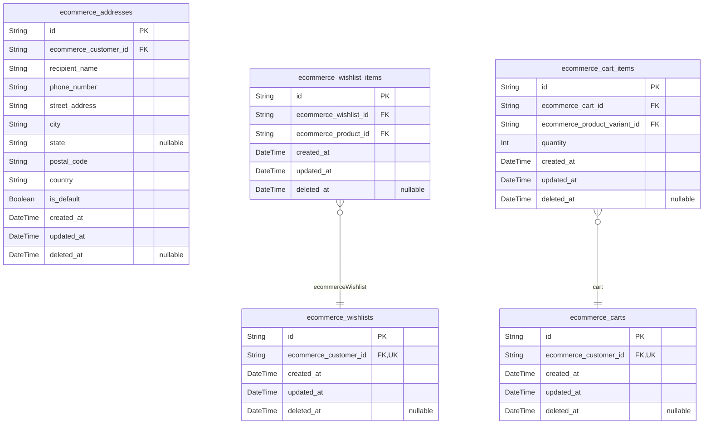
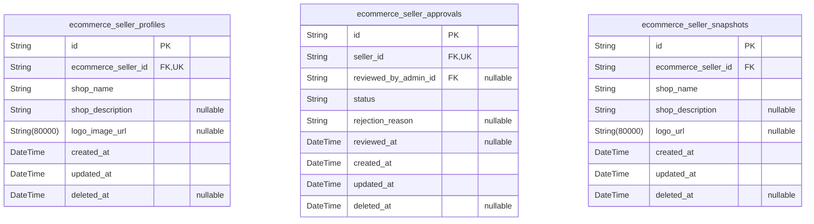
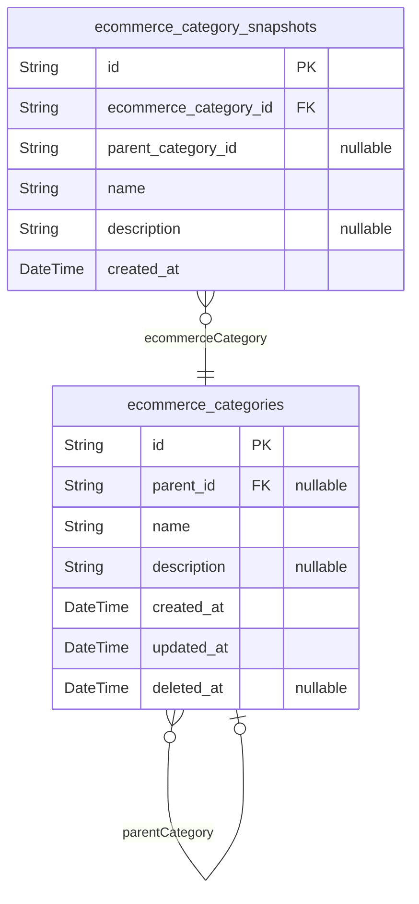
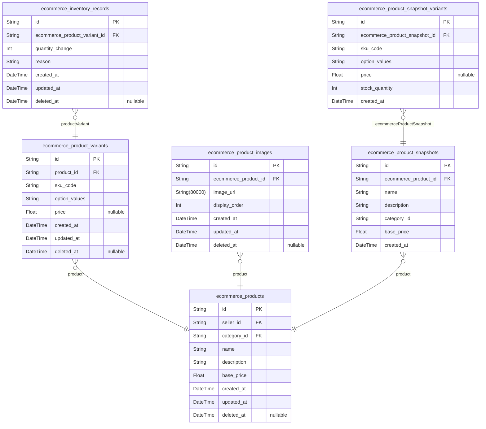
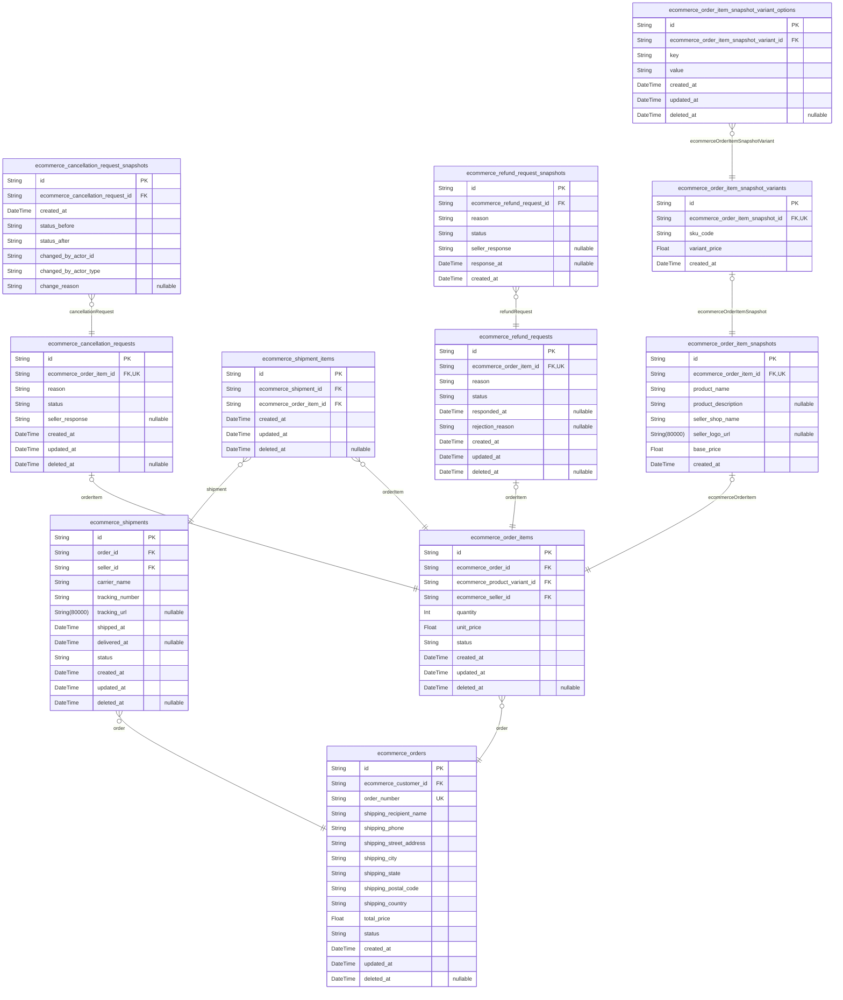
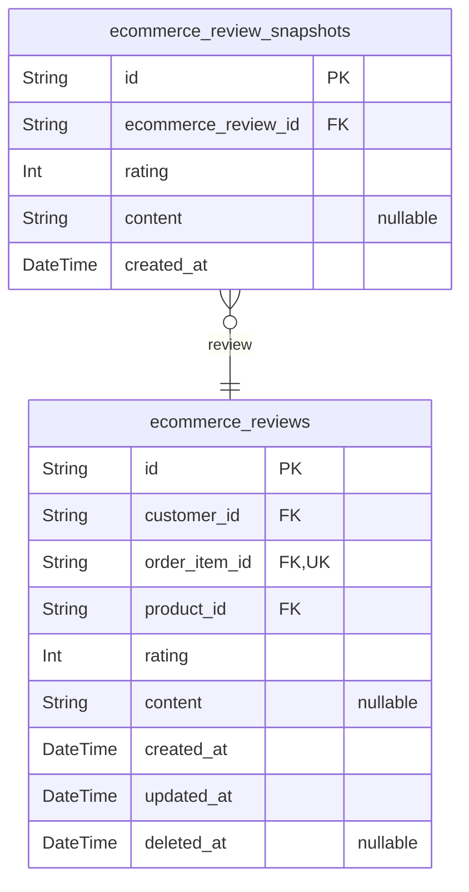
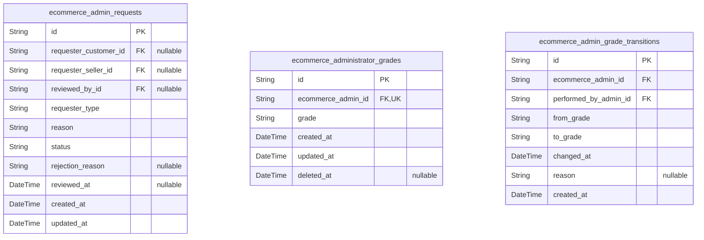

# Prisma Markdown

> Generated by [`prisma-markdown`](https://github.com/samchon/prisma-markdown)

- [authorization](#authorization)
- [customer](#customer)
- [seller](#seller)
- [category](#category)
- [product](#product)
- [order](#order)
- [review](#review)
- [administrator](#administrator)

## authorization

```mermaid
erDiagram
"ecommerce_customers" {
  String id PK
  String email UK
  String password_hash
  String display_name
  String phone_number "nullable"
  DateTime created_at
  DateTime updated_at
  DateTime deleted_at "nullable"
}
"ecommerce_customer_sessions" {
  String id PK
  String ecommerce_customer_id FK
  String access_token
  String refresh_token
  String ip
  String href "nullable"
  String referrer "nullable"
  DateTime created_at
  DateTime expired_at
}
"ecommerce_customer_password_resets" {
  String id PK
  String ecommerce_customer_id FK
  String token UK
  DateTime expires_at
  DateTime used_at "nullable"
  DateTime created_at
  DateTime updated_at
  DateTime deleted_at "nullable"
}
"ecommerce_customer_email_verifications" {
  String id PK
  String ecommerce_customer_id FK
  String token UK
  DateTime expires_at
  DateTime verified_at "nullable"
  DateTime created_at
  DateTime updated_at
  DateTime deleted_at "nullable"
}
"ecommerce_sellers" {
  String id PK
  String email UK
  String password_hash
  String approval_status
  String rejection_reason "nullable"
  Boolean is_suspended
  Boolean is_banned
  DateTime created_at
  DateTime updated_at
  DateTime deleted_at "nullable"
}
"ecommerce_seller_sessions" {
  String id PK
  String ecommerce_seller_id FK
  String access_token
  String refresh_token
  String ip
  String href "nullable"
  String referrer "nullable"
  DateTime created_at
  DateTime updated_at
  DateTime deleted_at "nullable"
  DateTime expired_at
}
"ecommerce_seller_password_resets" {
  String id PK
  String ecommerce_seller_id FK
  String token UK
  DateTime expires_at
  DateTime created_at
  DateTime updated_at
  DateTime deleted_at "nullable"
}
"ecommerce_seller_email_verifications" {
  String id PK
  String ecommerce_seller_id FK "nullable"
  String token UK
  DateTime expires_at
  DateTime verified_at "nullable"
  DateTime created_at
  DateTime updated_at
  DateTime deleted_at "nullable"
}
"ecommerce_admins" {
  String id PK
  String email UK
  String password_hash
  DateTime created_at
  DateTime updated_at
  DateTime deleted_at "nullable"
}
"ecommerce_admin_sessions" {
  String id PK
  String ecommerce_admin_id FK
  String ip
  String href "nullable"
  String referrer "nullable"
  DateTime created_at
  DateTime updated_at
  DateTime deleted_at "nullable"
  DateTime expired_at
}
"ecommerce_admin_password_resets" {
  String id PK
  String ecommerce_admin_id FK
  String token UK
  DateTime expires_at
  DateTime created_at
}
"ecommerce_admin_audit_logs" {
  String id PK
  String ecommerce_admin_id FK
  String action_type
  String target_entity
  String target_id "nullable"
  String previous_state "nullable"
  String new_state "nullable"
  DateTime created_at
  DateTime updated_at
  DateTime deleted_at "nullable"
}
"ecommerce_customer_sessions" }o--|| "ecommerce_customers" : customer
"ecommerce_customer_password_resets" }o--|| "ecommerce_customers" : customer
"ecommerce_customer_email_verifications" }o--|| "ecommerce_customers" : customer
"ecommerce_seller_sessions" }o--|| "ecommerce_sellers" : seller
"ecommerce_seller_password_resets" }o--|| "ecommerce_sellers" : seller
"ecommerce_seller_email_verifications" }o--o| "ecommerce_sellers" : seller
"ecommerce_admin_sessions" }o--|| "ecommerce_admins" : ecommerceAdmin
"ecommerce_admin_password_resets" }o--|| "ecommerce_admins" : ecommerceAdmin
"ecommerce_admin_audit_logs" }o--|| "ecommerce_admins" : ecommerceAdmin
```

### `ecommerce_customers`

Registered customer accounts with email/password authentication
credentials and profile information.

This table represents the customer actor in the e-commerce platform,
storing authentication credentials and profile data. Each customer can
browse products, manage their shopping cart, place orders, write reviews,
and manage their wishlist and shipping addresses.

**Authentication**

Customers authenticate using email and password_hash. The email field is
unique and serves as the login identifier. Password hashes are stored
securely and never exposed.

**Profile Information**

Customers maintain a profile with a display_name (visible to other users)
and optional phone_number for contact purposes. These fields can be
updated by the customer at any time.

**Account Lifecycle**

Soft delete is supported via deleted_at. When a customer deletes their
account, profile information is removed but orders and reviews are
preserved (shown as "deleted user"). This maintains data integrity for
seller records and legal compliance.

**Relationships**

This actor table is referenced by multiple child tables: {@link
ecommerce_customer_sessions} for login sessions, {@link
ecommerce_customer_password_resets} for account recovery, {@link
ecommerce_customer_email_verifications} for registration confirmation,
[ecommerce_addresses](#ecommerce_addresses) for shipping addresses, {@link
ecommerce_carts} for shopping cart, [ecommerce_wishlists](#ecommerce_wishlists) for saved
products, [ecommerce_orders](#ecommerce_orders) for purchase history, and {@link
ecommerce_reviews} for product feedback.

Properties as follows:

- `id`: Unique identifier for each customer account.
- `email`
  > Customer's email address used for authentication and login.
  >
  > This field serves as the unique login identifier for the customer
  > account. It must be unique across all customer accounts and is used
  > during registration and login flows.
- `password_hash`
  > Secure hash of the customer's password.
  >
  > The password is never stored in plain text. This hash is generated using
  > a secure password hashing algorithm (e.g., bcrypt) during registration
  > and password changes. It is used to verify credentials during login.
- `display_name`
  > Customer's public display name.
  >
  > This name is shown to other users in reviews, order histories, and other
  > customer-facing contexts. Customers can update their display name at any
  > time through their profile settings.
- `phone_number`
  > Customer's contact phone number.
  >
  > This optional field stores the customer's phone number for shipping
  > notifications and customer service contact. It can be updated or cleared
  > by the customer through their profile settings.
- `created_at`
  > Timestamp when the customer account was created.
  >
  > This field is automatically set during account registration and cannot be
  > modified. It is used for auditing and displaying account age.
- `updated_at`
  > Timestamp when the customer account was last updated.
  >
  > This field is automatically updated whenever any customer profile field
  > is modified. It is used for auditing and conflict detection.
- `deleted_at`
  > Timestamp when the customer account was soft-deleted.
  >
  > When a customer deletes their account, this field is set to the deletion
  > time. The account is logically removed but preserved for data integrity
  > (orders, reviews remain). NULL indicates an active account.

### `ecommerce_customer_sessions`

JWT session tokens for customer authentication with access and refresh
token support.

This table tracks active login sessions for authenticated customers,
storing JWT tokens and client metadata for security auditing.

**Session Lifecycle**
- Created when a customer successfully logs in
- Access token used for API authentication
- Refresh token used to obtain new access tokens
- Sessions expire based on configured timeout periods
- Sessions are revoked on logout or password change

**Security Considerations**
- Each session is tied to a specific customer via foreign key
- Client metadata (IP, href, referrer) enables anomaly detection
- Expiration times prevent indefinite session validity
- Sessions are append-only audit records of authentication events

Properties as follows:

- `id`: Primary key for the session record.
- `ecommerce_customer_id`
  > Reference to the customer who owns this session.
  >
  > This foreign key establishes the relationship to the {@link
  > EcommerceCustomers} table, ensuring each session belongs to exactly one
  > authenticated customer.
- `access_token`
  > JWT access token for API authentication.
  >
  > This token is included in the Authorization header of authenticated
  > requests. It has a short expiration time (typically 15-30 minutes) to
  > minimize security risk if compromised.
- `refresh_token`
  > JWT refresh token for obtaining new access tokens.
  >
  > This token is used to silently renew access tokens without requiring the
  > customer to re-enter credentials. It has a longer expiration time than
  > access tokens and is stored securely.
- `ip`
  > Client IP address at the time of session creation.
  >
  > Used for security auditing and detecting suspicious login patterns from
  > unusual locations.
- `href`
  > Client href (URL) at the time of session creation.
  >
  > Tracks the page or endpoint from which the login originated.
- `referrer`
  > Client referrer URL at the time of session creation.
  >
  > Tracks the referring page that led to the login attempt.
- `created_at`
  > Timestamp when the session was created.
  >
  > Used to determine session age and enforce maximum session duration
  > policies.
- `expired_at`
  > Timestamp when the session expires.
  >
  > Sessions are considered invalid after this time. Set at creation based on
  > configured session timeout.

### `ecommerce_customer_password_resets`

Password reset tokens for customer account recovery with expiration

Stores temporary, one-time use tokens that allow customers to securely
reset their passwords without knowing their current credentials. Each
token is associated with a specific customer account and has a defined
expiration period after which it becomes invalid.

**Token Lifecycle**

Tokens are generated when a customer requests a password reset and are
sent via email. The customer clicks a link containing the token to verify
ownership and set a new password. Once used or expired, the token is
marked as invalid.

**Security Considerations**

Tokens are cryptographically random strings that cannot be guessed. They
expire automatically after a configured time period (typically 1 hour).
Multiple tokens can exist for the same customer, but only the most recent
one is typically valid.

Properties as follows:

- `id`: Unique identifier for the password reset token record
- `ecommerce_customer_id`
  > Reference to the customer account requesting password reset
  >
  > Links this reset token to the specific customer whose password is being
  > reset. The customer must exist and be able to authenticate via email to
  > complete the reset process.
  >
  > [ecommerce_customers](#ecommerce_customers)
- `token`
  > Cryptographically secure random token string
  >
  > The actual reset token sent to the customer via email. This is a
  > high-entropy string that cannot be guessed or brute-forced. The token is
  > included in the password reset link and validated when the customer
  > submits the reset form.
- `expires_at`
  > Token expiration timestamp
  >
  > The date and time after which this token is no longer valid. Tokens are
  > automatically rejected if the current time is past this value. Typical
  > expiration is 1 hour from creation.
- `used_at`
  > Timestamp when the token was successfully used
  >
  > Populated when the customer completes the password reset process. A
  > non-null value indicates the token has been consumed and cannot be
  > reused. Prevents replay attacks by ensuring one-time use.
- `created_at`: Record creation timestamp
- `updated_at`: Record update timestamp
- `deleted_at`: Soft delete timestamp for token cleanup

### `ecommerce_customer_email_verifications`

Email verification tokens for customer registration confirmation

Stores one-time verification tokens sent to customer email addresses
during registration. Each token expires after a set period and is marked
as verified when the customer confirms their email address.

Related to [ecommerce_customers](#ecommerce_customers) via foreign key. Tokens are
single-use and become invalid after verification or expiration.

Properties as follows:

- `id`: Primary key for the email verification record.
- `ecommerce_customer_id`
  > Reference to the customer account requesting email verification.
  >
  > This foreign key links the verification token to the {@link
  > ecommerce_customers} table. The customer record exists even before email
  > verification is complete.
- `token`
  > Cryptographically secure verification token.
  >
  > This is a unique, single-use token sent to the customer's email address.
  > It must be unique across all verification records to prevent token
  > collision attacks.
- `expires_at`
  > Token expiration timestamp.
  >
  > Tokens expire after a configured period (typically 24 hours) for
  > security. Expired tokens are rejected during verification.
- `verified_at`
  > Timestamp when the customer verified their email address.
  >
  > This field is null until the customer completes email verification. Once
  > set, the token is considered used and cannot be reused.
- `created_at`: Record creation timestamp.
- `updated_at`: Record last update timestamp.
- `deleted_at`: Soft delete timestamp for record archival.

### `ecommerce_sellers`

Registered seller accounts with email/password authentication credentials
and approval workflow status.

This table represents the seller actor identity with authentication
capabilities. Sellers must be approved by administrators before they can
create products and process orders. The approval status tracks the
seller's registration workflow from pending through approved or rejected
states.

**Authentication**

Sellers authenticate using email and password_hash credentials. Each
seller has exactly one account that cannot be duplicated.

**Approval Workflow**

New sellers start with pending approval status. Administrators review and
approve or reject registrations. Rejected sellers can view the
rejection_reason and submit new registration requests. Approved sellers
gain full selling privileges.

**Administrative Control**

Administrators can suspend seller accounts for policy violations
(products hidden but existing orders remain processable). Administrators
can also ban sellers entirely (preventing login while preserving order
history).

**Account Deletion**

Sellers can delete their accounts only when they have no pending orders,
cancellations, or refund requests. Upon deletion, their products are
removed from listings but order history and snapshots are preserved for
legal compliance.

**Relationships**

This table is referenced by [ecommerce_seller_sessions](#ecommerce_seller_sessions), {@link
ecommerce_seller_password_resets}, {@link
ecommerce_seller_email_verifications}, [ecommerce_seller_profiles](#ecommerce_seller_profiles),
[ecommerce_seller_approvals](#ecommerce_seller_approvals), and {@link
ecommerce_seller_snapshots} tables.

Properties as follows:

- `id`: Primary key uniquely identifying each seller account.
- `email`
  > Unique email address used for seller authentication and account
  > identification.
  >
  > This field serves as the primary login credential for sellers. It must be
  > unique across all seller accounts and is used for password reset
  > notifications and account communications.
- `password_hash`
  > Bcrypt-hashed password credential for seller authentication.
  >
  > The raw password is never stored. Passwords are hashed using bcrypt
  > before storage and verified during login attempts.
- `approval_status`
  > Current approval status in the seller registration workflow.
  >
  > Allowed values: 'pending', 'approved', 'rejected'. New seller accounts
  > start as 'pending' until an administrator reviews and approves or rejects
  > the registration. Rejected sellers can submit new registration requests.
- `rejection_reason`
  > Administrator-provided reason when a seller registration is rejected.
  >
  > This field is populated when approval_status is 'rejected' and explains
  > why the registration was denied. Sellers can view this reason and address
  > the issues before submitting a new registration request.
- `is_suspended`
  > Flag indicating whether the seller account is suspended by an
  > administrator.
  >
  > Suspended sellers cannot create new products or edit existing products,
  > but they can still process existing orders (ship items, respond to
  > cancellation/refund requests). Their products are hidden from search and
  > category listings. Suspension is typically used for policy violations
  > that require temporary restriction rather than permanent ban.
- `is_banned`
  > Flag indicating whether the seller account is banned by an administrator.
  >
  > Banned sellers cannot log in to the platform. Unlike suspension, banning
  > prevents all platform access. Existing orders and their history are
  > preserved for legal and customer service purposes.
- `created_at`
  > Timestamp when the seller account was originally created.
  >
  > This field is automatically set during account registration and cannot be
  > modified. It establishes the account's creation date for audit and
  > reporting purposes.
- `updated_at`
  > Timestamp when the seller account was last modified.
  >
  > This field is automatically updated whenever any account field changes
  > (approval status, suspension status, ban status, etc.). It provides a
  > record of the most recent account activity.
- `deleted_at`
  > Timestamp when the seller account was soft-deleted.
  >
  > When a seller deletes their account, this field is set to the deletion
  > time. The account is logically deleted but data is preserved for order
  > history and legal compliance. Null indicates the account is active.

### `ecommerce_seller_sessions`

JWT session tokens for seller authentication with access and refresh
token support.

This table tracks all active and expired seller login sessions for
security audit and session management purposes. Each session record
represents a single authenticated login event with associated JWT tokens.

**Session Lifecycle**

Sessions are created automatically when a seller successfully logs in
with email and password credentials. The session remains valid until the
expiration time or until the seller explicitly logs out. Expired sessions
are soft-deleted but preserved for audit trail purposes.

**Security Considerations**

Each session tracks the client IP address, referrer, and href information
for security monitoring and anomaly detection. Sessions are tied to a
specific seller account via foreign key relationship to {@link
ecommerce_sellers}. Multiple concurrent sessions are allowed per seller
account.

**Token Management**

Access tokens and refresh tokens are stored in encrypted form. Access
tokens have shorter expiration times while refresh tokens enable session
renewal without requiring re-authentication.

Properties as follows:

- `id`: Primary key for this session record.
- `ecommerce_seller_id`
  > References the seller account that owns this session.
  >
  > This foreign key establishes the relationship between the session and the
  > seller actor. Each session belongs to exactly one seller, but a seller
  > can have multiple active sessions simultaneously (e.g., logged in from
  > multiple devices).
  >
  > The seller account must exist at the time of session creation. Session
  > records are preserved even if the seller account is deleted or suspended
  > for audit purposes.
- `access_token`
  > JWT access token for authenticated API requests.
  >
  > This token is used to authorize API calls on behalf of the seller. It has
  > a short expiration time (typically 15-30 minutes) and must be refreshed
  > using the refresh token when expired.
- `refresh_token`
  > JWT refresh token for obtaining new access tokens.
  >
  > This token is used to renew the access token without requiring the seller
  > to re-authenticate. It has a longer expiration time than the access token
  > and is stored securely.
- `ip`
  > IP address of the client that initiated this session.
  >
  > Used for security monitoring, anomaly detection, and audit trail
  > purposes. Helps identify suspicious login patterns or unauthorized access
  > attempts.
- `href`
  > Current page URL (href) at the time of session creation.
  >
  > Tracks the page from which the seller initiated the login. Used for
  > analytics and security monitoring.
- `referrer`
  > Referrer URL at the time of session creation.
  >
  > Tracks the previous page that led to the login. Used for analytics and
  > security monitoring.
- `created_at`
  > Timestamp when this session was created.
  >
  > Records the exact time when the seller successfully authenticated and
  > this session was established.
- `updated_at`
  > Timestamp when this session was last updated.
  >
  > Updated when session metadata changes or when tokens are refreshed.
- `deleted_at`
  > Timestamp when this session was soft-deleted.
  >
  > Sessions are soft-deleted when the seller logs out or when the session
  > expires. Soft deletion preserves the audit trail while marking the
  > session as inactive.
- `expired_at`
  > Timestamp when this session will expire.
  >
  > Sessions are automatically considered expired after this time. The
  > expired_at timestamp is set at session creation based on the refresh
  > token lifetime. Sessions with expired_at in the past are considered
  > invalid.

### `ecommerce_seller_password_resets`

Password reset tokens for seller account recovery with expiration

This table stores one-time use tokens that allow sellers to reset their
password securely. Each token is generated upon password reset request
and expires after a configured time period.

## Token Lifecycle

- Tokens are created when a seller requests password reset
- Tokens are validated during the reset process
- Tokens are consumed (soft deleted) after successful use or expiration

## Security Considerations

- Tokens are single-use only
- Tokens have expiration timestamps to limit attack window
- Tokens are associated with specific seller accounts via foreign key

Properties as follows:

- `id`: Primary key for the password reset token record.
- `ecommerce_seller_id`
  > References the seller account requesting password reset.
  >
  > This foreign key establishes the relationship to the {@link
  > ecommerce_sellers} table, ensuring tokens are associated with valid
  > seller accounts.
- `token`
  > Cryptographically secure reset token.
  >
  > This is a one-time use token generated when the seller requests password
  > reset. The token is sent to the seller's registered email and must be
  > provided to complete the reset process.
- `expires_at`
  > Token expiration timestamp.
  >
  > Tokens expire after a configured time period (typically 1 hour) to limit
  > the attack window. Reset requests must be completed before this
  > timestamp.
- `created_at`
  > Record creation timestamp.
  >
  > Tracks when the password reset token was generated.
- `updated_at`
  > Record last update timestamp.
  >
  > Updated when the token is consumed or status changes.
- `deleted_at`
  > Soft delete timestamp.
  >
  > Set when the token is consumed after successful password reset or
  > manually invalidated. Soft delete preserves audit trail while marking
  > token as unusable.

### `ecommerce_seller_email_verifications`

Email verification tokens for seller registration confirmation

Stores one-time verification codes sent to seller email addresses during
the registration process. Each token is linked to a seller record and
expires after verification or time limit.

## Authentication Flow

Used during seller account registration to verify email ownership before
activating the account. The verification token is generated and sent via
email, then validated when the seller clicks the confirmation link.

## Security Considerations

Tokens are single-use and expire after a defined period. Once verified,
the token cannot be reused. The table maintains an audit trail of all
verification attempts for security monitoring and dispute resolution.

Properties as follows:

- `id`: Primary key uniquely identifying this email verification token record.
- `ecommerce_seller_id`
  > Reference to the seller account requesting email verification.
  >
  > This field may be nullable during the initial registration phase when the
  > token is created before the seller account is fully activated. Once the
  > seller record exists, this FK establishes the relationship.
- `token`
  > Cryptographically secure verification token sent to the seller's email
  > address.
  >
  > This is a one-time use token that must match exactly when the seller
  > clicks the verification link. Tokens are generated with sufficient
  > entropy to prevent guessing attacks.
- `expires_at`
  > Timestamp when this verification token expires and becomes invalid.
  >
  > Tokens typically expire within 24 hours to balance security with user
  > convenience. After expiration, a new verification request must be
  > initiated.
- `verified_at`
  > Timestamp when this token was successfully used to verify the seller's
  > email address.
  >
  > Once verified, the token cannot be reused. This field is null until
  > verification is completed.
- `created_at`
  > Timestamp when this verification token record was created.
  >
  > Used for audit trail and to calculate token age for expiration checks.
- `updated_at`
  > Timestamp when this verification token record was last updated.
  >
  > Updated when the token is verified to record the verified_at timestamp.
- `deleted_at`
  > Timestamp when this verification token record was soft-deleted.
  >
  > Used for audit trail preservation while removing active records from
  > queries.

### `ecommerce_admins`

Administrator accounts with email/password authentication and grade-based
privileges (regular/super).

This table represents the core administrator actor entity that
authenticates users and provides access to administrative functions. Each
administrator can have different privilege levels managed through the
[ecommerce_administrator_grades](#ecommerce_administrator_grades) table.

## Authentication

Administrators authenticate using email and password credentials. The
password is stored as a hash for security. Email must be unique across
all administrators.

## Lifecycle

Administrators can be soft-deleted to preserve audit history while
preventing login. Deleted administrators cannot authenticate but their
historical actions in [ecommerce_admin_audit_logs](#ecommerce_admin_audit_logs) remain intact.

## Grade Management

Administrator privileges (regular vs super) are not stored directly in
this table. Instead, they are managed through the {@link
ecommerce_administrator_grades} table which tracks current grade
assignments and the [ecommerce_admin_grade_transitions](#ecommerce_admin_grade_transitions) table which
maintains a complete history of promotions and demotions.

Properties as follows:

- `id`: Unique identifier for each administrator account.
- `email`
  > Email address used for authentication and account identification.
  >
  > Must be unique across all administrator accounts. Used as the primary
  > credential for login alongside the password hash.
- `password_hash`
  > Bcrypt or Argon2 hash of the administrator's password.
  >
  > Stored securely and never exposed in API responses. Used to verify login
  > credentials during authentication.
- `created_at`
  > Timestamp when the administrator account was created.
  >
  > Automatically set upon account creation and cannot be modified.
- `updated_at`
  > Timestamp when the administrator account was last modified.
  >
  > Automatically updated on any field changes except deleted_at.
- `deleted_at`
  > Timestamp when the administrator account was soft-deleted.
  >
  > Null for active accounts. When set, the administrator cannot authenticate
  > but historical audit records remain intact.

### `ecommerce_admin_sessions`

JWT session tokens for administrator authentication with access and
refresh token support

This table tracks active administrator login sessions, storing connection
metadata and token expiration for security auditing and session
management.

**Session Lifecycle**

Sessions are created upon successful administrator login and expire based
on configured token lifetime. Each session records the client connection
details for security monitoring.

**Security Considerations**

Sessions reference [EcommerceAdmins](#EcommerceAdmins) through a foreign key. When an
administrator account is banned or deleted, associated sessions should be
invalidated. The expired_at field ensures automatic session expiration
for security.

Properties as follows:

- `id`: Unique session identifier for tracking and invalidation.
- `ecommerce_admin_id`
  > References the administrator account that owns this session.
  >
  > This foreign key establishes the relationship to [EcommerceAdmins](#EcommerceAdmins).
  > When the administrator account is banned or deleted, all associated
  > sessions should be invalidated for security.
- `ip`
  > Client IP address from which the session was created.
  >
  > Used for security auditing and detecting unauthorized access attempts
  > from unusual locations.
- `href`
  > Full URL of the page where the login occurred.
  >
  > Provides context for the session origin for audit trail purposes.
- `referrer`
  > Referrer URL that led to the login page.
  >
  > Helps track the navigation path before authentication for security
  > analysis.
- `created_at`
  > Timestamp when the session was created.
  >
  > Used for session ordering and determining session age for cleanup
  > policies.
- `updated_at`
  > Timestamp when the session was last refreshed or updated.
  >
  > Tracks session activity for detecting stale sessions.
- `deleted_at`
  > Timestamp when the session was invalidated or logged out.
  >
  > Soft delete allows maintaining audit trail of session lifecycle while
  > marking it as inactive.
- `expired_at`
  > Timestamp when the session token expires.
  >
  > Sessions are automatically considered invalid after this time. Set during
  > login based on token lifetime configuration.

### `ecommerce_admin_password_resets`

Password reset tokens for administrator account recovery with expiration

Each record stores a secure token generated when an administrator
requests a password reset. The token is valid until the expiration time,
after which it becomes invalid. These records are append-only and serve
as an audit trail for password recovery attempts.

**Token Lifecycle**
- Generated when administrator requests password reset
- Valid until expires_at timestamp
- Single-use: invalidated after successful password reset
- Automatically expired tokens should be cleaned up periodically

**Security Considerations**
- Tokens are cryptographically secure random strings
- Short expiration window limits attack surface
- Unique constraint prevents token reuse across accounts
- Audit trail enables monitoring of reset attempts

Properties as follows:

- `id`: Primary key for the password reset record.
- `ecommerce_admin_id`
  > References the administrator account requesting password reset.
  >
  > This foreign key establishes the relationship to the {@link
  > EcommerceAdmin} model, ensuring each reset token is associated with a
  > valid administrator account. The relationship is mandatory as a reset
  > token cannot exist without an associated admin.
- `token`
  > Secure reset token used for authentication.
  >
  > This token is generated when a password reset is requested and must be
  > provided by the administrator to complete the reset process. Tokens are
  > single-use and expire after the configured time period. The token should
  > be cryptographically secure and sufficiently long to prevent guessing
  > attacks.
- `expires_at`
  > Expiration timestamp for the reset token.
  >
  > Tokens become invalid after this time and cannot be used for password
  > reset. The system should validate this timestamp when processing reset
  > requests. Typical expiration is 1-24 hours depending on security
  > requirements.
- `created_at`
  > Timestamp when the password reset token was created.
  >
  > Used for audit trail and to calculate token age for expiration
  > validation. This field is automatically set when the record is inserted
  > and cannot be modified.

### `ecommerce_admin_audit_logs`

Audit trail logging all administrator actions for security compliance and
dispute resolution.

This table maintains an immutable record of every action performed by
administrators across the platform. Each entry captures the administrator
who performed the action, the type of action, the target entity affected,
and the state changes involved.

**Usage**

Administrators and super administrators can view audit logs to
investigate security incidents, resolve disputes, and ensure compliance
with platform policies. The logs are append-only and cannot be modified
or deleted by regular users.

**Audit Coverage**

- Seller approval and rejection actions
- Category creation, modification, and deletion
- Product oversight actions including forced deletion
- Order oversight actions including forced cancellation and refund
- User management actions including bans and unbans
- Administrator grade changes and promotions

Properties as follows:

- `id`: Primary key for the audit log entry.
- `ecommerce_admin_id`
  > Reference to the administrator who performed the action.
  >
  > This foreign key links the audit log entry to the {@link
  > ecommerce_admins} table, identifying which administrator took the
  > recorded action. All administrative actions must be attributable to a
  > specific administrator account for accountability and security auditing
  > purposes.
- `action_type`
  > The type of action that was performed.
  >
  > Examples include "seller_approved", "seller_rejected",
  > "category_created", "category_updated", "category_deleted",
  > "product_deleted", "order_cancelled", "order_refunded", "user_banned",
  > "user_unbanned", "admin_promoted", "admin_demoted". This field
  > categorizes the action for filtering and reporting purposes.
- `target_entity`
  > The entity type that was affected by the action.
  >
  > Examples include "seller", "category", "product", "order", "order_item",
  > "customer", "admin". This field indicates which domain entity was the
  > target of the administrative action.
- `target_id`
  > The identifier of the target entity that was affected.
  >
  > This field stores the ID of the affected entity as a string to
  > accommodate different ID formats across domain entities. May be null for
  > actions that do not target a specific entity.
- `previous_state`
  > The state of the target entity before the action was performed.
  >
  > Stored as a JSON string containing the entity's properties before
  > modification. Null for create actions or actions that do not modify
  > entity state. Used for audit trail and dispute resolution to understand
  > what changed.
- `new_state`
  > The state of the target entity after the action was performed.
  >
  > Stored as a JSON string containing the entity's properties after
  > modification. Null for delete actions or actions that do not result in a
  > new state. Used for audit trail and dispute resolution to understand the
  > result of the action.
- `created_at`
  > Timestamp when the audit log entry was created.
  >
  > This field records the exact moment when the administrative action was
  > logged. Used for chronological ordering of audit events and compliance
  > reporting.
- `updated_at`
  > Timestamp when the audit log entry was last updated.
  >
  > For audit logs, this typically remains the same as created_at since
  > entries are append-only. Included for schema consistency with other
  > tables.
- `deleted_at`
  > Timestamp when the audit log entry was soft-deleted.
  >
  > Audit logs should rarely be deleted. This field is included for schema
  > consistency but should typically remain null to maintain audit trail
  > integrity.

## customer

### `ecommerce_addresses`

Customer shipping addresses with recipient, contact, and location details.

Stores complete address information for customer shipping purposes,
including recipient name, phone number, and full address components.
Customers can maintain multiple addresses and designate one as the
default for checkout convenience.

## Relationships

Belongs to [ecommerce_customers](#ecommerce_customers) through foreign key. Each customer
can have multiple addresses, but only one can be marked as default at any
time.

## Address Fields

All address components are stored as strings to accommodate international
address formats. The state field is nullable to support countries without
state/province divisions.

## Default Address Constraint

A unique partial index ensures each customer has at most one default
address. When setting a new default, the previous default must be unset
first through application logic.

Properties as follows:

- `id`: Primary key uniquely identifying each shipping address record.
- `ecommerce_customer_id`
  > References the customer who owns this shipping address.
  >
  > This foreign key establishes the ownership relationship between the
  > address and its parent customer account. All address operations are
  > scoped to the owning customer for data isolation and security.
- `recipient_name`
  > Full name of the address recipient.
  >
  > The person who will receive packages at this address. Required for
  > delivery purposes and shown on shipping labels.
- `phone_number`
  > Contact phone number for the recipient.
  >
  > Used by shipping carriers for delivery notifications and contact if
  > delivery issues arise. Should include country code for international
  > addresses.
- `street_address`
  > Primary street address line.
  >
  > Contains building number, street name, apartment/suite number, and other
  > location-specific details required for delivery.
- `city`
  > City or locality name.
  >
  > Required component for address validation and shipping zone determination.
- `state`
  > State, province, or region.
  >
  > Nullable field to accommodate countries without state/province divisions.
  > Used for shipping calculation and address validation where applicable.
- `postal_code`
  > Postal or ZIP code.
  >
  > Required for shipping calculation, delivery routing, and address
  > validation. Format varies by country.
- `country`
  > Country code or name.
  >
  > Identifies the country for international shipping, customs documentation,
  > and address format validation. Should use ISO country codes for
  > consistency.
- `is_default`
  > Flag indicating this is the customer's default shipping address.
  >
  > Only one address per customer can be marked as default. When set to true,
  > this address is automatically selected during checkout unless the
  > customer chooses otherwise.
- `created_at`
  > Timestamp when this address record was created.
  >
  > Used for audit trail and sorting addresses by creation date.
- `updated_at`
  > Timestamp when this address record was last modified.
  >
  > Updated on any address field change to track modification history.
- `deleted_at`
  > Timestamp when this address was soft-deleted.
  >
  > Null while address is active. Set to current timestamp when customer
  > deletes the address. Soft deletion preserves address history for order
  > records while removing it from active address selection.

### `ecommerce_wishlists`

Customer wishlist container that holds products saved for future purchase
consideration.

Each customer has exactly one wishlist, automatically created upon
account registration. The wishlist serves as a container for wishlist
items, which are the individual products saved by the customer.

**Relationships**

- Links to [ecommerce_customers](#ecommerce_customers) via ecommerce_customer_id (1:1
relationship)
- Contains multiple [ecommerce_wishlist_items](#ecommerce_wishlist_items) (1:N relationship,
handled separately)

**Lifecycle**

- Created automatically when a customer account is registered
- Persists until the customer account is deleted
- Soft deleted via deleted_at field when customer deletes their account

Properties as follows:

- `id`: Unique identifier for the wishlist record.
- `ecommerce_customer_id`
  > References the customer who owns this wishlist.
  >
  > Each customer has exactly one wishlist, making this a 1:1 relationship.
  > The wishlist is automatically created when the customer account is
  > registered and persists for the lifetime of the account.
- `created_at`
  > Timestamp when the wishlist was created.
  >
  > Automatically set when the wishlist is first created during customer
  > registration.
- `updated_at`
  > Timestamp when the wishlist was last modified.
  >
  > Updated whenever the wishlist metadata changes, such as when items are
  > added or removed.
- `deleted_at`
  > Timestamp when the wishlist was soft deleted.
  >
  > Set when the customer deletes their account, preserving the record for
  > historical reference while marking it as inactive.

### `ecommerce_wishlist_items`

Products saved to customer wishlists for future purchase consideration.

Each wishlist item represents a single product that a customer has marked
for potential future purchase. Items are automatically removed when the
referenced product is deleted by the seller.

**Relationships**

Links to [EcommerceWishlists](#EcommerceWishlists) (parent) and {@link
EcommerceProducts} (referenced product).

**Lifecycle**

- Created when customer adds a product to their wishlist
- Soft-deleted when customer removes the item or when the product is deleted
- Preserved in audit trail via deleted_at timestamp

Properties as follows:

- `id`: Primary key uniquely identifying this wishlist item entry.
- `ecommerce_wishlist_id`
  > References the parent wishlist that contains this item.
  >
  > Each customer has exactly one wishlist, and this foreign key links the
  > item to that wishlist. The unique constraint on this field combined with
  > ecommerce_product_id ensures a product can only appear once per wishlist.
  >
  > **Relationship**
  >
  > Belongs to [EcommerceWishlists](#EcommerceWishlists).
- `ecommerce_product_id`
  > References the product that has been saved to the wishlist.
  >
  > Stores the product identifier at the time of adding to wishlist. If the
  > product is later deleted by the seller, this item is automatically
  > removed from all wishlists.
  >
  > **Relationship**
  >
  > References [EcommerceProducts](#EcommerceProducts).
- `created_at`: Timestamp when this product was added to the wishlist.
- `updated_at`: Timestamp of the last modification to this wishlist item record.
- `deleted_at`
  > Timestamp when this wishlist item was soft-deleted (removed from
  > wishlist). Null if the item is still active.

### `ecommerce_carts`

One shopping cart per customer for checkout preparation.

Each customer has exactly one shopping cart that stores their selected
product variants and quantities before checkout. The cart is
automatically created when a customer registers and persists until the
customer deletes their account or manually clears the cart.

The cart itself does not store items directly - those are stored in the
ecommerce_cart_items child table. This table tracks cart ownership and
lifecycle.

Properties as follows:

- `id`: Primary key for the cart record.
- `ecommerce_customer_id`
  > References the customer who owns this cart. Each customer has exactly one
  > cart.
- `created_at`: Timestamp when the cart was created.
- `updated_at`: Timestamp when the cart was last modified.
- `deleted_at`: Timestamp when the cart was soft-deleted. Null for active carts.

### `ecommerce_cart_items`

Product variants and quantities in customer shopping carts.

This table stores individual line items within a customer's shopping
cart, tracking which product variants have been added and in what
quantities. Each cart item represents a specific product variant selected
by the customer for potential purchase.

## Relationship to Parent

Belongs to exactly one [ecommerce_carts](#ecommerce_carts) entity. Cart items are
always managed through their parent cart and do not require standalone
CRUD endpoints.

## Uniqueness Constraint

A product variant can appear only once per cart. When the same variant is
added again, the quantity is incremented rather than creating a duplicate
row. This is enforced by a unique constraint on (ecommerce_cart_id,
ecommerce_product_variant_id).

## Lifecycle

Cart items are created when variants are added to the cart, updated when
quantities change, and soft-deleted when removed from the cart. The
deleted_at field enables recovery if needed.

Properties as follows:

- `id`: Primary key for this cart item record.
- `ecommerce_cart_id`
  > References the shopping cart that contains this item.
  >
  > Each cart item belongs to exactly one [ecommerce_carts](#ecommerce_carts) entity. The
  > cart establishes the customer context and ownership boundary for all
  > items within it.
- `ecommerce_product_variant_id`
  > References the product variant selected for this cart item.
  >
  > Points to a specific [ecommerce_product_variants](#ecommerce_product_variants) record, capturing
  > the exact variant (SKU, options, price) the customer has added to their
  > cart at the time of addition.
- `quantity`
  > Quantity of this product variant in the cart.
  >
  > Represents how many units of this variant the customer intends to
  > purchase. Must be a positive integer. When adding the same variant to an
  > existing cart, this value is incremented rather than creating a new row.
- `created_at`: Timestamp when this cart item was first added to the cart.
- `updated_at`: Timestamp when this cart item was last modified, such as quantity changes.
- `deleted_at`
  > Timestamp when this cart item was removed from the cart via soft delete.
  > Null while the item is active in the cart.

## seller

### `ecommerce_seller_profiles`

Seller shop profile information including shop name, description, and
logo image URL.

This table stores the public-facing shop details that customers see when
browsing products or viewing seller information. Each seller has exactly
one profile, managed through the seller actor account.

## Profile Fields

Shop name is the primary identifier displayed alongside products. Shop
description provides additional context about the seller's business. Logo
image URL points to the seller's branding image.

## Lifecycle

Profiles are created when a seller account is registered and can be
edited by the seller at any time. Each edit creates a snapshot in {@link
ecommerce_seller_snapshots} for audit purposes. When a seller deletes
their account, the profile is deleted but shop names are preserved in
order item snapshots for historical records.

## Access

Sellers can view and edit their own profiles. Customers can view seller
profiles when browsing products or order details. Administrators can view
all seller profiles for oversight purposes.

Properties as follows:

- `id`: Primary key uniquely identifying this seller profile record.
- `ecommerce_seller_id`
  > Reference to the seller actor account that owns this profile.
  >
  > This establishes a 1:1 relationship where each seller has exactly one
  > profile. The seller account is managed in the authorization component.
- `shop_name`
  > Public name of the seller's shop displayed on product listings and seller
  > profiles.
  >
  > This is the primary identifier customers see when browsing products or
  > viewing seller information. Required for all seller profiles.
- `shop_description`
  > Optional description of the seller's shop, products, or business
  > philosophy.
  >
  > Provides additional context for customers about the seller. Can be empty
  > if not provided.
- `logo_image_url`
  > URL pointing to the seller's logo image for branding purposes.
  >
  > Displayed on seller profiles and product listings. Uses URI type for URL
  > validation. Can be null if no logo is uploaded.
- `created_at`
  > Timestamp when this profile was created, typically when the seller
  > account was registered.
- `updated_at`
  > Timestamp when this profile was last modified. Updated whenever shop
  > name, description, or logo is changed.
- `deleted_at`
  > Timestamp when this profile was soft-deleted. Set when the seller account
  > is deleted.
  >
  > Preserves referential integrity for historical order records while
  > marking the profile as inactive.

### `ecommerce_seller_approvals`

Seller registration approval requests tracking status, rejection reasons,
and review history

This table manages the approval workflow for new seller registrations.
Each seller account requires administrator approval before they can begin
selling on the platform. The approval process includes status tracking
(pending, approved, rejected), optional rejection reasons for
transparency, and audit trails of which administrator reviewed each
request.

**Approval Workflow**

When a seller registers, an approval request is automatically created
with status "pending". Administrators review the request and either
approve (allowing the seller to create products and process orders) or
reject (with a reason provided). Rejected sellers can submit a new
registration request, creating a new approval record.

**Status Values**

- `pending`: Initial state, awaiting administrator review
- `approved`: Seller has been approved and can begin selling
- `rejected`: Seller was rejected, reason is recorded for transparency

**Audit and Compliance**

Each approval record tracks when it was created, when it was reviewed (if
applicable), and which administrator performed the review. This creates
an audit trail for compliance and dispute resolution purposes.

Properties as follows:

- `id`: Primary key uniquely identifying each seller approval request.
- `seller_id`
  > References the seller account requesting approval.
  >
  > This foreign key links the approval request to the corresponding {@link
  > EcommerceSellers} record. The seller account is created during
  > registration, and this approval record tracks the review workflow for
  > that account.
- `reviewed_by_admin_id`
  > References the administrator who reviewed this approval request.
  >
  > This foreign key links to the [EcommerceAdmins](#EcommerceAdmins) record of the
  > administrator who processed the approval or rejection. This field is null
  > until an administrator reviews the request.
- `status`
  > Current approval status of the seller registration request.
  >
  > Allowed values: `pending`, `approved`, `rejected`.
  >
  > - `pending`: Initial state when seller registers, awaiting administrator
  > review
  > - `approved`: Administrator has approved the seller, who can now create
  > products and process orders
  > - `rejected`: Administrator has rejected the seller registration, with a
  > reason recorded
- `rejection_reason`
  > Reason provided by administrator when rejecting a seller registration.
  >
  > This field is populated only when status is `rejected`. It provides
  > transparency to the seller about why their registration was denied.
  > Rejected sellers can review this reason before submitting a new
  > registration request.
- `reviewed_at`
  > Timestamp when an administrator reviewed and responded to this approval
  > request.
  >
  > This field is populated when status changes from `pending` to either
  > `approved` or `rejected`. It marks the completion of the administrator
  > review process.
- `created_at`
  > Timestamp when this approval request was created.
  >
  > Automatically set when a seller registers their account. This marks the
  > beginning of the approval workflow.
- `updated_at`
  > Timestamp when this approval request was last updated.
  >
  > Updated whenever the status changes or rejection reason is modified.
  > Tracks the most recent activity on this approval record.
- `deleted_at`
  > Timestamp when this approval request was soft-deleted.
  >
  > Approval records are preserved for audit and compliance purposes. Soft
  > deletion allows administrative cleanup while maintaining historical
  > records.

### `ecommerce_seller_snapshots`

Immutable audit trail capturing seller profile state at each modification
point for dispute resolution and compliance verification.

This table records the complete state of a seller's profile whenever
changes occur, preserving shop name, description, and logo URL at each
point in time. Snapshots are append-only and cannot be modified or
deleted, ensuring a complete historical record for audit purposes.

## Relationship with ecommerce_sellers

Each snapshot belongs to exactly one [ecommerce_sellers](#ecommerce_sellers) record via
the ecommerce_seller_id foreign key. Multiple snapshots can exist for the
same seller, representing the chronological history of profile changes.

## Snapshot Contents

All profile fields are denormalized into this table:
- shop_name: The shop name at the time of snapshot
- shop_description: The shop description at the time of snapshot
- logo_url: The logo image URL at the time of snapshot

This denormalization ensures snapshots remain valid even if the seller
record is deleted or modified later.

## Usage Patterns

Snapshots are queried to:
- View historical profile states for dispute resolution
- Track when specific profile changes occurred
- Compare profile states across different time periods
- Provide audit evidence for compliance requirements

Properties as follows:

- `id`: Unique identifier for each seller profile snapshot record.
- `ecommerce_seller_id`
  > Reference to the seller whose profile state is captured in this snapshot.
  >
  > This foreign key establishes the relationship to {@link
  > ecommerce_sellers}, indicating which seller account this snapshot belongs
  > to. Multiple snapshots can reference the same seller, forming a
  > chronological history of profile changes.
- `shop_name`
  > The shop name as it appeared at the time this snapshot was created.
  >
  > This field captures the exact shop name value from the seller profile
  > when the snapshot was taken. It is denormalized to ensure the snapshot
  > remains valid even if the original seller record is later modified or
  > deleted.
- `shop_description`
  > The shop description as it appeared at the time this snapshot was created.
  >
  > This field captures the exact shop description value from the seller
  > profile when the snapshot was taken. It is denormalized to ensure the
  > snapshot remains valid even if the original seller record is later
  > modified or deleted.
- `logo_url`
  > The logo image URL as it appeared at the time this snapshot was created.
  >
  > This field captures the exact logo URL from the seller profile when the
  > snapshot was taken. It is denormalized to ensure the snapshot remains
  > valid even if the original seller record is later modified or deleted.
- `created_at`
  > Timestamp when this snapshot was created, indicating when the profile
  > change occurred.
  >
  > This field marks the exact moment the seller profile was modified and
  > this snapshot was generated. It is used to order snapshots
  > chronologically for audit trail reconstruction.
- `updated_at`
  > Timestamp when this record was last updated. For snapshot tables, this is
  > typically the same as created_at since snapshots are immutable.
- `deleted_at`
  > Timestamp when this record was soft-deleted. For snapshot tables, this is
  > always null as snapshots are immutable and cannot be deleted.

## category

### `ecommerce_categories`

Hierarchical product categories managed by administrators with one-level
nesting support

Categories organize products into a browsable structure. Each category
can have one parent category, creating a two-level hierarchy (root
categories and subcategories). Administrators manage category creation,
editing, and deletion.

**Key Features**
- Self-referential parent relationship for hierarchical structure
- One-level nesting only (root categories have no parent, subcategories
have exactly one parent)
- Products reference categories for browsing and filtering
- Category deletion makes products uncategorized

**Relationships**
- Parent category: [ecommerce_categories](#ecommerce_categories) (self-reference, nullable)
- Subcategories: Multiple child categories reference this as parent
- Products: [ecommerce_products](#ecommerce_products) reference this category

Properties as follows:

- `id`: Unique identifier for the category
- `parent_id`
  > Reference to the parent category for hierarchical structure
  >
  > Categories can have one parent category, creating a two-level hierarchy.
  > Root categories have no parent (null). Subcategories have exactly one
  > parent.
  >
  > **Business Rules**
  > - One-level nesting only (parent categories cannot have parents)
  > - Deleting a parent category does not delete subcategories (they become
  > root categories)
  > - Used for browsing products by category hierarchy
- `name`
  > Category display name
  >
  > Required field used for browsing and displaying categories to customers.
  > Must be unique within the same parent level.
- `description`
  > Optional category description providing additional context about products
  > in this category
- `created_at`: Timestamp when the category was created
- `updated_at`: Timestamp when the category was last modified
- `deleted_at`
  > Timestamp when the category was soft-deleted. Null means the category is
  > active.

### `ecommerce_category_snapshots`

Audit trail preserving category state before each modification for
dispute resolution

This table captures point-in-time snapshots of category data whenever a
category is modified. Each snapshot preserves the complete state of a
category including its name, description, and hierarchical position
(parent category reference) at the moment before the change occurred.

Snapshots are immutable and cannot be deleted, ensuring a complete audit
trail for dispute resolution and compliance purposes. Administrators and
relevant parties can view the historical evolution of any category
through these snapshots.

Each snapshot is automatically created when a category is edited,
capturing the pre-modification state for audit purposes.

Properties as follows:

- `id`: Primary key uniquely identifying each category snapshot record.
- `ecommerce_category_id`
  > Reference to the category that this snapshot represents.
  >
  > This foreign key links the snapshot to its parent category record. The
  > snapshot captures the state of this category at a specific point in time
  > before a modification occurred.
- `parent_category_id`
  > Parent category ID as it existed before the modification.
  >
  > This field stores the UUID of the parent category at the time the
  > snapshot was created, preserving the hierarchical relationship for audit
  > purposes. May be null if this was a root-level category with no parent.
- `name`
  > Category name as it existed before the modification.
  >
  > This field stores the exact name of the category at the time the snapshot
  > was created, preserving the pre-change state for audit purposes.
- `description`
  > Category description as it existed before the modification.
  >
  > This field stores the exact description of the category at the time the
  > snapshot was created. May be null if no description was set.
- `created_at`
  > Timestamp when this snapshot was created.
  >
  > This records the exact moment when the category was modified and this
  > snapshot was automatically generated, capturing the pre-modification
  > state.

## product

### `ecommerce_products`

Main product listings owned by sellers with name, description, category,
and base price.

Products are the core commerce entities that sellers create and manage.
Each product belongs to exactly one category and is owned by a single
seller. Products can have multiple variants (SKUs) representing different
option combinations like size or color.

**Relationships**

- Each product belongs to one [ecommerce_sellers](#ecommerce_sellers) via seller_id
foreign key
- Each product belongs to one [ecommerce_categories](#ecommerce_categories) via
category_id foreign key
- Products have multiple [ecommerce_product_variants](#ecommerce_product_variants) for different
SKUs
- Products have multiple [ecommerce_product_images](#ecommerce_product_images) for visual content
- Product edits create [ecommerce_product_snapshots](#ecommerce_product_snapshots) for audit trail

**Lifecycle**

Products start as active listings and can be soft-deleted by sellers.
When deleted, products no longer appear in search or category listings,
but snapshots are preserved for historical records and dispute
resolution.

Properties as follows:

- `id`: Primary key uniquely identifying each product listing.
- `seller_id`
  > References the seller who owns and manages this product.
  >
  > The seller has full CRUD permissions on this product and is responsible
  > for inventory management, pricing, and order fulfillment for all
  > variants.
- `category_id`
  > References the category this product belongs to for browsing and
  > organization.
  >
  > Products can be browsed by category, and each product belongs to exactly
  > one category (which may be a subcategory with a parent reference).
- `name`
  > Product name displayed to customers in search results and product
  > listings.
  >
  > Required field that customers use to discover products through search.
  > The name should be descriptive and include key product attributes.
- `description`
  > Detailed product description providing specifications, features, and
  > usage information.
  >
  > Required field that helps customers understand the product before
  > purchasing. Supports rich text formatting for better presentation.
- `base_price`
  > Base price of the product in the platform's currency.
  >
  > This is the default price shown when variants don't override it.
  > Individual [ecommerce_product_variants](#ecommerce_product_variants) can have their own prices
  > that override this base price.
- `created_at`: Timestamp when the product was first created by the seller.
- `updated_at`
  > Timestamp when the product was last modified. Updated on any field change
  > and triggers creation of a [ecommerce_product_snapshots](#ecommerce_product_snapshots) record.
- `deleted_at`
  > Timestamp when the product was soft-deleted by the seller.
  >
  > When deleted_at is set, the product no longer appears in search results
  > or category listings. Snapshots are preserved for historical records.

### `ecommerce_product_variants`

SKU variants of products with option values, price override, and stock
tracking.

Each variant represents a specific combination of options (e.g., "Red /
Large", "Blue / Small") for a product. Variants are owned by the seller
who created the parent product and can be edited independently.

**Option Values**
Option values are stored as a structured string in key=value format
separated by semicolons (e.g., "color=Red;size=Large"). This preserves
the option structure while maintaining 1NF compliance.

**Price Override**
The price field is optional and can override the product's base price. If
null, the product's base price is used.

**Stock Management**
Stock quantity is NOT stored directly on this table. Instead, it is
calculated by summing all [EcommerceInventoryRecord](#EcommerceInventoryRecord) entries for
this variant. This provides a complete audit trail of stock changes.

**Soft Delete**
Variants can be soft-deleted when there are no pending order items (paid
or shipped status) and no pending cancellation or refund requests for
that variant.

Properties as follows:

- `id`: Primary key for the variant record.
- `product_id`
  > References the parent product that this variant belongs to.
  >
  > Each variant is owned by exactly one product. The product owner (seller)
  > manages all variants for their product.
  >
  > [EcommerceProducts](#EcommerceProducts)
- `sku_code`
  > Stock Keeping Unit code that uniquely identifies this variant within its
  > product.
  >
  > The SKU code must be unique per product and is used for inventory
  > tracking and order fulfillment.
- `option_values`
  > Structured string containing option values for this variant in key=value
  > format separated by semicolons.
  >
  > Example: "color=Red;size=Large;material=Cotton"
  >
  > This preserves the option structure while maintaining database
  > normalization (1NF).
- `price`
  > Optional price override for this variant.
  >
  > If null, the product's base price is used. If set, this variant's price
  > takes precedence over the product base price for cart calculations and
  > order totals.
- `created_at`: Timestamp when this variant was created.
- `updated_at`
  > Timestamp when this variant was last modified. Updated on any edit to
  > sku_code, option_values, or price.
- `deleted_at`
  > Timestamp when this variant was soft-deleted. Null if the variant is
  > active.
  >
  > Variants can only be deleted if there are no pending order items (paid or
  > shipped) and no pending cancellation or refund requests.

### `ecommerce_product_images`

Multiple images per product with display ordering and thumbnail selection.

Each product can have multiple images stored with a display order. The
first image (display_order = 0) is used as the main thumbnail image in
product listings and search results. Sellers can reorder images by
updating display_order values, and can delete individual images from
their products.

Image changes are captured in [ecommerce_product_snapshots](#ecommerce_product_snapshots) which
preserve the complete product state including all image URLs at the time
of modification. This ensures historical accuracy for audit and dispute
resolution purposes.

**Display Ordering**

Images are ordered by the display_order field. Lower values appear first.
The system enforces a unique constraint on (ecommerce_product_id,
display_order) to prevent duplicate ordering within the same product.

**Thumbnail Selection**

The first image (display_order = 0) automatically serves as the thumbnail
for product listings, category pages, and search results. Sellers can
change the thumbnail by reordering images.

Properties as follows:

- `id`: Primary key uniquely identifying each product image.
- `ecommerce_product_id`
  > References the parent product that owns this image.
  >
  > This foreign key establishes the relationship to {@link
  > ecommerce_products}. Images cannot exist without a parent product and are
  > automatically deleted when the product is deleted (cascade).
- `image_url`
  > URL of the uploaded product image.
  >
  > Stores the URI pointing to the image file in external storage (e.g., S3,
  > CDN). This field is required for all product images.
- `display_order`
  > Display order position for this image within the product's image gallery.
  >
  > Lower values appear first in the image gallery. The image with
  > display_order = 0 is used as the main thumbnail. Sellers can reorder
  > images by updating this field. Unique constraint ensures no two images
  > share the same order within a product.
- `created_at`: Timestamp when this product image was created.
- `updated_at`: Timestamp when this product image was last updated.
- `deleted_at`
  > Timestamp when this product image was soft-deleted. Null if the image is
  > active.

### `ecommerce_inventory_records`

Stock quantity change history for variants with reason and timestamp

This table maintains an immutable audit trail of all inventory movements
for product variants. Current stock quantity is calculated by summing all
quantity_change values for a variant, rather than storing it as a
separate field. This approach ensures complete traceability of inventory
changes and supports dispute resolution.

**Relationship to Product Variants**

Each inventory record belongs to exactly one {@link
ecommerce_product_variants}. Multiple inventory records exist for each
variant, forming a chronological history of stock movements. The variant
table itself does not store current stock; it is computed on-demand from
this history.

**Quantity Change Semantics**

- Positive values: restocking, returns, or manual adjustments that
increase stock
- Negative values: order placements, cancellations that restore stock
(recorded separately), or loss adjustments
- Zero values: not permitted, as they provide no meaningful inventory
movement

**Reason Field Usage**

The reason field documents the business context for each inventory change:
- "restock": Seller manually added inventory
- "order": Automatic deduction when order item was created
- "cancel": Automatic restoration when cancellation was approved
- "refund": Automatic restoration when refund was approved
- "adjustment": Manual correction for inventory discrepancies
- "loss": Inventory write-off due to damage or theft

Properties as follows:

- `id`: Unique identifier for this inventory change record
- `ecommerce_product_variant_id`
  > Reference to the product variant whose inventory is being tracked
  >
  > This foreign key establishes the ownership relationship between inventory
  > records and their parent variant. All inventory history for a variant can
  > be retrieved by filtering on this field.
  >
  > **Relationship Semantics**
  >
  > - One [ecommerce_product_variants](#ecommerce_product_variants) can have many inventory records
  > - Each inventory record belongs to exactly one variant
  > - Cascade delete: when a variant is deleted, its inventory history is
  > also removed (though in practice, variants with order items cannot be
  > deleted)
- `quantity_change`
  > The quantity difference applied to the variant's stock
  >
  > Positive values increase stock (restocking, returns, adjustments).
  > Negative values decrease stock (order placements, losses). The current
  > stock quantity for a variant is the sum of all quantity_change values
  > across all its inventory records.
  >
  > **Business Rules**
  >
  > - Must not be zero (no meaningful inventory movement)
  > - Typically ranges from -9999 to +9999 per transaction
  > - Order-related changes match the order item quantity
- `reason`
  > Business reason for this inventory change
  >
  > Documents the context and source of the inventory movement for audit and
  > reporting purposes. Common values include "restock", "order", "cancel",
  > "refund", "adjustment", and "loss".
  >
  > **Usage**
  >
  > - Sellers use this when manually adding or subtracting inventory
  > - System automatically populates this for order-related changes
  > - Administrators can review this for dispute resolution
- `created_at`
  > Timestamp when this inventory change was recorded
  >
  > Used for chronological ordering of inventory history and for calculating
  > time-based metrics (e.g., restock frequency, inventory turnover). Always
  > set to the current time when the record is created and cannot be
  > modified.
- `updated_at`
  > Timestamp when this record was last updated
  >
  > Included for consistency with other tables in the schema. In practice,
  > inventory records are immutable after creation, so this typically matches
  > created_at.
- `deleted_at`
  > Timestamp when this record was soft deleted
  >
  > Inventory records are typically never deleted, as they form an immutable
  > audit trail. This field is included for schema consistency but should
  > remain null in normal operation.

### `ecommerce_product_snapshots`

Immutable audit trail capturing complete product state including all
variant snapshots

This table preserves the exact state of a product at the moment it was
modified, enabling audit trails and dispute resolution. Each snapshot is
immutable and cannot be deleted.

**Snapshot Contents**

The snapshot captures all product-level fields denormalized at the time
of change: name, description, category reference, and base price.
Variant-level state is stored in the child table {@link
ecommerce_product_snapshot_variants}.

**Relationships**

- [ecommerce_products](#ecommerce_products): Each snapshot belongs to exactly one
product. Multiple snapshots can exist for the same product as it is
edited over time.
- [ecommerce_product_snapshot_variants](#ecommerce_product_snapshot_variants): Child table containing
variant snapshots embedded within this product snapshot.

Properties as follows:

- `id`: Primary key uniquely identifying this product snapshot record.
- `ecommerce_product_id`
  > Reference to the product this snapshot captures.
  >
  > Each snapshot belongs to exactly one product. Multiple snapshots exist
  > for the same product to track its modification history over time.
- `name`
  > Product name at the time of snapshot.
  >
  > Denormalized from the product table to preserve historical state even if
  > the product name is later changed.
- `description`
  > Product description at the time of snapshot.
  >
  > Denormalized from the product table to preserve historical state even if
  > the product description is later changed.
- `category_id`
  > Category reference at the time of snapshot.
  >
  > Denormalized from the product table to preserve historical categorization
  > even if the product is moved to a different category later.
- `base_price`
  > Base price at the time of snapshot.
  >
  > Denormalized from the product table to preserve historical pricing even
  > if the product price is later changed.
- `created_at`
  > Timestamp when this snapshot was created.
  >
  > Marks the point-in-time when the product state was captured. Snapshots
  > are immutable and cannot be modified after creation.

### `ecommerce_product_snapshot_variants`

Variant snapshots embedded in product snapshots preserving SKU state at
time of change

This table captures the complete state of product variants at the moment
a product snapshot is created. Each product snapshot may contain multiple
variant snapshots, one for each variant that existed when the product was
modified.

The snapshot preserves SKU code, option values, price, and stock quantity
as they existed at the time of the product edit. This enables audit
trails and dispute resolution by showing exactly what variants were
available when a product was listed or modified.

Related to [ecommerce_product_snapshots](#ecommerce_product_snapshots) which serves as the parent
snapshot container.

Properties as follows:

- `id`: Unique identifier for this variant snapshot record.
- `ecommerce_product_snapshot_id`
  > References the parent product snapshot that contains this variant
  > snapshot.
  >
  > Each product snapshot can contain multiple variant snapshots, one for
  > each variant that existed when the product was modified. This foreign key
  > establishes the ownership relationship and enables cascading deletion
  > when the parent snapshot is removed.
- `sku_code`
  > Stock keeping unit code for this variant at the time of snapshot.
  >
  > The SKU code uniquely identifies this variant combination within the
  > product. This value is captured at snapshot time to preserve the exact
  > state even if the current variant's SKU changes.
- `option_values`
  > JSON representation of option values for this variant at snapshot time.
  >
  > Contains the specific option combinations (e.g., color: "Red", size:
  > "Large") that define this variant. Stored as a string to preserve the
  > exact structure and values at the time the product was modified.
- `price`
  > Variant price at the time of snapshot.
  >
  > This captures the price override for this specific variant, which may
  > differ from the product's base price. The value is frozen at snapshot
  > time to enable historical price tracking and dispute resolution.
- `stock_quantity`
  > Stock quantity for this variant at the time of snapshot.
  >
  > Records the available inventory count for this variant when the product
  > snapshot was created. This enables tracking of stock level changes over
  > time and audit of inventory decisions.
- `created_at`
  > Timestamp when this variant snapshot was created.
  >
  > Automatically set when the parent product snapshot is created. This
  > timestamp enables chronological ordering of snapshots and audit trail
  > reconstruction.

## order

### `ecommerce_orders`

Customer orders with shipping address and overall status derived from items.

Orders represent completed purchases where customers have confirmed
items, selected shipping address, and processed payment. The shipping
address is captured at checkout time and frozen for the order's lifetime.

**Status Derivation**
The overall order status is computed from its order items: all items paid
→ "paid", any item shipped → "shipped", all items delivered →
"delivered", all items cancelled → "cancelled", all items refunded →
"refunded", mixed states → "partially_completed".

**Address Immutability**
Once an order is placed, the shipping address cannot be changed. This
ensures order integrity and prevents fraud.

**Relationships**
- Belongs to exactly one [ecommerce_customers](#ecommerce_customers) via
ecommerce_customer_id
- Contains multiple [ecommerce_order_items](#ecommerce_order_items) (1:N relationship)
- May have multiple [ecommerce_shipments](#ecommerce_shipments) for grouped delivery
tracking

Properties as follows:

- `id`: Primary key for the order record.
- `ecommerce_customer_id`
  > References the customer who placed this order.
  >
  > This foreign key establishes ownership of the order by a specific
  > customer. Only the owning customer can view and manage this order.
  >
  > **Security Boundary**
  > Customers can only access their own orders. API endpoints must enforce
  > row-level security based on this foreign key.
- `order_number`
  > Unique order identifier displayed to customers.
  >
  > Format: Generated sequentially or with timestamp prefix for uniqueness.
  > Used in customer communications and order tracking.
- `shipping_recipient_name`
  > Name of the person receiving the shipment.
  >
  > Captured at checkout time and frozen for the order's lifetime. Cannot be
  > changed after order placement.
- `shipping_phone`
  > Phone number for shipping delivery contact.
  >
  > Captured at checkout time and frozen. Used by carriers for delivery
  > coordination.
- `shipping_street_address`
  > Street address for shipment delivery.
  >
  > Captured at checkout time and frozen. Includes building number, street
  > name, apartment/suite if applicable.
- `shipping_city`
  > City for shipment delivery.
  >
  > Captured at checkout time and frozen.
- `shipping_state`
  > State or province for shipment delivery.
  >
  > Captured at checkout time and frozen.
- `shipping_postal_code`
  > Postal or ZIP code for shipment delivery.
  >
  > Captured at checkout time and frozen.
- `shipping_country`
  > Country for shipment delivery.
  >
  > Captured at checkout time and frozen. Uses ISO country codes or full
  > country names.
- `total_price`
  > Total order price including all items.
  >
  > Calculated at checkout time from order items. Stored as double for
  > currency values. Does not include shipping fees or taxes unless
  > explicitly added to items.
- `status`
  > Overall order status derived from order items.
  >
  > Allowed values:
  > - "paid": All items have been paid, waiting for shipment
  > - "shipped": At least one item has been shipped (none delivered yet)
  > - "delivered": All items have been delivered
  > - "cancelled": All items have been cancelled
  > - "refunded": All items have been refunded
  > - "partially_completed": Mixed states (e.g., some delivered, some
  > refunded)
  >
  > Status is computed from [ecommerce_order_items](#ecommerce_order_items) statuses, not
  > stored independently.
- `created_at`
  > Timestamp when the order was created.
  >
  > Set automatically when payment succeeds and order is confirmed. Used for
  > order history sorting and retention policies.
- `updated_at`
  > Timestamp when the order was last updated.
  >
  > Updated when order status changes or any mutable field is modified. Used
  > for caching and synchronization.
- `deleted_at`
  > Timestamp when the order was soft-deleted.
  >
  > Orders are soft-deleted for audit and legal compliance. Historical order
  > data must be preserved even after customer account deletion.

### `ecommerce_order_items`

Individual purchased items within orders with product variant and seller
references

Each order item represents a single product variant purchased within an
order, capturing the state at purchase time including price and variant
details. Order items can be individually cancelled or refunded while the
rest of the order continues processing.

**Key Relationships**
- Belongs to [ecommerce_orders](#ecommerce_orders) - the parent order containing this
item
- References [ecommerce_product_variants](#ecommerce_product_variants) - the specific variant
purchased
- References [ecommerce_sellers](#ecommerce_sellers) - the seller who owns the product

**Status Flow**
Items progress through paid → shipped → delivered states, or can be
cancelled/refunded independently. The order's overall status is derived
from its items' statuses.

Properties as follows:

- `id`: Primary key uniquely identifying this order item.
- `ecommerce_order_id`
  > References the parent order containing this item. Order items cannot
  > exist without a parent order.
  >
  > **Relationship**
  > - Many-to-One: Multiple order items belong to one order
  > - Cascade delete: If order is deleted, all items are deleted
- `ecommerce_product_variant_id`
  > References the product variant that was purchased. This captures which
  > specific SKU was ordered.
  >
  > **Relationship**
  > - Many-to-One: Multiple order items can reference the same variant
  > - The variant's current state may differ from when it was ordered (price,
  > stock, options)
- `ecommerce_seller_id`
  > References the seller who owns the product variant. This is captured at
  > purchase time for historical accuracy.
  >
  > **Relationship**
  > - Many-to-One: Multiple order items can reference the same seller
  > - Seller snapshots are also stored separately for complete audit trail
- `quantity`
  > Number of units purchased for this variant. Must be at least 1.
  >
  > **Business Rule**
  > - Minimum value: 1
  > - Maximum value: Platform-defined limit (typically 99 or 999)
- `unit_price`
  > Price per unit at the time of purchase. This is denormalized from the
  > variant's price at order time for historical accuracy.
  >
  > **Business Rule**
  > - Stored as double for currency calculations
  > - Never changes after order creation
  > - Used for order total calculations and refunds
- `status`
  > Current fulfillment status of this order item.
  >
  > **Allowed Values**
  > - `paid`: Payment completed, waiting for seller to ship
  > - `shipped`: Seller has shipped the item
  > - `delivered`: Item has been delivered (confirmed or auto-confirmed after
  > 14 days)
  > - `cancelled`: Item was cancelled (before shipping)
  > - `refunded`: Item was refunded (after delivery)
  >
  > **Status Transitions**
  > - paid → shipped → delivered
  > - paid → cancelled
  > - delivered → refunded
- `created_at`: Timestamp when this order item was created (when the order was placed).
- `updated_at`: Timestamp when this order item was last updated (status changes, etc.).
- `deleted_at`
  > Timestamp when this order item was soft-deleted. Used for audit trail
  > preservation.

### `ecommerce_order_item_snapshots`

Point-in-time snapshots of order items preserving product and seller
state at purchase

This immutable audit trail captures the complete state of an order item
at the moment of purchase, including product details and seller profile
data. Snapshots enable dispute resolution and historical record-keeping
even after source data changes.

Each order item has exactly one snapshot created at order placement time.
The snapshot is never modified or deleted.

Variant-specific information is stored in the related {@link
ecommerce_order_item_snapshot_variants} table.

Properties as follows:

- `id`: Primary key for the snapshot record.
- `ecommerce_order_item_id`
  > Reference to the order item this snapshot represents. Each order item has
  > exactly one snapshot created at purchase time.
  >
  > This foreign key establishes a 1:1 relationship with {@link
  > ecommerce_order_items}.
- `product_name`: Product name at the time of purchase.
- `product_description`: Product description at the time of purchase.
- `seller_shop_name`: Seller's shop name at the time of purchase.
- `seller_logo_url`: Seller's logo URL at the time of purchase.
- `base_price`: Product base price at the time of purchase.
- `created_at`: Timestamp when this snapshot was created (order placement time).

### `ecommerce_shipments`

Shipping packages with carrier and tracking information for order
fulfillment.

This table represents physical packages sent by sellers to customers.
Each shipment belongs to exactly one order and one seller, as different
sellers always ship separately. Sellers create shipments when they
dispatch order items, entering carrier and tracking details. Customers
can view tracking information and confirm delivery per shipment.

**Key Relationships**

- Belongs to [ecommerce_orders](#ecommerce_orders) - one order can have multiple
shipments from different sellers
- Belongs to [ecommerce_sellers](#ecommerce_sellers) - each shipment is created by one
seller
- Links to [ecommerce_order_items](#ecommerce_order_items) through the
ecommerce_shipment_items junction table

**Status Flow**

Shipments progress through tracking states: pending → shipped →
in_transit → delivered. When a shipment is created, all linked order
items change to "shipped" status. When the customer confirms delivery (or
after 14 days auto-delivery), all items change to "delivered" status.

Properties as follows:

- `id`: Primary key for the shipment record.
- `order_id`
  > References the order containing the items in this shipment.
  >
  > Each shipment belongs to exactly one order. Multiple shipments can exist
  > for the same order if items come from different sellers or are shipped
  > separately.
- `seller_id`
  > References the seller who created this shipment.
  >
  > Each shipment is created by one seller. Different sellers always ship
  > separately, so each shipment contains items from only one seller.
- `carrier_name`
  > Name of the shipping carrier (e.g., "UPS", "FedEx", "USPS").
  >
  > Required field entered by the seller when creating the shipment.
- `tracking_number`
  > Tracking number assigned by the carrier for this shipment.
  >
  > Required field used to track the package through the carrier's system.
- `tracking_url`
  > Direct URL to track this shipment on the carrier's website.
  >
  > Optional field that can be auto-generated from carrier and tracking
  > number, or manually entered by the seller.
- `shipped_at`
  > Timestamp when the shipment was created and marked as shipped.
  >
  > When this field is set, all linked order items change to "shipped" status.
- `delivered_at`
  > Timestamp when the shipment was confirmed as delivered.
  >
  > Set when the customer confirms delivery, or automatically after 14 days
  > from shipped_at if not confirmed.
- `status`
  > Current tracking status of the shipment.
  >
  > Allowed values: pending, shipped, in_transit, delivered, exception.
  > Tracks the shipment's progress through the delivery lifecycle.
- `created_at`: Timestamp when this shipment record was created.
- `updated_at`: Timestamp when this shipment record was last updated.
- `deleted_at`: Timestamp when this shipment was soft-deleted.

### `ecommerce_shipment_items`

Junction table linking shipments to order items for multi-item delivery
tracking.

This table establishes the many-to-many relationship between shipments
and order items, allowing a single shipment to contain multiple order
items from the same seller. Each order item can only belong to one
shipment at a time, enforced by the unique constraint on the order item
foreign key.

**Relationships**

Links to [ecommerce_shipments](#ecommerce_shipments) to track which package an order item
is shipped in. Links to [ecommerce_order_items](#ecommerce_order_items) to record which
purchased item is included in the shipment. The unique constraint ensures
an order item cannot be shipped twice.

**Usage**

Created when a seller ships order items. When a shipment is created, all
included order items are linked through this table and their status
changes to "shipped". Customers can view shipment details through this
junction to see which items are in each package.

Properties as follows:

- `id`: Primary key for the shipment item junction record.
- `ecommerce_shipment_id`
  > References the shipment this order item is included in.
  >
  > This foreign key establishes the relationship to {@link
  > ecommerce_shipments}. Each order item in a shipment is recorded here. The
  > shipment contains tracking information (carrier, tracking number) that
  > applies to all items in this junction.
  >
  > **Business Rules**
  >
  > - Required for all shipment items
  > - Cannot be null
  > - Cascade delete if shipment is deleted
- `ecommerce_order_item_id`
  > References the order item included in this shipment.
  >
  > This foreign key establishes the relationship to {@link
  > ecommerce_order_items}. Each order item can only be in one shipment at a
  > time, enforced by the unique constraint on this field. When an order item
  > is shipped, a record is created here linking it to the shipment.
  >
  > **Business Rules**
  >
  > - Required for all shipment items
  > - Cannot be null
  > - Unique constraint ensures an order item cannot be shipped twice
  > - Cascade delete if order item is deleted
- `created_at`
  > Record creation timestamp.
  >
  > Automatically set when the shipment item junction record is created. Used
  > for audit trail and debugging.
- `updated_at`
  > Record last update timestamp.
  >
  > Automatically updated when the record is modified. Used for tracking
  > changes and cache invalidation.
- `deleted_at`
  > Soft delete timestamp.
  >
  > Set when the record is soft-deleted. NULL for active records. Preserves
  > audit trail while marking record as inactive.

### `ecommerce_cancellation_requests`

Cancellation requests for individual order items with reason and approval
status.

Customers can request cancellation for order items that have been paid
but not yet shipped. Sellers can approve or reject these requests, with
snapshots created for each status change.

**Relationships**

Each request references exactly one [ecommerce_order_items](#ecommerce_order_items). The
corresponding [ecommerce_cancellation_request_snapshots](#ecommerce_cancellation_request_snapshots) are
created when the cancellation is approved, preserving the request state
at each status change.

Properties as follows:

- `id`: Primary key for the cancellation request.
- `ecommerce_order_item_id`
  > References the order item being cancelled.
  >
  > This establishes the relationship to [ecommerce_order_items](#ecommerce_order_items). Each
  > order item can have at most one cancellation request at a time.
- `reason`
  > Customer's reason for requesting cancellation.
  >
  > This text explains why the customer wants to cancel the order item.
- `status`
  > Current status of the cancellation request.
  >
  > Allowed values:
  > - pending: Request submitted, awaiting seller response
  > - approved: Seller approved, item will be cancelled and refunded
  > - rejected: Seller rejected, item continues processing
- `seller_response`
  > Seller's response to the cancellation request.
  >
  > Contains the seller's decision rationale when approving or rejecting the
  > request.
- `created_at`: Timestamp when the cancellation request was created.
- `updated_at`: Timestamp when the cancellation request was last updated.
- `deleted_at`: Timestamp when the cancellation request was soft-deleted.

### `ecommerce_cancellation_request_snapshots`

Point-in-time snapshots of cancellation requests tracking status changes
and responses.

Each snapshot captures the state of a cancellation request at a specific
moment, including status transitions, the actor who made the change, and
the reason for the change.

Snapshots are immutable and preserved for audit and dispute resolution
purposes. Multiple snapshots can exist for a single cancellation request
as it progresses through approval/rejection workflows.

Properties as follows:

- `id`: Primary key for the snapshot record.
- `ecommerce_cancellation_request_id`
  > Reference to the parent cancellation request.
  >
  > Each cancellation request can have multiple snapshots representing its
  > state at different points in time during the approval/rejection workflow.
- `created_at`
  > Timestamp when this snapshot was created.
  >
  > Records the exact moment when the cancellation request state changed,
  > such as when a seller approved or rejected the request.
- `status_before`
  > Status value before the change.
  >
  > Captures the previous state for audit trail purposes, enabling
  > reconstruction of the request's lifecycle.
- `status_after`
  > Status value after the change.
  >
  > Captures the new state after the update, such as transitioning from
  > 'pending' to 'approved' or 'rejected'.
- `changed_by_actor_id`
  > ID of the actor who made the change.
  >
  > References either a seller or admin who approved or rejected the
  > cancellation request. The corresponding actor type is stored in
  > changed_by_actor_type.
- `changed_by_actor_type`
  > Type of actor who made the change.
  >
  > Values: 'seller' when a seller responds to the request, or 'admin' when
  > an administrator forces cancellation.
- `change_reason`
  > Reason provided for the status change.
  >
  > Optional text explaining why the cancellation was approved or rejected.
  > Required when rejecting a request to provide transparency to the
  > customer.

### `ecommerce_refund_requests`

Refund requests for delivered order items with reason and approval status.

Customers can request refunds for individual order items that have been
delivered. The seller can approve or reject the request within 7 days of
delivery. When approved, stock quantities are restored via inventory
records.

Refund requests are independent entities that track the refund workflow
separate from the order item itself.

Properties as follows:

- `id`: Primary key for the refund request.
- `ecommerce_order_item_id`
  > References the order item being refunded.
  >
  > Each refund request is tied to a single order item. The order item must
  > have status 'delivered' to be eligible for refund.
- `reason`
  > Customer-provided reason for the refund request.
  >
  > Text explaining why the customer is requesting a refund.
- `status`
  > Current status of the refund request.
  >
  > Possible values: 'pending', 'approved', 'rejected'.
  >
  > - pending: Awaiting seller response
  > - approved: Seller approved, refund processed
  > - rejected: Seller rejected the request
- `responded_at`
  > Timestamp when the seller responded to the refund request.
  >
  > Set when status changes from 'pending' to 'approved' or 'rejected'.
- `rejection_reason`
  > Seller-provided reason if the refund request was rejected.
  >
  > Optional field populated only when status is 'rejected'.
- `created_at`: Timestamp when the refund request was created.
- `updated_at`: Timestamp when the refund request was last updated.
- `deleted_at`
  > Timestamp when the refund request was soft-deleted.
  >
  > Refund requests are typically not deleted but soft-delete is supported
  > for data retention policies.

### `ecommerce_refund_request_snapshots`

Point-in-time snapshots of refund requests tracking status changes and
responses

This immutable audit table preserves the complete state of a refund
request at each modification point, enabling dispute resolution and
compliance auditing. Snapshots are created when the refund request is
initially submitted and whenever the seller responds with approval or
rejection.

**Snapshot Contents**

Each snapshot captures the full state of the parent {@link
EcommerceRefundRequest} at that moment, including the refund reason,
current status, and any seller response. This denormalized approach
allows complete reconstruction of the refund request history without
joining back to the parent table.

**Audit Trail Usage**

Administrators and sellers can view the complete timeline of a refund
request by querying snapshots ordered by created_at. This reveals when
the request was submitted, when the seller responded, and what decision
was made. Snapshots are never deleted, preserving the full audit history
even if the parent refund request is deleted.

**Relationship to Parent**

Each refund request can have multiple snapshots over its lifecycle (1:N
relationship). The first snapshot is created when the refund request is
submitted, and additional snapshots are created when the seller approves
or rejects the request.

Properties as follows:

- `id`: Primary key uniquely identifying each refund request snapshot record
- `ecommerce_refund_request_id`
  > Reference to the parent refund request that this snapshot captures
  >
  > This foreign key establishes the relationship to {@link
  > EcommerceRefundRequest}. Multiple snapshots can reference the same refund
  > request, forming an audit trail of all state changes throughout the
  > refund lifecycle.
- `reason`
  > Customer's reason for requesting the refund
  >
  > Captured at snapshot time to preserve the original justification even if
  > the parent refund request reason is modified (though typically reasons
  > are immutable once submitted).
- `status`
  > Current status of the refund request at the time this snapshot was created
  >
  > Possible values: 'pending' (awaiting seller response), 'approved' (seller
  > approved refund), 'rejected' (seller rejected refund). This captures the
  > status transition point.
- `seller_response`
  > Seller's response message when approving or rejecting the refund request
  >
  > Populated when seller responds to the refund request. Contains approval
  > confirmation or rejection explanation. Null for pending status snapshots.
- `response_at`
  > Timestamp when the seller responded to the refund request
  >
  > Set when seller approves or rejects the request. Null for pending status
  > snapshots. Used to track response time metrics.
- `created_at`
  > Timestamp when this snapshot record was created
  >
  > Automatically set on snapshot creation. Used to order snapshots
  > chronologically and calculate time-based metrics like response duration.

### `ecommerce_order_item_snapshot_variants`

Variant-specific snapshot data for order item snapshots, preserving SKU
code, pricing, and option structure at the time of purchase.

This table captures the exact state of a product variant when it was
purchased, serving as an immutable audit record for dispute resolution
and historical reference. Each order item snapshot contains exactly one
variant snapshot, maintaining the product configuration as the customer
experienced it.

Relationships: [EcommerceOrderItemSnapshot](#EcommerceOrderItemSnapshot) - Each variant snapshot
belongs to exactly one order item snapshot in a 1:1 relationship.

Child Tables: [EcommerceOrderItemSnapshotVariantOptions](#EcommerceOrderItemSnapshotVariantOptions) - Stores
normalized option key-value pairs for the variant.

Properties as follows:

- `id`: Primary key for the variant snapshot record.
- `ecommerce_order_item_snapshot_id`
  > Reference to the parent order item snapshot that contains this variant
  > data.
  >
  > This foreign key establishes the 1:1 relationship between order item
  > snapshots and their variant snapshots. Each order item has exactly one
  > variant at purchase time, and this FK ensures referential integrity to
  > the parent snapshot record.
  >
  > Relationship: [EcommerceOrderItemSnapshot](#EcommerceOrderItemSnapshot)
- `sku_code`
  > SKU (Stock Keeping Unit) code for the variant at the time of purchase.
  >
  > This field preserves the exact SKU identifier as it existed when the
  > customer purchased the item, enabling accurate historical reference even
  > if the product variant's SKU was later modified by the seller.
- `variant_price`
  > Price of the variant at the time of purchase.
  >
  > This captures the exact price charged for this specific variant
  > configuration, which may differ from the product's base price or current
  > pricing. Essential for refund calculations and price dispute resolution.
- `created_at`
  > Timestamp when this variant snapshot was created, synchronized with the
  > parent order item snapshot creation.
  >
  > This timestamp represents the exact moment the order was placed and the
  > variant state was captured for audit purposes.

### `ecommerce_order_item_snapshot_variant_options`

Normalized key-value pairs for variant options stored in order item
snapshot variants.

This child table maintains 1NF compliance by storing option attributes
(e.g., color, size) as separate rows rather than serialized JSON. Each
option key-value pair belongs to exactly one variant snapshot, preserving
the complete option configuration at purchase time.

**Relationships**

- Belongs to exactly one [EcommerceOrderItemSnapshotVariant](#EcommerceOrderItemSnapshotVariant) via
foreign key
- Multiple option rows exist per variant snapshot (1:N relationship)

**Data Integrity**

- Unique constraint ensures each option key appears only once per variant
snapshot
- All option data is denormalized from the original product variant at
purchase time

Properties as follows:

- `id`: Primary key for this option entry.
- `ecommerce_order_item_snapshot_variant_id`
  > References the parent variant snapshot that contains this option.
  >
  > **Relationship**
  >
  > - Each option belongs to exactly one {@link
  > EcommerceOrderItemSnapshotVariant}
  > - Multiple options can exist for the same variant snapshot (1:N)
  >
  > **Data Integrity**
  >
  > - Foreign key ensures referential integrity with parent variant snapshot
  > - Cascade delete: when parent variant snapshot is deleted, all its
  > options are deleted
- `key`
  > The option attribute name (e.g., "color", "size", "material").
  >
  > **Format**
  >
  > - Lowercase alphanumeric with underscores
  > - Examples: "color", "size", "material", "style"
  >
  > **Constraints**
  >
  > - Must be unique within the parent variant snapshot (enforced by unique
  > index on [ecommerce_order_item_snapshot_variant_id, key])
- `value`
  > The option value for this attribute (e.g., "Red", "Large", "Cotton").
  >
  > **Format**
  >
  > - Free-form text matching the option value at purchase time
  > - Examples: "Red", "Large", "Cotton", "10.5"
  >
  > **Purpose**
  >
  > - Preserves the exact option configuration as it appeared when the order
  > was placed
- `created_at`
  > Timestamp when this option entry was created (when the variant snapshot
  > was created).
- `updated_at`
  > Timestamp when this option entry was last updated. For subsidiary tables,
  > this typically matches created_at since options are immutable after
  > snapshot creation.
- `deleted_at`
  > Timestamp when this option entry was soft-deleted. For subsidiary tables
  > in snapshots, this field is typically null since snapshots are immutable
  > audit records.

## review

### `ecommerce_reviews`

Customer reviews and ratings for products with rating (1-5) and optional
text content.

This table stores feedback that customers leave for products they have
purchased and received. Reviews are tied to specific order items to
ensure customers can only review products they have actually purchased
and received.

**Review Creation**

Customers can write a review only after an order item status becomes
"delivered". Each order item can have at most one review, enforced by a
unique constraint on the order_item_id foreign key. The review includes a
mandatory rating (1-5 stars) and optional text content.

**Review Editing and Deletion**

Customers can edit their own reviews, with each edit creating a snapshot
in [ecommerce_review_snapshots](#ecommerce_review_snapshots) for audit purposes. When a review
is deleted, the content is soft-deleted via the deleted_at timestamp,
preserving the review record for historical purposes while hiding it from
product display pages. The average product rating is calculated from
non-deleted reviews only.

**Data Relationships**

- [ecommerce_customers](#ecommerce_customers): The customer who wrote the review
- [ecommerce_order_items](#ecommerce_order_items): The specific purchased item being
reviewed (ensures purchase verification)
- [ecommerce_products](#ecommerce_products): The product being reviewed (denormalized
for query efficiency)

**Query Patterns**

- Customer's review history: index on customer_id
- Product's review list: index on product_id
- Order item review lookup: unique index on order_item_id

Properties as follows:

- `id`: Primary key uniquely identifying each review record.
- `customer_id`
  > The customer who wrote this review.
  >
  > This foreign key links the review to the [ecommerce_customers](#ecommerce_customers)
  > table, establishing ownership and enabling permission checks. Only the
  > owning customer can edit or delete their review.
  >
  > **Relationship**
  >
  > One customer can write many reviews across different products and orders.
- `order_item_id`
  > The specific order item being reviewed.
  >
  > This foreign key links to [ecommerce_order_items](#ecommerce_order_items) and serves two
  > purposes:
  > 1. **Purchase verification**: Ensures customers can only review products
  > they actually purchased and received
  > 2. **Uniqueness constraint**: The unique index on this field enforces one
  > review per order item
  >
  > **Relationship**
  >
  > One order item has at most one review (1:1 relationship).
- `product_id`
  > The product being reviewed.
  >
  > This foreign key links to [ecommerce_products](#ecommerce_products) and is denormalized
  > from the order item for query efficiency. It allows fast retrieval of all
  > reviews for a product without joining through order items.
  >
  > **Relationship**
  >
  > One product can have many reviews from different customers.
- `rating`
  > Star rating from 1 to 5.
  >
  > This field represents the customer's satisfaction level with the product.
  > Valid values are integers from 1 (lowest) to 5 (highest). This field is
  > mandatory for all reviews.
  >
  > **Validation**
  >
  > - Minimum value: 1
  > - Maximum value: 5
  > - Must be an integer
- `content`
  > Optional text content of the review.
  >
  > Customers can provide detailed feedback about their experience with the
  > product. This field is optional and may be null if the customer only
  > wants to leave a star rating without written comments.
  >
  > **Usage**
  >
  > - Displayed on product detail pages
  > - Included in review snapshots when edited
  > - Not required for review submission
- `created_at`
  > Timestamp when the review was initially created.
  >
  > This field records the exact date and time when the customer first
  > submitted the review. It is used for sorting reviews (newest first) and
  > for audit purposes.
- `updated_at`
  > Timestamp when the review was last modified.
  >
  > This field is updated whenever the customer edits their review content or
  > rating. It tracks the most recent modification time for the review
  > record.
- `deleted_at`
  > Timestamp when the review was soft-deleted.
  >
  > When a customer deletes their review, this field is set to the current
  > timestamp instead of physically removing the record. Soft deletion
  > preserves the review for historical and audit purposes while hiding it
  > from product display pages and rating calculations.
  >
  > **Behavior**
  >
  > - Null: Review is active and visible
  > - Not null: Review is deleted and hidden from display
  > - Average rating calculations exclude reviews where deleted_at is not null

### `ecommerce_review_snapshots`

Point-in-time snapshots of review edits preserving previous state for
dispute resolution.

This immutable audit trail captures the complete state of a {@link
EcommerceReview} at the moment it was modified. Each snapshot records the
rating and content values before they were changed, enabling historical
reconstruction and dispute resolution.

**Snapshot Contents**
- Rating value (1-5 stars) at the time of snapshot
- Text content at the time of snapshot
- Timestamp when snapshot was created

**Immutability**
- Snapshots are never updated or deleted
- Only appended when reviews are edited
- Preserved even if the original review is deleted

Properties as follows:

- `id`: Unique identifier for this snapshot record.
- `ecommerce_review_id`
  > Reference to the review that was snapshot.
  >
  > This foreign key links the snapshot to its parent [EcommerceReview](#EcommerceReview)
  > record. The snapshot captures the state of this review at a specific
  > point in time.
  >
  > **Relationship**
  > - One [EcommerceReview](#EcommerceReview) can have many snapshots (1:N)
  > - Each snapshot belongs to exactly one review
- `rating`
  > The star rating captured at snapshot time.
  >
  > Stores the review's rating value (1 to 5 stars) as it existed when this
  > snapshot was created. This preserves the historical rating value even if
  > the review is later edited.
  >
  > **Range**
  > - Minimum: 1
  > - Maximum: 5
- `content`
  > The review text content captured at snapshot time.
  >
  > Stores the review's text content as it existed when this snapshot was
  > created. This field is nullable because reviews can be submitted without
  > text content.
  >
  > This preserves the historical content value even if the review is later
  > edited or deleted.
- `created_at`
  > Timestamp when this snapshot was created.
  >
  > Records the exact moment when the review was modified and this snapshot
  > was generated. This enables chronological reconstruction of review edit
  > history.
  >
  > **Usage**
  > - Snapshots are ordered by this field to show edit history
  > - Used for audit trail and compliance purposes

## administrator

### `ecommerce_admin_requests`

User requests to become administrator with approval workflow

This table tracks all requests from customers or sellers who wish to
become administrators. Each request includes the applicant's reason,
current approval status, and administrative response details.

## Request Workflow

Requests are created when users submit their desire to become
administrators. Super administrators review pending requests and can
approve or reject them. When rejected, a reason must be provided to
inform the applicant.

## User Reference

The requester can be either a customer or seller, tracked via
requester_type and the corresponding customer_id or seller_id foreign
key. This allows the system to maintain proper audit trails while
supporting multiple user types in the approval process.

## Audit Trail

All requests are immutable once created. Status changes and reviewer
information are recorded to maintain compliance and transparency in the
administrator approval process.

Properties as follows:

- `id`: Primary key for the admin request record.
- `requester_customer_id`
  > References the customer who submitted this request, if the requester is a
  > customer.
  >
  > This foreign key is populated when requester_type is 'customer'. It
  > remains null for seller requests.
- `requester_seller_id`
  > References the seller who submitted this request, if the requester is a
  > seller.
  >
  > This foreign key is populated when requester_type is 'seller'. It remains
  > null for customer requests.
- `reviewed_by_id`
  > References the administrator who reviewed and responded to this request.
  >
  > This foreign key is populated when the request status changes from
  > 'pending' to either 'approved' or 'rejected'.
- `requester_type`
  > Indicates the type of user who submitted this request.
  >
  > Allowed values: 'customer' or 'seller'. This discriminator field
  > determines which foreign key (requester_customer_id or
  > requester_seller_id) is populated.
- `reason`
  > The applicant's stated reason for requesting administrator access.
  >
  > This field is required and provides context for administrators reviewing
  > the request.
- `status`
  > Current approval status of the request.
  >
  > Allowed values: 'pending', 'approved', or 'rejected'. Requests start as
  > 'pending' and transition to 'approved' or 'rejected' after administrator
  > review.
- `rejection_reason`
  > Reason provided by the reviewing administrator when the request is
  > rejected.
  >
  > This field is required when status is 'rejected' and null otherwise. It
  > ensures transparency in the rejection process.
- `reviewed_at`
  > Timestamp when the request was reviewed by an administrator.
  >
  > This field is populated when the request status changes from 'pending' to
  > either 'approved' or 'rejected'.
- `created_at`: Timestamp when the request was initially submitted by the user.
- `updated_at`
  > Timestamp when the request was last updated, such as when status changed
  > or rejection reason was added.

### `ecommerce_administrator_grades`

Current grade assignments for administrators (regular or super).

This table tracks the active grade level of each administrator account.
Grade levels determine permission boundaries within the administrator
system, with super administrators having elevated privileges over regular
administrators.

**Grade Levels**

- `regular` — Standard administrator with permissions to approve sellers,
manage categories, oversee products/orders, and manage user accounts
- `super` — Super administrator with additional permissions to
promote/demote other administrators and manage the administrator system
itself

**Relationship to Admin Grade Transitions**

Changes to administrator grades are recorded in {@link
ecommerce_admin_grade_transitions} for audit purposes. This table
maintains only the current active grade assignment.

**Soft Delete Behavior**

When an administrator account is deleted, this record is soft-deleted to
preserve historical grade assignment data for audit trails.

Properties as follows:

- `id`: Primary key for the grade assignment record.
- `ecommerce_admin_id`
  > Reference to the administrator account whose grade is being tracked.
  >
  > This foreign key establishes a 1:1 relationship with {@link
  > ecommerce_admins}, ensuring each administrator has exactly one current
  > grade assignment. The unique constraint prevents multiple active grade
  > records for the same admin.
- `grade`
  > Administrator grade level determining permission boundaries.
  >
  > Allowed values:
  > - `regular` — Standard administrator with core management permissions
  > - `super` — Super administrator with elevated system management
  > permissions
  >
  > This field is validated at the application layer to ensure only allowed
  > values are stored.
- `created_at`
  > Timestamp when this grade assignment was created, typically when the
  > administrator account was approved.
- `updated_at`
  > Timestamp when this grade assignment was last updated, such as during a
  > promotion or demotion.
- `deleted_at`
  > Timestamp when this grade assignment was soft-deleted, preserving the
  > record for audit purposes while marking it as inactive.

### `ecommerce_admin_grade_transitions`

Immutable audit trail recording all administrator grade changes including
promotions and demotions.

This table preserves the complete history of grade transitions for
compliance, dispute resolution, and security auditing. Each record
captures the administrator whose grade changed, the administrator who
performed the change, the before and after grades, and the timestamp.

**Grade Values**

- `regular` - Standard administrator with basic permissions
- `super` - Super administrator with elevated permissions including grade
management

**Use Cases**

- Audit trail for security compliance
- Dispute resolution for unauthorized grade changes
- Historical reporting on administrator privilege changes
- Verification that super administrators did not demote themselves

**Relationships**

- References [ecommerce_admins](#ecommerce_admins) (target admin whose grade changed)
- References [ecommerce_admins](#ecommerce_admins) (performer admin who made the change)

Properties as follows:

- `id`: Unique identifier for this grade transition record.
- `ecommerce_admin_id`
  > The administrator whose grade was changed.
  >
  > This field identifies the target admin account that received the grade
  > promotion or demotion. Used to retrieve the complete grade history for
  > any administrator.
  >
  > [ecommerce_admins](#ecommerce_admins)
- `performed_by_admin_id`
  > The administrator who performed this grade change.
  >
  > This field identifies the admin account that executed the promotion or
  > demotion operation. Super administrators use this to track who made each
  > grade change for accountability.
  >
  > [ecommerce_admins](#ecommerce_admins)
- `from_grade`
  > The administrator grade before this change.
  >
  > Possible values:
  > - `regular` - Standard administrator
  > - `super` - Super administrator
  >
  > This field preserves the historical state before the transition occurred.
- `to_grade`
  > The administrator grade after this change.
  >
  > Possible values:
  > - `regular` - Standard administrator
  > - `super` - Super administrator
  >
  > A valid transition must have from_grade different from to_grade.
- `changed_at`
  > Timestamp when the grade change took effect.
  >
  > This represents the exact moment the administrator's grade was modified
  > in the system. Used for chronological ordering of grade history and audit
  > timeline reconstruction.
- `reason`
  > Optional explanation for the grade change.
  >
  > May include context such as:
  > - Promotion justification
  > - Demotion reason
  > - Administrative notes
  >
  > This field is nullable as some automated or system-initiated changes may
  > not require a human-readable explanation.
- `created_at`
  > Timestamp when this audit record was created.
  >
  > Automatically set when the grade transition is recorded. Used for
  > database-level audit trail consistency.
