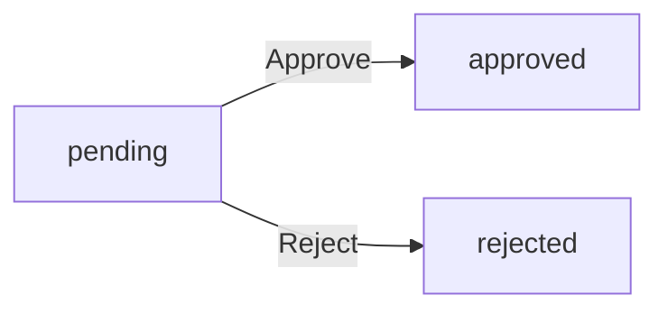

**ecommerce — What operations users can perform, use cases, business workflows**

What operations users can perform, use cases, business workflows

# Core Business Operations

What the system must do for each business concept.

## Customer Operations

Customers must register with email and password to access any platform features. There is no guest browsing available. Customers can log in using their credentials and change their password when needed. Each customer maintains a profile with a display name and phone number that can be edited. When a customer deletes their account, their profile information is removed but their orders and order history are preserved for legal and seller record purposes. Reviews from deleted customers remain visible but are shown as from a deleted user. Customers can manage multiple shipping addresses with complete recipient details.

### Customer Registration and Authentication

Customers must register with an email address and password to access any platform features. There is no guest browsing available on the platform.

When a customer registers, the system validates that the email address is unique. If the email is already registered, the registration is rejected.

After successful registration, the customer can log in using their email and password credentials.

Customers can change their password at any time by providing their current password and a new password.

The current password must be verified before allowing a password change.

### Account Deletion and Data Preservation

Customers can delete their account when they no longer wish to use the platform.

When a customer deletes their account, their profile information including display name and phone number is permanently removed from the system.

Customer orders and order history are preserved even after account deletion. This ensures sellers maintain records and the platform complies with legal requirements.

Reviews written by the customer remain visible on product pages but are displayed as being from a "deleted user" rather than showing the customer's name.

The customer's shipping addresses are deleted along with their profile information.

### Customer Profile Management

Each customer maintains a profile with a display name and phone number.

Customers can edit their display name at any time.

Customers can edit their phone number at any time.

Profile changes are recorded in the system but do not create snapshots (snapshots apply to seller profiles, products, and other transactional data as defined elsewhere).

### Shipping Address Management

Customers can manage multiple shipping addresses for receiving orders.

Each shipping address includes recipient name, phone number, street address, city, state or province, postal code, and country.

Customers can add new shipping addresses to their account.

Customers can edit existing shipping addresses.

Customers can delete shipping addresses they no longer need.

Customers can designate one shipping address as the default. The default address is suggested when checking out but customers can select a different address for each order.

When a customer deletes their account, all their shipping addresses are removed from the system.

## Seller Operations

Sellers must register with email and password but require administrator approval before they can sell products. Sellers can log in with their credentials and change their password. Sellers can view their approval status as pending, approved, or rejected. If rejected, they can see the rejection reason and submit a new registration request. Sellers maintain a profile with shop name, shop description, and logo image. Every profile edit creates a snapshot to preserve the previous state. Customers can view seller profiles when browsing products. Sellers can delete their account only if they have no pending orders or pending cancellation and refund requests.

### Seller Registration and Approval

Sellers can register for an account using their email address and password. Registration requires administrator approval before the seller can list products or process orders.

Sellers can log in to the system using their registered email and password. Successful authentication grants access to seller-specific features.

Sellers can change their password at any time after logging in.

The system records the seller's approval status as pending, approved, or rejected. Sellers can view their current approval status at any time.

When a seller registration is rejected, the system displays the administrator's rejection reason to the seller.

Rejected sellers can submit a new registration request after reviewing the rejection reason.

Sellers with approved status can create products, manage inventory, and process orders. Sellers with pending or rejected status cannot list products or access seller dashboard features.

### Shop Profile Management

Sellers can manage their shop profile by editing the shop name, shop description, and logo image.

Every edit to the shop profile creates an immutable snapshot that records the timestamp, the fields that were changed, and the values before and after the change.

Sellers can view the history of their shop profile snapshots to track changes over time.

Customers can view seller profiles when browsing products or viewing product details. The profile displays the shop name, shop description, and logo image as they currently appear.

Shop profile snapshots are preserved even if the seller deletes their account, ensuring order history maintains accurate seller information.

### Seller Account Deletion

Sellers can delete their seller account only if they have no pending orders (items with paid or shipped status) and no pending cancellation or refund requests.

When a seller deletes their account, all their products are removed from listings and are no longer visible in search or category browsing.

Order history and order snapshots are preserved when a seller deletes their account to maintain records for completed transactions.

The seller's shop name in past orders is preserved to maintain order history integrity for customers and administrators.

If a seller has pending orders or pending cancellation and refund requests, the system prevents account deletion and indicates the blocking conditions.

## Category Operations

Categories organize products and can have subcategories with one level of nesting only. Each category has a name and description. Categories are created and managed exclusively by administrators. Customers can browse the list of all categories and view products within each category. Administrators can create new categories and subcategories. Administrators can edit category names and descriptions. Administrators can delete categories, and products in deleted categories become uncategorized.

### Category Organization Structure

Categories organize products into a hierarchical structure with one level of nesting only. Each category can have multiple subcategories, but subcategories cannot have their own subcategories.

Each category has a name and description that identify and explain its purpose.

Categories form a tree structure where:
- Root-level categories have no parent
- Subcategories belong to exactly one parent category
- Products can be assigned to any category including subcategories

### Administrator Category Management

Administrators exclusively manage all categories on the platform.

Administrators can create new categories and subcategories. When creating a subcategory, the administrator selects its parent category.

Administrators can edit category names and descriptions. Every edit creates a snapshot that records the change.

Administrators can delete categories. When a category is deleted, all products that were assigned to that category become uncategorized and remain visible in the system without category assignment.

Administrators can view the complete category hierarchy including all categories and their subcategories.

### Customer Category Browsing

Customers can browse the list of all categories available on the platform.

Customers can view products within a specific category. This includes products assigned to root-level categories and products assigned to subcategories.

When viewing products in a category, customers see all products that belong to that category regardless of whether it is a root category or subcategory.

## Product Operations

Sellers can create products with a name, description, category, and base price, all of which are required fields. Every product belongs to the seller who created it. Sellers can edit their own products, and every edit creates a snapshot to preserve the previous state. Product images can be uploaded, reordered, and deleted by sellers. Sellers can delete their own products only if there are no pending order items or pending cancellation and refund requests for any variant. Deleting a product also deletes all its variants and inventory records. Deleted products no longer appear in search or category listings. Administrators can view all products and delete any product for policy violations.

### Product Creation

Sellers can create a new product by providing a name (required), description (required), category (required), and base price (required).

The product must be assigned to a category or subcategory created by administrators. Sellers can select from the available category list.

The product automatically belongs to the seller who created it. This ownership cannot be transferred to another seller.

When a product is created, it is initially visible in search results and category listings if it has at least one variant with stock greater than zero.

### Product Editing and Snapshots

Sellers can edit their own products to update the name, description, category, or base price.

Every product edit creates an immutable snapshot that records:
- When the change was made
- Which fields were changed
- The values before and after the change

Snapshots are preserved even if the product is later deleted. Sellers can view snapshots of their own products. Administrators can view snapshots of any product.

### Product Image Management

Sellers can upload multiple images for each product.

Sellers can reorder images within a product. The first image in the order is displayed as the main/thumbnail image in search results and listings.

Sellers can delete images from their products. Image changes are included in product snapshots when the product is edited.

When a product is edited, a snapshot is created that includes all current images and their order.

### Product Deletion

Sellers can delete their own products only if:
- There are no pending order items (paid or shipped status) for any variant of the product
- There are no pending cancellation or refund requests for any variant of the product

When a product is deleted:
- All variants of the product are deleted
- All inventory records for the variants are deleted
- The product no longer appears in search results or category listings
- Product snapshots are preserved for historical records

If a product has no variants, it is visible in search but shown as "unavailable".

### Administrator Product Oversight

Administrators can view all products on the platform regardless of seller or status.

Administrators can view snapshots of any product for dispute resolution or audit purposes.

Administrators can delete any product for policy violations. When an administrator deletes a product:
- The deletion follows the same restrictions as seller deletion (no pending order items or requests)
- Product snapshots are preserved
- Order items that reference the deleted product retain their snapshots of the product state at time of purchase

## ProductVariant Operations

A product can have multiple variants representing specific combinations of options like color and size. Each variant has a unique SKU code, option values, optional price override, and required stock quantity starting at zero. Sellers can add variants to their products and edit the SKU code, option values, and price. Every variant edit creates a snapshot. Sellers can delete variants only if there are no pending order items or pending cancellation and refund requests for that variant. A product must have at least one variant to be purchasable. Products with no variants are visible in search but shown as unavailable.

### Variant Creation

Sellers can create a variant for their product. Each variant must have a unique SKU code that identifies the specific combination of options. The SKU code must be unique within the seller's products. Each variant includes option values that describe the specific combination (such as color and size). A variant may have a price that overrides the product's base price. If no override price is specified, the variant uses the product's base price. Each variant must have a stock quantity that starts at zero. Sellers must specify the stock quantity when creating a variant.

### Stock Quantity Management

Sellers can add inventory to a variant by specifying a quantity to add and providing a reason for the restock. Sellers can subtract inventory from a variant by specifying a quantity to remove and providing a reason for the adjustment. The current stock quantity is calculated by summing all inventory history records for the variant. When a variant's stock quantity reaches zero, the variant is shown as out of stock. Out of stock variants cannot be added to the shopping cart. Sellers can view the full inventory history for each variant, showing all quantity changes with reasons and timestamps.

### Variant Editing and Snapshots

Sellers can edit the SKU code, option values, and price of their variants. Every edit to a variant creates a snapshot that preserves the previous state. The snapshot records when the change was made, what fields were changed, and the values before and after the change. Sellers can view snapshots of their own variants. Administrators can view snapshots of any variant. Snapshots are immutable and cannot be deleted.

### Variant Deletion Restrictions

Sellers can delete a variant only if there are no pending order items for that variant in paid or shipped status. Sellers can delete a variant only if there are no pending cancellation or refund requests for that variant. When a variant is deleted, all its inventory history records are preserved. If all variants of a product are deleted, the product remains visible in search results but is shown as unavailable for purchase.

### Product Variant Availability

A product must have at least one variant to be purchasable. Products with no variants are visible in search and category listings but are displayed as unavailable. Customers cannot add unavailable products to their cart. The product detail page shows all available variants with their prices and stock status. When stock reaches zero for a variant, that variant is shown as out of stock on the product detail page. Out of stock variants are not included in the product's price range calculation.

## ProductImage Operations

Sellers can upload multiple images for each product. The first image serves as the main thumbnail image. Images can be reordered by sellers to change their display sequence. Sellers can delete images from their products. All image changes are included in product snapshots when the product is edited. Customers see all images on the product detail page with the first image as the thumbnail in listings.

### Product Image Upload

Sellers can upload multiple images for each product they own. Each product can have multiple images associated with it.

When uploading images, sellers can add one or more images at a time. The system accepts image files and stores them for display.

All uploaded images are associated with the product and remain visible until deleted by the seller or the product is deleted.

Customers can view all product images on the product detail page.

### Thumbnail Image Selection and Display

The first image in the image sequence serves as the main thumbnail image for the product. This thumbnail is displayed in search results, category listings, and product listing pages.

On the product detail page, all images are displayed with the first image shown prominently as the main image.

Sellers can change which image serves as the thumbnail by reordering the images (see Image Reordering).

The thumbnail image is automatically selected as the first image in the sequence and updates when the sequence changes.

### Image Reordering

Sellers can reorder the images of their products to change the display sequence. Reordering changes which image appears first and therefore which image serves as the thumbnail.

Sellers can drag and drop images or use up/down controls to change the order.

When images are reordered, the first image becomes the thumbnail for listings and search results.

Image reordering is reflected immediately in all product listings and the product detail page.

### Image Deletion

Sellers can delete individual images from their products. When an image is deleted, it is removed from the product and no longer displayed.

If the deleted image was the thumbnail (first image), the next image in the sequence automatically becomes the new thumbnail.

Deleting an image does not delete the product or affect other images.

Customers can no longer view deleted images on the product detail page or in listings.

### Image Changes in Snapshots

When a product is edited, including any changes to its images, a product snapshot is created. This snapshot captures the state of all product images at the time of the edit.

Image changes that trigger snapshots include: adding new images, deleting images, and reordering images.

The snapshot preserves the complete image set as it existed before the edit, including all image URLs and their sequence order.

Sellers can view snapshots of their own products to see historical image states.

Administrators can view snapshots of any product for oversight and dispute resolution.

Snapshots are immutable and cannot be deleted, preserving a complete history of all image changes.

## Address Operations

Customers can add multiple shipping addresses to their account. Each address includes recipient name, phone number, street address, city, state or province, postal code, and country. Customers can edit their saved addresses and delete addresses they no longer need. Customers can set one address as the default shipping address for future orders. During checkout, customers must select a shipping address or use their default. Once an order is placed, the shipping address cannot be changed.

### Shipping Address Creation

Customers can create a new shipping address in their account. The address must include recipient name, phone number, street address, city, state or province, postal code, and country. All fields are required when creating an address. The system validates that all required fields are provided before saving the address.

### Address Recipient Details

Each saved address stores complete recipient information including the recipient's name, phone number, and full delivery address with street address, city, state or province, postal code, and country. Customers can view all their saved addresses at any time. The system displays addresses in a list showing the recipient name and primary address line for each saved address.

### Address Editing Operation

Customers can edit any of their saved shipping addresses. When editing, customers can modify the recipient name, phone number, street address, city, state or province, postal code, or country. All address fields remain editable after the address is created. The system saves the updated address immediately after the customer confirms the changes.

### Address Deletion Capability

Customers can delete any shipping address they no longer need. When a customer deletes an address, it is immediately removed from their saved address list. If the deleted address was set as the default shipping address, the system removes the default designation. Addresses cannot be recovered after deletion. Customers cannot delete an address that is currently associated with an active order.

### Default Address Setting

Customers can designate one of their saved addresses as the default shipping address. When a default address is set, it is automatically selected during checkout. Customers can change the default address at any time by selecting a different saved address. Only one address can be the default at any time. If no default address is set, customers must manually select an address during checkout.

### Checkout Address Selection

During checkout, customers must select a shipping address for their order. The system presents all saved addresses for the customer to choose from. If the customer has set a default address, it is pre-selected but can be changed. Customers can also select a non-default address for a specific order without changing their default. The selected address becomes part of the order record.

### Order Address Immutability

Once an order is placed, the shipping address becomes immutable and cannot be changed. This restriction applies to all orders regardless of their status. If a customer needs to change the shipping address, they must cancel the order and place a new one. The system preserves the original shipping address in the order history for reference and dispute resolution.

### Multiple Address Storage

Customers can store multiple shipping addresses in their account. There is no limit to the number of addresses a customer can save. Each address is stored independently and can be used for different orders. The system organizes saved addresses in a list that customers can view, edit, or delete at any time. All saved addresses remain available until explicitly deleted by the customer.

## Cart Operations

Customers can view their shopping cart which contains variants they want to purchase. The cart shows each item with product name, variant options, price, quantity, and subtotal. Customers can add variants to their cart by selecting a specific variant and specifying quantity. If the same variant is already in the cart, quantities are combined rather than creating a new line item. Customers can change quantities of items in their cart and remove items entirely. The cart displays the total price of all items. A warning is shown if variant stock is less than cart quantity. Unavailable variants are marked in the cart.

### Shopping Cart Viewing

Customers can view their shopping cart at any time. The cart displays all items the customer has added for potential purchase.

Each cart item shows:
- Product name
- Variant option values (e.g., color, size)
- Unit price at the time of adding to cart
- Quantity selected
- Subtotal for that item (unit price multiplied by quantity)

The cart displays the total price of all items combined.

If a variant has been deleted by the seller, it is marked as unavailable in the cart.

If a variant is out of stock, it is marked as unavailable in the cart.

### Adding Variants to Cart

Customers can add product variants to their shopping cart. The customer must select a specific variant (not just a product) when adding to cart.

When adding to cart, the customer specifies the quantity desired.

If the same variant is already in the cart, the system combines the quantities rather than creating a new line item. For example, if a customer adds 2 of a variant that already has 3 in the cart, the cart item quantity becomes 5.

The unit price is recorded at the time of adding to cart and remains fixed for that cart item.

A variant cannot be added to the cart if it is out of stock.

### Modifying and Removing Cart Items

Customers can modify the quantity of items already in their cart. They can increase or decrease the quantity for any cart item.

If the quantity is changed to zero or less, the item is removed from the cart.

Customers can remove items from their cart entirely. When an item is removed, it is deleted from the cart and no longer contributes to the total price.

A warning is shown if the cart quantity for a variant exceeds the available stock quantity. The item remains in the cart but the customer is notified of the stock limitation.

If a variant becomes out of stock after being added to the cart, it is marked as unavailable but remains in the cart until the customer removes it or completes checkout with available items.

### Cart Total Price Display

The cart displays the total price calculated from all cart items. The total is the sum of all item subtotals (unit price multiplied by quantity for each item).

The total price updates automatically when:
- Items are added to the cart
- Item quantities are modified
- Items are removed from the cart

## CartItem Operations

Each cart item represents a specific product variant with a selected quantity. Cart items store the product reference, variant options, unit price, and quantity. When adding to cart, the system checks if the variant already exists and combines quantities if so. Cart items are removed when customers delete them or when completing checkout. Cart items reference the current product and variant state at the time of addition. If a variant becomes out of stock or is deleted, the cart item is marked as unavailable but remains visible.

### Cart Item Creation and Variant Reference

WHEN a customer adds a product variant to the cart, THE system SHALL create a cart item that references the specific variant. THE system SHALL record the unit price at the time the variant is added to the cart. WHEN a customer specifies a quantity for the cart item, THE system SHALL store that quantity value. WHEN the same variant already exists in the customer's cart, THE system SHALL combine the new quantity with the existing quantity into a single cart item rather than creating a duplicate entry.

### Cart Item Removal

WHEN a customer requests to remove a cart item, THE system SHALL delete that item from the cart immediately. WHEN a customer successfully completes checkout and places an order, THE system SHALL remove all cart items from the customer's cart.

### Cart Item Availability Status

WHEN a product variant's stock quantity reaches zero, THE system SHALL mark the corresponding cart item as unavailable. WHEN a product is deleted by the seller, THE system SHALL automatically remove all cart items referencing that product from all customers' carts. WHEN a product variant is deleted by the seller, THE system SHALL mark the corresponding cart item as unavailable but retain it in the cart for the customer to review.

## Wishlist Operations

Customers can add products to their wishlist for future purchase consideration. The wishlist is paginated and shows products rather than specific variants. Customers can view their complete wishlist and remove products from it. If a seller deletes a product, it is automatically removed from all wishlists. The wishlist tracks when each product was added. Customers can browse wishlist items and decide to add them to their cart later.

### Wishlist Product Addition

Customers can add products to their wishlist for future purchase consideration. The system records the timestamp when each product is added to the wishlist. A product can only appear once in a customer's wishlist. If a customer attempts to add a product that is already in their wishlist, the request is rejected. The wishlist stores products rather than specific variants, allowing customers to track products at the product level.

### Wishlist Viewing and Pagination

Customers can view their complete wishlist. The wishlist displays products with their current availability status and when each product was added. Wishlist items are paginated to facilitate browsing. Customers can see product details including name, main image, and current price in the wishlist view.

### Wishlist Item Removal

Customers can remove products from their wishlist at any time. When a seller deletes a product from the platform, that product is automatically removed from all customer wishlists. This ensures the wishlist only contains products that are currently available on the platform.

## WishlistItem Operations

Each wishlist item represents a product added by the customer for future interest. Wishlist items store the product reference and the timestamp when added. Customers can remove wishlist items when they no longer want to track a product. When a product is deleted by the seller, the corresponding wishlist item is automatically removed. Wishlist items do not track specific variants since customers can select variants at purchase time.

### Wishlist Item Creation

Customers can add products to their wishlist for future reference. When adding a product to the wishlist, the system records the product reference and the timestamp when the item was added. Each product can appear only once in a customer's wishlist; attempting to add a product that is already in the wishlist is rejected. The wishlist item stores only the product reference, not a specific variant, allowing customers to select variants at the time of purchase.

### Wishlist Item Viewing

Customers can view their wishlist, which displays all products they have saved. The wishlist is paginated for browsing efficiency. Each wishlist item shows the product information including the main image, name, base price, and current availability status. The wishlist is accessible only to the customer who owns it; other customers cannot view another customer's wishlist.

### Wishlist Item Deletion

Customers can remove products from their wishlist when they no longer want to track them. When a wishlist item is removed, the system deletes the corresponding wishlist item record. Removing a wishlist item does not affect the product itself or any other customer's wishlist. The product remains available for purchase and can be added back to the wishlist at a later time.

### Automatic Wishlist Cleanup on Product Deletion

When a seller deletes a product from the platform, the system automatically removes all wishlist items that reference that product across all customers. This cleanup ensures that wishlists do not contain references to non-existent products. The automatic removal happens immediately when the product deletion is confirmed. Customers are not notified when their wishlist items are removed due to product deletion.

### Product-Level Wishlist Design

The wishlist operates at the product level, not the variant level. When customers add items to their wishlist, they select products without specifying variants. This design allows customers to save products they are interested in and choose specific variants (such as size, color, or other options) at the time of purchase. Wishlist items store only the product reference and do not track variant-specific information like SKU code, option values, or variant price.

## Order Operations

Customers can place orders after reviewing their cart and selecting a shipping address. When an order is placed successfully, stock quantities are decreased for each purchased variant and items are removed from the cart. An order record is created with an order number, date, and total price. Each purchased variant becomes an order item with status paid. Snapshots of each purchased product, variant, and seller profile are saved with the order item. Orders can contain items from multiple sellers. Customers can view their order history with a list of all orders sorted by newest first.

### Order Placement Process

Customers can place an order from their shopping cart after selecting a shipping address. The system validates that all items in the cart are available and have sufficient stock before allowing checkout. Customers review the order summary showing all items with prices, the selected shipping address, and the total price before confirming. Once the customer confirms and payment is processed successfully, the order is created. If payment fails, the order is not created and the customer can retry. After an order is placed, the shipping address cannot be changed.

### Cart to Order Conversion

When an order is successfully placed, the system converts the cart contents into an order record. Each cart item becomes an order item linked to the purchased variant. The system generates a unique order number for the order. All items are removed from the customer's cart after successful order creation. The order record includes the order date and total price calculated from all order items.

### Stock Quantity Decrease

When an order is placed, the stock quantity for each purchased variant is decreased automatically. The system creates an inventory record for each variant showing the negative quantity change with the reason being the order placement. This inventory update happens as part of the order creation process and cannot be reversed except through cancellation or refund workflows.

### Order Number Generation

Each order receives a unique order number upon creation. The order number serves as the primary identifier for the order and is used for order tracking, customer reference, and administrative purposes. The order number is generated automatically and cannot be modified after creation.

### Order Item Creation

When an order is placed, each purchased variant becomes an order item within the order. Each order item records the product name, variant options, quantity purchased, and price at the time of purchase. If a customer purchases multiple units of the same variant, they become a single order item with the combined quantity. Order items from different sellers are grouped within the same order but maintain independent status tracking.

### Paid Status Assignment

Each order item is assigned the status paid upon successful order creation. The paid status indicates that payment has been completed and the item is waiting for the seller to ship. The paid status is the initial state for all order items and cannot be skipped or modified directly.

### Product Snapshot at Purchase

When an order is placed, the system creates a snapshot of each purchased product at the time of purchase. The product snapshot preserves the product name, description, category, base price, and images as they existed at the moment of purchase. This snapshot is immutable and preserved even if the product is later edited or deleted by the seller.

### Seller Profile Snapshot

When an order is placed, the system creates a snapshot of each seller's profile associated with the order items. The seller profile snapshot preserves the shop name and logo as they existed at the moment of purchase. This snapshot is stored with the order item and ensures that past orders reflect the seller information at the time of purchase, even if the seller later changes their profile.

### Multi-Seller Order Support

An order can contain items from multiple sellers. Each seller's items are tracked independently within the order with their own status. When items from different sellers are shipped, they are grouped into separate shipments, one per seller. Customers view the order as a single transaction but fulfillment occurs separately for each seller's items.

### Order History Viewing

Customers can view their order history as a list of all their orders. The list shows the order number, order date, total price, and overall order status for each order. Customers can access the full details of any order to view all order items, shipping address, and shipment tracking information.

### Order List Pagination

The order history list is paginated to handle customers with many orders. Orders are sorted by newest first, with the most recent orders appearing at the top of the list. Pagination allows customers to navigate through their complete order history in manageable pages.

## OrderItem Operations

Each order item represents a purchased product variant with quantity and status. Order items can be from different sellers within the same order. Each order item has its own status independent of other items. Item statuses include paid, shipped, delivered, cancelled, and refunded. If a customer buys multiple units of the same variant, it becomes one order item with combined quantity. Order items are grouped into shipments when shipped. Each order item can be individually cancelled or refunded. Administrators can force-cancel or force-refund individual items.

### Order Item Status Tracking

Each order contains one or more order items, where each item represents a purchased product variant with a specific quantity.

When a customer purchases multiple units of the same variant, they become a single order item with the combined quantity.

Order items can come from different sellers within the same order. Each seller's items are tracked independently.

The system tracks the status of each order item separately from other items in the same order.

### Order Item Status Values

Each order item has one of the following statuses:

- **Paid**: Payment has been completed for this item, and it is waiting for the seller to ship
- **Shipped**: The seller has shipped this item and provided tracking information
- **Delivered**: The customer has confirmed delivery of this item, or 14 days have passed since shipping
- **Cancelled**: This item was cancelled before shipment
- **Refunded**: This item was refunded after delivery

### Status Independence

Each order item maintains its own status independent of other items in the same order.

An order item can be cancelled or refunded without affecting the status of other items in the order.

The overall order status is derived from the statuses of all its items (as defined in Order Operations).

### Multi-Seller Order Items

Order items can originate from different sellers within a single order.

When a customer purchases products from multiple sellers in one checkout, the system creates separate order items for each seller's products.

Each order item is associated with the seller who owns the purchased product variant.

Sellers can only view and manage order items for products they own.

Sellers can only ship order items that belong to their products.

When a shipment is created, it can only contain order items from the same seller.

Different sellers always ship separately, even for items in the same order.

### Individual Item Cancellation

Customers can request cancellation for individual order items that have "paid" status.

Cancellation requests include a reason provided by the customer.

The seller of that specific item can approve or reject the cancellation request.

When a seller approves a cancellation, only that item is cancelled and refunded.

The remaining items in the order continue processing normally.

When a seller rejects a cancellation request, the item continues to the shipping process.

A snapshot of the cancellation request is created when the seller responds.

Cancelled items restore their stock quantities through inventory records.

If all items in an order are cancelled, the entire order status becomes "cancelled".

### Individual Item Refund

Customers can request a refund for individual order items that have "delivered" status.

Refund requests can only be made within 7 days of the item being delivered.

Refund requests include a reason provided by the customer.

The seller of that specific item can approve or reject the refund request.

When a seller approves a refund, only that item is refunded.

The remaining items in the order are unaffected by the refund.

A snapshot of the refund request is created when the seller responds.

Refunded items restore their stock quantities through inventory records.

If all items in an order are refunded, the entire order status becomes "refunded".

### Administrator Force Actions

Administrators can view all order items across all orders on the platform.

Administrators can force-cancel individual order items regardless of their current status.

When an administrator force-cancels an item, the customer receives a refund for that item only.

Force-cancelled items restore their stock quantities through inventory records.

Administrators can force-refund individual order items regardless of their current status.

When an administrator force-refunds an item, the customer receives a refund for that item only.

Force-refunded items restore their stock quantities through inventory records.

Administrators can force-cancel or force-refund entire orders, which applies the action to all items in the order.

Administrative actions are recorded for audit purposes.

## Shipment Operations

A shipment is a package sent by a seller containing one or more order items from the same seller. Different sellers always ship separately with different shipments. Sellers can choose to ship items individually or bundle multiple items into one shipment. When shipping, sellers select items to include and enter tracking information with carrier name and tracking number. All items in the same shipment share the same tracking information. When a shipment is created, all items in it change to status shipped. Customers can view tracking information for each shipment and confirm delivery per shipment.

### Shipment Creation

Sellers can create a shipment for their order items that have status "paid". A shipment represents a physical package sent by the seller to the customer. When creating a shipment, the seller selects one or more order items from the same seller to include in the shipment. Different sellers always create separate shipments; a shipment cannot contain items from multiple sellers. Sellers can choose to ship items individually or bundle multiple items into one shipment. Once a shipment is created, all order items included in the shipment change their status from "paid" to "shipped". A shipment cannot be created for items that have already been shipped, delivered, cancelled, or refunded.

### Tracking Information Entry

When creating a shipment, sellers must enter tracking information including the carrier name and tracking number. The carrier name identifies the shipping company (e.g., FedEx, UPS, DHL). The tracking number is the unique identifier provided by the carrier for tracking the package. All order items included in the same shipment share the same tracking information. Once a shipment is created with tracking information, the tracking details cannot be modified or deleted. Sellers can view the tracking information for all shipments they have created.

### Shipment Tracking Viewing

Customers can view tracking information for each shipment in their order. The tracking information displays the carrier name and tracking number. Customers can use the tracking number with the carrier's website to track their package. For orders with multiple shipments from different sellers, each shipment shows its own tracking information independently. Customers can view the list of shipments associated with each order, including which order items are included in each shipment.

### Delivery Confirmation

Customers can confirm delivery for each shipment individually. When a customer confirms delivery for a shipment, all order items included in that shipment change their status from "shipped" to "delivered". Delivery confirmation applies to the entire shipment, not individual items within the shipment. If a customer does not manually confirm delivery, the system automatically marks all items in the shipment as "delivered" fourteen days after the shipment date. Once a shipment is marked as delivered (either manually or automatically), the delivery status cannot be reverted to shipped.

## Review Operations

Customers can write reviews for products they have purchased after the item status is delivered. A customer can write one review per product per order. Each review has a required rating from one to five stars and optional text content. Reviews are displayed on the product detail page sorted by newest first. Customers can edit their own reviews and every edit creates a snapshot. Customers can delete their own reviews but snapshots are preserved. The product average rating is calculated from all non-deleted reviews.

### Review Creation Eligibility

Customers can write a review for a product they have purchased. A review can only be created after the corresponding order item has reached delivered status. If the item status is not delivered, the system shall reject the review creation request.

A customer can write one review per product per order. If a customer has already written a review for the same product in the same order, the system shall reject any additional review creation attempts for that product-order combination.

Each review must include a rating on a five star scale, where one star represents the lowest rating and five stars represents the highest rating. The rating is required and must be a whole number between one and five. The system shall reject review creation if the rating is outside this range.

Each review may include optional text content describing the customer's experience with the product. If text content is provided, it is stored with the review. If no text content is provided, the review is still valid with only the rating.

### Product Review Display

Reviews are displayed on the product detail page for all customers to view. The product detail page shows all reviews associated with that product from all customers who have purchased and reviewed it.

Reviews are sorted by newest first, with the most recently created reviews appearing at the top of the review list. This sorting order applies to all review displays on the product detail page.

### Review Editing and Snapshots

Customers can edit their own reviews after they have been created. The system shall allow a customer to modify both the rating and the text content of their existing review. Only the customer who created the review can edit it; other customers cannot modify reviews they do not own.

Whenever a review is edited, the system shall create a snapshot of the review. The snapshot records when the change was made, what fields were changed, and the values before and after the change. Snapshots are immutable and cannot be deleted. All snapshots for a review are preserved even after the review is deleted.

### Review Deletion and Rating Calculation

Customers can delete their own reviews. When a review is deleted, the review is no longer displayed on the product detail page. However, the system shall preserve all snapshots of the deleted review for historical and dispute resolution purposes.

The product average rating is calculated using only non-deleted reviews. Deleted reviews are excluded from the average rating calculation. When a review is deleted, the product average rating is recalculated to reflect only the remaining non-deleted reviews.

## InventoryRecord Operations

Each variant has its own stock quantity managed through inventory history records rather than snapshots. Each inventory record contains quantity change with positive values for restocking and negative values for orders or adjustments, along with a reason and timestamp. Current stock is calculated by summing all inventory records. Sellers can add inventory through restocking with quantity and reason. Sellers can subtract inventory for adjustments or loss with quantity and reason. Order placement automatically creates a negative inventory record. Order cancellation or refund automatically creates a positive inventory record. Sellers can view the full inventory history of each variant.

### Inventory History Management

Each product variant maintains its stock quantity through a history of inventory records rather than a single stock field. Sellers can view the complete inventory history for any variant they own, showing all quantity changes over time.

Inventory records are automatically created by the system for order-related activities:
- When an order is placed, a negative inventory record is created for each purchased variant
- When an order item is cancelled, a positive inventory record is created to restore stock
- When an order item is refunded, a positive inventory record is created to restore stock

Sellers can also manually create inventory records for restocking and adjustments:
- Restock operation: Sellers add inventory by creating a positive quantity change with a reason (e.g., new shipment received)
- Adjustment operation: Sellers subtract inventory by creating a negative quantity change with a reason (e.g., damaged goods, inventory correction)

Each inventory record contains:
- Quantity change value (positive for additions, negative for deductions)
- Reason for the change (required text description)
- Timestamp when the change occurred
- Record type (manual restock, manual adjustment, order deduction, cancellation restoration, or refund restoration)

The current stock quantity for a variant is calculated by summing all inventory records for that variant. This calculation is performed on-demand when displaying stock levels.

When a variant's stock quantity reaches zero, it is automatically shown as "out of stock" to customers. Out of stock variants cannot be added to shopping carts.

### Inventory Change Operations

Sellers can manually adjust inventory for their product variants through restock and adjustment operations.

**Restock Operation**
Sellers can add inventory to a variant by specifying:
- The quantity to add (positive number)
- A reason for the restock (required text)

When executed, the system creates a new inventory record with a positive quantity change and the provided reason.

**Inventory Adjustment Operation**
Sellers can subtract inventory from a variant by specifying:
- The quantity to remove (positive number, stored as negative change)
- A reason for the adjustment (required text)

When executed, the system creates a new inventory record with a negative quantity change and the provided reason.

**Automatic Inventory Updates**
The system automatically creates inventory records for order-related events without seller intervention:
- Order placement: Creates negative inventory records for purchased variants
- Cancellation approval: Creates positive inventory records to restore cancelled item quantities
- Refund approval: Creates positive inventory records to restore refunded item quantities

All inventory records, whether manual or automatic, are immutable and cannot be deleted or modified after creation.

### Automatic Inventory Updates

The system tracks inventory changes through distinct record types that indicate the source of each quantity adjustment.

**Order Inventory Deduction**
When a customer completes checkout and payment succeeds, the system automatically creates negative inventory records for each variant in the order. The quantity deducted equals the purchased quantity for each variant. This occurs immediately upon order creation before the item enters the "paid" status.

**Cancellation Inventory Restoration**
When a cancellation request is approved by the seller, the system automatically creates a positive inventory record for the cancelled variant. The quantity restored equals the cancelled item quantity. This restoration occurs at the time the cancellation is approved, returning the stock to available inventory.

**Refund Inventory Restoration**
When a refund request is approved by the seller, the system automatically creates a positive inventory record for the refunded variant. The quantity restored equals the refunded item quantity. This restoration occurs at the time the refund is approved, returning the stock to available inventory.

**Stock Calculation Method**
The current stock quantity is not stored as a separate field but is calculated by summing all inventory records for a variant. This includes both manual adjustments and automatic order-related changes. The calculation ensures an accurate audit trail of all stock movements.

**Zero Stock Handling**
When the calculated stock quantity reaches zero, the variant is automatically marked as "out of stock" in all customer-facing displays. Out of stock variants cannot be added to shopping carts, preventing customers from purchasing unavailable items.

## CancellationRequest Operations

Customers can request cancellation for individual order items with paid status that have not yet been shipped. Cancellation requests include a text reason explaining why the customer wants to cancel. The seller of that item can approve or reject the cancellation request. When a seller responds, a snapshot of the request state is created. If approved, the item is cancelled and refund is processed for that item only. Cancelled items restore their stock quantities via inventory records. The remaining items in the order continue processing normally. If all items in an order are cancelled, the entire order status becomes cancelled.

### Cancellation Request Creation

Customers can request cancellation for individual order items that have paid status. Cancellation requests cannot be made for items with shipped, delivered, cancelled, or refunded status.

Customers must provide a text reason when submitting a cancellation request. The reason explains why the customer wants to cancel the item.

When a cancellation request is submitted, the system records the request with the provided reason and the current timestamp.

If the order item does not have paid status, the cancellation request is rejected.

If the order item has already been shipped, the cancellation request is rejected.

### Cancellation Request Approval and Rejection

The seller of the order item can approve or reject a cancellation request.

When a seller approves a cancellation request, the order item status changes to cancelled. A snapshot of the cancellation request state is created at the time of approval.

When a seller rejects a cancellation request, the order item remains in paid status. A snapshot of the cancellation request state is created at the time of rejection, and the rejection is recorded.

If the cancellation request is approved, the stock quantity for the corresponding product variant is restored via an inventory record. The inventory record includes the quantity change and reason for the stock restoration.

If the cancellation request is rejected, the order item continues processing normally and remains available for shipping.

### Partial and Complete Order Cancellation

When a cancellation request is approved for an order item, only that specific item is cancelled. The remaining items in the same order continue processing normally with their existing statuses.

If all order items in an order are cancelled (either through individual cancellation requests or other means), the overall order status becomes cancelled.

If some items in an order are cancelled while others remain in paid, shipped, or delivered status, the order status reflects the mixed state according to the order status rules.

Cancelled items are removed from the active order processing workflow but remain in the order history for record-keeping purposes.

## RefundRequest Operations

Customers can request a refund for individual order items with delivered status within seven days of delivery. Refund requests include a text reason explaining why the customer wants a refund. The seller of that item can approve or reject the refund request. When a seller responds, a snapshot of the request state is created. If approved, the item is refunded and stock quantities are restored via inventory records. The remaining items in the order are unaffected. If all items in an order are refunded, the entire order status becomes refunded. Refunds are processed for individual items only.

### Refund Request Creation

Customers can request a refund for individual order items that have been delivered. Refund requests are only available for items with delivered status. Customers must submit the refund request within seven days of the delivery date. Each refund request must include a text reason explaining why the customer wants a refund. The system validates that the item has been delivered before allowing the refund request to be created. The system validates that the refund request is submitted within the seven day window from delivery. If the item has not been delivered, the refund request is rejected. If the seven day window has passed, the refund request is rejected. If the refund reason is missing, the refund request is rejected.

### Seller Refund Response

Sellers can approve or reject refund requests for order items belonging to their products. When a seller responds to a refund request, a snapshot is created that records the state change including the reason for approval or rejection. If the seller approves the refund request, the item status changes to refunded and the stock quantity is restored through an inventory record. If the seller rejects the refund request, the refund request remains in the system with the rejection reason visible to the customer. Sellers can only respond to refund requests for items that are in their pending refund queue. Sellers cannot approve or reject refund requests for items from other sellers.

### Refund Outcomes and Order Status

When a refund request is approved, the refunded item's stock quantity is restored via an inventory record. The remaining items in the order continue processing normally and are unaffected by the refund. Each order item can be individually refunded, allowing for partial order refunds. If all items in an order are refunded, the overall order status becomes refunded. If some items are refunded while others remain in different statuses, the order status reflects the mixed state. The refund is processed for the individual item only, not the entire order. Stock restoration occurs automatically when the refund is approved.

## Snapshot Operations

Whenever editable data is modified, a snapshot is created to preserve the previous state. Snapshots record when the change was made, what was changed, and the values before and after. Snapshots are immutable and cannot be deleted. Snapshots can be viewed by relevant parties including owners and administrators for dispute resolution. Snapshots apply to products including all fields and images, product variants including SKU and option values, seller profiles including shop name and logo, order items including product and variant at time of purchase, reviews, and cancellation and refund requests. Product snapshots include all product fields and snapshots of all variants at that moment.

### Snapshot Creation Triggers

Whenever editable data is modified in the system, a snapshot is automatically created to preserve the previous state. This applies to products, product variants, seller profiles, order items, reviews, cancellation requests, and refund requests.

The following actions trigger snapshot creation:
- Product creation and editing (including all fields and images)
- Product variant creation and editing (including SKU code, option values, and price)
- Seller profile editing (shop name, description, and logo)
- Order item creation at time of purchase
- Review creation and editing
- Cancellation request creation and status changes
- Refund request creation and status changes

Snapshots are created automatically and cannot be skipped. Users do not manually create snapshots.

### Snapshot Data Structure

Each snapshot records the following information:
- Timestamp: When the change was made
- Changed fields: Which specific fields were modified
- Before values: The values of the fields before the change
- After values: The values of the fields after the change

For product snapshots, the snapshot includes all product fields (name, description, category, base price, images) and also includes snapshots of all variants at that moment. This preserves the complete state of a product and its variants at any point in time.

All snapshot data is recorded in business terms, not technical field names. For example, "shop name" instead of technical identifiers.

### Snapshot Immutability

Snapshots are immutable once created. They cannot be modified or deleted under any circumstances. This immutability applies to all snapshot types including product snapshots, variant snapshots, seller profile snapshots, order item snapshots, review snapshots, and cancellation/refund request snapshots.

Even when the original entity is deleted (such as a product or review), its snapshots remain preserved in the system. This ensures historical records are maintained for audit and dispute resolution purposes.

### Product Snapshot Structure

Product snapshots have a specific structure that captures the complete product state at the time of the change. Each product snapshot includes:
- All product fields (name, description, category, base price, images)
- All variant information at that moment (SKU code, option values, price, stock quantity)

This nested structure means a product snapshot contains snapshots of all its variants (product-snapshot to product-snapshot-SKU relationship). This preserves the complete state of a product and its variants together, ensuring that historical product states can be reconstructed exactly as they were at any point in time.

### Seller Profile Snapshot

Seller profile changes create snapshots that record the shop name, shop description, and logo image before and after the edit. Each edit to the seller profile creates a new snapshot, building a complete history of how the shop information has changed over time.

Customers can view seller profiles to see current information. Administrators can view the snapshot history of seller profiles for oversight and dispute resolution.

### Order Item Snapshot

When an order is placed successfully, a snapshot of each purchased product and variant is saved with the order item. This snapshot captures:
- Product name, description, and price at the time of purchase
- Variant options and price at the time of purchase
- Seller profile information (shop name and logo) at the time of purchase

These order item snapshots preserve the exact state of products and sellers at the moment of purchase, ensuring that historical transaction records remain accurate even if products or seller profiles are modified or deleted later.

### Review Snapshot

Review creation and editing triggers snapshot creation. Each review snapshot records:
- Rating before and after the change
- Text content before and after the change
- Timestamp of the change

When customers delete their reviews, the snapshots remain preserved. This ensures that review history is maintained even when the visible review is removed.

### Cancellation Request Snapshot

Cancellation request creation and status changes create snapshots. Each snapshot records:
- Request reason
- Status before and after the change (e.g., from pending to approved or rejected)
- Timestamp of the change
- Response information when the seller approves or rejects

When a seller responds to a cancellation request, a snapshot of the request state is created to preserve the decision and reasoning.

### Refund Request Snapshot

Refund request creation and status changes create snapshots. Each snapshot records:
- Request reason
- Status before and after the change (e.g., from pending to approved or rejected)
- Timestamp of the change
- Response information when the seller approves or rejects

When a seller responds to a refund request, a snapshot of the request state is created to preserve the decision and reasoning.

### Snapshot Viewing and Access

Snapshots can be viewed by relevant parties for dispute resolution and audit purposes:
- Product owners (sellers) can view snapshots of their own products
- Administrators can view snapshots of any product on the platform
- Order participants can view order item snapshots associated with their orders
- Request owners can view snapshots of their own cancellation and refund requests
- Administrators can view all snapshots for oversight purposes

Snapshot viewing is read-only. Users can view snapshot history but cannot modify or delete any snapshot data.

## SellerApproval Operations

Seller accounts require administrator approval before they can sell products on the platform. Sellers can view their approval status as pending, approved, or rejected. If rejected, sellers can view the rejection reason provided by the administrator. Rejected sellers can submit a new registration request after seeing the rejection reason. Administrators can view the list of pending seller approvals. Administrators can approve seller registrations to enable selling. Administrators can reject seller registrations with a required reason. Administrators can suspend seller accounts which hides their products from listings but allows processing existing orders.

### Seller Approval Requirement

Sellers must obtain administrator approval before they can create products or sell on the platform.

When a seller registers, their account is created with a pending approval status. The seller cannot create products, manage inventory, or process orders until approved.

Sellers can view their current approval status at any time. The status is one of: pending, approved, or rejected.

If the approval status is pending, the seller must wait for administrator review before selling.

If the approval status is approved, the seller can create products, manage inventory, and process orders.

If the approval status is rejected, the seller cannot sell but can submit a new registration request.

### Approval Status Viewing

Sellers can view their approval status from their account dashboard.

The approval status shows one of three states: pending, approved, or rejected.

When the status is pending, the seller sees that their registration is awaiting administrator review.

When the status is approved, the seller sees that they are authorized to sell on the platform.

When the status is rejected, the seller sees that their registration was denied and can view the rejection reason provided by the administrator.

### Rejection Reason and Resubmission

When a seller's registration is rejected, the system displays the rejection reason provided by the administrator.

The rejection reason explains why the seller registration was denied.

Rejected sellers can submit a new registration request after reviewing the rejection reason.

When resubmitting, the seller goes through the same registration process with email and password.

The new registration request creates a fresh pending approval status for administrator review.

### Administrator Approval Management

Administrators can view a list of all pending seller approval requests.

The approval queue shows seller registration details including email, shop name, and submission date.

Administrators can approve a seller registration to authorize them to sell on the platform.

When approving, the seller's status changes from pending to approved and they gain selling privileges.

Administrators can reject a seller registration by providing a reason.

When rejecting, the system requires the administrator to enter a rejection reason that will be visible to the seller.

The seller's status changes from pending to rejected and the rejection reason is stored.

### Seller Suspension

Administrators can suspend seller accounts for policy violations or other reasons.

When a seller is suspended, their products are hidden from search results and category listings.

Suspended products cannot be purchased by customers.

Suspended sellers cannot create new products or edit existing products.

Suspended sellers can still process existing orders, including shipping items and responding to cancellation or refund requests.

Administrators can unsuspend seller accounts to restore their selling privileges.

When unsuspended, the seller's products become visible in search and category listings again.

## Administrator Operations

Any user can submit a request to become an administrator with a text reason. Super administrators can view the list of pending administrator requests. Super administrators can approve or reject administrator requests. When approved, the user becomes a regular administrator. There are two administrator grades: regular administrator and super administrator. Super administrators can promote regular administrators to super administrator grade. Super administrators can demote other super administrators to regular administrator grade. Super administrators cannot demote themselves. Administrators can manage seller approvals, categories, products, orders, and users.

### Administrator Request Submission

Any user (customer or seller) can submit a request to become an administrator. The request must include a text reason explaining why the user wants administrator access. The request is submitted to a pending administrator queue for review by super administrators. Once submitted, the user can view the status of their request (pending, approved, or rejected). If the request is rejected, the user can view the rejection reason and submit a new request.

### Administrator Request Review

Super administrators can view the list of all pending administrator requests. Each pending request shows the requesting user's information and the reason they submitted. Super administrators can approve a request, which grants the user regular administrator grade access. Super administrators can reject a request, which requires providing a text reason for the rejection. When a request is approved, the user immediately becomes a regular administrator with access to administrator operations. When a request is rejected, the user remains a regular customer or seller and can submit a new request with a different reason.

### Administrator Grade Management

There are two administrator grades: regular administrator and super administrator. Regular administrators can manage seller approvals, categories, products, orders, and users. Super administrators have all the capabilities of regular administrators plus grade management. Super administrators can promote a regular administrator to super administrator grade. Super administrators can demote a super administrator to regular administrator grade. A super administrator cannot demote themselves to regular administrator grade. Grade changes take effect immediately upon approval.

### Seller Management

Administrators can view the list of all seller accounts and their approval status. Administrators can approve seller registration requests, which grants the seller full selling privileges. Administrators can reject seller registration requests, which requires providing a text reason for the rejection. Rejected sellers can submit a new registration request. Administrators can suspend seller accounts. When a seller is suspended, their products are hidden from search and category listings, their products cannot be purchased, they can still process existing orders, and they cannot create new products or edit existing products. Administrators can unsuspend seller accounts, which makes their products visible again. Administrators can ban seller accounts, which prevents them from logging in while preserving existing orders. Administrators can unban seller accounts.

### Category Management

Administrators can create categories and subcategories. Each category has a name and description. Subcategories are one level of nesting only. Administrators can edit category names and descriptions. Administrators can delete categories. When a category is deleted, products in that category become uncategorized. Customers can browse the list of all categories. Customers can view products within a category.

### Product Oversight

Administrators can view all products on the platform regardless of seller. Administrators can view snapshots of any product to see the history of changes. Administrators can delete any product for policy violations. When a product is deleted by an administrator, the deletion is recorded in the product snapshots. Product deletion removes the product from search and category listings. Product deletion also removes all variants and inventory records associated with the product. Product snapshots are preserved even after product deletion.

### Order Oversight

Administrators can view all orders on the platform. Administrators can view the details of any order including order items, shipments, and tracking information. Administrators can force-cancel individual order items or entire orders. When an order item is force-cancelled, the customer receives a refund and stock quantities are restored. Administrators can force-refund individual order items or entire orders. When an order item is force-refunded, the customer receives a refund and stock quantities are restored. Force-cancellation and force-refund actions are recorded in the order item snapshots.

### User Management

Administrators can view all customer accounts. Administrators can ban customer accounts, which prevents them from logging in. Banned customers cannot place new orders or access their account data. Administrators can unban customer accounts, which restores their access. Administrators can view all seller accounts and their status. Administrators can ban seller accounts, which prevents them from logging in while preserving existing orders. Administrators can unban seller accounts.

# Error Scenarios and Edge Cases

Business-level error scenarios, edge case coverage, and expected system behaviors for exceptional conditions.

## Customer Error Scenarios

Customers cannot log in with incorrect email or password combinations. Account deletion is blocked if the customer has pending orders or active cancellation/refund requests. When deleting an account, the system preserves order history and reviews but marks them as from a deleted user. Password changes require the current password to be verified first. Customers cannot register with an email that already exists in the system. Account deletion permanently removes profile information but maintains transaction records for legal compliance. Customers receive error messages when attempting restricted operations due to pending transactions.

### Login Authentication Failures

Customers attempting to log in with incorrect email or password combinations will be denied access. The system will display a generic authentication failure message without specifying whether the email or password was incorrect.

If a customer account is banned by an administrator, login attempts will be rejected with an account access denied message. Banned customers cannot authenticate even with correct credentials.

If a customer account is in a pending deletion state, login attempts will be blocked until the deletion is completed or cancelled.

### Account Deletion Restrictions

Customers cannot delete their account if they have pending orders with paid or shipped status. The system will block the deletion request and indicate that active transactions must be resolved first.

Customers cannot delete their account if they have pending cancellation requests on any order items. All cancellation requests must be resolved (approved or rejected) before account deletion is permitted.

Customers cannot delete their account if they have pending refund requests on any order items. All refund requests must be resolved before account deletion is permitted.

When account deletion is blocked due to pending transactions, the system will inform the customer which type of pending items are preventing deletion.

### Registration Validation

Customers cannot register with an email address that already exists in the system. The registration request will be rejected with an error indicating the email is already in use.

Customers cannot register with an email address that was previously associated with a deleted account. The system maintains email uniqueness across all account lifecycles.

### Password Change Requirements

Customers changing their password must provide their current password for verification. The system will reject password change requests that do not include valid current password verification.

If the current password provided does not match the stored credentials, the password change request will be rejected.

### Account Deletion Data Handling

When a customer deletes their account, their profile information including display name and phone number is permanently removed from the system.

When a customer deletes their account, their order history and transaction records are preserved in the system for seller records and legal compliance purposes. These records remain accessible for order history viewing and administrative oversight.

When a customer deletes their account, their reviews are preserved but displayed as authored by a deleted user. The review content and rating remain visible on product detail pages, but the author name is replaced with a deleted user indicator.

The system maintains transaction record retention even after customer account deletion to support dispute resolution, seller record-keeping, and legal compliance requirements.

## Seller Error Scenarios

Sellers cannot access selling features without administrator approval. Account deletion is blocked when sellers have pending orders or active cancellation/refund requests. Rejected seller registrations can be resubmitted with new information. Sellers cannot delete their shop profile if it would affect existing order history. Unapproved sellers cannot create or edit products. When a seller account is suspended by administrators, they cannot create new products but can still process existing orders. Seller approval status changes trigger notifications to the seller.

### Seller Registration and Approval

Sellers must obtain administrator approval before accessing selling features. WHEN a seller registers, THE system SHALL create the account with pending approval status. WHILE the approval status is pending, THE system SHALL prevent the seller from creating products. WHILE the approval status is pending, THE system SHALL prevent the seller from editing products. Sellers can view their approval status at any time. THE approval status SHALL be one of: pending, approved, or rejected. WHEN an administrator rejects a seller registration, THE system SHALL store the rejection reason. Sellers can view the rejection reason when their registration is rejected. Rejected sellers can submit a new registration request. THE new registration request SHALL follow the same approval workflow as the initial registration.

### Seller Account Deletion

Sellers can delete their accounts only when specific conditions are met. WHEN a seller has pending orders with paid status, THE system SHALL block account deletion. WHEN a seller has pending orders with shipped status, THE system SHALL block account deletion. WHEN a seller has pending cancellation requests for order items, THE system SHALL block account deletion. WHEN a seller has pending refund requests for order items, THE system SHALL block account deletion. WHEN a seller successfully deletes their account, THE system SHALL remove their products from all listings. WHEN a seller successfully deletes their account, THE system SHALL preserve order history and order snapshots. WHEN a seller successfully deletes their account, THE system SHALL preserve the seller's shop name in past orders. Sellers cannot delete their shop profile information if it would compromise existing order records. THE shop profile edits SHALL create snapshots that are preserved even after account deletion.

### Seller Account Suspension

Administrators can suspend seller accounts for policy violations. WHEN a seller account is suspended, THE system SHALL hide their products from search results. WHEN a seller account is suspended, THE system SHALL hide their products from category listings. WHEN a seller account is suspended, THE system SHALL prevent the seller from creating new products. WHEN a seller account is suspended, THE system SHALL prevent the seller from editing existing products. WHEN a seller account is suspended, THE system SHALL prevent the seller from managing inventory. WHEN a seller account is suspended, THE system SHALL allow the seller to process existing orders. WHEN a seller account is suspended, THE system SHALL allow the seller to ship items that are already paid. WHEN a seller account is suspended, THE system SHALL allow the seller to respond to pending cancellation requests. WHEN a seller account is suspended, THE system SHALL allow the seller to respond to pending refund requests. Administrators can unsuspend seller accounts, which restores product visibility and selling capabilities.

### Order Processing Restrictions

Sellers can only perform certain order-related operations based on item status. WHEN an order item has shipped status, THE system SHALL prevent the seller from cancelling that item. WHEN an order item has paid status, THE system SHALL prevent the seller from modifying that item. WHEN a cancellation request is submitted for an item with paid status, THE system SHALL require the seller to process the request. WHEN a refund request is submitted for an item with delivered status, THE system SHALL require the seller to process the request. WHEN an order item has shipped status, THE system SHALL prevent the seller from approving cancellation requests for that item. WHEN an order item is not yet delivered, THE system SHALL prevent the seller from approving refund requests for that item. WHEN a seller approves a cancellation request, THE system SHALL change the item status to cancelled and restore stock. WHEN a seller approves a refund request, THE system SHALL change the item status to refunded and restore stock. Sellers receive notifications when new cancellation or refund requests are submitted for their products.

## Category Error Scenarios

Categories cannot be deleted if products are assigned to them without reassignment first. Subcategories cannot have more than one parent category. Administrators cannot create duplicate category names at the same level. When a category is deleted, products become uncategorized but remain visible in search. Category name changes do not affect existing product assignments. Subcategory deletion requires products to be moved to parent category first. Administrators receive validation errors when attempting invalid category hierarchy operations.

### Category Deletion with Assigned Products

THE system SHALL prevent category deletion when products are assigned to the category without prior reassignment. WHEN an administrator attempts to delete a category with assigned products, THE system SHALL reject the deletion request. WHEN a category is successfully deleted, THE system SHALL make all products in that category uncategorized while keeping them visible in search results. Category name changes SHALL NOT affect existing product assignments to that category.

### Subcategory Deletion with Product Reassignment

THE system SHALL require product reassignment to the parent category before subcategory deletion. WHEN an administrator attempts to delete a subcategory with assigned products, THE system SHALL reject the deletion request until products are reassigned. WHEN a subcategory is successfully deleted, THE system SHALL move all products from the subcategory to the parent category. Products reassigned from a deleted subcategory SHALL appear under the parent category in category listings.

### Category Hierarchy Constraints

THE system SHALL enforce a maximum of one level of subcategories. WHEN an administrator attempts to create a subcategory under another subcategory, THE system SHALL reject the request with a hierarchy validation error. THE system SHALL require a parent category selection when creating a subcategory. Subcategories SHALL NOT be movable to a different parent category after creation.

### Category Name Uniqueness Validation

THE system SHALL enforce unique category names within the same hierarchy level. WHEN an administrator attempts to create or rename a category with a duplicate name at the same level, THE system SHALL reject the operation and indicate the conflicting existing category name. Category name uniqueness SHALL apply to root categories separately from subcategories under the same parent.

### Uncategorized Product Visibility

THE system SHALL keep uncategorized products visible in search results after category deletion. Customers SHALL be able to browse uncategorized products through search functionality. THE system SHALL NOT require manual product reassignment before category deletion, but administrators SHALL be notified that products will become uncategorized. Administrators SHALL be able to view all uncategorized products and reassign them to appropriate categories.

### Administrator Category Operation Restrictions

THE system SHALL restrict category management operations to administrators only. WHEN an administrator account is suspended or banned, THE system SHALL prevent the administrator from performing category operations. Customers SHALL only be able to browse categories and view products within categories. Category operations SHALL require active administrator authentication.

## Product Error Scenarios

Products cannot be deleted if they have pending order items in paid or shipped status. Product deletion requires all variants to also be removed. Products without variants show as unavailable in search results. Sellers cannot edit products that are part of active orders. Product name and description are required fields during creation. Base price must be a positive number. Product category selection is mandatory. Deleted products remain accessible through order snapshots for historical records.

### Product Deletion Restrictions

WHEN a seller requests to delete a product, THE system SHALL block the deletion if any variant of the product has order items with paid or shipped status.

WHEN a seller requests to delete a product, THE system SHALL block the deletion if any variant of the product has pending cancellation requests.

WHEN a seller requests to delete a product, THE system SHALL block the deletion if any variant of the product has pending refund requests.

WHEN a product is deleted, THE system SHALL also delete all variants of the product.

WHEN a product is deleted, THE system SHALL also delete all inventory records associated with its variants.

WHEN a product is deleted, THE system SHALL remove the product from all search results and category listings.

### Product Creation Validation

WHEN a seller creates a product, THE system SHALL require a product name.

WHEN a seller creates a product, THE system SHALL require a product description.

WHEN a seller creates a product, THE system SHALL require a category selection (main category or subcategory).

WHEN a seller creates a product, THE system SHALL require a base price.

WHEN a seller creates a product with a base price of zero or negative, THE system SHALL reject the creation request.

WHEN a product has no variants, THE system SHALL display the product as unavailable in search results and category listings.

WHEN a product has no variants, THE system SHALL prevent customers from adding the product to their shopping cart.

### Product Modification Constraints

WHEN a seller requests to edit a product, THE system SHALL block the edit if any variant of the product has order items with paid or shipped status.

WHEN a seller requests to edit a product, THE system SHALL block the edit if any variant of the product has pending cancellation requests.

WHEN a seller requests to edit a product, THE system SHALL block the edit if any variant of the product has pending refund requests.

WHEN a product is edited, THE system SHALL create a snapshot of the product state before the change.

WHEN a product snapshot is created, THE system SHALL record when the change was made, what fields were changed, and the values before and after the change.

WHEN a seller requests to view product snapshots, THE system SHALL display snapshots of their own products.

### Product Visibility and Access

WHEN a product has no variants, THE system SHALL display the product in search results and category listings as unavailable.

WHEN a product is deleted by the seller, THE system SHALL automatically remove the product from all customer wishlists.

WHEN a seller account is suspended by an administrator, THE system SHALL hide all products from that seller in search results and category listings.

WHEN a seller account is suspended by an administrator, THE system SHALL prevent customers from purchasing products from the suspended seller.

WHEN a seller account is suspended by an administrator, THE system SHALL allow the seller to process existing orders (ship items, respond to cancellation and refund requests).

WHEN a seller account is suspended by an administrator, THE system SHALL prevent the seller from creating new products or editing existing products.

### Historical Snapshot Access

WHEN a product is deleted, THE system SHALL preserve all snapshots of that product.

WHEN a seller requests to view product snapshots, THE system SHALL display snapshots of their own products, including snapshots created before the product was deleted.

WHEN an administrator requests to view product snapshots, THE system SHALL display snapshots of any product on the platform, including deleted products.

WHEN an order item is created, THE system SHALL save a snapshot of the purchased product and variant at the time of purchase.

WHEN an order item is created, THE system SHALL save a snapshot of the seller profile at the time of purchase.

WHEN a customer or administrator requests to view order details, THE system SHALL display order item snapshots that preserve the product name, description, variant options, and price as they existed when the customer made the purchase.

WHEN a product is deleted, THE system SHALL keep order item snapshots accessible through the order history.

## ProductVariant Error Scenarios

Product variants cannot be deleted if they have pending order items. Each variant requires a unique SKU code. Stock quantity must be a non-negative integer. Variants cannot be created without a parent product. Price overrides can be lower or higher than base price but must be positive. Option values are required for each variant. When a variant reaches zero stock, it shows as out of stock and cannot be added to cart. Variant edits create snapshots preserving previous state.

### Variant Deletion Restrictions

Sellers cannot delete a product variant if there are any pending order items with paid or shipped status for that variant. Sellers cannot delete a product variant if there are any pending cancellation or refund requests for that variant. When a deletion request is made for a variant with pending orders, the system rejects the request and informs the seller of the blocking reason. When a deletion request is made for a variant with pending cancellation or refund requests, the system rejects the request and informs the seller of the blocking reason. Sellers must wait until all pending order items are completed (delivered, cancelled, or refunded) before they can delete a variant.

### SKU Code Uniqueness

Each product variant must have a unique SKU code within the seller's catalog. When a seller attempts to create a variant with a SKU code that already exists for another variant, the system rejects the creation request. When a seller attempts to edit a variant's SKU code to match another existing variant's SKU code, the system rejects the edit request. The uniqueness check applies across all variants owned by the same seller. Sellers are informed of the duplicate SKU code when their request is rejected.

### Stock Quantity Validation

Stock quantity must be a non-negative integer value. When a seller attempts to set a negative stock quantity, the system rejects the request. When inventory adjustments would result in negative stock, the system rejects the adjustment. Current stock is calculated by summing all inventory history records for the variant. If the calculated stock is zero, the variant is shown as out of stock and cannot be added to the shopping cart. Sellers can view the full inventory history to understand how the current stock quantity was calculated.

### Parent Product Requirement

A variant cannot be created without a parent product. When a seller attempts to create a variant without selecting a product, the system rejects the request. The parent product must be owned by the seller attempting to create the variant. If the parent product has been deleted, new variants cannot be created for it. Sellers must first create a product before they can add variants to it.

### Price Override Validation

Variant price overrides must be positive values. When a seller attempts to set a variant price to zero or a negative value, the system rejects the request. A variant price can be higher or lower than the product's base price. If no price override is specified, the variant uses the product's base price. When a variant price is edited, the previous price is preserved in a snapshot for dispute resolution.

### Option Value Requirement

Each variant must have option values defined (such as color, size, or other product attributes). When a seller attempts to create a variant without specifying option values, the system rejects the request. When a seller attempts to edit a variant and remove all option values, the system rejects the edit request. Option values are displayed to customers on the product detail page to help them select the appropriate variant. The option values are preserved in snapshots whenever the variant is edited.

### Out of Stock Handling

When a variant's stock quantity reaches zero, it is shown as out of stock on the product detail page and search results. Out of stock variants cannot be added to the shopping cart by customers. If a variant is already in a customer's cart and the stock reaches zero, the item is marked as unavailable in the cart. Customers cannot proceed to checkout with unavailable cart items. Sellers receive inventory history records showing when stock was depleted through orders or adjustments.

### Variant Snapshot Creation

Every edit to a product variant creates an immutable snapshot. The snapshot records when the change was made, which fields were changed, and the values before and after the change. Snapshots include changes to SKU code, option values, price, and stock quantity. Sellers can view the snapshot history of their own variants. Administrators can view the snapshot history of any variant on the platform. Snapshots are preserved even if the variant is later deleted.

## ProductImage Error Scenarios

Product images cannot exceed platform storage limits. First image becomes the main thumbnail automatically. Image deletion is allowed but products must have at least one image remaining. Image reordering changes the display sequence for customers. Image upload failures trigger retry mechanisms. Image format validation rejects unsupported file types. Image size validation enforces maximum file dimensions. Image changes are recorded in product snapshots for audit purposes.

### Image Storage Limits

The system enforces storage limits on product images. When uploading images, the system validates that the total storage for a product does not exceed the platform's maximum limit. If the limit would be exceeded, the upload is rejected with an appropriate message. Sellers are informed of the remaining storage capacity when approaching the limit.

### Thumbnail Selection Rules

When a product has multiple images, the first image in the sequence is automatically designated as the main thumbnail image. This thumbnail is displayed in search results, category listings, and product cards. When a new image is uploaded, it is added to the end of the sequence and does not automatically become the thumbnail. Sellers can reorder images to change which image appears as the thumbnail.

### Minimum Image Requirement

Every product must have at least one image at all times. When a seller attempts to delete an image, the system checks if that would leave the product with no images. If the deletion would result in zero images, the request is rejected. Sellers must add a replacement image before removing the last existing image.

### Image Reordering Behavior

Sellers can reorder product images to change their display sequence. When images are reordered, the new sequence is immediately reflected on the product detail page and in all listings. The thumbnail designation follows the first image in the sequence, so reordering can change which image serves as the thumbnail. All reordering changes are recorded in the product snapshot for audit purposes.

### Upload Failure Handling

When an image upload fails due to network issues or server errors, the system triggers retry mechanisms. Failed uploads do not partially save incomplete images. Sellers are notified of the failure and can retry the upload. Previously uploaded images for the same product remain intact when a new upload fails.

### File Format Validation

The system validates image file formats upon upload. Only supported image formats are accepted. If a seller attempts to upload a file in an unsupported format, the upload is rejected with a message indicating the accepted formats. The validation occurs before the file is stored, preventing invalid files from consuming storage space.

### File Size Validation

The system validates image file size upon upload. Images exceeding the maximum allowed file size are rejected before storage. Sellers receive a clear message indicating the maximum file size limit when an upload is rejected for this reason. The validation applies to each individual image, not the total product image storage.

### Image Snapshot Recording

Any change to product images triggers the creation of a product snapshot. This includes image uploads, deletions, and reordering. The snapshot records the state of all images before and after the change, including image references and their sequence order. These snapshots are immutable and cannot be deleted. Sellers and administrators can view image snapshots for dispute resolution and audit purposes.

### Display Sequence Changes

When the display sequence of images changes through reordering, the system updates all references to the product's thumbnail image. The first image in the new sequence becomes the thumbnail for all customer-facing displays. The change is immediately visible to customers browsing the product. The previous sequence is preserved in the product snapshot for historical reference.

## Address Error Scenarios

Customers cannot exceed the maximum number of saved addresses. Address fields have required validation for recipient name, phone, and street address. Default address cannot be deleted without setting another as default first. Address edits preserve history through snapshots. Invalid postal code formats trigger validation errors. Country selection is required for all addresses. Address deletion affects active orders using that address by preserving the historical address in order records.

### Address Limit Enforcement

When a customer attempts to add a new shipping address, the system checks the total number of saved addresses. If the customer has reached the maximum allowed number of addresses, the system rejects the request and displays an error message indicating the address limit has been exceeded. The customer must delete an existing address before adding a new one.

### Address Field Validation

When a customer creates or edits a shipping address, the system validates that all required fields are provided. The recipient name, phone number, and street address are mandatory fields. If any required field is missing or empty, the system rejects the request and indicates which fields need to be completed. The city, state or province, postal code, and country are also required for a valid address.

### Default Address Protection

When a customer attempts to delete a shipping address that is set as the default, the system prevents the deletion. The customer must first designate a different address as the default before the original default address can be removed. If the customer has only one address saved, that address cannot be deleted until at least one additional address is created and set as default.

### Address Edit History

When a customer edits any field of a shipping address, the system creates a snapshot record of the change. The snapshot preserves the previous values before the edit, the new values after the edit, and the timestamp when the change occurred. These snapshots are immutable and cannot be deleted. Customers and administrators can view the edit history for any address to track changes over time.

### Postal Code Format Validation

When a customer enters a postal code for a shipping address, the system validates the format against the selected country. If the postal code does not match the expected format for that country, the system rejects the address and displays an error indicating the postal code format is invalid. The customer must correct the postal code before the address can be saved.

### Country Selection Requirement

When a customer creates or edits a shipping address, the system requires a country to be selected. The country field cannot be left empty or unspecified. If no country is selected, the system rejects the address and prompts the customer to choose a country from the available options.

### Address Deletion Impact on Orders

When a customer deletes a shipping address that has been used in past orders, the system preserves the historical address data within those order records. The order continues to display the original shipping address information as it was at the time of purchase. Only the customer's address book is affected; order history remains unchanged and complete for legal and record-keeping purposes.

### Order Address Preservation

When an order is placed, the system captures and preserves a snapshot of the shipping address at that moment. This address snapshot becomes part of the order record and cannot be modified. Even if the customer later updates or deletes their saved addresses, the order retains the exact shipping address that was used when the purchase was made.

### Recipient Information Validation

When a customer creates or edits a shipping address, the system validates the recipient information for completeness and format. The recipient name must contain at least a first name or full name. The phone number must follow a valid format for the selected country. If the recipient information is incomplete or improperly formatted, the system rejects the address and requests correction.

## Cart Error Scenarios

Cart cannot contain items from out of stock variants. Cart items are automatically removed when products are deleted by sellers. Cart session expires after a period of inactivity. Customers cannot proceed to checkout with unavailable items in cart. Cart total calculation fails if variant prices change between add and checkout. Cart item quantity cannot exceed available stock. Empty cart prevents checkout initiation. Cart modifications create updated timestamps for tracking.

### Out of Stock Cart Blocking

WHEN a customer attempts to add a product variant to the cart, THE system SHALL check the variant's stock quantity.

If the variant's stock quantity is zero, THE system SHALL reject the add-to-cart request and display an out of stock message.

WHEN a variant's stock quantity is greater than zero but less than the requested quantity, THE system SHALL accept the add-to-cart request but display a warning that the cart quantity exceeds available stock.

The warning does not prevent adding the item to the cart, but alerts the customer to potential availability issues at checkout.

### Deleted Product Removal

WHEN a seller deletes a product, THE system SHALL automatically remove all instances of that product from all customers' carts.

Customers viewing their cart after a product deletion SHALL see the item removed without error.

Deleted products are removed from the cart immediately upon deletion, not at a later batch process.

### Cart Session Expiration

WHEN a customer's cart session expires due to inactivity, THE system SHALL preserve the cart contents for a defined period.

After the expiration period, THE system SHALL clear the cart contents and require the customer to re-add items.

The expiration period is configurable and applies to all customers uniformly.

### Unavailable Item Checkout Blocking

WHEN a customer attempts to proceed to checkout, THE system SHALL validate that all items in the cart are available.

If any item is unavailable (out of stock or deleted), THE system SHALL block checkout and display which items are unavailable.

Customers must remove or update unavailable items before checkout can proceed.

### Price Change Handling

WHEN a customer proceeds to checkout, THE system SHALL verify that variant prices have not changed since the items were added to the cart.

If a variant's price has changed, THE system SHALL recalculate the cart total using the current price and display the updated amount to the customer.

Customers must confirm the updated total before completing the order.

### Stock Quantity Validation

WHEN a customer attempts to add a quantity to the cart, THE system SHALL validate that the requested quantity does not exceed the variant's available stock.

If the requested quantity exceeds available stock, THE system SHALL reject the request and display the maximum available quantity.

Customers may add up to the maximum available quantity but not beyond.

### Empty Cart Restrictions

WHEN a customer attempts to proceed to checkout with an empty cart, THE system SHALL block checkout initiation.

The system SHALL display a message indicating that the cart must contain at least one item to proceed.

Customers must add at least one variant to the cart before checkout can be initiated.

### Cart Modification Tracking

WHEN a customer modifies their cart (adding, removing, or updating quantities), THE system SHALL record an updated timestamp for the cart.

The updated timestamp tracks when the cart was last modified for audit and session management purposes.

All cart modifications are recorded in the system for tracking purposes.

### Checkout Validation Failures

WHEN a customer initiates checkout, THE system SHALL validate all cart items meet the following conditions:

- All variants must be available (not deleted and in stock)
- All variant prices must be current and valid
- Cart total must be calculable without errors
- Customer must have a valid shipping address selected

If any validation fails, THE system SHALL block checkout and display the specific validation error to the customer.

Customers must resolve all validation failures before proceeding with order placement.

## CartItem Error Scenarios

Cart items cannot have quantity zero or negative values. Adding the same variant to cart combines quantities instead of creating duplicates. Cart item price is locked at time of addition but may show warnings if stock is insufficient. Cart items from deleted products are automatically removed. Cart item quantity cannot exceed variant stock availability. Cart item removal does not affect order history. Cart item price changes trigger validation before checkout.

### Quantity Validation Rules

Cart item quantity must be a positive integer. The system rejects any request to set cart item quantity to zero or a negative value.

When adding a variant to the cart, the system validates that the requested quantity does not exceed the variant's available stock. If the requested quantity exceeds available stock, the system shows a warning but allows the item to be added if at least one unit is in stock.

When modifying an existing cart item's quantity, the system validates against current stock availability. If the new quantity exceeds available stock, a warning is displayed. The system prevents checkout if any cart item's quantity exceeds available stock.

Stock availability is checked at the time of the cart operation. Stock changes after the item is added to the cart do not automatically remove the item, but warnings are shown during checkout if stock becomes insufficient.

### Duplicate Variant Handling

When a customer adds a variant to the cart that already exists in their cart, the system combines the quantities instead of creating a duplicate cart item. The combined quantity is the sum of the existing quantity and the newly requested quantity.

The combined quantity is validated against available stock. If the combined quantity exceeds available stock, a warning is shown. The system still merges the quantities but marks the item as having insufficient stock.

Each cart item references exactly one product variant. The system prevents the same variant from appearing multiple times as separate cart items in the same customer's cart.

### Price Lock Behavior

When a cart item is created, the unit price is recorded at that moment and remains locked for that cart item. Price changes to the product or variant after the item is added to the cart do not automatically update the cart item price.

During checkout, the system validates that the variant still exists and is purchasable. If the variant price has changed since the item was added to the cart, the system shows the current price alongside the locked cart item price for customer awareness.

If a variant becomes unavailable (deleted or out of stock) after being added to the cart, the cart item is marked as unavailable but retains the original price for reference. Unavailable items cannot proceed to checkout.

### Deleted Product Removal

When a seller deletes a product, all cart items referencing that product are automatically removed from all customers' carts. The removal happens immediately and does not require customer action.

When a variant is deleted from a product, cart items referencing that specific variant are automatically removed from all customers' carts. Other variants of the same product remain in the cart unaffected.

Product or variant deletion does not affect order history. Items that were already purchased before deletion remain in order records with their snapshot data preserved.

### Stock Availability Limits

Cart item quantity cannot exceed the variant's available stock at the time of checkout. If a variant's stock is less than the cart item quantity, the system shows a warning during checkout but allows the customer to reduce the quantity to proceed.

When stock reaches zero, the variant is shown as out of stock. Out of stock variants cannot be added to the cart. Existing cart items for out of stock variants are marked as unavailable but not automatically removed.

Inventory changes after adding to cart do not automatically adjust cart quantities. The system checks stock availability at checkout time and prevents checkout if any item's quantity exceeds available stock.

### Item Removal Effects

When a customer removes a cart item, the item is permanently deleted from the cart. The removal does not create any order record or affect order history.

Removing a cart item does not affect other cart items. Each cart item is independent and can be removed without impacting the rest of the cart.

Cart item removal does not restore inventory. Stock quantities are only restored when order items are cancelled or refunded, not when cart items are removed.

### Price Change Validation

During checkout, the system validates that all cart items have current prices that match the locked prices recorded when items were added. If prices have changed, the system displays both prices to the customer before order confirmation.

The system prevents checkout if any cart item references a deleted product or variant. All items must reference existing, purchasable variants to proceed.

If a variant's price has changed significantly, the system may require the customer to review and confirm the updated total before order placement. The customer can choose to remove items with changed prices or proceed with the new total.

### Cart Item Warnings

When a cart item's quantity exceeds available stock, the system displays a warning indicating the available quantity. The warning does not block adding the item to the cart but alerts the customer to potential checkout issues.

During checkout, if any cart item has insufficient stock, the system highlights those items and prevents order placement until quantities are adjusted. The customer can reduce quantities to match available stock or remove the items.

Warnings are also shown for items that may become unavailable due to pending deletions or stock changes. These warnings inform customers that items may not proceed to checkout.

### Checkout Quantity Checks

Before order placement, the system validates that all cart items have quantities that do not exceed available stock. If any item fails this check, checkout is blocked until quantities are corrected.

The system also validates that all cart items reference existing variants. Items from deleted products or variants are automatically removed or marked unavailable before checkout validation.

If any cart item is unavailable or has insufficient stock, the system prevents order placement and displays which items are causing the issue. The customer must resolve all issues before proceeding with checkout.

## Wishlist Error Scenarios

Wishlist cannot contain duplicate products. Wishlist items are automatically removed when sellers delete products. Wishlist has pagination limits for display. Customers cannot add products already in their wishlist. Wishlist is customer-specific and not shared. Wishlist items do not reserve stock or affect availability. Wishlist can be empty without errors. Wishlist modifications update the timestamp for sorting purposes.

### Wishlist Item Uniqueness and Removal

Customers can add products to their wishlist. A product cannot be added if it already exists in the customer's wishlist. The system prevents duplicate product entries and shows an appropriate message when a customer attempts to add an already-wishlisted product.

Wishlist items reference products at the product level, not at the variant level. A customer can have a product in their wishlist regardless of which variants are available.

Customers can remove products from their wishlist. When a product is removed from a wishlist, the item is deleted from the customer's wishlist without affecting the product itself. The product remains available for purchase by all customers. Removing a wishlist item does not trigger any notifications to the seller.

### Customer-Specific Access

Each customer has their own private wishlist. Customers can only view and modify their own wishlist items. Other customers cannot access, view, or modify another customer's wishlist. Wishlist data is isolated per customer account.

### Deleted Product Removal

When a seller deletes a product, the system automatically removes that product from all customer wishlists. This cleanup happens immediately upon product deletion. Customers may notice wishlist items disappearing if a seller removes products they had saved.

### Wishlist Pagination Limits

The wishlist display supports pagination for browsing large wishlists. Pagination limits apply to the number of items shown per page. Customers can navigate through pages to view all saved products. Pagination does not affect the ability to add or remove items.

### Stock Reservation Rules

Wishlist items do not reserve or lock product inventory. Adding a product to a wishlist does not affect stock availability for other customers. Products remain available for purchase regardless of wishlist status. Stock quantity is only affected when items are added to the shopping cart or purchased.

### Empty Wishlist Handling

A customer's wishlist can be empty without any errors. The system displays an appropriate empty state when no products are saved. Customers can continue browsing and adding products to an empty wishlist.

### Wishlist Timestamp and Sorting

When a customer adds, removes, or modifies their wishlist, the wishlist timestamp updates to reflect the most recent change. This timestamp is used for sorting purposes when displaying the wishlist. The timestamp ensures customers can see their most recently added items first. The system tracks all wishlist modifications including additions, removals, and timestamp updates to support wishlist history and sorting.

## WishlistItem Error Scenarios

Wishlist items cannot be added if the product is deleted. Removing wishlist items does not affect purchase history. Wishlist items show current product availability status. Customers cannot add products they already own to wishlist. Wishlist item access is restricted to the owning customer. Wishlist item count updates when products are removed. Wishlist items do not expire automatically. Wishlist item removal triggers confirmation prompts.

### Deleted Product Blocking

When a customer attempts to add a product to their wishlist, the system checks if the product still exists. If the product has been deleted by the seller, the request is rejected and the product cannot be added to the wishlist.

If a product that is already in a customer's wishlist is deleted by the seller, the system automatically removes that product from all customer wishlists. This cleanup happens immediately when the product deletion is processed.

Wishlist items that reference deleted products are not visible to customers and do not appear in wishlist listings.

### Item Removal Effects

When a customer removes a product from their wishlist, the system deletes only the wishlist item. This action does not affect any order history, purchase records, or shopping cart contents.

Removing a wishlist item does not trigger any inventory changes, order modifications, or notifications to the seller.

The product remains available for purchase and can be added back to the wishlist by the same customer or other customers at any time.

### Availability Status Display

Wishlist listings display the current availability status of each product. If a product variant is out of stock, the wishlist item shows this status to the customer.

If a product becomes unavailable (no variants with stock), the wishlist item indicates that the product cannot be purchased at this time.

The availability status shown in the wishlist reflects the current state of the product, not the state when it was added to the wishlist.

### Owning Customer Restriction

Each wishlist item is owned by a specific customer. A customer can only view, modify, or remove items from their own wishlist.

Customers cannot access, view, or modify another customer's wishlist or wishlist items. Attempting to access another customer's wishlist is rejected.

Wishlist items are private to the owning customer and are not visible to other customers, sellers, or administrators.

### Wishlist Item Access Control

Wishlist access is restricted to the authenticated customer who owns the wishlist. The system validates that the customer making the request matches the wishlist owner before allowing any operation.

Unauthorized access attempts to view or modify another customer's wishlist items are rejected with an access denied response.

Administrators cannot view individual customer wishlists, as this data is private to each customer.

### Item Count Updates

When a product is removed from a wishlist (either by customer action or automatic deletion due to product removal), the wishlist item count is updated immediately.

When a product is added to a wishlist, the item count increases by one.

The item count displayed to the customer always reflects the current number of products in their wishlist.

### Wishlist Expiration Rules

Wishlist items do not expire automatically. Products remain in a customer's wishlist indefinitely until the customer removes them or the product is deleted by the seller.

There is no time-based removal of wishlist items. Customers can maintain their wishlist across multiple sessions and time periods without automatic cleanup.

### Removal Confirmation Prompts

When a customer attempts to remove a product from their wishlist, the system displays a confirmation prompt before completing the removal.

The customer must confirm the removal action for it to be processed. If the customer cancels the confirmation, the wishlist item remains in the wishlist.

This confirmation step prevents accidental removal of wishlist items.

### Purchase History Separation

The wishlist is separate from purchase history and order records. Adding a product to a wishlist does not create any order, reservation, or purchase commitment.

Removing a product from a wishlist does not affect any existing orders or order history for that product.

Customers can purchase products that are in their wishlist, but the wishlist itself does not track or link to purchase history. Each system operates independently.

## Order Error Scenarios

Orders cannot be created with payment failures. Shipping address cannot be changed after order placement. Orders require at least one valid order item. Order total calculation must match sum of items plus shipping. Orders cannot be placed with unavailable items in cart. Order number generation must be unique across the system. Order creation triggers inventory deduction for all items. Orders with mixed item statuses show as partially completed.

### Payment Failure Handling

When a customer attempts to place an order, the system processes payment through an external payment gateway. If the payment fails, the order is not created and the customer can retry the payment. The cart items remain in the customer's cart for retry. No inventory is deducted when payment fails. The customer may retry payment with the same or different payment method.

### Shipping Address Lock

Once an order is successfully created, the shipping address is locked and cannot be modified. If a customer needs to change the shipping address after order placement, they must contact customer support. The locked address is preserved in the order record for fulfillment and dispute resolution purposes.

### Minimum Order Item Requirement

An order must contain at least one valid order item. If the cart is empty or contains only unavailable items, the order cannot be placed. The system validates that at least one item is available and ready for checkout before allowing order creation.

### Order Total Calculation Validation

The order total must equal the sum of all order item prices plus any applicable shipping charges. Before order creation, the system validates that the calculated total matches the expected amount. If there is a discrepancy, the order creation is rejected and the customer is notified to review their cart.

### Unavailable Item Blocking

Items marked as unavailable in the cart cannot be included in an order. An item is unavailable if the variant is out of stock, deleted by the seller, or otherwise no longer purchasable. The system blocks checkout if any cart item is unavailable and prompts the customer to remove or replace the item.

### Order Number Uniqueness

Each order receives a unique order number generated at creation time. The order number is unique across the entire system and cannot be duplicated. If a generation conflict occurs, the system retries until a unique number is assigned. The order number is visible to the customer and used for all order-related communications.

### Inventory Deduction Triggers

When an order is successfully created with payment confirmation, inventory quantities are automatically deducted for each purchased variant. The deduction occurs as a negative inventory record with the reason "order placed". If the order is later cancelled or refunded, the inventory is restored through a positive inventory record.

### Mixed Item Status Handling

The overall order status is derived from the statuses of its individual items. If all items are paid, the order status is "paid". If any item is shipped (and none delivered), the order status is "shipped". If all items are delivered, the order status is "delivered". If all items are cancelled, the order status is "cancelled". If all items are refunded, the order status is "refunded". If items have mixed states (e.g., some delivered, some refunded), the order status is "partially completed".

### Order Creation Validation

Before order creation, the system validates that all items in the cart are available and purchasable. Validation includes checking variant stock levels, product availability, and seller status. If any item fails validation, the order creation is rejected. The customer is notified of specific validation failures and must resolve them before retrying.

## OrderItem Error Scenarios

Order items cannot change status out of sequence. Items in shipped status cannot be cancelled. Items in delivered status require refund requests instead of cancellation. Order item status changes trigger inventory updates. Items from different sellers have independent status tracking. Order item quantity cannot be modified after order creation. Order item price is locked at purchase time. Partial order operations affect only specific items.

### Order Item Status Sequence

Order items follow a strict status sequence that cannot be skipped or reversed.

WHEN an order item is created, THE system SHALL set its status to "paid".
WHEN a seller ships an order item, THE system SHALL change its status from "paid" to "shipped".
WHEN a customer confirms delivery or 14 days pass after shipping, THE system SHALL change the status from "shipped" to "delivered".
WHEN a cancellation request is approved, THE system SHALL change the status to "cancelled".
WHEN a refund request is approved, THE system SHALL change the status to "refunded".

The system SHALL reject any status change that violates the defined sequence.
A paid item cannot be changed directly to delivered without going through shipped first.
A shipped item cannot be changed back to paid.
A delivered item cannot be changed to shipped or paid.

Order items from different sellers in the same order maintain independent status tracking.
Each item's status is determined by its own shipping and delivery progress, not by other items in the order.

### Shipped Item Cancellation Blocked

Order items in shipped status cannot be cancelled through the cancellation request process.

WHEN a customer attempts to request cancellation for an order item, THE system SHALL verify the item status is "paid".
WHEN the order item status is "shipped" or "delivered", THE system SHALL reject the cancellation request.
WHEN the order item status is "cancelled" or "refunded", THE system SHALL reject any further cancellation requests.

Customers must use the refund request process for items that have already been shipped or delivered.
Refund requests are only available for items with "delivered" status and within 7 days of delivery.

The system SHALL display an appropriate error message when cancellation is attempted on ineligible items.
Sellers cannot approve cancellation requests for items that are already shipped.

### Delivered Item Refund Requirement

Order items in delivered status require refund requests instead of cancellation requests.

WHEN an order item has "delivered" status, THE system SHALL only allow refund requests, not cancellation requests.
WHEN a customer requests a refund, THE system SHALL verify the item was delivered within the last 7 days.
WHEN more than 7 days have passed since delivery, THE system SHALL reject the refund request.

Refund requests include a reason that must be provided by the customer.
The seller of the item can approve or reject the refund request.
When approved, the item status changes to "refunded" and stock is restored.

The system SHALL prevent cancellation requests from being created for delivered items.
Customers cannot bypass the refund process for items that have already been delivered.

### Inventory Update Triggers

Order item status changes trigger automatic inventory updates through inventory records.

WHEN an order item is created with "paid" status, THE system SHALL create a negative inventory record for the variant.
WHEN an order item is cancelled, THE system SHALL create a positive inventory record to restore stock.
WHEN an order item is refunded, THE system SHALL create a positive inventory record to restore stock.

Inventory records include the quantity change, reason, and timestamp.
Stock quantity is calculated by summing all inventory records for a variant.

The system SHALL ensure inventory updates are atomic with status changes.
If a status change fails, the corresponding inventory record SHALL NOT be created.
If an inventory record creation fails, the status change SHALL be rolled back.

Sellers can view the full inventory history for each variant to track all stock changes.

### Seller-Independent Tracking

Order items from different sellers are tracked independently within the same order.

WHEN an order contains items from multiple sellers, THE system SHALL assign each item to its respective seller.
WHEN a seller views their order items, THE system SHALL show only items belonging to their products.
WHEN a shipment is created, THE system SHALL include only items from the same seller.

Each seller can independently ship their items without affecting items from other sellers.
Delivery confirmation applies per shipment, which may contain items from one seller only.

The system SHALL calculate the overall order status based on all items across all sellers.
Mixed states (some delivered, some refunded) result in "partially completed" order status.

Sellers cannot view or modify order items belonging to other sellers' products.

### Quantity Modification Blocked

Order item quantity cannot be modified after the order is created.

WHEN an order is successfully placed, THE system SHALL lock the quantity for each order item.
WHEN a customer requests to change an order item quantity, THE system SHALL reject the request.

If a customer needs different quantities, they must cancel the original item and place a new order.
Quantity changes are not permitted even before the item is shipped.

The system SHALL preserve the original quantity in all order item snapshots and records.
Order item snapshots record the quantity at the time of purchase for dispute resolution.

### Price Lock Enforcement

Order item price is locked at the time of purchase and cannot be changed.

WHEN an order is placed, THE system SHALL record the variant price at that moment in the order item.
WHEN the product price changes after purchase, THE system SHALL NOT affect existing order items.
WHEN a variant price is overridden in the product, THE system SHALL NOT modify completed order items.

The price recorded in the order item is used for all calculations including refunds.
Order item snapshots preserve the price at purchase time for audit purposes.

The system SHALL display the locked price in order history and order details.
Price changes in the product catalog only affect future orders, not existing ones.

### Partial Operation Handling

Partial order operations affect only specific order items, not the entire order.

WHEN a customer requests cancellation for one item, THE system SHALL process only that item.
WHEN a customer requests a refund for one item, THE system SHALL process only that item.
WHEN a seller ships some items, THE system SHALL create a shipment for only those items.

The remaining items in the order continue processing with their own status.
Order status is recalculated based on the current state of all items.

If all items become cancelled, THE system SHALL update the order status to "cancelled".
If all items become refunded, THE system SHALL update the order status to "refunded".
If items reach mixed final states, THE system SHALL set the order status to "partially completed".

The system SHALL ensure partial operations do not affect items from other sellers.

## Shipment Error Scenarios

Shipments cannot be created for items already shipped. Tracking information is required when creating shipments. Items from different sellers cannot be in the same shipment. Shipment creation changes all included items to shipped status. Delivery confirmation applies to all items in a shipment. Automatic delivery confirmation triggers after 14 days. Shipment tracking information cannot be edited after creation. Shipment status changes are recorded for audit purposes.

### Duplicate Shipment Prevention

A shipment can only be created for order items that have not yet been shipped. If any item in the selected group already has shipped status, the shipment creation is rejected. This prevents duplicate shipments for the same items.

When creating a shipment, sellers must select one or more order items that belong to their shop and have paid status. Items with shipped, delivered, cancelled, or refunded status cannot be included in a new shipment.

If the seller attempts to create a shipment with items that have already been shipped, the system rejects the request and indicates which items are already in a shipment.

### Tracking Information Requirements

When creating a shipment, the seller must provide tracking information including the carrier name and tracking number. Both fields are required and cannot be empty. The shipment cannot be created without complete tracking information.

Once a shipment is created with tracking information, the tracking details cannot be edited or modified. This ensures the integrity of shipping records for dispute resolution and customer tracking.

If the seller attempts to create a shipment without providing carrier name or tracking number, the system rejects the request and prompts for the missing information.

### Seller Separation Rules

A shipment can only contain order items from the same seller. Items belonging to different sellers cannot be grouped into a single shipment. Each seller must create separate shipments for their own items.

When a customer places an order with items from multiple sellers, each seller will see only their own items in their order management view. Each seller creates their own shipment independently.

If a seller attempts to select order items from another seller's products, the system rejects the shipment creation and indicates that items must belong to the same seller.

### Shipment Status Transitions

When a shipment is created, all order items included in that shipment automatically change their status from paid to shipped. This status change is immediate and cannot be reversed.

The status change applies to all items in the shipment simultaneously. Partial status updates within a shipment are not allowed.

When a customer confirms delivery for a shipment, all items in that shipment change their status from shipped to delivered. This confirmation applies to the entire shipment, not individual items.

If the customer does not manually confirm delivery, all items in the shipment automatically change to delivered status fourteen days after the shipment date.

### Delivery Confirmation Scope

Delivery confirmation applies to all items within a shipment collectively. Customers cannot confirm delivery for individual items separately when they are part of the same shipment.

When a customer confirms delivery, the system records the confirmation timestamp and updates all items in the shipment to delivered status simultaneously.

The automatic delivery confirmation also applies to the entire shipment. If no manual confirmation is received, all items in the shipment transition to delivered status after fourteen days from the shipping date.

Sellers can view the delivery status of each shipment and see which items have been delivered or are pending delivery confirmation.

### Automatic Delivery Confirmation

If a customer does not manually confirm delivery of a shipment, the system automatically marks all items in that shipment as delivered fourteen days after the shipment date. This automatic trigger ensures orders are not left in pending status indefinitely.

The fourteen-day period is calculated from the shipment creation date. The system checks daily for shipments that have exceeded this threshold without delivery confirmation.

When automatic delivery confirmation occurs, all items in the shipment change to delivered status. This enables customers to write reviews for the delivered products and sellers to receive payment confirmation.

Customers are notified when automatic delivery confirmation occurs, allowing them to dispute if the item was not actually received.

### Tracking Information Lock

Once a shipment is created, the tracking information including carrier name and tracking number cannot be modified or updated. This lock ensures the integrity of shipping records.

If a seller needs to correct tracking information due to an error, they must contact an administrator. Administrators have the authority to override tracking information for correction purposes.

The tracking information lock prevents sellers from changing tracking details after shipment creation, which protects customers from potential fraud or misinformation about their shipments.

### Shipment Audit Recording

All shipment status changes are recorded in an audit log for compliance and dispute resolution. This includes shipment creation, status transitions, and delivery confirmations.

The audit record captures who performed the action, when it was performed, and what changed. For shipments, this includes the seller who created the shipment, the timestamp, and the items included.

Administrators can view the complete audit history of any shipment on the platform. This enables investigation of disputes and verification of shipping claims.

The audit records are immutable and cannot be deleted or modified. They are preserved for the duration of the platform's data retention policy.

### Item Shipment Eligibility

Order items cannot be included in a shipment if they have status other than paid. Items with shipped, delivered, cancelled, or refunded status are restricted from shipment creation.

When a seller attempts to create a shipment, the system validates that all selected items are eligible for shipping. Items that do not meet the eligibility criteria are excluded from the selection.

If an item becomes ineligible for shipment after being selected (for example, if a cancellation request is approved), the shipment creation is rejected and the seller must select only eligible items.

This restriction ensures that shipments only contain items that are actually ready to be shipped and prevents duplicate or invalid shipment records.

## Review Error Scenarios

Reviews cannot be written for items not yet delivered. One review per product per order is enforced. Review rating must be between 1 and 5 stars. Review edits create snapshots preserving previous content. Deleted reviews are marked but snapshots remain. Reviews from deleted users show as from deleted user. Review text content is optional but rating is required. Review sorting by newest may change when new reviews are added.

### Review Creation Eligibility

A review can only be created after the purchased item has been delivered. Customers cannot write reviews for items with status "paid" or "shipped". The system must verify the delivery status before allowing review creation. If the item has not been delivered, the review creation request is rejected.

### Review Submission Rules

Customers can write one review per product per order. If a customer has purchased the same product multiple times in different orders, they can write one review for each order. Duplicate reviews for the same product within the same order are not allowed. The system enforces this uniqueness constraint when processing review submissions.

### Rating Validation

Every review must include a rating between 1 and 5 stars. The rating is required and cannot be omitted. Text content is optional and may be left empty. If the rating is missing or outside the valid range, the review creation request is rejected.

### Review Modification and Snapshots

When a customer edits their review, the system creates a snapshot preserving the previous rating and text content. The snapshot records when the change was made, what fields were modified, and the values before and after the change. Snapshots are immutable and cannot be deleted. Customers can view the history of their review changes through snapshots.

### Review Deletion Handling

When a customer deletes their review, the review is marked as deleted but the content remains in the system. Snapshots of the deleted review are preserved. The product's average rating is calculated using only non-deleted reviews. Deleted reviews no longer contribute to the average rating calculation.

### Deleted User Review Display

Reviews from customers who delete their accounts are preserved but displayed as from a "deleted user". The review content and rating remain visible on the product detail page. The reviewer's identity is replaced with a generic "deleted user" label while maintaining the review's contribution to the product's average rating.

### Review Sorting and Display

Reviews on the product detail page are sorted by newest first. When new reviews are added or existing reviews are edited, the sorting order may change. The system recalculates the review order whenever the review list is displayed to ensure the most recent reviews appear first.

## InventoryRecord Error Scenarios

Inventory records cannot have zero quantity change. Inventory changes require a reason description. Current stock is calculated from all inventory records. Negative inventory is prevented through validation. Inventory adjustments require seller authorization. Order placement automatically creates negative inventory records. Cancellation and refund automatically create positive inventory records. Inventory history is immutable once created.

### Inventory Record Creation Validation

When a seller attempts to add or adjust inventory for a product variant, the system enforces validation rules on the inventory change request.

A seller can request to add inventory (restock) by specifying a positive quantity change and providing a reason for the addition.

A seller can request to subtract inventory (adjustment or loss) by specifying a negative quantity change and providing a reason for the reduction.

The system rejects any inventory change request where the quantity change is zero. An inventory record must reflect an actual change in stock.

The system rejects any inventory change request that does not include a reason description. The reason explains why the inventory change occurred.

The system prevents negative stock quantities. When an inventory subtraction would result in negative stock, the request is rejected.

If the requested inventory change would cause the current stock to fall below zero, the seller must first add sufficient inventory before the subtraction can proceed.

### Stock Quantity Calculation

The system calculates the current stock quantity for each product variant by summing all inventory records associated with that variant.

The current stock is not stored as a separate value but is derived from the complete history of inventory changes.

Positive quantity changes (restocking) increase the calculated stock total.

Negative quantity changes (orders, adjustments, losses) decrease the calculated stock total.

All inventory records contribute to the stock calculation, including those from historical orders and manual adjustments.

The system validates that inventory subtraction requests do not result in negative stock. If the sum of all inventory records would be negative after the request, the subtraction is rejected.

Sellers can view the complete inventory history for each variant they own, showing all quantity changes and their reasons.

### Inventory Change Authorization

Only the seller who owns a product can modify inventory for its variants.

Administrators can view inventory history but cannot directly modify inventory quantities.

Inventory changes require explicit seller authorization through the seller's authenticated session.

Unauthorized inventory modification attempts are rejected by the system.

When a seller is suspended by an administrator, they cannot add or adjust inventory for their products until the suspension is lifted.

When a seller is banned by an administrator, they cannot access any inventory management functions.

### Order-Related Inventory Operations

When a customer places an order and payment succeeds, the system automatically creates negative inventory records for each purchased variant.

The quantity change in the order inventory record equals the quantity purchased in the order.

The reason for the negative inventory change is recorded as "order placement" or similar system-generated description.

When a customer cancels an order item that has status "paid", the system automatically creates a positive inventory record to restore the stock.

The quantity change in the cancellation inventory record equals the quantity that was cancelled.

The reason for the positive inventory change is recorded as "cancellation" or similar system-generated description.

When a customer requests and receives a refund for an order item with status "delivered", the system automatically creates a positive inventory record to restore the stock.

The quantity change in the refund inventory record equals the quantity that was refunded.

The reason for the positive inventory change is recorded as "refund" or similar system-generated description.

All automatically created inventory records include a timestamp and are immutable once created.

### Inventory History Immutability

All inventory records are immutable once created. Neither sellers nor administrators can modify or delete existing inventory records.

Inventory records preserve a complete audit trail of all stock changes over time.

Sellers can view the full inventory history for their variants, including all quantity changes, reasons, and timestamps.

Administrators can view the full inventory history for any variant on the platform.

Inventory records cannot be edited to change the quantity change value, reason, or timestamp.

Inventory records cannot be deleted, even if they were created in error. Corrections must be made through new inventory adjustment records.

The immutability of inventory records ensures accurate stock calculation and dispute resolution capability.

## CancellationRequest Error Scenarios

Cancellation requests cannot be made for items already shipped. Cancellation requests require a reason text. Only items with paid status can be cancelled. Cancellation approval triggers inventory restoration. Rejected cancellation requests remain visible to customers. Cancellation requests cannot be modified after submission. Multiple cancellation requests for same item are prevented. Cancellation status changes create snapshots.

### Cancellation Request Creation

Customers can request cancellation for individual order items that have status "paid" (not yet shipped). The cancellation request must include a reason text explaining why the customer wants to cancel.

WHEN a customer submits a cancellation request, THE system SHALL record the reason text and set the request status to pending.

WHEN a customer attempts to request cancellation for an item with status "shipped" or "delivered", THE system SHALL reject the request and inform the customer that cancellation is only available for items with paid status.

WHEN a customer attempts to request cancellation for an item that already has a pending cancellation request, THE system SHALL reject the request and inform the customer that a cancellation request already exists for this item.

WHEN a customer attempts to submit a cancellation request without providing a reason, THE system SHALL reject the request and require the customer to provide a reason before submission.

### Cancellation Approval Workflow

Sellers can view all pending cancellation requests for their products' order items. Sellers can approve or reject each cancellation request.

WHEN a seller approves a cancellation request, THE system SHALL cancel the order item, restore its stock quantity via an inventory record, and update the request status to approved.

WHEN a seller rejects a cancellation request, THE system SHALL update the request status to rejected, make the rejection visible to the customer, and keep the order item in paid status for continued processing.

WHEN a seller responds to a cancellation request (approve or reject), THE system SHALL create a snapshot of the request state including the response action and timestamp.

### Cancellation Request Management

Customers can view the status of their cancellation requests (pending, approved, rejected). Customers can view rejection reasons provided by sellers.

WHEN a cancellation request is rejected, THE system SHALL display the rejection reason to the customer so they understand why the request was denied.

WHEN a customer submits a cancellation request, THE system SHALL prevent any modifications to the request after submission. The reason text and request details remain unchanged until the seller responds.

### Cancellation Status Tracking

WHEN all items in an order are cancelled, THE system SHALL update the overall order status to "cancelled".

WHEN a cancellation request status changes (from pending to approved or rejected), THE system SHALL create a snapshot of the cancellation request including the before status, after status, timestamp, and responding seller information.

Customers and administrators can view the history of cancellation status changes through snapshots for dispute resolution purposes.

## RefundRequest Error Scenarios

Refund requests cannot be made for items not yet delivered. Refund requests must be within 7 days of delivery. Refund requests require a reason text. Only delivered items can be refunded. Refund approval triggers inventory restoration. Rejected refund requests remain visible to customers. Refund requests cannot be modified after submission. Multiple refund requests for same item are prevented. Refund status changes create snapshots.

### Refund Request Eligibility Errors

Customers cannot request a refund for an order item that has not been delivered. When a refund request is submitted for an item with status other than delivered, the system rejects the request. Customers cannot request a refund after the 7 day window has passed from the delivery confirmation date. When a refund request is submitted after the 7 day window expires, the system rejects the request. Customers cannot submit a refund request without providing a reason. When a refund request is submitted without a reason, the system rejects the request. The system prevents customers from submitting multiple refund requests for the same order item. When a customer attempts to submit a refund request for an item that already has a pending or completed refund request, the system rejects the request.

### Refund Request Processing Errors

When a seller approves a refund request, the system restores the stock quantity for the refunded variant through an inventory record. If the inventory restoration fails, the refund approval is not completed. When a seller rejects a refund request, the system keeps the request visible to the customer with the rejection status. Customers cannot modify or cancel a refund request after it has been submitted. When a customer attempts to modify a submitted refund request, the system blocks the modification. Sellers cannot modify a refund request after it has been submitted. When a seller attempts to modify a submitted refund request, the system blocks the modification. Once a refund request has been approved or rejected, no further status changes can be made to that request. When a status change is attempted on an already responded refund request, the system rejects the change.

### Refund Request Snapshot Errors

Every refund request status change creates a snapshot record. If snapshot creation fails, the status change is not completed. Snapshots capture when the change was made, what fields were changed, and the values before and after the change. Snapshots include the reason provided in the refund request and the seller's response when applicable. Snapshots are immutable and cannot be deleted. When a deletion is attempted on a snapshot, the system rejects the request. Customers can view snapshots of their own refund requests. Sellers can view snapshots of refund requests for their products. Administrators can view snapshots of any refund request on the platform. Snapshots are preserved even if the customer or seller deletes their account. When a snapshot access is attempted by an unauthorized party, the system denies access.

## Snapshot Error Scenarios

Snapshots cannot be deleted once created. Snapshots are immutable and preserve historical state. Snapshot access is restricted to relevant parties. Snapshot creation fails if change data is incomplete. Snapshots record before and after values for all changed fields. Snapshot timestamps use system time. Snapshot visibility depends on entity ownership and administrator privileges. Snapshot queries return chronological order by default.

### Snapshot Deletion Attempts

When a user attempts to delete a snapshot, the system rejects the request and displays an error message indicating that snapshots cannot be deleted.

This error applies to all snapshot types including product snapshots, product variant snapshots, seller profile snapshots, order item snapshots, review snapshots, cancellation request snapshots, and refund request snapshots.

The error occurs regardless of the requesting user's role - owners, administrators, and super administrators all receive the same rejection when attempting to delete snapshots.

The snapshot remains in the system with all its original data intact after the deletion attempt.

### Snapshot Modification Attempts

When a user attempts to modify any snapshot field including before values, after values, timestamp, changed fields, or entity type, the system rejects the request and displays an error message indicating that snapshots are immutable.

This error applies to all modification attempts including editing, updating, patching, or any other form of data change.

The error occurs regardless of the requesting user's role or the snapshot's entity type.

The snapshot remains unchanged after the modification attempt.

### Unauthorized Snapshot Access

When an unauthorized user attempts to view a snapshot, the system denies access and displays an error message indicating insufficient permissions.

Unauthorized access attempts include:
- Customers viewing snapshots of products they do not own
- Customers viewing snapshots of other customers' orders
- Sellers viewing snapshots of other sellers' products or profiles
- Regular administrators viewing snapshots without proper authorization

Only entity owners and administrators with appropriate privileges can view snapshots of their respective entities.

The system does not reveal whether a snapshot exists when access is denied.

### Incomplete Snapshot Data

When snapshot creation is attempted with incomplete data, the system rejects the snapshot creation and displays an error message indicating missing required information.

Incomplete data scenarios include:
- Missing before values for changed fields
- Missing after values for changed fields
- Missing timestamp information
- Missing entity type specification
- Missing entity reference
- Missing field change identification
- Missing user or system actor identification

The system does not create a partial snapshot when required data is missing.

The original data change is not recorded in the snapshot system until all required information is provided.

### Snapshot Timestamp Conflicts

When a snapshot timestamp cannot be generated due to system clock issues or time synchronization problems, the system logs an error and delays snapshot creation until timestamp generation succeeds.

The system does not create snapshots with invalid, missing, or manually specified timestamps.

All snapshot timestamps must be system-generated to ensure consistency and prevent tampering.

If timestamp generation fails repeatedly, the system alerts administrators of a potential system integrity issue.

### Snapshot Visibility Privilege Failures

When a user's privilege level changes and they lose access to previously viewable snapshots, the system immediately revokes their access to those snapshots.

When a user attempts to access snapshots after their privileges have been revoked, the system denies access and displays an error message.

Privilege changes that affect snapshot access include:
- Administrator grade changes (regular to demoted, or super to regular)
- Account bans or suspensions
- Entity ownership transfers

The system enforces privilege checks at the time of each snapshot access request, not at the time of privilege assignment.

### Chronological Query Ordering Errors

When snapshot queries return results that cannot be chronologically ordered due to timestamp inconsistencies, the system flags the affected snapshots for administrator review.

The system does not return snapshots in arbitrary order when chronological ordering is requested.

If timestamp data is corrupted or missing for some snapshots in a query result, the system returns the valid snapshots in order and flags the problematic ones separately.

Users viewing snapshot history may see a warning indicator when chronological ordering cannot be guaranteed for all displayed snapshots.

## SellerApproval Error Scenarios

Seller approval requests cannot be submitted multiple times while pending. Approved sellers cannot submit new approval requests. Rejected sellers can resubmit after viewing rejection reason. Approval status changes trigger notifications. Pending approval sellers cannot access selling features. Rejection reasons are required when administrators reject applications. Approval workflow prevents duplicate processing. Seller status changes affect product visibility.

### Duplicate Request Prevention

Sellers cannot submit multiple approval requests while a previous request is still pending. The system prevents duplicate submission attempts during the pending state.

When a seller's account is approved, they cannot submit a new approval request. The system blocks any attempt to resubmit after approval.

When a seller's approval request is rejected, they can submit a new registration request after viewing the rejection reason. The system allows resubmission once the rejection has been reviewed.

The approval workflow prevents administrators from processing the same pending request multiple times. Once an administrator responds to a request, it is removed from the pending queue and cannot be processed again.

### Pending Feature Restrictions

Sellers with pending approval status cannot access any selling features. They cannot create products, edit existing products, manage inventory, or process orders.

Pending sellers cannot view their seller dashboard or access order items for their products. The system restricts all seller-specific operations until approval is granted.

When a seller's approval status changes from pending to approved, the system grants access to all selling features immediately. The seller can then create products and manage their shop.

When a seller's approval status changes from pending to rejected, the system denies access to selling features and displays the rejection reason to the seller.

### Rejection Reason Requirement

Administrators must provide a rejection reason when rejecting a seller approval request. The system requires a reason to be entered before the rejection can be submitted.

Rejected sellers can view the rejection reason provided by the administrator. The reason is displayed on the seller's profile or approval status page.

After viewing the rejection reason, sellers can submit a new registration request with corrected information. The system allows resubmission without any waiting period.

Administrators cannot reject a seller approval request without providing a reason. The system enforces this requirement during the rejection workflow.

### Seller Status Tracking

Sellers can view their current approval status at any time. The system displays one of three statuses: pending, approved, or rejected.

When the status is rejected, the system also displays the rejection reason provided by the administrator.

Sellers can track the history of their approval requests, including submission dates and response dates.

The system maintains a record of all approval status changes for audit and dispute resolution purposes. Administrators can view the complete approval history for any seller.

### Product Visibility Impact

When a seller's account is approved, their products become visible in search results and category listings. The system updates product visibility based on seller approval status.

When a seller's account is rejected or remains pending, their products (if any were created before rejection) are hidden from search and category listings. Customers cannot discover or purchase products from pending or rejected sellers.

When a seller is suspended by an administrator, their products are hidden from search and category listings. The system removes visibility for all products associated with suspended sellers.

When a suspended seller is unsuspended, their products become visible again in search and category listings. The system restores product visibility based on the updated seller status.

Product visibility is determined by the current seller approval and suspension status. The system checks seller status before displaying products in any listing.

## Administrator Error Scenarios

Administrator requests cannot be submitted by existing administrators. Regular administrators cannot promote themselves to super administrators. Super administrators cannot demote themselves. Administrator grade changes require super administrator approval. Banned users cannot submit administrator requests. Administrator actions on themselves require super administrator oversight. Administrator grade changes are recorded in audit logs. Administrator access is restricted by grade level.

### Duplicate Administrator Request Blocking

WHEN a user submits an administrator request, THE SYSTEM SHALL check for existing pending requests. THE SYSTEM SHALL reject new administrator requests if the user already has a pending request. THE SYSTEM SHALL allow new requests only after the previous request is resolved (approved or rejected). Approved users cannot submit additional administrator requests as they already possess administrator privileges.

### Self-Promotion Prevention

WHEN a regular administrator attempts to promote themselves to super administrator, THE SYSTEM SHALL reject the request. THE SYSTEM SHALL allow grade promotions only when performed by a super administrator on a different administrator. Self-promotion attempts are blocked to prevent unauthorized privilege elevation and maintain separation of authority.

### Self-Demotion Prevention

WHEN a super administrator attempts to demote themselves to regular administrator, THE SYSTEM SHALL reject the request. THE SYSTEM SHALL allow grade demotions only when performed by a different super administrator. This prevents administrators from removing their own oversight capabilities and ensures continuous super administrator presence on the platform.

### Grade Change Approval Requirement

WHEN an administrator grade change is requested, THE SYSTEM SHALL validate that the requesting administrator has super administrator grade. THE SYSTEM SHALL reject grade change requests from regular administrators. THE SYSTEM SHALL record all grade changes including the performing administrator, target administrator, previous grade, new grade, and timestamp.

### Banned User Restrictions

WHEN a banned user attempts to submit an administrator request, THE SYSTEM SHALL reject the request. Banned customers and sellers cannot log in to the platform, which prevents access to administrator request submission functionality. Unbanning a user restores their ability to submit administrator requests.

### Self-Action Oversight

WHEN an administrator attempts to perform status-changing actions on their own account, THE SYSTEM SHALL require super administrator oversight. Regular administrators cannot ban or unban themselves. Super administrators cannot ban themselves. Grade changes for any administrator require a different administrator to perform the action.

### Grade Change Audit Recording

WHEN an administrator grade change occurs, THE SYSTEM SHALL create an immutable audit record. THE SYSTEM SHALL include the performing administrator, target administrator, previous grade, new grade, and timestamp in the record. Audit records cannot be deleted or modified. Administrators and super administrators can view grade change audit logs.

### Grade Access Restrictions

WHILE an administrator accesses platform features, THE SYSTEM SHALL validate their grade level. Regular administrators can approve sellers, manage categories, oversee products and orders, and manage users. Regular administrators cannot change administrator grades. Super administrators have all regular administrator privileges plus the ability to promote and demote administrators.

### Administrator Request Validation

WHEN an administrator request is submitted, THE SYSTEM SHALL validate that a reason is provided. THE SYSTEM SHALL reject requests without a reason. THE SYSTEM SHALL validate that the requesting user is not already an administrator before processing the request. Invalid or incomplete requests are returned to the applicant with notification.

# End-to-End User Scenarios

Cross-domain user scenarios that span multiple concepts, describing complete user journeys.

## Cross-Domain User Scenarios

Define end-to-end user scenarios that span multiple concepts, describing complete user journeys from start to finish.

### Customer Purchase Journey

This section describes the complete customer purchase journey from product discovery to order completion.

### Product Discovery and Selection

Customers can browse products by category or search by product name.
Customers can filter search results by category, price range, and stock availability.
Customers can sort search results by newest, price low to high, or price high to low.
Product listings show the main image, name, base price or price range, seller shop name, and average rating.
Customers can view detailed product information including all images, description, category, seller profile link, available variants with prices and stock status, and all reviews.

### Cart Management

Customers can add product variants to their shopping cart by selecting a specific variant and specifying quantity.
If the same variant already exists in the cart, quantities are combined rather than creating a duplicate entry.
Customers can view their cart showing product name, variant options, price, quantity, and subtotal for each item.
Customers can modify quantities of items already in the cart.
Customers can remove items from their cart.
The cart displays the total price of all items.
A warning is shown when the cart quantity exceeds available stock for any variant.
Unavailable items (deleted or out of stock) are marked as unavailable in the cart.

### Checkout and Order Placement

Customers can proceed to checkout from their cart.
Unavailable items cannot be included in checkout.
Customers must select a shipping address or use their default address.
Customers can review the order summary including all items with prices, shipping address, and total price before placing the order.
Once an order is placed, the shipping address cannot be changed.
Customers confirm and place the order, triggering payment processing through an external payment gateway.
If payment fails, the order is not created and customers can retry.
If payment succeeds, the order is created with order items in paid status.

### Post-Order Experience

Stock quantities are automatically decreased for each purchased variant.
Items are automatically removed from the customer's cart.
Customers can view their order history with order number, date, total price, and overall status.
Customers can view full order details including all items with product name, variant, quantity, price, and item status.
Customers can view shipping address and shipment tracking information for each shipment.

### Order Fulfillment Journey

This section describes the complete order fulfillment journey from seller receiving an order to customer delivery confirmation.

### Order Reception and Shipping Preparation

Sellers can view order items for their products that require shipping.
Sellers can filter order items by status.
Sellers can view the full details of each order item including product information, variant options, quantity, and price.
Sellers can bundle multiple order items from the same seller into a single shipment or ship items individually.

### Shipment Creation and Tracking

Sellers select one or more order items to include in a shipment.
Sellers enter tracking information for the shipment including carrier name and tracking number.
All items in the same shipment share the same tracking information.
When a shipment is created, all items in it change to shipped status.
Different sellers always ship separately with different shipments.

### Delivery Confirmation

Customers can view tracking information for each shipment.
Customers can confirm delivery per shipment.
When customers confirm delivery, all items in that shipment change to delivered status.
If customers do not confirm delivery, items automatically change to delivered status after 14 days from shipping.

### Order Status Progression

Order item status progresses through paid, shipped, delivered, cancelled, or refunded states.
Order status is derived from its items: all paid means paid, any shipped means shipped, all delivered means delivered, all cancelled means cancelled, all refunded means refunded, mixed states means partially completed.

### Seller Onboarding and Operations Journey

This section describes the complete journey from seller registration through first product listing and order processing.

### Seller Registration and Approval

Sellers sign up with email and password.
Sellers log in with email and password.
Sellers can change their password.
Seller accounts require administrator approval before they can sell.
Sellers can view their approval status as pending, approved, or rejected.
If rejected, sellers can view the rejection reason.
Rejected sellers can submit a new registration request.

### Shop Profile Setup

Sellers create their shop profile with shop name, shop description, and logo image.
Sellers can edit their shop name, description, and logo.
Every edit creates a snapshot preserving the previous state.
Customers can view seller profiles.

### Product Listing

Sellers can create products with name, description, category, and base price.
Sellers can upload multiple images for each product and reorder them.
Sellers can add product variants with SKU code, option values, price override, and stock quantity.
A product must have at least one variant to be purchasable.
Products with no variants are visible but shown as unavailable.
Sellers can edit their own products and variants.
Every edit creates a snapshot.
Sellers can view snapshots of their own products.

### Inventory and Order Processing

Sellers can add inventory through restocking with quantity and reason.
Sellers can adjust inventory downward with quantity and reason.
Sellers can view the full inventory history of each variant.
Sellers can view order items for their products that need shipping.
Sellers can process shipping, cancellation requests, and refund requests for their order items.

### Order Issue Resolution Journey

This section describes the complete journey from order issue to resolution through cancellation or refund.

### Cancellation Request Flow

Customers can request cancellation for individual order items with paid status.
Cancellation requests cannot be made for items already shipped or delivered.
Customers must provide a reason for the cancellation request.
The seller of that item can approve or reject the cancellation request.
When a seller responds, a snapshot of the request state is created.
If approved, that item is cancelled and refund is processed for that item only.
Cancelled items restore their stock quantities.
The remaining items in the order continue processing normally.
If all items in an order are cancelled, the entire order status becomes cancelled.

### Refund Request Flow

Customers can request a refund for individual order items with delivered status.
Refund requests cannot be made for items not yet delivered.
Refund can be requested within 7 days of the item being delivered.
Customers must provide a reason for the refund request.
The seller of that item can approve or reject the refund request.
When a seller responds, a snapshot of the request state is created.
If approved, that item is refunded.
Refunded items restore their stock quantities.
The remaining items in the order are unaffected.
If all items in an order are refunded, the entire order status becomes refunded.

### Administrator Intervention

Administrators can force-cancel individual items or entire orders.
Administrators can force-refund individual items or entire orders.
Force actions process refunds and restore stock automatically.

### Review and Rating Journey

This section describes the complete journey from product purchase to customer feedback through reviews.

### Review Eligibility

Customers can write a review for products they have purchased.
A review can only be written after the order item status is delivered.
Customers can write one review per product per order.

### Review Creation and Management

Each review has a rating from 1 to 5 stars which is required.
Text content for the review is optional.
Reviews are displayed on the product detail page sorted by newest first.
Customers can edit their own reviews.
Every review edit creates a snapshot.
Customers can delete their own reviews.
Deleted reviews are preserved in snapshots but not shown in the average rating calculation.
Product average rating is calculated from all non-deleted reviews.

### Review Visibility

Reviews appear on the product detail page.
Product listings show average rating when reviews exist.
Customers can view all reviews for a product on the product detail page.

### Customer Account Lifecycle Journey

This section describes the complete journey from customer account creation through account deletion.

### Account Creation and Authentication

Customers sign up with email and password.
Registration is required to use any features with no guest browsing.
Customers log in with email and password.
Customers can change their password.

### Profile and Address Management

Customers have a profile with display name and phone number.
Customers can edit their display name and phone number.
Customers can add multiple shipping addresses.
Each address includes recipient name, phone number, street address, city, state or province, postal code, and country.
Customers can edit their addresses.
Customers can delete their addresses.
Customers can set one address as the default shipping address.

### Wishlist and Cart Usage

Customers can add products to their wishlist.
Customers can view their wishlist with pagination.
The wishlist shows products not specific variants.
Customers can remove products from their wishlist.
If a product is deleted by the seller, it is automatically removed from all wishlists.
Customers can use the shopping cart to add variants, modify quantities, and proceed to checkout.

### Account Deletion

Customers can delete their account.
When a customer deletes their account, their profile information is deleted.
Their orders and order history are preserved for seller records and legal purposes.
Their reviews are preserved but shown as deleted user.

# External Integrations

Third-party API contracts, webhook handlers, and integration specifications.

## Integration Contracts

Define external API dependencies, authentication methods, request/response formats, and error handling for third-party integrations.

### Payment Gateway Integration

The platform integrates with an external payment gateway to process customer payments during checkout.

**Payment Gateway Integration**

When a customer completes checkout and confirms payment, the system sends the payment request to the external payment gateway. The payment gateway processes the transaction and returns a success or failure result.

If payment succeeds, the system creates the order record and associates it with the customer. Each purchased variant becomes an order item with status "paid". Stock quantities are decreased for each purchased variant. Items are removed from the customer's cart.

If payment fails, the order is not created. The customer can retry the payment with the same cart items. The cart remains unchanged after a failed payment attempt.

**Payment Data**

The system sends payment information to the gateway including the order total amount. The gateway handles all payment card data and sensitive financial information. The system does not store payment card details.

**Payment Result Handling**

The system receives the payment result from the gateway and acts accordingly:
- On success: Order is created, stock is decreased, cart is cleared
- On failure: Order is not created, customer can retry payment

The payment gateway integration is the only third-party integration specified for this platform. No other external service integrations (such as webhooks, OAuth providers, or notification services) are required.

### Third-Party Integration Scope

The platform does not require any additional third-party integrations beyond the payment gateway.

**No Webhook Integration**

The platform does not use webhook callbacks from external services. All integration flows are synchronous request-response patterns.

**No OAuth Provider Integration**

The platform does not integrate with external OAuth providers for authentication. All users (customers and sellers) authenticate using email and password credentials managed by the platform.

**No External Notification Services**

The platform does not integrate with external email, SMS, or push notification services. All communication flows are handled within the platform scope.

**Integration Scope Summary**

The only external integration required is the payment gateway for processing customer payments during checkout. All other platform functions operate independently without external service dependencies.