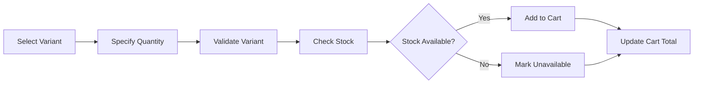
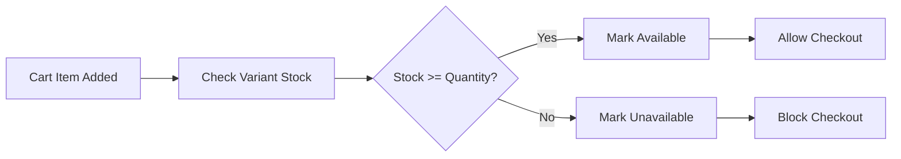
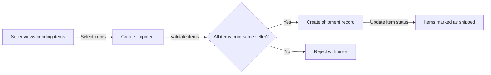
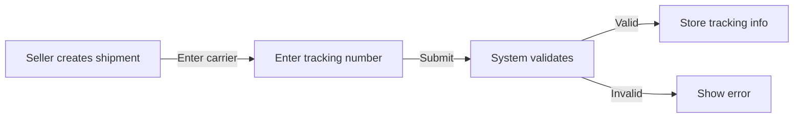
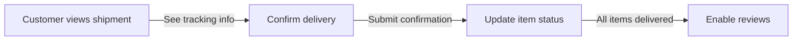
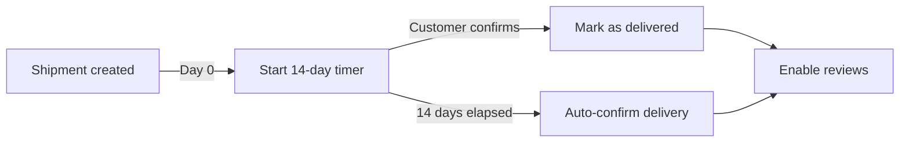
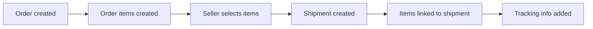

**ecommerceMall — What operations users can perform, use cases, business workflows**

What operations users can perform, use cases, business workflows

# Core Business Operations

What the system must do for each business concept.

## Customer Operations

Customers register for accounts using email and password, with email uniqueness enforced across active accounts. New accounts require email verification before full access is granted. Customers log in with their registered email and password credentials. Customers can change their password at any time after logging in. Customers can update their profile information including display name and phone number. Customers can delete their account, which removes their profile information while preserving order history for legal and seller record purposes. When a customer deletes their account, their reviews remain visible but display as from a deleted user. Customers must be logged in to access any platform features, as guest browsing is not supported. Banned customers cannot log in to the platform. Administrators can ban or unban customer accounts as needed.

### Customer Registration Flow

WHEN a new customer registers on the platform, THE system SHALL:
1. Require email address as a unique identifier
2. Require password that meets security requirements
3. Enforce email uniqueness across all active customer accounts
4. Create a customer account with pending verification status
5. Send a verification email to the provided email address

WHEN a customer submits registration with an email that already exists, THE system SHALL:
1. Reject the registration request
2. Inform the customer that the email is already in use
3. Suggest using a different email or logging in instead

WHEN a customer clicks the verification link in the email, THE system SHALL:
1. Validate the verification token
2. Mark the customer account as verified
3. Grant full access to platform features

WHEN a customer attempts to access features before email verification, THE system SHALL:
1. Restrict access to non-essential features
2. Prompt the customer to complete email verification
3. Allow resending of verification email

### Login Authentication

WHEN a customer attempts to log in, THE system SHALL:
1. Require email address and password credentials
2. Validate the email against registered customer accounts
3. Verify the password matches the stored hash
4. Create an authenticated session upon successful validation

WHEN login credentials are incorrect, THE system SHALL:
1. Reject the login attempt
2. Provide a generic error message without revealing which credential failed
3. Track failed login attempts for security monitoring

WHEN a customer account is banned, THE system SHALL:
1. Block all login attempts regardless of credential validity
2. Inform the customer that their account has been restricted
3. Provide contact information for account review

WHEN a customer account is suspended, THE system SHALL:
1. Block all login attempts
2. Inform the customer of the suspension status
3. Provide information on how to appeal the suspension

WHEN a customer successfully logs in, THE system SHALL:
1. Grant access to all customer features
2. Maintain session until logout or expiration
3. Allow access to order history, profile, cart, and wishlist

### Password Change Requirements

WHEN a customer requests to change their password, THE system SHALL:
1. Require the current password for verification
2. Require a new password that meets security requirements
3. Confirm the new password matches the confirmation input
4. Update the password hash in the customer account

WHEN the current password is incorrect, THE system SHALL:
1. Reject the password change request
2. Inform the customer that the current password is invalid
3. Allow the customer to retry

WHEN the new password does not meet security requirements, THE system SHALL:
1. Reject the password change request
2. Inform the customer of the password requirements
3. Allow the customer to provide a valid password

WHEN the new password and confirmation do not match, THE system SHALL:
1. Reject the password change request
2. Inform the customer that the passwords do not match
3. Allow the customer to retry

### Profile Information Management

WHEN a customer views their profile, THE system SHALL:
1. Display the current display name
2. Display the current phone number (if provided)
3. Show profile edit options

WHEN a customer updates their display name, THE system SHALL:
1. Accept the new display name
2. Validate the display name format
3. Update the profile immediately
4. Reflect the change across the platform

WHEN a customer updates their phone number, THE system SHALL:
1. Accept the new phone number
2. Validate the phone number format
3. Update the profile immediately
4. Reflect the change across the platform

WHEN a customer provides an empty display name, THE system SHALL:
1. Accept the empty value or require a minimum length
2. Update the profile accordingly

WHEN a customer provides an invalid phone number format, THE system SHALL:
1. Reject the update request
2. Inform the customer of the valid phone number format

### Account Deletion Consequences

WHEN a customer requests to delete their account, THE system SHALL:
1. Verify the customer has no active orders (paid, shipped, or delivered status)
2. Verify the customer has no pending cancellation or refund requests
3. Remove the customer's profile information (display name, phone number)
4. Preserve all order history for legal and seller record purposes
5. Preserve all reviews but mark them as from a "deleted user"
6. Remove the customer from the wishlist
7. Remove all cart items associated with the customer

WHEN a customer has active orders, THE system SHALL:
1. Reject the account deletion request
2. Inform the customer that active orders must be completed first
3. Allow deletion after all orders reach a final state

WHEN a customer has pending cancellation or refund requests, THE system SHALL:
1. Reject the account deletion request
2. Inform the customer that pending requests must be resolved first
3. Allow deletion after all requests are approved or rejected

WHEN a customer account is deleted, THE system SHALL:
1. Prevent the customer from logging in
2. Remove the account from active customer listings
3. Preserve order snapshots for dispute resolution
4. Preserve review content but anonymize the author

### Customer Ban and Unban

WHEN a customer account is banned by an administrator, THE system SHALL:
1. Block all login attempts for the customer
2. Preserve all order history and data
3. Maintain existing order items and their statuses
4. Remove the customer from active user listings

WHEN an administrator unbans a customer account, THE system SHALL:
1. Restore login access for the customer
2. Restore access to all customer features
3. Maintain all preserved data (orders, reviews, etc.)
4. Notify the customer of account restoration

WHEN a customer is banned, THE system SHALL:
1. Prevent creation of new orders
2. Prevent modifications to existing cart items
3. Prevent modifications to wishlist items
4. Allow viewing of order history for record purposes

WHEN a banned customer attempts to register with a new account, THE system SHALL:
1. Apply the same ban restrictions if email matches
2. Prevent circumvention of ban through new registration

### Deleted User Review Handling

WHEN a customer's account is deleted, THE system SHALL:
1. Preserve all review content and ratings
2. Replace the customer name with "deleted user" label
3. Maintain the review's association with the product
4. Include the review in product rating calculations

WHEN calculating average product ratings, THE system SHALL:
1. Include reviews from deleted users in the calculation
2. Exclude reviews marked as deleted by the reviewer
3. Display the total review count including deleted user reviews

WHEN a customer views reviews on a product, THE system SHALL:
1. Show reviews from deleted users with "deleted user" label
2. Display the review content and rating normally
3. Indicate the reviewer status clearly

## Seller Operations

Sellers register for accounts using email and password, with email uniqueness enforced across active accounts. Seller accounts require administrator approval before they can list and sell products. Sellers can view their approval status as pending, approved, or rejected. If rejected, sellers can view the rejection reason provided by the administrator. Rejected sellers can submit a new registration request after addressing the rejection reason. Sellers can log in with their registered email and password credentials. Sellers can change their password at any time after logging in. Sellers can edit their shop profile including shop name, description, and logo image. Every shop profile edit creates a snapshot preserving the previous state. Sellers can delete their account only if they have no pending orders and no pending cancellation or refund requests. When a seller deletes their account, their products are removed from listings while order history and snapshots are preserved. Administrators can suspend seller accounts, which hides products from listings and prevents new product creation. Administrators can unsuspend seller accounts to restore selling capabilities.

### Seller Registration and Approval

WHEN a seller registers for an account, THE system SHALL require email and password credentials.

THE system SHALL ensure email uniqueness across all active seller accounts.

WHEN a seller submits a registration request, THE system SHALL set the initial approval status to "pending".

WHEN a seller submits a registration request, THE system SHALL prevent the seller from listing or selling products until approved.

WHEN an administrator reviews a pending seller registration, THE system SHALL be able to approve the registration.

WHEN an administrator approves a seller registration, THE system SHALL change the approval status to "approved".

WHEN a seller is approved, THE system SHALL enable the seller to create products and manage their shop.

WHEN an administrator reviews a pending seller registration, THE system SHALL be able to reject the registration.

WHEN an administrator rejects a seller registration, THE system SHALL change the approval status to "rejected".

WHEN an administrator rejects a seller registration, THE system SHALL require the administrator to provide a rejection reason.

WHEN a seller registration is rejected, THE system SHALL store the rejection reason for the seller to view.

WHEN a seller registration is rejected, THE system SHALL allow the seller to submit a new registration request.

WHEN a rejected seller submits a new registration request, THE system SHALL set the approval status back to "pending".

THE system SHALL maintain a record of all seller approval status changes for audit purposes.

### Shop Profile Management

WHEN a seller accesses their shop profile, THE system SHALL allow editing of the shop name.

WHEN a seller accesses their shop profile, THE system SHALL allow editing of the shop description.

WHEN a seller accesses their shop profile, THE system SHALL allow uploading or updating the shop logo image.

WHEN a seller edits any shop profile field, THE system SHALL create a snapshot of the previous state.

THE system SHALL record the timestamp of each shop profile change in the snapshot.

THE system SHALL record the previous values and new values in each shop profile snapshot.

THE system SHALL preserve all shop profile snapshots and make them immutable.

THE system SHALL prevent deletion of shop profile snapshots.

Sellers SHALL be able to view the history of their own shop profile snapshots.

Administrators SHALL be able to view shop profile snapshots for any seller.

THE system SHALL display the current shop name, description, and logo on the seller profile page visible to customers.

WHEN a seller changes their shop name, THE system SHALL update the shop name in all future product listings immediately.

WHEN a seller changes their shop name, THE system SHALL preserve the original shop name in past order snapshots.

### Seller Account Deletion Restrictions

WHEN a seller requests account deletion, THE system SHALL verify the seller has no pending orders with paid or shipped status.

WHEN a seller requests account deletion, THE system SHALL verify the seller has no pending cancellation requests.

WHEN a seller requests account deletion, THE system SHALL verify the seller has no pending refund requests.

IF the seller has pending orders, THE system SHALL block the account deletion request.

IF the seller has pending cancellation requests, THE system SHALL block the account deletion request.

IF the seller has pending refund requests, THE system SHALL block the account deletion request.

WHEN a seller account is deleted, THE system SHALL remove all products from search and category listings.

WHEN a seller account is deleted, THE system SHALL preserve all order history and order item snapshots.

WHEN a seller account is deleted, THE system SHALL preserve the seller's shop name in past orders.

WHEN a seller account is deleted, THE system SHALL preserve all product snapshots created before deletion.

THE system SHALL allow administrators to view preserved order history for deleted seller accounts.

### Seller Suspension Management

WHEN an administrator suspends a seller account, THE system SHALL hide all products from search and category listings.

WHEN a seller account is suspended, THE system SHALL prevent customers from purchasing the seller's products.

WHEN a seller account is suspended, THE system SHALL prevent the seller from creating new products.

WHEN a seller account is suspended, THE system SHALL prevent the seller from editing existing products.

WHEN a seller account is suspended, THE system SHALL allow the seller to process existing orders including shipping items.

WHEN a seller account is suspended, THE system SHALL allow the seller to respond to cancellation requests.

WHEN a seller account is suspended, THE system SHALL allow the seller to respond to refund requests.

WHEN an administrator unsuspends a seller account, THE system SHALL restore product visibility in search and category listings.

WHEN an administrator unsuspends a seller account, THE system SHALL restore the seller's ability to create new products.

WHEN an administrator unsuspends a seller account, THE system SHALL restore the seller's ability to edit existing products.

THE system SHALL record the suspension and unsuspension events with timestamps for audit purposes.

### Rejection Reason Viewing

WHEN a seller registration is rejected, THE system SHALL display the rejection reason to the seller.

WHEN a seller views their approval status and it is "rejected", THE system SHALL show the rejection reason provided by the administrator.

WHEN a seller views their approval status and it is "pending", THE system SHALL indicate that administrator approval is required.

WHEN a seller views their approval status and it is "approved", THE system SHALL indicate that they can sell products.

WHEN a seller registration is rejected, THE system SHALL allow the seller to submit a new registration request after addressing the rejection reason.

WHEN a seller submits a new registration request after rejection, THE system SHALL require the same email and password credentials.

THE system SHALL track the number of registration attempts for each email address.

## Product Operations

Sellers can create products with a required name, description, category selection, and base price. Every product belongs to the seller who created it. Sellers can edit their own products including name, description, category, and base price. Every product edit creates a snapshot preserving the complete previous state including all variant information. Sellers can view snapshots of their own products for dispute resolution. Sellers can delete their own products only if there are no pending order items and no pending cancellation or refund requests for any variant. When a product is deleted, all its variants and inventory records are also deleted. Deleted products no longer appear in search results or category listings. Administrators can view all products on the platform and view snapshots of any product. Administrators can delete any product for policy violations. Deleted products and their snapshots are preserved even after deletion.

### Product Creation Requirements

WHEN a seller creates a new product, THE system SHALL:
1. Require the seller to provide a product name
2. Require the seller to provide a product description
3. Require the seller to select a category (which may be a subcategory)
4. Require the seller to specify a base price
5. Associate the product with the creating seller as the owner
6. Create the product with an active status
7. Allow the seller to upload multiple product images

IF the product name is missing, THE system SHALL reject the product creation request.
IF the product description is missing, THE system SHALL reject the product creation request.
IF the category is not selected, THE system SHALL reject the product creation request.
IF the base price is not specified, THE system SHALL reject the product creation request.
IF the seller is not approved for selling, THE system SHALL reject the product creation request.
IF the selected category does not exist, THE system SHALL reject the product creation request.

A product must have at least one variant to be purchasable by customers.
Products with no variants are visible in search but shown as unavailable.

### Product Ownership Rules

THE system SHALL ensure that every product belongs to the seller who created it.
THE system SHALL prevent sellers from accessing or modifying products owned by other sellers.
THE system SHALL allow sellers to view, edit, and delete only their own products.
THE system SHALL display the seller's shop name on product listings and detail pages.

WHEN a seller is suspended, THE system SHALL:
1. Hide their products from search results
2. Hide their products from category listings
3. Prevent customers from purchasing their products
4. Preserve existing order items for their products

WHEN a seller is unsuspended, THE system SHALL restore visibility of their products in search and category listings.

Administrators can view all products regardless of ownership.
Administrators can delete products owned by any seller for policy violations.

### Product Edit Snapshots

WHEN a seller edits any product field, THE system SHALL create a product snapshot before saving the changes.
THE product snapshot SHALL include:
1. The timestamp when the change was made
2. All product fields at the previous state (name, description, category, base price)
3. All product images at the previous state
4. All variant information at the previous state (SKU codes, option values, prices, stock quantities)
5. The identity of the seller who made the change

THE system SHALL ensure that product snapshots are immutable and cannot be deleted.
THE system SHALL preserve product snapshots even after the product is deleted.

WHEN a product is edited, THE system SHALL update the current product state while preserving the previous state in the snapshot.

Sellers can view snapshots of their own products for dispute resolution.
Administrators can view snapshots of any product on the platform.

### Product Deletion Restrictions

WHEN a seller attempts to delete a product, THE system SHALL verify:
1. No order items for any variant of the product have paid or shipped status
2. No cancellation requests exist for any variant of the product
3. No refund requests exist for any variant of the product

IF any order item for the product has paid or shipped status, THE system SHALL reject the deletion request.
IF any cancellation request exists for the product, THE system SHALL reject the deletion request.
IF any refund request exists for the product, THE system SHALL reject the deletion request.

WHEN a product deletion is approved, THE system SHALL:
1. Change the product status to deleted
2. Delete all variants associated with the product
3. Delete all inventory records associated with the variants
4. Remove the product from search results
5. Remove the product from category listings
6. Preserve all product snapshots

Products with pending orders cannot be deleted until all orders are completed, cancelled, or refunded.

### Deleted Product Visibility

THE system SHALL remove deleted products from all customer-facing listings immediately upon deletion.
THE system SHALL prevent deleted products from appearing in search results.
THE system SHALL prevent deleted products from appearing in category pages.
THE system SHALL prevent deleted products from being added to shopping carts.

IF a product in a customer's wishlist is deleted by the seller, THE system SHALL automatically remove it from the wishlist.

Deleted products and their snapshots SHALL be preserved in the system for administrative and legal purposes.
Administrators can view deleted products and their snapshots through the admin interface.

Deleted products SHALL NOT be recoverable by sellers.
Only administrators can permanently remove product data from the system.

### Administrator Product Oversight

Administrators SHALL have the ability to view all products on the platform regardless of seller ownership or product status.
Administrators SHALL be able to view product snapshots for any product, including deleted products.

WHEN an administrator identifies a policy violation, THE system SHALL allow the administrator to:
1. Delete the violating product immediately
2. Preserve all product snapshots for audit purposes
3. Optionally suspend the seller account associated with the product

THE system SHALL record the administrator who deleted the product and the reason for deletion.
THE system SHALL preserve deleted products and their snapshots even after administrative deletion.

Administrators can filter products by:
1. Seller ownership
2. Product status (active, deleted, suspended)
3. Category
4. Creation date range

Administrators can export product data for compliance and audit purposes.

### Product Snapshot Viewing

WHEN a seller views their product snapshots, THE system SHALL display:
1. The timestamp of each snapshot
2. The previous values of all product fields
3. The current values of all product fields
4. The identity of the user who made the change
5. All variant information captured at the time of the snapshot

Administrators viewing product snapshots SHALL see the same information for any product on the platform.

THE system SHALL present snapshots in chronological order with the most recent first.
THE system SHALL allow filtering snapshots by date range.
THE system SHALL allow searching snapshots by changed field names.

Product snapshots SHALL be read-only and cannot be modified or deleted by any user.
Snapshots SHALL be accessible through the product detail page for sellers and administrators.

Snapshots SHALL include complete state of:
1. Product name, description, category, and base price
2. All product images and their order
3. All variants with SKU codes, option values, prices, and stock quantities

### Category Selection for Products

WHEN a seller creates or edits a product, THE system SHALL require category selection.
THE system SHALL allow sellers to select from available categories and subcategories.
THE system SHALL display the category hierarchy to help sellers choose the appropriate category.

THE system SHALL validate that the selected category exists and is active.
THE system SHALL prevent selection of deleted or inactive categories.

IF a category is deleted by an administrator, THE system SHALL:
1. Move products in that category to uncategorized status
2. Preserve the original category information in product snapshots
3. Prevent the deleted category from appearing in category selection dropdowns

Sellers can change the category of an existing product through the edit function.
Category changes SHALL create a new product snapshot capturing the before and after states.

Categories support one level of nesting (categories and subcategories only).
Sellers can select either a top-level category or a subcategory when creating or editing products.

### Product Base Price Management

WHEN a seller creates a product, THE system SHALL require a base price to be specified.
THE system SHALL validate that the base price is a positive decimal value.
THE system SHALL prevent base prices of zero or negative values.

Sellers can edit the base price of their products through the product edit function.
WHEN the base price is changed, THE system SHALL create a product snapshot.

Product variants can optionally override the base price with their own price.
IF a variant price is not specified, THE system SHALL use the product's base price.

THE system SHALL display the base price on product listings and detail pages.
IF variants have different prices, THE system SHALL display a price range on product listings.

Base price changes SHALL be reflected immediately in:
1. Product detail pages
2. Search results
3. Category listings
4. Shopping cart calculations

THE system SHALL validate price format and prevent invalid decimal values.

### Policy Violation Product Removal

Administrators SHALL have the authority to delete any product on the platform for policy violations.
WHEN an administrator deletes a product for policy violation, THE system SHALL:
1. Change the product status to deleted
2. Remove the product from all customer-facing listings
3. Preserve all product snapshots for audit purposes
4. Record the administrator who performed the deletion and the violation reason
5. Optionally suspend the seller account if warranted

THE system SHALL prevent sellers from restoring products deleted by administrators.
Deleted products SHALL remain in the system for administrative review and legal compliance.

Administrators can view a log of all product deletions including:
1. The product that was deleted
2. The administrator who deleted it
3. The timestamp of deletion
4. The reason for deletion

Policy violation deletions SHALL NOT restore inventory or affect existing order items.
Existing orders containing deleted products SHALL continue to process normally.

## ProductVariant Operations

Sellers can create variants for their products, with each variant representing a specific combination of options like color and size. Each variant requires a unique SKU code and option values. Each variant has an optional price that can override the product base price and a required stock quantity starting at zero. Sellers can edit variant information including SKU code, option values, and price. Every variant edit creates a snapshot preserving the previous state. Sellers can delete variants only if there are no pending order items and no pending cancellation or refund requests for that variant. When a variant is deleted, its inventory records are also deleted. A product must have at least one variant to be purchasable. Products with no variants are visible in search but shown as unavailable. Variant snapshots include all option values and pricing information at the time of the change.

### Variant Creation

WHEN a seller creates a variant for their product, THE system SHALL:
1. Require a unique SKU code that identifies this specific variant combination
2. Require option values specifying the variant characteristics (e.g., color: "Red", size: "Large")
3. Allow an optional price that can override the product base price
4. Require a stock quantity that starts at zero
5. Associate the variant with the seller's product
6. Validate that the SKU code is unique across all variants in the system

IF the SKU code already exists in the system, THE system SHALL reject the variant creation request.
IF the option values are missing or empty, THE system SHALL reject the variant creation request.
IF the stock quantity is not provided or is negative, THE system SHALL reject the variant creation request.
IF the variant price override is provided but is negative, THE system SHALL reject the variant creation request.

### Variant Editing and Snapshots

WHEN a seller edits a variant, THE system SHALL:
1. Allow updates to the SKU code, option values, and price override
2. Create a snapshot of the variant's previous state before applying changes
3. Record the timestamp of when the edit was made
4. Record which seller made the edit
5. Preserve all previous values in the snapshot for audit purposes

WHILE the variant exists, THE system SHALL maintain all snapshots of previous edits.

IF the SKU code being changed already exists on another variant, THE system SHALL reject the edit request.
IF the variant has pending order items in paid or shipped status, THE system SHALL allow editing but display a warning to the seller.
IF the variant has pending cancellation or refund requests, THE system SHALL allow editing but display a warning to the seller.

### Variant Deletion Restrictions

WHEN a seller attempts to delete a variant, THE system SHALL:
1. Verify the seller owns the product containing the variant
2. Check for any pending order items with paid or shipped status for that variant
3. Check for any pending cancellation requests for that variant
4. Check for any pending refund requests for that variant
5. Only proceed with deletion if all checks pass

IF the variant has any order items with paid or shipped status, THE system SHALL reject the deletion request.
IF the variant has any pending cancellation requests, THE system SHALL reject the deletion request.
IF the variant has any pending refund requests, THE system SHALL reject the deletion request.

WHEN a variant is successfully deleted, THE system SHALL:
1. Remove the variant from the product
2. Delete all inventory records associated with the variant
3. Preserve all snapshots of the variant for historical reference
4. Update the product status if this was the last variant

### Minimum Variant Requirements and Availability

THE system SHALL require every product to have at least one variant to be purchasable.

WHEN a product has no variants, THE system SHALL:
1. Display the product in search results and category listings
2. Mark the product as "unavailable" or "not currently available"
3. Prevent customers from adding the product to their cart
4. Allow customers to view the product details page

WHEN all variants of a product are out of stock, THE system SHALL:
1. Display the product as "out of stock" in listings
2. Prevent customers from adding any variant to their cart
3. Allow customers to view the product and its variants

IF a product's last variant is deleted, THE system SHALL:
1. Mark the product as unavailable in all listings
2. Preserve the product record for order history reference
3. Maintain all existing order items referencing variants of this product

### Variant Snapshot Preservation and Viewing

WHEN a variant is modified, THE system SHALL:
1. Create an immutable snapshot record containing all variant fields
2. Include the SKU code, option values, price override, and stock quantity in the snapshot
3. Record the timestamp of when the snapshot was created
4. Record which seller made the change that triggered the snapshot
5. Preserve the snapshot even if the variant is later deleted

WHEN a seller views variant snapshots, THE system SHALL:
1. Display all snapshots for variants they own
2. Show the before and after values for each change
3. Display the timestamp and reason for each change
4. Present snapshots in chronological order with newest first

WHEN an administrator views variant snapshots, THE system SHALL:
1. Allow viewing snapshots for any variant on the platform
2. Display complete variant state at the time of each snapshot
3. Show the seller who made the change
4. Present snapshot history for dispute resolution purposes

THE system SHALL NOT allow deletion or modification of any variant snapshot once created.

## Category Operations

Categories organize products and can have subcategories with only one level of nesting allowed. Each category has a required name and an optional description. Categories are created and managed exclusively by administrators. Administrators can create new categories and subcategories. Administrators can edit category names and descriptions. Administrators can delete categories, which moves products in those categories to uncategorized status. Customers can browse the list of all available categories. Customers can view products within a specific category. Categories provide the primary navigation structure for product discovery on the platform.

### Category Creation and Management

WHEN an administrator creates a category, THE system SHALL:
1. Require a category name
2. Allow an optional category description
3. Allow selection of a parent category for subcategories
4. Enforce that subcategories are only one level deep
5. Assign the category to the platform's category hierarchy

WHEN an administrator edits a category, THE system SHALL:
1. Allow modification of the category name
2. Allow modification of the category description
3. Allow changing the parent category (for subcategories)
4. Prevent moving a subcategory to become a top-level category if it has existing subcategories
5. Create a snapshot of the category before each edit

IF a category name already exists at the same hierarchy level, THE system SHALL reject the creation request.
IF an administrator attempts to create a subcategory under a subcategory (two levels deep), THE system SHALL reject the request.
IF an administrator attempts to move a subcategory that has its own subcategories to become a top-level category, THE system SHALL reject the request.

### Category Hierarchy and Subcategory Nesting

THE system SHALL enforce a one-level category hierarchy where:
1. Top-level categories have no parent
2. Subcategories have exactly one parent category
3. Subcategories cannot have their own subcategories

WHEN an administrator creates a subcategory, THE system SHALL:
1. Require selection of a parent category
2. Prevent the parent from being another subcategory
3. Ensure the subcategory appears nested under its parent in category listings

WHEN an administrator edits a subcategory's parent, THE system SHALL:
1. Allow changing to a different top-level category
2. Prevent changing to another subcategory as the new parent
3. Update the category's position in the hierarchy

IF an administrator attempts to create a third-level category (subcategory of a subcategory), THE system SHALL reject the request with an appropriate error.

### Category Deletion and Product Reassignment

WHEN an administrator deletes a category, THE system SHALL:
1. Move all products in that category to uncategorized status
2. Move all products in subcategories of that category to uncategorized status
3. Preserve the deleted category's record for historical reference
4. Remove the category from all category listings and navigation
5. Prevent deletion if the category is referenced in active product filters or saved customer searches

WHEN products become uncategorized due to category deletion, THE system SHALL:
1. Remove the category association from each affected product
2. Keep the products visible in search results
3. Keep the products visible in seller product listings
4. Exclude the products from category-based browsing

IF an administrator attempts to delete a category that is the parent of other categories, THE system SHALL either:
1. Require deletion of all child subcategories first, OR
2. Automatically move all products from both the category and its subcategories to uncategorized status, then delete the category

THE system SHALL create a snapshot of the category state before deletion for audit purposes.

### Customer Category Browsing and Viewing

WHEN a customer browses categories, THE system SHALL:
1. Display all top-level categories in a category listing
2. Show subcategories nested under their parent categories
3. Display the category name for each category
4. Display the category description when available
5. Allow customers to view all products within a selected category

WHEN a customer views products in a category, THE system SHALL:
1. Show all products assigned to that category
2. Include products from subcategories if viewing a parent category (optional filter)
3. Display product information as defined in product listing requirements
4. Support pagination of category product listings
5. Allow sorting by the same options as general product search

WHEN a customer uses category-based navigation, THE system SHALL:
1. Provide a category tree or menu for browsing
2. Highlight the current category when viewing category products
3. Allow navigation between parent and child categories
4. Update search results when a category filter is applied

IF a category has no products assigned, THE system SHALL still display it in the category listing but indicate that no products are available.

### Uncategorized Product Handling and Category Navigation

WHEN products are uncategorized, THE system SHALL:
1. Hide them from category-based browsing and navigation
2. Keep them visible in general product search results
3. Keep them visible in seller product listings
4. Allow reassignment to a new category by the seller or administrator

WHEN a customer searches with a category filter, THE system SHALL:
1. Include products from the selected category
2. Include products from subcategories of the selected category (if applicable)
3. Exclude products that are uncategorized
4. Apply additional filters (price range, stock status) on top of category filtering

WHEN a product is assigned to a category, THE system SHALL:
1. Display the product in that category's product listing
2. Display the product in any parent category's listing (if viewing parent includes children)
3. Show the category information on the product detail page
4. Include the category in search result filters

THE system SHALL maintain category-product relationships for historical order items even after category deletion, preserving the category name as it appeared at time of purchase.

### Category-Based Navigation and Search Filtering

WHEN a customer uses the category filter in product search, THE system SHALL:
1. Allow selection of a single category or multiple categories
2. Filter search results to only show products in selected categories
3. Include products from subcategories when a parent category is selected
4. Update the result count based on category filtering
5. Allow clearing the category filter to show all products

WHEN a customer navigates through categories, THE system SHALL:
1. Display the breadcrumb trail showing category hierarchy
2. Allow clicking on parent categories to view parent category products
3. Allow clicking on subcategories to view subcategory products
4. Maintain the navigation state across page loads

IF a category is deleted while a customer is browsing it, THE system SHALL:
1. Redirect the customer to the parent category or main category listing
2. Display a message indicating the category is no longer available
3. Show uncategorized products or all products as fallback

## Order Operations

Orders are created when customers successfully complete payment after checkout. Each order contains one or more order items that may be from different sellers. The shipping address selected during checkout cannot be changed after the order is placed. Customers can view a list of all their orders sorted by newest first. Each order in the list displays order number, date, total price, and overall status. Customers can view full order details including all items, shipping address, and shipments with tracking information. The overall order status is derived from the statuses of its individual items. Orders can have statuses including paid, shipped, delivered, cancelled, refunded, or partially completed. Administrators can view all orders on the platform. Administrators can force-cancel or force-refund entire orders or individual items.

### Order Creation

WHEN a customer successfully completes payment after checkout, THE system SHALL create an order record with a unique order number.

WHEN an order is created, THE system SHALL:
1. Generate a unique order number that does not duplicate any existing order number
2. Record the order date and time
3. Calculate and store the total price from all order items
4. Associate the order with the customer who placed it
5. Record the shipping address selected during checkout
6. Create order items for each purchased product variant

WHEN payment fails, THE system SHALL NOT create an order record and allow the customer to retry payment.

WHEN payment succeeds, THE system SHALL:
1. Decrease stock quantities for each purchased variant
2. Remove purchased items from the customer's cart
3. Save a snapshot of each purchased product and variant at the time of purchase
4. Save a snapshot of each seller's profile at the time of purchase

### Order Item Composition

WHEN an order is created, THE system SHALL contain one or more order items.

WHEN creating order items, THE system SHALL:
1. Group multiple quantities of the same variant into a single order item with combined quantity
2. Create separate order items for different variants
3. Allow order items from different sellers within the same order
4. Record the product name, variant options, quantity, and unit price for each item
5. Save a product snapshot with each order item preserving the product state at purchase
6. Save a seller snapshot with each order item preserving the shop name and logo at purchase

IF a customer purchases 3 units of the same variant, THE system SHALL create one order item with quantity 3, not three separate items.

IF order items are from different sellers, THE system SHALL allow each item to have its own independent status.

### Shipping Address Finality

WHEN a customer completes checkout and places an order, THE system SHALL finalize the shipping address.

WHEN an order is placed, THE system SHALL:
1. Record the shipping address selected during checkout
2. Prevent any changes to the shipping address after order placement
3. Display the shipping address in the order details for customer viewing

WHEN a customer views order details, THE system SHALL show the shipping address that was used for that order.

IF a customer attempts to modify the shipping address after order placement, THE system SHALL reject the change and display an error message.

### Order History and Detail Viewing

WHEN a customer views their order history, THE system SHALL display a paginated list of all their orders.

WHEN displaying order history, THE system SHALL:
1. Sort orders by newest first
2. Show order number, date, total price, and overall status for each order
3. Allow pagination through the order list
4. Provide access to full order details for each order

WHEN a customer views order details, THE system SHALL display:
1. All order items with product name, variant options, quantity, price, and item status
2. The shipping address used for the order
3. All shipments with tracking information, showing which items are included in each shipment

IF an order contains items with different statuses, THE system SHALL display each item's individual status alongside the overall order status.

### Order Status Derivation

WHEN determining the overall order status, THE system SHALL derive it from the statuses of its individual order items.

WHEN calculating order status, THE system SHALL:
1. Mark the order as "paid" when all items have status "paid"
2. Mark the order as "shipped" when any item is "shipped" and none are "delivered"
3. Mark the order as "delivered" when all items have status "delivered"
4. Mark the order as "cancelled" when all items have status "cancelled"
5. Mark the order as "refunded" when all items have status "refunded"
6. Mark the order as "partially completed" when items have mixed statuses (e.g., some delivered, some refunded)

WHEN an order item status changes, THE system SHALL recalculate and update the overall order status accordingly.

### Administrator Order Oversight

WHEN an administrator views the order management system, THE system SHALL display all orders on the platform.

WHEN an administrator accesses order oversight, THE system SHALL:
1. Display all orders regardless of customer or seller
2. Show complete order details including all items, shipping address, and shipments
3. Allow viewing of order item snapshots for dispute resolution
4. Enable force-cancellation of individual items or entire orders
5. Enable force-refund of individual items or entire orders

WHEN an administrator force-cancels an order or order item, THE system SHALL:
1. Process the refund for the customer
2. Restore stock quantities via inventory records
3. Update the order status accordingly
4. Create a snapshot of the cancellation action

WHEN an administrator force-refunds an order or order item, THE system SHALL:
1. Process the refund for the customer
2. Restore stock quantities via inventory records
3. Update the order status accordingly
4. Create a snapshot of the refund action

## OrderItem Operations

Each order item represents a purchased product variant with a specific quantity. If a customer buys multiple units of the same variant, it becomes one order item with that quantity. Each order item has its own independent status separate from other items in the same order. Order item statuses include paid, shipped, delivered, cancelled, and refunded. Order items from different sellers are grouped into separate shipments. Each order item can be individually cancelled or refunded without affecting other items. When an order item is cancelled or refunded, its stock quantity is restored via inventory records. Order items include snapshots of the product, variant, and seller profile at the time of purchase. Sellers can view order items for their products filtered by status. Administrators can force-cancel or force-refund individual order items.

### Order Item Creation and Quantity Grouping

WHEN a customer places an order with multiple units of the same product variant, THE system SHALL create a single order item with the combined quantity.

WHEN a customer places an order with different product variants, THE system SHALL create separate order items for each variant.

WHEN an order item is created, THE system SHALL record the quantity, unit price, and initial status as "paid".

WHEN an order item is created, THE system SHALL associate it with the specific product variant purchased.

WHEN an order item is created, THE system SHALL capture a snapshot of the product at the time of purchase.

WHEN an order item is created, THE system SHALL capture a snapshot of the variant at the time of purchase.

WHEN an order item is created, THE system SHALL capture a snapshot of the seller's profile at the time of purchase.

IF the same variant appears multiple times in the cart, THE system SHALL combine them into a single order item rather than creating duplicate items.

IF a customer purchases variants from different sellers in the same order, THE system SHALL create separate order items for each seller's products.

### Order Item Status Management

WHEN an order item is created after payment, THE system SHALL set its status to "paid".

WHEN a seller ships an order item, THE system SHALL update its status to "shipped".

WHEN a customer confirms delivery of a shipment containing an order item, THE system SHALL update its status to "delivered".

WHEN 14 days pass after an order item is shipped without customer confirmation, THE system SHALL automatically update its status to "delivered".

WHEN a seller approves a cancellation request for an order item, THE system SHALL update its status to "cancelled".

WHEN a seller approves a refund request for an order item, THE system SHALL update its status to "refunded".

WHILE an order item has status "paid", THE system SHALL allow cancellation requests to be submitted.

WHILE an order item has status "delivered", THE system SHALL allow refund requests to be submitted within 7 days.

IF an order item has status "shipped", THE system SHALL reject any cancellation requests.

IF an order item has status "shipped", THE system SHALL reject any refund requests.

IF an order item has status "cancelled", THE system SHALL prevent any further status transitions.

IF an order item has status "refunded", THE system SHALL prevent any further status transitions.

WHEN an order item status changes, THE system SHALL record the timestamp of the transition.

### Order Item Cancellation Workflow

WHEN a customer requests cancellation of an order item with status "paid", THE system SHALL create a cancellation request with the customer's reason.

WHEN a cancellation request is created, THE system SHALL set its initial status to "pending".

WHEN a seller responds to a pending cancellation request, THE system SHALL create a snapshot of the request state.

WHEN a seller approves a cancellation request, THE system SHALL update the order item status to "cancelled".

WHEN a seller rejects a cancellation request, THE system SHALL record the rejection and keep the order item status as "paid".

WHEN an order item is cancelled, THE system SHALL restore its stock quantity via an inventory record.

WHEN an order item is cancelled, THE system SHALL process a refund for the cancelled item only.

WHEN all order items in an order are cancelled, THE system SHALL update the order status to "cancelled".

WHEN a cancellation request is approved, THE system SHALL prevent any further modification to that request.

IF an order item has status "shipped", THE system SHALL prevent cancellation requests from being submitted.

IF a cancellation request is pending for an order item, THE system SHALL prevent the seller from shipping that item.

### Order Item Refund Workflow

WHEN a customer requests a refund for an order item with status "delivered", THE system SHALL create a refund request with the customer's reason.

WHEN a refund request is created, THE system SHALL calculate and record the days since delivery.

WHEN a refund request is created, THE system SHALL set its initial status to "pending".

WHEN a seller responds to a pending refund request, THE system SHALL create a snapshot of the request state.

WHEN a seller approves a refund request, THE system SHALL update the order item status to "refunded".

WHEN a seller rejects a refund request, THE system SHALL record the rejection and keep the order item status as "delivered".

WHEN an order item is refunded, THE system SHALL restore its stock quantity via an inventory record.

WHEN an order item is refunded, THE system SHALL process a refund for that item only.

WHEN all order items in an order are refunded, THE system SHALL update the order status to "refunded".

IF more than 7 days have passed since an order item was delivered, THE system SHALL reject any refund requests.

IF an order item has status "paid", THE system SHALL prevent refund requests from being submitted.

IF an order item has status "shipped", THE system SHALL prevent refund requests from being submitted.

### Order Item Snapshots

WHEN an order item is created, THE system SHALL capture a snapshot of the product including name, description, and base price.

WHEN an order item is created, THE system SHALL capture a snapshot of the variant including SKU code, option values, and price.

WHEN an order item is created, THE system SHALL capture a snapshot of the seller's profile including shop name and logo.

WHEN a cancellation request is created or responded to, THE system SHALL create a snapshot of the request state.

WHEN a refund request is created or responded to, THE system SHALL create a snapshot of the request state.

WHILE order items are associated with an order, THE system SHALL preserve all snapshots indefinitely.

WHILE order items are cancelled or refunded, THE system SHALL preserve all snapshots for dispute resolution.

IF an order item is queried, THE system SHALL allow viewing of all associated snapshots.

IF an administrator queries an order item, THE system SHALL allow viewing of all associated snapshots regardless of ownership.

### Seller Order Item Viewing

WHEN a seller accesses their dashboard, THE system SHALL display all order items for products they sell.

WHEN a seller views order items, THE system SHALL show the product name, variant options, quantity, unit price, and current status.

WHEN a seller filters order items by status, THE system SHALL display only items matching the selected status.

WHEN a seller views an order item, THE system SHALL display the customer's shipping address for that order.

WHEN a seller views an order item, THE system SHALL display any pending cancellation or refund requests.

WHILE an order item has status "paid", THE system SHALL allow the seller to prepare it for shipping.

WHILE an order item has status "paid", THE system SHALL allow the seller to respond to cancellation requests.

WHILE an order item has status "delivered", THE system SHALL allow the seller to respond to refund requests.

IF a seller is suspended, THE system SHALL prevent them from creating new shipments for their order items.

IF a seller is suspended, THE system SHALL allow them to respond to pending cancellation and refund requests.

### Administrator Order Item Oversight

WHEN an administrator accesses the order management system, THE system SHALL display all order items across the platform.

WHEN an administrator views an order item, THE system SHALL display all associated snapshots including product, variant, and seller profile.

WHEN an administrator views an order item, THE system SHALL display the customer information and shipping address.

WHEN an administrator force-cancels an order item, THE system SHALL update its status to "cancelled".

WHEN an administrator force-cancels an order item, THE system SHALL process a refund for the customer.

WHEN an administrator force-cancels an order item, THE system SHALL restore the stock quantity via an inventory record.

WHEN an administrator force-refunds an order item, THE system SHALL update its status to "refunded".

WHEN an administrator force-refunds an order item, THE system SHALL process the refund for the customer.

WHEN an administrator force-refunds an order item, THE system SHALL restore the stock quantity via an inventory record.

WHEN an administrator force-cancels or force-refunds an order item, THE system SHALL record the administrator's action in audit logs.

IF an administrator force-cancels an order item, THE system SHALL prevent the seller from shipping that item.

IF an administrator force-refunds an order item, THE system SHALL prevent the seller from disputing the refund.

## Address Operations

Customers can add multiple shipping addresses to their account for future orders. Each address includes recipient name, phone number, street address, city, state or province, postal code, and country. Customers can edit their saved addresses to update any information. Customers can delete addresses they no longer need. Customers can designate one address as their default shipping address for checkout convenience. During checkout, customers must select a shipping address or use their default. The selected shipping address becomes part of the order record and cannot be changed after order placement. Each order preserves the shipping address as it was at the time of purchase.

### Address Creation

WHEN a customer creates a new shipping address, THE system SHALL:
1. Require recipient name as mandatory information
2. Require recipient phone number as mandatory information
3. Require street address as mandatory information
4. Require city as mandatory information
5. Require state or province as mandatory information
6. Require postal code as mandatory information
7. Require country as mandatory information

WHEN a customer submits address information, THE system SHALL:
1. Validate that all required fields contain non-empty values
2. Validate postal code format matches the country's expected pattern
3. Store the complete address information for future order use

IF any required field is missing, THE system SHALL reject the address creation request.
IF the postal code format does not match the expected pattern for the selected country, THE system SHALL reject the address creation request.

### Multiple Address Management

THE system SHALL allow each customer to maintain multiple shipping addresses in their account.
THE system SHALL store recipient name and phone number for each address for delivery purposes.
THE system SHALL store complete address information including street address, city, state/province, postal code, and country.

WHEN a customer views their address list, THE system SHALL display all saved addresses with key identifying information.
WHEN a customer navigates to the address management page, THE system SHALL show the default address indicator for each saved address.

THE system SHALL support a reasonable limit on the number of addresses per customer account for storage management.

### Address Editing Capabilities

WHEN a customer edits an existing shipping address, THE system SHALL:
1. Allow modification of any address field including recipient name, phone number, street address, city, state/province, postal code, and country
2. Validate all required fields after modification
3. Validate postal code format after modification
4. Preserve the address ID while updating the stored values

IF the customer modifies required fields to empty values, THE system SHALL reject the address update request.
IF the customer modifies the postal code to an invalid format, THE system SHALL reject the address update request.

THE system SHALL allow customers to edit addresses at any time, regardless of order history.

### Address Deletion

WHEN a customer requests to delete a shipping address, THE system SHALL:
1. Verify the address is not currently set as the default shipping address
2. Verify the address is not associated with any pending or active orders
3. Remove the address from the customer's saved addresses list
4. Allow deletion only if the customer has at least one remaining address

IF the address is set as default, THE system SHALL require the customer to select a different default address before deletion.
IF the address is associated with pending or active orders, THE system SHALL prevent deletion and inform the customer.
IF the address is the customer's only saved address, THE system SHALL prevent deletion to ensure checkout capability.

THE system SHALL preserve order records with their original shipping address even after address deletion.

### Default Address Selection

WHEN a customer designates a default shipping address, THE system SHALL:
1. Update the default address indicator for the selected address
2. Remove the default indicator from any previously selected default address
3. Store the default address selection in the customer's profile

WHEN a customer has multiple addresses, THE system SHALL allow exactly one address to be marked as default at any time.

WHEN a customer's only address exists, THE system SHALL automatically mark it as default.

THE system SHALL use the default address as the pre-selected option during checkout when available.

### Shipping Address During Checkout

WHEN a customer proceeds to checkout, THE system SHALL:
1. Present all saved shipping addresses for selection
2. Pre-select the default address if one exists
3. Require the customer to confirm or select a shipping address before order placement
4. Validate the selected address has all required fields populated

WHEN a customer selects a shipping address for checkout, THE system SHALL:
1. Record the selected address as part of the order data
2. Display the complete address in the order summary for review
3. Prevent checkout completion without a valid shipping address selected

IF the customer has no saved addresses, THE system SHALL require address creation before checkout can proceed.

### Order Address Preservation

WHEN an order is successfully placed, THE system SHALL:
1. Create a permanent snapshot of the shipping address as it existed at order time
2. Store the address information with the order record independent of future address changes
3. Preserve the address even if the customer later modifies or deletes their saved address

WHEN a customer views order history, THE system SHALL display the shipping address as it was at the time of purchase.
WHEN a customer views order details, THE system SHALL show the complete shipping address snapshot.

THE system SHALL NOT allow modification of the shipping address after order placement.
THE system SHALL preserve address snapshots for legal and record-keeping purposes even after customer account deletion.

### Address Validation Requirements

WHEN a customer submits address information, THE system SHALL validate:
1. Recipient name contains only alphabetic characters and standard name characters
2. Phone number follows a valid phone number format for the selected country
3. Street address contains sufficient detail for delivery (minimum character requirement)
4. City name is a non-empty text value
5. State or province is a non-empty text value
6. Postal code matches the format pattern for the selected country
7. Country is selected from the supported countries list

IF any validation fails, THE system SHALL provide specific error feedback indicating which field failed and the expected format.

THE system SHALL enforce postal code format validation based on the selected country's requirements.
THE system SHALL prevent address creation or updates that do not meet validation requirements.

## Review Operations

Customers can write reviews for products they have purchased and received. A review can only be written after the corresponding order item status is delivered. Customers can write one review per product per order. Each review includes a required rating from one to five stars and optional text content. Reviews are displayed on the product detail page sorted by newest first. Customers can edit their own reviews after submission. Every review edit creates a snapshot preserving the previous state. Customers can delete their own reviews, but snapshots are preserved for record-keeping. The product average rating is calculated from all non-deleted reviews. When a customer deletes their account, their reviews remain visible but display as from a deleted user.

### Review Eligibility and Creation

WHEN a customer has at least one order item with status "delivered" for a product, THE system SHALL allow them to write a review for that product.

WHEN a customer has not purchased a product (no order item exists for that product), THE system SHALL prevent them from writing a review for that product.

WHILE an order item status is "paid", "shipped", or any status other than "delivered", THE system SHALL prevent customers from writing reviews for that order item.

WHEN a customer has already written a review for a specific product within a specific order, THE system SHALL prevent them from writing another review for the same product in that same order.

WHEN a customer purchases the same product in multiple different orders, THE system SHALL allow them to write separate reviews for each order.

WHEN a customer submits a review, THE system SHALL associate the review with the customer who wrote it.

WHEN a customer submits a review, THE system SHALL associate the review with the product being reviewed.

WHEN a customer submits a review, THE system SHALL record the creation timestamp of the review.

### Review Rating and Content

WHEN a customer submits a review, THE system SHALL require a rating value between 1 and 5 stars.

WHEN a customer submits a review, THE system SHALL allow optional text content to be included.

THE system SHALL store the review rating as a required integer value from 1 to 5.

THE system SHALL store the review text content as an optional text field.

WHEN a customer submits a review with a rating outside the 1 to 5 range, THE system SHALL reject the request.

WHEN a customer submits a review with empty or invalid rating value, THE system SHALL reject the request.

### Review Editing and Snapshots

WHEN a customer edits their own review, THE system SHALL allow them to modify the rating and/or text content.

WHEN a customer edits their review, THE system SHALL create a snapshot of the review state before the edit.

WHEN a review snapshot is created, THE system SHALL record the previous rating and text values.

WHEN a review snapshot is created, THE system SHALL record the new rating and text values after the edit.

WHEN a review snapshot is created, THE system SHALL record the timestamp of the change.

WHEN a review snapshot is created, THE system SHALL record which customer made the change.

THE system SHALL allow customers to edit their own reviews after initial submission.

THE system SHALL prevent customers from editing reviews that belong to other customers.

WHEN a review is edited, THE system SHALL update the review creation timestamp to reflect when the change was made.

### Review Deletion and Preservation

WHEN a customer deletes their own review, THE system SHALL mark the review as deleted rather than removing it from the database.

WHEN a customer deletes their review, THE system SHALL preserve all review snapshots for record-keeping.

WHEN a customer deletes their review, THE system SHALL prevent the deleted review from being displayed on the product detail page.

WHEN a customer deletes their review, THE system SHALL exclude the deleted review from average rating calculations.

THE system SHALL allow customers to delete their own reviews at any time after submission.

THE system SHALL prevent customers from deleting reviews that belong to other customers.

WHEN a customer account is deleted, THE system SHALL preserve all their reviews but display them as from a "deleted user".

WHEN a customer account is deleted, THE system SHALL preserve all review snapshots associated with those reviews.

### Review Display and Rating Calculation

THE system SHALL calculate the average product rating from all non-deleted reviews for that product.

THE system SHALL exclude deleted reviews from average rating calculations.

WHEN a review is deleted, THE system SHALL recalculate the product average rating.

WHEN a new review is added, THE system SHALL recalculate the product average rating.

WHEN a review is edited, THE system SHALL recalculate the product average rating.

THE system SHALL display reviews on the product detail page sorted by newest first.

THE system SHALL display the most recent review at the top of the review list.

THE system SHALL display the total count of reviews on the product detail page.

THE system SHALL display the average rating on the product detail page.

WHEN a customer account is deleted, THE system SHALL display their preserved reviews with "deleted user" instead of the original customer name.

WHEN a customer account is deleted, THE system SHALL preserve the review content and rating for display purposes.

THE system SHALL display review ratings (1 to 5 stars) on the product detail page.

THE system SHALL display review text content on the product detail page when provided.

## Wishlist Operations

Customers can add products to their personal wishlist for future purchase consideration. The wishlist is paginated to display products in manageable batches. Wishlist entries show products rather than specific variants. Customers can view their complete wishlist at any time. Customers can remove products from their wishlist when no longer desired. If a seller deletes a product, it is automatically removed from all customer wishlists. The wishlist provides a way for customers to save products they are interested in without committing to purchase. Wishlist items remain until manually removed or the product is deleted by the seller.

### Wishlist Creation

### Wishlist Creation

WHEN a customer adds a product to their wishlist, THE system SHALL:
1. Associate the product with the customer's wishlist entry
2. Store a reference to the product (not a specific variant)
3. Record the timestamp when the product was added
4. Verify the product exists and is active before adding
5. Prevent duplicate entries for the same product in the customer's wishlist
6. Allow adding products regardless of stock availability
7. Mark the wishlist entry as active upon creation

IF the product does not exist, THE system SHALL reject the addition request.
IF the product has already been added to the customer's wishlist, THE system SHALL reject the duplicate addition.
IF the product is deleted or inactive, THE system SHALL reject the addition request.

### Product Versus Variant Storage

THE system SHALL store wishlist entries at the product level, not the variant level.
THE system SHALL allow customers to add products to their wishlist without selecting a specific variant.
THE system SHALL display all available variants when the customer views the product from their wishlist.

WHEN a customer views a wishlist item, THE system SHALL:
1. Show the product name and main image
2. Display the base price or price range across variants
3. Indicate if any variants are in stock
4. Link to the product detail page where variants can be selected

### Wishlist Viewing and Access

### Wishlist Viewing and Pagination

WHEN a customer views their wishlist, THE system SHALL:
1. Display products in paginated batches
2. Sort wishlist items by date added, newest first
3. Show the total number of items in the wishlist
4. Display pagination controls for navigation

WHEN displaying wishlist items, THE system SHALL:
1. Show the product main image (thumbnail)
2. Display the product name
3. Show the base price or price range if variants differ
4. Display the seller shop name
5. Show average rating if reviews exist
6. Indicate stock availability status

IF the wishlist is empty, THE system SHALL display an empty state message.
IF the customer has more items than the page size, THE system SHALL provide pagination navigation.

### Wishlist Access Control

THE system SHALL restrict wishlist access to the owning customer only.
THE system SHALL NOT allow customers to view other customers' wishlists.
THE system SHALL NOT allow sellers to view customer wishlists.
THE system SHALL NOT allow administrators to view customer wishlists unless investigating a dispute.

### Wishlist Item Management and Persistence

### Wishlist Item Removal

WHEN a customer removes a product from their wishlist, THE system SHALL:
1. Deactivate the wishlist entry (mark as inactive)
2. Remove the product from the displayed wishlist immediately
3. Allow the customer to re-add the product later
4. Preserve the record for analytics purposes

IF the customer attempts to remove an item that does not exist in their wishlist, THE system SHALL return a success response without error.

### Auto-Removal on Product Deletion

WHEN a seller deletes a product, THE system SHALL:
1. Automatically remove the product from all customer wishlists
2. Mark all affected wishlist entries as inactive
3. Preserve the inactive wishlist entries for audit purposes
4. NOT notify customers of the removal (silent removal)

WHEN a seller suspends their account, THE system SHALL:
1. Hide suspended seller products from all wishlists
2. Mark affected wishlist entries as inactive
3. Reactivate wishlist entries if the seller is unsuspended

### Wishlist Persistence and Interest Tracking

THE system SHALL persist wishlist entries until explicitly removed by the customer or product deletion by the seller.
THE system SHALL NOT expire wishlist entries based on time.
THE system SHALL allow wishlist entries to remain indefinitely.

THE system SHALL track wishlist additions for product popularity metrics.
THE system SHALL NOT share wishlist data with other customers or sellers.
THE system SHALL use wishlist data only for customer personalization and analytics.

## CartItem Operations

Customers can add product variants to their shopping cart with a specified quantity. Customers must select a specific variant, not just a product, when adding to cart. If the same variant is already in the cart, the quantities are combined rather than creating a separate line item. Customers can view their cart showing each item with product name, variant options, price, quantity, and subtotal. Customers can change the quantity of items in their cart. Customers can remove items from their cart entirely. The cart displays the total price of all items combined. If a variant's stock is less than the cart quantity, a warning is shown to the customer. If a variant is deleted or goes out of stock, it is marked as unavailable in the cart. Unavailable items cannot proceed to checkout.

### Cart Item Addition

WHEN a customer adds a product variant to their cart, THE system SHALL require the selection of a specific variant with SKU code.

WHEN a customer adds a variant to their cart, THE system SHALL require specification of the quantity to add.

WHEN a customer adds a variant that already exists in their cart, THE system SHALL combine the new quantity with the existing quantity rather than creating a separate cart item.

WHEN a customer attempts to add a variant that is out of stock, THE system SHALL prevent the addition and notify the customer.

WHEN a customer adds a variant to their cart, THE system SHALL record the timestamp of when the item was added.

WHEN a customer adds a variant to their cart, THE system SHALL record the timestamp of when the item was last updated.

WHEN a customer adds multiple quantities of a variant, THE system SHALL validate that the requested quantity does not exceed available stock.

IF the variant has been deleted by the seller, THE system SHALL prevent the customer from adding it to their cart.

IF the variant has been suspended due to seller suspension, THE system SHALL prevent the customer from adding it to their cart.

### Cart Item Viewing

WHEN a customer views their shopping cart, THE system SHALL display each cart item with the product name.

WHEN a customer views their shopping cart, THE system SHALL display each cart item with the selected variant options.

WHEN a customer views their shopping cart, THE system SHALL display each cart item with the unit price.

WHEN a customer views their shopping cart, THE system SHALL display each cart item with the current quantity.

WHEN a customer views their shopping cart, THE system SHALL display each cart item with the line subtotal (unit price multiplied by quantity).

WHEN a customer views their shopping cart, THE system SHALL display the total price of all items combined.

WHEN a customer views their shopping cart, THE system SHALL indicate which items are available for checkout.

WHEN a customer views their shopping cart, THE system SHALL indicate which items are unavailable due to stock depletion or deletion.

WHEN a customer views their shopping cart containing unavailable items, THE system SHALL allow viewing but prevent checkout of those items.

### Cart Quantity Modification

WHEN a customer modifies the quantity of a cart item, THE system SHALL validate that the new quantity does not exceed available stock.

WHEN a customer modifies the quantity of a cart item, THE system SHALL update the line subtotal based on the new quantity.

WHEN a customer modifies the quantity of a cart item, THE system SHALL update the cart total to reflect the quantity change.

WHEN a customer modifies the quantity of a cart item to zero or negative, THE system SHALL remove the item from the cart.

WHEN a customer modifies the quantity of a cart item, THE system SHALL record the timestamp of the update.

IF the variant stock is less than the requested cart quantity, THE system SHALL display a warning to the customer.

IF the variant stock warning is displayed, THE system SHALL allow the customer to proceed with quantity adjustment or removal.

### Cart Item Removal

WHEN a customer removes an item from their cart, THE system SHALL permanently delete the cart item record.

WHEN a customer removes an item from their cart, THE system SHALL recalculate the cart total after removal.

WHEN a customer removes an item from their cart, THE system SHALL release any stock reservation if applicable.

WHEN a customer removes all items from their cart, THE system SHALL display an empty cart state.

IF a variant is deleted by the seller while in a customer's cart, THE system SHALL automatically remove the item from the cart.

IF a variant goes out of stock while in a customer's cart, THE system SHALL mark the item as unavailable but retain it in the cart.

### Cart Total Calculation

WHEN calculating the cart total, THE system SHALL sum all line subtotals (unit price multiplied by quantity for each item).

WHEN calculating the cart total, THE system SHALL include only available items in the checkout total.

WHEN calculating the cart total, THE system SHALL display unavailable items separately from available items.

WHEN a cart item price changes due to variant price update, THE system SHALL recalculate the line subtotal and cart total.

WHEN the cart total is displayed, THE system SHALL show the currency denomination appropriate to the customer's region.

### Insufficient Stock Warnings

WHEN a variant's stock quantity is less than the quantity in the customer's cart, THE system SHALL display an insufficient stock warning.

WHEN an insufficient stock warning is displayed, THE system SHALL suggest the maximum available quantity.

WHEN an insufficient stock warning is displayed, THE system SHALL prevent checkout of the affected item.

WHEN a variant goes out of stock (stock quantity reaches zero), THE system SHALL mark the cart item as unavailable.

WHEN a variant is marked as unavailable in the cart, THE system SHALL display the out of stock status to the customer.

WHEN a variant is out of stock, THE system SHALL prevent the customer from adding more quantities to the cart.

### Out of Stock Cart Marking

WHEN a variant goes out of stock, THE system SHALL mark all cart items containing that variant as unavailable.

WHEN a variant is marked as unavailable due to stock depletion, THE system SHALL prevent checkout of that item.

WHEN a variant becomes available again after being out of stock, THE system SHALL update the cart item status to available.

WHEN a cart item is marked as unavailable, THE system SHALL retain the item in the cart for potential future purchase.

### Deleted Variant Cart Handling

WHEN a seller deletes a product variant, THE system SHALL automatically remove all cart items containing that variant from all customer carts.

WHEN a variant is deleted, THE system SHALL notify affected customers that the item has been removed from their cart.

WHEN a seller deletes an entire product, THE system SHALL automatically remove all cart items containing any variant of that product.

WHEN a deleted variant is removed from a cart, THE system SHALL recalculate the cart total after removal.

### Unavailable Item Checkout Restriction

WHEN a customer proceeds to checkout, THE system SHALL validate that all cart items are available for purchase.

WHEN a cart contains unavailable items, THE system SHALL prevent checkout and require removal or stock resolution.

WHEN a customer attempts to checkout with unavailable items, THE system SHALL display which items cannot be purchased.

WHEN a customer attempts to checkout with unavailable items, THE system SHALL offer to remove unavailable items or proceed with available items only.

WHEN all cart items are unavailable, THE system SHALL prevent checkout and require adding available items to the cart.

## Shipment Operations

A shipment represents a package sent by a seller containing one or more order items from the same seller. Different sellers always ship separately with different shipments. A seller can choose to ship items individually or bundle multiple items into one shipment. Sellers can view order items for their products that need shipping. When shipping, sellers select one or more items to include in a shipment and enter tracking information including carrier name and tracking number. All items in the same shipment share the same tracking information. When a shipment is created, all items in it change to status shipped. Customers can view tracking information for each shipment associated with their orders. Customers confirm delivery per shipment rather than per item. When delivery is confirmed, all items in that shipment change to status delivered. If customers do not confirm, items automatically change to delivered after fourteen days from shipping.

### Shipment Creation Workflow

WHEN a seller ships order items, THE system SHALL:
1. Allow the seller to select one or more order items with status "paid" from their products
2. Require the seller to enter carrier name for the shipment
3. Require the seller to enter a tracking number for the shipment
4. Create a shipment record with the selected items and tracking information
5. Change the status of all items in the shipment to "shipped"
6. Record the shipment creation timestamp

WHEN a seller creates a shipment, THE system SHALL:
1. Validate that all selected items belong to the same seller
2. Validate that all selected items have status "paid" or "shipped" (not shipped items can be added to existing shipments)
3. Prevent selection of items from different sellers in the same shipment
4. Require at least one order item to be selected for shipment creation
5. Validate that the tracking number is not empty

IF a seller attempts to ship items from different sellers, THE system SHALL reject the shipment creation request.
IF a seller attempts to ship an item with status "delivered", "cancelled", or "refunded", THE system SHALL reject the shipment creation request.
IF the tracking number is empty, THE system SHALL reject the shipment creation request.
IF no items are selected, THE system SHALL reject the shipment creation request.

### Item Grouping and Bundling Rules

WHEN a seller creates a shipment, THE system SHALL:
1. Group order items from the same seller into a single shipment
2. Allow the seller to bundle multiple order items into one shipment
3. Allow the seller to ship items individually as separate shipments
4. Prevent items from different sellers being included in the same shipment
5. Ensure each shipment contains only items belonging to the creating seller

WHEN viewing order items requiring shipping, THE system SHALL:
1. Display only order items with status "paid" for the seller's products
2. Group order items by order for easier selection
3. Show the product name and variant details for each item
4. Display the quantity of each item

IF a seller selects items from multiple orders, THE system SHALL allow them to be grouped into one shipment if they belong to the same seller.
IF a seller selects only one item, THE system SHALL allow creation of a shipment with that single item.

### Shipment Status Updates

WHEN a shipment is created, THE system SHALL:
1. Update all order items in the shipment to status "shipped"
2. Record the shipment creation timestamp as shippedAt
3. Associate the shipment with the seller who created it
4. Link all order items in the shipment to the same shipment record

WHEN a customer confirms delivery for a shipment, THE system SHALL:
1. Update all order items in the shipment to status "delivered"
2. Record the delivery confirmation timestamp as deliveredAt
3. Allow the customer to confirm delivery only for shipments associated with their orders

WHILE an item has status "shipped", THE system SHALL:
1. Allow the customer to confirm delivery for the shipment containing that item
2. Prevent the customer from requesting cancellation for that item
3. Allow the customer to request a refund only after delivery confirmation or automatic delivery

IF all items in an order are delivered, THE system SHALL update the order status to "delivered".
IF some items in an order are delivered and others have different statuses, THE system SHALL update the order status to "partiallyCompleted".

### Tracking Information Viewing

WHEN a shipment is created, THE system SHALL:
1. Record the carrier name provided by the seller
2. Record the tracking number provided by the seller
3. Make the tracking information visible to customers who purchased items in the shipment

WHEN a customer views their order details, THE system SHALL:
1. Display all shipments associated with the order
2. Show the carrier name for each shipment
3. Show the tracking number for each shipment
4. Display which order items are included in each shipment
5. Show the shipped date for each shipment
6. Show the delivered date if delivery has been confirmed

WHEN a customer views a shipment, THE system SHALL:
1. Display the tracking number and carrier name
2. Show all order items included in the shipment
3. Indicate whether delivery has been confirmed
4. Show the number of days since shipping if delivery is not yet confirmed

### Automatic Delivery Confirmation

WHEN a shipment is created, THE system SHALL:
1. Start a 14-day countdown from the shippedAt timestamp
2. Automatically update all items in the shipment to status "delivered" after 14 days
3. Record the automatic delivery timestamp as deliveredAt
4. Notify the customer when automatic delivery occurs

WHEN a customer confirms delivery before 14 days, THE system SHALL:
1. Immediately update all items in the shipment to status "delivered"
2. Record the customer confirmation timestamp as deliveredAt
3. Stop the automatic delivery countdown for that shipment

IF 14 days pass without customer confirmation, THE system SHALL automatically mark all items in the shipment as delivered.
IF a customer confirms delivery, THE system SHALL prevent the automatic delivery process from running for that shipment.

WHEN automatic delivery occurs, THE system SHALL:
1. Update all order items in the shipment to status "delivered"
2. Allow customers to request refunds for delivered items (within 7 days of automatic delivery)
3. Allow customers to write reviews for delivered items

### Seller Shipping Workflow

WHEN a seller views order items for their products, THE system SHALL:
1. Display all order items with status "paid" that need shipping
2. Group order items by order for easier selection
3. Show the product name, variant details, and quantity for each item
4. Display the customer order number for reference
5. Allow filtering by order status

WHEN a seller initiates the shipping process, THE system SHALL:
1. Allow the seller to select one or more order items from the displayed list
2. Show a summary of selected items before shipment creation
3. Display the total quantity and value of items to be shipped
4. Require the seller to enter carrier name and tracking number
5. Confirm shipment creation before finalizing

WHEN a seller creates a shipment, THE system SHALL:
1. Validate that all selected items belong to the seller
2. Validate that all selected items have status "paid"
3. Create the shipment with tracking information
4. Update all item statuses to "shipped"
5. Remove the shipped items from the "needs shipping" view

IF a seller attempts to ship an item that does not belong to them, THE system SHALL reject the shipment creation.
IF a seller attempts to ship an item that has already been shipped, THE system SHALL prevent adding it to a new shipment.

## Snapshot Operations

Snapshots preserve the state of editable data whenever modifications occur to support dispute resolution and audit trails. Snapshots are created for products, product variants, seller profiles, order items, reviews, cancellation requests, and refund requests. Each snapshot records when the change was made, what was changed, and the values before and after the modification. Product snapshots include all product fields plus snapshots of all variants at that moment. Seller profile snapshots include shop name, description, and logo. Order item snapshots include the product, variant, and seller profile at the time of purchase. Review snapshots preserve rating and text content. Cancellation and refund request snapshots preserve reason and status changes. Snapshots are immutable and cannot be deleted. Relevant parties including owners and administrators can view snapshots for dispute resolution. Snapshots are preserved even when the original data is deleted.

### Snapshot Creation Triggers

WHEN a seller edits a product, THE system SHALL create a product snapshot before applying the changes.

WHEN a seller edits a product variant, THE system SHALL create a variant snapshot before applying the changes.

WHEN a seller updates their shop profile, THE system SHALL create a seller profile snapshot before applying the changes.

WHEN an order is successfully placed, THE system SHALL create order item snapshots for each purchased variant.

WHEN an order item snapshot is created, THE system SHALL capture the product name, description, variant options, and price at the time of purchase.

WHEN an order item snapshot is created, THE system SHALL capture the seller profile snapshot including shop name and logo at the time of purchase.

WHEN a customer edits their review, THE system SHALL create a review snapshot before applying the changes.

WHEN a cancellation request status changes, THE system SHALL create a cancellation request snapshot.

WHEN a refund request status changes, THE system SHALL create a refund request snapshot.

WHEN a customer places an order, THE system SHALL create inventory records for each purchased variant with negative quantity changes.

IF a product has multiple variants, THE system SHALL create snapshots for all variants when the product is edited.

IF a seller adds or removes product images, THE system SHALL include the image changes in the product snapshot.

### Snapshot Immutability and Preservation

THE system SHALL mark all snapshots as immutable after creation.

THE system SHALL prevent any modification to snapshot data after it has been created.

THE system SHALL prevent deletion of any snapshot once created.

THE system SHALL preserve snapshots even when the original entity is deleted.

THE system SHALL preserve product snapshots even after the product is deleted by the seller.

THE system SHALL preserve review snapshots even after the review is deleted by the customer.

THE system SHALL preserve seller profile snapshots even after the seller account is deleted.

THE system SHALL preserve order item snapshots permanently as part of the order record.

THE system SHALL preserve cancellation request snapshots even after the request is resolved.

THE system SHALL preserve refund request snapshots even after the request is resolved.

WHILE a snapshot exists, THE system SHALL ensure the previous values and current values cannot be altered.

WHILE a snapshot exists, THE system SHALL ensure the creation timestamp cannot be altered.

### Snapshot Viewing Permissions

THE system SHALL allow product owners to view snapshots of their own products.

THE system SHALL allow product owners to view snapshots of their own product variants.

THE system SHALL allow sellers to view snapshots of their own seller profiles.

THE system SHALL allow customers to view snapshots of their own reviews.

THE system SHALL allow administrators to view snapshots of any product on the platform.

THE system SHALL allow administrators to view snapshots of any order item.

THE system SHALL allow administrators to view snapshots of any seller profile.

THE system SHALL allow administrators to view snapshots of any cancellation request.

THE system SHALL allow administrators to view snapshots of any refund request.

THE system SHALL allow the owner of a cancellation request to view snapshots of their request.

THE system SHALL allow the owner of a refund request to view snapshots of their request.

IF a user does not have permission to view a snapshot, THE system SHALL deny access to that snapshot.

### Product Snapshot Structure

WHEN a product snapshot is created, THE system SHALL include all product fields including name, description, category, and base price.

WHEN a product snapshot is created, THE system SHALL include all product images at that moment.

WHEN a product snapshot is created, THE system SHALL include snapshots of all product variants at that moment.

WHEN a product variant snapshot is created, THE system SHALL include the SKU code, option values, price, and stock quantity.

WHEN a product is edited, THE system SHALL create a complete product-snapshot with nested product-snapshot-SKU records.

WHEN a product snapshot is created, THE system SHALL record the timestamp of the change.

WHEN a product snapshot is created, THE system SHALL record which user made the change.

IF a product has no variants, THE system SHALL still create a product snapshot with an empty variant list.

### Order Item Snapshot Content

WHEN an order item snapshot is created, THE system SHALL include the product name and description at the time of purchase.

WHEN an order item snapshot is created, THE system SHALL include the variant options and price at the time of purchase.

WHEN an order item snapshot is created, THE system SHALL include the seller profile snapshot with shop name and logo at the time of purchase.

WHEN an order item snapshot is created, THE system SHALL record the quantity purchased.

WHEN an order item snapshot is created, THE system SHALL record the unit price at the time of purchase.

THE system SHALL preserve order item snapshots permanently as part of the order record.

THE system SHALL ensure order item snapshots remain accessible even if the original product is later deleted.

### Review Snapshot Preservation

WHEN a review is edited, THE system SHALL create a review snapshot with the previous rating and text content.

WHEN a review is edited, THE system SHALL create a review snapshot with the new rating and text content.

WHEN a review is deleted, THE system SHALL preserve all review snapshots.

THE system SHALL preserve review snapshots even after the customer account is deleted.

THE system SHALL use review snapshots to calculate the product average rating from non-deleted reviews.

IF a review is edited multiple times, THE system SHALL create a snapshot for each edit.

### Cancellation Request Snapshot

WHEN a cancellation request is created, THE system SHALL create a cancellation request snapshot with the initial reason and pending status.

WHEN a seller approves a cancellation request, THE system SHALL create a cancellation request snapshot with the approved status.

WHEN a seller rejects a cancellation request, THE system SHALL create a cancellation request snapshot with the rejected status and reason.

WHEN a cancellation request status changes, THE system SHALL record the timestamp of the status change.

WHEN a cancellation request status changes, THE system SHALL record which user made the status change.

THE system SHALL preserve cancellation request snapshots for dispute resolution purposes.

### Refund Request Snapshot

WHEN a refund request is created, THE system SHALL create a refund request snapshot with the initial reason and pending status.

WHEN a seller approves a refund request, THE system SHALL create a refund request snapshot with the approved status.

WHEN a seller rejects a refund request, THE system SHALL create a refund request snapshot with the rejected status and reason.

WHEN a refund request status changes, THE system SHALL record the timestamp of the status change.

WHEN a refund request status changes, THE system SHALL record which user made the status change.

THE system SHALL preserve refund request snapshots for dispute resolution purposes.

### Snapshot Audit Trail Purpose

THE system SHALL use snapshots to support dispute resolution between customers and sellers.

THE system SHALL use snapshots to provide audit trails for all data modifications.

THE system SHALL use product snapshots to verify the product state at the time of purchase.

THE system SHALL use seller profile snapshots to verify the shop identity at the time of purchase.

THE system SHALL use snapshots to investigate policy violations and fraudulent activities.

THE system SHALL use snapshots to resolve customer complaints about product changes after purchase.

THE system SHALL use snapshots to investigate seller disputes about order cancellations and refunds.

THE system SHALL make snapshots available to administrators for compliance and audit purposes.

## InventoryRecord Operations

Each product variant has its own stock quantity tracked through inventory history records rather than snapshots. Each inventory record contains the quantity change, reason for the change, and timestamp. Positive quantity changes represent restocking while negative changes represent orders or adjustments. Current stock quantity is calculated by summing all inventory records for a variant. Sellers can add inventory through restocking with a quantity and reason. Sellers can subtract inventory through adjustments or loss recording with a quantity and reason. Order placement automatically creates a negative inventory record for each purchased variant. Order cancellation or refund automatically creates a positive inventory record restoring stock. Sellers can view the complete inventory history for each variant. When stock reaches zero, the variant is shown as out of stock. Out of stock variants cannot be added to cart.

### Inventory History Tracking

WHEN a product variant exists, THE system SHALL maintain an inventory history record for all stock quantity changes.

THE system SHALL record each inventory change as a separate inventory record containing:
1. The quantity change amount (positive or negative integer)
2. The reason for the change (text description)
3. The timestamp when the change occurred
4. The current stock quantity after the change is applied

WHEN viewing a product variant, THE system SHALL display the complete inventory history showing all records in chronological order.

THE system SHALL calculate the current stock quantity by summing all inventory record quantity changes for that variant.

THE system SHALL ensure inventory records are immutable and cannot be modified or deleted after creation.

THE system SHALL allow sellers to view the full inventory history for all their product variants.

THE system SHALL allow administrators to view inventory history for any product variant on the platform.

IF a variant has no inventory records, THE system SHALL display the stock quantity as zero.

THE system SHALL preserve all inventory records even after a product or variant is deleted.

### Stock Adjustment Operations

WHEN a seller restocks a product variant, THE system SHALL create an inventory record with a positive quantity change.

WHEN a seller records an inventory adjustment or loss, THE system SHALL create an inventory record with a negative quantity change.

WHEN creating any inventory record, THE system SHALL require the seller to provide a reason describing the change.

THE system SHALL ensure the reason field contains descriptive text explaining why the inventory change occurred.

WHEN a seller adds inventory, THE system SHALL require a positive quantity value greater than zero.

WHEN a seller subtracts inventory, THE system SHALL require a negative quantity value less than zero.

THE system SHALL prevent sellers from creating inventory records that would result in negative stock quantity for a variant.

WHEN a seller views their inventory history, THE system SHALL display positive changes as restocking and negative changes as deductions.

THE system SHALL timestamp all inventory records with the exact time the change was recorded.

THE system SHALL allow sellers to filter inventory history by date range when viewing variant inventory records.

### Automated Inventory Updates

WHEN an order is placed with payment success, THE system SHALL automatically create negative inventory records for each purchased variant.

WHEN an order item is cancelled and approved, THE system SHALL automatically create positive inventory records to restore the cancelled quantity.

WHEN an order item is refunded and approved, THE system SHALL automatically create positive inventory records to restore the refunded quantity.

THE system SHALL calculate the restored inventory quantity based on the quantity from the original order item.

WHEN inventory is restored through cancellation or refund, THE system SHALL record the reason as "order cancellation" or "order refund" respectively.

THE system SHALL ensure automatic inventory records are created before the order item status changes to cancelled or refunded.

IF the automatic inventory record creation fails, THE system SHALL prevent the order item status change and notify the seller.

THE system SHALL link automatic inventory records to the corresponding order item for audit purposes.

WHEN multiple order items reference the same variant, THE system SHALL create separate inventory records for each item's quantity change.

THE system SHALL process inventory deductions and restorations atomically to prevent race conditions.

### Out of Stock Variant Display

WHEN a product variant's stock quantity reaches zero, THE system SHALL mark the variant as out of stock.

WHEN a variant is marked as out of stock, THE system SHALL display this status on the product detail page.

WHEN a variant is out of stock, THE system SHALL prevent customers from adding the variant to their shopping cart.

WHEN a variant in the cart has insufficient stock, THE system SHALL display a warning to the customer about the stock shortage.

WHEN a variant's stock is replenished through restocking, THE system SHALL update the out of stock status automatically.

THE system SHALL allow customers to view the stock status of each variant before adding items to cart.

WHEN searching or browsing products, THE system SHALL allow filtering to show only in-stock variants.

THE system SHALL display the exact stock quantity for variants that have stock available.

WHEN a variant is out of stock, THE system SHALL continue to display the product in search and category listings.

THE system SHALL prevent order placement for variants that are currently out of stock.

## CancellationRequest Operations

Customers can request cancellation for individual order items that have status paid and are not yet shipped. Cancellation requests must include a reason provided as text. The seller of that item can approve or reject the cancellation request. When a seller responds to a request, a snapshot of the request state is created. If approved, that item is cancelled and a refund is processed for that item only. Cancelled items restore their stock quantities through inventory records. The remaining items in the order continue processing normally. If all items in an order are cancelled, the entire order status becomes cancelled. Sellers can view pending cancellation requests for their products. Administrators can force-cancel items which also processes refunds.

### Cancellation Eligibility Requirements

WHEN a customer requests cancellation of an order item, THE system SHALL verify the item has status "paid".
WHEN a customer requests cancellation of an order item, THE system SHALL verify the item has not been shipped.
WHEN a customer requests cancellation of an order item, THE system SHALL verify the item has no existing pending cancellation request.
THE system SHALL reject cancellation requests for items with status "shipped".
THE system SHALL reject cancellation requests for items with status "delivered".
THE system SHALL reject cancellation requests for items with status "cancelled".
THE system SHALL reject cancellation requests for items with status "refunded".
THE system SHALL reject cancellation requests when a pending cancellation request already exists for the item.
WHEN an order item was previously shipped, THE system SHALL prevent cancellation and require the customer to request a refund instead.

### Cancellation Reason Requirement

WHEN a customer creates a cancellation request, THE system SHALL require a reason provided as text.
THE system SHALL accept cancellation reasons of any length that convey the customer's justification.
THE system SHALL store the cancellation reason with the request for seller review.
THE system SHALL make the cancellation reason visible to the seller when reviewing the request.
THE system SHALL make the cancellation reason visible to administrators when viewing cancellation requests.
IF the cancellation reason is missing or empty, THE system SHALL reject the cancellation request creation.

### Seller Approval Workflow

WHEN a cancellation request is created, THE system SHALL set its status to "pending".
WHEN a seller reviews a pending cancellation request, THE system SHALL allow the seller to approve the request.
WHEN a seller reviews a pending cancellation request, THE system SHALL allow the seller to reject the request.
WHEN a seller approves a cancellation request, THE system SHALL change the order item status to "cancelled".
WHEN a seller rejects a cancellation request, THE system SHALL maintain the order item status as "paid".
WHEN a seller responds to a cancellation request, THE system SHALL record the response timestamp.
THE system SHALL only allow the seller of the product variant to approve or reject the cancellation request.
THE system SHALL prevent customers from modifying or cancelling their own cancellation requests after submission.
THE system SHALL notify the customer when the seller responds to their cancellation request.

### Cancellation Request Snapshots

WHEN a seller approves a cancellation request, THE system SHALL create a snapshot of the cancellation request state.
WHEN a seller rejects a cancellation request, THE system SHALL create a snapshot of the cancellation request state.
THE system SHALL record the timestamp when the snapshot was created.
THE system SHALL record the previous values of the cancellation request before the status change.
THE system SHALL record the current values of the cancellation request after the status change.
THE system SHALL record which user (seller or administrator) made the status change.
THE system SHALL make cancellation request snapshots immutable and non-deletable.
THE system SHALL allow the customer who created the request to view all snapshots of their cancellation requests.
THE system SHALL allow the responding seller to view all snapshots of their cancellation requests.
THE system SHALL allow administrators to view all snapshots of any cancellation request.

### Approved Cancellation Stock Restoration

WHEN a cancellation request is approved, THE system SHALL restore the stock quantity of the cancelled variant.
THE system SHALL create an inventory record with a positive quantity change for the restored stock.
THE system SHALL record "cancellation" as the reason for the inventory restoration.
THE system SHALL record the timestamp when the inventory restoration occurred.
THE system SHALL calculate the current stock by summing all inventory records including the restoration.
THE system SHALL make the restored stock immediately available for purchase by other customers.
IF the cancelled variant has other pending orders, THE system SHALL still restore the stock to the available pool.

### Partial and Full Order Cancellation

WHEN a customer cancels one order item, THE system SHALL maintain the remaining items in the order.
WHEN a customer cancels one order item, THE system SHALL allow the remaining items to continue processing normally.
WHEN a customer cancels one order item, THE system SHALL update the order status based on remaining item statuses.
THE system SHALL allow different items in the same order to have different statuses simultaneously.
WHEN all items in an order are cancelled, THE system SHALL update the order status to "cancelled".
WHEN some items are cancelled and others are delivered, THE system SHALL update the order status to "partially completed".
WHEN some items are cancelled and others are shipped, THE system SHALL update the order status based on the remaining items.
THE system SHALL preserve the cancelled items in the order history with status "cancelled".

### Pending Cancellation Viewing

WHEN a seller views their shop dashboard, THE system SHALL display pending cancellation requests for their products.
WHEN a seller views order items for their products, THE system SHALL show items with pending cancellation requests.
THE system SHALL allow sellers to filter order items by cancellation request status.
WHEN an administrator views all orders, THE system SHALL display pending cancellation requests across all products.
THE system SHALL allow administrators to view details of any pending cancellation request.
THE system SHALL display the cancellation reason when viewing a pending cancellation request.
THE system SHALL display the request creation timestamp when viewing a pending cancellation request.
THE system SHALL allow administrators to view the customer and seller information associated with pending cancellation requests.

### Administrator Force-Cancellation

WHEN an administrator identifies a policy violation, THE system SHALL allow them to force-cancel an order item.
WHEN an administrator force-cancels an order item, THE system SHALL change the item status to "cancelled".
WHEN an administrator force-cancels an order item, THE system SHALL process a refund for the customer.
WHEN an administrator force-cancels an order item, THE system SHALL restore the stock quantity through an inventory record.
WHEN an administrator force-cancels an order item, THE system SHALL create a snapshot of the cancellation.
THE system SHALL record the administrator as the actor who initiated the force-cancellation.
THE system SHALL allow administrators to force-cancel items regardless of their current status (paid, shipped, or delivered).
THE system SHALL notify the customer when an administrator force-cancels their order item.
THE system SHALL notify the seller when an administrator force-cancels their order item.

### Cancellation Refund Processing

WHEN a cancellation request is approved, THE system SHALL process a refund for the cancelled item only.
WHEN an administrator force-cancels an order item, THE system SHALL process a refund for the cancelled item only.
THE system SHALL refund the unit price multiplied by the cancelled item quantity.
THE system SHALL NOT refund items that were not cancelled in the same order.
THE system SHALL integrate with the payment gateway to process the refund transaction.
THE system SHALL record the refund transaction status (success or failure).
IF the refund transaction fails, THE system SHALL notify the administrator and customer of the failure.
IF the refund transaction succeeds, THE system SHALL update the order item status to "refunded".
THE system SHALL preserve the refund transaction record in the order history.
THE system SHALL allow customers to view refund status for cancelled items in their order history.

## RefundRequest Operations

Customers can request a refund for individual order items that have status delivered. Refund requests must include a reason provided as text. Refund can only be requested within seven days of the item being delivered. The seller of that item can approve or reject the refund request. When a seller responds to a request, a snapshot of the request state is created. If approved, that item is refunded and stock quantities are restored through inventory records. The remaining items in the order are unaffected by the refund. If all items in an order are refunded, the entire order status becomes refunded. Sellers can view pending refund requests for their products. Administrators can force-refund items for policy violations or other reasons.

### Refund Request Eligibility and Initiation

WHEN a customer requests a refund for an order item, THE system SHALL:
1. Verify the order item status is "delivered"
2. Verify the refund request is submitted within seven days of the item being delivered
3. Require the customer to provide a reason for the refund as text
4. Create a refund request record with status "pending"
5. Associate the refund request with the specific order item

IF the order item status is not "delivered", THE system SHALL reject the refund request.
IF the refund request is submitted more than seven days after delivery, THE system SHALL reject the refund request.
IF the refund reason is missing or empty, THE system SHALL reject the refund request.
IF a refund request already exists for the same order item, THE system SHALL reject the duplicate request.

WHEN a refund request is created, THE system SHALL:
1. Record the current date and time of the request
2. Calculate and store the number of days since delivery
3. Link the refund request to the customer who submitted it
4. Link the refund request to the specific order item
5. Preserve the order item's current status as "delivered"

### Seller Refund Approval Workflow

WHEN a seller receives a refund request for their product, THE system SHALL:
1. Display the refund request with the customer's reason
2. Allow the seller to approve or reject the refund request
3. Record the seller's response date and time
4. Create a snapshot of the refund request state when the seller responds

WHEN a seller approves a refund request, THE system SHALL:
1. Change the refund request status to "approved"
2. Change the order item status to "refunded"
3. Create an inventory record to restore the stock quantity
4. Process the refund for the customer
5. Leave other order items in the order unaffected

WHEN a seller rejects a refund request, THE system SHALL:
1. Change the refund request status to "rejected"
2. Keep the order item status as "delivered"
3. Allow the customer to contact support for dispute resolution

IF the seller does not respond within the designated response period, THE system SHALL notify the seller of the pending refund request.

### Refund Request Snapshot Management

WHEN a refund request is created, THE system SHALL:
1. Capture the refund request state including reason and status
2. Record the timestamp of the snapshot creation
3. Store the previous values of the refund request
4. Store the current values of the refund request
5. Link the snapshot to the user who triggered the change

WHEN a seller responds to a refund request, THE system SHALL:
1. Create a new snapshot capturing the status change
2. Record the seller's decision (approved or rejected)
3. Preserve the snapshot as immutable
4. Make the snapshot viewable by the customer and administrators

WHILE the refund request exists, THE system SHALL:
1. Prevent modification of existing snapshots
2. Allow viewing of all snapshots for audit purposes
3. Preserve snapshots even if the order item is deleted

### Approved Refund Stock Restoration

WHEN a refund request is approved, THE system SHALL:
1. Create an inventory record with a positive quantity change
2. Record the reason as "refund approved"
3. Update the current stock quantity for the variant
4. Link the inventory record to the product variant
5. Make the inventory record viewable by the seller

WHEN the stock quantity is restored, THE system SHALL:
1. Add the refunded quantity to the available stock
2. Update the variant's out-of-stock status if applicable
3. Make the variant available for purchase again
4. Record the restoration timestamp in the inventory history

IF the variant was out of stock before the refund, THE system SHALL:
1. Change the variant status from "out of stock" to "in stock"
2. Update the product listing to show availability

### Partial Order Refund Processing

WHEN an order item is refunded, THE system SHALL:
1. Change only that specific item's status to "refunded"
2. Leave other items in the order with their current statuses
3. Allow other items to continue processing normally
4. Update the order's overall status based on the new item states

WHEN multiple items in an order are refunded, THE system SHALL:
1. Process each refund request independently
2. Restore stock for each refunded variant separately
3. Track the cumulative refund amount for the order
4. Preserve the order history showing which items were refunded

IF some items are refunded while others remain delivered, THE system SHALL:
1. Mark the order status as "partially completed"
2. Display the mixed status clearly to the customer
3. Allow individual item tracking and history viewing

### Order Status After Full Refund

WHEN all order items in an order are refunded, THE system SHALL:
1. Change the overall order status to "refunded"
2. Notify the customer of the complete refund
3. Preserve the order record for historical purposes
4. Maintain all snapshots and inventory records

WHEN the order status becomes "refunded", THE system SHALL:
1. Prevent any further status changes to the order
2. Archive the order for compliance and reporting
3. Make the order viewable in customer order history
4. Display the refunded status clearly in all order listings

IF the order was previously "partially completed", THE system SHALL:
1. Update the status from "partially completed" to "refunded"
2. Record the status transition timestamp
3. Create a notification for the customer

### Pending Refund Request Viewing

WHEN a seller views their shop dashboard, THE system SHALL:
1. Display the number of pending refund requests
2. List all refund requests requiring seller response
3. Show the order item details for each pending request
4. Display the customer's refund reason for each request

WHEN a seller views pending refund requests, THE system SHALL:
1. Show the date the request was submitted
2. Display the number of days since delivery
3. Show the item price and quantity being refunded
4. Provide quick access to approve or reject actions

IF there are no pending refund requests, THE system SHALL:
1. Display a message indicating no pending requests
2. Show historical refund request statistics

### Administrator Force-Refund Override

WHEN an administrator needs to force-refund an order item, THE system SHALL:
1. Allow the administrator to select any order item regardless of status
2. Require the administrator to provide a reason for the force-refund
3. Create a refund request record with status "approved"
4. Process the refund immediately without seller approval
5. Restore the stock quantity via inventory record

WHEN an administrator force-refunds an item, THE system SHALL:
1. Record the administrator who initiated the action
2. Create a snapshot of the refund request state
3. Update the order item status to "refunded"
4. Update the overall order status if all items are refunded
5. Notify the customer and seller of the administrator action

IF the administrator force-refunds an entire order, THE system SHALL:
1. Process force-refunds for all items in the order
2. Restore stock for all refunded variants
3. Change the order status to "refunded"
4. Document the reason in the order history

# Business Actions and Workflows

Business actions and workflows beyond basic CRUD.

## Customer Actions

Customers register with email and password to access platform features. Email must be unique among active accounts. Password must meet security requirements. New accounts start unverified until email confirmation. Verification links expire after a period of time. Registration attempts are rate-limited to prevent abuse. Customers log in with verified credentials to access their account. Customers can change their password at any time after logging in. Password change requires current password verification. Customers can delete their account permanently. Account deletion removes profile information but preserves order history for legal purposes. Deleted customer reviews remain visible as "deleted user". Login attempts are monitored for suspicious activity. Account lockout occurs after multiple failed login attempts.

### Customer Registration and Verification Workflow

WHEN a customer registers for the platform, THE system SHALL:
1. Require email and password as mandatory fields
2. Validate that the email is in a valid format
3. Ensure the email is unique among all active accounts
4. Enforce password security requirements
5. Create the account with an unverified status
6. Send an email verification link to the provided email address
7. Rate-limit registration attempts to prevent abuse

WHEN registration attempts exceed the rate limit threshold, THE system SHALL:
1. Block further registration attempts for a defined period
2. Display a message indicating the rate limit has been exceeded
3. Allow the customer to retry after the cooling period expires

WHEN a customer submits a registration request, THE system SHALL:
1. Generate a unique verification token
2. Associate the token with the pending account
3. Include the token in the verification email
4. Mark the account as pending verification until confirmed

### Email Verification Process

WHEN a customer clicks the verification link in their email, THE system SHALL:
1. Validate that the verification token exists and is valid
2. Check that the verification link has not expired
3. Update the customer account status from unverified to verified
4. Allow the customer to log in with verified credentials
5. Invalidate the verification token after successful use

WHEN the verification link expires before use, THE system SHALL:
1. Reject the verification attempt with an expired link message
2. Allow the customer to request a new verification email
3. Generate a new verification token for the pending account
4. Invalidate the previous expired token

WHEN a customer requests a new verification email, THE system SHALL:
1. Verify the customer account exists and is still unverified
2. Generate a new verification token
3. Send a new verification email with the updated token
4. Invalidate the previous token to prevent reuse

### Login Authentication and Account Lockout

WHEN a customer attempts to log in, THE system SHALL:
1. Validate the provided email and password credentials
2. Check that the account status is active (not suspended or banned)
3. Verify the account has completed email verification
4. Create an authenticated session upon successful verification
5. Monitor login attempts for suspicious activity

WHEN multiple failed login attempts occur, THE system SHALL:
1. Track the number of consecutive failed attempts
2. Lock the account after exceeding the maximum failed attempt threshold
3. Prevent further login attempts during the lockout period
4. Display a message indicating the account is temporarily locked
5. Automatically unlock the account after the lockout period expires
6. Allow account recovery through password reset if needed

WHEN a customer successfully logs in after being locked out, THE system SHALL:
1. Reset the failed attempt counter
2. Clear any active lockout status
3. Create a new authenticated session

### Password Change Workflow

WHEN a customer wants to change their password, THE system SHALL:
1. Require the current password for verification
2. Validate that the new password meets security requirements
3. Ensure the new password is different from the current password
4. Update the password hash in the system
5. Invalidate all existing sessions for security
6. Require the customer to log in again with the new password

WHEN the current password verification fails, THE system SHALL:
1. Reject the password change request
2. Display an error indicating incorrect current password
3. Allow the customer to retry with the correct password

### Account Deletion and Data Preservation

WHEN a customer requests account deletion, THE system SHALL:
1. Verify the customer has no active restrictions preventing deletion
2. Permanently delete the customer's profile information (display name, phone number)
3. Preserve all order history and order records for legal and seller purposes
4. Mark all customer reviews as from "deleted user" while preserving the review content
5. Remove the customer from all wishlists
6. Invalidate all active sessions immediately
7. Prevent the deleted email from being used for new registration

WHEN preserving order history after account deletion, THE system SHALL:
1. Maintain all order records with their original details
2. Keep order items, shipments, and payment information intact
3. Display orders in the order history with "deleted user" as the customer identifier
4. Ensure sellers can still access order information for their records

WHEN handling reviews from deleted customers, THE system SHALL:
1. Preserve the review content and rating
2. Replace the customer name with "deleted user" display
3. Maintain the review's association with the product
4. Include the review in the product's average rating calculation
5. Prevent the deleted user from editing or deleting the review

## Seller Actions

Sellers sign up with email and password to request seller privileges. Seller accounts require administrator approval before they can sell products. Sellers can view their approval status including pending, approved, or rejected states. If rejected, sellers can view the rejection reason provided by administrators. Rejected sellers can submit a new registration request after addressing issues. Approved sellers can manage their shop profile with shop name, description, and logo. Every profile edit creates a snapshot for audit purposes. Sellers can change their password like customers. Sellers can delete their account only if they have no pending orders or requests. When a seller deletes their account, their products are removed from listings. Order history and snapshots are preserved for record keeping. Past orders preserve the shop name at time of purchase.

### Seller Registration and Approval Workflow

WHEN a new seller registers with email and password, THE system SHALL:
1. Create a seller account with pending approval status
2. Require email and password as mandatory fields
3. Prevent the seller from listing products until approved
4. Allow the seller to view their current approval status

WHEN an administrator reviews a seller registration request, THE system SHALL:
1. Allow the administrator to approve the seller account
2. Allow the administrator to reject the seller account with a required reason
3. Update the seller's approval status to approved or rejected
4. Notify the seller of the approval decision

WHEN a seller views their approval status, THE system SHALL:
1. Display the current status as pending, approved, or rejected
2. Show the rejection reason if the status is rejected
3. Allow the seller to submit a new registration request if rejected
4. Prevent the seller from creating products while status is pending or rejected

IF a seller's account is rejected, THE system SHALL:
1. Store the administrator-provided rejection reason
2. Allow the seller to view the rejection reason
3. Permit the seller to submit a new registration request after addressing issues
4. Reset the approval status to pending for the new request

THE system SHALL ensure that only approved sellers can create and list products.
THE system SHALL ensure that pending and rejected sellers cannot access seller-specific features.

### Seller Profile Management

WHEN an approved seller manages their shop profile, THE system SHALL:
1. Require a shop name as a mandatory field
2. Allow an optional shop description
3. Allow an optional logo image upload
4. Allow the seller to edit their shop name, description, and logo

WHEN a seller edits their shop profile, THE system SHALL:
1. Create an immutable snapshot of the profile before the change
2. Record the timestamp of when the change was made
3. Store the previous values (shop name, description, logo) in the snapshot
4. Store the new values in the snapshot
5. Associate the snapshot with the seller who made the change

WHEN a customer views a seller profile, THE system SHALL:
1. Display the current shop name
2. Display the current shop description if provided
3. Display the current logo if provided
4. Show the profile information as it exists at the time of viewing

THE system SHALL ensure that all profile edits create snapshots for audit purposes.
THE system SHALL ensure that snapshots are immutable and cannot be deleted.
THE system SHALL allow sellers to view snapshots of their own profile changes.
THE system SHALL allow administrators to view snapshots of any seller profile.

### Seller Account Deletion

WHEN a seller requests to delete their account, THE system SHALL:
1. Check if the seller has any pending orders (paid or shipped status)
2. Check if the seller has any pending cancellation or refund requests
3. Block the deletion if any pending orders exist
4. Block the deletion if any pending cancellation or refund requests exist
5. Allow the deletion only when no pending orders or requests exist

WHEN a seller account is successfully deleted, THE system SHALL:
1. Remove all products from search and category listings
2. Delete all product variants and inventory records
3. Preserve order history and order snapshots for record keeping
4. Preserve the shop name in past order items at the time of purchase
5. Preserve all snapshots associated with the seller's products and profile

WHEN a customer views a past order from a deleted seller, THE system SHALL:
1. Display the preserved shop name as it existed at the time of purchase
2. Display the preserved product information from order snapshots
3. Show that the seller account has been deleted (if applicable)
4. Maintain all order details and status information

IF a seller has pending orders, THE system SHALL:
1. Prevent the account deletion request
2. Display an error message indicating pending orders block deletion
3. List the pending orders that must be completed first

IF a seller has pending cancellation or refund requests, THE system SHALL:
1. Prevent the account deletion request
2. Display an error message indicating pending requests block deletion
3. List the pending requests that must be resolved first

THE system SHALL ensure that deleted products no longer appear in search or category listings.
THE system SHALL ensure that order snapshots remain accessible for dispute resolution.

## Product Actions

Sellers create products with required name, description, category, and base price. Products belong to the seller who created them. Sellers can edit their own products and every edit creates a snapshot. Product snapshots preserve all fields including images. Sellers can upload multiple images for each product. Images can be reordered with the first image as the main thumbnail. Sellers can delete images from their products. Image changes are included in product snapshots. Sellers can delete their own products only if there are no pending order items or requests. Deleting a product also deletes all its variants and inventory records. Deleted products no longer appear in search or category listings. Sellers can view snapshots of their own products for dispute resolution. Administrators can view snapshots of any product.

### Product Creation Workflow

WHEN a seller creates a product, THE system SHALL:
1. Require a product name
2. Require a product description
3. Require a category selection (main category or subcategory)
4. Require a base price
5. Associate the product with the creating seller
6. Set the product status to active
7. Create an initial product snapshot recording the creation

IF the product name is missing, THE system SHALL reject the creation request.
IF the product description is missing, THE system SHALL reject the creation request.
IF the category is not selected, THE system SHALL reject the creation request.
IF the base price is not provided, THE system SHALL reject the creation request.
IF the seller does not have approved status, THE system SHALL reject the product creation request.
IF the selected category does not exist, THE system SHALL reject the creation request.

A product must have at least one variant to be purchasable. Products without variants are visible in search but marked as unavailable.

### Product Editing Process

WHEN a seller edits a product, THE system SHALL:
1. Verify the seller owns the product
2. Allow updates to name, description, category, and base price
3. Create a product snapshot before applying changes
4. Record the previous values in the snapshot
5. Record the new values in the snapshot
6. Record the timestamp of the change
7. Record the seller who made the change

WHEN a seller updates product images, THE system SHALL:
1. Include image changes in the product snapshot
2. Preserve the image order in the snapshot

IF the seller does not own the product, THE system SHALL reject the edit request.
IF the seller's account is suspended, THE system SHALL reject the edit request.
IF the new category does not exist, THE system SHALL reject the edit request.

Product snapshots are immutable and cannot be modified or deleted once created.

### Product Snapshot Generation

WHEN a product is edited, THE system SHALL:
1. Create a complete product snapshot before saving changes
2. Include all product fields in the snapshot (name, description, category, base price, images)
3. Include snapshots of all product variants at that moment
4. Record the snapshot creation timestamp
5. Record the seller who triggered the snapshot

WHEN a product variant is edited, THE system SHALL:
1. Create a variant snapshot included in the product snapshot
2. Record the variant SKU code, option values, and price in the snapshot

A product snapshot represents the complete state of a product and all its variants at a specific point in time. This preserves the ability to review historical product states for dispute resolution.

### Product Image Management

WHEN a seller uploads product images, THE system SHALL:
1. Allow multiple images per product
2. Treat the first image as the main thumbnail image
3. Include images in product snapshots when changed
4. Allow sellers to delete images from their products

WHEN a seller reorders product images, THE system SHALL:
1. Update the image order in the product snapshot
2. Make the new first image the main thumbnail
3. Preserve all images in the snapshot regardless of order

IF a seller attempts to delete the last image, THE system SHALL reject the deletion request.
IF an image upload fails, THE system SHALL not modify the existing image list.

### Product Deletion Process

WHEN a seller requests to delete a product, THE system SHALL:
1. Verify no pending order items exist for any variant (paid or shipped status)
2. Verify no pending cancellation requests exist for any variant
3. Verify no pending refund requests exist for any variant
4. Delete all product variants if deletion is allowed
5. Delete all inventory records for the variants
6. Remove the product from search results
7. Remove the product from category listings
8. Preserve product snapshots even after deletion

IF pending order items exist for any variant, THE system SHALL reject the deletion request.
IF pending cancellation requests exist for any variant, THE system SHALL reject the deletion request.
IF pending refund requests exist for any variant, THE system SHALL reject the deletion request.

Deleted products are no longer visible to customers in search or category browsing. Product snapshots remain accessible to the seller and administrators for historical reference.

### Product Snapshot Viewing

WHEN a seller views product snapshots, THE system SHALL:
1. Allow viewing of all snapshots for their own products
2. Display snapshot creation timestamp
3. Display the seller who made each change
4. Show previous values before the change
5. Show new values after the change
6. Include variant snapshots within product snapshots

WHEN an administrator views product snapshots, THE system SHALL:
1. Allow viewing of snapshots for any product on the platform
2. Display the same snapshot information as sellers see
3. Include snapshots of deleted products

Product snapshots are immutable and cannot be modified or deleted. They serve as historical records for dispute resolution and audit purposes.

### Administrator Product Oversight

WHEN an administrator performs product oversight, THE system SHALL:
1. Allow viewing of all products on the platform regardless of seller
2. Allow viewing of snapshots for any product
3. Allow deletion of any product for policy violations
4. Allow viewing of products from suspended sellers
5. Preserve snapshots even when administrators delete products

IF a product is deleted by an administrator, THE system SHALL:
1. Remove the product from all listings
2. Preserve all product snapshots
3. Preserve order item snapshots that reference the product
4. Not affect existing orders containing the product

Administrators can delete products that violate platform policies even when the seller has pending orders or requests. This action is logged and snapshots are preserved for audit purposes.

## ProductVariant Actions

Sellers add variants to their products with SKU code, option values, price, and stock quantity. Each variant represents a specific combination of options. SKU code must be unique across all variants. Sellers can edit variants including SKU code, option values, and price. Every variant edit creates a snapshot. Sellers can delete variants only if there are no pending order items or requests. A product must have at least one variant to be purchasable. Products with no variants are visible but shown as unavailable. Variant price can override the base price. Stock quantity starts at zero. Current stock is calculated from inventory history records. When stock reaches zero, the variant is shown as out of stock. Out of stock variants cannot be added to cart.

### Variant Creation Workflow

WHEN a seller creates a product variant, THE system SHALL:
1. Require a SKU code as a unique identifier
2. Require option values representing the variant combination (e.g., color, size)
3. Require an initial stock quantity starting at zero
4. Allow an optional price that can override the product base price
5. Associate the variant with the seller's product
6. Validate that the SKU code is unique across all variants on the platform
7. Validate that option values are provided in a structured format

IF the SKU code already exists, THE system SHALL reject the variant creation request.
IF the option values are missing or invalid, THE system SHALL reject the variant creation request.
IF the stock quantity is negative, THE system SHALL reject the variant creation request.
IF the price override is negative, THE system SHALL reject the variant creation request.

A product must have at least one variant to be purchasable. Products without variants remain visible in search results but are displayed as unavailable.

### Variant Editing Process

WHEN a seller edits a product variant, THE system SHALL:
1. Allow modification of the SKU code
2. Allow modification of option values
3. Allow modification of the price override
4. Create a snapshot recording the previous state before the edit
5. Validate that the new SKU code (if changed) is unique across all variants
6. Preserve the variant's association with its product

IF the new SKU code conflicts with an existing variant, THE system SHALL reject the edit request.
IF the edit attempt fails, THE system SHALL NOT create an incomplete snapshot.

Every variant edit generates a snapshot that includes:
- The timestamp when the change was made
- All variant fields before the change (SKU code, option values, price, stock quantity)
- All variant fields after the change
- The seller who made the change

Snapshots are immutable and cannot be deleted. Sellers can view snapshots of their own variants. Administrators can view snapshots of any variant.

### Variant Snapshot Generation

WHEN a seller creates or edits a variant, THE system SHALL:
1. Automatically generate a snapshot record
2. Include all variant fields in the snapshot (SKU code, option values, price, stock quantity)
3. Record the timestamp of when the snapshot was created
4. Record the seller who initiated the change
5. Mark the snapshot as immutable

WHEN a variant is deleted, THE system SHALL:
1. Preserve all existing snapshots of the variant
2. Allow sellers to view historical snapshots of deleted variants
3. Allow administrators to view all variant snapshots for audit purposes

Snapshots serve as the authoritative record for dispute resolution and order history preservation. Each snapshot is linked to the variant at the time of the change.

### Variant Deletion Conditions

WHEN a seller requests to delete a product variant, THE system SHALL:
1. Check for any pending order items with paid or shipped status for that variant
2. Check for any pending cancellation requests for that variant
3. Check for any pending refund requests for that variant
4. Block deletion if any of the above conditions exist
5. Allow deletion only when the variant has no pending orders or requests

IF the variant has pending order items, THE system SHALL reject the deletion request and inform the seller.
IF the variant has pending cancellation requests, THE system SHALL reject the deletion request and inform the seller.
IF the variant has pending refund requests, THE system SHALL reject the deletion request and inform the seller.

When a variant is successfully deleted:
1. All inventory records for the variant are preserved for audit purposes
2. All snapshots of the variant are preserved
3. The variant no longer appears in product detail pages
4. The variant cannot be added to shopping carts

Deleting a variant does not affect completed orders that previously included the variant. Order items retain their historical snapshot of the deleted variant.

### Minimum Variant Requirement

WHEN a seller manages product variants, THE system SHALL:
1. Require at least one variant for a product to be purchasable
2. Display products without variants as unavailable in search and category listings
3. Prevent customers from adding unavailable products to their cart
4. Allow sellers to view the variant count for each product

IF a product has no variants, THE system SHALL display it as unavailable to customers.
IF a product's last variant is deleted, THE system SHALL update the product availability status.

The minimum variant requirement ensures customers can only purchase products with defined options and pricing. Sellers must create at least one variant before a product becomes available for purchase.

### Price Override Mechanism

WHEN a product has multiple variants with different prices, THE system SHALL:
1. Display the base price as the default product price
2. Allow individual variants to override the base price with a specific price
3. Show the price range on product listing pages when variants have different prices
4. Display the specific variant price on the product detail page

WHEN a variant has a price override, THE system SHALL:
1. Use the override price for cart calculations
2. Use the override price for order item pricing
3. Include the override price in the variant snapshot

IF a variant price override is set to null or zero, THE system SHALL use the product base price.

The price override mechanism allows sellers to price variants differently based on options (e.g., larger sizes cost more, premium colors cost extra). Price changes are captured in snapshots for order history accuracy.

### Stock Quantity Management

WHEN a seller manages variant stock, THE system SHALL:
1. Require an initial stock quantity when creating a variant (starting at zero)
2. Allow sellers to add inventory through restocking with a quantity and reason
3. Allow sellers to subtract inventory through adjustments with a quantity and reason
4. Create an inventory record for each stock change
5. Calculate current stock by summing all inventory records
6. Display the current stock quantity to sellers

WHEN a customer places an order containing a variant, THE system SHALL:
1. Automatically create a negative inventory record for the ordered quantity
2. Prevent order placement if the variant stock is insufficient

WHEN a cancellation or refund is approved, THE system SHALL:
1. Automatically create a positive inventory record for the restored quantity
2. Update the variant's current stock quantity

Inventory records include:
- The quantity change (positive for restocking, negative for orders/adjustments)
- The reason for the change
- The timestamp when recorded
- The resulting current stock after the change

Inventory records are immutable and cannot be deleted. Sellers can view the complete inventory history for each variant.

### Out of Stock Display

WHEN a variant's stock quantity reaches zero, THE system SHALL:
1. Display the variant as out of stock on the product detail page
2. Prevent customers from adding the out of stock variant to their cart
3. Show an out of stock indicator in the shopping cart if stock depletes after addition

WHEN a variant in the cart becomes out of stock, THE system SHALL:
1. Mark the cart item as unavailable
2. Prevent checkout if unavailable items remain in the cart
3. Display a warning message to the customer

IF a customer attempts to add an out of stock variant to cart, THE system SHALL reject the request and display an out of stock message.

Out of stock display ensures customers cannot purchase variants that are unavailable. The system provides clear feedback to prevent checkout failures and manages cart availability in real-time.

### Inventory Calculation from History

WHEN calculating current stock for a variant, THE system SHALL:
1. Sum all inventory records associated with the variant
2. Include positive changes from restocking and refunds
3. Include negative changes from orders and adjustments
4. Display the calculated current stock to sellers
5. Use the calculated stock for availability checks

WHEN viewing inventory history, THE system SHALL:
1. Display all inventory records in chronological order
2. Show the quantity change for each record
3. Show the reason for each stock change
4. Show the timestamp of each record
5. Show the running total after each record

Inventory records are the authoritative source for stock quantity. Snapshots capture stock at specific points in time, but current stock is always calculated from the complete inventory history.

The inventory calculation ensures accurate stock tracking across all operations including:
- Initial variant creation
- Seller restocking
- Order placement
- Cancellation approvals
- Refund approvals
- Manual adjustments

## Category Actions

Categories are created and managed by administrators only. Categories can have subcategories with one level of nesting only. Each category has a name and optional description. Administrators can create new categories and subcategories. Administrators can edit category names and descriptions. Administrators can delete categories. Products in deleted categories become uncategorized. Customers can browse the list of all categories. Customers can view products within a category. Category changes affect product organization and search results. Category hierarchy is preserved in product listings. Administrators have exclusive control over category structure.

### Category Creation

### Category Creation

**Administrators create and manage all categories on the platform.**

WHEN an administrator creates a category, THE system SHALL:
1. Require a category name
2. Allow an optional category description
3. Require that the category name is unique among top-level categories
4. Create the category with no parent (top-level)

WHEN an administrator creates a subcategory, THE system SHALL:
1. Require a category name
2. Require a parent category selection
3. Ensure the parent category is a top-level category (not itself a subcategory)
4. Create the subcategory with the selected parent

THE system SHALL reject category creation when a customer attempts it.
THE system SHALL reject category creation when a seller attempts it.
THE system SHALL reject category creation when the category name already exists at the same level.
THE system SHALL reject subcategory creation when the selected parent is itself a subcategory.

### Subcategory Nesting Rules

**Categories support one level of nesting only.**

WHEN a category is created as a subcategory, THE system SHALL:
1. Assign it to exactly one parent category
2. Prevent it from having any child categories
3. Display it only under its parent category in listings

THE system SHALL prevent any category from having more than one parent.
THE system SHALL prevent subcategories from being selected as parents for other categories.
THE system SHALL maintain the one-level nesting structure across all category operations.

### Category Management

### Category Editing

**Administrators can modify existing category information.**

WHEN an administrator edits a category, THE system SHALL:
1. Allow updating the category name
2. Allow updating the category description
3. Preserve the category's parent relationship (unchanged)
4. Update the category in all product listings and search results

WHEN an administrator edits a subcategory, THE system SHALL:
1. Allow updating the subcategory name
2. Allow updating the subcategory description
3. Prevent changing the parent category
4. Update the subcategory in all product listings and search results

THE system SHALL reject category editing when a customer attempts it.
THE system SHALL reject category editing when a seller attempts it.
THE system SHALL reject category name changes when the new name already exists at the same level.

### Category Hierarchy Maintenance

**Category hierarchy is preserved across all platform operations.**

WHEN a category is displayed in any listing, THE system SHALL:
1. Show top-level categories with their subcategories nested underneath
2. Display the full category path for products (e.g., "Electronics > Phones > Smartphones")
3. Maintain the parent-child relationship in all views

WHEN a product is assigned to a subcategory, THE system SHALL:
1. Include the product in searches for the subcategory
2. Include the product in searches for the parent category
3. Display the product under both the subcategory and parent in category browsing

THE system SHALL preserve category hierarchy in all search results and product listings.

### Category Deletion Impact

### Category Deletion

**Administrators can delete categories with specific impact on products.**

WHEN an administrator deletes a category, THE system SHALL:
1. Remove the category from all listings and navigation
2. Remove the category assignment from all products in that category
3. Preserve all products (they become uncategorized)
4. Prevent deletion of categories that have subcategories

WHEN a product's category is deleted, THE system SHALL:
1. Remove the category assignment from the product
2. Mark the product as uncategorized
3. Keep the product visible in search results
4. Allow the product to be assigned to a new category by an administrator

THE system SHALL reject category deletion when a customer attempts it.
THE system SHALL reject category deletion when a seller attempts it.
THE system SHALL reject category deletion when the category has subcategories.
THE system SHALL reject category deletion when the category is referenced in any active product listing.

### Uncategorized Product Handling

**Products without categories remain accessible through search.**

WHEN a product becomes uncategorized (due to category deletion), THE system SHALL:
1. Keep the product visible in search results
2. Exclude the product from all category-based listings
3. Display the product without a category path in product details
4. Allow administrators to reassign the product to a new category

WHEN browsing categories, THE system SHALL:
1. Show only categorized products under their respective categories
2. Not display uncategorized products in any category listing
3. Provide a separate mechanism (if any) to view uncategorized products

### Category Browsing and Filtering

### Category Browsing

**Customers can browse all categories and subcategories.**

WHEN a customer browses categories, THE system SHALL:
1. Display all top-level categories
2. Show subcategories nested under their parent categories
3. Display the category name and description for each category
4. Show the count of products in each category (if available)

WHEN a customer views a category page, THE system SHALL:
1. Display all products assigned to that category
2. Include products from any subcategories of the selected category
3. Show pagination for products when the list is long
4. Display the category name and description at the top of the page

THE system SHALL allow customers to navigate from a category to its subcategories.
THE system SHALL allow customers to navigate from a subcategory back to its parent category.

### Category-Based Product Filtering

**Customers can filter products by category in search results.**

WHEN a customer searches for products, THE system SHALL:
1. Allow filtering results by selecting a category
2. Include products from the selected category and all its subcategories
3. Allow filtering by multiple categories (if multiple selection is supported)
4. Update search results when category filter changes

WHEN a customer filters by a top-level category, THE system SHALL:
1. Include products from that top-level category
2. Include products from all subcategories under that top-level category
3. Display the filter as the top-level category name

WHEN a customer filters by a subcategory, THE system SHALL:
1. Include only products from that specific subcategory
2. Display the filter as the full category path (e.g., "Electronics > Phones")

### Category Search Integration

**Categories are integrated into product search functionality.**

WHEN displaying search results, THE system SHALL:
1. Show the category path for each product (if categorized)
2. Allow customers to see which category a product belongs to
3. Provide category breadcrumbs in product detail pages

WHEN a product is displayed in search results, THE system SHALL:
1. Show the product's category path if it has one
2. Show "Uncategorized" if the product has no category assignment
3. Allow customers to click the category to browse that category

## Order Actions

Customers proceed to checkout from their cart after selecting items. Unavailable items cannot be checked out. Customers must select a shipping address or use their default. Customers review the order summary before placing the order. Order summary includes items with prices, shipping address, and total. Once an order is placed, the shipping address cannot be changed. Payment is processed through an external payment gateway. Payment can succeed or fail. If payment fails, the order is not created and customers can retry. If payment succeeds, the order is created with all items. Stock quantities are decreased for each purchased variant. Items are removed from the customer's cart. Order record is created with order number and date. Each purchased variant becomes an order item with status paid.

### Checkout Initiation Workflow

WHEN a customer initiates checkout from their cart, THE system SHALL:
1. Verify all cart items are from available variants
2. Verify all variants have sufficient stock for the requested quantities
3. Block checkout if any item is unavailable or out of stock
4. Require the customer to resolve unavailable items before proceeding

WHEN a customer proceeds to checkout, THE system SHALL:
1. Display all cart items with product names, variant options, prices, quantities, and subtotals
2. Display the total price of all items in the cart
3. Show warnings for items where stock is less than cart quantity
4. Mark unavailable items (deleted or out of stock) as unavailable in the cart

IF any cart item is unavailable, THE system SHALL prevent checkout initiation.
IF any variant stock is insufficient, THE system SHALL show a warning but allow checkout if stock is available.

### Shipping Address Selection

WHEN a customer selects a shipping address during checkout, THE system SHALL:
1. Display all saved addresses for the customer
2. Allow selection of any saved address for the order
3. Allow selection of the customer's default address if one is set
4. Require the customer to select exactly one address before proceeding

IF the customer has no saved addresses, THE system SHALL require adding a new address before checkout.
IF the customer has a default address, THE system SHALL pre-select it as the suggested address.

WHEN an order is placed with a selected address, THE system SHALL:
1. Record the selected address with the order
2. Prevent any changes to the shipping address after order placement
3. Preserve the address snapshot as part of the order record

### Order Summary Review

WHEN a customer reviews the order summary before placing an order, THE system SHALL:
1. Display all items with product names, variant options, quantities, and unit prices
2. Display the selected shipping address details
3. Display the total price including all items
4. Allow the customer to confirm or cancel the order placement

WHEN the customer confirms the order summary, THE system SHALL:
1. Proceed to payment processing
2. Lock the cart items to prevent modifications during payment
3. Reserve the order details for creation upon payment success

IF the customer cancels the order summary review, THE system SHALL return to the cart without creating an order.
IF the customer modifies quantities during review, THE system SHALL recalculate the total price.

### Payment Processing Flow

WHEN a customer confirms an order for payment, THE system SHALL:
1. Initiate payment processing through the external payment gateway
2. Process payment for the total order amount
3. Wait for payment gateway response before proceeding
4. Create the order record only upon successful payment confirmation

WHEN payment succeeds, THE system SHALL:
1. Create the order record with a unique order number
2. Set all order items to "paid" status
3. Decrease stock quantities for each purchased variant
4. Remove purchased items from the customer's cart
5. Record the order creation timestamp

WHEN payment fails, THE system SHALL:
1. Not create an order record
2. Release any reserved cart items
3. Allow the customer to retry payment
4. Display the payment failure reason to the customer

IF payment fails, THE system SHALL allow the customer to retry with the same order details.
IF payment fails multiple times, THE system SHALL allow the customer to modify the cart and create a new order.

### Order Number Generation and Item Initialization

WHEN an order is created after successful payment, THE system SHALL:
1. Generate a unique order number for the order
2. Record the order creation date and time
3. Calculate and record the total order price
4. Create order items for each purchased variant

WHEN order items are created, THE system SHALL:
1. Assign each item the "paid" status
2. Record the product variant details at time of purchase
3. Create a product snapshot for each purchased variant
4. Create a seller profile snapshot for each order item
5. Record the quantity and unit price for each item

WHEN an order contains items from multiple sellers, THE system SHALL:
1. Group order items by seller for shipment processing
2. Allow each seller to ship their items independently
3. Track each order item's status separately

IF an order contains only one item, THE system SHALL create a single order item with paid status.
IF an order contains multiple quantities of the same variant, THE system SHALL create one order item with combined quantity.

### Stock Deduction and Cart Cleanup

WHEN an order is successfully created, THE system SHALL:
1. Decrease stock quantities for each purchased variant
2. Create an inventory record for each variant with negative quantity change
3. Record the reason as "order placement" for each inventory record
4. Update the current stock calculation for each variant

WHEN inventory is deducted, THE system SHALL:
1. Prevent negative stock quantities
2. Create inventory history records that are immutable
3. Record the timestamp of each stock change
4. Allow sellers to view the full inventory history

WHEN items are removed from the cart after order placement, THE system SHALL:
1. Delete all cart items associated with the order
2. Free any reserved quantities in the cart
3. Prevent the same items from appearing in the cart again
4. Allow the customer to add new items to the cart

IF stock deduction fails for any variant, THE system SHALL rollback the entire order creation.
IF cart cleanup fails, THE system SHALL log the error but preserve the order record.

### Order Status Derivation

WHEN an order is created, THE system SHALL:
1. Set the initial order status based on all order item statuses
2. If all items are "paid", set order status to "paid"
3. If any item is "shipped" (and none delivered), set order status to "shipped"
4. If all items are "delivered", set order status to "delivered"

WHEN order item statuses change, THE system SHALL:
1. Recalculate the overall order status
2. If all items are "cancelled", set order status to "cancelled"
3. If all items are "refunded", set order status to "refunded"
4. If items have mixed statuses, set order status to "partially completed"

IF an order has items in different statuses, THE system SHALL display the order as "partially completed".
IF all items in an order are cancelled, THE system SHALL update the order status to "cancelled".
IF all items in an order are refunded, THE system SHALL update the order status to "refunded".

WHEN an order status changes, THE system SHALL:
1. Record the status change timestamp
2. Notify the customer of the status change
3. Allow the customer to view the current status in order history

## OrderItem Actions

Each order item represents a purchased product variant with quantity. Order items can be from different sellers within the same order. Each order item has its own independent status. Order items start with paid status after successful payment. Customers can request cancellation for items with paid status. Cancellation requests include a reason and are reviewed by the seller. Sellers can approve or reject cancellation requests. If approved, the item is cancelled and stock is restored. Customers can request refund for items with delivered status. Refund requests must be within 7 days of delivery. Sellers can approve or reject refund requests. If approved, the item is refunded and stock is restored. Order status is derived from its items. Mixed states result in partially completed order status.

### Order Item Status Lifecycle

WHEN an order is placed successfully, THE system SHALL set all order items to "paid" status.

WHEN a seller ships one or more items in a shipment, THE system SHALL update all order items in that shipment to "shipped" status.

WHEN a customer confirms delivery for a shipment, THE system SHALL update all order items in that shipment to "delivered" status.

WHILE 14 days pass after shipping without customer confirmation, THE system SHALL automatically update all items in that shipment to "delivered" status.

WHEN a cancellation request is approved, THE system SHALL update the corresponding order item to "cancelled" status.

WHEN a refund request is approved, THE system SHALL update the corresponding order item to "refunded" status.

THE system SHALL NOT allow status transitions from "cancelled" or "refunded" to any other status.

THE system SHALL NOT allow status transitions from "delivered" to "shipped" or "paid".

THE system SHALL NOT allow status transitions from "shipped" to "paid".

THE system SHALL track the timestamp of each status change for audit purposes.

### Cancellation Request Workflow

WHEN a customer requests cancellation for an order item with "paid" status, THE system SHALL create a cancellation request with a reason.

WHEN a cancellation request is created, THE system SHALL set its status to "pending".

WHEN a seller approves a cancellation request, THE system SHALL update the order item to "cancelled" status.

WHEN a seller rejects a cancellation request, THE system SHALL update the cancellation request status to "rejected".

WHEN a cancellation request is approved or rejected, THE system SHALL create a snapshot of the request state.

THE system SHALL NOT allow cancellation requests for order items with status other than "paid".

THE system SHALL NOT allow cancellation requests for order items that have been shipped.

THE system SHALL NOT allow duplicate cancellation requests for the same order item.

WHEN a cancellation request is approved, THE system SHALL process a refund for the cancelled item only.

IF a customer attempts to cancel a shipped item, THE system SHALL reject the request and display an error.

IF a customer attempts to cancel an already cancelled item, THE system SHALL reject the request and display an error.

### Refund Request Workflow

WHEN a customer requests a refund for an order item with "delivered" status, THE system SHALL create a refund request with a reason.

WHEN a refund request is created, THE system SHALL set its status to "pending".

WHEN a seller approves a refund request, THE system SHALL update the order item to "refunded" status.

WHEN a seller rejects a refund request, THE system SHALL update the refund request status to "rejected".

WHEN a refund request is approved or rejected, THE system SHALL create a snapshot of the request state.

THE system SHALL enforce a 7-day limit from the delivery date for refund requests.

THE system SHALL NOT allow refund requests for order items with status other than "delivered".

THE system SHALL NOT allow duplicate refund requests for the same order item.

WHEN a refund request is approved, THE system SHALL process the refund for the refunded item only.

IF a customer attempts to request a refund after 7 days from delivery, THE system SHALL reject the request and display an error.

IF a customer attempts to refund an already refunded item, THE system SHALL reject the request and display an error.

THE system SHALL record the number of days since delivery in the refund request for audit purposes.

### Order Status Derivation

WHEN all items in an order have "paid" status, THE system SHALL set the order status to "paid".

WHEN any item in an order has "shipped" status and no items have "delivered" status, THE system SHALL set the order status to "shipped".

WHEN all items in an order have "delivered" status, THE system SHALL set the order status to "delivered".

WHEN all items in an order have "cancelled" status, THE system SHALL set the order status to "cancelled".

WHEN all items in an order have "refunded" status, THE system SHALL set the order status to "refunded".

WHEN items in an order have mixed statuses that do not match any single status rule, THE system SHALL set the order status to "partiallyCompleted".

WHEN an order item status changes, THE system SHALL recalculate the order status based on all current item statuses.

THE system SHALL display the order status to customers based on the derived status.

THE system SHALL display individual item statuses to customers in the order details view.

### Stock Restoration Process

WHEN a cancellation request is approved, THE system SHALL create a positive inventory record to restore stock for the variant.

WHEN a refund request is approved, THE system SHALL create a positive inventory record to restore stock for the variant.

THE system SHALL record the reason for stock restoration in the inventory record.

THE system SHALL calculate the current stock by summing all inventory records for each variant.

WHEN an order item is created with "paid" status, THE system SHALL create a negative inventory record for the purchased quantity.

THE system SHALL NOT allow stock quantities to become negative through inventory records.

THE system SHALL preserve all inventory records permanently for audit purposes.

THE system SHALL allow sellers to view the full inventory history of each variant.

WHEN stock reaches 0, THE system SHALL mark the variant as "out of stock" in product listings.

WHEN stock is restored through cancellation or refund, THE system SHALL update the variant stock status accordingly.

## Address Actions

Customers can add multiple shipping addresses to their account. Each address includes recipient name, phone, street, city, state, postal code, and country. Customers can edit their saved addresses. Customers can delete their addresses. Customers can set one address as the default shipping address. Default address is used automatically during checkout. Customers must select a shipping address at checkout. Once an order is placed, the shipping address cannot be changed. Address changes affect future orders only. Multiple addresses enable flexible shipping options. Address validation occurs during entry. Deleted addresses cannot be recovered.

### Address Creation Workflow

WHEN a customer adds a new shipping address, THE system SHALL:
1. Require recipient name as a mandatory field
2. Require phone number as a mandatory field
3. Require street address as a mandatory field
4. Require city as a mandatory field
5. Require postal code as a mandatory field
6. Allow optional state/province field
7. Allow optional country field
8. Validate that all mandatory fields contain non-empty values
9. Validate that phone number follows a valid format
10. Validate that postal code follows a valid format for the specified country

IF any mandatory field is missing or empty, THE system SHALL reject the address creation request.
IF the phone number format is invalid, THE system SHALL reject the address creation request.
IF the postal code format is invalid, THE system SHALL reject the address creation request.

WHEN a customer successfully creates an address, THE system SHALL:
1. Assign a unique identifier to the new address
2. Set the address as not default initially
3. Associate the address with the creating customer
4. Make the address available for selection during checkout

### Address Editing Process

WHEN a customer edits an existing address, THE system SHALL:
1. Allow modification of recipient name
2. Allow modification of phone number
3. Allow modification of street address
4. Allow modification of city
5. Allow modification of state/province
6. Allow modification of postal code
7. Allow modification of country
8. Validate that all mandatory fields remain non-empty after editing
9. Validate phone number format after changes
10. Validate postal code format after changes
11. Preserve the address identifier during editing
12. Associate the address with the original customer

IF any mandatory field becomes empty during editing, THE system SHALL reject the address edit request.
IF the phone number format becomes invalid after editing, THE system SHALL reject the address edit request.
IF the postal code format becomes invalid after editing, THE system SHALL reject the address edit request.

WHILE an address is associated with a past order, THE system SHALL preserve the address snapshot as it existed at order creation time (defined in Order Address Immutability section).

### Address Deletion and Recovery Restrictions

WHEN a customer requests to delete an address, THE system SHALL:
1. Verify the address belongs to the requesting customer
2. Check if the address is currently set as the default address
3. Prevent deletion if this is the only address and it is the default
4. Permanently remove the address from the customer's address list
5. Prevent the deleted address from being used in future orders

IF the address is the only address in the customer's list and is set as default, THE system SHALL reject the deletion request and require the customer to add a new address first.
IF the address is not set as default, THE system SHALL allow deletion regardless of other addresses.

WHEN an address is deleted, THE system SHALL:
1. Remove the address from the customer's available address list
2. Prevent the deleted address from being recovered or restored
3. Preserve any order records that used this address at the time of purchase (defined in Order Address Immutability section)

THE system SHALL NOT allow recovery of a deleted address under any circumstances.

### Default Address Setting and Usage

WHEN a customer sets an address as default, THE system SHALL:
1. Verify the address belongs to the requesting customer
2. Mark the selected address as the default shipping address
3. Automatically unmark any previously default address
4. Ensure only one default address exists per customer at any time
5. Use the default address automatically during checkout if no address is explicitly selected

IF the customer has no addresses, THE system SHALL prevent setting a default address.
IF the address does not belong to the customer, THE system SHALL reject the default address setting request.

WHEN a customer proceeds to checkout, THE system SHALL:
1. Check if the customer has a default address set
2. Automatically select the default address if one exists
3. Allow the customer to override the default by selecting a different address
4. Require address selection before order placement if no default exists

IF the customer has a default address, THE system SHALL pre-select it during checkout.
IF the customer has no default address, THE system SHALL require explicit address selection during checkout.

### Shipping Address Selection and Order Address Immutability

WHEN a customer proceeds to checkout, THE system SHALL:
1. Require selection of a shipping address from the customer's saved addresses
2. Pre-select the default address if one exists
3. Allow the customer to choose any of their saved addresses
4. Validate that the selected address has all mandatory fields populated
5. Prevent checkout if no valid address is selected

WHEN an order is successfully placed, THE system SHALL:
1. Capture and store the shipping address as it exists at the time of order placement
2. Associate the captured address with the order record
3. Prevent any modifications to the captured shipping address after order placement
4. Preserve the address snapshot even if the customer later modifies or deletes the address

IF the customer attempts to modify the shipping address after order placement, THE system SHALL reject the modification request.
IF the customer deletes the address used in a past order, THE system SHALL preserve the order's address snapshot unchanged.

WHILE an order exists in any status, THE system SHALL maintain the immutability of its shipping address.

### Multiple Address Management

WHEN a customer manages multiple addresses, THE system SHALL:
1. Allow the customer to maintain multiple shipping addresses simultaneously
2. Display all saved addresses in the customer's address management interface
3. Support pagination if the number of addresses exceeds display limits
4. Allow the customer to view all address details before selection
5. Allow the customer to designate one address as default for automatic selection

WHEN a customer views their address list, THE system SHALL:
1. Show all addresses belonging to the customer
2. Indicate which address (if any) is set as default
3. Display all address fields for each saved address
4. Provide options to edit or delete each address
5. Provide option to set an address as default

IF a customer has no saved addresses, THE system SHALL prompt the customer to add an address before checkout.
IF a customer attempts to delete their last address while it is set as default, THE system SHALL require adding a new address first.

WHEN a customer adds multiple addresses, THE system SHALL:
1. Allow unlimited or system-defined maximum number of addresses
2. Ensure each address is independently manageable
3. Allow different addresses for different orders
4. Support flexible shipping options for the customer

## Review Actions

Customers can write reviews for products they have purchased. A review can only be written after the item status is delivered. Customers can write one review per product per order. Each review includes a rating from 1 to 5 stars. Text content is optional. Reviews are displayed on the product detail page. Reviews are sorted by newest first. Customers can edit their own reviews. Every review edit creates a snapshot. Customers can delete their own reviews. Deleted reviews are preserved in snapshots. Product average rating is calculated from non-deleted reviews. Reviews contribute to product visibility and trust.

### Review Creation Eligibility

WHEN a customer has purchased a product variant, THE system SHALL allow the customer to write a review for that product.

WHEN a customer submits a review, THE system SHALL verify that the order item status is "delivered".

WHEN a customer attempts to write a review, THE system SHALL check that no existing review exists for that product within the same order.

IF the order item status is not "delivered", THE system SHALL prevent review submission.

IF a review already exists for the product in the same order, THE system SHALL prevent duplicate review creation.

IF the customer has not purchased the product, THE system SHALL prevent review submission.

WHEN a review is submitted, THE system SHALL record the submission timestamp.

WHEN a review is submitted, THE system SHALL associate the review with the customer who submitted it.

WHEN a review is submitted, THE system SHALL associate the review with the product being reviewed.

WHEN a review is submitted, THE system SHALL record the order context for the review.

### Review Rating and Content

WHEN a customer writes a review, THE system SHALL require a rating value between 1 and 5 stars.

WHEN a customer writes a review, THE system SHALL allow optional text content to be included.

WHEN a customer submits a review, THE system SHALL validate that the rating is within the 1 to 5 star range.

IF the rating is below 1 or above 5, THE system SHALL reject the review submission.

IF the text content is empty, THE system SHALL accept the review with only the rating.

WHEN a review is created, THE system SHALL record both the rating and any text content provided.

WHEN a review is created, THE system SHALL store the review as associated with the specific product.

### Review Display and Sorting

WHEN a customer views a product detail page, THE system SHALL display all reviews for that product.

WHEN reviews are displayed, THE system SHALL sort them by newest first.

WHEN reviews are displayed, THE system SHALL show the rating for each review.

WHEN reviews are displayed, THE system SHALL show the text content if provided.

WHEN reviews are displayed, THE system SHALL indicate the customer who wrote each review.

WHEN reviews are displayed, THE system SHALL exclude reviews from deleted users.

WHEN reviews are displayed, THE system SHALL show the submission timestamp for each review.

### Review Editing and Snapshots

WHEN a customer edits their review, THE system SHALL allow modification of the rating and text content.

WHEN a review is edited, THE system SHALL create a snapshot of the previous review state.

WHEN a snapshot is created, THE system SHALL record the timestamp of the change.

WHEN a snapshot is created, THE system SHALL record the previous rating and text values.

WHEN a snapshot is created, THE system SHALL record the new rating and text values.

WHEN a snapshot is created, THE system SHALL record the customer who made the change.

WHEN a snapshot is created, THE system SHALL mark the snapshot as immutable.

IF a customer attempts to delete a snapshot, THE system SHALL reject the deletion request.

WHEN a customer views their review history, THE system SHALL allow viewing of review snapshots.

### Review Deletion and Preservation

WHEN a customer deletes their review, THE system SHALL mark the review as deleted.

WHEN a review is deleted, THE system SHALL preserve the review data in a snapshot.

WHEN a review is deleted, THE system SHALL remove the review from public product display.

WHEN a review is deleted, THE system SHALL exclude the review from average rating calculations.

WHEN a review is deleted, THE system SHALL preserve the snapshot for administrative viewing.

IF an administrator views deleted reviews, THE system SHALL display the preserved snapshot data.

WHEN a customer account is deleted, THE system SHALL preserve all reviews as "deleted user".

### Average Rating Calculation

WHEN a product's average rating is calculated, THE system SHALL include only non-deleted reviews.

WHEN a product's average rating is calculated, THE system SHALL exclude reviews from deleted user accounts.

WHEN a product's average rating is calculated, THE system SHALL compute the arithmetic mean of all included ratings.

WHEN a product has no reviews, THE system SHALL display no average rating.

WHEN a product has reviews, THE system SHALL display the calculated average rating on the product detail page.

WHEN reviews are added or deleted, THE system SHALL recalculate the average rating.

WHEN the average rating is displayed, THE system SHALL round to one decimal place.

## Wishlist Actions

Customers can add products to their wishlist. The wishlist is paginated for browsing. Wishlist shows products, not specific variants. Customers can view their complete wishlist. Customers can remove products from their wishlist. If a product is deleted by the seller, it is automatically removed from all wishlists. Wishlist items persist across sessions. Customers can add items from wishlist to cart. Wishlist enables saving products for future purchase. Wishlist does not reserve inventory. Wishlist items may become unavailable if stock runs out.

### Wishlist Product Addition

WHEN a customer adds a product to their wishlist, THE system SHALL:
1. Verify the customer is authenticated
2. Verify the product exists and is active
3. Create a wishlist item associating the customer and product
4. Record the timestamp of addition

IF the product is already in the customer's wishlist, THE system SHALL prevent duplicate entries.
IF the product has been deleted by the seller, THE system SHALL reject the addition request.
IF the product is suspended, THE system SHALL reject the addition request.

WHEN a wishlist item is created, THE system SHALL:
1. Store a reference to the product (not a specific variant)
2. Mark the item as active
3. Record the creation timestamp

THE system SHALL allow customers to add any active product to their wishlist regardless of stock availability.
THE system SHALL allow customers to add products from any seller to their wishlist.
THE system SHALL not reserve inventory when adding items to the wishlist.
THE system SHALL not validate stock quantity when adding items to the wishlist.

### Wishlist Viewing and Display

WHEN a customer views their wishlist, THE system SHALL:
1. Display all active wishlist items for the authenticated customer
2. Show product information including main image, name, and base price
3. Display seller shop name for each product
4. Show average rating if reviews exist for the product
5. Indicate stock availability status for each product

WHEN displaying wishlist items, THE system SHALL:
1. Show products, not specific variants
2. Display the main product image (thumbnail)
3. Show the product name and description
4. Display the base price or price range if variants have different prices
5. Show whether the product is in stock or out of stock

IF a product has been deleted by the seller, THE system SHALL automatically remove it from all wishlists.
IF a product has been suspended, THE system SHALL hide it from the wishlist display.

THE system SHALL allow customers to view their complete wishlist across multiple pages.
THE system SHALL sort wishlist items by creation date with newest first.
THE system SHALL display the total number of items in the wishlist.

### Wishlist Pagination and Listing

WHEN a customer views their wishlist, THE system SHALL:
1. Paginate the wishlist items for browsing
2. Allow customers to navigate between pages
3. Display a reasonable number of items per page
4. Show pagination controls (page numbers, next/previous)

WHEN paginating wishlist results, THE system SHALL:
1. Sort items by creation date with newest first
2. Maintain consistent ordering across page navigation
3. Display the current page number and total pages
4. Allow jumping to specific pages when available

IF the wishlist contains more items than the page limit, THE system SHALL split items across multiple pages.
IF the customer navigates to a page beyond the available pages, THE system SHALL redirect to the last valid page.
IF the wishlist is empty, THE system SHALL display a message indicating no items exist.

THE system SHALL maintain pagination state during the customer's session.
THE system SHALL update pagination when items are added or removed from the wishlist.

### Wishlist Item Removal

WHEN a customer removes a product from their wishlist, THE system SHALL:
1. Verify the customer owns the wishlist item
2. Mark the wishlist item as inactive (soft delete)
3. Remove the item from the wishlist display
4. Preserve the removal action in the system log

WHEN a seller deletes a product, THE system SHALL:
1. Automatically remove the product from all customer wishlists
2. Mark all associated wishlist items as inactive
3. Preserve the wishlist item record for audit purposes
4. Not notify customers of the automatic removal

IF a customer attempts to remove a wishlist item they do not own, THE system SHALL reject the request.
IF a customer attempts to remove an already inactive wishlist item, THE system SHALL ignore the request.

THE system SHALL allow customers to remove any item from their own wishlist at any time.
THE system SHALL not require a reason for wishlist item removal.
THE system SHALL immediately reflect the removal in the wishlist display.

WHEN a product is deleted, THE system SHALL process the auto-removal from wishlists as a background operation.
THE system SHALL ensure deleted products do not appear in any customer's wishlist after deletion.

### Wishlist to Cart Transfer

WHEN a customer adds a product from their wishlist to the cart, THE system SHALL:
1. Verify the customer owns the wishlist item
2. Verify the product still exists and is active
3. Require the customer to select a specific variant
4. Add the selected variant to the cart with specified quantity
5. Remove the item from the wishlist after successful cart addition (optional)

WHEN transferring from wishlist to cart, THE system SHALL:
1. Validate the selected variant is in stock
2. Verify the variant quantity does not exceed available stock
3. Create a cart item with the selected variant and quantity
4. Show any stock warnings if cart quantity exceeds available stock

IF the product has been deleted, THE system SHALL prevent transfer to cart and remove from wishlist.
IF the selected variant is out of stock, THE system SHALL prevent addition to cart.
IF the variant stock is less than the requested quantity, THE system SHALL show a warning.
IF the customer does not select a variant, THE system SHALL require variant selection before proceeding.

THE system SHALL allow customers to add wishlist items to cart without removing them from wishlist.
THE system SHALL preserve the wishlist item if cart addition fails.
THE system SHALL not automatically checkout items added from wishlist.

### Wishlist Persistence and Availability

WHEN a customer adds items to their wishlist, THE system SHALL:
1. Persist wishlist items across sessions
2. Maintain wishlist items until explicitly removed or product deleted
3. Store wishlist items associated with the customer account
4. Preserve wishlist items even after customer logout

WHEN checking wishlist item availability, THE system SHALL:
1. Verify the product still exists and is active
2. Check current stock status of the product variants
3. Display availability status to the customer
4. Mark items as unavailable if all variants are out of stock

THE system SHALL not reserve inventory for wishlist items.
THE system SHALL allow customers to view wishlist items regardless of stock availability.
THE system SHALL update availability status when product stock changes.

IF a product becomes out of stock after being added to wishlist, THE system SHALL mark it as unavailable but keep it in the wishlist.
IF a product is restocked after being out of stock, THE system SHALL update the availability status.
IF all variants of a product are out of stock, THE system SHALL show the product as unavailable in the wishlist.

THE system SHALL allow customers to purchase wishlist items even when stock is low.
THE system SHALL warn customers if stock quantity is less than their intended purchase quantity.

## CartItem Actions

Customers can add variants to their cart with specified quantity. Customers must select a specific variant, not just a product. When adding to cart, customers specify the quantity. If the same variant is already in the cart, quantities are combined. Customers can view their cart with all items. Cart shows product name, variant options, price, quantity, and subtotal. Customers can change the quantity of items in their cart. Customers can remove items from their cart. Cart shows the total price of all items. If variant stock is less than cart quantity, a warning is shown. If a variant is deleted or out of stock, it is marked unavailable in the cart. Cart items persist across sessions.

### Cart Item Addition Workflow

WHEN a customer adds a product variant to their cart, THE system SHALL:
1. Require the customer to select a specific product variant, not just a product
2. Require the customer to specify the quantity to add
3. Validate that the selected variant exists and is active
4. Validate that the quantity is a positive integer
5. Check the variant's current stock quantity

IF the variant is out of stock, THE system SHALL mark the cart item as unavailable and prevent checkout.
IF the variant has been deleted by the seller, THE system SHALL mark the cart item as unavailable and prevent checkout.
IF the requested quantity exceeds available stock, THE system SHALL display a stock warning to the customer.

WHEN adding a variant that already exists in the cart, THE system SHALL combine the quantities into a single cart item instead of creating a duplicate entry.

#### Cart Item Addition Flow

### Cart Viewing and Display

WHEN a customer views their shopping cart, THE system SHALL:
1. Display all cart items associated with the customer's account
2. Show each item with the product name, variant options, unit price, quantity, and subtotal
3. Calculate and display the total price of all items in the cart
4. Paginate cart items if the list exceeds the display limit
5. Persist cart items across customer sessions

THE system SHALL update the subtotal for each item when quantity changes occur.
THE system SHALL update the cart total when items are added, modified, or removed.

#### Cart Display Requirements

Each cart item must show:
- Product name (from product snapshot at time of addition)
- Variant option values (e.g., "Red / Large")
- Unit price (from product snapshot at time of addition)
- Quantity (customer-specified)
- Subtotal (unit price × quantity)
- Availability status (available, out of stock, deleted)

### Cart Item Quantity Update and Removal

WHEN a customer updates the quantity of a cart item, THE system SHALL:
1. Validate the new quantity is a positive integer
2. Check if the new quantity exceeds available stock for that variant
3. Update the item's quantity and recalculate its subtotal
4. Recalculate the cart total
5. Display a stock warning if the new quantity exceeds available stock

IF the new quantity exceeds available stock, THE system SHALL display a warning but allow the customer to keep the item in cart for future purchase.

WHEN a customer removes an item from their cart, THE system SHALL:
1. Remove the cart item immediately
2. Recalculate the cart total
3. Release the reserved stock back to available inventory

WHEN the cart total is calculated, THE system SHALL:
1. Sum all item subtotals (unit price × quantity)
2. Display the total to the customer
3. Use this total for checkout validation

### Stock Warning and Unavailable Item Handling

WHEN a variant's stock quantity is less than the cart item quantity, THE system SHALL:
1. Display a stock warning to the customer
2. Mark the cart item as having insufficient stock
3. Prevent the customer from proceeding to checkout with this item

WHEN a variant becomes out of stock (stock quantity reaches 0), THE system SHALL:
1. Mark all cart items containing this variant as unavailable
2. Display an out of stock indicator to the customer
3. Prevent the customer from adding more quantity to cart
4. Prevent the customer from proceeding to checkout with this item

WHEN a variant is deleted by its seller, THE system SHALL:
1. Mark all cart items containing this variant as unavailable
2. Display a deleted product indicator to the customer
3. Prevent the customer from proceeding to checkout with this item
4. Automatically remove the item from the cart after a grace period (optional)

#### Stock Validation Flow

## Shipment Actions

Sellers can view order items for their products that need shipping. When shipping, sellers select one or more items to include in a shipment. A shipment can contain multiple order items from the same seller. Different sellers always ship separately. Sellers enter tracking information including carrier name and tracking number. All items in the same shipment share the same tracking information. When a shipment is created, all items in it change to status shipped. Customers can view tracking information for each shipment. Customers confirm delivery per shipment. When delivery is confirmed, all items in that shipment change to status delivered. If customer does not confirm, items automatically change to delivered after 14 days from shipping. Sellers can create multiple shipments for their order items.

### Shipment Creation Workflow

WHEN a seller creates a shipment, THE system SHALL:
1. Allow the seller to select one or more order items that have status "paid" and belong to their products
2. Require that all selected items are from the same seller
3. Require tracking information including carrier name and tracking number
4. Create a shipment record with the selected items and tracking information
5. Change the status of all items in the shipment to "shipped"
6. Record the shipment creation timestamp

WHEN a seller selects items for shipment, THE system SHALL:
1. Only show items with status "paid" that belong to the seller's products
2. Allow the seller to select multiple items from different orders
3. Prevent selection of items that are already shipped, delivered, cancelled, or refunded

IF the seller does not provide a carrier name, THE system SHALL reject the shipment creation.
IF the seller does not provide a tracking number, THE system SHALL reject the shipment creation.
IF the seller attempts to select items from different sellers, THE system SHALL reject the shipment creation.
IF the seller attempts to select items that are not in "paid" status, THE system SHALL reject the shipment creation.

### Delivery Confirmation Process

WHEN a customer confirms delivery for a shipment, THE system SHALL:
1. Verify the customer is the buyer of the order containing the shipment items
2. Change the status of all items in the shipment to "delivered"
3. Record the delivery confirmation timestamp
4. Allow the customer to view the tracking information before confirming

WHEN 14 days pass since a shipment was created, THE system SHALL:
1. Automatically change the status of all items in the shipment to "delivered"
2. Record the automatic delivery confirmation
3. Notify the customer of the automatic delivery confirmation

IF the customer attempts to confirm delivery for a shipment they did not purchase, THE system SHALL reject the request.
IF the customer attempts to confirm delivery for items that are already delivered, THE system SHALL reject the request.
IF the customer attempts to confirm delivery for items that are cancelled or refunded, THE system SHALL reject the request.

### Seller Shipping Interface

WHEN a seller views order items needing shipping, THE system SHALL:
1. Display all order items with status "paid" that belong to the seller's products
2. Group items by order for easier viewing
3. Show the customer information for each order
4. Allow filtering by order date or product

WHEN a seller creates multiple shipments, THE system SHALL:
1. Allow the seller to create separate shipments for different sets of items
2. Require each shipment to contain at least one order item
3. Allow the same order to be split across multiple shipments if items are from the same seller
4. Track each shipment independently with its own tracking information

IF the seller has no order items with status "paid", THE system SHALL display an empty list.
IF the seller attempts to create a shipment with no items, THE system SHALL reject the request.

### Tracking Information Viewing

WHEN a customer views shipment tracking information, THE system SHALL:
1. Display the carrier name and tracking number for each shipment
2. Show the shipping date for each shipment
3. Display which order items are included in each shipment
4. Indicate whether delivery has been confirmed or is pending

WHEN all items in an order are delivered, THE system SHALL:
1. Update the overall order status to "delivered"
2. Make the order eligible for review creation

IF the customer views a shipment they did not purchase, THE system SHALL not display the tracking information.
IF the shipment does not exist, THE system SHALL display an error message.

## Snapshot Actions

Snapshots are created automatically when editable data is modified. Snapshots record when the change was made and what was changed. Snapshots include values before and after the change. Snapshots are immutable and cannot be deleted. Snapshots can be viewed by relevant parties for dispute resolution. Product edits create product snapshots with all fields. Variant edits create variant snapshots. Seller profile edits create seller snapshots. Order items include snapshots of product, variant, and seller profile at purchase time. Review edits create review snapshots. Cancellation and refund requests create snapshots on status changes. Administrators can view snapshots of any product. Owners can view snapshots of their own data. Snapshot viewing supports audit and dispute resolution.

### Snapshot Creation Triggers

WHEN a seller edits a product, THE system SHALL create a product snapshot before applying the changes.
WHEN a seller edits a product variant, THE system SHALL create a variant snapshot before applying the changes.
WHEN a seller edits their shop profile, THE system SHALL create a seller snapshot before applying the changes.
WHEN a customer edits their review, THE system SHALL create a review snapshot before applying the changes.
WHEN a cancellation request status changes, THE system SHALL create a cancellation snapshot.
WHEN a refund request status changes, THE system SHALL create a refund snapshot.
WHEN an order is successfully placed, THE system SHALL create order item snapshots for each purchased variant.
WHEN an order item snapshot is created, THE system SHALL include a product snapshot of the purchased product.
WHEN an order item snapshot is created, THE system SHALL include a variant snapshot of the purchased variant.
WHEN an order item snapshot is created, THE system SHALL include a seller snapshot of the selling seller.

THE system SHALL NOT create snapshots for read-only operations.
THE system SHALL NOT create snapshots for data that is not editable by any user.
THE system SHALL ensure snapshot creation occurs atomically with the data modification.

### Snapshot Content Structure

THE system SHALL record the timestamp when each snapshot was created.
THE system SHALL record which user created each snapshot.
THE system SHALL record all previous values before the change.
THE system SHALL record all current values after the change.
THE system SHALL record the type of entity that was snapshotted.

Product snapshots SHALL include: product name, description, category, base price, and all product images.
Product snapshots SHALL include: all variant snapshots at the time of product edit, including SKU code, option values, price, and stock quantity.
Variant snapshots SHALL include: SKU code, option values, price override, and stock quantity.
Seller snapshots SHALL include: shop name, shop description, and logo image.
Review snapshots SHALL include: rating and text content.
Cancellation snapshots SHALL include: reason and status changes.
Refund snapshots SHALL include: reason, status changes, and days since delivery.
Order item snapshots SHALL include: product information, variant information, and seller profile information at time of purchase.

THE system SHALL ensure all snapshot values are complete and capture the full state of the entity at the time of change.

### Snapshot Immutability and Preservation

THE system SHALL make all snapshots immutable after creation.
THE system SHALL NOT allow any user to modify an existing snapshot.
THE system SHALL NOT allow any user to delete any snapshot.
THE system SHALL preserve all snapshots even when the original entity is deleted.
THE system SHALL preserve product snapshots even after product deletion.
THE system SHALL preserve variant snapshots even after variant deletion.
THE system SHALL preserve seller snapshots even after seller account deletion.
THE system SHALL preserve review snapshots even after review deletion.
THE system SHALL preserve cancellation and refund request snapshots even after request resolution.

THE system SHALL ensure snapshots cannot be altered through any interface or administrative action.
THE system SHALL maintain snapshot integrity for dispute resolution and audit purposes.

### Product and Variant Snapshot Generation

WHEN a seller creates a product, THE system SHALL NOT create a snapshot (initial creation only).
WHEN a seller edits any product field including name, description, category, or base price, THE system SHALL create a product snapshot.
WHEN a seller uploads new product images, THE system SHALL create a product snapshot including the image changes.
WHEN a seller reorders product images, THE system SHALL create a product snapshot.
WHEN a seller deletes product images, THE system SHALL create a product snapshot.

WHEN a seller creates a variant, THE system SHALL NOT create a snapshot (initial creation only).
WHEN a seller edits a variant's SKU code, THE system SHALL create a variant snapshot.
WHEN a seller edits a variant's option values, THE system SHALL create a variant snapshot.
WHEN a seller edits a variant's price override, THE system SHALL create a variant snapshot.
WHEN a seller edits a variant's stock quantity, THE system SHALL create a variant snapshot.

THE system SHALL include all product images in product snapshots.
THE system SHALL include all variants and their current state in product snapshots.
THE system SHALL preserve product snapshots even when the product is deleted by the seller.

### Seller Profile Snapshot Generation

WHEN a seller edits their shop name, THE system SHALL create a seller snapshot.
WHEN a seller edits their shop description, THE system SHALL create a seller snapshot.
WHEN a seller updates their logo image, THE system SHALL create a seller snapshot.
THE system SHALL record all three fields (shop name, description, logo) in each seller snapshot.
THE system SHALL preserve seller snapshots even when the seller account is deleted.

THE system SHALL create seller snapshots that can be viewed by the seller who owns the shop.
THE system SHALL create seller snapshots that can be viewed by administrators for oversight.
THE system SHALL ensure each seller profile edit creates exactly one snapshot.

### Order Item Snapshot Inclusion

WHEN an order is successfully created after payment, THE system SHALL create an order item snapshot for each purchased variant.
WHEN an order item snapshot is created, THE system SHALL include a snapshot of the product at time of purchase.
WHEN an order item snapshot is created, THE system SHALL include a snapshot of the variant at time of purchase.
WHEN an order item snapshot is created, THE system SHALL include a snapshot of the seller's profile at time of purchase.

Order item snapshots SHALL preserve: product name, product description, and category at time of purchase.
Order item snapshots SHALL preserve: variant SKU code, option values, and price at time of purchase.
Order item snapshots SHALL preserve: seller shop name and logo at time of purchase.

THE system SHALL ensure order item snapshots are immutable and preserved even if the original product, variant, or seller profile is later modified or deleted.
THE system SHALL use order item snapshots for dispute resolution regarding what was actually purchased.

### Review and Request Snapshot Generation

WHEN a customer edits their review, THE system SHALL create a review snapshot before applying changes.
WHEN a customer deletes their review, THE system SHALL preserve the review snapshot.
THE system SHALL record the rating and text content in each review snapshot.
THE system SHALL preserve review snapshots even after the review is deleted by the customer.
THE system SHALL preserve review snapshots even after the customer account is deleted.

WHEN a customer requests cancellation of an order item, THE system SHALL create a cancellation snapshot when the request is created.
WHEN a seller approves a cancellation request, THE system SHALL create a cancellation snapshot with the status change.
WHEN a seller rejects a cancellation request, THE system SHALL create a cancellation snapshot with the status change.
THE system SHALL record the cancellation reason and all status changes in cancellation snapshots.

WHEN a customer requests a refund for an order item, THE system SHALL create a refund snapshot when the request is created.
WHEN a seller approves a refund request, THE system SHALL create a refund snapshot with the status change.
WHEN a seller rejects a refund request, THE system SHALL create a refund snapshot with the status change.
THE system SHALL record the refund reason, status changes, and days since delivery in refund snapshots.

### Snapshot Viewing and Access Permissions

THE system SHALL allow product owners to view snapshots of their own products.
THE system SHALL allow product owners to view snapshots of their own product variants.
THE system SHALL allow sellers to view snapshots of their own shop profiles.
THE system SHALL allow customers to view snapshots of their own reviews.
THE system SHALL allow customers to view order item snapshots for their own orders.

THE system SHALL allow administrators to view snapshots of any product on the platform.
THE system SHALL allow administrators to view snapshots of any product variant.
THE system SHALL allow administrators to view snapshots of any seller profile.
THE system SHALL allow administrators to view snapshots of any review.
THE system SHALL allow administrators to view snapshots of any cancellation request.
THE system SHALL allow administrators to view snapshots of any refund request.
THE system SHALL allow administrators to view order item snapshots for any order.

THE system SHALL NOT allow customers to view snapshots of other customers' reviews.
THE system SHALL NOT allow sellers to view snapshots of other sellers' products.
THE system SHALL NOT allow sellers to view snapshots of other sellers' profiles.

THE system SHALL use snapshots for audit and dispute resolution purposes.
THE system SHALL ensure snapshot viewing does not expose sensitive data beyond what is needed for dispute resolution.

## InventoryRecord Actions

Inventory records track all stock quantity changes. Each record contains quantity change, reason, and timestamp. Positive changes indicate restocking. Negative changes indicate orders or adjustments. Current stock is calculated by summing all inventory records. Sellers can add inventory with quantity and reason. Sellers can subtract inventory with quantity and reason. Order placement automatically creates a negative inventory record. Order cancellation automatically creates a positive inventory record. Order refund automatically creates a positive inventory record. Sellers can view the full inventory history of each variant. Inventory history supports audit and reconciliation. Stock reaches zero when all records sum to zero.

### Inventory Record Creation

WHEN a seller creates an inventory record, THE system SHALL:
1. Require a quantity change value (positive for restocking, negative for adjustments)
2. Require a reason text describing the inventory change
3. Record the timestamp when the change was made
4. Calculate and store the current stock after applying the change
5. Associate the record with the specific product variant

WHEN an inventory record is created, THE system SHALL:
1. Create an immutable record that cannot be modified or deleted
2. Ensure the quantity change is a non-zero integer value
3. Validate that the reason text is provided and not empty

IF the quantity change would result in negative stock, THE system SHALL reject the inventory adjustment request.

IF a seller attempts to create an inventory record for a variant they do not own, THE system SHALL reject the request.

### Automatic Inventory on Order Placement

WHEN an order is placed successfully, THE system SHALL:
1. Automatically create a negative inventory record for each purchased variant
2. Set the quantity change equal to the negative of the ordered quantity
3. Record "order placement" as the reason for the inventory change
4. Update the current stock calculation immediately

WHEN payment fails during order placement, THE system SHALL:
1. Not create any inventory records
2. Not modify the current stock quantity

### Automatic Inventory on Cancellation

WHEN a cancellation request is approved, THE system SHALL:
1. Automatically create a positive inventory record for the cancelled variant
2. Set the quantity change equal to the cancelled quantity
3. Record "cancellation approved" as the reason for the inventory change
4. Update the current stock calculation immediately

WHEN an administrator force-cancels an order item, THE system SHALL:
1. Automatically create a positive inventory record for the cancelled variant
2. Record "administrative cancellation" as the reason for the inventory change

### Automatic Inventory on Refund

WHEN a refund request is approved, THE system SHALL:
1. Automatically create a positive inventory record for the refunded variant
2. Set the quantity change equal to the refunded quantity
3. Record "refund approved" as the reason for the inventory change
4. Update the current stock calculation immediately

WHEN an administrator force-refunds an order item, THE system SHALL:
1. Automatically create a positive inventory record for the refunded variant
2. Record "administrative refund" as the reason for the inventory change

### Stock Quantity Management

WHEN a seller restocks inventory, THE system SHALL:
1. Accept a positive quantity change value
2. Require a reason describing the restocking activity
3. Create an inventory record with the positive quantity change
4. Update the current stock by adding the quantity change
5. Ensure the variant belongs to a product owned by the seller

WHEN a seller adjusts inventory downward, THE system SHALL:
1. Accept a negative quantity change value
2. Require a reason describing the adjustment (e.g., loss, damage, correction)
3. Create an inventory record with the negative quantity change
4. Update the current stock by subtracting the quantity change
5. Validate that the adjustment will not result in negative stock

WHILE a variant has zero stock, THE system SHALL:
1. Display the variant as "out of stock" to customers
2. Prevent the variant from being added to shopping carts
3. Allow the variant to remain visible in product listings

WHEN stock reaches zero from any inventory change, THE system SHALL:
1. Update the variant's availability status to "out of stock"
2. Remove the variant from any active shopping carts with a warning
3. Notify customers viewing the product that the variant is unavailable

### Current Stock Calculation

WHEN the current stock is requested for a variant, THE system SHALL:
1. Calculate stock by summing all inventory records for that variant
2. Include both positive and negative quantity changes in the calculation
3. Return the calculated total as the current available stock
4. Use only records associated with the specific variant

WHEN inventory records are added or modified, THE system SHALL:
1. Recalculate the current stock immediately
2. Store the calculated current stock value in the new inventory record
3. Ensure the stored value matches the sum of all records at that point in time

### Inventory History Viewing

WHEN a seller views inventory history, THE system SHALL:
1. Display all inventory records for their product variants
2. Show the quantity change for each record (positive or negative)
3. Display the reason text for each inventory change
4. Show the timestamp when each record was created
5. Display the current stock after each change
6. Allow filtering by product or variant
7. Sort records by timestamp in descending order (newest first)

WHEN a seller views inventory history for a specific variant, THE system SHALL:
1. Display all inventory records for that variant only
2. Show the complete audit trail from creation to present
3. Display the running stock total after each change
4. Allow viewing of records in chronological order

WHEN an administrator views inventory history, THE system SHALL:
1. Display all inventory records for any variant on the platform
2. Show the same information available to sellers
3. Include records for variants from all sellers

WHEN viewing inventory history, THE system SHALL:
1. Prevent modification or deletion of any inventory records
2. Display records in a read-only format
3. Show the complete reason text for each change
4. Display the calculated current stock at the time of each record

### Inventory Validation Rules

WHEN creating an inventory record, THE system SHALL:
1. Validate that the quantity change is a non-zero integer
2. Reject requests with zero quantity changes
3. Validate that the reason text is provided and not empty
4. Reject requests with empty or whitespace-only reasons

WHEN processing a negative inventory change, THE system SHALL:
1. Calculate the resulting stock after the change
2. Reject the request if the result would be negative
3. Display an error indicating insufficient stock for the adjustment

WHEN a variant is deleted, THE system SHALL:
1. Preserve all historical inventory records for that variant
2. Keep inventory records accessible for audit purposes
3. Prevent new inventory records from being created for the deleted variant

WHEN a seller is suspended, THE system SHALL:
1. Prevent the seller from creating new inventory records
2. Allow viewing of existing inventory history
3. Maintain all inventory records for audit and reconciliation

WHEN a seller is banned, THE system SHALL:
1. Prevent the seller from accessing inventory management
2. Preserve all inventory records for administrative review
3. Allow administrators to view the complete inventory history

## CancellationRequest Actions

Customers can request cancellation for individual items with paid status. Cancellation requests include a reason as text. The seller of that item can approve or reject the cancellation request. When a seller responds, a snapshot of the request state is created. If approved, the item is cancelled and refund is processed. Cancelled items restore their stock quantities via inventory record. The remaining items in the order continue processing normally. If all items in an order are cancelled, the entire order status becomes cancelled. Cancellation is not allowed for shipped or delivered items. Cancellation requests are pending until seller responds.

### Cancellation Request Initiation

WHEN a customer views an order item with "paid" status, THE system SHALL display a cancellation request option.

WHEN a customer initiates a cancellation request, THE system SHALL:
1. Require the customer to select a specific order item
2. Require the customer to provide a cancellation reason as text
3. Verify the order item has "paid" status before allowing the request
4. Create a cancellation request record with status "pending"
5. Associate the cancellation request with the selected order item

IF the order item has "shipped" status, THE system SHALL prevent cancellation request initiation.

IF the order item has "delivered" status, THE system SHALL prevent cancellation request initiation.

IF the order item has "cancelled" status, THE system SHALL prevent cancellation request initiation.

IF the order item has "refunded" status, THE system SHALL prevent cancellation request initiation.

IF the customer has already submitted a pending cancellation request for the same order item, THE system SHALL prevent duplicate request submission.

WHEN a cancellation request is created, THE system SHALL:
1. Record the cancellation reason provided by the customer
2. Set the request status to "pending"
3. Record the timestamp of request creation
4. Notify the seller of the pending cancellation request

### Seller Approval and Rejection Workflow

WHEN a seller views order items for their products, THE system SHALL display pending cancellation requests.

WHEN a seller responds to a pending cancellation request, THE system SHALL:
1. Allow the seller to approve the cancellation request
2. Allow the seller to reject the cancellation request
3. Require the seller to provide a response when approving or rejecting
4. Create a snapshot of the cancellation request state before processing the response
5. Update the cancellation request status based on the seller's response

WHEN a seller approves a cancellation request, THE system SHALL:
1. Change the order item status from "paid" to "cancelled"
2. Process a refund for the cancelled item
3. Restore the stock quantity for the cancelled variant via inventory record
4. Update the order status based on remaining item statuses
5. Record the approval timestamp

WHEN a seller rejects a cancellation request, THE system SHALL:
1. Change the cancellation request status to "rejected"
2. Keep the order item status as "paid"
3. Continue processing the order normally
4. Record the rejection timestamp and reason
5. Notify the customer of the rejection

IF the seller does not respond to a cancellation request within the defined timeout period, THE system SHALL handle the timeout according to platform policy.

WHEN a cancellation request is approved, THE system SHALL ensure the refund is processed for the specific item only, leaving other items in the order unaffected.

### Cancellation Snapshot and State Management

WHEN a seller responds to a cancellation request (approve or reject), THE system SHALL create a snapshot of the cancellation request state.

THE system SHALL record in the cancellation snapshot:
1. The timestamp when the response was recorded
2. The previous state of the cancellation request
3. The new state of the cancellation request after the response
4. The identity of the seller who responded
5. The response reason provided by the seller

THE system SHALL ensure cancellation request snapshots are immutable and cannot be deleted.

THE system SHALL allow the customer who created the cancellation request to view all snapshots associated with their request.

THE system SHALL allow administrators to view cancellation request snapshots for any order item.

THE system SHALL preserve cancellation request snapshots even if the order item is later cancelled, refunded, or deleted.

WHEN viewing cancellation request history, THE system SHALL display all snapshots in chronological order showing the complete state transition history.

### Stock Restoration and Order Status Updates

WHEN a cancellation request is approved, THE system SHALL restore the stock quantity for the cancelled variant.

THE system SHALL create an inventory record for stock restoration with:
1. Positive quantity change equal to the cancelled item quantity
2. Reason indicating "cancellation" or "cancelled order item"
3. Timestamp of the restoration
4. Reference to the original order item

WHEN an order item is cancelled, THE system SHALL update the order status based on the remaining items:
1. If all items in the order are cancelled, THE system SHALL set order status to "cancelled"
2. If some items remain in "paid" status, THE system SHALL set order status to "paid"
3. If some items are in "shipped" status, THE system SHALL set order status to "shipped"
4. If some items are in "delivered" status, THE system SHALL set order status to "partiallyCompleted"

WHEN partial cancellation occurs (some items cancelled, others remain), THE system SHALL:
1. Continue processing remaining items normally
2. Maintain separate status tracking for cancelled and active items
3. Allow separate shipment creation for remaining items
4. Preserve the cancelled item record in the order for historical reference

IF the cancelled item was the only item in the order, THE system SHALL set the entire order status to "cancelled".

### Pending Cancellation Request Handling

WHEN a cancellation request exists with "pending" status, THE system SHALL prevent the seller from shipping the associated order item.

WHEN a cancellation request exists with "pending" status, THE system SHALL:
1. Display the pending request status to the seller
2. Prevent shipment creation for the affected order item
3. Notify the seller to respond to the pending request
4. Show the customer's cancellation reason to the seller

WHEN a customer views their order with pending cancellation requests, THE system SHALL:
1. Display the pending status of the cancellation request
2. Show the submitted cancellation reason
3. Indicate that the seller has not yet responded
4. Prevent the customer from submitting another cancellation request for the same item

WHEN the timeout period expires for a pending cancellation request without seller response, THE system SHALL:
1. Apply the platform-defined timeout handling policy
2. Notify both the customer and seller of the timeout
3. Either auto-approve, auto-reject, or escalate based on platform rules

THE system SHALL track the age of pending cancellation requests and display this information to administrators for oversight.

WHEN an administrator views pending cancellation requests, THE system SHALL display:
1. Request age and timestamp
2. Customer-submitted reason
3. Order item details
4. Current request status
5. Seller response history if any exists

## RefundRequest Actions

Customers can request a refund for individual items with delivered status. Refund requests include a reason as text. Refund can be requested within 7 days of that item being delivered. The seller of that item can approve or reject the refund request. When a seller responds, a snapshot of the request state is created. If approved, that item is refunded. Refunded items restore their stock quantities via inventory record. The remaining items in the order are unaffected. If all items in an order are refunded, the entire order status becomes refunded. Refund requests are pending until seller responds. Refund is not allowed beyond the 7-day window.

### Refund Request Initiation

WHEN a customer views a delivered order item, THE system SHALL display a refund request option.

WHEN a customer initiates a refund request for an order item, THE system SHALL:
1. Verify the order item status is "delivered"
2. Calculate the number of days since delivery
3. Allow the request only if 7 days or fewer have passed since delivery
4. Present a reason input field for the customer to enter refund justification

WHEN a customer enters a refund reason, THE system SHALL:
1. Require the reason to be provided as text
2. Allow the reason to be up to 500 characters
3. Store the reason with the refund request

IF more than 7 days have passed since the order item was delivered, THE system SHALL disable the refund request option and display an expiration message.

IF the order item status is not "delivered", THE system SHALL not show the refund request option.

IF a refund request already exists for the order item with status "pending", "approved", or "rejected", THE system SHALL prevent the customer from creating a duplicate request.

### Seller Refund Response Workflow

WHEN a refund request is created, THE system SHALL set its initial status to "pending".

WHEN a seller views their pending refund requests, THE system SHALL display:
1. Order item details including product name and variant options
2. Customer-submitted refund reason
3. Days elapsed since delivery
4. Request creation timestamp

WHEN a seller approves a pending refund request, THE system SHALL:
1. Change the refund request status to "approved"
2. Record the response timestamp
3. Create a snapshot of the refund request state before approval
4. Change the order item status to "refunded"
5. Create an inventory record with positive quantity change for the variant
6. Record "refund approved" as the inventory reason

WHEN a seller rejects a pending refund request, THE system SHALL:
1. Change the refund request status to "rejected"
2. Record the response timestamp
3. Create a snapshot of the refund request state before rejection
4. Require the seller to provide a rejection reason
5. Store the rejection reason with the refund request

IF the seller does not respond to a refund request within 7 days, THE system SHALL allow the customer to escalate the request to administrators.

IF the order item has already been refunded (status "refunded"), THE system SHALL prevent the seller from approving another refund request for the same item.

### Refund Processing and Order Status

WHEN a refund request is approved, THE system SHALL restore the stock quantity of the purchased variant.

WHEN stock is restored on refund approval, THE system SHALL:
1. Create an inventory record with positive quantity change equal to the refunded item quantity
2. Set the inventory record reason to "refund approved"
3. Update the current stock calculation to reflect the restored quantity
4. Make the variant available for purchase if it was out of stock

WHEN a refund is processed for one order item, THE system SHALL leave all other order items in the same order unaffected.

WHEN all order items in an order are refunded, THE system SHALL update the overall order status to "refunded".

WHEN an order status is updated to "refunded", THE system SHALL:
1. Record the status change timestamp
2. Preserve the order record for historical and legal purposes
3. Maintain all order item snapshots for dispute resolution

WHEN a refund request remains in "pending" status, THE system SHALL:
1. Display the pending status to both the customer and seller
2. Prevent any status changes to the order item until the request is resolved
3. Track the number of days since the request was created
4. Allow the customer to view the request status at any time

IF a customer deletes their account while a refund request is pending, THE system SHALL:
1. Preserve the refund request record
2. Associate the request with the "deleted user" profile
3. Allow the seller to still process the refund request
4. Maintain the refund request for legal and audit purposes

# Error Scenarios and Edge Cases

Business-level error scenarios, edge case coverage, and expected system behaviors for exceptional conditions.

## Customer Error Scenarios

Registration fails when email already exists among active accounts. Duplicate registration attempts are rejected with clear feedback. Password changes are blocked if current password is incorrect. Account deletion is prevented if the customer has pending orders with paid or shipped status. When a customer attempts to delete an account with active orders, they receive a notification that deletion will only remove profile data while preserving order history. Login attempts fail with incorrect credentials, and multiple failed attempts trigger rate limiting. Password recovery links expire after a configured time period and cannot be reused. Email verification links expire and must be regenerated if not used within the time window. Customers cannot re-register with an email from a deleted account immediately. Account bans prevent login attempts entirely, with a message directing the customer to contact support.

### Duplicate Email Registration

WHEN a customer attempts to register with an email that already exists among active accounts, THE system SHALL reject the registration request.

WHEN a customer attempts to register with an email from a deleted account, THE system SHALL prevent immediate re-registration.

WHEN a customer attempts to register with an email that has an unverified account, THE system SHALL allow re-registration only after the verification link expires or is regenerated.

IF the registration email already exists among active accounts, THE system SHALL return an error indicating the email is in use.

IF the registration email exists in a deleted account, THE system SHALL inform the customer that re-registration is not immediately available.

IF the registration email exists in an unverified account, THE system SHALL offer to resend the verification link or allow registration after expiration.

THE system SHALL preserve the email uniqueness constraint across all account states (active, deleted, unverified).

THE system SHALL provide clear feedback to customers when registration fails due to duplicate email.

### Incorrect Password Change

WHEN a customer attempts to change their password, THE system SHALL require verification of the current password.

WHEN a customer provides an incorrect current password during password change, THE system SHALL reject the password change request.

WHEN a customer attempts to change their password with a weak password, THE system SHALL reject the request with appropriate feedback.

IF the current password verification fails, THE system SHALL not update the password and shall return an error.

IF the new password does not meet security requirements, THE system SHALL reject the password change.

THE system SHALL log failed password change attempts for security monitoring.

THE system SHALL provide clear feedback when password change fails due to incorrect current password.

### Account Deletion with Active Orders

WHEN a customer attempts to delete their account, THE system SHALL check for pending orders with paid or shipped status.

WHEN a customer has pending orders with paid or shipped status, THE system SHALL prevent account deletion.

WHEN a customer attempts to delete their account with active orders, THE system SHALL notify them that profile data will be removed while order history is preserved.

IF the customer has pending orders, THE system SHALL display a list of affected orders before deletion.

IF the customer has no pending orders, THE system SHALL proceed with account deletion after confirmation.

THE system SHALL preserve order history and order items when a customer account is deleted.

THE system SHALL preserve reviews but mark them as from a "deleted user" when the account is deleted.

THE system SHALL remove the customer's profile information (display name, phone number) when the account is deleted.

THE system SHALL remove all addresses associated with the deleted customer account.

### Login Rate Limiting and Access Prevention

WHEN a customer attempts to log in with incorrect credentials, THE system SHALL reject the login attempt.

WHEN a customer makes multiple failed login attempts within a short time period, THE system SHALL trigger rate limiting.

WHEN rate limiting is triggered, THE system SHALL temporarily block further login attempts from that account.

IF the customer's account is banned, THE system SHALL prevent all login attempts entirely.

IF the customer's account is suspended, THE system SHALL prevent login and display a suspension notice.

IF the customer has an unverified account, THE system SHALL prevent login until email verification is completed.

THE system SHALL provide clear feedback when login fails due to incorrect credentials.

THE system SHALL provide clear feedback when login is blocked due to account ban or suspension.

THE system SHALL inform unverified customers to complete email verification before logging in.

### Expired Recovery Links

WHEN a customer requests a password recovery, THE system SHALL generate a time-limited recovery link.

WHEN a customer attempts to use an expired recovery link, THE system SHALL reject the password reset request.

WHEN a recovery link is used, THE system SHALL invalidate it to prevent reuse.

IF the recovery link has expired, THE system SHALL require the customer to request a new recovery link.

IF the recovery link has already been used, THE system SHALL reject the reset attempt.

THE system SHALL configure recovery link expiration based on security policies.

THE system SHALL provide clear feedback when a recovery link is invalid or expired.

### Expired Verification Links

WHEN a customer requests email verification, THE system SHALL generate a time-limited verification link.

WHEN a customer attempts to use an expired verification link, THE system SHALL reject the verification attempt.

WHEN a verification link expires, THE system SHALL allow the customer to request a new verification link.

IF the verification link has expired, THE system SHALL require the customer to request a new link.

IF the verification link has already been used, THE system SHALL reject the verification attempt.

THE system SHALL configure verification link expiration based on security policies.

THE system SHALL prevent login for accounts with unverified email addresses.

THE system SHALL provide clear feedback when a verification link is invalid or expired.

### Banned Account Login Prevention

WHEN a customer with a banned account attempts to log in, THE system SHALL prevent the login attempt entirely.

WHEN a login attempt is made from a banned account, THE system SHALL display a message directing the customer to contact support.

IF the account status is banned, THE system SHALL reject all authentication attempts.

IF the account status is suspended, THE system SHALL reject login attempts and display the suspension reason.

THE system SHALL not reveal whether a banned account exists during login attempts.

THE system SHALL log all login attempts from banned accounts for security monitoring.

THE system SHALL allow administrators to unban customer accounts at their discretion.

### Deleted Account Email Re-Registration

WHEN a customer attempts to register with an email from a deleted account, THE system SHALL prevent immediate re-registration.

WHEN a customer's account is deleted, THE system SHALL mark the email as unavailable for new registrations.

IF the customer attempts to re-register with a deleted account email, THE system SHALL inform them that the email is not available.

THE system SHALL preserve the email uniqueness constraint even after account deletion.

THE system SHALL prevent customers from circumventing account bans by re-registering with the same email.

THE system SHALL allow administrators to override email restrictions if necessary.

### Pending Order Deletion Restriction

WHEN a customer attempts to delete their account, THE system SHALL check for pending orders with paid or shipped status.

WHEN a customer has pending orders, THE system SHALL restrict account deletion until orders are completed or cancelled.

WHEN a customer attempts to delete their account with pending orders, THE system SHALL display which orders prevent deletion.

IF the customer has no pending orders, THE system SHALL allow account deletion after confirmation.

IF the customer has pending orders, THE system SHALL explain that order history must be preserved for legal purposes.

THE system SHALL preserve all order data when a customer account is deleted.

THE system SHALL remove only the customer's profile information during account deletion.

### Unverified Account Login Prevention

WHEN a customer with an unverified account attempts to log in, THE system SHALL prevent the login.

WHEN a customer attempts to log in before email verification, THE system SHALL display a message requiring verification.

IF the account email is not verified, THE system SHALL reject the login attempt.

IF the account email is not verified, THE system SHALL provide an option to resend the verification email.

THE system SHALL allow customers to request a new verification link if the original expires.

THE system SHALL track verification status and prevent access until verification is complete.

THE system SHALL not allow customers to place orders with unverified accounts.

## Seller Error Scenarios

Seller registration requires administrator approval before selling privileges are granted. Sellers cannot list products or process orders while their approval status is pending. Rejected sellers receive a reason for rejection and can submit a new registration request. Seller account deletion is blocked if they have pending orders in paid or shipped status. Sellers cannot delete their account if there are pending cancellation or refund requests for their products. Suspended sellers cannot create new products or edit existing products but can still process existing orders. When a seller is banned, they cannot log in but existing orders remain accessible for fulfillment. Sellers cannot change their shop name if it conflicts with an existing active shop name. Administrator approval is required for all seller account status changes. Rejected sellers must wait before resubmitting if multiple rejections occur in succession.

### Seller Registration Approval Errors

WHEN a seller registers an account, THE system SHALL require administrator approval before the seller can list products or process orders.

WHEN a seller's approval status is pending, THE system SHALL prevent the seller from creating new products.

WHEN a seller's approval status is pending, THE system SHALL prevent the seller from editing existing products.

WHEN a seller's approval status is pending, THE system SHALL prevent the seller from processing orders.

WHEN a seller's approval status is pending, THE system SHALL prevent the seller from managing inventory.

WHEN an administrator rejects a seller registration, THE system SHALL record the rejection reason.

WHEN a seller registration is rejected, THE system SHALL display the rejection reason to the seller.

WHEN a seller registration is rejected, THE system SHALL allow the seller to submit a new registration request.

WHEN a seller submits a new registration request after rejection, THE system SHALL process it as a fresh application.

WHEN a seller receives multiple rejections in succession, THE system SHALL impose a cooldown period before allowing re-registration.

WHEN a seller is within the cooldown period after multiple rejections, THE system SHALL prevent submission of a new registration request.

WHEN a seller's registration is approved by an administrator, THE system SHALL update the approval status to approved.

WHEN a seller views their approval status, THE system SHALL display the current status (pending, approved, or rejected).

IF the seller's status is rejected, THE system SHALL display the rejection reason alongside the status.

IF the seller is within the cooldown period, THE system SHALL display the remaining cooldown time.

WHEN a seller attempts to access seller-only features while pending approval, THE system SHALL redirect to the approval status page.

WHEN a seller attempts to access seller-only features while rejected, THE system SHALL display the rejection reason and re-registration option.

### Seller Account Deletion Errors

WHEN a seller requests account deletion, THE system SHALL verify that no pending orders exist for their products.

WHEN a seller has orders in paid status, THE system SHALL block account deletion and display an error message.

WHEN a seller has orders in shipped status, THE system SHALL block account deletion and display an error message.

WHEN a seller has orders in delivered status, THE system SHALL allow account deletion to proceed.

WHEN a seller has orders in cancelled status, THE system SHALL allow account deletion to proceed.

WHEN a seller has orders in refunded status, THE system SHALL allow account deletion to proceed.

WHEN a seller requests account deletion, THE system SHALL verify that no pending cancellation requests exist for their products.

WHEN a seller has pending cancellation requests, THE system SHALL block account deletion and display an error message.

WHEN a seller has pending refund requests, THE system SHALL block account deletion and display an error message.

WHEN a seller has resolved cancellation requests (approved or rejected), THE system SHALL allow account deletion to proceed.

WHEN a seller has resolved refund requests (approved or rejected), THE system SHALL allow account deletion to proceed.

WHEN a seller successfully deletes their account, THE system SHALL delete their profile information (shop name, description, logo).

WHEN a seller successfully deletes their account, THE system SHALL preserve order history and snapshots for legal and record-keeping purposes.

WHEN a seller successfully deletes their account, THE system SHALL preserve their shop name in past orders.

WHEN a seller successfully deletes their account, THE system SHALL delete all their products from active listings.

WHEN a seller successfully deletes their account, THE system SHALL delete all product variants and inventory records associated with their products.

WHEN a seller attempts to delete their account with active orders, THE system SHALL display which orders are preventing deletion.

WHEN a seller attempts to delete their account with pending requests, THE system SHALL display which requests are preventing deletion.

### Seller Status Change Errors

WHEN an administrator suspends a seller account, THE system SHALL hide all their products from search results.

WHEN an administrator suspends a seller account, THE system SHALL hide all their products from category listings.

WHEN an administrator suspends a seller account, THE system SHALL prevent customers from adding their products to cart.

WHEN an administrator suspends a seller account, THE system SHALL prevent customers from purchasing their products.

WHILE a seller is suspended, THE system SHALL allow the seller to view their existing orders.

WHILE a seller is suspended, THE system SHALL allow the seller to create shipments for existing orders.

WHILE a seller is suspended, THE system SHALL allow the seller to respond to cancellation requests for existing orders.

WHILE a seller is suspended, THE system SHALL allow the seller to respond to refund requests for existing orders.

WHILE a seller is suspended, THE system SHALL prevent the seller from creating new products.

WHILE a seller is suspended, THE system SHALL prevent the seller from editing existing products.

WHILE a seller is suspended, THE system SHALL prevent the seller from adding new variants to existing products.

WHILE a seller is suspended, THE system SHALL prevent the seller from managing inventory for their products.

WHEN an administrator unsuspends a seller account, THE system SHALL restore visibility of their products in search results.

WHEN an administrator unsuspends a seller account, THE system SHALL restore visibility of their products in category listings.

WHEN an administrator bans a seller account, THE system SHALL prevent the seller from logging in.

WHEN a banned seller attempts to log in, THE system SHALL display a ban notification.

WHEN a seller is banned, THE system SHALL preserve all existing orders for fulfillment purposes.

WHEN a seller is banned, THE system SHALL prevent the seller from accessing any seller dashboard features.

WHEN a seller attempts to change their shop name, THE system SHALL verify that the new name does not conflict with an existing active shop name.

WHEN a seller's desired shop name conflicts with an existing active shop name, THE system SHALL reject the change and display an error.

WHEN a seller's desired shop name conflicts with a deleted shop name, THE system SHALL allow the change to proceed.

WHEN a seller is suspended, THE system SHALL continue to allow order fulfillment for items already in paid status.

WHEN a seller is suspended, THE system SHALL allow the seller to process shipments for orders that were placed before suspension.

WHEN a seller is suspended, THE system SHALL allow the seller to complete delivery confirmations for shipments in transit.

## Product Error Scenarios

Product creation fails if the selected category does not exist or is inactive. Products cannot be created without a base price or required description. Product deletion is blocked if any variant has pending order items in paid or shipped status. Products cannot be deleted if there are pending cancellation or refund requests for any variant. When a product is deleted, it is immediately removed from search and category listings. Products without variants are visible but marked as unavailable for purchase. Sellers cannot edit products while they are suspended by an administrator. Product name changes may trigger duplicate detection against existing active products. Category changes require the new category to be valid and accessible. Administrators can delete any product regardless of order status for policy violations.

### Category Selection Validation

WHEN a seller creates a product, THE system SHALL require a valid category selection from the available category hierarchy.

WHEN a seller selects a category for a product, THE system SHALL validate that the category exists and is active.

IF the selected category does not exist, THE system SHALL reject the product creation request.

IF the selected category is inactive or deleted, THE system SHALL reject the product creation request.

IF a seller attempts to select a subcategory beyond one level of nesting, THE system SHALL reject the selection.

WHEN a seller changes the category of an existing product, THE system SHALL validate that the new category is valid and accessible.

IF the new category is invalid or inaccessible, THE system SHALL reject the category change request.

IF the category change would violate any business rules, THE system SHALL reject the request and inform the seller.

### Required Product Fields Validation

WHEN a seller creates a product, THE system SHALL require all mandatory fields to be provided.

WHEN a seller creates a product, THE system SHALL require a product name.

WHEN a seller creates a product, THE system SHALL require a product description.

WHEN a seller creates a product, THE system SHALL require a base price.

IF the product name is missing or empty, THE system SHALL reject the product creation request.

IF the product description is missing or empty, THE system SHALL reject the product creation request.

IF the base price is missing, zero, or negative, THE system SHALL reject the product creation request.

WHEN a seller edits a product, THE system SHALL validate that all required fields remain populated.

IF a required field is cleared during editing, THE system SHALL reject the edit request.

WHEN a seller uploads product images, THE system SHALL validate that image files are in supported formats.

IF an image file is in an unsupported format, THE system SHALL reject the upload for that specific image.

### Product Deletion Restrictions

WHEN a seller attempts to delete a product, THE system SHALL check for pending order items associated with any variant of the product.

IF any variant of the product has order items with paid or shipped status, THE system SHALL block the product deletion.

IF any variant of the product has order items in transit or awaiting delivery, THE system SHALL block the product deletion.

WHEN a seller attempts to delete a product, THE system SHALL check for pending cancellation requests on any variant.

IF any variant has a pending cancellation request, THE system SHALL block the product deletion.

WHEN a seller attempts to delete a product, THE system SHALL check for pending refund requests on any variant.

IF any variant has a pending refund request, THE system SHALL block the product deletion.

IF a product deletion is blocked due to active orders or pending requests, THE system SHALL inform the seller of the specific blocking reason.

WHEN an administrator deletes a product for policy violations, THE system SHALL allow deletion regardless of order status.

### Deleted Product Listing Removal

WHEN a seller deletes a product, THE system SHALL immediately remove the product from all search results.

WHEN a seller deletes a product, THE system SHALL immediately remove the product from all category listings.

WHEN a product is deleted, THE system SHALL preserve all snapshots of the product for audit and dispute resolution.

WHEN a product is deleted, THE system SHALL preserve order history containing the product for legal and seller record purposes.

WHEN a deleted product appears in historical order details, THE system SHALL display preserved snapshot information.

WHEN a customer views a wishlist containing a deleted product, THE system SHALL automatically remove the product from the wishlist.

WHEN a customer has a deleted product in their cart, THE system SHALL mark the item as unavailable and prevent checkout.

### Product Without Variants Visibility

WHEN a product has no variants, THE system SHALL display the product in search results and category listings.

WHEN a product has no variants, THE system SHALL mark the product as unavailable for purchase.

WHEN a customer views a product without variants, THE system SHALL display an "unavailable" status indicator.

WHEN a customer attempts to add a product without variants to their cart, THE system SHALL prevent the action.

WHEN a product without variants is displayed, THE system SHALL show the base price but indicate no purchase options are available.

WHEN a seller adds variants to a previously variant-less product, THE system SHALL update the product status to available for purchase.

### Suspended Seller Edit Restriction

WHEN a seller is suspended by an administrator, THE system SHALL prevent the seller from editing their products.

WHEN a seller is suspended by an administrator, THE system SHALL prevent the seller from creating new products.

WHEN a suspended seller attempts to edit a product, THE system SHALL reject the edit request.

WHEN a suspended seller attempts to create a product, THE system SHALL reject the creation request.

WHEN a suspended seller attempts to edit product variants, THE system SHALL reject the variant edit request.

WHEN a suspended seller attempts to upload product images, THE system SHALL reject the image upload.

WHEN a seller is unsuspended by an administrator, THE system SHALL restore their product editing capabilities.

WHEN a seller account status changes to banned, THE system SHALL prevent all product management operations.

### Duplicate Product Name Detection

WHEN a seller creates or edits a product name, THE system SHALL check for duplicate names among active products from the same seller.

IF a product name duplicates an existing active product name from the same seller, THE system SHALL reject the operation.

IF a product name duplicates an existing active product name from a different seller, THE system SHALL allow the operation (duplicate names across sellers are permitted).

WHEN a seller edits a product name, THE system SHALL validate the new name against existing products before saving.

IF the product name change would create a duplicate within the seller's active products, THE system SHALL reject the change.

WHEN an administrator deletes a product, THE system SHALL allow the same name to be used for future products.

### Category Change Validation

WHEN a seller changes the category of a product, THE system SHALL validate that the new category exists.

WHEN a seller changes the category of a product, THE system SHALL validate that the new category is active and not deleted.

WHEN a seller changes the category of a product, THE system SHALL validate that the new category supports products.

IF the new category is invalid, THE system SHALL reject the category change request.

IF the new category is deleted, THE system SHALL reject the category change request.

WHEN a category is deleted by an administrator, THE system SHALL move all products in that category to uncategorized status.

WHEN products become uncategorized due to category deletion, THE system SHALL preserve the products but remove them from the deleted category listing.

WHEN a seller views uncategorized products, THE system SHALL allow them to assign new categories.

### Administrator Forced Deletion

WHEN an administrator identifies a policy violation, THE system SHALL allow deletion of any product regardless of order status.

WHEN an administrator deletes a product, THE system SHALL preserve all snapshots of the deleted product.

WHEN an administrator deletes a product, THE system SHALL preserve order history containing the product.

WHEN an administrator deletes a product, THE system SHALL remove the product from all search and category listings immediately.

WHEN an administrator deletes a product, THE system SHALL notify the seller of the deletion and reason.

WHEN an administrator force-deletes a product with active orders, THE system SHALL preserve order item snapshots for dispute resolution.

WHEN an administrator force-deletes a product, THE system SHALL prevent the seller from recreating the product with the same name if flagged as prohibited.

## ProductVariant Error Scenarios

Variant creation fails if the SKU code already exists for any product on the platform. Variants cannot be created without a required SKU code or stock quantity. Variant deletion is blocked if there are pending order items in paid or shipped status for that variant. Variants cannot be deleted if there are pending cancellation or refund requests. Stock quantity cannot be set to negative values during inventory adjustments. Variants with zero stock are shown as out of stock and cannot be added to cart. Price overrides on variants must be positive decimal values. Option values must be provided for each variant to distinguish it from others. Sellers cannot modify variants while their account is suspended. Variant edits create snapshots even if the change is minor or appears redundant.

### SKU Code Uniqueness Validation

WHEN a seller creates a product variant, THE system SHALL:
1. Require a unique SKU code across all products on the platform
2. Verify the SKU code does not match any existing variant SKU
3. Reject the variant creation if the SKU code already exists
4. Display a clear error message indicating the SKU code conflict

IF the SKU code already exists for any product, THE system SHALL reject the variant creation request.
IF the SKU code is missing, THE system SHALL reject the variant creation request.

WHEN a seller edits a product variant's SKU code, THE system SHALL:
1. Verify the new SKU code does not conflict with other variants
2. Allow the edit if the SKU code remains unchanged
3. Reject the edit if the new SKU code matches an existing variant

IF the SKU code edit would create a duplicate, THE system SHALL reject the edit and preserve the original SKU code.

### Variant Creation Field Validation

WHEN a seller creates a product variant, THE system SHALL:
1. Require a SKU code as a mandatory field
2. Require option values to distinguish the variant from others
3. Require a stock quantity value (starting at zero is acceptable)
4. Validate the option values structure contains meaningful data

IF the SKU code is missing, THE system SHALL reject the variant creation request.
IF the option values are missing or empty, THE system SHALL reject the variant creation request.
IF the stock quantity is missing, THE system SHALL reject the variant creation request.

WHEN a seller provides option values for a variant, THE system SHALL:
1. Accept option values in a structured format (e.g., color, size)
2. Require at least one option value to be specified
3. Store the option values for display and identification purposes

IF the option values contain no distinguishable attributes, THE system SHALL reject the variant creation request.

### Variant Deletion with Active Orders

WHEN a seller attempts to delete a product variant, THE system SHALL:
1. Check for any order items with paid status for that variant
2. Check for any order items with shipped status for that variant
3. Block the deletion if any such order items exist
4. Display an error indicating the variant has active orders

IF the variant has order items in paid status, THE system SHALL prevent the variant deletion.
IF the variant has order items in shipped status, THE system SHALL prevent the variant deletion.
IF the variant has order items in delivered status, THE system SHALL allow the variant deletion.

WHEN a seller deletes a product variant, THE system SHALL:
1. Verify no pending order items exist for the variant
2. Remove the variant from the product
3. Remove associated inventory records from active calculations
4. Preserve order history snapshots referencing the variant

IF the variant has order items in cancelled status, THE system SHALL allow the variant deletion.
IF the variant has order items in refunded status, THE system SHALL allow the variant deletion.

### Variant Deletion with Pending Requests

WHEN a seller attempts to delete a product variant, THE system SHALL:
1. Check for any pending cancellation requests for that variant
2. Check for any pending refund requests for that variant
3. Block the deletion if any such requests exist
4. Display an error indicating pending requests must be resolved first

IF the variant has a pending cancellation request, THE system SHALL prevent the variant deletion.
IF the variant has a pending refund request, THE system SHALL prevent the variant deletion.
IF the variant has an approved cancellation request, THE system SHALL allow the variant deletion.
IF the variant has an approved refund request, THE system SHALL allow the variant deletion.

WHEN a seller resolves a pending request for a variant, THE system SHALL:
1. Update the request status to approved or rejected
2. Create a snapshot of the request state change
3. Allow variant deletion if no other pending requests exist

IF all pending requests are resolved, THE system SHALL allow the variant deletion.

### Stock Quantity Management Validation

WHEN a seller adjusts inventory for a product variant, THE system SHALL:
1. Prevent negative stock quantity values during adjustments
2. Require a reason for each inventory change
3. Record the quantity change with timestamp
4. Calculate current stock by summing all inventory records

IF the inventory adjustment would result in negative stock, THE system SHALL reject the adjustment.
IF the reason for inventory change is missing, THE system SHALL reject the adjustment.

WHEN an order is placed with a product variant, THE system SHALL:
1. Create a negative inventory record for the ordered quantity
2. Verify sufficient stock exists before allowing the order
3. Update the current stock calculation

IF the ordered quantity exceeds available stock, THE system SHALL prevent the order placement.

WHEN a cancellation is approved for an order item, THE system SHALL:
1. Create a positive inventory record restoring the cancelled quantity
2. Update the current stock calculation
3. Make the variant available for purchase again

WHEN a refund is approved for an order item, THE system SHALL:
1. Create a positive inventory record restoring the refunded quantity
2. Update the current stock calculation
3. Make the variant available for purchase again

### Zero Stock Availability Control

WHEN a product variant's stock quantity reaches zero, THE system SHALL:
1. Display the variant as "out of stock" on product detail pages
2. Display the variant as "out of stock" in search results
3. Prevent the variant from being added to the shopping cart
4. Allow the variant to remain visible for customer reference

IF the variant stock quantity is zero, THE system SHALL mark the variant as unavailable for cart addition.
IF the variant stock quantity is zero, THE system SHALL display an out of stock indicator.

WHEN a customer attempts to add an out of stock variant to cart, THE system SHALL:
1. Reject the cart addition request
2. Display an error message indicating the variant is unavailable
3. Suggest the customer check back later or view similar products

IF the variant becomes out of stock while in cart, THE system SHALL mark the cart item as unavailable.
IF the variant becomes out of stock while in cart, THE system SHALL prevent checkout with that item.

WHEN inventory is restocked for a variant, THE system SHALL:
1. Update the current stock calculation
2. Remove the out of stock indicator
3. Allow the variant to be added to cart again

### Variant Price Override Validation

WHEN a seller sets a price override for a product variant, THE system SHALL:
1. Accept positive decimal values for the variant price
2. Allow the price override to be optional (use base price if not specified)
3. Validate the price is a valid decimal number
4. Store the price override separately from the base price

IF the variant price override is negative, THE system SHALL reject the variant creation or edit.
IF the variant price override is zero, THE system SHALL reject the variant creation or edit.
IF the variant price override is not a valid decimal, THE system SHALL reject the variant creation or edit.

WHEN a customer views a product with variant price overrides, THE system SHALL:
1. Display the variant-specific price if an override exists
2. Display the base price if no override is set
3. Show a price range if variants have different prices

IF the variant has a price override, THE system SHALL display the override price instead of the base price.

### Seller Account Status Restrictions

WHEN a seller's account is suspended, THE system SHALL:
1. Block the seller from creating new product variants
2. Block the seller from editing existing product variants
3. Block the seller from deleting product variants
4. Allow the seller to view their variants and inventory
5. Allow the seller to process existing orders

IF the seller account is suspended, THE system SHALL prevent all variant modification operations.
IF the seller account is suspended, THE system SHALL prevent variant creation requests.
IF the seller account is suspended, THE system SHALL prevent variant edit requests.
IF the seller account is suspended, THE system SHALL prevent variant deletion requests.

WHEN a seller's account is unsuspended, THE system SHALL:
1. Restore the seller's ability to create new variants
2. Restore the seller's ability to edit existing variants
3. Restore the seller's ability to delete variants
4. Notify the seller that their account is active again

WHEN a seller's account is approved (not pending), THE system SHALL:
1. Allow the seller to create product variants
2. Allow the seller to edit product variants
3. Allow the seller to delete variants (subject to other restrictions)

IF the seller account is pending approval, THE system SHALL prevent variant modification operations.

### Variant Edit Audit Trail

WHEN a seller edits a product variant, THE system SHALL:
1. Create a snapshot of the variant before the edit
2. Record all changed fields in the snapshot
3. Store the previous values and new values
4. Record the timestamp of the change
5. Record the seller who made the change

IF the variant is edited, THE system SHALL create an immutable snapshot of the change.
IF the variant is edited, THE system SHALL preserve the snapshot even if the variant is later deleted.

WHEN a seller views variant snapshots, THE system SHALL:
1. Display all historical snapshots for the variant
2. Show the before and after values for each change
3. Display the timestamp and editor for each snapshot
4. Prevent any modification of existing snapshots

IF the seller attempts to modify a snapshot, THE system SHALL reject the modification.

WHEN an administrator views product snapshots, THE system SHALL:
1. Allow viewing of all variant snapshots for any product
2. Display the complete edit history
3. Support dispute resolution with historical data

IF the variant is deleted, THE system SHALL preserve all associated snapshots for audit purposes.

## Category Error Scenarios

Category deletion is restricted to administrators only. When a category is deleted, products within it become uncategorized but remain visible. Subcategories cannot have more than one level of nesting. Category name changes may conflict with existing category names at the same level. Products cannot be assigned to a category that has been deleted or deactivated. Subcategories cannot be moved to a parent category that would create a circular reference. Category descriptions are optional but must not exceed length limits. Administrators cannot delete a category if it has active subcategories without first handling them. Products in deleted categories lose their category association permanently. Category browsing remains functional even when some categories have no products.

### Category Deletion Restrictions

WHEN an administrator attempts to delete a category, THE system SHALL:
1. Verify the user has administrator privileges
2. Check if the category has any active subcategories
3. Prevent deletion if subcategories exist until they are handled
4. Require confirmation before permanent deletion

IF the user is not an administrator, THE system SHALL reject the deletion request.
IF the category has active subcategories, THE system SHALL prevent deletion and display the subcategory count.

WHEN a seller attempts to delete a category, THE system SHALL reject the request.
WHEN a customer attempts to delete a category, THE system SHALL reject the request.

WHEN an administrator deletes a category after handling subcategories, THE system SHALL:
1. Move all products in the category to uncategorized status
2. Move all products in subcategories to uncategorized status
3. Preserve the category record for historical reference
4. Record the deletion in the audit log

### Category Naming Conflicts

WHEN an administrator creates or edits a category name, THE system SHALL:
1. Check for duplicate names at the same parent level
2. Prevent saving if a duplicate name exists
3. Display an error indicating the name conflict

IF a category name already exists under the same parent category, THE system SHALL reject the save operation.

WHEN an administrator attempts to create a subcategory, THE system SHALL:
1. Verify the parent category is not the subcategory itself
2. Verify the parent category is not an ancestor of the subcategory
3. Prevent creation if a circular reference would result

IF a circular reference is detected, THE system SHALL reject the operation and display an error.

WHEN an administrator moves a subcategory to a different parent, THE system SHALL:
1. Check if the new parent is a descendant of the subcategory
2. Prevent the move if it would create a circular reference
3. Validate the new parent category exists and is active

### Category Deletion Consequences

WHEN a category is deleted, THE system SHALL:
1. Remove the category association from all products in that category
2. Remove the category association from all products in subcategories
3. Keep products visible in search and category browsing as uncategorized
4. Preserve the category record for historical order snapshots

IF products exist in the deleted category, THE system SHALL mark them as uncategorized but not delete them.

WHEN a customer browses categories, THE system SHALL:
1. Display categories even if they have no products
2. Show product count of zero for empty categories
3. Allow navigation into empty categories
4. Display a message indicating no products exist in that category

IF a category has no products, THE system SHALL still display it in the category list.

WHEN a product's category is deleted, THE system SHALL:
1. Permanently remove the category association
2. Not allow reassigning the product to the deleted category
3. Allow reassigning the product to any active category
4. Preserve the original category name in historical order snapshots

### Category Assignment Validation

WHEN a seller assigns a product to a category, THE system SHALL:
1. Verify the category exists and is active
2. Verify the category has not been deleted
3. Allow assignment to root categories or subcategories
4. Prevent assignment to deleted or inactive categories

IF the selected category is deleted, THE system SHALL reject the assignment and display an error.
IF the selected category is inactive or suspended, THE system SHALL reject the assignment.

WHEN an administrator assigns a product to a category, THE system SHALL:
1. Allow assignment to any active category including deleted categories that are being restored
2. Validate the category structure is valid
3. Record the assignment change in the product snapshot

WHEN a product is assigned to a subcategory, THE system SHALL:
1. Verify the subcategory's parent category is active
2. Allow the assignment if the parent hierarchy is valid
3. Display the full category path in the product listing

### Subcategory Nesting Rules

WHEN an administrator creates a subcategory, THE system SHALL:
1. Verify the parent category is a root category (no parent)
2. Prevent creating a subcategory under an existing subcategory
3. Enforce one-level nesting depth maximum
4. Display the nesting depth limit in the creation interface

IF the selected parent is already a subcategory, THE system SHALL reject the creation and display an error.

WHEN an administrator attempts to move a subcategory under another subcategory, THE system SHALL:
1. Check the depth level of the new parent
2. Prevent the move if the new parent is a subcategory
3. Allow the move only to root-level categories

IF the move would exceed the nesting depth limit, THE system SHALL reject the operation.

WHEN a customer views the category hierarchy, THE system SHALL:
1. Display only two levels of categories (root and subcategories)
2. Show subcategories indented under their parent
3. Not display any deeper nesting levels
4. Indicate when a category has no subcategories

### Empty Category Handling

WHEN a category has no products assigned, THE system SHALL:
1. Display the category in category listings
2. Show a product count of zero
3. Allow customers to browse into the empty category
4. Display a message indicating no products are available

IF a customer navigates to an empty category, THE system SHALL display the category page with zero results.

WHEN a category becomes empty after product deletion, THE system SHALL:
1. Keep the category visible in listings
2. Update the product count to zero
3. Not automatically delete the empty category
4. Allow administrators to delete the category if desired

WHEN an administrator views category statistics, THE system SHALL:
1. Display product count for each category
2. Highlight categories with zero products
3. Show the number of uncategorized products
4. Allow filtering categories by product count range

IF a category has products but they are all deleted or suspended, THE system SHALL display the category with zero available products.

## Order Error Scenarios

Order creation fails if payment processing fails or is declined by the gateway. Orders cannot be created if any cart item is out of stock or unavailable. Shipping address cannot be changed after order placement. Orders with mixed item statuses display as partially completed. Payment retry is allowed after failure, but a new order is created each time. Orders cannot be placed if the customer has no valid shipping address. Cart items are removed only after successful payment confirmation. Order numbers are unique and cannot be duplicated. Orders with cancelled or refunded items still retain their original order number. Administrators can force-cancel or force-refund orders regardless of current status.

### Payment Gateway Failure Handling

WHEN a customer initiates payment during checkout, THE system SHALL attempt to process the payment through the configured payment gateway.

IF the payment gateway returns a failure response, THE system SHALL:
1. Mark the payment attempt as failed
2. Display the failure reason to the customer
3. NOT create an order record
4. Preserve the customer's cart items for retry
5. Allow the customer to retry payment with the same or different payment method

WHEN a customer retries payment after a previous failure, THE system SHALL create a new order record upon successful payment. Each payment retry that succeeds results in a separate order with a unique order number.

WHILE payment is being processed, THE system SHALL:
1. Lock the cart items to prevent concurrent modifications
2. Reserve inventory temporarily for the requested quantities
3. Display a processing status to the customer

IF the payment gateway times out without a response, THE system SHALL:
1. Treat the timeout as a payment failure
2. Release any temporary inventory reservations
3. Allow the customer to retry payment

IF the payment is declined by the customer's bank or card issuer, THE system SHALL:
1. Display a generic decline message without exposing sensitive details
2. Suggest the customer contact their bank or use an alternative payment method
3. Preserve the cart for retry attempts

### Out of Stock Order Prevention

WHEN a customer proceeds to checkout, THE system SHALL validate that all cart items have sufficient stock available.

IF any variant in the cart has stock quantity less than the requested cart quantity, THE system SHALL:
1. Mark that cart item as unavailable
2. Display a warning message indicating insufficient stock
3. Prevent the customer from proceeding to checkout with unavailable items

IF any variant in the cart has been deleted by the seller, THE system SHALL:
1. Mark that cart item as unavailable
2. Display a message indicating the product is no longer available
3. Prevent the customer from proceeding to checkout with unavailable items

WHEN a customer adds items to the cart, THE system SHALL check current stock availability at that moment.

WHILE items remain in the cart, THE system SHALL NOT guarantee stock availability until payment is confirmed.

IF stock is depleted between cart addition and checkout, THE system SHALL:
1. Detect the stock change during checkout validation
2. Mark the affected item as unavailable
3. Allow the customer to remove the item or continue with remaining items

### Post-Order Address Change Blocking

WHEN a customer successfully places an order, THE system SHALL record the shipping address at that point in time.

AFTER order placement is confirmed, THE system SHALL block any attempt to modify the shipping address for that order.

IF a customer requests to change the shipping address after order placement, THE system SHALL:
1. Display a message indicating address changes are not allowed
2. Suggest contacting customer support for exceptional circumstances
3. Create an audit record of the address change request

WHILE an order exists in any status (paid, shipped, delivered, cancelled, refunded), THE system SHALL preserve the original shipping address as recorded at order creation.

Administrators may view the original shipping address for all orders, but cannot modify it through the standard interface.

### Mixed Status Order Display

WHEN an order contains multiple order items with different statuses, THE system SHALL display the overall order status as "partially completed".

IF all items in an order have status "paid", THE system SHALL display the order status as "paid".

IF any item in an order has status "shipped" and no items have status "delivered", THE system SHALL display the order status as "shipped".

IF all items in an order have status "delivered", THE system SHALL display the order status as "delivered".

IF all items in an order have status "cancelled", THE system SHALL display the order status as "cancelled".

IF all items in an order have status "refunded", THE system SHALL display the order status as "refunded".

IF an order contains a mix of delivered, cancelled, and refunded items, THE system SHALL display the order status as "partially completed".

WHEN a customer views their order history, THE system SHALL show the derived overall order status for each order.

### Payment Retry New Order Creation

WHEN a payment fails during checkout, THE system SHALL NOT create an order record.

WHEN a customer retries payment after a previous failure, THE system SHALL treat it as a new transaction.

IF a payment retry succeeds, THE system SHALL create a new order with a unique order number.

Each successful payment retry results in a separate order record, even if the cart contents are identical to a previous failed attempt.

IF a customer makes multiple payment attempts that all fail, THE system SHALL NOT create any order records.

IF a customer makes multiple successful payments (e.g., from retrying after system errors), THE system SHALL create separate order records for each successful payment.

### Missing Shipping Address Blocking

WHEN a customer initiates checkout, THE system SHALL validate that the customer has at least one valid shipping address.

IF the customer has no saved shipping addresses, THE system SHALL:
1. Block the checkout process
2. Display a message requiring address creation before checkout
3. Provide a link to the address management page

IF the customer has addresses but none are marked as default, THE system SHALL:
1. Require the customer to select an address during checkout
2. Block checkout if no address is selected

IF the customer's only remaining address is deleted during an active checkout session, THE system SHALL:
1. Detect the missing address at checkout validation
2. Block order placement
3. Require the customer to add a new address

WHILE an order is being created, THE system SHALL associate it with a specific shipping address record.

### Cart Removal After Payment

WHEN a payment is successfully confirmed, THE system SHALL remove the purchased items from the customer's cart.

IF payment confirmation fails, THE system SHALL retain all cart items for retry.

WHEN an order is created successfully, THE system SHALL:
1. Remove all purchased variants from the customer's cart
2. Preserve any unpurchased items in the cart
3. Record the cart state at the time of order creation in the order snapshot

IF a cart item was unavailable at checkout but the customer proceeded with other items, THE system SHALL remove only the successfully purchased items from the cart.

WHEN a customer places multiple orders, THE system SHALL remove cart items only from the specific order that was successfully placed.

### Duplicate Order Number Prevention

WHEN an order is created, THE system SHALL generate a unique order number.

THE system SHALL ensure no two orders have the same order number across the entire platform.

IF a system error occurs during order number generation, THE system SHALL:
1. Retry with a new unique identifier
2. Log the generation conflict for investigation
3. NOT create duplicate order numbers

WHEN displaying order numbers to customers, THE system SHALL use the generated unique identifier.

Administrators can view all order numbers and verify uniqueness through the order management interface.

### Cancelled Order Number Retention

WHEN an order item is cancelled, THE system SHALL preserve the original order number.

WHEN an order item is refunded, THE system SHALL preserve the original order number.

IF all items in an order are cancelled, THE system SHALL update the order status to "cancelled" but retain the original order number.

IF all items in an order are refunded, THE system SHALL update the order status to "refunded" but retain the original order number.

WHEN a customer views their order history, THE system SHALL display the original order number regardless of current order status.

IF an order contains a mix of cancelled, refunded, and delivered items, THE system SHALL preserve the original order number and display "partially completed" status.

### Administrator Forced Order Actions

WHEN an administrator initiates a force-cancel action on an order item, THE system SHALL:
1. Cancel the item regardless of its current status
2. Process a refund for the customer
3. Restore the stock quantity via an inventory record
4. Create a snapshot of the cancellation action
5. Record the administrator who performed the action

WHEN an administrator initiates a force-cancel action on an entire order, THE system SHALL:
1. Cancel all items in the order
2. Process refunds for all items
3. Restore all stock quantities via inventory records
4. Update the order status to "cancelled"
5. Create snapshots of all affected order items

WHEN an administrator initiates a force-refund action on an order item, THE system SHALL:
1. Refund the item regardless of its current status
2. Restore the stock quantity via an inventory record
3. Create a snapshot of the refund action
4. Record the administrator who performed the action

WHEN an administrator initiates a force-refund action on an entire order, THE system SHALL:
1. Refund all items in the order
2. Restore all stock quantities via inventory records
3. Update the order status to "refunded"
4. Create snapshots of all affected order items

Administrators can force-cancel or force-refund items in any status (paid, shipped, delivered, cancelled, refunded).

WHILE performing forced actions, THE system SHALL preserve all order history and snapshots for audit purposes.

## OrderItem Error Scenarios

Order items cannot transition from paid to delivered without passing through shipped status. Cancellation requests are only valid for items with paid status. Refund requests are only valid for items with delivered status and within 7 days of delivery. Items cannot be cancelled if they have already been shipped. Items cannot be refunded if the 7-day window has expired. Order item status transitions must follow the defined workflow sequence. Multiple cancellation or refund requests for the same item are not allowed simultaneously. Item status changes trigger inventory adjustments automatically. Sellers cannot modify order items after they are part of a shipped shipment. Administrators can override status transitions for dispute resolution.

### Status Transition Validation

WHEN an order item status change is requested, THE system SHALL validate the transition against the defined workflow sequence.

WHEN transitioning order item status, THE system SHALL enforce the following sequence:
1. paid → shipped (allowed)
2. shipped → delivered (allowed)
3. paid → cancelled (allowed)
4. delivered → refunded (allowed)
5. Any status → cancelled (allowed only for paid status)
6. Any status → refunded (allowed only for delivered status)

IF an invalid status transition is requested, THE system SHALL reject the request and return an error indicating the current status and valid next states.

IF a status transition bypasses required intermediate states, THE system SHALL reject the request.

WHILE an order item is in paid status, THE system SHALL allow transitions to shipped or cancelled only.

WHILE an order item is in shipped status, THE system SHALL allow transitions to delivered only.

WHILE an order item is in delivered status, THE system SHALL allow transitions to refunded only.

WHILE an order item is in cancelled status, THE system SHALL prevent any further status transitions.

WHILE an order item is in refunded status, THE system SHALL prevent any further status transitions.

THE system SHALL record all status transitions in the order item history for audit purposes.

THE system SHALL prevent status transitions that would violate the sequential workflow enforcement rules defined in the order item lifecycle.

### Cancellation Request Eligibility

WHEN a customer requests cancellation of an order item, THE system SHALL verify the item has paid status.

WHEN a cancellation request is submitted, THE system SHALL validate that the order item is not in shipped, delivered, cancelled, or refunded status.

IF the order item has shipped status, THE system SHALL reject the cancellation request and indicate that shipped items cannot be cancelled.

IF the order item has delivered status, THE system SHALL reject the cancellation request and indicate that delivered items require refund instead.

IF the order item has cancelled status, THE system SHALL reject the cancellation request and indicate that the item is already cancelled.

IF the order item has refunded status, THE system SHALL reject the cancellation request and indicate that the item is already refunded.

WHEN a cancellation request is created, THE system SHALL require a reason text field to be provided.

WHEN a cancellation request is created, THE system SHALL create a snapshot of the request state.

IF the order item belongs to a different seller than the one responding, THE system SHALL reject the seller's approval or rejection action.

WHEN a seller approves a cancellation request, THE system SHALL change the order item status to cancelled and restore the stock quantity via an inventory record.

WHEN a seller rejects a cancellation request, THE system SHALL update the request status to rejected and record the rejection in the request history.

THE system SHALL prevent multiple simultaneous cancellation requests for the same order item.

### Refund Request Eligibility

WHEN a customer requests a refund for an order item, THE system SHALL verify the item has delivered status.

WHEN a refund request is submitted, THE system SHALL calculate the number of days elapsed since the item was delivered.

IF more than 7 days have passed since delivery, THE system SHALL reject the refund request and indicate the refund window has expired.

IF the order item has paid status, THE system SHALL reject the refund request and indicate that cancellation is required instead.

IF the order item has shipped status, THE system SHALL reject the refund request and indicate that delivery confirmation is required first.

IF the order item has cancelled status, THE system SHALL reject the refund request and indicate that the item is already cancelled.

IF the order item has refunded status, THE system SHALL reject the refund request and indicate that the item is already refunded.

WHEN a refund request is created, THE system SHALL require a reason text field to be provided.

WHEN a refund request is created, THE system SHALL record the days since delivery in the refund request.

WHEN a refund request is created, THE system SHALL create a snapshot of the request state.

IF the order item belongs to a different seller than the one responding, THE system SHALL reject the seller's approval or rejection action.

WHEN a seller approves a refund request, THE system SHALL change the order item status to refunded and restore the stock quantity via an inventory record.

WHEN a seller rejects a refund request, THE system SHALL update the request status to rejected and record the rejection in the request history.

THE system SHALL prevent multiple simultaneous refund requests for the same order item.

### Request Conflict Prevention

WHEN a cancellation request exists for an order item, THE system SHALL prevent creation of another cancellation request for the same item.

WHEN a refund request exists for an order item, THE system SHALL prevent creation of another refund request for the same item.

WHEN a cancellation request is pending for an order item, THE system SHALL prevent creation of a refund request for the same item.

WHEN a refund request is pending for an order item, THE system SHALL prevent creation of a cancellation request for the same item.

IF a cancellation request is submitted while a refund request exists, THE system SHALL reject the cancellation request and indicate an existing request must be resolved first.

IF a refund request is submitted while a cancellation request exists, THE system SHALL reject the refund request and indicate an existing request must be resolved first.

WHEN a cancellation request is approved or rejected, THE system SHALL allow new requests to be created if the item status permits.

WHEN a refund request is approved or rejected, THE system SHALL allow new requests to be created if the item status permits.

THE system SHALL track the state of all pending requests for each order item to prevent simultaneous request conflicts.

THE system SHALL display existing pending requests to users attempting to create duplicate requests.

### Inventory Adjustment Automation

WHEN an order item status changes to paid, THE system SHALL create a negative inventory record for the corresponding product variant.

WHEN an order item status changes to cancelled, THE system SHALL create a positive inventory record for the corresponding product variant.

WHEN an order item status changes to refunded, THE system SHALL create a positive inventory record for the corresponding product variant.

WHEN a negative inventory record is created for an order, THE system SHALL record the order item reference and quantity purchased as the reason.

WHEN a positive inventory record is created for cancellation, THE system SHALL record the cancellation request reference and quantity restored as the reason.

WHEN a positive inventory record is created for refund, THE system SHALL record the refund request reference and quantity restored as the reason.

THE system SHALL calculate the current stock quantity by summing all inventory records for each product variant.

IF inventory adjustment fails during order item status change, THE system SHALL roll back the status change and return an error.

IF inventory adjustment fails during cancellation approval, THE system SHALL roll back the cancellation and return an error.

IF inventory adjustment fails during refund approval, THE system SHALL roll back the refund and return an error.

THE system SHALL prevent negative stock quantities through inventory record validation.

THE system SHALL record the timestamp of each inventory adjustment automatically.

### Shipment Modification Restrictions

WHEN an order item is included in a shipped shipment, THE system SHALL prevent modification of the order item status by the seller.

WHEN an order item is included in a shipped shipment, THE system SHALL prevent the seller from editing the order item details.

WHEN a shipment is created with order items, THE system SHALL lock those items from seller modifications.

IF a seller attempts to modify an order item in a shipped shipment, THE system SHALL reject the modification and indicate the item is locked.

IF a seller attempts to cancel an order item in a shipped shipment, THE system SHALL reject the cancellation and indicate the item has been shipped.

WHILE an order item is in shipped status, THE system SHALL allow only delivery confirmation or refund request creation.

WHILE an order item is in delivered status, THE system SHALL allow only refund request creation.

THE system SHALL record all shipment creation events with the included order item references.

THE system SHALL prevent sellers from removing items from a shipment after the shipment is created.

THE system SHALL allow administrators to override shipment-related restrictions for dispute resolution.

### Administrative Override Capabilities

WHEN an administrator requests to force-cancel an order item, THE system SHALL allow the status change regardless of current status.

WHEN an administrator requests to force-refund an order item, THE system SHALL allow the status change regardless of current status.

WHEN an administrator force-cancels an order item, THE system SHALL process the refund to the customer and restore stock via inventory record.

WHEN an administrator force-refunds an order item, THE system SHALL process the refund to the customer and restore stock via inventory record.

WHEN an administrator overrides a status transition, THE system SHALL record the override action in the order item history with administrator reference.

IF an administrator force-cancels an item that was shipped, THE system SHALL still restore the stock quantity through inventory adjustment.

IF an administrator force-refunds an item that was not delivered, THE system SHALL still process the refund and restore stock.

THE system SHALL require administrator authentication before allowing status override actions.

THE system SHALL log all administrative overrides for audit and compliance purposes.

THE system SHALL prevent regular sellers and customers from performing administrative override actions.

WHEN an administrator overrides a pending cancellation or refund request, THE system SHALL update the request status accordingly.

THE system SHALL notify the customer and seller when an administrator performs a status override on their order item.

## Address Error Scenarios

Address deletion is blocked if it is the only address on file and is used by an active order. Default address cannot be deleted without setting another address as default first. Address validation requires all mandatory fields to be provided. Postal code format validation is performed based on the selected country. Customers cannot add an unlimited number of addresses without a configured limit. Address edits do not affect orders that have already been placed with the old address. Duplicate addresses are allowed but may be flagged for review. International address formats are supported with country-specific field requirements. Address phone numbers must match the expected format for the region. Customers are notified if an address change affects pending shipments.

### Address Deletion Restrictions

### Last Address Deletion Blocking

WHEN a customer attempts to delete their only saved address, THE system SHALL prevent the deletion and display an error message indicating at least one address must be retained.

WHEN a customer has only one address in their address book, THE system SHALL mark that address as non-deletable.

WHEN a customer attempts to delete an address that is the only address on file, THE system SHALL reject the deletion request.

### Default Address Change Requirement

WHEN a customer attempts to delete their default shipping address, THE system SHALL require them to designate another address as default before allowing the deletion.

WHEN a customer has a default address and attempts to delete it without setting a replacement, THE system SHALL prevent the deletion and prompt them to select a different default address.

WHEN a customer successfully designates a new default address, THE system SHALL update the default status and allow deletion of the previous default address.

WHEN a customer has multiple addresses but none marked as default, THE system SHALL require them to set a default address before proceeding to checkout.

### Address Used by Active Order Blocking

WHEN a customer attempts to delete an address that is associated with an active order (paid, shipped, or delivered status), THE system SHALL prevent the deletion.

WHEN an address is used by any order with non-cancelled status, THE system SHALL mark that address as in-use and non-deletable.

WHEN a customer views an address that is linked to active orders, THE system SHALL display a notice indicating the address cannot be deleted due to order associations.

### Order History Address Preservation

WHEN a customer updates or deletes an address, THE system SHALL preserve the original address data in all existing order records.

WHEN a customer views their order history after deleting an address, THE system SHALL display the address information as it was at the time of order placement.

WHEN an order is placed with a specific address, THE system SHALL create a snapshot of that address that remains immutable regardless of subsequent address changes.

### Address Validation Rules

### Mandatory Field Validation

WHEN a customer adds a new shipping address, THE system SHALL require all mandatory fields to be provided before submission.

WHEN the recipient name field is missing or empty, THE system SHALL reject the address submission and display a validation error.

WHEN the phone number field is missing or empty, THE system SHALL reject the address submission and display a validation error.

WHEN the street address field is missing or empty, THE system SHALL reject the address submission and display a validation error.

WHEN the city field is missing or empty, THE system SHALL reject the address submission and display a validation error.

WHEN the postal code field is missing or empty, THE system SHALL reject the address submission and display a validation error.

WHEN the country field is missing or empty, THE system SHALL reject the address submission and display a validation error.

WHEN a customer edits an existing address, THE system SHALL validate that all mandatory fields remain populated.

### Postal Code Format Validation

WHEN a customer enters a postal code, THE system SHALL validate the format against the requirements of the selected country.

WHEN the postal code format does not match the expected pattern for the selected country, THE system SHALL reject the address submission and display a format-specific error message.

WHEN a customer changes the country of an existing address, THE system SHALL revalidate the postal code format against the new country's requirements.

WHEN the postal code contains invalid characters for the selected country, THE system SHALL reject the address submission.

### Phone Number Format Validation

WHEN a customer enters a phone number for an address, THE system SHALL validate the format against the expected pattern for the selected country or region.

WHEN the phone number format does not match the regional requirements, THE system SHALL reject the address submission and display a format-specific error message.

WHEN a customer changes the country of an existing address, THE system SHALL revalidate the phone number format against the new country's requirements.

WHEN the phone number contains invalid characters or an incorrect number of digits, THE system SHALL reject the address submission.

### Address Management Limits

### Address Quantity Limits

WHEN a customer attempts to add a new address beyond the configured maximum limit, THE system SHALL prevent the addition and display a notification indicating the maximum number of addresses has been reached.

WHEN a customer reaches the maximum allowed number of addresses, THE system SHALL disable the "Add Address" option and display a message explaining the limit.

WHEN a customer deletes an address, THE system SHALL allow them to add a new address if they are below the maximum limit.

WHEN the platform configuration changes the address limit, THE system SHALL apply the new limit to existing customers on their next address management action.

### Duplicate Address Flagging

WHEN a customer attempts to add an address that matches an existing address (same recipient name, phone number, street address, city, postal code, and country), THE system SHALL flag it as a potential duplicate.

WHEN a duplicate address is detected, THE system SHALL display a warning to the customer asking them to confirm if they want to proceed with adding the duplicate address.

WHEN a customer confirms they want to add a duplicate address, THE system SHALL allow the addition but mark the address internally for review purposes.

WHEN a customer edits an address to match another existing address, THE system SHALL display a duplicate warning before saving the changes.

### International Format Support

WHEN a customer selects a country for their address, THE system SHALL display country-specific field requirements and format guidance.

WHEN an international address is entered, THE system SHALL support country-specific address formats including different field orders and optional fields.

WHEN a customer selects a country that requires additional fields (such as province, state, or region), THE system SHALL dynamically display those fields as required or optional based on the country's requirements.

WHEN a customer enters an address in a non-Latin script, THE system SHALL accept and store the address without requiring romanization.

### Address Independence and Notifications

### Post-Order Address Independence

WHEN an order is placed with a specific shipping address, THE system SHALL preserve that address data independently of any subsequent changes to the customer's address book.

WHEN a customer updates or deletes an address after an order has been placed, THE system SHALL NOT modify the address information stored in the existing order record.

WHEN a customer views an order placed before an address update, THE system SHALL display the original address as it was at the time of order placement.

WHEN an order is cancelled or refunded, THE system SHALL preserve the original shipping address for record-keeping purposes.

### Pending Shipment Address Notification

WHEN a customer updates an address that is associated with a pending shipment (order items in paid status awaiting shipment), THE system SHALL display a notification warning that the address change will not affect the pending shipment.

WHEN a customer attempts to delete an address that is linked to orders with items in paid status, THE system SHALL display a notification indicating the address cannot be deleted until all pending shipments are completed.

WHEN a customer updates their default address and has pending shipments using the previous default address, THE system SHALL notify them that existing shipments will continue to use the original address.

WHEN a customer changes an address that has pending cancellation or refund requests, THE system SHALL notify them that the change will not affect the pending request processing.

## Review Error Scenarios

Reviews can only be written for items with delivered status. Customers cannot write multiple reviews for the same product within a single order. Review rating must be between 1 and 5 stars. Review text content is optional but cannot exceed length limits. Reviews cannot be edited after a certain time period from submission. Deleted user reviews show as from a deleted account but retain their content. Review snapshots are created for all edits and cannot be deleted. Products without reviews display no average rating. Review sorting defaults to newest first but can be filtered by rating. Administrators can hide reviews that violate platform policies.

### Review Creation Eligibility

WHEN a customer attempts to write a review for a product, THE system SHALL verify that at least one order item for that product has status "delivered".

WHEN a customer has multiple order items for the same product, THE system SHALL allow only one review to be written per order.

IF a customer has already written a review for a product within a specific order, THE system SHALL prevent submission of another review for that product-order combination.

IF no order item for the product has status "delivered", THE system SHALL reject the review submission request.

IF the order item status is "paid", "shipped", or "cancelled", THE system SHALL reject the review submission request.

IF the order item status is "refunded", THE system SHALL reject the review submission request.

WHEN checking review eligibility, THE system SHALL consider all order items associated with the customer and the specific product.

WHEN a product has been deleted by the seller, THE system SHALL still allow reviews for previously delivered order items.

### Duplicate Review Prevention

WHEN a customer submits a review for a product, THE system SHALL check if a review already exists for that product within the same order.

IF a review for the same product-order combination exists, THE system SHALL reject the new review submission.

WHEN displaying available products for review, THE system SHALL only show products where the customer has delivered order items without existing reviews.

IF a customer attempts to review the same product in a different order, THE system SHALL allow the review submission as a separate review.

WHEN counting reviews per order, THE system SHALL track one review per product per order relationship.

IF a review is deleted by the customer, THE system SHALL allow a new review to be submitted for that product-order combination.

### Review Rating Validation

WHEN a customer submits a review rating, THE system SHALL validate that the rating value is between 1 and 5 stars inclusive.

IF the rating is less than 1 or greater than 5, THE system SHALL reject the review submission request.

WHEN storing a review, THE system SHALL require a rating value for all reviews.

IF the rating field is missing from the review submission, THE system SHALL reject the request.

WHEN calculating product average ratings, THE system SHALL only include ratings from non-deleted reviews.

WHEN displaying individual review ratings, THE system SHALL show the exact rating value submitted by the customer.

### Review Content Requirements

WHEN a customer submits review text content, THE system SHALL validate that the text does not exceed the maximum length limit.

IF the review text exceeds the maximum length, THE system SHALL reject the review submission request.

WHEN submitting a review, THE system SHALL allow the text content field to be optional.

IF the text content is empty or contains only whitespace, THE system SHALL accept the review submission with the rating only.

WHEN displaying review text, THE system SHALL preserve the original formatting and content submitted by the customer.

IF review text contains prohibited content (policy violations), THE system SHALL flag the review for administrator moderation (defined in Review Moderation).

### Review Editing Rules

WHEN a customer attempts to edit their review, THE system SHALL verify that the edit occurs within the allowed time window from the original submission.

IF the time window for editing has expired, THE system SHALL reject the review edit request.

WHEN a review is edited, THE system SHALL create a snapshot of the previous review state (defined in Review Snapshot Management).

IF the customer attempts to edit another customer's review, THE system SHALL reject the edit request.

WHEN the editing time window expires, THE system SHALL prevent any further modifications to the review content.

WHEN displaying a review that has been edited, THE system SHALL indicate that the review has been modified if applicable.

### Deleted User Review Handling

WHEN a customer account is deleted, THE system SHALL preserve all reviews written by that customer.

WHEN displaying reviews from deleted users, THE system SHALL show the review content but replace the customer name with "deleted user".

WHEN calculating average product ratings, THE system SHALL include reviews from deleted users.

IF a deleted user's review is displayed, THE system SHALL preserve the original rating and text content.

WHEN a customer is banned, THE system SHALL preserve their existing reviews and display them normally.

IF a customer account is suspended, THE system SHALL preserve their existing reviews and display them normally.

### Review Snapshot Management

WHEN a review is edited, THE system SHALL create an immutable snapshot of the review state before the change.

WHEN a review is deleted, THE system SHALL preserve all snapshots of that review.

IF anyone attempts to modify a review snapshot, THE system SHALL reject the modification request.

WHEN viewing review history, THE system SHALL display all snapshots for reviews owned by the customer or for administrator oversight.

WHEN creating a review snapshot, THE system SHALL record the timestamp, previous values, current values, and the user who made the change.

IF a review snapshot is created, THE system SHALL ensure it cannot be deleted under any circumstances.

WHEN resolving disputes about review content, THE system SHALL allow administrators to view all review snapshots for the disputed review.

### Product Rating Display

WHEN a product has no reviews, THE system SHALL display no average rating on the product detail page.

WHEN a product has reviews but all are deleted, THE system SHALL display no average rating on the product detail page.

WHEN calculating average ratings, THE system SHALL exclude reviews marked as deleted.

IF a product has at least one non-deleted review, THE system SHALL calculate and display the average rating rounded to one decimal place.

WHEN displaying the review count, THE system SHALL show the total number of non-deleted reviews.

IF a product has reviews, THE system SHALL display both the average rating and the total review count.

### Review Display and Sorting

WHEN displaying reviews on a product detail page, THE system SHALL sort reviews by submission date with newest first as the default.

WHEN displaying reviews, THE system SHALL allow filtering by rating value (1 to 5 stars).

WHEN displaying reviews, THE system SHALL support pagination for products with many reviews.

IF a customer filters reviews by rating, THE system SHALL show only reviews matching the selected rating value.

WHEN sorting reviews, THE system SHALL maintain consistent ordering when multiple reviews have the same submission date.

IF pagination is applied, THE system SHALL display the current page number and total page count.

### Review Moderation

WHEN an administrator identifies a review that violates platform policies, THE system SHALL allow hiding the review from public display.

WHEN a review is hidden for policy violation, THE system SHALL preserve the review and all its snapshots.

IF a review is hidden, THE system SHALL exclude it from average rating calculations.

WHEN hiding a review, THE system SHALL record the administrator action and reason in the review history.

WHEN a review is hidden, THE system SHALL prevent the original reviewer from seeing it on the product page.

IF an administrator unhides a previously hidden review, THE system SHALL restore it to public display and include it in average rating calculations.

WHEN displaying hidden reviews, THE system SHALL allow administrators to view all hidden reviews with their policy violation reasons.

## Wishlist Error Scenarios

Products are automatically removed from wishlists when deleted by sellers. Duplicate product entries in a wishlist are prevented. Wishlist items show current stock status but cannot be purchased directly from the wishlist. Products with zero stock remain visible in wishlists but are marked unavailable. Wishlist pagination limits the number of items displayed per page. Customers cannot add products to wishlist if they have reached the maximum limit. Wishlist items persist even after the product price changes. Removed wishlist items can be re-added if the product is still available. Wishlist does not expire or auto-clear over time. Administrators can view customer wishlists for support purposes.

### Deleted Product Auto-Removal

WHEN a seller deletes a product, THE system SHALL automatically remove it from all customer wishlists.

WHEN a product is deleted, THE system SHALL ensure no orphaned wishlist entries remain.

THE system SHALL preserve a record of which customers had the deleted product in their wishlist for audit purposes.

THE system SHALL NOT display deleted products in any customer's wishlist view.

WHEN a customer views their wishlist and a product has been deleted, THE system SHALL remove that entry immediately without requiring customer action.

THE system SHALL maintain a deletion audit log that records when products were removed from wishlists due to seller deletion.

### Duplicate Entry Prevention

WHEN a customer attempts to add a product to their wishlist, THE system SHALL check for existing entries of the same product.

IF the product already exists in the customer's wishlist, THE system SHALL reject the duplicate addition request.

THE system SHALL return a clear message to the customer indicating the product is already in their wishlist.

THE system SHALL prevent the same product from appearing multiple times in a single customer's wishlist.

WHEN viewing the wishlist, THE system SHALL display each product exactly once regardless of how many times the customer attempted to add it.

### Purchase Flow Restrictions

WHEN a customer views a wishlist item, THE system SHALL display stock status separately from wishlist functionality.

THE system SHALL NOT allow direct purchase from wishlist without adding the variant to cart first.

IF a product variant has zero stock, THE system SHALL mark it as unavailable in the wishlist view.

THE system SHALL prevent customers from adding out-of-stock variants to their cart from the wishlist.

WHEN a customer attempts to purchase from wishlist, THE system SHALL redirect them to the product detail page to select a specific variant.

THE system SHALL display a clear indicator when wishlist items are unavailable for purchase due to stock status.

### Wishlist Capacity and Pagination

THE system SHALL limit the maximum number of products in a customer's wishlist.

WHEN a customer reaches the maximum wishlist capacity, THE system SHALL prevent adding more products.

THE system SHALL display a clear message to customers when their wishlist is full.

THE system SHALL paginate wishlist display when the number of items exceeds the configured page limit.

THE system SHALL maintain consistent pagination across wishlist viewing sessions.

THE system SHALL allow customers to navigate through all pages of their wishlist.

WHEN displaying wishlist items, THE system SHALL show the current page number and total pages.

### Wishlist Item Persistence

THE system SHALL preserve wishlist items even when product prices change.

WHEN a product price is updated, THE system SHALL display the current price in the wishlist view.

THE system SHALL NOT auto-remove wishlist items due to price changes.

WHEN a customer removes a product from their wishlist, THE system SHALL allow re-adding if the product is still available.

THE system SHALL NOT expire or auto-clear wishlist items over time.

THE system SHALL maintain wishlist items indefinitely unless explicitly removed by the customer or deleted by the seller.

THE system SHALL preserve wishlist items even when product descriptions or images are updated.

### Administrative Access

ADMINISTRATORS SHALL be able to view customer wishlists for support and dispute resolution purposes.

WHEN an administrator views a customer's wishlist, THE system SHALL display all active wishlist items.

THE system SHALL NOT allow administrators to modify customer wishlists directly.

THE system SHALL log all administrator access to customer wishlists for audit purposes.

WHEN an administrator accesses a wishlist, THE system SHALL display the customer identification and wishlist item details.

THE system SHALL restrict administrator wishlist access to authorized administrative accounts only.

## CartItem Error Scenarios

Cart items are marked unavailable if the variant stock becomes zero after addition. Cart items cannot be checked out if they are marked unavailable. Adding the same variant to cart combines quantities instead of creating duplicate entries. Cart quantity cannot exceed available stock for the variant. Cart items persist across sessions but may expire after inactivity. Variant price changes after adding to cart are reflected in the cart display. Products deleted by sellers are automatically removed from all carts. Cart total is recalculated whenever items are added, removed, or quantity changes. Customers are warned if cart quantity exceeds current stock. Cart items from different sellers are grouped separately for checkout.

### Stock Depletion and Cart Item Marking

WHEN a variant's stock quantity reaches zero after a customer has added it to their cart, THE system SHALL mark that cart item as unavailable.

WHEN a cart item is marked as unavailable due to stock depletion, THE system SHALL preserve the cart item record but indicate its unavailable status.

WHEN stock is replenished for a previously depleted variant, THE system SHALL update all affected cart items to available status.

WHEN a customer views their cart, THE system SHALL display the availability status for each cart item.

WHILE a cart item is marked as unavailable, THE system SHALL prevent the customer from proceeding to checkout with that item.

THE system SHALL track stock changes and update cart item availability in real-time.

IF multiple customers add the same variant to their carts simultaneously, THE system SHALL handle stock allocation fairly based on checkout completion order.

### Unavailable Item Checkout Blocking

WHEN a customer attempts to checkout, THE system SHALL verify that all cart items are available.

IF any cart item is marked as unavailable, THE system SHALL block the checkout process.

WHEN checkout is blocked due to unavailable items, THE system SHALL display a clear message indicating which items are unavailable.

THE system SHALL allow customers to remove unavailable items from their cart to proceed with checkout.

WHEN unavailable items are removed from the cart, THE system SHALL recalculate the cart total.

IF a customer adds a new item to cart after checkout was previously blocked, THE system SHALL re-validate all cart items for availability.

THE system SHALL prevent order creation if any cart item becomes unavailable between cart review and payment confirmation.

### Duplicate Variant Quantity Combination

WHEN a customer adds a variant to their cart that already exists in their cart, THE system SHALL combine the quantities instead of creating a duplicate cart item.

WHEN quantities are combined for duplicate variants, THE system SHALL update the existing cart item's quantity field.

WHEN quantities are combined, THE system SHALL preserve the original added timestamp of the cart item.

IF the combined quantity exceeds available stock, THE system SHALL mark the cart item as unavailable and display a warning.

THE system SHALL use the variant SKU code as the unique identifier for detecting duplicate cart items.

WHEN a customer updates the quantity of an existing cart item, THE system SHALL apply the same duplicate detection logic.

### Stock Quantity Cart Limit Validation

WHEN a customer adds a variant to their cart, THE system SHALL validate that the requested quantity does not exceed available stock.

WHEN a customer updates the quantity of a cart item, THE system SHALL validate that the new quantity does not exceed available stock.

IF the requested quantity exceeds available stock, THE system SHALL reject the add-to-cart or quantity update operation.

THE system SHALL display an error message indicating the maximum available quantity when stock validation fails.

WHEN stock validation fails, THE system SHALL NOT create or modify the cart item.

THE system SHALL allow cart items to be created with quantities up to the current stock level at the time of addition.

### Cart Session Expiration Management

WHEN a customer adds items to their cart, THE system SHALL persist the cart items across browser sessions.

WHEN a customer's cart session expires due to inactivity, THE system SHALL expire the cart items.

WHEN cart items expire, THE system SHALL remove them from the customer's cart.

IF a customer returns after cart expiration, THE system SHALL present an empty cart.

THE system SHALL define a specific period of inactivity after which cart sessions expire.

WHEN cart items are removed due to session expiration, THE system SHALL NOT preserve the expired items for later restoration.

THE system SHALL notify customers when their cart has been cleared due to session expiration.

### Post-Addition Price Updates

WHEN a product's price changes after a customer has added it to their cart, THE system SHALL update the cart item to reflect the new price.

WHEN a variant's price overrides the base price and changes, THE system SHALL update the cart item to show the current variant price.

WHEN prices are updated in the cart, THE system SHALL display the current price rather than the price at time of addition.

THE system SHALL indicate to customers that prices shown in the cart are current prices, not prices at time of addition.

WHEN a cart item's price changes, THE system SHALL recalculate the cart total immediately.

IF a product is deleted by the seller, THE system SHALL remove the cart item regardless of price change status.

### Deleted Product Cart Removal

WHEN a seller deletes a product, THE system SHALL automatically remove all cart items referencing that product from all customers' carts.

WHEN cart items are removed due to product deletion, THE system SHALL NOT preserve the deleted items in the cart.

WHEN a product deletion removes cart items, THE system SHALL recalculate the cart total for affected customers.

IF a product is deleted while in multiple customers' carts, THE system SHALL remove it from all carts simultaneously.

THE system SHALL handle product deletion asynchronously to ensure all affected carts are updated.

WHEN a product is restored after deletion, THE system SHALL NOT automatically restore previously removed cart items.

### Cart Total Recalculation

WHEN a customer adds an item to their cart, THE system SHALL recalculate the cart total immediately.

WHEN a customer removes an item from their cart, THE system SHALL recalculate the cart total immediately.

WHEN a customer updates the quantity of a cart item, THE system SHALL recalculate the cart total immediately.

WHEN prices are updated for cart items, THE system SHALL recalculate the cart total immediately.

WHEN cart items are removed due to product deletion or expiration, THE system SHALL recalculate the cart total.

THE system SHALL display the cart total showing the sum of all cart item subtotals.

WHEN cart total is recalculated, THE system SHALL use current prices, not historical prices at time of addition.

### Cart Stock Warning Display

WHEN a cart item's quantity exceeds the current available stock for that variant, THE system SHALL display a warning to the customer.

WHEN a warning is displayed for stock shortage, THE system SHALL indicate the maximum available quantity.

WHEN a customer views their cart, THE system SHALL check each item against current stock levels.

IF stock levels have decreased since the item was added, THE system SHALL show a stock warning for affected items.

THE system SHALL allow customers to adjust quantities in response to stock warnings.

WHEN stock warnings are displayed, THE system SHALL indicate that checkout may be blocked if quantities exceed available stock.

### Multi-Seller Cart Grouping

WHEN a cart contains items from multiple sellers, THE system SHALL group cart items by seller for checkout organization.

WHEN cart items are grouped by seller, THE system SHALL display each seller's items as a separate section.

WHEN checkout is initiated, THE system SHALL process items from each seller separately for shipping and fulfillment.

THE system SHALL calculate subtotals for each seller's items in addition to the overall cart total.

WHEN items from different sellers are in the cart, THE system SHALL indicate that multiple shipments may be required.

THE system SHALL preserve seller grouping when displaying cart items to customers.

WHEN a seller deletes their product, THE system SHALL remove only that seller's items from the cart grouping.

## Shipment Error Scenarios

Shipment creation requires at least one order item from the same seller. Tracking information is required before a shipment can be marked as shipped. Items in different shipments cannot share the same tracking number. Delivery confirmation affects all items in a shipment simultaneously. Items cannot be added to a shipment after it has been created. Automatic delivery confirmation occurs 14 days after shipping if not manually confirmed. Shipment tracking numbers must be unique within the platform. Sellers cannot create shipments for items that have been cancelled or refunded. Multiple shipments can be created for a single order from the same seller. Administrators can view all shipment tracking information for dispute resolution.

### Shipment Creation Requirements

WHEN a seller creates a shipment, THE system SHALL require at least one order item to be included in the shipment.

WHEN a seller creates a shipment, THE system SHALL require all items in the shipment to belong to the same seller.

WHEN a seller creates a shipment, THE system SHALL require tracking information including carrier name and tracking number.

WHEN a seller creates a shipment, THE system SHALL validate that all selected order items have status "paid" before shipment creation.

IF a seller attempts to create a shipment with no items, THE system SHALL reject the request and display an error message.

IF a seller attempts to create a shipment with items from different sellers, THE system SHALL reject the request and display an error message.

IF a seller attempts to create a shipment without providing tracking information, THE system SHALL reject the request and display an error message.

IF a seller attempts to create a shipment with items that have status other than "paid", THE system SHALL reject the request and display an error message.

IF a seller attempts to create a shipment with cancelled items, THE system SHALL reject the request and display an error message.

IF a seller attempts to create a shipment with refunded items, THE system SHALL reject the request and display an error message.

### Tracking Number Uniqueness

WHEN a seller creates a shipment, THE system SHALL validate that the tracking number is unique across the platform.

WHEN a seller creates a shipment, THE system SHALL prevent duplicate tracking numbers from being used in different shipments.

WHEN a seller enters a tracking number, THE system SHALL check for existing shipments with the same tracking number.

IF a seller attempts to use a tracking number that already exists in another shipment, THE system SHALL reject the request and display an error message.

IF a seller attempts to use a tracking number that already exists in their own shipments, THE system SHALL reject the request and display an error message.

WHEN a tracking number is created, THE system SHALL store it in a format that allows administrators to search and verify uniqueness.

IF tracking number validation fails, THE system SHALL provide a clear message indicating the tracking number is already in use.

### Shipment Modification Restrictions

WHEN a shipment is created, THE system SHALL prevent any items from being added to the shipment after creation.

WHEN a shipment is created, THE system SHALL prevent any items from being removed from the shipment after creation.

WHEN a shipment is created, THE system SHALL prevent modification of the tracking information after the shipment is marked as shipped.

IF a seller attempts to add items to an existing shipment, THE system SHALL reject the request and display an error message.

IF a seller attempts to remove items from an existing shipment, THE system SHALL reject the request and display an error message.

IF a seller attempts to modify tracking information after shipment, THE system SHALL reject the request and display an error message.

### Delivery Confirmation and Status Synchronization

WHEN a shipment is created, THE system SHALL set all items in the shipment to status "shipped".

WHEN a customer confirms delivery for a shipment, THE system SHALL set all items in that shipment to status "delivered".

WHEN 14 days pass after a shipment is created without customer confirmation, THE system SHALL automatically set all items in the shipment to status "delivered".

WHEN a shipment is created, THE system SHALL record the shipped date for automatic delivery confirmation calculation.

IF a customer manually confirms delivery, THE system SHALL update all items in the shipment to "delivered" status immediately.

IF the 14-day automatic delivery confirmation is triggered, THE system SHALL update all items in the shipment to "delivered" status.

WHILE items are in a shipment, THE system SHALL synchronize their status with the shipment status.

IF an item is cancelled or refunded while in a shipment, THE system SHALL prevent the shipment from being created or updated.

### Multiple Shipments Per Order

WHEN a seller creates a shipment, THE system SHALL allow multiple shipments to be created for the same order from the same seller.

WHEN a seller creates a shipment, THE system SHALL allow items from the same order to be split across multiple shipments.

WHEN a seller creates a shipment, THE system SHALL track which order items are included in each shipment.

IF a seller creates multiple shipments for the same order, THE system SHALL allow each shipment to have different tracking information.

IF a seller creates multiple shipments for the same order, THE system SHALL allow different items to be delivered at different times.

WHEN viewing order details, THE system SHALL display all shipments associated with the order.

### Cancelled and Refunded Item Blocking

WHEN a seller creates a shipment, THE system SHALL prevent items with status "cancelled" from being included in the shipment.

WHEN a seller creates a shipment, THE system SHALL prevent items with status "refunded" from being included in the shipment.

WHEN a seller creates a shipment, THE system SHALL prevent items with status "delivered" from being included in the shipment.

WHEN a seller creates a shipment, THE system SHALL prevent items with status "shipped" from being included in the shipment.

IF a seller attempts to include cancelled items in a shipment, THE system SHALL reject the request and display an error message.

IF a seller attempts to include refunded items in a shipment, THE system SHALL reject the request and display an error message.

IF an item status changes to cancelled after shipment creation, THE system SHALL prevent the shipment from being updated with that item.

IF an item status changes to refunded after shipment creation, THE system SHALL prevent the shipment from being updated with that item.

### Administrator Shipment Visibility

WHEN an administrator views a shipment, THE system SHALL display the tracking number and carrier name.

WHEN an administrator views a shipment, THE system SHALL display all order items included in the shipment.

WHEN an administrator views a shipment, THE system SHALL display the shipment creation date and shipping date.

WHEN an administrator views a shipment, THE system SHALL display the delivery confirmation status.

WHEN an administrator views a shipment, THE system SHALL display the customer who owns the order.

WHEN an administrator views a shipment, THE system SHALL display the seller who created the shipment.

WHEN an administrator views a shipment, THE system SHALL allow searching shipments by tracking number.

WHEN an administrator views a shipment, THE system SHALL allow searching shipments by order number.

WHEN an administrator views a shipment, THE system SHALL allow searching shipments by seller.

## Snapshot Error Scenarios

Snapshots are immutable and cannot be deleted or modified after creation. Snapshot creation failures do not prevent the original data modification from occurring. Snapshots record the complete state before and after each change. Deleted products retain their snapshots for administrator review. Snapshot viewing is restricted to owners and administrators based on entity type. Snapshot timestamps use server time and cannot be altered. Snapshot data includes all relevant fields for the entity type. Snapshot retrieval is paginated for large modification histories. Snapshots are preserved even when the associated entity is deleted. Administrators can export snapshot data for audit purposes.

### Snapshot Immutability Enforcement

WHEN a snapshot is created, THE system SHALL make it immutable and prevent any modification.

WHEN a user attempts to modify a snapshot, THE system SHALL reject the modification request.

WHEN a user attempts to delete a snapshot, THE system SHALL reject the deletion request.

WHILE a snapshot exists, THE system SHALL preserve its data exactly as originally recorded.

IF a snapshot modification is attempted through any interface, THE system SHALL return an error indicating the snapshot is immutable.

IF a snapshot deletion is attempted through any interface, THE system SHALL return an error indicating the snapshot cannot be deleted.

THE system SHALL enforce snapshot immutability across all user roles including customers, sellers, and administrators.

THE system SHALL prevent snapshot data changes even by super administrators.

### Snapshot Creation Failure Handling

WHEN a snapshot creation fails during a data modification operation, THE system SHALL allow the original data modification to proceed.

WHEN a snapshot creation fails, THE system SHALL log the failure for administrator review.

IF snapshot creation fails due to system error, THE system SHALL NOT roll back the associated data change.

IF snapshot creation fails due to storage error, THE system SHALL retry the snapshot creation asynchronously.

WHEN a snapshot cannot be created, THE system SHALL record the attempted change in system logs with full context.

THE system SHALL notify administrators when snapshot creation failures occur repeatedly.

IF snapshot creation fails, THE system SHALL continue normal operation without blocking user actions.

THE system SHALL track snapshot creation failures separately from successful snapshot creations.

### Complete State Recording

WHEN a snapshot is created, THE system SHALL record the complete state of the entity before the change.

WHEN a snapshot is created, THE system SHALL record the complete state of the entity after the change.

WHEN a product snapshot is created, THE system SHALL include all product fields (name, description, category, base price, images).

WHEN a product snapshot is created, THE system SHALL include snapshots of all variants at that moment.

WHEN a variant snapshot is created, THE system SHALL include SKU code, option values, price, and stock quantity.

WHEN a seller profile snapshot is created, THE system SHALL include shop name, description, and logo.

WHEN an order item snapshot is created, THE system SHALL include product, variant, and seller profile information at time of purchase.

WHEN a review snapshot is created, THE system SHALL include rating and text content.

WHEN a cancellation request snapshot is created, THE system SHALL include reason and status changes.

WHEN a refund request snapshot is created, THE system SHALL include reason and status changes.

THE system SHALL ensure all relevant fields are captured in each snapshot type.

THE system SHALL validate that snapshot data is complete before marking the operation as successful.

### Deleted Entity Snapshot Retention

WHEN a product is deleted, THE system SHALL preserve all snapshots of that product.

WHEN a product variant is deleted, THE system SHALL preserve all snapshots of that variant.

WHEN a seller account is deleted, THE system SHALL preserve all snapshots of that seller's profiles.

WHEN a review is deleted, THE system SHALL preserve all snapshots of that review.

WHEN an order item is cancelled, THE system SHALL preserve all snapshots of the cancellation request.

WHEN an order item is refunded, THE system SHALL preserve all snapshots of the refund request.

THE system SHALL make preserved snapshots accessible to administrators for audit and dispute resolution.

THE system SHALL make preserved snapshots accessible to entity owners for their records.

THE system SHALL ensure deleted entity snapshots remain queryable and viewable.

THE system SHALL NOT delete snapshots when the associated entity is deleted.

THE system SHALL preserve snapshots indefinitely regardless of entity deletion status.

### Snapshot Access Permission Control

WHEN a customer requests to view product snapshots, THE system SHALL grant access only to the product owner and administrators.

WHEN a seller requests to view their product snapshots, THE system SHALL grant access.

WHEN a seller requests to view another seller's product snapshots, THE system SHALL deny access.

WHEN a customer requests to view order item snapshots, THE system SHALL grant access to the order owner and administrators.

WHEN a seller requests to view order item snapshots for their products, THE system SHALL grant access.

WHEN a customer requests to view seller profile snapshots, THE system SHALL grant access to the seller and administrators.

WHEN a customer requests to view review snapshots, THE system SHALL grant access only to the review author and administrators.

WHEN an administrator requests to view any snapshot, THE system SHALL grant access based on administrator grade.

IF a user lacks permission to view a snapshot, THE system SHALL return an access denied error.

THE system SHALL enforce snapshot access permissions for all snapshot viewing operations.

THE system SHALL log all snapshot access attempts for audit purposes.

### Server Timestamp Enforcement

WHEN a snapshot is created, THE system SHALL record the timestamp using server time.

WHEN a snapshot timestamp is recorded, THE system SHALL prevent clients from modifying the timestamp value.

WHEN a snapshot is retrieved, THE system SHALL display the server-recorded timestamp.

THE system SHALL ensure all snapshot timestamps are in a consistent format.

THE system SHALL prevent timestamp alteration through any interface.

IF a client attempts to provide a custom timestamp, THE system SHALL ignore it and use server time.

THE system SHALL use UTC timezone for all snapshot timestamps.

THE system SHALL ensure timestamp precision includes date and time components.

### Snapshot Field Completeness

WHEN a product snapshot is created, THE system SHALL include all product fields in the snapshot.

WHEN a variant snapshot is created, THE system SHALL include all variant fields in the snapshot.

WHEN a seller profile snapshot is created, THE system SHALL include all profile fields in the snapshot.

WHEN an order item snapshot is created, THE system SHALL include product, variant, and seller profile fields.

WHEN a review snapshot is created, THE system SHALL include rating and content fields.

WHEN a cancellation request snapshot is created, THE system SHALL include reason and status fields.

WHEN a refund request snapshot is created, THE system SHALL include reason, status, and days since delivery fields.

THE system SHALL validate that all required fields are present before completing snapshot creation.

IF any required field is missing, THE system SHALL reject the snapshot creation and log the error.

THE system SHALL ensure field completeness matches the entity type definition.

### Snapshot Pagination Limits

WHEN a user requests to view snapshots for an entity, THE system SHALL return paginated results.

WHEN snapshots are paginated, THE system SHALL limit the number of snapshots per page.

WHEN a user requests a specific page of snapshots, THE system SHALL return the correct subset.

WHEN a user reaches the last page of snapshots, THE system SHALL indicate no more pages are available.

WHEN a user requests snapshots beyond available data, THE system SHALL return an empty result set.

THE system SHALL provide pagination metadata including total count and page information.

THE system SHALL allow users to specify page size within acceptable limits.

IF page size exceeds the maximum limit, THE system SHALL cap it at the maximum allowed value.

THE system SHALL ensure pagination does not affect snapshot data integrity.

THE system SHALL maintain consistent ordering across paginated results.

### Deleted Entity Snapshot Preservation

WHEN a product is deleted, THE system SHALL preserve all snapshots associated with that product.

WHEN a product variant is deleted, THE system SHALL preserve all snapshots associated with that variant.

WHEN a seller is deleted, THE system SHALL preserve all snapshots associated with that seller.

WHEN a review is deleted, THE system SHALL preserve all snapshots associated with that review.

THE system SHALL ensure preserved snapshots remain queryable after entity deletion.

THE system SHALL ensure preserved snapshots remain viewable by authorized users.

THE system SHALL NOT cascade delete snapshots when the associated entity is deleted.

THE system SHALL maintain snapshot references even when the entity no longer exists.

THE system SHALL display appropriate indicators when viewing snapshots of deleted entities.

THE system SHALL preserve snapshot data for legal and audit compliance purposes.

### Snapshot Audit Export

WHEN an administrator requests to export snapshot data, THE system SHALL generate an export file.

WHEN an administrator exports snapshots, THE system SHALL include all relevant snapshot fields.

WHEN an administrator exports snapshots, THE system SHALL include snapshot timestamps and change information.

WHEN an administrator exports snapshots, THE system SHALL include the entity type and entity identifier.

WHEN an administrator exports snapshots, THE system SHALL include the user who made the change.

THE system SHALL support export in standard formats suitable for audit review.

THE system SHALL limit export size to prevent system overload.

IF export request exceeds size limits, THE system SHALL paginate the export or require date range filtering.

THE system SHALL log all snapshot export requests for audit purposes.

THE system SHALL restrict snapshot export access to administrators only.

THE system SHALL ensure exported snapshot data maintains its original integrity.

THE system SHALL include metadata about the export operation in the exported file.

## InventoryRecord Error Scenarios

Inventory records cannot result in negative total stock quantities. Stock adjustments require a reason to be provided. Order placement automatically creates negative inventory records. Cancellation and refund automatically create positive inventory records. Inventory history is immutable and cannot be edited after creation. Current stock is calculated by summing all inventory records. Inventory adjustments by sellers require valid quantity values. Duplicate inventory records for the same variant and timestamp are prevented. Inventory records are visible to sellers for their products only. Administrators can view all inventory records across the platform.

### Stock Quantity and Adjustment Validation

### Stock Quantity Validation

WHEN a seller adjusts inventory for a variant, THE system SHALL:
1. Prevent inventory adjustments that would result in negative total stock quantity
2. Require a valid reason to be provided for all inventory adjustments
3. Validate that quantity change values are non-zero integers
4. Block adjustments with invalid quantity formats (zero, non-numeric, or non-integer values)

IF an inventory adjustment would result in negative stock, THE system SHALL reject the request and display an error message indicating insufficient stock.

IF the adjustment reason field is empty, THE system SHALL reject the request and prompt the seller to provide a reason.

IF the quantity change value is zero, THE system SHALL reject the request as no adjustment is needed.

IF the quantity change value is not a valid integer, THE system SHALL reject the request with a format validation error.

### Negative Stock Prevention

WHEN calculating current stock after an adjustment, THE system SHALL:
1. Sum all inventory records for the variant before applying the new adjustment
2. Compare the resulting total against the proposed adjustment
3. Block any adjustment that would make the total stock negative

IF the variant has zero current stock, THE system SHALL reject negative inventory adjustments.

IF the variant has insufficient stock for a negative adjustment, THE system SHALL reject the request and display the available stock quantity.

WHEN an order is placed, THE system SHALL:
1. Verify sufficient stock exists for all purchased variants before creating order items
2. Automatically create negative inventory records for each purchased variant
3. Prevent order placement if any variant has insufficient stock

IF stock becomes zero after an order, THE system SHALL mark the variant as out of stock in all listings.

### Inventory Record Integrity and Calculation

### Inventory Record Creation and Immutability

WHEN an inventory record is created, THE system SHALL:
1. Record the exact timestamp of the quantity change
2. Store the reason provided by the seller or system
3. Calculate and store the current stock after the adjustment
4. Prevent any modifications to the record after creation

WHEN a seller attempts to edit an existing inventory record, THE system SHALL reject the request and display a message indicating records are immutable.

WHEN a seller attempts to delete an inventory record, THE system SHALL reject the request and display a message indicating records cannot be deleted.

### Duplicate Record Prevention

WHEN creating an inventory record, THE system SHALL:
1. Check for existing records with the same variant and timestamp
2. Reject duplicate records to maintain data integrity
3. Generate unique identifiers for each inventory record

IF a duplicate inventory record is detected (same variant and timestamp), THE system SHALL reject the request and prompt the seller to adjust the timestamp or reason.

### Stock Calculation and Verification

WHEN calculating current stock for a variant, THE system SHALL:
1. Sum all inventory records for that variant in chronological order
2. Display the calculated total as the current stock quantity
3. Use the same calculation method for all stock-related operations

WHEN displaying stock information to sellers, THE system SHALL:
1. Show the calculated current stock based on inventory record summation
2. Include the ability to view full inventory history for verification
3. Allow administrators to view inventory calculations for dispute resolution

### Automatic Inventory Updates and Access Control

### Automatic Inventory Updates

WHEN an order is placed successfully, THE system SHALL:
1. Automatically create negative inventory records for each purchased variant
2. Record the order as the reason for the inventory decrease
3. Update the current stock calculation immediately

IF payment fails, THE system SHALL NOT create inventory records and stock remains unchanged.

WHEN an order item is cancelled and approved, THE system SHALL:
1. Automatically create a positive inventory record for the cancelled variant
2. Record the cancellation as the reason for the inventory increase
3. Restore the stock quantity to pre-order levels

WHEN an order item is refunded and approved, THE system SHALL:
1. Automatically create a positive inventory record for the refunded variant
2. Record the refund as the reason for the inventory increase
3. Restore the stock quantity to pre-order levels

IF a cancellation or refund request is rejected, THE system SHALL NOT modify inventory records.

### Inventory Visibility and Access Control

WHEN a seller views inventory records, THE system SHALL:
1. Display only inventory records for variants belonging to their products
2. Prevent access to inventory records from other sellers' products
3. Show the complete inventory history with timestamps and reasons

WHEN an administrator views inventory records, THE system SHALL:
1. Display all inventory records across the entire platform
2. Allow filtering by variant, seller, date range, or reason
3. Provide access to inventory records for dispute resolution and audits

IF a seller attempts to access another seller's inventory records, THE system SHALL reject the request with an access denied error.

IF an unauthorized user attempts to view inventory records, THE system SHALL reject the request and display an authentication error.

## CancellationRequest Error Scenarios

Cancellation requests are only valid for items with paid status. Requests cannot be submitted for items that have already been shipped. Multiple cancellation requests for the same item are not allowed. Cancellation requests expire if the seller does not respond within a configured time. Approved cancellations restore stock quantities automatically. Rejected cancellation requests require a reason from the seller. Cancellation snapshots are created when the seller responds. Items in a partially cancelled order continue processing normally. Cancellation requests cannot be modified after submission. Administrators can force-cancel items regardless of request status.

### Cancellation Eligibility Validation

WHEN a customer requests cancellation for an order item, THE system SHALL verify that the item has paid status.

WHEN an order item has paid status, THE system SHALL allow the customer to submit a cancellation request.

WHEN an order item has shipped status, THE system SHALL block the cancellation request submission.

WHEN an order item has delivered status, THE system SHALL block the cancellation request submission.

WHEN an order item has cancelled status, THE system SHALL block a new cancellation request.

WHEN an order item has refunded status, THE system SHALL block the cancellation request submission.

IF the order item status is not paid, THEN THE system SHALL reject the cancellation request with an appropriate error message.

THE system SHALL display the current item status to the customer when blocking cancellation.

THE system SHALL provide guidance to customers on alternative actions when cancellation is not available (e.g., refund request for delivered items).

### Shipped Item Cancellation Blocking

WHEN a customer attempts to submit a cancellation request for a shipped item, THE system SHALL prevent the request from being created.

WHEN an order item status transitions from paid to shipped, THE system SHALL invalidate any pending cancellation requests for that item.

WHEN a seller ships an order item, THE system SHALL notify any customers with pending cancellation requests for that item.

WHEN a customer views an order item with shipped status, THE system SHALL display that cancellation is no longer available.

WHEN a customer views an order item with shipped status, THE system SHALL indicate that refund requests are available instead.

THE system SHALL log all blocked cancellation attempts for audit purposes.

THE system SHALL provide a clear message explaining why the cancellation request was blocked when the item has been shipped.

### Duplicate Request Prevention

WHEN a customer submits a cancellation request for an order item, THE system SHALL check for existing active requests for that item.

WHEN an active cancellation request exists for an order item, THE system SHALL reject any new cancellation request for the same item.

WHEN a cancellation request is in pending status, THE system SHALL block duplicate request submissions.

WHEN a cancellation request is in approved status, THE system SHALL block new cancellation requests for that item.

WHEN a cancellation request is in rejected status, THE system SHALL allow the customer to submit a new cancellation request.

WHEN a customer attempts to submit a duplicate cancellation request, THE system SHALL display the existing request status and details.

THE system SHALL maintain a single active cancellation request per order item at any time.

THE system SHALL provide the request ID of the existing request when blocking duplicate submissions.

### Seller Response Timeout Expiration

WHEN a seller receives a cancellation request, THE system SHALL start a response timer based on configured timeout settings.

WHEN the seller response timeout expires without a response, THE system SHALL automatically mark the cancellation request as expired.

WHEN a cancellation request expires, THE system SHALL notify the customer that the request has expired.

WHEN a cancellation request expires, THE system SHALL allow the customer to submit a new cancellation request.

WHEN the seller responds to a cancellation request before timeout, THE system SHALL cancel the response timer.

WHEN a cancellation request is in pending status, THE system SHALL display the remaining time for seller response.

THE system SHALL configure the seller response timeout period through administrator settings.

THE system SHALL send reminder notifications to sellers approaching the response timeout deadline.

WHEN a cancellation request expires, THE system SHALL record the expiration in the request audit log.

### Automatic Stock Restoration

WHEN a cancellation request is approved, THE system SHALL automatically restore the stock quantity for the cancelled variant.

WHEN stock is restored, THE system SHALL create an inventory record with positive quantity change and reason 'cancellation'.

WHEN a cancellation request is approved, THE system SHALL update the order item status to cancelled.

WHEN stock restoration occurs, THE system SHALL record the timestamp and the variant that was restocked.

WHEN an order item is cancelled, THE system SHALL verify that the variant exists before restoring stock.

WHEN stock is restored, THE system SHALL recalculate the current stock quantity from all inventory records.

THE system SHALL notify the seller when stock is automatically restored due to cancellation approval.

THE system SHALL include the cancellation request ID in the inventory record for traceability.

WHEN multiple items from the same variant are cancelled, THE system SHALL restore the total cancelled quantity in a single inventory record.

### Rejection Reason Requirement

WHEN a seller rejects a cancellation request, THE system SHALL require the seller to provide a rejection reason.

WHEN a seller submits a rejection without a reason, THE system SHALL block the rejection submission.

WHEN a cancellation request is rejected, THE system SHALL store the rejection reason with the request.

WHEN a customer views a rejected cancellation request, THE system SHALL display the seller's rejection reason.

WHEN a rejection reason is provided, THE system SHALL validate that the reason contains meaningful text (not empty or whitespace only).

WHEN a seller rejects a cancellation request, THE system SHALL update the request status to rejected.

THE system SHALL enforce a minimum length for rejection reasons to ensure quality feedback.

THE system SHALL provide suggested rejection reason templates to help sellers communicate clearly.

WHEN a rejection occurs, THE system SHALL notify the customer with the rejection reason included.

### Cancellation Snapshot Creation

WHEN a seller responds to a cancellation request (approve or reject), THE system SHALL create a snapshot of the request state.

WHEN a cancellation snapshot is created, THE system SHALL record the previous request status and current request status.

WHEN a cancellation snapshot is created, THE system SHALL record the timestamp of the response.

WHEN a cancellation snapshot is created, THE system SHALL record the seller's response action and reason (if rejected).

WHEN a cancellation snapshot is created, THE system SHALL record the customer and seller identifiers involved.

WHEN a customer or administrator views cancellation history, THE system SHALL display all snapshots for that request.

THE system SHALL make cancellation snapshots immutable once created.

THE system SHALL preserve cancellation snapshots even if the order item is later deleted or modified.

WHEN a cancellation request transitions through multiple states, THE system SHALL create a snapshot for each state change.

### Partial Order Processing Continuity

WHEN a cancellation request is approved for one order item, THE system SHALL allow remaining items in the order to continue processing.

WHEN an order has mixed item statuses (some cancelled, some paid), THE system SHALL display the order as partially completed.

WHEN an order item is cancelled, THE system SHALL update the overall order status based on remaining item statuses.

WHEN all items in an order are cancelled, THE system SHALL update the order status to cancelled.

WHEN some items are cancelled and others are shipped, THE system SHALL process shipments for the non-cancelled items.

WHEN an order is partially cancelled, THE system SHALL maintain separate shipment tracking for remaining items.

THE system SHALL notify the customer when an order status changes due to partial cancellation.

THE system SHALL recalculate the order total to exclude cancelled items.

WHEN a partial cancellation occurs, THE system SHALL preserve the original order number and date.

### Request Modification Blocking

WHEN a customer submits a cancellation request, THE system SHALL lock the request from further modifications.

WHEN a cancellation request is in any status, THE system SHALL block changes to the cancellation reason.

WHEN a customer attempts to modify a submitted cancellation request, THE system SHALL reject the modification.

WHEN a cancellation request is in pending status, THE system SHALL allow the customer to withdraw the request (if seller has not responded).

WHEN a cancellation request is withdrawn, THE system SHALL mark the request as withdrawn and allow a new request.

WHEN a seller has already responded to a cancellation request, THE system SHALL block any customer withdrawal.

THE system SHALL log all attempted modifications to cancelled requests for audit purposes.

WHEN a customer views their cancellation request, THE system SHALL display that modifications are not allowed after submission.

THE system SHALL provide a clear message explaining why modifications are blocked.

### Administrator Force Cancellation

WHEN an administrator force-cancels an order item, THE system SHALL bypass the normal cancellation request workflow.

WHEN an administrator force-cancels an order item, THE system SHALL automatically restore stock quantities.

WHEN an administrator force-cancels an order item, THE system SHALL update the item status to cancelled.

WHEN an administrator force-cancels an order item, THE system SHALL record the administrator's action and reason in audit logs.

WHEN an administrator force-cancels an order item, THE system SHALL notify the customer and seller of the forced cancellation.

WHEN an administrator force-cancels an order item, THE system SHALL create a snapshot of the cancellation action.

WHEN an administrator force-cancels multiple items, THE system SHALL process each item independently.

WHEN an administrator force-cancels an item, THE system SHALL update the overall order status based on remaining items.

THE system SHALL require administrators to provide a reason for force cancellation.

THE system SHALL log all administrator force cancellations with timestamp and administrator identifier.

WHEN an administrator force-cancels an item, THE system SHALL process refunds to the customer automatically.

THE system SHALL restrict force cancellation permissions to administrators only.

## RefundRequest Error Scenarios

Refund requests are only valid within 7 days of item delivery. Requests cannot be submitted for items that have already been refunded. Multiple refund requests for the same item are not allowed. Refund requests expire if the seller does not respond within a configured time. Approved refunds restore stock quantities automatically. Rejected refund requests require a reason from the seller. Refund snapshots are created when the seller responds. Items in a partially refunded order continue with their remaining status. Refund requests cannot be modified after submission. Administrators can force-refund items regardless of request status.

### Refund Request Eligibility Validation

WHEN a customer requests a refund for an order item, THE system SHALL:
1. Verify the order item status is "delivered"
2. Calculate the number of days elapsed since the item was delivered
3. Ensure the request is submitted within 7 days of delivery
4. Verify the order item has not already been refunded
5. Verify no other pending refund request exists for the same order item

IF the order item status is not "delivered", THE system SHALL reject the refund request.
IF more than 7 days have elapsed since delivery, THE system SHALL reject the refund request.
IF the order item has already been refunded, THE system SHALL reject the refund request.
IF a pending refund request already exists for the order item, THE system SHALL reject the new request.

WHEN the refund request is submitted, THE system SHALL:
1. Record the reason provided by the customer
2. Set the initial status to "pending"
3. Record the request timestamp
4. Calculate and store the days since delivery at time of request

### Duplicate Refund Request Prevention

WHEN a customer submits a refund request, THE system SHALL:
1. Check if any refund request exists for the same order item
2. Check if the order item status is "refunded"
3. Prevent creation of duplicate pending requests

IF a refund request with status "pending" or "approved" exists for the order item, THE system SHALL reject the new request.
IF the order item status is "refunded", THE system SHALL reject the refund request.

WHEN checking for existing requests, THE system SHALL:
1. Query all refund requests associated with the order item
2. Exclude requests with status "rejected" from blocking duplicate submissions
3. Allow new requests only after previous requests are rejected

A customer may submit a new refund request for the same order item only when:
- The previous refund request was rejected by the seller
- The new request is still within the 7-day delivery window

### Refund Request Modification Blocking

WHEN a refund request is submitted by a customer, THE system SHALL:
1. Mark the request as immutable
2. Prevent any modifications to the reason text
3. Prevent status changes except through seller response

IF a customer attempts to modify a submitted refund request, THE system SHALL reject the modification.
IF a customer attempts to cancel a pending refund request, THE system SHALL reject the cancellation.

WHILE the refund request status is "pending", THE system SHALL:
1. Allow the seller to approve or reject the request
2. Prevent the customer from modifying the request reason
3. Prevent the customer from submitting another request for the same item

The only allowed state transitions for a refund request are:
- "pending" → "approved" (by seller)
- "pending" → "rejected" (by seller)
- No transitions allowed from "approved" or "rejected" states

### Seller Response Timeout Expiration

WHEN a refund request is submitted, THE system SHALL:
1. Start a timer for the seller response period
2. Monitor the elapsed time since request submission
3. Automatically expire the request if the seller does not respond within the configured timeout period

WHEN the seller response timeout expires, THE system SHALL:
1. Change the refund request status to "expired"
2. Notify the customer that the request has expired
3. Allow the customer to submit a new refund request (if still within 7-day window)

IF the seller does not respond within the configured timeout period, THE system SHALL automatically mark the refund request as expired.

WHEN a refund request is expired, THE system SHALL:
1. Not process any automatic refund
2. Not restore stock quantities
3. Allow the customer to resubmit a new request if eligible

The timeout period is configurable by administrators and applies uniformly to all pending refund requests.

### Refund Snapshot Creation

WHEN a seller responds to a refund request (approve or reject), THE system SHALL:
1. Create a snapshot of the refund request state
2. Record the previous status and current status
3. Record the timestamp of the response
4. Record the seller's response action and any rejection reason
5. Record the changedBy reference (the responding seller)

WHEN a refund request is approved, THE system SHALL:
1. Create a snapshot with status transitioning from "pending" to "approved"
2. Record the approval timestamp
3. Preserve the original request reason
4. Include the seller's approval confirmation in the snapshot

WHEN a refund request is rejected, THE system SHALL:
1. Create a snapshot with status transitioning from "pending" to "rejected"
2. Record the rejection timestamp
3. Require and record the seller's rejection reason
4. Preserve the original request reason in the snapshot

Snapshots of refund requests are:
- Immutable and cannot be deleted
- Visible to the customer who submitted the request
- Visible to administrators for dispute resolution
- Visible to the seller who responded to the request

THE system SHALL ensure that every state change in a refund request creates a corresponding snapshot record.

### Automatic Stock Restoration on Refund

WHEN a refund request is approved, THE system SHALL:
1. Create an inventory record with a positive quantity change
2. Set the quantity change equal to the refunded order item quantity
3. Record the reason as "refund approved"
4. Update the current stock quantity for the product variant

WHEN an administrator force-refunds an order item, THE system SHALL:
1. Create an inventory record with a positive quantity change
2. Set the quantity change equal to the refunded order item quantity
3. Record the reason as "administrator force refund"
4. Update the current stock quantity for the product variant

IF the refund is approved, THE system SHALL automatically restore the stock quantities via inventory records.

WHEN stock is restored, THE system SHALL:
1. Ensure the inventory record is created before updating order item status
2. Record the current stock quantity after restoration
3. Make the restored inventory available for new orders

THE system SHALL ensure that stock restoration occurs atomically with the refund status change to prevent data inconsistency.

### Rejection Reason Requirement

WHEN a seller rejects a refund request, THE system SHALL:
1. Require the seller to provide a rejection reason
2. Validate that the rejection reason contains meaningful text
3. Store the rejection reason in the refund request record
4. Include the rejection reason in the refund snapshot

IF the seller attempts to reject a refund request without providing a reason, THE system SHALL reject the action.
IF the rejection reason is empty or contains only whitespace, THE system SHALL require the seller to provide a valid reason.

WHEN the seller submits a rejection, THE system SHALL:
1. Record the rejection reason text
2. Update the refund request status to "rejected"
3. Create a snapshot of the refund request with the rejection reason
4. Notify the customer of the rejection with the provided reason

The rejection reason is visible to:
- The customer who submitted the refund request
- Administrators reviewing the refund history
- The seller who rejected the request

THE system SHALL ensure that rejection reasons cannot be modified after submission.

### Partial Refund Order Continuity

WHEN an order item is refunded, THE system SHALL:
1. Update only the refunded order item status to "refunded"
2. Preserve the status of all other order items in the same order
3. Recalculate the overall order status based on remaining item statuses

WHEN calculating order status after a partial refund, THE system SHALL:
1. If all remaining items are "delivered", set order status to "partially completed"
2. If some items are "shipped" and others "delivered", set order status to "partially completed"
3. If all items become "refunded", set order status to "refunded"
4. If mixed states exist, set order status to "partially completed"

IF only some items in an order are refunded, THE system SHALL maintain the order in "partially completed" status.

WHILE an order has mixed item statuses, THE system SHALL:
1. Display the order status as "partially completed"
2. Show individual item statuses in the order details
3. Allow customers to view which items have been refunded
4. Allow customers to view which items remain in active status

THE system SHALL ensure that refunding one item does not affect the shipping, delivery, or cancellation status of other items in the same order.

### Administrator Force Refund Override

WHEN an administrator force-refunds an order item, THE system SHALL:
1. Bypass the standard refund request workflow
2. Immediately change the order item status to "refunded"
3. Create an inventory record to restore stock quantities
4. Record the administrator action in the system audit log

WHEN an administrator force-refunds an entire order, THE system SHALL:
1. Change all order items in the order to "refunded" status
2. Create inventory records for all refunded items
3. Update the order status to "refunded"
4. Record the administrator action in the system audit log

IF an administrator force-refunds an item, THE system SHALL:
1. Not require a customer refund request to exist
2. Not require the 7-day delivery window to be satisfied
3. Not require seller approval
4. Immediately process the refund and stock restoration

WHEN an administrator force-refunds, THE system SHALL:
1. Create a snapshot of the order item state before the refund
2. Record the administrator's reason for the force refund
3. Notify the customer and seller of the administrator action
4. Preserve all audit trail information for compliance

THE system SHALL ensure that administrator force refunds are logged with the administrator's identity, timestamp, and reason for the action.

# End-to-End User Scenarios

Cross-domain user scenarios, multi-step business flows, and end-to-end use cases.

## Customer User Scenarios

Customers begin by registering with email and password to access the platform. After registration, customers must verify their email before logging in. Once logged in, customers can browse products, search by name, and filter by category and price range. Customers can add products to their wishlist for later purchase. When ready to buy, customers add specific variants to their shopping cart and adjust quantities. During checkout, customers select a shipping address and review their order summary. After payment confirmation, customers receive an order with tracking information. Customers can view their complete order history with detailed item statuses. Customers can request cancellation for items that haven't shipped yet. After delivery, customers can write reviews with ratings and text content. Customers can edit or delete their reviews after submission. Customers can manage multiple shipping addresses and set a default. Customers can update their profile with display name and phone number. Customers can delete their account while preserving order history and reviews.

### Customer Registration and Email Verification

WHEN a new customer registers on the platform, THE system SHALL require email and password as mandatory credentials.

WHEN a customer submits registration information, THE system SHALL create a customer account with active status.

WHEN a customer registers, THE system SHALL send a verification email containing a unique verification link.

WHEN a customer clicks the verification link, THE system SHALL mark the email as verified and activate the account for login.

WHEN a customer attempts to log in before email verification, THE system SHALL deny access and prompt for verification completion.

IF the verification link has expired, THE system SHALL reject the verification and allow the customer to request a new verification email.

IF the email address is already registered, THE system SHALL reject the registration and inform the customer.

IF the password does not meet security requirements, THE system SHALL reject the registration and indicate the password must be changed.

WHEN email verification is completed, THE system SHALL allow the customer to proceed with login.

THE system SHALL require email verification before any platform features become accessible.

### Login and Session Management

WHEN a customer attempts to log in, THE system SHALL require valid email and password credentials.

WHEN authentication succeeds, THE system SHALL establish a session and grant access to customer features.

WHEN authentication fails, THE system SHALL deny access and display a generic error message without revealing the cause.

WHEN a customer successfully logs in, THE system SHALL maintain the session for the duration of the browsing activity.

WHEN a customer logs out, THE system SHALL terminate the session and clear authentication tokens.

IF the account is banned, THE system SHALL deny login and inform the customer that access is restricted.

IF the account is suspended, THE system SHALL deny login and inform the customer of the suspension status.

WHEN a customer forgets their password, THE system SHALL allow password reset through email verification.

WHEN a customer changes their password, THE system SHALL invalidate all existing sessions and require re-login.

THE system SHALL enforce rate limiting on login attempts to prevent brute force attacks.

### Product Browsing and Search

WHEN a customer browses products, THE system SHALL display product listings with main image, name, base price, seller shop name, and average rating.

WHEN a customer searches for products, THE system SHALL search by product name across all sellers.

WHEN a customer filters search results, THE system SHALL support filtering by category, price range, and in-stock status.

WHEN a customer sorts search results, THE system SHALL support sorting by newest first, price low to high, and price high to low.

WHEN viewing search results or category pages, THE system SHALL paginate the product list.

WHEN a customer views a product detail page, THE system SHALL display all product images, name, description, category, and seller information.

WHEN viewing product details, THE system SHALL display all available variants with prices and stock status.

WHEN viewing product details, THE system SHALL display the average rating and total review count.

WHEN viewing product details, THE system SHALL display all customer reviews sorted by newest first.

IF a product has no variants, THE system SHALL display it as unavailable in search results.

IF a product variant is out of stock, THE system SHALL display it as out of stock and prevent adding to cart.

IF a product is deleted by the seller, THE system SHALL remove it from all search and category listings.

### Wishlist Management

WHEN a customer adds a product to their wishlist, THE system SHALL store the product reference associated with the customer.

WHEN a customer views their wishlist, THE system SHALL display paginated product listings.

WHEN displaying wishlist items, THE system SHALL show product information without variant selection.

WHEN a customer removes a product from their wishlist, THE system SHALL delete the wishlist entry.

IF a product is deleted by its seller, THE system SHALL automatically remove it from all customer wishlists.

IF a product variant runs out of stock, THE system SHALL still display the product in the wishlist but indicate stock status.

THE system SHALL prevent duplicate wishlist entries for the same product.

### Shopping Cart Operations

WHEN a customer adds a variant to their cart, THE system SHALL require selection of a specific variant with quantity.

WHEN adding a variant already in the cart, THE system SHALL combine quantities rather than creating a duplicate entry.

WHEN a customer views their cart, THE system SHALL display each item with product name, variant options, price, quantity, and subtotal.

WHEN a customer updates cart item quantity, THE system SHALL recalculate the item subtotal and cart total.

WHEN a customer removes an item from their cart, THE system SHALL delete the cart entry.

WHEN a variant's stock is less than the cart quantity, THE system SHALL display a warning to the customer.

IF a variant is deleted by the seller, THE system SHALL mark it as unavailable in the cart.

IF a variant is out of stock, THE system SHALL mark it as unavailable in the cart.

THE system SHALL display the total price of all cart items.

THE system SHALL prevent unavailable items from being included in checkout.

### Checkout and Order Placement

WHEN a customer initiates checkout, THE system SHALL validate that all cart items are available.

WHEN a customer proceeds to checkout, THE system SHALL require selection of a shipping address or use of the default address.

WHEN reviewing the order summary, THE system SHALL display all items with prices, shipping address, and total price.

WHEN a customer confirms and places the order, THE system SHALL process payment through the payment gateway.

IF payment fails, THE system SHALL NOT create an order and allow the customer to retry payment.

IF payment succeeds, THE system SHALL create the order and decrease stock quantities for purchased variants.

WHEN an order is placed, THE system SHALL remove purchased items from the customer's cart.

WHEN an order is created, THE system SHALL assign a unique order number to the order.

WHEN an order is created, THE system SHALL save snapshots of all purchased products and variants with the order.

WHEN an order is created, THE system SHALL save snapshots of all seller profiles associated with the order.

IF the shipping address is not set, THE system SHALL prevent order placement and prompt for address selection.

ONCE an order is placed, THE system SHALL NOT allow changes to the shipping address.

### Order History and Status Tracking

WHEN a customer views their order history, THE system SHALL display a paginated list of all orders sorted by newest first.

WHEN displaying order history, THE system SHALL show order number, date, total price, and overall order status for each order.

WHEN a customer views order details, THE system SHALL display all order items with product name, variant, quantity, price, and item status.

WHEN viewing order details, THE system SHALL display the shipping address used for the order.

WHEN viewing order details, THE system SHALL display all shipments with tracking information.

WHEN viewing order details, THE system SHALL display which items are included in each shipment.

THE system SHALL derive the overall order status from its item statuses.

IF all items are paid, THE system SHALL set the order status to paid.

IF any item is shipped and none delivered, THE system SHALL set the order status to shipped.

IF all items are delivered, THE system SHALL set the order status to delivered.

IF all items are cancelled, THE system SHALL set the order status to cancelled.

IF all items are refunded, THE system SHALL set the order status to refunded.

IF items have mixed statuses, THE system SHALL set the order status to partially completed.

### Order Cancellation Requests

WHEN a customer requests cancellation for an order item, THE system SHALL allow cancellation only if the item status is paid.

WHEN a customer submits a cancellation request, THE system SHALL require a reason for the cancellation.

WHEN a cancellation request is submitted, THE system SHALL create a snapshot of the request state.

WHEN a seller responds to a cancellation request, THE system SHALL update the request status to approved or rejected.

IF a cancellation request is approved, THE system SHALL cancel the item and restore its stock quantity.

IF a cancellation request is approved, THE system SHALL process a refund for that item only.

IF a cancellation request is rejected, THE system SHALL keep the item status as paid and continue processing.

IF an item status is shipped, THE system SHALL reject cancellation requests for that item.

IF all items in an order are cancelled, THE system SHALL update the order status to cancelled.

WHEN a customer views their order items, THE system SHALL indicate which items are eligible for cancellation.

### Refund Requests

WHEN a customer requests a refund for an order item, THE system SHALL allow refund only if the item status is delivered.

WHEN a customer submits a refund request, THE system SHALL require a reason for the refund.

WHEN a refund request is submitted, THE system SHALL verify that the request is within 7 days of delivery.

WHEN a refund request is submitted, THE system SHALL create a snapshot of the request state.

WHEN a seller responds to a refund request, THE system SHALL update the request status to approved or rejected.

IF a refund request is approved, THE system SHALL refund the item and restore its stock quantity.

IF a refund request is rejected, THE system SHALL keep the item status as delivered.

IF the refund request exceeds 7 days from delivery, THE system SHALL reject the request.

IF an item status is not delivered, THE system SHALL reject refund requests for that item.

IF all items in an order are refunded, THE system SHALL update the order status to refunded.

WHEN a customer views their order items, THE system SHALL indicate which items are eligible for refund.

### Review Writing and Editing

WHEN a customer writes a review for a product, THE system SHALL allow review only if the item status is delivered.

WHEN a customer submits a review, THE system SHALL require a rating between 1 and 5 stars.

WHEN a customer submits a review, THE system SHALL allow optional text content.

WHEN a customer submits a review, THE system SHALL record the review with creation timestamp.

THE system SHALL allow one review per product per order.

WHEN a customer views reviews on a product detail page, THE system SHALL display reviews sorted by newest first.

WHEN a customer edits their review, THE system SHALL create a snapshot of the previous review state.

WHEN a customer deletes their review, THE system SHALL mark the review as deleted but preserve the snapshot.

WHEN calculating the product's average rating, THE system SHALL exclude deleted reviews.

IF a customer has not purchased the product, THE system SHALL prevent them from writing a review.

### Shipping Address Management

WHEN a customer adds a shipping address, THE system SHALL require recipient name, phone number, street address, city, postal code, and country.

WHEN a customer edits a shipping address, THE system SHALL allow modification of all address fields.

WHEN a customer deletes a shipping address, THE system SHALL require that at least one address remains.

WHEN a customer sets a default shipping address, THE system SHALL use it automatically during checkout.

WHEN a customer adds multiple addresses, THE system SHALL allow management of all addresses.

IF a customer attempts to delete their only address, THE system SHALL prevent deletion and require keeping at least one address.

IF a customer has no default address set, THE system SHALL require address selection during checkout.

### Profile Updates

WHEN a customer updates their profile, THE system SHALL allow editing of display name and phone number.

WHEN a customer changes their password, THE system SHALL require the current password for verification.

WHEN a customer changes their password, THE system SHALL hash the new password before storage.

WHEN a customer changes their password, THE system SHALL invalidate all existing sessions.

IF the current password is incorrect, THE system SHALL reject the password change request.

IF the new password does not meet security requirements, THE system SHALL reject the password change request.

### Account Deletion

WHEN a customer requests account deletion, THE system SHALL verify that no active orders exist for the account.

WHEN a customer deletes their account, THE system SHALL remove all profile information including display name and phone number.

WHEN a customer deletes their account, THE system SHALL preserve all orders and order history for legal and seller records.

WHEN a customer deletes their account, THE system SHALL preserve all reviews but mark them as from a deleted user.

WHEN a customer deletes their account, THE system SHALL remove the customer from all wishlists.

WHEN a customer deletes their account, THE system SHALL remove the customer from all shopping carts.

IF the customer has pending orders, THE system SHALL prevent account deletion and inform the customer.

IF the customer has pending cancellation or refund requests, THE system SHALL prevent account deletion until resolved.

### Order Status Tracking

WHEN a customer tracks order status, THE system SHALL display the current status of each order item.

WHEN an order item status changes, THE system SHALL notify the customer of the update.

WHEN a shipment is created, THE system SHALL display tracking information including carrier name and tracking number.

WHEN a customer confirms delivery for a shipment, THE system SHALL update all items in that shipment to delivered status.

IF a customer does not confirm delivery within 14 days from shipping, THE system SHALL automatically mark items as delivered.

WHEN viewing shipment details, THE system SHALL display which order items are included in the shipment.

THE system SHALL allow customers to view tracking information for each shipment associated with their orders.

## Seller User Scenarios

Sellers register with email and password but require administrator approval before selling. Sellers can view their approval status and see rejection reasons if denied. Approved sellers create shop profiles with shop name, description, and logo. Sellers create products with name, description, category, and base price. Sellers add variants to products with SKU codes, option values, and prices. Sellers manage inventory by restocking variants and recording adjustments. Sellers view order items for their products that need shipping. Sellers create shipments with tracking information for customer orders. Sellers respond to cancellation and refund requests from customers. Sellers can edit their products and variants, creating snapshots of changes. Sellers can delete products only when no pending orders exist. Sellers view their shop dashboard with product and order summaries. Sellers can suspend their account if they have no pending orders. Sellers can update their shop profile information at any time. Sellers preserve order history even after account deletion.

### Seller Registration and Approval

WHEN a seller registers for an account, THE system SHALL require email and password.

WHEN a seller completes registration, THE system SHALL set their approval status to pending.

WHEN a seller views their approval status, THE system SHALL display the current status (pending, approved, or rejected).

IF a seller's registration is rejected, THE system SHALL display the rejection reason provided by the administrator.

IF a seller is rejected, THE system SHALL allow them to submit a new registration request.

THE system SHALL require administrator approval before a seller can create products or process orders.

WHEN a seller has pending approval, THE system SHALL prevent them from creating products.

WHEN a seller has pending approval, THE system SHALL prevent them from viewing order items for shipping.

### Shop Profile Management

WHEN a seller is approved, THE system SHALL allow them to create a shop profile with shop name, shop description, and logo image.

WHEN a seller edits their shop profile, THE system SHALL create a snapshot of the previous state.

THE system SHALL allow sellers to update their shop name, description, and logo at any time.

WHEN a seller updates their shop profile, THE system SHALL record the timestamp of the change.

WHEN a customer views a product, THE system SHALL display the seller's shop name.

WHEN a customer views a product, THE system SHALL display a link to the seller's profile.

WHEN a customer views a seller's profile, THE system SHALL display the shop name, description, and logo.

IF a seller deletes their account, THE system SHALL preserve their shop name in past order records.

IF a seller deletes their account, THE system SHALL preserve order history and snapshots.

### Product Creation and Management

WHEN a seller creates a product, THE system SHALL require name, description, category, and base price.

WHEN a seller creates a product, THE system SHALL associate the product with the seller's account.

WHEN a seller edits a product, THE system SHALL create a snapshot of the previous state.

WHEN a product is edited, THE system SHALL record all changed fields including images.

WHEN a seller uploads product images, THE system SHALL allow multiple images per product.

WHEN a seller uploads product images, THE system SHALL allow reordering of images.

WHEN a seller reorders product images, THE system SHALL treat the first image as the main thumbnail.

WHEN a seller deletes a product, THE system SHALL verify no pending order items exist for any variant.

WHEN a seller deletes a product, THE system SHALL verify no pending cancellation or refund requests exist for any variant.

IF a product has pending order items, THE system SHALL prevent the seller from deleting the product.

IF a product has pending cancellation or refund requests, THE system SHALL prevent the seller from deleting the product.

WHEN a product is deleted, THE system SHALL remove it from search results and category listings.

WHEN a product is deleted, THE system SHALL delete all its variants and inventory records.

WHEN a product is deleted, THE system SHALL preserve all product snapshots for audit purposes.

THE system SHALL allow sellers to view snapshots of their own products.

THE system SHALL allow administrators to view snapshots of any product.

### Variant and Inventory Management

WHEN a seller adds a variant to a product, THE system SHALL require a unique SKU code and option values.

WHEN a seller adds a variant to a product, THE system SHALL require a stock quantity (starting at zero).

WHEN a seller adds a variant, THE system SHALL allow an optional price override of the base price.

WHEN a seller edits a variant, THE system SHALL create a snapshot of the previous state.

WHEN a seller edits a variant, THE system SHALL allow changes to SKU code, option values, and price.

WHEN a seller deletes a variant, THE system SHALL verify no pending order items exist for that variant.

WHEN a seller deletes a variant, THE system SHALL verify no pending cancellation or refund requests exist for that variant.

IF a variant has pending order items, THE system SHALL prevent the seller from deleting the variant.

IF a variant has pending cancellation or refund requests, THE system SHALL prevent the seller from deleting the variant.

THE system SHALL require a product to have at least one variant to be purchasable.

IF a product has no variants, THE system SHALL display it as unavailable in search results.

WHEN a seller restocks inventory, THE system SHALL record the quantity change with a reason.

WHEN a seller adjusts inventory, THE system SHALL record the quantity change with a reason.

WHEN an order is placed, THE system SHALL automatically create a negative inventory record.

WHEN an order is cancelled or refunded, THE system SHALL automatically create a positive inventory record.

THE system SHALL allow sellers to view the full inventory history of each variant.

WHEN stock reaches zero, THE system SHALL mark the variant as out of stock.

WHEN a variant is out of stock, THE system SHALL prevent it from being added to cart.

### Order Item Processing and Shipping

WHEN an order is successfully placed, THE system SHALL create order items for each purchased variant.

WHEN an order item is created, THE system SHALL set its initial status to paid.

WHEN an order item is created, THE system SHALL save a snapshot of the product and variant at purchase time.

WHEN an order item is created, THE system SHALL save a snapshot of the seller's profile at purchase time.

THE system SHALL allow sellers to view order items for their products that need shipping.

THE system SHALL allow sellers to filter order items by status.

WHEN a seller creates a shipment, THE system SHALL allow selection of one or more order items from the same seller.

WHEN a seller creates a shipment, THE system SHALL require tracking information (carrier name and tracking number).

WHEN a shipment is created, THE system SHALL set all items in the shipment to shipped status.

WHEN a shipment is created, THE system SHALL allow bundling of multiple items into one package.

DIFFERENT sellers shall always ship separately with different shipments.

WHEN a shipment is created, THE system SHALL record the shipped timestamp.

THE system SHALL allow customers to view tracking information for each shipment.

WHEN a customer confirms delivery for a shipment, THE system SHALL set all items in the shipment to delivered status.

IF a customer does not confirm delivery, THE system SHALL automatically set items to delivered after 14 days from shipping.

### Cancellation and Refund Request Handling

WHEN a customer requests cancellation, THE system SHALL require the order item to have paid status.

WHEN a customer requests cancellation, THE system SHALL require a reason for the cancellation.

WHEN a cancellation request is submitted, THE system SHALL set its status to pending.

THE system SHALL allow the seller of the item to approve or reject the cancellation request.

WHEN a seller responds to a cancellation request, THE system SHALL create a snapshot of the request state.

WHEN a cancellation is approved, THE system SHALL cancel the order item and process a refund.

WHEN a cancellation is approved, THE system SHALL restore the stock quantity via an inventory record.

WHEN a cancellation is rejected, THE system SHALL update the request status and notify the customer.

IF an order item has shipped status, THE system SHALL prevent cancellation requests.

WHEN a customer requests a refund, THE system SHALL require the order item to have delivered status.

WHEN a customer requests a refund, THE system SHALL require the request to be within 7 days of delivery.

WHEN a customer requests a refund, THE system SHALL require a reason for the refund.

WHEN a refund request is submitted, THE system SHALL set its status to pending.

THE system SHALL allow the seller of the item to approve or reject the refund request.

WHEN a seller responds to a refund request, THE system SHALL create a snapshot of the request state.

WHEN a refund is approved, THE system SHALL refund the order item.

WHEN a refund is approved, THE system SHALL restore the stock quantity via an inventory record.

WHEN a refund is rejected, THE system SHALL update the request status and notify the customer.

### Seller Dashboard and Account Management

WHEN a seller views their dashboard, THE system SHALL display the total number of products.

WHEN a seller views their dashboard, THE system SHALL display the total number of order items for their products.

WHEN a seller views their dashboard, THE system SHALL display the number of pending cancellation requests.

WHEN a seller views their dashboard, THE system SHALL display the number of pending refund requests.

THE system SHALL allow sellers to view a list of all order items for their products.

THE system SHALL allow sellers to filter order items by status.

WHEN a seller has no pending orders, THE system SHALL allow them to delete their account.

WHEN a seller has pending orders (paid or shipped status), THE system SHALL prevent account deletion.

WHEN a seller has pending cancellation or refund requests, THE system SHALL prevent account deletion.

WHEN a seller deletes their account, THE system SHALL delete their products from listings.

WHEN a seller deletes their account, THE system SHALL preserve order history and snapshots.

THE system SHALL allow administrators to suspend seller accounts.

WHEN a seller is suspended, THE system SHALL hide their products from search and category listings.

WHEN a seller is suspended, THE system SHALL prevent their products from being purchased.

WHEN a seller is suspended, THE system SHALL prevent them from creating new products.

WHEN a seller is suspended, THE system SHALL prevent them from editing existing products.

WHEN a seller is suspended, THE system SHALL allow them to process existing orders (ship items, respond to requests).

THE system SHALL allow administrators to unsuspend seller accounts.

WHEN a seller is unsuspended, THE system SHALL make their products visible in listings again.

## Product User Scenarios

Sellers create products with required name, description, category, and base price. Each product belongs to the seller who created it. Sellers can edit product details and all changes create snapshots. Sellers upload multiple images for each product and reorder them. The first image becomes the main thumbnail for listings. Sellers can delete images from their products at any time. Product snapshots preserve all fields including images at the time of edit. Sellers can view snapshots of their own products for reference. Administrators can view snapshots of any product for oversight. Products are visible in search and category listings. Sellers can delete products only when no pending orders exist for any variant. Deleted products no longer appear in search or category listings. Product snapshots are preserved even after product deletion. Products must have at least one variant to be purchasable. Products without variants show as unavailable in listings.

### Product Creation Requirements

WHEN a seller creates a product, THE system SHALL require a product name.
WHEN a seller creates a product, THE system SHALL require a product description.
WHEN a seller creates a product, THE system SHALL require a category selection (product or subcategory).
WHEN a seller creates a product, THE system SHALL require a base price.
WHEN a seller creates a product, THE system SHALL associate the product with the creating seller.

IF a seller attempts to create a product without a name, THE system SHALL reject the request.
IF a seller attempts to create a product without a description, THE system SHALL reject the request.
IF a seller attempts to create a product without a category, THE system SHALL reject the request.
IF a seller attempts to create a product without a base price, THE system SHALL reject the request.
IF a seller attempts to select a category that does not exist, THE system SHALL reject the request.
IF a seller attempts to select a subcategory, THE system SHALL associate the product with the parent category.
IF a seller who is not approved attempts to create a product, THE system SHALL reject the request.
IF a seller who is suspended attempts to create a product, THE system SHALL reject the request.

THE system SHALL create a product snapshot when the product is first created.
THE product snapshot SHALL record the initial values of all product fields.

### Product Editing Workflow

WHEN a seller edits their product, THE system SHALL allow modification of the product name.
WHEN a seller edits their product, THE system SHALL allow modification of the product description.
WHEN a seller edits their product, THE system SHALL allow modification of the category assignment.
WHEN a seller edits their product, THE system SHALL allow modification of the base price.
WHEN a seller edits their product, THE system SHALL create a product snapshot recording the change.

THE product snapshot SHALL record when the change was made.
THE product snapshot SHALL record what fields were changed.
THE product snapshot SHALL record the values before and after the change.

IF a seller attempts to edit a product they do not own, THE system SHALL reject the request.
IF a seller who is suspended attempts to edit their product, THE system SHALL reject the request.
IF a seller attempts to edit a product that has been deleted, THE system SHALL reject the request.

THE product snapshot SHALL be immutable and cannot be deleted.
THE seller SHALL be able to view snapshots of their own products.
THE administrator SHALL be able to view snapshots of any product.

### Product Image Management

WHEN a seller uploads product images, THE system SHALL allow multiple images per product.
WHEN a seller uploads product images, THE system SHALL store images in a reorderable sequence.
WHEN a seller uploads product images, THE system SHALL designate the first image as the main thumbnail.
WHEN a seller reorders product images, THE system SHALL update the image sequence.
WHEN a seller deletes a product image, THE system SHALL remove the image from the product.
WHEN a seller reorders product images, THE system SHALL create a product snapshot including the new image order.
WHEN a seller deletes a product image, THE system SHALL create a product snapshot including the updated image list.

IF a seller attempts to reorder images, THE system SHALL update the main thumbnail if the first image changes.
IF a seller deletes the main thumbnail image, THE system SHALL designate the next image as the new thumbnail.

THE product snapshot SHALL include all product images at the time of the snapshot.
THE seller SHALL be able to view product snapshots including historical image states.

### Product Snapshot Viewing

WHEN a seller views their product snapshots, THE system SHALL display all historical snapshots for their products.
WHEN a seller views their product snapshots, THE system SHALL show the timestamp of each snapshot.
WHEN a seller views their product snapshots, THE system SHALL show the before and after values for each change.
WHEN an administrator views product snapshots, THE system SHALL display all historical snapshots for any product.
WHEN a seller views product snapshots, THE system SHALL include variant snapshots within product snapshots.

THE product snapshot SHALL include all product fields (name, description, category, base price, images).
THE product snapshot SHALL include snapshots of all variants at that moment.
THE product snapshot SHALL be preserved even after product deletion.

IF a product has been deleted, THE system SHALL still allow viewing of its historical snapshots.
IF a seller views snapshots of a product they do not own, THE system SHALL reject the request.
IF an administrator views product snapshots, THE system SHALL allow viewing of any product's snapshots.

### Product Deletion Conditions

WHEN a seller deletes a product, THE system SHALL verify there are no pending order items for any variant.
WHEN a seller deletes a product, THE system SHALL verify there are no pending cancellation requests for any variant.
WHEN a seller deletes a product, THE system SHALL verify there are no pending refund requests for any variant.
WHEN a seller deletes a product, THE system SHALL delete all product variants.
WHEN a seller deletes a product, THE system SHALL delete all inventory records for the variants.
WHEN a seller deletes a product, THE system SHALL create a final product snapshot before deletion.

IF a product has pending order items (paid or shipped status), THE system SHALL reject the deletion request.
IF a product has pending cancellation requests, THE system SHALL reject the deletion request.
IF a product has pending refund requests, THE system SHALL reject the deletion request.
IF a seller attempts to delete a product they do not own, THE system SHALL reject the request.

THE product snapshot SHALL be preserved even after the product is deleted.
THE variant snapshots SHALL be preserved even after the product is deleted.

### Product Visibility and Listings

WHEN a product is deleted, THE system SHALL remove it from search results.
WHEN a product is deleted, THE system SHALL remove it from category listings.
WHEN a product is deleted, THE system SHALL automatically remove it from all customer wishlists.
WHEN a product has no variants, THE system SHALL display it as unavailable in listings.
WHEN a product has no variants, THE system SHALL still include it in search results.
WHEN a product variant has zero stock, THE system SHALL display it as out of stock.
WHEN a product variant is out of stock, THE system SHALL prevent adding it to the cart.

IF a customer searches for a deleted product, THE system SHALL not include it in results.
IF a customer browses a category containing a deleted product, THE system SHALL not display it.
IF a product without variants is in a wishlist, THE system SHALL still display it in the wishlist.
IF a customer attempts to checkout with an unavailable variant, THE system SHALL prevent checkout.

THE deleted product SHALL remain in the system for snapshot preservation.
THE deleted product SHALL not be purchasable by customers.

### Administrator Product Oversight

WHEN an administrator views products, THE system SHALL display all products on the platform.
WHEN an administrator views products, THE system SHALL display products regardless of seller approval status.
WHEN an administrator views products, THE system SHALL display deleted products.
WHEN an administrator views products, THE system SHALL display suspended seller products.
WHEN an administrator views product snapshots, THE system SHALL allow viewing of any product's snapshots.
WHEN an administrator deletes a product, THE system SHALL remove it from search and category listings.
WHEN an administrator deletes a product, THE system SHALL preserve all snapshots.
WHEN an administrator deletes a product, THE system SHALL automatically remove it from all wishlists.

IF an administrator deletes a product, THE system SHALL delete all variants and inventory records.
IF an administrator deletes a product, THE system SHALL create a final snapshot before deletion.
IF an administrator views a seller's products, THE system SHALL display products from suspended sellers.
IF an administrator views a deleted product, THE system SHALL display its historical snapshots.

THE administrator SHALL be able to delete products for policy violations.
THE administrator action SHALL create an audit trail in the snapshot.

## ProductVariant User Scenarios

Sellers add variants to products with SKU codes and option values. Each variant represents a specific combination like color and size. Variants can have prices that override the product base price. Stock quantity starts at zero for each new variant. Sellers can edit variant SKU codes, option values, and prices. Every variant edit creates a snapshot preserving the previous state. Sellers can delete variants only when no pending orders exist. Variants show stock status in product listings and detail pages. Out of stock variants cannot be added to shopping carts. Customers must select specific variants when adding items to cart. Variant prices and stock are shown on product detail pages. Variant snapshots include all fields at the time of modification. Sellers can view variant snapshots for dispute resolution. Variants are preserved in order item snapshots at purchase time. Variant stock is restored when orders are cancelled or refunded.

### Variant Creation and Configuration

WHEN a seller creates a new product variant, THE system SHALL:
1. Require a unique SKU code that does not match any existing variant
2. Require option values that define the variant characteristics (e.g., color, size)
3. Require a stock quantity that starts at zero
4. Allow an optional price that overrides the product base price
5. Associate the variant with the seller's product

IF the SKU code already exists in the system, THE system SHALL reject the variant creation.
IF the option values are missing or empty, THE system SHALL reject the variant creation.
IF the stock quantity is negative, THE system SHALL reject the variant creation.
IF the product does not belong to the seller, THE system SHALL reject the variant creation.

WHEN multiple variants exist for a product, THE system SHALL allow each variant to have different option value combinations.

WHEN a variant has a custom price, THE system SHALL use that price instead of the product base price for cart and checkout calculations.

WHEN a variant does not have a custom price, THE system SHALL use the product base price for cart and checkout calculations.

### Variant Stock Management

WHEN a seller manages variant stock, THE system SHALL:
1. Allow the seller to view the current stock quantity for each variant
2. Allow the seller to add inventory through restocking with a positive quantity change
3. Allow the seller to subtract inventory through adjustments with a negative quantity change
4. Require a reason for each inventory change
5. Create an inventory record for each stock change
6. Calculate current stock by summing all inventory records for the variant

WHEN an order is placed containing a variant, THE system SHALL automatically create a negative inventory record.

WHEN an order is cancelled or refunded, THE system SHALL automatically create a positive inventory record to restore stock.

WHEN a variant's stock quantity reaches zero, THE system SHALL mark the variant as out of stock.

WHEN a variant is out of stock, THE system SHALL prevent customers from adding it to their shopping cart.

WHEN a variant has stock greater than zero, THE system SHALL mark the variant as available for purchase.

### Variant Editing and Snapshots

WHEN a seller edits a variant, THE system SHALL:
1. Allow editing of the SKU code
2. Allow editing of the option values
3. Allow editing of the custom price
4. Create a snapshot recording the previous state before the edit
5. Record the timestamp of the change
6. Record which seller made the change

WHEN a variant snapshot is created, THE system SHALL include:
1. The SKU code before and after the change
2. The option values before and after the change
3. The price before and after the change
4. The timestamp of when the change occurred

WHEN a seller views variant snapshots, THE system SHALL display all snapshots for variants they own.

WHEN an administrator views variant snapshots, THE system SHALL display all snapshots for any variant on the platform.

WHEN a variant is edited, THE system SHALL preserve all previous snapshots immutably.

WHEN a variant is deleted, THE system SHALL preserve all its snapshots for dispute resolution.

### Variant Deletion Rules

WHEN a seller attempts to delete a variant, THE system SHALL verify:
1. No pending order items exist for that variant with paid or shipped status
2. No pending cancellation requests exist for that variant
3. No pending refund requests exist for that variant

IF any pending order items exist for the variant, THE system SHALL reject the deletion request.

IF any pending cancellation requests exist for the variant, THE system SHALL reject the deletion request.

IF any pending refund requests exist for the variant, THE system SHALL reject the deletion request.

WHEN a variant is successfully deleted, THE system SHALL:
1. Remove the variant from the product
2. Delete all inventory records associated with the variant
3. Preserve all snapshots of the variant for historical reference
4. Prevent customers from selecting the deleted variant in the shopping cart

### Variant in Shopping Experience

WHEN customers browse product listings, THE system SHALL display for each variant:
1. The option values (e.g., "Red / Large")
2. The price (custom price or base price)
3. The stock status (available or out of stock)

WHEN customers view a product detail page, THE system SHALL display all available variants with:
1. Option values for each variant
2. Price for each variant
3. Stock status for each variant
4. Visual indication when a variant is out of stock

WHEN a variant is out of stock, THE system SHALL display it as unavailable and prevent selection.

WHEN customers add items to their shopping cart, THE system SHALL require selection of a specific variant, not just the product.

WHEN a customer adds a variant to their cart, THE system SHALL:
1. Allow specification of the quantity
2. Combine quantities if the same variant already exists in the cart
3. Show a warning if the cart quantity exceeds available stock
4. Mark the item as unavailable if the variant is deleted or out of stock

WHAN customers proceed to checkout, THE system SHALL prevent checkout if any cart items are unavailable.

### Variant in Order Processing

WHEN an order is created, THE system SHALL:
1. Create an order item for each purchased variant with its quantity
2. Save a snapshot of the variant at the time of purchase including SKU code, option values, and price
3. Save a snapshot of the product at the time of purchase including name, description, and category
4. Save a snapshot of the seller profile at the time of purchase including shop name and logo

WHEN customers view order details, THE system SHALL display for each order item:
1. The product name from the saved snapshot
2. The variant option values from the saved snapshot
3. The unit price from the saved snapshot
4. The current item status

WHEN a variant is deleted after purchase, THE system SHALL preserve the order item snapshot showing the variant as it existed at purchase time.

WHEN a seller profile is edited after purchase, THE system SHALL preserve the order item snapshot showing the shop name and logo as they existed at purchase time.

WHEN an order item is cancelled, THE system SHALL restore the variant stock quantity through an inventory record.

WHEN an order item is refunded, THE system SHALL restore the variant stock quantity through an inventory record.

WHEN stock is restored from cancellation or refund, THE system SHALL record the reason as "order cancelled" or "order refunded" respectively.

## Category User Scenarios

Categories organize products into hierarchical structures with one level of nesting. Administrators create and manage all categories on the platform. Categories have names and optional descriptions. Customers can browse the complete list of all categories. Customers can view products within any category. Products can be assigned to categories or subcategories. Products in deleted categories become uncategorized. Administrators can edit category names and descriptions. Administrators can delete categories when needed. Categories appear in search filter options for customers. Category listings show products with thumbnails, names, and prices. Category pages support pagination for large product sets. Customers can navigate from category to product detail pages. Subcategories allow more specific product organization. Category structure supports product discovery and browsing.

### Category Browsing and Discovery

WHEN a customer browses categories, THE system SHALL display all available categories on the platform.

WHEN a customer views the category list, THE system SHALL show each category's name and description.

WHEN a category has subcategories, THE system SHALL display them grouped under the parent category.

WHILE browsing categories, THE system SHALL show the hierarchical structure with one level of nesting.

WHEN a customer navigates to a subcategory, THE system SHALL show products specific to that subcategory.

Customers can discover products by browsing the complete category hierarchy from top-level categories to subcategories.

THE system SHALL allow customers to view all categories regardless of whether they contain products.

THE system SHALL display categories in a consistent order to support product discovery.

IF a category contains no products, THE system SHALL still display it in the category list.

IF a subcategory is deleted, THE system SHALL show its products under the parent category or as uncategorized.

### Category Product Listing

WHEN a customer views products in a category, THE system SHALL display products with main images (thumbnails), names, and prices.

WHEN displaying products in a category listing, THE system SHALL show the seller shop name for each product.

WHEN displaying products in a category listing, THE system SHALL show the average rating if reviews exist.

WHEN a category has many products, THE system SHALL paginate the product listing.

WHEN viewing a category page, THE system SHALL show the current page and total pages for navigation.

WHEN a customer selects a product from the category listing, THE system SHALL navigate to the product detail page.

WHEN displaying products with variants having different prices, THE system SHALL show a price range.

WHEN displaying products with no variants, THE system SHALL show them as "unavailable" in the category listing.

IF a product is deleted by the seller, THE system SHALL remove it from all category listings.

IF a product's category is deleted, THE system SHALL remove it from that category's product listing.

### Category Search Filtering

WHEN a customer searches products, THE system SHALL allow filtering results by category.

WHEN a customer selects a category filter, THE system SHALL include products from that category and its subcategories.

WHEN filtering by category, THE system SHALL show only products that match the selected category.

WHEN a customer views search results with category filter, THE system SHALL display the active filter for clarity.

WHEN a customer removes the category filter, THE system SHALL show products from all categories.

THE system SHALL allow combining category filter with other filters such as price range and stock availability.

IF a category has no products matching other active filters, THE system SHALL show an empty result with a message.

IF a filtered category is deleted, THE system SHALL remove it from available filter options.

### Category Management by Administrators

WHEN an administrator creates a category, THE system SHALL require a category name.

WHEN an administrator creates a category, THE system SHALL allow an optional description.

WHEN an administrator creates a subcategory, THE system SHALL require selection of a parent category.

WHEN an administrator creates a category, THE system SHALL prevent duplicate names at the same hierarchy level.

WHEN an administrator edits a category, THE system SHALL allow modification of name and description.

WHEN an administrator edits a category, THE system SHALL preserve the category's product assignments.

WHEN an administrator creates a subcategory, THE system SHALL enforce one level of nesting only.

WHEN an administrator edits a category that has subcategories, THE system SHALL preserve the hierarchy structure.

IF an administrator attempts to create a category with a duplicate name, THE system SHALL reject the request.

IF an administrator attempts to create a subcategory beyond one level, THE system SHALL reject the request.

### Category Deletion and Uncategorized Products

WHEN an administrator deletes a category, THE system SHALL remove products from that category.

WHEN a category is deleted, THE system SHALL mark products in that category as uncategorized.

WHEN a category is deleted, THE system SHALL preserve all products that were assigned to it.

WHEN a category is deleted, THE system SHALL remove the category from all customer-facing listings.

WHEN a category is deleted, THE system SHALL remove it from search filter options.

WHEN products become uncategorized after category deletion, THE system SHALL keep them visible in search results.

WHEN products become uncategorized after category deletion, THE system SHALL allow administrators to reassign them to other categories.

IF a category has subcategories, THE system SHALL require deleting subcategories first or reassigning their products.

IF an administrator attempts to delete a category with products, THE system SHALL confirm the deletion and explain uncategorized product handling.

Deleted categories cannot be restored, but their products remain available on the platform.

## Order User Scenarios

Customers place orders after selecting items from their shopping cart. Orders contain one or more order items from potentially different sellers. Each order receives a unique order number and timestamp. Order status is derived from the statuses of its items. Customers view order history sorted by newest first. Order history shows order number, date, total price, and status. Customers can view full order details with all items listed. Orders include shipping address information at time of purchase. Payment processing occurs before order creation. Failed payment prevents order creation and allows retry. Successful payment creates the order and decreases stock. Orders can have mixed item statuses like paid, shipped, delivered. Order status reflects overall state like partially completed. Orders preserve snapshots of products and sellers at purchase time. Order history remains accessible after account deletion.

### Order Placement Workflow

WHEN a customer proceeds to checkout, THE system SHALL:
1. Validate that all cart items have available stock
2. Require selection of a shipping address (use default if available)
3. Display an order summary with all items, prices, and shipping address
4. Prevent checkout if any item is unavailable or out of stock

WHEN the customer confirms the order, THE system SHALL:
1. Lock the shipping address for the order (no changes allowed after order creation)
2. Process payment through the external payment gateway
3. Create the order only if payment succeeds
4. Remove purchased items from the customer's cart

WHEN the customer reviews the order summary, THE system SHALL:
1. Display each item with product name, variant options, quantity, and price
2. Show the selected shipping address with all recipient details
3. Calculate and display the total price including all items
4. Indicate any items with stock warnings (cart quantity exceeds available stock)

### Order Number Generation and Creation

WHEN an order is successfully created, THE system SHALL:
1. Generate a unique order number for the order
2. Record the order creation timestamp
3. Create order items for each purchased product variant
4. Save a snapshot of each purchased product at the time of purchase
5. Save a snapshot of each seller's profile at the time of purchase
6. Save a snapshot of each order item with product and variant details

THE order number SHALL be unique across all orders on the platform.
THE order timestamp SHALL reflect when payment was successfully processed.

WHEN an order item is created, THE system SHALL:
1. Record the product name and description from the product snapshot
2. Record the variant option values and price from the variant snapshot
3. Record the seller shop name and logo from the seller snapshot
4. Set the initial item status to "paid"
5. Store the quantity and unit price at time of purchase

### Payment Processing and Order Creation

WHEN payment processing occurs, THE system SHALL:
1. Initiate payment through the external payment gateway before creating the order
2. Wait for payment confirmation before proceeding with order creation
3. Decrease stock quantities for all purchased variants upon successful payment
4. Create inventory records documenting the negative quantity change with reason "order placed"

WHEN payment succeeds, THE system SHALL:
1. Create the order record with all order items
2. Decrease stock for each purchased variant
3. Remove items from the customer's shopping cart
4. Set all order items to "paid" status

WHEN payment fails, THE system SHALL:
1. Not create any order record
2. Not decrease any stock quantities
3. Not remove items from the customer's cart
4. Allow the customer to retry payment
5. Display an appropriate error message to the customer

IF payment fails, THE system SHALL preserve the cart items for retry.

### Order Status Derivation and States

WHEN an order is created, THE system SHALL set the order status based on its items:
- If all items have status "paid" → order status is "paid"
- If any item has status "shipped" (and none "delivered") → order status is "shipped"
- If all items have status "delivered" → order status is "delivered"
- If all items have status "cancelled" → order status is "cancelled"
- If all items have status "refunded" → order status is "refunded"
- If items have mixed statuses → order status is "partially completed"

THE system SHALL update the order status whenever any order item status changes.

WHEN an order item status changes, THE system SHALL:
1. Recalculate the overall order status
2. Update the order status to reflect the new state
3. Preserve the status history for audit purposes

THE order status states are: paid, shipped, delivered, cancelled, refunded, partiallyCompleted.

### Order History and Detail Viewing

WHEN a customer views their order history, THE system SHALL:
1. Display a paginated list of all orders belonging to the customer
2. Sort orders by creation date with newest first
3. Show order number, creation date, total price, and overall status for each order
4. Allow navigation to full order details from the list

WHEN a customer views order details, THE system SHALL:
1. Display the order number and creation timestamp
2. List all order items with product name, variant options, quantity, unit price, and item status
3. Show the shipping address used at time of purchase (cannot be changed)
4. Display all shipments associated with the order with tracking information
5. Show the total price for the order

WHEN viewing shipments, THE system SHALL:
1. Display which order items are included in each shipment
2. Show carrier name and tracking number for each shipment
3. Indicate shipping date and delivery date (if delivered)
4. Show delivery confirmation status

### Multi-Seller Order Item Processing

WHEN an order contains items from multiple sellers, THE system SHALL:
1. Group order items by seller for shipment purposes
2. Create separate shipments for items from different sellers
3. Allow each seller to ship their items independently
4. Track each shipment's status separately

WHEN a seller ships items, THE system SHALL:
1. Allow the seller to select one or more of their order items for shipment
2. Create a shipment record with tracking information
3. Update all items in the shipment to "shipped" status
4. Apply the same tracking information to all items in the shipment

DIFFERENT sellers SHALL always create separate shipments.
THE SAME seller MAY bundle multiple items into one shipment or ship them separately.

### Order Snapshot Preservation

WHEN an order is placed, THE system SHALL:
1. Create a product snapshot for each purchased product
2. Create a variant snapshot for each purchased product variant
3. Create a seller snapshot for each seller whose products were purchased
4. Create an order item snapshot with complete purchase details

THE snapshots SHALL record:
- Product name, description, category, and base price
- Variant SKU code, option values, and price
- Seller shop name, description, and logo
- Order item quantity, unit price, and associated product/variant information

THE snapshots SHALL be immutable and cannot be deleted.
THE snapshots SHALL be preserved even if the product or seller account is later deleted.

Administrators SHALL be able to view all order snapshots for dispute resolution.

### Order Address Locking

WHEN an order is created, THE system SHALL:
1. Lock the shipping address to prevent any modifications
2. Store the complete address details as part of the order record
3. Display the locked address in order details (read-only)

WHEN a customer attempts to modify the shipping address after order creation, THE system SHALL:
1. Reject the modification request
2. Display an error message indicating the address cannot be changed
3. Suggest creating a cancellation request if address change is critical

THE shipping address SHALL remain unchanged for the lifetime of the order.
THE shipping address SHALL be preserved in the order record even after account deletion.

### Stock Decrease on Order Placement

WHEN an order is placed, THE system SHALL:
1. Create an inventory record for each purchased variant
2. Record the negative quantity change equal to the purchased quantity
3. Set the reason as "order placed" or similar descriptive text
4. Update the current stock calculation

IF a variant's stock reaches 0, THE system SHALL:
1. Mark the variant as "out of stock" in all listings
2. Prevent the variant from being added to shopping carts
3. Show "out of stock" status on the product detail page

WHEN an order item is cancelled, THE system SHALL:
1. Create an inventory record with positive quantity change
2. Restore the stock quantity for the cancelled variant
3. Set the reason as "order cancelled"

WHEN an order item is refunded, THE system SHALL:
1. Create an inventory record with positive quantity change
2. Restore the stock quantity for the refunded variant
3. Set the reason as "order refunded"

### Order History Retention

WHEN a customer account is deleted, THE system SHALL:
1. Preserve all order history for the customer
2. Maintain order records with all associated details
3. Keep order snapshots intact for legal and dispute purposes
4. Display orders in order history with "deleted user" annotation if needed

WHEN a seller account is deleted, THE system SHALL:
1. Preserve order history and order item snapshots
2. Maintain the seller shop name in past order records
3. Keep order snapshots showing the seller profile at purchase time
4. Allow administrators to view historical orders for audit purposes

Order history SHALL remain accessible after:
- Customer account deletion
- Seller account deletion
- Product deletion
- Any entity that was part of the order

## OrderItem User Scenarios

Each order item represents a purchased product variant with quantity. Order items have individual statuses independent of other items. Item statuses include paid, shipped, delivered, cancelled, and refunded. Customers can request cancellation for items with paid status only. Customers can request refund for items with delivered status only. Cancellation and refund requests include reasons for the action. Sellers respond to cancellation and refund requests with approval or rejection. Approved cancellations restore stock quantities via inventory records. Approved refunds also restore stock quantities. Order items can be grouped into shipments when shipped. Each shipment contains items from the same seller. Different sellers ship items separately in different shipments. Items in a shipment share the same tracking information. Customer delivery confirmation updates all items in a shipment. Automatic delivery occurs after 14 days without confirmation. Order item snapshots preserve product and seller information at purchase.

### Order Item Status Management

WHEN an order item is created after successful payment, THE system SHALL assign it status "paid".

WHEN a seller ships items in a shipment, THE system SHALL change all items in that shipment to status "shipped".

WHEN a customer confirms delivery for a shipment, THE system SHALL change all items in that shipment to status "delivered".

WHEN 14 days pass after an item is shipped without customer confirmation, THE system SHALL automatically change the item status to "delivered".

WHEN a seller approves a cancellation request for an item, THE system SHALL change the item status to "cancelled".

WHEN a seller approves a refund request for an item, THE system SHALL change the item status to "refunded".

WHEN a customer requests cancellation for an item, THE system SHALL only allow the request if the item status is "paid".

WHEN a customer requests refund for an item, THE system SHALL only allow the request if the item status is "delivered".

WHEN a customer requests refund for an item, THE system SHALL only allow the request within 7 days of the item being delivered.

WHEN an item status is "shipped", THE system SHALL prevent cancellation requests for that item.

WHEN an item status is "cancelled", THE system SHALL prevent further status changes except for administrative override.

WHEN an item status is "refunded", THE system SHALL prevent further status changes except for administrative override.

### Item Cancellation Workflow

WHEN a customer wants to cancel an order item, THE system SHALL allow them to submit a cancellation request with a reason.

WHEN a cancellation request is submitted, THE system SHALL create a snapshot of the request state.

WHEN a seller receives a cancellation request for their item, THE system SHALL allow them to approve or reject the request.

WHEN a seller approves a cancellation request, THE system SHALL change the item status to "cancelled" and restore the stock quantity via an inventory record.

WHEN a seller rejects a cancellation request, THE system SHALL maintain the item status as "paid" and record the rejection in a snapshot.

WHEN a cancellation request is approved, THE system SHALL process a refund for that item only, leaving other items in the order unaffected.

WHEN all items in an order are cancelled, THE system SHALL change the overall order status to "cancelled".

WHEN a cancellation request is pending, THE system SHALL prevent the seller from shipping that item.

WHEN a customer submits a cancellation request, THE system SHALL notify the seller of the pending request.

WHEN a seller responds to a cancellation request, THE system SHALL notify the customer of the approval or rejection.

### Item Refund Workflow

WHEN a customer wants to refund an order item, THE system SHALL allow them to submit a refund request with a reason.

WHEN a refund request is submitted, THE system SHALL create a snapshot of the request state.

WHEN a refund request is submitted, THE system SHALL record the number of days since delivery.

WHEN a seller receives a refund request for their item, THE system SHALL allow them to approve or reject the request.

WHEN a seller approves a refund request, THE system SHALL change the item status to "refunded" and restore the stock quantity via an inventory record.

WHEN a seller rejects a refund request, THE system SHALL maintain the item status as "delivered" and record the rejection in a snapshot.

WHEN a refund request is approved, THE system SHALL process a refund for that item only, leaving other items in the order unaffected.

WHEN all items in an order are refunded, THE system SHALL change the overall order status to "refunded".

WHEN a refund request is pending, THE system SHALL prevent the seller from marking that item as returned or resolved.

WHEN a customer submits a refund request, THE system SHALL notify the seller of the pending request.

WHEN a seller responds to a refund request, THE system SHALL notify the customer of the approval or rejection.

### Shipment Management

WHEN a seller wants to ship order items, THE system SHALL allow them to select one or more of their items to include in a shipment.

WHEN a seller creates a shipment, THE system SHALL require them to enter tracking information including carrier name and tracking number.

WHEN items are grouped into a shipment, THE system SHALL assign all items in that shipment the same tracking information.

WHEN items from different sellers need to be shipped, THE system SHALL create separate shipments for each seller.

WHEN a shipment is created, THE system SHALL change all items in that shipment to status "shipped".

WHEN a customer views tracking information, THE system SHALL display the carrier name and tracking number for each shipment.

WHEN a customer confirms delivery for a shipment, THE system SHALL change all items in that shipment to status "delivered".

WHEN 14 days pass after a shipment is created without customer confirmation, THE system SHALL automatically change all items in that shipment to status "delivered".

WHEN an item is part of a shipment, THE system SHALL allow the customer to view which other items are in the same shipment.

WHEN a seller views order items needing shipping, THE system SHALL show only items with status "paid" that belong to their products.

### Order Item Snapshot Preservation

WHEN an order is created, THE system SHALL create a snapshot of each purchased product including all product fields.

WHEN an order is created, THE system SHALL create a snapshot of each purchased variant including SKU code, option values, and price.

WHEN an order is created, THE system SHALL create a snapshot of each seller's profile including shop name and logo at the time of purchase.

WHEN product information is edited after purchase, THE system SHALL preserve the original snapshot within the order item.

WHEN seller profile information is edited after purchase, THE system SHALL preserve the original snapshot within the order item.

WHEN a customer views order details, THE system SHALL display the product name, variant options, and price as they existed at the time of purchase.

WHEN a customer views order details, THE system SHALL display the seller shop name and logo as they existed at the time of purchase.

WHEN a dispute arises about an order, THE system SHALL allow administrators to view the preserved snapshots for verification.

WHEN a product is deleted after purchase, THE system SHALL preserve the order item snapshot for historical records.

WHEN a seller is deleted after purchase, THE system SHALL preserve the order item snapshot showing the shop name at time of purchase.

### Partial Order Processing

WHEN an order contains items with different statuses, THE system SHALL calculate the overall order status based on item statuses.

WHEN all items in an order have status "paid", THE system SHALL set the overall order status to "paid".

WHEN any item in an order has status "shipped" and no items have status "delivered", THE system SHALL set the overall order status to "shipped".

WHEN all items in an order have status "delivered", THE system SHALL set the overall order status to "delivered".

WHEN all items in an order have status "cancelled", THE system SHALL set the overall order status to "cancelled".

WHEN all items in an order have status "refunded", THE system SHALL set the overall order status to "refunded".

WHEN items in an order have mixed statuses (e.g., some delivered, some refunded), THE system SHALL set the overall order status to "partially completed".

WHEN an order has partial cancellation or refund, THE system SHALL continue processing remaining items normally.

WHEN a customer views their order history, THE system SHALL display the overall order status derived from item statuses.

WHEN a customer views order details, THE system SHALL display each item with its individual status.

## Address User Scenarios

Customers can add multiple shipping addresses to their account. Each address includes recipient name, phone, street, city, state, postal code, and country. Customers can edit their saved addresses at any time. Customers can delete addresses they no longer need. Customers can designate one address as the default shipping address. During checkout, customers select an address or use the default. The selected shipping address is locked after order placement. Address cannot be changed once the order is created. Customers can add new addresses when needed for future orders. Address management supports multiple delivery locations. Default address is pre-selected during checkout. Customers can change default address at any time. Address deletion affects only future orders, not past orders. Order history preserves the address used at time of purchase.

### Address Creation Workflow

WHEN a customer adds a new shipping address, THE system SHALL:
1. Require recipient name as a mandatory field
2. Require phone number as a mandatory field
3. Require street address as a mandatory field
4. Require city as a mandatory field
5. Require postal code as a mandatory field
6. Allow state/province as an optional field
7. Allow country as an optional field (default to platform's primary country if not specified)
8. Validate that all required fields contain non-empty values
9. Associate the new address with the customer's account
10. Create an address record with all provided information

IF any required field is missing or empty, THE system SHALL reject the address creation request.
IF the phone number format is invalid, THE system SHALL reject the address creation request.
IF the postal code format is invalid for the specified country, THE system SHALL reject the address creation request.

A customer can add multiple shipping addresses to their account for different delivery locations.
A customer can add a new address at any time, regardless of existing orders or pending transactions.

### Address Editing Process

WHEN a customer edits an existing shipping address, THE system SHALL:
1. Allow modification of any address field (recipient name, phone, street, city, state, postal code, country)
2. Validate all required fields after modification
3. Update the address record with the new values
4. Preserve the address in all past orders that used it
5. Make the updated address available for future orders

IF any required field becomes empty after modification, THE system SHALL reject the address edit request.
IF the customer attempts to edit an address that is referenced by a pending order, THE system SHALL allow the edit but preserve the original address values in the order record.

A customer can edit their saved addresses at any time.
Address edits do not affect order records that have already been placed with that address.

### Address Deletion Rules

WHEN a customer attempts to delete a shipping address, THE system SHALL:
1. Check if the address is currently set as the default address
2. If the address is default, require the customer to select a different default address first
3. Check if the address is referenced by any pending orders (paid or shipped status)
4. Prevent deletion if the address is used by pending orders
5. Allow deletion if the address is only used by completed or cancelled orders
6. Remove the address from the customer's address list
7. Preserve the address in all historical order records

IF the address is the only address in the customer's account, THE system SHALL prevent deletion to ensure at least one address exists.
IF the address is set as default, THE system SHALL require the customer to change the default address before deletion.
IF the address is used by pending orders, THE system SHALL reject the deletion request and inform the customer.

Address deletion affects only future orders, not past orders.
Order history preserves the address used at time of purchase.

### Default Address Setting

WHEN a customer sets a default shipping address, THE system SHALL:
1. Allow the customer to designate any of their saved addresses as default
2. Update the default address setting for the customer's account
3. Apply the default address as pre-selected during checkout
4. Maintain the default address until explicitly changed by the customer
5. Ensure exactly one address is marked as default at all times

IF the customer has only one address, THE system SHALL automatically set it as default.
IF the customer changes the default address, THE system SHALL update the setting immediately for future orders.

A customer can change the default address at any time.
The default address is pre-selected during checkout to streamline the ordering process.

### Address Selection During Checkout

WHEN a customer proceeds to checkout, THE system SHALL:
1. Display all saved shipping addresses for selection
2. Pre-select the customer's default address if one exists
3. Allow the customer to choose any saved address or use the default
4. Require address selection before order placement
5. Display the selected address in the order summary for review

IF the customer has no saved addresses, THE system SHALL require them to add a new address before checkout.
IF the customer has a default address, THE system SHALL pre-select it but allow the customer to change the selection.

During checkout, customers select an address or use the default.
Default address pre-selection reduces checkout friction for returning customers.

### Shipping Address Locking

WHEN an order is successfully placed, THE system SHALL:
1. Lock the selected shipping address to that order record
2. Prevent any modifications to the shipping address after order creation
3. Store the complete address snapshot at the time of order placement
4. Display the locked address in the order details view
5. Preserve the address even if the customer updates or deletes it from their address book

IF a customer attempts to modify the shipping address after order placement, THE system SHALL reject the request and display a message explaining the address cannot be changed.

Once an order is placed, the shipping address cannot be changed.
The selected shipping address is locked after order placement to ensure delivery accuracy.

### Address in Order History

WHEN a customer views their order history, THE system SHALL:
1. Display the shipping address used for each order
2. Show the address exactly as it was at the time of order placement
3. Include all address fields (recipient name, phone, street, city, state, postal code, country)
4. Preserve the address even if the customer has since updated or deleted it
5. Allow viewing of address details for each order in the history

IF an address has been deleted from the customer's address book, THE system SHALL still display it in the order history as it existed at the time of purchase.

Address in order history shows the original delivery location for each order.
Past order address retention ensures accurate record-keeping for customer reference and dispute resolution.

### Multiple Address Support

WHEN a customer manages their shipping addresses, THE system SHALL:
1. Support storage of multiple shipping addresses per customer account
2. Allow customers to add new addresses as needed for future orders
3. Allow customers to edit existing addresses at any time
4. Allow customers to delete addresses that are no longer needed
5. Maintain the ability to use any saved address for future orders

IF a customer adds a new address, THE system SHALL make it immediately available for selection in future orders.
IF a customer deletes an address, THE system SHALL prevent its use in new orders but preserve it in historical orders.

Multiple address support enables customers to ship to different locations (home, work, family addresses).
New address addition allows customers to expand their delivery options as needed.
Future order address availability ensures customers can use any currently saved address for new purchases.

## Review User Scenarios

Customers can write reviews for products they have purchased and received. Reviews can only be written after the order item status is delivered. Each customer can write one review per product per order. Reviews include a required rating from 1 to 5 stars. Reviews can include optional text content describing the experience. Reviews appear on the product detail page for all customers to see. Reviews are sorted by newest first on the product page. The product's average rating is calculated from all non-deleted reviews. Customers can edit their own reviews after submission. Every review edit creates a snapshot preserving the previous state. Customers can delete their own reviews but snapshots remain. Deleted user reviews show as from deleted user after account deletion. Review snapshots are preserved even after review deletion. Review content supports customer feedback and product ratings. Review visibility helps other customers make purchasing decisions.

### Review Creation Eligibility

WHEN a customer submits a review for a product, THE system SHALL:
1. Verify the customer has purchased the product in a completed order
2. Confirm the order item status is "delivered" before allowing review submission
3. Ensure the customer has not already submitted a review for this product in this specific order
4. Validate the rating is an integer between 1 and 5 stars
5. Accept optional text content describing the customer's experience

WHEN a customer attempts to review a product, THE system SHALL:
6. Block review submission if the order item status is "paid" (not yet shipped)
7. Block review submission if the order item status is "shipped" (not yet delivered)
8. Block review submission if the order item status is "cancelled"
9. Block review submission if the order item status is "refunded"
10. Block review submission if the customer has already reviewed this product in this order

IF the customer has not purchased the product, THE system SHALL reject the review submission.
IF the order item is not in "delivered" status, THE system SHALL reject the review submission.
IF the customer has already submitted a review for this product in this order, THE system SHALL reject the duplicate submission.
IF the rating is outside the 1-5 range, THE system SHALL reject the review submission.
IF the rating is not an integer, THE system SHALL reject the review submission.

### Review Display and Visibility

WHEN a customer views a product detail page, THE system SHALL:
1. Display all reviews for the product from all customers
2. Show each review's rating (1-5 stars)
3. Display the review text content if provided
4. Show the review submission date
5. Indicate if the review is from a deleted user account

WHEN displaying reviews on a product page, THE system SHALL:
6. Sort reviews by submission date with newest first
7. Calculate and display the average rating from all non-deleted reviews
8. Display the total count of reviews for the product
9. Exclude deleted reviews from the average rating calculation
10. Include reviews from deleted user accounts in the display (marked as "deleted user")

WHEN calculating the product's average rating, THE system SHALL:
11. Include all reviews that have not been deleted by their authors
12. Exclude reviews that were deleted by customers
13. Include reviews from accounts that were deleted after review submission
14. Round the average to a reasonable precision for display

IF a customer views a product with no reviews, THE system SHALL display zero reviews and no average rating.
IF a product has only deleted reviews, THE system SHALL display zero reviews and no average rating.

Review visibility enables customers to make informed purchasing decisions based on other customers' experiences and ratings.

### Review Editing and Management

WHEN a customer edits their own review, THE system SHALL:
1. Allow modification of the rating value
2. Allow modification of the review text content
3. Create a snapshot preserving the previous rating and text before the edit
4. Record the timestamp of the edit
5. Record the customer as the author of the change

WHEN a customer deletes their own review, THE system SHALL:
6. Mark the review as deleted in the system
7. Preserve the review content in snapshots for historical record
8. Remove the review from the average rating calculation
9. Continue to display the review on product pages as "deleted user" content
10. Prevent the review from being restored after deletion

WHEN a customer account is deleted, THE system SHALL:
11. Preserve all reviews created by that customer
12. Display the customer's display name as "deleted user" in the review
13. Preserve the review content and rating for product rating calculations
14. Maintain all review snapshots for dispute resolution

WHEN viewing review history, THE system SHALL:
15. Allow review authors to view their own review snapshots
16. Allow administrators to view all review snapshots for any review
17. Display the complete edit history including all previous values
18. Show when each snapshot was created and by whom

IF a customer attempts to edit another customer's review, THE system SHALL reject the edit request.
IF a customer attempts to delete another customer's review, THE system SHALL reject the deletion request.
IF an administrator attempts to modify a review, THE system SHALL reject the modification (only deletion for policy violations).

Review snapshots preserve the complete history of review changes and support dispute resolution when customers and sellers disagree about product quality or customer feedback.

### Review Impact on Purchasing Decisions

WHEN a customer browses product listings, THE system SHALL:
1. Display the average rating for each product if reviews exist
2. Display the total review count for each product
3. Show products with higher ratings more prominently in search results when sorting by rating

WHEN a customer views a product detail page, THE system SHALL:
4. Display all reviews sorted by newest first
5. Show the average rating prominently near the product price
6. Display the distribution of ratings (number of 5-star, 4-star, etc. reviews)
7. Allow customers to filter reviews by rating level

WHEN calculating product visibility in search, THE system SHALL:
8. Consider the average rating as a ranking factor when customers sort by rating
9. Include products with no reviews in search results with neutral ranking
10. Display out-of-stock products with their ratings for customer reference

Review ratings and content directly influence customer purchasing decisions by providing social proof and detailed product feedback from previous buyers.

## Wishlist User Scenarios

Customers can add products to their wishlist for future purchase consideration. The wishlist is paginated for browsing large collections. Wishlist shows products not specific variants. Customers can view their complete wishlist at any time. Customers can remove products from their wishlist when no longer desired. If a seller deletes a product, it is automatically removed from all wishlists. Wishlist items can be added to cart when customers are ready to buy. Wishlist supports product discovery and saving items for later. Wishlist is associated with the customer account. Customers can add the same product multiple times but it appears once. Wishlist helps customers track products of interest. Wishlist items remain until removed or product is deleted. Wishlist provides a convenient way to organize potential purchases.

### Wishlist Account Association

WHEN a customer logs into their account, THE system SHALL provide access to their personal wishlist.

WHEN a customer creates their first wishlist entry, THE system SHALL associate it with their customer account.

THE system SHALL maintain the association between each wishlist item and the customer account for the duration of the account lifecycle.

WHEN a customer account is deleted, THE system SHALL remove all associated wishlist items from the system.

WHILE a customer account is active, THE system SHALL preserve all wishlist items until explicitly removed by the customer or deleted by the seller.

THE system SHALL ensure that each customer can only access and manage their own wishlist.

THE system SHALL prevent customers from viewing or modifying other customers' wishlists.

WHEN a customer accesses the wishlist feature, THE system SHALL display only items associated with their account.

### Wishlist Product Addition

WHEN a customer adds a product to their wishlist, THE system SHALL record the product identifier and the timestamp of addition.

WHEN a customer attempts to add a product that already exists in their wishlist, THE system SHALL prevent duplicate entries and maintain a single entry for that product.

THE system SHALL treat the same product added multiple times as a single wishlist item.

WHEN a product is added to the wishlist, THE system SHALL store the product reference without requiring a specific variant selection.

WHEN a product is added to the wishlist, THE system SHALL verify that the product exists and is currently active.

IF the product has been deleted by the seller, THE system SHALL reject the addition request and inform the customer.

IF the product is suspended by an administrator, THE system SHALL reject the addition request.

THE system SHALL create a wishlist entry record when a product is successfully added.

THE system SHALL record the date and time when each product was added to the wishlist.

### Wishlist Viewing and Pagination

WHEN a customer views their wishlist, THE system SHALL display all products currently saved in their wishlist.

WHEN the wishlist contains more items than can be displayed on a single page, THE system SHALL paginate the results.

THE system SHALL display a consistent number of wishlist items per page as defined by the pagination configuration.

WHEN pagination is active, THE system SHALL provide navigation controls to move between pages.

WHEN a customer navigates to a specific page, THE system SHALL display only the items for that page.

THE system SHALL show the total number of pages and the current page number to the customer.

WHEN a wishlist item is displayed, THE system SHALL show the product's main image, name, and current price.

WHEN a wishlist item is displayed, THE system SHALL indicate the product's availability status (in stock, out of stock, or unavailable).

WHEN a wishlist item is displayed, THE system SHALL show the seller's shop name for reference.

WHEN a customer views their wishlist, THE system SHALL sort items by the date added, with newest items appearing first.

### Product Removal and Auto-Removal

WHEN a customer removes a product from their wishlist, THE system SHALL delete the wishlist entry for that product.

WHEN a product is removed from the wishlist, THE system SHALL confirm the removal to the customer.

THE system SHALL allow customers to remove any product from their wishlist at any time.

WHEN a seller deletes a product, THE system SHALL automatically remove that product from all customers' wishlists.

WHEN a product is automatically removed due to deletion, THE system SHALL notify affected customers if they view their wishlist.

WHEN a product becomes unavailable (out of stock or suspended), THE system SHALL keep it in the wishlist but mark it as unavailable.

THE system SHALL preserve wishlist items even when products are temporarily unavailable, unless the product is deleted.

WHEN a customer views a wishlist item that has been deleted, THE system SHALL indicate that the product is no longer available.

### Wishlist to Cart Transition

WHEN a customer selects a wishlist item to purchase, THE system SHALL offer the option to add the product to their shopping cart.

WHEN adding from wishlist to cart, THE system SHALL require the customer to select a specific product variant.

THE system SHALL transfer the product information from the wishlist entry to the cart item.

WHEN a wishlist item is added to the cart, THE system SHALL preserve the wishlist entry unless the customer explicitly removes it.

THE system SHALL support the wishlist as a "save for later" feature, allowing customers to return to products at any time.

WHEN a customer browses their wishlist, THE system SHALL enable product discovery by showing saved items for future consideration.

THE system SHALL allow customers to compare products in their wishlist before making a purchase decision.

WHEN a customer adds a wishlist item to the cart, THE system SHALL check variant availability before completing the addition.

IF the selected variant is out of stock, THE system SHALL inform the customer and prevent adding to cart.

### Wishlist Product Display and Updates

WHEN a customer views their wishlist, THE system SHALL display products with their current information (name, image, price).

WHEN product information changes (price update, image change), THE system SHALL reflect the updated information in the wishlist display.

WHEN a product price changes, THE system SHALL show the current price in the wishlist, not the price at the time of addition.

WHEN a wishlist item is displayed, THE system SHALL indicate if the product has been recently updated by the seller.

THE system SHALL show the product's average rating in the wishlist if reviews exist for that product.

WHEN displaying wishlist items, THE system SHALL show the product's category for context.

THE system SHALL ensure wishlist product display is consistent with the product listing display format.

WHEN a product image is updated by the seller, THE system SHALL display the new main image in the wishlist.

### Wishlist Management Operations

WHEN a customer manages their wishlist, THE system SHALL provide options to view, add, and remove items.

WHEN a customer adds multiple products to their wishlist, THE system SHALL maintain the order of addition for display purposes.

THE system SHALL allow customers to organize their wishlist by sorting options (date added, price, product name).

WHEN a customer views their wishlist management interface, THE system SHALL show the total number of items saved.

THE system SHALL provide bulk actions for wishlist management (select multiple items to remove).

WHEN a customer accesses wishlist management, THE system SHALL display items in a browsable grid or list format.

THE system SHALL ensure wishlist management operations are performed in real-time without requiring page refresh.

WHEN a wishlist management action is completed, THE system SHALL provide visual confirmation to the customer.

### Wishlist Browsing Experience

WHEN a customer browses their wishlist, THE system SHALL provide a smooth and intuitive browsing experience.

WHEN the wishlist is empty, THE system SHALL display a message encouraging the customer to add products.

WHEN a customer browses the wishlist, THE system SHALL show product thumbnails that are clickable to view product details.

WHEN a customer clicks on a wishlist product, THE system SHALL navigate to the product detail page.

THE system SHALL support responsive wishlist browsing across different device types (desktop, tablet, mobile).

WHEN a customer browses the wishlist, THE system SHALL load items progressively to improve perceived performance.

THE system SHALL cache wishlist data to reduce load times when revisiting the wishlist.

WHEN a customer returns to their wishlist after a session, THE system SHALL restore their browsing state (current page, scroll position).

## CartItem User Scenarios

Customers add specific product variants to their shopping cart. When adding to cart, customers specify the desired quantity. If the same variant is already in cart, quantities are combined. Cart shows each item with product name, variant options, price, and quantity. Cart displays the subtotal for each item and total for all items. Customers can change quantities of items already in the cart. Customers can remove items from the cart at any time. Cart shows warnings when variant stock is less than cart quantity. Deleted or out of stock variants are marked unavailable in cart. Unavailable items cannot be checked out. Cart persists across customer sessions until checkout. Cart items are removed from cart after successful order placement. Cart supports multi-variant shopping across different products. Cart provides real-time stock availability feedback.

### Cart Item Addition

WHEN a customer adds a product variant to their cart, THE system SHALL:
1. Require the customer to select a specific product variant (not just a product)
2. Require the customer to specify a quantity greater than zero
3. Verify the selected variant exists and is active
4. Verify the variant has available stock greater than zero
5. Create a new cart item if the variant is not already in the cart
6. Combine quantities if the variant already exists in the cart (add to existing quantity instead of creating duplicate)

WHEN a customer adds a variant that already exists in their cart, THE system SHALL:
1. Retrieve the existing cart item for that variant
2. Add the new quantity to the existing quantity
3. Update the cart item's quantity field
4. Preserve the addedAt timestamp from the original cart item
5. Update the updatedAt timestamp to the current time

WHEN adding a variant to cart across multiple products, THE system SHALL:
1. Allow the customer to have variants from different products in the same cart
2. Track each variant independently regardless of product relationship
3. Support unlimited distinct variants in a single cart (subject to pagination limits)

IF the selected variant does not exist, THE system SHALL reject the add-to-cart request and display an error.
IF the variant is inactive or deleted, THE system SHALL reject the add-to-cart request and display an error.
IF the requested quantity is zero or negative, THE system SHALL reject the add-to-cart request and display an error.

### Cart Display and Item Details

WHEN a customer views their shopping cart, THE system SHALL display for each cart item:
1. Product name (from the product at the time of viewing)
2. Variant option values (e.g., "Red / Large")
3. Current unit price for the variant
4. Item quantity
5. Subtotal (unit price multiplied by quantity)
6. Stock availability status
7. Product main image (thumbnail)

THE system SHALL display at the cart level:
1. Total number of items (sum of all quantities)
2. Total price (sum of all item subtotals)
3. List of all cart items with individual details

WHEN displaying cart items, THE system SHALL:
1. Sort items by addedAt timestamp (newest first)
2. Paginate the cart item list if it exceeds display limits
3. Show the product category for context
4. Link product names to product detail pages
5. Link seller names to seller profile pages

IF a product name has changed since the item was added, THE system SHALL display the current product name.
IF a variant price has changed since the item was added, THE system SHALL display the current price and show a price change indicator.

### Cart Quantity Modification and Item Removal

WHEN a customer modifies the quantity of an item in their cart, THE system SHALL:
1. Accept the new quantity value from the customer
2. Verify the new quantity is greater than zero
3. Verify the new quantity does not exceed available stock for that variant
4. Update the cart item's quantity field
5. Recalculate the item subtotal (unit price × new quantity)
6. Recalculate the cart total price
7. Update the updatedAt timestamp

WHEN a customer removes an item from their cart, THE system SHALL:
1. Permanently delete the cart item record
2. Recalculate the cart total price
3. Update the cart item count
4. Immediately reflect the change in the cart display

IF the new quantity exceeds available stock, THE system SHALL reject the modification and display a stock warning.
IF the customer attempts to set quantity to zero, THE system SHALL treat this as a request to remove the item.

THE system SHALL NOT allow quantity modifications for unavailable items (deleted products or out-of-stock variants).

### Stock Availability Warnings and Real-Time Feedback

WHEN a cart item is displayed, THE system SHALL check stock availability and:
1. Compare the cart item quantity against the variant's current stock quantity
2. Display a warning if cart quantity exceeds available stock
3. Show the warning message: "Only X items available in stock" where X is the current stock
4. Highlight the affected cart item visually to indicate the stock issue

WHEN stock levels change for a variant in the cart, THE system SHALL:
1. Detect the stock change in real-time or on cart view refresh
2. Update the stock warning status immediately
3. If stock drops to zero, mark the item as unavailable
4. If stock increases above cart quantity, remove the warning

THE system SHALL provide real-time stock feedback by:
1. Checking stock status when the cart page loads
2. Checking stock status when quantity is modified
3. Showing current stock count next to each cart item
4. Updating warnings without requiring page refresh

IF stock is depleted while an item is in the cart, THE system SHALL mark the item as out of stock and display a warning.
IF the variant becomes unavailable (deleted or inactive), THE system SHALL mark the item as unavailable immediately.

### Unavailable Item Handling

WHEN a cart item is marked as unavailable, THE system SHALL:
1. Display a clear "Unavailable" status on the cart item
2. Gray out or visually distinguish the unavailable item
3. Disable the quantity modification controls for that item
4. Prevent the item from being selected for checkout
5. Show the reason for unavailability (out of stock, deleted product, or inactive variant)

Unavailable items include:
1. Variants with zero stock quantity
2. Variants from deleted products
3. Variants from inactive or suspended products
4. Variants from suspended seller accounts

THE system SHALL automatically mark items as unavailable when:
1. Stock quantity reaches zero
2. The product is deleted by the seller
3. The product status changes to inactive or suspended
4. The seller account is suspended or banned

IF a product is deleted while in cart, THE system SHALL automatically remove the item from the cart (as specified in wishlist behavior, cart items should also be cleaned up).

Cart items marked as unavailable SHALL NOT affect the checkout-eligible total price calculation.

### Checkout Availability Restrictions

WHEN a customer initiates checkout, THE system SHALL:
1. Verify all cart items are available (not out of stock, not deleted, not inactive)
2. Verify all cart item quantities do not exceed available stock
3. Block checkout if any item is unavailable
4. Display a list of unavailable items preventing checkout
5. Require the customer to remove or modify unavailable items before proceeding

THE system SHALL calculate the checkout-eligible cart total by:
1. Including only available items in the total
2. Excluding unavailable items from the total
3. Showing a breakdown of available vs unavailable item totals

IF any cart item is unavailable, THE system SHALL prevent checkout initiation and display an error message listing the problematic items.

WHEN proceeding to checkout, THE system SHALL:
1. Create a snapshot of all cart items at the time of checkout initiation
2. Lock the prices and stock for the checkout session
3. Verify stock availability immediately before order creation
4. Fail the order creation if stock was depleted during checkout

### Cart Persistence Across Sessions

THE system SHALL maintain cart items across customer sessions by:
1. Associating cart items with the customer account (not session)
2. Persisting cart items in the database with customer reference
3. Loading the customer's cart on every login
4. Preserving cart items until checkout or explicit removal
5. Maintaining cart items across different devices when logged in

Cart items SHALL persist until:
1. Customer removes the item manually
2. Customer completes checkout (items removed after order creation)
3. Product/variant becomes unavailable (auto-removal or marking)
4. Customer account is deleted

THE system SHALL NOT expire cart items based on time (no session timeout for cart).

WHEN a customer logs in on a new device, THE system SHALL:
1. Retrieve all cart items associated with the customer account
2. Display the complete cart with all previously added items
3. Update stock status for all items on the new device

### Cart Clearing After Order Completion

WHEN a customer successfully completes an order, THE system SHALL:
1. Remove all cart items that were included in the order
2. Verify each cart item was successfully converted to an order item
3. Delete the cart item records from the database
4. Clear the cart completely for the customer
5. Update the cart total and item count to zero

THE system SHALL clear cart items only after:
1. Payment has been confirmed as successful
2. The order record has been created
3. All order items have been created with proper snapshots
4. Stock quantities have been updated

IF order creation fails (payment failure, stock depletion, validation error), THE system SHALL:
1. Preserve all cart items in the cart
2. Display the error message to the customer
3. Allow the customer to retry checkout or modify the cart

WHEN cart items are removed after order completion, THE system SHALL:
1. Log the removal for audit purposes
2. Preserve the cart item data in order item snapshots
3. Not delete the product or variant data (only the cart reference)

### Cart to Order Transition Process

WHEN a customer transitions from cart to order, THE system SHALL:
1. Validate all cart items are available and in stock
2. Create an order record with the customer reference
3. For each cart item, create an order item with:
   - Product variant reference
   - Quantity from cart
   - Unit price at time of order
   - Initial status "paid" (after successful payment)
4. Create product snapshots for each order item (preserving product name, description, images)
5. Create variant snapshots for each order item (preserving option values, price)
6. Create seller snapshots for each order item (preserving shop name, logo)
7. Decrease stock quantities for each purchased variant
8. Create inventory records for the negative stock changes
9. Remove all cart items from the customer's cart
10. Generate a unique order number
11. Record the order date and time

THE system SHALL ensure atomicity of the cart-to-order transition:
1. All operations succeed together or all fail together
2. No partial orders are created
3. Cart items are only removed after successful order creation
4. Stock is only deducted after successful order creation

IF any step in the transition fails, THE system SHALL:
1. Roll back all changes (no order created, no stock deducted, cart preserved)
2. Display an appropriate error message
3. Allow the customer to retry or modify their cart

## Shipment User Scenarios

Sellers create shipments by selecting order items that need shipping. Each shipment can contain one or more items from the same seller. Different sellers always create separate shipments for their items. Sellers enter tracking information including carrier name and tracking number. All items in the same shipment share identical tracking information. When a shipment is created, all items change status to shipped. Customers can view tracking information for each shipment. Customers confirm delivery per shipment not per individual item. When delivery is confirmed, all items in that shipment become delivered. Automatic delivery occurs 14 days after shipping without confirmation. Shipment creation decreases seller's pending order items count. Shipment tracking helps customers monitor delivery progress. Multiple shipments can exist for one order from different sellers. Shipment concept enables flexible shipping by sellers.

### Shipment Creation Workflow

WHEN a seller creates a shipment, THE system SHALL:
1. Require selection of one or more order items from the seller's products
2. Ensure all selected items have status "paid" (not yet shipped)
3. Ensure all selected items belong to the same seller
4. Create a new shipment record with the selected items
5. Associate the shipment with the seller

WHEN a seller selects items for shipment, THE system SHALL:
1. Display only items with "paid" status for the seller's products
2. Allow selection of multiple items for bundling into one shipment
3. Show item details including product name, variant options, and quantity
4. Prevent selection of items already in another shipment

IF a seller attempts to create a shipment with items from different sellers, THE system SHALL reject the request and display an error.

IF a seller attempts to create a shipment with items already shipped, THE system SHALL reject the request and display an error.

IF a seller attempts to create a shipment with zero items, THE system SHALL reject the request and display an error.

THE system SHALL allow sellers to bundle multiple items into a single shipment for shipping flexibility.

THE system SHALL allow sellers to ship items individually by creating separate shipments for each item.

### Tracking Information Management

WHEN a seller creates a shipment, THE system SHALL:
1. Require carrier name as a mandatory field
2. Require tracking number as a mandatory field
3. Store the carrier name with the shipment
4. Store the tracking number with the shipment
5. Record the shipment creation timestamp

THE system SHALL allow sellers to enter any carrier name for tracking purposes.

THE system SHALL allow sellers to enter any tracking number format for the carrier.

IF a seller submits a shipment without a carrier name, THE system SHALL reject the request.

IF a seller submits a shipment without a tracking number, THE system SHALL reject the request.

WHEN a shipment is created, THE system SHALL record the exact timestamp of shipment creation.

THE system SHALL prevent modification of carrier name and tracking number after shipment creation.

### Item Status Transition to Shipped

WHEN a shipment is created, THE system SHALL:
1. Change the status of all items in the shipment from "paid" to "shipped"
2. Record the shipped timestamp for each item
3. Ensure all items in the same shipment share the same shipped timestamp
4. Prevent status rollback to "paid" after shipment creation

WHEN an item status changes to "shipped", THE system SHALL:
1. Update the item's status field to "shipped"
2. Associate the item with the shipment record
3. Make tracking information visible to the customer
4. Enable delivery confirmation for the customer

IF an item is part of a shipment, THE system SHALL prevent cancellation requests for that item.

IF an item status is "shipped", THE system SHALL prevent the seller from removing it from the shipment.

THE system SHALL ensure all items in the same shipment transition to "shipped" status simultaneously.

THE system SHALL record the shipment creation timestamp as the shipped date for all items in the shipment.

### Delivery Confirmation Process

WHEN a customer views a shipment, THE system SHALL:
1. Display tracking information including carrier name and tracking number
2. Show all items included in the shipment
3. Display the shipment status (pending delivery or delivered)
4. Provide a delivery confirmation button for pending shipments

WHEN a customer confirms delivery for a shipment, THE system SHALL:
1. Change the status of all items in the shipment to "delivered"
2. Record the delivery confirmation timestamp
3. Enable review creation for delivered items
4. Prevent duplicate delivery confirmations

IF a customer attempts to confirm delivery for an already delivered shipment, THE system SHALL reject the request.

IF a customer attempts to confirm delivery for a shipment not associated with their account, THE system SHALL reject the request.

THE system SHALL allow customers to view tracking information for all their shipments.

THE system SHALL make tracking information visible to customers for transparency.

### Automatic Delivery Confirmation

WHILE an item status is "shipped", THE system SHALL:
1. Track the number of days since the shipment was created
2. Monitor the 14-day delivery confirmation window
3. Automatically confirm delivery after 14 days without customer action
4. Record the automatic delivery confirmation timestamp

WHEN 14 days pass after shipment creation without customer confirmation, THE system SHALL:
1. Automatically change the status of all items in the shipment to "delivered"
2. Record the automatic confirmation as the delivery timestamp
3. Enable review creation for automatically delivered items
4. Notify the customer of automatic delivery confirmation

IF a customer confirms delivery before 14 days, THE system SHALL use the customer confirmation timestamp.

IF a customer does not confirm delivery within 14 days, THE system SHALL use the automatic confirmation timestamp.

THE system SHALL calculate the 14-day period from the shipment creation timestamp.

THE system SHALL allow customers to confirm delivery at any time before the 14-day auto-confirmation.

### Multi-Seller Order Handling

WHEN an order contains items from multiple sellers, THE system SHALL:
1. Create separate shipments for each seller's items
2. Allow each seller to create shipments independently
3. Display all shipments in the order details
4. Show tracking information for each shipment separately

WHEN a customer views an order with multiple shipments, THE system SHALL:
1. Display all shipments associated with the order
2. Show which items are included in each shipment
3. Display tracking information for each shipment
4. Allow delivery confirmation per shipment

IF an order has items from different sellers, THE system SHALL ensure each seller creates their own shipment.

IF a seller creates a shipment, THE system SHALL only include items from that seller's products.

THE system SHALL allow multiple shipments to exist for a single order.

THE system SHALL group order items by seller for shipment creation.

THE system SHALL enable flexible shipping where sellers can bundle or ship items individually.

THE system SHALL ensure different sellers always create separate shipments for their items.

### Shipment and Item Relationship

THE system SHALL maintain a one-to-many relationship between shipments and order items.

THE system SHALL ensure each order item belongs to exactly one shipment after shipping.

THE system SHALL prevent an order item from being added to multiple shipments.

THE system SHALL prevent an order item from being added to a shipment after it is already shipped.

WHEN a shipment is created, THE system SHALL:
1. Associate all selected items with the shipment
2. Record the association timestamp
3. Make the relationship immutable
4. Allow viewing of the relationship by relevant parties

IF an order item is cancelled before shipment, THE system SHALL prevent it from being added to any shipment.

IF an order item is refunded, THE system SHALL preserve the shipment association for historical records.

THE system SHALL allow sellers to view all items in their shipments.

THE system SHALL allow customers to view all items in their shipments.

### Shipment Visibility and Access

WHEN a seller creates a shipment, THE system SHALL:
1. Make tracking information visible to the customer who placed the order
2. Make shipment details visible to the seller who created it
3. Make shipment details visible to administrators
4. Restrict shipment access to relevant parties only

WHEN a customer views their order, THE system SHALL:
1. Display all shipments associated with the order
2. Show tracking information for each shipment
3. Display items included in each shipment
4. Show shipment status (pending delivery or delivered)

IF a customer attempts to view a shipment not associated with their orders, THE system SHALL reject the request.

IF a seller attempts to view a shipment not created by them, THE system SHALL reject the request.

THE system SHALL allow administrators to view all shipments on the platform.

THE system SHALL allow administrators to view tracking information for all shipments.

THE system SHALL ensure shipment tracking visibility is limited to order participants and administrators.

## Snapshot User Scenarios

Snapshots are automatically created whenever editable data is modified. Product edits create product snapshots with all fields preserved. Variant edits create variant snapshots with option values and prices. Seller profile edits create seller profile snapshots. Order item purchases create snapshots of products and sellers at that time. Review edits create review snapshots preserving previous content. Cancellation request status changes create snapshots of request state. Refund request status changes create snapshots of request state. Snapshots record when the change was made and what changed. Snapshots are immutable and cannot be deleted by anyone. Relevant parties can view snapshots for dispute resolution. Owners can view snapshots of their own data. Administrators can view snapshots of any data. Snapshots preserve historical state for accountability. Snapshots support transparency in all data modifications.

### Automatic Snapshot Creation

WHEN a customer edits their profile information, THE system SHALL create a snapshot recording the previous display name and phone number values.
WHEN a seller edits their shop profile, THE system SHALL create a snapshot recording the previous shop name, description, and logo.
WHEN a seller creates a product, THE system SHALL create a snapshot recording the initial product state including name, description, category, base price, and images.
WHEN a seller edits a product, THE system SHALL create a snapshot recording all previous product field values including images.
WHEN a seller creates a product variant, THE system SHALL create a snapshot recording the initial variant state including SKU code, option values, price, and stock quantity.
WHEN a seller edits a product variant, THE system SHALL create a snapshot recording the previous SKU code, option values, price, and stock quantity.
WHEN a customer places an order, THE system SHALL create snapshots of each purchased product and variant at the time of purchase.
WHEN a customer places an order, THE system SHALL create a snapshot of each seller's profile associated with the order items.
WHEN a customer edits a review, THE system SHALL create a snapshot recording the previous rating and text content.
WHEN a cancellation request status changes, THE system SHALL create a snapshot recording the previous request state.
WHEN a refund request status changes, THE system SHALL create a snapshot recording the previous request state.
WHEN a customer deletes a review, THE system SHALL create a snapshot preserving the review content before deletion.
THE system SHALL record the timestamp of every snapshot creation.
THE system SHALL record which user created each snapshot.
THE system SHALL include both previous and current values in every snapshot.

### Product Snapshot Viewing

WHEN a seller views their product, THE system SHALL display all snapshots of that product in chronological order.
WHEN a seller views a product snapshot, THE system SHALL display all product fields at the time of that snapshot including name, description, category, base price, and images.
WHEN a seller views a product snapshot, THE system SHALL display the timestamp of when the change was made.
WHEN a seller views a product snapshot, THE system SHALL display which user made the change.
WHEN a seller views a product snapshot, THE system SHALL show the previous values and current values for comparison.
WHEN an administrator views any product, THE system SHALL display all snapshots of that product regardless of ownership.
THE system SHALL allow sellers to view snapshots of products they own only.
THE system SHALL allow administrators to view snapshots of any product on the platform.
THE system SHALL preserve product snapshots even after the product is deleted by the seller.

### Variant Snapshot Viewing

WHEN a seller views a product variant, THE system SHALL display all snapshots of that variant in chronological order.
WHEN a seller views a variant snapshot, THE system SHALL display the SKU code, option values, price, and stock quantity at the time of that snapshot.
WHEN a seller views a variant snapshot, THE system SHALL display the timestamp of when the variant was changed.
WHEN a seller views a variant snapshot, THE system SHALL display which user made the change.
WHEN a seller views a variant snapshot, THE system SHALL show the previous values and current values for comparison.
THE system SHALL allow sellers to view snapshots of variants belonging to their products only.
THE system SHALL allow administrators to view snapshots of any variant on the platform.
THE system SHALL preserve variant snapshots even after the variant is deleted.

### Seller Profile Snapshot Viewing

WHEN a seller views their shop profile, THE system SHALL display all snapshots of their seller profile in chronological order.
WHEN a seller views a seller profile snapshot, THE system SHALL display the shop name, description, and logo at the time of that snapshot.
WHEN a seller views a seller profile snapshot, THE system SHALL display the timestamp of when the profile was changed.
WHEN a seller views a seller profile snapshot, THE system SHALL display which user made the change.
WHEN a seller views a seller profile snapshot, THE system SHALL show the previous values and current values for comparison.
WHEN a customer views an order item, THE system SHALL display the seller profile snapshot associated with that order item.
WHEN a customer views an order item seller snapshot, THE system SHALL display the shop name and logo at the time of purchase.
THE system SHALL allow sellers to view snapshots of their own shop profile only.
THE system SHALL allow administrators to view snapshots of any seller profile on the platform.
THE system SHALL preserve seller profile snapshots even after a seller deletes their account.

### Order Item Snapshot Preservation

WHEN an order is created, THE system SHALL create a product snapshot for each order item preserving the product name, description, category, and base price at purchase time.
WHEN an order is created, THE system SHALL create a variant snapshot for each order item preserving the SKU code, option values, price, and stock quantity at purchase time.
WHEN an order is created, THE system SHALL create a seller profile snapshot for each order item preserving the shop name and logo at purchase time.
WHEN a customer views an order item, THE system SHALL display the product snapshot showing what was purchased.
WHEN a customer views an order item, THE system SHALL display the variant snapshot showing the exact options selected.
WHEN a customer views an order item, THE system SHALL display the seller snapshot showing the shop information at time of purchase.
THE system SHALL preserve order item snapshots even if the original product is later deleted by the seller.
THE system SHALL preserve order item snapshots even if the original product variant is later modified.
THE system SHALL preserve order item snapshots even if the seller profile is later modified.

### Review Snapshot Viewing

WHEN a customer views a product detail page, THE system SHALL display all reviews for that product in chronological order.
WHEN a customer views a review, THE system SHALL display the rating and text content of that review.
WHEN a customer views a review, THE system SHALL indicate if the review was edited and show the edit count.
WHEN a customer views a deleted review, THE system SHALL display the review content from the most recent snapshot.
WHEN a customer views a deleted review, THE system SHALL indicate that the review was deleted by the original author.
WHEN a customer views a deleted review, THE system SHALL display the snapshot showing the review content before deletion.
WHEN a customer edits their review, THE system SHALL create a snapshot preserving the previous rating and text content.
WHEN a customer views their own review history, THE system SHALL display all snapshots of their edited reviews.
WHEN a customer views their own review snapshot, THE system SHALL display the previous rating and text content.
WHEN a customer views their own review snapshot, THE system SHALL display the timestamp of when the change was made.
THE system SHALL preserve review snapshots even after the review is deleted.
THE system SHALL calculate the product's average rating using only non-deleted reviews.

### Cancellation Request Snapshot

WHEN a customer requests cancellation of an order item, THE system SHALL create a snapshot recording the initial pending status.
WHEN a seller responds to a cancellation request, THE system SHALL create a snapshot recording the status change from pending to approved or rejected.
WHEN a seller approves a cancellation request, THE system SHALL create a snapshot showing the approval action and timestamp.
WHEN a seller rejects a cancellation request, THE system SHALL create a snapshot showing the rejection action, timestamp, and reason.
WHEN a customer views a cancellation request, THE system SHALL display all snapshots showing the request history.
WHEN a customer views a cancellation request snapshot, THE system SHALL display the status at that point in time.
WHEN a customer views a cancellation request snapshot, THE system SHALL display which user made the status change.
WHEN a customer views a cancellation request snapshot, THE system SHALL display the timestamp of the status change.
THE system SHALL preserve cancellation request snapshots even after the request is resolved.
THE system SHALL allow sellers to view snapshots of cancellation requests for their order items only.
THE system SHALL allow administrators to view snapshots of any cancellation request on the platform.

### Refund Request Snapshot

WHEN a customer requests a refund for an order item, THE system SHALL create a snapshot recording the initial pending status.
WHEN a seller responds to a refund request, THE system SHALL create a snapshot recording the status change from pending to approved or rejected.
WHEN a seller approves a refund request, THE system SHALL create a snapshot showing the approval action and timestamp.
WHEN a seller rejects a refund request, THE system SHALL create a snapshot showing the rejection action, timestamp, and reason.
WHEN a customer views a refund request, THE system SHALL display all snapshots showing the request history.
WHEN a customer views a refund request snapshot, THE system SHALL display the status at that point in time.
WHEN a customer views a refund request snapshot, THE system SHALL display which user made the status change.
WHEN a customer views a refund request snapshot, THE system SHALL display the timestamp of the status change.
WHEN a customer views a refund request snapshot, THE system SHALL display the days since delivery at time of request.
THE system SHALL preserve refund request snapshots even after the request is resolved.
THE system SHALL allow sellers to view snapshots of refund requests for their order items only.
THE system SHALL allow administrators to view snapshots of any refund request on the platform.

### Snapshot Immutability

THE system SHALL make all snapshots immutable after creation.
THE system SHALL prevent any user from modifying a snapshot after it is created.
THE system SHALL prevent any user from deleting a snapshot after it is created.
THE system SHALL prevent administrators from modifying or deleting snapshots.
THE system SHALL prevent super administrators from modifying or deleting snapshots.
WHEN a user attempts to modify a snapshot, THE system SHALL reject the request with an error.
WHEN a user attempts to delete a snapshot, THE system SHALL reject the request with an error.
THE system SHALL enforce snapshot immutability at the system level.
THE system SHALL log any attempted violations of snapshot immutability.

### Snapshot Dispute Resolution

WHEN a dispute arises about a product purchase, THE system SHALL provide access to order item snapshots for resolution.
WHEN a dispute arises about a product purchase, THE system SHALL display the product snapshot showing what was originally purchased.
WHEN a dispute arises about a product purchase, THE system SHALL display the variant snapshot showing the exact options ordered.
WHEN a dispute arises about a product purchase, THE system SHALL display the seller snapshot showing the shop information at purchase time.
WHEN a dispute arises about a seller profile change, THE system SHALL provide access to seller profile snapshots for verification.
WHEN a dispute arises about a review, THE system SHALL provide access to review snapshots to verify original content.
WHEN a dispute arises about a cancellation request, THE system SHALL provide access to cancellation request snapshots to verify the approval process.
WHEN a dispute arises about a refund request, THE system SHALL provide access to refund request snapshots to verify the approval process.
WHEN an administrator investigates a dispute, THE system SHALL provide access to all relevant snapshots for the case.
THE system SHALL preserve all snapshots indefinitely for dispute resolution purposes.
THE system SHALL ensure snapshots can be accessed by relevant parties during dispute resolution.

### Owner Snapshot Access

WHEN a customer owns a product, THE system SHALL allow the customer to view all snapshots of that product.
WHEN a customer owns a product variant, THE system SHALL allow the customer to view all snapshots of that variant.
WHEN a customer owns a seller profile, THE system SHALL allow the customer to view all snapshots of that profile.
WHEN a customer submits a cancellation request, THE system SHALL allow the customer to view all snapshots of that request.
WHEN a customer submits a refund request, THE system SHALL allow the customer to view all snapshots of that request.
WHEN a customer writes a review, THE system SHALL allow the customer to view all snapshots of that review.
THE system SHALL restrict owner snapshot access to only the entity owner.
THE system SHALL prevent customers from viewing snapshots of products they do not own.
THE system SHALL prevent customers from viewing snapshots of other customers' requests or reviews.

### Administrator Snapshot Access

WHEN an administrator needs to investigate a product, THE system SHALL allow the administrator to view all snapshots of that product.
WHEN an administrator needs to investigate a variant, THE system SHALL allow the administrator to view all snapshots of that variant.
WHEN an administrator needs to investigate a seller profile, THE system SHALL allow the administrator to view all snapshots of that profile.
WHEN an administrator needs to investigate a cancellation request, THE system SHALL allow the administrator to view all snapshots of that request.
WHEN an administrator needs to investigate a refund request, THE system SHALL allow the administrator to view all snapshots of that request.
WHEN an administrator needs to investigate a review, THE system SHALL allow the administrator to view all snapshots of that review.
WHEN an administrator needs to investigate an order item, THE system SHALL allow the administrator to view all order item snapshots.
THE system SHALL allow super administrators to view all snapshots across the platform.
THE system SHALL allow regular administrators to view all snapshots across the platform.
THE system SHALL log all administrator snapshot access for audit purposes.

### Snapshot Historical Preservation

THE system SHALL preserve all snapshots indefinitely after creation.
THE system SHALL maintain product snapshots even after product deletion.
THE system SHALL maintain variant snapshots even after variant deletion.
THE system SHALL maintain seller profile snapshots even after seller account deletion.
THE system SHALL maintain review snapshots even after review deletion.
THE system SHALL maintain cancellation request snapshots even after request resolution.
THE system SHALL maintain refund request snapshots even after request resolution.
THE system SHALL maintain order item snapshots even if related entities are modified or deleted.
THE system SHALL ensure snapshots remain accessible for historical verification.
THE system SHALL store snapshots in an immutable format that prevents tampering.
THE system SHALL maintain snapshot integrity over time for legal and audit purposes.

### Data Modification Tracking

WHEN a customer edits their profile, THE system SHALL track the modification and create a snapshot.
WHEN a seller edits their shop profile, THE system SHALL track the modification and create a snapshot.
WHEN a seller edits a product, THE system SHALL track the modification and create a snapshot.
WHEN a seller edits a variant, THE system SHALL track the modification and create a snapshot.
WHEN a customer edits a review, THE system SHALL track the modification and create a snapshot.
WHEN a cancellation request status changes, THE system SHALL track the modification and create a snapshot.
WHEN a refund request status changes, THE system SHALL track the modification and create a snapshot.
THE system SHALL record the timestamp of every data modification that triggers a snapshot.
THE system SHALL record which user performed every data modification.
THE system SHALL record the complete previous state before every modification.
THE system SHALL record the complete current state after every modification.
THE system SHALL ensure all tracked modifications are visible in the corresponding snapshot.

### Snapshot Transparency

THE system SHALL provide visibility into all data modifications through snapshots.
THE system SHALL allow customers to see the complete history of their own data modifications.
THE system SHALL allow sellers to see the complete history of their own data modifications.
THE system SHALL allow administrators to see the complete history of any data modification on the platform.
THE system SHALL display clear indicators when data has been modified from its original state.
THE system SHALL show the number of modifications made to each editable entity.
THE system SHALL provide chronological view of all modifications for any entity.
THE system SHALL make modification history accessible to relevant parties for transparency.
THE system SHALL ensure transparency in all seller-product-customer transactions through snapshots.
THE system SHALL ensure transparency in all approval and rejection processes through snapshots.
THE system SHALL ensure transparency in all dispute resolution through snapshot access.

## InventoryRecord User Scenarios

Sellers manage inventory through inventory history records. Each variant has its own stock quantity calculated from all records. Sellers add inventory by restocking with quantity and reason. Sellers subtract inventory for adjustments or losses with reason. Order placement automatically creates negative inventory records. Order cancellation automatically creates positive inventory records. Order refund automatically creates positive inventory records. Sellers can view the complete inventory history for each variant. Inventory records show quantity change, reason, and timestamp. Current stock is the sum of all inventory records. When stock reaches zero, variants show as out of stock. Out of stock variants cannot be added to cart. Inventory history provides audit trail for stock changes. Inventory management supports accurate stock tracking. Inventory records support dispute resolution for stock issues.

### Inventory Record Creation

WHEN a seller creates a new product variant, THE system SHALL initialize an inventory record with stock quantity of 0.

WHEN a seller adds inventory to a variant through restocking, THE system SHALL create a new inventory record with a positive quantity change.

WHEN a seller adjusts inventory downward for loss or correction, THE system SHALL create a new inventory record with a negative quantity change.

WHEN a customer places an order containing a variant, THE system SHALL automatically create an inventory record with a negative quantity change equal to the ordered quantity.

WHEN a customer cancels an order item, THE system SHALL automatically create an inventory record with a positive quantity change equal to the cancelled quantity.

WHEN a customer receives a refund for an order item, THE system SHALL automatically create an inventory record with a positive quantity change equal to the refunded quantity.

WHEN an administrator force-cancels an order item, THE system SHALL automatically create an inventory record with a positive quantity change equal to the cancelled quantity.

WHEN an administrator force-refunds an order item, THE system SHALL automatically create an inventory record with a positive quantity change equal to the refunded quantity.

THE system SHALL require a reason for all manual inventory adjustments created by sellers.

THE system SHALL record the timestamp for every inventory record creation.

THE system SHALL associate each inventory record with the specific product variant it affects.

THE system SHALL record the seller who created manual inventory adjustments.

THE system SHALL prevent inventory records from being modified after creation.

THE system SHALL prevent inventory records from being deleted after creation.

### Stock Quantity Calculation

WHEN determining the current stock quantity of a variant, THE system SHALL calculate the sum of all quantity changes from all inventory records for that variant.

WHEN a variant has no inventory records, THE system SHALL treat the current stock quantity as 0.

WHEN inventory records are added or removed, THE system SHALL recalculate the current stock quantity based on the updated set of records.

THE system SHALL maintain the current stock quantity as a derived value, not a stored value.

THE system SHALL ensure current stock quantity calculation is consistent across all system operations.

WHEN viewing a variant's stock information, THE system SHALL display the calculated current stock quantity.

THE system SHALL ensure stock quantity calculations are performed atomically to prevent race conditions during concurrent inventory operations.

THE system SHALL handle decimal quantities in inventory records with appropriate precision for the platform's business requirements.

### Restocking and Adjustments

WHEN a seller restocks inventory for a variant, THE system SHALL create an inventory record with a positive quantity change.

WHEN a seller restocks inventory, THE system SHALL require the seller to specify the restocking quantity.

WHEN a seller restocks inventory, THE system SHALL require the seller to provide a reason for the restocking.

WHEN a seller adjusts inventory downward for loss or correction, THE system SHALL create an inventory record with a negative quantity change.

WHEN a seller adjusts inventory downward, THE system SHALL require the seller to specify the adjustment quantity.

WHEN a seller adjusts inventory downward, THE system SHALL require the seller to provide a reason for the adjustment.

THE system SHALL prevent sellers from creating inventory records that would result in negative stock quantity.

THE system SHALL allow sellers to view their own inventory adjustment records.

THE system SHALL allow administrators to view all inventory adjustment records across the platform.

THE system SHALL distinguish between restocking operations and adjustment operations in inventory records.

### Automatic Inventory Updates

WHEN a customer places an order containing a variant, THE system SHALL automatically create an inventory record with a negative quantity change equal to the ordered quantity.

WHEN an order item is cancelled before shipping, THE system SHALL automatically create an inventory record with a positive quantity change equal to the cancelled quantity.

WHEN an order item is refunded after delivery, THE system SHALL automatically create an inventory record with a positive quantity change equal to the refunded quantity.

WHEN an administrator force-cancels an order item, THE system SHALL automatically create an inventory record with a positive quantity change.

WHEN an administrator force-refunds an order item, THE system SHALL automatically create an inventory record with a positive quantity change.

THE system SHALL record the reason for automatic inventory changes as the associated order operation type.

THE system SHALL link automatic inventory records to their triggering order items for audit purposes.

THE system SHALL ensure automatic inventory records are created as part of the same transaction as the order operation.

THE system SHALL prevent automatic inventory records from being modified or deleted by any user.

### Inventory History Viewing

WHEN a seller views inventory history for a variant, THE system SHALL display all inventory records for that variant.

WHEN viewing inventory history, THE system SHALL show each record's quantity change value.

WHEN viewing inventory history, THE system SHALL show each record's reason for the change.

WHEN viewing inventory history, THE system SHALL show each record's timestamp.

WHEN viewing inventory history, THE system SHALL show the current stock quantity calculated from all records.

WHEN viewing inventory history, THE system SHALL display records sorted by timestamp with newest first.

THE system SHALL allow sellers to view inventory history only for variants of their own products.

THE system SHALL allow administrators to view inventory history for all variants on the platform.

THE system SHALL paginate inventory history when the number of records exceeds display limits.

THE system SHALL allow filtering inventory history by record type (restock, adjustment, order, cancellation, refund).

### Stock Status and Dispute Resolution

WHEN a variant's stock quantity reaches 0, THE system SHALL display the variant as out of stock.

WHEN a variant is displayed as out of stock, THE system SHALL prevent customers from adding that variant to their cart.

WHEN a customer attempts to add an out of stock variant to cart, THE system SHALL show an error message indicating the variant is unavailable.

WHEN viewing product details, THE system SHALL display stock status for each variant.

WHEN viewing search results, THE system SHALL allow customers to filter for in-stock variants only.

THE system SHALL update variant stock status in real-time when inventory records are created.

THE system SHALL ensure inventory records are specific to individual variants, not shared across variants of the same product.

THE system SHALL maintain an audit trail of all stock changes through inventory records.

WHEN a stock dispute arises, THE system SHALL allow relevant parties to view the complete inventory history for investigation.

THE system SHALL preserve inventory records even after a product or variant is deleted.

THE system SHALL allow administrators to view inventory records for dispute resolution purposes.

## CancellationRequest User Scenarios

Customers request cancellation for order items with paid status. Cancellation requests include a reason explaining the request. The seller of that item can approve or reject the cancellation. When seller responds, a snapshot of the request state is created. Approved cancellations cancel the item and process refund. Cancelled items restore their stock quantities via inventory records. The remaining items in the order continue processing normally. If all items are cancelled, the entire order becomes cancelled. Cancellation is handled per item not per entire order. Customers can view the status of their cancellation requests. Sellers can view pending cancellation requests for their items. Cancellation requests support flexible order management. Cancellation snapshots preserve request state for disputes. Cancellation workflow enables customer order changes before shipping.

### Cancellation Request Initiation

WHEN a customer wants to cancel an order item, THE system SHALL allow them to submit a cancellation request.

WHEN a customer submits a cancellation request, THE system SHALL:
1. Verify the order item has status "paid" (not yet shipped)
2. Require the customer to provide a reason for cancellation
3. Create a cancellation request record with pending status
4. Prevent duplicate cancellation requests for the same order item
5. Block cancellation requests for items with status "shipped", "delivered", "cancelled", or "refunded"

IF the order item is already shipped, THE system SHALL reject the cancellation request.
IF the order item is already delivered, THE system SHALL reject the cancellation request.
IF a cancellation request already exists for the order item, THE system SHALL reject the duplicate request.

WHEN the customer provides a cancellation reason, THE system SHALL:
1. Accept text content explaining the reason for cancellation
2. Store the reason with the cancellation request
3. Make the reason visible to the seller when reviewing the request

WHEN a customer submits a cancellation request, THE system SHALL:
1. Record the timestamp of the request
2. Associate the request with the specific order item
3. Notify the seller of the pending cancellation request

### Seller Cancellation Response

WHEN a seller receives a cancellation request, THE system SHALL allow them to review the request details including the customer's reason.

WHEN a seller approves a cancellation request, THE system SHALL:
1. Change the cancellation request status to "approved"
2. Change the order item status to "cancelled"
3. Create a snapshot of the cancellation request state before approval
4. Restore the stock quantity for the cancelled variant via inventory record
5. Process refund for the cancelled item only
6. Keep remaining items in the order unaffected

WHEN a seller rejects a cancellation request, THE system SHALL:
1. Change the cancellation request status to "rejected"
2. Create a snapshot of the cancellation request state before rejection
3. Keep the order item status as "paid" (continues normal processing)
4. Allow the item to proceed to shipping

IF the seller does not respond to the cancellation request, THE system SHALL allow the request to remain pending until the seller responds.

WHEN a seller responds to a cancellation request, THE system SHALL:
1. Record the response timestamp
2. Prevent further modifications to the cancellation request
3. Notify the customer of the seller's decision

### Cancellation Request Snapshots

WHEN a seller responds to a cancellation request (approve or reject), THE system SHALL create a snapshot of the cancellation request state.

WHEN a cancellation request snapshot is created, THE system SHALL:
1. Record the timestamp of the snapshot
2. Capture the request state before the response (status, reason, requestedAt)
3. Capture the request state after the response (status, respondedAt, decision)
4. Record which seller responded to the request
5. Make the snapshot immutable and non-deletable

WHEN a cancellation dispute occurs, THE system SHALL allow relevant parties to view the cancellation request snapshots for dispute resolution.

WHEN viewing cancellation request snapshots, THE system SHALL:
1. Show the complete history of state changes
2. Display the reason provided by the customer
3. Display the seller's response and decision
4. Show timestamps for all state transitions
5. Make snapshots viewable by the customer, seller, and administrators

IF a cancellation request is approved or rejected, THE system SHALL preserve the snapshot even if the order item is later deleted or modified.

### Approved Cancellation Processing

WHEN a cancellation request is approved, THE system SHALL process the cancellation for that specific order item only.

WHEN an order item is cancelled, THE system SHALL:
1. Change the order item status to "cancelled"
2. Create an inventory record that restores the stock quantity
3. Record the reason for stock restoration as "cancellation"
4. Remove the item from the active order processing flow
5. Keep the order item record preserved for order history

WHEN a partial order cancellation occurs (some items cancelled, others not), THE system SHALL:
1. Allow remaining items to continue normal processing (shipping, delivery)
2. Calculate the order total excluding cancelled items
3. Update the overall order status based on remaining items
4. Display which items are cancelled and which are active

WHEN all items in an order are cancelled, THE system SHALL:
1. Change the overall order status to "cancelled"
2. Restore stock quantities for all cancelled variants
3. Process refunds for all cancelled items
4. Mark the order as fully cancelled in order history

IF an order has mixed cancellation and other statuses, THE system SHALL derive the order status as "partially completed" based on the remaining active items.

### Cancellation Request Status Viewing

WHEN a customer views their cancellation requests, THE system SHALL display the status of each request (pending, approved, rejected).

WHEN a customer views their cancellation request history, THE system SHALL:
1. Show all cancellation requests associated with their orders
2. Display the order number and order item details
3. Show the cancellation request status
4. Display the reason they provided
5. Show the seller's response if the request was answered
6. Display timestamps for request submission and seller response

WHEN a seller views pending cancellation requests, THE system SHALL:
1. Display all pending cancellation requests for their order items
2. Show the customer's cancellation reason
3. Display the order item details (product name, variant, quantity)
4. Allow filtering by order or date range
5. Provide action buttons to approve or reject each request

WHEN viewing cancellation request status, THE system SHALL:
1. Show real-time status updates when seller responds
2. Display the complete workflow state (submitted, pending, responded)
3. Indicate which items are affected by each request
4. Show estimated processing time expectations

WHEN a cancellation workflow is in progress, THE system SHALL allow customers to track the status and sellers to respond within their normal business operations.

## RefundRequest User Scenarios

Customers request refunds for order items with delivered status. Refund requests can only be made within 7 days of delivery. Refund requests include a reason explaining the refund need. The seller of that item can approve or reject the refund request. When seller responds, a snapshot of the request state is created. Approved refunds refund the item and restore stock quantities. Refunded items restore their stock via inventory records. The remaining items in the order are unaffected by refund. If all items are refunded, the entire order becomes refunded. Refund is handled per item not per entire order. Customers can view the status of their refund requests. Sellers can view pending refund requests for their items. Refund requests support post-delivery customer protection. Refund snapshots preserve request state for disputes. Refund workflow enables customer returns within 7 days.

### Refund Request Initiation

WHEN a customer wants to request a refund for an order item, THE system SHALL:
1. Verify the order item has status "delivered"
2. Verify the refund request is within 7 days of the item's delivery date
3. Require the customer to provide a refund reason explaining the refund need
4. Create a refund request record with status "pending"
5. Associate the refund request with the specific order item

IF the order item does not have status "delivered", THE system SHALL reject the refund request.
IF more than 7 days have passed since delivery, THE system SHALL reject the refund request.
IF the refund reason is missing or empty, THE system SHALL reject the refund request.
IF the customer has already submitted a pending refund request for this item, THE system SHALL reject the duplicate request.

A refund request is only eligible for order items with "delivered" status. (defined in Order Item Status)
A refund request must be submitted within 7 days of the item's delivery date. (defined in Refund Window and Eligibility)

### 7-Day Refund Window and Eligibility

WHEN a customer submits a refund request, THE system SHALL:
1. Record the delivery date of the order item
2. Calculate the number of days elapsed since delivery
3. Compare elapsed days against the 7-day refund window
4. Allow the request only if daysSinceDelivery is less than or equal to 7
5. Store the daysSinceDelivery value in the refund request record

WHEN the system evaluates refund eligibility, THE system SHALL:
1. Check if the order item status is "delivered"
2. Check if daysSinceDelivery is within the 7-day limit
3. Check if no other pending refund request exists for the item

IF daysSinceDelivery exceeds 7 days, THE system SHALL display an error indicating the refund window has expired.
IF the order item status is not "delivered", THE system SHALL display an error indicating the item must be delivered before requesting a refund.

The 7-day refund window is calculated from the delivery date to the refund request submission date. (defined in Refund Request Status Management)

### Seller Refund Approval and Rejection

WHEN a customer submits a refund request, THE system SHALL:
1. Notify the seller of the pending refund request
2. Display the refund reason provided by the customer
3. Allow the seller to view all pending refund requests for their products
4. Provide the seller with options to approve or reject the request

WHEN a seller reviews a refund request, THE system SHALL:
1. Display the order item details including product name, variant options, and purchase price
2. Display the refund reason provided by the customer
3. Display the number of days since delivery
4. Show the current status of the refund request

IF the seller approves the refund request, THE system SHALL:
1. Change the refund request status to "approved"
2. Process the refund for the specific item only
3. Create a snapshot of the refund request state
4. Restore the stock quantity for the refunded variant
5. Update the order item status to "refunded"

IF the seller rejects the refund request, THE system SHALL:
1. Change the refund request status to "rejected"
2. Create a snapshot of the refund request state
3. Notify the customer of the rejection
4. Allow the customer to view the rejection reason

The seller can only approve or reject refund requests for order items from their products. (defined in Per-Item Refund Handling)

### Refund Request Snapshots

WHEN a seller responds to a refund request (approve or reject), THE system SHALL:
1. Create an immutable snapshot of the refund request state
2. Record the timestamp of the response
3. Record which values changed in the snapshot
4. Store both previous and current values of the refund request
5. Associate the snapshot with the refund request

WHEN a refund request status changes, THE system SHALL:
1. Create a new snapshot capturing the state before the change
2. Include the refund reason in the snapshot
3. Include the seller's response (if any) in the snapshot
4. Record the user who made the change

WHEN viewing refund request history, THE system SHALL:
1. Display all snapshots for the refund request
2. Show the timestamp of each snapshot
3. Show what values changed between snapshots
4. Allow administrators to view all snapshots for dispute resolution

Refund snapshots are immutable and cannot be deleted. (defined in Snapshot Operations)
Refund snapshots preserve the complete state of the request for dispute resolution. (defined in Refund Dispute Resolution)

### Approved Refund Processing

WHEN a refund request is approved by the seller, THE system SHALL:
1. Process the refund for the specific order item only
2. Update the order item status to "refunded"
3. Create an inventory record with positive quantity change for the variant
4. Record the reason as "refund approved"
5. Update the current stock quantity for the variant
6. Notify the customer that the refund has been processed

WHEN the refund is processed, THE system SHALL:
1. Calculate the refund amount based on the unit price and quantity
2. Initiate the refund through the payment gateway
3. Record the refund transaction details
4. Update the order item status to "refunded" only after payment confirmation

IF the payment gateway refund fails, THE system SHALL:
1. Maintain the order item status as "refunded" (business status)
2. Flag the refund for manual review
3. Notify the administrator of the failed refund transaction

The refund amount equals the unit price multiplied by the quantity in the order item. (defined in Order Item Status)

### Stock Restoration on Refund

WHEN a refund request is approved, THE system SHALL:
1. Create an inventory record for the refunded variant
2. Record a positive quantity change equal to the refunded quantity
3. Set the reason as "refund approved"
4. Update the current stock quantity by adding the refunded quantity
5. Make the variant available for purchase again if stock was depleted

WHEN inventory is restored, THE system SHALL:
1. Calculate the new stock quantity from all inventory records
2. Update the variant's stock status (in stock or out of stock)
3. Remove any "out of stock" marking if stock is now available
4. Allow the variant to be added to cart if stock is greater than 0

IF the variant was showing as "out of stock" before the refund, THE system SHALL:
1. Update the variant availability status
2. Allow customers to add the variant to their cart
3. Remove any out of stock warnings from existing carts

Stock restoration occurs automatically when a refund is approved. (defined in Inventory Record Operations)

### Partial Order Refund Handling

WHEN a refund is processed for an order item, THE system SHALL:
1. Update only that specific order item's status to "refunded"
2. Leave all other order items in the order unaffected
3. Recalculate the overall order status based on remaining items
4. Display the partial refund status to the customer

WHEN the order status is recalculated after a partial refund, THE system SHALL:
1. Check the status of all order items in the order
2. Apply order status derivation rules (defined in Order Status)
3. Update the order status to reflect the mixed states
4. Display the appropriate order status to the customer

IF some items are refunded and others are delivered, THE system SHALL set the order status to "partially completed".
IF some items are refunded and others are shipped, THE system SHALL set the order status to "partially completed".
IF some items are refunded and others are paid, THE system SHALL set the order status to "partially completed".

Each order item can be refunded independently without affecting other items. (defined in Order Item Operations)

### All Items Refund Effect on Order Status

WHEN all order items in an order are refunded, THE system SHALL:
1. Update the overall order status to "refunded"
2. Notify the customer of the complete order refund
3. Display the order status as "refunded" in order history
4. Allow the customer to view the refund details for each item

WHEN an order status becomes "refunded", THE system SHALL:
1. Ensure all order items have status "refunded"
2. Verify all refunds have been processed successfully
3. Update the order total to reflect refunded amount
4. Mark the order as fully refunded in all reports

IF all items are refunded through separate refund requests, THE system SHALL:
1. Detect when the last item is refunded
2. Automatically update the order status to "refunded"
3. Create a notification for the customer

The order status is derived from the status of all order items. (defined in Order Status)

### Refund Request Status Viewing

WHEN a customer views their refund requests, THE system SHALL:
1. Display all refund requests associated with their orders
2. Show the current status of each refund request (pending, approved, rejected)
3. Display the order number and item details for each request
4. Show the refund reason submitted by the customer
5. Show the days since delivery when the request was made
6. Display the date the refund request was submitted

WHEN a refund request status changes, THE system SHALL:
1. Update the displayed status immediately
2. Show the date of the status change
3. Display the seller's response if the request was rejected
4. Show the refund amount if the request was approved

IF the refund request is pending, THE system SHALL display a message indicating the seller has not yet responded.
IF the refund request is approved, THE system SHALL display the refund processing status.
IF the refund request is rejected, THE system SHALL display the rejection reason provided by the seller.

Customers can view the status of all their refund requests in their order history. (defined in Order History)

### Pending Refund Requests for Sellers

WHEN a seller views their dashboard, THE system SHALL:
1. Display the number of pending refund requests for their products
2. List all order items with pending refund requests
3. Show the customer name and order number for each request
4. Display the refund reason provided by the customer
5. Show the days since delivery for each request

WHEN a seller filters their order items, THE system SHALL:
1. Allow filtering by refund request status
2. Show items with pending refund requests separately
3. Display the refund request details when an item is selected
4. Provide quick access to approve or reject actions

IF a seller has pending refund requests, THE system SHALL display a notification in their dashboard.
IF a seller has no pending refund requests, THE system SHALL display a message indicating no pending requests.

Sellers can view all pending refund requests for their products from their dashboard. (defined in Seller Dashboard)

### Per-Item Refund Handling

WHEN a customer submits a refund request, THE system SHALL:
1. Associate the request with a specific order item only
2. Process the refund for that item only
3. Update only that item's status to "refunded"
4. Leave all other items in the order unaffected
5. Allow other items to continue processing normally

WHEN viewing an order with multiple items, THE system SHALL:
1. Display each order item separately
2. Show the individual status of each item
3. Allow refund requests for individual items only
4. Display which items are eligible for refund

IF a customer wants to refund multiple items, THE system SHALL:
1. Require separate refund requests for each item
2. Process each request independently
3. Allow different sellers to respond to their respective items
4. Update the order status after each item is refunded

Refund requests are handled per order item, not per entire order. (defined in Order Item Operations)

### Refund Dispute Resolution

WHEN a refund request is created, THE system SHALL:
1. Create an immutable snapshot of the initial request state
2. Record the refund reason and customer information
3. Store the order item details at the time of request

WHEN a seller responds to a refund request, THE system SHALL:
1. Create a new snapshot capturing the response state
2. Record the approval or rejection decision
3. Store any additional notes or reasons provided
4. Preserve the complete history of the request

WHEN a dispute arises regarding a refund, THE system SHALL:
1. Allow administrators to view all snapshots of the refund request
2. Display the complete timeline of the request
3. Show all state changes and decisions made
4. Provide evidence for dispute resolution

WHEN viewing refund history, THE system SHALL:
1. Display all snapshots in chronological order
2. Show what changed between each snapshot
3. Allow filtering by refund request status
4. Export snapshot data for dispute resolution

Refund snapshots preserve the complete state for dispute resolution. (defined in Snapshot Operations)
Administrators can view all refund request snapshots for oversight. (defined in Administrator System)

### Refund Request Workflow Summary

WHEN a refund request is submitted, THE system SHALL:
1. Verify the order item has status "delivered" (defined in Order Item Status)
2. Verify the request is within 7 days of delivery (defined in 7-Day Refund Window and Eligibility)
3. Require a refund reason (defined in Refund Request Initiation)
4. Create the refund request with status "pending"

WHEN a seller responds to a refund request, THE system SHALL:
1. Create a snapshot of the request state (defined in Refund Request Snapshots)
2. Update the refund request status to "approved" or "rejected"
3. Notify the customer of the decision

WHEN a refund is approved, THE system SHALL:
1. Process the refund for the specific item (defined in Approved Refund Processing)
2. Restore stock quantities (defined in Stock Restoration on Refund)
3. Update the order item status to "refunded"
4. Recalculate the order status (defined in All Items Refund Effect on Order Status)

WHEN viewing refund requests, THE system SHALL:
1. Display status for customers (defined in Refund Request Status Viewing)
2. Display pending requests for sellers (defined in Pending Refund Requests for Sellers)
3. Display snapshots for dispute resolution (defined in Refund Dispute Resolution)

All refund operations follow per-item handling rules. (defined in Per-Item Refund Handling)

# File Storage

File upload capabilities, media processing, and storage requirements.

## File Upload and Management

Define file upload capabilities, supported formats, processing requirements, and access control for stored files.

### Product Image Upload

WHEN a seller uploads product images, THE system SHALL:
1. Allow multiple images per product
2. Accept common image formats (JPEG, PNG, GIF)
3. Store images securely with unique identifiers
4. Associate uploaded images with the specific product
5. Mark the first uploaded image as the main thumbnail by default

WHEN a seller uploads images for a product, THE system SHALL:
1. Validate that the file is a supported image format
2. Validate that the file size is within acceptable limits
3. Generate a unique identifier for each uploaded image
4. Store the image metadata including upload timestamp and file path

IF a product has no images, THE system SHALL display a placeholder image in listings.
IF image upload fails, THE system SHALL notify the seller of the failure reason.

THE system SHALL:
1. Preserve original image quality during upload
2. Generate thumbnail versions for listing displays
3. Maintain image association even when product details change
4. Record image upload events in the product snapshot history

### Product Image Management

WHEN a seller manages product images, THE system SHALL:
1. Allow reordering of images within a product
2. Treat the first image as the main/thumbnail image
3. Allow deletion of individual images from a product
4. Prevent deletion of the last remaining image from an active product

WHEN images are reordered, THE system SHALL:
1. Update the display order immediately
2. Promote the new first image as the main thumbnail
3. Record the reordering action in the product snapshot

WHEN a seller deletes an image, THE system SHALL:
1. Remove the image from product display
2. Preserve the image file in storage for historical records
3. Record the deletion in the product snapshot with before/after state
4. Update the thumbnail if the deleted image was the main image

IF the main thumbnail image is deleted, THE system SHALL:
1. Promote the next available image as the new thumbnail
2. If no images remain, display a placeholder image

THE system SHALL:
1. Display all product images in the product detail page
2. Show images in the order specified by the seller
3. Include image changes in product snapshots (defined in Snapshot Operations section)
4. Maintain image visibility based on product status (active, suspended, deleted)

### File Storage and Access

THE system SHALL:
1. Provide secure storage for all uploaded product images
2. Ensure images remain accessible for the lifetime of the product
3. Preserve images in snapshots even after product deletion
4. Maintain image integrity and prevent unauthorized modification

WHEN a product is deleted, THE system SHALL:
1. Remove images from public listings and search results
2. Preserve image files in storage for snapshot records
3. Maintain image availability for administrators viewing historical data

WHEN a product is suspended, THE system SHALL:
1. Hide images from public search and category listings
2. Preserve images in the system for reactivation
3. Maintain image access for order history and snapshots

THE system SHALL:
1. Support image viewing by product owners (sellers)
2. Support image viewing by customers on product detail pages
3. Support image viewing by administrators for oversight
4. Restrict image editing to product owners only

IF storage capacity is reached, THE system SHALL:
1. Prevent new image uploads
2. Notify the seller of storage limitations
3. Allow deletion of existing images to free space

THE system SHALL:
1. Maintain image file metadata (upload date, file size, format)
2. Generate and store thumbnail versions for performance
3. Ensure consistent image loading across all product views
4. Support image caching for improved customer experience

### Customer Image Viewing

WHEN a customer views a product, THE system SHALL:
1. Display the main thumbnail image in search and category listings
2. Display all product images on the product detail page
3. Show images in the order specified by the seller
4. Load images efficiently for optimal page performance

WHEN a customer browses products, THE system SHALL:
1. Show thumbnail images in product cards
2. Display placeholder images for products without photos
3. Support image zoom or enlargement on product detail pages
4. Cache images to reduce loading times

THE system SHALL:
1. Ensure images are visible to all authenticated customers
2. Display images consistently across different devices
3. Support responsive image sizing for mobile and desktop
4. Maintain image quality appropriate for each display context

IF an image fails to load, THE system SHALL:
1. Display a placeholder image in its place
2. Log the loading failure for troubleshooting
3. Continue displaying other product information normally

# External Integrations

Third-party API contracts, webhook handlers, and integration specifications.

## Integration Contracts

Define external API dependencies, authentication methods, request/response formats, and error handling for third-party integrations.

### External API Integration Contracts

### Payment Gateway Integration

WHEN a customer places an order, THE system SHALL:
1. Initiate payment processing through the configured payment gateway
2. Transmit the order total amount and currency information
3. Include order identification for payment reference
4. Wait for payment gateway response before creating order record

WHEN payment gateway returns success, THE system SHALL:
1. Create the order record with all purchased items
2. Decrease stock quantities for each purchased variant
3. Remove purchased items from customer's cart
4. Save product and variant snapshots with the order items
5. Save seller profile snapshots with the order items

WHEN payment gateway returns failure, THE system SHALL:
1. NOT create an order record
2. Return payment failure notification to the customer
3. Allow the customer to retry payment with the same cart items
4. Preserve cart items for retry attempt

IF the payment gateway is unavailable, THE system SHALL:
1. Display a service temporarily unavailable message to the customer
2. Allow the customer to retry payment later
3. Preserve cart items for subsequent payment attempts

### Webhook Event Handling

WHEN the payment gateway completes a transaction, THE system SHALL:
1. Receive webhook notifications for payment status changes
2. Validate webhook signature to confirm authenticity
3. Process payment confirmation or failure events
4. Update order status based on webhook payload

WHEN a webhook event is received, THE system SHALL:
1. Record the webhook receipt timestamp
2. Validate the event payload structure
3. Process the event within 30 seconds of receipt
4. Return success acknowledgment to the webhook sender

IF a webhook event fails processing, THE system SHALL:
1. Log the failure with full event payload
2. Queue the event for retry processing
3. Support up to 3 retry attempts with exponential backoff
4. Alert administrators after all retry attempts fail

### OAuth Provider Integration

WHEN a customer or seller requests third-party authentication, THE system SHALL:
1. Redirect to the configured OAuth provider authorization endpoint
2. Receive authorization callback with provider token
3. Validate the provider token with the OAuth provider
4. Create or link account based on provider user information

WHEN OAuth authentication succeeds, THE system SHALL:
1. Create user account if no matching account exists
2. Link provider identity to existing account if matching account found
3. Issue session token for authenticated user
4. Record authentication provider and timestamp

IF OAuth authentication fails, THE system SHALL:
1. Display authentication failure message to the user
2. Provide option to retry with same or different provider
3. Log authentication failure for security monitoring
4. NOT create partial or incomplete accounts

### Third-Party API Error Handling

WHEN a third-party API returns an error, THE system SHALL:
1. Classify the error as transient or permanent
2. For transient errors, implement retry logic with backoff
3. For permanent errors, return user-friendly error message
4. Log all third-party API errors for monitoring

IF a third-party API timeout occurs, THE system SHALL:
1. Cancel the current request after configured timeout
2. Return timeout error to the user
3. Log timeout details including API endpoint and duration
4. Provide option to retry the operation

WHEN third-party service becomes unavailable, THE system SHALL:
1. Display appropriate service unavailable message
2. Queue non-critical operations for later processing
3. Allow critical operations (like checkout) to fail gracefully
4. Alert administrators of service degradation

# Background Processing

Asynchronous job definitions, queue specifications, and scheduled task configurations.

## Job Specifications

Define background jobs, queue configurations, retry policies, and scheduling rules for asynchronous processing.

### Job Queue Management

WHEN a background job is submitted to the system, THE system SHALL:
1. Assign the job to an appropriate queue based on job type and priority
2. Record the job submission time and requested execution time
3. Track the job status through its lifecycle (pending, running, completed, failed)
4. Store job parameters and execution context for audit purposes

WHEN a job is marked as failed, THE system SHALL:
1. Record the failure reason and error details
2. Increment the retry count for the job
3. Apply the configured retry policy based on job type
4. Notify administrators if the job exceeds maximum retry attempts

THE system SHALL maintain separate queues for different job categories:
- Critical queue: payment processing, order creation, inventory deduction
- Standard queue: email notifications, report generation, data sync
- Low priority queue: analytics, log rotation, cleanup tasks

THE system SHALL ensure jobs in the critical queue are processed before standard queue jobs.
THE system SHALL ensure jobs in the standard queue are processed before low priority queue jobs.

### Scheduled Task Configuration

WHEN a scheduled task is configured, THE system SHALL:
1. Store the cron expression defining the execution schedule
2. Record the timezone for schedule interpretation (Asia/Seoul)
3. Track the last execution time and next scheduled execution time
4. Maintain execution history for audit and monitoring

THE system SHALL support the following cron-based scheduled tasks:
- Automatic delivery confirmation: runs daily at 02:00 AM to check shipments delivered 14 days ago
- Refund window expiration check: runs daily at 03:00 AM to mark expired refund requests
- Session cleanup: runs daily at 01:00 AM to remove expired sessions
- Report generation: runs weekly on Sunday at 00:00 AM to generate weekly sales reports
- Inventory sync validation: runs every 6 hours to validate inventory consistency

WHEN a scheduled task execution fails, THE system SHALL:
1. Log the failure with timestamp and error details
2. Continue with the next scheduled execution according to the cron schedule
3. Alert administrators if consecutive failures exceed 3 attempts

THE system SHALL prevent overlapping executions of the same scheduled task.
THE system SHALL allow manual triggering of scheduled tasks by administrators for testing.

### Order Processing Jobs

WHEN an order payment is confirmed by the payment gateway, THE system SHALL:
1. Create an async job to process the order creation
2. The job SHALL decrease stock quantities for all purchased variants
3. The job SHALL create order records with all order items
4. The job SHALL create product and seller snapshots for each order item
5. The job SHALL remove purchased items from the customer's cart
6. The job SHALL send order confirmation notification to the customer

WHEN a cancellation request is approved, THE system SHALL:
1. Create an async job to restore stock quantities for the cancelled variant
2. The job SHALL create an inventory record with positive quantity change
3. The job SHALL update the order item status to cancelled
4. The job SHALL update the overall order status based on remaining items

WHEN a refund request is approved, THE system SHALL:
1. Create an async job to restore stock quantities for the refunded variant
2. The job SHALL create an inventory record with positive quantity change
3. The job SHALL update the order item status to refunded
4. The job SHALL process the refund through the payment gateway

THE system SHALL process order creation jobs with highest priority to ensure inventory accuracy.
THE system SHALL process cancellation and refund jobs within 5 minutes of approval.

### Inventory Management Jobs

WHEN a seller restocks a product variant, THE system SHALL:
1. Create an async job to record the inventory change
2. The job SHALL create an inventory record with positive quantity change
3. The job SHALL update the current stock calculation for the variant
4. The job SHALL mark the variant as available if stock was previously zero

WHEN a product variant is deleted by a seller, THE system SHALL:
1. Create an async job to clean up related inventory records
2. The job SHALL preserve all historical inventory records for audit
3. The job SHALL remove the variant from any active wishlists
4. The job SHALL mark any cart items with this variant as unavailable

WHEN inventory levels change, THE system SHALL:
1. Update the variant stock status (in stock, low stock, out of stock)
2. Notify customers who have this variant in their cart if stock becomes insufficient
3. Remove the variant from search results if stock reaches zero and the "in-stock only" filter is applied

THE system SHALL ensure inventory updates are processed within 10 seconds of the triggering action.
THE system SHALL prevent race conditions when multiple inventory updates occur simultaneously.

### Notification Processing Jobs

WHEN a customer places an order, THE system SHALL:
1. Create an async job to send order confirmation email
2. The job SHALL include order number, items, and total price in the email
3. The job SHALL send the email within 1 minute of order creation

WHEN a seller ships an order item, THE system SHALL:
1. Create an async job to send shipping notification to the customer
2. The job SHALL include tracking number and carrier name in the notification
3. The job SHALL send the notification within 10 minutes of shipment creation

WHEN a review is submitted, THE system SHALL:
1. Create an async job to calculate the updated product average rating
2. The job SHALL update the product's average rating and review count
3. The job SHALL send notification to the seller about the new review

WHEN a cancellation or refund request is created, THE system SHALL:
1. Create an async job to notify the seller of the pending request
2. The job SHALL include the request reason and item details
3. The job SHALL send the notification within 5 minutes of request creation

THE system SHALL queue notification jobs with standard priority.
THE system SHALL allow customers to configure their notification preferences.

### Automatic Status Update Jobs

WHEN a shipment is created 14 days ago without delivery confirmation, THE system SHALL:
1. The scheduled task SHALL automatically change all items in the shipment to "delivered" status
2. The system SHALL update the overall order status based on the new item statuses
3. The system SHALL record the automatic delivery confirmation timestamp

WHEN a refund request is created more than 7 days after delivery, THE system SHALL:
1. The scheduled task SHALL mark the refund request as expired
2. The system SHALL prevent the seller from approving expired refund requests
3. The system SHALL notify the customer that their refund request has expired

WHEN a seller account has been suspended, THE system SHALL:
1. The scheduled task SHALL check for suspended sellers daily
2. The system SHALL hide all products from suspended sellers in search and category listings
3. The system SHALL prevent new orders from being placed for suspended seller products

THE system SHALL run the automatic delivery confirmation job at 02:00 AM daily.
THE system SHALL run the refund window expiration check at 03:00 AM daily.
THE system SHALL ensure scheduled tasks do not interfere with real-time order processing.