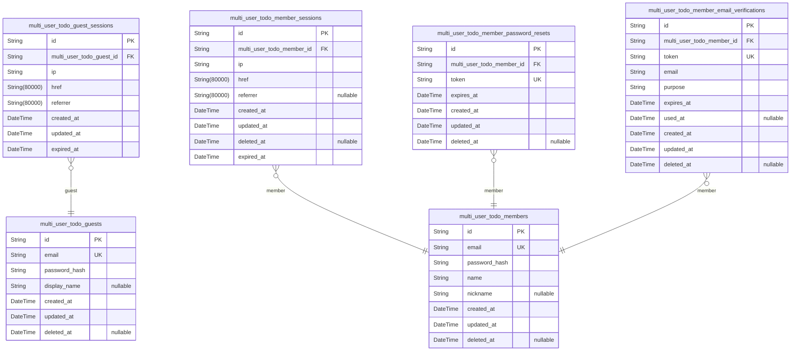
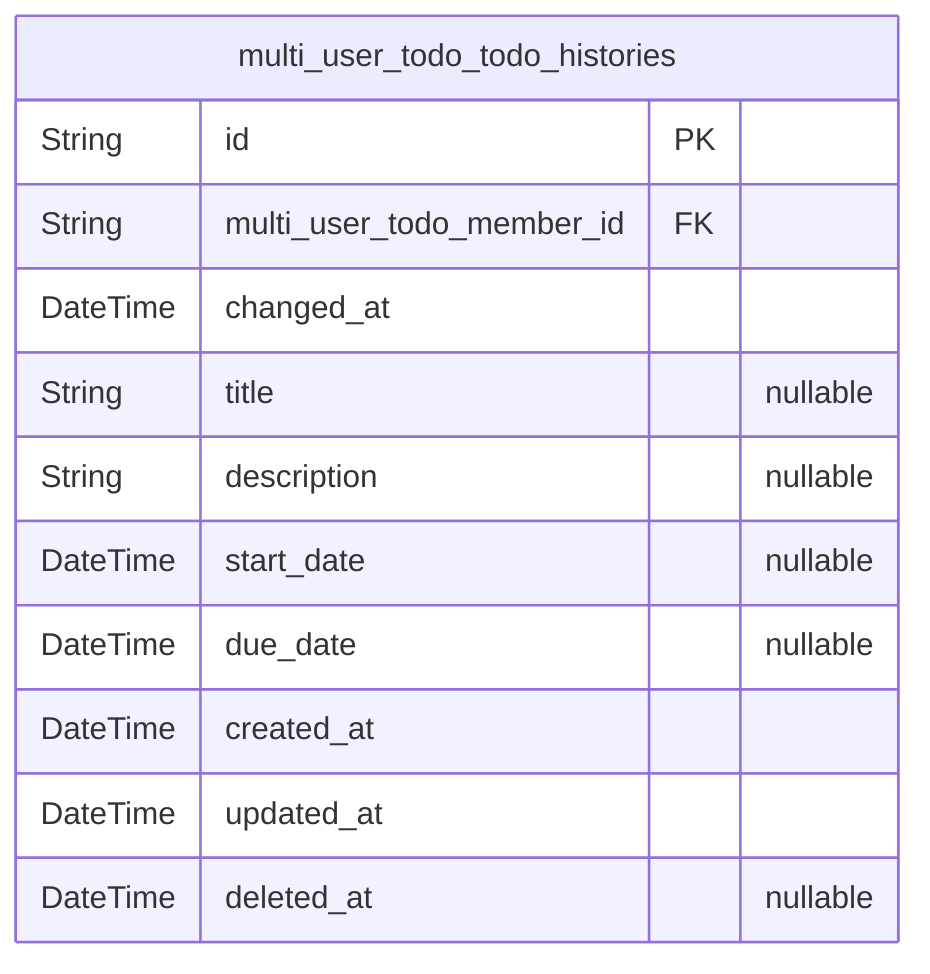

# Prisma Markdown

> Generated by [`prisma-markdown`](https://github.com/samchon/prisma-markdown)

- [Systematic](#systematic)
- [TodoHistory](#todohistory)

## Systematic

### `multi_user_todo_guests`

Guest actor records for unauthenticated visitors with device-based
identification. This table stores user accounts for guests who have
registered with email and password credentials. Once authenticated,
guests transition to the member actor role. Each guest owns their private
todo items and can manage their account through profile editing, password
changes, and account deletion. The session table {@link
multi_user_todo_guest_sessions} tracks active login sessions for each
guest.

Properties as follows:

- `id`: Primary Key.
- `email`: Unique email address for account identification and authentication.
- `password_hash`: Bcrypt hashed password for secure authentication.
- `display_name`: Optional display name shown to the user in the application.
- `created_at`: Timestamp when the guest account was created.
- `updated_at`: Timestamp when the guest account was last updated.
- `deleted_at`
  > Timestamp when the guest account was soft deleted. Null indicates active
  > account.

### `multi_user_todo_guest_sessions`

Temporary session tokens for guest access with device fingerprint
tracking. This table records connection metadata and temporal information
for each guest session, enabling session management, expiration tracking,
and security auditing. Sessions are created upon guest login and
terminated on logout or expiration.

Properties as follows:

- `id`: Primary Key.
- `multi_user_todo_guest_id`: Guest actor's [multi_user_todo_guests.id](#multi_user_todo_guests).
- `ip`: Client IP address for session tracking and security auditing.
- `href`: Current page or endpoint URL where the session was established.
- `referrer`: Referring URL from which the user navigated to establish this session.
- `created_at`: Session creation timestamp. Marks when the guest logged in.
- `updated_at`: Session last update timestamp. Tracks session modification events.
- `expired_at`
  > Session expiration timestamp. Sessions are automatically invalidated
  > after this time.

### `multi_user_todo_members`

Member actor records with email/password authentication credentials and
profile data. This table represents authenticated users who can manage
their private todos, edit profile, change password, and delete account.
Each member has a unique email address and stores hashed password for
secure authentication. Related session management is handled by {@link
multi_user_todo_member_sessions}, password reset functionality by {@link
multi_user_todo_member_password_resets}, and email verification by {@link
multi_user_todo_member_email_verifications}.

Properties as follows:

- `id`: Primary Key.
- `email`: Email address for authentication. Must be unique across all members.
- `password_hash`: Hashed password for secure authentication.
- `name`: Member's full name for profile identification.
- `nickname`: Optional nickname for display purposes.
- `created_at`: Timestamp when the member account was created.
- `updated_at`: Timestamp when the member account was last updated.
- `deleted_at`: Timestamp for soft deletion. Null if account is active.

### `multi_user_todo_member_sessions`

JWT session tokens for member authentication with access and refresh
token support. This table tracks login sessions for authenticated
members, storing connection metadata and temporal information for audit
trails. Sessions are created upon successful login and terminated on
logout or expiration. Each member can have multiple concurrent sessions,
but all sessions are private to the member and cannot be accessed by
other users.

Properties as follows:

- `id`: Primary Key.
- `multi_user_todo_member_id`: Belonged member's [multi_user_todo_members.id](#multi_user_todo_members).
- `ip`: Client IP address from the login request.
- `href`: Request URI from the login request.
- `referrer`: Referrer header from the login request.
- `created_at`: Session creation timestamp.
- `updated_at`: Last update timestamp.
- `deleted_at`: Soft deletion timestamp for session termination.
- `expired_at`: Session expiration timestamp for automatic logout.

### `multi_user_todo_member_password_resets`

Password reset tokens with expiration for member account recovery. Stores
one-time use tokens that allow members to securely reset their forgotten
passwords. Each token is valid for a limited time window and becomes
invalid after use or expiration.

This table supports the password reset workflow described in the
authentication requirements, enabling members to recover account access
without exposing existing credentials.

Related entities: [multi_user_todo_members](#multi_user_todo_members)

Properties as follows:

- `id`: Primary Key.
- `multi_user_todo_member_id`: Target member's [multi_user_todo_members.id](#multi_user_todo_members).
- `token`: Secure one-time use password reset token.
- `expires_at`: Token expiration timestamp after which the reset link becomes invalid.
- `created_at`: Record creation timestamp.
- `updated_at`: Record update timestamp.
- `deleted_at`: Soft deletion timestamp for audit trail.

### `multi_user_todo_member_email_verifications`

Email verification tokens for member registration and email change
confirmation.

This subsidiary table stores verification tokens generated during member
account creation and email change operations. Each token is associated
with a specific member and email address, with expiration time and usage
tracking.

Key relationships:
- [multi_user_todo_members](#multi_user_todo_members): Each verification belongs to one member
- Tokens are one-time use, marked with used_at when consumed

Behavioral notes:
- Tokens expire at expires_at timestamp
- used_at indicates successful verification
- deleted_at supports soft deletion for audit trail

Properties as follows:

- `id`: Primary Key.
- `multi_user_todo_member_id`: Belonged member's [multi_user_todo_members.id](#multi_user_todo_members).
- `token`: Unique verification token string.
- `email`: Email address to be verified.
- `purpose`
  > Verification purpose: 'registration' for new account creation,
  > 'email_change' for updating member email address.
- `expires_at`: Token expiration timestamp. Token becomes invalid after this time.
- `used_at`
  > Timestamp when token was successfully used for verification. Null if
  > unused.
- `created_at`: Record creation timestamp.
- `updated_at`: Record last update timestamp.
- `deleted_at`: Soft deletion timestamp for audit trail.

## TodoHistory

### `multi_user_todo_todo_histories`

Edit history records for todo items, storing complete snapshots of todo
state at each modification. Each entry captures the values of title,
description, start_date, and due_date at the time of edit, along with the
timestamp and the member who made the change. History entries are sorted
from most recent to oldest for chronological review. When a todo is
permanently deleted, all associated history entries are also removed.

Key relationships:
- Created by [multi_user_todo_members](#multi_user_todo_members) - the member who made the edit

Behavioral notes:
- Append-only: History entries are never modified after creation
- Soft delete support: deleted_at allows recovery if needed
- Privacy isolation: Only the todo owner and system can access history

Properties as follows:

- `id`: Primary Key.
- `multi_user_todo_member_id`
  > Member who made the edit's [multi_user_todo_members.id](#multi_user_todo_members). Tracks the
  > actor responsible for this history entry.
- `changed_at`
  > Timestamp when the edit occurred. Used for chronological sorting of
  > history entries (most recent first).
- `title`
  > Snapshot of the todo's title at the time of edit. Null if title was not
  > changed in this edit.
- `description`
  > Snapshot of the todo's description at the time of edit. Null if
  > description was not changed in this edit.
- `start_date`
  > Snapshot of the todo's start date at the time of edit. Null if start date
  > was not changed in this edit.
- `due_date`
  > Snapshot of the todo's due date at the time of edit. Null if due date was
  > not changed in this edit.
- `created_at`: Record creation timestamp.
- `updated_at`: Record last update timestamp.
- `deleted_at`: Soft deletion timestamp. Allows recovery of deleted history entries.
