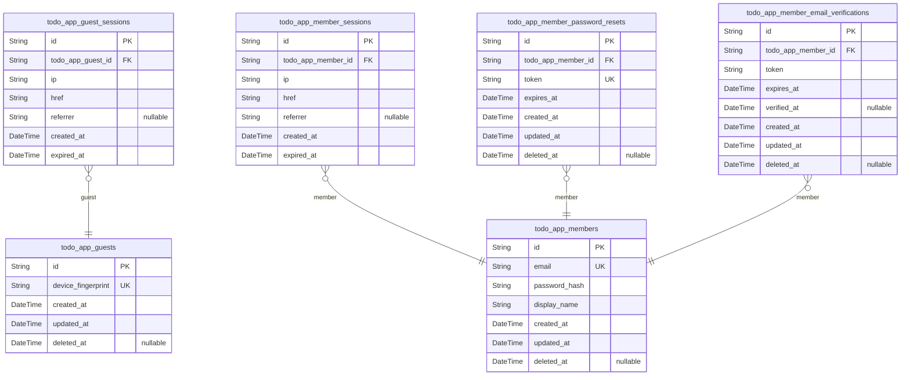
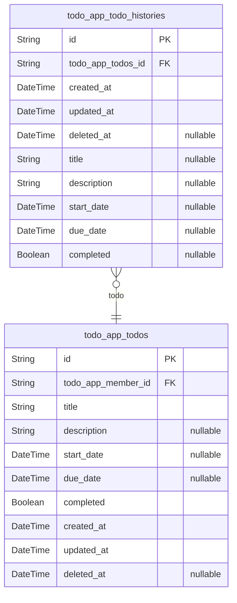

# Prisma Markdown

> Generated by [`prisma-markdown`](https://github.com/samchon/prisma-markdown)

- [Systematic](#systematic)
- [Todos](#todos)

## Systematic

### `todo_app_guests`

Temporary guest accounts for anonymous browsing identified by device
fingerprint.

Guest actors represent unauthenticated users who can access the system
without email/password registration. Each guest is uniquely identified by
their device fingerprint, enabling session persistence across requests
from the same device.

Key characteristics:
- No email/password authentication (use todo_app_members for registered
users)
- Device fingerprint serves as unique identifier
- Supports temporary session management via todo_app_guest_sessions
- Soft delete support for guest account cleanup

Properties as follows:

- `id`: Primary Key.
- `device_fingerprint`
  > Unique device fingerprint identifying the guest device. Used for guest
  > identification and session association.
- `created_at`: Timestamp when the guest account was created.
- `updated_at`: Timestamp when the guest account was last updated.
- `deleted_at`
  > Timestamp when the guest account was soft deleted. Null if the account is
  > active.

### `todo_app_guest_sessions`

Temporary session tokens for guest access with short expiration. Tracks
connection metadata for unauthenticated guest users including IP address,
URL, and referrer information for session auditing and security purposes.

This session table belongs to the [todo_app_guests](#todo_app_guests) actor table and
stores append-only login session records. Each guest can have multiple
concurrent sessions, and sessions are automatically expired based on the
expired_at timestamp for security.

Key characteristics:
- Append-only audit trail of guest login events
- Managed through authentication flows, not direct user CRUD
- Short expiration period for temporary guest access
- Connection context for security monitoring

Properties as follows:

- `id`: Primary Key.
- `todo_app_guest_id`: Belonged guest's [todo_app_guests.id](#todo_app_guests).
- `ip`: Client IP address for session tracking and security auditing.
- `href`: Client URL for session tracking and context.
- `referrer`: Client referrer URL for session tracking and context.
- `created_at`: Session creation timestamp for audit trail.
- `expired_at`: Session expiration timestamp for security enforcement.

### `todo_app_members`

Registered member accounts with email/password authentication credentials
and profile data.

This table represents the canonical identity records for authenticated
members in the system. Each member owns their private todo items and has
one-to-many sessions stored in the [todo_app_member_sessions](#todo_app_member_sessions)
table.

Key relationships:
- Owns [todo_app_todos](#todo_app_todos) via userId foreign key
- Has [todo_app_member_sessions](#todo_app_member_sessions) for authentication
- Has [todo_app_member_password_resets](#todo_app_member_password_resets) for password recovery
- Has [todo_app_member_email_verifications](#todo_app_member_email_verifications) for registration
confirmation

Account deletion triggers cascade deletion of all owned todos and their
histories.

Properties as follows:

- `id`: Primary Key.
- `email`
  > User's email address for authentication. Must be unique across all
  > members.
- `password_hash`: Hashed password for secure authentication. Never stored in plain text.
- `display_name`: User's display name (1-100 characters). Visible in the user's profile.
- `created_at`: Account creation timestamp. Immutable after registration.
- `updated_at`: Last update timestamp. Updated on profile changes.
- `deleted_at`
  > Soft delete timestamp for account deletion. When set, account is
  > considered deleted and all owned data is permanently removed.

### `todo_app_member_sessions`

JWT session tokens for member authentication with connection metadata and
temporal tracking. Each session record captures a single login event for
a [todo_app_members](#todo_app_members) member, storing IP address, request context,
and expiration information for security auditing and session management.

Sessions are append-only audit trail entries that track when members
authenticate to the system. Each member can have multiple active sessions
simultaneously, enabling multi-device access while maintaining security
through expiration policies.

Related to [todo_app_members](#todo_app_members) through a 1:N relationship where one
member owns many sessions.

Properties as follows:

- `id`: Primary Key.
- `todo_app_member_id`: Member who owns this session. [todo_app_members.id](#todo_app_members).
- `ip`: IP address of the client that created this session.
- `href`: URL of the login endpoint or page where authentication occurred.
- `referrer`: Referrer header from the client request during login.
- `created_at`: Timestamp when this session was created (login time).
- `expired_at`
  > Timestamp when this session expires and becomes invalid for
  > authentication.

### `todo_app_member_password_resets`

Password reset tokens with expiration for account recovery workflow.

Stores one-time use tokens generated when members request password
resets. Each token is associated with a specific member and has an
expiration time after which it becomes invalid. Tokens are consumed upon
successful password reset and cannot be reused.

This table supports the password change workflow by providing secure,
time-limited tokens that verify the member's identity before allowing
password modification. Tokens are automatically cleaned up after
expiration or consumption.

Properties as follows:

- `id`: Primary Key.
- `todo_app_member_id`: Member requesting password reset. [todo_app_members.id](#todo_app_members).
- `token`
  > Unique password reset token. Generated cryptographically secure random
  > string for one-time use.
- `expires_at`
  > Token expiration timestamp. Token becomes invalid after this time and
  > cannot be used for password reset.
- `created_at`: Record creation timestamp. When the password reset token was generated.
- `updated_at`: Record last update timestamp. Updated when token is consumed or modified.
- `deleted_at`: Soft delete timestamp. Set when token is consumed or manually invalidated.

### `todo_app_member_email_verifications`

Email verification tokens for new member registration confirmation. Each
verification record stores a unique token sent to the member's email
address, with expiration timestamp for security. Used in the registration
workflow to confirm email ownership before activating the account.

This table supports the member registration process by:
- Storing verification tokens with expiration
- Linking to the pending member account via [todo_app_members.id](#todo_app_members)
- Enabling token validation during email confirmation
- Supporting token renewal through new verification records

Properties as follows:

- `id`: Primary Key.
- `todo_app_member_id`: Member account awaiting email verification. [todo_app_members.id](#todo_app_members)
- `token`
  > Cryptographically secure verification token sent to the member's email
  > address.
- `expires_at`: Token expiration timestamp. Tokens are invalid after this time.
- `verified_at`
  > Timestamp when the email was successfully verified. Null if not yet
  > verified.
- `created_at`: Record creation timestamp.
- `updated_at`: Record last update timestamp.
- `deleted_at`: Soft deletion timestamp for cleanup.

## Todos

### `todo_app_todo_histories`

Edit history entries for todos, recording timestamp and changed field
values. Each entry is created when a todo is edited, storing the new
values of title, description, startDate, dueDate, and completed status
that were modified. This table serves as an append-only audit trail that
users can view to track the complete modification history of their todos,
sorted from most recent to oldest. History entries are automatically
deleted when the parent todo is permanently removed from the trash.

Properties as follows:

- `id`: Primary Key.
- `todo_app_todos_id`: Belonged todo's [todo_app_todos.id](#todo_app_todos).
- `created_at`: Timestamp when the edit was made and history entry was created.
- `updated_at`: Timestamp when the history entry was last updated.
- `deleted_at`: Timestamp when the history entry was soft-deleted.
- `title`
  > Title value at the time of edit. Null if title was not changed in this
  > edit.
- `description`
  > Description value at the time of edit. Null if description was not
  > changed in this edit.
- `start_date`
  > Start date value at the time of edit. Null if start date was not changed
  > or not set in this edit.
- `due_date`
  > Due date value at the time of edit. Null if due date was not changed or
  > not set in this edit.
- `completed`
  > Completion status at the time of edit. Null if completion status was not
  > changed in this edit.

### `todo_app_todos`

Core todo items with title, description, dates, completion status, and
soft delete. Owned by members via todo_app_member_id foreign key for data
isolation and privacy enforcement.

Each todo represents a task that can be created, edited, completed, and
deleted by its owner. Soft deletion enables trash management where
deleted todos can be restored or permanently removed.

Relationships:
- Belongs to [todo_app_members](#todo_app_members) for ownership
- Has many [todo_app_todo_histories](#todo_app_todo_histories) for edit audit trail (managed
separately)

Properties as follows:

- `id`: Primary Key.
- `todo_app_member_id`
  > Owner member's [todo_app_members.id](#todo_app_members). Enforces data isolation and
  > privacy - members can only access their own todos.
- `title`
  > Todo title (required, 1-500 characters). The main descriptive text for
  > the task.
- `description`
  > Todo description (optional, 0-2000 characters). Additional details about
  > the task.
- `start_date`
  > Optional start date for the todo. Used for sorting and filtering tasks by
  > when they begin.
- `due_date`
  > Optional due date for the todo. Used for sorting and filtering tasks by
  > deadline.
- `completed`
  > Completion status. True when the todo is marked as complete, false
  > otherwise. Defaults to false when created.
- `created_at`: Timestamp when the todo was created. Immutable after creation.
- `updated_at`
  > Timestamp when the todo was last updated. Automatically updated on any
  > modification.
- `deleted_at`
  > Timestamp when the todo was soft deleted. Null for active todos, set to
  > current time when deleted. Enables trash management and restoration.
