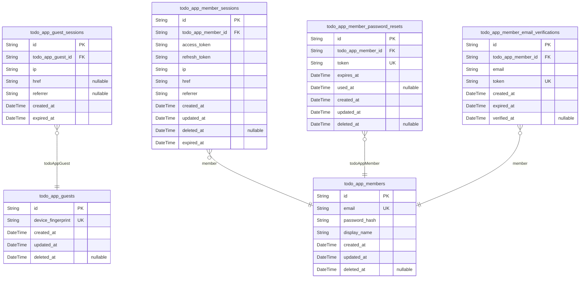
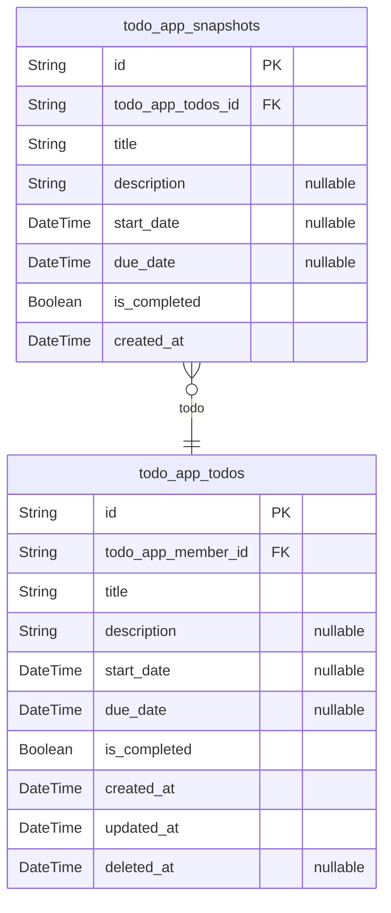

# Prisma Markdown

> Generated by [`prisma-markdown`](https://github.com/samchon/prisma-markdown)

- [auth](#auth)
- [todo](#todo)

## auth

### `todo_app_guests`

Temporary guest accounts identified by device fingerprint for anonymous
access tracking.

Guest accounts enable anonymous users to interact with limited public
features without registration. Each guest is uniquely identified by their
device fingerprint, allowing session continuity across requests from the
same device.

**Identity and Tracking**

The device_fingerprint field serves as the primary identifier for guest
users. This enables the system to track anonymous activity and maintain
session state without requiring email or password credentials. Guests
have no access to protected resources and cannot view other users' data.

**Lifecycle Management**

Guest accounts follow a soft delete pattern via the deleted_at field.
When a guest account is deleted, it is marked as deleted but not
permanently removed from the database. This supports audit trails and
potential recovery scenarios. The updated_at field tracks when the
account was last modified.

Properties as follows:

- `id`: Primary key uniquely identifying each guest account.
- `device_fingerprint`
  > Unique device fingerprint identifying the guest user's device.
  >
  > This field serves as the primary identifier for anonymous guests. It
  > enables the system to associate multiple sessions and requests with the
  > same guest user without requiring authentication credentials.
- `created_at`
  > Timestamp when the guest account was created.
  >
  > This field is automatically set upon guest account creation and cannot be
  > modified. It is used for tracking account age and for temporal queries.
- `updated_at`
  > Timestamp when the guest account was last updated.
  >
  > This field is automatically updated whenever the guest account record is
  > modified. It is used for tracking recent activity and for synchronization
  > purposes.
- `deleted_at`
  > Timestamp when the guest account was soft deleted.
  >
  > When this field is null, the account is active. When populated, the
  > account is marked as deleted but retained in the database for audit
  > purposes. Soft deletion allows for potential recovery and maintains
  > referential integrity with related records.

### `todo_app_guest_sessions`

Temporary session tokens for guest access with device-based identification.

This table tracks active session tokens for guest users who access the
system without registration. Each session is associated with a {@link
todo_app_guest} and stores connection metadata for audit purposes.

**Session Lifecycle**
Sessions are created when a guest first accesses the system and expire
based on the expired_at timestamp. Expired sessions should be cleaned up
periodically to maintain database performance.

**Security Considerations**
Sessions are append-only and managed exclusively through authentication
flows. Users cannot directly modify or delete session records.

Properties as follows:

- `id`: Primary key uniquely identifying this session record.
- `todo_app_guest_id`
  > Reference to the guest account this session belongs to.
  >
  > Each session is associated with exactly one [todo_app_guest](#todo_app_guest)
  > identified by device fingerprint. This foreign key establishes the
  > ownership relationship and enables session cleanup when guests are
  > removed.
- `ip`
  > Client IP address from the session creation request.
  >
  > Used for security auditing and detecting suspicious access patterns.
  > Stored as string to accommodate both IPv4 and IPv6 addresses.
- `href`
  > Current page URL (window.location.href) when session was created.
  >
  > Provides context about where the user originated from within the
  > application.
- `referrer`
  > Referrer URL from the HTTP request headers.
  >
  > Indicates the external page or source that led the user to this
  > application.
- `created_at`
  > Timestamp when this session was created.
  >
  > Used for session ordering, expiration calculations, and audit trails.
  > Automatically set on insertion.
- `expired_at`
  > Timestamp when this session expires and becomes invalid.
  >
  > Sessions past this timestamp should be rejected by authentication
  > middleware. Set to a future date at creation based on session timeout
  > policy.

### `todo_app_members`

Registered member accounts with email/password credentials and display
name profile.

This table represents authenticated users who can manage their own todos
and profile information. Each member has a unique email address used for
login authentication and a display name shown in the user interface.

**Authentication**

Members authenticate using email and password. The password_hash field
stores the securely hashed password, never plaintext. Email must be
unique across all accounts to ensure proper authentication routing.

**Profile**

The display_name field contains the user's chosen public name shown in
the application. Members can update their display name independently of
their authentication credentials.

**Lifecycle**

Soft delete support via deleted_at enables account recovery and audit
compliance. When a member deletes their account, all associated data
(todos, sessions, password resets, email verifications) is permanently
removed through cascade deletes.

**Relationships**

This is a parent table referenced by child tables: {@link
todo_app_member_sessions}, [todo_app_member_password_resets](#todo_app_member_password_resets),
[todo_app_member_email_verifications](#todo_app_member_email_verifications). Foreign keys flow from
children to this table, never the reverse.

Properties as follows:

- `id`: Primary key uniquely identifying each member account.
- `email`
  > Unique email address used for login authentication.
  >
  > This field serves as the primary identifier for member authentication. It
  > must be unique across all accounts and is validated during registration
  > and login flows.
- `password_hash`
  > Securely hashed password for authentication.
  >
  > Stores the bcrypt or Argon2 hash of the user's password. Never store
  > plaintext passwords. This field is updated when the member changes their
  > password.
- `display_name`
  > User's chosen display name shown in the application.
  >
  > This is the public name associated with the member's account. Members can
  > update their display name independently through profile management
  > operations.
- `created_at`
  > Timestamp when the member account was created.
  >
  > Records the initial account creation time for audit and compliance
  > purposes.
- `updated_at`
  > Timestamp when the member account was last modified.
  >
  > Updated whenever any field changes (email, password_hash, display_name).
  > Used for conflict detection and audit trails.
- `deleted_at`
  > Timestamp when the member account was soft-deleted.
  >
  > Null for active accounts. When set, the account is logically deleted but
  > retained for recovery purposes. All associated data cascades to permanent
  > deletion.

### `todo_app_member_sessions`

JWT session tokens with access and refresh token support for member
authentication.

This table tracks active login sessions for authenticated members,
storing JWT tokens and session metadata for security and audit purposes.

## Session Lifecycle

Sessions are created during member login and expire based on token
expiration times. Members can have multiple active sessions across
different devices or browsers.

## Security Considerations

Each session tracks the originating IP address, href, and referrer for
security auditing. Expired sessions should be cleaned up periodically to
maintain database performance.

Properties as follows:

- `id`: Primary key uniquely identifying this session record.
- `todo_app_member_id`
  > References the member account that owns this session.
  >
  > This foreign key establishes the relationship between the session and its
  > parent [todo_app_members](#todo_app_members) actor. Each session belongs to exactly
  > one member, and a member can have multiple active sessions.
  >
  > ## Relationship Semantics
  >
  > - **Cardinality**: Many sessions belong to one member (1:N)
  > - **Ownership**: Sessions are owned by and cannot exist without their
  > parent member
  > - **Cascade**: When a member account is deleted, all their sessions are
  > automatically removed
- `access_token`
  > JWT access token for API authentication.
  >
  > This token is used to authenticate API requests on behalf of the member.
  > It contains encoded claims about the user identity and permissions, and
  > has a relatively short expiration time for security.
- `refresh_token`
  > JWT refresh token for obtaining new access tokens.
  >
  > This long-lived token allows members to obtain new access tokens without
  > re-authenticating. It is used when the access token expires, enabling
  > seamless user experience while maintaining security through token
  > rotation.
- `ip`
  > IP address of the client that created this session.
  >
  > Captured at session creation time for security auditing and anomaly
  > detection. Helps identify potentially unauthorized access attempts from
  > unusual locations.
- `href`
  > The URL (href) of the page where the login occurred.
  >
  > Tracks the origin page for security auditing and user experience
  > analytics. Can help identify suspicious login patterns or phishing
  > attempts.
- `referrer`
  > The referrer URL that led to the login page.
  >
  > Captures the referring page for security auditing and analytics. Useful
  > for understanding user acquisition paths and detecting suspicious
  > referral patterns.
- `created_at`
  > Timestamp when this session was created.
  >
  > Records the exact moment the member logged in and this session was
  > established. Used for session ordering, expiration calculations, and
  > audit trails.
- `updated_at`
  > Timestamp when this session was last updated.
  >
  > Tracks the most recent modification to this session record. Updated
  > whenever session metadata changes or tokens are refreshed.
- `deleted_at`
  > Timestamp when this session was soft-deleted.
  >
  > Used for soft delete functionality, allowing sessions to be marked as
  > deleted without immediate physical removal. Enables session recovery and
  > audit trail preservation.
- `expired_at`
  > Timestamp when this session expires.
  >
  > Defines the absolute expiration time for this session. Sessions past this
  > timestamp should be considered invalid and cleaned up. Typically set
  > based on refresh token expiration policy.

### `todo_app_member_password_resets`

Password reset tokens with expiration for member password recovery workflow.

This table stores one-time use tokens that allow members to securely
reset their passwords without knowing their current password. Each token
is linked to a specific member account and expires after a configured
time period.

**Token Lifecycle**

Tokens are generated when a member requests a password reset via email.
The token is sent to the member's registered email address and must be
used within the expiration window. Once used, the token is marked as
consumed and cannot be reused.

**Security Considerations**

Tokens are cryptographically random strings that cannot be guessed.
Expired or used tokens are automatically invalidated. Old tokens are
cleaned up periodically to prevent database bloat.

**Relationships**

Each reset token belongs to exactly one [todo_app_members](#todo_app_members) account.
Multiple tokens may exist for the same member if they request multiple
resets, but only the most recent active token is typically valid.

Properties as follows:

- `id`: Unique identifier for this password reset token record.
- `todo_app_member_id`
  > Reference to the member account requesting password reset.
  >
  > This foreign key links the reset token to the specific member whose
  > password will be reset. The member must exist in the {@link
  > todo_app_members} table.
  >
  > **Relationship Semantics**
  >
  > - A member can have multiple reset tokens over time (historical records)
  > - When a member is deleted, their reset tokens should be cascade deleted
  > - This is a many-to-one relationship: many tokens can reference one member
- `token`
  > Cryptographically random reset token string.
  >
  > This is the actual token value that is sent to the member via email. It
  > must be unique across all reset tokens and is what the member provides
  > when completing the password reset flow.
  >
  > **Security Requirements**
  >
  > - Must be generated using a cryptographically secure random number
  > generator
  > - Should be at least 32 characters of alphanumeric or base64-encoded data
  > - Must never be logged or stored in plaintext in application logs
- `expires_at`
  > Timestamp when this token becomes invalid.
  >
  > Tokens expire after a configured duration (typically 1 hour) to limit the
  > window for potential abuse. The password reset flow validates that the
  > current time is before this timestamp.
  >
  > **Validation Logic**
  >
  > - Password reset requests check: current_time < expires_at
  > - Expired tokens are rejected even if not yet used
  > - This field is NOT NULL to ensure all tokens have a defined expiration
- `used_at`
  > Timestamp when this token was consumed for password reset.
  >
  > Once a token is used to reset a password, this field is populated with
  > the timestamp. Used tokens cannot be reused for additional password
  > resets.
  >
  > **Usage Flow**
  >
  > - Initially NULL when token is created
  > - Set to current timestamp when password reset is completed
  > - Used tokens are logically deleted from active rotation
  > - Nullable to support both unused (NULL) and used (timestamp) states
- `created_at`
  > Timestamp when this password reset token was created.
  >
  > Records the exact moment the token was generated and sent to the member.
  > Used for auditing and cleanup of expired tokens.
  >
  > **Temporal Tracking**
  >
  > - Always set to current timestamp on insert
  > - Never updated after creation
  > - Required for all records
- `updated_at`
  > Timestamp when this record was last modified.
  >
  > Updated when the token is used (used_at field is set). Provides audit
  > trail for token lifecycle events.
  >
  > **Update Behavior**
  >
  > - Set on token creation
  > - Updated when token is consumed (used_at is populated)
  > - Never updated for other modifications
- `deleted_at`
  > Timestamp when this record was soft deleted.
  >
  > Used for soft delete support, allowing token records to be retained for
  > audit purposes while being logically removed from active queries.
  >
  > **Soft Delete Behavior**
  >
  > - NULL for active records
  > - Set to current timestamp when record is soft deleted
  > - Queries should filter out records where deleted_at IS NOT NULL

### `todo_app_member_email_verifications`

Email verification tokens for member registration and email change
validation.

This table stores temporary verification tokens used during the member
registration process and when members change their email address. Each
token is associated with a specific member account and email address, and
expires after a configured time period.

## Token Lifecycle

- Tokens are created when a member registers or requests an email change
- Tokens must be verified within their expiration window
- Once verified, the verified_at timestamp is set and the token becomes
invalid
- Expired tokens are cleaned up periodically

## Security Considerations

- Tokens are single-use and expire automatically
- Each token is uniquely identified and linked to a specific member
- The email field captures the target email address for verification

## Relationship to [todo_app_members](#todo_app_members)

Each verification record belongs to exactly one member account. A member
may have multiple pending verifications (e.g., during registration or
email change workflows).

Properties as follows:

- `id`: Unique identifier for this email verification record.
- `todo_app_member_id`
  > Reference to the member account requiring email verification.
  >
  > This foreign key links the verification record to the member who
  > initiated the verification process. The member may be in a partially
  > registered state (pending email confirmation) or may be an existing
  > member requesting an email address change.
- `email`
  > Email address being verified.
  >
  > This is the target email address that the member is attempting to verify.
  > During registration, this is the email provided during sign-up. During an
  > email change, this is the new email address being validated.
- `token`
  > Random verification token.
  >
  > A cryptographically secure random string used to validate the
  > verification request. This token is sent to the email address and must be
  > presented back to the system to complete verification.
- `created_at`: Timestamp when this verification record was created.
- `expired_at`
  > Timestamp when this verification token expires.
  >
  > Tokens are invalidated after this time to prevent replay attacks and
  > ensure time-limited verification windows.
- `verified_at`
  > Timestamp when verification was completed.
  >
  > This field is null until the token is successfully verified. Once set,
  > the token is considered used and cannot be reused.

## todo

### `todo_app_todos`

Main todo task entity storing user's task items with title, description,
dates, and completion status for personal task management.

**Core Attributes**

Each todo represents a task that a member can create, track, and manage.
Todos support optional start and due dates for scheduling, and maintain
completion status for workflow tracking.

**Lifecycle Management**

Todos support soft deletion through the deleted_at field, allowing users
to recover accidentally deleted tasks. Permanently deleted todos (from
trash) are removed from the database along with their snapshots.

**Ownership and Privacy**

Each todo belongs to exactly one [todo_app_members](#todo_app_members) account. Users
can only access their own todos through proper authentication and
authorization checks. No sharing or cross-user visibility is supported.

**Edit History**

Every modification to a todo creates a corresponding snapshot in {@link
todo_app_snapshots}, enabling users to view the complete edit history of
their tasks.

Properties as follows:

- `id`: Unique identifier for this todo task.
- `todo_app_member_id`
  > Reference to the member who owns this todo task.
  >
  > Each todo belongs to exactly one member account. This foreign key
  > establishes the ownership relationship and enables filtering todos by
  > user.
  >
  > **Access Control**
  >
  > Queries must always filter by this field to ensure users can only access
  > their own todos. Authorization middleware validates that the
  > authenticated member matches this foreign key before allowing any
  > operations.
- `title`
  > The main title or name of the todo task.
  >
  > This is a required field that provides a brief, descriptive name for the
  > task. The title appears in todo lists and is the primary identifier users
  > see when browsing their tasks.
- `description`
  > Detailed description or notes for the todo task.
  >
  > This optional field contains additional context, instructions, or notes
  > related to the task. It can be left empty if no additional details are
  > needed.
- `start_date`
  > Optional planned start date for the todo task.
  >
  > When set, this indicates when the user plans to begin working on the
  > task. It is used for scheduling and filtering tasks by date range.
- `due_date`
  > Optional due date or deadline for the todo task.
  >
  > When set, this indicates when the task should be completed. It is used
  > for scheduling, reminders, and filtering tasks by deadline.
- `is_completed`
  > Completion status of the todo task.
  >
  > Defaults to false when the todo is created. Users can toggle this field
  > to mark the task as complete or incomplete. Completed tasks remain in the
  > list but are visually distinguished from active tasks.
- `created_at`
  > Timestamp when this todo was originally created.
  >
  > This field is automatically set when the todo is first created and cannot
  > be modified. It is used for sorting todos by creation order and tracking
  > task age.
- `updated_at`
  > Timestamp when this todo was last modified.
  >
  > This field is automatically updated whenever any field of the todo is
  > changed. It is used for detecting concurrent modifications and sorting by
  > recency.
- `deleted_at`
  > Timestamp when this todo was soft deleted.
  >
  > When this field is null, the todo is active and appears in normal todo
  > lists. When set to a datetime value, the todo is considered deleted and
  > hidden from regular lists (moved to trash). Permanently deleting a todo
  > removes this record entirely from the database.

### `todo_app_snapshots`

Point-in-time snapshots of todos capturing full state whenever edits
occur, enabling users to view complete edit history.

Each snapshot records the complete state of a todo at the moment it was
edited, including title, description, dates, and completion status. This
allows users to browse the full edit history of their todos in
chronological order.

Relationships

Each snapshot belongs to exactly one [todo_app_todos](#todo_app_todos) record. When
a todo is permanently deleted from the trash, all its associated
snapshots are cascade deleted.

Data Retention

Snapshots are immutable once created. They accumulate as users edit their
todos and are only removed when the parent todo is permanently deleted.

Properties as follows:

- `id`: Unique identifier for each snapshot entry.
- `todo_app_todos_id`
  > Reference to the todo this snapshot belongs to.
  >
  > Each snapshot is associated with exactly one todo record. When the todo
  > is permanently deleted, all its snapshots are cascade deleted.
- `title`: Title of the todo at the time this snapshot was created.
- `description`
  > Description of the todo at the time this snapshot was created. May be
  > empty if no description was set.
- `start_date`
  > Start date of the todo at the time this snapshot was created. Null if no
  > start date was set.
- `due_date`
  > Due date of the todo at the time this snapshot was created. Null if no
  > due date was set.
- `is_completed`: Completion status of the todo at the time this snapshot was created.
- `created_at`
  > Timestamp when this snapshot was created, representing the exact moment
  > of the todo edit.
