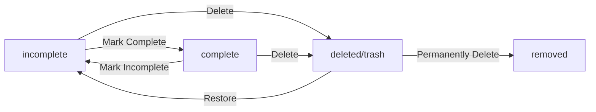
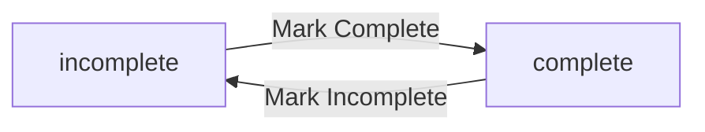
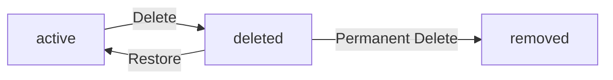
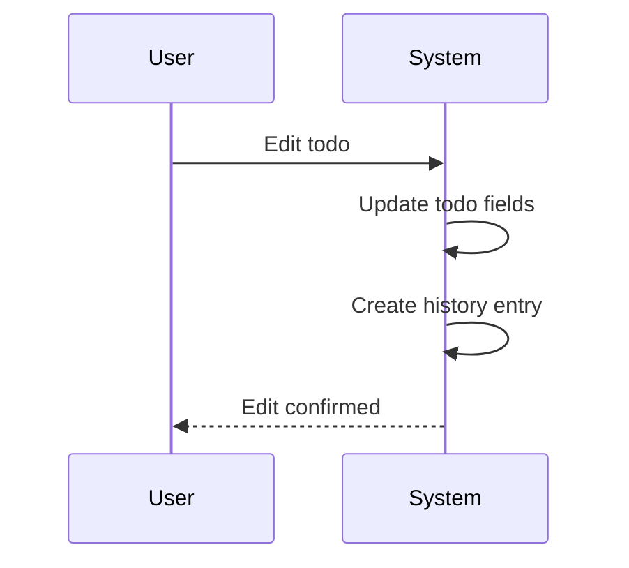

**todoApp — Business concepts, relationships, and states from user perspective**

Business concepts, relationships, and states from user perspective

# Domain Concepts

Describe what each concept means in the business domain and its key attributes.

## User Concept

A User represents an individual person who has an account in the todo application. Each user has a unique email address that serves as their primary identifier for account access. Users maintain a display name that represents how they appear within the system. A password protects user account access and must be kept secure. Users own their todos and have complete privacy over their data. The system ensures users cannot view or access other users' todos. User accounts can be deleted, which removes all associated todos permanently from the system.

### User Account

A user account represents an individual person's identity in the todo application. Each account is identified by a unique email address that serves as the primary identifier for accessing the system. Users authenticate to the system using their email address and password. The password protects account access and must remain confidential to the account holder.

Users can manage their account by updating their display name, which represents how they appear within the system. Users can also change their password to maintain account security. Account deletion is available as a permanent action that removes the user account and all associated data from the system.

### User Profile

Each user maintains a profile containing a display name. The display name is a user-defined identifier that represents the user within the application. Users can edit their display name at any time to update how they are identified in the system. The profile is personal to each user and is not visible to other users.

### User Privacy

User data is completely private within the todo application. Users can only access and view their own todos and account information. There is no mechanism for users to view, access, or share another user's todos or profile information. Each user's data remains isolated and protected from other users in the system.

### Todo Ownership

Users own all todos they create in the application. A todo is permanently associated with the user who created it and cannot be transferred to another user. Only the owning user can view, edit, complete, or delete their todos. This ownership relationship ensures that each user's todo data remains separate and private from other users.

### Account Deletion

Users can delete their account at any time. When an account is deleted, all todos owned by that user are permanently removed from the system. This includes todos in the normal list and todos in the trash. The deletion also removes all edit history associated with the user's todos. TodoHistory records new_values_only for each change made to a todo. Account deletion is irreversible and results in complete data removal.

## Todo Concept

A Todo represents a task or item that a user wants to track and complete. Each todo has a title that is required for identification and basic understanding. An optional description provides additional details about the task when needed. Start date and due date are optional fields that help with scheduling and planning. Todos have a completion status that tracks whether the task is done or not. Todos can be deleted but remain in the trash until permanently removed. Each todo belongs to exactly one user and cannot be shared with others.

### Todo Definition and Core Attributes

A Todo represents a task or item that a user wants to track and complete. It is the fundamental unit of work in the application.

Each Todo has the following attributes:

- **Title**: A required field that identifies the task and provides basic understanding of what needs to be done
- **Description**: An optional field that provides additional details about the task when more context is needed
- **Start Date**: An optional field that indicates when the user plans to begin working on the task
- **Due Date**: An optional field that indicates when the user plans to complete the task
- **Completion Status**: A field that tracks whether the task is complete or incomplete

Newly created todos are incomplete by default. The completion status can be toggled between complete and incomplete as the user works on the task.

Todos serve the purpose of task tracking, allowing users to monitor what they need to accomplish and their progress toward completion.

### Todo Deletion and Trash Storage

Users can delete their own todos when a task is no longer needed or has been completed outside the system.

When a todo is deleted, it is not permanently removed from the system. Instead, it undergoes a soft delete operation, which means:

- The todo is removed from the normal todo list view
- The todo is moved to trash storage where it remains accessible
- The todo retains all its attributes including title, description, dates, and completion status

From the trash, users have two options:

- **Restore**: The todo returns to the normal todo list with all its attributes intact
- **Permanently Delete**: The todo is completely removed from the system

This deletion approach allows users to recover accidentally deleted todos while still providing a way to permanently remove tasks when needed.

### User Ownership and Task Scheduling

Each todo belongs to exactly one user and cannot be shared with or accessed by other users. This user ownership model ensures complete privacy for all todo data.

The ownership relationship means:

- Only the user who created a todo can view, edit, complete, or delete it
- Users cannot view, access, or share another user's todos
- When a user deletes their account, all todos owned by that user are permanently deleted
- Todo ownership cannot be transferred to another user

Users can utilize start dates and due dates for task scheduling purposes. These optional date fields help users plan when to begin work on a task and when they intend to complete it. Todos without these date fields can still be tracked and completed, but will not appear in date-based sorting operations.

When a todo is modified, the TodoHistory entity records the new values for each changed attribute (title, description, start date, due date, or completion status), along with a timestamp of when the change occurred.

## TodoHistory Concept

TodoHistory records every change made to a todo item over time. Each history entry captures when an edit was made with a timestamp. History entries track what fields were changed and their new values. The system maintains a complete audit trail of all modifications to todos. History entries are sorted from most recent to oldest for easy review. When a todo is permanently deleted, its history is also removed from the system. History provides transparency into how todos evolved through user edits.

### Edit History Overview

Every todo item maintains a complete edit history that records all modifications made to it over time. This history serves as an audit trail, providing transparency into how a todo has evolved through user edits.

Each edit creates a new history entry that captures the complete state of what was changed. The system maintains this modification log for all todos throughout their lifecycle, from creation until permanent deletion.

The edit history is automatically generated whenever a user modifies any field of a todo. No manual action is required from the user to create or maintain these records.

### Change Tracking Details

Each history entry tracks specific field modifications made during an edit session. When a todo is edited, the system records which fields were changed and their values before and after the modification.

The following field changes are tracked when they occur:
- Title changes: the previous title value and the new title value are recorded
- Description changes: the previous description value and the new description value are recorded (including when cleared to empty)
- Start date changes: the previous start date and the new start date are recorded (including when removed)
- Due date changes: the previous due date and the new due date are recorded (including when removed)

According to the domain model, each history entry records both the previous values and the new values of changed fields. This allows users to see exactly what changed from one state to another. If a field is not modified during an edit, it is not included in that history entry.

### History Organization and Retention

Each history entry includes a timestamp that records when the edit was made. This timestamp provides the chronological context for all changes.

History entries are organized with the most recent changes appearing first, followed by older entries in descending order. This sorting allows users to quickly see the latest modifications.

When a todo is permanently deleted from the trash, all associated history entries are also permanently removed from the system. The history lifecycle is tied to the todo's lifecycle - it exists only while the todo exists in any form (active or in trash).

# Domain Relationships

Describe how concepts relate to each other from a business perspective.

## Conceptual Relationships

Describe how concepts relate to each other in business terms.

### User-Todo Ownership

Each user owns their own todos. A todo is associated with exactly one user who created it. Users cannot access, view, or modify todos that belong to other users. This ownership relationship is established at todo creation and cannot be transferred to another user.

The association between a user and their todos is private. No mechanism exists for users to share, grant access to, or view another user's todos. Each user's todo collection is completely isolated from all other users.

### Todo-History Association

Each todo has an edit history that tracks all changes made to it. A todo can have zero or more history entries, with each entry recording only the new values of modified fields after an edit event. Previous values are not stored in the history entry. History entries are created automatically whenever a todo's title, description, start date, or due date is modified.

The relationship between a todo and its history is one-to-many: one todo can have many history entries, but each history entry belongs to exactly one todo. When a todo is permanently deleted, all its associated history entries are also permanently deleted.

### Ownership Boundaries

The system enforces strict ownership boundaries across all entities. A user can only access resources they own: their own profile, their own todos, and the edit history of their own todos.

Deleted todos remain associated with their original owner. Only the owner can restore or permanently delete their own todos from the trash. No user can access another user's deleted todos or their associated history.

## Lifecycle and Retention

Describe concept lifecycle states and transitions only. Detailed retention/recovery policies belong in 05-non-functional. Operation details belong in 03-functional-requirements.

### Todo Lifecycle States

A todo begins in an incomplete state when created. Users can toggle a todo between incomplete and complete states at any time.

A todo can be deleted, which moves it to the trash. Deleted todos no longer appears in the normal todo list but remain recoverable.

A todo in the trash can be restored, returning it to the normal todo list in its previous state (complete or incomplete).

A todo in the trash can be permanently deleted, removing it completely from the system.

### Deletion and Recovery

When a user deletes a todo, it is soft deleted and moved to the trash. Soft deleted todos are not permanently removed and can be recovered.

Users can view all their soft deleted todos in the trash. The trash list is paginated.

Users can restore a soft deleted todo from the trash. When restored, the todo returns to the normal todo list with its previous completion status and all its data intact.

Users can permanently delete a todo from the trash. Permanent deletion removes the todo completely and cannot be undone.

When a user permanently deletes a todo, all edit history associated with that todo is also permanently deleted.

When a user deletes their account, all their todos are permanently deleted, including todos in the trash. This action cannot be undone.

### Edit History Retention

Every edit to a todo creates a history entry that records when the edit was made and the new values of any changed fields. Edit history stores only the new values, not the previous values.

Edit history is retained for as long as the todo exists in the system (in the normal list or in the trash).

When a todo is permanently deleted from the trash, all associated edit history is also permanently deleted.

When a user deletes their account, all edit history for all their todos is permanently deleted.

# Business Categories and State Flows

Business category classifications and state flow definitions.

## Business Category Definitions

Define all business category classifications with their allowed values and descriptions.

### Todo Completion Status

Todos are classified by their completion status, which indicates whether the task has been finished by the user.

**Allowed Values**:
- **Incomplete**: The default state when a todo is created. The task has not yet been completed.
- **Complete**: The task has been marked as finished by the user.

Users can toggle between these two states at any time. A todo can be marked complete and later marked incomplete again if the task needs to be revisited.

Changes to completion status are recorded in TodoHistory with both the previous and new values.

### Todo Lifecycle Classification

Todos are classified by their lifecycle state, which determines where they appear in the user's view and how they can be accessed.

**Allowed Values**:
- **Active**: The todo is in the normal todo list and visible in standard views. This is the default state when a todo is created or restored from trash.
- **Deleted**: The todo has been removed from the normal list and moved to the trash. It is no longer visible in standard todo views but can be accessed through the trash view.

A todo in the Active state can be deleted, moving it to the Deleted state. A todo in the Deleted state can be restored, returning it to the Active state, or permanently deleted, removing it from the system entirely along with its edit history.

Changes to lifecycle state are recorded in TodoHistory with both the previous and new values.

## State Transitions

Define valid state transition paths for stateful concepts.

### Todo Completion State Flow

A todo has a completion status that can be either complete or incomplete.

When a user marks an incomplete todo as complete, the status changes to complete.
When a user marks a complete todo as incomplete, the status changes to incomplete.

This is a simple toggle between two states with no additional conditions.

The completion status is visible in the todo list view.
Users can change the completion status at any time for their own todos.

### Todo Deletion and Recovery Flow

A todo can be in one of two deletion states: active or deleted.

When a user deletes a todo, it moves from active to deleted state (soft delete).
Deleted todos no longer appear in the normal todo list.
Deleted todos appear in the trash view.

From the deleted state, a user can:
- Restore the todo, returning it to active state in the normal list
- Permanently delete the todo, removing it entirely

Permanently deleting a todo also removes its edit history.

Users can only delete their own todos.
Users can only restore or permanently delete their own deleted todos.

### Todo Edit History Creation Flow

Every edit to a todo creates a new history entry.

When a user edits any field of a todo (title, description, start date, or due date), the system records a history entry with:
- The timestamp of the edit
- The new values for any fields that were changed

History entries are created for every edit operation, regardless of which fields were modified.

History entries are sorted from most recent to oldest when displayed.
Users can view the full edit history of any of their todos.

When a todo is permanently deleted from the trash, all its history entries are also permanently deleted.