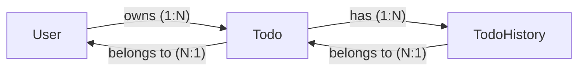
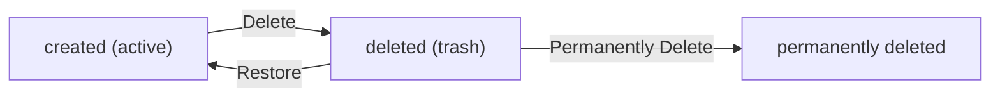

**todoApp — Business concepts, relationships, and states from user perspective**

Business concepts, relationships, and states from user perspective

# Domain Concepts

Describe what each concept means to users and why it exists.

## User Concept

A User is an individual who creates and manages their personal todo list within the application. Each user registers with an email address and password to establish their account. Users log in with their credentials to access their private todo data. Once authenticated, users can view, create, edit, and delete their todos. Users maintain a profile that includes a display name, which they can update at any time. The display name helps users identify themselves within the application interface. Account deletion is available as a final option, which permanently removes the user and all associated data. When a user deletes their account, all todos including those in the trash are permanently erased. Users cannot view or access other users' profiles or todo lists, ensuring complete privacy. The application treats each user's data as entirely separate and inaccessible to others. Users control their own authentication credentials and can change their password when needed.

### User Registration

WHEN a new user registers for the application, THE system SHALL:
1. Require a valid email address
2. Require a password for authentication
3. Ensure the email address is unique across all users
4. Create a new user account with the provided credentials
5. Generate a unique user identifier
6. Record the account creation timestamp

IF the email address is already registered, THE system SHALL reject the registration request.
IF the email format is invalid, THE system SHALL reject the registration request.
IF the password does not meet security requirements, THE system SHALL reject the registration request.
IF required fields are missing, THE system SHALL reject the registration request.

THE system SHALL store the user account in a pending authenticated state until login is completed.

### Login Authentication

WHEN a user attempts to log in, THE system SHALL:
1. Verify the provided email address exists in the system
2. Verify the provided password matches the stored credentials
3. Grant access to the user's private data upon successful authentication
4. Establish an authenticated session for the user
5. Record the login timestamp

IF the email address does not exist, THE system SHALL deny access.
IF the password does not match, THE system SHALL deny access.
IF the account has been deleted, THE system SHALL deny access.

WHILE a user is authenticated, THE system SHALL maintain session state for accessing their private todo data.

THE system SHALL prevent access to any user data without valid authentication credentials.

### Password Management

WHEN a user changes their password, THE system SHALL:
1. Require the user to be authenticated
2. Require verification of the current password
3. Require a new password that meets security requirements
4. Update the password upon successful verification
5. Invalidate any existing sessions for security

IF the current password is incorrect, THE system SHALL reject the password change request.
IF the new password does not meet security requirements, THE system SHALL reject the password change request.
IF the user is not authenticated, THE system SHALL reject the password change request.

THE system SHALL enforce password security requirements to protect user credentials.
THE system SHALL ensure the new password differs from the current password.

### Display Name Profile

WHEN a user views their profile, THE system SHALL display their display name.

WHEN a user edits their profile, THE system SHALL:
1. Require the user to be authenticated
2. Allow updating the display name
3. Validate the display name meets length requirements
4. Save the updated display name

IF the display name exceeds the maximum length, THE system SHALL reject the update.
IF the display name is empty, THE system SHALL reject the update.
IF the user is not authenticated, THE system SHALL reject the profile edit request.

THE system SHALL allow users to customize their display name at any time.
THE system SHALL persist profile changes immediately upon successful update.

### Account Deletion

WHEN a user requests account deletion, THE system SHALL:
1. Require the user to be authenticated
2. Require confirmation of the deletion request
3. Permanently delete all user data including todos in trash
4. Permanently delete all edit history associated with user todos
5. Remove the user account from the system
6. Record the account deletion timestamp

IF the user does not confirm the deletion, THE system SHALL not proceed.
IF the user is not authenticated, THE system SHALL reject the deletion request.

THE system SHALL ensure all associated data is permanently removed upon account deletion.
THE system SHALL prevent any recovery of deleted account data.
THE system SHALL notify the user of successful account termination.

Account deletion is irreversible and removes all personal data permanently.

### User Privacy and Data Isolation

THE system SHALL ensure each user's data is completely private and isolated from all other users.

WHEN a user accesses the system, THE system SHALL:
1. Only display todos belonging to the authenticated user
2. Prevent access to any other user's todos
3. Prevent viewing of other users' profiles
4. Enforce data isolation at all access points

IF a user attempts to access another user's data, THE system SHALL deny the request.

THE system SHALL treat each user's data as entirely separate and inaccessible to others.
THE system SHALL maintain personal data ownership for each user.

Users cannot view, access, or share another user's todos or profile information.

THE system SHALL enforce strict privacy boundaries between all user accounts.
THE system SHALL ensure data privacy is maintained throughout the user lifecycle.

## Todo Concept

A Todo is a task item that users create to track things they need to accomplish. Each todo has a required title that identifies the task, and an optional description for additional details. Users can optionally set a start date and due date to schedule their tasks. When first created, todos are marked as incomplete by default. Users can toggle the completion status at any time to mark tasks as done or undone. The todo list displays all user's todos with key information visible at a glance. Users can filter their todo list to show all tasks, only completed ones, or only incomplete ones. Sorting options allow users to organize their list by creation date, start date, or due date. Todos without dates appear at the end when sorting by those date fields. Users can view a single todo to see its complete details including the full description. Todo ownership is strict, meaning users can only access their own todos. Deleted todos are moved to trash rather than permanently removed immediately. Users can restore deleted todos from trash back to their active list. The todo concept represents the core task management functionality of the application.

### Todo Creation

WHEN a user creates a todo, THE system SHALL:
1. Require a title to be provided
2. Allow an optional description to be added
3. Allow optional start date to be set for task planning
4. Allow optional due date to be set for task scheduling
5. Mark the todo as incomplete by default
6. Associate the todo with the creating user

IF the title is not provided, THE system SHALL reject the todo creation request.

THE system SHALL record the creation timestamp for each todo.

THE system SHALL ensure the created todo is visible only to its owner (defined in Todo Privacy section).

### Todo List View and Organization

WHEN a user views their todo list, THE system SHALL:
1. Display all todos belonging to the user
2. Show each todo's title in the list view
3. Display completion status for each todo
4. Show start date when it is set
5. Show due date when it is set
6. Display creation date for each todo
7. Paginate the todo list results

THE system SHALL allow users to filter their todo list by completion status:
- All todos (both complete and incomplete)
- Only complete todos
- Only incomplete todos

THE system SHALL allow users to sort their todo list by:
- Creation date (newest first or oldest first)
- Start date (earliest first or latest first)
- Due date (earliest first or latest first)

WHEN sorting by start date, THE system SHALL place todos without a start date at the end of the list.

WHEN sorting by due date, THE system SHALL place todos without a due date at the end of the list.

### Single Todo Details View

WHEN a user views a single todo, THE system SHALL:
1. Display the full title of the todo
2. Display the complete description if one exists
3. Show the start date if it is set
4. Show the due date if it is set
5. Display the completion status
6. Show the creation date
7. Indicate the current owner of the todo

THE system SHALL only display the single todo details to its owner.

IF the user is not the owner of the todo, THE system SHALL deny access to the single todo details (defined in Todo Privacy section).

### Completion Status Toggle

WHEN a user toggles a todo's completion status, THE system SHALL:
1. Change the status from incomplete to complete, or from complete to incomplete
2. Preserve all other todo properties (title, description, dates)
3. Record the status change in the todo's edit history (defined in TodoHistory Concept section)

THE system SHALL allow toggling completion status for todos in the active list.

THE system SHALL allow toggling completion status for todos in the trash before permanent deletion.

### Soft Delete Operation

WHEN a user deletes a todo, THE system SHALL:
1. Move the todo to the user's trash (soft delete)
2. Remove the todo from the normal todo list view
3. Preserve all todo data including title, description, dates, and completion status
4. Record the deletion in the todo's edit history (defined in TodoHistory Concept section)
5. Retain the edit history associated with the todo

THE system SHALL NOT permanently remove the todo data at this stage.

### Trash Management and Restoration

WHEN a user views their trash, THE system SHALL:
1. Display all soft-deleted todos belonging to the user
2. Paginate the trash list results
3. Show each deleted todo's title, deletion status, and key metadata

WHEN a user restores a todo from trash, THE system SHALL:
1. Return the todo to the user's active todo list
2. Preserve all todo data including title, description, dates, and completion status
3. Remove the todo from the trash view
4. Record the restoration in the todo's edit history (defined in TodoHistory Concept section)

WHEN a user permanently deletes a todo from trash, THE system SHALL:
1. Permanently remove the todo and all its data
2. Permanently delete the associated edit history (defined in TodoHistory Concept section)
3. Ensure the todo cannot be recovered

### Task Ownership and Privacy

THE system SHALL enforce strict task ownership for all todos.

THE system SHALL ensure each todo belongs to exactly one user.

THE system SHALL prevent users from accessing todos owned by other users.

THE system SHALL prevent users from viewing, accessing, or sharing another user's todos.

THE system SHALL enforce privacy at all access points including list views, single todo views, filtering, and sorting operations.

IF a user attempts to access a todo not owned by them, THE system SHALL deny the request.

THE system SHALL ensure todos are completely private to their owner throughout the entire task lifecycle from creation to permanent deletion.

## TodoHistory Concept

TodoHistory is a record of all changes made to a todo item over time. Every time a user edits a todo, a new history entry is automatically created. Each history entry captures the timestamp of when the edit occurred. The entry records what values changed for title, description, start date, and due date. Only the fields that were actually modified are recorded in each history entry. Users can view the complete edit history for any of their todos. The history list is sorted with the most recent changes appearing first. This audit trail helps users track how their tasks have evolved over time. History entries are tied to the specific todo they document. When a todo is permanently deleted from trash, its entire history is also removed. Users cannot view the edit history of todos they do not own. The history feature provides transparency and accountability for task modifications. It allows users to understand the progression of their task details. TodoHistory supports the application's commitment to maintaining data integrity and user control.

### Edit History Tracking

THE system SHALL automatically create a history entry whenever a user modifies any field of their todo.

WHEN a user edits a todo's title, THE system SHALL record the new title value in the history entry.
WHEN a user edits a todo's description, THE system SHALL record the new description value in the history entry.
WHEN a user edits a todo's start date, THE system SHALL record the new start date value in the history entry.
WHEN a user edits a todo's due date, THE system SHALL record the new due date value in the history entry.

IF a user modifies multiple fields in a single edit operation, THE system SHALL record all changed fields in one history entry.
IF a user modifies only one field, THE system SHALL record only that field's change in the history entry.

THE system SHALL NOT create history entries for todo creation, only for subsequent edits.
THE system SHALL NOT create history entries when a todo is marked complete or incomplete.

Every todo owned by a user SHALL have an associated edit history that tracks all modifications.
The edit history provides a complete audit trail of how a task has evolved over time.

THE system SHALL maintain the integrity of the edit history as long as the todo exists.
THE system SHALL ensure that each history entry accurately reflects the changes made at the time of editing.

### History Entry Creation

WHEN a user saves changes to a todo, THE system SHALL create a new history entry immediately.

THE system SHALL record the exact timestamp when each edit occurred in the history entry.
THE system SHALL record which fields were modified in each history entry.
THE system SHALL record the new values for each modified field in the history entry.

IF a field is not changed during an edit, THE system SHALL NOT include that field in the history entry.
IF a field is changed from a value to a new value, THE system SHALL document both the change and the new value.

THE system SHALL generate a unique history entry for each save operation on a todo.
THE system SHALL ensure that history entries are created atomically with the todo update.

Each history entry SHALL capture the complete state of what changed during that specific edit.
The documentation of field changes SHALL be sufficient to understand what was modified.

THE system SHALL prevent history entries from being created without an actual field change.
THE system SHALL prevent duplicate history entries from being created for the same edit operation.

### History Viewing and Access

WHEN a user requests to view the edit history of a todo, THE system SHALL display all history entries for that todo.

THE system SHALL allow users to view the full edit history of any todo they own.
THE system SHALL NOT allow users to view the edit history of todos owned by other users.
THE system SHALL NOT allow guests to view any edit history.

IF a user attempts to access another user's todo history, THE system SHALL deny the request.
IF a user attempts to access a deleted todo's history, THE system SHALL deny the request unless the todo is in their trash.

THE system SHALL display the complete audit log for todos in the user's active list.
THE system SHALL display the complete audit log for todos in the user's trash.

History access SHALL be restricted to the todo owner only, ensuring privacy of modification records.
THE system SHALL enforce ownership verification before granting access to any history data.

THE system SHALL provide clear indication when a history is empty (no edits have been made).
THE system SHALL ensure that history viewing does not expose any information about other users' todos.

### History Sorting and Display

THE system SHALL display history entries sorted from most recent to oldest by default.

WHEN a user views the edit history, THE system SHALL present entries with the newest changes first.
THE system SHALL maintain consistent sorting order across all history view requests.

THE system SHALL show the edit timestamp prominently in each history entry.
THE system SHALL display which fields were changed in each history entry.
THE system SHALL show the new values for each changed field in each history entry.

THE edit history SHALL help users understand the progression and evolution of their task details.
THE system SHALL present history in a way that makes it easy to track how tasks have changed over time.

Each history entry SHALL be clearly distinguishable from other entries in the list.
THE system SHALL ensure that the chronological order of changes is preserved and visible.

THE system SHALL format timestamps in a user-friendly manner while maintaining accuracy.
THE system SHALL ensure that the history display supports the user's ability to review past modifications.

### History Lifecycle and Deletion

WHEN a user permanently deletes a todo from trash, THE system SHALL also permanently delete all associated history entries.

THE system SHALL cascade permanent deletion from todo to its entire edit history.
THE system SHALL NOT retain any history entries after a todo is permanently deleted.

IF a todo is restored from trash, THE system SHALL restore its complete edit history as well.
IF a todo is soft deleted (moved to trash), THE system SHALL retain its history entries.

THE system SHALL ensure that history data is retained only while the associated todo exists.
THE system SHALL prevent orphaned history entries from existing without their parent todo.

THE system SHALL ensure that permanent deletion of history is irreversible.
THE system SHALL provide no mechanism to recover permanently deleted history entries.

History entries SHALL provide transparency and accountability for all task modifications.
THE system SHALL ensure that users understand that permanent deletion removes all modification records.

THE ownership of history entries SHALL always match the ownership of their associated todo.
THE system SHALL prevent users from accessing history entries of todos they do not own, even after deletion.

THE system SHALL maintain data integrity between todos and their history throughout all lifecycle operations.
THE system SHALL ensure that history retention policies align with todo retention policies.

# Domain Relationships

Describe how concepts relate to each other from a business perspective.

## Conceptual Relationships

Describe how concepts relate to each other in business terms.

### Entity Ownership and Associations

### User-Todo Ownership

THE system SHALL enforce that each Todo belongs to exactly one User.

WHEN a User creates a Todo, THE system SHALL associate the Todo with that User as the owner.

WHEN a User is deleted, THE system SHALL permanently delete all Todos owned by that User.

IF a User attempts to access a Todo, THE system SHALL verify that the Todo belongs to that User.

IF a Todo does not belong to the requesting User, THE system SHALL deny access to the Todo.

THE system SHALL ensure that a Todo cannot be transferred to another User.

THE system SHALL ensure that a Todo cannot exist without an owning User.

### Todo-History Association

THE system SHALL maintain an association between each Todo and its edit history.

WHEN a Todo is edited, THE system SHALL create a new history entry associated with that Todo.

WHEN a Todo is permanently deleted, THE system SHALL delete all history entries associated with that Todo.

THE system SHALL ensure that each history entry belongs to exactly one Todo.

THE system SHALL ensure that history entries cannot exist without an associated Todo.

### Data Isolation and Privacy

THE system SHALL ensure that Users can only access Todos they own.

THE system SHALL prevent Users from viewing or accessing Todos owned by other Users.

THE system SHALL prevent Users from viewing other Users' profiles.

THE system SHALL ensure that Todo ownership cannot be changed after creation.

THE system SHALL enforce that all Todo operations require ownership verification.

THE system SHALL ensure that history entries are only accessible to the Todo owner.

### Ownership Lifecycle Rules

### User Ownership Rules

THE system SHALL ensure that each User owns zero or more Todos.

WHEN a User account is deleted, THE system SHALL cascade deletion to all owned Todos and their history.

THE system SHALL ensure that a User's Todos remain private to that User.

THE system SHALL prevent any User from modifying another User's Todos.

THE system SHALL ensure that ownership is established at Todo creation and immutable thereafter.

### Todo Relationship Rules

THE system SHALL ensure that each Todo belongs to exactly one User.

THE system SHALL ensure that each Todo has zero or more history entries.

WHEN a Todo is created, THE system SHALL automatically associate it with the creating User.

WHEN a Todo is soft-deleted, THE system SHALL retain ownership for potential restoration.

WHEN a Todo is restored from trash, THE system SHALL preserve the original ownership.

### History Relationship Rules

THE system SHALL ensure that each history entry belongs to exactly one Todo.

THE system SHALL ensure that history entries inherit privacy from their parent Todo.

WHEN a Todo is permanently deleted, THE system SHALL delete all associated history entries.

THE system SHALL prevent history entries from being accessed without Todo ownership.

THE system SHALL ensure that history entries cannot be transferred to another Todo.

THE system SHALL ensure that history entries cannot exist independently of their Todo.

## Lifecycle and Retention

Describe business rules for concept lifecycle and data retention from a user perspective.

### Todo Lifecycle States

THE todo lifecycle consists of three states: active, deleted (in trash), and permanently deleted.

WHEN a todo is created, THE system SHALL set its initial state to active.

WHEN a user deletes an active todo, THE system SHALL transition it to the deleted state and move it to the trash.

WHEN a user restores a deleted todo from the trash, THE system SHALL transition it back to the active state.

WHEN a user permanently deletes a todo from the trash, THE system SHALL transition it to the permanently deleted state.

WHILE a todo is in the active state, THE system SHALL include it in the normal todo list.

WHILE a todo is in the deleted state, THE system SHALL exclude it from the normal todo list and include it only in the trash view.

WHILE a todo is in the permanently deleted state, THE system SHALL not include it in any user-visible list.

### Trash Management

Deleted todos are moved to the trash rather than being immediately removed from the system.

WHEN a user deletes a todo, THE system SHALL mark it as deleted and move it to the trash.

WHEN a todo is in the trash, THE system SHALL retain all its data including title, description, dates, completion status, and edit history.

WHEN a user views the trash, THE system SHALL display all todos in the deleted state for that user.

THE trash list SHALL be paginated to handle large numbers of deleted todos.

WHEN a todo is deleted, THE system SHALL record the deletion timestamp.

WHEN a todo is in the trash, THE system SHALL allow the user to view its full details including edit history.

IF a user attempts to access a deleted todo from the normal list, THE system SHALL reject the request as the todo is not visible in that context.

### Permanent Deletion Rules

Permanent deletion removes a todo and its associated data irreversibly from the system.

WHEN a user permanently deletes a todo from the trash, THE system SHALL remove the todo and all its edit history.

WHEN a user deletes their account, THE system SHALL permanently delete all todos belonging to that user, including todos in the trash.

WHEN a todo is permanently deleted, THE system SHALL also permanently delete all associated edit history entries.

IF a todo is permanently deleted, THE system SHALL make recovery impossible.

THE system SHALL NOT provide any mechanism to recover a permanently deleted todo.

WHEN permanent deletion occurs, THE system SHALL ensure the operation completes atomically - either all data is removed or none is.

### Todo Recovery Process

Users can restore deleted todos from the trash to return them to active status.

WHEN a user requests to restore a deleted todo, THE system SHALL verify the todo belongs to the requesting user and is in the deleted state.

WHEN a todo is restored from the trash, THE system SHALL transition it to the active state and make it visible in the normal todo list.

WHEN a todo is restored, THE system SHALL preserve all its original data including title, description, dates, completion status, and edit history.

WHEN a todo is restored, THE system SHALL update its visibility to include it in the normal todo list again.

IF the requested todo does not exist, THE system SHALL reject the restore request.

IF the requested todo is not in the deleted state, THE system SHALL reject the restore request.

IF the requesting user does not own the todo, THE system SHALL reject the restore request.

### Data Retention Policy

The system maintains data retention policies for active and deleted todos.

WHILE a todo is in the active state, THE system SHALL retain all data indefinitely until the user deletes it or their account.

WHILE a todo is in the deleted state (trash), THE system SHALL retain all data indefinitely until the user permanently deletes it or their account.

WHEN a user deletes their account, THE system SHALL permanently delete all associated data including todos, trash contents, and edit history.

THE system SHALL NOT automatically purge todos from the trash based on time or other criteria.

THE system SHALL retain edit history for as long as the associated todo exists in any state.

WHEN a todo is permanently deleted, THE system SHALL immediately purge all associated data from storage.

# Enums and State Machines

Enum type definitions and state transitions.

## Enum Definitions

Define all enum types with their allowed values and descriptions.

### Todo Completion Status

THE system SHALL support two completion statuses for todos: "incomplete" and "complete".

WHEN a user creates a new todo, THE system SHALL set its status to "incomplete" by default.

WHEN a user marks a todo as complete, THE system SHALL change its status from "incomplete" to "complete".

WHEN a user marks a todo as incomplete, THE system SHALL change its status from "complete" to "incomplete".

THE system SHALL treat completion status as a simple toggle between two states.

WHEN viewing a todo list, THE system SHALL display the completion status for each todo.

WHEN filtering todos by completion status, THE system SHALL allow selection of:
- All todos (regardless of completion status)
- Only incomplete todos
- Only complete todos

IF a user attempts to filter by an unsupported completion status, THE system SHALL reject the request.

WHEN a todo is restored from trash, THE system SHALL preserve its completion status.

WHEN a todo is permanently deleted, THE system SHALL remove its completion status along with all other todo data.

### Todo Deletion Status

THE system SHALL support two deletion statuses for todos: "active" and "deleted".

WHEN a user creates a todo, THE system SHALL set its deletion status to "active" by default.

WHEN a user deletes a todo, THE system SHALL change its deletion status from "active" to "deleted".

WHEN a user restores a todo from trash, THE system SHALL change its deletion status from "deleted" to "active".

WHEN a user permanently deletes a todo from trash, THE system SHALL remove the todo and all its associated data.

THE system SHALL hide todos with "deleted" status from the normal todo list.

THE system SHALL display todos with "deleted" status in the trash view.

WHEN a user deletes their account, THE system SHALL permanently delete all todos regardless of their deletion status.

IF a user attempts to access a todo with "deleted" status from the normal list, THE system SHALL not return the todo.

IF a user attempts to restore a todo that does not exist in trash, THE system SHALL reject the request.

### User Account Status

THE system SHALL support two deletion statuses for user accounts: "active" and "deleted".

WHEN a user registers a new account, THE system SHALL set their deletion status to "active" by default.

WHEN a user deletes their account, THE system SHALL change their deletion status from "active" to "deleted".

WHEN a user account has "deleted" status, THE system SHALL permanently remove all todos and edit history associated with that user.

THE system SHALL prevent login attempts for users with "deleted" status.

IF a user attempts to access the system with a "deleted" account, THE system SHALL reject the authentication request.

WHEN a user account is deleted, THE system SHALL not allow recovery of the account or its data.

### Edit History Status

THE system SHALL support a single enumeration type for edit history entries: "change recorded".

WHEN a user edits a todo, THE system SHALL create a new edit history entry with the "change recorded" status.

THE system SHALL record the timestamp of each edit in the history entry.

THE system SHALL record which fields were changed in each history entry (title, description, start date, due date).

WHEN a user views edit history, THE system SHALL display entries sorted from most recent to oldest.

WHEN a todo is permanently deleted, THE system SHALL remove all associated edit history entries.

WHEN a user restores a todo from trash, THE system SHALL preserve all edit history entries associated with that todo.

IF a user attempts to view edit history for a non-existent todo, THE system SHALL reject the request.

IF a user attempts to view edit history for a todo they do not own, THE system SHALL reject the request.

## State Transitions

Define valid state transition paths for stateful concepts.

### Todo State Transitions

### Todo Completion State Machine

THE system SHALL maintain exactly two completion states for todos: incomplete and complete.

WHEN a user creates a new todo, THE system SHALL set its completion state to incomplete by default.

WHEN a user marks an incomplete todo as complete, THE system SHALL update its state to complete.

WHEN a user marks a complete todo as incomplete, THE system SHALL update its state to incomplete.

THE system SHALL treat completion state changes as a simple toggle between the two states.

IF a user attempts to mark a todo as complete or incomplete, THE system SHALL record this change in the todo's edit history with a timestamp.

### Todo Deletion Workflow

WHEN a user deletes an active todo, THE system SHALL move it to the trash using soft deletion.

THE system SHALL preserve all todo data including title, description, dates, completion status, and edit history when soft deleting.

WHILE a todo is in the trash (soft deleted), THE system SHALL exclude it from the normal active todo list.

THE system SHALL maintain a separate trash view that displays all soft-deleted todos belonging to the user.

THE trash list SHALL be paginated to handle large numbers of deleted todos.

### Todo Restoration and Permanent Deletion

WHEN a user restores a deleted todo from the trash, THE system SHALL return it to the active todo list with all its original data intact.

THE restored todo SHALL retain its completion status, dates, and edit history from before deletion.

WHEN a user permanently deletes a todo from the trash, THE system SHALL remove the todo and all its associated edit history.

THE system SHALL NOT allow recovery of a permanently deleted todo once the deletion is confirmed.

IF a user permanently deletes a todo, THE system SHALL immediately release all associated data including the edit history entries.

### State Transition Validation Rules

### Completion Status Change Rules

THE system SHALL allow completion status changes only for todos that belong to the requesting user.

IF a user attempts to change the completion status of a todo they do not own, THE system SHALL reject the request.

IF a user attempts to change the completion status of a deleted (soft-deleted) todo, THE system SHALL reject the request.

THE system SHALL record every completion status change in the todo's edit history, including the previous and new state.

### Deletion and Restoration Constraints

THE system SHALL prevent deletion of todos that do not exist or do not belong to the user.

WHEN a user deletes a todo, THE system SHALL ensure it remains accessible in the trash until permanently deleted or restored.

THE system SHALL prevent restoration of todos that have been permanently deleted.

IF a user attempts to restore a todo that does not exist in their trash, THE system SHALL reject the request.

### Permanent Deletion Impact

WHEN a todo is permanently deleted from the trash, THE system SHALL cascade delete all associated edit history entries.

THE system SHALL NOT allow permanent deletion of todos that do not exist or do not belong to the user.

IF a user deletes their entire account, THE system SHALL permanently delete all their todos including those in trash, along with all edit history.

THE permanent deletion of todos SHALL be irreversible and cannot be undone by the user or system administrators.