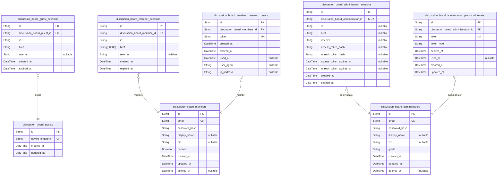
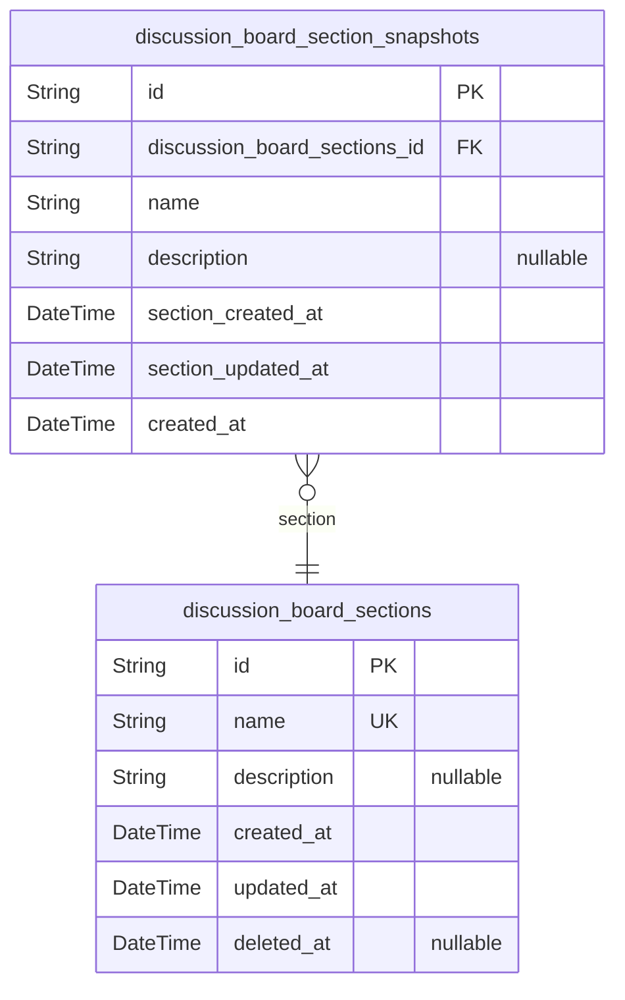
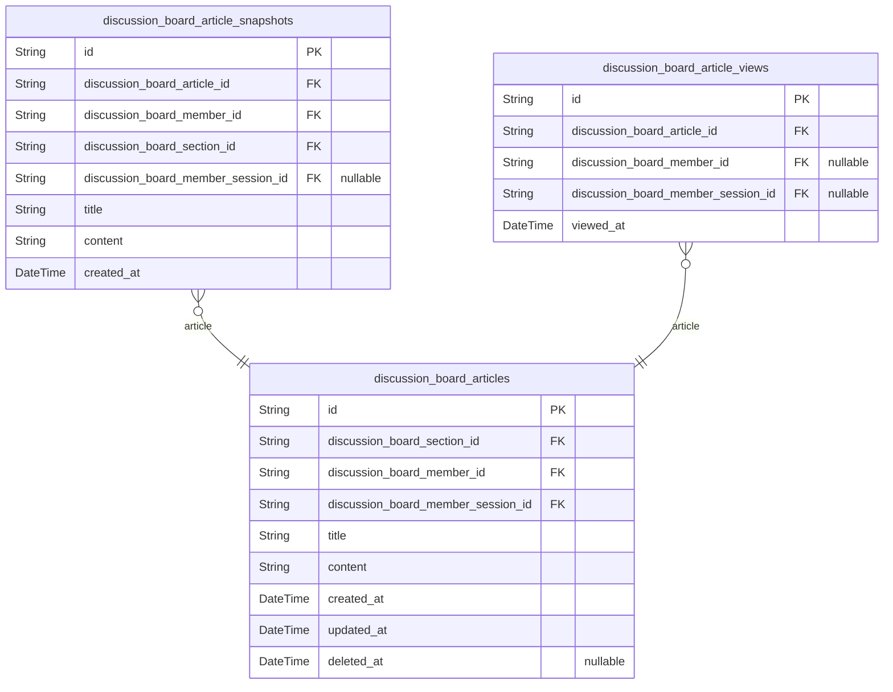
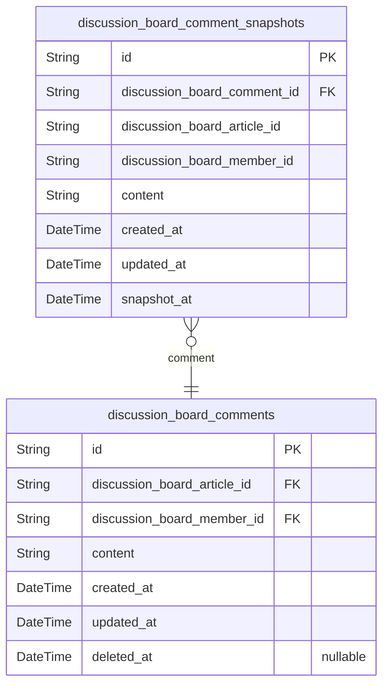
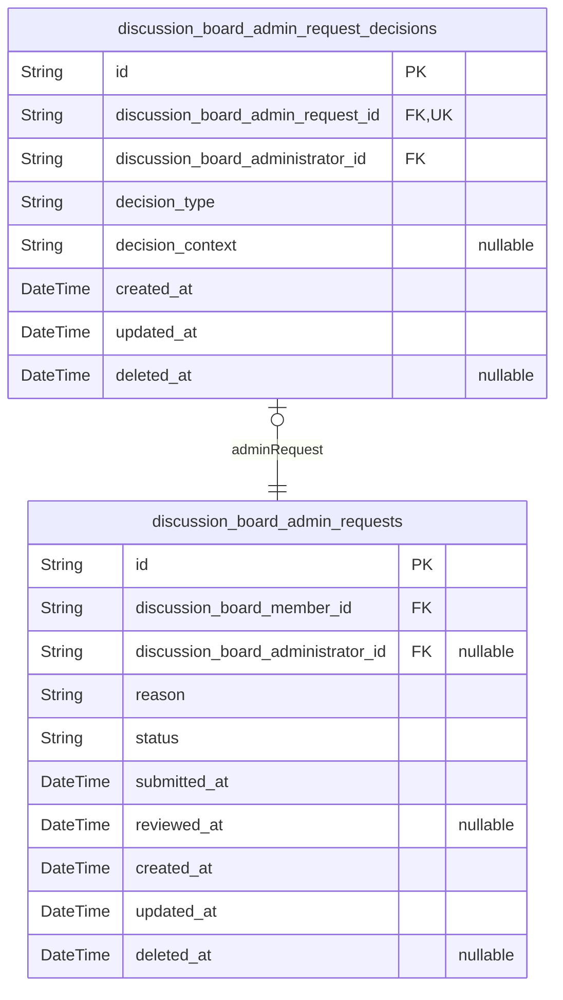
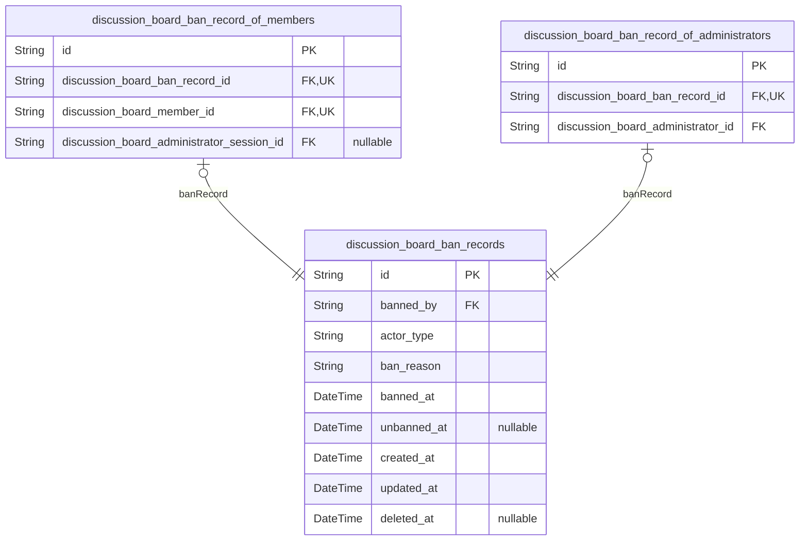
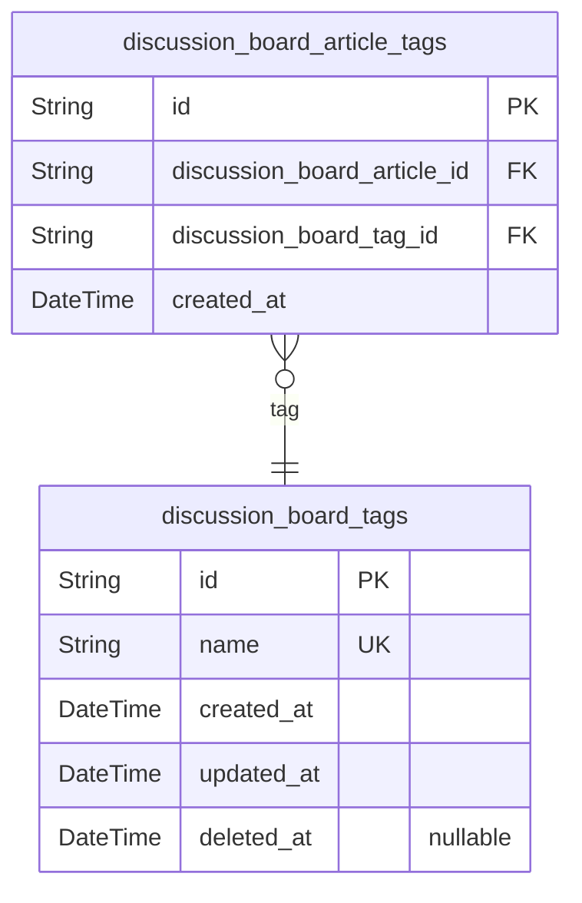

# Prisma Markdown

> Generated by [`prisma-markdown`](https://github.com/samchon/prisma-markdown)

- [Actors](#actors)
- [Sections](#sections)
- [Articles](#articles)
- [Comments](#comments)
- [AdminRequests](#adminrequests)
- [BanRecords](#banrecords)
- [Tags](#tags)

## Actors

### `discussion_board_guests`

Temporary guest accounts for anonymous platform access. Guests browse
sections and view public articles without registration. Identified by
device fingerprint for session continuity across page loads. No
authentication required, but actions are attributed to the device for
basic personalization and rate limiting.

Properties as follows:

- `id`: Primary Key.
- `device_fingerprint`
  > Unique device identifier (browser fingerprint, user-agent, or similar)
  > that identifies this guest across requests.
- `created_at`: Timestamp when this guest identity was first created.
- `updated_at`: Timestamp when this guest record was last modified.

### `discussion_board_guest_sessions`

Temporary session tokens for guest access without authentication
credentials.

This table tracks login sessions for guest actors identified by device
fingerprint. Each session stores connection metadata (IP address, current
URL, referrer) and temporal information for session lifecycle management.
Sessions are created when a guest authenticates and terminated on logout
or expiration.

**Key Relationships**:
- Belongs to [discussion_board_guests](#discussion_board_guests) - one-to-many relationship
where a guest can have multiple sessions over time (but only one active
at a time per session lifecycle requirements)
- Session tokens are used for JWT-based authentication
- Connection metadata supports security auditing and abuse detection

**Behavioral Notes**:
- Sessions expire after configured timeout (30 minutes inactivity)
- New login terminates existing session (one active session per guest)
- Append-only table - sessions are never updated, only created and
logically expired
- Used for tracking guest access patterns and security monitoring

Properties as follows:

- `id`: Primary Key.
- `discussion_board_guest_id`
  > Belonged guest's [discussion_board_guests.id](#discussion_board_guests). References the guest
  > account this session belongs to.
- `ip`
  > IP address of the client device when the session was created. Used for
  > security auditing and abuse detection.
- `href`
  > Current URL (href) of the page when the session was created. Tracks the
  > entry point for the session.
- `referrer`
  > Referrer URL that led to the session creation. Used for tracking traffic
  > sources and security analysis.
- `created_at`
  > Timestamp when the session was created. Used for session expiration
  > calculation and audit trail.
- `expired_at`
  > Timestamp when the session expires. NOT NULL for security - ensures all
  > sessions have a defined expiration time.

### `discussion_board_members`

Registered member accounts with email and password authentication
credentials.

Members are authenticated users who can create articles, write comments,
manage their profile, submit administrator requests, and participate in
community discussions. Each member has a unique email address for login,
a hashed password for security, and optional profile information
including display name and bio.

Members can be banned by administrators, which prevents login while
preserving their existing content. When a member deletes their account,
all their articles and comments are also deleted. Members can request to
become administrators through the admin request system.

Key relationships:
- Owns [discussion_board_articles](#discussion_board_articles) - articles created by the member
- Owns [discussion_board_comments](#discussion_board_comments) - comments written by the member
- Owns [discussion_board_admin_requests](#discussion_board_admin_requests) - admin privilege requests
submitted by the member
- Subject of [discussion_board_ban_records](#discussion_board_ban_records) - ban actions applied
to the member
- Has [discussion_board_member_sessions](#discussion_board_member_sessions) - active authentication
sessions
- Has [discussion_board_member_password_resets](#discussion_board_member_password_resets) - password reset
tokens

Properties as follows:

- `id`: Primary Key.
- `email`: Unique email address used for member authentication and login.
- `password_hash`
  > Hashed password for member authentication. Never store plain text
  > passwords.
- `display_name`: Public display name shown on articles, comments, and profile pages.
- `bio`: Optional biographical text displayed on the member's profile page.
- `banned`: Whether the member account is currently banned and cannot log in.
- `created_at`: Timestamp when the member account was created.
- `updated_at`: Timestamp when the member account was last updated.
- `deleted_at`
  > Timestamp when the member account was soft deleted. Null means account is
  > active.

### `discussion_board_member_sessions`

JWT session tokens for member authentication with access and refresh
token support. Tracks active login sessions for member accounts,
recording connection metadata and temporal boundaries for security
auditing and session management.

Properties as follows:

- `id`: Primary Key.
- `discussion_board_member_id`
  > Reference to the authenticated member account. {@link
  > discussion_board_members.id}
- `ip`: IP address of the client device during session creation.
- `href`: URL of the page that initiated the authentication flow.
- `referrer`: HTTP referrer header from the authentication request.
- `created_at`: Timestamp when this session was created.
- `expired_at`: Timestamp when this session token expires.

### `discussion_board_member_password_resets`

Stores time-limited, single-use tokens for member account password
recovery. Each record represents a password reset request with an
expiring token that can be used exactly once to verify identity and allow
password change without requiring current credentials.

Properties as follows:

- `id`: Primary Key.
- `discussion_board_members_id`
  > References the member account requesting the password reset. Links to
  > [discussion_board_members.id](#discussion_board_members).
- `token`: Cryptographically secure random token for password reset verification.
- `created_at`: Timestamp when the password reset request was initiated.
- `expired_at`: Timestamp when this password reset token expires.
- `used_at`
  > Timestamp when the token was successfully used. Remains null if token is
  > still valid and unused.
- `user_agent`
  > User agent string from the original password reset request for security
  > auditing.
- `ip_address`: IP address from the original password reset request for security auditing.

### `discussion_board_administrators`

Administrator accounts with email and password authentication and
elevated privileges.

This table stores administrator user accounts with authentication
credentials and privilege levels. Administrators have two grades: regular
administrator and super administrator. Super administrators have the
authority to promote/demote other administrators and manage section
organization.

Key relationships:
- Owns `discussion_board_ban_records` for user suspension actions
- Manages `discussion_board_sections` for content organization
- Reviews `discussion_board_admin_requests` for privilege escalations
- Owns `discussion_board_administrator_sessions` for active login sessions

Properties as follows:

- `id`: Primary Key.
- `email`: Unique email address for administrator authentication.
- `password_hash`: Password hash for administrator authentication.
- `display_name`: Display name shown in the interface.
- `bio`: Short biographical text for the administrator profile.
- `grade`: Administrator grade: 'regular' or 'super'.
- `created_at`: Timestamp when the administrator account was created.
- `updated_at`: Timestamp of the last modification to this record.
- `deleted_at`: Timestamp when the account was logically deleted (soft delete).

### `discussion_board_administrator_sessions`

JWT session tokens for administrator authentication with access and
refresh token support.

This table tracks active login sessions for administrators, storing
connection metadata, JWT token hashes, and expiration information. Each
administrator can have only one active session at a time, ensuring secure
single-device access.

Key relationships:
- References [discussion_board_administrators](#discussion_board_administrators) to associate the
session with the authenticated administrator
- Uses unique constraint on administrator_id to enforce single active
session policy

Security features:
- Stores token hashes instead of raw tokens for security
- Tracks access token (15-minute expiration) and refresh token (7-day
expiration)
- Records connection metadata (IP, href, referrer) for audit trail
- expired_at field indicates session termination (logout, expiration, or
forced invalidation)

Properties as follows:

- `id`: Primary Key.
- `discussion_board_administrator_id`
  > Belonged administrator's [discussion_board_administrators.id](#discussion_board_administrators).
  > Enforces one active session per administrator.
- `ip`
  > IP address from which the administrator logged in. Used for security
  > auditing and session validation.
- `href`
  > URL or endpoint where the administrator initiated the session. Used for
  > tracking session origin.
- `referrer`
  > Referrer URL that led to the authentication page. Used for security
  > analysis and audit trail.
- `access_token_hash`
  > Hash of the access token (15-minute expiration). Stored as hash for
  > security, not the raw token.
- `refresh_token_hash`
  > Hash of the refresh token (7-day expiration). Stored as hash for
  > security, enables token refresh without re-authentication.
- `access_token_expires_at`
  > Expiration timestamp for the access token. Typically 15 minutes from
  > session creation.
- `refresh_token_expires_at`
  > Expiration timestamp for the refresh token. Typically 7 days from session
  > creation.
- `created_at`
  > Timestamp when the session was created. Records the login time for audit
  > purposes.
- `expired_at`
  > Timestamp when the session was terminated. Set on logout, token
  > expiration, or forced invalidation. Null indicates active session.

### `discussion_board_administrator_password_resets`

Password reset tokens for administrator account recovery. Each record
represents a one-time, time-limited token sent to an administrator's
email for secure password recovery. The token is single-use and expires
after a short period for security. When a token is used, it is marked as
consumed and cannot be reused.

Properties as follows:

- `id`: Primary Key.
- `discussion_board_administrators_id`
  > Reference to the administrator account requesting the password reset.
  > [discussion_board_administrators.id](#discussion_board_administrators)
- `token`
  > Cryptographically secure random token sent to administrator email for
  > identity verification during password reset flow.
- `token_type`
  > Type of token operation. Distinguishes between 'password-reset' and other
  > potential token types for extensibility.
- `expires_at`
  > Timestamp when this password reset token expires for security. Tokens are
  > time-limited to prevent replay attacks.
- `used_at`
  > Timestamp when this token was redeemed for password reset. Null if not
  > yet used, set to current time when token is consumed.
- `created_at`: Timestamp when this password reset token was generated.
- `updated_at`: Timestamp when this record was last modified.

## Sections

### `discussion_board_sections`

Organizational containers for grouping articles by topic within the
discussion board.

Sections serve as the primary categorization mechanism for articles,
allowing users to browse content by subject matter (e.g., Politics,
Economy, Current Affairs). Each section has a unique name and optional
description that explains its purpose and scope.

**Management**: Sections are created, edited, and deleted exclusively by
administrators. Regular users and guests can only view sections and
browse articles within them.

**Relationships**:
- One-to-many with [discussion_board_articles](#discussion_board_articles): Each section can
contain multiple articles, and each article belongs to exactly one
section.
- Managed by [discussion_board_administrators](#discussion_board_administrators): Only administrators
have permission to modify sections.

**Business Rules**:
- Section names must be unique across the entire board to prevent confusion.
- Sections cannot be deleted if they contain articles (referential
integrity).
- Section modifications are tracked in {@link
discussion_board_section_snapshots} for audit purposes.
- Soft delete is supported via `deleted_at` field to preserve historical
data.

Properties as follows:

- `id`: Primary Key.
- `name`
  > Unique name of the section used for identification and display. Must be
  > distinct from all other sections.
- `description`
  > Optional description explaining the section's purpose, scope, and
  > guidelines for content.
- `created_at`: Timestamp when the section was created.
- `updated_at`: Timestamp when the section was last modified.
- `deleted_at`
  > Timestamp when the section was soft deleted. Null indicates the section
  > is active.

### `discussion_board_section_snapshots`

Point-in-time snapshots of section modifications for audit trail and
revision history.

This table captures the complete state of a section at the moment of
modification, preserving historical data for compliance and audit
requirements. Each record represents a specific version of a section,
enabling version control, change tracking, and historical analysis of
section configurations.

Key characteristics:
- Immutable records: Once created, snapshots are append-only to maintain
an accurate audit trail
- Complete state capture: All section properties are denormalized to
preserve exact historical state
- Reference model: [discussion_board_sections](#discussion_board_sections)

Temporal field semantics:
- section_created_at: When the original section was created (from parent)
- section_updated_at: When the section was last modified before this
snapshot (from parent)
- created_at: When this snapshot was taken

Properties as follows:

- `id`: Primary Key.
- `discussion_board_sections_id`
  > Reference to the section being snapshot. {@link
  > discussion_board_sections.id}
- `name`: Name of the section at the time of snapshot.
- `description`: Description of the section at the time of snapshot.
- `section_created_at`: Timestamp when the original section was created (captured from parent).
- `section_updated_at`
  > Timestamp when the section was last modified before this snapshot
  > (captured from parent).
- `created_at`: Timestamp when this snapshot was created.

## Articles

### `discussion_board_articles`

Main entity storing article content for the discussion board platform.

Articles are the primary content units that users create, organize by
sections, and engage with through comments. Each article contains a title
and full text content, belongs to exactly one section, and is authored by
a registered member.

Key relationships:
- Belongs to a [discussion_board_sections](#discussion_board_sections) for organizational
categorization
- Owned by a [discussion_board_members](#discussion_board_members) who created it
- Created through a [discussion_board_member_sessions](#discussion_board_member_sessions) for audit trail
- Has many [discussion_board_comments](#discussion_board_comments) (handled in Comments component)
- Has many attachments (handled in Attachments component)
- Has many [discussion_board_tags](#discussion_board_tags) via junction table (handled in
Tags component)

Articles support soft deletion to preserve historical data while removing
from active listings. Administrators can delete any article regardless of
authorship for content moderation purposes.

Properties as follows:

- `id`: Primary Key.
- `discussion_board_section_id`
  > Belonged section's [discussion_board_sections.id](#discussion_board_sections). Every article
  > must be assigned to exactly one section for organizational
  > categorization.
- `discussion_board_member_id`
  > Author member's [discussion_board_members.id](#discussion_board_members). Tracks which
  > registered user created and owns this article.
- `discussion_board_member_session_id`
  > Creation session's [discussion_board_member_sessions.id](#discussion_board_member_sessions). Records
  > the authentication session used when creating the article for audit
  > purposes.
- `title`
  > Article title. Required field that identifies the article in listings and
  > search results.
- `content`
  > Full text content of the article. Required field containing the main body
  > text.
- `created_at`
  > Timestamp when the article was first created. Used for chronological
  > sorting and display.
- `updated_at`
  > Timestamp when the article was last modified. Updated on every edit
  > operation.
- `deleted_at`
  > Timestamp when the article was soft-deleted. Null indicates the article
  > is active. Used for soft deletion to preserve historical data.

### `discussion_board_article_snapshots`

Point-in-time snapshots of articles for audit trail and revision history.

This table captures the complete state of an article at specific moments
in time, enabling:

- **Audit Trail**: Track all modifications made to articles over time
- **Revision History**: View previous versions of article content
- **Accountability**: Maintain record of what content existed when

Each snapshot is created when an article is modified (title, content,
section assignment, or author changes). Snapshots are immutable
historical records that preserve the exact state of the article at the
time of capture.

**Key Relationships**:
- References [discussion_board_articles.id](#discussion_board_articles) as the parent article
being snapshot
- References [discussion_board_members.id](#discussion_board_members) as the article author at
snapshot time
- References [discussion_board_sections.id](#discussion_board_sections) as the section
assignment at snapshot time
- References [discussion_board_member_sessions.id](#discussion_board_member_sessions) as the session
context at snapshot time

**Business Context**:
- Snapshots are append-only and never modified or deleted
- Multiple snapshots exist per article (one per modification event)
- Used for compliance, auditing, and potential content restoration

Properties as follows:

- `id`: Primary Key.
- `discussion_board_article_id`
  > Parent article's [discussion_board_articles.id](#discussion_board_articles) that this snapshot
  > captures.
- `discussion_board_member_id`
  > Article author's [discussion_board_members.id](#discussion_board_members) at the time of
  > snapshot.
- `discussion_board_section_id`
  > Article section's [discussion_board_sections.id](#discussion_board_sections) at the time of
  > snapshot.
- `discussion_board_member_session_id`
  > Session's [discussion_board_member_sessions.id](#discussion_board_member_sessions) used when the
  > article was modified, captured for audit trail.
- `title`: Article title captured at snapshot time.
- `content`: Article content captured at snapshot time.
- `created_at`: Timestamp when this snapshot was created.

### `discussion_board_article_views`

Individual view events for articles, tracking when and by whom articles
were accessed.

This table records each view event to enable engagement analytics,
popular content identification, and user reading history. Each record
represents a single view occurrence, supporting both authenticated member
views and anonymous guest access.

Key relationships:
- References [discussion_board_articles.id](#discussion_board_articles) to identify which
article was viewed
- Optionally references [discussion_board_members.id](#discussion_board_members) for
authenticated views
- Optionally references [discussion_board_member_sessions.id](#discussion_board_member_sessions) to
track the session context

Used for:
- Analytics dashboards showing article popularity
- User reading history and recommendations
- Engagement metrics and trending content identification

Properties as follows:

- `id`: Primary Key.
- `discussion_board_article_id`: Referenced article's [discussion_board_articles.id](#discussion_board_articles).
- `discussion_board_member_id`
  > Viewing member's [discussion_board_members.id](#discussion_board_members), null for guest
  > views.
- `discussion_board_member_session_id`
  > Viewing session's [discussion_board_member_sessions.id](#discussion_board_member_sessions), null for
  > guest views.
- `viewed_at`: Timestamp when the article was viewed.

## Comments

### `discussion_board_comments`

User-generated comments attached to articles for community discussion.

Comments enable readers to engage with article content through
single-level feedback. Each comment is authored by a registered member
and attached to a specific article. Members retain full control over
their comments, including editing and deletion rights.

Key relationships:
- Authored by a member: [discussion_board_members](#discussion_board_members)
- Attached to an article: [discussion_board_articles](#discussion_board_articles)

Comments are displayed in chronological order (oldest first) and support
full-text search capabilities.

Properties as follows:

- `id`: Primary Key.
- `discussion_board_article_id`
  > The article this comment is attached to. {@link
  > discussion_board_articles.id}
- `discussion_board_member_id`: The member who authored this comment. [discussion_board_members.id](#discussion_board_members)
- `content`: The actual text content of the comment.
- `created_at`: Timestamp when the comment was first created.
- `updated_at`: Timestamp when the comment was last modified.
- `deleted_at`
  > Soft delete timestamp. Used for logical deletion while preserving audit
  > trail.

### `discussion_board_comment_snapshots`

Point-in-time snapshots of comment modifications for audit trail and
revision history. Each time a comment is created or modified, a snapshot
is captured preserving the exact state at that moment including all field
values and foreign key references. This enables version control, content
moderation audits, and historical content recovery.

The snapshot denormalizes all parent comment fields to preserve the exact
state at snapshot time, even if the parent comment's relationships change
later. This is essential for accurate audit trails and historical
queries.

Key relationships:
- Belongs to [discussion_board_comments](#discussion_board_comments) via foreign key
- Denormalizes article reference from [discussion_board_articles](#discussion_board_articles)
- Denormalizes member reference from [discussion_board_members](#discussion_board_members)

Properties as follows:

- `id`: Primary Key.
- `discussion_board_comment_id`
  > References the parent comment [discussion_board_comments.id](#discussion_board_comments) that
  > this snapshot belongs to.
- `discussion_board_article_id`
  > Denormalized reference to the article this comment belongs to, captured
  > at snapshot time.
- `discussion_board_member_id`
  > Denormalized reference to the member who authored this comment, captured
  > at snapshot time.
- `content`: The text content of the comment at the time of snapshot.
- `created_at`: When the comment was originally created, captured at snapshot time.
- `updated_at`: When the comment was last updated, captured at snapshot time.
- `snapshot_at`: Timestamp when this specific snapshot was taken.

## AdminRequests

### `discussion_board_admin_requests`

Administrator privilege escalation requests submitted by members seeking
elevated permissions.

This table tracks the lifecycle of admin promotion requests from
submission through review and decision. Members submit requests with a
reason explaining why they should become administrators. Super
administrators review these requests and approve or reject them.

Each request maintains its status (pending, approved, or rejected) along
with submission and review timestamps. The request references both the
submitting member and the reviewing administrator (when applicable).

**Key Relationships:**
- Submitted by: [discussion_board_members](#discussion_board_members) - The member requesting
admin privileges
- Reviewed by: [discussion_board_administrators](#discussion_board_administrators) - The super
administrator who made the decision (nullable for pending requests)
- Decision details: [discussion_board_admin_request_decisions](#discussion_board_admin_request_decisions) -
Detailed approval/rejection context stored separately

**Status Workflow:**
1. `pending` - Request submitted, awaiting review
2. `approved` - Request approved, member promoted to administrator
3. `rejected` - Request rejected, member remains regular user

Properties as follows:

- `id`: Primary Key.
- `discussion_board_member_id`
  > Member who submitted the admin privilege request. {@link
  > discussion_board_members.id}
- `discussion_board_administrator_id`
  > Super administrator who reviewed and decided on this request. Nullable
  > for pending requests. [discussion_board_administrators.id](#discussion_board_administrators)
- `reason`
  > The member's explanation for why they should become an administrator.
  > Required field that justifies the privilege escalation request.
- `status`
  > Current status of the admin request. Valid values: 'pending' (awaiting
  > review), 'approved' (member promoted), 'rejected' (request denied).
- `submitted_at`: Timestamp when the member submitted this admin privilege request.
- `reviewed_at`
  > Timestamp when the super administrator reviewed and made a decision on
  > this request. Null for pending requests.
- `created_at`: Timestamp when this record was created in the database.
- `updated_at`: Timestamp when this record was last modified.
- `deleted_at`: Timestamp when this record was soft-deleted. Null indicates active record.

### `discussion_board_admin_request_decisions`

Super administrator approval or rejection decisions with context for
admin requests.

This table captures the decision event when a super administrator reviews
and processes a pending administrator privilege escalation request. Each
decision is immutable and serves as an audit trail record.

**Key Relationships**:
- Belongs to exactly one [discussion_board_admin_requests](#discussion_board_admin_requests) (1:1
relationship via unique constraint)
- Made by exactly one [discussion_board_administrators](#discussion_board_administrators) (the super
administrator reviewer)

**Business Rules**:
- Only super administrators can create decisions
- Each admin request can have at most one decision (pending requests have
none)
- Once a decision is recorded, the request status changes and no further
decisions are allowed
- Decisions are immutable audit records that cannot be modified or deleted

Properties as follows:

- `id`: Primary Key.
- `discussion_board_admin_request_id`
  > Belonged administrator request's {@link
  > discussion_board_admin_requests.id}. Each decision applies to exactly one
  > request.
- `discussion_board_administrator_id`
  > Super administrator who made the decision's {@link
  > discussion_board_administrators.id}. Only super administrators can
  > approve or reject requests.
- `decision_type`
  > The decision outcome: 'approved' or 'rejected'. Determines whether the
  > requesting user becomes a regular administrator.
- `decision_context`
  > Optional additional notes or context provided by the super administrator
  > when making the decision.
- `created_at`
  > Timestamp when the decision was made. This is the official review
  > timestamp recorded for audit purposes.
- `updated_at`
  > Timestamp when the decision record was last modified. For immutable audit
  > records, this typically equals created_at.
- `deleted_at`
  > Timestamp when the decision was soft deleted. Nullable for active
  > decisions, set when record is logically removed.

## BanRecords

### `discussion_board_ban_records`

Audit trail of user ban actions with reasons, timestamps, and
administrator attribution.

This table tracks all user suspension actions on the discussion board
platform. Each record captures when a user was banned, the reason for the
ban, which administrator imposed it, and when (if ever) the ban was
lifted.

The table uses a polymorphic ownership pattern to support banning both
members and administrators. The actor_type field distinguishes between
the two actor types, with separate subtype tables
(discussion_board_ban_record_of_members and
discussion_board_ban_record_of_administrators) maintaining the actual
foreign key relationships.

Key relationships:
- [discussion_board_administrators](#discussion_board_administrators): Administrator who imposed the ban
- [discussion_board_ban_record_of_members](#discussion_board_ban_record_of_members): Member-specific ban
details (1:1)
- [discussion_board_ban_record_of_administrators](#discussion_board_ban_record_of_administrators):
Administrator-specific ban details (1:1)

This table serves as the authoritative record for moderation
accountability and enforcement history.

Properties as follows:

- `id`: Primary Key.
- `banned_by`
  > Administrator who imposed the ban. {@link
  > discussion_board_administrators.id}.
- `actor_type`
  > Type of actor being banned. Either 'member' or 'administrator'. Used with
  > subtype tables for polymorphic ownership.
- `ban_reason`
  > Required reason explaining why the user was banned. Must contain detailed
  > explanation of policy violation or harmful behavior.
- `banned_at`
  > Timestamp when the ban was imposed. Recorded automatically when ban
  > action is executed.
- `unbanned_at`: Timestamp when the ban was lifted. Null if the ban is still active.
- `created_at`: Timestamp when this ban record was created.
- `updated_at`: Timestamp when this ban record was last updated.
- `deleted_at`
  > Timestamp when this ban record was soft deleted. Used for audit trail
  > preservation.

### `discussion_board_ban_record_of_members`

Subtype table for member ban records implementing polymorphic ownership
pattern.

This table links ban records to specific member accounts with a 1:1
relationship. It is part of the polymorphic ownership design where ban
records can apply to different actor types (members or administrators)
through separate subtype tables.

**Key Characteristics**:
- Each ban record references exactly one member via unique foreign key
- Each member can have at most one active ban record
- Stores the session information of the administrator who performed the
ban for audit trail
- No duplicate temporal fields - accessed via parent ban record

**Relationships**:
- [discussion_board_ban_records.id](#discussion_board_ban_records) - Parent ban record (1:1)
- [discussion_board_members.id](#discussion_board_members) - Banned member account (1:1)
- [discussion_board_administrator_sessions.id](#discussion_board_administrator_sessions) - Session of
administrator who performed the ban (optional, for audit)

Properties as follows:

- `id`: Primary Key.
- `discussion_board_ban_record_id`
  > Parent ban record's [discussion_board_ban_records.id](#discussion_board_ban_records). Establishes
  > 1:1 relationship with the main ban record entity.
- `discussion_board_member_id`
  > Banned member's [discussion_board_members.id](#discussion_board_members). Links the ban record
  > to the specific member account being banned.
- `discussion_board_administrator_session_id`
  > Administrator session's {@link
  > discussion_board_administrator_sessions.id} that performed the ban
  > action. Used for audit trail to track which administrator session
  > executed the ban.

### `discussion_board_ban_record_of_administrators`

Subtype table linking ban records to administrator accounts.

This table implements the polymorphic ownership pattern for ban records,
specifically handling cases where an administrator account is banned. It
maintains a 1:1 relationship with the main ban record entity, ensuring
each ban record is associated with exactly one actor type.

The table stores the reference to the banned administrator's account,
enabling proper tracking of which administrator was suspended, while the
main ban record stores the reason, timestamp, and banning administrator.

**Key Relationships**:
- Links to [discussion_board_ban_records.id](#discussion_board_ban_records) with unique constraint
(1:1)
- References [discussion_board_administrators.id](#discussion_board_administrators) for the banned
administrator

**Usage Pattern**:
- Created when an administrator is banned
- Maintains audit trail of administrator suspensions
- Works in conjunction with discussion_board_ban_record_of_members for
complete ban tracking

Properties as follows:

- `id`: Primary Key.
- `discussion_board_ban_record_id`: Reference to the main ban record. [discussion_board_ban_records.id](#discussion_board_ban_records)
- `discussion_board_administrator_id`
  > Reference to the banned administrator account. {@link
  > discussion_board_administrators.id}

## Tags

### `discussion_board_tags`

Master table storing unique tag names for article categorization and
filtering.

This table maintains the canonical list of all tags used across the
discussion board system. Each tag represents a free-text label that can
be assigned to articles for organizational purposes. Tags are created
dynamically when users assign them to articles, with no predefined
vocabulary or approval process required.

Key characteristics:
- Tags are free-text with no length restrictions
- Tag names are case-sensitive and preserve exact user input
- Multiple articles can share the same tag
- Tags exist independently of articles and persist even when all
associated articles are deleted
- Used for article filtering, search, and categorization across the platform

Related entities:
- [discussion_board_article_tags](#discussion_board_article_tags): Junction table linking tags to
articles (many-to-many relationship)
- [discussion_board_articles](#discussion_board_articles): Articles that can have multiple tags
assigned

Properties as follows:

- `id`: Primary Key.
- `name`
  > The tag name as entered by the user. Preserves exact text including
  > capitalization and spacing. No predefined vocabulary or validation
  > against allowed values.
- `created_at`: Timestamp when this tag was first created and added to the system.
- `updated_at`: Timestamp when this tag was last modified.
- `deleted_at`
  > Timestamp when this tag was soft deleted. Null indicates the tag is
  > active.

### `discussion_board_article_tags`

Junction table for the many-to-many relationship between articles and tags.

This table enables free-text tag assignment to articles for
categorization, filtering, and search functionality. Each record
represents a single tag assignment to an article.

Key characteristics:

- **M:N Relationship**: Links [discussion_board_articles](#discussion_board_articles) to {@link
discussion_board_tags}
- **No Duplicates**: Composite unique constraint prevents assigning the
same tag to an article multiple times
- **Tag Filtering**: Supports filtering articles by specific tags
- **Audit Trail**: Created_at timestamp tracks when tags were assigned

Usage patterns:

- When creating an article with tags, insert records into this table
- When editing article tags, delete old assignments and insert new ones
- When deleting an article, all associated records are cascade-deleted

Properties as follows:

- `id`: Primary Key.
- `discussion_board_article_id`
  > References the article this tag is assigned to. {@link
  > discussion_board_articles.id}
- `discussion_board_tag_id`
  > References the tag assigned to this article. {@link
  > discussion_board_tags.id}
- `created_at`: Timestamp when this tag was assigned to the article.
