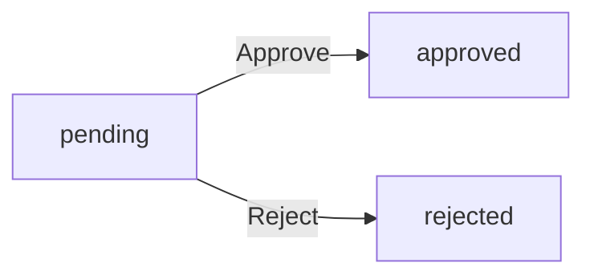
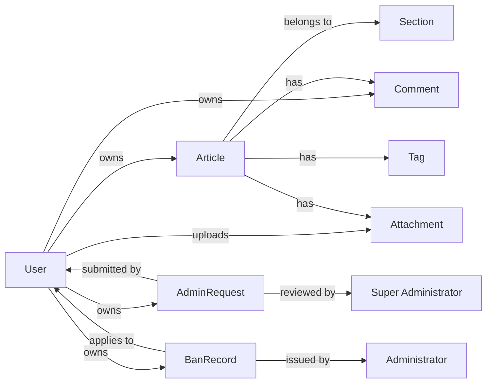

**discussionBoard — Business concepts, relationships, and states from user perspective**

Business concepts, relationships, and states from user perspective

# Domain Concepts

Describe what each concept means to users and why it exists.

## User Concept

Users are the primary actors in the discussion board ecosystem who register, authenticate, and participate in discussions. Each user creates an account with a unique email and password, which serves as their primary identifier across the platform. After registration, users build a profile with a display name and optional biography text that represents their public identity. Users interact with the system by creating and managing articles, writing comments on others' work, and organizing content through tags. Each user maintains ownership of their created content, with the ability to edit or delete their own articles and comments. When a user chooses to delete their account, all associated articles and comments are permanently removed from the platform. The system tracks user-generated content attribution, ensuring proper authorship is maintained across all discussions and posts. User accounts can be suspended through the banning mechanism when community guidelines are violated. Users may also apply for administrative privileges by submitting a formal request with a stated reason for the privilege escalation.

### User Registration and Authentication Identity

THE system SHALL allow users to register with a unique email address and password.

THE system SHALL authenticate users using their email address and password.

THE system SHALL maintain user accounts with persistent authentication credentials.

WHEN a user changes their password, THE system SHALL update the authentication credentials.

THE system SHALL prevent duplicate email registrations.

WHEN a user attempts to log in with incorrect credentials, THE system SHALL reject the authentication attempt.

THE email address serves as the unique identifier for each user across all platform interactions.

### Profile Management and Public Representation

THE system SHALL maintain a display name for each user as their public identity.

THE system SHALL allow users to set and update their biography text.

THE system SHALL display a user's display name and bio when their profile is viewed by others.

THE system SHALL associate all user-created content with their display name.

WHEN a user updates their display name, THE system SHALL reflect the change across all their existing content.

THE display name is visible to all users viewing the user's profile or their content.

THE biography text is optional and may be left empty by the user.

### Content Ownership and Authorship

THE system SHALL establish ownership relationships between users and their created articles.

THE system SHALL establish ownership relationships between users and their created comments.

THE system SHALL establish ownership relationships between users and their file attachments.

THE system SHALL establish ownership relationships between users and their tag assignments.

WHEN a user creates content, THE system SHALL record the user as the content owner.

THE system SHALL maintain ownership attribution throughout the content lifecycle.

Content ownership grants the user rights to edit and delete their own content.

### Account Deletion and Content Removal

WHEN a user deletes their account, THE system SHALL remove all articles created by that user.

WHEN a user deletes their account, THE system SHALL remove all comments created by that user.

WHEN a user deletes their account, THE system SHALL remove all file attachments uploaded by that user.

WHEN a user deletes their account, THE system SHALL permanently remove the user's authentication credentials.

WHEN a user deletes their account, THE system SHALL remove all tags associated with the user's content.

Account deletion is irreversible and removes all user-associated data from the platform.

### User Content Attribution

THE system SHALL attribute each article to its creating user.

THE system SHALL attribute each comment to its creating user.

THE system SHALL display the author's display name alongside their articles.

THE system SHALL display the author's display name alongside their comments.

THE system SHALL maintain authorship attribution even when the author updates their display name.

WHEN a user's profile is viewed, THE system SHALL list all articles authored by that user.

WHEN a user's profile is viewed, THE system SHALL list all comments authored by that user.

Authorship attribution remains consistent regardless of content editing or updates.

### Privilege Escalation Participation

THE system SHALL allow users to submit requests for administrative privileges.

THE system SHALL require users to provide a reason when requesting administrative privileges.

THE system SHALL record the submission timestamp for each privilege escalation request.

THE system SHALL maintain the requesting user's identity throughout the review process.

WHEN a user submits a privilege request, THE system SHALL create a pending request record.

Users retain their existing content ownership and profile while their privilege request is under review.

### Banned Account State and Restrictions

THE system SHALL maintain an active state for user accounts by default.

THE system SHALL transition user accounts to a banned state when administrators apply bans.

WHEN a user account is banned, THE system SHALL prevent the user from logging in.

WHEN a user account is banned, THE system SHALL preserve all content created by that user.

THE system SHALL record the ban reason for each banned user account.

WHEN a user account is unbanned, THE system SHALL restore login capability.

Banned users retain ownership of their content but cannot create new content or interact with the platform.

User accounts exist in one of two states: active or banned.

## Section Concept

Sections serve as the primary organizational structure for categorizing articles by topic and subject matter. Each section represents a distinct discussion area such as Politics, Economy, or Current Affairs where related content is grouped together. Only administrators have the authority to create, modify, or remove sections, maintaining editorial control over the platform structure. Users browse and filter articles based on their assigned section, enabling focused exploration of specific interest areas. Each section contains a human-readable name and descriptive text that explains its scope and purpose to visitors. The section assignment is mandatory when creating an article, ensuring all content is properly classified. Users can navigate between different sections to explore diverse topics within the discussion board ecosystem. Section organization helps maintain order and discoverability across the expanding library of user-generated political and economic discourse.

### Section Definition and Purpose

THE system SHALL create sections as organizational containers for grouping related articles by topic.

THE system SHALL require each section to have a unique human-readable name that identifies the topic area.

THE system SHALL allow each section to include descriptive text that explains its scope and purpose to users.

THE system SHALL track the creation timestamp for each section.

THE system SHALL track the last modification timestamp for each section.

THE system SHALL maintain sections as persistent organizational structures independent of individual articles.

### Section Management Authority

THE system SHALL restrict section creation capability to administrators only.

THE system SHALL restrict section name modification capability to administrators only.

THE system SHALL restrict section description modification capability to administrators only.

THE system SHALL restrict section deletion capability to administrators only.

IF a non-administrator attempts to create a section, THE system SHALL reject the request.

IF a non-administrator attempts to modify a section, THE system SHALL reject the request.

IF a non-administrator attempts to delete a section, THE system SHALL reject the request.

THE system SHALL maintain editorial control over platform structure through administrator-only section management.

### Section Content Organization

THE system SHALL categorize all articles by their assigned section for organizational purposes.

THE system SHALL ensure every article belongs to exactly one section.

THE system SHALL prevent articles from existing without section assignment.

THE system SHALL group articles by section to enable topic-based browsing.

THE system SHALL use sections as the primary content classification mechanism for the discussion board.

THE system SHALL maintain section-based content separation to support focused exploration of specific interest areas.

THE system SHALL enable content discoverability by allowing users to browse articles within specific topic categories.

### Section User Interaction

THE system SHALL present a complete list of all available sections to users.

THE system SHALL allow users to browse articles within a specific section.

THE system SHALL display section name and description when users view the section list.

THE system SHALL enable users to navigate between different sections to explore diverse topics.

THE system SHALL allow users to filter their article browsing experience by selecting a specific section.

THE system SHALL maintain section visibility for all users regardless of their role.

THE system SHALL provide section-based navigation as a primary means of content discovery.

## Article Concept

Articles represent the core content unit where users share their perspectives on economic and political issues. Every article must include a required title and substantive text content, forming the basis for community discussion. When publishing, authors must assign the article to exactly one section, ensuring proper topical organization. Writers can enhance their articles by attaching multiple files and images that provide supporting evidence or visual context. Free-text tags can be added to articles to enable better searchability and cross-referencing with related content. Article authors retain full control, maintaining the ability to edit or delete their own work at any time. The article listing displays key metadata including title, author attribution, associated tags, and engagement metrics like comment counts. Users can sort and filter the article list by publication date, choosing to see the newest or oldest content first.

### Article Creation Requirements

WHEN a member creates an article, THE system SHALL require the author to provide a title.

WHEN a member creates an article, THE system SHALL require the author to provide substantive text content.

WHEN a member creates an article, THE system SHALL require the author to assign the article to exactly one section.

WHEN a member creates an article, THE system SHALL associate the article with the creating member as the author.

WHEN a member creates an article, THE system SHALL record the publication timestamp.

IF the title is empty or missing, THE system SHALL reject the article creation.

IF the content is empty or missing, THE system SHALL reject the article creation.

IF no section is selected, THE system SHALL reject the article creation.

IF the selected section does not exist, THE system SHALL reject the article creation.

### Article Attachments

WHEN a member creates or edits an article, THE system SHALL allow the author to attach multiple files.

WHEN a member creates or edits an article, THE system SHALL allow the author to attach multiple images.

WHEN a member creates or edits an article, THE system SHALL associate all attachments with the article.

WHEN a member views an article, THE system SHALL display all attached files and images.

WHEN a member views an article, THE system SHALL allow the member to download attached files.

WHEN a member views an article, THE system SHALL allow the member to download attached images.

IF a member deletes their article, THE system SHALL also delete all associated attachments.

IF a member edits their article, THE system SHALL allow the member to add new attachments.

IF a member edits their article, THE system SHALL allow the member to remove existing attachments.

### Article Tagging

WHEN a member creates or edits an article, THE system SHALL allow the author to add multiple free-text tags.

WHEN a member creates or edits an article, THE system SHALL not restrict tags to predefined values.

WHEN a member creates or edits an article, THE system SHALL associate all tags with the article.

WHEN a member views an article, THE system SHALL display all associated tags.

WHEN a member views an article list, THE system SHALL display tags for each article.

IF a member edits their article, THE system SHALL allow the member to add new tags.

IF a member edits their article, THE system SHALL allow the member to remove existing tags.

IF a member edits their article, THE system SHALL allow the member to modify existing tag text.

### Article Modification and Deletion

WHILE an article exists, THE author SHALL be able to edit the article title.

WHILE an article exists, THE author SHALL be able to edit the article content.

WHILE an article exists, THE author SHALL be able to edit the section assignment.

WHILE an article exists, THE author SHALL be able to edit the attached files and images.

WHILE an article exists, THE author SHALL be able to edit the associated tags.

WHILE an article exists, THE author SHALL be able to delete the article.

IF a member attempts to edit another member's article, THE system SHALL reject the request.

IF a member attempts to delete another member's article, THE system SHALL reject the request.

IF an administrator deletes an article, THE system SHALL also delete all associated comments.

IF an administrator deletes an article, THE system SHALL also delete all associated attachments.

### Article Listing and Display

WHEN a member views a section, THE system SHALL display a paginated list of articles in that section.

WHEN a member views an article list, THE system SHALL display the article title.

WHEN a member views an article list, THE system SHALL display the author's display name.

WHEN a member views an article list, THE system SHALL display all associated tags.

WHEN a member views an article list, THE system SHALL display the comment count.

WHEN a member views an article list, THE system SHALL display the publication timestamp.

WHEN a member views an article list, THE system SHALL allow sorting by newest first.

WHEN a member views an article list, THE system SHALL allow sorting by oldest first.

WHEN a member views a single article, THE system SHALL display the full article content.

WHEN a member views a single article, THE system SHALL display the title, author, content, attachments, tags, and publication timestamp.

## Comment Concept

Comments enable direct community engagement on published articles through single-level discussion threads. Any registered user can write a comment on any article, fostering open dialogue on presented ideas and arguments. Each comment must contain substantive text content and is timestamped to show when the contribution was made. The system maintains a strict single-level comment structure, meaning no nested replies are permitted to keep discussions linear and accessible. Authors of comments retain the ability to edit or delete their own contributions as discussions evolve. Comments are displayed in chronological order with oldest comments appearing first, preserving discussion flow. Each comment entry shows the author's identity, the comment text, and the exact time of posting for context.

### Comment Structure and Leveling

THE system SHALL maintain a single-level comment structure on all articles.

THE system SHALL not permit nested replies or threaded discussions within comments.

THE system SHALL display all comments on an article in a flat, linear list format.

WHEN a user attempts to reply directly to another comment, THE system SHALL reject the request.

THE system SHALL treat all comments as peer-level contributions to the article discussion.

WHILE viewing an article, THE system SHALL present comments as a sequential list without hierarchical indentation.

IF a comment references another comment by content, THE system SHALL display it at the same level as other comments.

THE system SHALL not provide UI elements or mechanisms for creating reply chains.

WHEN comments are retrieved for an article, THE system SHALL return them as a flat collection.

THE system SHALL maintain chronological ordering regardless of comment relationships or references.

### Comment Creation Process

WHEN a registered user creates a comment, THE system SHALL require text content to be provided.

WHEN a user creates a comment, THE system SHALL associate the comment with a specific article.

THE system SHALL record the identity of the user who created each comment.

THE system SHALL record the exact time when each comment is created.

IF the comment content is empty or contains only whitespace, THE system SHALL reject the creation request.

WHEN a comment is successfully created, THE system SHALL immediately make it visible to all users viewing the article.

THE system SHALL allow any registered user to create comments on any article.

WHEN a user creates a comment, THE system SHALL link the comment to the user's account for attribution purposes.

THE system SHALL not require approval or moderation before displaying newly created comments.

WHEN a comment is created on an article, THE system SHALL increment the article's comment count.

### Comment Author Rights

WHEN a user edits their own comment, THE system SHALL preserve the original creation timestamp.

WHEN a user edits their own comment, THE system SHALL update the comment's content with the new text.

THE system SHALL record when a comment was last updated.

WHEN a user deletes their own comment, THE system SHALL remove the comment from the article's comment list.

WHEN a user deletes their own comment, THE system SHALL decrement the article's comment count.

IF a user attempts to edit another user's comment, THE system SHALL reject the request.

IF a user attempts to delete another user's comment, THE system SHALL reject the request.

WHEN a comment is deleted, THE system SHALL not preserve the deleted content for display.

THE system SHALL allow users to edit their comments at any time after creation.

THE system SHALL allow users to delete their comments at any time after creation.

### Comment Display and Ordering

WHEN comments are displayed on an article, THE system SHALL order them chronologically with oldest comments appearing first.

WHEN comments are displayed, THE system SHALL show the author's display name for each comment.

WHEN comments are displayed, THE system SHALL show the full text content of each comment.

WHEN comments are displayed, THE system SHALL show the exact time each comment was posted.

THE system SHALL not hide or collapse comments based on content or author.

WHEN a user views an article, THE system SHALL display all non-deleted comments for that article.

THE system SHALL display comment timestamps in a human-readable format.

WHEN new comments are added to an article, THE system SHALL append them to the end of the chronological list.

THE system SHALL maintain consistent ordering across all users viewing the same article.

THE system SHALL not reorder comments based on popularity, recency, or user preferences.

### Community Discussion Model

THE system SHALL enable open community dialogue through the comment feature.

THE system SHALL allow any registered user to participate in article discussions.

THE system SHALL not restrict comment participation based on user role or membership level.

WHEN an article is published, THE system SHALL make it available for commenting by all registered users.

THE system SHALL treat all comments as equal contributions to the discussion thread.

WHEN users view comments, THE system SHALL present them as part of a unified discussion on the article topic.

THE system SHALL not segment comments into separate discussion threads or sub-topics.

WHEN an article exists, THE system SHALL maintain its comment section as an integral part of the article experience.

THE system SHALL preserve the connection between comments and their parent article throughout the comment lifecycle.

WHEN users engage with article comments, THE system SHALL facilitate continuous dialogue on the presented content.

## AdminRequest Concept

AdminRequest represents the formal process by which regular users can apply for administrative privileges on the platform. When a user believes they can contribute to site governance, they may submit a request including a written reason justifying their application. Super administrators review these pending requests and decide whether to approve or reject each application. Once approved, the requesting user transitions from regular user to regular administrator with expanded moderation capabilities. Rejected requests remain in the system for potential future review or appeal processes. The request status flows through distinct states: pending, approved, or rejected, with each transition auditable. This mechanism enables organic growth of the moderation team while maintaining oversight.

### Administrator Promotion Workflow

WHEN a user wishes to become an administrator, THE system SHALL allow them to submit an administrator request.

WHEN a user submits an administrator request, THE system SHALL require them to provide a written reason justifying their application.

WHEN an administrator request is submitted, THE system SHALL record the submission timestamp.

WHEN a super administrator reviews an administrator request, THE system SHALL present the request reason and submission details.

IF a super administrator approves an administrator request, THE system SHALL transition the requesting user to regular administrator status.

IF a super administrator rejects an administrator request, THE system SHALL maintain the user's current status.

WHEN a user's administrator request is approved, THE system SHALL record the approval timestamp.

WHEN a user's administrator request is rejected, THE system SHALL record the rejection timestamp.

WHEN a user's administrator request is approved, THE system SHALL grant them regular administrator capabilities.

WHILE a user's administrator request remains pending, THE system SHALL allow super administrators to review it.

### Privilege Escalation Requests

THE system SHALL allow any registered user to submit a request for administrative privileges.

WHEN a user submits a privilege escalation request, THE system SHALL capture the written justification provided by the applicant.

THE system SHALL store all submitted privilege escalation requests for administrative review.

WHEN a privilege escalation request is created, THE system SHALL associate it with the submitting user.

THE system SHALL prevent users from submitting multiple pending privilege escalation requests simultaneously.

WHEN a privilege escalation request is reviewed, THE system SHALL make the applicant's reason available to the reviewer.

THE system SHALL preserve privilege escalation request history for audit purposes.

IF a user submits a privilege escalation request while already having a pending request, THE system SHALL reject the new submission.

### Super Administrator Review Process

WHEN a super administrator accesses pending administrator requests, THE system SHALL display all requests awaiting review.

WHEN a super administrator reviews a request, THE system SHALL present the applicant's reason and submission date.

IF a super administrator approves a request, THE system SHALL elevate the applicant to regular administrator status.

IF a super administrator rejects a request, THE system SHALL preserve the original user role.

WHEN a decision is made on an administrator request, THE system SHALL record the review timestamp.

THE system SHALL allow only super administrators to review and decide on administrator requests.

WHEN a super administrator reviews multiple requests, THE system SHALL allow them to process each request independently.

THE system SHALL prevent regular administrators from reviewing administrator requests.

WHEN a super administrator reviews a request, THE system SHALL provide options to approve or reject the application.

### Request Status State Machine

THE system SHALL maintain administrator requests in one of three states: pending, approved, or rejected.

WHEN an administrator request is first submitted, THE system SHALL set its status to pending.

WHEN a super administrator approves a request, THE system SHALL transition the status from pending to approved.

WHEN a super administrator rejects a request, THE system SHALL transition the status from pending to rejected.

WHILE an administrator request remains in pending status, THE system SHALL allow super administrators to review it.

WHEN an administrator request reaches approved status, THE system SHALL prevent further modifications.

WHEN an administrator request reaches rejected status, THE system SHALL prevent further modifications.

THE system SHALL record the timestamp when each status transition occurs.

THE system SHALL allow super administrators to view the complete status history of each administrator request.

WHEN an administrator request is in approved status, THE system SHALL reflect the user's new role immediately.

WHEN an administrator request is in rejected status, THE system SHALL maintain the user's original role.

### Governance Participation Model

THE system SHALL enable organic growth of the moderation team through user-initiated requests.

WHEN users demonstrate commitment to platform governance, THE system SHALL provide a formal mechanism for them to request administrative privileges.

THE system SHALL maintain oversight of the moderation team expansion through super administrator review.

WHEN a user becomes an administrator through approval, THE system SHALL grant them moderation capabilities while preserving regular user privileges.

THE system SHALL allow super administrators to control the rate of moderation team expansion.

WHEN the moderation team expands through approved requests, THE system SHALL ensure new administrators understand their responsibilities.

THE system SHALL provide transparency in the administrator selection process through documented request reasons.

WHEN multiple users request administrative privileges, THE system SHALL allow super administrators to evaluate each application on its merits.

THE system SHALL prevent unauthorized escalation of administrative privileges without super administrator approval.

### Application Approval and Rejection

WHEN a super administrator approves an administrator request, THE system SHALL transition the user from regular member to regular administrator.

WHEN a super administrator rejects an administrator request, THE system SHALL inform the applicant of the decision.

WHEN an administrator request is approved, THE system SHALL immediately activate the user's administrator privileges.

WHEN an administrator request is rejected, THE system SHALL maintain the user's existing permissions.

THE system SHALL allow super administrators to provide context for approval or rejection decisions.

WHEN a user's request is rejected, THE system SHALL preserve the request record for potential future review.

THE system SHALL track the number of approved and rejected administrator requests.

WHEN a user becomes an administrator through approval, THE system SHALL grant them section management capabilities.

WHEN a user's request is rejected, THE system SHALL allow them to submit a new request in the future.

THE system SHALL ensure that approved requests result in appropriate role assignment without manual intervention.

## BanRecord Concept

BanRecord documents instances when users are suspended from the platform due to policy violations or harmful behavior. When a ban is issued, the system records the specific reason for the action along with the timestamp and the administrator who imposed it. Banned users immediately lose the ability to log in and participate in the platform while maintaining visibility of their historical contributions. The ban reason is permanently associated with the user account for transparency and potential appeal processes. Banned users' previously published articles and comments remain visible to preserve discussion context and historical record. Only administrators with appropriate privileges can impose bans, ensuring accountability in enforcement actions. The system maintains a complete audit trail of who banned whom and why for governance oversight.

### User Suspension Mechanism

THE system SHALL provide a mechanism for administrators to suspend user accounts from platform participation.

WHEN an administrator initiates a ban action, THE system SHALL require the administrator to provide a reason for the suspension.

WHEN a user is banned, THE system SHALL immediately prevent that user from logging into the platform.

WHEN a user is banned, THE system SHALL record the timestamp of when the ban was imposed.

WHEN a user is banned, THE system SHALL record which administrator imposed the ban.

IF a banned user attempts to log in, THE system SHALL reject the authentication attempt.

WHEN an administrator lifts a ban, THE system SHALL restore the user's ability to log in to the platform.

THE system SHALL maintain ban records for all users who have been suspended, regardless of whether the ban is later lifted.

### Ban Reason Documentation

THE system SHALL require administrators to document a specific reason when banning a user.

WHEN a ban is imposed, THE system SHALL store the ban reason as text that explains why the user was suspended.

THE system SHALL associate the ban reason permanently with the user's account record.

WHEN an administrator views a banned user's record, THE system SHALL display the reason for the ban.

THE system SHALL preserve the original ban reason text even if the ban is later lifted.

IF a ban reason is not provided, THE system SHALL prevent the ban action from being completed.

THE system SHALL allow ban reasons to contain detailed explanations of the policy violation or harmful behavior.

### Banned User Login Restrictions

WHEN a user is banned, THE system SHALL immediately block all login attempts by that user.

WHEN a banned user enters their credentials, THE system SHALL reject the authentication request.

WHILE a user remains banned, THE system SHALL prevent the user from accessing any platform features.

THE system SHALL not allow banned users to create new articles or comments.

THE system SHALL not allow banned users to view or interact with existing content.

WHEN an administrator removes a ban, THE system SHALL immediately restore the user's login capability.

THE system SHALL prevent banned users from updating their profile or account information.

THE system SHALL prevent banned users from submitting administrator promotion requests.

### Historical Content Preservation

WHEN a user is banned, THE system SHALL preserve all articles written by that user.

WHEN a user is banned, THE system SHALL preserve all comments written by that user.

THE system SHALL continue to display banned users' articles in section listings.

THE system SHALL continue to display banned users' comments on articles.

WHEN a user is unbanned, THE system SHALL maintain all previously published content without modification.

THE system SHALL not automatically delete or hide content when a user is banned.

THE system SHALL preserve the author attribution on all content even after the author is banned.

THE system SHALL maintain comment counts on articles that include comments from banned users.

### Administrator Enforcement Actions

THE system SHALL restrict ban enforcement actions to administrators only.

WHEN an administrator bans a user, THE system SHALL record the enforcement action in the audit trail.

WHEN an administrator unban a user, THE system SHALL record the action with a timestamp.

THE system SHALL allow administrators to view the complete list of currently banned users.

THE system SHALL allow administrators to view the ban reason for each banned user.

THE system SHALL prevent regular users from banning or unbanning other users.

THE system SHALL allow administrators to ban any user regardless of that user's role or privileges.

THE system SHALL allow administrators to review ban history before taking enforcement actions.

### Ban Audit Trail Maintenance

THE system SHALL maintain a complete audit trail of all ban and unban actions.

WHEN a ban is imposed, THE system SHALL record the date and time of the action.

WHEN a ban is imposed, THE system SHALL record the identity of the administrator who took the action.

WHEN a ban is lifted, THE system SHALL record the date and time of the unban action.

WHEN a ban is lifted, THE system SHALL record the identity of the administrator who removed the ban.

THE system SHALL preserve audit trail entries permanently, even after a user's account is deleted.

THE system SHALL allow super administrators to review the complete audit trail of enforcement actions.

THE system SHALL maintain audit trail entries in chronological order.

### Governance and Accountability Tracking

THE system SHALL ensure accountability by recording which administrator imposed each ban.

THE system SHALL allow super administrators to oversee all administrator enforcement actions.

WHEN an administrator takes enforcement action, THE system SHALL link the action to that administrator's identity.

THE system SHALL provide visibility into enforcement patterns across different administrators.

THE system SHALL enable governance oversight by maintaining complete records of who banned whom and why.

THE system SHALL prevent administrators from modifying historical audit trail entries.

THE system SHALL ensure that enforcement actions cannot be performed anonymously.

THE system SHALL allow super administrators to review enforcement decisions made by regular administrators.

## Attachment Concept

Attachments allow users to enrich their articles with supporting files and images that provide evidence or visual context. When publishing an article, authors can attach multiple files and images, with each attachment retaining its original filename for reference. The system tracks basic metadata about each attachment including the file name, type, and size for proper management. Users viewing an article can download any attached files or images directly from the article detail page. Attachments are inextricably linked to their parent article, meaning deleting the article also removes all associated attachments. This ensures content integrity while providing necessary flexibility for multimedia-rich discussions on complex economic and political topics.

### File and Image Attachment Support

WHEN a member creates an article, THE system SHALL allow them to attach files and images.

WHEN a member edits their article, THE system SHALL allow them to add new attachments.

WHEN a member edits their article, THE system SHALL allow them to remove existing attachments.

THE system SHALL support both document files and image files as attachments.

WHEN a member attaches a file, THE system SHALL preserve the original filename for reference.

WHEN a member attaches an image, THE system SHALL preserve the original filename for reference.

THE system SHALL allow attachments to provide evidence or visual context for article content.

WHEN a member uploads an attachment, THE system SHALL associate it with their article.

### Multiple Attachments and Metadata

THE system SHALL allow multiple attachments to be associated with a single article.

THE system SHALL track the original file name for each attachment.

THE system SHALL track the file type for each attachment.

THE system SHALL track the file size for each attachment.

THE system SHALL track the upload timestamp for each attachment.

THE system SHALL display attachment metadata when viewing an article.

WHEN a member uploads an attachment, THE system SHALL record the upload date and time.

THE system SHALL maintain file type information for proper file handling.

THE system SHALL maintain file size information for attachment management.

### Attachment Lifecycle and Download

WHEN an article is deleted, THE system SHALL delete all attachments associated with that article.

WHEN a user views an article, THE system SHALL allow them to download any attached files.

WHEN a user views an article, THE system SHALL allow them to download any attached images.

THE system SHALL display attachment information including file name, type, and size on the article detail page.

WHEN a guest views an article, THE system SHALL allow them to download attachments.

WHEN a member views an article, THE system SHALL allow them to download attachments.

WHEN an administrator deletes an article, THE system SHALL delete all attachments associated with that article.

THE system SHALL ensure attachments remain accessible as long as their parent article exists.

THE system SHALL prevent access to attachments after their parent article is deleted.

### Multimedia Content Enrichment

THE system SHALL enable authors to enrich articles with supporting files and images.

WHEN an author publishes an article with attachments, THE system SHALL make attachments visible to all article viewers.

THE system SHALL allow attachments to provide additional context for economic and political discussions.

WHEN a user reads an article, THE system SHALL display available attachments alongside article content.

THE system SHALL support multimedia-rich discussions through file and image attachments.

WHEN an article contains attachments, THE system SHALL indicate their presence in the article view.

## Tag Concept

Tags function as free-form labels that users can assign to articles for improved organization and discoverability. When creating or editing an article, authors may add multiple tags that describe the content themes, making articles easier to find through search and filtering. Tags are entered as free text without a predefined vocabulary, allowing maximum flexibility in how users categorize their work. The system indexes articles by their assigned tags, enabling powerful filtering capabilities when browsing large article collections. Tags serve as an informal but essential navigation layer that complements the formal section-based organization. Users can quickly locate all articles on a specific theme by filtering by shared tags, cutting across traditional section boundaries.

### Free-Text Tag Assignment

WHEN a user creates an article, THE system SHALL allow the user to assign tags as free text without predefined vocabulary.

WHEN a user edits an existing article, THE system SHALL allow the user to add, modify, or remove tags.

THE system SHALL accept any text string as a valid tag name.

THE system SHALL not enforce a maximum or minimum length on tag names.

THE system SHALL not validate tag names against a predefined list of allowed values.

IF a user enters duplicate tags on the same article, THE system SHALL store only one instance of that tag.

WHEN a user assigns a tag to an article, THE system SHALL associate the tag with that article immediately upon saving.

THE system SHALL allow users to create new tags dynamically without prior registration or approval.

IF a user removes all tags from an article, THE system SHALL permit the article to exist without any tags.

WHEN multiple users create tags with the same text, THE system SHALL treat them as identical tags for filtering purposes.

THE system SHALL preserve the exact text of each tag as entered by the user, including capitalization and spacing.

### Multi-Tag Article Labeling

WHEN a user creates an article, THE system SHALL allow the user to assign multiple tags to that article.

THE system SHALL not impose a maximum limit on the number of tags per article.

WHEN a user adds a tag to an article that already has tags, THE system SHALL add the new tag to the existing set.

WHEN a user removes a tag from an article, THE system SHALL remove only that specific tag while preserving other tags.

THE system SHALL display all tags assigned to an article on the article detail page.

THE system SHALL display all tags assigned to an article in the article list view.

WHEN a user edits an article, THE system SHALL preserve all existing tags unless explicitly modified.

IF an article has no tags, THE system SHALL not display a tag section on the article detail page.

THE system SHALL allow users to reassign tags when editing an article, including replacing old tags with new ones.

WHEN an article is deleted, THE system SHALL remove all tags associated with that article.

THE system SHALL maintain tag-article associations independently of section assignments.

### Tag-Based Content Filtering

WHEN users browse articles, THE system SHALL provide a filtering mechanism based on assigned tags.

WHEN a user selects a tag filter, THE system SHALL display only articles that have that tag.

WHEN multiple tag filters are applied, THE system SHALL display articles that have all selected tags.

THE system SHALL display available tags as filter options based on tags currently assigned to articles.

WHEN a user applies a tag filter, THE system SHALL maintain pagination on the filtered results.

THE system SHALL allow users to clear tag filters and return to the full article list.

WHEN a user filters by a tag that no articles currently have, THE system SHALL display an empty results list.

THE system SHALL allow tag filtering to be combined with other available filters such as section.

WHEN tag filtering is active, THE system SHALL indicate which tags are currently applied as filters.

THE system SHALL not hide articles from tag filtering results based on user permissions beyond standard access rules.

### Informal Content Categorization

THE system SHALL treat tags as an informal categorization mechanism that complements formal section-based organization.

WHEN users assign tags to articles, THE system SHALL not validate tags against section topics or themes.

THE system SHALL allow users to assign tags that cross section boundaries.

WHEN users browse by tag, THE system SHALL display articles from multiple sections if they share the same tag.

THE system SHALL not enforce hierarchical relationships between tags.

THE system SHALL not require tags to follow any naming convention or structure.

WHEN tags are used for categorization, THE system SHALL not enforce consistency across different users' tag choices.

THE system SHALL allow the same article to have both section assignment and tag assignment simultaneously.

IF a tag describes content outside its assigned section's topic, THE system SHALL still permit the tag assignment.

THE system SHALL not automatically suggest or recommend tags based on article content or section.

### Cross-Section Topic Discovery

WHEN users search by tag, THE system SHALL return articles from all sections that have the specified tag.

THE system SHALL enable users to discover articles on specific topics regardless of section boundaries.

WHEN a user clicks on a tag displayed on an article, THE system SHALL navigate to a filtered view showing all articles with that tag.

THE system SHALL display the count of articles associated with each tag when showing available tags.

WHEN articles share common tags across different sections, THE system SHALL group them together in tag-based search results.

THE system SHALL allow users to explore related content through tag associations.

WHEN displaying tag-based search results, THE system SHALL show which section each article belongs to.

THE system SHALL not limit tag-based discovery to articles within the user's current section context.

WHEN a tag is used by articles in multiple sections, THE system SHALL present all matching articles in the discovery results.

THE system SHALL enable topic-based exploration that transcends the formal section organization.

### User-Defined Labeling System

THE system SHALL provide a user-defined labeling system where users create their own tags without system constraints.

WHEN users create tags, THE system SHALL not require approval or validation from administrators.

THE system SHALL allow each user to develop their own tagging vocabulary and conventions.

WHEN users label articles with tags, THE system SHALL preserve the exact text as entered by the user.

THE system SHALL not normalize or standardize tag text across different users.

WHEN users search for tags, THE system SHALL perform exact text matching on tag names.

THE system SHALL not automatically merge similar tag names (e.g., "economy" and "economics") into one tag.

WHEN users create tags, THE system SHALL make those tags immediately available for use on other articles.

THE system SHALL not restrict which users can create which tags.

WHEN a tag is created by one user, THE system SHALL allow other users to use the same tag text on their articles.

### Enhanced Content Searchability

THE system SHALL index all articles by their assigned tags to enable tag-based search.

WHEN users search articles, THE system SHALL allow filtering results by tag.

WHEN users browse the article list, THE system SHALL display tags as clickable links for quick filtering.

THE system SHALL include tag information in article metadata displayed in search results.

WHEN a user applies tag filters, THE system SHALL update search results in real-time.

THE system SHALL allow users to combine tag filters with text-based article search.

WHEN displaying search results, THE system SHALL highlight articles that match the applied tag filters.

THE system SHALL provide visual indicators showing which tags are assigned to each article in list views.

WHEN users view an article, THE system SHALL display all assigned tags prominently for easy discovery.

THE system SHALL enable users to quickly navigate between articles sharing common tags through tag links.

# Domain Relationships

Describe how concepts relate to each other from a business perspective.

## Conceptual Relationships

Describe how concepts relate to each other in business terms.

### User Ownership Relationships

THE system SHALL associate each Article with exactly one User as its owner.

THE system SHALL associate each Comment with exactly one User as its owner.

THE system SHALL associate each AdminRequest with exactly one User as its submitter.

THE system SHALL associate each BanRecord with exactly one User as the banned party.

THE system SHALL associate each BanRecord with exactly one User as the administrator who issued the ban.

THE system SHALL associate each Attachment with exactly one User as its uploader.

WHEN a User is deleted, THE system SHALL also delete all Articles owned by that User.

WHEN a User is deleted, THE system SHALL also delete all Comments owned by that User.

WHEN a User is deleted, THE system SHALL also delete all Attachments uploaded by that User.

WHEN a User is deleted, THE system SHALL also delete any AdminRequest submitted by that User.

WHEN an Article is deleted, THE system SHALL also delete all Attachments associated with that Article.

WHEN an Article is deleted, THE system SHALL also delete all Comments associated with that Article.

THE system SHALL display the owner's display name alongside each Article.

THE system SHALL display the owner's display name alongside each Comment.

THE system SHALL display the owner's display name alongside each AdminRequest.

### Article-Section Belongs-To Relationship

THE system SHALL require every Article to belong to exactly one Section.

THE system SHALL allow a Section to contain zero or more Articles.

THE system SHALL prevent an Article from existing without Section assignment.

THE system SHALL prevent an Article from belonging to multiple Sections simultaneously.

WHEN an Article is created, THE system SHALL require the creator to select a Section.

WHEN an Article is edited, THE system SHALL allow the owner to change its Section assignment.

THE system SHALL display the Section name alongside each Article in the Article list.

THE system SHALL display the Section name on the Article detail page.

WHEN a Section is deleted by an administrator, THE system SHALL also delete all Articles belonging to that Section.

WHEN a Section is deleted by an administrator, THE system SHALL also delete all Comments on Articles belonging to that Section.

### Article Has-Many Relationships

THE system SHALL allow an Article to have zero or more Comments.

THE system SHALL allow an Article to have zero or more Attachments.

THE system SHALL allow an Article to have zero or more Tags.

THE system SHALL prevent a Comment from existing without Article association.

THE system SHALL prevent an Attachment from existing without Article association.

THE system SHALL prevent a Tag from existing without Article association.

WHEN a Comment is created, THE system SHALL associate it with exactly one Article.

WHEN an Attachment is uploaded, THE system SHALL associate it with exactly one Article.

WHEN a Tag is added, THE system SHALL associate it with exactly one Article.

THE system SHALL display the total number of Comments on an Article in the Article list.

THE system SHALL display all Attachments on the Article detail page.

THE system SHALL display all Tags on the Article detail page.

THE system SHALL display all Tags on the Article in the Article list.

### Entity Association Patterns

THE system SHALL establish a one-to-many relationship between User and Article where one User can own multiple Articles.

THE system SHALL establish a one-to-many relationship between User and Comment where one User can own multiple Comments.

THE system SHALL establish a one-to-many relationship between User and AdminRequest where one User can submit multiple AdminRequests.

THE system SHALL establish a one-to-many relationship between User and BanRecord where one User can have multiple BanRecords over time.

THE system SHALL establish a one-to-many relationship between Section and Article where one Section can contain multiple Articles.

THE system SHALL establish a one-to-many relationship between Article and Comment where one Article can have multiple Comments.

THE system SHALL establish a one-to-many relationship between Article and Attachment where one Article can have multiple Attachments.

THE system SHALL establish a one-to-many relationship between Article and Tag where one Article can have multiple Tags.

THE system SHALL establish a one-to-one relationship between AdminRequest and User where each AdminRequest is submitted by exactly one User.

THE system SHALL establish a many-to-one relationship between Article and Section where multiple Articles can belong to one Section.

THE system SHALL establish a many-to-one relationship between Comment and Article where multiple Comments can belong to one Article.

THE system SHALL establish a many-to-one relationship between Attachment and Article where multiple Attachments can belong to one Article.

THE system SHALL establish a many-to-one relationship between Tag and Article where multiple Tags can belong to one Article.

THE system SHALL establish a one-to-one relationship between BanRecord and User where each BanRecord applies to exactly one User.

THE system SHALL establish a one-to-one relationship between BanRecord and Administrator where each BanRecord is issued by exactly one Administrator.

### Relationship Diagram and Integrity

THE diagram above illustrates the primary business relationships between domain entities.

THE system SHALL maintain referential integrity between User and all owned content.

THE system SHALL maintain referential integrity between Article and its parent Section.

THE system SHALL maintain referential integrity between Comment and its parent Article.

THE system SHALL maintain referential integrity between Attachment and its parent Article.

THE system SHALL maintain referential integrity between Tag and its parent Article.

THE system SHALL maintain referential integrity between AdminRequest and its submitter User.

THE system SHALL maintain referential integrity between BanRecord and the banned User.

THE system SHALL maintain referential integrity between BanRecord and the issuing Administrator.

## Lifecycle and Retention

Describe business rules for concept lifecycle and data retention from a user perspective.

### User Account Lifecycle

WHEN a user account is created, THE system SHALL associate the account with all content created by that user.

WHEN a user deletes their account, THE system SHALL delete all articles owned by that user.

WHEN a user deletes their account, THE system SHALL delete all comments owned by that user.

WHEN a user deletes their account, THE system SHALL delete all attachments associated with the user's deleted articles.

WHEN a user deletes their account, THE system SHALL preserve the ban record if the user was previously banned.

WHEN a user deletes their account, THE system SHALL preserve admin request records submitted by that user.

WHEN a user account is deleted, THE system SHALL prevent the user from logging in with the same credentials.

WHEN a user account is deleted, THE system SHALL invalidate all active sessions for that user.

IF a user attempts to delete their account while having pending admin requests, THE system SHALL allow the deletion and mark pending requests as rejected.

WHEN a user account is deleted, THE system SHALL remove the user's display name and bio from public view.

### Content Lifecycle

WHEN a user creates an article, THE system SHALL associate the article with the creating user and the selected section.

WHEN a user edits an article, THE system SHALL preserve the original creation timestamp.

WHEN a user edits an article, THE system SHALL update the last modification timestamp.

WHEN a user deletes their own article, THE system SHALL delete all comments on that article.

WHEN a user deletes their own article, THE system SHALL delete all attachments associated with that article.

WHEN an administrator deletes any article, THE system SHALL delete all comments on that article.

WHEN an administrator deletes any article, THE system SHALL delete all attachments associated with that article.

WHEN an article is deleted, THE system SHALL remove the article from all section listings.

WHEN an article is deleted, THE system SHALL remove the article from search results.

IF a user attempts to delete an article they do not own, THE system SHALL reject the deletion request.

WHEN a user creates a comment, THE system SHALL associate the comment with the creating user and the target article.

WHEN a user edits a comment, THE system SHALL preserve the original creation timestamp.

WHEN a user edits a comment, THE system SHALL update the last modification timestamp.

WHEN a user deletes their own comment, THE system SHALL remove the comment from the article's comment list.

WHEN an administrator deletes any comment, THE system SHALL remove the comment from the article's comment list.

IF a user attempts to delete a comment they do not own, THE system SHALL reject the deletion request.

WHEN a comment is deleted, THE system SHALL update the article's comment count.

### Data Retention and Recovery Policy

WHEN a user is banned, THE system SHALL preserve all articles created by that user.

WHEN a user is banned, THE system SHALL preserve all comments created by that user.

WHEN a user is banned, THE system SHALL preserve all attachments associated with the user's content.

WHEN a user is banned, THE system SHALL record the ban reason in the ban record.

WHEN a user is banned, THE system SHALL record the administrator who initiated the ban.

WHEN a user is banned, THE system SHALL record the timestamp when the ban was applied.

WHEN a user is unbanned, THE system SHALL preserve the ban record in the system.

WHEN a user is unbanned, THE system SHALL restore the user's ability to log in.

WHEN an admin request is approved, THE system SHALL preserve the request record with the approval timestamp.

WHEN an admin request is rejected, THE system SHALL preserve the request record with the rejection timestamp.

WHEN content is deleted due to account deletion, THE system SHALL not provide a recovery mechanism.

WHEN content is deleted due to user or administrator action, THE system SHALL not provide a recovery mechanism.

WHEN a section is deleted by an administrator, THE system SHALL require reassignment of articles in that section to another section.

WHEN a section is deleted by an administrator, THE system SHALL not delete articles that belonged to that section.

# Business Categories and State Flows

Business category classifications and state flow definitions.

## Business Category Definitions

Define all business category classifications with their allowed values and descriptions.

### User Role Classification

THE system SHALL classify users into role categories based on their privileges and responsibilities.

THE system SHALL recognize the following user role classifications:
- Guest: Unauthenticated visitor with read-only access to public content
- Member: Registered user with full content creation and interaction rights
- Administrator: Privileged user with content management and moderation capabilities

THE system SHALL further classify administrators into two grade levels:
- Regular Administrator: Standard moderation privileges
- Super Administrator: Elevated privileges including administrator management

WHEN a user registers, THE system SHALL assign them the Member role by default.

WHEN a user submits an administrator request, THE system SHALL maintain their Member role until approval.

WHEN a super administrator approves an administrator request, THE system SHALL upgrade the user's role to Regular Administrator.

WHEN a super administrator promotes a regular administrator, THE system SHALL upgrade their role to Super Administrator.

WHEN a super administrator demotes another super administrator, THE system SHALL downgrade their role to Regular Administrator.

THE system SHALL prevent super administrators from demoting themselves.

THE system SHALL maintain the role classification for each user throughout their account lifecycle.

IF a user's account is deleted, THE system SHALL remove all role classifications associated with that user.

### Administrator Request Status Classification

THE system SHALL classify administrator promotion requests by their processing status.

THE system SHALL recognize the following status values for administrator requests:
- Pending: Request submitted and awaiting review
- Approved: Request accepted by a super administrator
- Rejected: Request declined by a super administrator

WHEN a user submits an administrator request, THE system SHALL set the status to Pending.

WHEN a super administrator reviews a pending request, THE system SHALL allow status change to either Approved or Rejected.

WHEN a request status changes to Approved, THE system SHALL automatically upgrade the requester's role to Regular Administrator.

WHEN a request status changes to Rejected, THE system SHALL maintain the requester's current role.

THE system SHALL prevent status changes for requests that are no longer in Pending state.

THE system SHALL record the timestamp when each status transition occurs.

THE system SHALL record which super administrator performed each status change.

IF a request is in Approved status, THE system SHALL prevent further status modifications.

IF a request is in Rejected status, THE system SHALL prevent further status modifications.

THE system SHALL allow users to submit new administrator requests if their previous request was rejected.

### Content Section Classification

THE system SHALL classify content into topic-based sections for organizational purposes.

THE system SHALL recognize sections as the primary content categorization mechanism.

THE system SHALL require each section to have a unique name within the platform.

THE system SHALL require each section to have a description explaining its topic focus.

WHEN an article is created, THE system SHALL require assignment to exactly one section.

THE system SHALL prevent articles from existing without section assignment.

THE system SHALL allow users to view all available sections.

THE system SHALL allow users to browse articles filtered by section.

THE system SHALL maintain sections as persistent organizational containers.

WHEN a section is deleted, THE system SHALL require administrator action for affected articles.

THE system SHALL track when each section was created.

THE system SHALL track when each section was last updated.

IF a section name already exists, THE system SHALL prevent creation of a duplicate section.

THE system SHALL restrict section creation to administrators only.

THE system SHALL restrict section modification to administrators only.

THE system SHALL restrict section deletion to administrators only.

### Attachment Type Classification

THE system SHALL classify attachments by their file type characteristics.

THE system SHALL recognize two primary attachment type classifications:
- Document/File: Non-image files such as PDFs, documents, spreadsheets
- Image: Visual media files such as photos, screenshots, diagrams

WHEN a user attaches a file to an article, THE system SHALL classify it based on file characteristics.

THE system SHALL allow multiple attachments of any type per article.

THE system SHALL maintain the original file name for each attachment.

THE system SHALL record the file type for each attachment.

THE system SHALL record the file size for each attachment.

THE system SHALL provide a download link for each attachment.

THE system SHALL track when each attachment was uploaded.

WHEN an article is deleted, THE system SHALL remove all associated attachments.

THE system SHALL maintain attachment metadata for display purposes.

THE system SHALL allow users to view all attachments on an article.

THE system SHALL allow users to download any attachment on an article they can view.

IF an attachment file becomes unavailable, THE system SHALL indicate the error to users attempting download.

### Tag Classification

THE system SHALL classify tags as free-text content labels for informal categorization.

THE system SHALL recognize tags as user-defined text strings without predefined values.

THE system SHALL allow users to assign multiple tags to a single article.

THE system SHALL allow tags to contain any text characters.

WHEN a user creates an article, THE system SHALL permit optional tag assignment.

THE system SHALL display all tags associated with an article.

THE system SHALL allow filtering of articles by tag.

THE system SHALL treat tags as case-sensitive identifiers.

THE system SHALL allow duplicate tags across different articles.

THE system SHALL not enforce tag uniqueness or standardization.

WHEN an article is edited, THE system SHALL allow tag modification.

WHEN an article is deleted, THE system SHALL remove all associated tags.

THE system SHALL maintain tags as independent from section classification.

THE system SHALL allow tags to be used for cross-section topic discovery.

## State Transitions

Define valid state transition paths for stateful concepts.

### AdminRequest Status Workflow

WHEN a user submits an administrator request, THE system SHALL set the request status to pending.

WHEN a super administrator reviews a pending request, THE system SHALL allow the status to change to either approved or rejected.

WHEN a super administrator approves a request, THE system SHALL change the request status to approved.

WHEN a super administrator rejects a request, THE system SHALL change the request status to rejected.

IF a request status is approved, THEN THE system SHALL grant the user regular administrator privileges.

IF a request status is rejected, THEN THE system SHALL NOT grant the user any administrator privileges.

WHEN a request status changes from pending to approved or rejected, THE system SHALL record the review timestamp.

IF a request has already been approved or rejected, THEN THE system SHALL prevent further status changes.

WHILE a request status is pending, THE system SHALL allow super administrators to view the request details.

WHILE a request status is pending, THE system SHALL allow the requesting user to view their request status.

THE system SHALL NOT allow regular administrators to change admin request statuses.

THE system SHALL NOT allow the requesting user to change their own request status.

IF a request is approved, THEN THE system SHALL update the user's role to regular administrator.

IF a request is rejected, THEN THE system SHALL maintain the user's current role without elevation.

WHEN a request status is changed, THE system SHALL preserve the original submission timestamp and reason.

IF multiple super administrators review the same pending request, THEN THE system SHALL process only the first status change action.

### User Ban State Flow

WHEN an administrator bans a user, THE system SHALL change the user's state from active to banned.

WHEN an administrator unbans a user, THE system SHALL change the user's state from banned to active.

WHILE a user is in banned state, THE system SHALL prevent the user from logging in.

WHILE a user is in banned state, THE system SHALL keep the user's existing articles visible.

WHILE a user is in banned state, THE system SHALL keep the user's existing comments visible.

IF a user is banned, THEN THE system SHALL require the administrator to provide a ban reason.

WHEN a user is banned, THE system SHALL record the ban reason, the banning administrator, and the ban timestamp.

WHEN a user is unbanned, THE system SHALL preserve the historical ban record for audit purposes.

IF a user attempts to log in while banned, THEN THE system SHALL reject the login attempt.

IF a user is unbanned, THEN THE system SHALL allow the user to log in again.

WHEN an administrator views a banned user, THE system SHALL display the ban reason and ban timestamp.

THE system SHALL NOT allow regular users to ban or unban other users.

THE system SHALL NOT allow a user to ban themselves.

IF a banned user's account is deleted, THEN THE system SHALL also delete the associated ban record.

WHILE a user is banned, THE system SHALL prevent the user from creating new articles.

WHILE a user is banned, THE system SHALL prevent the user from creating new comments.

IF an administrator unbans a user, THEN THE system SHALL remove the login restriction immediately.

### Administrator Role Transition Flow

WHEN a super administrator promotes a regular administrator, THE system SHALL change the administrator's role from regular to super.

WHEN a super administrator demotes a super administrator, THE system SHALL change the administrator's role from super to regular.

IF an administrator is promoted to super, THEN THE system SHALL grant them full administrative privileges.

IF an administrator is demoted to regular, THEN THE system SHALL revoke their super administrator privileges.

THE system SHALL NOT allow a super administrator to demote themselves.

THE system SHALL NOT allow regular administrators to promote or demote other administrators.

WHEN a super administrator role is assigned, THE system SHALL enable the ability to promote and demote other administrators.

WHEN a regular administrator role is assigned, THE system SHALL restrict the ability to manage administrator roles.

IF a user is promoted to super administrator, THEN THE system SHALL allow them to review admin requests.

IF a user is demoted to regular administrator, THEN THE system SHALL prevent them from reviewing admin requests.

WHEN an administrator role changes, THE system SHALL preserve the user's existing articles and comments.

WHEN an administrator role changes, THE system SHALL preserve the user's profile information.

IF a super administrator is demoted to regular, THEN THE system SHALL maintain their ability to manage sections and ban users.

THE system SHALL require a super administrator to perform any role promotion or demotion action.

WHEN an administrator is promoted, THE system SHALL record the promotion timestamp and the promoting administrator.