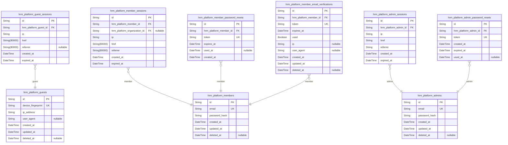
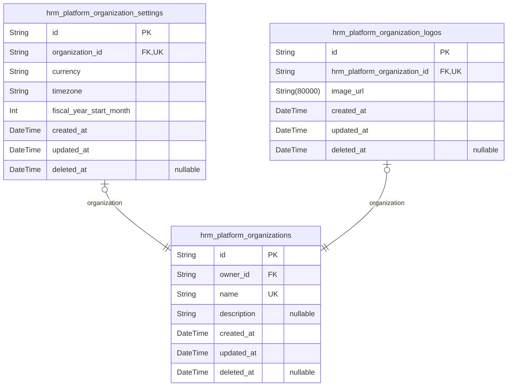
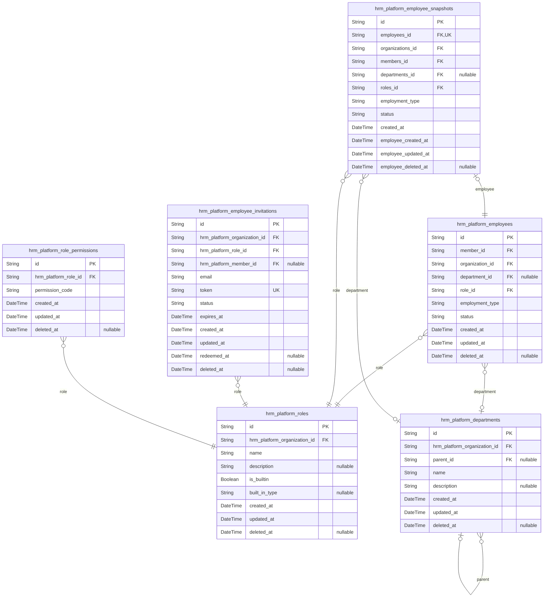
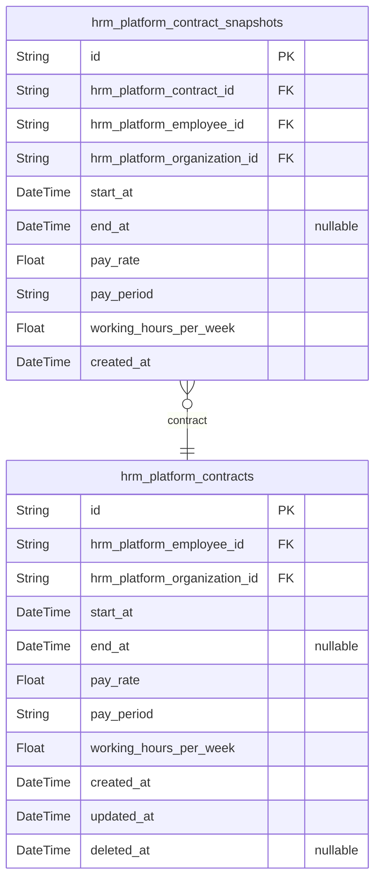
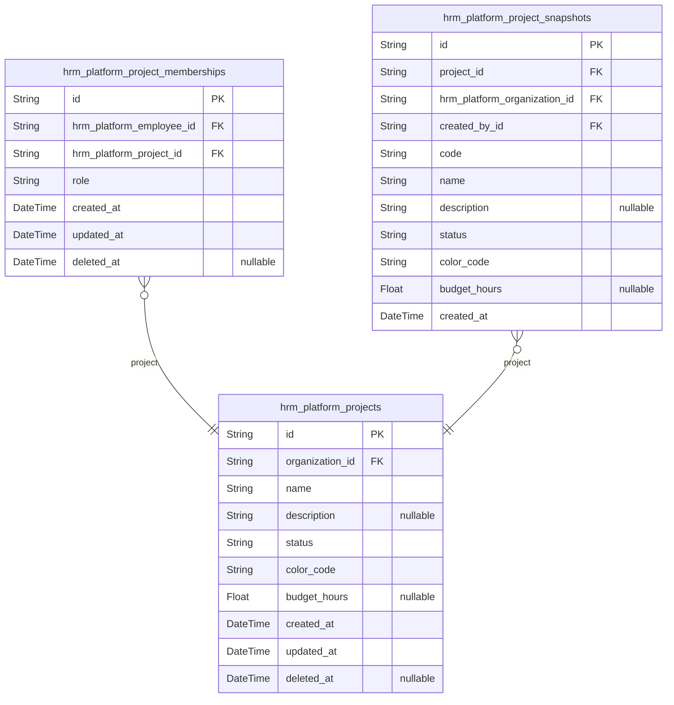
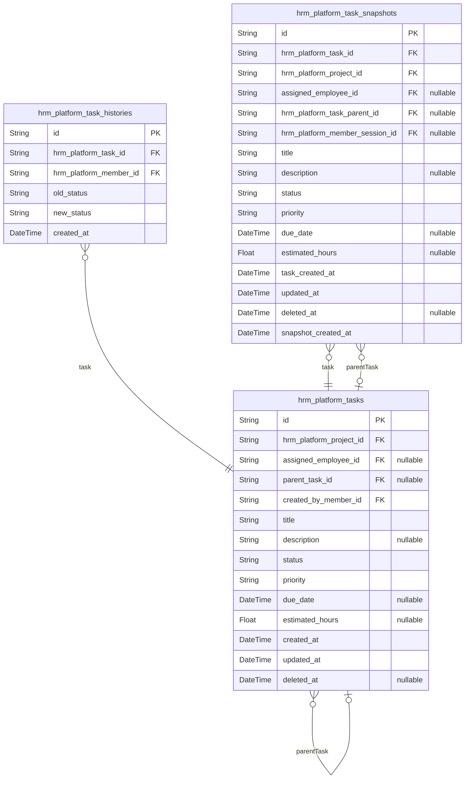
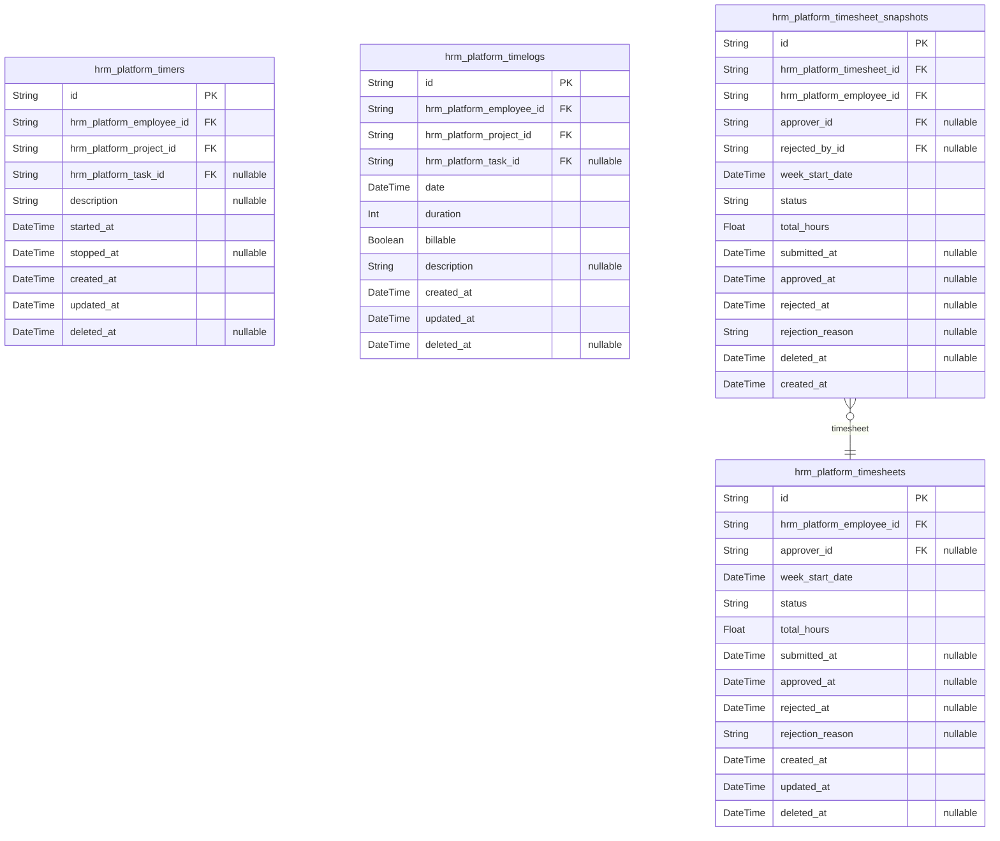
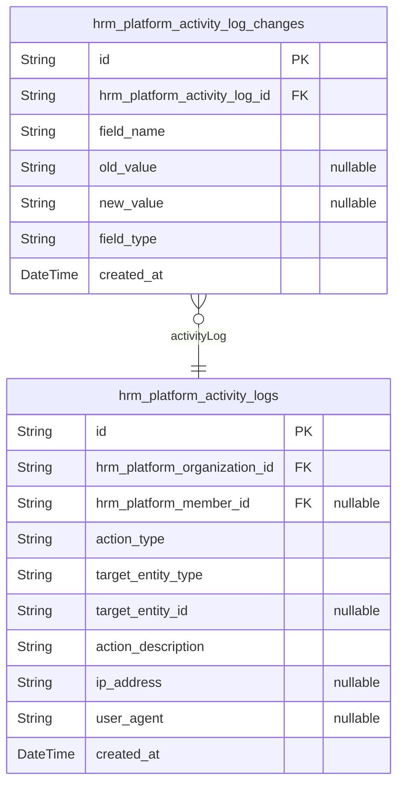

# Prisma Markdown

> Generated by [`prisma-markdown`](https://github.com/samchon/prisma-markdown)

- [Authorization](#authorization)
- [Organization](#organization)
- [Employee](#employee)
- [Contract](#contract)
- [Project](#project)
- [Task](#task)
- [TimeTracking](#timetracking)
- [ActivityLog](#activitylog)

## Authorization

### `hrm_platform_guests`

Temporary guest accounts for unauthenticated visitors to the platform.

Guests are anonymous users who have not yet logged in or established any
identity with the system. Each guest is identified by a device
fingerprint rather than a persistent user account. This table tracks
guest access for security monitoring purposes while maintaining complete
data isolation from organizational content.

Key characteristics:
- Stateless access with no session persistence
- No organization context or personalization
- Identified solely by device fingerprint
- Used for security monitoring and access attempt logging

Related entities:
- [hrm_platform_guest_sessions](#hrm_platform_guest_sessions) - Temporary session tokens for
guest access

Properties as follows:

- `id`: Primary Key.
- `device_fingerprint`
  > Unique device identifier used to recognize returning guest visitors.
  > Generated from browser/device characteristics for fingerprinting
  > purposes.
- `ip_address`
  > IP address from which the guest accessed the platform. Used for security
  > monitoring and access pattern analysis.
- `user_agent`
  > Browser and device user agent string from the guest's request. Used for
  > device identification and security analysis.
- `created_at`: Timestamp when the guest record was first created upon initial access.
- `updated_at`: Timestamp when the guest record was last updated.
- `deleted_at`
  > Timestamp when the guest record was soft deleted. Used for retention
  > policy enforcement and cleanup.

### `hrm_platform_guest_sessions`

Temporary session tokens for guest access without persistent authentication.

This table tracks short-lived session tokens for guest users during
authentication flows such as sign-up or login processes. Unlike member or
admin sessions, guest sessions are temporary and do not persist across
requests.

Key relationships:
- Belongs to [hrm_platform_guests](#hrm_platform_guests) - Links to the guest actor record
- Stores connection metadata (IP, href, referrer) for security monitoring
- Tracks session lifecycle with created_at and expired_at timestamps

Important notes:
- Guest sessions are typically short-lived and do not provide persistent
authentication
- Used during transitional states before full user authentication
- Session tokens are not cached and each request is evaluated independently
- All guest access attempts are logged for security monitoring purposes

Properties as follows:

- `id`: Primary Key.
- `hrm_platform_guest_id`: Belonged guest's [hrm_platform_guests.id](#hrm_platform_guests).
- `ip`: IP address of the guest during session creation for security monitoring.
- `href`: The URL where the guest initiated the session.
- `referrer`: The referrer URL that led the guest to the current page.
- `created_at`: Timestamp when the guest session was created.
- `expired_at`
  > Timestamp when the guest session expires. Used for session lifecycle
  > management and security.

### `hrm_platform_members`

Registered member accounts with email/password authentication credentials.

Members are authenticated users who can access the platform and perform
actions within their assigned role permissions. Each member has a unique
email address for authentication and can belong to multiple organizations
through employee relationships (managed in {@link
hrm_platform_employees}).

Key characteristics:
- Serves as the primary identity record for member actors
- Owns authentication credentials (email and password hash)
- Has one-to-many sessions stored in [hrm_platform_member_sessions](#hrm_platform_member_sessions)
- Can have multiple employee records across different organizations
- Supports soft deletion for account deactivation without data loss

Properties as follows:

- `id`: Primary Key.
- `email`
  > Unique email address used for member authentication and account
  > identification.
- `password_hash`
  > Hashed password for secure authentication. Never stores plain text
  > passwords.
- `created_at`: Timestamp when the member account was created.
- `updated_at`: Timestamp when the member account was last updated.
- `deleted_at`
  > Timestamp when the member account was soft-deleted. Null indicates active
  > account.

### `hrm_platform_member_sessions`

JWT session tokens for member authentication with organization context.
Each session represents an active login for a member account, tracking
the authenticated member, their current organization context, connection
details (IP, href, referrer), and session lifecycle (created_at,
expired_at). Members can switch between organizations they belong to, and
this table tracks which organization is currently active for the session.

Properties as follows:

- `id`: Primary Key.
- `hrm_platform_member_id`
  > Reference to the authenticated member account. {@link
  > hrm_platform_members.id}
- `hrm_platform_organization_id`
  > Current active organization for this session. Members can switch
  > contexts. [hrm_platform_organizations.id](#hrm_platform_organizations)
- `ip`: IP address where the session was initiated from.
- `href`: The URL where the session was initiated from.
- `referrer`: The referrer URL from the HTTP request that created this session.
- `created_at`: Timestamp when this session was created upon successful authentication.
- `expired_at`: Timestamp when this session expires or was explicitly logged out.

### `hrm_platform_member_password_resets`

Password reset tokens for member account recovery.

This table stores temporary tokens generated when a member requests a
password reset. Each token is unique, has an expiration time, and can
only be used once. When a member clicks the password reset link in their
email, the system validates the token against this table before allowing
the password change.

Key relationships:
- Belongs to [hrm_platform_members](#hrm_platform_members) - each reset request is
associated with a specific member account
- Tokens are generated with sufficient entropy to prevent guessing
- Expired or used tokens are automatically invalidated

Business context:
- Supports the password recovery workflow defined in the authentication
requirements
- Tokens typically expire within 1-24 hours for security
- Once used, tokens cannot be reused even if not expired
- Multiple tokens may exist for the same member if they request multiple
resets

Properties as follows:

- `id`: Primary Key.
- `hrm_platform_member_id`: Associated member's [hrm_platform_members.id](#hrm_platform_members).
- `token`: Unique password reset token with sufficient entropy for security.
- `expires_at`: Timestamp when this reset token expires and becomes invalid.
- `used_at`
  > Timestamp when this reset token was used. Null if token has not been used
  > yet.
- `created_at`: Timestamp when this password reset request was created.

### `hrm_platform_member_email_verifications`

Email verification tokens for member account registration confirmation.

This table stores time-limited, single-use tokens that are sent to
members via email for account verification during the registration
process. Each verification record is linked to a specific member account
and includes an expiration timestamp to ensure tokens are time-bound. The
table supports account security by enabling one-time use validation and
optional IP/user-agent tracking for audit purposes.

**Key relationships**:
- Links to [hrm_platform_members](#hrm_platform_members) via foreign key
- One-to-many relationship (one member can have multiple verification
attempts)
- Supports re-verification workflows

Properties as follows:

- `id`: Primary Key.
- `hrm_platform_member_id`
  > Reference to the member account being verified. {@link
  > hrm_platform_members.id}
- `token`: Unique verification token code sent to member email for validation.
- `expires_at`: Timestamp when this verification token expires.
- `used`: Whether this token has already been used for verification.
- `ip`: IP address of the device that requested this verification.
- `user_agent`: User agent string of the device that requested this verification.
- `created_at`: Timestamp when this verification token was created.
- `updated_at`: Timestamp when this record was last updated.
- `deleted_at`: Timestamp for soft deletion if applicable.

### `hrm_platform_admins`

Administrator accounts with email/password authentication and elevated
privileges for organization management.

Administrators are authenticated users who possess elevated privileges to
manage organization settings, employees, roles, departments, projects,
tasks, and timesheet approvals within their assigned organizations. Each
admin account has unique email credentials and can belong to multiple
organizations with varying permission levels.

Key relationships:
- Has many [hrm_platform_admin_sessions](#hrm_platform_admin_sessions) for active authentication
sessions
- Has many [hrm_platform_admin_password_resets](#hrm_platform_admin_password_resets) for password
recovery tokens
- Belongs to multiple [hrm_platform_organizations](#hrm_platform_organizations) through session
context
- Can manage [hrm_platform_employees](#hrm_platform_employees), {@link
hrm_platform_projects}, [hrm_platform_tasks](#hrm_platform_tasks) within organization
scope

Important behavioral notes:
- Admin authentication is separate from member authentication for
security isolation
- Admin accounts can be soft-deleted but credentials remain for audit trail
- Email addresses must be unique across all admin accounts
- Admin privileges are organization-scoped and cannot cross multi-tenancy
boundaries

Properties as follows:

- `id`: Primary Key.
- `email`
  > Unique email address used for administrator authentication and
  > identification.
- `password_hash`: BCrypt hashed password for secure administrator authentication.
- `created_at`: Timestamp when the administrator account was created.
- `updated_at`: Timestamp when the administrator account was last updated.
- `deleted_at`
  > Timestamp when the administrator account was soft-deleted. Null indicates
  > active account.

### `hrm_platform_admin_sessions`

JWT session tokens for administrator authentication with elevated access
within organizations.

This table maintains the authenticated state of administrator users who
possess elevated privileges across their organization. Each session is
scoped to a specific administrator account and preserves connection
metadata for security auditing.

Key relationships:
- Belongs to a single [hrm_platform_admins](#hrm_platform_admins) administrator account
- Sessions are append-only and represent login events
- Multiple concurrent sessions allowed per administrator across different
devices

Behavioral notes:
- Sessions persist until administrator logs out, account is deleted, or
organization is removed
- Session termination occurs immediately upon logout action
- All session actions are recorded in [hrm_platform_activity_logs](#hrm_platform_activity_logs)
for audit purposes
- Administrators can maintain concurrent sessions within the same
organization
- Sessions do not implement automatic expiration based on time or inactivity

Properties as follows:

- `id`: Primary Key.
- `hrm_platform_admin_id`: Belonged administrator's [hrm_platform_admins.id](#hrm_platform_admins).
- `ip`: IP address of the device used for administrator login.
- `href`: URL where the administrator initiated the login session.
- `referrer`: Referrer URL that directed the administrator to the login page.
- `created_at`
  > Timestamp when the administrator session was created upon successful
  > login.
- `expired_at`
  > Timestamp when the administrator session was terminated through logout or
  > system action.

### `hrm_platform_admin_password_resets`

Password reset tokens for administrator account recovery.

This table stores one-time use tokens that allow administrators to reset
their passwords when they have lost access to their account. Each token
is associated with a specific administrator account and has an expiration
time for security purposes.

Key characteristics:

- Tokens are generated when an administrator requests a password reset
- Each token can only be used once (tracked via used_at timestamp)
- Tokens expire after a configured time period (typically 1-24 hours)
- Multiple tokens can exist for the same administrator (e.g., if they
request multiple resets)
- Used tokens are not deleted immediately for audit trail purposes

Relationships:

- Belongs to [hrm_platform_admins](#hrm_platform_admins) - Links to the administrator
account requesting the reset
- One-to-many relationship: One admin can have multiple password reset
tokens over time

Properties as follows:

- `id`: Primary Key.
- `hrm_platform_admin_id`
  > Belonged administrator's [hrm_platform_admins.id](#hrm_platform_admins). Links the
  > password reset token to the administrator account requesting the reset.
- `token`
  > The password reset token string. This is a cryptographically secure
  > random string that the administrator uses to verify their identity when
  > resetting their password. The token is sent to the administrator's
  > registered email address.
- `created_at`
  > Timestamp when the password reset token was generated. Used to calculate
  > token age and determine if the token has expired.
- `expired_at`
  > Timestamp when the password reset token expires. Tokens are invalid after
  > this time for security purposes. Typically set to 1-24 hours after
  > creation.
- `used_at`
  > Timestamp when the password reset token was used to reset the password.
  > Null if the token has not been used yet. Once set, the token cannot be
  > used again.

## Organization

### `hrm_platform_organizations`

Main organization records representing the primary business container
within the platform.

Organizations serve as the fundamental multi-tenancy boundary, ensuring
complete data isolation between different companies or business units
using the platform. Each organization contains employees, projects,
tasks, time tracking data, and all business operations scoped to that
organization.

Key characteristics:
- Unique name identifies the organization across the system
- Owner reference tracks which member created and controls the organization
- Soft delete support allows organization deactivation while preserving
data integrity
- All organization-scoped entities reference this table for multi-tenancy
enforcement

Related entities:
- [hrm_platform_organization_settings](#hrm_platform_organization_settings) stores organization-specific
configuration (currency, timezone, fiscal year)
- [hrm_platform_organization_logos](#hrm_platform_organization_logos) stores branding assets
- [hrm_platform_employees](#hrm_platform_employees) belong to organizations
- [hrm_platform_projects](#hrm_platform_projects) belong to organizations
- [hrm_platform_departments](#hrm_platform_departments) belong to organizations

Properties as follows:

- `id`: Primary Key.
- `owner_id`
  > Owner's [hrm_platform_members.id](#hrm_platform_members). The member who created and has
  > full control over this organization.
- `name`: Organization name, must be unique across the system.
- `description`
  > Optional description providing additional context about the
  > organization's purpose or structure.
- `created_at`: Timestamp when the organization was created.
- `updated_at`: Timestamp when the organization was last updated.
- `deleted_at`
  > Timestamp when the organization was soft deleted. NULL means organization
  > is active.

### `hrm_platform_organization_settings`

Organization-specific configuration settings including currency,
timezone, and fiscal year parameters.

This table stores operational settings that define how an organization
manages its business operations. Each organization has exactly one
settings record that controls:

- **Currency**: The default currency code for financial calculations and
reporting
- **Timezone**: The organization's primary timezone for timestamp display
and scheduling
- **Fiscal Year Start Month**: The month (1-12) when the organization's
fiscal year begins

These settings are subsidiary to the [hrm_platform_organizations](#hrm_platform_organizations)
entity and are managed through organization administration workflows.
Changes to settings affect all organization-scoped operations including
time tracking, reporting, and financial calculations.

Properties as follows:

- `id`: Primary Key.
- `organization_id`
  > Belonged organization's [hrm_platform_organizations.id](#hrm_platform_organizations). Each
  > organization has exactly one settings record.
- `currency`
  > Three-letter ISO currency code (e.g., 'USD', 'EUR', 'KRW') for financial
  > calculations and reporting within the organization.
- `timezone`
  > IANA timezone identifier (e.g., 'Asia/Seoul', 'America/New_York') for
  > timestamp display and scheduling operations.
- `fiscal_year_start_month`
  > The month number (1-12) when the organization's fiscal year begins. Used
  > for financial reporting and period calculations.
- `created_at`: Timestamp when the organization settings record was created.
- `updated_at`: Timestamp when the organization settings were last modified.
- `deleted_at`
  > Timestamp when the organization settings were soft-deleted. Null
  > indicates active settings.

### `hrm_platform_organization_logos`

Logo images and branding assets for organizations.

This table stores logo image references for organizations to provide
visual identification in the user interface. Each organization can have
at most one active logo, establishing a 1:1 relationship with {@link
hrm_platform_organizations}.

The logo is managed through the parent organization entity and is not
independently searchable or filterable. When an organization is deleted,
its logo is also removed through cascade deletion.

Key relationships:
- Belongs to exactly one [hrm_platform_organizations](#hrm_platform_organizations) (1:1
relationship)

Properties as follows:

- `id`: Primary Key.
- `hrm_platform_organization_id`
  > Belonged organization's [hrm_platform_organizations.id](#hrm_platform_organizations).
  > Establishes 1:1 relationship where each organization has at most one
  > logo.
- `image_url`
  > URL or path to the logo image file. Stores the location of the uploaded
  > logo image for display in the user interface.
- `created_at`: Timestamp when the logo was uploaded/created.
- `updated_at`: Timestamp when the logo was last modified.
- `deleted_at`
  > Timestamp when the logo was soft deleted. Null indicates the logo is
  > currently active.

## Employee

### `hrm_platform_employees`

Employee records that establish work relationships between users and
organizations.

This table represents an individual's working relationship within a
specific organization, creating a bridge between a user account and
organization-specific work responsibilities. Each employee record enables
the individual to participate in organizational activities including time
tracking, project work, and timesheet submission.

Key relationships:
- Links to [hrm_platform_members](#hrm_platform_members) for user authentication and identity
- Belongs to [hrm_platform_organizations](#hrm_platform_organizations) establishing
organizational context
- Optionally assigned to [hrm_platform_departments](#hrm_platform_departments) for
organizational grouping
- Assigned exactly one [hrm_platform_roles](#hrm_platform_roles) determining permissions
and authorization

Business rules:
- Employment type classification: full-time, part-time, contractor, or
intern
- Status tracking: active employees can log time and submit timesheets;
deactivated employees cannot create new entries but historical data is
preserved
- Each user can have multiple employee records across different
organizations
- Role assignment determines what actions the employee can perform within
the organization

Properties as follows:

- `id`: Primary Key.
- `member_id`
  > User account that this employee record represents. Links to the
  > authenticated member identity. [hrm_platform_members.id](#hrm_platform_members)
- `organization_id`
  > Organization where this employee works. Establishes the organizational
  > context for all employee activities. {@link
  > hrm_platform_organizations.id}
- `department_id`
  > Department assignment for organizational grouping. Optional field that
  > can be null if employee is not assigned to any department. When
  > department is deleted, this is set to null. {@link
  > hrm_platform_departments.id}
- `role_id`
  > Role assigned to this employee determining permissions and authorization
  > level. Each employee must have exactly one role. {@link
  > hrm_platform_roles.id}
- `employment_type`
  > Classification of the employment relationship. Valid values: full-time,
  > part-time, contractor, intern. Determines how the employee's work is
  > tracked and reported.
- `status`
  > Current employment status. Valid values: active, deactivated. Active
  > employees can log time and submit timesheets. Deactivated employees
  > cannot create new entries but historical data is preserved.
- `created_at`: Timestamp when this employee record was created.
- `updated_at`: Timestamp when this employee record was last modified.
- `deleted_at`
  > Timestamp when this employee record was soft-deleted. Null means the
  > record is active. Used for reactivation support.

### `hrm_platform_roles`

Role definitions within organizations for role-based access control.

Roles represent named collections of permissions that determine what
actions employees can perform within an organization. Each role
aggregates specific permissions defining capabilities such as managing
employees, viewing projects, approving timesheets, or accessing reports.

The system includes three built-in roles (Owner, Manager, Employee) that
cannot be deleted or modified, providing a standard permission structure.
Organization owners can also create custom roles with tailored permission
combinations to match specific job functions.

Each employee is assigned exactly one role, which determines their
authorization level. When a role is assigned to an employee, they inherit
all permissions associated with that role.

Key relationships:
- Belongs to [hrm_platform_organizations](#hrm_platform_organizations) - roles are scoped to
specific organizations
- Assigned to many [hrm_platform_employees](#hrm_platform_employees) - employees reference
their assigned role
- Maps to many permissions through [hrm_platform_role_permissions](#hrm_platform_role_permissions)
- junction table for role-based access control

Built-in roles (is_builtin = true) cannot be deleted under any
circumstances. Custom roles (is_builtin = false) can only be deleted if
no employees are currently assigned to them.

Properties as follows:

- `id`: Primary Key.
- `hrm_platform_organization_id`
  > Belonged organization's [hrm_platform_organizations.id](#hrm_platform_organizations). Roles are
  > scoped to specific organizations and cannot be shared across
  > organizations.
- `name`
  > Unique name of the role within the organization. Built-in roles have
  > predefined names: 'Owner', 'Manager', 'Employee'. Custom roles can have
  > any descriptive name chosen by the organization owner.
- `description`
  > Detailed description explaining the role's purpose and typical
  > responsibilities. Helps administrators understand what the role is
  > intended for when assigning employees.
- `is_builtin`
  > Whether this is a built-in role (Owner, Manager, Employee) or a custom
  > role. Built-in roles cannot be deleted or modified. Custom roles can be
  > deleted if no employees are assigned.
- `built_in_type`
  > Type identifier for built-in roles: 'owner', 'manager', or 'employee'.
  > NULL for custom roles. Used to identify and protect built-in roles from
  > deletion or modification.
- `created_at`
  > Timestamp when the role was created. Built-in roles are created during
  > organization setup. Custom roles are created when organization owners
  > define new permission combinations.
- `updated_at`
  > Timestamp when the role was last modified. Custom roles can be updated to
  > change name, description, or permissions. Built-in roles should rarely be
  > updated.
- `deleted_at`
  > Timestamp when the role was soft-deleted. Only custom roles can be
  > deleted. Built-in roles cannot be deleted. When deleted, the role is no
  > longer available for new employee assignments.

### `hrm_platform_departments`

Departmental organizational units within organizations that provide
structural grouping for employees. Departments support a one-level
hierarchical structure where a department can have one parent department,
enabling subdepartment organization. Each department belongs to exactly
one organization and must have a unique name within that organization.
Departments facilitate employee assignment and organizational reporting
structures.

Properties as follows:

- `id`: Primary Key.
- `hrm_platform_organization_id`
  > The organization that owns this department. {@link
  > hrm_platform_organizations.id}
- `parent_id`
  > Optional parent department for one-level hierarchy. Only one level of
  > nesting is supported.
- `name`: Unique name identifying the department within its organization.
- `description`
  > Optional description clarifying the department's business purpose and
  > responsibilities.
- `created_at`: Timestamp when the department was created.
- `updated_at`: Timestamp when the department was last updated.
- `deleted_at`: Soft delete timestamp for department deactivation.

### `hrm_platform_employee_snapshots`

Point-in-time snapshots of employee records for audit trail and
historical tracking.

This table captures the complete state of employee records at specific
moments in time, preserving historical data for compliance, auditing, and
recovery purposes. Each snapshot contains all employee attributes
denormalized, including employment classification, status, department
assignment, and role association.

Key characteristics:
- Append-only: Snapshots are created but never modified or deleted
- Denormalized: All employee data is captured at snapshot time,
independent of future changes to referenced entities
- Historical preservation: Maintains accurate record of employee state
even if related entities (departments, roles) are later modified or
deleted
- Audit trail: Enables tracking of employee record changes over time

Relationships:
- [hrm_platform_employees](#hrm_platform_employees) - One snapshot per employee record
change (1:1 via unique constraint)
- [hrm_platform_organizations](#hrm_platform_organizations) - Organization context at snapshot time
- [hrm_platform_members](#hrm_platform_members) - User identity at snapshot time
- [hrm_platform_departments](#hrm_platform_departments) - Department assignment at snapshot
time (nullable)
- [hrm_platform_roles](#hrm_platform_roles) - Role assignment at snapshot time

Properties as follows:

- `id`: Primary Key.
- `employees_id`
  > Referenced employee record's [hrm_platform_employees.id](#hrm_platform_employees). Each
  > snapshot corresponds to exactly one employee record change.
- `organizations_id`
  > Organization's [hrm_platform_organizations.id](#hrm_platform_organizations) where the employee
  > works, captured at snapshot time.
- `members_id`
  > User's [hrm_platform_members.id](#hrm_platform_members) associated with this employee
  > record, captured at snapshot time.
- `departments_id`
  > Department's [hrm_platform_departments.id](#hrm_platform_departments) where the employee is
  > assigned, captured at snapshot time. Nullable if employee had no
  > department assignment.
- `roles_id`
  > Role's [hrm_platform_roles.id](#hrm_platform_roles) assigned to the employee, captured
  > at snapshot time.
- `employment_type`
  > Employment classification at snapshot time. Valid values: full-time,
  > part-time, contractor, intern.
- `status`: Employee status at snapshot time. Valid values: active, deactivated.
- `created_at`: Timestamp when this snapshot was created.
- `employee_created_at`: Original employee record creation timestamp, captured at snapshot time.
- `employee_updated_at`: Employee record last update timestamp, captured at snapshot time.
- `employee_deleted_at`
  > Employee record deletion timestamp, captured at snapshot time. Nullable
  > if employee was not deleted.

### `hrm_platform_employee_invitations`

Tracks pending employee invitations sent by managers to potential new
hires. Stores the invitee's email, assigned role, target organization,
invitation status, and unique redemption token. Used in the employee
onboarding workflow where managers invite people to join the
organization.

This table exists independently of employee records since invitations are
sent before employee relationships are established. Once an invitation is
redeemed, the user creates an account and an employee record is
subsequently created linking them to the organization.

Properties as follows:

- `id`: Primary Key.
- `hrm_platform_organization_id`: Belonged organization's [hrm_platform_organizations.id](#hrm_platform_organizations)
- `hrm_platform_role_id`: Assigned role's [hrm_platform_roles.id](#hrm_platform_roles)
- `hrm_platform_member_id`: User who redeemed the invitation's [hrm_platform_members.id](#hrm_platform_members)
- `email`: Email address of the person being invited to join the organization.
- `token`: Unique secure token for invitation redemption.
- `status`: Current status of the invitation (pending, accepted, expired, revoked).
- `expires_at`: Expiration timestamp after which the invitation is no longer valid.
- `created_at`: Timestamp when the invitation was created.
- `updated_at`: Timestamp when the invitation was last updated.
- `redeemed_at`: Timestamp when the invitation was accepted by the invitee.
- `deleted_at`
  > Timestamp when the invitation was soft deleted. Null means the invitation
  > is active.

### `hrm_platform_role_permissions`

Junction table mapping roles to their granted permissions for role-based
access control.

This table establishes the many-to-many relationship between {@link
hrm_platform_roles} and permission codes. Each record represents a single
permission granted to a specific role.

**Business Context**:

Roles in the system (both built-in and custom) are defined by the set of
permissions they grant. This table stores those permission assignments,
enabling flexible role-based access control.

**Available Permissions** (from Section 57):

- Organization management: edit organization settings
- Employee management: add, edit, or deactivate employees
- Employee viewing: view employee list and details
- Project management: create, edit, delete projects and tasks
- Project viewing: view projects and tasks
- Time management: edit or delete any employee's timelogs
- Time approval: approve or reject timesheets
- Time viewing: view all employees' timelogs and timesheets
- Report viewing: view organization reports

**Key Constraints**:

- Each role can have a permission only once (enforced by unique index)
- Built-in roles (Owner, Manager, Employee) have pre-configured permissions
- Custom roles can be assigned any combination of available permissions
- Soft delete support via deleted_at field for audit trail and recovery

Properties as follows:

- `id`: Primary Key.
- `hrm_platform_role_id`
  > Belonged role's [hrm_platform_roles.id](#hrm_platform_roles). This foreign key links the
  > permission to the role that grants it.
- `permission_code`
  > Permission identifier string that defines a specific capability. Examples
  > include 'organization_edit', 'employee_manage', 'employee_view',
  > 'project_manage', 'project_view', 'time_manage', 'time_approve',
  > 'time_view', 'report_view'.
- `created_at`: Timestamp when this permission was granted to the role.
- `updated_at`: Timestamp when this permission assignment was last modified.
- `deleted_at`
  > Timestamp when this permission assignment was soft deleted. Null
  > indicates the permission is currently active.

## Contract

### `hrm_platform_contracts`

Employment agreements between organizations and employees with
compensation terms, pay periods, and working hours.

Each contract represents a formal employment agreement that establishes
the specific terms under which an employee works for an organization.
Contracts define compensation rates, payment frequency, and working hour
expectations.

Key relationships:
- Each contract belongs to exactly one [hrm_platform_employees](#hrm_platform_employees) and
cannot exist independently of an employee record
- Each contract belongs to exactly one [hrm_platform_organizations](#hrm_platform_organizations)
for multi-tenancy data isolation
- Multiple contracts can exist for a single employee over their
employment history, but only one contract can be active at any given time
- Active contracts are those without an end_at date or with an end_at in
the future
- Historical contracts (with end_at in the past) become immutable records
for compliance and auditing

Contract versioning ensures continuous coverage without gaps: when a new
contract is created, the previous active contract is automatically ended
by setting its end_at to the day before the new contract starts.

This table is referenced by [hrm_platform_contract_snapshots](#hrm_platform_contract_snapshots) for
audit trail preservation.

Properties as follows:

- `id`: Primary Key.
- `hrm_platform_employee_id`
  > Belonged employee's [hrm_platform_employees.id](#hrm_platform_employees). Each contract is
  > tied to a specific employee and cannot exist independently.
- `hrm_platform_organization_id`
  > Belonged organization's [hrm_platform_organizations.id](#hrm_platform_organizations). Ensures
  > multi-tenancy data isolation.
- `start_at`
  > The date when the employment terms begin. Required field that marks the
  > start of the contract.
- `end_at`
  > The date when the employment terms conclude. Optional field - when null,
  > the contract is considered ongoing and continues indefinitely. When
  > present, must be on or after start_at.
- `pay_rate`
  > The employee's compensation amount expressed in the organization's
  > configured currency. Represents the base compensation before any
  > deductions or additional benefits.
- `pay_period`
  > The frequency of payment cycles. One of: hourly, daily, weekly, or
  > monthly. Determines how the pay_rate is interpreted in compensation
  > calculations.
- `working_hours_per_week`
  > The standard working hours per week for the employee. Establishes the
  > expected full-time equivalent baseline for calculating overtime,
  > part-time ratios, and workload expectations.
- `created_at`: Timestamp when this contract was created in the system.
- `updated_at`: Timestamp when this contract was last updated.
- `deleted_at`
  > Timestamp when this contract was soft deleted. Null indicates the
  > contract is active in the system.

### `hrm_platform_contract_snapshots`

Point-in-time snapshots of contract records for audit trail and
historical tracking.

This table captures the complete state of employment contracts at
specific moments in time, enabling:

- **Audit Trail**: Track all changes to contract terms over time
- **Compliance**: Maintain immutable records of employment agreements for
legal requirements
- **Historical Reference**: View what contract terms were in effect at
any point in time
- **Recovery**: Restore previous contract states if needed

Each snapshot is created when a contract is modified, preserving the
original terms including compensation, pay period, working hours, and
duration. Snapshots are immutable once created and serve as the
authoritative historical record of employment agreements.

Relationships:
- Belongs to [hrm_platform_contracts](#hrm_platform_contracts) - the contract being snapshot
- References [hrm_platform_employees](#hrm_platform_employees) - the employee under contract
- References [hrm_platform_organizations](#hrm_platform_organizations) - the organization
employing the worker

Properties as follows:

- `id`: Primary Key.
- `hrm_platform_contract_id`
  > Reference to the contract being snapshot. {@link
  > hrm_platform_contracts.id}
- `hrm_platform_employee_id`
  > Reference to the employee under this contract. {@link
  > hrm_platform_employees.id}
- `hrm_platform_organization_id`
  > Reference to the organization employing the worker. {@link
  > hrm_platform_organizations.id}
- `start_at`
  > The date when this contract employment terms begin. Required field that
  > marks the start of the employment agreement.
- `end_at`
  > The date when this contract employment terms conclude. Optional field -
  > null indicates ongoing contract without end date.
- `pay_rate`
  > The compensation amount specified in the contract. Required numeric value
  > representing base pay before deductions.
- `pay_period`
  > The frequency of payment cycles. One of: hourly, daily, weekly, or
  > monthly. Determines how pay_rate is interpreted.
- `working_hours_per_week`
  > The standard working hours per week for the employee. Required value
  > establishing full-time equivalent baseline for overtime and workload
  > calculations.
- `created_at`
  > Timestamp when this snapshot was created. Records the point in time when
  > contract state was captured.

## Project

### `hrm_platform_projects`

Work containers within organizations that group related work efforts and
business initiatives.

Projects serve as the primary organizational structure for tracking time
expenditures against specific business objectives. Each project
represents a distinct body of work that employees contribute time and
effort towards achieving specific goals.

Key relationships:
- Belongs to [hrm_platform_organizations](#hrm_platform_organizations) - projects are scoped to
a single organization
- Has many [hrm_platform_project_memberships](#hrm_platform_project_memberships) - links employees to
projects with role designations
- Has many [hrm_platform_tasks](#hrm_platform_tasks) - tasks are discrete work units
within projects

Status states:
- `active`: Work is currently in progress, accepting new time entries
- `completed`: All planned work finished, historical records accessible
but no new time entries
- `archived`: Preserved for historical reference, read-only for time
tracking

Visual identification via color_code enables employees to quickly
distinguish between multiple projects when creating time entries or
viewing reports.

Properties as follows:

- `id`: Primary Key.
- `organization_id`
  > Belonged organization's [hrm_platform_organizations.id](#hrm_platform_organizations). Projects
  > are scoped to a single organization and cannot span multiple
  > organizations.
- `name`
  > Required project name that uniquely identifies the project within the
  > organization. Used as the primary identifier for employees when selecting
  > projects for time entries and task assignments.
- `description`
  > Optional description that clarifies the project's purpose, scope, and
  > boundaries. Helps employees understand which work belongs to which
  > project when logging time.
- `status`
  > Project lifecycle status. Valid values: 'active' (work in progress,
  > accepting time entries), 'completed' (work finished, read-only),
  > 'archived' (historical reference, read-only). Completed and archived
  > projects prevent new time entries.
- `color_code`
  > Required color code for visual distinction across user interfaces.
  > Enables employees to quickly identify projects when creating time
  > entries, viewing reports, or browsing project lists.
- `budget_hours`
  > Optional total estimated effort in hours for the project. Provides a
  > baseline against which actual time logged can be compared to track
  > whether work is proceeding within planned estimates.
- `created_at`: Timestamp when the project was created.
- `updated_at`: Timestamp when the project was last updated.
- `deleted_at`
  > Timestamp when the project was soft deleted. Null indicates the project
  > is active.

### `hrm_platform_project_memberships`

Junction table linking employees to projects with role designations.

This table establishes many-to-many relationships between employees and
projects, enabling employees to participate in multiple projects and
projects to have multiple team members. Each membership record includes a
role designation (member or project-lead) that determines the employee's
level of authority within the project.

Key relationships:
- Links to [hrm_platform_employees](#hrm_platform_employees) via foreign key
- Links to [hrm_platform_projects](#hrm_platform_projects) via foreign key
- Each employee can have multiple memberships across different projects
- Each project can have multiple member employees
- Only one membership per employee-project combination (enforced by
unique constraint)

Role designations:
- "member": Regular team member with standard project access
- "project-lead": Project lead with elevated permissions for task
management and team coordination

Properties as follows:

- `id`: Primary Key.
- `hrm_platform_employee_id`
  > Belonged employee's [hrm_platform_employees.id](#hrm_platform_employees). Establishes which
  > employee is assigned to the project.
- `hrm_platform_project_id`
  > Belonged project's [hrm_platform_projects.id](#hrm_platform_projects). Establishes which
  > project the employee is assigned to.
- `role`
  > Role designation within the project. Valid values are 'member' for
  > regular team members or 'project-lead' for employees with elevated task
  > management permissions.
- `created_at`: Timestamp when the project membership was created.
- `updated_at`: Timestamp when the project membership was last updated.
- `deleted_at`
  > Timestamp when the project membership was soft deleted. Null indicates
  > active membership.

### `hrm_platform_project_snapshots`

Point-in-time snapshots of project records for audit trail and historical
tracking.

These snapshots capture the complete state of a project at specific
moments in time, preserving historical data for compliance, recovery, and
audit purposes. Each snapshot is immutable once created and reflects the
exact state of the project including all denormalized fields.

Key characteristics:
- **Immutable records**: Once created, snapshots are never modified or
deleted
- **Complete state capture**: All project fields are denormalized to
preserve exact historical state
- **Audit trail**: Enables tracking of project lifecycle changes over time
- **Compliance support**: Provides verifiable historical records for
regulatory requirements

Related entities:
- Parent: [hrm_platform_projects](#hrm_platform_projects) - The project being snapshot
- Organization: [hrm_platform_organizations](#hrm_platform_organizations) - Organization that
owns the project
- Creator: [hrm_platform_members](#hrm_platform_members) - User who created the snapshot

Properties as follows:

- `id`: Primary Key.
- `project_id`
  > Reference to the parent project record being snapshot. {@link
  > hrm_platform_projects.id}
- `hrm_platform_organization_id`
  > Organization that owns this project snapshot. {@link
  > hrm_platform_organizations.id}
- `created_by_id`: Member who created this snapshot. [hrm_platform_members.id](#hrm_platform_members)
- `code`: Unique project code within the organization at snapshot time.
- `name`: Project name at snapshot time.
- `description`: Project description at snapshot time.
- `status`: Project status at snapshot time (active, completed, archived).
- `color_code`: Visual color identifier for the project at snapshot time.
- `budget_hours`: Budgeted hours for the project at snapshot time.
- `created_at`: Timestamp when this snapshot was created.

## Task

### `hrm_platform_tasks`

Main task entity representing discrete work units within projects. Tasks
are the smallest unit of work tracking with status progression, priority
classification, and optional subtask relationships.

Tasks belong to projects and can be assigned to employees who are members
of that project. Each task may have an optional parent task for one-level
subtask hierarchy (subtasks cannot have their own subtasks). Task status
changes are automatically recorded in [hrm_platform_task_histories](#hrm_platform_task_histories)
for audit trail purposes.

Key relationships:
- Belongs to exactly one [hrm_platform_projects](#hrm_platform_projects)
- Optionally assigned to one [hrm_platform_employees](#hrm_platform_employees) (must be
project member)
- Optionally has one parent [hrm_platform_tasks](#hrm_platform_tasks) (for subtasks)
- Has many child subtasks (through self-referential relationship)
- Has many [hrm_platform_task_histories](#hrm_platform_task_histories) entries for status change
audit
- Has many [hrm_platform_task_snapshots](#hrm_platform_task_snapshots) for point-in-time state
preservation
- Created by a [hrm_platform_members](#hrm_platform_members) for audit trail

Tasks support optional due dates for deadline tracking and estimated
hours for effort planning. The status field tracks task progression
through the workflow lifecycle.

Properties as follows:

- `id`: Primary Key.
- `hrm_platform_project_id`
  > Belonged project's [hrm_platform_projects.id](#hrm_platform_projects). Tasks must belong to
  > exactly one project.
- `assigned_employee_id`
  > Assigned employee's [hrm_platform_employees.id](#hrm_platform_employees). Optional - task
  > may remain unassigned. Employee must be a member of the project
  > containing this task.
- `parent_task_id`
  > Parent task's [hrm_platform_tasks.id](#hrm_platform_tasks). Optional - if set, this task
  > is a subtask of the parent. Subtasks cannot have their own subtasks (one
  > level only).
- `created_by_member_id`
  > Creator member's [hrm_platform_members.id](#hrm_platform_members). Tracks which
  > authenticated member created this task for audit purposes.
- `title`: Task title or name. Required field that identifies the work item.
- `description`
  > Detailed description of the task work. Optional field providing
  > additional context.
- `status`
  > Current task status tracking workflow progression. Valid values depend on
  > task status workflow configuration.
- `priority`
  > Task priority classification for work ordering. Valid values defined in
  > priority classification business rules.
- `due_date`
  > Optional due date when the task should be completed. Used for planning
  > and deadline tracking.
- `estimated_hours`
  > Optional estimated hours representing anticipated time required to
  > complete the task. Used for effort planning and capacity management.
- `created_at`: Timestamp when the task was created.
- `updated_at`: Timestamp when the task was last updated.
- `deleted_at`: Timestamp when the task was soft deleted. Null means task is active.

### `hrm_platform_task_histories`

Immutable audit trail recording all task status changes throughout the
task lifecycle.

Each time a task's status is modified, a new history entry is
automatically created to document the transition. This ensures complete
visibility into how tasks progress from creation through completion.

The history record preserves the exact moment when a status change
occurred and identifies which member performed the modification. Both the
previous status and the new status are captured to show the complete
transition path.

TaskHistory entries are read-only once created. They serve as factual
records that cannot be altered or deleted, providing an accurate account
of task evolution. This audit capability supports accountability and
helps organizations understand how work flows through their processes.

Key relationships:
- [hrm_platform_tasks](#hrm_platform_tasks) - Parent task that this history entry
belongs to
- [hrm_platform_members](#hrm_platform_members) - Member who made the status change

Properties as follows:

- `id`: Primary Key.
- `hrm_platform_task_id`
  > Belonged task's [hrm_platform_tasks.id](#hrm_platform_tasks). Each history entry is
  > associated with exactly one task.
- `hrm_platform_member_id`
  > Member who made the status change's [hrm_platform_members.id](#hrm_platform_members).
  > Identifies which user performed the modification for accountability.
- `old_status`
  > The task status before the change occurred. Preserves the previous state
  > for complete transition tracking.
- `new_status`
  > The task status after the change occurred. Records the new state that the
  > task transitioned to.
- `created_at`
  > Timestamp when the status change occurred. Records the exact date and
  > time of the modification.

### `hrm_platform_task_snapshots`

Point-in-time snapshots of task records for audit trail and historical
tracking.

This table captures the complete state of tasks at specific moments in
time, preserving all task attributes including title, description,
status, priority, assignment, due date, estimated hours, and temporal
fields. Each snapshot is created when significant changes occur to a
task, enabling organizations to review historical task states and recover
from unintended modifications.

Key relationships:
- Belongs to [hrm_platform_tasks](#hrm_platform_tasks) - the parent task being snapshot
- References [hrm_platform_projects](#hrm_platform_projects) - the project containing the
task (denormalized)
- References [hrm_platform_employees](#hrm_platform_employees) - the employee assigned to
the task (denormalized, optional)
- References [hrm_platform_tasks](#hrm_platform_tasks) as parent - for subtask
relationships (denormalized, optional)
- References [hrm_platform_member_sessions](#hrm_platform_member_sessions) - the session that
created the original task (denormalized, optional)

Snapshots are immutable once created and serve as the authoritative
record of task state at a given point in time. They support compliance
requirements, audit trails, and data recovery operations.

Properties as follows:

- `id`: Primary Key.
- `hrm_platform_task_id`: Parent task's [hrm_platform_tasks.id](#hrm_platform_tasks) that this snapshot captures.
- `hrm_platform_project_id`
  > Project's [hrm_platform_projects.id](#hrm_platform_projects) containing the task at
  > snapshot time (denormalized).
- `assigned_employee_id`
  > Assigned employee's [hrm_platform_employees.id](#hrm_platform_employees) at snapshot time
  > (denormalized, optional).
- `hrm_platform_task_parent_id`
  > Parent task's [hrm_platform_tasks.id](#hrm_platform_tasks) if this is a subtask
  > (denormalized, optional).
- `hrm_platform_member_session_id`
  > Creator session's [hrm_platform_member_sessions.id](#hrm_platform_member_sessions) that created
  > the original task (denormalized, optional).
- `title`: Task title at the time of snapshot.
- `description`: Task description at the time of snapshot (optional).
- `status`
  > Task status at the time of snapshot (e.g., todo, in_progress, done,
  > cancelled).
- `priority`: Task priority at the time of snapshot (e.g., low, medium, high, urgent).
- `due_date`: Task due date at the time of snapshot (optional).
- `estimated_hours`: Estimated hours for task completion at the time of snapshot (optional).
- `task_created_at`: Original task creation timestamp at the time of snapshot.
- `updated_at`: Task last update timestamp at the time of snapshot.
- `deleted_at`: Task soft delete timestamp at the time of snapshot (null if not deleted).
- `snapshot_created_at`: Timestamp when this snapshot was created.

## TimeTracking

### `hrm_platform_timers`

Active timer sessions for live time tracking. Each timer represents a
real-time work session where an employee tracks time as they work. Only
one timer can be active per employee at any time. The timer records when
work started and when it stopped, with automatic duration calculation
upon completion. Timers are always associated with a project and
optionally with a specific task within that project. When stopped, the
timer can be converted to a timelog entry for permanent record-keeping.

Properties as follows:

- `id`: Primary Key.
- `hrm_platform_employee_id`
  > Employee who owns this timer session. Only one active timer allowed per
  > employee at any time. [hrm_platform_employees.id](#hrm_platform_employees)
- `hrm_platform_project_id`
  > Project against which time is being tracked. Required for all timer
  > sessions. [hrm_platform_projects.id](#hrm_platform_projects)
- `hrm_platform_task_id`
  > Optional specific task within the project. Allows granular time tracking
  > against individual work items. [hrm_platform_tasks.id](#hrm_platform_tasks)
- `description`: Optional description of work being performed during this timer session.
- `started_at`: Timestamp when the timer was started and began tracking time.
- `stopped_at`
  > Timestamp when the timer was stopped. Null while timer is actively
  > running.
- `created_at`: Record creation timestamp.
- `updated_at`: Last update timestamp.
- `deleted_at`: Soft delete timestamp for audit trail preservation.

### `hrm_platform_timelogs`

Individual time entries recording work performed by employees on specific
calendar dates.

Each timelog captures a single day's work with duration in minutes,
project association, optional task reference, and billable
classification. Timelogs serve as the fundamental unit of time tracking,
aggregating into weekly timesheets for approval and payroll processing.

Key characteristics:
- Date represents when work was performed and is immutable once created
- Duration recorded in minutes for precise time tracking
- Project association is required; task association is optional
- Billable flag defaults to true for client chargeable work
- Timelogs become immutable once included in approved timesheets
- Soft delete support allows recovery before timesheet approval

Related entities:
- [hrm_platform_employees](#hrm_platform_employees) - Employee who created the timelog
- [hrm_platform_projects](#hrm_platform_projects) - Project the work belongs to
- [hrm_platform_tasks](#hrm_platform_tasks) - Optional specific task within the project
- [hrm_platform_timesheets](#hrm_platform_timesheets) - Weekly aggregation containing
multiple timelogs

Properties as follows:

- `id`: Primary Key.
- `hrm_platform_employee_id`: Employee who created this timelog. [hrm_platform_employees.id](#hrm_platform_employees)
- `hrm_platform_project_id`
  > Project this timelog belongs to. Required association. {@link
  > hrm_platform_projects.id}
- `hrm_platform_task_id`
  > Optional specific task within the project. Must belong to same project as
  > project_id. [hrm_platform_tasks.id](#hrm_platform_tasks)
- `date`: Calendar date when work was performed. Immutable once timelog is created.
- `duration`: Work duration in minutes. Must be a positive integer value.
- `billable`
  > Whether this time entry is billable to client. Defaults to true for
  > chargeable work.
- `description`: Optional text description of work accomplished during this time entry.
- `created_at`: Timestamp when this timelog was created.
- `updated_at`: Timestamp when this timelog was last updated.
- `deleted_at`: Soft delete timestamp. Null indicates active timelog.

### `hrm_platform_timesheets`

Weekly timesheet aggregations that consolidate all timelogs for a
specific employee within a single calendar week (Monday to Sunday).

Timesheets serve as the official record of work hours for approval and
compensation purposes. Each timesheet aggregates timelogs belonging to an
employee for a specific week and progresses through an approval workflow
with distinct status states: draft, submitted, approved, and rejected.

Key business rules:
- One timesheet per employee per week in submitted or approved status
- Timesheets automatically include all timelogs for the specified week
- Approved timesheets lock all contained timelogs from modification
- Rejected timesheets return to draft status with rejection reason preserved
- Total hours are calculated from included timelogs

Related entities:
- [hrm_platform_employees](#hrm_platform_employees) - Employee who owns the timesheet
- [hrm_platform_timelogs](#hrm_platform_timelogs) - Individual time entries aggregated in
the timesheet
- [hrm_platform_timesheet_snapshots](#hrm_platform_timesheet_snapshots) - Historical snapshots for
audit trail

Properties as follows:

- `id`: Primary Key.
- `hrm_platform_employee_id`: Employee who owns this timesheet. [hrm_platform_employees.id](#hrm_platform_employees)
- `approver_id`
  > Employee who approved or rejected this timesheet. {@link
  > hrm_platform_employees.id}
- `week_start_date`
  > Monday date marking the start of the week covered by this timesheet. The
  > timesheet covers Monday through Sunday of this week.
- `status`
  > Current status of the timesheet in the approval workflow. Valid values:
  > draft (initial state, editable), submitted (awaiting approval), approved
  > (finalized, timelogs locked), rejected (returned to draft with reason).
- `total_hours`
  > Total hours worked during the week, calculated by summing all timelog
  > durations included in this timesheet. Displayed as decimal hours (e.g.,
  > 40.5 for 40 hours 30 minutes).
- `submitted_at`
  > Timestamp when the employee submitted this timesheet for approval. Null
  > for draft or rejected timesheets.
- `approved_at`
  > Timestamp when the timesheet was approved by an authorized reviewer. Null
  > for draft, submitted, or rejected timesheets.
- `rejected_at`
  > Timestamp when the timesheet was rejected by an authorized reviewer. Null
  > for draft, submitted, or approved timesheets.
- `rejection_reason`
  > Reason provided by the reviewer when rejecting the timesheet. Required
  > when rejecting. Visible to the employee for corrections.
- `created_at`: Timestamp when this timesheet was first created.
- `updated_at`: Timestamp when this timesheet was last modified.
- `deleted_at`
  > Timestamp when this timesheet was soft deleted. Null means the timesheet
  > is active.

### `hrm_platform_timesheet_snapshots`

Point-in-time snapshots of timesheet records for audit trail and
historical tracking.

This table preserves the complete state of timesheets at specific moments
in time, enabling compliance auditing, historical analysis, and recovery
of past timesheet states. Each snapshot captures all timesheet attributes
including employee assignment, week period, approval status,
approval/rejection details, and total hours worked.

Snapshots are created when timesheets undergo significant state changes
such as submission, approval, or rejection. The snapshot mechanism
ensures that historical timesheet data remains immutable and accessible
even after the original timesheet is modified or deleted.

Key relationships:
- References [hrm_platform_timesheets](#hrm_platform_timesheets) as the parent timesheet
being snapshot
- References [hrm_platform_employees](#hrm_platform_employees) for the employee who owns the
timesheet
- Optionally references [hrm_platform_employees](#hrm_platform_employees) for approver
information

This snapshot table follows the standard pattern used across the platform
for audit trail preservation, similar to {@link
hrm_platform_employee_snapshots}, {@link
hrm_platform_contract_snapshots}, and {@link
hrm_platform_project_snapshots}.

Properties as follows:

- `id`: Primary Key.
- `hrm_platform_timesheet_id`
  > Reference to the parent timesheet that was snapshot. {@link
  > hrm_platform_timesheets.id}
- `hrm_platform_employee_id`
  > Reference to the employee who owns this timesheet. {@link
  > hrm_platform_employees.id}
- `approver_id`
  > Reference to the employee who approved this timesheet, if approved.
  > [hrm_platform_employees.id](#hrm_platform_employees)
- `rejected_by_id`
  > Reference to the employee who rejected this timesheet, if rejected.
  > [hrm_platform_employees.id](#hrm_platform_employees)
- `week_start_date`: The start date (Monday) of the week covered by this timesheet snapshot.
- `status`
  > The approval status of the timesheet at snapshot time. Valid values:
  > 'pending', 'submitted', 'approved', 'rejected'.
- `total_hours`
  > The total sum of all timelog durations in hours for this timesheet at
  > snapshot time.
- `submitted_at`
  > The timestamp when the timesheet was submitted for approval, if status is
  > 'submitted' or beyond. Null for 'pending' status.
- `approved_at`
  > The timestamp when the timesheet was approved, if status is 'approved'.
  > Null for other statuses.
- `rejected_at`
  > The timestamp when the timesheet was rejected, if status is 'rejected'.
  > Null for other statuses.
- `rejection_reason`
  > The reason provided by the approver when rejecting the timesheet. Null if
  > not rejected.
- `deleted_at`
  > The timestamp when the original timesheet was soft deleted. Null if
  > timesheet is active.
- `created_at`
  > The timestamp when this snapshot was created, recording when the
  > timesheet state was captured.

## ActivityLog

### `hrm_platform_activity_logs`

Comprehensive audit trail recording all significant business actions
across the organization including employee management events, contract
changes, project lifecycle events, task status updates, timesheet
approvals, and role assignments. Each log entry is immutable once created
and includes the acting user, target entity, action type, and detailed
change information for full audit compliance.

Properties as follows:

- `id`: Primary Key.
- `hrm_platform_organization_id`: Organization that this activity belongs to for multi-tenancy isolation.
- `hrm_platform_member_id`: User who performed the action that triggered this activity log entry.
- `action_type`
  > Type of action performed, e.g., 'employee_hired', 'timesheet_approved',
  > 'project_archived'. Used for filtering and categorization.
- `target_entity_type`
  > Type of entity affected by the action, e.g., 'employee', 'project',
  > 'task', 'timesheet'. Used to identify what business object was modified.
- `target_entity_id`
  > ID of the entity affected by the action. Nullable for organization-wide
  > actions not tied to a specific entity.
- `action_description`: Human-readable description of the action for audit trail clarity.
- `ip_address`
  > IP address of the client when the action was performed, for security
  > auditing.
- `user_agent`: HTTP User-Agent header from the request that triggered this action.
- `created_at`: Timestamp when this action was performed.

### `hrm_platform_activity_log_changes`

Atomic key-value pairs storing field-level changes for activity log entries.

This table decomposes the changes data from parent {@link
hrm_platform_activity_logs} to maintain First Normal Form (1NF)
compliance by avoiding JSON storage in string fields. Each record
represents a single field change within an activity log entry, capturing
the field name, previous value, new value, and field type.

Key characteristics:
- Child table of [hrm_platform_activity_logs](#hrm_platform_activity_logs) with 1:N relationship
- Immutable audit trail data - never updated or deleted after creation
- Managed exclusively through parent activity log operations
- Enables granular change tracking for compliance and history purposes

Use cases:
- Track which specific fields changed in employee records, contracts,
projects, or tasks
- Preserve old and new values for audit trail
- Support compliance requirements for detailed change history
- Enable recovery of historical field values

Properties as follows:

- `id`: Primary Key.
- `hrm_platform_activity_log_id`
  > Parent activity log entry's [hrm_platform_activity_logs.id](#hrm_platform_activity_logs). This
  > foreign key establishes the relationship between the change record and
  > its parent activity log entry.
- `field_name`
  > Name of the field that changed (e.g., 'status', 'title', 'assigned_to',
  > 'end_date'). This identifies which specific attribute was modified in the
  > target entity.
- `old_value`
  > Previous value of the field before the change. Nullable for newly created
  > fields that had no prior value.
- `new_value`
  > New value of the field after the change. Nullable for deleted fields or
  > when a value is removed.
- `field_type`
  > Data type of the changed field (e.g., 'string', 'int', 'datetime',
  > 'boolean', 'uuid'). Provides context for interpreting the old and new
  > values.
- `created_at`
  > Timestamp when this change record was created. Immutable for audit trail
  > integrity.
