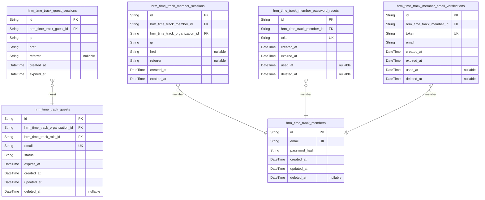
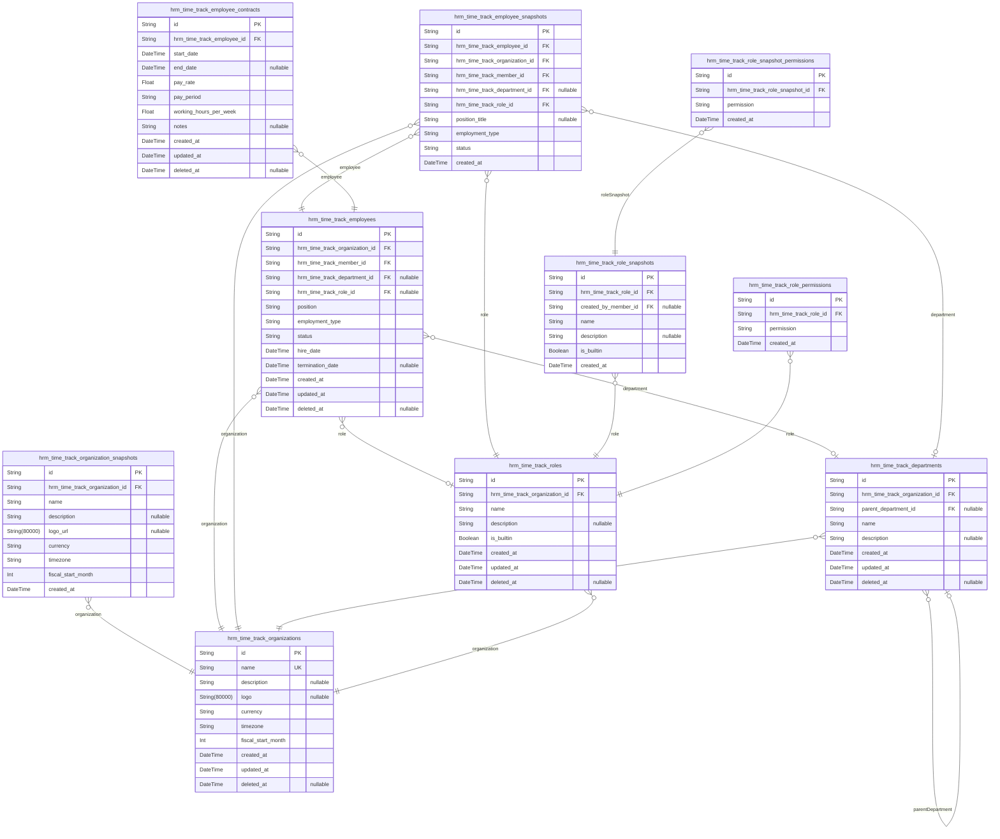
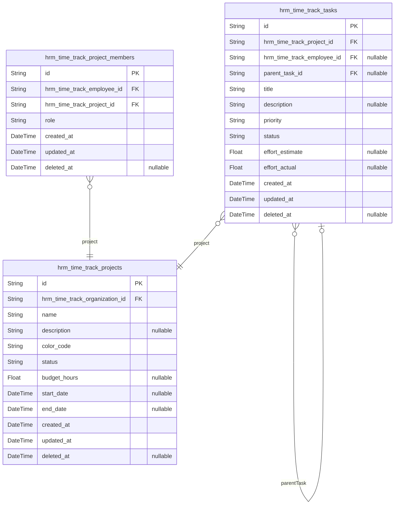
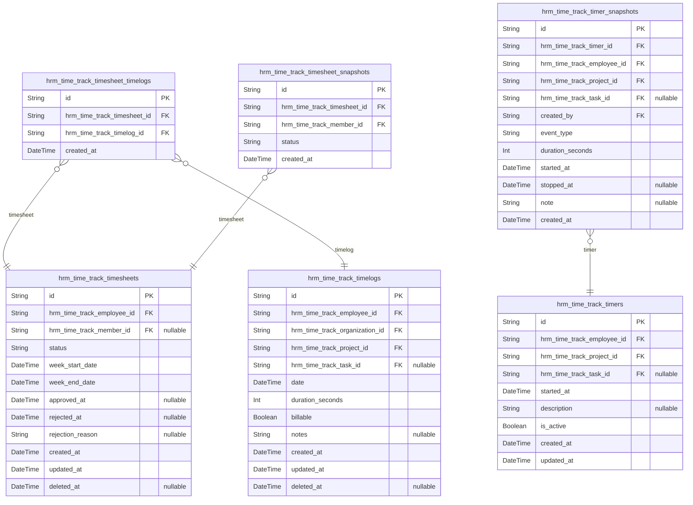
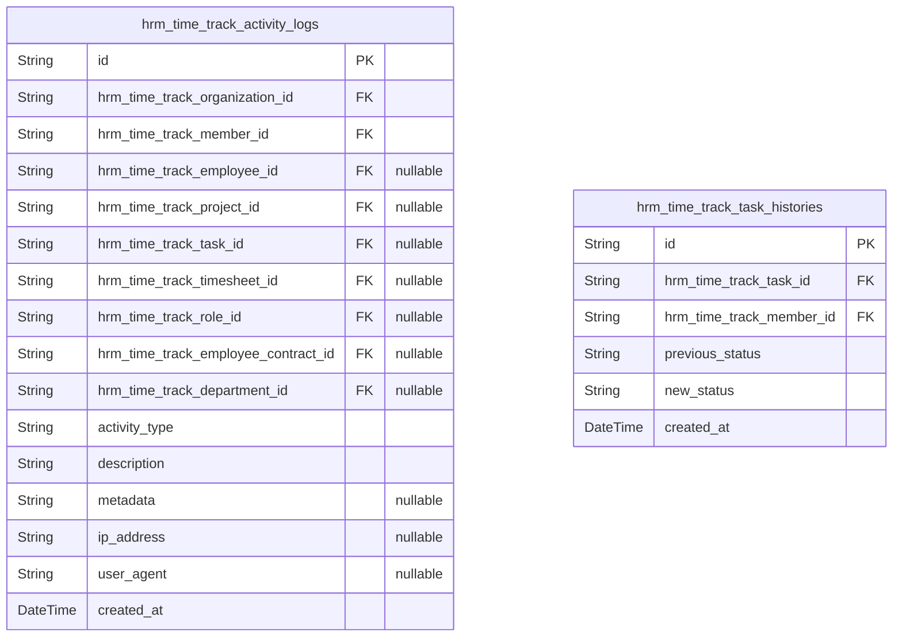

# Prisma Markdown

> Generated by [`prisma-markdown`](https://github.com/samchon/prisma-markdown)

- [auth](#auth)
- [org](#org)
- [project](#project)
- [time](#time)
- [audit](#audit)

## auth

### `hrm_time_track_guests`

Pending invitations for unregistered email addresses awaiting
organization membership.

Guests represent unregistered email addresses that have received
organization invitations but have not yet created accounts. Each guest
invitation contains the invited email address, the organization they were
invited to join, and the role they will be assigned upon acceptance.
Guests have no system permissions until they complete account
registration.

When a guest creates an account using the invited email address, they are
automatically added to the organization with their assigned role. The
invitation is consumed during account creation and cannot be reused.

Properties as follows:

- `id`: Primary Key.
- `hrm_time_track_organization_id`
  > Organization that sent the invitation.
  >
  > This foreign key links the guest invitation to the organization that
  > created it. When the guest accepts the invitation by creating an account,
  > they will be added as a member of this organization.
- `hrm_time_track_role_id`
  > Role that will be assigned when the guest accepts the invitation.
  >
  > This foreign key references the role definition that will be granted to
  > the user when they create an account and accept the invitation. The role
  > determines the member's permissions within the organization.
- `email`
  > Email address of the invited guest.
  >
  > This is the email address that was invited to join the organization. When
  > the guest creates an account using this email address, they will be
  > automatically added to the organization. The email must be unique across
  > all pending invitations.
- `status`
  > Current status of the invitation.
  >
  > Valid values are 'pending' for active invitations awaiting acceptance,
  > 'accepted' for invitations that have been consumed during account
  > creation, and 'expired' for invitations that have passed their expiration
  > date.
- `expires_at`
  > Expiration timestamp for the invitation.
  >
  > Invitations that have not been accepted by this timestamp are
  > automatically marked as expired. This ensures that old invitations do not
  > remain valid indefinitely.
- `created_at`: Timestamp when the invitation was created.
- `updated_at`: Timestamp when the invitation was last updated.
- `deleted_at`: Timestamp when the invitation was soft deleted.

### `hrm_time_track_guest_sessions`

Temporary session tokens for guest invitation acceptance flow.

This table stores session tokens that allow unregistered guests to
complete their organization invitation acceptance process. Each session
is tied to a specific guest invitation and provides temporary
authenticated access for the invitation acceptance workflow.

Sessions are created when a guest receives an invitation link and expire
after a configured time period or upon invitation acceptance/rejection.

Properties as follows:

- `id`: Primary Key. Unique identifier for each guest session token.
- `hrm_time_track_guest_id`
  > Foreign key to the guest invitation record.
  >
  > Establishes the relationship between this session token and the pending
  > invitation it belongs to. Each session is associated with exactly one
  > guest invitation, and a single guest may have multiple sessions over
  > time.
- `ip`
  > Client IP address from which the session was created.
  >
  > Records the network address of the guest's device for security auditing
  > and session validation purposes.
- `href`
  > Current page URL when the session was created or last accessed.
  >
  > Tracks the invitation acceptance page URL for session context and
  > navigation state.
- `referrer`
  > Referrer URL that led to the invitation acceptance page.
  >
  > Records the source URL (e.g., email invitation link) for tracking
  > invitation delivery channels.
- `created_at`
  > Timestamp when the guest session was created.
  >
  > Records the exact time the session token was issued to the guest for
  > invitation acceptance.
- `expired_at`
  > Timestamp when the guest session expires.
  >
  > Defines the session validity period for security. Sessions are
  > automatically invalidated after this time to prevent unauthorized access
  > to invitation links.

### `hrm_time_track_members`

Registered user accounts with email/password authentication supporting
multi-organization membership. Each member account serves as the primary
identity for authentication across the platform.

Properties as follows:

- `id`: Primary key for unique member account identification.
- `email`
  > Unique email address used for authentication and account identification.
  >
  > This field serves as the primary identifier for login and must be unique
  > across all members. It is case-sensitive and should be stored in
  > lowercase for consistency.
- `password_hash`
  > Server-side password hash for authentication verification.
  >
  > Stores the cryptographic hash of the user's password. Never store plain
  > text passwords. The hash is verified during login attempts.
- `created_at`
  > Timestamp when the member account was first created.
  >
  > This field is set automatically upon account creation and is never
  > updated. It serves as the official account creation timestamp for
  > auditing purposes.
- `updated_at`
  > Timestamp when the member account was last updated.
  >
  > This field is updated on any modification to account settings or security
  > credentials.
- `deleted_at`
  > Timestamp when the account was marked as deleted (soft delete).
  >
  > When set, the account is logically deleted but data is preserved for
  > audit purposes. A NULL value indicates an active account.

### `hrm_time_track_member_sessions`

JWT session tokens for member authentication with organization context
scoping.

This table maintains authenticated sessions for hrm_time_track_members
actors. Each session is associated with a specific organization context,
ensuring multi-tenant data isolation. Sessions track client information
(IP, href, referrer) for security auditing and support token expiration
for access control.

Sessions are created during login and remain active until expiration or
logout. Members can switch organization contexts without creating new
sessions, but all data access is scoped to the currently selected
organization.

Properties as follows:

- `id`: Primary Key for session record.
- `hrm_time_track_member_id`
  > References the authenticated member account.
  >
  > Each session belongs to exactly one hrm_time_track_member. This foreign
  > key establishes the authentication relationship between the session and
  > the member's global identity.
- `hrm_time_track_organization_id`
  > References the organization context for this session.
  >
  > Per section [13] Session Management, each session is associated with a
  > specific organization context. This ensures multi-tenant data isolation
  > by scoping all session actions to the selected organization.
- `ip`
  > Client IP address at session creation time.
  >
  > Captured for security auditing and anomaly detection. Used to identify
  > suspicious login patterns or unauthorized access attempts.
- `href`
  > Referring URL that initiated the login request.
  >
  > Tracks the entry point to the authentication flow for security analysis
  > and user experience tracking.
- `referrer`
  > HTTP referrer header from the login request.
  >
  > Additional context about how the user arrived at the login page, used for
  > security auditing.
- `created_at`
  > Timestamp when the session was created during login.
  >
  > Used to calculate session age and enforce expiration policies.
- `expired_at`
  > Timestamp when the session expires and becomes invalid.
  >
  > Set at session creation based on configured session duration. Sessions
  > are automatically invalidated after this time for security.

### `hrm_time_track_member_password_resets`

Password reset tokens with expiration for member account recovery.

This table stores temporary, single-use tokens that allow members to
reset their forgotten passwords. Each token is cryptographically
generated, linked to a specific member, and has a limited validity period
for security.

Tokens are created when a member requests a password reset via the forgot
password flow. The token is sent to the member's registered email
address. When the member uses the token to set a new password, the token
is marked as used and cannot be reused.

Properties as follows:

- `id`: Primary Key.
- `hrm_time_track_member_id`
  > Reference to the member who requested the password reset.
  >
  > This foreign key links the password reset token to the specific member
  > account that needs recovery. Only the member associated with this token
  > can use it to reset their password.
- `token`
  > Cryptographically secure token for password reset authentication.
  >
  > This field contains a unique, random string that serves as proof of
  > authorization for the password reset operation. The token is sent to the
  > member's email and must be provided when setting a new password. Each
  > token is single-use only.
- `created_at`: Timestamp when the password reset token was generated.
- `expired_at`
  > Timestamp when the password reset token expires and becomes invalid.
  >
  > Tokens have a limited validity period (typically 1 hour) for security.
  > After this timestamp, the token cannot be used to reset the password, and
  > the member must request a new reset token.
- `used_at`
  > Timestamp when the password reset token was consumed to reset the
  > password.
  >
  > This field is null until the token is successfully used. Once a token is
  > used to reset a password, this timestamp is set and the token becomes
  > invalid for future use. This prevents replay attacks.
- `deleted_at`: Timestamp for soft deletion of the password reset record.

### `hrm_time_track_member_email_verifications`

Email verification tokens for member registration confirmation.

These tokens are generated when a member registers with an unverified
email address. The member must click a verification link containing the
token to confirm their email ownership before full account activation.

Each token is single-use and expires after a configured time period
(typically 24 hours) for security purposes.

Properties as follows:

- `id`: Primary Key.
- `hrm_time_track_member_id`
  > References the member account awaiting email verification.
  >
  > Each member can have multiple verification tokens if they request new
  > ones before completing verification. Only the most recent unused token is
  > typically valid.
- `token`
  > Unique verification token sent to the member's email.
  >
  > The token is a cryptographically secure random string that the member
  > must provide by clicking the verification link. Once used, the token
  > cannot be reused.
- `email`
  > Email address being verified.
  >
  > Stored for display purposes and to confirm the token matches the intended
  > recipient email address.
- `created_at`
  > Timestamp when the verification token was generated and sent to the
  > member's email.
- `expired_at`
  > Timestamp when the verification token expires.
  >
  > Tokens typically expire after 24 hours for security. Expired tokens
  > cannot be used for verification.
- `used_at`
  > Timestamp when the verification token was successfully used to verify the
  > email.
  >
  > NULL if the token has not been used yet. Once set, the token cannot be
  > reused.
- `deleted_at`
  > Timestamp when the record was soft deleted.
  >
  > Used for audit trail while allowing data recovery if needed.

## org

### `hrm_time_track_organizations`

Organization entities serving as the root container for multi-tenant HRM
and time tracking data.

Each organization owns employees, departments, roles, and projects within
its isolated data boundary. Organizations provide the foundational scope
for all business operations and ensure complete data separation between
tenants.

Organization settings include identity information (name, description,
logo), operational preferences (currency, timezone), and fiscal
configuration (fiscal start month) that apply to all entities within the
organization.

Properties as follows:

- `id`: Primary Key for organization entity.
- `name`
  > Organization display name used for identification across the platform.
  >
  > The name appears in user interfaces, reports, and communications. It must
  > be unique within the system to avoid confusion when users belong to
  > multiple organizations.
- `description`
  > Optional detailed description of the organization's purpose and scope.
  >
  > Provides context for organization members and appears in organizational
  > documentation and profiles.
- `logo`
  > URL to the organization's logo image for branding purposes.
  >
  > Displayed in the interface to provide visual identification of the
  > organization context.
- `currency`
  > ISO currency code (e.g., USD, EUR, KRW) for financial calculations within
  > the organization.
  >
  > All monetary values including employee pay rates, billable rates, and
  > project budgets use this currency. Changing currency affects all
  > financial data in the organization.
- `timezone`
  > IANA timezone identifier (e.g., Asia/Seoul, America/New_York) for
  > time-based operations.
  >
  > All timestamps, work schedules, and time tracking are interpreted
  > relative to this timezone. Affects timesheet week boundaries, timer
  > operations, and reporting.
- `fiscal_start_month`
  > Month number (1-12) marking the beginning of the organization's fiscal
  > year.
  >
  > January = 1, February = 2, ..., December = 12. Used for financial
  > reporting, pay period calculations, and timesheet approval cycles aligned
  > with fiscal periods.
- `created_at`: Timestamp when the organization was created. Immutable after creation.
- `updated_at`: Timestamp when the organization settings were last modified.
- `deleted_at`
  > Timestamp when the organization was soft-deleted. Null indicates active
  > organization.
  >
  > Soft deletion preserves data for audit purposes while removing the
  > organization from active operations. All child entities become
  > inaccessible when parent organization is deleted.

### `hrm_time_track_organization_snapshots`

Point-in-time snapshots of organization settings for audit trail and
history tracking.

These records are immutable once created and preserve the exact state of
organization settings at a specific moment in time. They enable complete
audit trails for compliance and historical reporting.

Properties as follows:

- `id`: Primary Key.
- `hrm_time_track_organization_id`
  > Reference to the organization being snapshot.
  >
  > This foreign key links each snapshot to its parent organization, enabling
  > retrieval of all historical versions of a specific organization's
  > settings.
- `name`
  > Organization name at the time of snapshot.
  >
  > Captures the legal or doing-business-as name of the organization as it
  > existed when the snapshot was taken.
- `description`
  > Organization description at the time of snapshot.
  >
  > Preserves the business description and mission statement active at
  > snapshot time.
- `logo_url`
  > Organization logo URL at the time of snapshot.
  >
  > Stores the logo image URL that was associated with the organization when
  > the snapshot was created.
- `currency`
  > Base currency code used by the organization at snapshot time.
  >
  > Captures the three-letter ISO 4217 currency code (e.g., 'USD', 'EUR',
  > 'KRW') that was active when the snapshot was taken.
- `timezone`
  > Primary timezone for the organization at snapshot time.
  >
  > Preserves the IANA timezone identifier (e.g., 'Asia/Seoul',
  > 'America/New_York') that was configured when the snapshot was created.
- `fiscal_start_month`
  > Fiscal year start month (1-12) at snapshot time.
  >
  > Records which month (1=January, 12=December) marked the beginning of the
  > fiscal year when the snapshot was taken.
- `created_at`
  > Timestamp when this snapshot was created.
  >
  > Immutably records the exact moment this point-in-time copy was captured
  > for audit purposes.

### `hrm_time_track_employees`

Employee records representing a person's role and status within a
specific organization.

Each employee record links a user account to an organization,
establishing the person's membership and working relationship within that
organizational context. Employee records are organization-scoped, meaning
a single user can have independent employee records across multiple
organizations.

The employee record defines the person's position, employment type,
status, and department assignment within the organization. It serves as
the foundation for employment contracts, timesheets, and project
assignments.

Properties as follows:

- `id`: Primary Key for employee records.
- `hrm_time_track_organization_id`
  > Reference to the organization that employs this person.
  >
  > This foreign key establishes the organizational context for the employee
  > record. All employee data, permissions, and relationships are scoped to
  > this organization. An employee cannot exist without an associated
  > organization.
- `hrm_time_track_member_id`
  > Reference to the user account associated with this employee.
  >
  > This foreign key links the employee record to the authenticated user
  > account. The member represents the person's global identity across all
  > organizations. Each employee record must have an associated member
  > account.
- `hrm_time_track_department_id`
  > Reference to the department within the organization where this employee
  > works.
  >
  > This foreign key establishes the employee's departmental assignment.
  > Department assignment is optional and can be updated as organizational
  > structure changes. The department must belong to the same organization as
  > the employee.
- `hrm_time_track_role_id`
  > Reference to the role assigned to this employee within the organization.
  >
  > This foreign key defines the employee's permissions and access level.
  > Role assignment is optional and can be changed by users with employee
  > management permissions. The role must belong to the same organization as
  > the employee.
- `position`
  > Job title or position of the employee within the organization.
  >
  > This field stores the employee's official job title or position name
  > (e.g., 'Senior Developer', 'Marketing Manager'). It is used for display
  > purposes and organizational reporting.
- `employment_type`
  > Classification of the employee's employment arrangement.
  >
  > This field categorizes the employment type such as full-time, part-time,
  > contract, or internship. The value must conform to the Employee
  > Employment Type Classification business category.
- `status`
  > Current employment status of the employee.
  >
  > This field tracks the employee's active status such as active, on leave,
  > terminated, or pending. The value must conform to the Employee Status
  > Classification business category and affects access and permissions.
- `hire_date`
  > Date when the employee started working for the organization.
  >
  > This field records the official start date of employment. It is used for
  > tenure calculations, anniversary tracking, and employment history
  > reporting.
- `termination_date`
  > Date when the employee's employment ended, if applicable.
  >
  > This field records the end date for terminated or resigned employees. It
  > is nullable for active employees and is used for employment history and
  > reporting purposes.
- `created_at`: Timestamp when this employee record was created in the system.
- `updated_at`: Timestamp when this employee record was last modified.
- `deleted_at`
  > Timestamp when this employee record was soft deleted. Null indicates the
  > record is active.

### `hrm_time_track_employee_snapshots`

Point-in-time snapshots of employee records for audit trail and history
tracking.

These snapshots capture the complete state of an employee record at
specific moments in time, preserving historical data even after employee
records are updated or deactivated. Each snapshot contains denormalized
copies of all employee fields including organization, user, department,
and role assignments.

Snapshots are append-only and immutable once created, providing a
reliable audit trail for compliance and historical reporting. They enable
reconstruction of employee state at any point in time and support
tracking of employment history across status changes, role assignments,
and department transfers.

Properties as follows:

- `id`: Primary Key for employee snapshot record.
- `hrm_time_track_employee_id`
  > Reference to the employee record being snapshot.
  >
  > This foreign key links the snapshot to its source employee record in
  > hrm_time_track_employees. Multiple snapshots can exist for a single
  > employee, each capturing a different point in time.
- `hrm_time_track_organization_id`
  > Denormalized reference to the organization the employee belongs to.
  >
  > Stored as a denormalized copy from the employee record to preserve
  > organizational context even if the employee record is later modified or
  > the organization structure changes.
- `hrm_time_track_member_id`
  > Denormalized reference to the user account associated with this employee.
  >
  > Links the employee snapshot to the hrm_time_track_members user record,
  > preserving the user-employee relationship at the time of snapshot.
- `hrm_time_track_department_id`
  > Denormalized reference to the department assignment at snapshot time.
  >
  > This field is nullable as department assignment is optional for
  > employees. Captures the department context even if the employee is later
  > reassigned or the department is deleted.
- `hrm_time_track_role_id`
  > Denormalized reference to the role assigned to this employee at snapshot
  > time.
  >
  > Every active employee must have a role assigned, so this field is not
  > nullable. Preserves the role and permission context even if the role is
  > later changed.
- `position_title`
  > Denormalized copy of the employee's position or job title at snapshot
  > time.
  >
  > This optional field captures the employee's specific job role description
  > (e.g., 'Software Engineer', 'Marketing Manager'). Independent of the role
  > assignment which controls system permissions.
- `employment_type`
  > Denormalized copy of the employee's employment classification at snapshot
  > time.
  >
  > One of four values: 'full-time', 'part-time', 'contractor', or 'intern'.
  > Used for reporting and compliance purposes, capturing the worker
  > classification at the moment of snapshot.
- `status`
  > Denormalized copy of the employee's status at snapshot time.
  >
  > Either 'active' or 'deactivated'. Active employees can log time and
  > submit timesheets, while deactivated employees cannot. This field cannot
  > be null as every employee must have a status.
- `created_at`
  > Timestamp when this snapshot was created.
  >
  > Records the exact point in time when the employee state was captured.
  > Used for chronological ordering of snapshots and for querying employee
  > state at specific historical moments.

### `hrm_time_track_employee_contracts`

Employment contracts for employees tracking pay terms, working hours, and
contract periods.

Each contract defines an employee's compensation and working conditions
within an organization. Contracts include start date, optional end date,
pay rate, pay period (hourly/daily/weekly/monthly), and working hours per
week. Only one contract can be active at any time per employee, with
previous contracts automatically ended when new ones are created.

Contract relationships:
- Belongs to [hrm_time_track_employees](#hrm_time_track_employees) via foreign key
- Contracts are immutable once ended (historical records)
- Active contracts can be edited (pay rate, pay period, working hours,
notes, end date extension) but start date is immutable

Properties as follows:

- `id`: Primary Key for employee contract records.
- `hrm_time_track_employee_id`
  > References the employee this contract belongs to.
  >
  > Each employee can have multiple contracts over time, but only one active
  > contract at any given time. When a new contract is created for an
  > employee with an existing active contract, the previous contract is
  > automatically ended.
- `start_date`
  > Contract start date.
  >
  > This field is mandatory and immutable once the contract is created. It
  > defines when the employment terms begin.
- `end_date`
  > Contract end date.
  >
  > This field is optional. If not set, the contract is considered ongoing
  > until explicitly ended or replaced by a new contract. Can be extended
  > when editing an active contract.
- `pay_rate`
  > Employee pay rate amount.
  >
  > This field is mandatory and represents the compensation amount. The
  > actual payment frequency is determined by the pay_period field.
- `pay_period`
  > Pay period classification.
  >
  > Allowed values: hourly, daily, weekly, monthly. This field is mandatory
  > and defines how the pay_rate should be interpreted.
- `working_hours_per_week`
  > Number of working hours per week.
  >
  > This field is mandatory and defines the expected weekly working hours for
  > the employee under this contract.
- `notes`
  > Optional notes for the contract.
  >
  > Can contain additional information or special conditions related to the
  > employment contract.
- `created_at`: Timestamp when the contract was created.
- `updated_at`: Timestamp when the contract was last updated.
- `deleted_at`
  > Timestamp when the contract was soft deleted.
  >
  > Used for soft delete functionality to preserve historical contract
  > records.

### `hrm_time_track_departments`

Department organizational units with hierarchical structure within
organizations.

Departments categorize employees into organizational units for management
and reporting purposes. Each department belongs to exactly one
organization and can have a parent department to form a hierarchical
structure. Department names must be unique within an organization.

When a department is deleted (soft delete), employees previously assigned
to that department have their department field set to null, but the
employee records remain intact. Department assignment does not affect an
employee's role or permissions.

Properties as follows:

- `id`: Primary Key.
- `hrm_time_track_organization_id`
  > Foreign key to the organization that owns this department.
  >
  > Each department belongs to exactly one organization. This establishes the
  > organizational boundary for the department and ensures data isolation
  > between organizations.
- `parent_department_id`
  > Foreign key to the parent department for hierarchical structure.
  >
  > Optional self-referencing field that enables multi-level department
  > hierarchies. Null value indicates a top-level department with no parent.
- `name`
  > Department name for identification and display.
  >
  > Department names must be unique within an organization. This field is
  > used for department selection in employee assignments and for
  > organizational reporting.
- `description`
  > Optional description providing additional context about the department's
  > purpose and responsibilities.
- `created_at`: Timestamp when this department was created.
- `updated_at`: Timestamp when this department was last updated.
- `deleted_at`
  > Timestamp when this department was soft deleted. Null indicates the
  > department is active.

### `hrm_time_track_roles`

Role definitions within organizations that control user permissions and
access levels.

Roles define what actions users can perform within an organization. Each
role contains a set of permissions that grant access to specific features
like organization management, employee management, project management,
time tracking, and reporting. Roles can be either built-in
(system-defined with standard permission sets) or custom (user-created
with tailored permissions).

Built-in roles provide default permission configurations for common
organizational needs, while custom roles allow organizations to create
specialized access patterns. Role names must be unique within each
organization to prevent confusion and ensure clear permission assignment.

Properties as follows:

- `id`: Primary Key.
- `hrm_time_track_organization_id`
  > References the organization that owns this role.
  >
  > Each role belongs to exactly one organization. Roles are
  > organization-scoped and cannot be shared across organizations. This
  > ensures multi-tenancy isolation where each organization manages its own
  > role definitions independently.
- `name`
  > Human-readable name of the role.
  >
  > Role names are unique within an organization and are used to identify and
  > display roles in the user interface. Examples include 'Administrator',
  > 'Manager', 'Employee', 'Time Keeper'. The name should be descriptive and
  > distinguishable from other roles in the same organization.
- `description`
  > Detailed description of the role's purpose and intended use.
  >
  > The description provides context about what the role is for and what
  > permissions it typically grants. This helps administrators understand
  > when to assign this role to employees. Descriptions can include
  > information about the role's scope, typical use cases, and any special
  > considerations.
- `is_builtin`
  > Indicates whether this is a built-in system role or a custom user-created
  > role.
  >
  > Built-in roles are predefined by the system with standard permission sets
  > and cannot be deleted (only soft-deleted). Custom roles are created by
  > organization administrators and can be fully managed including deletion.
  > This distinction helps prevent accidental removal of essential system
  > roles while allowing flexibility for organization-specific needs.
- `created_at`
  > Timestamp when this role was created.
  >
  > Recorded automatically when the role is first created. Used for audit
  > trail, sorting roles by creation date, and tracking when roles were added
  > to the organization.
- `updated_at`
  > Timestamp when this role was last modified.
  >
  > Updated automatically whenever any field of the role is changed. Used to
  > track role modifications, detect stale data, and support optimistic
  > concurrency control in updates.
- `deleted_at`
  > Timestamp when this role was soft-deleted.
  >
  > When set, the role is considered deleted but the record remains in the
  > database for audit purposes. Soft-deleted roles cannot be assigned to new
  > employees but existing assignments remain intact. Built-in roles can only
  > be soft-deleted, never permanently removed.

### `hrm_time_track_role_snapshots`

Point-in-time snapshots of role definitions for audit trail and history
tracking.

These snapshots capture the complete state of a role at a specific
moment, including name, description, built-in status, and associated
permissions. Snapshots are created when roles are created, updated, or
deleted to maintain a complete audit history of permission changes within
an organization.

Snapshots are append-only and immutable once created. They reference the
parent role via foreign key and optionally track which member triggered
the snapshot event.

Properties as follows:

- `id`: Primary Key for role snapshot records.
- `hrm_time_track_role_id`
  > Reference to the role being snapshot.
  >
  > This foreign key links the snapshot to its parent role in {@link
  > hrm_time_track_roles}. The snapshot captures the state of this role at a
  > specific point in time.
- `created_by_member_id`
  > Reference to the member who triggered this snapshot.
  >
  > This foreign key identifies which [hrm_time_track_members](#hrm_time_track_members)
  > performed the action that created this snapshot (role creation, update,
  > or deletion). May be null for system-generated snapshots.
- `name`
  > Role name at the time of snapshot.
  >
  > This field captures the role's name as it existed when the snapshot was
  > created. Used for audit trail to track name changes over time.
- `description`
  > Role description at the time of snapshot.
  >
  > This field captures the role's description as it existed when the
  > snapshot was created. May be null if the role had no description.
- `is_builtin`
  > Whether this role is a built-in role at the time of snapshot.
  >
  > Built-in roles (Owner, Manager, Employee) cannot be deleted. This field
  > captures the built-in status at snapshot time for audit purposes.
- `created_at`
  > Timestamp when this snapshot was created.
  >
  > Records the exact point in time when the role state was captured for
  > audit trail purposes.

### `hrm_time_track_role_permissions`

Junction table linking roles to their granted permissions within
organizations.

This table stores the permission assignments for each role. Each role can
have multiple permissions, and each permission entry is unique per role.
Permissions define what actions are allowed, including organization
management, employee management, employee viewing, project management,
project viewing, time management, timesheet approval, time viewing all,
and report viewing.

The table is append-only with no soft delete since permission changes are
handled by removing and re-adding entries rather than marking them
deleted.

Properties as follows:

- `id`: Primary Key for role permission records.
- `hrm_time_track_role_id`
  > Foreign key referencing the role that owns this permission.
  >
  > Links to [hrm_time_track_roles](#hrm_time_track_roles) to establish the relationship
  > between roles and their granted permissions. Each role can have multiple
  > permission entries.
- `permission`
  > Permission code defining the granted access right.
  >
  > Valid permission values include: organization_management,
  > employee_management, employee_viewing, project_management,
  > project_viewing, time_management, timesheet_approval, time_viewing_all,
  > and report_viewing. The permission value is validated at the application
  > layer against the allowed permission list.
- `created_at`
  > Timestamp when this permission was granted to the role.
  >
  > Records the exact time when the permission assignment was created. Used
  > for audit trail and tracking permission changes over time.

### `hrm_time_track_role_snapshot_permissions`

Junction table tracking permissions granted to roles at snapshot time for
audit trail.

This table captures the permission set assigned to each role at the
moment a role snapshot was created. It enables historical auditing of
permission changes by preserving the exact permissions that were granted
to a role at specific points in time. Each role snapshot can have
multiple permission records, one for each permission granted to that
role.

The table maintains referential integrity with {@link
hrm_time_track_role_snapshots} and enforces uniqueness to prevent
duplicate permissions within the same snapshot.

Properties as follows:

- `id`: Primary Key for role snapshot permission records.
- `hrm_time_track_role_snapshot_id`
  > Foreign key reference to the role snapshot this permission belongs to.
  >
  > This field establishes the relationship between a permission record and
  > its parent role snapshot. Each permission record is tied to exactly one
  > role snapshot, enabling the reconstruction of the complete permission set
  > for a role at the time the snapshot was taken.
- `permission`
  > The permission identifier granted to the role at snapshot time.
  >
  > This field stores the permission name as a string value. Available
  > permissions include organization_management, employee_management,
  > employee_viewing, project_management, project_viewing, time_management,
  > timesheet_approval, time_viewing_all, and report viewing. The permission
  > value is captured at the time of snapshot creation and remains immutable.
- `created_at`
  > Timestamp recording when this role snapshot permission was created.
  >
  > This field captures the exact moment when the permission was recorded in
  > the snapshot. Since snapshots are immutable audit records, this timestamp
  > reflects when the snapshot (and its associated permissions) was created
  > and cannot be modified.

## project

### `hrm_time_track_projects`

Main project entity containing project identification, description, and
organizational assignment.

Projects represent work containers within organizations that can have
tasks, timelogs, and team members assigned. Each project has a lifecycle
status (active, archived, or completed) that controls whether new work
can be added.

Projects are organization-scoped and cannot be deleted if they have
associated timelogs. Project status transitions follow a defined workflow
where active projects can be archived or completed, and
archived/completed projects can be reactivated.

Properties as follows:

- `id`: Primary Key for project entity.
- `hrm_time_track_organization_id`
  > Foreign key referencing the organization that owns this project.
  >
  > Each project belongs to exactly one organization and cannot exist without
  > an organizational parent. The organization provides the multi-tenancy
  > boundary and permission context for project access.
- `name`
  > Project name for identification and display purposes.
  >
  > The name uniquely identifies the project within the organization context
  > and is used in user interfaces and reports.
- `description`
  > Optional detailed description of the project scope and objectives.
  >
  > Provides additional context about the project's purpose and deliverables.
- `color_code`
  > Color code for visual display purposes in user interfaces.
  >
  > Used to visually distinguish projects in dashboards and lists.
- `status`
  > Current lifecycle status of the project.
  >
  > Allowed values: 'active' (ongoing, can receive new timelogs), 'archived'
  > (preserved for reference, no new timelogs), 'completed' (finished, no new
  > timelogs). Status controls whether new work can be added to the project.
- `budget_hours`
  > Optional total estimated hours budget for the project.
  >
  > Used for tracking and reporting against planned vs actual time investment.
- `start_date`
  > Optional project start date.
  >
  > Indicates when the project work began or is scheduled to begin.
- `end_date`
  > Optional project end date.
  >
  > Indicates when the project work is scheduled to complete.
- `created_at`: Timestamp when the project was created.
- `updated_at`: Timestamp when the project was last updated.
- `deleted_at`
  > Timestamp when the project was soft deleted.
  >
  > Projects can only be deleted if they have no associated timelogs. Soft
  > delete preserves data for audit purposes.

### `hrm_time_track_project_members`

Junction table linking employees to projects with assigned roles and
permissions.

This table establishes the assignment relationship between employees and
projects, enabling employees to work on specific projects. Each project
membership includes a role that defines the employee's authority level
within the project context.

Project membership is required for employees to log time, view tasks, and
participate in project activities. The membership relationship enforces
proper data isolation between projects and authorizes employees to
contribute work through timelogs and task assignments.

Properties as follows:

- `id`: Primary Key for project member records.
- `hrm_time_track_employee_id`
  > Foreign key reference to the employee assigned to the project.
  >
  > This establishes the employee-project relationship, linking the employee
  > record to their project membership. The employee must be a valid member
  > of the organization that owns the project.
- `hrm_time_track_project_id`
  > Foreign key reference to the project the employee is assigned to.
  >
  > This links the project membership to the specific project. The employee
  > gains access to project resources, tasks, and time tracking capabilities
  > through this association.
- `role`
  > The assigned role defining the employee's authority level within the
  > project.
  >
  > Allowed values are 'member' for standard access to view and contribute to
  > the project, or 'project-lead' for elevated authority to manage tasks
  > within the assigned project. This role-based control ensures appropriate
  > task management permissions are granted.
- `created_at`: Timestamp when the project membership was created.
- `updated_at`: Timestamp when the project membership was last updated.
- `deleted_at`
  > Timestamp when the project membership was soft deleted. Null indicates
  > active membership.

### `hrm_time_track_tasks`

Individual units of work within projects supporting parent-child
hierarchy for task breakdown structures.

Tasks represent discrete pieces of work that belong to projects and can
be assigned to employees. The parent-child hierarchy allows breaking down
complex work into manageable subtasks with only one level of nesting
supported.

Properties as follows:

- `id`: Primary Key for unique identification of each task.
- `hrm_time_track_project_id`
  > References the project this task belongs to.
  >
  > Each task must be associated with exactly one project from {@link
  > hrm_time_track_projects}.
- `hrm_time_track_employee_id`
  > References the employee this task is assigned to.
  >
  > Optional assignment - tasks may exist without an assignee. References
  > [hrm_time_track_employees](#hrm_time_track_employees).
- `parent_task_id`
  > References the parent task for subtask organization.
  >
  > Only one level of nesting is supported. If set, this task is a subtask of
  > the referenced parent task. Self-referencing foreign key to {@link
  > hrm_time_track_tasks}.
- `title`
  > Short descriptive name for the task.
  >
  > Required field that provides a concise identifier for the task.
- `description`
  > Detailed description of the work to be performed.
  >
  > Optional field containing comprehensive task details and requirements.
- `priority`
  > Priority level: low, medium, high, or critical.
  >
  > Indicates the urgency and importance of completing the task.
- `status`
  > Current workflow state of the task.
  >
  > Tracks task progress through its lifecycle stages.
- `effort_estimate`
  > Estimated effort in hours to complete the task.
  >
  > Optional field for planning and resource allocation.
- `effort_actual`
  > Actual effort spent on the task.
  >
  > Optional field for tracking real time expenditure against estimates.
- `created_at`: Timestamp when the task was created.
- `updated_at`: Timestamp when the task was last modified.
- `deleted_at`: Timestamp for soft delete when task is logically removed.

## time

### `hrm_time_track_timelogs`

Individual time entries recording work performed by employees with date,
duration, project, and optional task assignment.

Timelogs represent discrete units of work time logged by employees. Each
timelog captures when work was performed, how long it took, which project
it relates to, and optionally which specific task. Timelogs are owned by
the employee who creates them and cannot be created on behalf of others.

Timelogs form the foundation for timesheet creation and approval
workflows. They can be filtered by date range, project, task, and
billable status to support reporting and analysis.

Properties as follows:

- `id`: Primary Key.
- `hrm_time_track_employee_id`
  > Reference to the employee who performed and owns this time entry.
  >
  > Each timelog is owned by the employee who creates it. Employees can only
  > create timelogs for their own work, ensuring accurate attribution of time
  > to the correct person. This ownership model ensures accountability and
  > accurate time tracking.
- `hrm_time_track_organization_id`
  > Reference to the organization that owns this time entry.
  >
  > All timelogs are strictly isolated per organization. Employees can only
  > see timelogs within their current organization context. This ensures
  > complete data separation between organizations.
- `hrm_time_track_project_id`
  > Reference to the project this time entry relates to.
  >
  > Each timelog must be associated with a project. Projects provide the
  > organizational context for time tracking and billing purposes.
- `hrm_time_track_task_id`
  > Optional reference to the specific task this time entry relates to.
  >
  > Tasks provide more granular tracking within projects. Timelogs can exist
  > without task assignment for general project work.
- `date`
  > Date when the work was performed.
  >
  > This field represents the calendar date of the work activity. Timelogs
  > can be filtered by date range to view entries within specific periods.
- `duration_seconds`
  > Duration of the work in seconds.
  >
  > Time is stored as an integer number of seconds for precision and ease of
  > calculation. This allows accurate time tracking and reporting.
- `billable`
  > Whether this time entry is billable to a client.
  >
  > Billable status separates chargeable work from internal or non-billable
  > activities. Timelogs can be filtered by billable status for billing and
  > reporting purposes.
- `notes`
  > Optional notes or description of the work performed.
  >
  > Employees can add contextual information about their time entry to
  > provide details about what was accomplished.
- `created_at`: Timestamp when this timelog was created.
- `updated_at`: Timestamp when this timelog was last updated.
- `deleted_at`
  > Timestamp when this timelog was soft deleted.
  >
  > Soft delete allows timelogs to be marked as deleted while preserving
  > historical data for audit and reporting purposes.

### `hrm_time_track_timesheets`

Weekly timesheet collections for employee time tracking approval workflow.

Timesheets group timelogs into weekly periods (Monday to Sunday) for
submission and approval. Each timesheet belongs to a single employee and
represents one week's work. The timesheet follows an approval workflow
with four status states: draft, submitted, approved, and rejected.

Timesheets in draft status can be freely modified by employees. Once
submitted, timelogs become locked until approval or rejection. Approved
timesheets are immutable and serve as the official record. Rejected
timesheets return to draft status with a rejection reason for employee
review.

Properties as follows:

- `id`: Primary Key. Unique identifier for each timesheet record.
- `hrm_time_track_employee_id`
  > Foreign key to the employee who owns this timesheet.
  >
  > Each timesheet belongs to exactly one employee. The employee creates,
  > manages, and submits the timesheet for approval. This relationship
  > enables filtering timesheets by employee and enforcing ownership-based
  > access control.
- `hrm_time_track_member_id`
  > Foreign key to the member who approved this timesheet.
  >
  > This field is populated only when the timesheet status is 'approved'. The
  > approver must have time:approve permission. This reference enables
  > tracking who approved each timesheet for audit and reporting purposes.
- `status`
  > Current approval workflow status of the timesheet.
  >
  > Allowed values: 'draft', 'submitted', 'approved', 'rejected'. New
  > timesheets start as 'draft'. Employees can submit draft timesheets for
  > approval. Users with time:approve permission can approve or reject
  > submitted timesheets. Rejected timesheets return to draft status.
- `week_start_date`
  > Start date of the timesheet week (Monday).
  >
  > Timesheets follow a weekly cycle from Monday to Sunday. This field marks
  > the beginning of the week period. Used for filtering timesheets by week
  > and enforcing the one-timesheet-per-week constraint per employee.
- `week_end_date`
  > End date of the timesheet week (Sunday).
  >
  > This field marks the end of the week period. Together with
  > week_start_date, it defines the complete week range for the timesheet.
  > Used for date range queries and timesheet validation.
- `approved_at`
  > Timestamp when the timesheet was approved.
  >
  > This field is populated only when status is 'approved'. Records the exact
  > moment of approval for audit trail and reporting. Used to calculate
  > approval turnaround times and generate approval history reports.
- `rejected_at`
  > Timestamp when the timesheet was rejected.
  >
  > This field is populated only when the timesheet transitions from
  > 'submitted' to 'rejected'. Records the rejection time for audit purposes.
  > Used in conjunction with rejection_reason to provide complete rejection
  > context.
- `rejection_reason`
  > Reason provided by the approver when rejecting the timesheet.
  >
  > This field is required when rejecting a submitted timesheet. The reason
  > is recorded for the employee to review and address issues before
  > resubmission. Used for communication and tracking common rejection
  > patterns.
- `created_at`
  > Timestamp when the timesheet was first created.
  >
  > Automatically set on timesheet creation. Used for audit trail, sorting
  > timesheets by creation date, and tracking timesheet lifecycle duration.
- `updated_at`
  > Timestamp when the timesheet was last modified.
  >
  > Automatically updated on any timesheet modification. Used for tracking
  > changes, detecting concurrent edits, and sorting by last modification
  > date.
- `deleted_at`
  > Timestamp when the timesheet was soft deleted.
  >
  > Nullable field for soft delete support. When set, the timesheet is marked
  > as deleted but preserved in the database. Enables data recovery and
  > maintains referential integrity with related records.

### `hrm_time_track_timesheet_timelogs`

Junction table tracking which timelogs are explicitly included in which
timesheets for approval processing.

This table establishes the many-to-many relationship between {@link
hrm_time_track_timesheets} and [hrm_time_track_timelogs](#hrm_time_track_timelogs). Each
entry represents an explicit inclusion of a timelog in a timesheet for
the weekly approval workflow.

The unique constraint on timesheet_id and timelog_id prevents duplicate
associations, ensuring each timelog appears only once per timesheet. This
supports the timesheet approval process where employees submit weekly
collections of timelogs for manager review.

Properties as follows:

- `id`: Primary key for the timesheet-timelog association record.
- `hrm_time_track_timesheet_id`
  > Foreign key reference to the parent timesheet that includes this timelog.
  >
  > This establishes the relationship to [hrm_time_track_timesheets](#hrm_time_track_timesheets),
  > identifying which weekly timesheet collection contains this timelog
  > entry. The timesheet provides the approval context and week boundaries
  > for the included timelog.
- `hrm_time_track_timelog_id`
  > Foreign key reference to the timelog included in this timesheet.
  >
  > This establishes the relationship to [hrm_time_track_timelogs](#hrm_time_track_timelogs),
  > identifying which individual time entry is being submitted for approval
  > as part of the weekly timesheet. The timelog contains the actual work
  > time data.
- `created_at`
  > Timestamp when this timelog was added to the timesheet.
  >
  > This field tracks when the association was created, providing audit
  > information about when timelogs were included in timesheets for approval
  > processing.

### `hrm_time_track_timers`

Active time tracking sessions for employees with project and optional
task association, supporting real-time time recording.

This table stores currently running timer sessions that track work time
as it happens. Each employee can have at most one active timer at any
time, enforced by the unique constraint on (hrm_time_track_employee_id,
is_active) where is_active is true. The timer captures the start
timestamp, associated project, optional task, and work description.

When a timer is stopped, it creates a timelog with the calculated
duration rounded to the nearest minute and the timer record is removed.
When discarded, the timer session ends without creating a timelog. Timers
continue running indefinitely if not stopped, with no automatic
termination mechanism.

The table enforces data isolation per organization through the employee
relationship, ensuring employees can only create timers for projects
within their current organization context.

Properties as follows:

- `id`: Primary Key for the timer session.
- `hrm_time_track_employee_id`
  > Foreign key to the employee who started this timer session.
  >
  > This establishes the ownership relationship between the employee and
  > their active timer. Each employee can have at most one active timer at
  > any time, enforced by the unique constraint on
  > (hrm_time_track_employee_id, is_active) where is_active is true. The
  > employee must be a member of the organization and assigned to the project
  > referenced in this timer.
- `hrm_time_track_project_id`
  > Foreign key to the project this timer is tracking time against.
  >
  > Project association is required when starting a timer. The employee must
  > be assigned to this project through hrm_time_track_project_members. This
  > ensures employees can only track time on projects they have access to
  > within their organization.
- `hrm_time_track_task_id`
  > Foreign key to the optional task within the project this timer is
  > tracking.
  >
  > Task association is optional when starting a timer. If specified, the
  > task must belong to the project referenced in hrm_time_track_project_id.
  > This allows for more granular time tracking at the task level. The
  > employee should be assigned to or have access to this task.
- `started_at`
  > Timestamp marking when the timer session began.
  >
  > This field is set when the timer is started and serves as the reference
  > point for calculating elapsed time. The duration is calculated by
  > subtracting started_at from the current time when the timer is stopped.
  > The duration is rounded to the nearest minute when creating the resulting
  > timelog.
- `description`
  > Optional description of the work being performed during this timer
  > session.
  >
  > Employees can use this field to note what specific work is being done,
  > providing context for the time being tracked. This description can be
  > edited while the timer is running, allowing corrections and updates to
  > work context without stopping the timer session.
- `is_active`
  > Flag indicating whether this timer session is currently active.
  >
  > This field distinguishes between active timers (is_active = true) and
  > inactive timers (is_active = false). The unique constraint on
  > (hrm_time_track_employee_id, is_active) where is_active is true ensures
  > each employee can have at most one active timer at any time. When a timer
  > is stopped or discarded, this field is set to false before the record is
  > eventually removed.
- `created_at`
  > Timestamp when this timer record was created in the database.
  >
  > This field is automatically set when the timer session is started and
  > provides an audit trail of when the timer was initiated. It should match
  > or be very close to the started_at timestamp.
- `updated_at`
  > Timestamp when this timer record was last modified.
  >
  > This field is updated whenever the timer's description, project, or task
  > assignment is edited while the timer is running. It provides visibility
  > into when changes were made to the timer session context.

### `hrm_time_track_timesheet_snapshots`

Immutable audit trail capturing timesheet status changes including
submission, approval, and rejection events.

Each snapshot records a point-in-time status change for a timesheet,
enabling organizations to review the complete approval history. Snapshots
are created automatically when timesheet status transitions occur,
providing compliance and audit capabilities.

This table supports the timesheet approval workflow by maintaining a
permanent record of all status changes, including who performed each
action and when it occurred.

Properties as follows:

- `id`: Primary Key for timesheet snapshot records.
- `hrm_time_track_timesheet_id`
  > References the timesheet this snapshot captures.
  >
  > Links to [hrm_time_track_timesheets](#hrm_time_track_timesheets) to identify which timesheet
  > experienced the status change. Multiple snapshots can exist for a single
  > timesheet as it progresses through the approval workflow.
- `hrm_time_track_member_id`
  > References the member who performed the status change action.
  >
  > Links to [hrm_time_track_members](#hrm_time_track_members) to identify which user submitted,
  > approved, or rejected the timesheet. This provides accountability for all
  > timesheet status transitions.
- `status`
  > The timesheet status captured at the time of this snapshot.
  >
  > Records the status value (draft, submitted, approved, or rejected) that
  > the timesheet had when this snapshot was created. This denormalized field
  > enables efficient querying of status history without joining to the
  > timesheet table.
- `created_at`
  > Timestamp when this snapshot was created.
  >
  > Records the exact moment the status change occurred, providing precise
  > timing information for audit purposes and compliance reporting.

### `hrm_time_track_timer_snapshots`

Historical record of timer sessions capturing start, stop, discard, and
edit events for compliance and reporting.

This snapshot table maintains an immutable audit trail of all timer
lifecycle events. Each timer event creates a snapshot record that
captures the timer state at that moment, ensuring compliance requirements
are met and providing complete visibility into time tracking activities.

Snapshots are created for the following events:
- Start: When a timer begins tracking time
- Stop: When a timer completes and records duration
- Discard: When a timer is cancelled without recording time
- Edit: When timer attributes are modified after creation

Properties as follows:

- `id`: Primary Key for timer snapshot records.
- `hrm_time_track_timer_id`
  > Foreign key reference to the parent timer entity.
  >
  > This establishes the relationship between the snapshot and the timer it
  > represents. Multiple snapshots can exist for a single timer as it
  > progresses through its lifecycle.
- `hrm_time_track_employee_id`
  > Foreign key reference to the employee who owns the timer.
  >
  > This denormalized field captures the employee association at the time of
  > the snapshot event, ensuring the audit trail remains complete even if
  > employee records are updated or deleted.
- `hrm_time_track_project_id`
  > Foreign key reference to the project the timer is associated with.
  >
  > This denormalized field captures the project association at the time of
  > the snapshot event, ensuring accurate project time tracking records.
- `hrm_time_track_task_id`
  > Foreign key reference to the optional task the timer is associated with.
  >
  > This denormalized field captures the task association at the time of the
  > snapshot event. Timers can be associated with projects only (without
  > specific tasks), making this field nullable.
- `created_by`
  > Foreign key reference to the member who created this snapshot.
  >
  > This captures which user performed the action that triggered the snapshot
  > event, providing accountability for timer operations.
- `event_type`
  > Type of timer event that triggered this snapshot.
  >
  > Allowed values:
  > - 'start': Timer began tracking time
  > - 'stop': Timer completed and recorded duration
  > - 'discard': Timer was cancelled without recording time
  > - 'edit': Timer attributes were modified after creation
- `duration_seconds`
  > Duration in seconds recorded at the time of this snapshot event.
  >
  > For 'start' events, this value is 0. For 'stop' events, this contains the
  > total tracked duration. For 'discard' events, this may contain partial
  > duration or 0. For 'edit' events, this reflects the modified duration.
- `started_at`
  > Timestamp when the timer was originally started.
  >
  > This field captures the start time of the timer session and remains
  > constant across all snapshots for the same timer, even if the timer is
  > edited.
- `stopped_at`
  > Timestamp when the timer was stopped.
  >
  > This field is populated for 'stop' and 'edit' events when the timer has
  > been completed. For 'start' events and active timers, this field is null.
- `note`
  > Optional note or description attached to the timer.
  >
  > This field captures any additional context or comments provided by the
  > employee about the time being tracked. The note is denormalized from the
  > parent timer to preserve the exact text at the time of the snapshot.
- `created_at`
  > Timestamp when this snapshot record was created.
  >
  > This field indicates when the timer event occurred and the snapshot was
  > recorded. It serves as the chronological marker for the audit trail.

## audit

### `hrm_time_track_activity_logs`

Organization-wide audit trail capturing all significant actions including
employee lifecycle events, contract changes, project lifecycle events,
task status changes, timesheet submissions, and role assignments.

This table provides an immutable record of all important system events
for compliance, security auditing, and transparency. Each activity log
entry is append-only and cannot be modified or deleted once created.

Activity types include employee creation/deactivation, contract
modifications, project creation/completion, task status transitions,
timesheet submissions/approvals, and role assignments. The metadata field
stores action-specific details in a normalized key-value structure.

Properties as follows:

- `id`: Primary Key for activity log entry.
- `hrm_time_track_organization_id`
  > Organization that owns this activity log entry.
  >
  > All activity logs are scoped to a specific organization for multi-tenancy
  > isolation. Users can only view activity logs from organizations they
  > belong to.
- `hrm_time_track_member_id`
  > User who performed the action recorded in this activity log.
  >
  > This establishes accountability by tracking which authenticated user
  > triggered the event.
- `hrm_time_track_employee_id`
  > Employee entity affected by this activity, if applicable.
  >
  > Used for employee lifecycle events such as creation, deactivation,
  > department changes, or role assignments.
- `hrm_time_track_project_id`
  > Project entity affected by this activity, if applicable.
  >
  > Used for project lifecycle events such as creation, status changes, or
  > archival.
- `hrm_time_track_task_id`
  > Task entity affected by this activity, if applicable.
  >
  > Used for task status changes, assignment modifications, or due date
  > updates.
- `hrm_time_track_timesheet_id`
  > Timesheet entity affected by this activity, if applicable.
  >
  > Used for timesheet submission, approval, or rejection events.
- `hrm_time_track_role_id`
  > Role entity affected by this activity, if applicable.
  >
  > Used for role creation, modification, or deletion events.
- `hrm_time_track_employee_contract_id`
  > Employee contract entity affected by this activity, if applicable.
  >
  > Used for contract creation, modification, or termination events.
- `hrm_time_track_department_id`
  > Department entity affected by this activity, if applicable.
  >
  > Used for department creation, modification, or deletion events.
- `activity_type`
  > Category of the activity being logged.
  >
  > Standard types include: employee_created, employee_deactivated,
  > contract_created, contract_modified, project_created, project_archived,
  > task_status_changed, timesheet_submitted, timesheet_approved,
  > timesheet_rejected, role_assigned, role_created, department_created, etc.
- `description`
  > Human-readable description of the activity.
  >
  > Provides context about what happened, who was involved, and any relevant
  > details for audit purposes.
- `metadata`
  > Structured data containing action-specific details.
  >
  > Stores key-value pairs or JSON-like data for complex activity details
  > that don't fit standard fields. This allows flexible storage of
  > event-specific information while maintaining the core schema.
- `ip_address`
  > IP address of the user who performed the action.
  >
  > Used for security auditing and geolocation tracking of activity sources.
- `user_agent`
  > Browser or client user agent string of the user who performed the action.
  >
  > Provides technical context about the client environment used to trigger
  > the activity.
- `created_at`
  > Timestamp when the activity occurred.
  >
  > This is the actual time of the event, not when the record was inserted.
  > Used for chronological ordering and time-range queries.

### `hrm_time_track_task_histories`

Immutable audit trail of task status changes.

Records every status transition for tasks, capturing the previous status,
new status, timestamp of change, and the member who performed the change.
This table provides a complete audit trail for compliance and tracking
task progression.

Each history entry is append-only and cannot be modified or deleted after
creation, ensuring an accurate record of all task status changes.

Properties as follows:

- `id`: Primary Key for task history record.
- `hrm_time_track_task_id`
  > Reference to the task whose status changed.
  >
  > Links to [hrm_time_track_tasks](#hrm_time_track_tasks) to identify which task this history
  > entry belongs to. Multiple history entries can exist for a single task as
  > it progresses through different statuses.
- `hrm_time_track_member_id`
  > Reference to the member who made the status change.
  >
  > Links to [hrm_time_track_members](#hrm_time_track_members) to identify which user performed
  > the status transition. This enables accountability and audit tracking of
  > who changed task statuses.
- `previous_status`
  > The task status before the change occurred.
  >
  > Captures the previous state to enable tracking of status transitions over
  > time. This field is essential for understanding the progression of tasks
  > through their lifecycle.
- `new_status`
  > The new task status after the change.
  >
  > Records the resulting state after the status transition. Combined with
  > previous_status, this enables complete audit trail reconstruction.
- `created_at`
  > Timestamp when the status change occurred.
  >
  > Records the exact time of the status transition for chronological
  > tracking. This enables sorting history entries in temporal order and
  > analyzing task progression speed.
