**hrmPlatform — Business concepts, relationships, and states from user perspective**

Business concepts, relationships, and states from user perspective

# Domain Concepts

Describe what each concept means in the business domain and its key attributes.

## Organization Concept

Organization represents the top-level business container in the system. It defines a separate workspace where employees, projects, and time tracking data are isolated from other organizations. Each organization has identifying information including a name and optional description for display purposes. Organizations track their preferred currency for financial reporting and set their fiscal year start month for period calculations. The organization defines the timezone context for all time-sensitive operations and reporting. Organization ownership determines who can configure global settings and manage high-level permissions. When an organization is removed, all associated data including employees, projects, and time records are permanently deleted. The organization boundary ensures complete data isolation between different business entities using the platform.

### Organization as Business Container

The organization serves as the primary business entity container within the platform, representing a distinct company, business unit, or organizational structure that operates independently. Each organization functions as a self-contained workspace where all employees, projects, tasks, time tracking data, and business operations are managed. The organization establishes the fundamental boundary for data ownership and access control, ensuring that business information remains segregated from other organizations using the platform.

An organization is identified by a unique name that distinguishes it within the system. Organizations may include an optional description to provide additional context about their purpose or structure. The organization can display a logo image for visual identification in the user interface. Each organization operates within its own organizational context, meaning all user actions, data queries, and business processes are scoped to the currently selected organization. Users who belong to multiple organizations must explicitly choose which organizational context they are working in, and all subsequent operations apply only to that selected organization.

### Multi-Tenancy and Data Isolation

The platform implements multi-tenancy isolation to ensure complete separation between different organizations. Each organization operates as an independent tenant with its own data store, business rules, and operational context. This isolation guarantees that employees, projects, tasks, time logs, and all other data from one organization are never visible to or accessible from another organization.

Data isolation boundaries are enforced at every level of the system. When a user accesses the platform, they must first establish an organizational context by selecting which organization to work with. All data retrieval, modification, and reporting operations are automatically scoped to this organizational boundary. Users who belong to multiple organizations can switch between organizational contexts without logging out, but each context maintains complete data separation.

Independent operations mean that business processes, workflows, and configurations within one organization have no impact on other organizations. Each organization maintains its own set of employees, projects, departments, contracts, and time tracking records. The organizational boundary ensures that business entities using the platform can operate with complete confidentiality and data sovereignty, as no cross-organization data leakage or interference can occur.

### Organization Settings and Configuration

Organization settings define the operational parameters and preferences that govern how the organization functions within the platform. These settings are configured at the organization level and apply to all employees and operations within that organization. Organization settings include fundamental business parameters such as the preferred currency for financial reporting and compensation calculations, the timezone context for all time-sensitive operations and reporting, and the fiscal year start month for period-based calculations and reporting.

Currency configuration allows each organization to specify its primary currency code (such as USD, EUR, or KRW) for all financial calculations, rate definitions, and budget tracking. This currency setting ensures that all monetary values within the organization are consistent and aligned with the organization's financial operations. The currency code is stored as a three-letter standard format.

Timezone configuration establishes the default timezone context for all time-sensitive operations within the organization. This includes time tracking, timesheet periods, reporting intervals, and deadline calculations. The timezone setting ensures that all time-based data is interpreted and displayed consistently according to the organization's operational timezone.

Fiscal year setup defines when the organization's fiscal period begins. The fiscal start month determines how financial periods are calculated for reporting and budget tracking purposes. This setting allows organizations to align their platform reporting with their actual fiscal calendar, which may differ from the calendar year.

### Organization Ownership and Deletion

Organization ownership determines who has ultimate authority over the organization's configuration and lifecycle. Each organization has an owner who possesses full access to all features and capabilities within that organization. The owner can manage organization settings, configure roles and permissions, invite and manage employees, and control the organization's lifecycle.

Organization ownership is tied to the user account that created the organization during initial sign-up. The owner has the authority to transfer ownership to another user within the organization if needed. Organization ownership cannot be removed entirely—there must always be at least one owner for each organization.

Organization deletion rules govern when and how an organization can be permanently removed from the platform. An organization owner can delete their organization only when specific conditions are met: all pending timesheets must be resolved (either approved or rejected), and there must be no active employee contracts. These conditions ensure that the organization's business operations are properly concluded before deletion.

When an organization is deleted, all associated data is permanently removed from the system. This includes all employees, projects, tasks, time logs, timesheets, departments, contracts, and activity logs. The deletion is irreversible and affects all data within the organizational boundary. However, the owner's user account remains in the system and is simply disassociated from the deleted organization. The owner can subsequently create a new organization or join other existing organizations.

## User Concept

User represents an individual human being who interacts with the system through a unique account. Each user has a single sign-in identity that can span across multiple organizations. The user account is created with a unique email address and secure password for authentication. Users maintain a global profile that travels with them across different organizations they belong to. When a user belongs to multiple organizations, they select their working context to switch between different company workspaces. User accounts can be permanently deleted, but this requires handling any organizational ownership responsibilities first. The user entity is the foundational identity layer that connects to all other business concepts in the system.

### User Authentication Identity

Users authenticate to the system using a unique email address and password combination. The email address serves as the primary identifier for the user account and must be unique across the entire platform. Each user maintains a single sign-in credential that works across all organizations they belong to. When logging in, users provide their email and password to establish their identity. Users can change their password at any time to maintain account security. The authentication system validates credentials before granting access to the platform. Once authenticated, users must select which organization to work with before accessing any features.

### Global User Account

A user account represents a single individual's identity across the entire platform. This global account is independent of any specific organization and persists regardless of organizational membership changes. The user account serves as the foundational identity that connects to all other business concepts in the system. When a user joins multiple organizations, the same user account is referenced by each organization's employee records. The global nature of the user account ensures consistent identity management across organizational boundaries. User account deletion requires special handling when the user owns an organization, as ownership must be transferred or the organization deleted first.

### Multi-Organization Membership

Users can belong to multiple organizations simultaneously through their single user account. Each organization maintains its own independent employee record that references the user's global account. When a user joins an organization, they become an employee within that organization's context. The user's membership in each organization is managed separately, with different roles and permissions per organization. Organizations are completely isolated from each other, meaning data from one organization is never visible to users working in another organization. When a user belongs to multiple organizations, they must explicitly select which organization to work in during each session.

### Organization Context Switching

Authenticated users with multiple organization memberships can switch between organizations without logging out. When switching organizations, the user selects a different organization from their available memberships. All subsequent actions are scoped to the newly selected organization context. The system enforces strict data isolation, ensuring users only see data from their currently selected organization. Organization context is maintained throughout the user's session until they explicitly switch to a different organization. This context switching capability enables users to work across multiple companies efficiently while maintaining data separation.

### Account Deletion and Ownership Transfer

Users can request deletion of their account, but special rules apply when they own an organization. If a user is the sole owner of an organization, they must either transfer ownership to another employee or delete the organization before their account can be deleted. Account deletion permanently removes the user's authentication credentials and global profile from the system. When an account is deleted, any employee records in other organizations are marked as deactivated rather than deleted. Deactivated employee records preserve historical data such as timelogs and timesheets for audit purposes. The ownership transfer requirement ensures organizations always have an accountable owner.

### User Deactivation Rules

When a user deletes their account while having employee records in other organizations, those employee records are automatically deactivated. Deactivated employees cannot log time, submit timesheets, or perform any active employee functions. Historical data associated with deactivated employees, including all timelogs and timesheets, is preserved for record-keeping purposes. Deactivated employee records can be reactivated if the user creates a new account with the same email address or if the organization reassigns the employee record to a different user. The deactivation process ensures data integrity while allowing organizations to maintain complete historical records of all past employees.

## UserProfile Concept

UserProfile contains the human-readable identity information displayed across the platform. It includes a display name shown to other users and an optional profile picture for visual identification. The profile may also store contact information such as a phone number for internal communication. This profile information remains consistent regardless of which organization context the user is currently working in. The profile is separate from authentication credentials and focuses on how the user presents themselves to colleagues. Profile information is visible to other employees within the same organization. The profile serves as the public-facing identity layer for all employee interactions.

### Display Name and Visual Representation

The display name serves as the primary identifier for users within the organization. It appears in employee lists, timesheets, task assignments, and activity logs to help colleagues recognize who performed actions. The display name is required and must be between 1 and 100 characters. It is distinct from the email address used for authentication and focuses on how the user presents themselves professionally. When viewing timesheets or task assignments, colleagues see the display name rather than the email address. The display name can be updated by the user at any time, and changes are reflected across all organizations where the user is a member.

### Avatar Image

The avatar image provides visual identification for users in the platform. It appears alongside the display name in employee lists, dashboards, and activity logs to enable quick visual recognition. The avatar is optional and can be uploaded or updated by the user. When an avatar is not provided, the system displays a default placeholder image. The avatar image is visible to all employees within the same organization. It serves as a visual aid for employee identification in team communications and reports. The avatar travels with the user across all organizations they belong to, maintaining consistent visual representation.

### Contact Information and Public Identity

Contact information stored in the profile includes an optional phone number for internal communication purposes. The phone number can be up to 50 characters to accommodate various international formats. This information helps colleagues reach the user through alternative communication channels. The phone number is visible to other employees within the same organization. Users can update their contact information at any time through their profile settings. Changes to contact information are reflected immediately across all organizations where the user is a member. The profile serves as the public-facing identity layer for all employee interactions within the organization.

### Cross-Organization Consistency

The user profile maintains cross-organization consistency by storing identity information globally. When a user belongs to multiple organizations, the same display name, avatar, and contact information appear in each organization context. Users do not need to maintain separate profiles for each organization. Changes made to the profile in one organization context are immediately visible in all other organizations. This ensures that colleagues in different organizations see consistent identity information. The profile remains independent of organization-specific settings such as roles, departments, or employment status. This separation allows the user to maintain a single professional identity while working across multiple organizational contexts.

## Employee Concept

Employee represents an individual's working relationship within a specific organization. This concept links a user account to a particular organization with a defined role and optional departmental assignment. Each employee record tracks their current employment status, which can be active or deactivated. The employment type classifies the nature of work arrangement such as full-time, part-time, contractor, or intern status. Employees are the primary actors who log time, work on projects, and submit timesheets for approval. When an employee is deactivated, their historical time records are preserved but they cannot create new time entries. The employee entity bridges the gap between a generic user account and organization-specific work responsibilities.

### Employee Work Relationship Definition

An employee represents an individual's working relationship within a specific organization. This concept creates a bridge between a user account and organization-specific work responsibilities. Each employee record establishes organization membership by linking a user to a particular organization where they work. The employee entity defines the work relationship that enables the individual to participate in organizational activities including time tracking, project work, and timesheet submission. An employee record is created when a user is added to an organization, either through invitation or organization creation. The employee concept is distinct from the user account, as a single user can have multiple employee records across different organizations, with each record maintaining separate work context and permissions. The employee record serves as the primary reference point for all time tracking activities, project assignments, and organizational reporting within that organization.

### Employment Classification and Status

Each employee is classified by employment type, which categorizes the nature of their work arrangement. The system supports four employment types: full-time, part-time, contractor, and intern. This employment type classification is set when the employee record is created and can be updated by users with appropriate permissions. The employment type affects how the employee's work is tracked and reported within the organization. Employee status tracks whether the employee is currently active or deactivated in the organization. An active employee can log time, submit timesheets, and participate in all organizational work activities. When an employee is deactivated, they cannot create new time entries or submit timesheets, but their historical data preservation ensures all past timelogs and timesheets remain intact and accessible for reporting purposes. Deactivated employees can be reactivated at any time, restoring their ability to log time and submit timesheets. The employee status is independent of the user account status, allowing an organization to deactivate an employee's work relationship while the user retains access to other organizations they belong to.

### Employee Organizational Context

An employee operates within an organizational context that includes departmental assignment and role association. The departmental assignment links the employee to a specific department within the organization, which can be a top-level department or a sub-department (one level of nesting). This assignment is optional and can be changed by users with appropriate permissions. When a department is deleted, affected employees' departmental assignment is set to null rather than deleting the employee records. The role association assigns exactly one role to each employee within the organization, determining what actions they can perform and what data they can access. The role can be one of the built-in roles (Owner, Manager, Employee) or a custom role defined by the organization. Role assignment can be changed by users with employee management permissions. Both departmental assignment and role association are organization-specific, meaning an employee can have different departments and roles in different organizations. These organizational context elements work together to define the employee's position, responsibilities, and access level within the organization.

## Role Concept

Role defines a collection of permissions that determine what actions an employee can perform within an organization. The system includes three built-in roles with predefined permission sets that cannot be removed. Organization owners can create custom roles with tailored permission combinations for granular access control. Each employee is assigned exactly one role at any given time, which determines their capabilities. Roles can be modified by administrators to adjust permissions as business needs evolve. When a role is deleted, no employees can be assigned to it, ensuring data integrity. The role system provides the authorization layer that controls what employees can view and modify.

### Role Definition and Permission Aggregation

A Role represents a named collection of permissions that determines what actions an employee can perform within an organization. Roles serve as the authorization mechanism that controls access to features and data based on business responsibilities.

Each role aggregates a specific set of permissions that define capabilities such as managing employees, viewing projects, approving timesheets, or accessing reports. When an employee is assigned a role, they inherit all permissions associated with that role.

The role-based access control system ensures that employees can only perform actions and access data that their assigned role permits. This provides a consistent and maintainable way to manage authorization across the organization without granting permissions individually to each employee.

### Built-in Role Types

The system includes three built-in roles that cannot be deleted or modified:

**Owner**: The Owner role has full access to all organization features and data. Owners can manage organization settings, create and manage roles, add or remove employees, manage projects and tasks, approve timesheets, and view all reports. This role represents complete organizational control.

**Manager**: The Manager role can manage employees, create and edit projects, approve timesheets, and view reports. Managers have oversight capabilities but cannot modify organization-level settings or manage roles.

**Employee**: The Employee role can track time, submit timesheets for approval, and view their own data. Employees cannot manage other employees, approve timesheets, or access organization-wide reports.

These built-in roles provide a standard permission structure that covers common organizational needs without requiring custom configuration.

### Custom Role Definition

Organization owners can create custom roles to define tailored permission combinations that match specific job functions or business requirements. Each custom role has a unique name and a defined set of permissions selected from the available permission catalog.

Available permissions include:

- Organization management: edit organization settings
- Employee management: add, edit, or deactivate employees
- Employee viewing: view employee list and details
- Project management: create, edit, delete projects and tasks
- Project viewing: view projects and tasks
- Time management: edit or delete any employee's timelogs
- Time approval: approve or reject timesheets
- Time viewing: view all employees' timelogs and timesheets
- Report viewing: view organization reports

Custom roles allow organizations to create granular access patterns such as a "Project Coordinator" who can manage projects but not employees, or a "Time Supervisor" who can approve timesheets but cannot manage projects.

### Role Assignment and Employee Authorization

Each employee in an organization is assigned exactly one role at any given time. This role assignment determines the employee's authorization level and what actions they can perform within the organization.

Role assignment follows these rules:

- Every employee must have a role assigned
- An employee cannot have multiple roles simultaneously
- The role determines which permissions the employee possesses
- Changing an employee's role immediately updates their authorization
- Users with employee management permission can change role assignments

Role-based authorization ensures that employees can only access features and data appropriate to their responsibilities. When an employee attempts an action, the system checks their assigned role's permissions to determine if the action is allowed.

### Role Deletion Constraints

Role deletion is subject to constraints that protect data integrity and prevent orphaned employee records. A custom role can only be deleted if no employees are currently assigned to it.

Before deleting a role, administrators must either:

- Reassign all employees with that role to a different role
- Deactivate all employees with that role

Built-in roles (Owner, Manager, Employee) cannot be deleted under any circumstances. This ensures that every organization always has these fundamental role types available.

When a custom role is deleted, the role definition is permanently removed from the organization. Any employees who were assigned to that role must have been reassigned prior to deletion, ensuring no employee is left without a role.

## Department Concept

Department represents an organizational unit within a company for structural grouping. Departments can have a hierarchical relationship where one department can be nested under a parent department for two levels of organization. Each department has a name and optional description to clarify its business function. Employees can be optionally assigned to a department for reporting and organizational clarity. When a department is deleted, affected employees are unassigned rather than removed from the system. Departments provide a logical grouping mechanism for organizing employees within larger organizations.

### Department as Organizational Unit

A department represents an organizational unit within an organization that provides structural grouping for employees. Each department serves as a logical container for organizing employees based on business function, team structure, or operational needs.

A department must have a unique name within its organization that identifies the department. A department may have an optional description that clarifies its business purpose and responsibilities. The department name is required and cannot be empty.

Departments provide organizational grouping for employees, allowing the organization to structure its workforce into meaningful business units. Employees can be optionally assigned to a department, and this assignment supports reporting and organizational clarity.

Each department belongs to exactly one organization and cannot exist independently. Departments are organization-specific, meaning the same department name can exist in different organizations without conflict.

### Departmental Hierarchy Structure

Departments support a hierarchical structure where one department can be nested under a parent department. This creates a two-level department nesting capability within the organization.

A department may have an optional parent department relationship. When a department has a parent department, it becomes a subdepartment of that parent. Only one level of nesting is supported, meaning a subdepartment cannot have its own subdepartments.

The departmental hierarchy allows organizations to structure complex business units while maintaining clarity. A parent department can have multiple subdepartments, but each subdepartment can have only one parent department.

Departments without a parent department are considered top-level departments. Subdepartments inherit organizational context from their parent department but maintain their own independent identity and attributes.

### Employee Assignment and Deletion Behavior

Employees can be assigned to a department as part of their employee record. This departmental assignment is optional and not required for all employees. When an employee is assigned to a department, the association supports organizational reporting and team identification.

When a department is deleted, all employees currently assigned to that department are unassigned rather than removed from the system. The department deletion behavior ensures that employee records are preserved while removing the departmental association. Employees previously assigned to a deleted department have their department reference set to unassigned.

Department deletion does not affect employee contracts, timelogs, timesheets, or other employee-related data. Only the departmental assignment is removed, maintaining the integrity of historical records and ongoing employment relationships.

## Contract Concept

Contract represents the formal employment agreement between an organization and an employee with specific compensation terms. Each contract specifies a start date and an optional end date, where no end date indicates an ongoing arrangement. The contract defines the pay rate and the frequency of payment cycles such as hourly, daily, weekly, or monthly. Working hours per week are recorded to establish standard expectations for full-time equivalent calculations. When a new contract is created, it automatically supersedes the previous active contract for that employee. Past contracts become immutable historical records that cannot be edited after the fact. Employees can view their own contracts to understand their current compensation structure.

### Employment Agreement Terms

A contract represents the formal employment agreement between an organization and an employee. Each contract establishes the specific terms under which an employee works for the organization. The contract defines compensation terms, payment frequency, and working hour expectations. Contracts serve as the authoritative record of an employee's current and past employment arrangements within the organization. Each contract is tied to a specific employee and cannot exist independently of an employee record. The contract captures all essential employment terms in one place for easy reference and compliance tracking.

### Contract Duration Tracking

Each contract has a required start date that marks when the employment terms begin. A contract may have an optional end date that indicates when the employment terms conclude. When no end date is specified, the contract is considered ongoing and continues indefinitely. The end date, when present, must be on or after the start date. Contract duration is calculated from the start date to either the end date or the current date for ongoing contracts. Past contracts retain their original start and end dates as immutable historical records. The system tracks which contract is currently active for each employee based on these dates.

### Compensation Rate Definition

Each contract specifies a pay rate that represents the employee's compensation amount. The pay rate is a required numeric value that must be provided when creating a contract. The pay rate is expressed in the organization's configured currency (defined in Organization settings). The pay rate represents the base compensation before any deductions or additional benefits. Pay rates can be updated when a new contract is created for the employee. Historical contracts preserve their original pay rates without modification. The pay rate, combined with the pay period, determines how employee compensation is calculated.

### Pay Period Classification

Each contract defines a pay period that specifies the frequency of payment cycles. The pay period can be one of four values: hourly, daily, weekly, or monthly. The pay period determines how the pay rate is interpreted in compensation calculations. An hourly pay period means the pay rate represents compensation per hour worked. A daily pay period means the pay rate represents compensation per day worked. A weekly pay period means the pay rate represents compensation per week worked. A monthly pay period means the pay rate represents compensation per month worked. The pay period is required when creating a contract and cannot be left blank.

### Working Hours Standard

Each contract specifies the standard working hours per week for the employee. The working hours per week is a required value that establishes the expected full-time equivalent baseline. This value is used for calculating overtime, part-time ratios, and workload expectations. The working hours per week typically reflects standard full-time employment (e.g., 40 hours) but can vary based on employment type. The working hours standard applies to the duration of the contract and may change with a new contract. This information helps managers understand employee capacity and availability.

### Contract Versioning

Each employee can have multiple contracts over their employment history with the organization. Only one contract can be active at any given time for a specific employee. When a new contract is created for an employee, it automatically becomes the active contract. Creating a new contract automatically ends the previous active contract by setting its end date to the day before the new contract starts. This versioning ensures continuous coverage without gaps in employment terms. The system maintains a chronological sequence of all contracts for each employee. Contract versioning provides a complete audit trail of employment term changes.

### Historical Contract Records

Past contracts that are no longer active become immutable historical records. Once a contract has an end date and is superseded by a new contract, it cannot be edited. Historical contracts preserve the original terms that were in effect during their active period. This immutability ensures accurate historical records for compliance and auditing purposes. Employees can view all their past contracts to understand their employment history. The historical record includes all original terms: start date, end date, pay rate, pay period, and working hours. Past contracts remain accessible even after the employee is deactivated from the organization.

### Active Contract Management

Each employee has exactly one active contract at any point in time. The active contract is the one without an end date or with an end date in the future. Users with appropriate permissions can edit the current active contract to update terms. Editing an active contract updates its terms without creating a new version. The active contract determines the employee's current compensation and working hour expectations. When an employee is deactivated, their active contract remains in the system but cannot be edited. Reactivating an employee restores access to their existing active contract. The system prevents creating a new contract while one is already active unless the new contract has a future start date.

## Project Concept

Project represents a body of work that employees contribute time and effort towards achieving specific business objectives. Each project has a unique name and optional description to clarify its purpose and scope. Projects are visually distinguished by a color code for easy identification in user interfaces. The project status indicates whether work is actively in progress, completed, or archived for historical reference. Projects may optionally track budget hours to compare estimated effort against actual time spent. When a project is archived or marked complete, no new time entries can be added to it. Projects serve as the primary container for organizing work and tracking associated time expenditures.

### Project as Work Container

A project serves as the primary organizational container for grouping related work efforts and business initiatives. Each project represents a distinct body of work that employees contribute time and effort towards achieving specific business objectives. Projects provide the fundamental structure for organizing work, enabling organizations to track time expenditures against specific initiatives. The project scope is defined through a required name that uniquely identifies the project within the organization, and an optional description that clarifies the project's purpose and boundaries. This scope definition helps employees understand which work belongs to which project when logging time. Projects enable work effort grouping by allowing multiple tasks and time entries to be associated with a single business initiative, providing a cohesive view of all effort invested in that initiative.

### Project Status States

Projects exist in one of three status states that reflect their lifecycle stage. The active status indicates that work is currently in progress and the project is accepting new time entries. The completed status signifies that all planned work for the project has been finished, though historical time records remain accessible for reporting purposes. The archived status indicates that the project is preserved for historical reference but is no longer active. Both completed and archived projects prevent new time entries from being added, ensuring that time tracking reflects only the period when work was actually performed. The status state provides a clear indication of whether a project is currently accepting work contributions or has been closed for future time logging.

### Visual Identification

Each project includes a color code that provides visual distinction across user interfaces. This color coding enables employees to quickly identify projects when creating time entries, viewing reports, or browsing project lists. The color serves as a visual aid that complements the project name, making it easier to distinguish between multiple projects at a glance. Color codes are required for all projects and are used consistently throughout the platform to maintain visual recognition. This visual identification mechanism supports efficient time entry and project selection, particularly for employees who work across multiple projects simultaneously.

### Budget Hour Tracking

Projects may optionally include budget hours that represent the total estimated effort expected for the project. Budget hours provide a baseline against which actual time logged can be compared, enabling organizations to track whether work is proceeding within planned effort estimates. When budget hours are defined, the system can calculate the percentage of budget consumed by actual time entries. Projects without budget hours are tracked without this comparison capability, allowing flexibility for initiatives where effort estimation is not required. Budget hour tracking supports organizational planning by providing visibility into whether projects are on track with their original effort estimates or consuming more or less time than anticipated.

### Project Archival Rules

Projects transition to archived or completed status when work is no longer actively being performed. Once a project is archived or marked complete, it becomes read-only for time tracking purposes—no new time entries can be added to the project. This archival rule ensures that time records accurately reflect when work was actually performed and prevents retroactive time logging on closed initiatives. Existing time entries associated with archived or completed projects are preserved intact, maintaining the historical record of work performed. The archival mechanism protects data integrity by preventing modifications to time records after a project has been closed, while still allowing access to historical data for reporting and audit purposes.

## ProjectMembership Concept

ProjectMembership represents the formal assignment of an employee to work on a specific project. This relationship captures whether the employee serves as a regular member or holds a project-lead responsibility. A single employee can be a member of multiple projects simultaneously, each with their designated role. Project leads have expanded capabilities to manage tasks within their assigned project. The membership record links the employee, the project, and their specific responsibility level. This concept enables tracking of who is working on what and in what capacity.

### Employee Project Assignment

ProjectMembership represents the formal assignment of an employee to work on a specific project within an organization. This relationship establishes that an employee is authorized to contribute time and effort to the project's tasks and deliverables. Each membership record connects three key elements: the employee being assigned, the project they will work on, and their designated role within that project context.

The assignment creates a working relationship that enables the employee to log time against the project, access project tasks, and participate in project activities. Without an active project membership, an employee cannot be assigned to tasks within the project or record time entries for that project. The membership serves as the foundation for all project-related work activities and time tracking operations.

Project membership is established when a user with appropriate permissions assigns an employee to a project. The assignment persists until explicitly removed by an authorized user. When removed, the employee loses access to project tasks and cannot create new time entries for that project, though historical records remain intact.

### Project Lead Designation

Within each project membership, the employee is designated as either a member or a project-lead. This role designation determines the level of authority and responsibility the employee holds within the project context.

Members participate in project work by completing assigned tasks and logging time. They can view project information and their assigned tasks but cannot modify project structure or manage other team members' work.

Project leads have expanded capabilities within their assigned project. They can create and manage tasks, assign work to other project members, and oversee task progress. The project-lead designation enables them to facilitate project execution and coordinate team efforts. However, project leads cannot modify the project itself (such as changing project status, budget, or removing team members) — those capabilities remain with users who have project management permissions at the organization level.

The role designation is set when the membership is created and can be changed later by users with project management permissions. An employee's role in one project does not affect their role in other projects — each membership is independent.

### Multi-Project Membership

An employee can simultaneously maintain memberships across multiple projects within the same organization. This multi-project capability enables employees to contribute to various initiatives concurrently, reflecting real-world work scenarios where individuals often split their time across different projects.

Each project membership is independent and maintains its own role designation. An employee might serve as a project-lead on one project while being a regular member on another. The system tracks each membership separately, allowing employees to switch between projects and manage their workload across multiple initiatives.

When logging time, employees select which project (and optionally which task within that project) the time entry belongs to. The system validates that the employee has an active membership for the selected project before allowing the time entry. Similarly, task assignments are restricted to employees who are members of that specific project.

The multi-project membership model provides flexibility for organizations to structure their work however they choose, whether employees focus on a single project or contribute to many simultaneously.

## Task Concept

Task represents a unit of work within a project that needs to be completed. Each task has a required title and an optional description to clarify the specific work to be done. Tasks move through a status lifecycle from open to in-progress, then to completed or closed states. Priority levels help teams understand urgency and sequence their work efforts appropriately. Tasks may have an estimated duration and an optional due date for planning purposes. A task can be assigned to a specific employee who is already a member of the project. Tasks can have a single level of subtasks for breaking down complex work items. Each status change is recorded to maintain an audit trail of task progression.

### Work Unit Definition

A task represents a discrete unit of work within a project that needs to be completed. Each task requires a title that clearly identifies the work to be performed. An optional description may be provided to clarify the specific requirements or details of the work. Tasks exist only within the context of a project and cannot exist independently. Each task is created by a project lead or a user with project management permissions within that project.

### Task Status Progression

Tasks progress through a defined status lifecycle as work advances. A task begins in the open state when first created. When work begins on the task, it transitions to in-progress. Upon completion of the work, the task moves to the completed state. Finally, a task may be closed when it is no longer active or relevant. The status progression follows this flow:

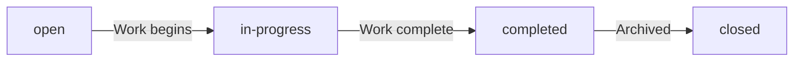

Each status change is recorded in the task history to maintain an audit trail of the task's progression through its lifecycle.

### Priority Classification

Tasks are classified by priority to help teams understand urgency and sequence their work efforts. Four priority levels are available: low, medium, high, and urgent. The priority level indicates the relative importance of the task compared to other work items. Low priority tasks can be scheduled after higher priority work is complete. Medium priority tasks represent standard work items with normal urgency. High priority tasks require attention before lower priority items. Urgent priority tasks demand immediate attention and should be addressed as soon as possible.

### Task Assignment Rules

Tasks may be assigned to a specific employee to designate responsibility for completion. An employee can only be assigned to a task if they are already a member of the project containing that task. Assignment is optional — tasks may remain unassigned until work needs to be distributed. Only one employee can be assigned to a task at a time. When a task is reassigned, the previous assignment is replaced with the new employee. Project leads and users with project management permissions can assign or reassign tasks within their projects.

### Subtask Hierarchy

Tasks can have a single level of subtasks for breaking down complex work items. A parent task may contain multiple child subtasks, but subtasks cannot have their own subtasks (no nested subtasks beyond one level). Each subtask inherits the project context from its parent task. Subtasks follow the same status lifecycle and priority classification as regular tasks. The parent-child relationship allows teams to decompose large work items into manageable pieces while maintaining a clear hierarchical structure.

### Task Due Date Tracking

Tasks may have an optional due date to establish when the work should be completed. The due date serves as a planning and tracking mechanism for task completion timelines. When a due date is set, it helps teams prioritize work and identify tasks that are approaching or past their target completion date. Tasks without a due date are considered to have no specific deadline. The due date does not automatically enforce task completion — it is a planning reference point.

### Estimated Effort Planning

Tasks may have an optional estimated hours value to support effort planning and capacity management. The estimated hours represent the anticipated time required to complete the task. This information helps project managers and team members plan workloads and assess project timelines. Estimated hours are independent of actual time logged — they represent planning expectations rather than tracked effort. Tasks without an estimated hours value are considered to have no time estimate.

### Task History Recording

Each status change made to a task is recorded in the task history to maintain an audit trail. The task history captures the timestamp when the change occurred, the previous status, the new status, and which user made the change. This recording provides accountability and visibility into how tasks have progressed over time. The task history is read-only and cannot be modified after entries are created. Users can review the task history to understand the progression and decision-making around task status changes.

## TaskHistory Concept

TaskHistory provides an audit trail of status changes that occur throughout a task's lifecycle. Each history entry captures the exact timestamp when a change occurred and identifies who made the modification. The record preserves both the previous status and the new status to show the transition. This creates an immutable log of how and when a task progressed through different states. History entries are read-only records that provide accountability and visibility into task management decisions. This audit trail helps managers understand work progression and identify potential bottlenecks in the workflow.

### Status Change Tracking and Audit Trail

TaskHistory serves as an immutable audit trail that captures every status change made to a task throughout its lifecycle. Each time a task's status is modified, a new history entry is automatically created to document the transition. This ensures complete visibility into how tasks progress from creation through completion.

The history record preserves the exact moment when a status change occurred and identifies which user performed the modification. Both the previous status and the new status are captured to show the complete transition path. This creates a permanent record that cannot be altered or deleted, providing an accurate account of task evolution.

TaskHistory entries are read-only once created. They serve as factual records of what happened, when it happened, and who was responsible. This audit capability supports accountability and helps organizations understand how work flows through their processes.

### History Record Structure

Each TaskHistory entry captures four essential pieces of information about a status change. The timestamp records the exact date and time when the modification occurred. The old status field preserves what the task status was before the change. The new status field records what the task status became after the change. The modified by field identifies which user performed the status update.

These four data points together create a complete picture of each status transition. The timestamp enables chronological analysis of task progression. The old and new status fields show the direction and nature of the change. The user identification provides accountability for who made each decision.

TaskHistory entries are automatically generated whenever a task status changes. Users do not manually create history records. The system ensures that every status modification is captured without exception, maintaining a complete and accurate audit trail.

### Business Value and Use Cases

TaskHistory provides several business benefits that support effective task management. The accountability tracking feature ensures that every status change can be traced back to a specific user. This promotes responsible decision-making and enables managers to understand who made each workflow decision.

The workflow progression history allows teams to analyze how tasks move through different states over time. Managers can identify patterns, bottlenecks, or unusual delays by reviewing the sequence of status changes. This visibility helps optimize processes and improve team performance.

The task evolution record provides a complete narrative of how each task developed from its initial state through to completion or closure. Stakeholders can review the full history to understand the context behind current status and make informed decisions about next steps. This historical perspective is particularly valuable for complex tasks that undergo multiple status changes.

## Timelog Concept

Timelog represents a single entry of time spent working on a specific project or task. Each timelog is dated to a specific day and records the duration of work performed in minutes. Employees must select a project for every time entry, and may optionally link it to a specific task. An optional description field allows workers to note what specific work was accomplished during that period. Timelogs can be marked as billable or non-billable for accurate client or internal chargeout tracking. Once a timelog is included in an approved timesheet, it becomes immutable and cannot be modified. Timelogs serve as the fundamental unit of time tracking in the system.

### Daily Time Entry

A timelog represents a daily time entry that records work performed on a specific calendar date. Each timelog is associated with exactly one date, which indicates when the work was actually performed. The date serves as the primary organizational attribute for time tracking and reporting purposes. Employees can create timelogs for any date within their organization's active time tracking period, allowing for both current and retrospective time entry. The date stamp is immutable once the timelog is created and cannot be modified.

### Work Duration Recording

Work duration is recorded in minutes as the fundamental unit of time measurement. Each timelog must specify a duration value that represents the total time spent on the associated work. The duration is a positive numeric value that indicates how many minutes were worked on that particular entry. This duration-based approach allows for precise time tracking and accurate reporting across different time periods. The system calculates total hours from individual minute-based entries for reporting purposes.

### Project and Task Association

Every timelog must be associated with a project, establishing a required link between the time entry and a specific work initiative. The project association ensures that all logged time can be attributed to organizational projects for budget tracking and resource allocation. Employees can only select projects to which they have been assigned as a project member. Additionally, timelogs may optionally reference a specific task within the selected project, providing more granular tracking of work activities. The task reference must belong to the same project as the timelog's project association.

### Billable Classification

Each timelog includes a billable status flag that classifies the time entry as either billable or non-billable work. This classification determines whether the logged time can be charged to a client or should be treated as internal organizational time. The billable flag defaults to true when a new timelog is created, assuming most work is client-billable unless otherwise specified. This distinction enables accurate financial reporting and client invoicing by separating chargeable hours from internal work hours.

### Timelog Immutability

Timelogs become immutable once they are included in an approved timesheet. This immutability rule prevents any modifications to the date, duration, project, task, description, or billable status of timelogs that have been formally approved. The immutability ensures the integrity of approved time records for payroll, billing, and reporting purposes. Timelogs that are part of draft or rejected timesheets remain editable by the employee who created them. Users with time management permissions can modify timelogs regardless of timesheet status.

### Work Description

The work description field provides an optional text area where employees can document what specific work was accomplished during the time entry. This description helps clarify the nature of the work performed and provides context for the time logged. The description is not required for timelog creation, allowing employees to quickly log time when detailed documentation is not immediately necessary. When present, the description serves as a reference for timesheet reviewers and supports accurate time allocation during the approval process.

## Timesheet Concept

Timesheet represents a weekly collection of timelogs submitted for review and approval. Each timesheet covers exactly one week from Monday through Sunday for a single employee. The timesheet aggregates all timelogs for that week and calculates total hours worked. Timesheets progress through states from draft to submitted, then to either approved or rejected status. When submitted, timesheets are reviewed by authorized personnel who can approve or request changes. Rejected timesheets return to draft status allowing the employee to make corrections. Approved timesheets lock all contained timelogs to prevent unauthorized modifications. Timesheets serve as the formal approval mechanism for compensating work performed.

### Weekly Time Aggregation

A timesheet aggregates all time entries for a single employee within a specific week. Each timesheet covers exactly one calendar week, starting on Monday and ending on Sunday. The timesheet automatically includes all time entries logged by the employee during that week. When a timesheet is created, it pulls together all individual time entries from that week into a single reviewable document. The aggregation ensures that all work performed during the week is captured in one place for approval purposes. Employees can view which time entries are included in their timesheet. The timesheet serves as the official record of work hours for that specific week.

### Timesheet Status States

Timesheets progress through four distinct status states during their lifecycle. A timesheet begins in draft status when first created, allowing the employee to review and modify the included time entries. When the employee submits the timesheet for review, it transitions to submitted status. Once submitted, the timesheet awaits approval from authorized personnel. Upon review, the timesheet moves to either approved or rejected status. Approved timesheets represent finalized work records that cannot be modified. Rejected timesheets return to draft status, allowing the employee to make corrections before resubmission. Each status state determines what actions can be performed on the timesheet and its contained time entries.

### Timesheet Submission Rules

Employees can only submit timesheets that contain at least one time entry. A timesheet cannot be submitted if it is empty. Only one timesheet per week can exist in submitted or approved status for any given employee. If an employee attempts to submit a timesheet for a week that already has a submitted or approved timesheet, the submission is prevented. Employees can only submit timesheets for their own work records. The timesheet must be in draft status to be submitted for approval. Once submitted, the timesheet cannot be modified by the employee until it is either approved or rejected.

### Timesheet Approval Workflow

The approval workflow begins when an employee submits a timesheet for review. Authorized personnel with approval permissions can view all submitted timesheets awaiting their review. Reviewers examine the timesheet and its contained time entries to verify accuracy and compliance. The reviewer can either approve the timesheet or reject it with a reason. When approved, the timesheet becomes a finalized record of work hours. The approval action is timestamped and attributed to the reviewing user. The approval process ensures that all work hours are validated before being used for compensation purposes. Multiple reviewers may have approval permissions within an organization.

### Timesheet Rejection Handling

When a timesheet is rejected, the reviewer must provide a reason explaining why the timesheet was not approved. The rejection reason is recorded and visible to the employee. Upon rejection, the timesheet automatically returns to draft status. The employee can then review the rejection reason and make necessary corrections to the timesheet or its time entries. After corrections, the employee can resubmit the timesheet for approval. Rejected timesheets do not lock the contained time entries, allowing the employee to modify them. The rejection history is maintained as part of the timesheet record. Employees can submit the same timesheet multiple times until it is approved.

### Timesheet Locking Mechanism

Approved timesheets activate a locking mechanism that protects all contained time entries from modification. Once a timesheet is approved, no time entries within that timesheet can be edited or deleted by any user. The locking mechanism ensures the integrity of approved work records. Even employees with elevated permissions cannot modify time entries in approved timesheets. The lock applies to all time entries that were included in the timesheet at the time of approval. This protection prevents unauthorized changes to finalized work records. The locking mechanism is automatically applied when approval occurs and remains in effect permanently.

### Weekly Work Summary

Each timesheet calculates and displays the total hours worked during the week. The total hours are computed by summing the duration of all time entries included in the timesheet. The weekly summary provides a quick overview of the employee's work hours for that period. The total hours calculation is automatically updated when time entries are added or removed from draft timesheets. For approved timesheets, the total hours represent the finalized work record. The weekly summary is used for compensation calculations and organizational reporting. Employees can view their weekly work summary to understand their time allocation across projects and tasks.

## Timer Concept

Timer represents a live, running time tracker that employees can start and stop as they work. When active, the timer records the start time and associates with a specific project and optional task. Only one timer can run at a time for each employee to prevent overlapping time entries. When stopped, the timer automatically calculates the elapsed duration and creates a corresponding timelog. The calculated duration is rounded to the nearest minute for standardization. Employees can pause and resume their timer, or discard it entirely without creating a time entry. The timer provides real-time visibility into ongoing work sessions.

### Live Time Tracking

The Timer enables employees to track work time in real-time as they perform tasks. Unlike manual time entry where employees record time after the fact, the Timer provides a live tracking mechanism that starts when work begins and continues until work stops. The Timer captures the actual elapsed time spent on work activities, ensuring accurate time recording without requiring employees to estimate or recall how long they worked. This real-time tracking approach supports better time management and more precise billing for billable work. The Timer is always associated with a specific project, and optionally with a task within that project, allowing employees to track time against the appropriate work context. Employees can add a description to their Timer to document what work they are performing during the tracked session.

### Concurrent Timer Restriction

Each employee can have only one Timer running at any given time. This restriction prevents overlapping time entries that could result in duplicate or conflicting time records. If an employee attempts to start a new Timer while one is already active, the system requires them to stop or discard the existing Timer first. This one-timer-per-employee rule ensures that time tracking remains accurate and auditable. The restriction applies regardless of how many projects or tasks an employee is working on simultaneously. Employees must complete their current Timer session before beginning a new one, which encourages focused work sessions and prevents time tracking errors.

### Timer States and Running Status

A Timer exists in one of two states: running or not running. When running, the Timer actively tracks elapsed time from its start moment. The running status provides employees with visibility into their current work session, showing which project and task they are tracking time against. Employees can view their currently running Timer at any time to see how long they have been working. The Timer continues running indefinitely until the employee explicitly stops it or discards it. There is no automatic timeout or forced stop mechanism, allowing employees to track long work sessions without interruption. The running Timer displays the start time, associated project, optional task, and any description the employee added when starting the Timer.

### Automatic Duration Calculation and Timelog Conversion

When an employee stops their Timer, the system automatically calculates the elapsed duration from the start time to the stop time. This calculated duration is rounded to the nearest minute for standardization and consistency across all time entries. The stopped Timer is then converted into a Timelog, which becomes a permanent record of the time worked. The Timelog inherits all the Timer's attributes including the date, calculated duration, project, task, and description. This automatic conversion eliminates manual data entry errors and ensures that Timer sessions are properly recorded in the system. If an employee chooses to discard their Timer instead of stopping it, no Timelog is created and the Timer session is simply ended without recording any time. This provides flexibility for employees who may have started tracking time but decide not to record it for various reasons.

## ActivityLog Concept

ActivityLog provides a comprehensive audit trail of significant business actions across the platform. Each log entry captures when an action occurred, which user performed it, and what type of action was taken. The system automatically records important events such as employee status changes, contract modifications, and timesheet approvals. Activity logs can be filtered by action type, user, or date range to investigate specific events. Only authorized personnel with appropriate permissions can view the complete audit trail. This log ensures full transparency and accountability for all sensitive operations within the organization.

### Activity Log Overview

The Activity Log serves as a comprehensive system-wide audit trail that records all significant business actions across the organization. Every important event that affects organizational data is automatically captured and stored for future reference and accountability purposes.

Each activity log entry contains a precise timestamp indicating when the action occurred, the identity of the user who performed the action, the type of action that was executed, the target entity that was affected, and detailed information about what changed. This ensures complete traceability of all operations within the organization.

The activity log is maintained at the organization level, meaning each organization has its own independent set of activity log entries. Users can only view activity logs for the organization they are currently working in. This maintains the multi-tenancy isolation required by the platform.

Activity log entries are immutable once created, ensuring the integrity of the audit trail. No user can modify or delete existing activity log entries, preserving the historical record of all actions taken within the organization.

### Logged Actions and Classification

The system automatically logs specific categories of sensitive operations that impact organizational data and employee management. These action types provide a clear classification of what events are tracked.

**Employee Management Actions**: The system logs when employees are invited to the organization, when their status changes to deactivated, and when they are reactivated. These events are critical for tracking workforce changes.

**Contract Actions**: The system logs when employment contracts are created or edited. Contract changes affect compensation and working conditions, making them important to track.

**Project Lifecycle Actions**: The system logs when projects are created, archived, completed, or deleted. These actions represent significant changes to the organization's work initiatives.

**Task Status Actions**: The system logs when task statuses change. This provides visibility into work progress and who made status modifications.

**Timesheet Approval Actions**: The system logs when timesheets are submitted, approved, or rejected. These actions affect payroll and time tracking records.

**Role Assignment Actions**: The system logs when employee roles are assigned or changed. Role changes affect user permissions and access levels.

Each action type is clearly labeled in the activity log, making it easy to identify and filter specific categories of events when reviewing the audit trail.

### Activity Log Access and Filtering

The activity log supports filtering capabilities that allow authorized users to find specific events of interest. Users with appropriate permissions can filter the activity log by action type to see only specific categories of events, such as all timesheet approvals or all employee status changes.

Users can also filter by the user who performed the action, enabling investigation of activities performed by specific individuals. This is useful for auditing individual user behavior or tracking changes made by particular team members.

Date range filtering allows users to view activity logs within specific time periods. This capability is essential for investigating events that occurred during particular weeks, months, or custom date ranges.

The activity log is paginated to handle large volumes of entries efficiently. Users can navigate through pages of results when reviewing extensive audit trails.

Access to the activity log is restricted to users with appropriate permissions. Only authorized personnel can view the complete audit trail, ensuring that sensitive operational information remains protected while still being available for compliance and accountability purposes.

# Domain Relationships

Describe how concepts relate to each other from a business perspective.

## Conceptual Relationships

Describe how concepts relate to each other in business terms.

### Organization-Centric Relationships

An organization serves as the foundational container for all business operations within the platform. Each organization owns and contains multiple employees, projects, and departments. All data within an organization is isolated from other organizations, ensuring complete multi-tenancy separation.

**Organization to Employees**
An organization has many employees. Each employee belongs to exactly one organization at a time. When an organization is deleted, all employee records within that organization are permanently removed.

**Organization to Projects**
An organization has many projects. Each project belongs to exactly one organization. Projects cannot exist independently without an organization. When an organization is deleted, all projects and their associated data are permanently removed.

**Organization to Departments**
An organization has many departments. Each department belongs to exactly one organization. Departments can have a parent-child relationship with one other department within the same organization, allowing for two levels of departmental hierarchy. When an organization is deleted, all departments are permanently removed.

**Organization to Roles**
An organization has many roles. Each role belongs to exactly one organization. Roles define the permissions available within that organization. Three built-in roles (Owner, Manager, Employee) exist in every organization and cannot be deleted. Custom roles can be created and managed by organization owners.

**Organization to Activity Logs**
An organization has many activity log entries. Each activity log entry belongs to exactly one organization and records significant actions performed within that organization's context. Activity logs provide an audit trail for all sensitive operations.

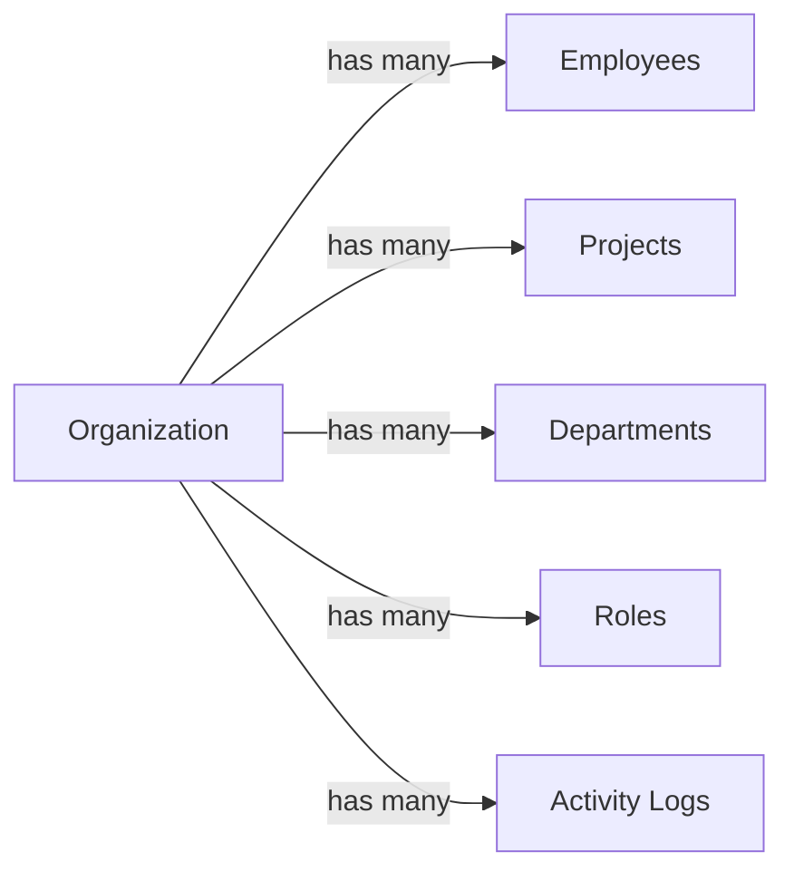

**Organization Ownership**
Each organization has one owner, who is a user account with full administrative privileges. The owner created the organization during initial sign-up. Organization ownership can be transferred to another user, but an organization must always have exactly one owner. When the sole owner deletes their account, they must first transfer ownership or delete the organization.

### User and Employee Relationships

A user represents a human being with a unique identity across the platform. Users authenticate with email and password and can participate in multiple organizations.

**User to Organizations**
A user belongs to many organizations. Each user can be a member of multiple organizations simultaneously. When a user logs in, they select which organization to work in, and all subsequent actions are scoped to that selected organization. Users can switch between organizations without logging out.

**User to UserProfile**
A user has exactly one user profile. The user profile contains presentation information such as display name, avatar image, and phone number. This profile is shared across all organizations the user belongs to, ensuring consistent identity representation.

**User to Employees**
A user can be associated with multiple employee records. Each employee record belongs to exactly one user and exists within a specific organization. The same user can be an employee in multiple organizations with different roles and positions in each.

**User to Employee Contracts**
A user, through their employee records, can have multiple contracts. Each contract belongs to exactly one employee. Contracts represent employment agreements with specific terms, pay rates, and working hours.

**User to Timelogs**
A user, through their employee record, creates timelogs. Each timelog belongs to exactly one employee (and therefore one user). Users can only create timelogs for their own employee record, not for other employees.

**User to Timesheets**
A user, through their employee record, owns timesheets. Each timesheet belongs to exactly one employee. Timesheets aggregate timelogs for a specific week and are submitted by the employee for approval.

**User to Timers**
A user, through their employee record, can have an active timer. Each timer belongs to exactly one employee. An employee can have at most one active timer at any given time.

**User to Activity Logs**
A user performs actions that are recorded in activity logs. Each activity log entry references the user who performed the action. Users with appropriate permissions can view activity logs to audit system changes.

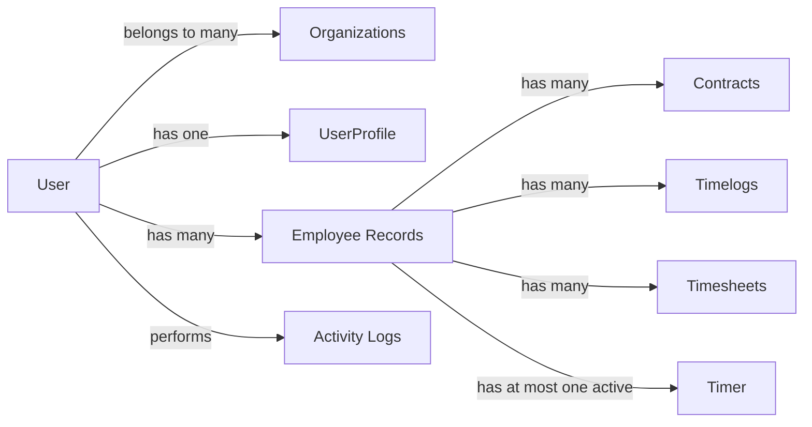

**User Account Deletion Impact**
When a user deletes their account:
- If they are the sole owner of an organization, they must transfer ownership or delete the organization first
- Their employee records in other organizations are marked as deactivated
- Historical data (timelogs, timesheets) associated with their employee records is preserved
- The user profile is deleted along with the user account

### Work Structure Relationships

Projects, tasks, and time tracking entities form the core work management structure of the platform. These entities are interconnected to support comprehensive time tracking and project management.

**Project to Organization**
Each project belongs to exactly one organization. Projects cannot exist independently and are always scoped to an organization context.

**Project to ProjectMemberships**
A project has many project memberships. Each project membership represents an employee's assignment to that project. Project memberships define which employees can work on the project and their role (member or project-lead).

**Project to Tasks**
A project has many tasks. Each task belongs to exactly one project. Tasks cannot exist independently without a project. When a project is archived or completed, it cannot receive new timelogs, but existing tasks and timelogs are preserved.

**Project to Timelogs**
A project can have many timelogs associated with it. Each timelog must reference a project that the employee is assigned to. Employees can only create timelogs for projects they are members of.

**Task to Project**
Each task belongs to exactly one project. Tasks are scoped to their parent project and cannot be shared across multiple projects.

**Task to Subtasks**
A task can have many subtasks (one level of nesting only). Each subtask belongs to exactly one parent task. Subtasks inherit the project context of their parent task.

**Task to TaskHistory**
A task has many task history entries. Each task history entry belongs to exactly one task and records a status change. Task history provides an audit trail of all status transitions for accountability.

**Task to Timelogs**
A task can have many timelogs associated with it. Timelogs can optionally reference a task. When a timelog references a task, that task must belong to the same project as the timelog.

**Timelog to Employee**
Each timelog belongs to exactly one employee. Timelogs represent time worked by a specific employee and cannot be shared across employees.

**Timelog to Project**
Each timelog belongs to exactly one project. The project must be one that the employee is assigned to. Timelogs without a project reference are not allowed.

**Timelog to Task**
A timelog can optionally belong to one task. The task must belong to the same project as the timelog. Timelogs without a task reference are allowed and represent general project work.

**Timelog to Timesheet**
A timelog can belong to one timesheet. When a timesheet is created, it automatically includes all timelogs for that employee in the specified week. Timelogs in approved timesheets become locked and cannot be edited or deleted.

**Timesheet to Employee**
Each timesheet belongs to exactly one employee. Timesheets aggregate an employee's timelogs for a specific week and are submitted by that employee for approval.

**Timesheet to Timelogs**
A timesheet has many timelogs. The timesheet represents a collection of timelogs for a specific week (Monday to Sunday). The total hours in a timesheet is calculated from all included timelogs.

**Timer to Employee**
Each timer belongs to exactly one employee. Timers represent live time tracking by a specific employee.

**Timer to Project**
Each timer belongs to exactly one project. The project must be one that the employee is assigned to.

**Timer to Task**
A timer can optionally belong to one task. The task must belong to the same project as the timer. Timers without a task reference are allowed.

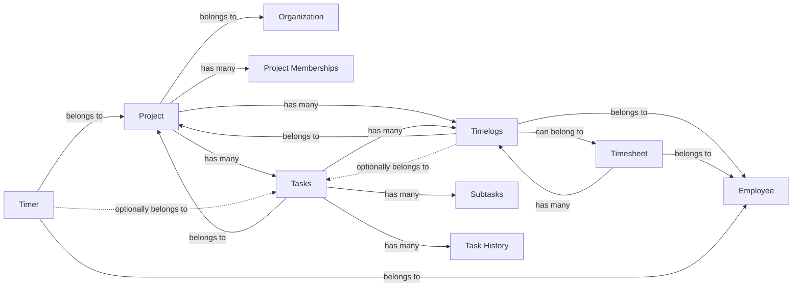

**Project Membership Rules**
An employee can be assigned to multiple projects through project memberships. Each project membership specifies the employee's role in that project (member or project-lead). Project leads have additional permissions to manage tasks within their project. Employees can view all projects they are assigned to and can only create timelogs for those projects.

### Ownership and Attribution

Ownership defines who has control over entities and who is responsible for their lifecycle. Attribution tracks who performed actions for audit and accountability purposes.

**Organization Ownership**
Each organization has exactly one owner. The owner is the user who created the organization and has full administrative privileges including:
- Managing organization settings (name, description, logo, currency, timezone, fiscal start month)
- Creating, editing, and deleting custom roles
- Managing all employees, projects, and departments
- Viewing all reports and activity logs
- Deleting the organization (subject to constraints)

Organization ownership can be transferred to another user with appropriate permissions. An organization must always have exactly one owner and cannot exist without one.

**Employee Role Assignment**
Each employee is assigned exactly one role within their organization. The role determines the employee's permissions. Role assignment can be changed by users with employee management permissions. The role belongs to the organization and is referenced by the employee record.

**Employee Department Assignment**
An employee can optionally belong to one department. The department must belong to the same organization as the employee. When a department is deleted, all employees in that department have their department assignment set to null (not deleted themselves).

**Contract Ownership**
Each contract belongs to exactly one employee. Contracts represent the employment terms for that specific employee. An employee can have multiple contracts over time, but only one contract can be active at any given time. When a new contract is created, the previous active contract is automatically ended.

**Project Ownership and Management**
Projects do not have a single owner but are managed by users with project management permissions. Project leads (assigned through project memberships) can manage tasks within their project. Users with project management permissions can create, edit, archive, complete, and delete projects.

**Task Assignment**
A task can optionally be assigned to one employee. The assigned employee must be a member of the project that the task belongs to. Task assignment is not required; tasks can exist without an assigned employee.

**Timelog Ownership**
Each timelog is owned by the employee who created it. Employees can only create timelogs for themselves, not for other employees. Employees can edit their own timelogs only if the timelog is not part of an approved timesheet. Users with time management permissions can edit or delete any employee's timelogs.

**Timesheet Ownership**
Each timesheet is owned by the employee who created it. Only the employee can submit their timesheet for approval. Users with timesheet approval permissions can approve or reject submitted timesheets. When a timesheet is approved, all included timelogs become locked.

**Timer Ownership**
Each timer is owned by the employee who started it. Only the employee can stop or discard their own timer. An employee can have at most one active timer at any time. Starting a new timer while one is running is not allowed.

**Activity Log Attribution**
Each activity log entry attributes an action to the user who performed it. The activity log records:
- Timestamp of the action
- User who performed the action
- Type of action performed
- Target entity affected
- Details of the change

Activity logs provide a complete audit trail for accountability and compliance purposes. Users with organization management permissions can view the full activity log.

**Data Isolation by Organization**
All ownership and attribution is scoped to the organization context. Users who belong to multiple organizations only see and interact with data from their currently selected organization. Cross-organization data access is not permitted.

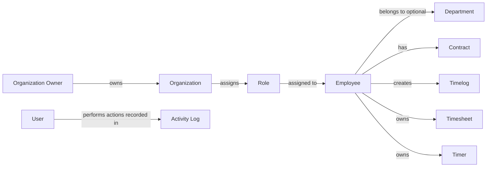

**Ownership Transfer Rules**
- Organization ownership can be transferred to another user in the organization
- Task assignment can be changed to a different project member
- Employee role assignment can be changed by users with appropriate permissions
- Project membership can be added or removed by users with project management permissions
- Timer ownership cannot be transferred; only the employee who started it can stop it

## Lifecycle and Retention

Describe concept lifecycle states and transitions only. Detailed retention/recovery policies belong in 05-non-functional. Operation details belong in 03-functional-requirements.

### Organization Lifecycle

An organization exists from the moment it is created during user sign-up until it is permanently deleted.

An organization can be deleted only when all pending timesheets are resolved (either approved or rejected) and there are no active employee contracts.

When an organization is deleted, all associated data is permanently removed: employees, projects, tasks, timelogs, and timesheets.

The organization owner's user account is preserved but is no longer associated with any organization after deletion.

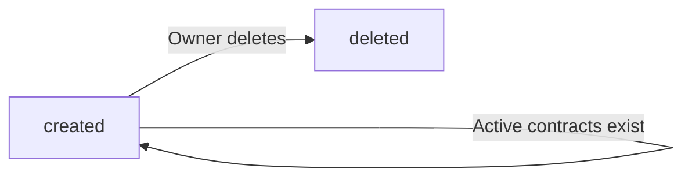

Recovery of a deleted organization is not supported. All data is permanently lost upon deletion.

### User Account Lifecycle

A user account exists from the moment of registration until the user deletes it.

A user account can belong to multiple organizations simultaneously.

When a user deletes their account, if they are the sole owner of an organization, they must first transfer ownership to another user or delete the organization.

When a user account is deleted, their employee records in other organizations are marked as deactivated.

The user's global profile information (display name, avatar, phone number) is removed from the system.

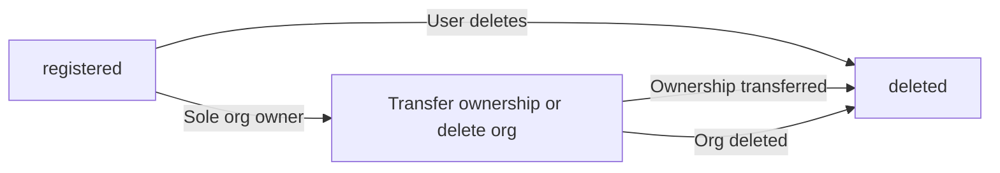

Recovery of a deleted user account is not supported.

### Employee Lifecycle

An employee record exists within an organization and can be in one of two states: active or deactivated.

When an employee is created through invitation, they start in the active state.

An employee can be deactivated by users with employee management permissions. Deactivated employees cannot log time or submit timesheets.

Historical data for deactivated employees (timelogs, timesheets) is preserved and remains viewable.

A deactivated employee can be reactivated by users with employee management permissions, restoring their ability to log time and submit timesheets.

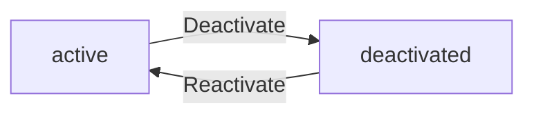

When the associated user account is deleted, the employee record is automatically deactivated.

### Project Lifecycle

A project exists within an organization and can be in one of three states: active, archived, or completed.

When a project is created, it starts in the active state.

An active project can receive new timelogs from assigned employees.

A project can be archived or marked as completed by users with project management permissions.

Archived or completed projects cannot receive new timelogs, but existing timelogs are preserved.

A project can be deleted only if it has no timelogs associated with it.

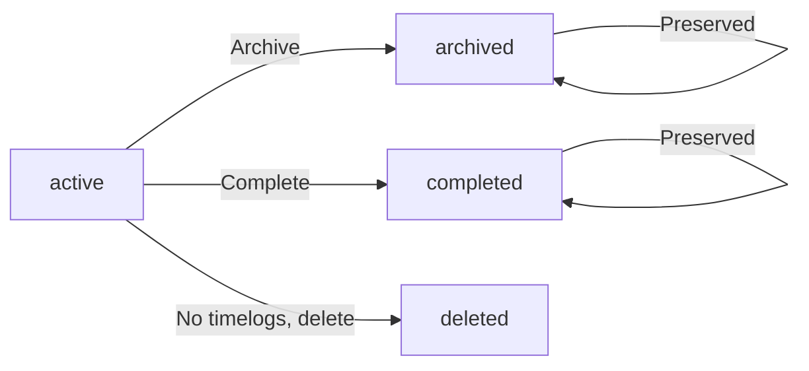

Archived and completed projects are retained indefinitely for historical reference.

### Timesheet Lifecycle

A timesheet represents a weekly collection of timelogs and progresses through four states: draft, submitted, approved, or rejected.

When an employee creates a timesheet for a week, it starts in the draft state.

In the draft state, the employee can add or remove timelogs.

A draft timesheet can be submitted for approval by the employee.

Once submitted, the timesheet cannot be modified by the employee.

A submitted timesheet can be approved by users with time approval permissions. Approved timesheets lock all included timelogs, preventing any edits or deletions.

A submitted timesheet can be rejected by users with time approval permissions. Rejected timesheets return to draft status, allowing the employee to modify and resubmit.

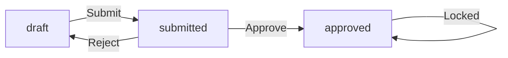

Approved timesheets and their timelogs are retained indefinitely as permanent records.

### Task Lifecycle

A task exists within a project and progresses through four states: open, in-progress, completed, or closed.

When a task is created, it starts in the open state.

A task can transition from open to in-progress when work begins.

A task can transition from in-progress to completed when work is finished.

A completed task can be closed, which represents final archival of the task.

All status changes are recorded in the task history with timestamp, previous status, new status, and the user who made the change.

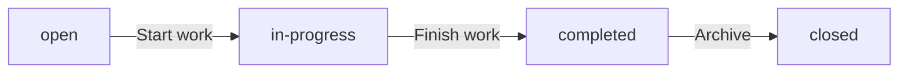

Task history records are retained indefinitely for audit purposes.

### Contract Lifecycle

An employee can have multiple contracts over time, but only one contract can be active at any given time.

When a new contract is created for an employee, any previously active contract is automatically ended by setting its end date to the day before the new contract starts.

An active contract can be edited by users with employee management permissions.

Once a contract has ended (has an end date), it becomes a historical record and cannot be edited.

Past contracts are retained indefinitely as immutable historical records of employment terms.

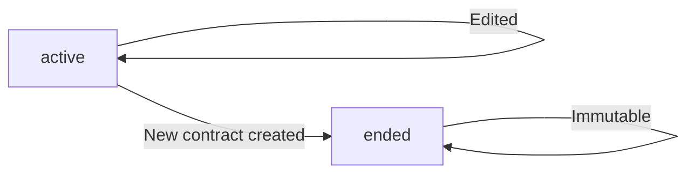

Contract records are retained indefinitely for legal and payroll reference.

### Timelog Retention Rules

A timelog represents a single time entry and is associated with an employee, project, and optionally a task.

Timelogs can be created by employees for their own work.

An employee can edit their own timelog only if it is not part of an approved timesheet.

An employee can delete their own timelog only if it is not part of any submitted or approved timesheet.

Users with time management permissions can edit or delete any employee's timelogs regardless of timesheet status.

Once a timelog is included in an approved timesheet, it becomes immutable and cannot be modified or deleted.

Timelogs are retained indefinitely as permanent records of work performed.

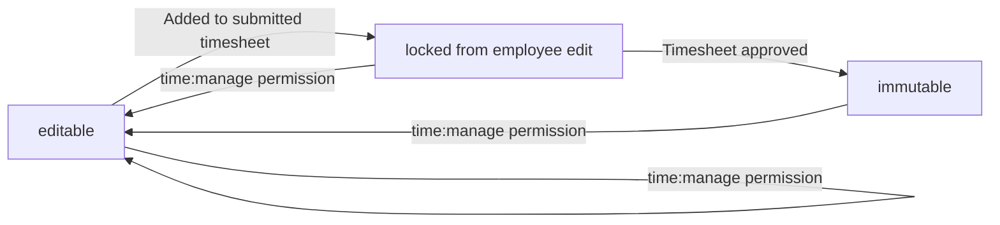

All timelogs are preserved even if the associated employee is deactivated or the project is archived.

# Business Categories and State Flows

Business category classifications and state flow definitions.

## Business Category Definitions

Define all business category classifications with their allowed values and descriptions.

### Employment Classification

The system classifies employees by employment type and employment status.

**Employment Types** define the nature of the working relationship:
- **Full-time**: Standard full-time employment with regular working hours
- **Part-time**: Reduced hours employment arrangement
- **Contractor**: External contractor or vendor relationship
- **Intern**: Temporary training or learning position

**Employee Status** indicates the current active state of an employee:
- **Active**: Employee can perform all normal activities including time tracking and timesheet submission
- **Deactivated**: Employee cannot log time or submit timesheets, but historical data is preserved

These classifications are used for employee filtering, reporting, and access control purposes.

### Project Classification

Projects are classified by their current lifecycle status.

**Project Status** values:
- **Active**: Project is ongoing and can receive new timelogs and tasks
- **Archived**: Project is no longer active but preserved for historical reference; cannot receive new timelogs
- **Completed**: Project has finished all work; cannot receive new timelogs but remains visible in reports

The project status determines whether employees can log time against the project and whether the project appears in active project lists.

### Task Classification

Tasks are classified by their workflow status and priority level.

**Task Status** values define the workflow progression:
- **Open**: Task has been created but work has not begun
- **In-progress**: Work is currently being performed on the task
- **Completed**: Work on the task has finished
- **Closed**: Task is finalized and no longer active

**Task Priority** values indicate urgency:
- **Low**: Normal priority, can be scheduled at convenience
- **Medium**: Standard priority, should be addressed in normal workflow
- **High**: Important task requiring prompt attention
- **Urgent**: Critical task requiring immediate action

These classifications support task filtering, sorting, and assignment decisions.

### Timesheet Classification

Timesheets are classified by their approval workflow status.

**Timesheet Status** values define the approval lifecycle:
- **Draft**: Timesheet is being prepared; employee can add or remove timelogs
- **Submitted**: Timesheet has been sent for approval; no modifications allowed
- **Approved**: Timesheet has been approved by an authorized user; all timelogs are locked
- **Rejected**: Timesheet has been rejected with a reason; returns to draft status for modification

The timesheet status determines whether timelogs can be modified and whether the timesheet is visible to approvers.

### Role Classification

The system defines role classifications for access control and project assignment.

**Built-in Roles** are predefined and cannot be deleted:
- **Owner**: Full access to all organization features including role and member management
- **Manager**: Can manage employees, projects, approve timesheets, and view reports
- **Employee**: Can track time, submit timesheets, and view own data

**Project Membership Roles** define an employee's responsibility within a project:
- **Member**: Standard project participant with basic task access
- **Project-lead**: Can manage tasks within the assigned project

**Custom Roles** can be created by organization owners with specific permission sets for fine-grained access control.

### Contract Classification

Employee contracts are classified by pay period type.

**Pay Period** values define how compensation is calculated:
- **Hourly**: Pay rate is per hour worked
- **Daily**: Pay rate is per day worked
- **Weekly**: Pay rate is per week worked
- **Monthly**: Pay rate is per month worked

The pay period classification is used for timesheet calculations and payroll reporting purposes.

### Billable Classification

Timelogs are classified by their billable status.

**Billable Status** is a boolean classification:
- **Billable (true)**: Time can be charged to a client or included in invoicing
- **Non-billable (false)**: Time is internal and not chargeable to a client

The default billable status for new timelogs is true (billable). This classification is used for time reports and financial tracking.

## State Transitions

Define valid state transition paths for stateful concepts.

### Timesheet Approval Workflow

A timesheet follows a defined approval workflow from creation to final disposition.

**State Flow**:
- A timesheet begins in **draft** status when an employee creates it for a specific week
- From draft, an employee can submit the timesheet, changing status to **submitted**
- From submitted, a user with approval permission can either:
  - Approve the timesheet, changing status to **approved** (final state)
  - Reject the timesheet with a reason, changing status to **rejected**
- From rejected, the employee can modify and resubmit, returning to **draft** status then **submitted**

**State Transition Rules**:
- A timesheet in draft status can be edited by the employee (add/remove timelogs)
- A timesheet in submitted status cannot be modified by the employee
- A timesheet in approved status is locked; all included timelogs cannot be edited or deleted
- A timesheet in rejected status returns to draft and can be modified by the employee
- Only one timesheet per employee per week can exist in submitted or approved status

**Workflow Diagram**:
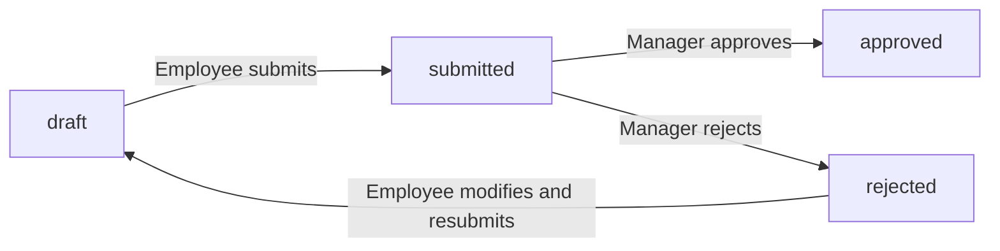

**Business Context**:
- The timesheet workflow ensures time entries are reviewed before being finalized
- Approved timesheets serve as the official record of hours worked
- Rejected timesheets allow correction without losing the original submission data
- The workflow prevents duplicate submissions for the same week

### Project Lifecycle Workflow

A project progresses through its lifecycle from creation to archival.

**State Flow**:
- A project begins in **active** status when created
- From active, a user with project management permission can:
  - Archive the project, changing status to **archived**
  - Complete the project, changing status to **completed**
- Archived or completed projects cannot receive new timelogs
- Existing timelogs on archived or completed projects are preserved

**State Transition Rules**:
- A project in active status can receive new timelogs from assigned employees
- A project in archived status cannot be modified to receive new timelogs
- A project in completed status cannot be modified to receive new timelogs
- A project can only be deleted if it has no associated timelogs
- Project status changes are recorded in the activity log

**Workflow Diagram**:
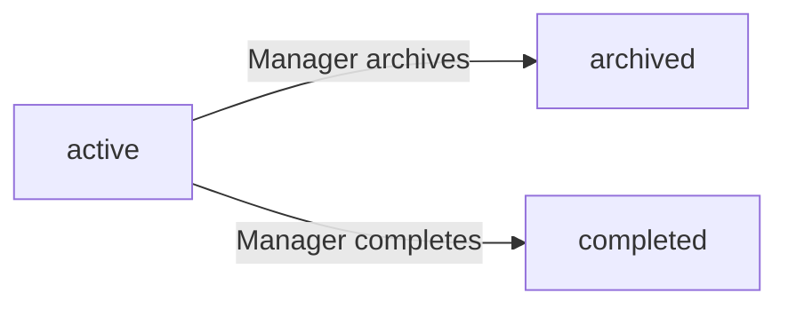

**Business Context**:
- Active projects represent ongoing work initiatives
- Archived projects are paused or indefinitely suspended but may be referenced
- Completed projects represent finished work with final timelogs locked
- The workflow prevents time tracking on inactive projects while preserving historical data

### Task Progression Workflow

A task progresses through its status lifecycle from creation to closure.

**State Flow**:
- A task begins in **open** status when created
- From open, a project lead or authorized user can change status to **in-progress**
- From in-progress, a project lead or authorized user can change status to **completed**
- From completed, a project lead or authorized user can change status to **closed**
- Status changes can occur in any direction as work progresses

**State Transition Rules**:
- Each status change is recorded in the task history with timestamp, old status, new status, and who made the change
- Task status changes are visible to all employees assigned to the project
- A task's status does not affect its parent task or subtasks
- Status changes are logged in the activity log

**Workflow Diagram**:
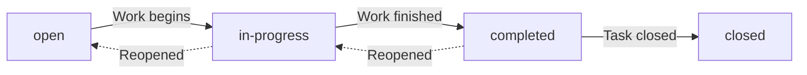

**Business Context**:
- Open tasks represent work that has been defined but not yet started
- In-progress tasks represent active work being performed
- Completed tasks represent finished work awaiting final review
- Closed tasks represent finalized work that will not be modified
- The workflow provides visibility into task progress for project stakeholders

### Employee Status Workflow

An employee's organizational membership follows an activation lifecycle.

**State Flow**:
- An employee begins in **active** status when added to the organization
- From active, a user with employee management permission can deactivate the employee, changing status to **deactivated**
- From deactivated, a user with employee management permission can reactivate the employee, returning to **active** status

**State Transition Rules**:
- An active employee can log time, submit timesheets, and access all assigned projects and tasks
- A deactivated employee cannot log time or submit timesheets
- A deactivated employee's historical data (timelogs, timesheets, contracts) is preserved
- A deactivated employee's contracts remain unchanged
- Deactivation does not remove the employee from projects or tasks
- Reactivation restores all previous access and capabilities

**Workflow Diagram**:
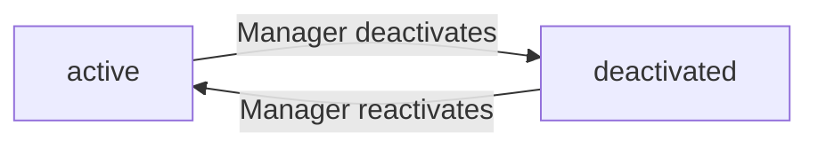

**Business Context**:
- Active employees are current members of the organization with full access
- Deactivated employees represent former members whose historical data is retained
- The workflow preserves organizational history while controlling current access
- Deactivation is reversible, allowing rehired employees to regain their previous records

### Contract Status Workflow

An employee's contracts follow an activation pattern with automatic transitions.

**State Flow**:
- A contract begins in **active** status when created
- A contract remains active until a new contract is created for the same employee
- When a new contract is created, the previous active contract is automatically ended (end date set to day before new contract starts)
- Ended contracts become **historical** and cannot be modified

**State Transition Rules**:
- Only one contract per employee can be active at any time
- Creating a new contract automatically transitions the previous active contract to historical status
- Historical contracts are immutable and serve as the employment record
- An active contract can be edited by users with employee management permission
- A contract with no end date represents ongoing employment

**Workflow Diagram**:
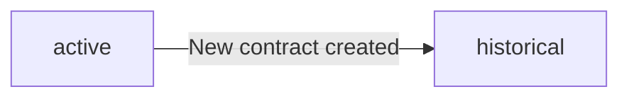

**Business Context**:
- Active contracts represent current employment terms and compensation
- Historical contracts preserve the employment relationship timeline
- The workflow ensures a complete record of all employment agreements
- Automatic transition prevents conflicting active contracts for the same employee