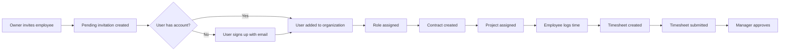
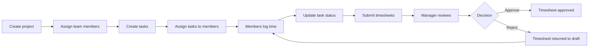

```mermaid
flowchart LR
    A["Create employee contract"] --> B["Set pay rate and period"]
    B --> C["Employee logs time"]
    C --> D["Weekly timesheet created"]
    D --> E["Employee submits timesheet"]
    E --> F["Manager approves"]
    F --> G["Timelogs locked"]
    G --> H["Calculate billable hours"]
    H --> I["Apply pay rate"]
    I --> J["Generate payroll report"]
```

**hrmPlatform — What operations users can perform, use cases, business workflows**

What operations users can perform, use cases, business workflows

# Core Business Operations

What the system must do for each business concept.

## Organization Operations

Users create an organization during initial sign-up with a name, description, logo image, currency, timezone, and fiscal start month. Organization owners can edit organization settings at any time to update these details. Owners can delete their organization only after all pending timesheets are resolved and there are no active employee contracts. When an organization is deleted, all employees, projects, tasks, timelogs, and timesheets are permanently removed. The owner's account remains but is no longer associated with any organization. Each organization operates independently with its own employees, projects, and data in a multi-tenant platform.

### Organization Creation During Sign-Up

THE system SHALL allow users to create an organization during initial sign-up.

THE system SHALL require a name when creating an organization.

THE system SHALL accept an optional description when creating an organization.

THE system SHALL allow uploading a logo image when creating an organization.

THE system SHALL require selecting a currency when creating an organization.

THE system SHALL require selecting a timezone when creating an organization.

THE system SHALL require selecting a fiscal start month when creating an organization.

THE system SHALL automatically assign the creating user as the organization owner.

### Organization Settings Management

THE system SHALL allow organization owners to edit organization settings at any time.

THE system SHALL allow updating the organization name.

THE system SHALL allow updating the organization description.

THE system SHALL allow updating the organization logo image.

THE system SHALL allow updating the organization currency.

THE system SHALL allow updating the organization timezone.

THE system SHALL allow updating the organization fiscal start month.

WHEN organization settings are updated, THE system SHALL apply changes immediately to the organization.

### Organization Deletion Prerequisites

THE system SHALL prevent organization deletion if pending timesheets exist.

THE system SHALL prevent organization deletion if active employee contracts exist.

THE system SHALL require all pending timesheets to be approved or rejected before allowing deletion.

THE system SHALL require all active employee contracts to be ended before allowing deletion.

THE system SHALL display the list of blocking items when deletion is attempted with unmet prerequisites.

### Organization Data Cascade Deletion

WHEN an organization is deleted, THE system SHALL permanently delete all employees.

WHEN an organization is deleted, THE system SHALL permanently delete all projects.

WHEN an organization is deleted, THE system SHALL permanently delete all tasks.

WHEN an organization is deleted, THE system SHALL permanently delete all timelogs.

WHEN an organization is deleted, THE system SHALL permanently delete all timesheets.

WHEN an organization is deleted, THE system SHALL preserve the owner's user account.

WHEN an organization is deleted, THE system SHALL remove the association between the owner and the deleted organization.

### Multi-Tenancy Data Isolation

THE system SHALL maintain independent data for each organization.

THE system SHALL prevent employees in one organization from viewing data from another organization.

THE system SHALL scope all user actions to the currently selected organization context.

THE system SHALL enforce organization isolation on all data operations.

WHEN a user belongs to multiple organizations, THE system SHALL require organization selection before performing operations.

THE system SHALL ensure that users only see data belonging to their selected organization.

### Organization Owner Permissions

THE system SHALL grant organization owners full access to all features.

THE system SHALL allow organization owners to manage roles and members.

THE system SHALL allow organization owners to create custom roles.

THE system SHALL allow organization owners to edit custom roles.

THE system SHALL allow organization owners to delete custom roles.

THE system SHALL allow organization owners to view all organization data including employees, projects, tasks, timelogs, and timesheets.

THE system SHALL allow organization owners to access all reports and dashboards.

### Organization Configuration Options

THE system SHALL support configuration of organization name.

THE system SHALL support configuration of organization description.

THE system SHALL support configuration of organization logo image.

THE system SHALL support configuration of organization currency.

THE system SHALL support configuration of organization timezone.

THE system SHALL support configuration of organization fiscal start month.

THE system SHALL store all configuration options as organization settings.

THE system SHALL apply currency settings to all financial calculations within the organization.

THE system SHALL apply timezone settings to all date and time displays within the organization.

## User Operations

Users sign up with email and password to create a new account. Users log in with their email and password credentials. After logging in, users select which organization to work in from their available organizations. All subsequent actions are scoped to the selected organization context. Users can switch organizations without logging out to work across multiple organizations. Users can change their password at any time. Users can delete their account, but if they are the sole owner of an organization, they must transfer ownership or delete the organization first. When a user deletes their account, their employee records in other organizations are marked as deactivated.

### User Account Registration

WHEN a new user wants to join the platform, THE system SHALL allow the user to create an account by providing an email address and password.

WHEN a user provides an email address during registration, THE system SHALL verify that the email address is not already registered.

WHEN a user provides a password during registration, THE system SHALL require the password to meet minimum security requirements.

WHEN a user successfully completes registration, THE system SHALL create a new user account with the provided email and password.

WHEN a user registers, THE system SHALL allow the user to optionally create an organization during the same sign-up process.

WHEN a user registers without creating an organization, THE system SHALL create the user account without any organization association.

WHEN a user registers with an email that has pending organization invitations, THE system SHALL automatically add the user to those organizations upon successful registration.

IF the provided email address is already registered, THEN THE system SHALL reject the registration request and display an appropriate error message.

### User Login and Organization Selection

WHEN a user wants to access the platform, THE system SHALL allow the user to log in by providing their email address and password.

WHEN a user provides their email and password for login, THE system SHALL verify the credentials against registered accounts.

WHEN a user successfully logs in, THE system SHALL authenticate the user and establish a session.

WHEN a user who belongs to multiple organizations logs in, THE system SHALL present a list of available organizations for the user to select from.

WHEN a user who belongs to a single organization logs in, THE system SHALL automatically set that organization as the active context.

WHEN a user selects an organization after login, THE system SHALL set that organization as the active context for all subsequent actions.

WHEN a user logs in, THE system SHALL display the user's global profile information including display name and avatar.

IF the provided email address is not registered, THEN THE system SHALL reject the login request.

IF the provided password is incorrect, THEN THE system SHALL reject the login request.

IF the user account is deactivated, THEN THE system SHALL reject the login request.

### Password Management

WHEN a logged-in user wants to update their credentials, THE system SHALL allow the user to change their password.

WHEN a user requests to change their password, THE system SHALL require the user to provide their current password for verification.

WHEN a user provides a new password, THE system SHALL require the new password to meet minimum security requirements.

WHEN a user successfully changes their password, THE system SHALL update the password across all organizations the user belongs to.

WHEN a user changes their password, THE system SHALL require the user to log in again with the new password on subsequent sessions.

IF the current password provided is incorrect, THEN THE system SHALL reject the password change request.

IF the new password does not meet security requirements, THEN THE system SHALL reject the password change request and display specific validation errors.

### Organization Context and Switching

WHEN a user belongs to multiple organizations, THE system SHALL allow the user to switch between organizations without logging out.

WHEN a user switches organizations, THE system SHALL update the active organization context immediately.

WHEN a user switches organizations, THE system SHALL display only data and features relevant to the newly selected organization.

WHEN a user switches organizations, THE system SHALL preserve the user's session and authentication state.

WHEN a user switches organizations, THE system SHALL update the user interface to reflect the new organization's branding and settings.

WHEN a user switches organizations, THE system SHALL clear any cached data from the previous organization context.

WHEN a user switches organizations, THE system SHALL maintain the user's global profile information across all organizations.

THE system SHALL provide a visible mechanism for users to view and select their available organizations at any time during their session.

### Account Deletion with Ownership Transfer

WHEN a user wants to permanently remove their account, THE system SHALL allow the user to initiate account deletion.

WHEN a user who is the sole owner of an organization requests account deletion, THE system SHALL require the user to either transfer ownership to another member or delete the organization first.

WHEN a user who is not an organization owner requests account deletion, THE system SHALL allow the deletion to proceed without additional prerequisites.

WHEN a user who belongs to multiple organizations requests account deletion, THE system SHALL verify ownership status for each organization before proceeding.

WHEN a user transfers organization ownership, THE system SHALL require the new owner to have an existing account in the organization.

WHEN a user transfers organization ownership, THE system SHALL update the role of the new owner to Owner.

WHEN a user deletes their account, THE system SHALL permanently remove the user's account credentials and global profile.

IF a user is the sole owner of an organization and has not transferred ownership or deleted the organization, THEN THE system SHALL block the account deletion request.

IF the user has pending responsibilities in any organization, THEN THE system SHALL display a warning and require resolution before proceeding with deletion.

### Employee Record Deactivation on Account Deletion

WHEN a user deletes their account, THE system SHALL automatically deactivate all employee records associated with that user in organizations where the user was a member but not the owner.

WHEN an employee record is deactivated due to account deletion, THE system SHALL preserve all historical timelogs and timesheets associated with that employee.

WHEN an employee record is deactivated due to account deletion, THE system SHALL prevent the employee record from being used for new time tracking activities.

WHEN a user deletes their account, THE system SHALL remove the user's association with all organizations except where they were the owner.

WHEN an employee record is deactivated, THE system SHALL mark the status as deactivated in the employee list.

WHEN an employee record is deactivated, THE system SHALL prevent the deactivated employee from appearing in active employee filters.

WHEN a user deletes their account, THE system SHALL log the account deletion action in the activity log for all affected organizations.

THE system SHALL maintain a record of deactivated employees for audit and reporting purposes.

## UserProfile Operations

Each user has a global profile that is shared across all organizations they belong to. The profile includes a display name, avatar image, and phone number. Users can edit their profile information at any time. Profile changes are reflected across all organizations the user is a member of. The display name must be between one and one hundred characters. The phone number field accepts values between one and fifty characters. Users can upload or change their avatar image through the profile settings.

### Global User Profile Management

THE system SHALL allow users to view their global user profile.

THE system SHALL allow users to edit their profile information at any time.

THE system SHALL maintain a single global profile for each user that is shared across all organizations.

THE system SHALL store the display name, avatar image, and phone number as part of the user profile.

THE system SHALL allow users to access their profile settings from any organization context.

THE system SHALL display the current profile information to the user when viewing profile settings.

### Display Name Editing

THE system SHALL allow users to update their display name.

THE system SHALL require the display name to be between one and one hundred characters.

THE system SHALL save display name changes immediately upon submission.

THE system SHALL prevent saving an empty display name.

THE system SHALL display validation feedback when the display name does not meet requirements.

THE system SHALL update the display name across all organizational contexts after a successful change.

### Avatar Image Upload

THE system SHALL allow users to upload an avatar image.

THE system SHALL allow users to change their existing avatar image.

THE system SHALL allow users to remove their avatar image.

THE system SHALL display the current avatar image in the profile settings.

THE system SHALL provide preview functionality for avatar images before saving.

THE system SHALL accept common image formats for avatar uploads.

THE system SHALL enforce file size limits for avatar uploads.

### Phone Number Configuration

THE system SHALL allow users to set their phone number.

THE system SHALL allow users to update their phone number.

THE system SHALL allow users to remove their phone number.

THE system SHALL require the phone number to be between one and fifty characters when provided.

THE system SHALL validate the phone number format upon submission.

THE system SHALL display validation feedback when the phone number format is invalid.

THE system SHALL save phone number changes immediately upon successful validation.

### Profile Sharing Across Organizations

THE system SHALL make the user profile visible in all organizations the user belongs to.

THE system SHALL use the same display name across all organizational contexts.

THE system SHALL use the same avatar image across all organizational contexts.

THE system SHALL use the same phone number across all organizational contexts.

THE system SHALL not allow organization-specific profile variations.

THE system SHALL display the global profile data whenever the user is identified within any organization.

### Profile Update Propagation

THE system SHALL immediately propagate display name changes to all organizational contexts.

THE system SHALL immediately propagate avatar image changes to all organizational contexts.

THE system SHALL immediately propagate phone number changes to all organizational contexts.

THE system SHALL ensure profile updates are visible to the user in all organizations without requiring re-login.

THE system SHALL reflect profile changes in employee records across all organizations.

THE system SHALL reflect profile changes in activity log entries across all organizations.

## Employee Operations

Users with employee management permission can invite new employees to the organization by email. If the invited email already has an account, the user is added to the organization immediately. If the email has no account, a pending invitation is created until the user signs up. Each employee record includes a role, optional department, optional position, employment type, and status. Users with employee management permission can edit employee records to update department, position, and employment type. Users can deactivate employees, which prevents them from logging time or submitting timesheets while preserving historical data. Deactivated employees can be reactivated by users with employee management permission. Users with employee view permission can view the employee list with filtering by department, employment type, and status. The employee list supports searching by name and is paginated for large organizations.

### Employee Invitation

WHEN a user with employee management permission invites a new employee, THE system SHALL send an invitation email to the specified email address.

WHEN an invited email address already has a registered user account, THE system SHALL immediately add that user to the organization with the assigned role.

WHEN an invited email address does not have a registered user account, THE system SHALL create a pending invitation record.

WHEN a user signs up with an email address that has pending invitations, THE system SHALL automatically add the user to all organizations with pending invitations.

WHEN a user with employee management permission sends a duplicate invitation to the same email address, THE system SHALL prevent creating a duplicate pending invitation.

THE system SHALL associate each invitation with the inviting user for audit purposes.

### Employee Record Creation

WHEN a user with employee management permission creates an employee record, THE system SHALL require a reference to an existing user account.

WHEN creating an employee record, THE system SHALL require assignment of exactly one role from the organization's available roles.

WHEN creating an employee record, THE system SHALL allow optional assignment of a department.

WHEN creating an employee record, THE system SHALL allow optional specification of a position or title.

WHEN creating an employee record, THE system SHALL require selection of an employment type from: full-time, part-time, contractor, or intern.

WHEN creating an employee record, THE system SHALL set the initial status to active.

THE system SHALL create an activity log entry when an employee is invited or created.

### Employee Record Editing

WHEN a user with employee management permission edits an employee record, THE system SHALL allow updating the assigned department.

WHEN a user with employee management permission edits an employee record, THE system SHALL allow updating the position or title.

WHEN a user with employee management permission edits an employee record, THE system SHALL allow updating the employment type.

WHEN a user with employee management permission edits an employee record, THE system SHALL allow changing the assigned role.

WHEN a user without employee management permission attempts to edit an employee record, THE system SHALL deny the request.

THE system SHALL create an activity log entry when an employee record is edited.

### Employee Deactivation and Reactivation

WHEN a user with employee management permission deactivates an employee, THE system SHALL change the employee status to deactivated.

WHEN an employee is deactivated, THE system SHALL prevent that employee from creating new timelogs.

WHEN an employee is deactivated, THE system SHALL prevent that employee from submitting timesheets.

WHEN an employee is deactivated, THE system SHALL preserve all historical timelogs and timesheets.

WHEN a user with employee management permission reactivates a deactivated employee, THE system SHALL change the employee status back to active.

WHEN an employee is reactivated, THE system SHALL restore their ability to log time and submit timesheets.

THE system SHALL create an activity log entry when an employee is deactivated or reactivated.

### Employee List Viewing

WHEN a user with employee view permission views the employee list, THE system SHALL display all employees in the organization.

WHEN viewing the employee list, THE system SHALL support filtering by department.

WHEN viewing the employee list, THE system SHALL support filtering by employment type.

WHEN viewing the employee list, THE system SHALL support filtering by status.

WHEN viewing the employee list, THE system SHALL support searching employees by name.

WHEN viewing the employee list, THE system SHALL paginate results for large organizations.

WHEN a user without employee view permission attempts to view the employee list, THE system SHALL deny the request.

### Employment Type Management

WHEN creating or editing an employee record, THE system SHALL require selection of one employment type from the available options.

WHEN managing employment types, THE system SHALL support full-time employment classification.

WHEN managing employment types, THE system SHALL support part-time employment classification.

WHEN managing employment types, THE system SHALL support contractor employment classification.

WHEN managing employment types, THE system SHALL support intern employment classification.

WHEN filtering the employee list, THE system SHALL allow filtering by each employment type.

### Employee Status Management

WHEN creating an employee record, THE system SHALL set the default status to active.

WHEN managing employee status, THE system SHALL support active status for employees who can work normally.

WHEN managing employee status, THE system SHALL support deactivated status for employees who cannot log time or submit timesheets.

WHEN an employee is in active status, THE system SHALL allow them to create timelogs and submit timesheets.

WHEN an employee is in deactivated status, THE system SHALL prevent them from creating timelogs or submitting timesheets.

WHEN filtering the employee list, THE system SHALL allow filtering by employee status.

## Role Operations

Each organization has three built-in roles that cannot be deleted: Owner with full access, Manager with employee and project management, and Employee with time tracking capabilities. Organization owners can create custom roles with a name and set of permissions from the available permission list. Available permissions include organization management, employee management and viewing, project management and viewing, time management and approval, time viewing for all employees, and report viewing. Organization owners can edit custom roles to modify their permissions. Owners can delete custom roles only if no employees are currently assigned to them. Each employee is assigned exactly one role within an organization. Role assignments can be changed by users with employee management permission.

### Built-in Role Definitions

THE system SHALL provide three built-in roles that cannot be deleted: Owner, Manager, and Employee.

THE system SHALL grant Owner role full access to all features including role management and member management.

THE system SHALL grant Manager role the ability to manage employees, manage projects, approve timesheets, and view reports.

THE system SHALL grant Employee role the ability to track time, submit timesheets, and view their own data.

THE system SHALL prevent deletion of any built-in role.

THE system SHALL ensure each organization starts with these three built-in roles available.

### Custom Role Creation

WHEN an organization owner creates a custom role, THE system SHALL require a role name.

THE system SHALL allow organization owners to create custom roles with a name and set of permissions.

THE system SHALL validate that the custom role name is not empty.

THE system SHALL validate that the custom role name is unique within the organization.

THE system SHALL create the custom role with the specified name and permissions.

THE system SHALL make the new custom role available for assignment to employees.

THE system SHALL record the role creation in the activity log.

### Custom Role Permissions Configuration

THE system SHALL provide the following permissions for role configuration: organization management, employee management, employee viewing, project management, project viewing, time management, time approval, time viewing for all employees, and report viewing.

WHEN configuring a custom role, THE system SHALL allow organization owners to select which permissions to include.

THE system SHALL allow organization owners to assign any combination of available permissions to a custom role.

THE system SHALL store the selected permissions with the custom role.

THE system SHALL apply the configured permissions to all employees assigned to that role.

THE system SHALL update employee access immediately when role permissions are changed.

### Custom Role Editing

WHEN an organization owner edits a custom role, THE system SHALL allow modification of the role name.

THE system SHALL allow organization owners to edit the permissions assigned to a custom role.

THE system SHALL validate that the new role name is not empty.

THE system SHALL validate that the new role name is unique within the organization.

THE system SHALL update the role name across all employee assignments.

THE system SHALL update the permissions immediately for all employees with that role.

THE system SHALL record the role edit in the activity log.

THE system SHALL preserve the role assignment to employees during editing.

### Custom Role Deletion Restrictions

WHEN an organization owner attempts to delete a custom role, THE system SHALL check if any employees are assigned to that role.

IF employees are assigned to the custom role, THEN THE system SHALL block the deletion.

THE system SHALL require all employees to be reassigned to a different role before deletion.

THE system SHALL allow deletion of custom roles only when no employees are assigned.

THE system SHALL display a warning message when deletion is blocked due to employee assignments.

THE system SHALL permanently remove the custom role from the organization upon successful deletion.

THE system SHALL record the role deletion in the activity log.

### Employee Role Assignment

WHEN a user with employee management permission assigns a role to an employee, THE system SHALL require exactly one role per employee.

THE system SHALL allow users with employee management permission to assign any available role to an employee.

THE system SHALL validate that the selected role exists in the organization.

THE system SHALL update the employee record with the assigned role.

THE system SHALL apply the role permissions to the employee immediately.

THE system SHALL record the role assignment in the activity log.

THE system SHALL ensure each employee has exactly one role at all times.

### Role Change Workflow

WHEN a user with employee management permission changes an employee's role, THE system SHALL allow selection of a different role.

THE system SHALL validate that the new role exists in the organization.

THE system SHALL update the employee's role from the previous role to the new role.

THE system SHALL revoke the previous role permissions from the employee.

THE system SHALL grant the new role permissions to the employee immediately.

THE system SHALL preserve the employee record during role change.

THE system SHALL record the role change in the activity log with the previous role and new role.

THE system SHALL ensure the employee has exactly one role after the change.

### Role Permission Management

THE system SHALL provide organization owners with the ability to manage permissions for custom roles.

THE system SHALL allow organization owners to view all available permissions when configuring roles.

THE system SHALL display which permissions are currently assigned to each custom role.

THE system SHALL allow organization owners to add permissions to a custom role.

THE system SHALL allow organization owners to remove permissions from a custom role.

THE system SHALL update employee access immediately when permissions are added or removed.

THE system SHALL prevent removal of all permissions from a role if it would leave the role with no permissions.

THE system SHALL record permission changes in the activity log.

## Department Operations

Each organization can have departments with a name, description, and optional parent department for one level of nesting. Users with organization management permission can create new departments. Users can edit department details including name and description. Users can delete departments, which sets employees' department to null without deleting the employees. Employees can view the list of departments in their organization. Departments support hierarchical structure with parent-child relationships at one level only.

### Department Creation

WHEN a user with organization management permission creates a department, THE system SHALL require a department name.

WHEN a user with organization management permission creates a department, THE system SHALL allow an optional description.

WHEN a user with organization management permission creates a department, THE system SHALL allow assignment of an optional parent department.

WHEN a department is created, THE system SHALL associate it with the current organization context.

WHEN a department is created with a parent department, THE system SHALL establish a one-level hierarchical relationship.

THE system SHALL record department creation in the activity log with timestamp, user, and department details.

### Department Editing

WHEN a user with organization management permission edits a department, THE system SHALL allow updating the department name.

WHEN a user with organization management permission edits a department, THE system SHALL allow updating the department description.

WHEN a user with organization management permission edits a department, THE system SHALL allow changing the parent department assignment.

WHEN a department's parent department is changed, THE system SHALL maintain the one-level nesting constraint.

WHEN a department is edited, THE system SHALL preserve all existing employee assignments.

THE system SHALL record department edits in the activity log with timestamp, user, and changed details.

### Department Deletion with Employee Handling

WHEN a user with organization management permission deletes a department, THE system SHALL set all employees' department reference to null.

WHEN a department is deleted, THE system SHALL NOT delete employee records.

WHEN a department is deleted, THE system SHALL preserve all historical employee data.

WHEN a department with child departments is deleted, THE system SHALL allow deletion without deleting child departments.

WHEN a department is deleted, THE system SHALL remove it from the department list.

THE system SHALL record department deletion in the activity log with timestamp, user, and affected employee count.

### Department Hierarchy with Parent

WHEN a department is created with a parent, THE system SHALL allow only one level of nesting.

WHEN a user attempts to create a subdepartment of a subdepartment, THE system SHALL reject the request.

WHEN a parent department is deleted, THE system SHALL preserve child departments.

WHEN a parent department is deleted, THE system SHALL set child departments' parent reference to null.

WHEN a department is assigned as a parent, THE system SHALL allow multiple child departments.

THE system SHALL display parent-child relationships in the department structure view.

### Department List Viewing

WHEN an employee views the department list, THE system SHALL display all departments in the current organization.

WHEN an employee views the department list, THE system SHALL show department name and description.

WHEN an employee views the department list, THE system SHALL indicate parent-child relationships.

WHEN departments are viewed, THE system SHALL enforce organization context isolation.

WHEN an employee views departments, THE system SHALL only show departments from the selected organization.

THE system SHALL allow viewing of departments without modification permissions.

### Department Structure Management

WHEN a user with organization management permission manages department structure, THE system SHALL allow reorganizing parent-child relationships.

WHEN a user moves a department to a different parent, THE system SHALL maintain the one-level nesting constraint.

WHEN a user manages department structure, THE system SHALL prevent circular parent references.

WHEN a user creates a new top-level department, THE system SHALL not require a parent department.

WHEN a user manages department structure, THE system SHALL validate that parent departments exist.

THE system SHALL provide a visual representation of the department hierarchy.

## Contract Operations

Each employee can have multiple contracts as a historical record of their employment terms. Only one contract can be active at any time for an employee. Each contract includes a start date, optional end date, pay rate, pay period, working hours per week, and optional notes. Users with employee management permission can create contracts for employees. Creating a new contract automatically ends the previous active contract by setting its end date to the day before the new contract starts. Users can edit the current active contract to update terms. Past contracts cannot be edited and serve as an immutable historical record. Employees can view their own contracts. Users with employee view permission can view any employee's contracts.

### Employee Contract Creation

WHEN a user with employee management permission creates a contract for an employee, THE system SHALL require a start date, pay rate, pay period, and working hours per week.

WHEN a user with employee management permission creates a contract for an employee, THE system SHALL allow an optional end date to indicate an ongoing contract.

WHEN a user with employee management permission creates a contract for an employee, THE system SHALL allow optional notes to be added.

WHERE pay period is specified, THE system SHALL accept hourly, daily, weekly, or monthly as valid values.

WHERE working hours per week is specified, THE system SHALL accept a numeric value representing the expected weekly hours.

WHERE pay rate is specified, THE system SHALL accept a numeric value representing the compensation amount.

THE system SHALL associate each created contract with the specified employee.

THE system SHALL record the creation timestamp for each contract.

### Active Contract Management

THE system SHALL allow only one active contract per employee at any given time.

WHEN a new contract is created for an employee who has an existing active contract, THE system SHALL automatically set the end date of the previous active contract to the day before the new contract's start date.

WHEN a contract has no end date, THE system SHALL treat it as an ongoing contract.

WHEN a contract has an end date, THE system SHALL treat it as a fixed-term contract.

THE system SHALL allow users with employee management permission to edit the current active contract.

THE system SHALL preserve all contract changes for audit purposes.

### Contract End Date Automation and Editing Restrictions

WHEN a contract's end date is automatically set by the system, THE system SHALL calculate it as the day before the new contract's start date.

WHEN a user with employee management permission edits an active contract, THE system SHALL update the contract terms immediately.

WHEN a contract has a past end date, THE system SHALL prevent any edits to that contract.

THE system SHALL treat contracts with past end dates as immutable historical records.

THE system SHALL preserve all historical contracts for each employee, even after they have ended.

THE system SHALL maintain the original pay rate, pay period, and working hours for past contracts without modification.

### Employee Contract Viewing

THE system SHALL allow employees to view their own contracts.

THE system SHALL allow users with employee view permission to view any employee's contracts.

THE system SHALL display all contracts for an employee, including active and historical contracts.

THE system SHALL show the start date, end date, pay rate, pay period, working hours per week, and notes for each contract.

THE system SHALL clearly indicate which contract is currently active.

THE system SHALL display historical contracts in chronological order.

## Project Operations

Users with project management permission can create projects with a name, optional description, required color code, status, optional budget hours, and optional start and end dates. Users can edit project details including name, description, and dates. Users can archive or complete projects, which prevents new timelogs from being added while preserving existing timelogs. Users can delete projects only if the project has no timelogs associated with it. Users with project view permission can view all projects in the organization. The project list is paginated and can be filtered by status.

### Project Creation

WHEN a user with project management permission creates a project, THE system SHALL require a project name as a mandatory field.

WHEN a user with project management permission creates a project, THE system SHALL require a color code for UI display purposes.

WHEN a user with project management permission creates a project, THE system SHALL allow an optional description to be provided.

WHEN a user with project management permission creates a project, THE system SHALL allow the user to set an optional budget hours value for time tracking purposes.

WHEN a user with project management permission creates a project, THE system SHALL allow the user to set optional start and end dates.

WHEN a user with project management permission creates a project, THE system SHALL set the project status to active by default.

WHEN a user with project management permission creates a project, THE system SHALL associate the project with the current organization context.

THE system SHALL prevent project creation if the project name is missing or empty.

THE system SHALL prevent project creation if the color code is missing or empty.

### Project Editing

WHEN a user with project management permission edits a project, THE system SHALL allow modification of the project name.

WHEN a user with project management permission edits a project, THE system SHALL allow modification of the project description.

WHEN a user with project management permission edits a project, THE system SHALL allow modification of the color code.

WHEN a user with project management permission edits a project, THE system SHALL allow modification of the budget hours.

WHEN a user with project management permission edits a project, THE system SHALL allow modification of the start date.

WHEN a user with project management permission edits a project, THE system SHALL allow modification of the end date.

WHEN a user with project management permission edits a project, THE system SHALL preserve all existing timelogs associated with the project.

THE system SHALL prevent project name modification if the new name is empty.

THE system SHALL prevent color code modification if the new color code is empty.

### Project Archiving

WHEN a user with project management permission archives a project, THE system SHALL change the project status to archived.

WHEN a project is archived, THE system SHALL prevent new timelogs from being added to the project.

WHEN a project is archived, THE system SHALL preserve all existing timelogs associated with the project.

WHEN a user with project management permission archives a project, THE system SHALL record the action in the activity log.

THE system SHALL allow archived projects to be viewed by users with project view permission.

THE system SHALL allow archived projects to be included in historical reports and data analysis.

### Project Completion

WHEN a user with project management permission completes a project, THE system SHALL change the project status to completed.

WHEN a project is completed, THE system SHALL prevent new timelogs from being added to the project.

WHEN a project is completed, THE system SHALL preserve all existing timelogs associated with the project.

WHEN a user with project management permission completes a project, THE system SHALL record the action in the activity log.

THE system SHALL allow completed projects to be viewed by users with project view permission.

THE system SHALL allow completed projects to be included in historical reports and data analysis.

### Project Deletion

WHEN a user with project management permission deletes a project, THE system SHALL first verify that the project has no timelogs associated with it.

WHEN a project has timelogs associated with it, THE system SHALL prevent the project from being deleted.

WHEN a project is successfully deleted, THE system SHALL permanently remove all project data including tasks and project memberships.

WHEN a project is successfully deleted, THE system SHALL record the deletion action in the activity log.

THE system SHALL display a warning message to the user before confirming project deletion.

THE system SHALL prevent deletion of projects that are referenced by existing timesheets.

### Project Viewing and Filtering

WHEN a user with project view permission views projects, THE system SHALL display all projects in the current organization.

WHEN a user views the project list, THE system SHALL present projects in paginated format.

WHEN a user views the project list, THE system SHALL allow filtering by project status.

WHEN a user filters projects by status, THE system SHALL allow selection of active, archived, or completed status.

WHEN a user views a project detail, THE system SHALL display the project name, description, color code, status, and budget hours.

WHEN a user views a project detail, THE system SHALL display the start date and end date if provided.

WHEN a user views a project detail, THE system SHALL display the list of assigned employees and their roles.

WHEN a user views a project detail, THE system SHALL display the list of tasks within the project.

THE system SHALL allow users to sort the project list by creation date.

THE system SHALL allow users to sort the project list by project name.

### Project Budget Tracking

WHEN a user with project management permission sets budget hours for a project, THE system SHALL store the total estimated hours for the project.

WHEN timelogs are added to a project with budget hours, THE system SHALL track the cumulative hours logged against the budget.

WHEN a user views a project with budget hours, THE system SHALL display the percentage of budget consumed based on actual hours logged.

WHEN a user with report view permission generates a project budget report, THE system SHALL show each project's budget hours versus actual hours logged.

WHEN a user with report view permission generates a project budget report, THE system SHALL exclude projects without budget hours from the report.

THE system SHALL allow budget hours to be modified by users with project management permission.

THE system SHALL recalculate budget consumption percentage when budget hours are modified.

THE system SHALL preserve historical budget consumption data even after budget hours are updated.

## ProjectMembership Operations

Users with project management permission can assign employees to projects. An employee can be assigned to multiple projects simultaneously. Each project membership includes the employee, project, and assigned role as either member or project-lead. Project leads can manage tasks within their assigned project. Users with project management permission can remove employees from projects. Employees can view which projects they are assigned to. Project membership enables task assignment and collaboration within projects.

### Employee Project Assignment

WHEN a user with project management permission assigns an employee to a project, THE system SHALL create a project membership record linking the employee to the project.

WHEN a user with project management permission assigns an employee to a project, THE system SHALL require selection of a role (member or project-lead) for the assignment.

WHEN a user with project management permission assigns an employee to a project, THE system SHALL verify the employee exists in the organization before creating the assignment.

WHEN a user with project management permission assigns an employee to a project, THE system SHALL prevent duplicate assignments of the same employee to the same project.

WHEN a user with project management permission assigns an employee to a project, THE system SHALL record the assignment in the activity log.

THE system SHALL allow an employee to be assigned to multiple projects simultaneously.

THE system SHALL enable task assignment only to employees who are members of the project.

### Project Lead Role Assignment

WHEN a user with project management permission assigns a project-lead role to an employee, THE system SHALL grant that employee task management permissions within the project.

WHEN a user with project management permission assigns a project-lead role to an employee, THE system SHALL enable that employee to create tasks within the project.

WHEN a user with project management permission assigns a project-lead role to an employee, THE system SHALL enable that employee to edit tasks within the project.

WHEN a user with project management permission assigns a project-lead role to an employee, THE system SHALL enable that employee to change task status within the project.

WHEN a user with project management permission changes an employee's role from member to project-lead, THE system SHALL immediately grant task management permissions.

WHEN a user with project management permission changes an employee's role from project-lead to member, THE system SHALL immediately revoke task management permissions.

THE system SHALL allow multiple project-lead roles to be assigned within the same project.

### Employee Project Removal

WHEN a user with project management permission removes an employee from a project, THE system SHALL delete the project membership record.

WHEN a user with project management permission removes an employee from a project, THE system SHALL prevent the employee from viewing tasks in that project.

WHEN a user with project management permission removes an employee from a project, THE system SHALL prevent the employee from creating new timelogs for that project.

WHEN a user with project management permission removes an employee from a project, THE system SHALL preserve existing timelogs created by the employee for that project.

WHEN a user with project management permission removes a project-lead from a project, THE system SHALL revoke task management permissions.

WHEN a user with project management permission removes an employee from a project, THE system SHALL record the removal in the activity log.

WHEN a user with project management permission removes an employee from a project, THE system SHALL not delete any tasks assigned to that employee.

### Project Membership Viewing

WHEN an employee views their project assignments, THE system SHALL display all projects they are assigned to.

WHEN an employee views their project assignments, THE system SHALL display their role (member or project-lead) for each project.

WHEN a user with project viewing permission views a project, THE system SHALL display all employees assigned to that project.

WHEN a user with project viewing permission views a project, THE system SHALL display each employee's role within the project.

WHEN a user with project management permission views a project, THE system SHALL display the option to add new employees to the project.

WHEN a user with project management permission views a project, THE system SHALL display the option to remove employees from the project.

WHEN a user with project management permission views a project, THE system SHALL display the option to change employee roles within the project.

### Task Management by Project Leads

WHEN a project-lead creates a task within their project, THE system SHALL associate the task with the project.

WHEN a project-lead creates a task within their project, THE system SHALL allow assignment of the task to any employee who is a member of the project.

WHEN a project-lead edits a task within their project, THE system SHALL preserve the task history record.

WHEN a project-lead changes a task status within their project, THE system SHALL create a task history entry recording the change.

WHEN a project-lead changes a task status within their project, THE system SHALL record the timestamp and the user who made the change.

WHEN a project-lead views tasks within their project, THE system SHALL display all tasks regardless of assigned employee.

WHEN a project-lead views tasks within their project, THE system SHALL display task history for each task.

### Multiple Project Membership

WHEN an employee is assigned to multiple projects, THE system SHALL allow the employee to view all assigned projects.

WHEN an employee is assigned to multiple projects, THE system SHALL allow the employee to create timelogs for any of their assigned projects.

WHEN an employee is assigned to multiple projects, THE system SHALL allow the employee to switch between projects when logging time.

WHEN an employee is assigned to multiple projects, THE system SHALL allow the employee to view tasks from all assigned projects.

WHEN an employee is assigned to multiple projects, THE system SHALL maintain separate role assignments for each project.

WHEN an employee is assigned to multiple projects, THE system SHALL allow different roles (member or project-lead) across different projects.

WHEN an employee is assigned to multiple projects, THE system SHALL display all projects on the employee's dashboard.

## Task Operations

Project leads or users with project management permission can create tasks within a project. Each task includes a title, optional description, status, priority, optional estimated hours, optional due date, optional assigned employee, and optional parent task for subtasks. Project leads can edit tasks in their project. Users with project management permission can edit any task. Task status changes are recorded in task history with timestamp, old status, new status, and who made the change. Employees can view tasks in projects they are assigned to. Tasks can be filtered by status, priority, and assigned employee. Tasks can be sorted by due date, priority, or creation date.

### Task Creation

Project leads or users with project management permission can create new tasks within a project.

THE system SHALL allow project leads to create tasks within their assigned projects.

THE system SHALL allow users with project management permission to create tasks within any project.

THE system SHALL require a title when creating a task.

THE system SHALL allow an optional description when creating a task.

THE system SHALL allow setting an initial status when creating a task.

THE system SHALL allow setting a priority when creating a task.

THE system SHALL allow setting optional estimated hours when creating a task.

THE system SHALL allow setting an optional due date when creating a task.

THE system SHALL allow assigning the task to an employee when creating it.

THE system SHALL allow creating a task as a subtask with a parent task reference.

### Task Editing

Project leads can edit tasks within their assigned projects.

THE system SHALL allow project leads to edit tasks in projects where they have project-lead role.

THE system SHALL allow users with project management permission to edit any task in any project.

THE system SHALL allow editing the task title.

THE system SHALL allow editing the task description.

THE system SHALL allow editing the task status.

THE system SHALL allow editing the task priority.

THE system SHALL allow editing the estimated hours.

THE system SHALL allow editing the due date.

THE system SHALL allow reassigning the task to a different employee.

THE system SHALL allow changing the parent task relationship for subtasks.

### Task Status Management

Task status can be changed through the system workflow.

THE system SHALL allow changing task status from open to in-progress.

THE system SHALL allow changing task status from in-progress to completed.

THE system SHALL allow changing task status from completed to closed.

THE system SHALL allow changing task status from any status back to open.

THE system SHALL record each status change in the task history.

THE system SHALL capture the timestamp of each status change.

THE system SHALL capture the previous status before the change.

THE system SHALL capture the new status after the change.

THE system SHALL capture which user made the status change.

### Task Assignment and Properties

Tasks can be assigned to employees and have priority levels.

THE system SHALL allow assigning a task to an employee who is a member of the project.

THE system SHALL allow leaving the assigned employee field empty for unassigned tasks.

THE system SHALL allow setting task priority to low.

THE system SHALL allow setting task priority to medium.

THE system SHALL allow setting task priority to high.

THE system SHALL allow setting task priority to urgent.

THE system SHALL allow setting an optional due date for the task.

THE system SHALL allow removing the due date from a task.

THE system SHALL allow setting optional estimated hours for the task.

### Subtask Creation

Tasks can be created as subtasks with a parent relationship.

THE system SHALL allow creating a task with a parent task reference.

THE system SHALL allow one level of subtask nesting only.

THE system SHALL prevent creating a subtask of a subtask.

THE system SHALL allow viewing the parent task from a subtask.

THE system SHALL allow viewing all subtasks from a parent task.

THE system SHALL allow changing the parent task assignment.

THE system SHALL allow removing the parent task relationship to make a subtask independent.

### Task Viewing and Organization

Employees can view and organize tasks based on their project assignments.

THE system SHALL allow employees to view tasks in projects where they are assigned as members.

THE system SHALL allow filtering tasks by status.

THE system SHALL allow filtering tasks by priority.

THE system SHALL allow filtering tasks by assigned employee.

THE system SHALL allow sorting tasks by due date.

THE system SHALL allow sorting tasks by priority.

THE system SHALL allow sorting tasks by creation date.

THE system SHALL allow viewing task details including all properties.

THE system SHALL allow viewing task history for status changes.

## TaskHistory Operations

Task history entries are automatically created when task status changes. Each history entry records the timestamp, old status, new status, and the user who made the change. Task history provides an audit trail of all status transitions for a task. Users can view the complete history of status changes for any task. Task history entries cannot be edited or deleted once created. The history helps track task progression and accountability for status changes.

### Task Status Change Recording

WHEN a task status is changed, THE system SHALL automatically create a task history entry.

WHEN a user changes a task status, THE system SHALL record the timestamp of the change.

WHEN a task status is changed, THE system SHALL record the previous status value.

WHEN a task status is changed, THE system SHALL record the new status value.

WHEN a task status is changed, THE system SHALL record which user made the change.

THE system SHALL create a history entry for every status transition on a task.

THE system SHALL capture status changes from open to in-progress.

THE system SHALL capture status changes from in-progress to completed.

THE system SHALL capture status changes from completed to closed.

THE system SHALL capture any other valid status transitions.

### Task History Entry Creation

WHEN a task status changes, THE system SHALL automatically generate a task history entry.

WHEN a task history entry is created, THE system SHALL include the exact moment the change occurred.

WHEN a task history entry is created, THE system SHALL capture the status before the change.

WHEN a task history entry is created, THE system SHALL capture the status after the change.

WHEN a task history entry is created, THE system SHALL identify the user who performed the status change.

THE system SHALL create history entries without requiring manual intervention.

THE system SHALL generate history entries immediately when status changes occur.

THE system SHALL link each history entry to its corresponding task.

THE system SHALL ensure every status change produces exactly one history entry.

THE system SHALL maintain the chronological order of history entries for each task.

### Task History Viewing

THE system SHALL allow users to view the complete history of status changes for any task they can access.

THE system SHALL display all historical status transitions for a selected task.

THE system SHALL show the timestamp for each status change in the history.

THE system SHALL show the previous status for each history entry.

THE system SHALL show the new status for each history entry.

THE system SHALL show which user made each status change.

THE system SHALL present history entries in chronological order.

THE system SHALL allow users to review the full progression of a task through different statuses.

THE system SHALL make task history visible to users with appropriate task viewing permissions.

THE system SHALL display history information in a readable format.

### Status Transition Audit Trail

THE system SHALL maintain a complete audit trail of all task status transitions.

THE system SHALL preserve the sequence of status changes for each task.

THE system SHALL enable users to trace how a task progressed through different statuses.

THE system SHALL provide accountability by recording who made each status change.

THE system SHALL allow managers to review task progression over time.

THE system SHALL support audit requirements by maintaining immutable status change records.

THE system SHALL enable identification of when specific status changes occurred.

THE system SHALL provide visibility into task workflow progression.

THE system SHALL support investigation of task handling patterns.

THE system SHALL maintain the audit trail for the lifetime of the task.

### Task History Immutability

THE system SHALL prevent any modifications to task history entries after creation.

THE system SHALL prevent deletion of task history entries.

THE system SHALL ensure task history entries remain unchanged once recorded.

THE system SHALL maintain the integrity of the audit trail by preserving all history entries.

THE system SHALL not allow users to alter historical status change records.

THE system SHALL not allow users to remove entries from the task history.

THE system SHALL preserve the original timestamp of each history entry.

THE system SHALL preserve the original user attribution of each history entry.

THE system SHALL maintain history entries even if the associated task is archived or completed.

THE system SHALL ensure task history serves as a permanent record of status transitions.

## Timelog Operations

Employees can log time entries with a date, duration in minutes, project, optional task, optional description, and billable flag. Employees can only create timelogs for themselves. Employees can edit their own timelogs only if the timelog is not part of an approved timesheet. Employees can delete their own timelogs only if the timelog is not part of any submitted or approved timesheet. Users with time management permission can edit or delete any employee's timelogs. Users with time view all permission can view all employees' timelogs. Employees can view their own timelogs. Timelogs are paginated and can be filtered by date range, project, task, and billable status.

### Timelog Creation

THE system SHALL allow employees to create timelogs with a date, duration in minutes, project, optional task, optional description, and billable flag.

THE system SHALL require employees to select a date when creating a timelog.

THE system SHALL require employees to specify duration in minutes when creating a timelog.

THE system SHALL require employees to select a project when creating a timelog.

THE system SHALL only allow employees to select projects they are assigned to.

THE system SHALL allow employees to optionally select a task when creating a timelog.

THE system SHALL only allow employees to select tasks that belong to the selected project.

THE system SHALL allow employees to optionally add a description when creating a timelog.

THE system SHALL set the billable flag to true by default when creating a timelog.

THE system SHALL only allow employees to create timelogs for themselves.

THE system SHALL not allow employees to create timelogs for other employees.

WHEN an employee creates a timelog, THE system SHALL associate it with that employee's record.

### Timelog Editing

THE system SHALL allow employees to edit their own timelogs.

THE system SHALL only allow employees to edit timelogs that are not part of an approved timesheet.

THE system SHALL prevent employees from editing timelogs that are included in approved timesheets.

THE system SHALL allow users with time management permission to edit any employee's timelogs.

WHEN a timelog is edited, THE system SHALL preserve the original date and duration values for audit purposes.

THE system SHALL allow employees to modify the description of their timelogs.

THE system SHALL allow employees to modify the billable flag of their timelogs.

THE system SHALL prevent modifications to timelogs that have been locked by timesheet approval.

THE system SHALL record all timelog edits in the activity log.

### Timelog Deletion

THE system SHALL allow employees to delete their own timelogs.

THE system SHALL only allow employees to delete timelogs that are not part of any submitted or approved timesheet.

THE system SHALL prevent employees from deleting timelogs that are included in submitted timesheets.

THE system SHALL prevent employees from deleting timelogs that are included in approved timesheets.

THE system SHALL allow users with time management permission to delete any employee's timelogs.

WHEN a timelog is deleted, THE system SHALL remove it from all timesheets that are still in draft status.

THE system SHALL not allow deletion of timelogs that are locked by approved timesheets.

THE system SHALL record all timelog deletions in the activity log.

THE system SHALL update the total hours calculation in affected draft timesheets when a timelog is deleted.

### Timelog Viewing

THE system SHALL allow employees to view their own timelogs.

THE system SHALL allow users with time view all permission to view all employees' timelogs.

THE system SHALL display the date, duration, project, task, description, and billable status for each timelog.

THE system SHALL indicate which timelogs are part of approved timesheets.

THE system SHALL indicate which timelogs are part of submitted timesheets.

THE system SHALL indicate which timelogs are part of draft timesheets.

THE system SHALL prevent employees from viewing timelogs created by other employees.

THE system SHALL prevent users without time view all permission from viewing other employees' timelogs.

THE system SHALL display the organization context for all timelog viewing operations.

### Timelog Filtering and Pagination

THE system SHALL paginate timelog lists to improve performance and usability.

THE system SHALL allow filtering timelogs by date range.

THE system SHALL allow filtering timelogs by project.

THE system SHALL allow filtering timelogs by task.

THE system SHALL allow filtering timelogs by billable status.

THE system SHALL allow filtering timelogs by employee when the user has time view all permission.

THE system SHALL apply all selected filters simultaneously.

THE system SHALL display the total number of timelogs matching the filter criteria.

THE system SHALL allow users to navigate between pages of filtered results.

THE system SHALL maintain filter selections when navigating between pages.

### Billable Flag Management

THE system SHALL allow employees to set the billable flag when creating a timelog.

THE system SHALL default the billable flag to true for new timelogs.

THE system SHALL allow employees to change the billable flag on existing timelogs.

THE system SHALL only allow billable flag changes on timelogs that are not part of approved timesheets.

THE system SHALL allow users with time management permission to change the billable flag on any timelog.

THE system SHALL use the billable flag to categorize timelogs in reports.

THE system SHALL calculate billable hours separately from non-billable hours.

THE system SHALL display billable status clearly in the timelog list view.

WHEN the billable flag is changed, THE system SHALL update all affected report calculations.

## Timesheet Operations

A timesheet is a collection of timelogs for a specific week from Monday to Sunday. Employees create draft timesheets for a specific week, which automatically includes all timelogs for that employee in that week. Employees can add or remove timelogs from a draft timesheet. Employees can submit a draft timesheet for approval, but only if it has timelogs and no other timesheet for the same week is already submitted or approved. Users with time approve permission can view all submitted timesheets. Users can approve submitted timesheets, which locks all included timelogs from editing or deletion. Users can reject submitted timesheets with a required reason, returning them to draft status for employee modification and resubmission. Employees can view their own timesheets. Timesheets are paginated and can be filtered by status and date range.

### Timesheet Draft Creation

WHEN an employee creates a draft timesheet, THE system SHALL associate it with the specified week (Monday to Sunday).

WHEN an employee creates a draft timesheet, THE system SHALL automatically set the status to draft.

THE system SHALL allow employees to create draft timesheets for any week.

WHEN an employee creates a draft timesheet, THE system SHALL initialize it as empty and ready for timelog inclusion.

### Timesheet Automatic Timelog Inclusion

WHEN a draft timesheet is created, THE system SHALL automatically include all timelogs belonging to that employee for the specified week.

WHEN an employee adds a timelog to a draft timesheet, THE system SHALL include it in the timesheet total hours calculation.

WHEN an employee removes a timelog from a draft timesheet, THE system SHALL exclude it from the timesheet total hours calculation.

THE system SHALL allow employees to manually add timelogs to a draft timesheet beyond the automatically included ones.

### Timesheet Submission Requirements

WHEN an employee submits a timesheet, THE system SHALL verify that the timesheet contains at least one timelog.

IF the timesheet has no timelogs, THEN THE system SHALL reject the submission.

WHEN an employee submits a timesheet, THE system SHALL verify that no other timesheet for the same week is already submitted or approved.

IF another timesheet for the same week is already submitted or approved, THEN THE system SHALL reject the submission.

WHEN a timesheet is successfully submitted, THE system SHALL change its status from draft to submitted.

WHEN a timesheet is successfully submitted, THE system SHALL record the submission timestamp.

### Timesheet Approval Workflow

THE system SHALL allow users with time approve permission to view all submitted timesheets in the organization.

WHEN a user with time approve permission approves a timesheet, THE system SHALL change its status from submitted to approved.

WHEN a timesheet is approved, THE system SHALL record the approval timestamp.

WHEN a timesheet is approved, THE system SHALL record which user performed the approval.

### Timesheet Rejection with Reason

WHEN a user with time approve permission rejects a timesheet, THE system SHALL require a rejection reason to be provided.

IF no rejection reason is provided, THEN THE system SHALL reject the rejection action.

WHEN a timesheet is rejected, THE system SHALL change its status from submitted to draft.

WHEN a timesheet is rejected, THE system SHALL record the rejection timestamp.

WHEN a timesheet is rejected, THE system SHALL record which user performed the rejection.

WHEN a timesheet is rejected, THE system SHALL preserve the rejection reason for employee reference.

### Timesheet Timelog Locking

WHEN a timesheet is approved, THE system SHALL lock all timelogs included in that timesheet.

WHILE a timelog is locked by an approved timesheet, THE system SHALL prevent any user from editing the timelog.

WHILE a timelog is locked by an approved timesheet, THE system SHALL prevent any user from deleting the timelog.

WHEN a timesheet is rejected and returns to draft status, THE system SHALL unlock all previously locked timelogs in that timesheet.

### Timesheet Viewing and Filtering

THE system SHALL allow employees to view timesheets they own.

THE system SHALL display timesheets in a paginated list.

THE system SHALL allow users to filter timesheets by status (draft, submitted, approved, rejected).

THE system SHALL allow users to filter timesheets by date range.

THE system SHALL display the total hours for each timesheet in the list view.

THE system SHALL display the status of each timesheet in the list view.

### Timesheet Resubmission After Rejection

WHEN a timesheet is rejected and returns to draft status, THE system SHALL allow the employee to modify the timesheet.

WHEN an employee modifies a rejected timesheet, THE system SHALL allow adding new timelogs to the timesheet.

WHEN an employee modifies a rejected timesheet, THE system SHALL allow removing timelogs from the timesheet.

WHEN an employee resubmits a previously rejected timesheet, THE system SHALL apply the same submission requirements as a new submission.

WHEN a rejected timesheet is resubmitted, THE system SHALL change its status from draft to submitted.

WHEN a rejected timesheet is resubmitted, THE system SHALL clear the previous rejection reason.

## Timer Operations

Employees can start a timer to track time in real-time for a project with an optional task. Each employee can have at most one active timer at a time. The timer records the start timestamp, project, task, and description. Employees can stop their timer, which creates a timelog with the calculated duration rounded to the nearest minute. Employees can discard their timer without creating a timelog. Employees can view their currently running timer status. Employees can edit the description and project or task of a running timer. If an employee forgets to stop their timer, it continues running indefinitely without automatic stop.

### Timer Start with Project Selection

WHEN an employee starts a timer, THE system SHALL require the employee to select a project they are assigned to.

WHEN an employee starts a timer, THE system SHALL allow the employee to optionally select a task from the selected project.

WHEN an employee starts a timer, THE system SHALL allow the employee to optionally provide a description of the work being performed.

WHEN an employee starts a timer, THE system SHALL record the start timestamp, selected project, optional task, and optional description.

IF an employee already has an active timer running, THEN THE system SHALL prevent the employee from starting a second timer.

IF an employee attempts to start a timer without selecting a project, THEN THE system SHALL reject the timer start request.

IF an employee attempts to start a timer for a project they are not assigned to, THEN THE system SHALL reject the timer start request.

### Single Active Timer Constraint

WHILE a timer is running for an employee, THE system SHALL maintain the timer in an active state.

WHILE a timer is running, THE system SHALL track the elapsed time from the start timestamp.

IF an employee has an active timer and attempts to start another timer, THEN THE system SHALL block the second timer start and display an error.

THE system SHALL allow only one active timer per employee at any given time.

### Timer Stop and Timelog Creation

WHEN an employee stops their active timer, THE system SHALL calculate the duration from the start timestamp to the stop timestamp.

WHEN an employee stops their active timer, THE system SHALL create a new timelog entry with the calculated duration.

WHEN an employee stops their active timer, THE system SHALL round the duration to the nearest minute.

WHEN an employee stops their active timer, THE system SHALL associate the timelog with the employee, selected project, and optional task.

WHEN an employee stops their active timer, THE system SHALL include the description in the timelog if one was provided.

WHEN an employee stops their active timer, THE system SHALL set the timelog date to the current date.

WHEN an employee stops their active timer, THE system SHALL set the billable flag to true by default.

### Timer Duration Rounding

WHEN an employee stops their timer, THE system SHALL round the calculated duration to the nearest minute.

IF the calculated duration is 30 seconds or more, THEN THE system SHALL round up to the next minute.

IF the calculated duration is less than 30 seconds, THEN THE system SHALL round down to the previous minute.

THE system SHALL store the rounded duration in the created timelog.

### Timer Discard Without Timelog

WHEN an employee discards their active timer, THE system SHALL terminate the timer without creating a timelog.

WHEN an employee discards their active timer, THE system SHALL clear all timer data including start timestamp, project, task, and description.

IF an employee has an active timer, THEN THE system SHALL allow the employee to discard the timer at any time before stopping it.

### Running Timer Viewing

WHEN an employee views their timer status, THE system SHALL display whether a timer is currently running.

IF an employee has an active timer, THEN THE system SHALL display the elapsed time, selected project, optional task, and description.

IF an employee does not have an active timer, THEN THE system SHALL indicate that no timer is running.

THE system SHALL allow employees to view only their own timer status.

### Timer Editing While Active

WHILE a timer is running, THE system SHALL allow the employee to edit the description.

WHILE a timer is running, THE system SHALL allow the employee to change the selected project to another project they are assigned to.

WHILE a timer is running, THE system SHALL allow the employee to change or remove the selected task.

IF an employee changes the project on a running timer, THEN THE system SHALL update the timer with the new project selection.

IF an employee changes the task on a running timer, THEN THE system SHALL update the timer with the new task selection or remove the task if deselected.

### Timer Indefinite Running Behavior

WHILE a timer is running, THE system SHALL continue tracking time without automatic termination.

IF an employee forgets to stop their timer, THEN THE system SHALL allow the timer to continue running indefinitely.

THE system SHALL not implement any automatic timer stop mechanism.

THE system SHALL not implement any timeout or maximum duration limit for running timers.

## ActivityLog Operations

The system records significant actions as activity log entries with timestamp, user who performed the action, action type, target entity, and details. Logged actions include employee invitations, deactivations, reactivations, contract creations and edits, project creations, archivals, completions, deletions, task status changes, timesheet submissions, approvals, rejections, and role assignments or changes. Users with organization management permission can view the full activity log. The activity log is paginated for large organizations. The activity log can be filtered by action type, user, and date range.

### Activity Log Entry Creation

THE system SHALL automatically create an activity log entry whenever a significant action occurs in the organization.

THE system SHALL record the timestamp of when the action occurred in each activity log entry.

THE system SHALL record which user performed the action in each activity log entry.

THE system SHALL record the type of action that occurred in each activity log entry.

THE system SHALL record the target entity affected by the action in each activity log entry.

THE system SHALL record details about the action in each activity log entry.

THE system SHALL create activity log entries without requiring manual intervention from users.

THE system SHALL preserve all activity log entries as immutable records that cannot be edited or deleted.

### Activity Log Action Types

THE system SHALL log employee invitation actions when new employees are invited to the organization.

THE system SHALL log employee deactivation actions when employees are deactivated.

THE system SHALL log employee reactivation actions when deactivated employees are reactivated.

THE system SHALL log contract creation actions when new contracts are created for employees.

THE system SHALL log contract editing actions when existing contracts are modified.

THE system SHALL log project creation actions when new projects are created.

THE system SHALL log project archiving actions when projects are archived.

THE system SHALL log project completion actions when projects are marked as completed.

THE system SHALL log project deletion actions when projects are deleted.

THE system SHALL log task status change actions when task statuses are modified.

THE system SHALL log timesheet submission actions when employees submit timesheets for approval.

THE system SHALL log timesheet approval actions when timesheets are approved.

THE system SHALL log timesheet rejection actions when timesheets are rejected.

THE system SHALL log role assignment actions when roles are assigned to employees.

THE system SHALL log role change actions when employee roles are changed.

### Activity Log Viewing Permissions

WHEN a user has organization management permission, THE system SHALL allow them to view the full activity log for their organization.

WHEN a user does not have organization management permission, THE system SHALL prevent them from viewing the activity log.

THE system SHALL restrict activity log visibility to users within the same organization context.

THE system SHALL display activity log entries with the user who performed each action, the action type, the target entity, and action details.

### Activity Log Pagination

THE system SHALL present activity log entries in paginated format to handle large volumes of entries.

WHEN users navigate through activity log pages, THE system SHALL display a defined number of entries per page.

THE system SHALL allow users to navigate between previous and next pages of activity log entries.

THE system SHALL maintain filter and sort selections when users navigate between pages.

### Activity Log Filtering Options

THE system SHALL allow users to filter activity log entries by action type.

THE system SHALL allow users to filter activity log entries by the user who performed the action.

THE system SHALL allow users to filter activity log entries by date range.

WHEN multiple filters are applied, THE system SHALL combine them to show only entries matching all criteria.

THE system SHALL allow users to clear filters to view all activity log entries.

THE system SHALL maintain filter selections when users navigate between paginated results.

### Employee Action Logging

WHEN an employee is invited to the organization, THE system SHALL create an activity log entry recording the invitation action.

WHEN an employee is deactivated, THE system SHALL create an activity log entry recording the deactivation action.

WHEN a deactivated employee is reactivated, THE system SHALL create an activity log entry recording the reactivation action.

WHEN a contract is created for an employee, THE system SHALL create an activity log entry recording the contract creation action.

WHEN an employee's contract is edited, THE system SHALL create an activity log entry recording the contract editing action.

WHEN an employee's role is assigned or changed, THE system SHALL create an activity log entry recording the role assignment or change action.

### Project Action Logging

WHEN a project is created, THE system SHALL create an activity log entry recording the project creation action.

WHEN a project is archived, THE system SHALL create an activity log entry recording the project archiving action.

WHEN a project is marked as completed, THE system SHALL create an activity log entry recording the project completion action.

WHEN a project is deleted, THE system SHALL create an activity log entry recording the project deletion action.

WHEN a task status is changed within a project, THE system SHALL create an activity log entry recording the task status change action.

### Timesheet Action Logging

WHEN an employee submits a timesheet for approval, THE system SHALL create an activity log entry recording the timesheet submission action.

WHEN a timesheet is approved by a user with approval permission, THE system SHALL create an activity log entry recording the timesheet approval action.

WHEN a timesheet is rejected by a user with approval permission, THE system SHALL create an activity log entry recording the timesheet rejection action.

THE system SHALL include the rejection reason in the activity log entry when a timesheet is rejected.

### Role Action Logging

WHEN a role is assigned to an employee, THE system SHALL create an activity log entry recording the role assignment action.

WHEN an employee's role is changed to a different role, THE system SHALL create an activity log entry recording the role change action.

THE system SHALL record which user performed the role assignment or change in the activity log entry.

THE system SHALL record the previous role and new role in the activity log entry when a role change occurs.

# Error Scenarios and Edge Cases

Business-level error scenarios, edge case coverage, and expected system behaviors for exceptional conditions.

## Organization Error Scenarios

When attempting to delete an organization, the system checks for unresolved pending timesheets and active employee contracts. If any timesheets are still pending approval or rejection, the deletion is blocked until all are resolved. Similarly, if any employee has an active contract, the organization cannot be deleted. Users receive a clear message explaining which pending items must be addressed first. When organization settings are edited, required fields like name, currency, timezone, and fiscal start month must be provided. If any required field is missing during editing, the system prevents the save and shows which field needs attention. Organization deletion permanently removes all employees, projects, tasks, timelogs, and timesheets, so users are warned about data loss before confirmation. The owner's account remains after deletion but is no longer associated with any organization.

### Organization Deletion Blocked by Pending Timesheets

WHEN an organization owner attempts to delete their organization, THE system SHALL check for any timesheets with status "pending" awaiting approval or rejection.

IF any pending timesheets exist, THEN THE system SHALL block the deletion and display a message listing the number of pending timesheets that must be resolved.

THE system SHALL require all pending timesheets to be either approved or rejected before allowing organization deletion to proceed.

WHEN all pending timesheets are resolved, THE system SHALL allow the organization deletion process to continue.

### Organization Deletion Blocked by Active Contracts

WHEN an organization owner attempts to delete their organization, THE system SHALL check for any employee contracts with an active status (no end date or end date in the future).

IF any active employee contracts exist, THEN THE system SHALL block the deletion and display a message indicating the number of active contracts that must be terminated.

THE system SHALL require all active contracts to have an end date set before allowing organization deletion to proceed.

WHEN all active contracts are properly terminated, THE system SHALL allow the organization deletion process to continue.

### Organization Settings Edit - Required Field Validation

WHEN an organization owner edits organization settings, THE system SHALL validate that all required fields are provided before saving.

IF the organization name is missing or empty, THEN THE system SHALL prevent the save and display an error message indicating the name field is required.

IF the currency selection is missing or invalid, THEN THE system SHALL prevent the save and display an error message indicating a valid currency code is required.

IF the timezone selection is missing or invalid, THEN THE system SHALL prevent the save and display an error message indicating a valid timezone is required.

IF the fiscal start month is missing or invalid, THEN THE system SHALL prevent the save and display an error message indicating a valid fiscal start month is required.

THE system SHALL display specific error messages for each missing required field, allowing the owner to address all issues before saving.

### Organization Deletion - Permanent Data Loss Warning

WHEN an organization owner confirms they want to delete their organization, THE system SHALL display a warning message explaining that all data will be permanently deleted.

THE warning SHALL explicitly list that all employees, projects, tasks, timelogs, and timesheets will be permanently removed and cannot be recovered.

THE system SHALL require the owner to acknowledge this warning by confirming the deletion action.

IF the owner confirms the deletion after the warning, THE system SHALL proceed with permanent deletion of all organization data.

### Organization Deletion - Owner Account Preservation

WHEN an organization is deleted, THE system SHALL preserve the owner's user account in the system.

THE owner's account SHALL remain active and accessible after organization deletion.

THE owner's account SHALL no longer be associated with any organization after the deletion is complete.

THE owner SHALL be able to create a new organization or join existing organizations using their preserved account.

THE owner's global profile information (display name, avatar, phone number) SHALL be retained after organization deletion.

### Organization Settings - Currency Selection Validation

WHEN an organization owner selects a currency during organization creation or editing, THE system SHALL validate that the currency code is a valid three-letter format.

IF the currency code is not exactly three characters, THEN THE system SHALL reject the input and display an error message.

IF the currency code is not a recognized currency format, THEN THE system SHALL reject the input and display an error message.

THE system SHALL provide a list of valid currency options for selection to prevent invalid entries.

WHEN a valid currency is selected, THE system SHALL save it as the organization's default currency for all financial calculations.

### Organization Settings - Timezone Configuration Validation

WHEN an organization owner selects a timezone during organization creation or editing, THE system SHALL validate that the timezone is a valid timezone identifier.

IF the timezone is not a recognized timezone, THEN THE system SHALL reject the input and display an error message.

THE system SHALL provide a list of valid timezone options for selection to prevent invalid entries.

WHEN a valid timezone is selected, THE system SHALL use it for all time-related operations within the organization.

IF the timezone field is left empty during editing, THEN THE system SHALL prevent the save and display an error message indicating a timezone is required.

### Organization Settings - Fiscal Start Month Validation

WHEN an organization owner selects a fiscal start month during organization creation or editing, THE system SHALL validate that the selection is a valid month (1-12).

IF the fiscal start month is not a valid month number, THEN THE system SHALL reject the input and display an error message.

IF the fiscal start month field is left empty during editing, THEN THE system SHALL prevent the save and display an error message indicating a fiscal start month is required.

THE system SHALL provide a list of valid month options (January through December) for selection.

WHEN a valid fiscal start month is selected, THE system SHALL use it to determine the organization's fiscal year boundaries.

### Organization Name Uniqueness Validation

WHEN an organization owner creates a new organization or edits the organization name, THE system SHALL check if the name is unique across all organizations in the system.

IF the organization name already exists in the system, THEN THE system SHALL reject the name and display an error message indicating the name is already in use.

THE system SHALL perform the uniqueness check in a case-insensitive manner to prevent duplicate names with different capitalization.

WHEN the organization name is unique, THE system SHALL allow the creation or update to proceed.

THE system SHALL provide suggestions for alternative names if the desired name is already taken.

## User Error Scenarios

When a user attempts to delete their account while being the sole owner of an organization, they must first transfer ownership to another member or delete the organization entirely. The system prevents account deletion if this condition is not met. During signup, if the email address is already registered, the user cannot create a new account with that email. Users receive a clear message that the email is already in use. When changing passwords, the system requires the current password for verification. If the current password is incorrect, the change is rejected. Users belonging to multiple organizations must select which organization to work in when logging in. If no organization is selected, the user cannot access organization-specific features. When a user deletes their account, their employee records in other organizations are automatically marked as deactivated.

### Account Deletion as Sole Owner

When a user who is the sole owner of an organization attempts to delete their account, the system shall prevent the deletion.

When a sole owner attempts account deletion, the system shall require the user to either transfer ownership to another member or delete the organization first.

When a sole owner transfers ownership to another member, the system shall allow the account deletion to proceed.

When a sole owner deletes their organization, the system shall allow the account deletion to proceed.

When a user is not the sole owner of any organization, the system shall allow account deletion without ownership transfer requirements.

The system shall display a clear error message when account deletion is blocked due to sole ownership status.

The system shall provide options to transfer ownership or delete the organization when account deletion is blocked.

### Email Registration Conflict

When a user attempts to register with an email address that is already registered, the system shall reject the registration.

When registration is rejected due to duplicate email, the system shall display a clear message indicating the email is already in use.

When a user with an existing account attempts to register again, the system shall prevent account creation.

The system shall allow users with existing accounts to log in instead of registering.

The system shall not allow multiple accounts with the same email address.

### Password Change Verification

When a user attempts to change their password, the system shall require the current password for verification.

When the current password provided is incorrect, the system shall reject the password change request.

When the current password is correct, the system shall allow the password to be updated.

The system shall display an error message when password change is rejected due to incorrect current password.

The system shall not reveal whether the current password is correct or incorrect beyond the rejection message.

### Organization Selection at Login

When a user belonging to multiple organizations logs in, the system shall require organization selection before granting access.

When no organization is selected after login, the system shall prevent access to organization-specific features.

When a user selects an organization, the system shall set the organization context for all subsequent actions.

The system shall display a clear error message when organization selection is required but not provided.

The system shall allow users to switch organizations without logging out.

When a user switches organizations, the system shall update the organization context for all subsequent actions.

### Account Deletion Prerequisites

When a user attempts to delete their account, the system shall check if they are the sole owner of any organization.

When a user is the sole owner, the system shall require ownership transfer or organization deletion before allowing account deletion.

When a user deletes their account, the system shall mark their employee records in other organizations as deactivated.

When employee records are deactivated due to account deletion, the system shall preserve historical timelogs and timesheets.

The system shall prevent account deletion if ownership transfer or organization deletion prerequisites are not met.

The system shall display prerequisites clearly before allowing account deletion to proceed.

## UserProfile Error Scenarios

When editing a user profile, the display name must be provided and cannot be empty. If a user attempts to save without a display name, the system rejects the change. Avatar image uploads may fail if the file format is not supported or the file size exceeds limits. Users receive feedback about what went wrong with the upload. Phone numbers must follow a valid format when entered. If an invalid phone number format is provided, the system prevents saving the profile. Profile changes are applied globally across all organizations the user belongs to. There is no organization-specific profile data to conflict. If the avatar upload fails, the existing avatar remains unchanged.

### Display Name Validation Errors

WHEN a user attempts to save their profile without providing a display name, THE system SHALL reject the save operation and display an error message indicating the display name is required.

WHEN a user enters a display name with fewer than one character, THE system SHALL reject the save operation and indicate the minimum length requirement.

WHEN a user enters a display name exceeding one hundred characters, THE system SHALL reject the save operation and indicate the maximum length limit.

WHEN a user attempts to save a profile with only whitespace characters as the display name, THE system SHALL treat it as empty and reject the save operation.

WHEN the display name validation fails, THE system SHALL preserve all other profile fields that were entered and allow the user to correct the display name without re-entering other information.

WHEN a user corrects an invalid display name and resubmits, THE system SHALL save the profile successfully if all other validations pass.

### Avatar Upload Errors

WHEN a user attempts to upload an avatar image in an unsupported file format, THE system SHALL reject the upload and display an error message indicating which formats are supported.

WHEN a user attempts to upload an avatar image that exceeds the maximum file size limit, THE system SHALL reject the upload and display an error message indicating the size limit.

WHEN a user attempts to upload a file that is not an image, THE system SHALL reject the upload and indicate that only image files are accepted.

WHEN an avatar upload fails due to network or server error, THE system SHALL preserve the user's existing avatar without making any changes.

WHEN an avatar upload fails partway through, THE system SHALL not partially update the avatar and shall keep the existing avatar intact.

WHEN a user receives an avatar upload error, THE system SHALL allow the user to retry the upload with a different file.

WHEN a user successfully uploads a new avatar, THE system SHALL replace the existing avatar with the new one across all organizations the user belongs to.

### Phone Number Validation Errors

WHEN a user enters a phone number that does not follow a valid format, THE system SHALL reject the profile save and display an error message indicating the format requirement.

WHEN a user enters a phone number exceeding fifty characters, THE system SHALL reject the save operation and indicate the maximum length limit.

WHEN a user attempts to save a profile with an empty phone number field, THE system SHALL allow the save since the phone number is optional.

WHEN a user corrects an invalid phone number format and resubmits, THE system SHALL save the profile successfully if all other validations pass.

WHEN the phone number validation fails, THE system SHALL preserve all other profile fields that were entered and allow the user to correct the phone number without re-entering other information.

WHEN a user removes their phone number by clearing the field, THE system SHALL save the profile with no phone number associated.

### Global Profile Synchronization Behavior

WHEN a user updates their profile information, THE system SHALL apply the changes globally across all organizations the user belongs to.

WHEN a user changes their display name, THE system SHALL update the display name in all organizations simultaneously.

WHEN a user updates their avatar image, THE system SHALL update the avatar in all organizations simultaneously.

WHEN a user modifies their phone number, THE system SHALL update the phone number in all organizations simultaneously.

WHEN a user belongs to multiple organizations and updates their profile, THE system SHALL not create organization-specific profile variations.

WHEN a user switches between organizations, THE system SHALL display the same profile information in all organizations.

WHEN profile synchronization fails for one organization, THE system SHALL retry the synchronization to ensure consistency across all organizations.

WHEN a user views their profile in any organization, THE system SHALL display the current global profile data without organization-specific differences.

## Employee Error Scenarios

When inviting an employee by email, if that email already has an account, the user is automatically added to the organization. If the email has no account, a pending invitation is created. The invited user can accept the invitation when they sign up with that email. If an employee is already in the organization, duplicate invitations are not allowed. Deactivated employees cannot log time entries or submit timesheets. If a deactivated employee attempts to log time, the system blocks the action. Deactivated employees can be reactivated by users with appropriate permissions. When reactivating, the employee regains all previous capabilities. Employee status changes are recorded in the activity log for audit purposes.

### Employee Invitation Error Scenarios

WHEN a user with employee management permission invites an employee by email, THE system SHALL check if that email already belongs to an employee in the organization.

IF the email already belongs to an existing employee in the organization, THEN THE system SHALL reject the invitation and display an error message indicating the employee is already a member.

WHEN a user invites an employee with an email that has no account, THE system SHALL create a pending invitation record.

WHEN a user with no account signs up using an email that has a pending invitation, THE system SHALL automatically add the user to the organization with the pending invitation.

WHEN a user with an existing account accepts a pending invitation, THE system SHALL add the user to the organization with the assigned role.

IF a user attempts to send a duplicate invitation to an email that already has a pending invitation, THEN THE system SHALL reject the request and indicate an invitation is already pending.

### Deactivated Employee Restrictions

WHILE an employee status is deactivated, THE system SHALL prevent the employee from creating new time entries.

WHILE an employee status is deactivated, THE system SHALL prevent the employee from submitting timesheets for approval.

IF a deactivated employee attempts to log time, THEN THE system SHALL block the action and display an error message indicating the employee account is deactivated.

IF a deactivated employee attempts to submit a timesheet, THEN THE system SHALL reject the submission and indicate the employee account is deactivated.

WHEN an employee is deactivated, THE system SHALL preserve all historical time entries associated with that employee.

WHEN an employee is deactivated, THE system SHALL preserve all timesheets (draft, submitted, approved, rejected) associated with that employee.

WHEN an employee is deactivated, THE system SHALL preserve all contract records associated with that employee.

WHEN an employee is deactivated, THE system SHALL maintain all project assignments and task assignments for historical reference.

### Employee Reactivation Process

WHEN a user with employee management permission reactivates a deactivated employee, THE system SHALL restore the employee's ability to log time entries.

WHEN a user with employee management permission reactivates a deactivated employee, THE system SHALL restore the employee's ability to submit timesheets.

WHEN a user with employee management permission reactivates a deactivated employee, THE system SHALL restore the employee's ability to create and manage timers.

WHEN a user with employee management permission reactivates a deactivated employee, THE system SHALL restore the employee's access to projects they were previously assigned to.

IF a user without employee management permission attempts to reactivate an employee, THEN THE system SHALL reject the request and display a permission denied error.

WHEN an employee is reactivated, THE system SHALL create an activity log entry recording the reactivation action, timestamp, and the user who performed it.

WHEN an employee status changes from active to deactivated or from deactivated to active, THE system SHALL record the status change in the activity log.

WHEN an employee is reactivated, THE system SHALL maintain all historical data including time entries, timesheets, and contracts without modification.

## Role Error Scenarios

The three built-in roles of Owner, Manager, and Employee cannot be deleted from any organization. Attempting to delete these roles is blocked by the system. Custom roles can be created, edited, and deleted by organization owners. However, a custom role cannot be deleted if any employees are currently assigned to it. Users must reassign all employees to different roles before deleting a custom role. Each employee must have exactly one role assigned in an organization. Role assignment can only be changed by users with the employee management permission. If a user without proper permissions attempts to change a role, the action is denied. Built-in roles have fixed permissions that cannot be modified.

### Built-in Role Deletion Prevention

WHEN a user attempts to delete a built-in role (Owner, Manager, or Employee), THE system SHALL reject the deletion request.

WHEN a user views the role list, THE system SHALL indicate that built-in roles cannot be deleted.

WHEN a user attempts to modify the permissions of a built-in role, THE system SHALL reject the modification request.

WHEN a user attempts to rename a built-in role, THE system SHALL reject the rename request.

THE system SHALL preserve the built-in roles with their original permissions across all organizations.

### Custom Role Deletion with Employee Assignments

WHEN an organization owner attempts to delete a custom role that has employees assigned to it, THE system SHALL reject the deletion request.

WHEN an organization owner attempts to delete a custom role, THE system SHALL first check if any employees are currently assigned to that role.

WHEN a custom role has zero employees assigned, THE system SHALL allow the organization owner to delete the role.

WHEN a custom role deletion is rejected due to employee assignments, THE system SHALL display which employees are assigned to the role.

WHEN an organization owner deletes a custom role, THE system SHALL permanently remove the role and its permission configuration from the organization.

### Employee Role Reassignment Before Deletion

WHEN an organization owner needs to delete a custom role with assigned employees, THE system SHALL require all employees to be reassigned to different roles first.

WHEN employees are reassigned from a custom role to another role, THE system SHALL update each employee's role assignment.

WHEN all employees have been reassigned from a custom role, THE system SHALL allow the organization owner to delete the role.

WHEN an employee is reassigned to a different role, THE system SHALL immediately apply the new role's permissions to that employee.

WHEN an employee's role is changed, THE system SHALL record the change in the activity log.

### Role Assignment Constraints

WHEN an employee is created or added to an organization, THE system SHALL require exactly one role to be assigned to that employee.

WHEN a user attempts to assign multiple roles to a single employee, THE system SHALL reject the request and allow only one role.

WHEN a user attempts to remove all roles from an employee, THE system SHALL reject the request and require at least one role.

WHEN a user attempts to change an employee's role, THE system SHALL replace the current role with the new role.

WHEN a role is deleted that was assigned to employees, THE system SHALL prevent the deletion until all employees are reassigned.

### Role Modification Permission Errors

WHEN a user without the employee management permission attempts to change an employee's role, THE system SHALL reject the request.

WHEN a user without the organization management permission attempts to create a custom role, THE system SHALL reject the request.

WHEN a user without the organization management permission attempts to edit a custom role, THE system SHALL reject the request.

WHEN a user without the organization management permission attempts to delete a custom role, THE system SHALL reject the request.

WHEN a user attempts to modify a built-in role's permissions, THE system SHALL reject the request regardless of the user's role.

### Custom Role Creation Validation Errors

WHEN an organization owner attempts to create a custom role with an empty name, THE system SHALL reject the creation request.

WHEN an organization owner attempts to create a custom role with a name that already exists in the organization, THE system SHALL reject the creation request.

WHEN an organization owner attempts to create a custom role with a name matching a built-in role (Owner, Manager, Employee), THE system SHALL reject the creation request.

WHEN an organization owner attempts to create a custom role without selecting any permissions, THE system SHALL allow the creation but the role will have no permissions.

WHEN an organization owner creates a custom role, THE system SHALL immediately make the role available for assignment to employees.

### Role Assignment Conflict Resolution

WHEN an employee is being reassigned and the target role does not exist, THE system SHALL reject the reassignment request.

WHEN an employee is being reassigned to a role that has been deleted, THE system SHALL reject the reassignment request.

WHEN multiple users attempt to change the same employee's role simultaneously, THE system SHALL process the requests sequentially and apply the last valid change.

WHEN a role change is in progress and another change is requested, THE system SHALL queue the second request until the first completes.

WHEN a role assignment fails due to a conflict, THE system SHALL display an error message indicating the reason for failure.

### Role Deletion Prerequisite Checks

WHEN an organization owner initiates a custom role deletion, THE system SHALL perform a prerequisite check for employee assignments.

WHEN the prerequisite check finds employees assigned to the role, THE system SHALL block the deletion and display the count of affected employees.

WHEN the prerequisite check finds no employees assigned to the role, THE system SHALL proceed with the deletion.

WHEN a custom role is deleted, THE system SHALL verify that no pending operations reference the deleted role.

WHEN a role deletion is completed, THE system SHALL update the activity log with the deletion event.

## Department Error Scenarios

When creating a department, the name must be provided and cannot be empty. If a department name already exists in the organization, the system prevents creating a duplicate. Departments can have an optional parent department for one level of nesting. Attempting to create a child department of a child department is not allowed. When deleting a department, all employees in that department have their department field set to null. The employees themselves are not deleted. If a parent department is deleted, child departments remain but lose their parent relationship. Department names must be unique within the organization hierarchy. Description fields are optional and can be left blank.

### Department Name Validation

WHEN creating a department, THE system SHALL require a name to be provided.

IF the department name field is empty or contains only whitespace, THEN THE system SHALL reject the creation request and display an error message.

WHEN creating a department, THE system SHALL check if a department with the same name already exists in the organization.

IF a department with the identical name exists in the organization, THEN THE system SHALL reject the creation request and inform the user that the name is already in use.

Department names must be unique within the organization hierarchy, regardless of parent department assignment.

WHEN editing a department name, THE system SHALL verify that the new name does not conflict with existing department names in the organization.

IF the edited department name matches another department's name, THEN THE system SHALL reject the update and display a uniqueness error.

### Department Hierarchy Constraints

WHEN creating a department with a parent department, THE system SHALL verify that the selected parent is a top-level department.

IF the selected parent department already has a parent department, THEN THE system SHALL reject the creation and inform the user that only one level of nesting is allowed.

A child department cannot have another child department assigned to it as a parent.

WHEN editing a department's parent relationship, THE system SHALL prevent assigning a child department as the new parent.

IF a user attempts to create a hierarchy deeper than two levels, THEN THE system SHALL block the operation and display a hierarchy constraint error.

The department hierarchy is limited to: top-level departments and their direct child departments only.

WHEN viewing the department structure, THE system SHALL display the two-level hierarchy clearly showing parent-child relationships.

### Department Deletion Behavior

WHEN a department is deleted, THE system SHALL set the department field to null for all employees currently assigned to that department.

Deleting a department does not delete the employees who were assigned to it.

Employee records are preserved even when their assigned department is removed.

WHEN a parent department is deleted, THE system SHALL preserve all child departments that were under that parent.

Child departments lose their parent relationship when the parent is deleted but remain active in the organization.

WHEN deleting a department with child departments, THE system SHALL first handle the child departments by setting their parent to null before deleting the parent.

Employees assigned to child departments are not affected when a parent department is deleted.

The system SHALL log the department deletion action in the activity log with details about affected employees and child departments.

### Department Description Handling

WHEN creating a department, THE system SHALL allow the description field to be left empty.

The description field is optional and does not affect department creation or functionality.

WHEN editing a department, THE system SHALL allow the description to be cleared or modified at any time.

A department can exist with only a name and no description.

The description field accepts text content to provide additional context about the department's purpose or responsibilities.

## Contract Error Scenarios

Each employee can have only one active contract at any given time. When creating a new contract, if an active contract exists, it is automatically ended with an end date set to the day before the new contract starts. Contract start dates are required and cannot be left blank. End dates are optional and null means the contract is ongoing. Past contracts with end dates cannot be edited as they are immutable historical records. Attempting to edit a past contract is blocked by the system. Pay rates must be provided when creating or editing an active contract. Working hours per week are required for all contracts. If required fields are missing, contract creation or editing fails.

### Active Contract Limitation

WHEN a user attempts to create a new contract for an employee, THE system SHALL ensure only one active contract exists at any given time.

IF an employee already has an active contract, THEN THE system SHALL automatically end the previous active contract by setting its end date to the day before the new contract's start date.

WHEN a new contract is being created, THE system SHALL validate that the employee does not have more than one contract without an end date.

IF a user attempts to create a second active contract without ending the first, THEN THE system SHALL reject the request and display an error indicating only one active contract is allowed.

WHEN multiple contracts exist for an employee, THE system SHALL display only the contract without an end date as the current active contract.

### Contract End Date Automation

WHEN a user creates a new contract for an employee with an existing active contract, THE system SHALL automatically assign an end date to the previous contract.

THE system SHALL set the end date of the previous active contract to the day before the new contract's start date.

IF the new contract's start date is the same as or before the previous contract's end date, THEN THE system SHALL adjust the previous contract's end date accordingly.

WHEN the automatic end date is assigned, THE system SHALL preserve the previous contract as an immutable historical record.

IF the automatic end date assignment fails due to a system error, THEN THE system SHALL reject the new contract creation and notify the user.

### Start Date Required

WHEN creating a contract, THE system SHALL require a start date to be provided.

IF the start date is missing or blank, THEN THE system SHALL reject the contract creation and display an error message.

WHEN editing an active contract, THE system SHALL require the start date to remain present.

IF a user attempts to remove the start date from an existing contract, THEN THE system SHALL prevent the change and display an error.

THE system SHALL validate that the start date is a valid calendar date.

IF the start date is in an invalid format, THEN THE system SHALL reject the contract creation or edit request.

### End Date Optional for Ongoing

WHEN creating a contract, THE system SHALL allow the end date to be optional.

IF no end date is provided, THE system SHALL treat the contract as ongoing with no expiration.

WHEN a contract has no end date, THE system SHALL display it as the active contract for the employee.

IF a user provides an end date, THE system SHALL validate that it is a valid calendar date.

WHEN an end date is provided, THE system SHALL use it to determine when the contract expires.

IF the end date is earlier than the start date, THEN THE system SHALL reject the contract creation and display an error.

### Past Contract Immutability

WHEN a contract has an end date in the past, THE system SHALL prevent any edits to that contract.

IF a user attempts to edit a past contract, THEN THE system SHALL reject the request and display an error indicating the contract is immutable.

WHEN viewing past contracts, THE system SHALL display them as read-only historical records.

THE system SHALL preserve all past contracts without modification to maintain accurate historical data.

IF a user attempts to delete a past contract, THEN THE system SHALL prevent the deletion and display an error.

WHEN generating reports, THE system SHALL include past contracts in historical data summaries.

### Pay Rate Required

WHEN creating a contract, THE system SHALL require a pay rate to be provided.

IF the pay rate is missing or blank, THEN THE system SHALL reject the contract creation and display an error message.

WHEN editing an active contract, THE system SHALL require the pay rate to remain present.

IF a user attempts to remove the pay rate from an existing contract, THEN THE system SHALL prevent the change and display an error.

THE system SHALL validate that the pay rate is a valid numeric value.

IF the pay rate is negative or zero, THEN THE system SHALL reject the contract creation or edit request.

### Working Hours Per Week Required

WHEN creating a contract, THE system SHALL require working hours per week to be provided.

IF the working hours per week is missing or blank, THEN THE system SHALL reject the contract creation and display an error message.

WHEN editing an active contract, THE system SHALL require the working hours per week to remain present.

IF a user attempts to remove the working hours per week from an existing contract, THEN THE system SHALL prevent the change and display an error.

THE system SHALL validate that the working hours per week is a valid numeric value.

IF the working hours per week is negative or zero, THEN THE system SHALL reject the contract creation or edit request.

### Contract Creation Validation Failures

WHEN a user submits a contract creation request, THE system SHALL validate all required fields before saving.

IF any required field is missing, THEN THE system SHALL reject the request and display a list of missing fields.

IF the pay rate is not a valid number, THEN THE system SHALL reject the request and display a validation error.

IF the working hours per week is not a valid number, THEN THE system SHALL reject the request and display a validation error.

IF the start date is not a valid date, THEN THE system SHALL reject the request and display a validation error.

IF the end date (when provided) is not a valid date, THEN THE system SHALL reject the request and display a validation error.

WHEN multiple validation errors exist, THE system SHALL display all errors together rather than one at a time.

IF contract creation fails due to validation errors, THE system SHALL preserve the entered data for correction.

## Project Error Scenarios

When creating a project, the name and color code are required fields. If either is missing, project creation fails. Projects can be archived or completed, but archived and completed projects cannot receive new timelogs. Attempting to log time on an archived project is blocked. Projects with existing timelogs cannot be deleted. Users must remove or reassign all timelogs before deleting a project. Project names should be unique within the organization to avoid confusion. Budget hours are optional and can be left blank. Start and end dates are optional for project planning. Color codes are used for visual identification in the interface.

### Project Creation Validation Requirements

WHEN creating a project, THE system SHALL require a project name as a mandatory field.

WHEN creating a project, THE system SHALL require a color code as a mandatory field.

IF the project name is missing during creation, THEN THE system SHALL reject the project creation request.

IF the color code is missing during creation, THEN THE system SHALL reject the project creation request.

IF a project name already exists in the organization, THEN THE system SHALL prevent creation of a duplicate project name.

THE system SHALL allow project description to be left empty during creation.

THE system SHALL allow budget hours to be left empty during creation.

THE system SHALL allow start date to be left empty during creation.

THE system SHALL allow end date to be left empty during creation.

### Project Deletion Constraints

WHEN attempting to delete a project, THE system SHALL check for associated timelogs.

IF a project has existing timelogs, THEN THE system SHALL block the deletion operation.

IF a project has no timelogs, THEN THE system SHALL allow deletion.

WHEN a user attempts to delete a project with timelogs, THE system SHALL require timelog reassignment or removal before deletion can proceed.

IF timelogs are not reassigned to another project, THEN THE system SHALL prevent project deletion.

THE system SHALL preserve all timelogs when a project deletion is blocked due to existing timelogs.

### Project Status and Timelog Restrictions

WHEN an employee attempts to create a timelog, THE system SHALL verify the project status.

IF the project status is archived, THEN THE system SHALL block timelog creation for that project.

IF the project status is completed, THEN THE system SHALL block timelog creation for that project.

IF the project status is active, THEN THE system SHALL allow timelog creation.

WHEN a project is archived, THE system SHALL preserve all existing timelogs associated with that project.

WHEN a project is completed, THE system SHALL preserve all existing timelogs associated with that project.

IF an employee attempts to log time on an archived project, THEN THE system SHALL reject the timelog creation.

IF an employee attempts to log time on a completed project, THEN THE system SHALL reject the timelog creation.

### Optional Project Field Handling

THE system SHALL treat budget hours as an optional field that can be omitted during project creation.

THE system SHALL treat start date as an optional field that can be omitted during project creation.

THE system SHALL treat end date as an optional field that can be omitted during project creation.

THE system SHALL treat project description as an optional field that can be omitted during project creation.

IF budget hours are not provided, THE system SHALL store the project without budget constraints.

IF start date is not provided, THE system SHALL allow the project to exist without a defined start date.

IF end date is not provided, THE system SHALL allow the project to exist without a defined end date.

THE system SHALL allow users to add budget hours, start date, or end date to an existing project during editing.

## ProjectMembership Error Scenarios

When assigning an employee to a project, the employee must exist in the organization. Each project membership specifies a role of either member or project-lead. An employee can be assigned to multiple projects simultaneously. If an employee is already assigned to a project, duplicate assignments are not allowed. Project leads can manage tasks within their assigned projects. Removing the last project lead from a project may impact task management capabilities. Users without project management permission cannot assign or remove employees from projects. Employees can view which projects they are assigned to but cannot change their own assignments.

### Employee Existence Validation

WHEN assigning an employee to a project, THE system SHALL verify that the employee exists in the organization.

IF the selected employee does not exist in the organization, THEN THE system SHALL reject the assignment request.

IF the selected employee is deactivated, THEN THE system SHALL reject the assignment request.

WHEN removing an employee from a project, THE system SHALL verify that the employee currently has a membership in that project.

IF the employee does not have an existing membership in the project, THEN THE system SHALL reject the removal request.

### Duplicate Assignment Prevention

WHEN attempting to assign an employee to a project, THE system SHALL check if the employee already has a membership in that project.

IF the employee is already assigned to the project, THEN THE system SHALL reject the duplicate assignment request.

THE system SHALL ensure that each employee has at most one membership record per project.

WHEN updating an existing project membership, THE system SHALL update the existing record rather than creating a duplicate.

IF a duplicate membership record is detected during system operations, THEN THE system SHALL flag it as an error condition.

### Role Assignment Validation

WHEN creating a project membership, THE system SHALL require that a role of either member or project-lead is specified.

IF the assigned role is neither member nor project-lead, THEN THE system SHALL reject the membership creation request.

WHEN updating a project membership role, THE system SHALL validate that the new role is either member or project-lead.

IF an invalid role value is provided during role update, THEN THE system SHALL reject the update request.

THE system SHALL record the role assignment in the project membership record.

### Multiple Project Assignments

WHEN assigning an employee to a project, THE system SHALL allow the employee to have memberships in multiple projects simultaneously.

THE system SHALL not impose a limit on the number of projects an employee can be assigned to.

WHEN viewing an employee's project assignments, THE system SHALL display all projects the employee is assigned to.

WHEN viewing a project's members, THE system SHALL display all employees assigned to that project.

THE system SHALL maintain separate membership records for each employee-project combination.

### Last Project Lead Removal

WHEN removing a project lead from a project, THE system SHALL check if any other project leads remain in the project.

IF removing the project lead would result in no project leads remaining, THEN THE system SHALL warn the user about potential task management impact.

THE system SHALL allow the removal of the last project lead if the user confirms the action.

WHEN the last project lead is removed, THE system SHALL record this action in the activity log.

IF a project has no project leads, THEN users with project management permission can still manage tasks in that project.

### Permission-Based Assignment Restrictions

WHEN a user attempts to assign an employee to a project, THE system SHALL verify that the user has project management permission.

IF the user does not have project management permission, THEN THE system SHALL deny the assignment request.

WHEN a user attempts to remove an employee from a project, THE system SHALL verify that the user has project management permission.

IF the user does not have project management permission, THEN THE system SHALL deny the removal request.

WHEN a user attempts to change a project membership role, THE system SHALL verify that the user has project management permission.

IF the user does not have project management permission, THEN THE system SHALL deny the role change request.

### Self-Assignment Prevention

WHEN an employee attempts to assign themselves to a project, THE system SHALL verify that the employee has project management permission.

IF the employee does not have project management permission, THEN THE system SHALL deny the self-assignment request.

THE system SHALL allow employees to view their own project assignments without requiring special permissions.

WHEN an employee views their project assignments, THE system SHALL display only projects they are currently assigned to.

IF an employee without project management permission attempts to change their own assignment role, THEN THE system SHALL reject the request.

### Project Lead Task Management Rights

WHEN a project lead attempts to create a task, THE system SHALL verify that the task is being created within their assigned project.

IF the project lead attempts to create a task in a project they are not assigned to, THEN THE system SHALL reject the request.

WHEN a project lead attempts to edit a task, THE system SHALL verify that the task belongs to a project where they are the project lead.

IF the project lead attempts to edit a task outside their assigned projects, THEN THE system SHALL reject the request.

THE system SHALL allow project leads to manage tasks only within projects where they have project-lead role.

### Assignment Validation Errors

WHEN an assignment request fails validation, THE system SHALL return a clear error message indicating the specific validation failure.

IF the employee does not exist, THEN THE system SHALL indicate that the employee cannot be found in the organization.

IF a duplicate assignment is detected, THEN THE system SHALL indicate that the employee is already assigned to the project.

IF an invalid role is provided, THEN THE system SHALL indicate that the role must be either member or project-lead.

IF permission is denied, THEN THE system SHALL indicate that the user does not have authorization to perform the assignment.

### Membership Uniqueness Enforcement

THE system SHALL enforce uniqueness of project membership based on employee and project combination.

WHEN creating a new membership, THE system SHALL check for existing memberships with the same employee and project.

IF a duplicate membership is detected during creation, THEN THE system SHALL reject the creation request.

THE system SHALL maintain data integrity to prevent duplicate membership records from being created.

WHEN querying project memberships, THE system SHALL return unique membership records only.

## Task Error Scenarios

When creating a task, the title is required and cannot be empty. Tasks can have an optional parent task for subtasks, but only one level of nesting is allowed. Attempting to create a subtask of a subtask is blocked. The assigned employee must be a member of the project containing the task. If the assigned employee is not a project member, task creation fails. Task status changes are recorded in task history for audit purposes. Priority levels include low, medium, high, and urgent. Due dates are optional and can be left blank. Estimated hours are optional for planning purposes. Task descriptions can be up to a reasonable length.

### Task Title Validation

WHEN creating a task, THE system SHALL require a title and reject the request if the title is empty or missing.

WHEN editing a task, THE system SHALL require a title and reject the request if the title becomes empty or is removed.

WHEN a task title exceeds the maximum allowed length, THE system SHALL reject the request and display an error message.

WHEN creating a task with a valid title, THE system SHALL accept the request and create the task record.

IF the title contains only whitespace characters, THEN THE system SHALL treat it as empty and reject the request.

### Subtask Nesting Restrictions

WHEN creating a subtask, THE system SHALL allow only one level of nesting between parent task and subtask.

WHEN attempting to create a subtask of an existing subtask, THE system SHALL block the request and display an error indicating that nested subtasks are not allowed.

WHEN a task already has a parent task, THE system SHALL prevent assigning it as a parent to another task.

WHEN editing a task to add a parent, THE system SHALL verify that the selected parent task does not already have a parent.

IF a user attempts to create a third-level subtask, THEN THE system SHALL reject the request and explain the one-level nesting limit.

WHEN deleting a parent task, THE system SHALL require that all subtasks be reassigned or deleted first.

### Project Membership Validation

WHEN assigning an employee to a task, THE system SHALL verify that the employee is a member of the project containing the task.

WHEN creating a task with an assigned employee, THE system SHALL reject the request if the employee is not a project member.

WHEN editing a task to change the assigned employee, THE system SHALL verify the new employee is a project member before accepting the change.

IF an employee is removed from a project, THEN THE system SHALL clear their assignment from all tasks in that project.

WHEN viewing task assignment options, THE system SHALL display only employees who are members of the current project.

IF a project has no members, THEN THE system SHALL allow task creation but prevent employee assignment.

### Task Status History Recording

WHEN a task status changes, THE system SHALL automatically create a task history entry recording the change.

WHEN recording a status change, THE system SHALL capture the timestamp, previous status, new status, and the user who made the change.

WHEN viewing task history, THE system SHALL display all status changes in chronological order.

IF a task status change fails, THEN THE system SHALL not create a history entry.

WHEN a task is created, THE system SHALL record the initial status assignment in task history.

THE system SHALL prevent any modification or deletion of task history entries once created.

### Priority Level Validation

WHEN creating a task, THE system SHALL accept only valid priority levels: low, medium, high, or urgent.

WHEN editing a task priority, THE system SHALL reject any value that is not one of the four allowed priority levels.

IF a priority level is not specified during task creation, THEN THE system SHALL assign a default priority level.

WHEN filtering tasks by priority, THE system SHALL accept only the four valid priority values.

IF an invalid priority value is provided, THEN THE system SHALL reject the request and display a list of valid options.

### Optional Fields Handling

WHEN creating a task, THE system SHALL allow the due date to be left empty or unspecified.

WHEN creating a task, THE system SHALL allow estimated hours to be left empty or unspecified.

WHEN editing a task, THE system SHALL allow the due date to be cleared or removed.

WHEN editing a task, THE system SHALL allow estimated hours to be cleared or removed.

IF a due date is provided, THEN THE system SHALL validate that it is a valid date format.

IF estimated hours are provided, THEN THE system SHALL validate that the value is a positive number.

WHEN viewing tasks, THE system SHALL display empty or null values for optional fields that were not specified.

## TaskHistory Error Scenarios

Task history entries are automatically created when task status changes. Each history entry records the timestamp, old status, new status, and who made the change. Task history cannot be manually edited or deleted as it is an immutable audit record. If a status change occurs without a history entry being created, this indicates a system error. History entries are viewable by users with appropriate permissions. The history provides a complete trail of all status transitions for a task. Task history is paginated for large numbers of changes. History can be filtered by date range or user who made changes.

### Automatic History Entry Creation

WHEN a task status is changed, THE system SHALL automatically create a history entry recording the change.

THE system SHALL record the timestamp when the status change occurred.

THE system SHALL record the previous status value before the change.

THE system SHALL record the new status value after the change.

THE system SHALL record which user made the status change.

THE system SHALL create a history entry for every status transition, including changes from open to in-progress, in-progress to completed, and any other status changes.

IF a status change is attempted but no history entry is created, THE system SHALL treat this as a system error and prevent the status change from completing.

THE system SHALL ensure that the history entry is created as part of the same transaction as the status change, ensuring consistency.

### History Entry Immutability

THE system SHALL NOT allow any user to edit an existing history entry.

THE system SHALL NOT allow any user to delete an existing history entry.

THE system SHALL treat all history entries as immutable audit records that preserve the complete history of task status changes.

IF a user attempts to edit a history entry, THE system SHALL reject the request.

IF a user attempts to delete a history entry, THE system SHALL reject the request.

THE system SHALL preserve all history entries indefinitely as part of the task's permanent record.

THE system SHALL NOT provide any interface or mechanism for modifying historical status change records.

THE system SHALL ensure that once a history entry is created, its content cannot be altered under any circumstances.

### Missing History Entry Error

IF a task status change occurs without a corresponding history entry being created, THE system SHALL flag this as a system error.

THE system SHALL prevent the status change from being committed if the history entry cannot be created.

WHEN a system error prevents history entry creation, THE system SHALL rollback the entire status change operation.

THE system SHALL log the failure to create a history entry for administrative review.

IF a task exists with a status but has no history entries, THE system SHALL treat this as an inconsistent state requiring investigation.

THE system SHALL ensure that every task with a status other than the initial creation state has at least one history entry.

WHEN administrators review tasks, THE system SHALL provide visibility into any tasks missing expected history entries.

### History View Permissions

THE system SHALL allow users with project:view permission to view task history for tasks in projects they can access.

THE system SHALL allow project leads to view complete task history for all tasks within their projects.

THE system SHALL allow users with project:manage permission to view task history for all tasks in the organization.

IF a user does not have permission to view a task, THE system SHALL NOT allow them to view the task's history.

THE system SHALL restrict history viewing to authorized users only based on their project access permissions.

THE system SHALL NOT allow users to view history for tasks in projects they are not assigned to or do not have permission to access.

WHEN a user views task history, THE system SHALL display only the information they are authorized to see.

### Complete Status Transition Trail

THE system SHALL maintain a complete chronological trail of all status transitions for each task.

THE system SHALL display history entries in reverse chronological order, with the most recent changes first.

THE system SHALL show the full sequence of status changes from task creation to current status.

WHEN viewing task history, THE system SHALL display the complete path of status transitions.

THE system SHALL include the initial status assignment when a task is created as part of the history trail.

THE system SHALL preserve the order of all status changes to provide an accurate audit trail.

THE system SHALL ensure that the history trail shows who made each change and when it occurred.

WHEN a task is viewed, THE system SHALL provide access to view the complete status transition history.

### History Pagination and Filtering

THE system SHALL paginate task history entries when displaying them to users.

THE system SHALL allow users to filter history entries by date range.

THE system SHALL allow users to filter history entries by the user who made the changes.

WHEN filtering by date range, THE system SHALL show only history entries within the specified start and end dates.

WHEN filtering by user, THE system SHALL show only history entries made by the selected user.

THE system SHALL allow combining date range and user filters for more specific queries.

THE system SHALL provide navigation between pages of history entries.

THE system SHALL display the total number of history entries matching the current filter criteria.

THE system SHALL maintain filter selections when navigating between pages of results.

## Timelog Error Scenarios

Employees can only create timelogs for themselves, not for other employees. Attempting to create a timelog for another employee is blocked. The project selected for a timelog must be one the employee is assigned to. If the employee is not assigned to the selected project, timelog creation fails. Timelogs that are part of an approved timesheet cannot be edited. Attempting to edit an approved timelog is rejected. Timelogs that are part of any submitted or approved timesheet cannot be deleted. Duration must be a positive value and cannot be zero or negative. Dates must be valid calendar dates. Billable flag defaults to true if not specified.

### Timelog Creation Restrictions

WHEN an employee attempts to create a timelog for another employee, THE system SHALL reject the request and display an error message.

WHEN an employee attempts to create a timelog for a project they are not assigned to, THE system SHALL reject the request and display an error message.

WHEN an employee attempts to create a timelog for a task that does not belong to the selected project, THE system SHALL reject the request and display an error message.

WHEN an employee attempts to create a timelog for an archived or completed project, THE system SHALL reject the request and display an error message.

WHEN an employee attempts to create a timelog with a missing project selection, THE system SHALL reject the request and require project selection.

### Timelog Editing Restrictions

WHEN an employee attempts to edit a timelog that is part of an approved timesheet, THE system SHALL reject the request and display an error message.

WHEN an employee attempts to edit another employee's timelog, THE system SHALL reject the request and display an error message.

WHEN a user with time management permission attempts to edit a timelog from an approved timesheet, THE system SHALL reject the request and display an error message.

WHEN an employee attempts to edit a timelog with a project they are no longer assigned to, THE system SHALL allow the edit but display a warning that the project assignment has changed.

### Timelog Deletion Restrictions

WHEN an employee attempts to delete a timelog that is part of a submitted timesheet, THE system SHALL reject the request and display an error message.

WHEN an employee attempts to delete a timelog that is part of an approved timesheet, THE system SHALL reject the request and display an error message.

WHEN an employee attempts to delete another employee's timelog, THE system SHALL reject the request and display an error message.

WHEN a user with time management permission attempts to delete a timelog from a submitted timesheet, THE system SHALL reject the request and require timesheet rejection first.

WHEN a user with time management permission attempts to delete a timelog from an approved timesheet, THE system SHALL reject the request and require timesheet rejection first.

### Timelog Duration Validation

WHEN an employee attempts to create a timelog with a duration of zero minutes, THE system SHALL reject the request and display an error message.

WHEN an employee attempts to create a timelog with a negative duration value, THE system SHALL reject the request and display an error message.

WHEN an employee attempts to create a timelog with a non-numeric duration value, THE system SHALL reject the request and display an error message.

WHEN an employee attempts to edit a timelog to set the duration to zero, THE system SHALL reject the request and display an error message.

WHEN an employee attempts to edit a timelog to set a negative duration, THE system SHALL reject the request and display an error message.

WHEN an employee attempts to create a timelog with a duration exceeding reasonable working hours, THE system SHALL display a warning but allow the entry.

### Timelog Date Validation

WHEN an employee attempts to create a timelog with an invalid date format, THE system SHALL reject the request and display an error message.

WHEN an employee attempts to create a timelog with a future date, THE system SHALL reject the request and display an error message.

WHEN an employee attempts to create a timelog with a date that does not exist (e.g., February 30), THE system SHALL reject the request and display an error message.

WHEN an employee attempts to edit a timelog to change the date to an invalid value, THE system SHALL reject the request and display an error message.

WHEN an employee attempts to edit a timelog to change the date to a future date, THE system SHALL reject the request and display an error message.

### Timelog Billable Flag Default

WHEN an employee creates a timelog without specifying the billable flag, THE system SHALL automatically set the billable flag to true.

WHEN an employee creates a timelog with the billable flag explicitly set to false, THE system SHALL save the timelog with billable flag set to false.

WHEN an employee edits a timelog and changes the billable flag, THE system SHALL update the billable flag value.

WHEN a timelog is included in a timesheet, THE system SHALL preserve the original billable flag value from the timelog.

WHEN generating reports, THE system SHALL use the billable flag value to categorize hours as billable or non-billable.

## Timesheet Error Scenarios

Timesheets cover a specific week from Monday to Sunday. Employees can create draft timesheets for any week. A timesheet cannot be submitted if it contains no timelogs. Attempting to submit an empty timesheet is blocked. A timesheet cannot be submitted if another timesheet for the same week is already submitted or approved. This prevents duplicate weekly submissions. Approved timesheets lock all included timelogs from editing or deletion. Rejected timesheets return to draft status for modification. Rejection requires a reason to be provided. The rejection reason is required and cannot be empty. Employees can modify and resubmit rejected timesheets.

### Empty Timesheet Submission Prevention

WHEN an employee attempts to submit a timesheet, THE system SHALL reject the submission if the timesheet contains no timelogs.

WHEN a timesheet is created as a draft, THE system SHALL automatically include all timelogs for that employee in the specified week.

WHEN all timelogs are removed from a draft timesheet, THE system SHALL prevent submission and display an error indicating the timesheet cannot be empty.

IF an employee tries to submit an empty timesheet, THEN THE system SHALL block the submission and require at least one timelog to be added before submission is allowed.

### Duplicate Week Submission Prevention

WHEN an employee attempts to submit a timesheet for a specific week, THE system SHALL check if another timesheet for the same week already exists with status submitted or approved.

IF a timesheet for the same week is already submitted, THEN THE system SHALL block the duplicate submission attempt.

IF a timesheet for the same week is already approved, THEN THE system SHALL block the duplicate submission attempt.

WHEN duplicate week submission is blocked, THE system SHALL inform the employee that a timesheet for that week already exists and cannot be resubmitted.

WHEN the existing timesheet for a week is in draft status, THE system SHALL allow the employee to modify the existing draft instead of creating a new one.

### Approved Timesheet Timelog Locking

WHEN a timesheet is approved, THE system SHALL lock all timelogs included in that timesheet.

WHILE a timelog is part of an approved timesheet, THE system SHALL prevent any employee from editing that timelog.

WHILE a timelog is part of an approved timesheet, THE system SHALL prevent any employee from deleting that timelog.

IF an employee attempts to edit a timelog from an approved timesheet, THEN THE system SHALL block the action and inform them that the timelog is locked.

IF an employee attempts to delete a timelog from an approved timesheet, THEN THE system SHALL block the action and inform them that the timelog is locked.

WHEN a timesheet is rejected and returns to draft status, THE system SHALL unlock all timelogs in that timesheet for editing and deletion.

### Rejection Reason Requirements

WHEN a user with approval permission rejects a timesheet, THE system SHALL require a rejection reason to be provided.

IF the rejection reason field is left empty, THEN THE system SHALL prevent the rejection action.

IF the rejection reason contains only whitespace, THEN THE system SHALL treat it as empty and prevent the rejection action.

WHEN a rejection reason is provided, THE system SHALL store it with the timesheet record for the employee to review.

WHEN a timesheet is rejected, THE system SHALL display the rejection reason to the employee who submitted the timesheet.

### Rejected Timesheet Draft Status Restoration

WHEN a timesheet is rejected, THE system SHALL automatically change its status from submitted to draft.

WHILE a timesheet is in draft status after rejection, THE system SHALL allow the employee to modify the timesheet.

WHILE a timesheet is in draft status after rejection, THE system SHALL allow the employee to add new timelogs to the timesheet.

WHILE a timesheet is in draft status after rejection, THE system SHALL allow the employee to remove timelogs from the timesheet.

WHEN a rejected timesheet is modified, THE system SHALL preserve the rejection reason for the employee's reference until resubmission.

### Resubmission After Rejection

WHEN an employee modifies a rejected timesheet, THE system SHALL allow them to resubmit the timesheet for approval.

WHEN a rejected timesheet is resubmitted, THE system SHALL change its status from draft to submitted.

WHEN a timesheet is resubmitted, THE system SHALL clear the previous rejection reason from the active view but retain it in the history.

WHEN an employee resubmits a timesheet, THE system SHALL make it available to users with approval permission for review.

IF an employee attempts to resubmit a timesheet that is already in submitted status, THEN THE system SHALL block the action and indicate the timesheet is already awaiting approval.

### Weekly Timesheet Date Validation

WHEN a timesheet is created, THE system SHALL validate that the week start date is a Monday.

WHEN a timesheet is created, THE system SHALL validate that the week end date is a Sunday.

WHEN a timesheet is created, THE system SHALL ensure the week end date is exactly six days after the week start date.

IF an invalid week date range is provided, THEN THE system SHALL reject the timesheet creation and display an error indicating the correct Monday-to-Sunday format.

WHEN a timesheet is created, THE system SHALL automatically calculate the week end date based on the provided Monday start date.

### Draft Timesheet Modification Permissions

WHILE a timesheet is in draft status, THE system SHALL allow the employee who owns the timesheet to modify it.

WHILE a timesheet is in draft status, THE system SHALL allow the employee to add timelogs to the timesheet.

WHILE a timesheet is in draft status, THE system SHALL allow the employee to remove timelogs from the timesheet.

WHILE a timesheet is in draft status, THE system SHALL allow the employee to edit existing timelogs included in the timesheet.

WHILE a timesheet is in draft status, THE system SHALL allow the employee to delete the timesheet entirely.

WHILE a timesheet is in draft status, THE system SHALL prevent other employees from modifying the timesheet.

### Approved Timelog Editing and Deletion Blocking

WHEN a timelog is included in an approved timesheet, THE system SHALL block any attempt to edit the timelog date.

WHEN a timelog is included in an approved timesheet, THE system SHALL block any attempt to edit the timelog duration.

WHEN a timelog is included in an approved timesheet, THE system SHALL block any attempt to edit the timelog project assignment.

WHEN a timelog is included in an approved timesheet, THE system SHALL block any attempt to edit the timelog task assignment.

WHEN a timelog is included in an approved timesheet, THE system SHALL block any attempt to edit the timelog description.

WHEN a timelog is included in an approved timesheet, THE system SHALL block any attempt to delete the timelog.

IF a user with time management permission attempts to edit or delete an approved timelog, THEN THE system SHALL block the action and inform them that the timelog is locked by approval.

### Timesheet Status Transition Rules

WHEN a timesheet is first created, THE system SHALL set its status to draft.

WHEN a draft timesheet is submitted, THE system SHALL change its status to submitted.

WHEN a submitted timesheet is approved, THE system SHALL change its status to approved.

WHEN a submitted timesheet is rejected, THE system SHALL change its status to draft.

WHEN an approved timesheet exists, THE system SHALL prevent any status changes to that timesheet.

WHEN a timesheet is in submitted status, THE system SHALL prevent the employee from modifying the timesheet.

WHEN a timesheet is in approved status, THE system SHALL prevent any modifications to the timesheet or its timelogs.

## Timer Error Scenarios

Each employee can have at most one active timer running at a time. Attempting to start a second timer while one is already running is blocked. Starting a timer requires selecting a project that the employee is assigned to. If no project is selected or the project is invalid, timer start fails. Stopping a timer creates a timelog with the calculated duration rounded to the nearest minute. Employees can discard a running timer without creating a timelog. Timer descriptions and project/task assignments can be edited while running. If an employee forgets to stop their timer, it continues running indefinitely. There is no automatic timer stop feature.

### Single Active Timer Enforcement

WHEN an employee attempts to start a timer while another timer is already running, THE system SHALL block the request and prevent the second timer from starting.

IF an employee has an active timer, THEN THE system SHALL NOT allow starting a new timer until the existing timer is stopped or discarded.

THE system SHALL ensure that each employee can have at most one active timer running at any given time.

WHEN a second timer start is attempted with an active timer already running, THE system SHALL display an error message indicating that only one timer can be active.

THE system SHALL maintain the state of the currently running timer and prevent any conflicting timer operations.

### Timer Start Validation

WHEN an employee attempts to start a timer, THE system SHALL require selection of a project before allowing the timer to begin.

IF no project is selected when starting a timer, THEN THE system SHALL reject the timer start request.

IF the selected project is not assigned to the employee, THEN THE system SHALL prevent the timer from starting.

IF the selected project is archived or completed, THEN THE system SHALL block the timer start and display an appropriate error message.

THE system SHALL validate that the employee has valid project assignments before allowing timer initiation.

WHEN a timer start is attempted with an invalid project, THE system SHALL NOT create a timer record and SHALL display a validation error.

THE system SHALL require that the project exists and is in an active status before allowing timer start.

### Timer Stop and Duration Calculation

WHEN an employee stops a running timer, THE system SHALL create a timelog with the calculated duration.

THE system SHALL round the timer duration to the nearest minute when creating the timelog.

WHEN a timer is stopped, THE system SHALL record the stop timestamp and calculate the elapsed time from the start timestamp.

IF the calculated duration is less than one minute, THEN THE system SHALL round to the nearest minute (either 0 or 1 minute based on rounding rules).

THE system SHALL associate the created timelog with the employee who stopped the timer.

THE system SHALL use the project and task selected when starting the timer for the created timelog.

THE system SHALL preserve the description entered when starting or editing the timer in the created timelog.

### Timer Discard Behavior

WHEN an employee discards a running timer, THE system SHALL NOT create a timelog.

IF an employee chooses to discard their timer, THEN THE system SHALL terminate the timer without recording any time entry.

THE system SHALL allow employees to discard a timer at any time before stopping it.

WHEN a timer is discarded, THE system SHALL remove the active timer state for that employee.

THE system SHALL NOT retain any record of discarded timers in the activity log or timelog history.

IF an employee discards a timer, THEN THE employee can immediately start a new timer if needed.

### Timer Editing While Running

WHILE a timer is running, THE system SHALL allow the employee to edit the timer description.

WHILE a timer is running, THE system SHALL allow the employee to change the project assignment.

WHILE a timer is running, THE system SHALL allow the employee to change the task assignment.

IF an employee changes the project on a running timer, THEN THE system SHALL validate that the employee is assigned to the new project.

IF an employee changes the task on a running timer, THEN THE system SHALL validate that the task belongs to the selected project.

THE system SHALL preserve the original start timestamp when editing a running timer.

THE system SHALL update the timer record immediately when edits are made while the timer is running.

### Timer Indefinite Running

IF an employee forgets to stop their timer, THEN THE system SHALL continue running the timer indefinitely.

THE system SHALL NOT automatically stop a timer after any duration threshold.

THE system SHALL NOT impose a maximum runtime limit on active timers.

WHEN a timer continues running beyond a normal workday, THE system SHALL maintain the timer in an active state.

THE system SHALL NOT send automatic notifications or warnings about long-running timers.

IF a timer runs for an extended period, THE system SHALL continue calculating the duration accurately until the employee stops it.

THE system SHALL allow employees to stop timers that have been running for any duration, including multiple days.

## ActivityLog Error Scenarios

Activity log entries are automatically created for significant system actions. Each entry records the timestamp, user who performed the action, action type, target entity, and details. Activity log entries cannot be manually edited or deleted. The activity log provides an immutable audit trail of all important actions. Users without organization management permission cannot view the full activity log. The activity log is paginated for large numbers of entries. Log entries can be filtered by action type, user, or date range. If an action occurs without a corresponding log entry, this indicates a system error. Activity log ensures accountability for all tracked actions.

### Automatic Log Entry Creation

WHEN a significant action occurs in the system, THE system SHALL automatically create an activity log entry without user intervention.

WHEN an employee is invited to an organization, THE system SHALL create an activity log entry recording the invitation action.

WHEN an employee is deactivated, THE system SHALL create an activity log entry recording the deactivation action.

WHEN an employee is reactivated, THE system SHALL create an activity log entry recording the reactivation action.

WHEN a contract is created, THE system SHALL create an activity log entry recording the contract creation.

WHEN a contract is edited, THE system SHALL create an activity log entry recording the contract edit action.

WHEN a project is created, THE system SHALL create an activity log entry recording the project creation.

WHEN a project is archived, THE system SHALL create an activity log entry recording the project archiving.

WHEN a project is completed, THE system SHALL create an activity log entry recording the project completion.

WHEN a project is deleted, THE system SHALL create an activity log entry recording the project deletion.

WHEN a task status is changed, THE system SHALL create an activity log entry recording the status change.

WHEN a timesheet is submitted, THE system SHALL create an activity log entry recording the submission.

WHEN a timesheet is approved, THE system SHALL create an activity log entry recording the approval.

WHEN a timesheet is rejected, THE system SHALL create an activity log entry recording the rejection.

WHEN a role is assigned to an employee, THE system SHALL create an activity log entry recording the assignment.

WHEN a role is changed for an employee, THE system SHALL create an activity log entry recording the role change.

### Log Entry Immutability

WHILE an activity log entry exists, THE system SHALL prevent any user from editing the entry.

WHILE an activity log entry exists, THE system SHALL prevent any user from deleting the entry.

WHEN a user attempts to edit an activity log entry, THE system SHALL reject the request.

WHEN a user attempts to delete an activity log entry, THE system SHALL reject the request.

WHEN an activity log entry is created, THE system SHALL mark it as immutable to preserve the audit trail.

WHILE the system is operational, THE system SHALL maintain all activity log entries without modification.

WHEN an organization is deleted, THE system SHALL permanently delete all associated activity log entries.

### Activity Log Viewing and Pagination

WHEN a user without organization management permission attempts to view the full activity log, THE system SHALL deny access.

WHEN a user with organization management permission requests the activity log, THE system SHALL display all log entries for the organization.

WHEN a user requests activity log entries, THE system SHALL present entries in paginated format.

WHEN a user navigates through activity log pages, THE system SHALL display the appropriate set of entries for each page.

WHEN the activity log contains more entries than fit on one page, THE system SHALL provide navigation to view additional pages.

WHEN a user requests the activity log, THE system SHALL include timestamp, user who performed the action, action type, target entity, and details in each entry.

### Activity Log Filtering Options

WHEN a user requests to filter activity log entries, THE system SHALL allow filtering by action type.

WHEN a user selects an action type filter, THE system SHALL display only entries matching the selected action type.

WHEN a user requests to filter activity log entries, THE system SHALL allow filtering by user.

WHEN a user selects a user filter, THE system SHALL display only entries performed by the selected user.

WHEN a user requests to filter activity log entries, THE system SHALL allow filtering by date range.

WHEN a user selects a date range filter, THE system SHALL display only entries within the specified date range.

WHEN a user applies multiple filters, THE system SHALL combine all filter criteria and display matching entries.

WHEN no entries match the applied filters, THE system SHALL display an empty result with appropriate messaging.

### Log Entry Integrity and Error Conditions

WHEN a tracked action occurs without a corresponding activity log entry, THE system SHALL indicate a system error condition.

WHEN the system fails to create an activity log entry for a significant action, THE system SHALL log an internal error for investigation.

WHEN an activity log entry is missing for an action that should have been logged, THE system SHALL flag this as a data integrity issue.

WHEN system administrators review activity logs, THE system SHALL ensure all logged actions have corresponding entries.

WHEN an activity log entry is created, THE system SHALL record the timestamp of when the action occurred.

WHEN an activity log entry is created, THE system SHALL record which user performed the action.

WHEN an activity log entry is created, THE system SHALL record the type of action that occurred.

WHEN an activity log entry is created, THE system SHALL record the target entity affected by the action.

WHEN an activity log entry is created, THE system SHALL record details about the action in the details field.

# End-to-End User Scenarios

Cross-domain user scenarios that span multiple concepts, describing complete user journeys.

## Cross-Domain User Scenarios

Define end-to-end user scenarios that span multiple concepts, describing complete user journeys from start to finish.

### New Employee Onboarding Journey

### New Employee Onboarding Journey

**Scenario**: An organization owner invites a new employee, who then sets up their account, receives their first project assignment, and submits their first timesheet.

**User Journey Steps**:

1. **Invitation Phase**
   - THE system SHALL allow organization owners to invite new employees by email address
   - THE system SHALL create a pending invitation when the email address has no existing account
   - THE system SHALL automatically add the user to the organization when they sign up with the invited email
   - THE system SHALL send the invitation details to the invited email address

2. **Account Setup Phase**
   - THE system SHALL allow the invited user to create an account with email and password
   - THE system SHALL allow the new user to complete their global profile with display name and avatar
   - THE system SHALL associate the new user with all organizations they have pending invitations for

3. **Role Assignment Phase**
   - THE system SHALL assign the new employee a role within the organization
   - THE system SHALL allow users with employee management permission to set the employee's department and position
   - THE system SHALL allow users with employee management permission to create an employment contract for the new employee

4. **Project Assignment Phase**
   - THE system SHALL allow project managers to assign the new employee to active projects
   - THE system SHALL allow the assignment of project-lead or member role within each project
   - THE system SHALL notify the employee of their new project assignments

5. **First Time Entry Phase**
   - THE system SHALL allow the new employee to create their first timelog for assigned projects
   - THE system SHALL allow the new employee to use the timer feature for real-time tracking
   - THE system SHALL automatically include the timelog in the current week's draft timesheet

6. **Timesheet Submission Phase**
   - THE system SHALL allow the new employee to review their draft timesheet
   - THE system SHALL allow the new employee to submit the timesheet for approval
   - THE system SHALL notify the timesheet approver of the new submission

**Diagram**:

**End-to-End Validation**:
- THE system SHALL ensure the employee cannot log time before being assigned to at least one project
- THE system SHALL prevent timesheet submission if no timelogs exist for the week
- THE system SHALL record all major actions in the activity log throughout the journey

### Project Launch and Time Tracking Workflow

### Project Launch and Time Tracking Workflow

**Scenario**: A project manager creates a new project, assigns team members, creates tasks, and the team tracks time through the project lifecycle until timesheet approval.

**User Journey Steps**:

1. **Project Creation Phase**
   - THE system SHALL allow users with project management permission to create a new project with name, description, and color code
   - THE system SHALL allow the project creator to set optional budget hours and dates
   - THE system SHALL initialize the project with active status

2. **Team Assembly Phase**
   - THE system SHALL allow the project creator to assign employees to the project
   - THE system SHALL allow designation of one or more project leads within the team
   - THE system SHALL notify assigned employees of their new project membership

3. **Task Planning Phase**
   - THE system SHALL allow project leads to create tasks within the project
   - THE system SHALL allow task creators to set title, description, priority, and due date
   - THE system SHALL allow assignment of tasks to specific project members
   - THE system SHALL allow creation of subtasks with one level of nesting

4. **Time Tracking Phase**
   - THE system SHALL allow project members to log time against assigned tasks
   - THE system SHALL allow project members to use the timer for real-time tracking on tasks
   - THE system SHALL allow project members to add descriptions to their time entries
   - THE system SHALL automatically associate timelogs with the correct project and task

5. **Task Progress Phase**
   - THE system SHALL allow project leads to update task status as work progresses
   - THE system SHALL record each status change in the task history with timestamp and user
   - THE system SHALL allow viewing of task history to track progress

6. **Timesheet Approval Phase**
   - THE system SHALL allow employees to submit weekly timesheets containing project timelogs
   - THE system SHALL allow managers with approval permission to review submitted timesheets
   - THE system SHALL allow managers to approve timesheets, locking all included timelogs
   - THE system SHALL allow managers to reject timesheets with a reason, returning them to draft

**Diagram**:

**End-to-End Validation**:
- THE system SHALL prevent time logging on archived or completed projects
- THE system SHALL prevent task assignment to employees not on the project
- THE system SHALL prevent timesheet submission for weeks with no timelogs
- THE system SHALL record all project and task changes in the activity log

### Contract Management and Payroll Preparation Flow

### Contract Management and Payroll Preparation Flow

**Scenario**: An HR manager creates employment contracts for employees, tracks their time throughout the pay period, and prepares approved timesheets for payroll processing.

**User Journey Steps**:

1. **Contract Creation Phase**
   - THE system SHALL allow users with employee management permission to create contracts for employees
   - THE system SHALL require start date and pay rate for each contract
   - THE system SHALL allow selection of pay period type: hourly, daily, weekly, or monthly
   - THE system SHALL require working hours per week specification
   - THE system SHALL automatically end any existing active contract when creating a new one

2. **Contract Management Phase**
   - THE system SHALL allow editing of the current active contract by authorized users
   - THE system SHALL prevent editing of past contracts to preserve historical records
   - THE system SHALL allow only one active contract per employee at any time
   - THE system SHALL allow employees to view their own contract history

3. **Time Tracking Phase**
   - THE system SHALL allow employees to log time throughout the contract period
   - THE system SHALL associate each timelog with the employee's current contract
   - THE system SHALL track billable versus non-billable hours separately
   - THE system SHALL allow filtering of timelogs by contract period

4. **Weekly Timesheet Phase**
   - THE system SHALL automatically create draft timesheets for each week
   - THE system SHALL include all timelogs from the week in the draft timesheet
   - THE system SHALL calculate total hours for the week from included timelogs
   - THE system SHALL allow employees to submit timesheets for approval

5. **Approval and Payroll Preparation Phase**
   - THE system SHALL allow managers to approve timesheets after review
   - THE system SHALL lock all timelogs in approved timesheets to prevent changes
   - THE system SHALL calculate total billable hours per employee for the pay period
   - THE system SHALL associate approved hours with the employee's active contract pay rate

6. **Reporting Phase**
   - THE system SHALL allow generation of time reports grouped by employee and pay period
   - THE system SHALL show breakdown of billable versus non-billable hours
   - THE system SHALL show contract pay rate alongside logged hours
   - THE system SHALL allow filtering reports by date range and employee

**Diagram**:

**End-to-End Validation**:
- THE system SHALL prevent contract creation with future start dates before current contract ends
- THE system SHALL prevent timesheet approval if timelogs reference inactive employees
- THE system SHALL preserve all historical contracts even after employee deactivation
- THE system SHALL record contract changes in the activity log for audit purposes

### Organization Setup and Team Building Journey

### Organization Setup and Team Building Journey

**Scenario**: A new user creates an organization, configures settings, builds the team structure, and prepares the organization for operational use.

**User Journey Steps**:

1. **Organization Creation Phase**
   - THE system SHALL allow users to create an organization during initial sign-up
   - THE system SHALL require organization name and allow optional description
   - THE system SHALL allow upload of organization logo image
   - THE system SHALL require selection of currency, timezone, and fiscal start month
   - THE system SHALL automatically assign the creator as the organization owner

2. **Settings Configuration Phase**
   - THE system SHALL allow organization owners to edit organization settings
   - THE system SHALL allow updates to name, description, logo, currency, timezone, and fiscal month
   - THE system SHALL preserve all existing data when settings are updated
   - THE system SHALL apply timezone settings to all time tracking and reporting

3. **Department Structure Phase**
   - THE system SHALL allow organization owners to create departments
   - THE system SHALL allow optional parent department assignment for one level of nesting
   - THE system SHALL allow department descriptions for organizational clarity
   - THE system SHALL allow viewing of the complete department hierarchy

4. **Role Configuration Phase**
   - THE system SHALL provide three built-in roles: Owner, Manager, and Employee
   - THE system SHALL allow organization owners to create custom roles
   - THE system SHALL allow assignment of specific permissions to custom roles
   - THE system SHALL prevent deletion of built-in roles
   - THE system SHALL allow deletion of custom roles only when no employees are assigned

5. **Team Invitation Phase**
   - THE system SHALL allow users with employee management permission to invite new employees
   - THE system SHALL allow specification of role, department, and position during invitation
   - THE system SHALL create pending invitations for users without existing accounts
   - THE system SHALL automatically add existing users to the organization

6. **Initial Project Setup Phase**
   - THE system SHALL allow users with project management permission to create initial projects
   - THE system SHALL allow assignment of team members to projects
   - THE system SHALL allow designation of project leads for task management
   - THE system SHALL enable time tracking once projects and team are configured

**Diagram**:

**End-to-End Validation**:
- THE system SHALL prevent organization deletion if pending timesheets exist
- THE system SHALL prevent organization deletion if active employee contracts exist
- THE system SHALL require ownership transfer before sole owner account deletion
- THE system SHALL record all setup actions in the activity log for audit trail