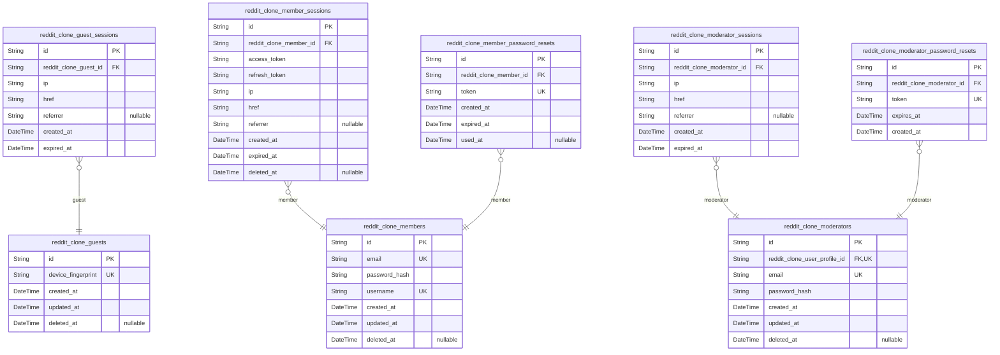
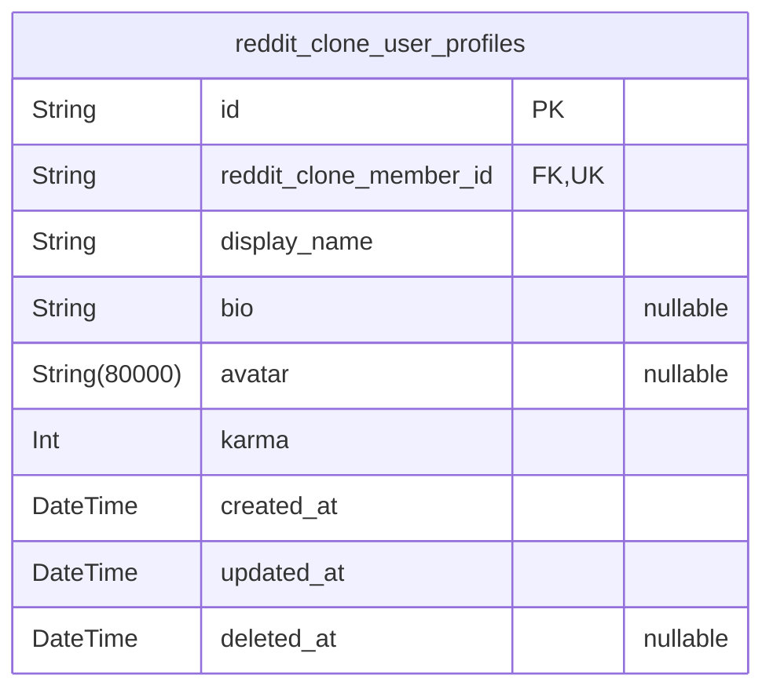
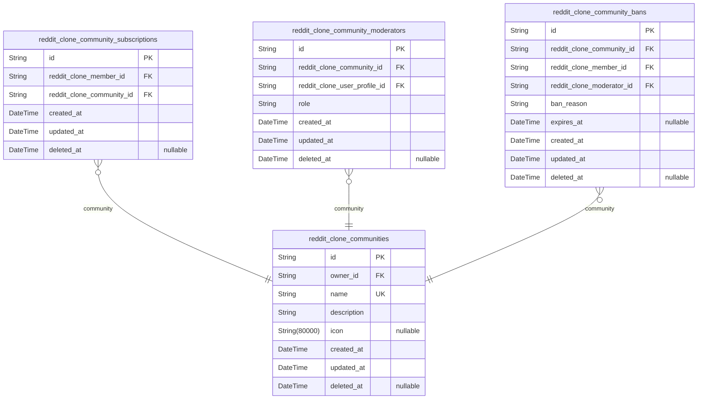
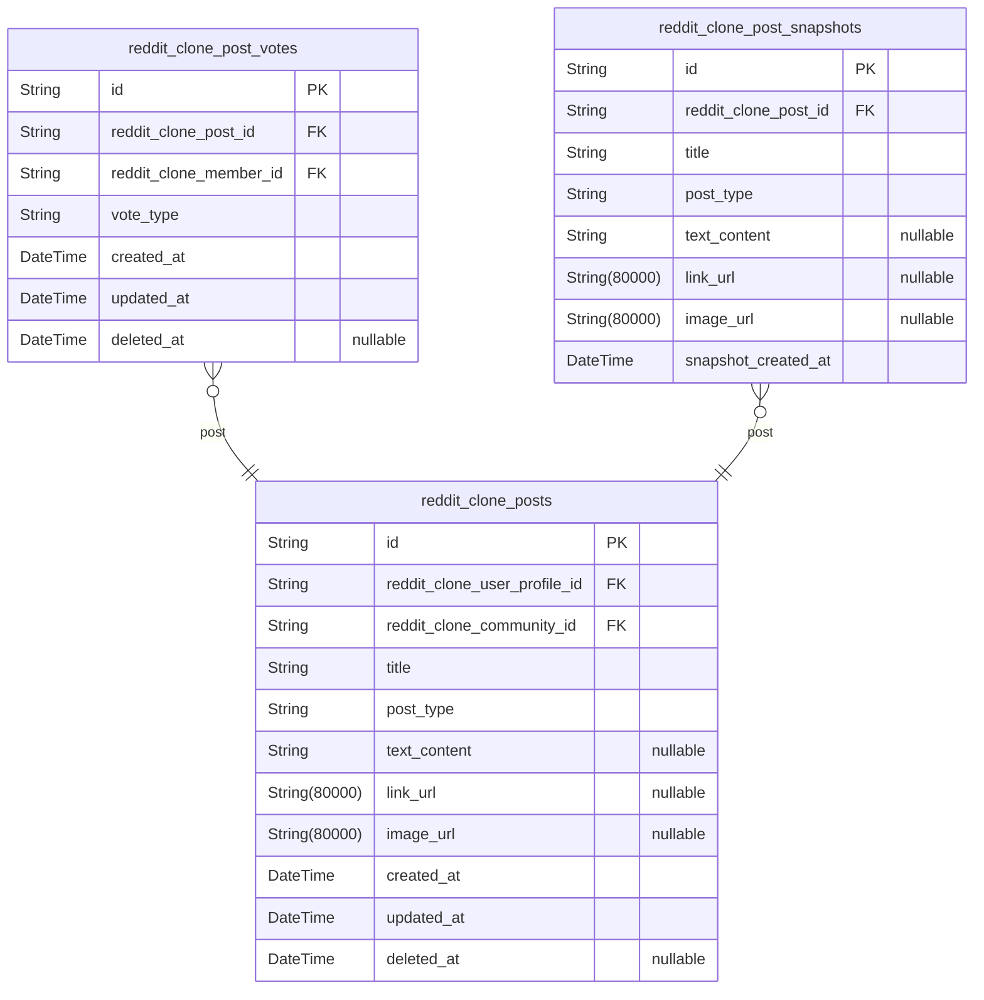
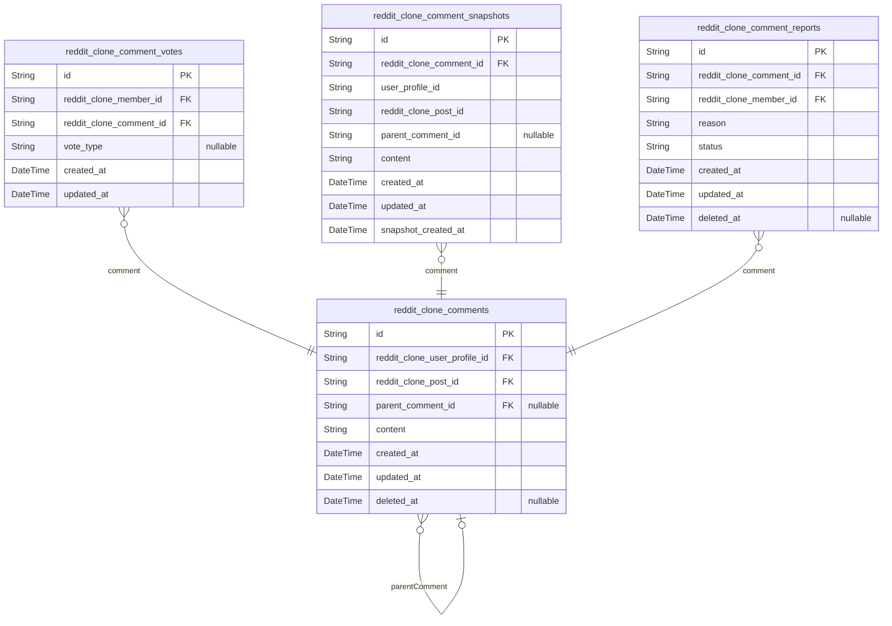
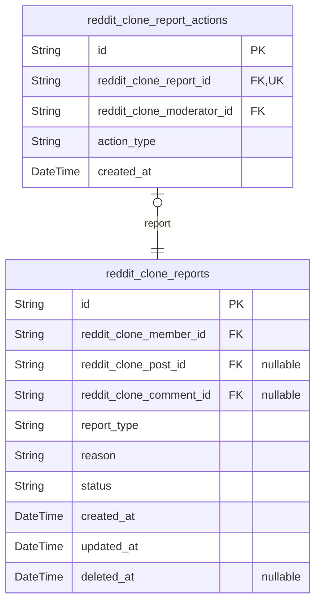

# Prisma Markdown

> Generated by [`prisma-markdown`](https://github.com/samchon/prisma-markdown)

- [auth](#auth)
- [users](#users)
- [communities](#communities)
- [posts](#posts)
- [comments](#comments)
- [reports](#reports)

## auth

### `reddit_clone_guests`

Temporary guest accounts identified by device fingerprint for anonymous
browsing.

Guest accounts enable unauthenticated users to browse public content
(popular feed, community feeds, user profiles) without registration. Each
guest is uniquely identified by a device fingerprint string extracted
from their browser or device.

Guests have limited permissions compared to members: they can view
content but cannot create posts, comments, votes, or subscriptions. Guest
accounts are temporary and may expire after inactivity.

Properties as follows:

- `id`: Primary Key for guest account.
- `device_fingerprint`
  > Unique device identifier for guest recognition.
  >
  > This string uniquely identifies the guest's device/browser across
  > sessions. Generated from browser fingerprinting data (user agent, screen
  > resolution, installed fonts, etc.). Used to recognize returning guests
  > and maintain session continuity without authentication.
- `created_at`: Timestamp when the guest account was first created.
- `updated_at`: Timestamp when the guest account was last updated.
- `deleted_at`
  > Timestamp when the guest account was soft-deleted.
  >
  > Guest accounts may be deleted after extended inactivity or when the user
  > registers as a member.

### `reddit_clone_guest_sessions`

Temporary session tokens for guest access to public content.

Guest sessions enable unauthenticated users to browse public content
(popular feed, community feeds, user profiles) without creating an
account. Each session is tied to a specific guest account identified by
device fingerprint and includes metadata about the session origin for
security and analytics purposes.

Properties as follows:

- `id`: Primary Key. Unique identifier for each guest session.
- `reddit_clone_guest_id`
  > Foreign key to the guest account this session belongs to.
  >
  > Links the session to a specific guest identified by device fingerprint.
  > Each guest can have multiple sessions across different devices or
  > browsers.
- `ip`
  > IP address from which the guest session was created.
  >
  > Used for security monitoring and session validation. Helps detect
  > suspicious activity or unauthorized access attempts.
- `href`
  > URL where the guest session was initiated.
  >
  > Tracks the entry point into the application for analytics and user
  > experience optimization.
- `referrer`
  > Referrer URL that led the guest to the application.
  >
  > Captures the source of traffic for analytics and marketing attribution
  > purposes.
- `created_at`
  > Timestamp when the guest session was created.
  >
  > Used to determine session age and calculate expiration. Essential for
  > session lifecycle management.
- `expired_at`
  > Timestamp when the guest session expires.
  >
  > Determines session validity period. Guest sessions are temporary and must
  > expire for security reasons.

### `reddit_clone_members`

Registered user accounts with email/password authentication and profile
data.

This table stores the core authentication credentials for registered
members who can create content, vote, subscribe to communities, and
participate in the platform. Each member has a unique email for login and
a unique username for public identification.

Members are linked to user_profiles (1:1) which contain public-facing
data like display name, bio, and karma score. Sessions and password reset
tokens are managed in separate child tables that reference this table.

Properties as follows:

- `id`: Primary Key for member account.
- `email`
  > Unique email address used for member login and account recovery.
  >
  > Email is the primary identifier for authentication. It must be unique
  > across all members and is used for password reset flows.
- `password_hash`
  > Bcrypt-hashed password for member authentication.
  >
  > Never stores plain text passwords. Used during login to verify
  > credentials.
- `username`
  > Unique public username chosen by the member during registration.
  >
  > Username is displayed on posts, comments, and profiles. Must be unique
  > across all members.
- `created_at`: Timestamp when the member account was created.
- `updated_at`: Timestamp when the member account was last updated.
- `deleted_at`
  > Timestamp when the member account was soft-deleted.
  >
  > When a member deletes their account, this field is set. All their posts
  > and comments are also deleted (cascade).

### `reddit_clone_member_sessions`

JWT session tokens with access and refresh support for member
authentication.

This table stores authentication session data for logged-in members,
including JWT access and refresh tokens, login metadata (IP address, page
URL, referrer), and token expiration information. Each session is tied to
exactly one member account and is used to validate ongoing authentication
state.

Sessions are created during login and expire based on token validity
periods. They support soft deletion for audit trail purposes while
maintaining referential integrity with the member account.

Properties as follows:

- `id`: Primary Key. Unique identifier for each member session.
- `reddit_clone_member_id`
  > Foreign key to the member account that owns this session.
  >
  > This establishes the relationship between the session and the
  > authenticated member. Each session belongs to exactly one member, and a
  > member can have multiple concurrent sessions (e.g., logged in from
  > multiple devices).
- `access_token`
  > JWT access token for API authentication.
  >
  > This token is used for short-term authentication of API requests. It
  > contains user claims and expires after a short duration (typically 15
  > minutes). The token is validated on each request to verify the user's
  > authenticated state.
- `refresh_token`
  > JWT refresh token for obtaining new access tokens.
  >
  > This token is used to request new access tokens when the current one
  > expires. It has a longer validity period (typically 7-30 days) and allows
  > users to maintain their session without re-authenticating with
  > credentials.
- `ip`
  > IP address from which the session was created.
  >
  > This field captures the client's IP address at login time for security
  > auditing and session anomaly detection. It can be used to identify
  > suspicious login patterns or unauthorized access attempts.
- `href`
  > Page URL where the login occurred.
  >
  > This field tracks the entry point URL where the user initiated the login
  > process. It provides context for the session origin and can be used for
  > analytics or security monitoring.
- `referrer`
  > Referrer URL that led to the login page.
  >
  > This field captures the referring page URL that directed the user to the
  > login page. It provides additional context about the user's navigation
  > path before authentication.
- `created_at`
  > Timestamp when the session was created.
  >
  > This field records the exact time when the user logged in and the session
  > was established. It is used for session age calculations, expiration
  > checks, and audit logging.
- `expired_at`
  > Timestamp when the session expires.
  >
  > This field indicates when the refresh token will expire and the session
  > will become invalid. After this time, the user must re-authenticate with
  > credentials to obtain a new session.
- `deleted_at`
  > Timestamp when the session was soft-deleted.
  >
  > This field tracks when the session was terminated (logout or revocation).
  > Soft deletion maintains the session record for audit purposes while
  > marking it as inactive.

### `reddit_clone_member_password_resets`

Temporary password reset tokens for member account recovery.

This table stores one-time use tokens generated when a member requests a
password reset. Each token is linked to a specific member account and
expires after a set duration. Once used or expired, the token becomes
invalid for security purposes.

Tokens are generated upon password reset request initiation and validated
during the reset completion flow. Only unused, non-expired tokens are
accepted for password changes.

Properties as follows:

- `id`: Primary Key. Unique identifier for each password reset token record.
- `reddit_clone_member_id`
  > Foreign key reference to the member account requesting password reset.
  >
  > This links the reset token to the specific member account that needs
  > password recovery. Only the member associated with this token can use it
  > to reset their password.
- `token`
  > Unique one-time use token for password reset verification.
  >
  > This cryptographically secure token is sent to the member's email and
  > must be provided to complete the password reset. Each token can only be
  > used once and expires after a configured duration.
- `created_at`
  > Timestamp when this password reset token was generated.
  >
  > Records when the member initiated the password reset request. Used to
  > calculate token age and enforce expiration policies.
- `expired_at`
  > Timestamp when this password reset token expires.
  >
  > Tokens become invalid after this time for security. Typically set to 1
  > hour from creation to limit the window for potential token compromise.
- `used_at`
  > Timestamp when this password reset token was consumed.
  >
  > Set when the member successfully uses the token to reset their password.
  > Once set, the token cannot be reused. Null if the token has not yet been
  > used.

### `reddit_clone_moderators`

Community moderator accounts with elevated privileges for content
management and user moderation.

Moderators are authenticated users who can manage posts, comments, and
users within their assigned communities. They can delete content, ban
users, and handle reports. Each moderator has a unique email and password
for authentication, and is linked to a user profile for public-facing
information.

Moderators have elevated permissions compared to regular members but
cannot remove community owners or other moderators (only owners can
manage moderator roles).

Properties as follows:

- `id`: Primary Key - Unique identifier for moderator accounts.
- `reddit_clone_user_profile_id`
  > Reference to the user profile associated with this moderator account.
  >
  > Each moderator has exactly one user profile containing their public
  > display information (display name, bio, avatar, karma). This establishes
  > a 1:1 relationship between moderators and their profiles.
- `email`
  > Unique email address for moderator authentication.
  >
  > Used as the primary identifier for login. Must be unique across all
  > moderators and cannot be changed after account creation.
- `password_hash`
  > Hashed password for moderator authentication.
  >
  > Stores the bcrypt hash of the user's password. Never stores plain text
  > passwords. Required for login validation.
- `created_at`
  > Timestamp when this moderator account was created.
  >
  > Set automatically on account creation. Used for audit trails and account
  > age calculations.
- `updated_at`
  > Timestamp when this moderator account was last updated.
  >
  > Updated on any profile or authentication field changes. Used for tracking
  > modification history.
- `deleted_at`
  > Timestamp when this moderator account was soft-deleted.
  >
  > Nullable field for soft delete support. When set, the account is marked
  > as deleted but data is retained for audit purposes.

### `reddit_clone_moderator_sessions`

JWT session tokens for moderator authentication with elevated security.

This table stores authentication sessions for moderator actors, tracking
login events with device and network information. Each session is tied to
exactly one moderator account and includes expiration tracking for
security. Sessions are append-only audit trails managed through
authentication flows.

Session tokens enable moderators to access elevated privileges including
content moderation, user management, and community administration within
their assigned communities.

Properties as follows:

- `id`: Primary Key.
- `reddit_clone_moderator_id`
  > References the moderator account that owns this session.
  >
  > This foreign key establishes the relationship between the session and the
  > authenticated moderator. Each session belongs to exactly one moderator,
  > enabling session-based authentication and authorization for
  > moderator-specific operations.
- `ip`
  > IP address from which the session was created.
  >
  > Tracks the network address of the client device during login for security
  > auditing and session validation purposes.
- `href`
  > URL that the user was directed to after login.
  >
  > Records the destination page or application endpoint accessed through
  > this session for navigation tracking.
- `referrer`
  > Referrer URL from which the login originated.
  >
  > Tracks the source page or application that initiated the authentication
  > flow for session context.
- `created_at`
  > Timestamp when this session was created.
  >
  > Records the exact time when the moderator authenticated and the session
  > token was issued.
- `expired_at`
  > Timestamp when this session expires.
  >
  > Defines the session validity period for security purposes. Sessions are
  > invalidated after this time requires re-authentication.

### `reddit_clone_moderator_password_resets`

Password reset tokens for moderator account recovery with expiration
tracking.

This table stores temporary one-time tokens generated when a moderator
requests a password reset. Each token is cryptographically secure and
expires after a specified duration. The token allows the moderator to
authenticate and set a new password without providing their current
password.

Tokens are append-only for security audit purposes. Once used or expired,
tokens remain in the system for audit trail but cannot be reused.

Properties as follows:

- `id`: Primary Key. Unique identifier for each password reset token record.
- `reddit_clone_moderator_id`
  > Foreign key to the moderator account requesting password reset.
  >
  > Links this password reset token to the specific moderator account that
  > needs recovery. Only the moderator associated with this token can use it
  > to reset their password.
- `token`
  > Cryptographically secure password reset token.
  >
  > This token is sent to the moderator via email and must be provided to
  > complete the password reset process. The token is generated using a
  > secure random algorithm and is designed to be unpredictable and
  > non-reusable.
- `expires_at`
  > Expiration timestamp for the password reset token.
  >
  > Tokens expire after a specified duration (typically 1 hour) for security.
  > Once expired, the token cannot be used and a new reset request must be
  > made.
- `created_at`
  > Timestamp when the password reset token was generated.
  >
  > Records when the moderator requested a password reset. Used for audit
  > trail and to calculate token age.

## users

### `reddit_clone_user_profiles`

Public user profiles containing display information, bio, avatar, and
karma score.

User profiles store the public-facing identity information for registered
members. Each member has exactly one profile that can be viewed by any
user (guest or authenticated). The profile contains editable display
information separate from authentication credentials.

Karma is denormalized in this table for performance rather than computed
on-the-fly from votes. It tracks the user's reputation score based on
upvotes and downvotes on their posts and comments.

Properties as follows:

- `id`: Primary Key for user profile records.
- `reddit_clone_member_id`
  > Foreign key linking to the authenticated member account.
  >
  > This establishes a 1:1 relationship between a member account and their
  > public profile. Each member must have exactly one profile, and each
  > profile belongs to exactly one member.
- `display_name`
  > Public display name shown on the user's profile and content.
  >
  > This is the visible name that appears on posts, comments, and the user's
  > profile page. Users can edit this independently from their authentication
  > username.
- `bio`
  > Optional biographical text describing the user.
  >
  > Users can add a short bio to their profile page. This field is nullable
  > as not all users will provide biographical information.
- `avatar`
  > URL to the user's avatar image.
  >
  > Users can upload and set an avatar image that appears on their profile
  > and next to their content. This field is nullable for users who haven't
  > set an avatar.
- `karma`
  > User's total karma score based on votes received on their posts and
  > comments.
  >
  > Karma increases by 1 for each upvote and decreases by 1 for each downvote
  > on the user's posts and comments. This value is denormalized for
  > performance rather than computed on-the-fly. Karma can be negative.
- `created_at`: Timestamp when the user profile was created.
- `updated_at`: Timestamp when the user profile was last updated.
- `deleted_at`
  > Timestamp when the user profile was soft deleted.
  >
  > When a user deletes their account, their profile is soft deleted. This
  > allows for potential account recovery within retention periods.

## communities

### `reddit_clone_communities`

Community entities that serve as organizational units for content and
user interaction.

Each community has a unique name, description, and icon image. The
creator of a community becomes its owner with full administrative
privileges. Communities are the primary organizational structure where
users subscribe, create posts, and participate in discussions.

Communities support browsing, searching by name, and display subscriber
counts. They serve as the container for posts, comments, and
community-specific moderation actions.

Properties as follows:

- `id`: Primary Key. Unique identifier for each community entity.
- `owner_id`
  > Reference to the user profile of the community owner.
  >
  > The owner is the user who created the community and has the highest
  > authority within it. Owners can add and remove moderators, and have full
  > control over community settings and content.
- `name`
  > Unique community name used for identification and URL routing.
  >
  > The name must be unique across all communities and is used to identify
  > the community in URLs and references. Users search and browse communities
  > by this name.
- `description`
  > Community description text explaining the purpose and focus of the
  > community.
  >
  > This field contains descriptive text about what the community is about,
  > its rules, and what type of content is appropriate. Displayed on the
  > community page for users to understand the community's purpose.
- `icon`
  > URL to the community icon image.
  >
  > The icon is displayed alongside the community name in lists, headers, and
  > navigation. Provides visual identification for the community.
- `created_at`
  > Timestamp when the community was created.
  >
  > Records the exact date and time when the community entity was first
  > created. Used for sorting communities by creation date and tracking
  > community age.
- `updated_at`
  > Timestamp when the community was last updated.
  >
  > Tracks the most recent modification to community metadata including name,
  > description, or icon changes.
- `deleted_at`
  > Timestamp when the community was soft-deleted.
  >
  > Nullable field for soft-delete functionality. When set, the community is
  > marked as deleted but data is retained for potential recovery or audit
  > purposes.

### `reddit_clone_community_subscriptions`

User subscriptions to communities enabling membership and post creation
rights.

This junction table establishes the many-to-many relationship between
members and communities. Subscribing is a prerequisite for creating posts
within a community. Each subscription record tracks when a user joined a
community and allows soft deletion for unsubscribe operations while
maintaining audit history.

Properties as follows:

- `id`: Primary Key.
- `reddit_clone_member_id`
  > Reference to the member who subscribed to the community.
  >
  > This foreign key links to the member actor table, establishing which user
  > has subscribed to the community. Required for tracking membership and
  > enforcing post creation permissions.
- `reddit_clone_community_id`
  > Reference to the community being subscribed to.
  >
  > This foreign key links to the community entity, identifying which
  > community the member has joined. Used to validate post creation
  > permissions and display subscribed communities.
- `created_at`
  > Timestamp when the subscription was created.
  >
  > Records when the user first subscribed to the community. Used for sorting
  > subscriptions by join date and tracking community growth over time.
- `updated_at`
  > Timestamp when the subscription was last updated.
  >
  > Tracks modifications to the subscription record. Updated on any changes
  > to maintain audit trail.
- `deleted_at`
  > Timestamp when the subscription was soft deleted (unsubscribed).
  >
  > Nullable field for soft delete functionality. When set, indicates the
  > user has unsubscribed from the community while preserving the record for
  > audit purposes.

### `reddit_clone_community_moderators`

Moderator role assignments within communities with owner and moderator
distinctions.

This table tracks which users have moderator privileges in each
community. The owner role is assigned to the community creator and has
highest authority. Moderator roles can be assigned by the owner or
existing moderators.

Owners can add and remove moderators, while moderators can only add other
moderators. Moderators cannot remove the owner or other moderators.

Properties as follows:

- `id`: Primary Key for moderator assignment record.
- `reddit_clone_community_id`
  > Reference to the community where this user has moderator privileges.
  >
  > Each moderator assignment is scoped to a specific community. A user can
  > be a moderator in multiple communities.
- `reddit_clone_user_profile_id`
  > Reference to the user profile of the moderator.
  >
  > Links to the user who has been granted moderator privileges in this
  > community.
- `role`
  > The moderator role type: 'owner' or 'moderator'.
  >
  > Owner is the community creator with highest authority. Moderators have
  > elevated privileges but cannot remove the owner or other moderators.
- `created_at`: Timestamp when this moderator assignment was created.
- `updated_at`: Timestamp when this moderator assignment was last updated.
- `deleted_at`
  > Timestamp when this moderator assignment was soft deleted. Null means the
  > assignment is active.

### `reddit_clone_community_bans`

User ban records tracking restrictions within specific communities.

Bans prevent users from creating posts and comments in a community while
allowing content viewing. Each ban records the banned user, the
community, the moderator who issued the ban, the reason, and optional
expiration time for temporary bans.

Bans are managed by community moderators and can be removed (unbanned)
via soft delete. The deleted_at field enables tracking of past bans while
distinguishing active from inactive restrictions.

Properties as follows:

- `id`: Primary Key for ban record.
- `reddit_clone_community_id`
  > Reference to the community where the ban is enforced.
  >
  > This foreign key links the ban to the specific community context. The ban
  > restricts the user's ability to create content within this community
  > only.
- `reddit_clone_member_id`
  > Reference to the member account that has been banned.
  >
  > This identifies the user who is restricted from creating posts and
  > comments in the community. The member can still view content.
- `reddit_clone_moderator_id`
  > Reference to the moderator who issued this ban.
  >
  > Records which moderator (or owner) enforced the restriction. This enables
  > audit trails and accountability for moderation actions.
- `ban_reason`
  > Text explanation for why the user was banned.
  >
  > Moderators must provide a reason when issuing a ban. This helps with
  > transparency and allows the banned user to understand the violation.
- `expires_at`
  > Optional expiration timestamp for temporary bans.
  >
  > When set, the ban automatically becomes inactive after this time. When
  > null, the ban is permanent until manually removed by a moderator.
- `created_at`: Timestamp when the ban was created.
- `updated_at`: Timestamp when the ban was last modified.
- `deleted_at`
  > Timestamp when the ban was removed (unbanned).
  >
  > Soft delete field enabling tracking of past bans while distinguishing
  > active from inactive restrictions. When null, the ban is currently
  > active.

## posts

### `reddit_clone_posts`

Posts created by users in communities, supporting text, link, and image
types with required titles.

Posts are the primary content entities in the reddit clone platform. Each
post belongs to exactly one [reddit_clone_communities](#reddit_clone_communities) and is
authored by one [reddit_clone_user_profiles](#reddit_clone_user_profiles). Posts support three
content types: text posts with body content, link posts with URLs, and
image posts with image URLs.

Posts are visible to all users but can only be created by users
subscribed to the target community. Posts support voting via {@link
reddit_clone_post_votes}, comments, and reporting for community
moderation.

Properties as follows:

- `id`: Primary Key for the posts table.
- `reddit_clone_user_profile_id`
  > Foreign key referencing the user profile who created this post.
  >
  > This establishes the authorship relationship between posts and {@link
  > reddit_clone_user_profiles}. The author's karma is affected by votes on
  > this post via [reddit_clone_post_votes](#reddit_clone_post_votes).
- `reddit_clone_community_id`
  > Foreign key referencing the community where this post was created.
  >
  > Posts can only be created in communities where the author is subscribed
  > via [reddit_clone_community_subscriptions](#reddit_clone_community_subscriptions). The community provides
  > the context and moderation rules for the post.
- `title`
  > The title of the post.
  >
  > This field is required for all posts and must be provided when creating a
  > post. The title is used for display in post lists and search results.
- `post_type`
  > The type of content this post contains.
  >
  > Valid values are: 'text' for text posts, 'link' for link posts, and
  > 'image' for image posts. This discriminator determines which content
  > field should be populated.
- `text_content`
  > The body text content for text-type posts.
  >
  > This field is populated only when post_type is 'text'. For link and image
  > posts, this field is null.
- `link_url`
  > The URL for link-type posts.
  >
  > This field contains the external URL when post_type is 'link'. For text
  > and image posts, this field is null.
- `image_url`
  > The image URL for image-type posts.
  >
  > This field contains the image URL when post_type is 'image'. For text and
  > link posts, this field is null.
- `created_at`
  > Timestamp when this post was created.
  >
  > This field is set automatically when the post is first created and is
  > used for sorting posts by recency.
- `updated_at`
  > Timestamp when this post was last updated.
  >
  > This field is updated whenever the post content is modified by the author
  > or moderators.
- `deleted_at`
  > Timestamp when this post was soft-deleted.
  >
  > This field is set when the post is deleted by the author or moderators.
  > Posts with a deleted_at value are hidden from normal views but retained
  > for audit purposes.

### `reddit_clone_post_votes`

User votes on posts for scoring and karma calculation.

Each vote represents a single user's vote (upvote or downvote) on a
specific post. Votes are used to calculate post scores and update user
karma. Each user can only have one vote per post, which can be changed or
removed.

Votes are subsidiary entities managed through their parent posts. They
support the voting system where post scores are calculated as the sum of
upvotes minus downvotes.

Properties as follows:

- `id`: Primary Key.
- `reddit_clone_post_id`
  > Foreign key to the post being voted on.
  >
  > This establishes the relationship between a vote and its target post.
  > Each vote is associated with exactly one post.
- `reddit_clone_member_id`
  > Foreign key to the member who cast the vote.
  >
  > This establishes the relationship between a vote and the user who cast
  > it. Each vote is cast by exactly one member.
- `vote_type`
  > The type of vote cast by the member.
  >
  > This field stores whether the vote is an upvote or downvote. Valid values
  > are 'upvote' (adds 1 to post score) or 'downvote' (subtracts 1 from post
  > score).
- `created_at`
  > Timestamp when the vote was created.
  >
  > This field tracks when the user first cast their vote on the post.
- `updated_at`
  > Timestamp when the vote was last updated.
  >
  > This field tracks when the user last changed their vote (e.g., switching
  > from upvote to downvote).
- `deleted_at`
  > Timestamp when the vote was soft deleted.
  >
  > This field is used for soft delete functionality. When a user removes
  > their vote, this field is set instead of physically deleting the record.

### `reddit_clone_post_snapshots`

Point-in-time snapshots of posts capturing all field values at the moment
of creation or update for edit history and audit trail.

Snapshots are created when a post is first published and whenever it is
edited. Each snapshot stores a complete copy of the post data at that
moment, enabling users to view previous versions and moderators to audit
changes.

Snapshots are immutable and append-only. They reference the parent post
via foreign key and include all denormalized fields from the original
post.

Properties as follows:

- `id`: Primary key for the post snapshot record.
- `reddit_clone_post_id`
  > Foreign key reference to the parent post that this snapshot captures.
  >
  > Each snapshot belongs to exactly one post. Multiple snapshots can exist
  > for a single post, representing its edit history over time.
- `title`
  > The title of the post at the time this snapshot was created.
  >
  > This is a denormalized copy of the post title field, captured at
  > point-in-time for historical reference.
- `post_type`
  > The type of post (text, link, or image) at the time this snapshot was
  > created.
  >
  > This is a denormalized copy of the post type discriminator field.
- `text_content`
  > The text content of the post at the time this snapshot was created, if
  > the post type is 'text'.
  >
  > This field is nullable and only populated for text-type posts. This is a
  > denormalized copy of the post's text_content field.
- `link_url`
  > The URL link of the post at the time this snapshot was created, if the
  > post type is 'link'.
  >
  > This field is nullable and only populated for link-type posts. This is a
  > denormalized copy of the post's link_url field.
- `image_url`
  > The image URL of the post at the time this snapshot was created, if the
  > post type is 'image'.
  >
  > This field is nullable and only populated for image-type posts. This is a
  > denormalized copy of the post's image_url field.
- `snapshot_created_at`
  > The timestamp when this snapshot was created, capturing the exact moment
  > the post state was recorded.
  >
  > This field represents when the snapshot was taken, not when the original
  > post was created or updated.

## comments

### `reddit_clone_comments`

Comment entities containing user-generated discussion content with
support for unlimited nested replies.

Comments are created by users on posts within communities. Each comment
contains text content, references its author and parent post, and
optionally references a parent comment for reply threading. Comments
support editing and soft deletion.

Comments participate in voting systems for scoring and karma calculation.
They can be reported by users for moderator review. Edit history is
tracked through snapshot tables.

Properties as follows:

- `id`: Primary Key for comment entity.
- `reddit_clone_user_profile_id`
  > References the user profile of the comment author.
  >
  > Establishes ownership relationship between a user and their comments.
  > Used to display author information and enforce edit/delete permissions.
- `reddit_clone_post_id`
  > References the post this comment belongs to.
  >
  > Links comments to their parent post for display and organization.
  > Comments are scoped to specific posts.
- `parent_comment_id`
  > Self-referencing foreign key to the parent comment for reply threading.
  >
  > Enables unlimited nested comment depth. Null for top-level comments, set
  > for replies to other comments.
- `content`
  > The text content of the comment.
  >
  > Contains the user-written message body. Required field for all comments.
- `created_at`
  > Timestamp when the comment was first created.
  >
  > Used to display posting time and order comments chronologically.
- `updated_at`
  > Timestamp when the comment was last updated.
  >
  > Tracks edit history and shows when content was modified.
- `deleted_at`
  > Timestamp when the comment was soft deleted.
  >
  > Nullable field for soft delete support. When set, comment is hidden from
  > normal views but preserved for audit.

### `reddit_clone_comment_votes`

Individual user votes on comments with vote type for karma and scoring
calculations.

Each vote represents a single user's opinion (upvote or downvote) on a
comment. Votes are used to calculate comment scores and update user
karma. Users can change or remove their votes at any time.

Properties as follows:

- `id`: Primary Key for comment vote record.
- `reddit_clone_member_id`
  > Reference to the member who cast this vote.
  >
  > Each vote is tied to a specific member account. This enables tracking who
  > voted on which comments and calculating karma for vote recipients.
- `reddit_clone_comment_id`
  > Reference to the comment being voted on.
  >
  > Each vote targets a specific comment. This enables calculating comment
  > scores and determining which comments receive karma.
- `vote_type`
  > Type of vote cast by the member.
  >
  > Allowed values: 'upvote' (increases score by 1), 'downvote' (decreases
  > score by 1), or null (vote removed). When null, the vote has no effect on
  > scoring but the record is retained for audit purposes.
- `created_at`
  > Timestamp when this vote was first cast.
  >
  > Used to track when the vote was originally created and for audit purposes.
- `updated_at`
  > Timestamp when this vote was last modified.
  >
  > Updated whenever the vote type changes or is removed. Used for tracking
  > vote modification history.

### `reddit_clone_comment_snapshots`

Point-in-time snapshots of comment content for edit history and audit trail.

These snapshots capture the complete state of a comment at a specific
moment, preserving historical data even if the original comment is
modified or deleted. Each snapshot denormalizes all comment fields to
ensure data integrity over time.

Snapshots are created when comments are edited, providing an immutable
audit trail of all changes. They support content moderation reviews, user
accountability, and data recovery scenarios.

Properties as follows:

- `id`: Primary Key.
- `reddit_clone_comment_id`
  > Reference to the comment being snapshotted.
  >
  > This foreign key links each snapshot to its source comment in {@link
  > reddit_clone_comments}. Multiple snapshots can exist for a single
  > comment, representing different points in its edit history.
- `user_profile_id`
  > ID of the user profile who wrote the comment at snapshot time.
  >
  > Denormalized from [reddit_clone_comments](#reddit_clone_comments) to preserve author
  > information even if the user profile is later deleted or modified.
- `reddit_clone_post_id`
  > ID of the post this comment belongs to at snapshot time.
  >
  > Denormalized from [reddit_clone_comments](#reddit_clone_comments) to preserve post context
  > even if the post is later deleted or modified.
- `parent_comment_id`
  > ID of the parent comment if this is a reply, null for top-level comments.
  >
  > Denormalized from [reddit_clone_comments](#reddit_clone_comments) to preserve the reply
  > hierarchy at snapshot time.
- `content`
  > The full text content of the comment at snapshot time.
  >
  > This is the exact content as it existed when the snapshot was taken,
  > preserved for historical accuracy.
- `created_at`
  > Timestamp when the original comment was created.
  >
  > Denormalized from [reddit_clone_comments](#reddit_clone_comments) to preserve the original
  > creation time.
- `updated_at`
  > Timestamp when the comment was last updated at snapshot time.
  >
  > Denormalized from [reddit_clone_comments](#reddit_clone_comments) to preserve the
  > modification history.
- `snapshot_created_at`
  > Timestamp when this snapshot was created.
  >
  > Tracks when the snapshot was taken, distinguishing it from the comment's
  > own creation/update times.

### `reddit_clone_comment_reports`

User-submitted reports about comments for moderator review and content
moderation.

Reports allow community members to flag inappropriate comments for
moderator attention. Each report includes the reported comment, the
reporting user, a reason text explaining the violation, and a status
tracking the moderation workflow.

Moderators review reports and can approve them (triggering content
deletion) or dismiss them (keeping content and removing from report
list). Reports are essential for community self-governance and
maintaining content quality standards.

Properties as follows:

- `id`: Primary Key for comment reports.
- `reddit_clone_comment_id`
  > Reference to the comment being reported for moderation review.
  >
  > This foreign key establishes the relationship between the report and the
  > specific comment content that has been flagged as violating community
  > guidelines or policies.
- `reddit_clone_member_id`
  > Reference to the member who submitted this report.
  >
  > Tracks which user flagged the comment for moderation purposes. This
  > enables accountability and prevents duplicate reports from the same user
  > on the same comment.
- `reason`
  > Text explanation provided by the reporting user for why this comment
  > should be reviewed.
  >
  > The reason field captures the specific violation or concern that prompted
  > the report. Moderators use this information to understand the context and
  > make informed decisions about whether to approve or dismiss the report.
- `status`
  > Current moderation status of this report.
  >
  > Status values: 'pending' (awaiting moderator review), 'approved'
  > (moderator agreed and content was deleted), 'dismissed' (moderator
  > rejected the report and content remains). This field enables moderators
  > to filter and manage their workload efficiently.
- `created_at`: Timestamp when this report was created by the user.
- `updated_at`
  > Timestamp when this report was last updated (status change or metadata
  > modification).
- `deleted_at`
  > Timestamp when this report was soft-deleted. Dismissed reports may be
  > soft-deleted to remove them from active moderation queues while
  > preserving audit trail.

## reports

### `reddit_clone_reports`

User-submitted reports about posts or comments for moderator review.

Reports enable community members to flag inappropriate content for
moderator attention. Each report references either a post or comment
using polymorphic foreign keys, includes a reason from the reporter, and
tracks moderation status through the review workflow.

Reports are created by members and reviewed by moderators who can approve
(delete content) or dismiss (keep content) the report.

Properties as follows:

- `id`: Primary Key.
- `reddit_clone_member_id`
  > The member who submitted this report.
  >
  > References the user account that created the report to track who flagged
  > the content for moderation review.
- `reddit_clone_post_id`
  > The post being reported (when report_type is 'post').
  >
  > Nullable because reports can target either posts or comments. Only
  > populated when report_type equals 'post'.
- `reddit_clone_comment_id`
  > The comment being reported (when report_type is 'comment').
  >
  > Nullable because reports can target either posts or comments. Only
  > populated when report_type equals 'comment'.
- `report_type`
  > Type of content being reported.
  >
  > Discriminator field that indicates whether this report targets a 'post'
  > or 'comment'. Determines which foreign key (reddit_clone_post_id or
  > reddit_clone_comment_id) is populated.
- `reason`
  > The reporter's explanation for flagging this content.
  >
  > Required text field where the member explains why the content violates
  > community guidelines or deserves moderator attention.
- `status`
  > Current moderation status of this report.
  >
  > Tracks the workflow state: 'pending' (awaiting review), 'approved'
  > (content deleted), or 'dismissed' (content kept).
- `created_at`
  > When this report was submitted.
  >
  > Timestamp recording when the member first flagged the content for
  > moderation review.
- `updated_at`
  > When this report was last modified.
  >
  > Timestamp tracking the most recent update to the report status or
  > metadata.
- `deleted_at`
  > When this report was soft-deleted.
  >
  > Nullable timestamp for soft-delete support. Dismissed reports may be
  > soft-deleted to remove them from active moderation queues.

### `reddit_clone_report_actions`

Moderator actions on reports recording approve or dismiss decisions.

This table tracks when moderators take action on user-submitted reports.
Each action records which moderator made the decision, what type of
action was taken (approve to delete content or dismiss to keep content),
and when the action occurred.

Actions are subsidiary to reports and are managed through the parent
report entity. When a moderator approves a report, the reported content
(post or comment) is deleted. When dismissed, the content remains and the
report is removed from the active report list. Each report can have only
one action, enforced by a unique constraint on the report foreign key.

Properties as follows:

- `id`: Primary Key for report action records.
- `reddit_clone_report_id`
  > Foreign key reference to the report that was acted upon.
  >
  > This links the action to the specific [reddit_clone_reports](#reddit_clone_reports) report
  > that the moderator reviewed. Each report can have only one action
  > (approve or dismiss), after which the report is resolved. This is
  > enforced by a unique constraint.
- `reddit_clone_moderator_id`
  > Foreign key reference to the moderator who took the action.
  >
  > This identifies which [reddit_clone_moderators](#reddit_clone_moderators) user reviewed and
  > acted on the report. Moderators must be authenticated and have moderator
  > privileges in the relevant community.
- `action_type`
  > The type of action taken on the report.
  >
  > Valid values are 'approve' (delete the reported content) or 'dismiss'
  > (keep the content and remove report from active list). This field
  > determines the outcome of the moderation decision.
- `created_at`
  > Timestamp when the moderator action was recorded.
  >
  > This audit timestamp tracks when the moderator reviewed and decided on
  > the report. Used for reporting and accountability purposes.
