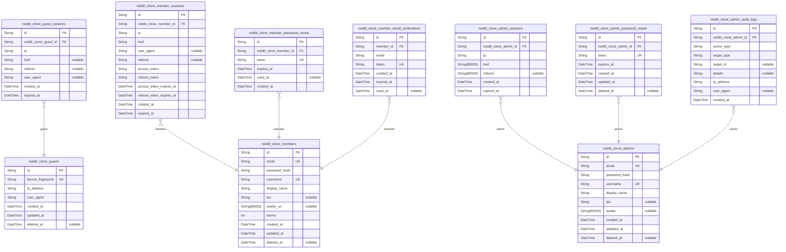
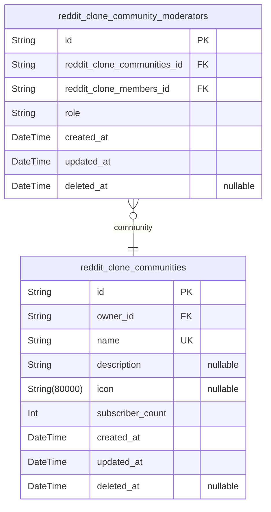
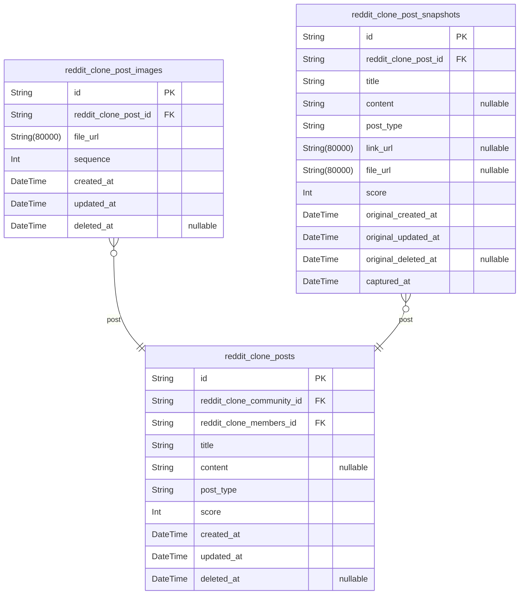
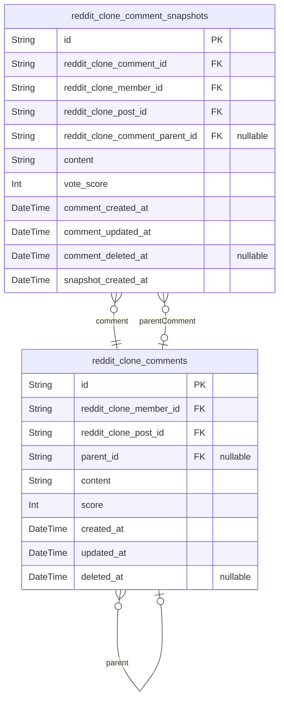
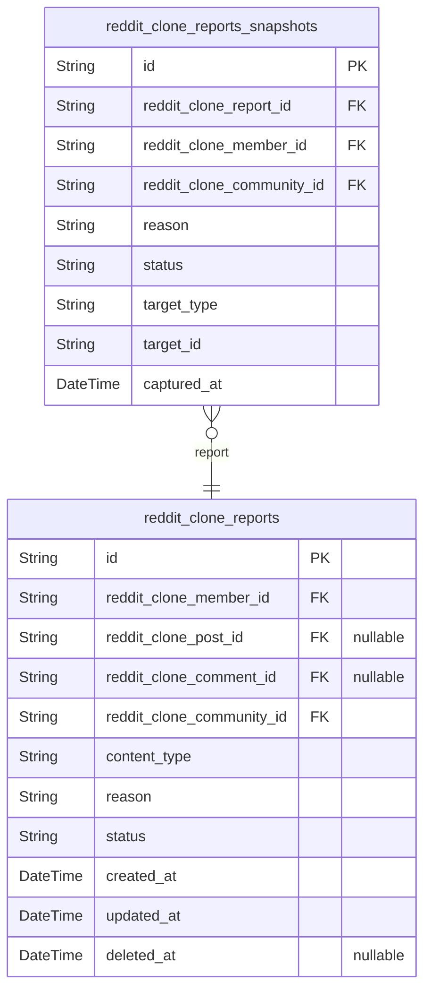
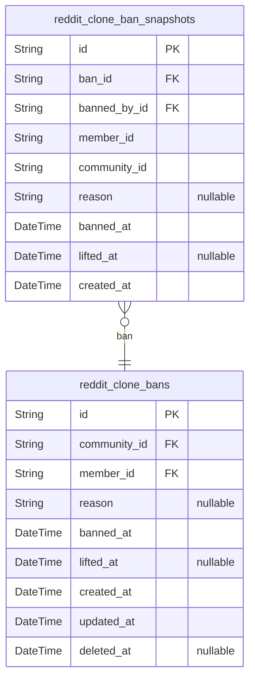
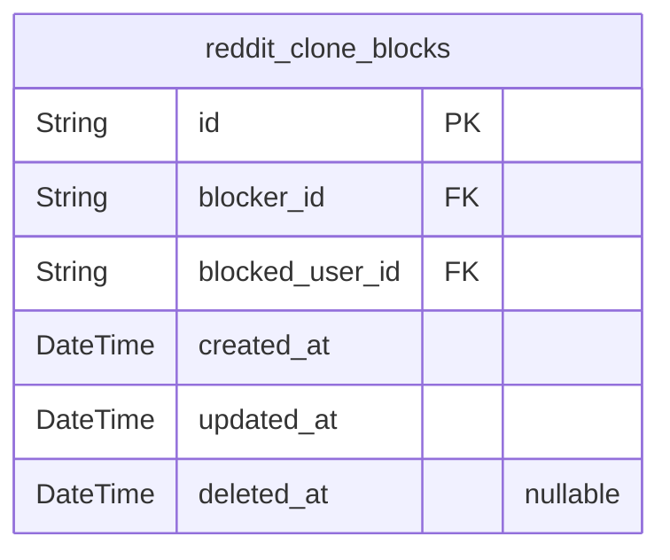

# Prisma Markdown

> Generated by [`prisma-markdown`](https://github.com/samchon/prisma-markdown)

- [Actors](#actors)
- [Communities](#communities)
- [Posts](#posts)
- [Comments](#comments)
- [Reports](#reports)
- [Bans](#bans)
- [Blocks](#blocks)

## Actors

### `reddit_clone_guests`

Temporary guest accounts for anonymous browsing access without registration.

Guests are unauthenticated users who can browse public content including
popular feeds, community feeds, and search results. Each guest is
identified by a unique device fingerprint rather than credentials,
enabling session tracking without requiring account creation.

Key relationships:
- One guest has many [reddit_clone_guest_sessions](#reddit_clone_guest_sessions) for temporary
authentication tokens
- Guests cannot create content (posts, comments) or vote - these actions
require member accounts
- Guests have read-only access to public platform content

Device fingerprinting allows the system to track guest activity and
maintain temporary sessions while respecting privacy and avoiding
persistent user identification.

Properties as follows:

- `id`: Primary Key.
- `device_fingerprint`
  > Unique device identifier generated from browser/device characteristics
  > for guest identification.
- `ip_address`
  > IP address of the guest's device at account creation for tracking and
  > abuse prevention.
- `user_agent`: Browser user agent string for device and browser identification.
- `created_at`: Timestamp when the guest account was created.
- `updated_at`: Timestamp when the guest account was last updated.
- `deleted_at`: Timestamp when the guest account was soft deleted. Null means active.

### `reddit_clone_guest_sessions`

Stores active authentication sessions for guest users, tracking
connection metadata and session lifecycle for anonymous users browsing
public content and feeds.

This table implements the session pattern for the {@link
reddit_clone_guests} actor, capturing login context including IP address,
referrer URL, and session expiration. Each guest can have multiple
concurrent sessions, and sessions are append-only audit records of guest
login events.

Key relationships:
- One-to-many with [reddit_clone_guests](#reddit_clone_guests): Each guest can have
multiple sessions
- Session lifecycle managed through authentication flows, not direct CRUD
operations

Properties as follows:

- `id`: Primary Key.
- `reddit_clone_guest_id`
  > Reference to the guest user account whose session this belongs to. {@link
  > reddit_clone_guests.id}
- `ip`: IP address of the client when the session was created.
- `href`: URL of the page where the session was created or the current page URL.
- `referrer`: HTTP Referrer header indicating the source page that led to this session.
- `user_agent`: HTTP User-Agent header from the client browser or application.
- `created_at`: Timestamp when this session was first created.
- `expired_at`: Timestamp when this session will expire automatically.

### `reddit_clone_members`

Registered member accounts with authentication credentials and profile
information.

This table represents authenticated users who have registered with email
and password. Members can create posts, comments, votes, subscriptions,
and reports across the platform. Each member has a unique username for
identification and a display name for public profiles.

Key relationships:
- One-to-many with [reddit_clone_member_sessions](#reddit_clone_member_sessions) for
authentication sessions
- One-to-many with [reddit_clone_posts](#reddit_clone_posts) as post author
- One-to-many with [reddit_clone_comments](#reddit_clone_comments) as comment author
- One-to-many with [reddit_clone_votes](#reddit_clone_votes) as voter
- One-to-many with [reddit_clone_subscriptions](#reddit_clone_subscriptions) as subscriber
- One-to-many with [reddit_clone_reports](#reddit_clone_reports) as reporter
- One-to-many with [reddit_clone_bans](#reddit_clone_bans) as banned user
- One-to-many with [reddit_clone_blocks](#reddit_clone_blocks) as blocker and blocked user

Members start with a karma score of zero, which increases with upvotes
and decreases with downvotes on their content.

Properties as follows:

- `id`: Primary Key.
- `email`: Unique email address used for authentication and account recovery.
- `password_hash`: BCrypt hashed password for secure authentication.
- `username`: Unique username for account identification, 3-20 characters.
- `display_name`: Public display name shown on profiles and content, 3-50 characters.
- `bio`: User biography text, up to 500 characters.
- `avatar_uri`: URL to user's profile avatar image.
- `karma`
  > Cumulative karma score calculated from votes on posts and comments.
  > Starts at zero and can be negative.
- `created_at`: Timestamp when the member account was created.
- `updated_at`: Timestamp when the member account was last updated.
- `deleted_at`
  > Timestamp when the member account was soft-deleted. Null means account is
  > active.

### `reddit_clone_member_sessions`

Stores active login sessions for authenticated members with JWT access
and refresh tokens for stateless authentication. Each record represents a
single active session with connection metadata for security auditing.

This table tracks member login events including connection details (IP,
referrer, href), JWT tokens for API authentication, and session lifecycle
timestamps. Sessions are used to manage authenticated user state and
enable token refresh mechanisms.

Properties as follows:

- `id`: Primary Key.
- `reddit_clone_member_id`
  > References the member user who owns this session. {@link
  > reddit_clone_members.id}
- `ip`: IP address from where the member logged in.
- `href`: URL/origin of the login request.
- `user_agent`: HTTP User-Agent header from the login request.
- `referrer`: HTTP Referrer header from the login request.
- `access_token`: JWT access token for API authentication.
- `refresh_token`: JWT refresh token for obtaining new access tokens.
- `access_token_expires_at`: Expiration timestamp for the access token.
- `refresh_token_expires_at`: Expiration timestamp for the refresh token.
- `created_at`: Timestamp when this session was created.
- `expired_at`: Timestamp when this session expires.

### `reddit_clone_member_password_resets`

Password reset tokens for member account recovery.

This table stores one-time use tokens generated when a member requests to
reset their password. Each token is associated with a specific {@link
reddit_clone_members} account and has an expiration time for security.
Once a token is used to reset a password, it becomes invalid.

Key behavioral notes:
- Tokens are single-use only (marked as used after first use)
- Expired tokens cannot be used for password reset
- Multiple tokens can exist for the same member (e.g., if multiple reset
requests are made)
- Old tokens should be cleaned up periodically for database maintenance

Properties as follows:

- `id`: Primary Key.
- `reddit_clone_member_id`: Associated member's [reddit_clone_members.id](#reddit_clone_members).
- `token`
  > Unique one-time use password reset token. This token is sent to the
  > member's email and must be provided to complete the password reset
  > process.
- `expires_at`
  > Timestamp when this password reset token expires. Tokens typically expire
  > after 1 hour for security.
- `used_at`
  > Timestamp when this token was used to reset a password. Null if the token
  > has not been used yet.
- `created_at`: Timestamp when this password reset token was generated.

### `reddit_clone_member_email_verifications`

Email verification tokens for new member registration confirmation.

This table stores one-time verification tokens sent to members during
registration
or when they change their email address. Each token is associated with a
specific
member account and email address, with expiration and usage tracking.

**Key Relationships**:
- Belongs to [reddit_clone_members](#reddit_clone_members) - the member account being
verified
- One member can have multiple verification tokens over time (e.g.,
re-sending,
email changes)
- Tokens are single-use and become invalid after successful verification

**Business Rules**:
- Tokens expire after a set duration (typically 24 hours)
- Tokens are invalidated upon successful verification
- Expired or used tokens cannot be reused
- Multiple tokens may exist for the same member if verification was re-sent

Properties as follows:

- `id`: Primary Key.
- `member_id`
  > Belonged member's [reddit_clone_members.id](#reddit_clone_members). The member account
  > that needs email verification.
- `email`
  > The email address to be verified. This is the target email that the
  > verification token is sent to.
- `token`
  > The unique verification token sent to the member's email. This token is
  > used to confirm email ownership.
- `created_at`: Timestamp when this verification token was created and sent.
- `expired_at`
  > Timestamp when this verification token expires. Tokens are invalid after
  > this time.
- `used_at`
  > Timestamp when this verification token was successfully used. Null if
  > token has not been used yet.

### `reddit_clone_admins`

Administrator accounts with elevated platform privileges for system-wide
management.

This table stores the canonical identity records for platform
administrators who have full control over the system. Each admin has
authentication credentials (email and password hash), a unique username
for identification, and optional profile information (display name, bio,
avatar).

Administrators can:
- Manage all communities and their moderators
- Review and resolve reports across all communities
- Ban users from any community
- Access all audit logs and system information
- Manage other administrator accounts

Sessions for administrators are tracked in {@link
reddit_clone_admin_sessions}, password reset tokens in {@link
reddit_clone_admin_password_resets}, and all administrative actions are
logged in [reddit_clone_admin_audit_logs](#reddit_clone_admin_audit_logs).

Properties as follows:

- `id`: Primary Key.
- `email`
  > Unique email address used for administrator authentication and account
  > recovery.
- `password_hash`: BCrypt hashed password for secure administrator authentication.
- `username`: Unique username for administrator identification, 3-20 characters.
- `display_name`: Human-readable display name for administrators, 3-50 characters.
- `bio`: Optional biographical text for administrator profile, 0-500 characters.
- `avatar`: URL to administrator profile avatar image.
- `created_at`: Timestamp when the administrator account was created.
- `updated_at`: Timestamp when the administrator account was last modified.
- `deleted_at`
  > Timestamp when the administrator account was soft-deleted. Null means
  > account is active.

### `reddit_clone_admin_sessions`

Session table tracking active administrator logins with enhanced security
monitoring. Stores connection metadata (IP address, referrer, user agent)
for security auditing and session management. Each record represents a
single active session for an administrator, enabling multi-device
tracking and concurrent session limits.

Properties as follows:

- `id`: Primary Key.
- `reddit_clone_admin_id`
  > References the administrator account this session is associated with.
  > [reddit_clone_admins.id](#reddit_clone_admins)
- `ip`
  > IP address from which the administrator logged in, used for security
  > auditing and anomaly detection.
- `href`
  > User agent or client identifier string for tracking the type of
  > device/browser used for login.
- `referrer`
  > Optional referrer URL tracking where the login originated from, useful
  > for security analysis.
- `created_at`: Timestamp when this session was created (login time).
- `expired_at`
  > Timestamp when this session is scheduled to expire, used for automatic
  > session invalidation.

### `reddit_clone_admin_password_resets`

Password reset tokens for administrator account recovery.

This table stores temporary tokens generated when administrators request
password resets. Each token is associated with a specific admin account
and has an expiration time for security. When an admin successfully
resets their password, all existing tokens are invalidated.

**Key Relationships**:
- References [reddit_clone_admins](#reddit_clone_admins) to link tokens to admin accounts
- One-to-many relationship: one admin can have multiple pending reset
requests

**Security Considerations**:
- Tokens are unique and short-lived
- Expired tokens are automatically invalid
- Successful password reset invalidates all tokens for that admin
- Soft deletion maintains audit trail

Properties as follows:

- `id`: Primary Key.
- `reddit_clone_admin_id`
  > Reference to the administrator account requesting password reset. {@link
  > reddit_clone_admins.id}
- `token`
  > Cryptographically secure token for password reset verification. This
  > token is sent to the admin's email and must be provided to complete the
  > password reset process.
- `expires_at`
  > Timestamp when this password reset token expires. Tokens are typically
  > valid for 1 hour to balance security and usability.
- `created_at`: Timestamp when this password reset token was generated.
- `updated_at`: Timestamp when this record was last modified.
- `deleted_at`
  > Timestamp when this password reset token was invalidated. Used for soft
  > deletion to maintain audit trail.

### `reddit_clone_admin_audit_logs`

Comprehensive audit trail logging all actions performed by system
administrators for security oversight and compliance tracking.

This table maintains an immutable record of every administrative action
taken in the system, enabling:

- Security audits and compliance verification
- Accountability for sensitive operations
- Forensic analysis of system changes
- Non-repudiation of administrative actions

The table follows the snapshot pattern - it is append-only and should
never be modified after creation.

Properties as follows:

- `id`: Primary Key.
- `reddit_clone_admin_id`
  > Reference to the administrator who performed the action. {@link
  > reddit_clone_admins.id}
- `action_type`
  > Type of administrative action performed (e.g., 'USER_BAN',
  > 'CONTENT_DELETE', 'ROLE_CHANGE').
- `target_type`
  > Type of entity the action was performed on (e.g., 'USER', 'POST',
  > 'COMMENT', 'COMMUNITY').
- `target_id`: UUID of the entity the action was performed on (if applicable).
- `details`: JSON-like key-value pairs capturing action-specific context and metadata.
- `ip_address`: IP address of the administrator at time of action for security tracking.
- `user_agent`: HTTP User-Agent header from the request that triggered this action.
- `created_at`: Timestamp when this administrative action was performed.

## Communities

### `reddit_clone_communities`

Core community entities that organize content and users on the platform.

Communities serve as the primary organizational structure for posts and
comments. Each community has a unique name, optional description, and
icon image. The user who creates a community automatically becomes its
owner with full moderation authority.

Key relationships:
- Owned by a single [reddit_clone_members.id](#reddit_clone_members) (the creator)
- Has many [reddit_clone_subscriptions](#reddit_clone_subscriptions) (users subscribed to this
community)
- Contains many [reddit_clone_posts](#reddit_clone_posts) (posts created within this
community)
- Has many [reddit_clone_community_moderators](#reddit_clone_community_moderators) (moderator assignments)

The subscriber_count field is denormalized for query performance and is
maintained through application logic or database triggers when
subscriptions are created or deleted.

Properties as follows:

- `id`: Primary Key.
- `owner_id`
  > The member who created and owns this community. {@link
  > reddit_clone_members.id}
- `name`: Unique community name (3-50 characters). Used for URL routing and display.
- `description`
  > Community description text (0-500 characters). Optional field explaining
  > the community's purpose.
- `icon`
  > URL to the community's icon image. Optional field for visual
  > identification.
- `subscriber_count`
  > Number of users subscribed to this community. Denormalized for query
  > performance.
- `created_at`: Timestamp when the community was created.
- `updated_at`: Timestamp when the community was last updated.
- `deleted_at`: Timestamp when the community was soft deleted. Null if active.

### `reddit_clone_community_moderators`

Moderator assignments linking users to communities with specific roles
for access control.

This table establishes which users have moderation privileges over which
communities. It supports the two-tier moderation system where:

- **Owner role**: The user who created the community, with full
administrative control
- **Mod role**: Appointed moderators with limited moderation powers

**Key business rules**:
- Each user can have only one role per community
- The community creator automatically becomes the owner
- Only owners can add/remove other moderators
- Moderators cannot remove each other
- Supports audit trail through snapshot tables

Properties as follows:

- `id`: Primary Key.
- `reddit_clone_communities_id`
  > Reference to the community being moderated. {@link
  > reddit_clone_communities.id}
- `reddit_clone_members_id`: Reference to the user who is a moderator. [reddit_clone_members.id](#reddit_clone_members)
- `role`
  > The moderation role: 'owner' for full control or 'mod' for limited
  > moderation powers.
- `created_at`: Timestamp when this moderator assignment was created.
- `updated_at`: Timestamp when this moderator assignment was last modified.
- `deleted_at`: Timestamp when this moderator assignment was soft-deleted.

## Posts

### `reddit_clone_posts`

Main post entity representing user-generated content within communities.

Posts are the primary content unit on the platform. Users can create
posts in communities they are subscribed to. Each post supports three
types (text, link, image), tracks voting scores, and maintains a complete
audit trail through snapshots.

**Key Characteristics**:
- Belongs to exactly one community (required relationship)
- Created by a specific user (author)
- Supports multiple media types with different content structures
- Accumulates vote score based on community engagement
- Supports soft-delete for content moderation

**Business Rules**:
- Users must be subscribed to a community before posting to it
- Posts can be edited by their author or deleted by moderators
- Vote score = (upvotes - downvotes)
- Each post can have zero or more child comments

Properties as follows:

- `id`: Primary Key.
- `reddit_clone_community_id`
  > The community where this post is published. Posts are scoped to a single
  > community for organizational and moderation purposes. Users must be
  > subscribed to the community to post there. {@link
  > reddit_clone_communities.id}
- `reddit_clone_members_id`
  > The user who authored this post. This establishes post ownership for
  > edit/delete permissions and karma attribution. {@link
  > reddit_clone_members.id}
- `title`
  > The headline or summary of the post content. Required for all post types.
  > Maximum 500 characters.
- `content`
  > The main body content of the post. For text-type posts, this contains the
  > full article. For link/image types, this may be null or contain a
  > caption.
- `post_type`
  > Classifies the post format. Valid values: 'text' (article-style post),
  > 'link' (external URL reference), 'image' (visual media post).
- `score`
  > The current net vote score for this post, calculated as (upvotes -
  > downvotes). Starts at 0 and adjusts with each vote action.
- `created_at`: Timestamp when this post was originally published.
- `updated_at`: Timestamp of the last modification to this post.
- `deleted_at`
  > Timestamp when this post was soft-deleted. Null means the post is active.
  > Used for moderation and author-initiated deletion.

### `reddit_clone_post_images`

Images associated with image-type posts, supporting multiple images per
post.

This table stores image file references for posts of type 'image'. Each
image-type post can have multiple images stored here, with sequence
ordering to maintain the intended display order.

Key relationships:
- Belongs to [reddit_clone_posts](#reddit_clone_posts) via reddit_clone_post_id (1:N
relationship)
- Images are managed through their parent post, not independently

Behavioral notes:
- Sequence numbers start from 1 and increment for each image in a post
- When a post is deleted, all associated images are also deleted (cascade)
- Images can be reordered by updating sequence values

Properties as follows:

- `id`: Primary Key.
- `reddit_clone_post_id`
  > Belonged post's [reddit_clone_posts.id](#reddit_clone_posts). This image belongs to this
  > post.
- `file_url`: URL of the uploaded image file stored in the file storage system.
- `sequence`
  > Display order of this image within the post. Starts from 1 and increments
  > for each additional image.
- `created_at`: Timestamp when this image was attached to the post.
- `updated_at`: Timestamp when this image record was last modified.
- `deleted_at`
  > Timestamp when this image was soft-deleted. Null means the image is
  > active.

### `reddit_clone_post_snapshots`

Historical snapshots of post state at the time of modification.

Each snapshot captures a complete, point-in-time copy of a post's data
when it was created or significantly modified. This enables audit trails,
content recovery, and historical analysis of post evolution. Snapshots
are immutable once created and serve as an append-only audit log.

Key relationships:
- References [reddit_clone_posts.id](#reddit_clone_posts) via foreign key
- Denormalizes all post fields for historical accuracy
- Multiple snapshots can exist per post (one per modification)

Behavioral notes:
- Snapshots are append-only; never updated or deleted
- Captures the exact state of the post at the moment of snapshot
- Includes original timestamps from the post to preserve historical context

Properties as follows:

- `id`: Primary Key.
- `reddit_clone_post_id`
  > Reference to the main post entity being snapshot. {@link
  > reddit_clone_posts.id}
- `title`: Title of the post at the time of snapshot.
- `content`: Text content of the post at the time of snapshot.
- `post_type`: Type of post: text, link, or image.
- `link_url`: URL for link-type posts.
- `file_url`: URL of the image file for image-type posts.
- `score`: Current vote score at the time of snapshot.
- `original_created_at`: Timestamp when the original post was created.
- `original_updated_at`: Timestamp when the original post was last updated.
- `original_deleted_at`: Timestamp when the original post was deleted (soft delete).
- `captured_at`: Timestamp when this snapshot was taken.

## Comments

### `reddit_clone_comments`

Main comment entity storing user-submitted discussion content on posts.

Comments enable threaded conversations where users can reply to posts and
other comments with no depth limit. Each comment contains the author's
content, receives votes from the community, and supports nested replies
through self-referential parent relationships.

Key relationships:
- Authored by [reddit_clone_members.id](#reddit_clone_members) - the member who created
the comment
- Belongs to [reddit_clone_posts.id](#reddit_clone_posts) - the post being discussed
- Replies to [reddit_clone_comments.id](#reddit_clone_comments) (parent_id) - optional
self-reference for threaded replies
- Receives votes via [reddit_clone_votes](#reddit_clone_votes) (polymorphic targeting)
- Can be reported via [reddit_clone_reports](#reddit_clone_reports) (polymorphic targeting)
- Historical states tracked in [reddit_clone_comment_snapshots](#reddit_clone_comment_snapshots)

Comments can be edited and deleted by their authors or by community
moderators. Deleted comments use soft delete (deleted_at) to preserve
thread structure while hiding content.

Properties as follows:

- `id`: Primary Key.
- `reddit_clone_member_id`
  > Author's [reddit_clone_members.id](#reddit_clone_members). The member who wrote this
  > comment.
- `reddit_clone_post_id`
  > Parent post's [reddit_clone_posts.id](#reddit_clone_posts). The post this comment
  > discusses.
- `parent_id`
  > Parent comment's [reddit_clone_comments.id](#reddit_clone_comments). Null for top-level
  > comments, set for replies to create threaded discussions.
- `content`: Comment text content. Required, 1-1000 characters.
- `score`: Vote score calculated as upvotes minus downvotes. Can be negative.
- `created_at`: Timestamp when the comment was created.
- `updated_at`: Timestamp when the comment was last modified.
- `deleted_at`: Timestamp when the comment was soft-deleted. Null means active.

### `reddit_clone_comment_snapshots`

Point-in-time snapshots of comment modifications for audit trail and
history tracking.

This table captures the complete state of a comment at the moment it was
modified or deleted. Each snapshot stores denormalized data including
content, author reference, post reference, parent comment for threading,
and vote score as they existed at the time of the snapshot.

Snapshots are created when:
- A comment is edited by its author
- A comment is deleted (soft or hard delete)
- A comment is modified by a moderator

Unlike the main comment table, snapshots are immutable historical records
that preserve the exact state of the comment at a specific point in time.
They enable:
- Audit trails for moderation and compliance
- Recovery of deleted or edited content
- Historical analysis of comment changes
- Accountability for content modifications

Each snapshot references the original comment via {@link
reddit_clone_comments.id} and stores all relevant fields in denormalized
form to ensure historical accuracy even if the original comment is later
modified or deleted.

Properties as follows:

- `id`: Primary Key.
- `reddit_clone_comment_id`
  > Reference to the original comment that was snapshot. {@link
  > reddit_clone_comments.id}
- `reddit_clone_member_id`
  > Denormalized reference to the comment author at snapshot time. {@link
  > reddit_clone_members.id}
- `reddit_clone_post_id`
  > Denormalized reference to the post this comment belongs to at snapshot
  > time. [reddit_clone_posts.id](#reddit_clone_posts)
- `reddit_clone_comment_parent_id`
  > Denormalized reference to the parent comment for threading at snapshot
  > time. Null for top-level comments. [reddit_clone_comments.id](#reddit_clone_comments)
- `content`: The comment text content as it existed at snapshot time.
- `vote_score`
  > The comment's vote score (upvotes minus downvotes) as it existed at
  > snapshot time.
- `comment_created_at`
  > When the original comment was created (denormalized for historical
  > accuracy).
- `comment_updated_at`: When the comment was last updated before this snapshot was taken.
- `comment_deleted_at`
  > When the comment was deleted, if applicable at snapshot time. Null if
  > comment was active.
- `snapshot_created_at`
  > When this snapshot was created. Records the exact timestamp of the
  > modification event.

## Reports

### `reddit_clone_reports`

User-submitted flags about potentially problematic posts or comments for
community moderation.

This table tracks content reports submitted by users when they encounter
inappropriate or policy-violating content. Each report is associated with
a specific piece of content (either a post or comment) within a community
context.

**Key Relationships**:
- Reporter: The [reddit_clone_members.id](#reddit_clone_members) who submitted the report
- Subject: The reported content, either [reddit_clone_posts.id](#reddit_clone_posts) or
[reddit_clone_comments.id](#reddit_clone_comments) (polymorphic)
- Community: The [reddit_clone_communities.id](#reddit_clone_communities) where the reported
content exists (for moderator visibility)

**Status Workflow**:
- `pending`: Initial state awaiting moderator review
- `approved`: Report accepted, reported content should be deleted
- `dismissed`: Report rejected, reported content remains visible

**Visibility Rules**:
- Reporters can only view their own submitted reports
- Moderators can view all reports for communities they moderate
- Reports are not visible to the general public

**Business Constraints**:
- Reason text is required (1-500 characters)
- Each report targets exactly one piece of content (post OR comment, not
both)
- Status can only transition from pending to approved or dismissed
- Dismissed reports are removed from active moderation queues

Properties as follows:

- `id`: Primary Key.
- `reddit_clone_member_id`: The member who submitted this report. [reddit_clone_members.id](#reddit_clone_members)
- `reddit_clone_post_id`
  > The post being reported. Null when reporting a comment. {@link
  > reddit_clone_posts.id}
- `reddit_clone_comment_id`
  > The comment being reported. Null when reporting a post. {@link
  > reddit_clone_comments.id}
- `reddit_clone_community_id`
  > The community containing the reported content. Used for moderator
  > visibility and routing. [reddit_clone_communities.id](#reddit_clone_communities)
- `content_type`
  > Type of content being reported. Either 'post' or 'comment'. Used with
  > nullable FKs for polymorphic content targeting.
- `reason`
  > Free text explanation for why this content is being reported. Required
  > field, 1-500 characters.
- `status`
  > Current state of the report. Valid values: 'pending' (awaiting review),
  > 'approved' (content should be deleted), 'dismissed' (report rejected,
  > content stays).
- `created_at`: Timestamp when this report was submitted by the reporter.
- `updated_at`: Timestamp when this report was last modified (e.g., status change).
- `deleted_at`: Timestamp when this report was soft-deleted. Null for active reports.

### `reddit_clone_reports_snapshots`

Audit trail snapshots capturing report state at creation and modification
points.

This table preserves the complete state of [reddit_clone_reports](#reddit_clone_reports)
at specific moments in time, enabling historical tracking of moderation
decisions and report status changes. Each snapshot captures the reporter,
community context, reported content reference, reason, and status as they
existed when the snapshot was taken.

Snapshots are append-only and serve as an immutable record for
compliance, auditing, and debugging moderation workflows. Moderators and
administrators can review the complete history of how reports were
handled over time.

**Key relationships**:
- References [reddit_clone_reports](#reddit_clone_reports) as the parent report entity
- References [reddit_clone_members](#reddit_clone_members) as the reporter who submitted
the report
- References [reddit_clone_communities](#reddit_clone_communities) as the community context
- Stores target content reference (post or comment) as polymorphic data

Properties as follows:

- `id`: Primary Key.
- `reddit_clone_report_id`: Reference to the parent [reddit_clone_reports.id](#reddit_clone_reports) being snapshot.
- `reddit_clone_member_id`: Reference to the [reddit_clone_members.id](#reddit_clone_members) who submitted the report.
- `reddit_clone_community_id`
  > Reference to the [reddit_clone_communities.id](#reddit_clone_communities) where the report was
  > submitted.
- `reason`: The reason text provided by the reporter when submitting the report.
- `status`: The report status at snapshot time: pending, approved, or dismissed.
- `target_type`: The type of content being reported: 'post' or 'comment'.
- `target_id`: The ID of the reported content (post or comment) being flagged.
- `captured_at`
  > Timestamp when this snapshot was created, preserving the report state at
  > that moment.

## Bans

### `reddit_clone_bans`

Community-specific user ban records that restrict members from creating
content in specific communities.

Bans are moderation actions that prevent a member from posting or
commenting in a community while still allowing them to view content. Each
ban record tracks which member is banned from which community, the reason
for the ban (optional), when the ban was applied, and when it was lifted
(if applicable).

**Key Relationships**:
- Belongs to a [reddit_clone_communities](#reddit_clone_communities) - the community where the
ban applies
- References a [reddit_clone_members](#reddit_clone_members) - the member who is banned
- Has [reddit_clone_ban_snapshots](#reddit_clone_ban_snapshots) for audit trail of ban state
changes

**Ban Lifecycle**:
- Created when a moderator bans a member from a community
- Active when lifted_at is null
- Lifted when lifted_at is set (ban is removed but record remains for audit)
- Soft deleted when deleted_at is set (permanent removal from system)

Properties as follows:

- `id`: Primary Key.
- `community_id`: The community where this ban applies. [reddit_clone_communities.id](#reddit_clone_communities)
- `member_id`
  > The member who is banned from the community. {@link
  > reddit_clone_members.id}
- `reason`
  > Optional explanation for why the member was banned. Maximum 500
  > characters.
- `banned_at`: Timestamp when the ban was applied to the member.
- `lifted_at`
  > Timestamp when the ban was lifted (removed). Null indicates the ban is
  > currently active.
- `created_at`: Timestamp when this ban record was created in the database.
- `updated_at`: Timestamp when this ban record was last modified.
- `deleted_at`
  > Timestamp when this ban record was soft deleted. Null indicates the
  > record is active.

### `reddit_clone_ban_snapshots`

Point-in-time snapshots of ban records for audit trail and compliance
tracking.

This table captures the complete state of a ban at the moment of creation
or modification,
preserving historical data even when the original ban record is updated
or deleted.
Each snapshot contains denormalized references to the banned member, the
community,
the moderator who issued the ban, and all ban-specific data including
reason and timestamps.

Snapshots are created automatically when bans are created, modified, or
lifted, providing
a complete audit trail for moderation actions. This supports compliance
requirements,
dispute resolution, and historical analysis of community moderation
patterns.

**Key Relationships**:
- References [reddit_clone_bans](#reddit_clone_bans) as the parent ban record
- Stores denormalized member, community, and moderator IDs for historical
accuracy
- Multiple snapshots per ban record track the evolution of ban state over
time

Properties as follows:

- `id`: Primary Key.
- `ban_id`
  > Reference to the ban record this snapshot captures. {@link
  > reddit_clone_bans.id}
- `banned_by_id`
  > The moderator who issued the ban. Stored as denormalized data for
  > historical accuracy. [reddit_clone_members.id](#reddit_clone_members)
- `member_id`
  > The member who was banned from the community. Stored as denormalized data
  > for historical accuracy. [reddit_clone_members.id](#reddit_clone_members)
- `community_id`
  > The community from which the member was banned. Stored as denormalized
  > data for historical accuracy. [reddit_clone_communities.id](#reddit_clone_communities)
- `reason`
  > Reason for the ban. Can be empty if no reason was provided by the
  > moderator.
- `banned_at`: Timestamp when the ban was originally issued.
- `lifted_at`: Timestamp when the ban was lifted. Null if the ban is still active.
- `created_at`
  > Timestamp when this snapshot was created, capturing the ban state at this
  > point in time.

## Blocks

### `reddit_clone_blocks`

User-to-user blocking relationships that allow users to filter content
from other users.

This table tracks when one user chooses to block another user, preventing
the blocked user's content from appearing in the blocker's feeds. Blocks
are user-specific preferences that affect content visibility across the
platform.

**Key Relationships**:
- Each block references a blocker user and a blocked user
- Both references point to [reddit_clone_members](#reddit_clone_members) table
- Prevents duplicate blocks via unique constraint

**Business Rules**:
- Users can block other users to filter their content
- Blocks are directional (A blocking B doesn't mean B blocks A)
- One user can block multiple users (1:N relationship)
- Prevents duplicate block records for same user pair

Properties as follows:

- `id`: Primary Key.
- `blocker_id`: User who initiated the block. [reddit_clone_members.id](#reddit_clone_members)
- `blocked_user_id`: User who has been blocked. [reddit_clone_members.id](#reddit_clone_members)
- `created_at`: Timestamp when the block was created.
- `updated_at`: Timestamp when the block was last updated.
- `deleted_at`: Timestamp when the block was soft deleted. NULL means the block is active.
