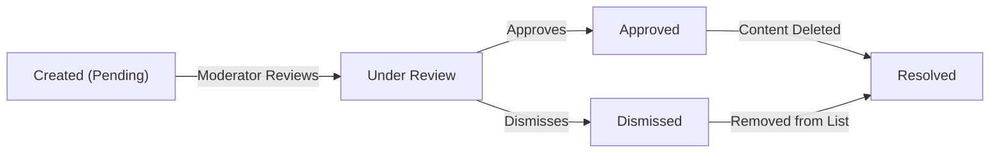
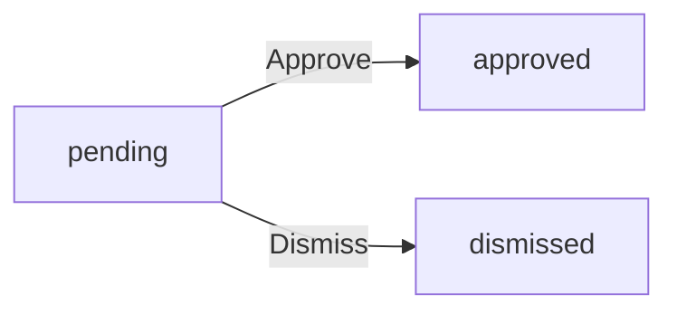
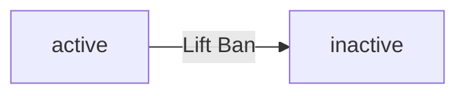
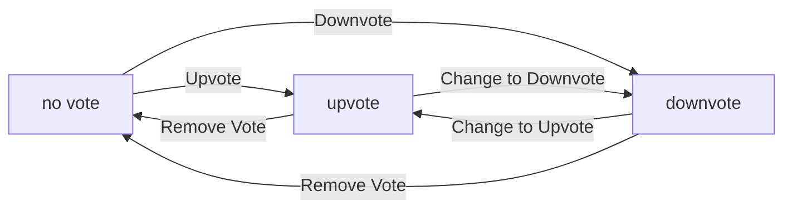
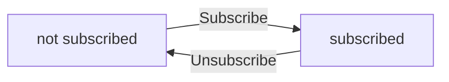
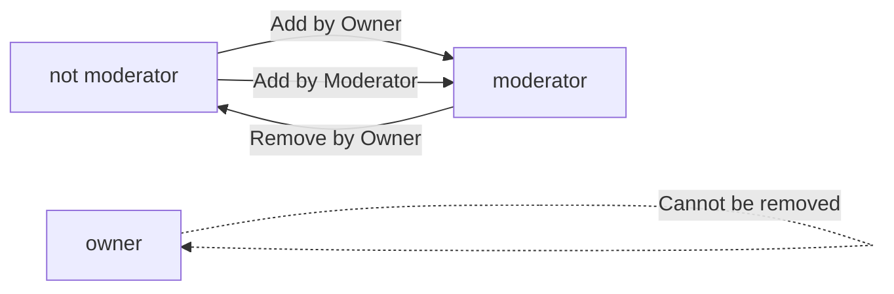

**redditClone — Business concepts, relationships, and states from user perspective**

Business concepts, relationships, and states from user perspective

# Domain Concepts

Describe what each concept means to users and why it exists.

## User Concept

A User represents an individual person who interacts with the platform. Users create accounts by signing up with email, password, and a unique username. Each user maintains a profile containing their display name, bio text, and avatar image. Users can view their own profile as well as profiles of other users on the platform. Every user accumulates a karma score that reflects community engagement through votes on their content. Users can log in with their email and password to access their account. Users have the ability to change their password for security purposes. When a user deletes their account, all their posts and comments are also permanently removed. Users interact with communities by subscribing, posting, commenting, and voting. Users can report inappropriate content and moderate communities if granted permission.

### User Account Creation

WHEN a user signs up for the platform, THE system SHALL require an email address.

WHEN a user signs up for the platform, THE system SHALL require a password.

WHEN a user signs up for the platform, THE system SHALL require a unique username.

IF the username is already taken by another user, THE system SHALL reject the account creation request.

THE system SHALL assign a new karma score of zero to every newly created user account.

WHEN a user account is created, THE system SHALL associate the account with the email address provided during signup.

THE system SHALL allow users to create accounts without requiring email verification.

### User Profile Management

THE system SHALL maintain a display name for each user account.

THE system SHALL maintain a bio text field for each user account.

THE system SHALL maintain an avatar image for each user account.

WHEN a user views their own profile, THE system SHALL display their display name, bio text, and avatar image.

WHEN a user views another user's profile, THE system SHALL display that user's display name, bio text, and avatar image.

WHEN a user edits their profile, THE system SHALL allow updates to their display name.

WHEN a user edits their profile, THE system SHALL allow updates to their bio text.

WHEN a user edits their profile, THE system SHALL allow updates to their avatar image.

THE system SHALL allow any user to view any other user's profile without authentication.

THE system SHALL display the user's total karma score on their profile page.

### Karma Score System

THE system SHALL maintain a single karma score for each user account.

WHEN another user upvotes a post created by a user, THE system SHALL increase that user's karma score by one.

WHEN another user downvotes a post created by a user, THE system SHALL decrease that user's karma score by one.

WHEN another user upvotes a comment written by a user, THE system SHALL increase that user's karma score by one.

WHEN another user downvotes a comment written by a user, THE system SHALL decrease that user's karma score by one.

WHEN a user removes their vote from a post, THE system SHALL adjust the post author's karma score accordingly.

WHEN a user removes their vote from a comment, THE system SHALL adjust the comment author's karma score accordingly.

THE system SHALL allow user karma scores to become negative.

THE system SHALL calculate karma score as the sum of all votes on a user's posts and comments.

### Authentication and Password Management

WHEN a user logs in, THE system SHALL require their email address.

WHEN a user logs in, THE system SHALL require their password.

IF the email address does not match any registered account, THE system SHALL reject the login request.

IF the password does not match the registered password, THE system SHALL reject the login request.

WHEN a user changes their password, THE system SHALL require their current password for verification.

WHEN a user changes their password, THE system SHALL require a new password.

WHEN a user successfully changes their password, THE system SHALL update the password for subsequent login attempts.

THE system SHALL allow users to change their password while logged into their account.

### Account Deletion and Content Ownership

WHEN a user deletes their account, THE system SHALL permanently remove the user account.

WHEN a user deletes their account, THE system SHALL permanently delete all posts created by that user.

WHEN a user deletes their account, THE system SHALL permanently delete all comments written by that user.

WHEN a user deletes their account, THE system SHALL remove all votes cast by that user.

WHEN a user deletes their account, THE system SHALL remove all community subscriptions associated with that user.

THE system SHALL associate each post with its creating user as the owner.

THE system SHALL associate each comment with its writing user as the owner.

THE system SHALL prevent account deletion when the user is not logged in.

THE system SHALL require confirmation before permanently deleting a user account.

### User Identity and Interactions

THE system SHALL use the username as the unique identifier for user identity.

THE system SHALL display the username when showing the author of a post.

THE system SHALL display the username when showing the author of a comment.

WHEN a user creates a post, THE system SHALL associate the post with that user's identity.

WHEN a user writes a comment, THE system SHALL associate the comment with that user's identity.

WHEN a user casts a vote, THE system SHALL associate the vote with that user's identity.

WHEN a user subscribes to a community, THE system SHALL associate the subscription with that user's identity.

WHEN a user reports content, THE system SHALL associate the report with that user's identity.

THE system SHALL allow users to interact with communities by subscribing, posting, commenting, and voting.

THE system SHALL allow users to report inappropriate content on the platform.

## Community Concept

A Community represents a group where users share and discuss content around common interests. Any user on the platform can create a new community by providing a unique name, description, and icon image. The user who creates a community automatically becomes its owner with full authority. Communities display a subscriber count showing how many users follow them. Users can browse all available communities in a list view or search for specific ones by name. Users subscribe to communities to follow their content and appear in their home feed. Subscription to a community is required before users can create posts within it. Users can unsubscribe from communities at any time to stop following their content. Communities serve as the primary organizational structure for all posts and discussions. Each community maintains its own set of posts, comments, and moderation team.

### Community Creation

WHEN a user creates a community, THE system SHALL require a unique name.

IF the community name is already taken by another community, THE system SHALL reject the creation request.

THE system SHALL require the community name to be between 3 and 50 characters.

THE system SHALL allow the creator to provide an optional description text for the community.

IF the description is provided, THE system SHALL limit it to 500 characters.

THE system SHALL allow the creator to upload an optional icon image for the community.

WHEN a community is successfully created, THE system SHALL assign the creator as the owner.

THE system SHALL initialize the subscriber count at zero for a newly created community.

IF the community name contains only whitespace or special characters, THE system SHALL reject the creation request.

THE system SHALL make the community immediately visible in the community list after successful creation.

### Community Ownership

THE system SHALL recognize the user who creates a community as its owner.

THE owner SHALL have full authority over the community including adding and removing moderators.

THE owner SHALL be able to delete the community at any time.

IF the owner deletes the community, THE system SHALL remove all posts and comments within that community.

THE system SHALL allow the owner to transfer ownership to another user.

WHEN ownership is transferred, THE system SHALL grant the new owner all previous owner privileges.

THE system SHALL record the original creator in the community history.

THE owner SHALL be able to view all reports submitted for their community.

THE owner SHALL be able to approve or dismiss any report in their community.

IF the owner is banned from the community by a moderator, THE system SHALL prevent the ban from taking effect.

### Community Discovery

THE system SHALL provide a list view showing all communities on the platform.

THE system SHALL display the community name, description, and subscriber count in the list view.

THE system SHALL allow users to search for communities by name.

WHEN a user searches for a community, THE system SHALL return communities with matching names.

THE system SHALL show the subscriber count for each community in search results.

IF a community has no subscribers, THE system SHALL display zero as the subscriber count.

THE system SHALL update the subscriber count whenever a user subscribes or unsubscribes.

THE system SHALL display the community icon if one has been uploaded.

IF no icon is uploaded, THE system SHALL display a default placeholder image.

THE system SHALL allow both logged-in and logged-out users to browse communities.

THE system SHALL sort communities alphabetically by default in the list view.

IF a search returns no results, THE system SHALL display a message indicating no communities were found.

### Subscription and Following

THE system SHALL require users to subscribe to a community before creating posts in it.

IF a user attempts to create a post without being subscribed, THE system SHALL reject the request.

THE system SHALL allow users to subscribe to any community at any time.

WHEN a user subscribes to a community, THE system SHALL increment the subscriber count.

THE system SHALL allow users to unsubscribe from any community at any time.

WHEN a user unsubscribes from a community, THE system SHALL decrement the subscriber count.

THE system SHALL provide a list of all communities a user is subscribed to.

WHEN a user subscribes to a community, THE system SHALL add posts from that community to their home feed.

WHEN a user unsubscribes from a community, THE system SHALL remove posts from that community from their home feed.

THE system SHALL allow users to view content in communities they are not subscribed to.

IF a user is not subscribed to a community, THE system SHALL prevent them from creating posts or comments in that community.

THE system SHALL track the date and time when a user subscribes to a community.

## Post Concept

A Post represents a piece of content that users share within a community. Every post must have a title and belongs to exactly one community. Posts come in three types: text posts with content, link posts with URLs, or image posts with uploaded images. Users can only create posts in communities they are subscribed to. Users can edit their own posts to update the title or content. Users can delete their own posts at any time. When viewing a post, users see the title, full content, author, community, vote score, comment count, and posting time. Posts appear in feeds based on sorting options like hot, new, top, or controversial. Posts display differently in list views showing previews based on their type. Posts accumulate votes from other users which affect both the post score and author karma.

### Post Creation

WHEN a user creates a post, THE system SHALL require the user to be subscribed to the target community.

WHEN a user creates a post, THE system SHALL require a title for the post.

WHEN a user creates a post, THE system SHALL require the user to select one of three post types: text, link, or image.

IF the user is not subscribed to the community, THEN THE system SHALL prevent post creation in that community.

IF the post title is empty or missing, THEN THE system SHALL reject the post creation.

WHEN a user creates a post, THE system SHALL associate the post with the creating user as the author.

WHEN a user creates a post, THE system SHALL associate the post with the target community.

WHEN a user creates a post, THE system SHALL record the creation timestamp.

### Post Types

WHEN a user creates a text post, THE system SHALL require text content in addition to the title.

WHEN a user creates a link post, THE system SHALL require a URL in addition to the title.

WHEN a user creates an image post, THE system SHALL require an uploaded image in addition to the title.

IF the text post content is empty, THEN THE system SHALL reject the post creation.

IF the link post URL is missing or invalid, THEN THE system SHALL reject the post creation.

IF the image post has no image attached, THEN THE system SHALL reject the post creation.

WHEN a user creates a text post, THE system SHALL store the full text content for display.

WHEN a user creates a link post, THE system SHALL store the URL for display and navigation.

WHEN a user creates an image post, THE system SHALL store the image for display.

### Post Modification

WHILE a post exists, THE system SHALL allow the author to edit the post title.

WHILE a post exists, THE system SHALL allow the author to edit the post content.

IF a user attempts to edit a post they did not create, THEN THE system SHALL reject the edit request.

WHEN a user edits a post, THE system SHALL preserve the original creation timestamp.

WHEN a user deletes their own post, THE system SHALL remove the post permanently.

IF a user attempts to delete a post they did not create, THEN THE system SHALL reject the deletion request.

WHEN a post is deleted, THE system SHALL also delete all comments associated with that post.

WHEN a post is deleted, THE system SHALL adjust the author's karma score accordingly.

### Post Display

WHEN viewing a post, THE system SHALL display the post title.

WHEN viewing a post, THE system SHALL display the full post content.

WHEN viewing a post, THE system SHALL display the author's username.

WHEN viewing a post, THE system SHALL display the community name.

WHEN viewing a post, THE system SHALL display the current vote score.

WHEN viewing a post, THE system SHALL display the total comment count.

WHEN viewing a post, THE system SHALL display when the post was created.

WHILE a post exists, THE system SHALL make the post visible to all users (including guests).

WHEN a post is deleted, THE system SHALL make the post invisible to all users.

### Post Feeds and Preview

WHEN a post appears in any feed, THE system SHALL display the post title.

WHEN a post appears in any feed, THE system SHALL display the author's username.

WHEN a post appears in any feed, THE system SHALL display the community name.

WHEN a post appears in any feed, THE system SHALL display the vote score.

WHEN a post appears in any feed, THE system SHALL display the comment count.

WHEN a post appears in any feed, THE system SHALL display the time since posting.

WHEN a text post appears in a feed list, THE system SHALL display the first 200 characters of content.

WHEN an image post appears in a feed list, THE system SHALL display a thumbnail of the image.

WHEN a link post appears in a feed list, THE system SHALL display the domain name of the URL.

WHEN posts appear in feeds, THE system SHALL support sorting by hot, new, top, or controversial.

WHEN posts appear in feeds, THE system SHALL support pagination for large result sets.

## Comment Concept

A Comment represents a user's response or discussion on a post. Users can write comments on any post they can view. Comments support replies, allowing users to respond to other comments. Replies can have their own replies with no depth limit, creating threaded discussions. Users can edit their own comments to update the content. Users can delete their own comments at any time. Each comment displays the author, content, vote score, posting time, and any nested replies. Comments can be sorted by best, new, or controversial to help users find relevant discussions. Comments contribute to the overall discussion around a post. Comments accumulate votes from users which affect both the comment score and author karma.

### Comment Creation

WHEN a user views a post, THE system SHALL allow the user to create a comment on that post.

THE system SHALL require comment content to be between 1 and 1000 characters.

IF the comment content is empty, THEN THE system SHALL reject the comment creation.

IF the comment content exceeds 1000 characters, THEN THE system SHALL reject the comment creation.

WHEN a user creates a comment, THE system SHALL associate the comment with the creating user as the author.

WHEN a user creates a comment, THE system SHALL associate the comment with the target post.

WHEN a user creates a comment, THE system SHALL record the creation timestamp.

IF the user is banned from the community containing the post, THEN THE system SHALL prevent the user from creating comments on that post.

IF the post has been deleted, THEN THE system SHALL prevent comment creation on that post.

### Comment Replies and Nested Discussions

WHEN a user views a comment, THE system SHALL allow the user to reply to that comment.

WHEN a user replies to a comment, THE system SHALL associate the reply with the parent comment.

WHEN a user replies to a comment, THE system SHALL maintain the same content requirements as the original comment.

THE system SHALL support unlimited nesting depth for comment replies.

WHEN a comment has replies, THE system SHALL display those replies as nested under the parent comment.

WHEN viewing a post with comments, THE system SHALL display comments in a threaded structure showing the hierarchy of replies.

THE system SHALL preserve the reply structure when a parent comment is edited.

IF a parent comment is deleted, THEN THE system SHALL handle the orphaned replies according to the lifecycle policy (defined in Lifecycle and Retention).

### Comment Editing and Deletion

WHEN a user views their own comment, THE system SHALL allow the user to edit the comment content.

WHEN a user edits a comment, THE system SHALL preserve the original creation timestamp.

WHEN a user edits a comment, THE system SHALL update the comment content while maintaining all associated votes and replies.

IF the edited comment content is empty, THEN THE system SHALL reject the edit.

IF the edited comment content exceeds 1000 characters, THEN THE system SHALL reject the edit.

WHEN a user views their own comment, THE system SHALL allow the user to delete the comment.

WHEN a user deletes a comment, THE system SHALL handle the comment's replies according to the lifecycle policy (defined in Lifecycle and Retention).

WHEN a user deletes a comment, THE system SHALL adjust the author's karma score by removing the comment's vote contribution (defined in Karma).

### Comment Author and Visibility

THE system SHALL display the author's username for each comment.

THE system SHALL display the comment author's avatar (defined in User Concept) alongside the comment.

WHEN a user views a comment, THE system SHALL show the time elapsed since the comment was posted (e.g., "2 hours ago").

WHEN a user clicks on a comment author's username, THE system SHALL navigate to that user's profile page (defined in User Concept).

THE system SHALL make comments visible to all users who can view the associated post.

IF a user is banned from a community, THE system SHALL still allow the banned user to view comments in that community (defined in Ban Concept).

IF a comment has been deleted, THEN THE system SHALL hide the comment content from all users.

### Comment Score and Voting

THE system SHALL calculate a comment's score as the total upvotes minus total downvotes.

THE system SHALL display the current vote score for each comment.

WHEN a user views a comment, THE system SHALL allow the user to upvote the comment.

WHEN a user upvotes a comment, THE system SHALL increase the comment's score by 1.

WHEN a user upvotes a comment, THE system SHALL increase the comment author's karma by 1 (defined in Karma).

WHEN a user views a comment, THE system SHALL allow the user to downvote the comment.

WHEN a user downvotes a comment, THE system SHALL decrease the comment's score by 1.

WHEN a user downvotes a comment, THE system SHALL decrease the comment author's karma by 1 (defined in Karma).

THE system SHALL allow each user to vote only once per comment.

WHEN a user has already voted on a comment, THE system SHALL allow the user to change their vote from upvote to downvote or vice versa.

WHEN a user changes their vote, THE system SHALL adjust the comment score and author karma accordingly.

WHEN a user has voted on a comment, THE system SHALL allow the user to remove their vote.

WHEN a user removes their vote, THE system SHALL adjust the comment score and author karma accordingly.

THE system SHALL allow comment scores to be negative.

### Comment Sorting

WHEN a user views comments on a post, THE system SHALL allow the user to sort comments by best.

WHEN sorting comments by best, THE system SHALL display comments with the highest vote score first.

WHEN a user views comments on a post, THE system SHALL allow the user to sort comments by new.

WHEN sorting comments by new, THE system SHALL display the most recently created comments first.

WHEN a user views comments on a post, THE system SHALL allow the user to sort comments by controversial.

WHEN sorting comments by controversial, THE system SHALL display comments with many votes but scores close to zero first.

THE system SHALL maintain the threaded structure of replies regardless of the selected sort order.

## Vote Concept

A Vote represents a user's opinion on a post or comment. Users can upvote content they find valuable, which adds one to the score. Users can downvote content they find unhelpful, which subtracts one from the score. Each user can only cast one vote per post or comment. Users can change their vote from upvote to downvote or vice versa. Users can remove their vote entirely, which adjusts the score accordingly. The vote score equals total upvotes minus total downvotes for any content. Votes affect both the content's score and the author's karma. When someone upvotes a user's post or comment, their karma increases by one. When someone downvotes a user's content, their karma decreases by one. Karma can become negative if a user receives more downvotes than upvotes.

### Vote Mechanics and Scoring

**Upvote Mechanism**

WHEN a user upvotes a post or comment, THE system SHALL:
1. Add 1 to the content's vote score
2. Record the user's vote as +1
3. Increase the content author's karma by 1
4. Prevent the user from upvoting the same content again

IF a user has already upvoted, THE system SHALL prevent them from upvoting again.
IF a user has already downvoted, THE system SHALL change their vote to upvote.

**Downvote Mechanism**

WHEN a user downvotes a post or comment, THE system SHALL:
1. Subtract 1 from the content's vote score
2. Record the user's vote as -1
3. Decrease the content author's karma by 1
4. Prevent the user from downvoting the same content again

IF a user has already downvoted, THE system SHALL prevent them from downvoting again.
IF a user has already upvoted, THE system SHALL change their vote to downvote.

**Vote Score Calculation**

WHEN calculating a post or comment's vote score, THE system SHALL:
1. Count all upvotes (+1 each)
2. Count all downvotes (-1 each)
3. Calculate: (total upvotes) - (total downvotes)
4. Display this calculated score to users

**Vote Constraints**

IF a user attempts to vote multiple times on the same content, THE system SHALL only allow one active vote.
IF a user has no existing vote, THE system SHALL accept their first vote.
IF a user already has an active vote, THE system SHALL require them to remove it first or change it.

**Vote Modification**

WHEN a user changes their vote, THE system SHALL:
1. Remove their previous vote's effect from the score
2. Apply their new vote's effect to the score
3. Update the content author's karma accordingly

**Vote Removal**

WHEN a user removes their vote, THE system SHALL:
1. Subtract their previous vote's contribution from the score
2. Remove the user's vote record
3. Update the content author's karma accordingly

**Karma Impact**

WHEN a vote is cast, removed, or modified, THE system SHALL:
1. Adjust the content author's karma by the vote value (+1 for upvote, -1 for downvote)
2. Allow karma to go negative if downvotes exceed upvotes
3. Display the current karma score on user profiles

**Vote Score Display**

IF a post or comment has received votes, THE system SHALL display the net score (upvotes minus downvotes).

**Negative Karma**

IF a user's content receives more downvotes than upvotes, THE system SHALL:
1. Allow the karma score to become negative
2. Display the negative karma score publicly
3. Continue tracking all future vote adjustments

**Vote Adjustment Propagation**

WHEN a vote is added, changed, or removed, THE system SHALL:
1. Immediately update the content's vote score
2. Immediately update the author's karma
3. Reflect changes across all relevant user views

### Vote Lifecycle and Relationships

**Vote-Content Relationship**

WHEN a vote is cast, THE system SHALL:
1. Associate the vote with exactly one piece of content (post or comment)
2. Link the vote to the voting user
3. Record the vote value (+1 or -1)
4. Prevent the same user from having multiple active votes on the same content

**Vote Timing and Persistence**

WHEN a vote is created, THE system SHALL:
1. Timestamp when the vote was first cast
2. Timestamp when the vote was last modified
3. Preserve vote history for audit purposes
4. Retain votes even if the content is later deleted

**Vote Visibility**

WHEN displaying content, THE system SHALL:
1. Show the net vote score (upvotes minus downvotes)
2. Hide individual user identities behind votes
3. Hide the direction of individual user votes (upvote vs downvote) from other users
4. Show the total score to all viewers

**Vote Impact on Author**

WHEN a vote affects a user's content, THE system SHALL:
1. Adjust the content author's karma by +1 for each upvote received
2. Adjust the content author's karma by -1 for each downvote received
3. Accumulate all karma adjustments across all of the author's content
4. Allow the cumulative karma to become negative

**Vote Cancellation**

WHEN a user removes their vote, THE system SHALL:
1. Reverse the score impact of their previous vote
2. Reverse the karma impact on the content author
3. Allow the user to cast a new vote if desired
4. Treat the removal as a neutral (0) vote state

**Vote Conflict Resolution**

IF a user attempts to cast a second vote on the same content, THE system SHALL:
1. Detect the existing vote
2. Replace the old vote with the new one
3. Adjust the score and karma by the difference
4. Update all affected displays immediately

## Subscription Concept

A Subscription represents a user's decision to follow a community. Users subscribe to communities they want to see content from in their home feed. Subscription is required before users can create posts in a community. Users can view a list of all communities they are currently subscribed to. Users can unsubscribe from communities at any time to stop following them. When users unsubscribe, posts from that community no longer appear in their home feed. Subscriptions are tracked with the date when the user subscribed. The home feed only shows posts from communities the user is subscribed to. Subscriptions enable personalized content delivery based on user interests. Users can manage their subscriptions to control what content they see.

### Community Subscription and Posting Requirement

THE system SHALL allow users to subscribe to any community on the platform.

THE system SHALL allow users to unsubscribe from any community they are currently subscribed to.

WHEN a user subscribes to a community, THE system SHALL record the subscription with the current timestamp.

WHEN a user attempts to create a post in a community, THE system SHALL verify the user is subscribed to that community.

IF a user is not subscribed to a community, THEN THE system SHALL prevent them from creating posts in that community.

WHEN a user unsubscribes from a community, THE system SHALL immediately remove posts from that community from the user's home feed.

THE system SHALL allow users to subscribe to the same community multiple times without creating duplicate subscriptions.

THE system SHALL allow users to view which communities they are subscribed to at any time.

### Home Feed Filtering and Personalized Content

THE system SHALL provide a home feed that displays posts from communities the user is subscribed to.

WHEN generating the home feed, THE system SHALL filter posts to include only those from subscribed communities.

WHEN a user subscribes to a new community, THE system SHALL begin including posts from that community in the home feed.

WHEN a user unsubscribes from a community, THE system SHALL exclude posts from that community from the home feed.

THE home feed SHALL be available only to logged-in users who have at least one community subscription.

THE system SHALL deliver personalized content to users based on their community subscriptions.

WHEN a user's subscriptions change, THE system SHALL update their home feed content accordingly.

THE system SHALL allow users to customize their feed by managing their community subscriptions.

### Subscription List and Tracking

THE system SHALL provide users with a list of all communities they are currently subscribed to.

THE system SHALL display the subscription date for each community in the user's subscription list.

WHEN displaying the subscription list, THE system SHALL show the community name and description for each subscription.

THE system SHALL track when users subscribe to communities for historical reference.

WHEN a user views their subscription list, THE system SHALL display only active subscriptions.

THE system SHALL update the subscriber count for a community when users subscribe or unsubscribe.

THE system SHALL allow users to see their total number of community subscriptions at a glance.

## Report Concept

A Report represents a user's flag of potentially problematic content. Users can report any post or comment they find inappropriate. When reporting, users must provide a reason explaining why they are reporting the content. Reports are reviewed by moderators of the relevant community. Each report displays the reported content, who reported it, and the reason provided. Moderators can approve a report, which deletes the reported content. Moderators can dismiss a report, which keeps the content visible. Dismissed reports are removed from the moderator's report list. Reports help maintain community standards and quality. Reports are tracked with the time they were created.

### What is a Report

**Definition**: A Report is a user-submitted flag indicating that specific content (post or comment) may violate community standards.

**Purpose**: Reports enable community moderation by allowing users to alert moderators to potentially problematic content.

**Business Context**:

- Reports are the primary mechanism for community self-governance
- They connect regular users with community moderation
- Reports require human review by authorized moderators
- A single report can lead to content removal if approved

**Key Characteristics**:

- **Initiation**: Any user can submit a report against any public post or comment
- **Mandatory Information**: A reason for the report must be provided
- **Scope**: Reports apply to posts and comments within communities
- **Visibility**: Only moderators can view and act on reports
- **Outcome**: Reports result in either content removal (approval) or no action (dismissal)

**Relationships**:

- **From User**: The user who submits the report (reporter)
- **About Post/Comment**: The content being reported
- **To Community**: The community context where moderation occurs
- **By Moderator**: The authorized reviewer of the report

**State Flow**:

1. **Created**: When a user submits a report with a reason
2. **Under Review**: When the report is visible to moderators
3. **Resolved**: When a moderator approves (deletes content) or dismisses (keeps content)

**Business Rules**:

- Users can report content they believe violates community guidelines
- A reason must be provided to give moderators context
- Only community moderators can view and act on reports
- Each report is tied to a specific piece of content
- Reports are tracked with creation timestamps

**Integration with Other Concepts**:

- **User**: Can submit reports, can be a reporter
- **Post/Comment**: Can be the subject of a report
- **Community**: Provides the context for moderation
- **Moderator**: Reviews and acts on reports
- **Ban**: A separate moderation action, distinct from reporting

**Examples of Valid Reasons**:

- Content violates community guidelines
- Content is spam or promotional
- Content is inappropriate or harmful
- Content is off-topic or low quality

**What Reports Are Not**:

- Not a substitute for direct content deletion by moderators
- Not a voting mechanism (distinct from upvotes/downvotes)
- Not publicly visible to all users
- Not a permanent record (dismissed reports are removed from active lists)

### Report Entity Structure

**Definition**: The Report entity tracks user-submitted flags about potentially problematic content.

**Core Attributes**:

- **Reason**: Free text explanation for the report (required)
- **Status**: Current state of the report (pending, approved, dismissed)
- **Created At**: Timestamp of when the report was submitted
- **Reporter**: Reference to the user who submitted the report
- **Subject**: Reference to the post or comment being reported
- **Community**: The community context for the reported content

**Status Values**:

| Status | Meaning | Trigger |
|---------|---------|---------|
| Pending | Awaiting moderator review | Initial state when created |
| Approved | Report accepted, content removed | Moderator action |
| Dismissed | Report rejected, content stays | Moderator action |

**Cardinality**:

- One report relates to exactly one piece of content (post or comment)
- One report is submitted by exactly one user
- One report exists within one community context
- Multiple reports can reference the same content
- One report has exactly one status at any time

**Lifecycle**:

1. **Creation**: User submits report with reason
2. **Review**: Moderator reviews the report
3. **Resolution**: Moderator approves (deletes content) or dismisses (keeps content)
4. **Cleanup**: Dismissed reports are removed from active moderation queues

**Visibility Rules**:

- **Reporters**: Can only see their own submitted reports
- **Moderators**: Can see all reports for communities they moderate
- **Public**: Cannot view reports (reports are internal to moderation)

**Data Retention**:

- Active reports remain visible to moderators until resolved
- Dismissed reports are removed from the active report list
- Report history may be retained for audit purposes
- No specific retention period is defined in the business rules

**Relationships to Other Entities**:

| From | Relationship | To |
|------|--------------|-----|
| User | submitts | Report |
| Report | is about | Post or Comment |
| Report | exists in | Community |
| Moderator | reviews | Report |
| Report | triggers | Content Deletion (if approved) |

**Constraints**:

- A report must have a valid reason text
- A report must reference existing content (post or comment)
- A report status can only transition from pending to approved or dismissed
- Only pending reports can be acted upon by moderators

### Report State Machine

**Definition**: Reports flow through three distinct states from creation to resolution.

**State Machine**:

**State Transitions**:

1. **Created → Pending**: When a user submits a report with a reason
   - Trigger: User clicks "Report" and provides a reason
   - System validates the content exists
   - Report enters pending state for moderator review

2. **Pending → Approved**: When a moderator approves the report
   - Trigger: Moderator reviews and approves
   - Effect: Reported content is deleted
   - Report moves to resolved state

3. **Pending → Dismissed**: When a moderator dismisses the report
   - Trigger: Moderator reviews and dismisses
   - Effect: Content remains visible
   - Report is removed from active moderation queues

**State Invariants**:

- A report starts in "pending" state upon creation
- Only moderators can change a report's state
- Once resolved (approved or dismissed), a report cannot be reopened
- Dismissed reports are removed from active views but may be archived

**Guard Conditions**:

- **Cannot approve**: If the reported content no longer exists
- **Cannot dismiss**: If the report was already acted upon
- **Cannot modify**: A submitted report's reason cannot be edited
- **Cannot unsubmit**: Users cannot retract a report once submitted

**Error Scenarios**:

- If a user tries to report non-existent content, the system shall reject the request
- If a moderator without proper access tries to act on a report, the system shall prevent the action
- If the same content is reported multiple times, each report is tracked separately

**Audit Trail**:

- All state changes are timestamped
- The identity of the moderator taking action is recorded
- The original reporter cannot see other users' reports
- The reason text is preserved for audit purposes

### Reporting Workflow

**Definition**: Reporting is the business process of flagging content for moderator review.

**Initiation Flow**:

1. User views a post or comment
2. User selects "Report" action
3. User provides a reason for the report
4. System validates the content and user permissions
5. System creates the report in pending state
6. Report is visible to community moderators

**Key Business Rules**:

- **Mandatory Reason**: Users MUST provide a text reason when reporting
- **One Vote Analogy**: Unlike voting, there is no limit to how many times content can be reported
- **Anonymity**: Reporters are visible to moderators but not to the general public
- **Scope**: Any user can report any publicly visible content
- **Irrevocable**: Once submitted, a report cannot be edited or retracted

**Moderator Review Process**:

1. Moderator views list of pending reports for their community
2. Moderator reviews the reported content
3. Moderator reviews the reporter's reason
4. Moderator decides to approve (delete content) or dismiss (keep content)
5. System updates report status accordingly

**Error Handling**:

- **Content Deleted First**: If the content is deleted before review, the report is automatically resolved
- **Duplicate Reports**: Multiple reports on the same content are all tracked separately
- **Invalid Content**: If the reported content no longer exists, the report cannot be submitted
- **Unauthorized Access**: Non-moderators cannot view the report queue

**Relationship to Other Features**:

| Related Feature | Relationship to Reports |
|-----------------|--------------------------|
| Voting | Independent mechanisms (reports are not votes) |
| Banning | Separate moderation action, but both visible to moderators |
| Content Deletion | Can result from approved reports OR direct moderator action |
| User Blocking | Independent mechanism for user-level restrictions |

**Compliance Notes**:

- Reports must include a human-readable reason
- Moderators need clear audit trails of their decisions
- The system must prevent unauthorized access to report data
- All report actions are attributable to specific users

## Moderator Concept

A Moderator represents a user with special permissions to manage a community. The user who creates a community becomes the owner with the highest authority. Owners can add other users as moderators to help manage the community. Owners can remove moderators from the community at any time. Moderators can add other moderators but cannot remove each other. Only the owner can remove moderators from the community. Moderators can delete any post in their community regardless of who created it. Moderators can delete any comment in their community regardless of who wrote it. Moderators can ban users from their community to restrict participation. Moderators can view and manage all reports for their community. Moderators can view the list of banned users and unban them.

### Moderator Roles

THE system SHALL define two moderator roles: owner and mod.

THE owner role SHALL be assigned automatically to the user who creates a community.

THE mod role SHALL be assigned by an existing moderator with sufficient authority.

THE system SHALL allow a user to hold moderator roles in multiple communities simultaneously.

THE system SHALL maintain a single role per user per community.

A community owner SHALL have the highest authority in their community.

A community mod SHALL have limited authority as defined by the role hierarchy.

### Community Owner Authority

THE community owner SHALL have the ability to add new moderators to the community.

THE community owner SHALL have the ability to remove any moderator from the community.

THE community owner SHALL retain moderator status even if removed from all other roles.

THE community owner SHALL not be removable from the community by any other user.

THE community owner SHALL have all moderator permissions plus role management authority.

IF a community owner deletes their account, THE system SHALL transfer ownership to another moderator or close the community.

### Moderator Permissions

THE system SHALL grant moderators the permission to delete any post in their community.

THE system SHALL grant moderators the permission to delete any comment in their community.

THE system SHALL grant moderators the permission to ban users from their community.

THE system SHALL grant moderators the permission to unban previously banned users.

THE system SHALL grant moderators the permission to view all reports for their community.

THE system SHALL grant moderators the permission to approve or dismiss reports.

THE system SHALL grant moderators the permission to view the list of banned users.

A moderator SHALL NOT have the permission to remove the community owner.

A moderator SHALL NOT have the permission to remove other moderators.

### Moderator Management

WHEN a community owner adds a user as moderator, THE system SHALL assign the mod role to that user.

WHEN a community owner removes a moderator, THE system SHALL revoke the mod role from that user.

WHEN a moderator adds another user as moderator, THE system SHALL assign the mod role to that user.

IF a user is already a moderator, THE system SHALL prevent duplicate moderator assignments.

THE system SHALL allow only the owner to remove moderators from the community.

THE system SHALL allow moderators to add other moderators without owner approval.

WHEN a user is removed as moderator, THE system SHALL retain their posts and comments in the community.

THE system SHALL notify the affected user when their moderator role is added or removed.

### Content Deletion Authority

WHEN a moderator deletes a post, THE system SHALL remove the post from the community.

WHEN a moderator deletes a post, THE system SHALL remove all associated comments from the community.

WHEN a moderator deletes a comment, THE system SHALL remove the comment and all nested replies.

A moderator SHALL be able to delete posts created by any user in their community.

A moderator SHALL be able to delete comments written by any user in their community.

THE system SHALL allow moderators to delete content without requiring a reason.

WHEN content is deleted by a moderator, THE system SHALL prevent restoration by any user.

THE system SHALL update karma scores when moderator-deleted content is removed.

### User Banning Authority

WHEN a moderator bans a user, THE system SHALL prevent that user from creating posts in the community.

WHEN a moderator bans a user, THE system SHALL prevent that user from creating comments in the community.

WHEN a moderator bans a user, THE system SHALL allow that user to view content in the community.

WHEN a moderator unbans a user, THE system SHALL restore that user's ability to post and comment.

THE system SHALL allow moderators to ban users without requiring a reason.

THE system SHALL allow moderators to provide an optional reason when banning a user.

THE system SHALL maintain a record of all banned users for the community.

A banned user SHALL remain banned until explicitly unbanned by a moderator.

THE system SHALL prevent banned users from subscribing to the community.

### Report Management Authority

WHEN a moderator views reports, THE system SHALL display all pending reports for their community.

WHEN a moderator approves a report, THE system SHALL delete the reported content.

WHEN a moderator dismisses a report, THE system SHALL keep the reported content.

WHEN a moderator dismisses a report, THE system SHALL remove it from the report list.

THE system SHALL display the reported content, reporter identity, and reason for each report.

THE system SHALL allow moderators to view reports regardless of their own voting behavior.

A moderator SHALL be able to approve or dismiss any report in their community.

THE system SHALL update the report status immediately upon moderator action.

### Role Hierarchy Rules

THE owner role SHALL have higher authority than the mod role.

THE owner role SHALL be able to perform all actions available to the mod role.

THE mod role SHALL NOT be able to remove users with the owner role.

THE mod role SHALL NOT be able to remove users with the mod role.

THE owner role SHALL be the only role that can remove moderators.

IF a user holds multiple moderator roles, THE system SHALL apply the highest authority role.

THE system SHALL prevent role assignment conflicts within a community.

THE system SHALL enforce role-based access control for all moderation actions.

### Community Moderation

THE system SHALL allow communities to operate with at least one moderator (the owner).

THE system SHALL allow communities to function without additional moderators beyond the owner.

THE system SHALL enable moderators to collaborate on community management.

THE system SHALL provide transparency in moderation actions through report management.

THE system SHALL allow moderators to enforce community standards through content deletion.

THE system SHALL allow moderators to maintain community quality through user banning.

WHEN a community has multiple moderators, THE system SHALL allow any moderator to take independent action.

THE system SHALL prevent unauthorized users from accessing moderation features.

## Ban Concept

A Ban represents a restriction placed on a user's ability to participate in a community. Moderators can ban users who violate community rules or guidelines. Banned users cannot create posts in the community where they are banned. Banned users cannot write comments in the community where they are banned. Banned users can still view content in the community. Moderators can unban users to restore their participation rights. Bans are tracked with the date they were applied. Bans can include an optional reason explaining why the user was banned. Bans are tracked with the date they were lifted when unbanned. Bans help moderators enforce community standards and maintain quality.

### User Banning Process

WHEN a moderator identifies a user violating community rules, THE system SHALL allow the moderator to ban that user from the community.

WHEN a community owner identifies a user violating community rules, THE system SHALL allow the owner to ban that user from the community.

WHEN a moderator bans a user, THE system SHALL record the ban with the date it was applied.

WHEN a community owner bans a user, THE system SHALL record the ban with the date it was applied.

IF a user is not a member of the community, THEN THE system SHALL prevent moderators from banning that user from the community.

IF a user is the community owner, THEN THE system SHALL prevent moderators from banning that user from the community.

WHEN a moderator bans a user, THE system SHALL notify the affected user that they have been banned from the community.

WHEN a user is banned from a community, THE system SHALL display the ban status on the user's profile for that community.

### Banned User Restrictions

WHILE a user is banned from a community, THE system SHALL prevent that user from creating posts in the community.

WHILE a user is banned from a community, THE system SHALL prevent that user from writing comments on posts in the community.

WHILE a user is banned from a community, THE system SHALL prevent that user from replying to comments in the community.

WHILE a user is banned from a community, THE system SHALL allow that user to view posts in the community.

WHILE a user is banned from a community, THE system SHALL allow that user to view comments in the community.

WHILE a user is banned from a community, THE system SHALL allow that user to view the community page and its description.

WHILE a user is banned from a community, THE system SHALL allow that user to upvote or downvote posts in the community.

WHILE a user is banned from a community, THE system SHALL allow that user to upvote or downvote comments in the community.

WHILE a user is banned from a community, THE system SHALL prevent that user from subscribing to the community.

WHILE a user is banned from a community, THE system SHALL prevent that user from unsubscribing from the community.

### Ban Management and Tracking

WHEN a moderator decides to restore a user's participation rights, THE system SHALL allow the moderator to unban that user from the community.

WHEN a community owner decides to restore a user's participation rights, THE system SHALL allow the owner to unban that user from the community.

WHEN a moderator unbans a user, THE system SHALL record the date the ban was lifted.

WHEN a user is unbanned from a community, THE system SHALL immediately restore their ability to create posts in the community.

WHEN a user is unbanned from a community, THE system SHALL immediately restore their ability to write comments in the community.

WHEN a user is unbanned from a community, THE system SHALL notify the affected user that they have been unbanned.

IF a user is not currently banned from the community, THEN THE system SHALL prevent moderators from unbanning that user.

WHEN a moderator unbans a user, THE system SHALL remove the ban from the list of active bans for that community.

### Ban Reason and Tracking

WHEN a moderator bans a user, THE system SHALL allow the moderator to provide an optional reason for the ban.

WHEN a community owner bans a user, THE system SHALL allow the owner to provide an optional reason for the ban.

WHEN a ban includes a reason, THE system SHALL display the reason to the banned user.

WHEN a ban includes a reason, THE system SHALL display the reason to other moderators in the community.

WHEN a ban does not include a reason, THE system SHALL display a generic message to the banned user.

WHEN moderators view the list of banned users, THE system SHALL display the ban reason for each banned user.

WHEN a ban reason is provided, THE system SHALL store it with the ban record.

WHEN a ban reason is not provided, THE system SHALL store the ban record without a reason.

WHEN a moderator views a banned user's profile, THE system SHALL display when the ban was applied.

WHEN a moderator views a banned user's profile, THE system SHALL display when the ban was lifted (if applicable).

## Block Concept

A Block represents a user's decision to prevent interactions with another user. Users can block other users to avoid unwanted interactions. When a user blocks another user, the blocked user cannot interact with them. Blocks are specific to individual users, not entire communities. Blocks help users control their experience on the platform. Blocks are tracked with the timestamp when they were created. Blocks allow users to filter out content from specific users. Blocks provide users with control over who can interact with them. Blocks are a user-level feature independent of community moderation.

### Block Creation and Tracking

WHEN a user blocks another user, THE system SHALL prevent the blocked user from interacting with the blocking user.

THE system SHALL allow any logged-in user to block any other user on the platform.

THE system SHALL track the timestamp when a block is created.

IF a user attempts to block themselves, THE system SHALL reject the request.

IF a user is already blocked by another user, THE system SHALL allow the blocking user to unblock them.

THE system SHALL record the blocked relationship between two users.

WHEN a user blocks another user, THE system SHALL immediately apply the block restrictions.

IF a user blocks another user who has already blocked them, THE system SHALL maintain both block relationships independently.

THE system SHALL allow a user to view a list of users they have blocked.

THE system SHALL allow a user to view a list of users who have blocked them.

### Blocked User Restrictions

WHEN a user blocks another user, THE system SHALL prevent the blocked user from posting comments on the blocking user's posts.

WHEN a user blocks another user, THE system SHALL prevent the blocked user from replying to the blocking user's comments.

WHEN a user blocks another user, THE system SHALL prevent the blocked user from voting on the blocking user's posts.

WHEN a user blocks another user, THE system SHALL prevent the blocked user from voting on the blocking user's comments.

WHEN a user blocks another user, THE system SHALL filter out the blocked user's posts from the blocking user's feeds.

WHEN a user blocks another user, THE system SHALL filter out the blocked user's comments from the blocking user's view.

THE system SHALL allow the blocked user to continue viewing the blocking user's public content.

THE system SHALL allow the blocked user to continue viewing communities they are subscribed to.

IF a blocked user attempts to interact with the blocking user, THE system SHALL reject the interaction.

THE system SHALL not notify the blocked user when they are blocked by another user.

### Block Management and User Control

THE system SHALL allow a user to unblock any user they have previously blocked.

WHEN a user unblocks another user, THE system SHALL restore the blocked user's ability to interact with them.

WHEN a user unblocks another user, THE system SHALL remove the block relationship.

THE system SHALL allow users to block and unblock users at any time.

THE system SHALL provide users with the ability to manage their blocked users list.

WHEN a user is blocked by another user, THE system SHALL not prevent them from using other platform features.

WHEN a user is blocked by another user, THE system SHALL not prevent them from creating posts in communities.

WHEN a user is blocked by another user, THE system SHALL not prevent them from commenting on posts (except the blocking user's content).

THE system SHALL allow blocked users to continue participating in community discussions.

THE system SHALL allow blocked users to subscribe and unsubscribe from communities.

### User Experience and Platform Control

WHEN a user blocks another user, THE system SHALL improve the blocking user's experience by filtering unwanted interactions.

THE system SHALL provide users with control over who can interact with them.

THE system SHALL allow users to manage their interaction preferences independently of community moderation.

WHEN a user filters content from blocked users, THE system SHALL not affect other users' ability to see that content.

THE system SHALL maintain block relationships as a user-level feature.

THE system SHALL not require moderator approval for user blocking.

THE system SHALL not require admin approval for user blocking.

WHEN a user blocks another user, THE system SHALL apply the block across all communities on the platform.

THE system SHALL ensure blocks are independent of community subscriptions.

THE system SHALL ensure blocks are independent of community moderation actions.

# Domain Relationships

Describe how concepts relate to each other from a business perspective.

## Conceptual Relationships

Describe how concepts relate to each other in business terms.

### User-Community Ownership

THE system SHALL establish that each Community has exactly one owner who is a User.

THE system SHALL record the User who creates a Community as its owner.

THE system SHALL maintain the ownership relationship for the lifetime of the Community.

IF a Community's owner deletes their account, THE system SHALL transfer ownership to another User or delete the Community.

THE system SHALL allow the Community owner to add moderators to the Community.

THE system SHALL allow the Community owner to remove moderators from the Community.

THE system SHALL prevent moderators from removing the Community owner.

THE system SHALL prevent moderators from removing other moderators.

THE system SHALL maintain a record of all moderators and their roles for each Community.

### User-Content Authorship

THE system SHALL associate each Post with exactly one User as its author.

THE system SHALL associate each Comment with exactly one User as its author.

THE system SHALL maintain the authorship relationship for the lifetime of the Post or Comment.

IF a User deletes their account, THE system SHALL delete all Posts and Comments authored by that User.

THE system SHALL allow the author to edit their own Post.

THE system SHALL allow the author to edit their own Comment.

THE system SHALL allow the author to delete their own Post.

THE system SHALL allow the author to delete their own Comment.

THE system SHALL prevent non-authors from editing Posts or Comments.

### Post-Community Association

THE system SHALL associate each Post with exactly one Community.

THE system SHALL require that a Post belongs to a Community where the author is subscribed.

THE system SHALL maintain the Post-Community relationship for the lifetime of the Post.

IF a Community is deleted, THE system SHALL delete all Posts belonging to that Community.

THE system SHALL allow users to view all Posts belonging to a specific Community.

THE system SHALL allow Community moderators to delete any Post belonging to their Community.

THE system SHALL prevent Posts from existing without an associated Community.

### Comment-Post Hierarchy

THE system SHALL associate each Comment with exactly one Post.

THE system SHALL allow a Comment to reply to another Comment, creating a nested structure.

THE system SHALL maintain unlimited depth for Comment reply chains.

THE system SHALL maintain the Comment-Post relationship for the lifetime of the Comment.

IF a Post is deleted, THE system SHALL delete all Comments belonging to that Post.

THE system SHALL allow users to view all Comments belonging to a specific Post.

THE system SHALL allow Community moderators to delete any Comment belonging to a Post in their Community.

### Vote Associations

THE system SHALL associate each Vote with exactly one User as the voter.

THE system SHALL associate each Vote with exactly one target, which is either a Post or a Comment.

THE system SHALL allow each User to cast only one Vote per target.

THE system SHALL allow a User to change their Vote from upvote to downvote or vice versa.

THE system SHALL allow a User to remove their Vote entirely.

THE system SHALL adjust the target's score when a Vote is created, changed, or removed.

THE system SHALL maintain the Vote-User and Vote-Target relationships for the lifetime of the Vote.

### Subscription Relationships

THE system SHALL associate each Subscription with exactly one User and one Community.

THE system SHALL allow a User to subscribe to multiple Communities.

THE system SHALL allow a User to unsubscribe from any Community.

THE system SHALL require a Subscription before a User can create Posts in a Community.

THE system SHALL maintain the Subscription relationship until the User unsubscribes.

THE system SHALL allow users to view a list of all Communities they are subscribed to.

### Report Associations

THE system SHALL associate each Report with exactly one User as the reporter.

THE system SHALL associate each Report with exactly one target, which is either a Post or a Comment.

THE system SHALL maintain the Report-User and Report-Target relationships for the lifetime of the Report.

THE system SHALL allow Community moderators to view all Reports about content in their Community.

THE system SHALL allow moderators to approve or dismiss Reports.

IF a Report is approved, THE system SHALL delete the reported content.

IF a Report is dismissed, THE system SHALL remove it from the active report list.

### Moderator-Community Relationship

THE system SHALL associate each Moderator role with exactly one User and one Community.

THE system SHALL allow the Community owner to assign the moderator role to other Users.

THE system SHALL allow the Community owner to remove the moderator role from Users.

THE system SHALL maintain the Moderator-User and Moderator-Community relationships until explicitly removed.

THE system SHALL grant moderators permission to delete Posts and Comments in their Community.

THE system SHALL grant moderators permission to ban Users from their Community.

### Ban Relationships

THE system SHALL associate each Ban with exactly one User and one Community.

THE system SHALL record the date and time when a User is banned from a Community.

THE system SHALL prevent banned Users from creating Posts in the banned Community.

THE system SHALL prevent banned Users from creating Comments in the banned Community.

THE system SHALL allow banned Users to view content in the banned Community.

THE system SHALL allow moderators to lift a Ban, removing the restriction.

THE system SHALL maintain the Ban-User and Ban-Community relationships until the Ban is lifted.

## Lifecycle and Retention

Describe business rules for concept lifecycle and data retention from a user perspective.

### User Account Lifecycle

WHEN a user creates an account, THE system SHALL:
1. Create a unique user record
2. Initialize the user's karma score to zero
3. Establish the user as the owner of any communities they create

WHEN a user deletes their account, THE system SHALL:
1. Permanently remove the user record
2. Delete all posts created by the user
3. Delete all comments written by the user
4. Remove the user from all community subscriptions
5. Remove the user from all moderator roles
6. Delete all votes cast by the user
7. Archive all reports submitted by the user

IF a user's account is deleted, THE system SHALL prevent the user from logging in again.

IF a user's account is deleted, THE system SHALL remove the user from all ban lists.

IF a user's account is deleted, THE system SHALL remove the user from all block lists.

WHILE a user account exists, THE system SHALL maintain all associated data integrity.

WHEN a user updates their profile information, THE system SHALL preserve the account creation date.

### Content Lifecycle

WHEN a user creates a post, THE system SHALL:
1. Associate the post with the creating user
2. Associate the post with the target community
3. Initialize the post's vote score to zero
4. Record the post creation timestamp

WHEN a user creates a comment, THE system SHALL:
1. Associate the comment with the creating user
2. Associate the comment with the target post
3. Initialize the comment's vote score to zero
4. Record the comment creation timestamp
5. Link the comment to its parent comment if it is a reply

WHEN a post is deleted, THE system SHALL:
1. Remove the post from all feeds
2. Delete all comments on the post
3. Delete all votes on the post
4. Delete all reports on the post
5. Adjust the author's karma score accordingly

WHEN a comment is deleted, THE system SHALL:
1. Remove the comment from the post
2. Delete all replies to the comment
3. Delete all votes on the comment
4. Delete all reports on the comment
5. Adjust the author's karma score accordingly

WHEN a user edits their own post, THE system SHALL preserve the original creation timestamp.

WHEN a user edits their own comment, THE system SHALL preserve the original creation timestamp.

WHEN a moderator deletes content, THE system SHALL retain the deletion record for audit purposes.

### Community Lifecycle

WHEN a user creates a community, THE system SHALL:
1. Create a unique community record
2. Assign the creator as the community owner
3. Initialize the subscriber count to one (the owner)
4. Record the community creation timestamp

WHEN a community is deleted, THE system SHALL:
1. Permanently remove the community record
2. Delete all posts in the community
3. Delete all comments in the community
4. Remove all user subscriptions to the community
5. Remove all moderator roles for the community
6. Remove all bans from the community
7. Remove all blocks from the community
8. Delete all votes in the community
9. Archive all reports in the community

IF a community owner deletes their account, THE system SHALL delete the community they own.

IF a community has zero subscribers, THE system SHALL allow the community to remain active.

WHILE a community exists, THE system SHALL maintain all associated content and relationships.

WHEN a community owner transfers ownership, THE system SHALL preserve the community creation date.

### Data Retention Policy

THE system SHALL retain user account data for the duration of the account's active status.

THE system SHALL retain community data for the duration of the community's active status.

THE system SHALL retain post data until the post is deleted or the author's account is deleted.

THE system SHALL retain comment data until the comment is deleted or the author's account is deleted.

THE system SHALL retain vote data until the vote is removed, the target content is deleted, or the voter's account is deleted.

THE system SHALL retain subscription data until the user unsubscribes, the community is deleted, or the user's account is deleted.

THE system SHALL retain report data until the report is resolved, the target content is deleted, or the reporter's account is deleted.

THE system SHALL retain ban data until the ban is lifted, the user's account is deleted, or the community is deleted.

THE system SHALL retain block data until the block is removed, the user's account is deleted, or the community is deleted.

THE system SHALL retain moderator role data until the role is removed, the user's account is deleted, or the community is deleted.

WHEN content is deleted, THE system SHALL immediately remove it from all user-facing views.

WHEN an account is deleted, THE system SHALL immediately remove all associated data from user-facing views.

### Deletion and Recovery Policy

IF a user deletes their own post, THE system SHALL NOT provide a recovery mechanism.

IF a user deletes their own comment, THE system SHALL NOT provide a recovery mechanism.

IF a moderator deletes content, THE system SHALL NOT provide a recovery mechanism.

IF a user deletes their account, THE system SHALL NOT provide an account recovery mechanism.

IF a community is deleted, THE system SHALL NOT provide a community recovery mechanism.

WHEN content is deleted, THE system SHALL permanently remove it from the database.

WHEN an account is deleted, THE system SHALL permanently remove all associated data from the database.

IF a user attempts to recover deleted content, THE system SHALL reject the request.

IF a user attempts to recover a deleted account, THE system SHALL reject the request.

THE system SHALL NOT provide a trash or recycle bin feature for deleted content.

THE system SHALL NOT provide a trash or recycle bin feature for deleted accounts.

WHEN content is deleted, THE system SHALL update all related karma scores immediately.

WHEN content is deleted, THE system SHALL update all related counts (subscriber count, comment count) immediately.

# Business Categories and State Flows

Business category classifications and state flow definitions.

## Business Category Definitions

Define all business category classifications with their allowed values and descriptions.

### Post Type Classification

THE system SHALL classify all posts into exactly one of three post types: text, link, or image.

THE system SHALL require that every post has a type assigned at creation.

THE system SHALL allow a text post to contain text content as its primary content.

THE system SHALL allow a link post to contain a URL as its primary content.

THE system SHALL allow an image post to contain an uploaded image as its primary content.

THE system SHALL prevent a post from having multiple types simultaneously.

THE system SHALL prevent a post from existing without a type.

WHEN a user creates a text post, THE system SHALL store the text content with the post.

WHEN a user creates a link post, THE system SHALL store the URL with the post.

WHEN a user creates an image post, THE system SHALL store the image with the post.

THE system SHALL display the post type to users when viewing post details.

THE system SHALL use the post type to determine how content is rendered in feeds.

### Report Status Classification

THE system SHALL classify all reports into exactly one of three statuses: pending, approved, or dismissed.

THE system SHALL set a new report's status to pending when it is created.

THE system SHALL allow moderators to change a report's status from pending to approved.

THE system SHALL allow moderators to change a report's status from pending to dismissed.

THE system SHALL prevent a report's status from being changed once it is approved.

THE system SHALL prevent a report's status from being changed once it is dismissed.

WHEN a moderator approves a report, THE system SHALL delete the reported content.

WHEN a moderator dismisses a report, THE system SHALL remove the report from the active report list.

THE system SHALL display the current status of each report to moderators.

THE system SHALL allow moderators to filter reports by status.

### Moderator Role Classification

THE system SHALL classify all community moderators into exactly one of two roles: owner or mod.

THE system SHALL assign the owner role to the user who creates a community.

THE system SHALL allow an owner to assign the mod role to other users.

THE system SHALL prevent a mod from assigning the owner role to any user.

THE system SHALL prevent a mod from changing their own role.

THE system SHALL allow an owner to change a mod's role back to no role (removing moderator status).

THE system SHALL prevent a mod from removing another mod from the community.

THE system SHALL prevent a mod from removing the owner from the community.

THE system SHALL allow an owner to remove themselves from the community only if they transfer ownership or delete the community.

THE system SHALL display the role of each moderator to other moderators and the owner.

### Vote Value Classification

THE system SHALL classify all votes into exactly one of three values: upvote (1), downvote (-1), or no vote (0).

THE system SHALL set a user's vote to no vote (0) by default when they have not voted on content.

THE system SHALL set a user's vote to upvote (1) when they upvote a post or comment.

THE system SHALL set a user's vote to downvote (-1) when they downvote a post or comment.

THE system SHALL allow a user to change their vote from upvote to downvote.

THE system SHALL allow a user to change their vote from downvote to upvote.

THE system SHALL allow a user to remove their vote, setting it to no vote (0).

THE system SHALL prevent a user from having more than one vote on the same post or comment.

THE system SHALL calculate the vote score as the sum of all vote values for each piece of content.

## State Transitions

Define valid state transition paths for stateful concepts.

### Report Status Transitions

WHEN a user reports a post or comment, THE system SHALL create a report with status "pending".

WHEN a moderator approves a report, THE system SHALL:
1. Change the report status to "approved"
2. Delete the reported content (post or comment)

WHEN a moderator dismisses a report, THE system SHALL:
1. Change the report status to "dismissed"
2. Keep the reported content intact
3. Remove the report from the active report list

IF a report status is "approved" or "dismissed", THEN THE system SHALL prevent further status changes.

WHILE a report status is "pending", THE system SHALL allow moderators to view and act on the report.

### Report State Flow

**State Descriptions**:
- **pending**: Report is awaiting moderator review
- **approved**: Report accepted, content deleted
- **dismissed**: Report rejected, content retained

### Ban Status Transitions

WHEN a moderator bans a user from a community, THE system SHALL:
1. Create a ban record with the current timestamp
2. Set the ban status to active

WHEN a moderator lifts a ban, THE system SHALL:
1. Update the ban record with the unban timestamp
2. Change the ban status to inactive

WHILE a user is banned from a community, THE system SHALL:
1. Prevent the user from creating posts in that community
2. Prevent the user from creating comments in that community
3. Allow the user to view content in that community

IF a user attempts to create a post while banned, THE system SHALL reject the request.

IF a user attempts to create a comment while banned, THE system SHALL reject the request.

### Ban State Flow

**State Descriptions**:
- **active**: User is banned and restricted from posting/commenting
- **inactive**: Ban has been lifted, user can post and comment again

### Vote State Transitions

WHEN a user upvotes a post or comment, THE system SHALL:
1. Create or update the vote with value +1
2. Increase the target's score by 1
3. Increase the author's karma by 1

WHEN a user downvotes a post or comment, THE system SHALL:
1. Create or update the vote with value -1
2. Decrease the target's score by 1
3. Decrease the author's karma by 1

WHEN a user changes their vote from upvote to downvote, THE system SHALL:
1. Update the vote value from +1 to -1
2. Decrease the target's score by 2
3. Decrease the author's karma by 2

WHEN a user changes their vote from downvote to upvote, THE system SHALL:
1. Update the vote value from -1 to +1
2. Increase the target's score by 2
3. Increase the author's karma by 2

WHEN a user removes their vote, THE system SHALL:
1. Delete the vote record
2. Adjust the target's score accordingly
3. Adjust the author's karma accordingly

IF a user has already voted on a post or comment, THEN THE system SHALL prevent creating a duplicate vote.

### Vote State Flow

**State Descriptions**:
- **no vote**: User has not voted on this content
- **upvote**: User has voted +1 on this content
- **downvote**: User has voted -1 on this content

### Subscription State Transitions

WHEN a user subscribes to a community, THE system SHALL:
1. Create a subscription record with the current timestamp
2. Increment the community's subscriber count

WHEN a user unsubscribes from a community, THE system SHALL:
1. Delete the subscription record
2. Decrement the community's subscriber count

WHILE a user is subscribed to a community, THE system SHALL:
1. Include the community's posts in the user's home feed
2. Allow the user to create posts in that community

IF a user is not subscribed to a community, THEN THE system SHALL prevent them from creating posts in that community.

WHEN a user deletes their account, THE system SHALL remove all their subscriptions.

### Subscription State Flow

**State Descriptions**:
- **not subscribed**: User is not a member of the community
- **subscribed**: User is a member and can participate in the community

### Moderator Role Transitions

WHEN a community owner adds a moderator, THE system SHALL:
1. Create a moderator record with role "mod"
2. Grant the user moderator permissions in that community

WHEN a community owner removes a moderator, THE system SHALL:
1. Delete the moderator record
2. Remove the user's moderator permissions in that community

WHEN a moderator adds another moderator, THE system SHALL:
1. Create a moderator record with role "mod"
2. Grant the new user moderator permissions

IF a moderator attempts to remove another moderator, THEN THE system SHALL reject the request.

IF a moderator attempts to remove the community owner, THEN THE system SHALL reject the request.

WHEN a community owner deletes the community, THE system SHALL remove all moderator records for that community.

### Moderator Role Flow

**State Descriptions**:
- **not moderator**: User has no moderation privileges
- **moderator**: User can moderate content and manage other moderators (except remove them)
- **owner**: User created the community and has full control (cannot be removed)