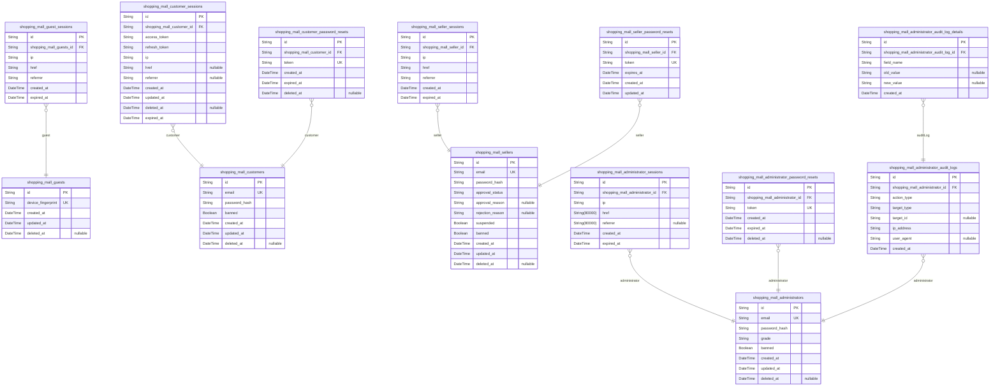
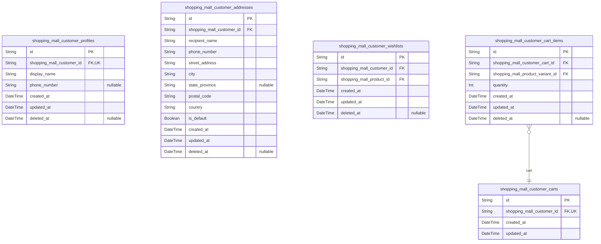
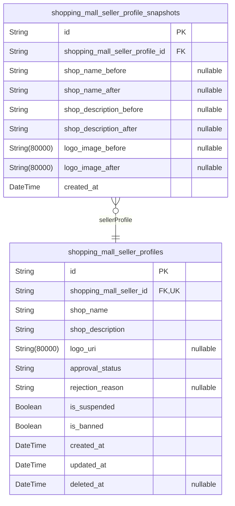
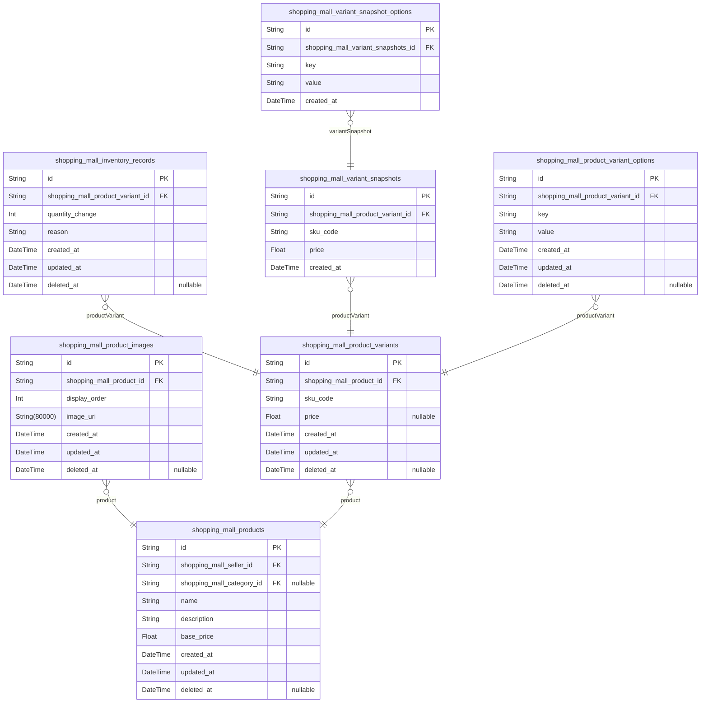
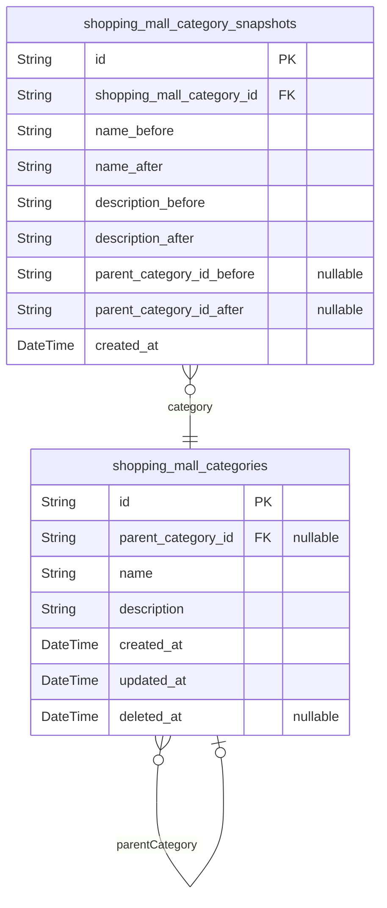
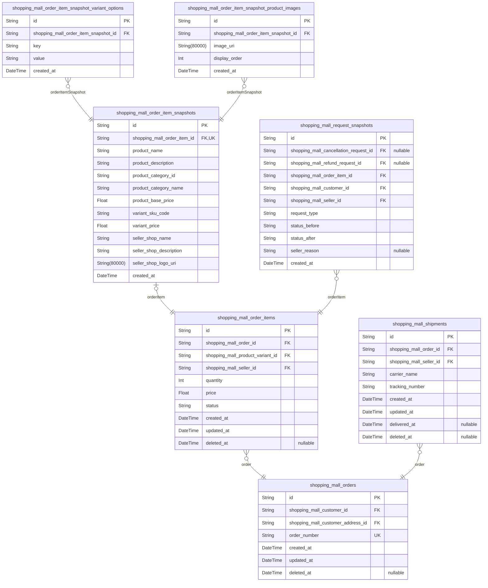
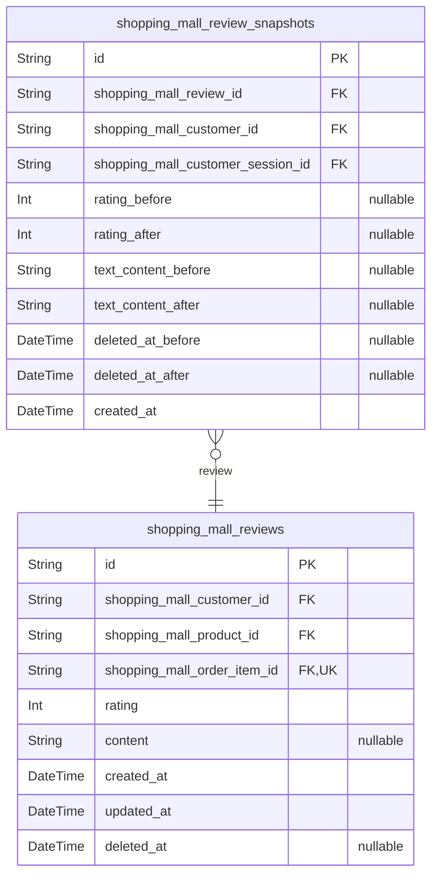
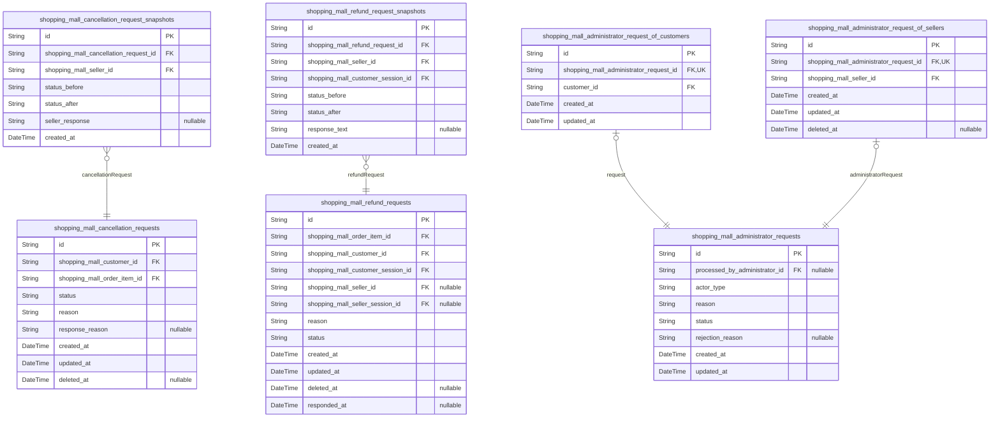
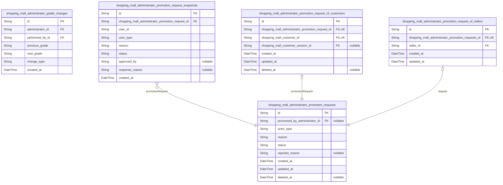
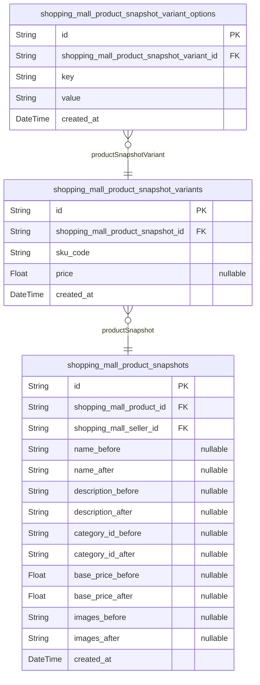

# Prisma Markdown

> Generated by [`prisma-markdown`](https://github.com/samchon/prisma-markdown)

- [authorization](#authorization)
- [customer](#customer)
- [seller](#seller)
- [product](#product)
- [category](#category)
- [order](#order)
- [review](#review)
- [request](#request)
- [administrator](#administrator)
- [snapshot](#snapshot)

## authorization

### `shopping_mall_guests`

Temporary guest accounts identified by device fingerprint for browsing
public content without authentication.

Guest accounts enable unauthenticated users to interact with the platform
while maintaining session state. Each guest is identified by a unique
device fingerprint that persists across browser sessions. Guests can
access registration and login pages, browse products, and view public
content.

Guest accounts are temporary and do not require email or password. When a
guest registers as a customer, seller, or administrator, their guest
session is terminated and replaced with authenticated session.

Properties as follows:

- `id`: Primary Key for guest account records.
- `device_fingerprint`
  > Unique device fingerprint identifying the guest across sessions.
  >
  > This fingerprint is generated from browser/device characteristics and
  > remains consistent for the same device. It serves as the primary
  > identifier for guest users who do not have email or password credentials.
- `created_at`
  > Timestamp when the guest account was first created.
  >
  > Recorded when the guest first accesses the platform and a device
  > fingerprint is generated.
- `updated_at`
  > Timestamp when the guest account was last updated.
  >
  > Updated whenever guest activity occurs or the device fingerprint is
  > refreshed.
- `deleted_at`
  > Timestamp when the guest account was soft-deleted.
  >
  > Nullable field for soft delete support. Guest accounts may be deleted
  > when they register as authenticated users or after extended inactivity.

### `shopping_mall_guest_sessions`

Temporary session tokens for guest access to public platform features.

Guest sessions enable unauthenticated users to browse public content with
temporary device-based identification. Each session tracks the guest's IP
address, current page (href), and referrer source for analytics and
security monitoring. Sessions expire after a defined period and are
append-only audit trails managed through guest authentication flows.

Properties as follows:

- `id`: Primary Key. Unique identifier for each guest session.
- `shopping_mall_guests_id`
  > Foreign key to the guest account that owns this session.
  >
  > Links the session to the temporary guest account identified by device
  > fingerprint. Each guest can have multiple active sessions across
  > different devices or browsers.
- `ip`
  > IP address from which the guest session was created.
  >
  > Used for security monitoring, rate limiting, and detecting suspicious
  > activity patterns across guest sessions.
- `href`
  > Current page URL where the guest session is active.
  >
  > Tracks the guest's navigation path through the platform for analytics and
  > session context.
- `referrer`
  > Referrer URL that directed the guest to the platform.
  >
  > Captures the source of guest traffic for marketing analytics and user
  > journey tracking.
- `created_at`
  > Timestamp when the guest session was created.
  >
  > Records the exact time the guest session started for expiration
  > calculation and session age tracking.
- `expired_at`
  > Timestamp when the guest session expires.
  >
  > Determines session validity period. Sessions are automatically
  > invalidated after this time for security purposes.

### `shopping_mall_customers`

Registered customer accounts with email/password authentication
credentials and account status.

This table stores the core authentication identity for customers on the
shopping mall platform. Each customer account is created during
registration and contains the credentials needed for login (email and
password hash). The account status is managed through the banned flag,
which administrators can set to prevent login access.

Customer accounts follow soft delete semantics - when deleted, the
deleted_at timestamp is set rather than removing the record. This
preserves order history and maintains referential integrity with related
tables like shopping_mall_orders and shopping_mall_reviews.

Child tables reference this table: shopping_mall_customer_sessions for
JWT tokens, shopping_mall_customer_password_resets for account recovery,
and shopping_mall_customer_profiles for display information.

Properties as follows:

- `id`: Primary Key. Unique identifier for each customer account.
- `email`
  > Customer email address used for authentication and communication.
  >
  > This field serves as the username for login and must be unique across all
  > customer accounts. It is also used for sending order confirmations,
  > shipping notifications, and password reset links.
- `password_hash`
  > BCrypt hashed password for customer authentication.
  >
  > The plain-text password is never stored. During login, the provided
  > password is hashed and compared against this stored hash. Passwords must
  > meet security requirements during registration and can be changed by
  > customers or reset via password reset tokens.
- `banned`
  > Account ban status set by administrators.
  >
  > When true, the customer cannot log in to the platform. Banned accounts
  > retain their order history and reviews (shown as 'deleted user').
  > Administrators can unban customers by setting this to false.
- `created_at`: Timestamp when the customer account was created during registration.
- `updated_at`: Timestamp when the customer account was last modified.
- `deleted_at`
  > Timestamp when the customer account was soft deleted.
  >
  > When set, the customer account is considered deleted but the record is
  > preserved for order history and audit purposes. Reviews by deleted
  > customers are shown as 'deleted user'.

### `shopping_mall_customer_sessions`

JWT session tokens for customer authentication with access and refresh
token support.

This table manages authenticated customer sessions on the shopping mall
platform. Each record represents a unique login session with JWT tokens
for secure API access. Session metadata including IP address, href, and
referrer are captured for security auditing and fraud detection.

Sessions are tied to [shopping_mall_customers](#shopping_mall_customers) and include
expiration tracking for automatic session invalidation. Access tokens
provide short-lived authentication while refresh tokens enable token
renewal without re-authentication.

Properties as follows:

- `id`: Primary Key.
- `shopping_mall_customer_id`
  > Foreign key reference to the authenticated customer account.
  >
  > This establishes the relationship between the session and the customer
  > who owns it. Each session belongs to exactly one customer and cannot
  > exist without a valid customer account reference.
- `access_token`
  > JWT access token for short-lived authentication.
  >
  > This token is used for API authentication requests and has a limited
  > validity period (typically 15 minutes). It contains user identity claims
  > and is verified on each protected API call.
- `refresh_token`
  > JWT refresh token for obtaining new access tokens.
  >
  > This token allows customers to renew their access tokens without
  > re-entering credentials. It has a longer validity period than access
  > tokens (typically 7 days) and is stored securely.
- `ip`
  > Client IP address at session creation time.
  >
  > Captured for security auditing, fraud detection, and session anomaly
  > detection. Used to identify suspicious login patterns or unauthorized
  > access attempts.
- `href`
  > URL where the login request originated.
  >
  > The referring page URL that initiated the authentication flow. Used for
  > session context tracking and security analysis.
- `referrer`
  > HTTP referrer header from the login request.
  >
  > Additional context about how the user arrived at the login page. Used for
  > security auditing and user behavior analysis.
- `created_at`
  > Timestamp when the session was created.
  >
  > Records the exact time when the customer authenticated and the session
  > was established. Used for session age calculation and expiration
  > tracking.
- `updated_at`
  > Timestamp when the session was last updated.
  >
  > Tracks modifications to session metadata or token refresh operations.
  > Updated when refresh tokens are rotated or session metadata changes.
- `deleted_at`
  > Timestamp when the session was soft-deleted.
  >
  > Used for session invalidation while preserving audit trail. Set when
  > customer logs out or session is revoked. Null means session is active.
- `expired_at`
  > Timestamp when the session expires.
  >
  > The absolute expiration time for the session. Sessions are automatically
  > invalidated after this time regardless of logout status. Used for
  > automatic session cleanup.

### `shopping_mall_customer_password_resets`

Password reset tokens with expiration for customer account recovery.

This table stores temporary tokens generated when customers request
password resets. Each token is unique, time-limited, and linked to a
specific customer account. Tokens are marked as deleted after use to
prevent reuse.

Password reset tokens are generated when a customer requests to reset
their password via the forgot password flow. The token is sent to the
customer's registered email address and can be used once within the
expiration window to set a new password.

Properties as follows:

- `id`: Primary Key. Unique identifier for each password reset token record.
- `shopping_mall_customer_id`
  > Foreign key reference to the customer account requesting the password
  > reset.
  >
  > This links the password reset token to the specific {@link
  > shopping_mall_customers} account that needs password recovery. Only the
  > customer with the matching account can use this token to reset their
  > password.
- `token`
  > Unique password reset token string sent to customer email.
  >
  > This token is cryptographically generated and sent to the customer's
  > registered email address. It must be provided when the customer submits a
  > new password to verify they have access to the email account. Each token
  > is single-use and becomes invalid after use or expiration.
- `created_at`
  > Timestamp when the password reset token was generated.
  >
  > Records the exact time when the customer requested a password reset and
  > this token was created. Used to calculate token age and for audit
  > purposes.
- `expired_at`
  > Timestamp when the password reset token expires and becomes invalid.
  >
  > Tokens are time-limited for security purposes. Once this timestamp is
  > reached, the token can no longer be used to reset the password. The
  > customer must request a new password reset token if they haven't
  > completed the process before expiration.
- `deleted_at`
  > Timestamp when the password reset token was used or invalidated.
  >
  > When a customer successfully uses the token to reset their password, this
  > field is set to mark the token as consumed. This prevents the same token
  > from being used multiple times. Also set if the token is manually
  > invalidated by the system.

### `shopping_mall_sellers`

Registered seller accounts with email/password authentication credentials
and account status management.

This table stores the core authentication identity for sellers including
email credentials and password hash. It also tracks account lifecycle
states including approval status, suspension, and ban states. Shop
profile information (shop name, description, logo) is stored separately
in [shopping_mall_seller_profiles](#shopping_mall_seller_profiles) to maintain separation between
authentication and business profile data.

Account states:
- approval_status: pending (awaiting admin approval), approved (seller
can list products and process orders), rejected (application denied,
seller can resubmit)
- suspended: temporary suspension (products hidden, existing orders still
processable)
- banned: permanent ban (cannot log in, existing orders remain preserved)

Properties as follows:

- `id`: Primary Key. Unique identifier for each seller account.
- `email`
  > Unique email address used for seller authentication and login.
  >
  > This field serves as the primary identifier for seller login and must be
  > unique across all seller accounts. Email format validation is enforced at
  > the application layer.
- `password_hash`
  > BCrypt hashed password for seller authentication.
  >
  > The password is hashed using BCrypt algorithm with salt for security.
  > Plain passwords are never stored. Password changes are handled through
  > the [shopping_mall_seller_password_resets](#shopping_mall_seller_password_resets) table for password
  > recovery flows.
- `approval_status`
  > Current approval state of the seller account.
  >
  > Allowed values: 'pending' (awaiting administrator approval), 'approved'
  > (seller can list products and process orders), 'rejected' (application
  > denied, seller can resubmit). New seller accounts default to 'pending'
  > status and require administrator approval before they can sell products.
- `approval_reason`
  > Administrator's reason or notes for approving this seller account.
  >
  > This field is populated when a seller's application is approved. It may
  > contain notes about the approval decision or any conditions placed on the
  > seller account.
- `rejection_reason`
  > Administrator's reason for rejecting this seller's application.
  >
  > This field is populated when a seller's application is rejected. The
  > reason is visible to the seller so they understand why their application
  > was denied and what improvements are needed for resubmission.
- `suspended`
  > Flag indicating whether the seller account is temporarily suspended.
  >
  > When suspended, the seller's products are hidden from search and category
  > listings and cannot be purchased. However, suspended sellers can still
  > process existing orders (ship items, respond to cancellation/refund
  > requests). They cannot create new products or edit existing products
  > until unsuspended.
- `banned`
  > Flag indicating whether the seller account is permanently banned.
  >
  > When banned, the seller cannot log in to the platform. All existing
  > orders remain in the system and are preserved for record-keeping. Banned
  > sellers cannot be unsuspended - this is a permanent action requiring
  > administrator intervention to reverse.
- `created_at`
  > Timestamp when this seller account was created.
  >
  > This field is set automatically when a new seller registers. It marks the
  > beginning of the seller's relationship with the platform and is used for
  > audit trail purposes.
- `updated_at`
  > Timestamp when this seller account was last modified.
  >
  > This field is updated automatically on any change to the seller's account
  > information including approval status changes, suspension, or ban
  > actions.
- `deleted_at`
  > Timestamp when this seller account was soft-deleted.
  >
  > When a seller deletes their account, this field is set to the current
  > timestamp. The account record is preserved for order history and legal
  > compliance. Deleted sellers cannot log in but their historical data
  > remains accessible to administrators.

### `shopping_mall_seller_sessions`

JWT session tokens for seller authentication with access and refresh
token support.

This table stores active seller login sessions, tracking authentication
state, client information, and session expiration. Each seller can have
multiple concurrent sessions across different devices or browsers.
Sessions are append-only audit trails managed via authentication flows.

Sessions are created when sellers log in and destroyed on logout or
expiration. The expired_at field tracks when the session becomes invalid.

Properties as follows:

- `id`: Primary Key. Unique identifier for each seller session.
- `shopping_mall_seller_id`
  > Foreign key reference to the seller account this session belongs to.
  >
  > Links the session to the authenticated seller. Each session belongs to
  > exactly one seller, but a seller can have multiple concurrent sessions.
- `ip`
  > IP address of the client device when the session was created.
  >
  > Used for security monitoring and detecting suspicious login patterns.
- `href`
  > URL of the page where the login request originated.
  >
  > Tracks the entry point for session creation.
- `referrer`
  > HTTP referrer header from the login request.
  >
  > Indicates the source page that directed the user to the login page.
- `created_at`
  > Timestamp when the session was created.
  >
  > Records the exact time the seller logged in and the session became active.
- `expired_at`
  > Timestamp when the session expires and becomes invalid.
  >
  > Determines session lifetime. Sessions are valid until this timestamp is
  > reached or explicit logout occurs.

### `shopping_mall_seller_password_resets`

Password reset tokens with expiration for seller account recovery.

This table stores temporary password reset tokens generated when sellers
request password recovery. Each token is unique and expires after a
specified time period for security. Tokens are single-use and become
invalid after being used or expired.

Relationships:
- References [shopping_mall_sellers](#shopping_mall_sellers) to identify which seller the
reset token belongs to
- One-time use tokens that are invalidated after successful password change

Properties as follows:

- `id`: Primary Key. Unique identifier for each password reset token record.
- `shopping_mall_seller_id`
  > Foreign key to the seller account requesting password reset.
  >
  > Links this password reset token to the specific {@link
  > shopping_mall_sellers} account that needs password recovery. Each seller
  > can have multiple reset tokens if they request multiple password resets,
  > but only the most recent unused token should be valid.
- `token`
  > Unique password reset token string sent to the seller's email.
  >
  > This token is cryptographically generated and sent via email to the
  > seller for password recovery. The token is single-use and becomes invalid
  > after being used to reset the password or after expiration.
- `expires_at`
  > Expiration timestamp for the password reset token.
  >
  > The token becomes invalid after this datetime for security purposes.
  > Tokens typically expire after 1 hour to prevent unauthorized access if
  > the email is intercepted.
- `created_at`
  > Timestamp when the password reset token was created.
  >
  > Records when the seller requested a password reset and this token was
  > generated.
- `updated_at`
  > Timestamp when the password reset token record was last updated.
  >
  > Tracks any modifications to the token record, though typically tokens are
  > read-only after creation.

### `shopping_mall_administrators`

Administrator accounts with elevated privileges, grade levels, and
authentication credentials for platform oversight.

Administrators manage sellers, categories, products, orders, and user
accounts. They have two grade levels: regular administrator and super
administrator. Super administrators can promote/demote other
administrators and have full system access.

Administrators can be banned by super administrators, preventing login
while preserving account data for audit purposes.

Properties as follows:

- `id`: Primary Key. Unique identifier for each administrator account.
- `email`
  > Unique email address used for administrator authentication and
  > identification.
  >
  > This email serves as the login credential and must be unique across all
  > administrators. It is used for password reset flows and account
  > notifications.
- `password_hash`
  > Hashed password for administrator authentication.
  >
  > Stores the bcrypt-hashed password for secure login verification. Never
  > stores plaintext passwords.
- `grade`
  > Administrator privilege level: 'regular' or 'super'.
  >
  > Regular administrators can manage sellers, categories, products, orders,
  > and users. Super administrators have all regular admin capabilities plus
  > the ability to promote/demote other administrators and cannot be demoted
  > by themselves.
- `banned`
  > Flag indicating whether the administrator account is banned from logging
  > in.
  >
  > When true, the administrator cannot authenticate or access the system.
  > Banned administrators retain their account data for audit and
  > accountability purposes. Only super administrators can ban other
  > administrators.
- `created_at`
  > Timestamp when this administrator account was created.
  >
  > Records the initial account creation time for audit and compliance
  > purposes.
- `updated_at`
  > Timestamp when this administrator account was last modified.
  >
  > Tracks the most recent update to any administrator account field for
  > audit trail.
- `deleted_at`
  > Timestamp when this administrator account was soft-deleted.
  >
  > When null, the account is active. When set, the account is marked as
  > deleted but preserved for audit purposes.

### `shopping_mall_administrator_sessions`

JWT session tokens for administrator authentication with access and
refresh token support.

This table stores active authentication sessions for administrator
accounts. Each session represents a logged-in administrator with their
access credentials, IP address, and expiration time. Sessions are created
during login and become invalid upon logout or expiration.

Sessions are append-only audit trails - once created, they are never
modified except for the expired_at timestamp during logout. Multiple
concurrent sessions are allowed per administrator.

Properties as follows:

- `id`: Primary Key - unique identifier for each administrator session.
- `shopping_mall_administrator_id`
  > Foreign key to the administrator account that owns this session.
  >
  > Links this session to the [shopping_mall_administrators](#shopping_mall_administrators) table.
  > Each session belongs to exactly one administrator. When an administrator
  > logs in, a new session record is created with this reference.
- `ip`
  > IP address from which the administrator logged in.
  >
  > Captured at session creation for security auditing and anomaly detection.
  > Used to identify suspicious login patterns or unauthorized access
  > attempts.
- `href`
  > URL of the page where the administrator initiated the login request.
  >
  > Captured for session context and security auditing. Helps track which
  > platform features administrators access from.
- `referrer`
  > URL of the referring page that directed the administrator to the login
  > page.
  >
  > Captured for session context and security auditing. May be null if the
  > administrator navigated directly to the login page.
- `created_at`
  > Timestamp when this session was created (login time).
  >
  > Automatically set when the administrator successfully authenticates. Used
  > to calculate session age and for audit trail purposes.
- `expired_at`
  > Timestamp when this session expires or was logged out.
  >
  > Set to a future time upon creation (session timeout). Updated to current
  > time when administrator logs out. Sessions with expired_at before current
  > time are considered invalid.

### `shopping_mall_administrator_password_resets`

Temporary password reset tokens for administrator account recovery with
expiration tracking.

This table stores one-time use tokens that allow administrators to reset
their password when they have forgotten it. Each token is generated when
a password reset is requested and expires after a defined period for
security.

Tokens are validated during the password reset flow and invalidated after
use or expiration. The table maintains an audit trail of all reset
requests for security monitoring.

Properties as follows:

- `id`: Primary Key.
- `shopping_mall_administrator_id`
  > Reference to the administrator account requesting password reset.
  >
  > This foreign key links the password reset token to the specific
  > administrator account that needs password recovery. Only one active reset
  > token should exist per administrator at any time.
- `token`
  > One-time use password reset token generated for the administrator.
  >
  > This cryptographically secure token is sent to the administrator's
  > registered email and must be presented when setting a new password. The
  > token is validated for existence, expiration, and single-use before
  > allowing password change.
- `created_at`
  > Timestamp when the password reset token was generated.
  >
  > This marks the start of the token's validity period and is used to
  > calculate expiration.
- `expired_at`
  > Timestamp when the password reset token expires and becomes invalid.
  >
  > Tokens typically expire after 1 hour for security. Any password reset
  > attempt after this time requires generating a new token.
- `deleted_at`
  > Timestamp when the password reset token was invalidated.
  >
  > Set when the token is used successfully, expired, or explicitly revoked.
  > Allows soft delete for audit trail while preventing reuse.

### `shopping_mall_administrator_audit_logs`

Immutable audit trail recording all administrator actions for
accountability and security monitoring.

This table captures every administrative operation performed on the
platform, including the administrator who performed the action, the type
of action, the target entity affected, and security metadata such as IP
address and user agent.

The audit log supports polymorphic target references through action_type
and target_type fields, allowing tracking of actions across different
entity types (sellers, products, orders, categories, users). Field-level
changes are stored in the child table
shopping_mall_administrator_audit_log_details to maintain 1NF compliance.

Properties as follows:

- `id`: Primary Key for the administrator audit log entry.
- `shopping_mall_administrator_id`
  > References the administrator who performed the action.
  >
  > This foreign key links the audit log entry to the {@link
  > shopping_mall_administrators} table, identifying which administrator
  > account executed the operation.
- `action_type`
  > The type of administrative action performed.
  >
  > Examples include: approve_seller, reject_seller, suspend_seller,
  > unsuspend_seller, delete_product, force_cancel_order, force_refund_order,
  > ban_customer, unban_customer, ban_seller, unban_seller, create_category,
  > update_category, delete_category, promote_administrator,
  > demote_administrator.
- `target_type`
  > The type of entity that was the target of the action.
  >
  > Examples include: seller, product, order, order_item, customer, category,
  > administrator, cancellation_request, refund_request.
- `target_id`
  > The identifier of the entity that was the target of the action.
  >
  > This is a polymorphic reference that can point to different entity types
  > based on target_type. Nullable for actions that don't target a specific
  > entity (e.g., system-wide operations).
- `ip_address`
  > The IP address from which the administrator action was performed.
  >
  > Used for security monitoring and forensic analysis of administrative
  > operations.
- `user_agent`
  > The user agent string of the client that performed the administrator
  > action.
  >
  > Provides additional context about the client environment for security
  > analysis.
- `created_at`
  > The timestamp when the administrator action was performed and this audit
  > log entry was created.
  >
  > This is the only temporal field as audit logs are immutable and never
  > updated or deleted.

### `shopping_mall_administrator_audit_log_details`

Field-level change details for administrator audit logs, storing before
and after values for modified fields to maintain 1NF compliance.

This table decomposes the field changes from the parent {@link
shopping_mall_administrator_audit_logs} table to ensure atomic storage of
individual field modifications. Each row represents a single field that
was changed during an administrator action, with the field name and both
the old and new values stored as strings to accommodate different data
types.

The table maintains a one-to-many relationship with {@link
shopping_mall_administrator_audit_logs}, where one audit log can have
multiple field change details. A unique constraint on (audit_log_id,
field_name) prevents duplicate entries for the same field within a single
audit log.

Properties as follows:

- `id`: Primary Key.
- `shopping_mall_administrator_audit_log_id`
  > Foreign key to the parent administrator audit log entry.
  >
  > This field links each field-level change detail to its corresponding
  > audit log in [shopping_mall_administrator_audit_logs](#shopping_mall_administrator_audit_logs). One audit
  > log can have multiple field change details when an administrator action
  > modifies multiple fields simultaneously.
- `field_name`
  > The name of the field that was modified.
  >
  > This field identifies which specific attribute was changed in the target
  > entity. Examples include 'shop_name', 'status', 'grade', etc. The field
  > name is stored as a string to maintain flexibility across different
  > entity types.
- `old_value`
  > The value of the field before the modification.
  >
  > This field stores the previous value as a string representation,
  > regardless of the original data type. For null values, the string 'null'
  > is stored. This enables audit trail reconstruction and comparison of
  > changes.
- `new_value`
  > The value of the field after the modification.
  >
  > This field stores the new value as a string representation, regardless of
  > the original data type. For null values (e.g., when a field is cleared),
  > the string 'null' is stored. This enables audit trail reconstruction.
- `created_at`
  > Timestamp when this field change detail was created.
  >
  > This field is automatically set when the audit log detail is created as
  > part of an administrator action. It provides temporal context for when
  > the field modification was recorded.

## customer

### `shopping_mall_customer_profiles`

Customer profile information including display name and phone number
linked to authorization user account.

This table stores editable profile attributes for registered customers.
Each customer has exactly one profile record that can be updated
throughout their account lifecycle. Profile data is displayed on the
customer's public-facing profile page and used for order shipping
information when no specific address is selected.

Profile modifications are tracked through the
shopping_mall_customer_sessions table for audit purposes. When a customer
deletes their account, profile information is removed but order history
and reviews are preserved per platform data retention policies.

Properties as follows:

- `id`: Primary Key for customer profile records.
- `shopping_mall_customer_id`
  > Foreign key reference to the customer authorization account.
  >
  > Establishes a 1:1 relationship with shopping_mall_customers. Each
  > customer has exactly one profile record. This FK ensures profile data is
  > always associated with a valid customer account.
- `display_name`
  > Customer's display name shown on their public profile and in order
  > listings.
  >
  > This is the name visible to sellers and other platform users. Customers
  > can edit this field at any time. Used in order confirmations, shipping
  > labels, and review author attribution.
- `phone_number`
  > Customer's contact phone number for order communications and shipping
  > notifications.
  >
  > Optional field that customers can provide for seller communication
  > regarding orders. Used by sellers to contact customers about shipping
  > issues or order clarifications.
- `created_at`
  > Timestamp when the customer profile was first created.
  >
  > Set automatically when the customer account is registered. Used for audit
  > trail and account age calculations.
- `updated_at`
  > Timestamp when the customer profile was last modified.
  >
  > Updated automatically on any profile field change. Used to track recent
  > profile modifications and cache invalidation.
- `deleted_at`
  > Timestamp when the customer profile was soft deleted.
  >
  > Set when customer account is deleted. Profile data is preserved for order
  > history reference but marked as deleted. Used for soft delete pattern to
  > maintain referential integrity with order records.

### `shopping_mall_customer_addresses`

Customer shipping addresses with recipient name, phone, street, city,
state, postal code, country, and default flag.

Addresses are used for order shipping destinations. Each customer can
have multiple addresses and designate one as default for quick checkout.
Addresses support soft delete for data retention while allowing removal
from active lists.

Properties as follows:

- `id`: Primary Key for customer address records.
- `shopping_mall_customer_id`
  > References the customer who owns this shipping address.
  >
  > Each address belongs to exactly one customer. When a customer deletes
  > their account, their addresses are deleted along with their profile.
- `recipient_name`
  > Name of the person receiving the shipment at this address.
  >
  > Required field used on shipping labels and delivery notifications. Can be
  > different from the customer's display name.
- `phone_number`
  > Contact phone number for delivery coordination at this address.
  >
  > Used by carriers for delivery notifications and issues. Should be a valid
  > phone number format for the country.
- `street_address`
  > Street address line including building number, street name,
  > apartment/unit number.
  >
  > Primary location identifier for delivery. Should include all necessary
  > details for accurate delivery.
- `city`
  > City or municipality name for this address.
  >
  > Used for postal routing and regional identification. Required for all
  > addresses regardless of country.
- `state_province`
  > State, province, or regional subdivision for this address.
  >
  > Optional field as not all countries use state/province divisions. Used
  > for addresses in countries with regional subdivisions.
- `postal_code`
  > Postal or ZIP code for this address.
  >
  > Required for postal routing and delivery verification. Format varies by
  > country (e.g., ZIP in US, postal code in other countries).
- `country`
  > Country name or ISO country code for this address.
  >
  > Required field for international shipping and tax calculation. Should use
  > consistent format (e.g., full country name or ISO 3166-1 alpha-2 code).
- `is_default`
  > Flag indicating if this is the customer's default shipping address.
  >
  > Only one address per customer can have this flag set to true. Used for
  > quick checkout selection. Default value is false.
- `created_at`
  > Timestamp when this address was first created.
  >
  > Used for sorting addresses by creation date and audit trail.
- `updated_at`
  > Timestamp when this address was last modified.
  >
  > Updated on every address edit to track changes.
- `deleted_at`
  > Timestamp when this address was soft deleted.
  >
  > Nullable field for soft delete support. When set, address is hidden from
  > active lists but preserved for historical orders.

### `shopping_mall_customer_wishlists`

Customer wishlist entries linking customers to products they want to
purchase.

This table stores the relationship between customers and products they
have added to their wishlist. Each entry represents a product that a
customer wants to potentially purchase in the future. Wishlist entries
are paginated when displayed to customers.

When a product is deleted by a seller, all wishlist entries for that
product are automatically removed. Customers can add the same product
only once to their wishlist (enforced by unique constraint).

Properties as follows:

- `id`: Primary Key for the wishlist entry.
- `shopping_mall_customer_id`
  > Foreign key referencing the customer who owns this wishlist entry.
  >
  > This links the wishlist entry to the [shopping_mall_customers](#shopping_mall_customers)
  > table. Each customer can have multiple wishlist entries, but each product
  > can only appear once per customer's wishlist.
- `shopping_mall_product_id`
  > Foreign key referencing the product added to the wishlist.
  >
  > This links to the [shopping_mall_products](#shopping_mall_products) table. Products (not
  > variants) are added to wishlists. When a product is deleted, all
  > associated wishlist entries are automatically removed.
- `created_at`
  > Timestamp when the product was added to the customer's wishlist.
  >
  > This field is set automatically when the wishlist entry is created and is
  > used for sorting and pagination of wishlist items.
- `updated_at`
  > Timestamp when the wishlist entry was last modified.
  >
  > This field is updated whenever the entry is modified, though wishlist
  > entries typically have minimal updates beyond creation and soft deletion.
- `deleted_at`
  > Timestamp when the wishlist entry was soft deleted.
  >
  > When a customer removes a product from their wishlist, this field is set
  > instead of physically deleting the record. This allows for audit tracking
  > and potential restoration if needed.

### `shopping_mall_customer_carts`

Shopping cart container for each customer with creation and update
timestamps.

Each customer has exactly one shopping cart that persists throughout
their account lifetime. The cart serves as a container for cart items
(stored in shopping_mall_customer_cart_items). Cart total price is
calculated dynamically from its items, not stored here.

The cart is created automatically when a customer registers or on first
add-to-cart action. Cart items can be added, updated, or removed without
affecting the cart container itself.

Properties as follows:

- `id`: Primary Key. Unique identifier for each shopping cart.
- `shopping_mall_customer_id`
  > Foreign key to the customer who owns this shopping cart.
  >
  > Establishes a 1:1 relationship between customer and their shopping cart.
  > Each customer has exactly one cart throughout their account lifetime. The
  > cart persists even when empty.
- `created_at`
  > Timestamp when the shopping cart was created.
  >
  > Set when the customer's first cart is created, typically during customer
  > registration or on first add-to-cart action. This timestamp never
  > changes.
- `updated_at`
  > Timestamp when the shopping cart was last modified.
  >
  > Updated whenever cart items are added, quantities are changed, or items
  > are removed from the cart. Tracks the last modification activity on the
  > cart.

### `shopping_mall_customer_cart_items`

Individual cart items containing product variant references and
quantities for customer shopping carts.

Each cart item represents a specific product variant that a customer has
added to their shopping cart with a specified quantity. When the same
variant is added multiple times, the quantities are combined into a
single cart item rather than creating duplicates.

Cart items are managed through their parent cart and cannot exist
independently. They are automatically removed when the parent cart is
deleted or when items are removed by the customer during checkout.

Properties as follows:

- `id`: Primary Key. Unique identifier for each cart item.
- `shopping_mall_customer_cart_id`
  > Foreign key reference to the parent shopping cart.
  >
  > Each cart item belongs to exactly one customer shopping cart. The cart
  > item cannot exist without its parent cart. When a cart is deleted, all
  > its cart items are also deleted.
- `shopping_mall_product_variant_id`
  > Foreign key reference to the product variant being purchased.
  >
  > Each cart item references a specific product variant (SKU) that the
  > customer wants to purchase. The variant must exist and be available for
  > purchase. If the variant is deleted or becomes unavailable, the cart item
  > is marked as unavailable.
- `quantity`
  > The number of units of this product variant the customer wants to
  > purchase.
  >
  > This field represents the quantity requested by the customer. When the
  > same variant is added to the cart multiple times, the quantities are
  > combined into a single cart item. The quantity can be updated by the
  > customer before checkout.
- `created_at`: Timestamp when this cart item was first added to the shopping cart.
- `updated_at`: Timestamp when this cart item was last modified (quantity change, etc.).
- `deleted_at`
  > Timestamp when this cart item was soft deleted from the shopping cart.
  >
  > Used for soft delete to preserve cart history. When deleted_at is null,
  > the cart item is active in the cart.

## seller

### `shopping_mall_seller_profiles`

Seller business profile containing shop identity, approval status, and
suspension state.

This table stores the public-facing business information for each seller
on the platform. It includes the shop name and description displayed to
customers, the logo image URL, and administrative status fields for
approval workflow and account control.

The profile is linked to exactly one seller account from the
authorization component. Every modification to this profile creates an
immutable snapshot for audit trail and dispute resolution purposes.

Properties as follows:

- `id`: Primary Key.
- `shopping_mall_seller_id`
  > Foreign key to the seller account in the authorization component.
  >
  > This establishes a 1:1 relationship where each seller account has exactly
  > one business profile. The profile is required for a seller to operate on
  > the platform.
- `shop_name`
  > The public-facing name of the seller's shop.
  >
  > This name is displayed to customers on product listings, order records,
  > and search results. It is required and can be edited by the seller, with
  > each edit creating a snapshot.
- `shop_description`
  > Detailed description of the seller's business and offerings.
  >
  > This text provides customers with information about the seller's
  > products, services, and business practices. It is displayed on the seller
  > profile page and can be edited by the seller.
- `logo_uri`
  > URL to the seller's shop logo image.
  >
  > The logo is displayed on the seller profile page, product listings, and
  > order records. Sellers can upload and update their logo, with changes
  > tracked in snapshots.
- `approval_status`
  > Current approval status of the seller account.
  >
  > Valid values are: 'pending' for new registrations awaiting administrator
  > review, 'approved' for sellers who have been approved and can operate on
  > the platform, and 'rejected' for sellers whose registration was denied.
  > Rejected sellers can submit a new registration request.
- `rejection_reason`
  > Administrator-provided explanation for seller registration rejection.
  >
  > This field contains the reason why a seller's registration was rejected.
  > It is visible to the seller when their approval_status is 'rejected' and
  > helps them understand what needs to be corrected before resubmitting.
- `is_suspended`
  > Flag indicating whether the seller account is temporarily suspended by an
  > administrator.
  >
  > When true, the seller's products are hidden from search and category
  > listings and cannot be purchased. However, suspended sellers can still
  > process existing orders including shipping items and responding to
  > cancellation or refund requests. They cannot create new products or edit
  > existing ones.
- `is_banned`
  > Flag indicating whether the seller account is permanently banned by an
  > administrator.
  >
  > When true, the seller cannot log in to the platform. Their existing
  > orders remain in the system and are preserved for legal and
  > record-keeping purposes. This is a more severe action than suspension.
- `created_at`: Timestamp when the seller profile was first created.
- `updated_at`: Timestamp when the seller profile was last modified.
- `deleted_at`
  > Timestamp when the seller profile was soft deleted. Null indicates the
  > profile is active.

### `shopping_mall_seller_profile_snapshots`

Immutable audit trail of seller profile modifications for dispute
resolution.

This table captures point-in-time snapshots of seller profile changes
including shop name, shop description, and logo image. Every modification
to a seller profile creates a snapshot record with before and after
values, enabling complete audit history for dispute resolution and
compliance purposes.

Snapshots are append-only and cannot be deleted or modified, ensuring an
immutable record of all profile state changes throughout the seller's
lifecycle.

Properties as follows:

- `id`: Primary Key. Unique identifier for each seller profile snapshot record.
- `shopping_mall_seller_profile_id`
  > Foreign key reference to the seller profile that was modified.
  >
  > Links this snapshot to the specific seller profile whose state was
  > captured. Each seller profile can have multiple snapshots representing
  > its modification history.
- `shop_name_before`
  > Shop name value before the modification.
  >
  > Captures the previous shop name that was changed during this modification
  > event.
- `shop_name_after`
  > Shop name value after the modification.
  >
  > Captures the new shop name that was set during this modification event.
- `shop_description_before`
  > Shop description value before the modification.
  >
  > Captures the previous shop description that was changed during this
  > modification event.
- `shop_description_after`
  > Shop description value after the modification.
  >
  > Captures the new shop description that was set during this modification
  > event.
- `logo_image_before`
  > Logo image URI before the modification.
  >
  > Captures the previous logo image URL that was changed during this
  > modification event.
- `logo_image_after`
  > Logo image URI after the modification.
  >
  > Captures the new logo image URL that was set during this modification
  > event.
- `created_at`
  > Timestamp when this snapshot was created.
  >
  > Records the exact time when the seller profile modification occurred and
  > this snapshot was generated.

## product

### `shopping_mall_products`

Main product entity representing items for sale on the shopping mall
platform.

Products are created and managed by sellers. Each product contains core
information including name, description, category assignment, and base
price. Products can have multiple images and variants managed through
separate child tables. Products support soft deletion to preserve order
history and snapshots while removing from active listings.

Products reference shopping_mall_sellers for ownership and
shopping_mall_categories for organization. When a category is deleted,
products become uncategorized (category_id set to null).

Properties as follows:

- `id`: Primary key uniquely identifying each product.
- `shopping_mall_seller_id`
  > Foreign key referencing the seller who owns and manages this product.
  >
  > Each product belongs to exactly one seller. The seller can edit, delete,
  > and manage variants and images for their products. This relationship
  > establishes product ownership and determines which seller's shop name and
  > profile are associated with the product in order items.
- `shopping_mall_category_id`
  > Foreign key referencing the category this product belongs to.
  >
  > Products can be assigned to a category or subcategory for organization
  > and browsing. When a category is deleted, products in that category
  > become uncategorized (this field set to null). Products without a
  > category are still visible in search results but not in category
  > navigation.
- `name`
  > Product name displayed to customers in search results, category listings,
  > and product detail pages.
  >
  > This field is required and must be unique per seller (a seller cannot
  > create two products with the same name). The name is used for product
  > identification and search functionality.
- `description`
  > Detailed product description providing information about features,
  > specifications, and usage.
  >
  > This field is required and can contain rich text or plain text describing
  > the product in detail. The description helps customers understand the
  > product before purchase.
- `base_price`
  > Base price of the product in the platform's currency.
  >
  > This price serves as a default for variants that don't have their own
  > specific price. Variants can override this price with variant-specific
  > pricing. The base price must be a positive number.
- `created_at`
  > Timestamp when the product was first created by the seller.
  >
  > This field is set automatically on product creation and never modified.
  > It is used for sorting products by creation date and for audit purposes.
- `updated_at`
  > Timestamp when the product was last modified.
  >
  > This field is updated automatically whenever any product field (name,
  > description, category, base_price) is changed. Each modification also
  > creates a snapshot in shopping_mall_product_snapshots.
- `deleted_at`
  > Timestamp when the product was soft-deleted.
  >
  > Products are soft-deleted rather than permanently removed to preserve
  > order history and snapshots. Deleted products are hidden from search and
  > category listings but remain accessible in order items and snapshots. A
  > product can only be deleted if it has no pending order items (paid or
  > shipped status) and no pending cancellation or refund requests.

### `shopping_mall_product_images`

Stores multiple images for each product with display ordering for
thumbnail selection.

Images are managed by sellers as part of product management. The first
image (lowest display_order) serves as the main/thumbnail image shown in
product listings. Sellers can reorder images and delete them from their
products.

Image changes are tracked in shopping_mall_product_snapshots as part of
the product modification audit trail. Deleted images are soft-deleted and
preserved in snapshots for dispute resolution.

Properties as follows:

- `id`: Primary Key for product image records.
- `shopping_mall_product_id`
  > Foreign key reference to the parent product that owns this image.
  >
  > Each image belongs to exactly one product. Images are always managed
  > through their parent product context.
- `display_order`
  > Display order for image positioning within the product's image gallery.
  >
  > Lower values appear first. The image with the lowest display_order serves
  > as the main/thumbnail image shown in product listings and search results.
- `image_uri`
  > URI location of the uploaded product image file.
  >
  > Stores the full URL where the image file is hosted in the file storage
  > system.
- `created_at`: Timestamp when this image was uploaded and created.
- `updated_at`
  > Timestamp when this image record was last modified (display order
  > changes, etc.).
- `deleted_at`
  > Timestamp when this image was soft-deleted by the seller.
  >
  > Deleted images are preserved for audit purposes and may appear in
  > historical product snapshots.

### `shopping_mall_product_variants`

Product variants representing specific combinations of options (e.g.,
Red/Large, Blue/Small) with unique SKU codes and optional price
overrides.

Each variant belongs to exactly one product and maintains its own
inventory through shopping_mall_inventory_records. Variants are
referenced by shopping_mall_customer_cart_items and
shopping_mall_order_items during the purchase process.

Option values are stored in the child table
shopping_mall_product_variant_options as normalized key-value pairs to
maintain 3NF compliance and avoid JSON storage.

Properties as follows:

- `id`: Primary key uniquely identifying each product variant.
- `shopping_mall_product_id`
  > Foreign key referencing the parent product this variant belongs to.
  >
  > Each variant is owned by exactly one product and cannot exist
  > independently.
- `sku_code`
  > Unique Stock Keeping Unit code identifying this specific variant within
  > its product.
  >
  > SKU codes must be unique per product (enforced by composite unique index
  > with shopping_mall_product_id). This code is used for inventory tracking
  > and order processing.
- `price`
  > Optional variant-specific price that overrides the product's base price.
  >
  > When null, the product's base price is used. When set, this price takes
  > precedence for cart calculations and order items.
- `created_at`
  > Timestamp when this variant was created. Used for audit trail and sorting
  > variants by creation order.
- `updated_at`
  > Timestamp when this variant was last modified. Updated on every change to
  > SKU code, price, or option values.
- `deleted_at`
  > Timestamp when this variant was soft-deleted. Null for active variants.
  >
  > Variants can only be deleted if there are no pending order items (paid or
  > shipped status) and no pending cancellation/refund requests.

### `shopping_mall_inventory_records`

Immutable audit trail recording all stock quantity changes for product
variants.

Each inventory record captures a single stock movement event with the
quantity change (positive for restocking, negative for
orders/adjustments), the reason for the change, and the timestamp.
Current stock quantity is calculated by summing all inventory records for
a variant.

Inventory records are created automatically for order placements
(negative), cancellations (positive), refunds (positive), and manually by
sellers for restocking or adjustments.

Properties as follows:

- `id`: Primary Key.
- `shopping_mall_product_variant_id`
  > References the product variant whose stock quantity changed.
  >
  > Each product variant can have multiple inventory records representing its
  > complete stock movement history.
- `quantity_change`
  > The quantity change amount for this inventory event.
  >
  > Positive values indicate stock increases (restocking, cancellations,
  > refunds). Negative values indicate stock decreases (order placements,
  > adjustments, losses).
- `reason`
  > The reason or description for this inventory change.
  >
  > Examples: 'Order #12345', 'Restock', 'Cancelled order #12345', 'Refund
  > for order #12345', 'Inventory adjustment', 'Damaged goods'.
- `created_at`
  > Timestamp when this inventory change occurred.
  >
  > Used to calculate current stock by summing all records chronologically
  > for a variant.
- `updated_at`
  > Timestamp when this record was last updated.
  >
  > Maintained for consistency with standard temporal fields, though records
  > are append-only.
- `deleted_at`
  > Soft delete timestamp for inventory records.
  >
  > Inventory records are typically never deleted as they form the audit
  > trail, but soft delete is available for data retention compliance if
  > needed.

### `shopping_mall_variant_snapshots`

Immutable snapshot capturing product variant state at modification time
for audit trail and dispute resolution.

Each snapshot preserves the SKU code, price, and option values of a
product variant when it was modified. Snapshots are created whenever a
variant's attributes change, providing a complete audit trail for
compliance and customer disputes.

Snapshots are append-only and immutable - once created, they cannot be
modified or deleted. This ensures historical accuracy for order item
snapshots that reference these variant states at purchase time.

Properties as follows:

- `id`: Primary Key for variant snapshot record.
- `shopping_mall_product_variant_id`
  > Foreign key to the product variant being snapshot.
  >
  > References [shopping_mall_product_variants](#shopping_mall_product_variants) to link the snapshot to
  > the specific variant whose state is being captured. Multiple snapshots
  > can exist for the same variant, each representing a different point in
  > time.
- `sku_code`
  > SKU code of the variant at snapshot time.
  >
  > Unique identifier for the product variant, preserved as it existed when
  > the snapshot was created. This allows tracking of SKU code changes over
  > time.
- `price`
  > Variant price at snapshot time.
  >
  > The price value for this specific variant when the snapshot was created.
  > Variants can have prices that override the base product price, and this
  > captures the exact price at modification time.
- `created_at`
  > Timestamp when this snapshot was created.
  >
  > Records the exact point in time when the variant state was captured. Used
  > to establish chronological order of variant modifications.

### `shopping_mall_product_variant_options`

Normalized key-value pairs storing option values for product variants
(e.g., color: Red, size: Large).

Each product variant can have multiple option entries representing
different attributes. This table decomposes variant options into atomic
key-value pairs to maintain 1NF compliance and avoid storing JSON or
array data in string fields.

Option keys are unique per variant to prevent duplicate attribute names.
For example, a variant cannot have two "color" options, but can have both
"color" and "size" options.

This table is managed through its parent {@link
shopping_mall_product_variants} and does not require standalone CRUD
operations.

Properties as follows:

- `id`: Primary Key.
- `shopping_mall_product_variant_id`
  > Foreign key reference to the product variant this option belongs to.
  >
  > Each option is associated with exactly one product variant. Multiple
  > options can belong to the same variant (e.g., color and size for the same
  > SKU).
  >
  > When a variant is deleted, all its options are cascade deleted.
- `key`
  > The option attribute name (e.g., "color", "size", "material").
  >
  > This field stores the name of the variant attribute being described. Keys
  > are unique per variant to prevent duplicate attribute definitions.
  >
  > Common keys include: color, size, material, pattern, style, etc.
- `value`
  > The option attribute value (e.g., "Red", "Large", "Cotton").
  >
  > This field stores the actual value for the option key. Values are
  > human-readable strings displayed to customers when selecting variants.
- `created_at`
  > Timestamp when this option was created.
  >
  > Recorded when the variant option is first added to a product variant.
- `updated_at`
  > Timestamp when this option was last modified.
  >
  > Updated whenever the option key or value is changed.
- `deleted_at`
  > Timestamp when this option was soft deleted.
  >
  > Nullable field for soft delete support. When set, the option is marked as
  > deleted but preserved for audit purposes.

### `shopping_mall_variant_snapshot_options`

Normalized option key-value pairs for variant snapshots, storing options
like color and size.

This table stores individual option attributes for each variant snapshot
in a normalized key-value format. Each variant snapshot can have multiple
option entries, such as color, size, material, or other product
attributes. The table maintains 1NF compliance by avoiding JSON or array
storage in string fields.

Option keys represent the attribute name (e.g., 'color', 'size',
'material'), while option values represent the specific attribute value
(e.g., 'Red', 'Large', 'Cotton'). This design allows flexible product
variant definitions without schema changes for new option types.

Properties as follows:

- `id`: Primary Key for variant snapshot option record.
- `shopping_mall_variant_snapshots_id`
  > Foreign key reference to the parent variant snapshot this option belongs
  > to.
  >
  > Each option entry is associated with exactly one variant snapshot. This
  > establishes the 1:N relationship where one variant snapshot can have
  > multiple option key-value pairs. The foreign key ensures referential
  > integrity and enables queries to retrieve all options for a specific
  > variant snapshot.
- `key`
  > Option attribute name or key (e.g., 'color', 'size', 'material').
  >
  > This field stores the name of the product variant attribute. Common
  > examples include 'color', 'size', 'material', 'style', or any other
  > attribute that distinguishes product variants. The key must be unique
  > within each variant snapshot to prevent duplicate attribute definitions.
- `value`
  > Option attribute value (e.g., 'Red', 'Large', 'Cotton').
  >
  > This field stores the specific value for the option attribute. The value
  > represents the actual variant characteristic, such as 'Red' for color,
  > 'Large' for size, or 'Cotton' for material. Combined with the key field,
  > it forms a complete attribute definition for the variant snapshot.
- `created_at`
  > Timestamp when this option entry was created in the variant snapshot.
  >
  > This field records when the option key-value pair was captured as part of
  > a variant snapshot. Since variant snapshots are immutable audit records,
  > this timestamp is set once during snapshot creation and never modified.
  > It provides temporal context for when this option configuration was in
  > effect.

## category

### `shopping_mall_categories`

Category and subcategory definitions with hierarchical structure for
organizing products.

Categories provide the organizational structure for products in the
shopping mall platform. Each category can have a parent category
(subcategory relationship) or be a top-level category. Categories are
managed exclusively by administrators and cannot be modified by customers
or sellers.

When a category is deleted (soft delete), products assigned to that
category become uncategorized but are preserved. Subcategories inherit
their parent's context but can have their own products.

Properties as follows:

- `id`: Primary Key. Unique identifier for each category.
- `parent_category_id`
  > Foreign key to parent category for subcategory relationship.
  >
  > This field establishes the hierarchical structure where categories can
  > have one level of nesting. Top-level categories have NULL
  > parent_category_id, while subcategories reference their parent category.
  > This self-referential relationship enables browsing products by category
  > and subcategory.
- `name`
  > Display name of the category shown to users.
  >
  > The category name must be unique within its parent category (or unique
  > among top-level categories if parent is NULL). This name appears in
  > navigation menus, product filters, and category listings.
- `description`
  > Detailed description of the category for user guidance.
  >
  > This field provides context about what types of products belong in this
  > category. It helps customers understand the category's purpose and aids
  > in proper product categorization by sellers.
- `created_at`
  > Timestamp when the category was created.
  >
  > Records the exact time when an administrator created this category. Used
  > for audit trails and sorting categories by creation date.
- `updated_at`
  > Timestamp when the category was last modified.
  >
  > Updated automatically whenever the category name or description is
  > changed by an administrator. Used to track modification history.
- `deleted_at`
  > Timestamp when the category was soft-deleted.
  >
  > When set, the category is marked as deleted but preserved in the
  > database. Products in deleted categories become uncategorized. Only
  > administrators can delete categories.

### `shopping_mall_category_snapshots`

Immutable audit trail capturing all category modifications including
name, description, and parent category changes.

This table records before and after values for every category
modification, enabling complete audit history for dispute resolution and
compliance. Snapshots are created whenever a category is edited by
administrators, preserving the exact state at the time of change.

Each snapshot captures the category's name, description, and parent
category relationship (for subcategories) in both their previous and new
states, allowing administrators to track the evolution of the category
hierarchy over time.

Properties as follows:

- `id`: Primary Key for category snapshot records.
- `shopping_mall_category_id`
  > Foreign key to the category that was modified.
  >
  > References the [shopping_mall_categories](#shopping_mall_categories) table to link this
  > snapshot to the specific category that underwent changes. This enables
  > retrieval of all modification history for any given category.
- `name_before`
  > Category name before the modification.
  >
  > Stores the previous value of the category name field, allowing comparison
  > with the new value to understand what changed.
- `name_after`
  > Category name after the modification.
  >
  > Stores the new value of the category name field after the change was
  > applied.
- `description_before`
  > Category description before the modification.
  >
  > Stores the previous value of the category description field, allowing
  > comparison with the new value to understand what changed.
- `description_after`
  > Category description after the modification.
  >
  > Stores the new value of the category description field after the change
  > was applied.
- `parent_category_id_before`
  > Parent category ID before the modification.
  >
  > Stores the previous parent category relationship (for subcategories).
  > Null if the category was not a subcategory before the change.
- `parent_category_id_after`
  > Parent category ID after the modification.
  >
  > Stores the new parent category relationship (for subcategories). Null if
  > the category is not a subcategory after the change.
- `created_at`
  > Timestamp when this snapshot was created.
  >
  > Records the exact moment the category modification occurred, providing
  > temporal context for the audit trail.

## order

### `shopping_mall_orders`

Main order records representing customer purchase transactions with order
number, customer reference, and shipping address.

Orders are created when customers successfully complete checkout from
their shopping cart. Each order contains one or more order items (managed
in shopping_mall_order_items). The order status is derived from its
items' statuses rather than stored directly.

Orders preserve the shipping address used at checkout time. Once an order
is placed, the shipping address cannot be changed. Orders support soft
delete for data retention policies while preserving order history for
seller records and legal purposes.

Properties as follows:

- `id`: Primary Key for the order record.
- `shopping_mall_customer_id`
  > Reference to the customer who placed this order.
  >
  > Each order belongs to exactly one customer. This foreign key enables
  > customers to view their order history and allows the system to enforce
  > data isolation so customers can only access their own orders.
- `shopping_mall_customer_address_id`
  > Reference to the shipping address used for this order at checkout.
  >
  > The shipping address is captured at order placement time and cannot be
  > changed afterward. This preserves the delivery information for the order
  > even if the customer later deletes or modifies their address in their
  > profile.
- `order_number`
  > Unique order number for customer-facing identification and tracking.
  >
  > This is a human-readable identifier displayed to customers in order
  > confirmations, emails, and the order history UI. It is generated at order
  > creation time and must be unique across all orders.
- `created_at`
  > Timestamp when the order was created and payment was successfully
  > processed.
  >
  > This marks the moment when the order was placed, stock was reserved, and
  > items were removed from the customer's cart. Used for order history
  > sorting and time-based analytics.
- `updated_at`
  > Timestamp when the order was last modified.
  >
  > Updated whenever order-related changes occur, such as when order items
  > change status (paid, shipped, delivered, cancelled, refunded). Used for
  > tracking order lifecycle changes.
- `deleted_at`
  > Timestamp when the order was soft-deleted.
  >
  > Orders are soft-deleted rather than permanently removed to preserve order
  > history for seller records, legal compliance, and dispute resolution.
  > When deleted_at is null, the order is active.

### `shopping_mall_order_items`

Individual purchased product variants within orders with quantity, price,
and status tracking.

Order items represent line items in customer orders. Each order item
tracks a specific product variant purchase with its own independent
status lifecycle. This enables partial order processing where different
items can be at different stages (e.g., some shipped, some pending).

Order items capture the price and product state at time of purchase,
which is preserved even if the product or variant is later modified or
deleted by the seller. This is critical for order fulfillment, refunds,
and dispute resolution.

Properties as follows:

- `id`: Primary Key for order items.
- `shopping_mall_order_id`
  > References the parent order containing this item.
  >
  > Each order item belongs to exactly one order. The order provides the
  > customer context, shipping address, and overall order status.
- `shopping_mall_product_variant_id`
  > References the product variant that was purchased.
  >
  > This links to the specific variant (SKU) that the customer ordered. The
  > variant reference is preserved even if the variant is later deleted or
  > modified.
- `shopping_mall_seller_id`
  > References the seller who sold this product variant.
  >
  > The seller is captured at time of purchase for order fulfillment. This
  > allows sellers to view and manage their order items independently.
- `quantity`
  > Number of units purchased for this variant.
  >
  > This is the quantity the customer ordered. It is used for inventory
  > deduction and order fulfillment.
- `price`
  > Price per unit at time of purchase.
  >
  > This captures the exact price paid by the customer, which may differ from
  > the current variant price if the product was discounted or the price was
  > changed after purchase.
- `status`
  > Current status of this order item in the fulfillment workflow.
  >
  > Allowed values: 'paid' (payment completed, awaiting shipment), 'shipped'
  > (seller has shipped the item), 'delivered' (customer received the item),
  > 'cancelled' (item was cancelled before shipment), 'refunded' (item was
  > refunded after delivery).
  >
  > Each order item has its own independent status, allowing partial order
  > processing.
- `created_at`
  > Timestamp when this order item was created.
  >
  > Set automatically when the order is placed. Used for order history and
  > audit trails.
- `updated_at`
  > Timestamp when this order item was last modified.
  >
  > Updated on status changes and other modifications. Used for tracking item
  > lifecycle.
- `deleted_at`
  > Timestamp when this order item was soft deleted.
  >
  > Order items are typically not deleted but may be soft deleted in
  > exceptional cases. Preserves order history and audit trails.

### `shopping_mall_shipments`

Shipment packages sent by sellers containing one or more order items with
tracking information.

Shipments represent physical packages sent by sellers to fulfill customer
orders. Each shipment belongs to exactly one order and is sent by exactly
one seller. Multiple order items from the same seller can be bundled into
a single shipment, or items can be shipped individually.

All order items included in a shipment share the same carrier name and
tracking number. When a shipment is created, all included order items
change their status to "shipped". Customers can view tracking information
for each shipment and confirm delivery. Delivery confirmation can be
manual (customer action) or automatic (14 days after shipping).

Properties as follows:

- `id`: Primary Key for shipment records.
- `shopping_mall_order_id`
  > Foreign key referencing the order this shipment belongs to.
  >
  > Each shipment is associated with exactly one order. The order contains
  > one or more shipments from different sellers. This foreign key enables
  > querying all shipments for a specific order.
- `shopping_mall_seller_id`
  > Foreign key referencing the seller who sent this shipment.
  >
  > Each shipment is sent by exactly one seller. A seller may send multiple
  > shipments for a single order if they choose to ship items separately.
  > This foreign key enables querying all shipments sent by a specific
  > seller.
- `carrier_name`
  > Name of the shipping carrier handling this shipment.
  >
  > The carrier name identifies the logistics company responsible for
  > delivering the package (e.g., "FedEx", "UPS", "DHL"). This field is
  > required when creating a shipment and helps customers understand which
  > carrier to use for tracking.
- `tracking_number`
  > Tracking number assigned by the carrier for this shipment.
  >
  > The tracking number allows customers to track the delivery status of
  > their package through the carrier's system. This field is required when
  > creating a shipment and must be unique per carrier.
- `created_at`
  > Timestamp when the shipment was created.
  >
  > This timestamp is automatically set when the seller creates the shipment
  > and marks when the order items changed to "shipped" status. Used for
  > calculating automatic delivery confirmation (14 days after shipping).
- `updated_at`
  > Timestamp when the shipment was last updated.
  >
  > This timestamp is automatically updated whenever any field in the
  > shipment record is modified, including delivery confirmation.
- `delivered_at`
  > Timestamp when the shipment was confirmed as delivered.
  >
  > This field is set when either: (1) the customer manually confirms
  > delivery, or (2) 14 days have passed since created_at without manual
  > confirmation. When this field is set, all order items in the shipment
  > change to "delivered" status.
- `deleted_at`
  > Timestamp when the shipment was soft-deleted.
  >
  > Soft-deleted shipments are hidden from normal queries but preserved for
  > audit and dispute resolution purposes.

### `shopping_mall_order_item_snapshots`

Immutable snapshot preserving product, variant, and seller profile state
at time of purchase for each order item.

This table captures the complete state of purchased items at the moment
of order placement, including product details, variant specifications,
and seller profile information. Snapshots are created automatically when
an order is placed and are never modified or deleted, serving as an
immutable audit trail for dispute resolution and order history
preservation.

Each order item has exactly one snapshot, ensuring customers and sellers
can always reference the exact product state and pricing at purchase
time, regardless of subsequent product modifications or seller profile
changes.

Properties as follows:

- `id`: Primary Key for the order item snapshot record.
- `shopping_mall_order_item_id`
  > Foreign key reference to the order item this snapshot belongs to.
  >
  > Each order item has exactly one snapshot created at purchase time. This
  > establishes a 1:1 relationship between order items and their snapshots,
  > ensuring every purchased item has a permanent record of its state at the
  > time of purchase.
- `product_name`
  > Product name at the time of purchase.
  >
  > This field preserves the exact product name as it appeared when the
  > customer placed the order, regardless of any subsequent product name
  > changes by the seller.
- `product_description`
  > Product description at the time of purchase.
  >
  > This field preserves the complete product description text as it appeared
  > when the customer placed the order.
- `product_category_id`
  > Category ID reference at the time of purchase.
  >
  > Stores the category identifier for the product at purchase time. Note:
  > This is a denormalized reference for historical accuracy, not an active
  > foreign key relationship.
- `product_category_name`
  > Category name at the time of purchase.
  >
  > Preserves the category name as it appeared when the order was placed,
  > ensuring accurate historical records even if the category is later
  > renamed or deleted.
- `product_base_price`
  > Product base price at the time of purchase.
  >
  > Stores the base price of the product when the order was placed. This is
  > preserved for reference even if the seller changes the product price
  > later.
- `variant_sku_code`
  > SKU code of the purchased variant at the time of purchase.
  >
  > Unique identifier for the specific product variant (e.g., color/size
  > combination) that was purchased.
- `variant_price`
  > Variant-specific price at the time of purchase.
  >
  > The actual price paid for this specific variant, which may differ from
  > the product base price if the variant had a custom price override.
- `seller_shop_name`
  > Seller shop name at the time of purchase.
  >
  > Preserves the seller's shop/business name as it appeared when the
  > customer placed the order.
- `seller_shop_description`
  > Seller shop description at the time of purchase.
  >
  > Preserves the seller's shop description text as it appeared when the
  > order was placed.
- `seller_shop_logo_uri`
  > Seller shop logo image URI at the time of purchase.
  >
  > Stores the URL of the seller's logo image as it was when the order was
  > placed.
- `created_at`
  > Timestamp when this snapshot was created.
  >
  > This is automatically set to the order placement time and is never
  > modified. Snapshots are immutable records.

### `shopping_mall_request_snapshots`

Immutable audit trail capturing state changes for cancellation and refund
requests.

This table preserves the complete history of request status transitions,
including who made the change, what changed, and when. Snapshots are
created whenever a seller responds to a cancellation or refund request
(approval or rejection), enabling dispute resolution and audit
compliance.

Snapshots track the transition from pending status to approved or
rejected status, recording the reason provided by the seller and
preserving the original request details.

Properties as follows:

- `id`: Primary Key for request snapshot records.
- `shopping_mall_cancellation_request_id`
  > Foreign key referencing the cancellation request being snapshot.
  >
  > This field is populated when request_type is 'cancellation'. It links the
  > snapshot to the specific cancellation request whose state is being
  > recorded.
- `shopping_mall_refund_request_id`
  > Foreign key referencing the refund request being snapshot.
  >
  > This field is populated when request_type is 'refund'. It links the
  > snapshot to the specific refund request whose state is being recorded.
- `shopping_mall_order_item_id`
  > Foreign key referencing the order item associated with this request.
  >
  > This provides direct access to the order item context without needing to
  > traverse through the request table. The order item contains product,
  > variant, and seller information at the time of purchase.
- `shopping_mall_customer_id`
  > Foreign key referencing the customer who requested the cancellation or
  > refund.
  >
  > This denormalizes the customer reference from the request table for
  > efficient querying and audit trail completeness.
- `shopping_mall_seller_id`
  > Foreign key referencing the seller who responded to the request.
  >
  > This captures which seller handled the approval or rejection decision,
  > enabling accountability tracking.
- `request_type`
  > Discriminator indicating whether this snapshot is for a cancellation or
  > refund request.
  >
  > Valid values are 'cancellation' or 'refund'. This field determines which
  > foreign key (shopping_mall_cancellation_request_id or
  > shopping_mall_refund_request_id) is populated.
- `status_before`
  > The status of the request before the state change occurred.
  >
  > This captures the previous status value (typically 'pending') before the
  > seller's response changed it to 'approved' or 'rejected'.
- `status_after`
  > The status of the request after the state change occurred.
  >
  > This captures the new status value ('approved' or 'rejected') after the
  > seller responded to the request.
- `seller_reason`
  > The reason provided by the seller when approving or rejecting the request.
  >
  > This field captures the seller's explanation for their decision, which is
  > essential for dispute resolution and customer communication.
- `created_at`
  > Timestamp when this snapshot was created.
  >
  > Records the exact moment when the request state change occurred and was
  > captured in this immutable snapshot.

### `shopping_mall_order_item_snapshot_variant_options`

Normalized key-value pairs storing variant option values captured in
order item snapshots.

This table maintains 1NF compliance by storing each variant option as a
separate row with key-value structure. For example, a variant with
options "color: Red" and "size: Large" would have two rows in this table.

Each option key (like "color", "size", "material") is unique within a
snapshot, enforced by a unique constraint on
(shopping_mall_order_item_snapshot_id, key). This ensures no duplicate
option keys exist for the same variant snapshot.

This table is immutable and append-only, as it captures the state of
variant options at the time of purchase. It is managed through its parent
shopping_mall_order_item_snapshots entity and never accessed
independently.

Properties as follows:

- `id`: Primary Key.
- `shopping_mall_order_item_snapshot_id`
  > Foreign key reference to the parent order item snapshot containing this
  > variant option.
  >
  > Each order item snapshot can have multiple variant option entries (e.g.,
  > color, size, material). This foreign key establishes the relationship
  > between the option data and its parent snapshot.
  >
  > The relationship is 1:N - one order item snapshot can have many variant
  > option entries, but each option belongs to exactly one snapshot.
- `key`
  > The option attribute name (e.g., "color", "size", "material").
  >
  > This field stores the key/attribute name for the variant option. Common
  > examples include "color", "size", "material", "pattern", etc. The key is
  > unique within each snapshot, enforced by the unique constraint on
  > (shopping_mall_order_item_snapshot_id, key).
- `value`
  > The option attribute value (e.g., "Red", "Large", "Cotton").
  >
  > This field stores the actual value for the variant option. For example,
  > if key is "color", value might be "Red". If key is "size", value might be
  > "Large".
- `created_at`
  > Timestamp when this variant option was captured in the order item
  > snapshot.
  >
  > This timestamp is set when the order is placed and the snapshot is
  > created. Since snapshots are immutable, this field is never updated.

### `shopping_mall_order_item_snapshot_product_images`

Product image URIs with display ordering captured in order item
snapshots, preserving the visual state of products at purchase time.

This table stores the complete set of product images (with their display
order) that were associated with a product at the moment an order was
placed. The first image (display_order = 1) serves as the main/thumbnail
image. These images are immutable and preserved for dispute resolution,
order history, and audit purposes.

Each order item snapshot can have multiple product images, with each
image stored as a separate row. The display_order field maintains the
original sequencing of images as they appeared when the customer
purchased the product.

Properties as follows:

- `id`: Primary Key for the product image snapshot record.
- `shopping_mall_order_item_snapshot_id`
  > Foreign key referencing the parent order item snapshot that contains this
  > product image.
  >
  > This establishes the relationship between product images and their
  > corresponding order item snapshot. Each order item snapshot can have
  > multiple product images, and all images are preserved as they existed at
  > the time of purchase for audit and dispute resolution purposes.
- `image_uri`
  > The URI of the product image captured at the time of purchase.
  >
  > This field stores the complete URL or path to the product image file. The
  > image URI is preserved exactly as it was when the order was placed, even
  > if the seller later changes or deletes the image from their product
  > listing.
- `display_order`
  > The display order of the image within the product's image sequence.
  >
  > Images are ordered by this field, with display_order = 1 being the
  > first/main/thumbnail image. This preserves the original image sequencing
  > as it appeared when the customer purchased the product.
- `created_at`
  > Timestamp when this product image snapshot was created during order
  > placement.
  >
  > This field records when the image was captured as part of the order item
  > snapshot. Since this is immutable snapshot data, there is no updated_at
  > or deleted_at field.

## review

### `shopping_mall_reviews`

Customer reviews and ratings for purchased products with rating (1-5
stars) and optional text content.

Reviews are written by customers for products they have purchased. Each
review links to the customer who wrote it, the product being reviewed,
and the specific order item that was delivered. This ensures only
customers who have actually purchased and received a product can review
it.

Reviews can be edited by their authors, with all changes tracked in
shopping_mall_review_snapshots for audit purposes. Reviews can be
soft-deleted by setting deleted_at, but snapshots are preserved for
dispute resolution.

Properties as follows:

- `id`: Primary Key for review records.
- `shopping_mall_customer_id`
  > Reference to the customer who wrote this review.
  >
  > Each review is owned by exactly one customer. The customer can view,
  > edit, and delete their own reviews. This foreign key enables filtering
  > reviews by customer and enforcing ownership-based access control.
- `shopping_mall_product_id`
  > Reference to the product being reviewed.
  >
  > Reviews are associated with specific products. This foreign key enables
  > displaying all reviews for a product on its detail page and calculating
  > aggregate statistics like average rating.
- `shopping_mall_order_item_id`
  > Reference to the order item that was delivered and is being reviewed.
  >
  > This ensures customers can only review products they have actually
  > purchased and received. The order item must have status 'delivered'
  > before a review can be written. This foreign key prevents fake reviews
  > from customers who haven't purchased the product.
- `rating`
  > Star rating from 1 to 5 indicating customer satisfaction with the product.
  >
  > This is a required field that captures the numerical rating component of
  > the review. Values are constrained to the range 1-5 stars. The average of
  > all non-deleted reviews for a product is displayed on the product detail
  > page.
- `content`
  > Optional text content providing detailed feedback about the product.
  >
  > Customers can write additional comments explaining their rating. This
  > field is nullable to allow rating-only reviews. Content can be edited by
  > the customer, with changes tracked in snapshots.
- `created_at`
  > Timestamp when the review was initially created.
  >
  > This field records when the customer first submitted their review. It is
  > used for sorting reviews by newest first on product pages and for audit
  > purposes.
- `updated_at`
  > Timestamp when the review was last modified.
  >
  > This field is updated whenever the customer edits their review content or
  > rating. It helps identify recently modified reviews and is used to
  > trigger snapshot creation.
- `deleted_at`
  > Timestamp when the review was soft-deleted by the customer.
  >
  > When set, the review is hidden from public display but preserved in the
  > database. Deleted reviews are not included in average rating
  > calculations. Snapshots are preserved even after deletion for dispute
  > resolution.

### `shopping_mall_review_snapshots`

Immutable audit trail preserving all review state changes including edits
and deletions for dispute resolution.

This table captures every modification made to reviews, storing before
and after values for all mutable fields. Each snapshot records what
changed, when it changed, who made the change, and the session used.
Snapshots are created when customers edit their reviews' rating or text
content, and when reviews are deleted.

Snapshots enable dispute resolution by providing complete history of
review modifications. They preserve the original state of reviews even
after deletion, ensuring platform accountability and transparency.

Properties as follows:

- `id`: Primary Key for the review snapshot record.
- `shopping_mall_review_id`
  > References the review that was modified.
  >
  > This foreign key links the snapshot to the specific review record that
  > underwent a state change. Multiple snapshots can exist for a single
  > review, creating a complete modification history.
- `shopping_mall_customer_id`
  > References the customer who made the modification.
  >
  > This foreign key identifies which customer performed the edit or deletion
  > action that triggered this snapshot.
- `shopping_mall_customer_session_id`
  > References the customer session used when making the modification.
  >
  > This foreign key provides audit trail information about the
  > authentication context during the review change.
- `rating_before`
  > The rating value before the modification.
  >
  > Stores the previous rating (1-5 stars) that existed before the edit
  > operation. This field is nullable if the review was being created for the
  > first time.
- `rating_after`
  > The rating value after the modification.
  >
  > Stores the new rating (1-5 stars) that was set by the edit operation.
  > This field is nullable if the review was deleted.
- `text_content_before`
  > The text content before the modification.
  >
  > Stores the previous review text that existed before the edit operation.
  > This field is nullable if no text content existed previously.
- `text_content_after`
  > The text content after the modification.
  >
  > Stores the new review text that was set by the edit operation. This field
  > is nullable if the review was deleted or text was removed.
- `deleted_at_before`
  > The deleted_at timestamp before the modification.
  >
  > Stores whether the review was previously deleted (has timestamp) or
  > active (null). Used to track undeletion operations.
- `deleted_at_after`
  > The deleted_at timestamp after the modification.
  >
  > Stores whether the review is now deleted (has timestamp) or active
  > (null). Used to track deletion operations.
- `created_at`
  > Timestamp when this snapshot was created.
  >
  > Records the exact moment when the review modification occurred. This is
  > the only timestamp on snapshot records, as snapshots are immutable and
  > never updated.

## request

### `shopping_mall_cancellation_requests`

Customer cancellation requests for order items awaiting seller approval.

Cancellation requests allow customers to request cancellation of
individual order items that are in "paid" status (not yet shipped). Each
request includes a reason from the customer and is processed by the
seller who owns the order item.

Workflow: Customer submits request with reason → Seller reviews and
approves or rejects → If approved, order item status changes to
"cancelled" and stock is restored via inventory record → Remaining order
items continue processing normally.

Properties as follows:

- `id`: Primary key for cancellation request records.
- `shopping_mall_customer_id`
  > Reference to the customer who submitted this cancellation request.
  >
  > Each cancellation request is tied to exactly one customer who owns the
  > order containing the item being cancelled.
- `shopping_mall_order_item_id`
  > Reference to the order item being cancelled.
  >
  > The order item must be in "paid" status (not yet shipped) for
  > cancellation to be allowed. The seller who owns this order item is
  > responsible for approving or rejecting the request.
- `status`
  > Current status of the cancellation request.
  >
  > Allowed values: "pending" (awaiting seller response), "approved" (seller
  > approved, item will be cancelled), "rejected" (seller rejected the
  > request).
- `reason`
  > Customer's reason for requesting cancellation.
  >
  > This text field captures the customer's explanation for why they want to
  > cancel this order item.
- `response_reason`
  > Seller's reason for approving or rejecting the cancellation request.
  >
  > This field is populated when the seller responds to the request,
  > explaining their decision.
- `created_at`: Timestamp when the cancellation request was created.
- `updated_at`: Timestamp when the cancellation request was last updated.
- `deleted_at`: Timestamp when the cancellation request was soft deleted.

### `shopping_mall_cancellation_request_snapshots`

Immutable audit snapshots tracking cancellation request status changes
and seller responses for dispute resolution.

These snapshots capture the complete state of a cancellation request at
each status transition, including the previous and new status values,
seller response details, and timestamp. Snapshots are created whenever a
seller approves or rejects a cancellation request, providing an immutable
audit trail for accountability and dispute resolution.

Snapshots are append-only and cannot be deleted or modified. They
preserve the historical state of cancellation requests even after the
original request is resolved or the related order items are cancelled.

Properties as follows:

- `id`: Primary Key for cancellation request snapshot records.
- `shopping_mall_cancellation_request_id`
  > Foreign key reference to the cancellation request being snapshot.
  >
  > Each snapshot is linked to exactly one cancellation request. Multiple
  > snapshots can exist for a single request as its status changes over time
  > (e.g., pending → approved or pending → rejected).
- `shopping_mall_seller_id`
  > Foreign key reference to the seller who responded to the cancellation
  > request.
  >
  > This identifies which seller approved or rejected the cancellation. The
  > seller must be the one who owns the product variant being cancelled.
- `status_before`
  > The cancellation request status before the change was made.
  >
  > This captures the previous state (e.g., 'pending') to provide a complete
  > audit trail of the status transition.
- `status_after`
  > The cancellation request status after the change was made.
  >
  > This captures the new state (e.g., 'approved' or 'rejected') resulting
  > from the seller's response.
- `seller_response`
  > The seller's response text when approving or rejecting the cancellation
  > request.
  >
  > This field contains the seller's explanation or reason for their
  > decision. It is populated when the seller responds to the request.
- `created_at`
  > Timestamp when this snapshot was created.
  >
  > Records the exact moment when the cancellation request status changed and
  > this snapshot was generated. Used for chronological ordering of
  > snapshots.

### `shopping_mall_refund_requests`

Customer refund requests for delivered order items within 7 days of
delivery.

Refund requests allow customers to request refunds for individual order
items that have been delivered. Each request includes a reason and is
processed by the seller of the item. Requests must be submitted within 7
days of the item's delivery date. Sellers can approve or reject requests,
with all state changes tracked in {@link
shopping_mall_refund_request_snapshots}.

When approved, the order item status changes to "refunded" and stock
quantities are restored via [shopping_mall_inventory_records](#shopping_mall_inventory_records).
Refund requests are independent per order item, allowing partial refunds
within a single order.

Properties as follows:

- `id`: Primary key for refund request records.
- `shopping_mall_order_item_id`
  > Foreign key to the order item being refunded.
  >
  > References the specific order item for which the refund is requested. The
  > item must have status "delivered" and the request must be within 7 days
  > of delivery.
- `shopping_mall_customer_id`
  > Foreign key to the customer who requested the refund.
  >
  > References the customer account that submitted this refund request. Only
  > the customer who placed the order can request refunds for their order
  > items.
- `shopping_mall_customer_session_id`
  > Foreign key to the customer session used when creating the refund request.
  >
  > Captures the authentication context (IP, device, location) at the time of
  > request submission for audit purposes.
- `shopping_mall_seller_id`
  > Foreign key to the seller who responded to the refund request.
  >
  > Set when a seller approves or rejects the request. Nullable until seller
  > responds. The seller is determined by the order item's product ownership.
- `shopping_mall_seller_session_id`
  > Foreign key to the seller session used when responding to the refund
  > request.
  >
  > Captures the authentication context when the seller approves or rejects
  > the request. Nullable until seller responds.
- `reason`
  > Text explanation for why the refund is being requested.
  >
  > Customer provides this reason when submitting the refund request. Used by
  > sellers to evaluate the request and for dispute resolution.
- `status`
  > Current status of the refund request.
  >
  > Allowed values: "pending" (awaiting seller response), "approved" (seller
  > approved), "rejected" (seller rejected). Status changes trigger snapshot
  > creation.
- `created_at`
  > Timestamp when the refund request was created.
  >
  > Used to validate the 7-day window from item delivery date. Immutable
  > after creation.
- `updated_at`
  > Timestamp when the refund request was last modified.
  >
  > Updated on status changes or any modifications to the request.
- `deleted_at`
  > Timestamp when the refund request was soft deleted.
  >
  > Nullable. Used for soft delete to preserve audit trail while hiding from
  > user views.
- `responded_at`
  > Timestamp when the seller responded to the refund request.
  >
  > Set when seller approves or rejects the request. Nullable until seller
  > responds.

### `shopping_mall_refund_request_snapshots`

Immutable audit snapshots capturing refund request status changes and
seller responses for dispute resolution.

These snapshots record every state transition of refund requests,
including when sellers approve or reject customer refund requests. Each
snapshot preserves the request state before and after the change, along
with the seller's response reason.

Snapshots are created when:
- A seller approves a refund request (status changes from pending to
approved)
- A seller rejects a refund request (status changes from pending to
rejected)

The snapshots enable dispute resolution by providing a complete audit
trail of all refund request decisions and the reasoning behind them.

Properties as follows:

- `id`: Primary Key for the refund request snapshot record.
- `shopping_mall_refund_request_id`
  > Foreign key reference to the refund request being snapshot.
  >
  > This links the snapshot to the specific refund request whose state change
  > is being recorded. Multiple snapshots can exist for a single refund
  > request as it transitions through different statuses.
- `shopping_mall_seller_id`
  > Foreign key reference to the seller who responded to the refund request.
  >
  > This identifies which seller approved or rejected the refund request. The
  > seller is the owner of the product variant being refunded.
- `shopping_mall_customer_session_id`
  > Foreign key reference to the customer session that made the refund
  > request.
  >
  > This captures the authentication context of the customer who submitted
  > the refund request, enabling audit trail of which customer session
  > initiated the request.
- `status_before`
  > The refund request status before the state change.
  >
  > Records the previous status value (e.g., 'pending') before the seller's
  > response. This enables tracking of the complete state transition path.
- `status_after`
  > The refund request status after the state change.
  >
  > Records the new status value (e.g., 'approved' or 'rejected') after the
  > seller's response. This captures the outcome of the seller's decision.
- `response_text`
  > The seller's response reason when approving or rejecting the refund
  > request.
  >
  > Stores the textual explanation provided by the seller for their decision.
  > This is required for rejected requests and optional for approved
  > requests.
- `created_at`
  > Timestamp when the snapshot was created.
  >
  > Records the exact moment when the refund request status changed and this
  > snapshot was generated. Used for chronological ordering of state
  > transitions.

### `shopping_mall_administrator_requests`

User requests to become administrators with reason text awaiting super
administrator approval.

This table tracks initial administrator requests from customers and
sellers who want to join the platform's administrative team. Each request
includes a justification reason and is reviewed by super administrators
who can approve or reject it. Approved requestors become regular
administrators.

The table uses a polymorphic ownership pattern with actor_type
discriminator to support both customer and seller requestors through
separate subtype tables.

Properties as follows:

- `id`: Primary Key for administrator request records.
- `processed_by_administrator_id`
  > References the super administrator who processed this request.
  >
  > This field tracks which super administrator reviewed and made a decision
  > on the request. It is nullable for pending requests that have not yet
  > been processed.
- `actor_type`
  > Discriminator indicating the type of actor making the request.
  >
  > This field distinguishes between customer and seller requestors, enabling
  > the polymorphic ownership pattern with separate subtype tables for each
  > actor type.
- `reason`
  > The requestor's justification for wanting to become an administrator.
  >
  > This text field captures the user's explanation for why they should be
  > granted administrator privileges on the platform.
- `status`
  > Current status of the administrator request.
  >
  > Valid values are 'pending' (awaiting review), 'approved' (requestor
  > became administrator), or 'rejected' (request denied).
- `rejection_reason`
  > Reason provided by the super administrator when rejecting the request.
  >
  > This field is populated only when status is 'rejected' to explain why the
  > request was denied. It is nullable for pending or approved requests.
- `created_at`: Timestamp when the administrator request was created.
- `updated_at`: Timestamp when the administrator request was last modified.

### `shopping_mall_administrator_request_of_customers`

Links administrator promotion requests to customer accounts in a 1:1
relationship.

This subtype table implements the polymorphic ownership pattern where
administrator requests can originate from either customer or seller
accounts. Each request is uniquely tied to exactly one customer account,
enabling proper data isolation and audit trail for the promotion request
workflow. Customers can submit multiple requests over time if previous
ones were rejected.

Properties as follows:

- `id`: Primary key for the customer administrator request link.
- `shopping_mall_administrator_request_id`
  > References the main administrator request record that this customer
  > submitted.
  >
  > This foreign key establishes the 1:1 relationship between the customer
  > and the administrator request. Each request can only be linked to one
  > customer account.
- `customer_id`
  > References the customer account that submitted this administrator request.
  >
  > This links the request to the specific customer who wants to become an
  > administrator. A customer can submit multiple requests over time (if
  > previous ones were rejected).
- `created_at`
  > Timestamp when this customer request link was created.
  >
  > Records when the customer submitted their administrator promotion request.
- `updated_at`
  > Timestamp when this customer request link was last updated.
  >
  > Tracks modifications to the relationship between the customer and their
  > request.

### `shopping_mall_administrator_request_of_sellers`

Seller subtype linking administrator requests to seller accounts for
polymorphic ownership.

This table establishes a 1:1 relationship between administrator requests
and seller accounts, enabling sellers to request administrator
privileges. Each request can only be associated with one seller, and each
seller can only have one active administrator request at a time.

The table is part of the polymorphic ownership pattern where both
customers and sellers can submit administrator requests through their
respective subtype tables.

Properties as follows:

- `id`: Primary Key.
- `shopping_mall_administrator_request_id`
  > Foreign key to the administrator request this seller submitted.
  >
  > This establishes the 1:1 relationship between the seller and their
  > administrator request. Each seller can only have one administrator
  > request at a time, enforced by the unique constraint on this field.
- `shopping_mall_seller_id`
  > Foreign key to the seller account submitting the administrator request.
  >
  > Links the request to the seller's authentication account. The seller must
  > be approved (not pending) to submit an administrator request.
- `created_at`: Timestamp when this seller request subtype was created.
- `updated_at`: Timestamp when this seller request subtype was last updated.
- `deleted_at`
  > Timestamp when this seller request subtype was soft deleted. Null if
  > active.

## administrator

### `shopping_mall_administrator_promotion_requests`

Requests from users to become administrators, tracked until approved or
rejected by super administrators.

This table stores the core metadata for administrator promotion requests
submitted by customers or sellers. Each request includes the reason for
wanting administrator access, the current status (pending, approved, or
rejected), and if rejected, the reason for rejection.

The request is linked to the specific user through subtype tables
(shopping_mall_administrator_promotion_request_of_customers or
shopping_mall_administrator_promotion_request_of_sellers) following the
polymorphic ownership pattern. This ensures proper normalization and
prevents multiple nullable foreign keys.

Super administrators can view all pending requests and approve or reject
them. When approved, the requesting user becomes a regular administrator.
When rejected, the rejection reason is stored and the user can submit a
new request.

Properties as follows:

- `id`: Primary Key. Unique identifier for each administrator promotion request.
- `processed_by_administrator_id`
  > References the super administrator who approved or rejected this
  > promotion request.
  >
  > This field is populated when a super administrator responds to the
  > request. It provides an audit trail of which administrator made the
  > approval or rejection decision.
  >
  > The relationship is optional (nullable) because pending requests have not
  > yet been processed by any administrator.
- `actor_type`
  > Discriminator indicating whether the request is from a customer or seller.
  >
  > This field enables the polymorphic ownership pattern by distinguishing
  > between different actor types. Valid values are 'customer' or 'seller'.
  > The actual user reference is stored in the corresponding subtype table.
- `reason`
  > The reason provided by the user for wanting to become an administrator.
  >
  > This text field captures the user's justification for requesting
  > administrator privileges. It is required when creating a promotion
  > request and helps super administrators evaluate the request.
- `status`
  > Current status of the promotion request.
  >
  > Valid values are 'pending' (awaiting review), 'approved' (user became
  > administrator), or 'rejected' (request denied). The status transitions
  > from 'pending' to either 'approved' or 'rejected' when a super
  > administrator responds.
- `rejected_reason`
  > The reason provided by the super administrator when rejecting this
  > promotion request.
  >
  > This field is populated only when the status is 'rejected'. It explains
  > why the request was denied and is visible to the requesting user. This
  > field is null for pending or approved requests.
- `created_at`: Timestamp when this promotion request was created.
- `updated_at`: Timestamp when this promotion request was last modified.
- `deleted_at`
  > Timestamp when this promotion request was soft deleted. Null indicates
  > the request is active.

### `shopping_mall_administrator_grade_changes`

Immutable audit log recording all administrator grade changes including
promotions and demotions with complete state transition information.

This table provides a permanent, tamper-proof record of every grade
modification performed on administrator accounts. Each entry captures the
administrator whose grade was changed, the super administrator who
performed the action, the previous and new grade values, and the type of
change (promotion or demotion).

Used for accountability, security auditing, and dispute resolution
regarding administrator privilege changes.

Properties as follows:

- `id`: Primary Key for the grade change audit record.
- `administrator_id`
  > References the [shopping_mall_administrators](#shopping_mall_administrators) account whose grade
  > was changed.
  >
  > This is the target administrator who received the promotion or demotion.
- `performed_by_id`
  > References the [shopping_mall_administrators](#shopping_mall_administrators) super administrator
  > who performed the grade change action.
  >
  > Only super administrators can modify administrator grades.
- `previous_grade`
  > The grade level before the change occurred.
  >
  > Allowed values: 'regular' or 'super'.
- `new_grade`
  > The grade level after the change was applied.
  >
  > Allowed values: 'regular' or 'super'.
- `change_type`
  > The type of grade modification performed.
  >
  > Allowed values: 'promotion' (regular to super) or 'demotion' (super to
  > regular).
- `created_at`: Timestamp when the grade change was executed and recorded.

### `shopping_mall_administrator_promotion_request_snapshots`

Immutable audit snapshots capturing promotion request state at each
status transition.

These snapshots preserve the complete state of administrator promotion
requests whenever the status changes (pending to approved, pending to
rejected). Each snapshot records the request details including the
submitting user's identity and reason, the current status, and any
administrator response information. Snapshots enable dispute resolution
and audit trail for the administrator promotion workflow.

Snapshots are created automatically when a promotion request status
changes. They are immutable and cannot be deleted or modified after
creation.

Properties as follows:

- `id`: Primary Key for the promotion request snapshot record.
- `shopping_mall_administrator_promotion_request_id`
  > Reference to the promotion request being snapshot.
  >
  > This foreign key links the snapshot to the specific administrator
  > promotion request whose state is being captured. Multiple snapshots exist
  > for each request, one for each status transition.
- `user_id`
  > ID of the user who submitted the promotion request.
  >
  > This captures the user identity at the time of snapshot. The user can be
  > either a customer or seller requesting administrator privileges.
- `user_type`
  > Type of user who submitted the request (customer or seller).
  >
  > This field identifies whether the requesting user is a customer or
  > seller, as both actor types can request administrator privileges.
- `reason`
  > Promotion reason provided by the user when submitting the request.
  >
  > This text explains why the user believes they should be granted
  > administrator privileges. Preserved in snapshots for audit purposes.
- `status`
  > Status of the promotion request at snapshot time (pending, approved, or
  > rejected).
  >
  > This captures the request status at the moment the snapshot was taken.
  > Status transitions trigger snapshot creation.
- `approved_by`
  > ID of the super administrator who approved or rejected the request.
  >
  > This field is populated when a super administrator responds to the
  > request. Null for initial pending status snapshots.
- `response_reason`
  > Reason provided by the administrator when rejecting the request.
  >
  > This text explains why the promotion request was rejected. Null for
  > approved requests or pending status snapshots.
- `created_at`
  > Timestamp when this snapshot was created.
  >
  > Records the exact moment the promotion request state was captured. Used
  > to establish chronological order of state transitions.

### `shopping_mall_administrator_promotion_request_of_customers`

Links administrator promotion requests to customer accounts, establishing
a 1:1 relationship between each request and the customer who submitted
it.

This subtype table implements the polymorphic ownership pattern for
administrator promotion requests. Customers can submit requests to become
administrators, and this table tracks which customer account submitted
each request along with the session used for submission.

The table maintains a 1:1 relationship with both
shopping_mall_administrator_promotion_requests and
shopping_mall_customers, ensuring each promotion request is associated
with exactly one customer account.

Properties as follows:

- `id`: Primary Key.
- `shopping_mall_administrator_promotion_request_id`
  > Foreign key referencing the administrator promotion request this customer
  > submitted.
  >
  > This establishes a 1:1 relationship with {@link
  > shopping_mall_administrator_promotion_requests}, ensuring each promotion
  > request is linked to exactly one customer account through this subtype
  > table.
- `shopping_mall_customer_id`
  > Foreign key referencing the customer account that submitted this
  > promotion request.
  >
  > This establishes a 1:1 relationship with [shopping_mall_customers](#shopping_mall_customers),
  > ensuring each customer can have at most one active promotion request at a
  > time.
- `shopping_mall_customer_session_id`
  > Foreign key referencing the customer session used when submitting the
  > promotion request.
  >
  > This provides an audit trail linking the request to the specific
  > authentication session, useful for security monitoring and dispute
  > resolution. Nullable to accommodate edge cases.
- `created_at`
  > Timestamp when this promotion request subtype record was created.
  >
  > Records the exact time the customer submitted their administrator
  > promotion request through this subtype link.
- `updated_at`
  > Timestamp when this promotion request subtype record was last updated.
  >
  > Tracks modifications to the relationship between the customer and their
  > promotion request.
- `deleted_at`
  > Timestamp when this promotion request subtype record was soft deleted.
  >
  > Nullable field for soft delete functionality. When set, the record is
  > marked as deleted but preserved for audit purposes.

### `shopping_mall_administrator_promotion_request_of_sellers`

Links administrator promotion requests to seller accounts, establishing a
1:1 relationship between each request and the seller who submitted it.

This table is part of the polymorphic ownership pattern where promotion
requests can be submitted by either customers or sellers. Each request is
owned by exactly one actor type, and this table handles the seller-owned
subset.

The table enforces data integrity by maintaining a unique foreign key to
the main promotion request table, ensuring each request is linked to
exactly one seller account.

Properties as follows:

- `id`: Primary Key.
- `shopping_mall_administrator_promotion_requests_id`
  > Foreign key to the main administrator promotion request entity.
  >
  > This establishes a 1:1 relationship where each seller-specific record
  > corresponds to exactly one promotion request in the main table.
- `seller_id`
  > Foreign key to the seller account that submitted this promotion request.
  >
  > This creates a 1:N relationship where one seller can submit multiple
  > promotion requests over time.
- `created_at`: Timestamp when this seller-specific promotion request record was created.
- `updated_at`: Timestamp when this record was last updated.

## snapshot

### `shopping_mall_product_snapshots`

Immutable snapshots capturing product state changes including name,
description, category, base price, and images with before/after values.

These snapshots preserve the complete state of a product at the time of
any modification for audit compliance and dispute resolution. Each
snapshot records what changed, when it changed, and the values before and
after the modification.

Snapshots are created whenever a product is edited by its seller or by an
administrator. They are immutable and cannot be deleted, ensuring a
permanent audit trail of all product modifications throughout the
product's lifecycle.

Properties as follows:

- `id`: Primary Key for product snapshot records.
- `shopping_mall_product_id`
  > Reference to the product that was modified.
  >
  > This foreign key links the snapshot to the specific product whose state
  > was captured. Multiple snapshots can exist for the same product, each
  > representing a different point in time when the product was modified.
- `shopping_mall_seller_id`
  > Reference to the seller who owns the product at the time of snapshot.
  >
  > This foreign key preserves the seller identity for audit purposes, even
  > if the product ownership changes or the seller account is deleted. It
  > enables tracking which seller was responsible for the product at each
  > modification point.
- `name_before`
  > Product name before the modification.
  >
  > Captures the previous product name value before the change was applied.
  > This enables audit trails showing what the product was called before the
  > modification.
- `name_after`
  > Product name after the modification.
  >
  > Captures the new product name value after the change was applied. This
  > shows the current state of the product name following the modification.
- `description_before`
  > Product description before the modification.
  >
  > Captures the previous product description text before the change was
  > applied. This preserves the historical description for audit purposes.
- `description_after`
  > Product description after the modification.
  >
  > Captures the new product description text after the change was applied.
  > This shows the current description state following the modification.
- `category_id_before`
  > Category reference before the modification.
  >
  > Captures the previous category assignment before the change was applied.
  > This tracks category changes for audit compliance.
- `category_id_after`
  > Category reference after the modification.
  >
  > Captures the new category assignment after the change was applied. This
  > shows the current category state following the modification.
- `base_price_before`
  > Product base price before the modification.
  >
  > Captures the previous base price value before the change was applied.
  > This is critical for audit trails of pricing changes.
- `base_price_after`
  > Product base price after the modification.
  >
  > Captures the new base price value after the change was applied. This
  > shows the current pricing state following the modification.
- `images_before`
  > Product images before the modification as comma-separated image IDs.
  >
  > Captures the previous set of product image references before the change
  > was applied. Stored as comma-separated UUIDs for simplicity in snapshot
  > format.
- `images_after`
  > Product images after the modification as comma-separated image IDs.
  >
  > Captures the new set of product image references after the change was
  > applied. Stored as comma-separated UUIDs showing the current image
  > configuration.
- `created_at`
  > Timestamp when this snapshot was created.
  >
  > Records the exact moment when the product modification occurred and the
  > snapshot was taken. This provides temporal ordering of all product state
  > changes.

### `shopping_mall_product_snapshot_variants`

Embedded variant snapshots within product snapshots capturing SKU code
and price at the time of product modification.

This table stores variant-level data captured when a product is edited.
Each product snapshot includes snapshots of all its variants at that
moment, preserving the complete product state for audit and dispute
resolution purposes. Variant snapshots are immutable and cannot be
deleted, even if the original product or variant is deleted.

The table captures the variant's SKU code and any variant-specific price
override. Option values (such as color, size) are stored in a separate
normalized key-value table to maintain 3NF compliance.

Properties as follows:

- `id`: Primary Key.
- `shopping_mall_product_snapshot_id`
  > Foreign key to the parent product snapshot this variant belongs to.
  >
  > This establishes the 1:N relationship between product snapshots and their
  > embedded variant snapshots. Each product snapshot can have multiple
  > variant snapshots, one for each variant that existed at the time of
  > product modification.
- `sku_code`
  > The variant's SKU code at the time of product modification.
  >
  > This unique identifier for the product variant is preserved as it existed
  > when the product snapshot was created, ensuring accurate historical
  > records for dispute resolution and audit purposes.
- `price`
  > The variant-specific price override at the time of product modification.
  >
  > Nullable field that stores a variant-specific price if it differs from
  > the product base price. Null indicates the variant uses the product's
  > base price.
- `created_at`
  > Timestamp when this variant snapshot was created.
  >
  > Records the exact time when the variant state was captured as part of a
  > product modification snapshot.

### `shopping_mall_product_snapshot_variant_options`

Key-value pairs for variant option values captured in product snapshots.

This table stores normalized option data (such as color, size, material)
for product variants at the time of product modification. Each variant
snapshot can have multiple option entries, with each option having a
unique key-value pair.

The table maintains 1NF compliance by separating option keys from their
values, allowing flexible variant option structures without JSON
serialization. Snapshots are immutable and preserved for dispute
resolution and audit compliance.

Properties as follows:

- `id`: Primary Key.
- `shopping_mall_product_snapshot_variant_id`
  > Foreign key to the product snapshot variant this option belongs to.
  >
  > Each option entry is linked to exactly one variant snapshot, establishing
  > a many-to-one relationship where multiple options can exist for a single
  > variant snapshot.
- `key`
  > The option key identifying the type of option (e.g., 'color', 'size',
  > 'material').
  >
  > Keys are standardized identifiers that categorize variant options. Common
  > examples include color, size, material, pattern, and other
  > product-specific attributes.
- `value`
  > The option value representing the specific selection for this key (e.g.,
  > 'Red', 'Large', 'Cotton').
  >
  > Values are the actual option selections that distinguish variants from
  > each other within the same product.
- `created_at`
  > Timestamp when this option entry was created as part of the product
  > snapshot.
  >
  > This field records when the snapshot was generated, capturing the exact
  > moment of the product modification.
