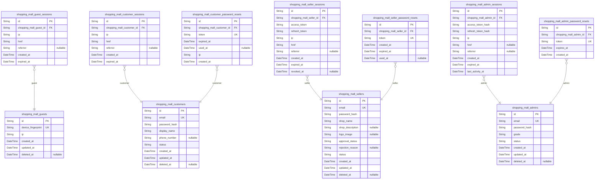
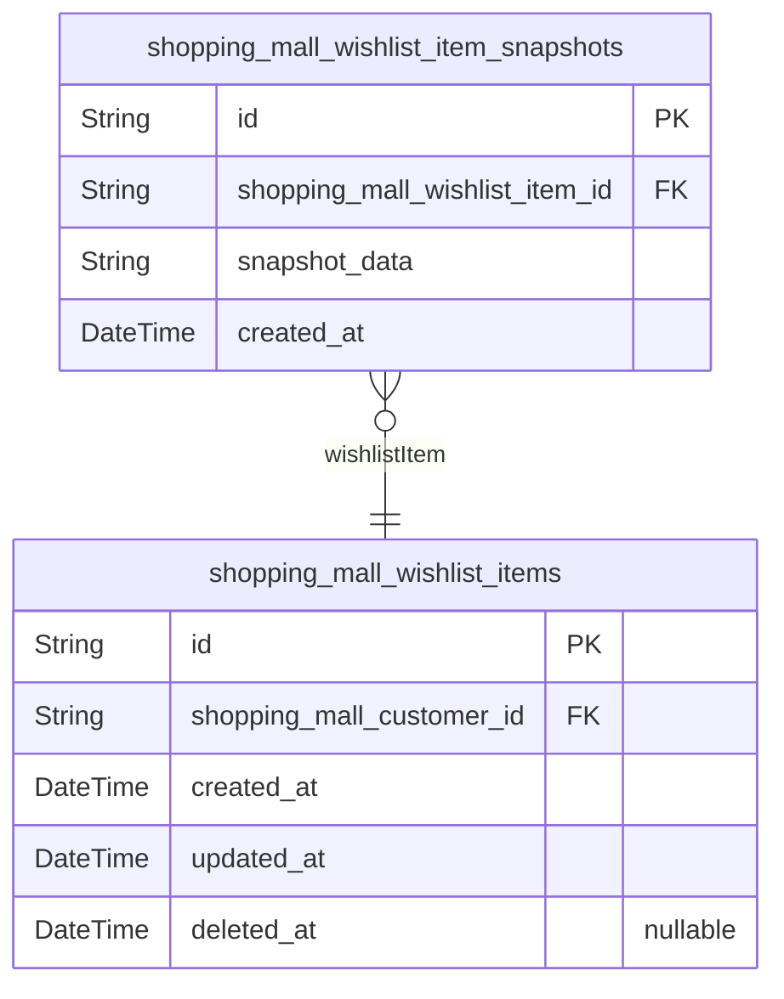
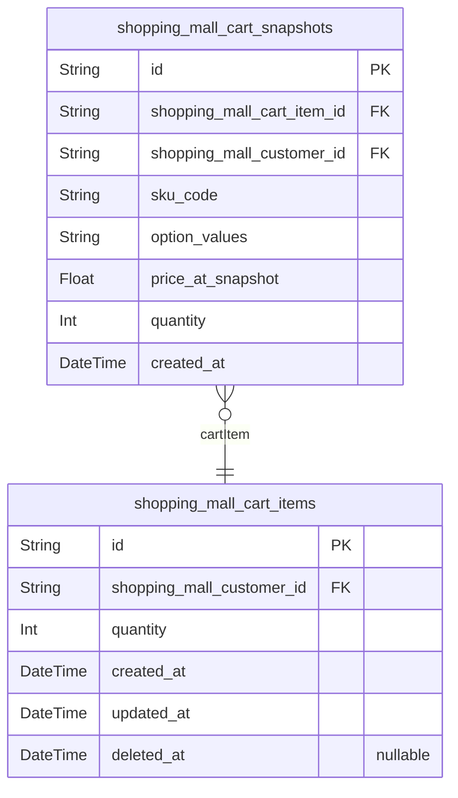
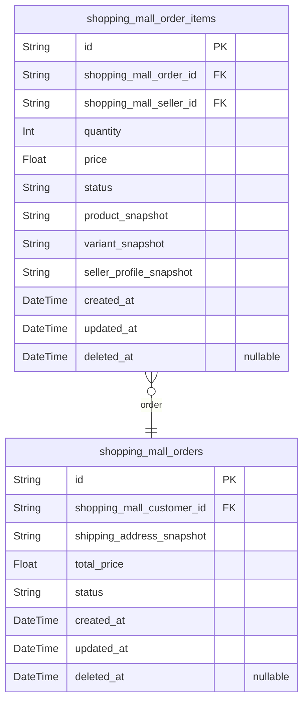
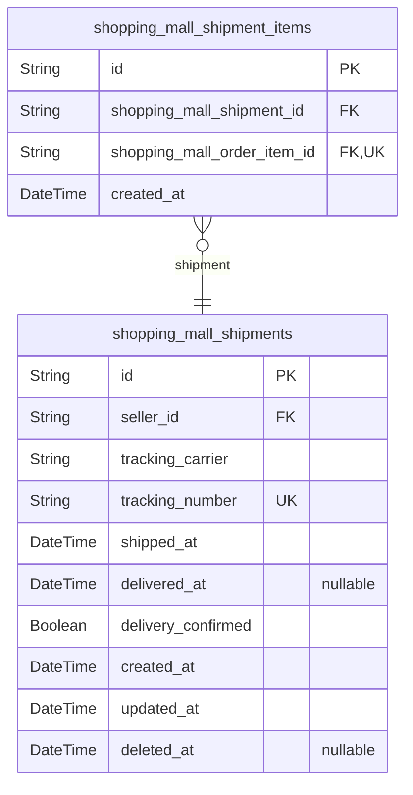
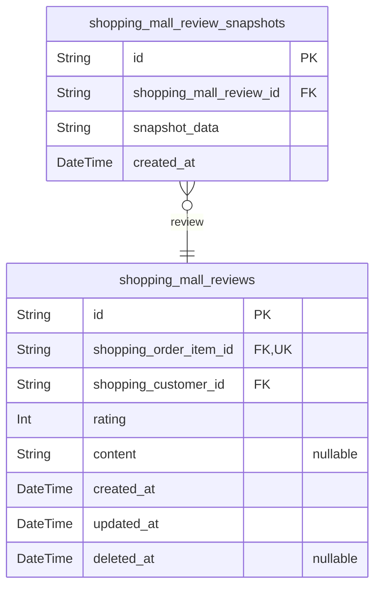
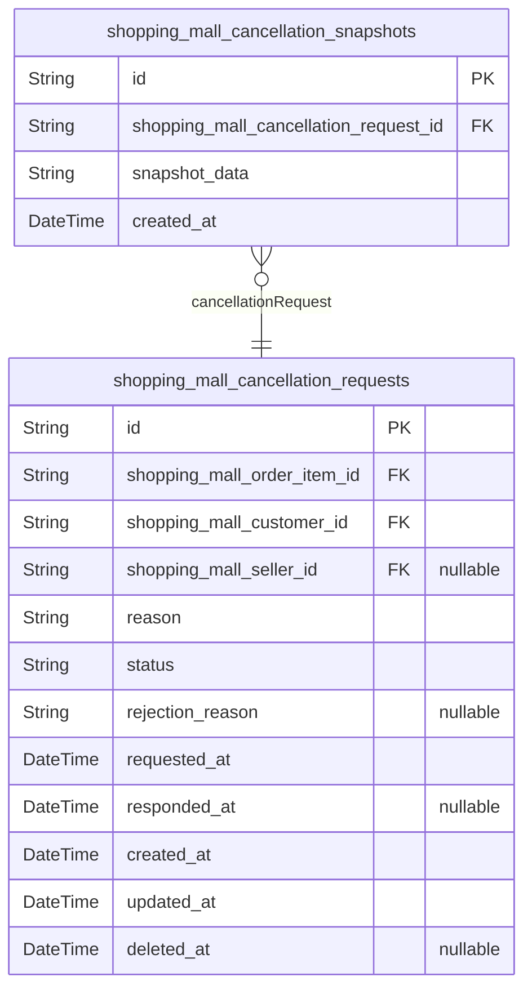
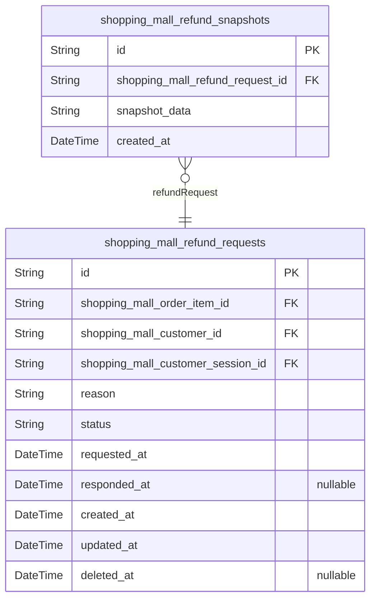
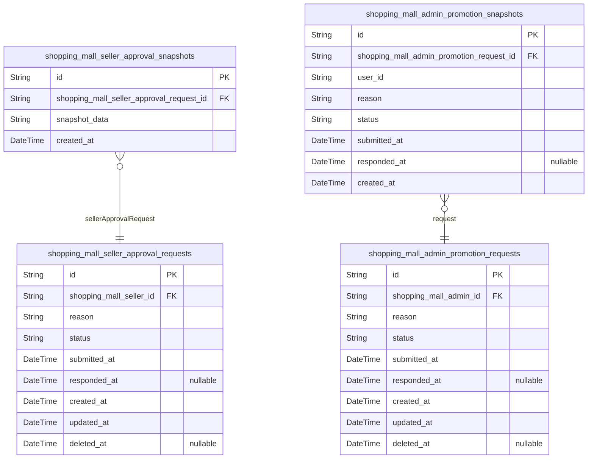
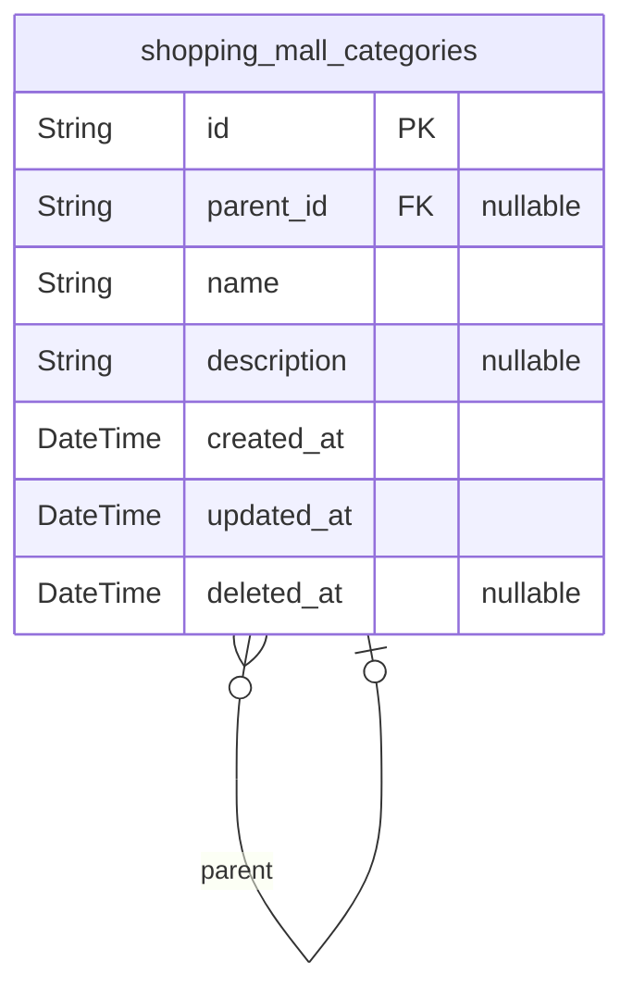

# Prisma Markdown

> Generated by [`prisma-markdown`](https://github.com/samchon/prisma-markdown)

- [Actors](#actors)
- [Wishlists](#wishlists)
- [Carts](#carts)
- [Orders](#orders)
- [Shipments](#shipments)
- [Reviews](#reviews)
- [Cancellations](#cancellations)
- [Refunds](#refunds)
- [Approvals](#approvals)
- [Categories](#categories)

## Actors

### `shopping_mall_guests`

Temporary guest accounts for unauthenticated users browsing the shopping
mall platform.

Guest accounts provide limited access to registered users who haven't
created an account yet. Unlike customer, seller, or admin actors, guests
are identified solely by their device fingerprint rather than email
credentials. This allows the platform to track browsing sessions and
provide personalized experiences without requiring registration.

Guests can browse products and categories but cannot place orders, add
items to cart, or access any purchase-related features. When a guest
decides to register, they create a new customer account and their guest
session terminates.

Key characteristics:
- Identified by unique device fingerprint (browser/device identifier)
- No email or password authentication
- Temporary nature with automatic cleanup
- Session managed through [shopping_mall_guest_sessions](#shopping_mall_guest_sessions)
- No ownership of business entities (orders, cart, wishlist, etc.)

Properties as follows:

- `id`: Primary Key.
- `device_fingerprint`
  > Unique device/browser fingerprint identifier for guest account. This
  > fingerprint is generated from browser characteristics and device
  > information to identify returning guests across sessions.
- `ip`
  > Last known IP address of the guest device. Used for security tracking and
  > session validation.
- `created_at`: Timestamp when the guest account was first created.
- `updated_at`: Timestamp when the guest account was last updated.
- `deleted_at`
  > Timestamp when the guest account was soft-deleted. Guest accounts may be
  > cleaned up after extended inactivity.

### `shopping_mall_guest_sessions`

Temporary session tokens for guest access with short expiration.

This table tracks login sessions for guest users, storing connection
metadata and temporal information for session management. Each session is
tied to a single guest account and contains the IP address, request href,
and referrer information from the login request.

**Key Relationships:**
- Belongs to a [shopping_mall_guests](#shopping_mall_guests) account (many sessions per
guest)
- Sessions are invalidated when guest logs out or when a new login occurs
(one active session per guest policy)

**Session Lifecycle:**
- Created when a guest logs in successfully
- Expires after 30 minutes of inactivity (Section 19)
- Invalidated when guest logs out or account is banned/suspended
- Only one active session allowed per guest at a time

Properties as follows:

- `id`: Primary Key.
- `shopping_mall_guest_id`: Belonged guest's [shopping_mall_guests.id](#shopping_mall_guests).
- `ip`: IP address from which the guest logged in.
- `href`: URL of the page where the login request originated.
- `referrer`: Referrer URL indicating the source of the login request.
- `created_at`: Timestamp when the session was created.
- `expired_at`: Timestamp when the session expires due to inactivity or maximum duration.

### `shopping_mall_customers`

Registered customer accounts with email/password authentication
credentials and account state management.

This table represents customer actors in the shopping mall platform who
can browse products, add items to cart, place orders, write reviews, and
manage their profile. Each customer has unique email-based authentication
credentials and maintains an account state that can transition between
active, suspended, and banned statuses.

Key relationships:
- Belonged customer's [shopping_mall_customer_sessions.id](#shopping_mall_customer_sessions) for
authentication sessions
- Belonged customer's [shopping_mall_customer_password_resets.id](#shopping_mall_customer_password_resets)
for password recovery
- One-to-many with [shopping_mall_addresses](#shopping_mall_addresses) for shipping addresses
- One-to-many with [shopping_mall_wishlist_items](#shopping_mall_wishlist_items) for saved products
- One-to-many with [shopping_mall_cart_items](#shopping_mall_cart_items) for active shopping cart
- One-to-many with [shopping_mall_orders](#shopping_mall_orders) as the purchasing customer
- One-to-many with [shopping_mall_reviews](#shopping_mall_reviews) as the reviewer

Account deletion uses soft delete (deleted_at) to preserve order history
while anonymizing profile information.

Properties as follows:

- `id`: Primary Key.
- `email`
  > Unique email address used for customer authentication and account
  > identification.
- `password_hash`: BCrypt hashed password for customer authentication.
- `display_name`: Customer's public display name shown on reviews and order history.
- `phone_number`
  > Customer's contact phone number for order notifications and delivery
  > coordination.
- `status`
  > Account state indicating customer's access level. Valid values: 'active'
  > (normal access), 'suspended' (temporary restriction), 'banned' (permanent
  > restriction).
- `created_at`: Timestamp when the customer account was created.
- `updated_at`: Timestamp when the customer account was last modified.
- `deleted_at`
  > Timestamp when the customer account was soft-deleted. Null means account
  > is active. When set, profile is anonymized but order history is
  > preserved.

### `shopping_mall_customer_sessions`

JWT session tokens for customer authentication with access and refresh
token support.

This table tracks login sessions for registered customers, storing
connection metadata and temporal information for security auditing. Each
session represents a single authenticated login event and is used to
validate customer access tokens.

**Key Relationships**:
- Belongs to [shopping_mall_customers](#shopping_mall_customers) - Links session to the
authenticated customer account
- One customer can have multiple concurrent sessions across different
devices

**Session Lifecycle**:
- Created: When customer successfully logs in with valid credentials
- Expired: When access token expires or session is explicitly terminated
- Managed through authentication flows, not direct user CRUD operations

**Security Considerations**:
- IP address and referrer stored for fraud detection and audit trails
- Expiration timestamp enforces session timeout policies
- Append-only design prevents tampering with session history

Properties as follows:

- `id`: Primary Key.
- `shopping_mall_customer_id`
  > Authenticated customer's [shopping_mall_customers.id](#shopping_mall_customers). Links this
  > session to the customer account that created it through successful login.
- `ip`
  > IP address from which the customer logged in. Used for security auditing
  > and fraud detection.
- `href`
  > URL of the page where the login request originated. Captures the entry
  > point for session tracking.
- `referrer`
  > HTTP referrer header from the login request. Provides context about how
  > the user arrived at the login page.
- `created_at`
  > Timestamp when the session was created (login time). Used to calculate
  > session age and enforce timeout policies.
- `expired_at`
  > Timestamp when the session expires. Sessions are invalid after this time
  > and require re-authentication.

### `shopping_mall_customer_password_resets`

Password reset tokens for customer account recovery.

This table stores one-time-use tokens that allow customers to reset their
forgotten passwords. Each token is associated with a specific customer
account and has an expiration time for security. When a customer requests
a password reset, a new token is generated and sent to their registered
email address. The token can only be used once, and using it invalidates
all other pending reset tokens for that customer.

Key relationships:
- Belongs to [shopping_mall_customers](#shopping_mall_customers) - links the reset token to
the customer account
- Tokens are immutable once created and either expire or are marked as used

Security considerations:
- Tokens expire after a set period (typically 1 hour)
- Only one active token can be used per customer at a time
- Token usage is tracked to prevent replay attacks
- IP address is recorded for audit trail purposes

Properties as follows:

- `id`: Primary Key.
- `shopping_mall_customer_id`
  > Belonged customer's [shopping_mall_customers.id](#shopping_mall_customers). This foreign key
  > links the password reset token to the customer account that needs
  > recovery.
- `token`
  > The unique password reset token sent to the customer's email. This token
  > is used to verify the customer's identity when resetting their password.
  > The token is cryptographically secure and can only be used once.
- `expired_at`
  > The timestamp when this password reset token expires. Tokens typically
  > expire after 1 hour for security purposes. After expiration, the token
  > cannot be used to reset the password and a new reset request must be
  > made.
- `used_at`
  > The timestamp when this password reset token was successfully used to
  > reset the customer's password. This field is null until the token is
  > used, and once set, indicates the token has been consumed and cannot be
  > reused.
- `ip`
  > The IP address from which the password reset request was made. This is
  > recorded for security audit purposes and can help detect suspicious
  > password reset attempts from unusual locations.
- `created_at`
  > The timestamp when this password reset token was created. This marks when
  > the customer requested a password reset and the token was generated.

### `shopping_mall_sellers`

Registered seller accounts with email/password authentication credentials
and approval status tracking.

Sellers are platform vendors who can create and manage products, process
orders, and respond to cancellation/refund requests. Each seller account
requires administrator approval before they can list products for sale.

This table serves as the canonical identity record for the seller actor
type, owning credentials and shop profile data. Seller sessions are
tracked in [shopping_mall_seller_sessions](#shopping_mall_seller_sessions), password resets in
[shopping_mall_seller_password_resets](#shopping_mall_seller_password_resets), and approval workflows in
[shopping_mall_seller_approval_requests](#shopping_mall_seller_approval_requests).

Key relationships:
- Has many [shopping_mall_products](#shopping_mall_products) (products listed by this seller)
- Has many [shopping_mall_order_items](#shopping_mall_order_items) (as seller fulfilling orders)
- Has many [shopping_mall_seller_approval_requests](#shopping_mall_seller_approval_requests) (onboarding
approval history)
- Has many [shopping_mall_seller_sessions](#shopping_mall_seller_sessions) (active login sessions)
- Has many [shopping_mall_seller_password_resets](#shopping_mall_seller_password_resets) (password
recovery tokens)

Properties as follows:

- `id`: Primary Key.
- `email`: Unique email address used for seller authentication and account recovery.
- `password_hash`: BCrypt hashed password for seller login authentication.
- `shop_name`
  > Public-facing shop name displayed to customers on product listings and
  > order pages.
- `shop_description`
  > Shop description providing information about the seller's business and
  > offerings.
- `logo_image`: URL to the seller's shop logo image displayed on their shop profile page.
- `approval_status`
  > Seller approval state: pending (awaiting admin review), approved (can
  > list products), rejected (application denied, can resubmit), suspended
  > (temporarily banned by admin).
- `rejection_reason`
  > Administrator-provided explanation for rejected seller applications,
  > visible to the seller.
- `status`
  > Account state: active (normal operation), banned (permanently banned by
  > admin).
- `created_at`: Timestamp when the seller account was created.
- `updated_at`: Timestamp when the seller account was last modified.
- `deleted_at`
  > Timestamp when the seller account was soft-deleted. Deleted sellers
  > cannot login but order history is preserved.

### `shopping_mall_seller_sessions`

JWT session tokens for seller authentication with access and refresh
token support.

This table stores active authentication sessions for seller users who
have logged into the platform. Each session contains the JWT access token
(valid for 1 hour) and refresh token (valid for 7 days), along with
connection metadata for security auditing.

**Key Relationships**:
- Belongs to [shopping_mall_sellers](#shopping_mall_sellers) - the seller account that owns
this session
- One active session per seller at a time; new login invalidates existing
session

**Session Lifecycle**:
- Created when seller logs in successfully
- Expires after 30 minutes of inactivity or 1 hour from JWT issuance
- Can be explicitly revoked on logout, password change, or account
suspension/ban
- Refresh tokens allow obtaining new access tokens without re-authentication

**Security Features**:
- Connection metadata (IP, href, referrer) logged for audit trail
- Token revocation tracked via revoked_at timestamp
- Single session policy prevents concurrent access from multiple devices

Properties as follows:

- `id`: Primary Key.
- `shopping_mall_seller_id`: Belonged seller's [shopping_mall_sellers.id](#shopping_mall_sellers).
- `access_token`: JWT access token for API authentication, valid for 1 hour from issuance.
- `refresh_token`
  > JWT refresh token for obtaining new access tokens, valid for 7 days from
  > issuance.
- `ip`: Client IP address at session creation for security auditing.
- `href`: Current URL where the user logged in from.
- `referrer`: Referrer URL that led to the login page.
- `created_at`: Timestamp when the session was created (login time).
- `expired_at`: Timestamp when the session expires due to inactivity or JWT expiration.
- `revoked_at`
  > Timestamp when the session was explicitly revoked (logout, password
  > change, or account suspension). Null if session expired naturally.

### `shopping_mall_seller_password_resets`

Password reset tokens for seller account recovery.

This table stores one-time-use tokens that allow sellers to reset their
forgotten passwords. Each token is cryptographically secure, has a
limited expiration window for security, and can only be used once. When a
seller requests a password reset, a new token is generated and sent to
their registered email. The token remains valid until expiration or until
it's used, whichever comes first.

Relationships:
- Belongs to [shopping_mall_sellers](#shopping_mall_sellers) - one seller can have multiple
password reset tokens over time (1:N relationship)
- Tokens are created on password reset request and invalidated after use
or expiration

Properties as follows:

- `id`: Primary Key.
- `shopping_mall_seller_id`
  > Seller account's [shopping_mall_sellers.id](#shopping_mall_sellers) that this password
  > reset token belongs to.
- `token`
  > Cryptographically secure one-time password reset token sent to seller's
  > email for account recovery.
- `created_at`: Timestamp when the password reset token was generated.
- `expired_at`
  > Timestamp when the password reset token expires and becomes invalid.
  > Tokens typically expire after a short period (e.g., 1 hour) for security.
- `used_at`
  > Timestamp when the password reset token was successfully used to reset
  > the password. Null if token has not been used yet.

### `shopping_mall_admins`

Administrator accounts with email/password authentication and grade-based
permission levels.

This table represents system administrators who have elevated privileges
to manage the shopping mall platform. Administrators can approve/reject
seller registrations, manage user accounts (suspend/ban), and oversee
platform operations.

**Grade System**:
- **regular**: Standard administrator with basic management capabilities
- **super**: Super administrator with full privileges including
promoting/demoting other administrators

**Account Status**:
- **active**: Administrator can log in and perform administrative actions
- **banned**: Administrator account is permanently disabled (requires
super admin to restore)
- **suspended**: Administrator account is temporarily disabled (can be
reactivated)

**Relationships**:
- One-to-many with [shopping_mall_admin_sessions](#shopping_mall_admin_sessions) for tracking
login sessions
- One-to-many with [shopping_mall_admin_password_resets](#shopping_mall_admin_password_resets) for
password recovery
- One-to-many with [shopping_mall_admin_promotion_requests](#shopping_mall_admin_promotion_requests) for
grade elevation requests

Properties as follows:

- `id`: Primary Key.
- `email`
  > Unique email address used for administrator authentication and
  > identification.
- `password_hash`
  > BCrypt hashed password for administrator authentication. Never store
  > plain text passwords.
- `grade`
  > Administrator privilege level. Valid values: 'regular' (standard admin)
  > or 'super' (full platform control including admin management).
- `status`
  > Account lifecycle status. Valid values: 'active' (can login and perform
  > actions), 'banned' (permanently disabled), 'suspended' (temporarily
  > disabled).
- `created_at`: Timestamp when the administrator account was created.
- `updated_at`: Timestamp when the administrator account was last modified.
- `deleted_at`
  > Timestamp when the administrator account was soft-deleted. Null means
  > account is active.

### `shopping_mall_admin_sessions`

JWT session tokens for administrator authentication with access and
refresh token support.

This table tracks active login sessions for administrators, storing
hashed authentication tokens and connection metadata. Each session is
tied to a single administrator account and supports the multi-device
session policy where only one active session is allowed per admin at a
time.

**Key Features:**

- Stores hashed JWT access tokens (1-hour validity) and refresh tokens
(7-day validity)
- Tracks connection metadata (IP address, href, referrer) for security
auditing
- Maintains last activity timestamp for 30-minute inactivity timeout
enforcement
- Supports session rotation on refresh token use
- Automatically invalidated on logout, password change, or account
ban/suspension

**Relationships:**

- Belongs to [shopping_mall_admins](#shopping_mall_admins) - One-to-many relationship (one
admin can have multiple session records over time, but only one active at
a time)

**Business Rules:**

- New login invalidates any existing active session for the same admin
- Session expires after 30 minutes of inactivity
- Access token expires after 1 hour and must be refreshed
- Refresh token expires after 7 days requiring full re-authentication
- All session creation and termination events are logged for audit purposes

Properties as follows:

- `id`: Primary Key.
- `shopping_mall_admin_id`
  > Belonged administrator's [shopping_mall_admins.id](#shopping_mall_admins). This foreign
  > key establishes the relationship between the session and the
  > authenticated admin account.
- `access_token_hash`
  > Hashed value of the JWT access token for security. The actual token is
  > never stored in plaintext. This hash is used to verify token validity and
  > for revocation checking.
- `refresh_token_hash`
  > Hashed value of the refresh token for security. The actual token is never
  > stored in plaintext. This hash is used to validate refresh requests and
  > is rotated on each use.
- `ip`
  > IP address of the client device when the session was created. Used for
  > security auditing and suspicious activity detection.
- `href`
  > URL of the page that initiated the login request. Used for session
  > tracking and security analysis.
- `referrer`
  > Referrer URL from the login request. Used for session tracking and
  > security analysis.
- `created_at`
  > Timestamp when the session was created. Used for session age tracking and
  > expiration calculations.
- `expired_at`
  > Timestamp when the session expires due to refresh token expiration (7
  > days from creation). Used for automatic session cleanup and validation.
- `last_activity_at`
  > Timestamp of the last authenticated action in this session. Used to
  > enforce the 30-minute inactivity timeout policy. Updated on each
  > authenticated request.

### `shopping_mall_admin_password_resets`

Password reset tokens for administrator account recovery.

This table stores one-time use tokens that allow administrators to reset
their password when they've forgotten it. Each token is associated with a
specific administrator account and has an expiration time for security.

**Key Relationships:**
- Belongs to [shopping_mall_admins](#shopping_mall_admins) - Each reset token is tied to a
single administrator account

**Business Rules:**
- Tokens are single-use only and become invalid after being consumed
- Tokens expire after a set time period (typically 1 hour) for security
- Creating a new password reset token invalidates any existing pending
tokens for that admin
- Tokens are generated securely using cryptographically random values

**Lifecycle:**
1. Admin requests password reset via email
2. System generates unique token and sends it via email
3. Admin uses token to set new password
4. Token becomes invalid after use or expiration

Properties as follows:

- `id`: Primary Key.
- `shopping_mall_admin_id`: Associated administrator's [shopping_mall_admins.id](#shopping_mall_admins).
- `token`
  > Secure one-time use token for password reset. Generated using
  > cryptographically secure random value.
- `expires_at`: Timestamp when this password reset token expires and becomes invalid.
- `created_at`: Timestamp when this password reset token was generated.

## Wishlists

### `shopping_mall_wishlist_items`

Customer wishlist items that link customers to products they want to
purchase later.

This table implements a many-to-many relationship between {@link
shopping_mall_customers} and products, allowing customers to bookmark
products of interest for future purchase consideration. Each wishlist
entry records when a customer added a product to their wishlist.

**Key behaviors**:
- One customer can wishlist multiple products
- One product can be wishlisted by multiple customers
- Duplicate wishlist entries are prevented by unique constraint
- When a product is deleted by a seller, wishlist entries are soft-deleted
- Customers can view, add to, and remove items from their own wishlist

**Related entities**:
- [shopping_mall_customers](#shopping_mall_customers) - The customer who created the wishlist
item
- [shopping_mall_wishlist_item_snapshots](#shopping_mall_wishlist_item_snapshots) - Audit trail of wishlist
changes

Properties as follows:

- `id`: Primary Key.
- `shopping_mall_customer_id`: Belonged customer's [shopping_mall_customers.id](#shopping_mall_customers).
- `created_at`: Timestamp when the product was added to the customer's wishlist.
- `updated_at`: Timestamp when the wishlist item was last updated.
- `deleted_at`
  > Timestamp when the wishlist item was soft-deleted. Null means the item is
  > active.

### `shopping_mall_wishlist_item_snapshots`

Immutable audit trail snapshots capturing point-in-time states of
wishlist items for data integrity and historical reference.

These snapshots preserve the state of {@link
shopping_mall_wishlist_items} at specific moments, enabling:

- **Audit compliance**: Track when wishlist items were added or modified
- **Data recovery**: Restore previous states if needed
- **Dispute resolution**: Provide evidence of wishlist state at specific
times

Snapshots are created automatically when wishlist items are modified and
are never deleted or updated after creation. Each snapshot contains a
complete copy of the wishlist item state at the time of capture.

Properties as follows:

- `id`: Primary Key.
- `shopping_mall_wishlist_item_id`: Referenced wishlist item's [shopping_mall_wishlist_items.id](#shopping_mall_wishlist_items).
- `snapshot_data`
  > Complete snapshot of the wishlist item state captured at creation time,
  > including customer reference, product reference, and timestamp.
- `created_at`: Timestamp when this snapshot was created. Immutable after creation.

## Carts

### `shopping_mall_cart_items`

Active shopping cart items containing customer-selected product variants
with quantities.

This table represents the immediate purchase intent of customers, storing
which product variants they've added to their cart and in what
quantities. When the same variant is added multiple times, quantities are
combined rather than creating duplicate entries.

**Key Relationships:**
- Belongs to [shopping_mall_customers](#shopping_mall_customers) - the customer who owns the
cart item

**Business Rules:**
- One customer can have multiple cart items
- Cart items are soft-deleted when removed from cart
- Cart items are cleared when order is placed
- Quantity must be positive integer

**Audit Trail:**
- Historical cart states are captured in {@link
shopping_mall_cart_snapshots}

Properties as follows:

- `id`: Primary Key.
- `shopping_mall_customer_id`
  > Belonged customer's [shopping_mall_customers.id](#shopping_mall_customers). The customer who
  > owns this cart item.
- `quantity`
  > Number of units in the cart. Must be positive integer. When same item is
  > added again, quantities are combined.
- `created_at`: Timestamp when this cart item was first added to the cart.
- `updated_at`
  > Timestamp when this cart item was last modified (quantity change or
  > re-addition).
- `deleted_at`
  > Timestamp when this cart item was removed from the cart. Null means item
  > is still in active cart.

### `shopping_mall_cart_snapshots`

Immutable audit trail snapshots capturing cart item state at specific
points in time.

These snapshots preserve the historical state of cart items including
customer ownership, product variant selection, and quantity at the moment
of snapshot creation. They enable:

- Audit trail for cart modifications and deletions
- Historical analysis of customer shopping behavior
- Dispute resolution by showing what was in the cart at a given time
- Recovery of accidentally deleted cart items

Each snapshot is fully denormalized to preserve the exact state even if
the original cart item, customer profile, or product data is later
modified or deleted. This follows the snapshot pattern used throughout
the system.

Properties as follows:

- `id`: Primary Key.
- `shopping_mall_cart_item_id`
  > Reference to the cart item being snapshot. {@link
  > shopping_mall_cart_items.id}
- `shopping_mall_customer_id`
  > Denormalized reference to the customer who owned the cart item at
  > snapshot time. [shopping_mall_customers.id](#shopping_mall_customers)
- `sku_code`: Denormalized SKU code of the product variant at snapshot time.
- `option_values`
  > Denormalized option values (e.g., size, color) of the product variant at
  > snapshot time.
- `price_at_snapshot`: Price of the product variant at the time of snapshot creation.
- `quantity`
  > Quantity of the product variant in the cart at the time of snapshot
  > creation.
- `created_at`
  > Timestamp when this snapshot was created, indicating the point in time
  > the cart state was captured.

## Orders

### `shopping_mall_orders`

Main order records representing customer purchase transactions in the
shopping mall platform.

Each order captures a customer's purchase at a point in time, including
the shipping address snapshot (preserved for historical accuracy), total
price, and overall order status. The order status is derived from the
statuses of all its constituent order items.

**Key Relationships**:
- Belongs to [shopping_mall_customers](#shopping_mall_customers) - the customer who placed
the order
- Has many [shopping_mall_order_items](#shopping_mall_order_items) - individual line items
within the order

**Important Notes**:
- Shipping address is stored as a JSON snapshot (not a foreign key) to
preserve the exact address state at order time, even if the customer
later modifies or deletes their address
- Order status is computed from order item statuses: paid, shipped,
delivered, cancelled, refunded, or partially_completed
- Orders support soft deletion via deleted_at field

Properties as follows:

- `id`: Primary Key.
- `shopping_mall_customer_id`
  > Belonged customer's [shopping_mall_customers.id](#shopping_mall_customers). The customer who
  > placed this order.
- `shipping_address_snapshot`
  > JSON snapshot of the shipping address at order time. Stored as text to
  > preserve historical accuracy even if the customer later modifies or
  > deletes their address.
- `total_price`
  > Total price of all order items at the time of purchase. This is a
  > snapshot of the price and should not change even if product prices are
  > later modified.
- `status`
  > Overall order status derived from all order item statuses. Possible
  > values: paid, shipped, delivered, cancelled, refunded,
  > partially_completed.
- `created_at`: Timestamp when the order was created.
- `updated_at`: Timestamp when the order was last updated.
- `deleted_at`: Timestamp when the order was soft-deleted. NULL means the order is active.

### `shopping_mall_order_items`

Individual line items within customer orders representing purchased
products.

Each order item captures a specific purchase with quantity, price at time
of purchase, and current fulfillment status. Order items are independent
entities that can be individually shipped, cancelled, refunded, or
reviewed.

Key relationships:
- Belongs to [shopping_mall_orders](#shopping_mall_orders) as part of a customer's
purchase transaction
- References [shopping_mall_sellers](#shopping_mall_sellers) for the merchant fulfilling
this item
- Has many [shopping_mall_shipments](#shopping_mall_shipments) for delivery tracking
- Has many [shopping_mall_cancellation_requests](#shopping_mall_cancellation_requests) for pre-shipment
cancellations
- Has many [shopping_mall_refund_requests](#shopping_mall_refund_requests) for post-delivery returns
- Has many [shopping_mall_reviews](#shopping_mall_reviews) for customer feedback

Purchase-time snapshots (product_snapshot, variant_snapshot,
seller_profile_snapshot) preserve the state of referenced entities at
order placement time, ensuring order history remains accurate even if
products or seller profiles are later modified or deleted.

Status workflow: paid → shipped → delivered, with cancelled or refunded
as alternative terminal states.

Properties as follows:

- `id`: Primary Key.
- `shopping_mall_order_id`
  > Parent order's [shopping_mall_orders.id](#shopping_mall_orders). This order item is part
  > of the referenced customer order transaction.
- `shopping_mall_seller_id`
  > Selling merchant's [shopping_mall_sellers.id](#shopping_mall_sellers). The seller
  > responsible for fulfilling this order item.
- `quantity`: Number of units purchased in this order line item.
- `price`
  > Unit price at time of purchase. Preserved for historical accuracy even if
  > product price changes later.
- `status`
  > Current fulfillment status. Valid values: paid (order placed, payment
  > confirmed), shipped (item dispatched), delivered (item received by
  > customer), cancelled (pre-shipment cancellation approved), refunded
  > (post-delivery return approved).
- `product_snapshot`
  > JSON snapshot of product state at order placement time. Preserves product
  > name, description, and other details for historical order records.
- `variant_snapshot`
  > JSON snapshot of product variant state at order placement time. Preserves
  > SKU, option values, and variant-specific details.
- `seller_profile_snapshot`
  > JSON snapshot of seller profile at order placement time. Preserves shop
  > name and seller information for order history.
- `created_at`: Timestamp when this order item was created during checkout.
- `updated_at`: Timestamp when this order item was last modified.
- `deleted_at`
  > Timestamp when this order item was soft deleted. Null if the item is
  > active.

## Shipments

### `shopping_mall_shipments`

Shipment records tracking physical delivery of order items to customers.

This table manages the logistics and delivery confirmation for fulfilled
orders. Each shipment is created by a seller and can contain multiple
order items from the same seller (linked through {@link
shopping_mall_shipment_items} junction table).

**Key Features**:
- Tracks carrier information and tracking numbers for delivery visibility
- Records shipment and delivery timestamps for audit and analytics
- Supports manual delivery confirmation by customers or auto-delivery
after 14 days
- Enables sellers to manage their shipment history and status

**Business Rules**:
- One shipment can contain multiple order items from the same seller
- Customers confirm delivery per shipment (not per individual item)
- Auto-delivery triggered after 14 days if not manually confirmed
- Deleted shipments are soft-deleted to preserve order history integrity

Properties as follows:

- `id`: Primary Key.
- `seller_id`
  > Seller who created and manages this shipment. {@link
  > shopping_mall_sellers.id}
- `tracking_carrier`: Name of the shipping carrier (e.g., FedEx, UPS, DHL).
- `tracking_number`: Unique tracking number provided by the carrier for delivery tracking.
- `shipped_at`: Timestamp when the shipment was dispatched by the seller.
- `delivered_at`
  > Timestamp when the shipment was delivered to the customer. Nullable until
  > delivery is confirmed.
- `delivery_confirmed`
  > Whether the customer has confirmed receipt of the shipment. Auto-set to
  > true after 14 days if not manually confirmed.
- `created_at`: Timestamp when this shipment record was created.
- `updated_at`: Timestamp when this shipment record was last modified.
- `deleted_at`
  > Timestamp when this shipment was soft-deleted. Null means the shipment is
  > active.

### `shopping_mall_shipment_items`

Junction table establishing the many-to-many relationship between
shipments and order items.

This table enables a single shipment to contain multiple order items from
the same seller, consolidating delivery tracking. Each record links one
shipment to one order item, allowing efficient querying of which items
are included in a shipment and which shipments contain a specific order
item.

**Key Relationships**:
- Belongs to [shopping_mall_shipments](#shopping_mall_shipments) via `shopping_mall_shipment_id`
- Belongs to [shopping_mall_order_items](#shopping_mall_order_items) via
`shopping_mall_order_item_id`

**Business Rules**:
- One shipment can contain multiple order items (same seller)
- One order item can only be in one shipment at a time (enforced by
unique constraint on order_item_id)
- Customers confirm delivery per shipment, not per individual item
- Auto-delivery occurs after 14 days if not manually confirmed

Properties as follows:

- `id`: Primary Key.
- `shopping_mall_shipment_id`
  > Belonged shipment's [shopping_mall_shipments.id](#shopping_mall_shipments). Links this
  > junction record to the parent shipment containing tracking information.
- `shopping_mall_order_item_id`
  > Belonged order item's [shopping_mall_order_items.id](#shopping_mall_order_items). Links this
  > junction record to the specific order item being shipped.
- `created_at`: Timestamp when this shipment item association was created.

## Reviews

### `shopping_mall_reviews`

Customer reviews for purchased products with star ratings and optional
text feedback.

Reviews are written by customers after receiving their order items and
help other buyers make informed purchasing decisions. Each review is tied
to a specific order item, ensuring customers can only review products
they've actually purchased and received.

Reviews support soft deletion to preserve historical data while allowing
customers to remove their feedback. The system maintains immutable
snapshots of review changes for audit and dispute resolution purposes.

Key relationships:
- Belongs to [shopping_mall_order_items](#shopping_mall_order_items) - the order item being
reviewed
- Belongs to [shopping_mall_customers](#shopping_mall_customers) - the customer who wrote the
review

Properties as follows:

- `id`: Primary Key.
- `shopping_order_item_id`: Order item being reviewed. [shopping_mall_order_items.id](#shopping_mall_order_items)
- `shopping_customer_id`: Customer who wrote the review. [shopping_mall_customers.id](#shopping_mall_customers)
- `rating`: Star rating from 1 to 5. Must be between 1 (lowest) and 5 (highest).
- `content`
  > Optional text feedback describing the customer's experience with the
  > product.
- `created_at`: Timestamp when the review was first created.
- `updated_at`: Timestamp when the review was last modified.
- `deleted_at`
  > Timestamp when the review was soft deleted. Null means the review is
  > active.

### `shopping_mall_review_snapshots`

Immutable audit trail capturing review state at modification time for
dispute resolution and change history tracking.

This table preserves the complete state of [shopping_mall_reviews](#shopping_mall_reviews)
whenever a review is modified, enabling:

- **Dispute resolution**: Provides evidence of what the review contained
at any point in time
- **Change tracking**: Allows sellers and administrators to see the full
modification history
- **Data integrity**: Ensures review content cannot be altered without
leaving an audit trail

Each snapshot is immutable and append-only, created automatically when a
review is edited. The snapshot_data field contains all review fields
denormalized for historical reference, including the order item
reference, customer reference, rating, content, and timestamps as they
existed at the time of modification.

Properties as follows:

- `id`: Primary Key.
- `shopping_mall_review_id`: References the review being snapshot. [shopping_mall_reviews.id](#shopping_mall_reviews)
- `snapshot_data`
  > Complete review state captured at snapshot time. Contains denormalized
  > review fields including order item reference, customer reference, rating,
  > text content, and timestamps as they existed when the snapshot was
  > created.
- `created_at`
  > Timestamp when this snapshot was created. Records the exact moment the
  > review modification was captured.

## Cancellations

### `shopping_mall_cancellation_requests`

Customer requests to cancel order items before shipment.

This table stores cancellation requests submitted by customers for order
items that have not yet been shipped. Each request includes the reason
for cancellation, current status (pending, approved, or rejected), and
timestamps for when the request was made and when the seller responded.

Key relationships:
- Belongs to [shopping_mall_order_items](#shopping_mall_order_items) - the specific order item
being cancelled
- Belongs to [shopping_mall_customers](#shopping_mall_customers) - the customer who submitted
the request
- Belongs to [shopping_mall_sellers](#shopping_mall_sellers) - the seller who responded to
the request (populated when status changes from pending)

Business rules:
- Cancellation requests are only allowed for order items with "paid"
status (not yet shipped)
- Sellers must respond to approve or reject the request
- When approved, the order item status changes to "cancelled" and stock
is restored
- When rejected, the seller must provide a rejection reason
- Immutable snapshots are created when the seller responds (stored in
[shopping_mall_cancellation_snapshots](#shopping_mall_cancellation_snapshots))

Properties as follows:

- `id`: Primary Key.
- `shopping_mall_order_item_id`: The order item being cancelled. [shopping_mall_order_items.id](#shopping_mall_order_items)
- `shopping_mall_customer_id`
  > The customer who submitted the cancellation request. {@link
  > shopping_mall_customers.id}
- `shopping_mall_seller_id`
  > The seller who responded to the cancellation request. Null while status
  > is pending, populated when seller approves or rejects. {@link
  > shopping_mall_sellers.id}
- `reason`: The customer's reason for requesting cancellation of the order item.
- `status`
  > Current status of the cancellation request: pending (awaiting seller
  > response), approved (seller agreed to cancel), or rejected (seller
  > declined the request).
- `rejection_reason`
  > The seller's reason for rejecting the cancellation request. Only
  > populated when status is 'rejected'. Null for pending or approved
  > requests.
- `requested_at`: Timestamp when the customer submitted the cancellation request.
- `responded_at`
  > Timestamp when the seller responded to the cancellation request (approved
  > or rejected). Null while status is pending.
- `created_at`
  > Timestamp when this cancellation request record was created in the
  > database.
- `updated_at`: Timestamp when this cancellation request record was last updated.
- `deleted_at`
  > Timestamp when this cancellation request was soft deleted. Null if the
  > record is active.

### `shopping_mall_cancellation_snapshots`

Immutable audit trail capturing cancellation request state at approval or
rejection time.

This table preserves the complete state of {@link
shopping_mall_cancellation_requests} whenever a seller responds to a
cancellation request (approve or reject). Each snapshot is immutable and
cannot be modified or deleted after creation, ensuring a permanent record
for dispute resolution and customer transparency.

Customers can view snapshots of their own cancellation requests to see
the seller's decision, response timestamp, and the original request
reason. This supports transparency in the cancellation workflow and
provides evidence for any disputes.

**Key Characteristics**:
- Append-only: Snapshots are created but never modified or deleted
- Immutable: Once created, snapshot data cannot be altered
- Customer-accessible: Customers can view snapshots of their own requests
- Complete state capture: Includes previous state, new state, and all
relevant fields

Properties as follows:

- `id`: Primary Key.
- `shopping_mall_cancellation_request_id`
  > Referenced cancellation request's {@link
  > shopping_mall_cancellation_requests.id}. Each snapshot is tied to a
  > specific cancellation request and captures its state at a point in time.
- `snapshot_data`
  > Complete JSON snapshot of the cancellation request state at the time of
  > capture. Includes previous state, new state (approved/rejected), seller
  > response, response timestamp, and all other relevant fields. This field
  > is immutable after creation.
- `created_at`
  > Timestamp when this snapshot was created. Records the exact moment the
  > cancellation request state was captured, typically when the seller
  > responds with approval or rejection.

## Refunds

### `shopping_mall_refund_requests`

Customer refund requests for delivered order items within the seven-day
post-delivery window.

This table manages the refund request workflow where customers can
request refunds for individual order items that have been delivered. Each
request requires a reason text and goes through an approval workflow
managed by the seller of the item.

Key relationships:
- References [shopping_mall_order_items.id](#shopping_mall_order_items) to identify which order
item is being refunded
- References [shopping_mall_customers.id](#shopping_mall_customers) to identify the
requesting customer
- References [shopping_mall_customer_sessions.id](#shopping_mall_customer_sessions) for audit trail
of the session used to submit the request
- Has one-to-many relationship with {@link
shopping_mall_refund_snapshots.id} for immutable audit trail

Business rules:
- Only items with "delivered" status are eligible for refund requests
- Requests must be submitted within seven days of delivery
- Each request is processed individually, independent of other items in
the same order
- Status transitions: pending → approved or rejected (by seller)
- When approved, the order item status changes to "refunded" and stock is
restored via inventory records

Properties as follows:

- `id`: Primary Key.
- `shopping_mall_order_item_id`
  > Belonged order item's [shopping_mall_order_items.id](#shopping_mall_order_items). The specific
  > line item within an order that the customer is requesting a refund for.
- `shopping_mall_customer_id`
  > Requesting customer's [shopping_mall_customers.id](#shopping_mall_customers). The customer
  > who submitted the refund request for their purchased item.
- `shopping_mall_customer_session_id`
  > Customer session's [shopping_mall_customer_sessions.id](#shopping_mall_customer_sessions). The
  > authenticated session used when submitting the refund request, preserved
  > for audit purposes.
- `reason`
  > The reason text provided by the customer explaining why they are
  > requesting a refund. This field is required and displayed to the seller
  > when reviewing the request.
- `status`
  > Current status of the refund request. Allowed values: 'pending' (awaiting
  > seller response), 'approved' (seller approved the refund), 'rejected'
  > (seller rejected the refund). Transitions from pending to either approved
  > or rejected when seller responds.
- `requested_at`
  > Timestamp when the customer submitted the refund request. Used to
  > validate the seven-day refund eligibility window from delivery date.
- `responded_at`
  > Timestamp when the seller responded to the refund request (approved or
  > rejected). Nullable until seller takes action on the pending request.
- `created_at`: Timestamp when this refund request record was created in the database.
- `updated_at`: Timestamp when this refund request record was last modified.
- `deleted_at`
  > Timestamp when this refund request was soft deleted. Nullable if the
  > record is active. Soft deletion preserves the request for audit trail
  > while removing it from active queries.

### `shopping_mall_refund_snapshots`

Immutable audit trail capturing refund request state when seller responds
with approval or rejection.

This table preserves the complete state of a refund request at the moment
the seller makes a decision, including the customer's reason, the request
status before and after the response, and the response timestamp.
Snapshots are immutable and non-deletable, providing an audit trail for
dispute resolution and compliance.

Customers can view snapshots of their own refund requests to see the
decision history. Administrators can view snapshots of any refund request
on the platform for oversight and audit purposes.

Relationships:
- Belongs to [shopping_mall_refund_requests](#shopping_mall_refund_requests) - the refund request
being snapshotted

Properties as follows:

- `id`: Primary Key.
- `shopping_mall_refund_request_id`: Belonged refund request's [shopping_mall_refund_requests.id](#shopping_mall_refund_requests).
- `snapshot_data`
  > JSON snapshot containing the refund request state at decision time,
  > including reason, status before and after response, and response
  > timestamp.
- `created_at`
  > Timestamp when the snapshot was created when seller responded to the
  > refund request.

## Approvals

### `shopping_mall_seller_approval_requests`

Seller approval requests for onboarding new sellers to the platform.

This table tracks the approval workflow when users register as sellers.
Each request contains the seller's application details, reason for
registration, and current approval status. Administrators review these
requests and can approve, reject, or leave them pending.

Key relationships:
- Belongs to [shopping_mall_sellers](#shopping_mall_sellers) - the seller making the
approval request
- Has many [shopping_mall_seller_approval_snapshots](#shopping_mall_seller_approval_snapshots) - immutable
audit trail of request state changes

Important behavioral notes:
- Rejected sellers can resubmit new approval requests
- Only super administrators can approve or reject seller registration
requests
- Status transitions: pending → approved OR pending → rejected
- When approved, the seller's approval_status in shopping_mall_sellers is
updated to 'approved'
- When rejected, the seller's approval_status is updated to 'rejected'
with rejection reason stored

Properties as follows:

- `id`: Primary Key.
- `shopping_mall_seller_id`
  > Belonged seller's [shopping_mall_sellers.id](#shopping_mall_sellers) who submitted the
  > approval request.
- `reason`
  > Reason or justification provided by the seller for their registration
  > request.
- `status`
  > Current approval status: 'pending' (awaiting admin review), 'approved'
  > (seller can now sell), or 'rejected' (seller cannot sell, can resubmit).
- `submitted_at`: Timestamp when the seller submitted the approval request.
- `responded_at`
  > Timestamp when the administrator responded to the approval request
  > (approved or rejected). Null while pending.
- `created_at`: Timestamp when this approval request record was created.
- `updated_at`: Timestamp when this approval request record was last updated.
- `deleted_at`: Timestamp when this approval request was soft deleted. Null if active.

### `shopping_mall_admin_promotion_requests`

Administrator promotion requests submitted by users who want to become
platform administrators.

This table tracks the formal application process for users requesting
elevated administrative privileges. Each request requires a justification
reason and goes through a review process by super administrators.

Key relationships:
- Belongs to [shopping_mall_admins](#shopping_mall_admins) - the user submitting the
promotion request
- Has many [shopping_mall_admin_promotion_snapshots](#shopping_mall_admin_promotion_snapshots) - audit trail
of state changes

Business rules:
- Only one pending request allowed per user at a time
- Requests are preserved even if the user deletes their account
- Super administrators review and approve/reject requests
- Approved requests automatically grant regular administrator status
- Rejected users may submit new requests

Properties as follows:

- `id`: Primary Key.
- `shopping_mall_admin_id`
  > The user requesting administrator promotion. {@link
  > shopping_mall_admins.id}
- `reason`
  > The justification provided by the user explaining why they should become
  > an administrator. Required field that cannot be empty or whitespace.
- `status`
  > Current approval status of the promotion request. Valid values: 'pending'
  > (awaiting review), 'approved' (granted), 'rejected' (denied).
- `submitted_at`: Timestamp when the promotion request was submitted by the user.
- `responded_at`
  > Timestamp when the super administrator responded to the request (approved
  > or rejected). Null while request is pending.
- `created_at`: Timestamp when this record was created in the database.
- `updated_at`: Timestamp when this record was last modified.
- `deleted_at`
  > Timestamp when this record was soft deleted. Promotion requests are
  > typically preserved for audit purposes even after resolution.

### `shopping_mall_seller_approval_snapshots`

Immutable audit trail snapshots of seller approval requests for data
integrity and dispute resolution.

These snapshots capture the complete state of {@link
shopping_mall_seller_approval_requests} at key moments (submission, admin
response) to preserve historical records for audit purposes. Each
snapshot is immutable and cannot be modified once created.

**Key Characteristics**:
- Append-only: Snapshots are created but never updated or deleted
- Complete state capture: Contains all fields from the parent request at
snapshot time
- Audit trail: Enables tracking of approval workflow progression over time
- Data preservation: Maintains historical accuracy even if original
request is modified

Properties as follows:

- `id`: Primary Key.
- `shopping_mall_seller_approval_request_id`
  > Belonged seller approval request's {@link
  > shopping_mall_seller_approval_requests.id}.
- `snapshot_data`
  > Complete JSON snapshot of the seller approval request state at the time
  > of capture, including seller_id, reason, status, submitted_at, and
  > responded_at fields.
- `created_at`: Timestamp when this snapshot was created.

### `shopping_mall_admin_promotion_snapshots`

Immutable audit snapshots capturing administrator promotion request state
at decision time.

These snapshots preserve the complete state of {@link
shopping_mall_admin_promotion_requests} when an admin promotion request
is approved or rejected. They provide an immutable audit trail for
compliance and dispute resolution, recording which administrator
requested the promotion, their reason, the final decision status, and all
relevant timestamps.

Unlike the parent request table which may be updated during the workflow,
snapshots are append-only and never modified, ensuring historical
accuracy of the approval process.

Properties as follows:

- `id`: Primary Key.
- `shopping_mall_admin_promotion_request_id`
  > Referenced administrator promotion request's {@link
  > shopping_mall_admin_promotion_requests.id}. Each snapshot corresponds to
  > a specific promotion request decision.
- `user_id`
  > The administrator user requesting grade elevation, captured at snapshot
  > time. References [shopping_mall_admins.id](#shopping_mall_admins).
- `reason`
  > The justification provided by the administrator for requesting super
  > admin privileges, captured at snapshot time.
- `status`
  > The approval status of the promotion request at snapshot time. Valid
  > values: 'pending', 'approved', 'rejected'.
- `submitted_at`
  > Timestamp when the administrator submitted the promotion request,
  > captured at snapshot time.
- `responded_at`
  > Timestamp when super admin responded to the promotion request (approved
  > or rejected). Null if still pending at snapshot time.
- `created_at`
  > Timestamp when this snapshot was created, recording when the state was
  > captured.

## Categories

### `shopping_mall_categories`

Hierarchical category structure for product organization with one level
of nesting.

Categories enable product taxonomy and support hierarchical navigation
for product discovery and filtering. Administrators manage the category
structure to organize products logically.

**Key Relationships**:
- Self-referencing hierarchy: Parent categories can have multiple
subcategories (one level of nesting only)
- Products: Each product belongs to exactly one category via {@link
shopping_mall_products.category_id}

**Business Rules**:
- Top-level categories have null parent_id
- Subcategories reference a parent category via parent_id
- Only one level of nesting is supported (no grandchild categories)
- Categories are managed exclusively by administrators

Properties as follows:

- `id`: Primary Key.
- `parent_id`
  > Parent category's [shopping_mall_categories.id](#shopping_mall_categories). Null for top-level
  > categories. References this same table to create hierarchical structure
  > with one level of nesting.
- `name`: Category name displayed to users for browsing and filtering products.
- `description`
  > Optional description providing additional context about the category and
  > its purpose.
- `created_at`: Timestamp when the category was created.
- `updated_at`: Timestamp when the category was last modified.
- `deleted_at`
  > Timestamp when the category was soft deleted. Null indicates the category
  > is active.
