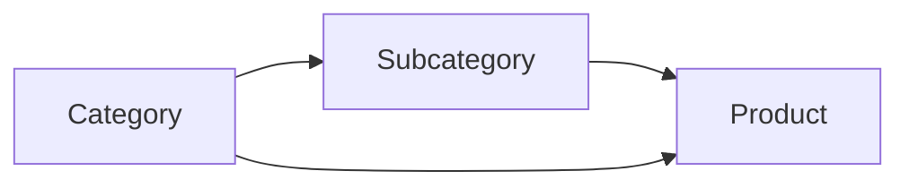
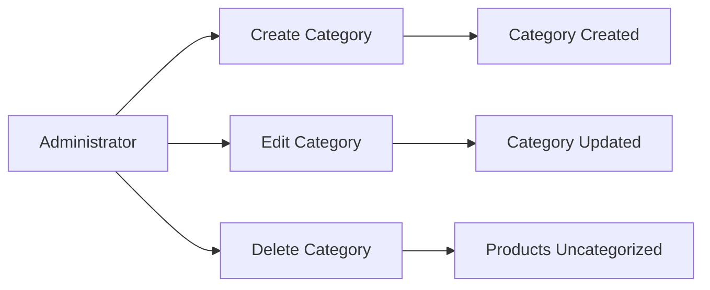
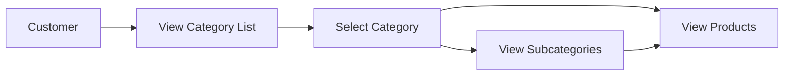
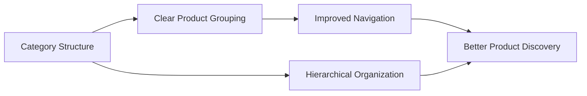
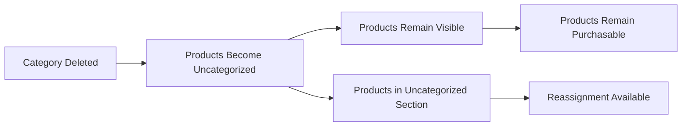
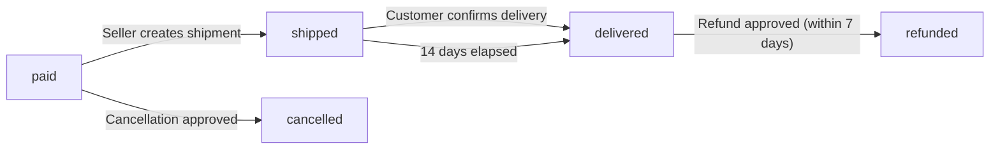
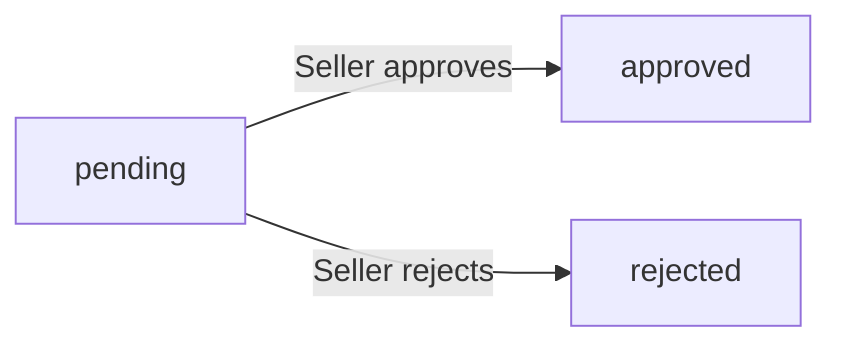
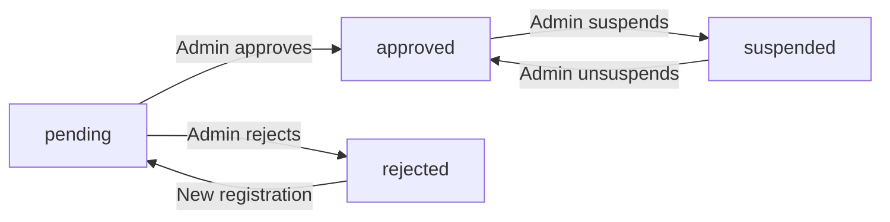

**shoppingMall — Business concepts, relationships, and states from user perspective**

Business concepts, relationships, and states from user perspective

# Domain Concepts

Describe what each concept means to users and why it exists.

## User Concept

A User is the fundamental identity on the shopping mall platform. All platform interactions require user authentication through email and password. Users can operate as customers browsing and purchasing products, sellers managing their shops and products, or administrators overseeing platform operations. Each user has a unique email address that serves as their login credential. Password security is enforced for all user accounts. Users can change their password at any time. Account deletion is possible for customers and sellers, with different rules applying to each role. When accounts are deleted, certain data is preserved for legal and business purposes. The platform does not allow guest browsing or purchasing without registration.

### User Authentication and Registration

THE system SHALL require all users to authenticate with email and password before accessing any platform features.

THE system SHALL not allow guest browsing or any platform usage without user registration.

WHEN a user registers, THE system SHALL require a unique email address that has not been used by any existing user.

WHEN a user registers, THE system SHALL require a password that meets security requirements.

WHEN a user attempts to log in, THE system SHALL validate the email and password combination.

IF the email address does not exist in the system, THE system SHALL reject the login attempt.

IF the password is incorrect, THE system SHALL reject the login attempt.

WHEN a user successfully logs in, THE system SHALL create an authenticated session.

WHEN a user's session expires, THE system SHALL require re-authentication.

IF a user account is banned, THE system SHALL prevent login and display an appropriate message.

IF a user account is deleted, THE system SHALL prevent login with that email address.

THE system SHALL allow users to change their password while authenticated.

### User Roles and Identity

THE system SHALL support three user roles: customer, seller, and administrator.

THE system SHALL allow a user to operate as a customer by default upon registration.

THE system SHALL allow a user to register as a seller by submitting a seller approval request.

THE system SHALL allow a user to request administrator privileges by submitting an admin promotion request.

WHEN a seller registration is approved, THE system SHALL grant seller role to the user.

WHEN an admin promotion request is approved, THE system SHALL grant administrator role to the user.

THE system SHALL allow users with multiple roles to access features appropriate to each role.

THE system SHALL maintain a single user identity across all roles.

THE system SHALL associate all user activities with the user's unique identity.

WHEN a user's role changes, THE system SHALL preserve the user's existing data and history.

THE system SHALL allow administrators to view all user accounts regardless of role.

THE system SHALL allow super administrators to promote regular administrators to super administrator status.

### Account Security and Password Management

THE system SHALL allow authenticated users to change their password at any time.

WHEN a user changes their password, THE system SHALL require the current password for verification.

WHEN a user changes their password, THE system SHALL invalidate all existing sessions for that user.

WHEN a user changes their password, THE system SHALL require re-authentication for subsequent actions.

IF a user forgets their password, THE system SHALL provide a password recovery mechanism.

THE system SHALL enforce password security requirements for all password changes.

WHEN a user account is banned, THE system SHALL prevent the user from changing their password.

THE system SHALL allow administrators to reset passwords for user accounts when necessary.

WHEN a seller account is suspended, THE system SHALL prevent password changes until the suspension is lifted.

THE system SHALL log all password change activities for security auditing purposes.

### Account Deletion and Data Retention

THE system SHALL allow customers to delete their account at any time.

THE system SHALL allow sellers to delete their account only when no pending orders exist.

THE system SHALL allow sellers to delete their account only when no pending cancellation or refund requests exist.

WHEN a customer deletes their account, THE system SHALL delete their profile information.

WHEN a customer deletes their account, THE system SHALL preserve their order history for legal and business purposes.

WHEN a customer deletes their account, THE system SHALL preserve their reviews but display them as "deleted user".

WHEN a seller deletes their account, THE system SHALL remove their products from all listings.

WHEN a seller deletes their account, THE system SHALL preserve their order history and snapshots.

WHEN a seller deletes their account, THE system SHALL preserve their shop name in past order records.

IF a user attempts to delete their account with pending obligations, THE system SHALL display the blocking conditions.

THE system SHALL prevent deleted users from logging in with their previous credentials.

THE system SHALL preserve all snapshots even after account deletion for dispute resolution purposes.

## CustomerProfile Concept

A CustomerProfile contains personal information for users who shop on the platform. Each customer has a display name that appears publicly and a phone number for contact purposes. Customers can edit their display name and phone number at any time. The profile information is separate from the user's authentication credentials. Display names are visible to sellers and other platform users. Phone numbers may be used for order notifications and delivery coordination. When a customer deletes their account, their profile information is removed. However, their order history and reviews are preserved with anonymized display names showing as deleted user. The profile enables personalized shopping experiences and communication.

### Customer Display Name Management

THE system SHALL require each customer to have a display name.

THE system SHALL allow customers to set their own display name during profile setup.

THE system SHALL allow customers to change their display name at any time.

THE system SHALL display the customer's display name to sellers who fulfill their orders.

THE system SHALL display the customer's display name to other customers viewing product reviews.

THE system SHALL use the display name for personalized shopping experiences.

IF the display name is empty, THE system SHALL prevent the profile update.

IF the display name contains prohibited characters, THE system SHALL reject the update.

### Customer Phone Number Management

THE system SHALL allow customers to register a phone number.

THE system SHALL allow customers to update their phone number at any time.

THE system SHALL use the customer's phone number for order notifications.

THE system SHALL use the customer's phone number for delivery coordination.

THE system SHALL allow customers to remove their phone number.

IF the phone number format is invalid, THE system SHALL reject the update.

IF the phone number is required for a specific operation, THE system SHALL prompt the customer to provide it.

### Profile Editing Process

WHEN a customer edits their profile, THE system SHALL update the display name immediately.

WHEN a customer edits their profile, THE system SHALL update the phone number immediately.

THE system SHALL validate that the display name is not empty before saving.

THE system SHALL validate phone number format before saving.

THE system SHALL allow customers to edit both display name and phone number in a single operation.

THE system SHALL allow customers to edit display name and phone number separately.

THE system SHALL confirm successful profile updates to the customer.

### Public Customer Information Visibility

THE system SHALL make customer display names visible to sellers.

THE system SHALL make customer display names visible in product reviews.

THE system SHALL NOT display customer phone numbers publicly.

THE system SHALL use customer display names for personalized recommendations.

THE system SHALL display customer display names in order history.

THE system SHALL use customer display names for seller-customer communication.

### Account Deletion and Profile Retention

WHEN a customer deletes their account, THE system SHALL remove their profile information.

WHEN a customer deletes their account, THE system SHALL preserve their order history.

WHEN a customer deletes their account, THE system SHALL preserve their reviews.

WHEN a customer deletes their account, THE system SHALL anonymize their display name in preserved data.

THE system SHALL maintain the association between deleted users and their orders.

THE system SHALL maintain the association between deleted users and their reviews.

THE system SHALL ensure deleted profile information cannot be recovered.

### Anonymized Deleted User Representation

THE system SHALL display deleted users as "deleted user" in reviews.

THE system SHALL display deleted users as "deleted user" in order history.

THE system SHALL maintain the association between deleted users and their orders.

THE system SHALL maintain the association between deleted users and their reviews.

THE system SHALL preserve the rating from deleted user reviews for average calculation.

THE system SHALL preserve the review text from deleted users for dispute resolution.

THE system SHALL prevent deleted users from being re-identified through their preserved data.

## SellerProfile Concept

A SellerProfile represents a shop's public identity on the platform. Each seller has a shop name, shop description, and logo image that customers can view. Sellers can edit their shop name, description, and logo at any time. Every edit creates a snapshot preserving the previous state for dispute resolution. The shop name appears on all products and in order history. Shop descriptions help customers understand what the seller offers. Logo images provide visual brand identity for the shop. Customers can view seller profiles when browsing products. When a seller deletes their account, their shop name in past orders is preserved. Seller profiles require administrator approval before becoming active.

### Shop Name and Description

THE system SHALL require each seller to have a shop name.

THE system SHALL allow sellers to provide a shop description.

THE system SHALL display shop names on all products from that seller.

THE system SHALL display shop names in order history for past purchases.

IF a seller attempts to save a profile without a shop name, THE system SHALL reject the submission.

THE system SHALL allow shop descriptions to help customers understand what the seller offers.

THE system SHALL preserve shop names in order history even after seller account deletion.

THE system SHALL preserve shop names in order history even after seller profile edits.

WHEN a seller updates their shop name, THE system SHALL continue displaying the old name in existing order history.

WHEN a seller updates their shop description, THE system SHALL continue displaying the old description in existing order history.

### Seller Logo Image

THE system SHALL allow sellers to upload a logo image for their shop.

THE system SHALL display the logo image on the seller's profile page.

THE system SHALL display the logo image on product listings.

THE system SHALL preserve the logo image in order history snapshots.

Sellers can update their logo image at any time.

IF a seller deletes their logo image, THE system SHALL remove it from display.

THE system SHALL preserve the logo image at the time of purchase in order history.

WHEN a seller updates their logo image, THE system SHALL continue displaying the old logo in existing order history.

THE system SHALL allow logo images to provide visual brand identity for the shop.

Customers can view seller logo images when browsing products.

### Profile Editing and Snapshots

THE system SHALL allow sellers to edit their shop name at any time.

THE system SHALL allow sellers to edit their shop description at any time.

THE system SHALL allow sellers to edit their logo image at any time.

WHEN a seller edits their profile, THE system SHALL create a snapshot preserving the previous state.

THE system SHALL preserve all previous profile states through snapshots.

Sellers can view their profile edit history through snapshots.

Administrators can view seller profile snapshots for dispute resolution.

Snapshots record when the change was made.

Snapshots record what was changed.

Snapshots record the values before and after the change.

Snapshots are immutable and cannot be deleted.

IF a seller attempts to delete a snapshot, THE system SHALL reject the request.

THE system SHALL preserve snapshots even after seller account deletion.

### Public Shop Information

THE system SHALL make seller profiles publicly viewable to customers.

THE system SHALL display shop name on seller profile pages.

THE system SHALL display shop description on seller profile pages.

THE system SHALL display logo image on seller profile pages.

THE system SHALL link seller profiles from product detail pages.

THE system SHALL allow customers to browse products by seller.

Customers can view seller profiles when browsing products.

THE system SHALL display seller shop name on all products.

THE system SHALL display seller logo on product listings.

THE system SHALL allow customers to access seller profiles from product pages.

THE system SHALL display public shop information to all users on the platform.

### Administrator Approval Requirement

Seller accounts require administrator approval before they can sell.

THE system SHALL prevent sellers from creating products before approval.

THE system SHALL display approval status to sellers.

Sellers can view their approval status (pending, approved, rejected).

IF a seller is rejected, THE system SHALL display the rejection reason.

Rejected sellers can submit a new registration request.

WHEN a seller's approval status is pending, THE system SHALL hide their products from customers.

WHEN a seller's approval status is approved, THE system SHALL make their products visible to customers.

WHEN a seller's approval status is rejected, THE system SHALL prevent product creation.

WHEN a seller's approval status is suspended, THE system SHALL hide their products from search and category listings.

WHEN a seller is suspended, THE system SHALL prevent them from creating new products.

WHEN a seller is suspended, THE system SHALL prevent them from editing existing products.

### Order History Preservation

THE system SHALL preserve seller shop information at the time of purchase.

THE system SHALL display preserved shop names in order history.

THE system SHALL preserve shop information even after seller account deletion.

THE system SHALL preserve shop information even after seller profile edits.

WHEN an order is created, THE system SHALL capture the seller's shop name at that moment.

WHEN an order is created, THE system SHALL capture the seller's logo image at that moment.

THE system SHALL display the captured shop name in order details.

THE system SHALL display the captured logo image in order details.

IF a seller deletes their account, THE system SHALL continue displaying their shop name in past orders.

IF a seller edits their shop name, THE system SHALL continue displaying the old name in past orders.

THE system SHALL preserve shop information for legal and dispute resolution purposes.

Order history and snapshots are preserved when sellers delete their accounts.

### Customer Shop Viewing

Customers can view seller profiles when browsing products.

THE system SHALL allow customers to access seller profiles from product pages.

THE system SHALL display seller information on product listings.

THE system SHALL show seller shop name on all products.

THE system SHALL link to seller profiles from product detail pages.

WHEN a customer views a product, THE system SHALL display the seller's shop name.

WHEN a customer clicks on a seller's shop name, THE system SHALL navigate to the seller's profile page.

THE system SHALL display the seller's shop description on the profile page.

THE system SHALL display the seller's logo image on the profile page.

THE system SHALL allow customers to view all products from a specific seller.

Customers can view seller profiles to understand what the seller offers.

### Seller Brand Identity

THE system SHALL allow sellers to establish brand identity through their profile.

THE system SHALL use shop names to provide unique shop identification.

THE system SHALL use logo images to provide visual brand identity for the shop.

THE system SHALL use shop descriptions to communicate seller offerings.

THE system SHALL display consistent brand identity across all seller products.

THE system SHALL preserve brand identity in order history for customer reference.

Sellers can customize their shop name to reflect their brand.

Sellers can customize their shop description to reflect their brand.

Sellers can upload logo images to reflect their brand.

THE system SHALL maintain brand identity consistency even after profile edits through snapshots.

## AdministratorProfile Concept

An AdministratorProfile grants platform management privileges to users. There are two grades: regular administrator and super administrator. Any user can submit a request to become an administrator with a reason. Super administrators review and approve or reject these requests. When approved, the user becomes a regular administrator. Super administrators can promote regular administrators to super administrator status. They can also demote other super administrators to regular administrator grade. Super administrators cannot demote themselves from their position. Administrators manage sellers, categories, products, orders, and user accounts. Their actions are logged for accountability and audit purposes.

### Administrator Grades and Roles

### Administrator Grade Levels

1. WHEN a user becomes an administrator, THE system SHALL assign them a grade of either "regular" or "super".
2. THE system SHALL support exactly two administrator grades: regular administrator and super administrator.
3. A user with regular administrator grade SHALL have platform management access but CANNOT promote or demote other administrators.
4. A user with super administrator grade SHALL have full platform management access including promotion and demotion capabilities.
5. THE system SHALL prevent super administrators from demoting themselves.
6. THE system SHALL allow super administrators to promote regular administrators to super administrator status.
7. THE system SHALL allow super administrators to demote other super administrators to regular administrator status.

### Administrator Identity

1. THE system SHALL associate an AdministratorProfile with a User account when they are granted administrator privileges.
2. THE system SHALL allow a single user to have only one administrator grade at a time.
3. THE system SHALL preserve the grade assignment until explicitly changed by a super administrator.
4. THE system SHALL log all grade changes for audit purposes.

### Administrator Account State

1. WHEN an administrator account is created, THE system SHALL set the initial grade based on the promotion request approval.
2. THE system SHALL prevent a user from having conflicting administrator grades simultaneously.
3. THE system SHALL maintain an immutable record of all grade transitions for compliance.
4. THE system SHALL require super administrator approval for all grade changes.
5. THE system SHALL track the timestamp of when each administrator was granted their current grade.

### Administrator Promotion Requests

### Promotion Request Submission

1. WHEN a user submits a request to become an administrator, THE system SHALL require a reason text field.
2. THE system SHALL set the initial status of all promotion requests to "pending" upon submission.
3. THE system SHALL associate each promotion request with the requesting user's account.
4. THE system SHALL prevent duplicate pending promotion requests from the same user.
5. THE system SHALL preserve the original reason text for audit purposes.

### Promotion Request Review Process

1. WHEN a super administrator reviews a promotion request, THE system SHALL display the request details including the reason provided.
2. THE system SHALL allow only super administrators to approve or reject promotion requests.
3. THE system SHALL prevent regular administrators from reviewing promotion requests.
4. THE system SHALL require a decision (approve or reject) for each pending request.
5. THE system SHALL record the timestamp when a decision is made.

### Promotion Request Outcomes

1. IF a promotion request is approved, THE system SHALL grant the user regular administrator status.
2. IF a promotion request is rejected, THE system SHALL notify the requesting user.
3. WHEN a request is rejected, THE system SHALL allow the user to submit a new request.
4. THE system SHALL preserve the history of all promotion requests for audit purposes.
5. THE system SHALL prevent a user from having multiple active promotion requests simultaneously.

### Super Administrator Privileges

### Super Administrator Identification

1. THE system SHALL identify users with super administrator grade as having elevated privileges.
2. THE system SHALL allow super administrators to view all platform data without restriction.
3. THE system SHALL allow super administrators to modify any data as needed for platform integrity.
4. THE system SHALL log all super administrator actions for security auditing.
5. THE system SHALL prevent regular administrators from accessing super administrator functions.

### Super Administrator Management Capabilities

1. WHEN a super administrator manages other administrators, THE system SHALL allow grade promotions and demotions.
2. THE system SHALL allow super administrators to view all promotion requests in the system.
3. THE system SHALL allow super administrators to approve or reject any pending promotion request.
4. THE system SHALL prevent super administrators from demoting themselves.
5. THE system SHALL require super administrator confirmation before executing high-privilege operations.

### Super Administrator Limitations

1. THE system SHALL prevent super administrators from demoting themselves to regular administrator.
2. THE system SHALL require at least one active super administrator at all times.
3. THE system SHALL alert if an action would leave the platform without a super administrator.
4. THE system SHALL log all super administrator actions with full audit trail.
5. THE system SHALL require super administrators to confirm their identity before sensitive operations.

### Demotion Capabilities

### Demotion Authority

1. WHEN a super administrator demotes another super administrator, THE system SHALL require explicit confirmation.
2. THE system SHALL prevent a super administrator from demoting themselves.
3. THE system SHALL allow super administrators to demote other super administrators to regular administrator status.
4. THE system SHALL log all demotion actions with full audit trail.
5. THE system SHALL notify the affected user when their grade is changed.

### Demotion Constraints

1. THE system SHALL prevent the last remaining super administrator from demoting themselves.
2. THE system SHALL require at least one active super administrator at all times.
3. WHEN a demotion occurs, THE system SHALL preserve the user's access until the change is confirmed.
4. THE system SHALL create an immutable record of the demotion action.
5. THE system SHALL allow reversal of demotion only by another super administrator.

### Platform Management Access

### Administrator Access Control

1. THE system SHALL grant administrators access to platform management functions based on their grade.
2. THE system SHALL restrict regular administrators from accessing super administrator functions.
3. THE system SHALL allow administrators to manage seller accounts and their approval status.
4. THE system SHALL allow administrators to manage categories and their structure.
5. THE system SHALL allow administrators to oversee all products on the platform.

### Data Access Levels

1. WHEN an administrator views platform data, THE system SHALL respect their grade-based permissions.
2. THE system SHALL allow super administrators to view all data without restriction.
3. THE system SHALL allow regular administrators to view data within their scope of responsibility.
4. THE system SHALL log all data access by administrators for audit purposes.
5. THE system SHALL prevent unauthorized users from accessing administrator-only features.

### Action Logging

1. THE system SHALL log all administrator actions with timestamp and user identification.
2. THE system SHALL preserve all action logs for compliance and dispute resolution.
3. THE system SHALL make logs viewable by super administrators at all times.
4. THE system SHALL prevent deletion of action logs.
5. THE system SHALL associate each log entry with the administrator who performed the action.

### Seller Approval Authority

### Seller Registration Review

1. WHEN a seller submits a registration request, THE system SHALL set the initial status to "pending".
2. THE system SHALL allow administrators to view all pending seller approval requests.
3. THE system SHALL allow administrators to approve or reject seller registration requests.
4. WHEN an administrator rejects a seller request, THE system SHALL require a rejection reason.
5. THE system SHALL notify sellers of the approval decision and any rejection reason.

### Seller Account Management

1. THE system SHALL allow administrators to suspend seller accounts for policy violations.
2. WHEN a seller is suspended, THE system SHALL hide their products from public listings.
3. THE system SHALL prevent suspended sellers from creating or editing products.
4. THE system SHALL allow suspended sellers to continue processing existing orders.
5. THE system SHALL allow administrators to unsuspend seller accounts when appropriate.

### Rejection and Re-application Process

1. WHEN a seller's request is rejected, THE system SHALL display the rejection reason to the seller.
2. THE system SHALL allow rejected sellers to submit a new registration request.
3. THE system SHALL preserve the history of all approval and rejection actions.
4. THE system SHALL notify administrators when a previously rejected seller re-applies.
5. THE system SHALL prevent auto-approval of sellers with pending disputes or violations.

### User Account Management

### Customer Account Oversight

1. THE system SHALL allow administrators to view all customer accounts on the platform.
2. THE system SHALL allow administrators to ban customers who violate policies.
3. WHEN a customer is banned, THE system SHALL prevent them from logging in.
4. THE system SHALL allow administrators to unban customers when appropriate.
5. THE system SHALL log all ban and unban actions with timestamps.

### Seller Account Oversight

1. THE system SHALL allow administrators to view all seller accounts on the platform.
2. THE system SHALL allow administrators to ban sellers for policy violations.
3. WHEN a seller is banned, THE system SHALL prevent them from logging in.
4. THE system SHALL preserve existing orders even when a seller is banned.
5. THE system SHALL allow administrators to unban sellers when appropriate.

### Account State Transitions

1. THE system SHALL track when accounts transition between active, banned, and unbanned states.
2. THE system SHALL prevent banned users from accessing restricted features.
3. THE system SHALL notify users when their account state changes.
4. THE system SHALL preserve transaction history regardless of account state.
5. THE system SHALL allow administrators to view the full audit trail for any account.

## Address Concept

An Address is a shipping destination saved by customers for order delivery. Customers can add multiple shipping addresses to their account. Each address includes recipient name, phone number, street address, city, state or province, postal code, and country. Customers can edit their saved addresses at any time. They can also delete addresses they no longer need. One address can be set as the default for quick checkout. During checkout, customers select which address to use for shipping. The selected address is captured in the order and cannot be changed after placement. Addresses enable convenient repeat purchases and multiple delivery locations.

### Multiple Shipping Addresses

THE system SHALL allow customers to add multiple shipping addresses to their account.

THE system SHALL store each address independently with its own identifier.

THE system SHALL display all saved addresses in the customer's address management interface.

THE system SHALL allow customers to have at least one address saved before checkout.

WHEN a customer adds a new address, THE system SHALL validate that all required fields are provided.

THE system SHALL not limit the maximum number of addresses a customer can save.

WHEN a customer views their saved addresses, THE system SHALL show the complete list with all address details.

THE system SHALL allow customers to distinguish between different saved addresses by recipient name and location.

### Address Recipient Information

THE system SHALL require the following fields for each address: recipient name, phone number, street address, city, state/province, postal code, and country.

THE system SHALL validate that the recipient name is not empty when creating or editing an address.

THE system SHALL validate that the phone number follows a valid format for the specified country.

THE system SHALL validate that the street address is not empty when creating or editing an address.

THE system SHALL validate that the city is not empty when creating or editing an address.

THE system SHALL validate that the postal code is not empty when creating or editing an address.

THE system SHALL validate that the country is selected from a valid list of countries.

WHEN a customer provides address information, THE system SHALL store all fields for future use.

THE system SHALL display all recipient information fields when showing address details to customers.

THE system SHALL use the recipient phone number for delivery notifications when applicable.

### Default Address Selection

THE system SHALL allow customers to designate one address as their default shipping address.

THE system SHALL automatically use the default address during checkout when no other address is selected.

THE system SHALL visually indicate which address is set as the default in the address list.

WHEN a customer sets a new default address, THE system SHALL remove the default designation from the previously selected address.

THE system SHALL require that exactly one address be marked as default at any time.

IF a customer deletes their default address, THE system SHALL require them to select a new default from remaining addresses.

WHEN a customer has only one address saved, THE system SHALL automatically mark it as the default.

THE system SHALL allow customers to change their default address at any time.

THE system SHALL persist the default address selection across sessions.

### Address Editing and Deletion

THE system SHALL allow customers to edit any of their saved addresses at any time.

WHEN a customer edits an address, THE system SHALL validate all modified fields before saving.

THE system SHALL preserve all unchanged fields when a customer edits specific address fields.

THE system SHALL update the address immediately after successful validation and saving.

THE system SHALL allow customers to delete any address except when it is the only saved address.

IF a customer attempts to delete their only address, THE system SHALL prevent the deletion and display an error message.

WHEN a customer deletes an address, THE system SHALL permanently remove it from their saved addresses.

THE system SHALL allow customers to edit an address that is currently set as default.

WHEN the default address is edited, THE system SHALL maintain its default status after the update.

THE system SHALL not allow deletion of addresses that are currently associated with pending orders.

### Checkout Address Selection

THE system SHALL display all customer's saved addresses during the checkout process.

THE system SHALL allow customers to select any saved address for shipping during checkout.

THE system SHALL show the default address as the pre-selected option in the checkout address selection.

WHEN a customer selects an address during checkout, THE system SHALL display the complete address details for confirmation.

THE system SHALL allow customers to add a new address directly during checkout.

WHEN a customer adds a new address during checkout, THE system SHALL save it to their address list after successful order placement.

THE system SHALL require address selection before allowing customers to proceed with payment.

WHEN a customer selects an address, THE system SHALL use it as the shipping destination for the order.

### Immutable After Order Placement

WHEN an order is successfully placed, THE system SHALL capture the selected shipping address as part of the order record.

THE system SHALL not allow customers to modify the shipping address after order placement.

THE system SHALL preserve the exact address information at the time of order creation.

WHEN a customer views their order details, THE system SHALL display the shipping address as it was when the order was placed.

THE system SHALL not update order addresses even if the customer later edits or deletes the saved address.

THE system SHALL maintain address information for all orders indefinitely for record-keeping purposes.

WHEN a seller processes an order, THE system SHALL provide the immutable shipping address from the order record.

THE system SHALL use the order's captured address for all shipping and delivery operations.

### Delivery Location Management

THE system SHALL enable customers to manage different delivery locations for different recipients.

THE system SHALL allow customers to save addresses for family members, friends, or business locations.

WHEN a customer adds an address for another recipient, THE system SHALL store the recipient's name and contact information.

THE system SHALL allow customers to organize addresses by recipient type (home, work, gift, etc.).

THE system SHALL display all delivery locations in an organized manner for easy selection.

WHEN a customer needs to ship to a new location, THE system SHALL allow quick address addition.

THE system SHALL support international addresses with country-specific field formats.

THE system SHALL validate address completeness before allowing it to be used for shipping.

### Convenient Repeat Purchases

THE system SHALL enable customers to quickly select previously used addresses for repeat purchases.

WHEN a customer returns to checkout, THE system SHALL display their saved addresses for immediate selection.

THE system SHALL remember the customer's default address preference across all sessions.

WHEN a customer frequently ships to the same address, THE system SHALL make that address easily accessible.

THE system SHALL allow customers to reorder their address list to prioritize frequently used addresses.

WHEN a customer places multiple orders, THE system SHALL streamline the address selection process.

THE system SHALL reduce checkout time by pre-populating address information from saved addresses.

THE system SHALL allow customers to quickly switch between different saved addresses during checkout.

## Category Concept

A Category organizes products into logical groups for easier browsing. Categories can have one level of subcategories for more specific organization. Each category has a name and description that help customers understand its contents. Only administrators can create, edit, or delete categories. Customers can browse the complete list of all available categories. When viewing a category, customers see all products within it. Categories can be deleted, which moves products to an uncategorized state. Category structure helps customers find products by type or purpose. The hierarchical organization improves product discoverability.

### Category Structure and Hierarchy

**Purpose**: Categories organize products into logical groups to help customers find what they're looking for.

**EARS Requirements**:

1. THE system SHALL organize all products into categories for structured browsing.
2. THE system SHALL allow categories to have one level of subcategories for more specific product grouping.
3. THE system SHALL prevent categories from having nested subcategories beyond one level.
4. THE system SHALL require each product to be assigned to exactly one category or subcategory.
5. THE system SHALL allow products to exist without category assignment when their category is deleted.
6. THE system SHALL display products from all categories and subcategories in category browsing views.
7. THE system SHALL group products hierarchically by their assigned category and subcategory.
8. THE system SHALL maintain category structure independently of product inventory status.
9. THE system SHALL preserve category assignments when products are edited or updated.
10. THE system SHALL allow the same product to appear in multiple category views if organized hierarchically.

**Category Hierarchy Diagram**:

**Key Points**:
- Categories provide the primary organizational structure for product discovery
- One level of subcategories enables more granular product classification
- Products can be uncategorized if their category is deleted
- Category structure is independent of product availability or stock status

### Category Management by Administrators

**Purpose**: Only administrators can create, edit, and delete categories to maintain consistent product organization.

**EARS Requirements**:

1. WHEN an administrator creates a category, THE system SHALL require a category name.
2. WHEN an administrator creates a category, THE system SHALL allow an optional description.
3. WHEN an administrator creates a subcategory, THE system SHALL require assignment to a parent category.
4. WHEN an administrator edits a category name, THE system SHALL preserve the category identity.
5. WHEN an administrator edits a category description, THE system SHALL preserve the category identity.
6. WHEN an administrator deletes a category, THE system SHALL move all products in that category to uncategorized state.
7. WHEN an administrator deletes a category, THE system SHALL first delete all subcategories of that category.
8. IF a customer attempts to create a category, THE system SHALL reject the request.
9. IF a customer attempts to edit a category, THE system SHALL reject the request.
10. IF a customer attempts to delete a category, THE system SHALL reject the request.
11. IF a seller attempts to create a category, THE system SHALL reject the request.
12. IF a seller attempts to edit a category, THE system SHALL reject the request.
13. IF a seller attempts to delete a category, THE system SHALL reject the request.
14. THE system SHALL prevent deletion of categories that have active subcategories without first deleting subcategories.
15. THE system SHALL maintain category structure even when no products are assigned to a category.

**Management Flow**:

**Key Points**:
- Category management is exclusively an administrator function
- Category names and descriptions can be edited without affecting product assignments
- Deleting a category moves products to uncategorized state, not deletion
- Subcategories must be deleted before their parent category

### Customer Category Browsing

**Purpose**: Customers can browse all available categories and subcategories to discover products.

**EARS Requirements**:

1. WHEN a customer browses categories, THE system SHALL display all available categories.
2. WHEN a customer browses categories, THE system SHALL display all available subcategories.
3. WHEN a customer views a category, THE system SHALL show the category name.
4. WHEN a customer views a category, THE system SHALL show the category description if available.
5. WHEN a customer views a category, THE system SHALL display all products assigned to that category.
6. WHEN a customer views a subcategory, THE system SHALL display all products assigned to that subcategory.
7. WHEN a customer views a category, THE system SHALL show products from its subcategories.
8. THE system SHALL allow customers to navigate from a category to its subcategories.
9. THE system SHALL allow customers to navigate from a subcategory back to its parent category.
10. THE system SHALL display uncategorized products separately from categorized products.
11. THE system SHALL hide categories with no products and no subcategories from customer browsing.
12. THE system SHALL update category browsing views when products are added or removed.
13. THE system SHALL update category browsing views when categories are created or deleted.
14. THE system SHALL maintain consistent category ordering across customer sessions.
15. THE system SHALL allow customers to filter products within a category view.

**Browsing Flow**:

**Key Points**:
- All customers can browse the complete category structure
- Category names and descriptions help customers understand product groupings
- Products in subcategories are visible when browsing parent categories
- Uncategorized products are displayed separately
- Empty categories without products or subcategories are hidden

### Category-Based Product Discoverability

**Purpose**: Categories improve product discoverability through hierarchical organization and clear naming.

**EARS Requirements**:

1. THE system SHALL use category names to help customers identify product types.
2. THE system SHALL use category descriptions to explain what products belong in each category.
3. THE system SHALL organize products hierarchically to improve navigation efficiency.
4. THE system SHALL group related products together in the same category or subcategory.
5. THE system SHALL enable customers to find products by browsing category structure.
6. THE system SHALL enable customers to find products by selecting specific subcategories.
7. THE system SHALL display category information prominently in product listings.
8. THE system SHALL allow customers to understand product relationships through category grouping.
9. THE system SHALL maintain category consistency across all customer browsing experiences.
10. THE system SHALL update product discoverability when category structure changes.
11. THE system SHALL preserve product discoverability even when products are uncategorized.
12. THE system SHALL enable customers to browse by category as an alternative to search.
13. THE system SHALL display category hierarchy in a clear, navigable format.
14. THE system SHALL prevent duplicate category names at the same hierarchy level.
15. THE system SHALL ensure each product appears in exactly one category location.

**Discoverability Benefits**:

**Key Points**:
- Category names and descriptions guide customer understanding
- Hierarchical structure enables efficient product discovery
- Products are grouped logically by type or purpose
- Category browsing provides an alternative to search functionality
- Clear organization improves overall customer shopping experience

### Uncategorized Products Handling

**Purpose**: When categories are deleted, products move to an uncategorized state rather than being deleted.

**EARS Requirements**:

1. WHEN an administrator deletes a category, THE system SHALL move all products in that category to uncategorized state.
2. WHEN an administrator deletes a category, THE system SHALL preserve all product data.
3. WHEN an administrator deletes a category, THE system SHALL preserve all product variants.
4. WHEN an administrator deletes a category, THE system SHALL preserve all product images.
5. WHEN an administrator deletes a category, THE system SHALL preserve all product inventory.
6. WHEN a product is uncategorized, THE system SHALL still allow customers to view the product.
7. WHEN a product is uncategorized, THE system SHALL still allow customers to purchase the product.
8. WHEN a product is uncategorized, THE system SHALL display it in an uncategorized products section.
9. WHEN an administrator creates a new category, THE system SHALL allow reassignment of uncategorized products.
10. THE system SHALL maintain uncategorized products in search results.
11. THE system SHALL maintain uncategorized products in seller product lists.
12. THE system SHALL allow administrators to view all uncategorized products.
13. THE system SHALL allow sellers to reassign uncategorized products to new categories.
14. THE system SHALL track when products become uncategorized due to category deletion.
15. THE system SHALL prevent accidental deletion of products during category deletion.

**Uncategorized Product Flow**:

**Key Points**:
- Category deletion does not delete products
- Uncategorized products remain fully functional
- Products can be reassigned to new categories
- Uncategorized products are still discoverable through search
- Product data integrity is maintained regardless of category status

## Product Concept

A Product is a sellable item listed by a seller on the platform. Each product has a required name, description, category, and base price. Products belong to the seller who created them and can only be edited by that seller. Every product edit creates a snapshot preserving the previous state. Sellers can delete products only if there are no pending orders or requests. Deleted products disappear from search and category listings. Products can have multiple images and variants. Customers browse products through search, categories, or seller profiles. Product information includes seller details and customer reviews.

### Product Creation and Ownership

WHEN a seller creates a product, THE system SHALL require a product name.

WHEN a seller creates a product, THE system SHALL require a product description.

WHEN a seller creates a product, THE system SHALL require category assignment.

WHEN a seller creates a product, THE system SHALL require a base price.

WHEN a seller creates a product, THE system SHALL associate the product with the creating seller.

THE system SHALL allow only the creating seller to edit their own product.

THE system SHALL prevent sellers from editing products created by other sellers.

THE system SHALL prevent customers from creating products.

THE system SHALL prevent administrators from creating products on behalf of sellers.

A product belongs exclusively to the seller who created it.

A seller can create multiple products on the platform.

### Product Core Information

THE system SHALL require each product to have a unique name.

THE system SHALL require each product to have a description.

THE system SHALL require each product to be assigned to a category.

THE system SHALL allow products to be assigned to subcategories.

THE system SHALL require each product to have a base price.

THE system SHALL allow the base price to be overridden by variant-specific prices.

THE system SHALL display the product name to all users.

THE system SHALL display the product description to all users.

THE system SHALL display the product category to all users.

THE system SHALL display the base price to all users.

THE system SHALL display the seller's shop name with the product.

THE system SHALL link the seller's shop name to the seller profile page.

### Product Editing and Version History

WHEN a seller edits a product, THE system SHALL create a snapshot of the previous state.

WHEN a seller edits a product, THE system SHALL preserve all previous field values in the snapshot.

WHEN a seller edits a product, THE system SHALL record the timestamp of the change.

WHEN a seller edits a product, THE system SHALL include all product fields in the snapshot.

WHEN a seller edits a product, THE system SHALL include variant snapshots with the product snapshot.

THE system SHALL allow sellers to view snapshots of their own products.

THE system SHALL allow administrators to view snapshots of any product.

THE system SHALL prevent customers from viewing product snapshots.

THE system SHALL prevent sellers from deleting product snapshots.

THE system SHALL preserve snapshots even after product deletion.

THE system SHALL allow snapshots to be used for dispute resolution.

### Product Deletion Policy

WHEN a seller deletes a product, THE system SHALL check for pending order items.

IF a product has order items with paid status, THE system SHALL prevent deletion.

IF a product has order items with shipped status, THE system SHALL prevent deletion.

IF a product has pending cancellation requests, THE system SHALL prevent deletion.

IF a product has pending refund requests, THE system SHALL prevent deletion.

WHEN a seller deletes a product, THE system SHALL also delete all associated variants.

WHEN a seller deletes a product, THE system SHALL also delete all inventory records for the variants.

WHEN a seller deletes a product, THE system SHALL remove it from search results.

WHEN a seller deletes a product, THE system SHALL remove it from category listings.

WHEN a seller deletes a product, THE system SHALL preserve all product snapshots.

WHEN a seller deletes a product, THE system SHALL preserve order history containing the product.

THE system SHALL prevent customers from deleting products.

THE system SHALL allow administrators to delete any product for policy violations.

### Product Visibility and Discovery

THE system SHALL allow customers to browse all products from all sellers.

THE system SHALL allow customers to search products by name.

THE system SHALL allow customers to filter products by category.

THE system SHALL allow customers to filter products by price range.

THE system SHALL allow customers to filter products by stock availability.

THE system SHALL allow customers to sort products by newest first.

THE system SHALL allow customers to sort products by price low to high.

THE system SHALL allow customers to sort products by price high to low.

THE system SHALL display product main image in search results.

THE system SHALL display product name in search results.

THE system SHALL display product base price or price range in search results.

THE system SHALL display seller shop name in search results.

THE system SHALL display average rating in search results when reviews exist.

THE system SHALL paginate product search results.

THE system SHALL hide products from suspended sellers in search results.

THE system SHALL hide products from suspended sellers in category listings.

THE system SHALL mark products with no variants as unavailable.

THE system SHALL mark out-of-stock variants as unavailable.

## ProductImage Concept

A ProductImage is a visual representation of a product uploaded by sellers. Sellers can upload multiple images for each product to show different angles or details. Images can be reordered by the seller to control display sequence. The first image in the order serves as the main thumbnail shown in listings. Sellers can delete images from their products at any time. Image changes are included in product snapshots for historical tracking. Customers view all images on the product detail page. Images help customers make informed purchasing decisions. The main thumbnail appears in search results and category listings.

### Multiple Product Images

WHEN a seller creates or edits a product, THE system SHALL allow uploading multiple images for that product.

THE system SHALL associate all uploaded images with their respective product.

THE system SHALL store each image with a display order number to control presentation sequence.

WHEN a seller adds images to a product, THE system SHALL make all images visible on the product detail page.

THE system SHALL allow sellers to view all images currently associated with their product.

### Image Reordering

WHEN a seller reorders product images, THE system SHALL update the display sequence for all users.

THE system SHALL allow sellers to change the position of any image in the display order.

WHEN a seller moves an image to a different position, THE system SHALL adjust the display order of affected images.

THE system SHALL maintain the updated display order until the seller makes another change.

WHEN a customer views a product, THE system SHALL display images in the seller-defined order.

### Main Thumbnail Selection

THE system SHALL designate the first image in the display order as the main thumbnail image.

WHEN a seller changes the image display order, THE system SHALL automatically update which image serves as the main thumbnail.

THE system SHALL use the main thumbnail image in product search results.

THE system SHALL use the main thumbnail image in category listing pages.

WHEN a product has no images, THE system SHALL display a placeholder in listings.

IF the main thumbnail image is deleted, THE system SHALL automatically select the next image as the new main thumbnail.

### Image Deletion

WHEN a seller deletes a product image, THE system SHALL remove it from the product.

THE system SHALL allow sellers to delete any image associated with their product.

WHEN a seller deletes an image, THE system SHALL update the display order of remaining images.

IF the deleted image was the main thumbnail, THE system SHALL select the next image as the new main thumbnail.

THE system SHALL preserve deleted image information in product snapshots for historical tracking.

### Image Snapshot Tracking

WHEN a seller modifies product images, THE system SHALL include image changes in the product snapshot.

THE system SHALL record the complete set of images and their display order at the time of each product edit.

WHEN a product is edited, THE system SHALL capture all image URLs and their sequence in the snapshot.

THE system SHALL preserve image snapshot data even if images are later deleted.

WHEN a seller views product snapshots, THE system SHALL show the images that existed at each snapshot point.

### Customer Image Viewing

WHEN a customer views a product detail page, THE system SHALL display all product images.

THE system SHALL present images in the order defined by the seller.

WHEN a customer browses products, THE system SHALL allow viewing all available product images.

THE system SHALL display images clearly to help customers assess product appearance.

IF a product has no images, THE system SHALL indicate this to the customer.

### Listing Thumbnail Display

THE system SHALL display the main thumbnail image in product search results.

THE system SHALL display the main thumbnail image in category listing pages.

WHEN customers browse products, THE system SHALL use the main thumbnail for quick visual identification.

THE system SHALL ensure thumbnail images are appropriately sized for listing displays.

THE system SHALL load thumbnail images efficiently to support fast browsing.

## ProductVariant Concept

A ProductVariant represents a specific combination of options for a product. Variants are identified by unique SKU codes and option values like color or size. Each variant can have its own price that overrides the product base price. Variants have their own stock quantity managed through inventory records. Sellers can add, edit, or delete variants for their products. Every variant edit creates a snapshot for historical tracking. Variants can only be deleted if there are no pending orders or requests. A product needs at least one variant to be purchasable. Products without variants appear as unavailable in search results.

### Variant Identity and Options

WHEN a seller creates a product variant, THE system SHALL require a unique SKU code.

WHEN a seller creates a product variant, THE system SHALL require at least one option value (e.g., color, size).

WHEN a seller assigns option values to a variant, THE system SHALL allow multiple option-value pairs to define the combination.

WHEN a variant is displayed to customers, THE system SHALL show all option values that define this specific variant.

WHEN a customer views a product, THE system SHALL display all available variants with their respective option values.

IF a seller attempts to create a duplicate SKU code, THE system SHALL reject the request.

IF a variant's option values are edited, THE system SHALL preserve the previous option values in a snapshot.

WHEN a customer selects a variant, THE system SHALL show which specific options are included.

WHEN a variant has no stock available, THE system SHALL mark it as out of stock and prevent selection.

WHEN a variant is successfully created, THE system SHALL associate it with its parent product.

### Variant Pricing and Stock Management

WHEN a variant is created, THE system SHALL allow an optional price override to the product's base price.

WHEN a variant has no price override, THE system SHALL use the product's base price.

WHEN a variant is displayed, THE system SHALL show the variant's specific price if overridden, otherwise the base price.

WHEN a customer views a product with multiple variants, THE system SHALL display the price range if variant prices differ.

WHEN a variant's stock quantity reaches zero, THE system SHALL mark the variant as out of stock.

WHEN a variant is out of stock, THE system SHALL prevent it from being added to cart.

WHEN a variant's stock is updated through inventory records, THE system SHALL recalculate current stock from all historical records.

IF a variant has no inventory records, THE system SHALL treat its stock quantity as zero.

WHEN a variant is deleted, THE system SHALL prevent the deletion if any order items reference it.

WHEN a variant's price is edited, THE system SHALL create a snapshot preserving the previous price.

### Variant Editing and Deletion Rules

WHEN a seller edits a variant, THE system SHALL create a snapshot before saving changes.

WHEN a variant is edited, THE system SHALL preserve the previous state for audit purposes.

WHEN a seller attempts to delete a variant, THE system SHALL first check for pending order items.

IF a variant has any order items with paid or shipped status, THE system SHALL prevent deletion.

IF a variant has any pending cancellation or refund requests, THE system SHALL prevent deletion.

WHEN a product has zero variants, THE system SHALL mark the product as unavailable for purchase.

WHEN a product is marked unavailable, THE system SHALL still display it in search results but show it as unavailable.

WHEN a variant is deleted, THE system SHALL also delete all its associated inventory records.

WHEN a variant snapshot is created, THE system SHALL make it immutable and viewable by the seller.

WHEN a customer views a product with no available variants, THE system SHALL show the product as unavailable.

WHEN a variant is successfully deleted, THE system SHALL remove it from all public-facing product listings.

## InventoryRecord Concept

An InventoryRecord tracks stock quantity changes for product variants. Each record contains a quantity change, reason, and timestamp. Positive changes represent restocking while negative changes represent orders or adjustments. Current stock is calculated by summing all inventory records for a variant. Sellers can add inventory with a restock reason or subtract with an adjustment reason. Order placement automatically creates negative inventory records. Order cancellations and refunds automatically create positive inventory records. Sellers can view the complete inventory history for each variant. When stock reaches zero, variants show as out of stock and cannot be added to cart.

### Stock Quantity Tracking

THE system SHALL track stock quantities for each product variant through inventory history records.

THE system SHALL calculate current stock by summing all inventory records for a variant.

THE system SHALL maintain stock quantities as non-negative values.

THE system SHALL associate each inventory record with a specific product variant.

WHEN a variant is created, THE system SHALL initialize its stock quantity to zero.

### Inventory History Records

THE system SHALL create an inventory history record for each stock quantity change.

THE system SHALL record the quantity change amount in each inventory record.

THE system SHALL record the reason for each stock quantity change.

THE system SHALL record the timestamp when each inventory change occurs.

THE system SHALL preserve all inventory records as immutable historical data.

THE system SHALL not allow deletion of inventory history records.

THE system SHALL not allow modification of existing inventory records.

### Restock and Adjustment

WHEN a seller adds inventory to a variant, THE system SHALL create a positive inventory record.

WHEN a seller adds inventory, THE system SHALL require a restock reason.

WHEN a seller subtracts inventory from a variant, THE system SHALL create a negative inventory record.

WHEN a seller subtracts inventory, THE system SHALL require an adjustment reason.

IF a seller attempts to subtract more inventory than available, THE system SHALL reject the request.

WHEN a seller performs inventory adjustment, THE system SHALL record the seller as the actor.

### Automatic Order Inventory

WHEN an order is placed successfully, THE system SHALL automatically create negative inventory records for purchased variants.

WHEN an order item is cancelled and approved, THE system SHALL automatically create positive inventory records.

WHEN an order item is refunded and approved, THE system SHALL automatically create positive inventory records.

THE system SHALL record the order or request reference in automatic inventory records.

THE system SHALL execute automatic inventory updates immediately upon order or request status change.

### Out of Stock Status

WHEN a variant's stock quantity reaches zero, THE system SHALL mark it as out of stock.

WHEN a variant is out of stock, THE system SHALL prevent customers from adding it to their cart.

WHEN a variant is out of stock, THE system SHALL display an unavailable status to customers.

WHEN stock becomes available for an out of stock variant, THE system SHALL update its status to available.

THE system SHALL show out of stock variants in search results but mark them as unavailable.

### Inventory History Viewing

THE system SHALL provide sellers with a view of complete inventory history for each variant.

THE system SHALL display all inventory records with quantity changes, reasons, and timestamps.

THE system SHALL allow sellers to filter inventory history by date range.

THE system SHALL allow sellers to filter inventory history by record type (restock, adjustment, order, cancellation, refund).

THE system SHALL show the cumulative stock calculation alongside individual records.

## WishlistItem Concept

A WishlistItem represents a product saved by a customer for future consideration. Customers can add products to their wishlist without committing to purchase. The wishlist is paginated for easy browsing of saved items. Wishlist contains products, not specific variants. Customers can remove products from their wishlist at any time. If a seller deletes a product, it is automatically removed from all customer wishlists. Wishlists help customers track products they are interested in. The feature enables customers to build a collection of desired items. Wishlist items remain until the customer removes them or the product is deleted.

### Product Saving to Wishlist

WHEN a customer saves a product to their wishlist, THE system SHALL:
1. Create a new WishlistItem record
2. Associate the product with the customer's profile
3. Record the timestamp of when the item was added
4. Allow the product to be saved regardless of stock status
5. Prevent duplicate wishlist entries for the same product

IF the product is already in the customer's wishlist, THEN THE system SHALL reject the duplicate save request.

IF the product does not exist, THEN THE system SHALL reject the save request.

IF the customer is not authenticated, THEN THE system SHALL reject the save request.

### Wishlist Paginated Viewing

WHEN a customer views their wishlist, THE system SHALL:
1. Display a paginated list of wishlist items
2. Show each product's main image, name, and base price
3. Display the seller's shop name for each product
4. Show the average rating if reviews exist
5. Allow navigation between pages of wishlist items

THE system SHALL display wishlist items sorted by most recently added first.

IF the wishlist is empty, THEN THE system SHALL display an appropriate message.

IF a product in the wishlist is out of stock, THEN THE system SHALL indicate the stock status.

### Product-Level Storage

THE system SHALL store products in the wishlist, not specific variants.

WHEN a customer adds a product to their wishlist, THE system SHALL:
1. Save the product reference without variant selection
2. Allow the customer to choose any variant at checkout time
3. Display all available variants on the product detail page
4. Preserve the product reference even if variants are modified

IF a product has no available variants, THEN THE system SHALL still allow the product to be added to the wishlist.

IF all variants of a wishlisted product go out of stock, THEN THE system SHALL continue displaying the product in the wishlist with an unavailable status.

### Wishlist Item Removal

WHEN a customer removes a product from their wishlist, THE system SHALL:
1. Delete the WishlistItem record
2. Remove the product from the customer's wishlist view
3. Preserve the removal action for audit purposes
4. Allow the customer to re-add the same product later

IF the product is not in the customer's wishlist, THEN THE system SHALL reject the removal request.

IF the customer is not authenticated, THEN THE system SHALL reject the removal request.

IF the customer attempts to remove a product they do not own, THEN THE system SHALL reject the request.

### Automatic Deletion Handling

WHEN a seller deletes a product, THE system SHALL:
1. Automatically remove the product from all customer wishlists
2. Delete all WishlistItem records referencing the deleted product
3. Preserve order history snapshots that reference the product
4. Not notify customers about the automatic removal

IF a product is hidden due to seller suspension, THEN THE system SHALL keep the product in customer wishlists.

IF a product is temporarily unavailable, THEN THE system SHALL retain it in the wishlist with an unavailable indicator.

THE system SHALL permanently remove wishlisted products only when the product is deleted by the seller.

### Future Purchase Tracking

THE system SHALL enable customers to track products for future purchase consideration.

WHEN a customer views their wishlist, THE system SHALL:
1. Display products that can be purchased later
2. Show current availability status for each product
3. Indicate price changes since the item was added
4. Allow quick navigation to product detail pages

IF a product price changes after being added to the wishlist, THEN THE system SHALL display the current price.

IF a product goes back in stock after being out of stock, THEN THE system SHALL update the availability status in the wishlist.

### Customer Interest Collection

THE system SHALL allow customers to build a collection of products they are interested in.

WHEN a customer adds products to their wishlist, THE system SHALL:
1. Store the collection under the customer's profile
2. Make the collection private and accessible only to the owner
3. Allow unlimited products to be added to the collection
4. Preserve the collection across login sessions

IF a customer has multiple wishlist items, THEN THE system SHALL display them all in the paginated view.

WHILE a customer is logged in, THE system SHALL maintain their wishlist collection persistently.

### Persistent Wishlist Items

THE system SHALL maintain wishlist items until explicitly removed by the customer or automatically deleted due to product deletion.

WHEN a customer logs in, THE system SHALL:
1. Display all existing wishlist items from previous sessions
2. Preserve the order of items as they were added
3. Maintain all product references in the wishlist
4. Retain wishlist data across platform updates

IF a customer deletes their account, THEN THE system SHALL delete all their wishlist items.

IF a customer's account is banned, THEN THE system SHALL retain wishlist items but prevent access.

THE system SHALL not expire or auto-remove wishlist items based on time elapsed.

## CartItem Concept

A CartItem represents a product variant added to a customer's shopping cart. Customers must select a specific variant when adding to cart, not just the product. Each cart item includes the quantity the customer wants to purchase. If the same variant is added again, quantities are combined into one line item. Customers can view their cart showing product name, variant options, price, quantity, and subtotal. Cart quantities can be changed or items can be removed entirely. The cart displays the total price of all items. Stock warnings appear when cart quantity exceeds available inventory. Unavailable variants are marked in the cart and cannot be checked out.

### Variant-Specific Cart Items

WHEN a customer adds an item to their cart, THE system SHALL require selection of a specific product variant.

THE system SHALL NOT allow customers to add products without selecting a specific variant.

WHEN a customer adds a variant to cart, THE system SHALL record the variant's SKU code and option values.

THE system SHALL associate each cart item with exactly one product variant.

IF a product has no variants, THE system SHALL NOT allow that product to be added to cart.

### Quantity Combination

WHEN a customer adds a variant that already exists in their cart, THE system SHALL combine the quantities into a single cart item.

THE system SHALL NOT create duplicate cart items for the same variant.

WHEN quantities are combined, THE system SHALL sum the new quantity with the existing quantity.

THE system SHALL update the subtotal for the combined cart item.

IF a customer adds the same variant multiple times in succession, THE system SHALL create one cart item with the total quantity.

### Cart Viewing and Editing

WHEN a customer views their cart, THE system SHALL display all cart items with product name, variant options, price, quantity, and subtotal.

WHEN a customer changes the quantity of a cart item, THE system SHALL update the item's quantity.

THE system SHALL recalculate the subtotal when a cart item's quantity changes.

WHEN a customer views their cart, THE system SHALL display the total price of all items.

IF a cart item's quantity is set to zero, THE system SHALL treat this as a removal request.

### Cart Total Calculation

THE system SHALL calculate each cart item's subtotal by multiplying the variant price by the quantity.

THE system SHALL calculate the cart total by summing all cart item subtotals.

WHEN a cart item's quantity changes, THE system SHALL recalculate the cart total.

WHEN a cart item is removed, THE system SHALL recalculate the cart total.

THE system SHALL display the cart total prominently on the cart page.

### Stock Quantity Warnings

WHEN a cart item's quantity exceeds the available stock, THE system SHALL display a stock warning.

THE system SHALL NOT prevent customers from keeping overstock quantities in their cart.

WHEN stock decreases below a cart item's quantity, THE system SHALL display a warning on the cart page.

THE system SHALL indicate which cart items have insufficient stock.

WHEN stock becomes available again for an overstock item, THE system SHALL remove the warning.

### Unavailable Item Marking

WHEN a variant is deleted by the seller, THE system SHALL mark that variant's cart items as unavailable.

WHEN a variant's stock reaches zero, THE system SHALL mark that variant's cart items as unavailable.

THE system SHALL display unavailable cart items distinctly from available items.

WHEN a previously unavailable variant becomes available, THE system SHALL update the cart item status.

THE system SHALL preserve unavailable cart items until the customer removes them or the variant becomes available again.

### Checkout Eligibility

THE system SHALL NOT allow customers to proceed to checkout with unavailable cart items.

WHEN a customer attempts checkout with unavailable items, THE system SHALL prevent the checkout process.

THE system SHALL inform customers which items are preventing checkout.

WHEN all cart items are available, THE system SHALL allow the customer to proceed to checkout.

THE system SHALL validate cart item availability at the time of checkout.

### Cart Item Removal

WHEN a customer removes a cart item, THE system SHALL delete that item from the cart.

THE system SHALL recalculate the cart total after item removal.

WHEN a customer removes all cart items, THE system SHALL display an empty cart state.

THE system SHALL NOT require confirmation for cart item removal.

WHEN a product is deleted by the seller, THE system SHALL automatically remove that product's variants from all customer carts.

## Order Concept

An Order represents a completed purchase transaction from a customer. Orders contain one or more order items from potentially different sellers. Each order has a shipping address that is captured at checkout and cannot be changed. The order total price is calculated from all items at the time of purchase. Order status is derived from the statuses of its individual items. Orders can be in states like paid, shipped, delivered, cancelled, refunded, or partially completed. Customers can view their complete order history sorted by newest first. Each order shows the order number, date, total price, and overall status. Order details include all items, shipping address, and shipment tracking information.

### Order as Purchase Transaction Record

THE system SHALL create an Order record when a customer successfully completes payment for items in their cart.

THE system SHALL associate each Order with the customer who placed it.

THE system SHALL capture the shipping address at the time of order placement.

THE system SHALL calculate and store the total price of all items at the time of order placement.

THE system SHALL record the timestamp when the order was created.

THE system SHALL generate a unique order number for each Order.

THE system SHALL preserve the Order record even if the customer deletes their account.

WHEN payment fails, THE system SHALL NOT create an Order record.

IF a customer's cart contains unavailable items, THE system SHALL prevent order creation until those items are removed.

### Multi-Seller Order Composition

THE system SHALL allow a single Order to contain items from multiple sellers.

THE system SHALL group order items by seller for shipping purposes.

THE system SHALL maintain independent status tracking for each order item within an Order.

THE system SHALL enable different sellers to ship their items separately.

THE system SHALL calculate the total order price by summing all individual item prices.

THE system SHALL allow customers to purchase products from different sellers in a single checkout transaction.

WHEN an Order contains items from multiple sellers, THE system SHALL create separate shipments for each seller's items.

THE system SHALL preserve seller information for each order item even if the seller's profile is later modified.

### Shipping Address Immutability

THE system SHALL capture the shipping address at checkout before order creation.

THE system SHALL store the shipping address as a snapshot at the time of order placement.

THE system SHALL prevent any modification to the shipping address after an Order is created.

THE system SHALL display the shipping address from the order creation time when viewing order details.

WHEN a customer updates their address book, THE system SHALL NOT update shipping addresses of existing Orders.

IF a customer deletes an address from their address book, THE system SHALL preserve that address in existing Orders.

THE system SHALL use the snapshot of the shipping address for all order fulfillment activities.

### Order Status Derivation Logic

THE system SHALL derive the overall Order status from the statuses of all its Order Items.

WHEN all Order Items have status "paid", THE system SHALL set the Order status to "paid".

WHEN any Order Item has status "shipped" and no items are "delivered", THE system SHALL set the Order status to "shipped".

WHEN all Order Items have status "delivered", THE system SHALL set the Order status to "delivered".

WHEN all Order Items have status "cancelled", THE system SHALL set the Order status to "cancelled".

WHEN all Order Items have status "refunded", THE system SHALL set the Order status to "refunded".

WHEN Order Items have mixed statuses (e.g., some delivered, some refunded), THE system SHALL set the Order status to "partially completed".

THE system SHALL automatically recalculate the Order status whenever any Order Item status changes.

THE system SHALL display the derived Order status to customers in their order history.

### Order History Access

THE system SHALL allow customers to view a list of all their Orders.

THE system SHALL display order history sorted by creation date with newest orders first.

THE system SHALL paginate the order history list for large numbers of orders.

THE system SHALL show the order number, date, total price, and overall status for each Order in the history list.

THE system SHALL preserve order history even after a customer deletes their account.

WHEN a customer views their order history, THE system SHALL only display orders belonging to that customer.

THE system SHALL allow customers to access their complete order history from the time of their first purchase.

THE system SHALL NOT allow customers to view other customers' order histories.

### Order Detail Information

THE system SHALL display all Order Items when a customer views order details.

THE system SHALL show product name, variant options, quantity, and price for each Order Item.

THE system SHALL display the status of each Order Item individually.

THE system SHALL show the shipping address used for the Order.

THE system SHALL display all shipments associated with the Order.

THE system SHALL show tracking information for each shipment.

THE system SHALL indicate which Order Items are included in each shipment.

THE system SHALL display the total price of the Order.

THE system SHALL show the order creation date and time.

THE system SHALL preserve product and seller information as it existed at the time of purchase.

### Shipment Tracking Integration

THE system SHALL allow sellers to add tracking information when creating a shipment.

THE system SHALL capture the carrier name and tracking number for each shipment.

THE system SHALL associate shipments with their corresponding Order Items.

THE system SHALL allow customers to view tracking information for shipments in their Orders.

THE system SHALL display tracking information on the order detail page.

WHEN a seller creates a shipment, THE system SHALL update all included Order Items to "shipped" status.

THE system SHALL allow a single shipment to contain multiple Order Items from the same seller.

THE system SHALL ensure different sellers create separate shipments for their Order Items.

### Order Status State Definitions

THE system SHALL recognize "paid" as an Order status when all items are awaiting shipment.

THE system SHALL recognize "shipped" as an Order status when at least one item is in transit.

THE system SHALL recognize "delivered" as an Order status when all items have been delivered.

THE system SHALL recognize "cancelled" as an Order status when all items have been cancelled.

THE system SHALL recognize "refunded" as an Order status when all items have been refunded.

THE system SHALL recognize "partially completed" as an Order status when items have mixed final states.

THE system SHALL transition Order status automatically when Order Item statuses change.

THE system SHALL display the current Order status prominently in the order history and detail views.

THE system SHALL maintain a complete history of all status transitions for each Order.

WHEN an Order reaches a final status (delivered, cancelled, refunded), THE system SHALL prevent further status changes except for refunds within the allowed time period.

WHEN an Order is in "partially completed" status, THE system SHALL allow individual items to continue their lifecycle independently.

THE system SHALL allow customers to view the status of each individual Order Item regardless of the overall Order status.

WHEN all items in an Order are cancelled, THE system SHALL transition the Order status to "cancelled".

WHEN all items in an Order are refunded, THE system SHALL transition the Order status to "refunded".

WHEN some items are delivered and others are refunded, THE system SHALL maintain the Order status as "partially completed".

THE system SHALL use the Order status to determine which actions are available to customers (e.g., cancellation only available for "paid" items).

THE system SHALL use the Order status to determine which actions are available to sellers (e.g., shipping only available for "paid" items).

THE system SHALL use the Order status to determine eligibility for refunds (only "delivered" items within the time limit).

THE system SHALL calculate order statistics based on Order statuses for seller dashboards.

THE system SHALL calculate order statistics based on Order statuses for administrator oversight.

THE system SHALL preserve Order status history for dispute resolution and audit purposes.

THE system SHALL ensure Order status changes are reflected immediately in all user views.

THE system SHALL prevent Order status changes that violate the defined state transition rules.

WHEN an Order Item status changes, THE system SHALL evaluate whether the overall Order status needs to be updated.

THE system SHALL display different Order statuses with appropriate visual indicators in the user interface.

THE system SHALL allow filtering of order history by Order status.

THE system SHALL allow sorting of order history by Order status.

THE system SHALL include Order status in order summary notifications sent to customers.

THE system SHALL include Order status in order summary notifications sent to sellers.

THE system SHALL allow administrators to view all Orders regardless of their status.

THE system SHALL allow administrators to force status changes for Order Items when necessary.

THE system SHALL record all status changes with timestamps for audit trails.

THE system SHALL ensure Order status is consistent across all system components.

THE system SHALL prevent Order status inconsistencies between Order and its Order Items.

WHEN a customer confirms delivery of a shipment, THE system SHALL update the Order status if all items are now delivered.

WHEN the automatic delivery confirmation period expires, THE system SHALL update the Order status if all items are now delivered.

THE system SHALL calculate the automatic delivery confirmation period from the shipment creation date.

THE system SHALL allow customers to view which Order Items are included in each shipment.

THE system SHALL display the tracking status for each shipment on the order detail page.

THE system SHALL allow customers to confirm delivery per shipment rather than per individual item.

WHEN a customer confirms delivery, THE system SHALL update all Order Items in that shipment to "delivered" status.

THE system SHALL automatically transition Order Items to "delivered" status after 14 days if not confirmed by the customer.

THE system SHALL prevent customers from confirming delivery before the item is shipped.

THE system SHALL prevent customers from confirming delivery for items that are already delivered.

THE system SHALL allow customers to view the delivery confirmation status for each shipment.

THE system SHALL display the delivery confirmation deadline for each shipment.

THE system SHALL send notifications to customers when items are shipped.

THE system SHALL send notifications to customers when items are delivered.

THE system SHALL send notifications to sellers when customers confirm delivery.

THE system SHALL send notifications to sellers when automatic delivery confirmation occurs.

THE system SHALL allow customers to view the complete timeline of their Order from creation to final status.

THE system SHALL display key milestones in the Order lifecycle (payment, shipping, delivery, etc.).

THE system SHALL allow customers to estimate delivery dates based on shipping information.

THE system SHALL update Order status when cancellation requests are approved.

THE system SHALL update Order status when refund requests are approved.

THE system SHALL prevent cancellation of Order Items that are already shipped.

THE system SHALL prevent refund requests for Order Items that are not yet delivered.

THE system SHALL enforce the 7-day refund window from delivery date.

THE system SHALL calculate refund eligibility based on the delivery date of each individual Order Item.

THE system SHALL allow partial refunds when only some Order Items are refunded.

THE system SHALL maintain Order status as "partially completed" when some items are refunded and others are not.

THE system SHALL restore stock quantities when Order Items are cancelled or refunded.

THE system SHALL record inventory changes resulting from cancellations and refunds.

THE system SHALL preserve Order data even after all items are cancelled or refunded.

THE system SHALL allow customers to view cancelled and refunded Orders in their history.

THE system SHALL display the reason for cancellation or refund on the order detail page.

THE system SHALL allow sellers to view cancellation and refund requests for their Order Items.

THE system SHALL allow sellers to approve or reject cancellation requests.

THE system SHALL allow sellers to approve or reject refund requests.

THE system SHALL record seller responses to cancellation and refund requests.

THE system SHALL notify customers when sellers respond to their cancellation or refund requests.

THE system SHALL update Order Item status when sellers approve cancellation or refund requests.

THE system SHALL process refunds automatically when sellers approve refund requests.

THE system SHALL restore inventory when sellers approve cancellation or refund requests.

THE system SHALL prevent sellers from approving cancellation requests for shipped items.

THE system SHALL prevent sellers from approving refund requests outside the 7-day window.

THE system SHALL allow administrators to override seller decisions on cancellation and refund requests.

THE system SHALL allow administrators to force-cancel Order Items.

THE system SHALL allow administrators to force-refund Order Items.

THE system SHALL record administrator actions on Order Items for audit purposes.

THE system SHALL notify customers when administrators force-cancel or force-refund Order Items.

THE system SHALL process refunds for administrator-forced cancellations and refunds.

THE system SHALL restore inventory for administrator-forced cancellations and refunds.

THE system SHALL update Order status when administrators force-cancel or force-refund items.

THE system SHALL preserve all Order data for legal and compliance purposes.

THE system SHALL maintain Order data for the retention period defined in business policies.

THE system SHALL allow administrators to view Order data for dispute resolution.

THE system SHALL provide Order data for customer support inquiries.

THE system SHALL generate Order reports for seller analytics.

THE system SHALL generate Order reports for administrator oversight.

THE system SHALL calculate seller performance metrics based on Order data.

THE system SHALL track Order fulfillment times for seller evaluation.

THE system SHALL track Order cancellation rates for seller evaluation.

THE system SHALL track Order refund rates for seller evaluation.

THE system SHALL display seller performance metrics to customers.

THE system SHALL use Order data to identify policy violations.

THE system SHALL allow administrators to take action on Orders with policy violations.

THE system SHALL preserve Order snapshots for all Order Items.

THE system SHALL include product information at the time of purchase in Order Item snapshots.

THE system SHALL include variant information at the time of purchase in Order Item snapshots.

THE system SHALL include seller profile information at the time of purchase in Order Item snapshots.

THE system SHALL preserve Order Item snapshots even after product deletion.

THE system SHALL preserve Order Item snapshots even after seller account deletion.

THE system SHALL allow customers to view product information as it existed at purchase time.

THE system SHALL allow customers to view seller information as it existed at purchase time.

THE system SHALL use Order Item snapshots for dispute resolution.

THE system SHALL use Order Item snapshots for refund processing.

THE system SHALL use Order Item snapshots for customer support.

THE system SHALL ensure Order Item snapshots are immutable.

THE system SHALL prevent modification of Order Item snapshots after creation.

THE system SHALL create Order Item snapshots at the time of order placement.

THE system SHALL include all relevant product and variant fields in Order Item snapshots.

THE system SHALL include pricing information in Order Item snapshots.

THE system SHALL include seller shop name in Order Item snapshots.

THE system SHALL include seller logo in Order Item snapshots.

THE system SHALL preserve Order Item snapshots for the Order retention period.

THE system SHALL allow administrators to view Order Item snapshots.

THE system SHALL use Order Item snapshots to verify product claims in disputes.

THE system SHALL use Order Item snapshots to verify seller claims in disputes.

THE system SHALL use Order Item snapshots to verify pricing in disputes.

THE system SHALL use Order Item snapshots to verify product condition in disputes.

THE system SHALL use Order Item snapshots to verify seller identity in disputes.

THE system SHALL ensure Order Item snapshots are accessible for the legal retention period.

THE system SHALL protect Order Item snapshots from unauthorized access.

THE system SHALL encrypt Order Item snapshots at rest.

THE system SHALL log all access to Order Item snapshots.

THE system SHALL restrict Order Item snapshot access to authorized parties.

THE system SHALL allow Order owners to view their own Order Item snapshots.

THE system SHALL allow sellers to view Order Item snapshots for their products.

THE system SHALL allow administrators to view all Order Item snapshots.

THE system SHALL prevent customers from viewing other customers' Order Item snapshots.

THE system SHALL prevent sellers from viewing Order Item snapshots for other sellers' products.

THE system SHALL maintain Order data integrity throughout the Order lifecycle.

THE system SHALL ensure Order data consistency across all system components.

THE system SHALL validate Order data before persistence.

THE system SHALL reject invalid Order data.

THE system SHALL log Order data validation errors.

THE system SHALL notify users of Order data validation errors.

THE system SHALL provide clear error messages for Order data validation failures.

THE system SHALL allow users to correct Order data validation errors.

THE system SHALL prevent Order creation with invalid data.

THE system SHALL prevent Order modification with invalid data.

THE system SHALL ensure Order data accuracy for financial reporting.

THE system SHALL ensure Order data accuracy for tax reporting.

THE system SHALL ensure Order data accuracy for compliance reporting.

THE system SHALL generate Order data exports for accounting systems.

THE system SHALL generate Order data exports for tax authorities.

THE system SHALL generate Order data exports for regulatory compliance.

THE system SHALL maintain Order data backup for disaster recovery.

THE system SHALL ensure Order data availability during system failures.

THE system SHALL recover Order data after system failures.

THE system SHALL maintain Order data consistency during data migrations.

THE system SHALL validate Order data after data migrations.

THE system SHALL test Order data integrity after system updates.

THE system SHALL monitor Order data quality continuously.

THE system SHALL alert administrators of Order data quality issues.

THE system SHALL provide tools for Order data quality investigation.

THE system SHALL allow administrators to correct Order data quality issues.

THE system SHALL document Order data quality standards.

THE system SHALL train staff on Order data quality procedures.

THE system SHALL audit Order data quality regularly.

THE system SHALL report Order data quality metrics to management.

THE system SHALL improve Order data quality based on audit findings.

THE system SHALL maintain Order data documentation.

THE system SHALL update Order data documentation when requirements change.

THE system SHALL version Order data documentation.

THE system SHALL archive Order data documentation.

THE system SHALL make Order data documentation accessible to stakeholders.

THE system SHALL review Order data documentation periodically.

THE system SHALL validate Order data documentation accuracy.

THE system SHALL ensure Order data documentation completeness.

THE system SHALL maintain Order data glossary.

THE system SHALL define Order data terms consistently.

THE system SHALL update Order data glossary when new terms are introduced.

THE system SHALL use Order data glossary in user interfaces.

THE system SHALL use Order data glossary in documentation.

THE system SHALL use Order data glossary in training materials.

THE system SHALL maintain Order data dictionary.

THE system SHALL document Order data field definitions.

THE system SHALL document Order data field constraints.

THE system SHALL document Order data field relationships.

THE system SHALL document Order data field business rules.

THE system SHALL update Order data dictionary when fields change.

THE system SHALL version Order data dictionary.

THE system SHALL archive Order data dictionary.

THE system SHALL make Order data dictionary accessible to developers.

THE system SHALL make Order data dictionary accessible to business analysts.

THE system SHALL review Order data dictionary periodically.

THE system SHALL validate Order data dictionary accuracy.

THE system SHALL ensure Order data dictionary completeness.

THE system SHALL maintain Order data lineage.

THE system SHALL track Order data origins.

THE system SHALL track Order data transformations.

THE system SHALL track Order data movements.

THE system SHALL document Order data dependencies.

THE system SHALL update Order data lineage when processes change.

THE system SHALL version Order data lineage.

THE system SHALL archive Order data lineage.

THE system SHALL make Order data lineage accessible to data stewards.

THE system SHALL review Order data lineage periodically.

THE system SHALL validate Order data lineage accuracy.

THE system SHALL ensure Order data lineage completeness.

THE system SHALL maintain Order data quality rules.

THE system SHALL define Order data quality thresholds.

THE system SHALL monitor Order data quality against thresholds.

THE system SHALL alert when Order data quality falls below thresholds.

THE system SHALL investigate Order data quality violations.

THE system SHALL correct Order data quality violations.

THE system SHALL document Order data quality violations.

THE system SHALL report Order data quality violations to management.

THE system SHALL improve Order data quality based on violation analysis.

THE system SHALL prevent Order data quality violations proactively.

THE system SHALL test Order data quality rules regularly.

THE system SHALL update Order data quality rules when requirements change.

THE system SHALL version Order data quality rules.

THE system SHALL archive Order data quality rules.

THE system SHALL make Order data quality rules accessible to data stewards.

THE system SHALL train staff on Order data quality rules.

THE system SHALL audit Order data quality rule compliance.

THE system SHALL maintain Order data security policies.

THE system SHALL define Order data access controls.

THE system SHALL enforce Order data access controls.

THE system SHALL audit Order data access.

THE system SHALL monitor Order data access for anomalies.

THE system SHALL alert on suspicious Order data access.

THE system SHALL investigate suspicious Order data access.

THE system SHALL respond to Order data security incidents.

THE system SHALL document Order data security incidents.

THE system SHALL report Order data security incidents to management.

THE system SHALL improve Order data security based on incident analysis.

THE system SHALL test Order data security controls regularly.

THE system SHALL update Order data security policies when requirements change.

THE system SHALL version Order data security policies.

THE system SHALL archive Order data security policies.

THE system SHALL make Order data security policies accessible to security teams.

THE system SHALL train staff on Order data security policies.

THE system SHALL audit Order data security policy compliance.

THE system SHALL maintain Order data privacy policies.

THE system SHALL define Order data privacy requirements.

THE system SHALL enforce Order data privacy requirements.

THE system SHALL audit Order data privacy compliance.

THE system SHALL monitor Order data privacy for violations.

THE system SHALL alert on Order data privacy violations.

THE system SHALL investigate Order data privacy violations.

THE system SHALL respond to Order data privacy incidents.

THE system SHALL document Order data privacy incidents.

THE system SHALL report Order data privacy incidents to management.

THE system SHALL improve Order data privacy based on incident analysis.

THE system SHALL test Order data privacy controls regularly.

THE system SHALL update Order data privacy policies when requirements change.

THE system SHALL version Order data privacy policies.

THE system SHALL archive Order data privacy policies.

THE system SHALL make Order data privacy policies accessible to privacy teams.

THE system SHALL train staff on Order data privacy policies.

THE system SHALL audit Order data privacy policy compliance.

THE system SHALL maintain Order data retention policies.

THE system SHALL define Order data retention periods.

THE system SHALL enforce Order data retention periods.

THE system SHALL archive Order data after retention periods expire.

THE system SHALL delete Order data after retention periods expire.

THE system SHALL document Order data retention decisions.

THE system SHALL report Order data retention compliance to management.

THE system SHALL improve Order data retention based on compliance analysis.

THE system SHALL test Order data retention controls regularly.

THE system SHALL update Order data retention policies when requirements change.

THE system SHALL version Order data retention policies.

THE system SHALL archive Order data retention policies.

THE system SHALL make Order data retention policies accessible to compliance teams.

THE system SHALL train staff on Order data retention policies.

THE system SHALL audit Order data retention policy compliance.

## OrderItem Concept

An OrderItem represents a specific product variant purchased within an order. Each item has its own independent status throughout the order lifecycle. Item statuses include paid, shipped, delivered, cancelled, and refunded. If a customer buys multiple quantities of the same variant, it becomes one item with that quantity. Items can be from different sellers within the same order. Each item has its own cancellation and refund handling process. When an order is placed, snapshots of the product, variant, and seller profile are saved. These snapshots preserve the exact state at purchase time for dispute resolution. Items can be individually cancelled or refunded without affecting other items in the order.

### Independent Item Status Management

THE system SHALL maintain independent status for each OrderItem within an order.

THE system SHALL track the following lifecycle states for each OrderItem:
- Paid: payment completed, awaiting shipment
- Shipped: seller has dispatched the item
- Delivered: item has reached the customer
- Cancelled: item was cancelled before shipment
- Refunded: item was refunded after delivery

WHEN an order is successfully placed, THE system SHALL set all OrderItem statuses to "paid".

WHEN a seller creates a shipment containing one or more OrderItems, THE system SHALL update those items' status to "shipped".

WHEN a customer confirms delivery for a shipment, THE system SHALL update all OrderItems in that shipment to "delivered".

WHEN 14 days have elapsed since shipment without customer confirmation, THE system SHALL automatically update all OrderItems in that shipment to "delivered".

WHEN a cancellation request for an OrderItem is approved, THE system SHALL update that item's status to "cancelled".

WHEN a refund request for an OrderItem is approved, THE system SHALL update that item's status to "refunded".

THE system SHALL allow OrderItems within the same order to have different statuses simultaneously.

THE system SHALL derive the overall order status from the collective statuses of all OrderItems within that order.

### Quantity and Multi-Seller Handling

WHEN a customer adds the same product variant to their cart multiple times, THE system SHALL consolidate quantities into a single OrderItem.

WHEN an order is placed, THE system SHALL create one OrderItem per unique product variant, with the total quantity purchased.

THE system SHALL allow a single order to contain OrderItems from multiple different sellers.

THE system SHALL track the seller identity for each OrderItem independently.

THE system SHALL enable different sellers to fulfill their respective OrderItems separately within the same order.

THE system SHALL allow OrderItems from the same seller to be shipped together or separately at the seller's discretion.

THE system SHALL maintain separate tracking information for shipments containing OrderItems from different sellers.

### Individual Cancellation and Refund Processing

WHEN a customer requests cancellation for an OrderItem, THE system SHALL process the request independently of other items in the order.

THE system SHALL allow customers to cancel individual OrderItems with "paid" status only.

WHEN a seller approves a cancellation request, THE system SHALL cancel only the requested OrderItem.

WHEN an OrderItem is cancelled, THE system SHALL continue processing remaining OrderItems in the order normally.

WHEN all OrderItems in an order are cancelled, THE system SHALL update the overall order status to "cancelled".

WHEN a customer requests a refund for an OrderItem, THE system SHALL process the request independently of other items in the order.

THE system SHALL allow customers to request refunds for individual OrderItems with "delivered" status only.

WHEN a seller approves a refund request, THE system SHALL refund only the requested OrderItem.

WHEN an OrderItem is refunded, THE system SHALL leave remaining OrderItems in the order unaffected.

WHEN all OrderItems in an order are refunded, THE system SHALL update the overall order status to "refunded".

THE system SHALL allow mixed states where some OrderItems are delivered while others are cancelled or refunded.

### Purchase Time Snapshot Preservation

WHEN an order is placed, THE system SHALL create a snapshot of each purchased product's state at that moment.

WHEN an order is placed, THE system SHALL create a snapshot of each purchased variant's state at that moment.

WHEN an order is placed, THE system SHALL create a snapshot of each seller's profile at that moment.

THE system SHALL preserve the product name, description, and category in the snapshot.

THE system SHALL preserve the variant SKU code, option values, and price in the snapshot.

THE system SHALL preserve the seller's shop name and logo in the snapshot.

THE system SHALL associate each OrderItem with its corresponding product, variant, and seller profile snapshots.

THE system SHALL make snapshots immutable and prevent any modifications after creation.

THE system SHALL preserve snapshots even if the original product, variant, or seller profile is later deleted or modified.

THE system SHALL enable customers to view the product and seller information as it appeared at purchase time.

THE system SHALL enable sellers to view snapshots of their products as they appeared when purchased.

THE system SHALL enable administrators to view snapshots for dispute resolution purposes.

THE system SHALL use snapshots to resolve disputes about product changes after purchase.

THE system SHALL use snapshots to resolve disputes about seller identity changes after purchase.

## Shipment Concept

A Shipment represents a physical package sent by a seller to a customer. A shipment can contain one or more order items from the same seller. Different sellers always create separate shipments for their items. Sellers can choose to ship items individually or bundle multiple items together. When creating a shipment, sellers enter carrier name and tracking number. All items in the same shipment share the same tracking information. When a shipment is created, all included items change to shipped status. Customers can view tracking information for each shipment. Delivery confirmation is per shipment, not per individual item. Items automatically change to delivered after 14 days if not confirmed.

### Seller Package Creation

WHEN a seller creates a shipment, THE system SHALL require selecting one or more order items from the same seller.

WHEN a seller creates a shipment, THE system SHALL require entering a tracking carrier name.

WHEN a seller creates a shipment, THE system SHALL require entering a tracking number.

WHEN a seller creates a shipment, THE system SHALL associate the same tracking information with all items in that shipment.

IF a seller attempts to include items from different sellers in one shipment, THE system SHALL reject the request.

WHEN a seller successfully creates a shipment, THE system SHALL change the status of all included order items to 'shipped'.

WHEN a seller creates a shipment, THE system SHALL record the shipment creation timestamp as the shippedAt value.

IF a seller attempts to ship items that are not in 'paid' status, THE system SHALL reject the request.

WHEN a seller creates a shipment, THE system SHALL group the items by their seller identity.

WHEN a seller creates a shipment, THE system SHALL allow bundling multiple items from the same seller into a single shipment.

WHEN a seller creates a shipment, THE system SHALL allow shipping a single item individually.

IF a seller attempts to ship items that are already in 'shipped' status, THE system SHALL reject the request.

WHEN a seller creates a shipment, THE system SHALL preserve the tracking information for customer viewing.

WHEN a seller creates a shipment, THE system SHALL prevent the same order item from being included in multiple active shipments.

### Multi-Item Shipment Bundling

WHEN a seller bundles multiple items into one shipment, THE system SHALL ensure all items belong to the same seller.

WHEN a seller bundles items, THE system SHALL apply the same tracking information to all bundled items.

WHEN a seller bundles items, THE system SHALL change the status of all bundled items to 'shipped' simultaneously.

IF a seller attempts to bundle items from different orders, THE system SHALL reject the request.

WHEN a seller bundles items, THE system SHALL maintain the association between each item and the shipment record.

WHEN a seller bundles items, THE system SHALL allow the seller to select which specific order items to include.

IF a bundled item does not exist, THE system SHALL prevent shipment creation.

WHEN a seller bundles items, THE system SHALL allow partial bundling (not all items from an order need to be included).

WHEN a seller bundles items, THE system SHALL ensure all bundled items are from the same seller account.

IF a seller attempts to bundle items that are already shipped, THE system SHALL reject the request.

### Tracking Information Management

WHEN a seller creates a shipment, THE system SHALL require a tracking carrier name.

WHEN a seller creates a shipment, THE system SHALL require a unique tracking number.

WHEN a seller creates a shipment, THE system SHALL associate the tracking information with all items in that shipment.

WHEN a customer views their order, THE system SHALL display tracking information for each shipment.

WHEN a customer views their order, THE system SHALL display the carrier name and tracking number for each shipment.

IF a shipment has no tracking number, THE system SHALL indicate that tracking is not yet available.

WHEN a seller creates a shipment, THE system SHALL store the tracking information immutably.

IF a seller attempts to modify tracking information after shipment creation, THE system SHALL prevent the modification.

WHEN a customer views their order, THE system SHALL group tracking information by shipment, not by individual item.

WHEN a seller creates a shipment, THE system SHALL validate that the tracking number follows the carrier's format requirements.

### Shipped Status Change

WHEN a shipment is created, THE system SHALL automatically change the status of all included order items to 'shipped'.

WHEN an order item changes to 'shipped' status, THE system SHALL prevent further cancellation requests for that item.

WHEN an order item is in 'shipped' status, THE system SHALL allow the customer to view tracking information.

WHEN an order item changes to 'shipped' status, THE system SHALL record the timestamp of the status change.

IF an order item is already in 'shipped' status, THE system SHALL prevent re-shipment.

WHEN an order item is in 'shipped' status, THE system SHALL start the automatic delivery timeout countdown.

WHEN an order item changes to 'shipped' status, THE system SHALL notify the customer that their item has been shipped.

WHEN an order item is in 'shipped' status, THE system SHALL prevent the customer from requesting cancellation.

IF an order item is in 'shipped' status, THE system SHALL allow the customer to confirm delivery.

WHEN an order item changes to 'shipped' status, THE system SHALL prevent further inventory deductions for that item.

### Customer Tracking Viewing

WHEN a customer views their order, THE system SHALL display all shipments associated with that order.

WHEN a customer views their order, THE system SHALL show the tracking carrier name for each shipment.

WHEN a customer views their order, THE system SHALL show the tracking number for each shipment.

WHEN a customer views their order, THE system SHALL group items by their respective shipments.

WHEN a customer views their order, THE system SHALL indicate which items are included in each shipment.

IF a shipment has no tracking information yet, THE system SHALL display a message indicating tracking is not yet available.

WHEN a customer views their order, THE system SHALL show the shipment creation date.

WHEN a customer views their order, THE system SHALL allow the customer to view the status of each shipment.

WHEN a customer views their order, THE system SHALL display which items are included in each shipment.

IF a customer does not have permission to view an order, THE system SHALL prevent access to tracking information.

### Delivery Confirmation

WHEN a customer confirms delivery, THE system SHALL change the status of all items in that shipment to 'delivered'.

WHEN a customer confirms delivery, THE system SHALL record the confirmation timestamp.

WHEN a customer confirms delivery, THE system SHALL prevent further delivery confirmations for the same shipment.

IF a customer attempts to confirm delivery for a shipment that is already confirmed, THE system SHALL reject the request.

WHEN a customer confirms delivery, THE system SHALL allow the customer to view the delivery confirmation record.

IF a customer has not yet received the shipment, THE system SHALL prevent delivery confirmation.

WHEN a customer confirms delivery, THE system SHALL notify the seller of the successful confirmation.

WHEN a customer confirms delivery, THE system SHALL update the overall order status if all items are now delivered.

IF a shipment was automatically marked as delivered by timeout, THE system SHALL prevent manual confirmation.

WHEN a customer confirms delivery, THE system SHALL allow the customer to write a review for delivered items.

### Automatic Delivery Timeout

WHEN 14 days pass since shipment creation, THE system SHALL automatically change the status of all items in that shipment to 'delivered'.

WHEN the 14-day period expires, THE system SHALL automatically transition items to 'delivered' status without customer action.

IF a customer manually confirms delivery before 14 days, THE system SHALL prevent the automatic timeout.

WHEN the 14-day period expires, THE system SHALL record the automatic status change.

IF a shipment was already confirmed by the customer, THE system SHALL skip the automatic timeout process.

WHEN the 14-day period expires, THE system SHALL allow the customer to write a review for the delivered items.

IF the automatic timeout occurs, THE system SHALL send a notification to the customer.

WHEN the 14-day period expires, THE system SHALL update the overall order status if all items are now delivered.

IF a dispute arises after automatic delivery, THE system SHALL preserve the shipment and tracking information for reference.

### Per-Shipment Delivery Confirmation

WHEN a customer confirms delivery, THE system SHALL process the confirmation at the shipment level, not the individual item level.

WHEN a customer confirms delivery, THE system SHALL change the status of all items in that shipment to 'delivered'.

WHEN a customer confirms delivery, THE system SHALL allow confirmation even if some items in the shipment were already confirmed.

IF a shipment contains items from multiple orders, THE system SHALL process delivery confirmation for each shipment independently.

WHEN a customer confirms delivery, THE system SHALL prevent confirming the same shipment multiple times.

IF a customer attempts to confirm delivery for only some items in a shipment, THE system SHALL require confirming all items in that shipment.

WHEN a customer confirms delivery, THE system SHALL record which shipment was confirmed.

WHEN a customer confirms delivery, THE system SHALL allow the customer to view their delivery confirmation history.

IF a shipment was automatically marked as delivered, THE system SHALL prevent manual confirmation.

WHEN a customer confirms delivery, THE system SHALL update the order status if all items are now delivered.

## Review Concept

A Review is customer feedback on a product they have purchased. Reviews can only be written after the order item status is delivered. Customers can write one review per product per order they have received. Each review includes a rating from one to five stars and optional text content. Reviews are displayed on the product detail page sorted by newest first. Customers can edit their own reviews at any time. Every review edit creates a snapshot preserving the previous content. Customers can delete their reviews, but snapshots remain for historical records. The product's average rating is calculated from all non-deleted reviews. Reviews help other customers make purchasing decisions.

### Post-Delivery Review Creation

WHEN a customer has received a product (order item status is delivered), THE system SHALL allow the customer to write a review for that product.

IF an order item status is not delivered, THEN THE system SHALL prevent the customer from writing a review for that product.

WHEN a customer writes a review, THE system SHALL associate the review with the specific order item that was delivered.

THE system SHALL require customers to have purchased the product before they can write a review.

IF a customer attempts to review a product they have not purchased, THEN THE system SHALL reject the review request.

WHEN a review is created, THE system SHALL record the creation timestamp.

### Review Content Structure

WHEN a customer writes a review, THE system SHALL require a star rating from one to five stars.

IF a customer submits a review without a star rating, THEN THE system SHALL reject the review.

WHEN a customer writes a review, THE system SHALL allow optional text content.

IF a customer submits a review with text content, THEN THE system SHALL store and display the text.

IF a customer submits a review without text content, THEN THE system SHALL accept the review with only the star rating.

THE system SHALL validate that the star rating is between one and five stars inclusive.

IF a star rating is outside the one to five range, THEN THE system SHALL reject the review.

### Review Uniqueness Rule

WHEN a customer purchases a product in an order, THE system SHALL allow the customer to write one review per product per order.

IF a customer attempts to write a second review for the same product from the same order, THEN THE system SHALL prevent the duplicate review.

WHEN a customer purchases the same product in multiple orders, THE system SHALL allow the customer to write a separate review for each order.

IF a customer has already written a review for a product in a specific order, THEN THE system SHALL indicate that a review already exists for that product in that order.

THE system SHALL track which products in which orders have been reviewed by each customer.

### Review Editing and Snapshots

WHEN a customer edits their own review, THE system SHALL allow changes to the star rating.

WHEN a customer edits their own review, THE system SHALL allow changes to the text content.

WHEN a customer edits their review, THE system SHALL create a review snapshot preserving the previous rating and text content.

WHEN a review snapshot is created, THE system SHALL record the change timestamp.

WHEN a review snapshot is created, THE system SHALL preserve the before and after values of the rating and text content.

IF a customer edits their review multiple times, THEN THE system SHALL create a new snapshot for each edit.

THE system SHALL preserve all review snapshots even after subsequent edits.

WHEN a customer views their review history, THE system SHALL show the current review content.

IF an administrator views review snapshots, THEN THE system SHALL display the complete change history.

### Review Deletion Policy

WHEN a customer deletes their review, THE system SHALL remove the review from public display.

WHEN a customer deletes their review, THE system SHALL preserve the review snapshot for historical records.

IF a customer deletes their review, THEN THE system SHALL prevent the review from appearing in the product's review list.

IF a customer deletes their review, THEN THE system SHALL exclude the deleted review from the product's average rating calculation.

WHEN a deleted review is excluded, THE system SHALL not show the deleted review content to any user.

IF a customer attempts to view their deleted review, THEN THE system SHALL indicate that the review has been deleted.

THE system SHALL preserve deleted review snapshots for dispute resolution purposes.

### Average Rating Calculation

WHEN a product has reviews, THE system SHALL calculate the average rating from all non-deleted reviews.

IF a product has no reviews, THEN THE system SHALL not display an average rating.

WHEN calculating the average rating, THE system SHALL include only reviews that have not been deleted.

IF a customer deletes their review, THEN THE system SHALL recalculate the average rating excluding the deleted review.

WHEN a new review is created, THE system SHALL recalculate the average rating including the new review.

THE system SHALL display the average rating with appropriate precision on the product detail page.

IF all reviews for a product are deleted, THEN THE system SHALL show no average rating.

### Review Display on Product Details

WHEN a customer views a product detail page, THE system SHALL display all non-deleted reviews for that product.

WHEN displaying reviews, THE system SHALL sort them by newest first.

WHEN displaying a review, THE system SHALL show the star rating.

WHEN displaying a review, THE system SHALL show the text content if the customer provided text.

IF a review has no text content, THEN THE system SHALL display only the star rating.

WHEN displaying reviews, THE system SHALL show the review creation date.

IF a review is written by a deleted user, THEN THE system SHALL display the review as written by "deleted user".

WHEN a customer views reviews, THE system SHALL show the total number of reviews for the product.

### Review Purpose and Value

WHEN customers view product reviews, THE system SHALL present the reviews to help them make purchasing decisions.

THE system SHALL display the average rating prominently on the product detail page.

WHEN customers browse products, THE system SHALL show the average rating in product listings.

IF a product has reviews, THEN THE system SHALL display the total review count alongside the average rating.

THE system SHALL make reviews easily accessible from the product detail page.

WHEN customers evaluate a product, THE system SHALL provide access to both the average rating and individual review details.

## CancellationRequest Concept

A CancellationRequest is a customer's request to cancel an order item before it ships. Requests can only be made for items with paid status, not yet shipped. Each request includes a reason in text format explaining the cancellation. The seller of that item can approve or reject the cancellation request. When the seller responds, a snapshot of the request state is created. If approved, the item is cancelled and a refund is processed for that item only. Cancelled items restore their stock quantities through inventory records. The remaining items in the order continue processing normally. If all items in an order are cancelled, the entire order becomes cancelled.

### Pre-Shipment Cancellation Eligibility

WHEN a customer requests cancellation of an order item, THE system SHALL only allow the request if the item status is "paid".

IF an order item has status other than "paid", THEN THE system SHALL reject the cancellation request.

IF an order item has already been shipped, THEN THE system SHALL prevent cancellation requests.

WHEN a customer views order items eligible for cancellation, THE system SHALL display only items with "paid" status.

IF a customer attempts to cancel an item that is already cancelled, THEN THE system SHALL reject the request.

IF a customer attempts to cancel an item that has already been delivered, THEN THE system SHALL reject the request.

### Cancellation Reason Text

WHEN a customer submits a cancellation request, THE system SHALL require a reason in text format.

IF the cancellation reason is empty or missing, THEN THE system SHALL reject the request.

WHEN a cancellation request is created, THE system SHALL record the reason text provided by the customer.

WHEN a seller views a cancellation request, THE system SHALL display the customer's reason text.

WHEN a cancellation request is approved or rejected, THE system SHALL preserve the original reason text in the request state snapshot.

### Seller Approval Workflow

WHEN a seller receives a cancellation request, THE system SHALL allow the seller to approve or reject the request.

WHEN a seller approves a cancellation request, THE system SHALL change the order item status to "cancelled".

WHEN a seller rejects a cancellation request, THE system SHALL keep the order item status as "paid".

IF a seller has not responded to a cancellation request, THEN THE system SHALL maintain the request status as "pending".

WHEN a seller responds to a cancellation request, THE system SHALL record the response timestamp.

IF a seller attempts to respond to an already resolved cancellation request, THEN THE system SHALL prevent the action.

### Request State Preservation

WHEN a seller approves or rejects a cancellation request, THE system SHALL create a snapshot of the request state.

WHEN a cancellation request is created, THE system SHALL record the initial state including the reason and requested timestamp.

WHEN a cancellation request state changes, THE system SHALL preserve the previous state in a snapshot.

WHEN a customer or administrator views cancellation request history, THE system SHALL display all snapshots chronologically.

IF a cancellation request is deleted, THEN THE system SHALL preserve all associated snapshots.

WHEN a dispute occurs regarding a cancellation, THE system SHALL provide access to all request state snapshots.

### Individual Item Cancellation Behavior

WHEN a customer cancels an order item, THE system SHALL process the cancellation for that specific item only.

WHEN a seller approves a cancellation request for one item, THE system SHALL not affect other items in the same order.

IF multiple items in an order are cancelled, THE system SHALL process each cancellation independently.

WHEN an order item is cancelled, THE system SHALL allow remaining items in the order to continue normal processing.

IF a customer purchases items from multiple sellers, THE system SHALL allow cancellation of items from individual sellers without affecting others.

### Stock Restoration Process

WHEN an order item is cancelled, THE system SHALL create an inventory record to restore the stock quantity.

WHEN stock is restored due to cancellation, THE system SHALL record a positive quantity change in the inventory history.

WHEN a cancelled item's stock is restored, THE system SHALL make the variant available for purchase again.

IF a variant's stock was zero before cancellation, THEN THE system SHALL update the stock to reflect the restored quantity.

WHEN inventory is restored through cancellation, THE system SHALL record the reason as "cancellation" in the inventory history.

### Order Status Impact

WHEN all items in an order are cancelled, THE system SHALL update the overall order status to "cancelled".

WHEN some items in an order are cancelled but others remain active, THE system SHALL maintain the order status based on remaining items.

IF an order contains items with mixed statuses (some cancelled, some paid), THEN THE system SHALL reflect this in the order status.

WHEN a customer views order history, THE system SHALL display the overall order status derived from all item statuses.

IF an order transitions to fully cancelled, THE system SHALL update the order status accordingly.

WHEN an order is partially cancelled, THE system SHALL allow remaining items to proceed through normal order lifecycle.

## RefundRequest Concept

A RefundRequest is a customer's request for a refund on a delivered order item. Requests can only be made for items with delivered status. Refunds must be requested within seven days of the item being delivered. Each request includes a reason in text format explaining the refund need. The seller of that item can approve or reject the refund request. When the seller responds, a snapshot of the request state is created. If approved, the item is refunded and stock is restored through inventory records. The remaining items in the order are unaffected by the refund. If all items in an order are refunded, the entire order becomes refunded.

### Post-Delivery Refund Eligibility

WHEN a customer requests a refund for an order item, THE system SHALL require that the item has delivered status.

IF an order item does not have delivered status, THEN THE system SHALL reject the refund request.

WHEN a customer submits a refund request, THE system SHALL verify that the request is within seven days of the item being delivered.

IF the seven day period has elapsed since delivery, THEN THE system SHALL reject the refund request.

WHILE an order item is in the seven day refund window after delivery, THE system SHALL allow the customer to submit a refund request for that item.

THE system SHALL calculate the seven day refund period from the timestamp when the order item status changed to delivered.

IF a refund request is submitted after the seven day period expires, THE system SHALL display a message indicating the refund window has closed.

### Refund Request Content

WHEN a customer submits a refund request, THE system SHALL require the customer to provide a reason in text format.

THE system SHALL store the refund reason text as part of the refund request record.

THE system SHALL display the refund reason to the seller when they review the refund request.

THE system SHALL preserve the refund reason text in the request state snapshot when the seller responds.

IF the refund reason text is empty or missing, THEN THE system SHALL reject the refund request.

THE system SHALL allow customers to provide detailed explanations in the refund reason text field.

### Seller Approval Workflow

WHEN a refund request is submitted, THE system SHALL make the request available for the seller of that item to review.

THE seller of an order item SHALL be able to view all pending refund requests for their items.

THE seller SHALL be able to approve or reject each refund request individually.

WHEN a seller approves a refund request, THE system SHALL change the request status to approved.

WHEN a seller rejects a refund request, THE system SHALL change the request status to rejected.

WHILE a refund request is pending, THE system SHALL prevent the seller from submitting multiple responses.

IF a seller has already responded to a refund request, THEN THE system SHALL prevent additional responses from that seller.

### Request State Snapshots

WHEN a seller responds to a refund request, THE system SHALL create a snapshot of the request state.

THE snapshot SHALL record the refund request reason, status before the response, and status after the response.

THE snapshot SHALL record when the seller responded to the refund request.

THE system SHALL preserve refund request snapshots even if the request is later deleted or modified.

Customers SHALL be able to view snapshots of their own refund requests.

Administrators SHALL be able to view snapshots of any refund request on the platform.

THE system SHALL make refund request snapshots immutable and non-deletable.

### Individual Item Refund Processing

WHEN a refund request is approved, THE system SHALL process the refund for that individual order item only.

THE system SHALL change the status of the refunded order item to refunded.

IF a refund is approved for an item, THE system SHALL NOT affect the status of other items in the same order.

Customers SHALL be able to request refunds for individual items independently of other items in their order.

THE system SHALL allow multiple refund requests to exist for different items within the same order simultaneously.

WHEN a refund is processed, THE system SHALL restore the stock quantity for the refunded variant through inventory records.

### Order Status Impact

WHEN an order item is refunded, THE system SHALL create a positive inventory record to restore the stock quantity.

THE restored stock quantity SHALL be equal to the quantity of the refunded item.

THE inventory record SHALL record the reason as refund stock restoration.

WHEN all order items in an order are refunded, THE system SHALL change the overall order status to refunded.

IF some items in an order are refunded and others remain in different statuses, THE system SHALL set the order status to partially completed.

THE system SHALL calculate the overall order status based on the statuses of all order items within that order.

Customers SHALL be able to view the refund status of each individual item in their order history.

## SellerApprovalRequest Concept

A SellerApprovalRequest is a seller's application to become an active seller on the platform. Sellers sign up with email and password but require administrator approval before selling. The request includes a reason explaining why they want to sell. Administrators can view the list of pending seller approval requests. Administrators can approve or reject seller registration requests. When rejecting, administrators must provide a reason for the rejection. Rejected sellers can view the rejection reason in their account. Rejected sellers can submit a new registration request after rejection. Sellers can view their approval status as pending, approved, or rejected.

### Seller Registration and Approval Request

WHEN a seller registers on the platform, THE system SHALL create a SellerApprovalRequest with status "pending".

THE system SHALL require the seller to provide a reason explaining why they want to sell on the platform.

THE system SHALL prevent sellers with "pending" approval status from creating products.

THE system SHALL prevent sellers with "pending" approval status from editing existing products.

THE system SHALL prevent sellers with "pending" approval status from listing their products in search results.

THE system SHALL prevent sellers with "pending" approval status from listing their products in category browsing.

WHEN a seller submits a registration request, THE system SHALL record the submission timestamp.

THE system SHALL allow sellers to view their current approval status at any time.

THE system SHALL display "pending" status to sellers whose approval request is awaiting administrator review.

THE system SHALL allow sellers with "pending" status to view their submitted reason for approval.

### Administrator Review and Decision Process

WHEN an administrator views pending seller approvals, THE system SHALL display a list of all requests with "pending" status.

THE system SHALL display the seller's reason for wanting to sell on the platform.

THE system SHALL allow administrators to approve a pending seller approval request.

THE system SHALL allow administrators to reject a pending seller approval request.

WHEN an administrator rejects a seller approval request, THE system SHALL require the administrator to provide a rejection reason.

THE system SHALL record the administrator's response timestamp when approving or rejecting a request.

THE system SHALL change the approval status to "approved" when an administrator approves the request.

THE system SHALL change the approval status to "rejected" when an administrator rejects the request.

THE system SHALL prevent administrators from modifying an approval request after a decision is made.

THE system SHALL allow only administrators to view and respond to seller approval requests.

### Approval Status and Rejection Handling

WHEN a seller's approval status is "approved", THE system SHALL allow the seller to create new products.

WHEN a seller's approval status is "approved", THE system SHALL allow the seller to edit existing products.

WHEN a seller's approval status is "approved", THE system SHALL make the seller's products visible in search results.

WHEN a seller's approval status is "approved", THE system SHALL make the seller's products visible in category browsing.

WHEN a seller's approval status is "rejected", THE system SHALL display the rejection reason to the seller.

THE system SHALL allow sellers with "rejected" status to view their rejection reason in their account.

THE system SHALL prevent sellers with "rejected" status from creating products.

THE system SHALL prevent sellers with "rejected" status from editing existing products.

THE system SHALL hide products from sellers with "rejected" status in search and category listings.

THE system SHALL maintain three distinct approval states: "pending", "approved", and "rejected".

### Re-registration Process

WHEN a seller with "rejected" status submits a new registration request, THE system SHALL create a new SellerApprovalRequest.

THE system SHALL allow rejected sellers to submit a new registration request at any time.

THE system SHALL require the seller to provide a reason when submitting a new registration request.

WHEN a new registration request is submitted by a rejected seller, THE system SHALL set the status to "pending".

THE system SHALL allow administrators to view all pending requests, including re-registration requests from previously rejected sellers.

THE system SHALL preserve the history of previous approval requests for reference by administrators.

THE system SHALL allow sellers to have only one active "pending" request at a time.

WHEN a seller's new request is approved, THE system SHALL update their approval status to "approved".

WHEN a seller's new request is rejected, THE system SHALL update their approval status to "rejected" and provide a new rejection reason.

THE system SHALL allow sellers to view all their approval request history, including previous rejections and approvals.

## AdminPromotionRequest Concept

An AdminPromotionRequest is a user's application to become a platform administrator. Any user whether customer or seller can submit a request to become an administrator. The request includes a reason explaining why they should become an administrator. Super administrators can view the list of pending promotion requests. Super administrators can approve or reject these requests. When approved, the user becomes a regular administrator. Super administrators can later promote regular administrators to super administrator status. They can also demote other super administrators to regular administrator grade. The request system enables controlled expansion of administrative capabilities.

### Administrator Promotion Application

THE system SHALL allow any registered user (customer or seller) to submit an administrator promotion request.

THE system SHALL require the user to provide a reason explaining why they should become an administrator.

THE system SHALL record the submission timestamp when a promotion request is created.

THE system SHALL set the request status to "pending" upon submission.

THE system SHALL associate the promotion request with the submitting user.

WHEN a user submits a promotion request, THE system SHALL preserve the request even if the user later deletes their account.

THE system SHALL allow users to submit only one pending promotion request at a time.

IF a user has an existing pending promotion request, THE system SHALL prevent them from submitting another request until the existing one is resolved.

### Super Administrator Review

THE system SHALL allow super administrators to view all pending administrator promotion requests.

THE system SHALL display the requesting user's information and their stated reason to super administrators.

WHEN a super administrator reviews a promotion request, THE system SHALL allow them to approve or reject the request.

THE system SHALL record the super administrator's decision and the response timestamp.

IF a super administrator rejects a promotion request, THE system SHALL allow the user to submit a new request after rejection.

THE system SHALL notify the requesting user when their promotion request is approved or rejected.

WHEN a super administrator reviews requests, THE system SHALL display requests in order of submission date (oldest first).

### Promotion Reason Requirement

THE system SHALL require a text reason for every administrator promotion request.

THE system SHALL store the reason provided by the user when they submit the request.

THE system SHALL make the reason visible to super administrators during the review process.

THE system SHALL preserve the original reason text even if the request is approved or rejected.

IF the reason field is empty or contains only whitespace, THE system SHALL reject the request submission.

THE system SHALL display the reason alongside the request in the super administrator's review interface.

THE system SHALL preserve the reason as part of the audit trail for all time.

### Approval to Regular Administrator

WHEN a super administrator approves a promotion request, THE system SHALL grant the user regular administrator status.

THE system SHALL create an AdministratorProfile for the user upon approval.

THE system SHALL set the administrator grade to "regular" for newly approved administrators.

THE system SHALL record the approval timestamp in the promotion request.

WHEN a user becomes a regular administrator, THE system SHALL grant them administrator permissions.

THE system SHALL preserve the promotion request record even after approval.

IF a user is already a regular administrator, THE system SHALL prevent them from submitting another promotion request.

THE system SHALL update the user's role immediately upon approval.

### Super Administrator Promotion

THE system SHALL allow super administrators to promote regular administrators to super administrator grade.

THE system SHALL record when a super administrator promotes another administrator.

WHEN a regular administrator is promoted to super administrator, THE system SHALL grant them full super administrator privileges.

THE system SHALL preserve the promotion history for audit purposes.

THE system SHALL allow super administrators to demote other super administrators to regular administrator grade.

IF a super administrator attempts to demote themselves, THE system SHALL prevent the demotion.

WHEN an administrator is demoted, THE system SHALL remove super administrator privileges while retaining regular administrator status.

THE system SHALL record the demotion action and timestamp for audit purposes.

### Demotion Capability

THE system SHALL allow super administrators to demote other super administrators to regular administrator grade.

THE system SHALL prevent a super administrator from demoting themselves.

WHEN a super administrator is demoted, THE system SHALL remove their super administrator privileges.

THE system SHALL retain the administrator's regular administrator status after demotion.

THE system SHALL record the demotion action, including who performed it and when.

IF there is only one super administrator remaining, THE system SHALL prevent that administrator from demoting themselves.

THE system SHALL allow demoted administrators to retain their regular administrator capabilities.

THE system SHALL preserve the demotion record for audit and dispute resolution.

### Pending Approval States

THE system SHALL maintain a "pending" state for promotion requests awaiting super administrator review.

THE system SHALL maintain an "approved" state for promotion requests that have been granted.

THE system SHALL maintain a "rejected" state for promotion requests that have been denied.

WHEN a promotion request is in "pending" state, THE system SHALL prevent the user from submitting another request.

WHEN a promotion request is "approved", THE system SHALL automatically grant administrator status.

WHEN a promotion request is "rejected", THE system SHALL allow the user to submit a new request.

THE system SHALL display the current state of the promotion request to the requesting user.

THE system SHALL preserve all state transitions with timestamps for audit purposes.

### Controlled Admin Expansion

THE system SHALL enable controlled expansion of administrative capabilities through the promotion request process.

THE system SHALL require super administrator approval for all new administrator appointments.

THE system SHALL prevent users from self-appointing as administrators.

THE system SHALL maintain a complete audit trail of all administrator promotions and demotions.

WHEN the platform needs new administrators, THE system SHALL allow qualified users to apply through the formal request process.

THE system SHALL ensure that at least one super administrator always exists on the platform.

THE system SHALL allow super administrators to control the number of administrators through approval decisions.

THE system SHALL preserve all promotion and demotion records for long-term audit and compliance.

## ProductSnapshot Concept

A ProductSnapshot preserves the complete state of a product at a specific point in time. Snapshots are created whenever a product is edited by its seller. The snapshot includes all product fields like name, description, category, and base price. Product snapshots also include snapshots of all variants at that moment. This preserves the complete product and variant state for historical reference. Snapshots are immutable and cannot be deleted once created. Sellers can view snapshots of their own products. Administrators can view snapshots of any product on the platform. Snapshots are preserved even after a product is deleted. They enable dispute resolution by showing what customers saw when purchasing.

### Product State Preservation

THE system SHALL preserve the complete state of a product at the moment a snapshot is created.

THE system SHALL capture all product fields including name, description, category, and base price in each snapshot.

THE system SHALL include snapshots of all product variants at the time the product snapshot is created.

THE system SHALL preserve product snapshots even after the product itself is deleted.

THE system SHALL enable dispute resolution by providing historical product state information to relevant parties.

WHEN a product is purchased, THE system SHALL create a snapshot of the product state for the order item.

THE system SHALL maintain product snapshots as immutable records that cannot be modified after creation.

### Edit-Triggered Snapshot Creation

WHEN a seller edits their product, THE system SHALL automatically create a new product snapshot.

WHEN a seller modifies product fields, THE system SHALL capture the state before the edit in a snapshot.

WHEN a seller changes product images, THE system SHALL include the image changes in the product snapshot.

WHEN a seller edits product variants, THE system SHALL create variant snapshots within the product snapshot.

THE system SHALL create a snapshot before any product modification is persisted.

THE system SHALL record the timestamp when each product snapshot is created.

IF a product has no variants at the time of editing, THE system SHALL still create a product snapshot.

### Complete Product Field Capture

THE system SHALL capture the product name in each product snapshot.

THE system SHALL capture the product description in each product snapshot.

THE system SHALL capture the category assignment in each product snapshot.

THE system SHALL capture the base price in each product snapshot.

THE system SHALL capture all product images and their display order in each product snapshot.

THE system SHALL capture the seller identification in each product snapshot.

THE system SHALL capture all product fields without omission when creating a snapshot.

### Variant Snapshot Inclusion

THE system SHALL include snapshots of all product variants when creating a product snapshot.

THE system SHALL capture variant SKU codes in variant snapshots.

THE system SHALL capture variant option values in variant snapshots.

THE system SHALL capture variant price overrides in variant snapshots.

THE system SHALL link variant snapshots to their parent product snapshot.

WHEN a product snapshot is created, THE system SHALL create corresponding variant snapshots for all existing variants.

THE system SHALL preserve the complete variant state at the moment of the product snapshot.

### Immutable Snapshot Records

THE system SHALL prevent any modification to product snapshots after creation.

THE system SHALL prevent deletion of product snapshots by any user.

THE system SHALL preserve all historical product snapshots indefinitely.

THE system SHALL maintain snapshot integrity without allowing alterations.

WHEN a snapshot is created, THE system SHALL mark it as immutable.

THE system SHALL not allow sellers to modify their own product snapshots.

THE system SHALL not allow administrators to modify any product snapshots.

### Seller Snapshot Viewing

THE system SHALL allow sellers to view snapshots of their own products.

WHEN a seller requests to view product snapshots, THE system SHALL display all snapshots for that product.

THE system SHALL show the timestamp for each product snapshot to sellers.

THE system SHALL display the product state captured in each snapshot to the seller.

THE system SHALL show variant snapshots within product snapshots to sellers.

THE system SHALL enable sellers to compare different snapshot versions of their products.

IF a seller no longer owns a product, THE system SHALL still allow viewing of historical snapshots.

### Administrator Snapshot Access

THE system SHALL allow administrators to view snapshots of any product on the platform.

WHEN an administrator requests to view product snapshots, THE system SHALL display all snapshots for that product.

THE system SHALL show the timestamp for each product snapshot to administrators.

THE system SHALL display the complete product state captured in each snapshot to administrators.

THE system SHALL show variant snapshots within product snapshots to administrators.

THE system SHALL enable administrators to compare different snapshot versions of any product.

THE system SHALL allow administrators to access snapshots of deleted products.

### Post-Deletion Snapshot Preservation

THE system SHALL preserve product snapshots after a product is deleted.

THE system SHALL preserve variant snapshots after a product is deleted.

WHEN a product is deleted, THE system SHALL retain all historical snapshots.

THE system SHALL allow sellers to view snapshots of their deleted products.

THE system SHALL allow administrators to view snapshots of any deleted product.

THE system SHALL maintain snapshot data integrity after product deletion.

THE system SHALL ensure snapshots remain accessible for dispute resolution after product deletion.

## VariantSnapshot Concept

A VariantSnapshot preserves the state of a product variant at a specific point in time. Snapshots are created whenever a variant is edited by the seller. The snapshot includes SKU code, option values, and price information. Variant snapshots are linked to their parent product snapshot. This maintains the relationship between product and variant states. Every variant edit creates a new snapshot for historical tracking. Sellers can view snapshots of their own product variants. Administrators can view snapshots of any variant on the platform. Variant snapshots are preserved even after variants are deleted. They provide evidence of what was offered when customers made purchases.

### Variant State Preservation

WHEN a product variant is edited by a seller, THE system SHALL create a variant snapshot preserving the variant's state at that moment.

WHEN a variant snapshot is created, THE system SHALL preserve all variant fields including SKU code, option values, and price information.

WHEN a variant is deleted, THE system SHALL preserve its associated snapshots for historical reference.

WHEN a dispute arises, THE system SHALL make variant snapshots available as evidence of the variant state at time of purchase.

WHEN a customer purchased an item, THE system SHALL retain variant snapshots to show what was offered at time of transaction.

IF a variant no longer exists in the catalog, THE system SHALL still preserve its historical snapshots.

WHEN viewing a past order, THE system SHALL allow retrieval of the variant state as it existed at purchase time.

WHEN a seller edits a variant, THE system SHALL create a new snapshot before applying changes.

WHEN a variant snapshot is created, THE system SHALL make it immutable after creation.

WHEN a product is deleted, THE system SHALL preserve all associated variant snapshots.

WHEN a variant is modified multiple times, THE system SHALL maintain a chronological history of all snapshots.

IF a variant price changes, THE system SHALL record the previous and new values in the snapshot.

WHEN a seller views their product details, THE system SHALL display access to historical variant states.

IF a customer disputes a purchase, THE system SHALL provide variant state at time of purchase as evidence.

WHEN a variant is out of stock and removed from sale, THE system SHALL still preserve its snapshot history.

IF a product is modified after purchase, THE system SHALL not alter the original variant snapshot.

WHEN a seller reviews their product history, THE system SHALL show all past variant configurations.

IF a variant is edited but later restored, THE system SHALL maintain both the edit and restore snapshots.

WHEN a customer views their purchase history, THE system SHALL show the variant state as it was when purchased.

IF a seller deletes and recreates a variant, THE system SHALL distinguish between the old and new variant data.

WHEN a dispute requires proof of variant state, THE system SHALL retrieve the exact configuration at time of transaction.

### SKU and Option Values

WHEN a variant is created, THE system SHALL require a unique SKU code.

WHEN a variant is created, THE system SHALL require option values (e.g., color, size, style).

WHEN a variant is edited, THE system SHALL capture the SKU code and option values in the snapshot.

WHEN displaying variant details, THE system SHALL show the current SKU code and option values.

WHEN a variant is added to a product, THE system SHALL validate that the SKU code is unique across all variants.

IF a variant's SKU code is duplicated, THE system SHALL reject the variant creation.

WHEN a customer views a product, THE system SHALL display all available variant options and their corresponding values.

WHEN a variant is edited, THE system SHALL record the previous SKU and option values in the snapshot.

IF a variant's option values change, THE system SHALL preserve the old values in the snapshot.

WHEN a seller creates a variant, THE system SHALL require at least one option value.

WHEN a variant is displayed in search results, THE system SHALL show the current option values.

IF a variant is out of stock, THE system SHALL still display its option values but mark it as unavailable.

WHEN a customer filters by variant options, THE system SHALL match against current option values.

WHEN a seller views their products, THE system SHALL display all variant SKU codes and option values.

IF a variant is removed, THE system SHALL preserve its last known SKU and option values in the snapshot.

WHEN a customer purchases a variant, THE system SHALL record the exact option values at time of purchase.

IF a seller changes a variant's option values, THE system SHALL create a snapshot before applying the change.

WHEN a customer views their order history, THE system SHALL show the option values that were purchased.

IF a variant has multiple option dimensions such as color and size, THE system SHALL capture all dimensions in the snapshot.

### Variant Price Information

WHEN a variant is created, THE system SHALL capture its base price.

WHEN a variant is edited, THE system SHALL record the price at time of edit in the snapshot.

WHEN a customer views a product, THE system SHALL display the current variant price.

WHEN a variant price changes, THE system SHALL preserve the old price in the snapshot.

IF a variant has a price override, THE system SHALL use the override price instead of the product base price.

WHEN a customer purchases a variant, THE system SHALL record the price at time of purchase.

WHEN a dispute arises, THE system SHALL provide the price that was active at time of transaction.

IF a variant price is reduced, THE system SHALL preserve the old price in the snapshot.

WHEN a seller edits a variant price, THE system SHALL create a snapshot before applying the change.

WHEN a customer views their order, THE system SHALL show the price they actually paid.

IF a variant is on sale, THE system SHALL record both the regular price and sale price in the snapshot.

WHEN a seller views their product variants, THE system SHALL display current and historical prices.

IF a variant price is set to zero (free), THE system SHALL still record this explicitly.

WHEN a customer filters products by price range, THE system SHALL use current active prices.

IF a variant is out of stock, THE system SHALL still display its last known price.

WHEN a customer views their purchase history, THE system SHALL show the price they paid at time of purchase.

IF a seller changes a variant's price, THE system SHALL ensure the old price is retrievable for past orders.

WHEN a customer disputes a charge, THE system SHALL provide the price snapshot from time of purchase.

### Parent Product Snapshot Linkage

WHEN a product snapshot is created, THE system SHALL link all its variant snapshots together.

WHEN a variant snapshot is created, THE system SHALL reference its parent product snapshot.

WHEN viewing a product's history, THE system SHALL show the hierarchical relationship between product and variant snapshots.

WHEN a product is edited, THE system SHALL create a new product snapshot with all current variant states.

IF a variant is deleted, THE system SHALL preserve its link to the parent product snapshot.

WHEN a customer views a past order, THE system SHALL show the complete product and variant state at time of purchase.

IF a product is reorganized into a different category, THE system SHALL preserve the original category in the snapshot.

WHEN a seller views product history, THE system SHALL allow navigation between product and variant snapshots.

IF a product is deleted, THE system SHALL preserve the product-variant snapshot relationship.

WHEN a customer purchased an item, THE system SHALL preserve the complete product configuration including all variants.

IF a variant is added to an existing product, THE system SHALL include it in the next product snapshot.

WHEN a seller clones a product, THE system SHALL create new independent snapshots for the clone.

IF a product is moved to a different seller, THE system SHALL preserve the original seller information in the snapshot.

WHEN a customer views their order, THE system SHALL show the product and variant configuration at time of purchase.

IF a product is permanently removed, THE system SHALL preserve all historical product and variant snapshots.

WHEN a dispute requires product history, THE system SHALL provide complete product-variant snapshot chains.

IF a variant is the only one for a product, THE system SHALL still create the product-variant snapshot link.

WHEN a seller edits a product, THE system SHALL ensure all related variant snapshots are updated in the hierarchy.

### Edit-Triggered Snapshot Creation

WHEN a seller edits a variant, THE system SHALL automatically create a variant snapshot.

WHEN a variant is first created, THE system SHALL create an initial snapshot.

WHEN a variant is deleted, THE system SHALL create a final snapshot before deletion.

WHEN a variant is edited multiple times in succession, THE system SHALL create a new snapshot for each edit.

IF a seller attempts to delete a variant with pending orders, THE system SHALL prevent deletion.

WHEN a variant is modified, THE system SHALL trigger snapshot creation before persisting the change.

IF a variant edit is rejected by the system, THE system SHALL not create a snapshot.

WHEN a seller reverts a variant to a previous state, THE system SHALL create a new snapshot of the revert action.

IF a variant has no changes, THE system SHALL not create a duplicate snapshot.

WHEN a bulk edit affects multiple variants, THE system SHALL create individual snapshots for each affected variant.

IF a variant is temporarily disabled, THE system SHALL create a snapshot before disabling.

WHEN a seller schedules a future price change, THE system SHALL create a snapshot when the change takes effect.

IF a variant is restored from a snapshot, THE system SHALL create a new snapshot of the restoration.

WHEN a product is archived, THE system SHALL create final snapshots of all its variants.

IF a variant is merged with another variant, THE system SHALL create snapshots of both before and after states.

### Seller Variant Viewing

WHEN a seller logs in, THE system SHALL provide access to view snapshots of their own product variants.

WHEN a seller views their product details, THE system SHALL display a history of all variant snapshots.

WHEN a seller needs to reference a past variant state, THE system SHALL allow navigation to historical snapshots.

WHEN a seller filters their product variants, THE system SHALL allow filtering by date range of snapshots.

IF a seller attempts to view another seller's variant snapshots, THE system SHALL restrict access.

WHEN a seller views a variant snapshot, THE system SHALL show all captured fields including SKU, options, and price.

IF a seller requests to restore a variant to a previous state, THE system SHALL allow this action with confirmation.

WHEN a seller generates a report, THE system SHALL include relevant variant snapshot data.

IF a seller's account is suspended, THE system SHALL still allow viewing of their own historical snapshots.

WHEN a seller views their order history, THE system SHALL cross-reference variant states at time of each sale.

### Administrator Variant Access

WHEN an administrator logs in, THE system SHALL grant access to view all variant snapshots platform-wide.

WHEN an administrator investigates a dispute, THE system SHALL provide full access to all related variant snapshots.

WHEN an administrator reviews a product, THE system SHALL display the complete chain of product and variant snapshots.

WHEN an administrator audits a seller, THE system SHALL provide access to all that seller's variant snapshot history.

IF an administrator investigates a policy violation, THE system SHALL preserve all relevant variant snapshots as evidence.

WHEN an administrator reviews a seller's compliance, THE system SHALL show all historical variant configurations.

IF an administrator needs to verify a price at time of purchase, THE system SHALL provide the exact variant snapshot.

WHEN an administrator generates compliance reports, THE system SHALL include relevant variant snapshot data.

IF an administrator investigates a pricing dispute, THE system SHALL provide before and after state comparisons.

WHEN an administrator reviews a seller's product catalog, THE system SHALL show current and historical variant data.

### Purchase Evidence

WHEN a customer places an order, THE system SHALL create a permanent record of the variant state at that moment.

WHEN a dispute arises, THE system SHALL provide the variant snapshot as legal evidence of what was offered.

WHEN a customer views their order, THE system SHALL show the exact variant configuration they purchased.

WHEN a refund is processed, THE system SHALL reference the original variant state at time of purchase.

IF a product is later modified or deleted, THE system SHALL not alter the original purchase evidence.

WHEN a customer requests a price adjustment, THE system SHALL compare against the original variant snapshot.

IF a seller changes their mind about a sale, THE system SHALL not alter the original transaction record.

WHEN a customer disputes a charge, THE system SHALL provide the variant snapshot as proof of purchase details.

IF a variant is recalled, THE system SHALL preserve all historical evidence of what was sold.

WHEN a regulatory body requests transaction records, THE system SHALL provide complete variant state at time of sale.

## SellerProfileSnapshot Concept

A SellerProfileSnapshot preserves the seller's shop information at a specific point in time. Snapshots are created whenever a seller edits their shop name, description, or logo. The snapshot includes shop name, shop description, and logo image data. Seller profile snapshots are saved with order items at the time of purchase. This preserves the seller's identity as it appeared to customers. Every profile edit creates a snapshot for historical tracking. Sellers can view snapshots of their own profile changes. Administrators can view snapshots of any seller profile. Snapshots are preserved even after seller account deletion. They enable verification of seller identity in past transactions.

### Snapshot Creation Triggers

WHEN a seller edits their shop name, THE system SHALL create a SellerProfileSnapshot.

WHEN a seller edits their shop description, THE system SHALL create a SellerProfileSnapshot.

WHEN a seller edits their logo image, THE system SHALL create a SellerProfileSnapshot.

WHEN a seller profile is modified, THE system SHALL record the timestamp of the change in the snapshot.

WHEN a seller profile is modified, THE system SHALL capture the values before the change in the snapshot.

WHEN a seller profile is modified, THE system SHALL capture the values after the change in the snapshot.

### Snapshot Content and Structure

THE SellerProfileSnapshot SHALL include the shop name at the time of the snapshot.

THE SellerProfileSnapshot SHALL include the shop description at the time of the snapshot.

THE SellerProfileSnapshot SHALL include the logo image data at the time of the snapshot.

THE SellerProfileSnapshot SHALL be immutable once created.

THE SellerProfileSnapshot SHALL not be editable by any user.

THE SellerProfileSnapshot SHALL not be deletable by any user.

### Order Item Association

WHEN an order item is created during checkout, THE system SHALL save a SellerProfileSnapshot with the order item.

WHEN an order item is created, THE system SHALL capture the seller's shop name as it appeared to the customer at purchase time.

WHEN an order item is created, THE system SHALL capture the seller's logo image as it appeared to the customer at purchase time.

THE order item SHALL preserve the seller's identity as it existed at the time of purchase.

THE customer SHALL be able to view the seller's shop name as it appeared when they made the purchase.

### Snapshot Access and Visibility

WHEN a seller views their own profile history, THE system SHALL display all SellerProfileSnapshots for their profile.

WHEN an administrator views a seller profile, THE system SHALL display all SellerProfileSnapshots for that seller.

WHEN a seller is deleted, THE system SHALL preserve all SellerProfileSnapshots for that seller.

THE seller SHALL only be able to view snapshots of their own profile.

THE administrator SHALL be able to view snapshots of any seller profile.

### Identity Preservation and Verification

THE SellerProfileSnapshot SHALL enable verification of seller identity in past transactions.

THE SellerProfileSnapshot SHALL preserve the seller's customer-facing identity over time.

WHEN a dispute occurs regarding a past transaction, THE system SHALL provide SellerProfileSnapshots for identity verification.

THE SellerProfileSnapshot SHALL maintain the complete shop information state at the moment of capture.

WHEN a seller changes their shop information, THE system SHALL retain all historical snapshots for reference.

## ReviewSnapshot Concept

A ReviewSnapshot preserves the content of a customer review at a specific point in time. Snapshots are created whenever a customer edits their review. The snapshot includes the rating and text content as they existed before the edit. Review snapshots enable tracking of review changes over time. Customers can edit their reviews multiple times, creating multiple snapshots. Customers can delete their reviews, but snapshots remain preserved. Sellers can view snapshots of reviews on their products. Administrators can view snapshots of any review on the platform. Snapshots provide evidence of original review content. They support dispute resolution regarding review modifications.

### Review Content Preservation

THE system SHALL preserve the complete content of customer reviews at the moment each snapshot is created.

THE system SHALL capture the review rating (1 to 5 stars) in each snapshot.

THE system SHALL capture the review text content in each snapshot.

THE system SHALL preserve snapshots even when the original review is deleted.

THE system SHALL preserve snapshots even when the original review is edited.

THE system SHALL maintain the original rating and text content exactly as they existed at snapshot creation time.

THE system SHALL not modify snapshot content after creation.

WHEN a review is modified, THE system SHALL create a snapshot before applying the changes.

### Edit-Triggered Snapshot Creation

WHEN a customer edits their review, THE system SHALL create a ReviewSnapshot before saving the new content.

WHEN a customer changes the review rating, THE system SHALL create a ReviewSnapshot.

WHEN a customer changes the review text content, THE system SHALL create a ReviewSnapshot.

WHEN a customer edits a review multiple times, THE system SHALL create a separate snapshot for each edit.

THE system SHALL record the timestamp when each snapshot is created.

THE system SHALL record what content was changed in each snapshot.

THE system SHALL record the values before and after each change.

THE system SHALL create snapshots automatically without requiring customer action.

### Change History Tracking

THE system SHALL maintain a chronological history of all review changes through snapshots.

THE system SHALL enable viewing of the complete change history for each review.

THE system SHALL display snapshots in reverse chronological order (newest first).

THE system SHALL show the timestamp for each snapshot in the history.

THE system SHALL show what fields were changed in each snapshot.

THE system SHALL show the before and after values for each change.

WHEN a review has no edits, THE system SHALL show no snapshots in the history.

WHEN a review has multiple edits, THE system SHALL show all snapshots in the history.

### Deletion with Snapshot Retention

WHEN a customer deletes their review, THE system SHALL preserve all existing snapshots.

THE system SHALL not delete snapshots when the associated review is deleted.

THE system SHALL not delete snapshots when the associated product is deleted.

THE system SHALL not delete snapshots when the associated order item is cancelled or refunded.

THE system SHALL retain snapshots indefinitely for dispute resolution purposes.

THE system SHALL not allow customers to delete their own snapshots.

THE system SHALL not allow sellers to delete review snapshots.

THE system SHALL not allow administrators to delete review snapshots.

### Seller Review Viewing

THE system SHALL allow sellers to view snapshots of reviews on their products.

THE system SHALL allow sellers to view the complete change history of reviews on their products.

WHEN a seller views a review snapshot, THE system SHALL display the rating and text content as they existed at snapshot time.

WHEN a seller views a review snapshot, THE system SHALL display the timestamp when the snapshot was created.

WHEN a seller views a review snapshot, THE system SHALL display what content was changed.

THE system SHALL allow sellers to view snapshots even when the original review has been deleted.

THE system SHALL allow sellers to view snapshots even when the original review has been edited.

### Administrator Review Access

THE system SHALL allow administrators to view snapshots of any review on the platform.

THE system SHALL allow administrators to view snapshots of reviews on products from any seller.

THE system SHALL allow administrators to view the complete change history of any review.

WHEN an administrator views a review snapshot, THE system SHALL display the rating and text content as they existed at snapshot time.

WHEN an administrator views a review snapshot, THE system SHALL display the timestamp when the snapshot was created.

WHEN an administrator views a review snapshot, THE system SHALL display what content was changed.

THE system SHALL allow administrators to view snapshots even when the original review has been deleted.

THE system SHALL allow administrators to view snapshots even when the associated customer account has been deleted.

### Dispute Resolution Evidence

THE system SHALL preserve review snapshots as evidence for dispute resolution.

THE system SHALL enable sellers to use snapshots to verify original review content in disputes.

THE system SHALL enable administrators to use snapshots to investigate review-related complaints.

WHEN a dispute involves review content, THE system SHALL provide access to all relevant snapshots.

THE system SHALL maintain snapshot integrity to ensure evidence reliability.

THE system SHALL not allow any party to modify snapshot content after creation.

THE system SHALL retain snapshots long enough to support legal and policy enforcement requirements.

## CancellationSnapshot Concept

A CancellationSnapshot preserves the state of a cancellation request when the seller responds. Snapshots are created when sellers approve or reject cancellation requests. The snapshot includes the request reason and the seller's decision. This preserves the complete cancellation request lifecycle for reference. Customers can view snapshots of their own cancellation requests. Sellers can view snapshots of cancellation requests for their items. Administrators can view snapshots of any cancellation request. Snapshots provide evidence of the cancellation process. They support dispute resolution regarding cancellation decisions. The snapshot ensures transparency in the cancellation workflow.

### Snapshot Creation Timing

WHEN a seller responds to a cancellation request, THE system SHALL create a CancellationSnapshot.

WHEN a seller approves a cancellation request, THE system SHALL create a CancellationSnapshot recording the approval decision.

WHEN a seller rejects a cancellation request, THE system SHALL create a CancellationSnapshot recording the rejection decision.

THE system SHALL create the snapshot at the moment the seller submits their response.

THE system SHALL create exactly one snapshot per seller response to a cancellation request.

### Snapshot Data Content

THE system SHALL preserve the cancellation request reason in the snapshot.

THE system SHALL preserve the seller's decision (approval or rejection) in the snapshot.

THE system SHALL preserve the timestamp of when the seller responded in the snapshot.

THE system SHALL preserve the state of the cancellation request at the time of response in the snapshot.

THE system SHALL preserve the order item identifier associated with the cancellation request in the snapshot.

THE system SHALL preserve the customer identifier who submitted the cancellation request in the snapshot.

THE system SHALL preserve the seller identifier who responded to the cancellation request in the snapshot.

### Customer Snapshot Access

WHEN a customer views their cancellation request history, THE system SHALL display associated snapshots.

THE system SHALL allow customers to view snapshots of their own cancellation requests.

THE system SHALL show the seller's decision in snapshots visible to customers.

THE system SHALL show the response timestamp in snapshots visible to customers.

THE system SHALL preserve the original request reason in snapshots visible to customers.

WHEN a customer requests dispute resolution, THE system SHALL provide access to relevant cancellation snapshots as evidence.

### Seller Snapshot Access

THE system SHALL allow sellers to view snapshots of cancellation requests for their order items.

WHEN a seller views their order item history, THE system SHALL display associated cancellation snapshots.

THE system SHALL show the customer's request reason in snapshots visible to sellers.

THE system SHALL show the seller's own decision in snapshots visible to sellers.

THE system SHALL show the response timestamp in snapshots visible to sellers.

WHEN a seller reviews past cancellation decisions, THE system SHALL provide access to relevant snapshots.

### Administrator Snapshot Access

THE system SHALL allow administrators to view snapshots of any cancellation request on the platform.

WHEN an administrator investigates a cancellation dispute, THE system SHALL provide access to all relevant snapshots.

THE system SHALL allow administrators to view the complete cancellation request lifecycle through snapshots.

THE system SHALL show all snapshot data to administrators without restriction.

WHEN an administrator audits seller cancellation decisions, THE system SHALL provide access to seller response snapshots.

### Snapshot Evidence Purpose

THE system SHALL preserve cancellation snapshots for dispute resolution purposes.

THE system SHALL ensure snapshots provide evidence of the cancellation process.

THE system SHALL ensure snapshots support transparency in cancellation decisions.

THE system SHALL preserve snapshots even after the cancellation request is resolved.

THE system SHALL make snapshots immutable once created.

THE system SHALL prevent deletion of cancellation snapshots.

WHEN a dispute arises about a cancellation decision, THE system SHALL provide snapshots as authoritative evidence.

## RefundSnapshot Concept

A RefundSnapshot preserves the state of a refund request when the seller responds. Snapshots are created when sellers approve or reject refund requests. The snapshot includes the request reason and the seller's decision. This preserves the complete refund request lifecycle for reference. Customers can view snapshots of their own refund requests. Sellers can view snapshots of refund requests for their items. Administrators can view snapshots of any refund request. Snapshots provide evidence of the refund process. They support dispute resolution regarding refund decisions. The snapshot ensures transparency in the refund workflow.

### RefundSnapshot Creation and Content

WHEN a seller responds to a refund request, THE system SHALL create a RefundSnapshot.

WHEN a seller approves a refund request, THE system SHALL create a RefundSnapshot recording the approval.

WHEN a seller rejects a refund request, THE system SHALL create a RefundSnapshot recording the rejection.

THE system SHALL preserve the refund request reason in the RefundSnapshot.

THE system SHALL preserve the seller's decision (approval or rejection) in the RefundSnapshot.

THE system SHALL preserve the timestamp of the seller's response in the RefundSnapshot.

THE system SHALL preserve the original refund request state in the RefundSnapshot.

THE RefundSnapshot SHALL be immutable once created.

THE RefundSnapshot SHALL link to the original RefundRequest.

THE RefundSnapshot SHALL link to the OrderItem associated with the refund request.

THE RefundSnapshot SHALL link to the Customer who submitted the refund request.

THE RefundSnapshot SHALL link to the Seller who responded to the refund request.

IF a refund request is modified after a snapshot is created, THE system SHALL create a new RefundSnapshot.

THE system SHALL create exactly one RefundSnapshot per seller response to a refund request.

THE RefundSnapshot SHALL capture the complete state of the refund request at the time of seller response.

THE RefundSnapshot SHALL include the request status before and after the seller's response.

THE RefundSnapshot SHALL record the reason text provided by the customer in the original refund request.

THE system SHALL ensure RefundSnapshots are preserved even if the original refund request is deleted.

THE system SHALL ensure RefundSnapshots are preserved even if the associated order is cancelled.

THE system SHALL ensure RefundSnapshots are preserved even if the associated product is deleted.

THE RefundSnapshot SHALL be created automatically without user intervention.

THE system SHALL not allow manual deletion of RefundSnapshots.

THE system SHALL not allow modification of RefundSnapshots after creation.

### RefundSnapshot Access and Viewing

WHILE a customer has submitted refund requests, THE system SHALL allow the customer to view RefundSnapshots of their own refund requests.

WHILE a seller has received refund requests for their items, THE system SHALL allow the seller to view RefundSnapshots of refund requests for their items.

WHILE a user is an administrator, THE system SHALL allow the administrator to view RefundSnapshots of any refund request.

THE system SHALL display the refund request reason in the RefundSnapshot view.

THE system SHALL display the seller's decision (approval or rejection) in the RefundSnapshot view.

THE system SHALL display the timestamp of the seller's response in the RefundSnapshot view.

THE system SHALL display the request status before and after the seller's response in the RefundSnapshot view.

THE system SHALL allow customers to view the complete history of RefundSnapshots for their refund requests.

THE system SHALL allow sellers to view the complete history of RefundSnapshots for refund requests on their items.

THE system SHALL allow administrators to filter RefundSnapshots by seller, customer, or date range.

THE system SHALL show RefundSnapshots in chronological order when viewing multiple snapshots.

THE system SHALL link RefundSnapshots to their associated refund requests for navigation.

THE system SHALL link RefundSnapshots to their associated order items for context.

THE system SHALL not allow customers to view RefundSnapshots of other customers' refund requests.

THE system SHALL not allow sellers to view RefundSnapshots of refund requests for other sellers' items.

THE system SHALL ensure RefundSnapshots are accessible even after the original refund request status changes.

THE system SHALL ensure RefundSnapshots are accessible even after the associated order is completed.

THE system SHALL provide a clear visual distinction between different types of seller responses in the RefundSnapshot view.

THE system SHALL display the identity of the seller who responded to the refund request in the RefundSnapshot view.

### RefundSnapshot Purpose and Evidence

THE RefundSnapshot SHALL provide evidence of the refund request lifecycle.

THE RefundSnapshot SHALL support dispute resolution regarding refund decisions.

THE RefundSnapshot SHALL ensure transparency in the refund workflow.

THE RefundSnapshot SHALL document when a seller responded to a refund request.

THE RefundSnapshot SHALL document what decision the seller made on the refund request.

THE RefundSnapshot SHALL document the reason provided by the customer for the refund request.

THE RefundSnapshot SHALL enable verification of the refund process timeline.

THE RefundSnapshot SHALL enable verification of seller response times.

THE RefundSnapshot SHALL enable verification of the sequence of events in the refund process.

THE RefundSnapshot SHALL serve as an audit trail for refund decisions.

THE RefundSnapshot SHALL protect customers by preserving evidence of their refund requests.

THE RefundSnapshot SHALL protect sellers by preserving evidence of their refund decisions.

THE RefundSnapshot SHALL support administrative oversight of refund processes.

THE RefundSnapshot SHALL enable investigation of refund-related disputes.

THE RefundSnapshot SHALL provide a complete record of the refund request state at the time of seller response.

THE system SHALL ensure RefundSnapshots are available for the lifetime of the associated order.

THE system SHALL ensure RefundSnapshots are available for legal and compliance purposes.

THE RefundSnapshot SHALL capture all relevant information needed to understand the refund decision context.

THE RefundSnapshot SHALL enable reconstruction of the refund process for any refund request.

THE RefundSnapshot SHALL support quality assurance of the refund handling process.

# Domain Relationships

Describe how concepts relate to each other from a business perspective.

## Conceptual Relationships

Describe how concepts relate to each other in business terms.

### User-Profile Relationships

THE system SHALL associate each User with exactly one CustomerProfile when the user registers as a customer.

THE system SHALL associate each User with exactly one SellerProfile when the user registers as a seller.

THE system SHALL associate each User with exactly one AdministratorProfile when the user is promoted to administrator.

A User MAY have a CustomerProfile, a SellerProfile, or an AdministratorProfile, but these profiles are distinct and separate.

WHEN a User is deleted, THE system SHALL preserve the associated CustomerProfile, SellerProfile, or AdministratorProfile for audit purposes.

THE CustomerProfile SHALL belong to the User who created it and cannot be transferred to another User.

THE SellerProfile SHALL belong to the User who created it and cannot be transferred to another User.

THE AdministratorProfile SHALL belong to the User who was promoted and cannot be transferred to another User.

WHEN viewing a User record, THE system SHALL display the associated profile information (Customer, Seller, or Administrator) if it exists.

### Product-Seller Ownership

THE system SHALL associate each Product with exactly one SellerProfile as its owner.

THE system SHALL associate each ProductVariant with exactly one Product as its parent.

THE system SHALL associate each ProductImage with exactly one Product as its parent.

THE system SHALL associate each ProductSnapshot with exactly one Product as its parent.

THE system SHALL associate each VariantSnapshot with exactly one ProductSnapshot as its parent.

WHEN a SellerProfile is deleted, THE system SHALL delete all Products owned by that seller.

WHEN a Product is deleted, THE system SHALL delete all ProductVariants, ProductImages, and ProductSnapshots associated with that product.

WHEN a ProductVariant is deleted, THE system SHALL delete all InventoryRecords and VariantSnapshots associated with that variant.

THE seller who owns a Product SHALL have exclusive rights to create, edit, and delete that product and its variants.

Products from different sellers SHALL be independent and cannot be shared or transferred between sellers.

WHEN a Product is purchased, THE system SHALL record the seller's identity at the time of purchase in the OrderItem.

### Order-Item Associations

THE system SHALL associate each Order with exactly one CustomerProfile as its purchaser.

THE system SHALL associate each Order with one or more OrderItems.

THE system SHALL associate each OrderItem with exactly one Order as its parent.

THE system SHALL associate each OrderItem with exactly one ProductVariant as the purchased item.

THE system SHALL associate each OrderItem with exactly one SellerProfile as the seller of that item.

THE system SHALL associate each Shipment with one or more OrderItems from the same seller.

WHEN an Order is created, THE system SHALL create OrderItems for each variant in the customer's cart.

WHEN an OrderItem is cancelled or refunded, THE system SHALL preserve the OrderItem record with updated status.

WHEN an Order is deleted by a customer, THE system SHALL preserve all OrderItems for audit and legal purposes.

Multiple OrderItems from different sellers MAY exist within a single Order.

WHEN a Shipment is created, THE system SHALL update the status of all associated OrderItems to "shipped".

### Category-Product Associations

THE system SHALL associate each Product with exactly one Category.

THE system SHALL allow a Category to have zero or more subcategories (one level of nesting only).

THE system SHALL allow a Category to have zero or more Products.

WHEN a Category is deleted, THE system SHALL reassign all Products in that category to an uncategorized state.

WHEN a Product is moved to a different Category, THE system SHALL update the category association.

Customers SHALL be able to browse Products by Category.

Customers SHALL be able to view Products in subcategories when browsing a parent Category.

THE system SHALL preserve the Category association in ProductSnapshots even if the Category is later deleted or modified.

WHEN a Product is created, THE system SHALL require a Category assignment.

Categories SHALL be managed exclusively by Administrators.

### Snapshot Entity Relationships

THE system SHALL associate each ProductSnapshot with exactly one Product as the source of the snapshot.

THE system SHALL associate each VariantSnapshot with exactly one ProductSnapshot as its parent.

THE system SHALL associate each SellerProfileSnapshot with exactly one SellerProfile as the source of the snapshot.

THE system SHALL associate each ReviewSnapshot with exactly one Review as the source of the snapshot.

THE system SHALL associate each CancellationSnapshot with exactly one CancellationRequest as the source of the snapshot.

THE system SHALL associate each RefundSnapshot with exactly one RefundRequest as the source of the snapshot.

WHEN a Product is edited, THE system SHALL create a ProductSnapshot containing all product fields and associated VariantSnapshots.

WHEN a ProductVariant is edited, THE system SHALL create a VariantSnapshot linked to the current ProductSnapshot.

WHEN a SellerProfile is edited, THE system SHALL create a SellerProfileSnapshot.

WHEN a Review is edited, THE system SHALL create a ReviewSnapshot.

WHEN a CancellationRequest status changes, THE system SHALL create a CancellationSnapshot.

WHEN a RefundRequest status changes, THE system SHALL create a RefundSnapshot.

Snapshots SHALL be immutable and cannot be deleted.

Snapshots SHALL preserve the state of the parent entity at the time of creation.

THE system SHALL link OrderItems to ProductSnapshots, VariantSnapshots, and SellerProfileSnapshots to preserve purchase context.

## Lifecycle and Retention

Describe business rules for concept lifecycle and data retention from a user perspective.

### Account Lifecycle and Deletion

WHEN a customer deletes their account, THE system SHALL:
1. Delete the customer's profile information (display name, phone number)
2. Preserve all order records and order history
3. Preserve all reviews but display them as "deleted user"
4. Remove all wishlist items associated with the customer
5. Remove all cart items associated with the customer

WHEN a seller deletes their account, THE system SHALL:
1. Delete all products from search and category listings
2. Preserve all order history and order item snapshots
3. Preserve the seller's shop name in past order records
4. Preserve all reviews for products that were sold
5. Delete the seller's profile information (shop name, description, logo)

IF a seller has pending order items with status "paid" or "shipped", THEN THE system SHALL prevent account deletion.

IF a seller has pending cancellation or refund requests, THEN THE system SHALL prevent account deletion.

WHEN a customer is banned by an administrator, THE system SHALL:
1. Prevent the customer from logging in
2. Preserve all order history and reviews
3. Preserve all profile information for administrator viewing

WHEN a seller is banned by an administrator, THE system SHALL:
1. Prevent the seller from logging in
2. Preserve all order history and products
3. Keep existing orders active for processing

WHEN a seller is suspended by an administrator, THE system SHALL:
1. Hide all products from search and category listings
2. Prevent new product purchases
3. Allow the seller to process existing orders (ship items, respond to requests)
4. Prevent creation of new products
5. Prevent editing of existing products

### Product and Variant Lifecycle

WHEN a seller creates a product, THE system SHALL:
1. Associate the product with the seller's profile
2. Require assignment to a category
3. Set the product as visible in search and category listings

WHEN a seller edits a product, THE system SHALL:
1. Create a product snapshot preserving the previous state
2. Record all changed fields (name, description, category, base price, images)
3. Create variant snapshots for all variants at the time of edit
4. Make the edited product immediately visible to customers

WHEN a seller deletes a product, THE system SHALL:
1. Remove the product from search and category listings
2. Delete all variants and inventory records
3. Preserve all product snapshots
4. Preserve all variant snapshots
5. Preserve order items that reference the deleted product

IF a product has order items with status "paid" or "shipped", THEN THE system SHALL prevent product deletion.

IF a product has pending cancellation or refund requests, THEN THE system SHALL prevent product deletion.

WHEN a seller creates a variant, THE system SHALL:
1. Assign a unique SKU code
2. Associate option values (e.g., color, size)
3. Set initial stock quantity to zero
4. Link the variant to its parent product

WHEN a seller edits a variant, THE system SHALL:
1. Create a variant snapshot preserving the previous state
2. Record all changed fields (SKU code, option values, price)
3. Make the edited variant immediately available for purchase

WHEN a seller deletes a variant, THE system SHALL:
1. Remove the variant from product listings
2. Delete all inventory records for the variant
3. Preserve all variant snapshots
4. Preserve order items that reference the deleted variant

IF a variant has order items with status "paid" or "shipped", THEN THE system SHALL prevent variant deletion.

IF a variant has pending cancellation or refund requests, THEN THE system SHALL prevent variant deletion.

WHEN a product has no variants, THE system SHALL:
1. Display the product in search results
2. Mark the product as "unavailable" for purchase
3. Prevent customers from adding the product to cart

### Order and Shipment Lifecycle

WHEN an order is created, THE system SHALL:
1. Create order items for each purchased variant
2. Set all order items to status "paid"
3. Decrease stock quantities for purchased variants
4. Remove items from the customer's cart
5. Create product and variant snapshots for each order item
6. Create seller profile snapshots for each order item
7. Record the shipping address as immutable

WHEN a seller creates a shipment, THE system SHALL:
1. Include one or more order items from the same seller
2. Record tracking carrier and tracking number
3. Change all included order items to status "shipped"
4. Record the shipment timestamp

WHEN a customer confirms delivery for a shipment, THE system SHALL:
1. Change all order items in the shipment to status "delivered"
2. Record the delivery confirmation timestamp
3. Enable review creation for delivered items

WHEN 14 days pass from shipment date without delivery confirmation, THE system SHALL:
1. Automatically change all order items in the shipment to status "delivered"
2. Record the automatic delivery timestamp
3. Enable review creation for delivered items

WHEN an order item is cancelled, THE system SHALL:
1. Change the item status to "cancelled"
2. Restore stock quantities via inventory record
3. Process refund for the cancelled item
4. Leave other order items unaffected

WHEN an order item is refunded, THE system SHALL:
1. Change the item status to "refunded"
2. Restore stock quantities via inventory record
3. Leave other order items unaffected

WHEN all order items in an order are cancelled, THE system SHALL:
1. Set the overall order status to "cancelled"

WHEN all order items in an order are refunded, THE system SHALL:
1. Set the overall order status to "refunded"

WHEN order items have mixed statuses, THE system SHALL:
1. Set the overall order status to "partially completed"
2. Display individual item statuses to the customer

### Snapshot Retention and Immutability

THE system SHALL create snapshots whenever editable data is modified to preserve the previous state.

THE system SHALL record in each snapshot:
1. The timestamp when the change was made
2. What was changed
3. The values before and after the change

THE system SHALL preserve product snapshots even after product deletion.

THE system SHALL preserve variant snapshots even after variant deletion.

THE system SHALL preserve seller profile snapshots for the lifetime of the platform.

THE system SHALL preserve review snapshots even after review deletion.

THE system SHALL preserve cancellation request snapshots for dispute resolution.

THE system SHALL preserve refund request snapshots for dispute resolution.

THE system SHALL make snapshots immutable and prevent any modifications.

THE system SHALL make snapshots viewable by:
1. The owner of the data (customer, seller)
2. Administrators for oversight purposes

WHEN a product is edited, THE system SHALL:
1. Create a product snapshot with all product fields
2. Create variant snapshots for all variants at that moment
3. Include product name, description, category, base price, and images
4. Include variant SKU codes, option values, and prices

WHEN an order is placed, THE system SHALL:
1. Create product snapshots for each purchased item
2. Create variant snapshots for each purchased variant
3. Create seller profile snapshots for each seller
4. Preserve product name, description, variant options, and price at purchase time
5. Preserve seller shop name and logo at purchase time

WHEN a review is edited, THE system SHALL:
1. Create a review snapshot preserving the previous rating and text
2. Record the edit timestamp
3. Make the snapshot viewable by the customer and administrators

WHEN a cancellation request is responded to, THE system SHALL:
1. Create a cancellation snapshot preserving the request state
2. Record the seller's response (approved or rejected)
3. Preserve the original cancellation reason

WHEN a refund request is responded to, THE system SHALL:
1. Create a refund snapshot preserving the request state
2. Record the seller's response (approved or rejected)
3. Preserve the original refund reason

### Data Archival and Preservation Rules

THE system SHALL preserve order records indefinitely for legal and dispute resolution purposes.

THE system SHALL preserve order item snapshots indefinitely.

THE system SHALL preserve seller profile snapshots for all completed orders.

THE system SHALL preserve product snapshots for all products that have been sold.

THE system SHALL preserve variant snapshots for all variants that have been sold.

THE system SHALL preserve review snapshots even when reviews are deleted.

THE system SHALL preserve inventory history records indefinitely.

THE system SHALL preserve cancellation and refund request snapshots indefinitely.

WHEN a customer deletes their account, THE system SHALL:
1. Preserve all order records associated with the customer
2. Preserve all reviews but mark them as "deleted user"
3. Preserve all product and variant snapshots from their purchases
4. Preserve all seller profile snapshots from their purchases

WHEN a seller deletes their account, THE system SHALL:
1. Preserve all order records for their products
2. Preserve all product and variant snapshots
3. Preserve all seller profile snapshots from completed orders
4. Preserve all inventory history records
5. Preserve the seller's shop name in past order records

WHEN a product is deleted, THE system SHALL:
1. Preserve all product snapshots
2. Preserve all variant snapshots
3. Preserve all order items that reference the product
4. Preserve all reviews for the product
5. Preserve all inventory history records

WHEN a variant is deleted, THE system SHALL:
1. Preserve all variant snapshots
2. Preserve all order items that reference the variant
3. Preserve all inventory history records

WHEN a review is deleted, THE system SHALL:
1. Preserve all review snapshots
2. Preserve the review in order history
3. Remove the review from product detail page display
4. Recalculate the product's average rating excluding the deleted review

THE system SHALL NOT delete any snapshot data under any circumstances.

THE system SHALL NOT delete any order records under any circumstances.

THE system SHALL NOT delete any inventory history records under any circumstances.

# Business Categories and State Flows

Business category classifications and state flow definitions.

## Business Category Definitions

Define all business category classifications with their allowed values and descriptions.

### Seller Approval Status Classification

THE system SHALL classify seller accounts using approval status values.

THE system SHALL recognize the following seller approval status values:
1. pending - seller has submitted registration awaiting administrator review
2. approved - seller has been approved and can operate their shop
3. rejected - seller has been rejected by an administrator
4. suspended - seller has been suspended by an administrator

THE system SHALL assign "pending" status when a seller completes registration.

THE system SHALL transition status to "approved" when an administrator approves the seller.

THE system SHALL transition status to "rejected" when an administrator rejects the seller with a reason.

THE system SHALL transition status to "suspended" when an administrator suspends the seller.

THE system SHALL allow sellers with "pending" status to view their approval status but not sell products.

THE system SHALL allow sellers with "approved" status to create, edit, and manage products.

THE system SHALL allow sellers with "rejected" status to submit a new registration request.

THE system SHALL allow sellers with "suspended" status to process existing orders but not create or edit products.

WHEN a seller's status changes, THE system SHALL record the change in a snapshot.

### Administrator Grade Classification

THE system SHALL classify administrator accounts using grade values.

THE system SHALL recognize the following administrator grade values:
1. regular - standard administrator with management capabilities
2. super - elevated administrator with promotion and demotion capabilities

THE system SHALL assign "regular" grade when a user is approved as an administrator.

THE system SHALL allow super administrators to promote regular administrators to "super" grade.

THE system SHALL allow super administrators to demote other super administrators to "regular" grade.

THE system SHALL prevent super administrators from demoting themselves.

THE system SHALL grant both grades the ability to manage seller approvals and categories.

THE system SHALL grant only "super" grade the ability to promote and demote other administrators.

WHEN an administrator's grade changes, THE system SHALL record the change with a timestamp.

### Order Item Status Classification

THE system SHALL classify order items using status values.

THE system SHALL recognize the following order item status values:
1. paid - payment completed, awaiting shipment by seller
2. shipped - seller has shipped the item with tracking information
3. delivered - item has been delivered to customer
4. cancelled - item was cancelled before shipment
5. refunded - item was refunded after delivery

THE system SHALL assign "paid" status when an order is successfully created.

THE system SHALL transition status to "shipped" when a seller creates a shipment containing the item.

THE system SHALL transition status to "delivered" when a customer confirms delivery or 14 days elapse from shipping.

THE system SHALL transition status to "cancelled" when a seller approves a cancellation request.

THE system SHALL transition status to "refunded" when a seller approves a refund request.

THE system SHALL prevent cancellation requests for items with status other than "paid".

THE system SHALL prevent refund requests for items with status other than "delivered".

THE system SHALL restore stock quantities when status transitions to "cancelled" or "refunded".

### Order Status Classification

THE system SHALL derive overall order status from its constituent order item statuses.

THE system SHALL recognize the following order status values:
1. paid - all items are in "paid" status
2. shipped - at least one item is "shipped" and no items are "delivered"
3. delivered - all items are in "delivered" status
4. cancelled - all items are in "cancelled" status
5. refunded - all items are in "refunded" status
6. partially completed - items are in mixed states (e.g., some delivered, some refunded)

THE system SHALL calculate order status dynamically based on current item statuses.

THE system SHALL display the derived order status to customers in order history.

THE system SHALL update order status automatically when any item status changes.

THE system SHALL allow customers to view individual item statuses regardless of overall order status.

### Request Status Classification

THE system SHALL classify requests using status values.

THE system SHALL recognize the following request status values:
1. pending - request submitted awaiting response
2. approved - request approved by the responding party
3. rejected - request rejected by the responding party

THE system SHALL apply request status to cancellation requests, refund requests, seller approval requests, and administrator promotion requests.

THE system SHALL assign "pending" status when a request is submitted.

THE system SHALL transition status to "approved" when the responding party approves the request.

THE system SHALL transition status to "rejected" when the responding party rejects the request.

THE system SHALL create a snapshot when a request status changes from "pending" to "approved" or "rejected".

THE system SHALL allow only the relevant responding party to change request status from "pending".

THE system SHALL prevent status changes for requests already in "approved" or "rejected" status.

## State Transitions

Define valid state transition paths for stateful concepts.

### Order Item State Flow

WHEN an order item is created after successful payment, THE system SHALL set its status to "paid".

WHEN a seller creates a shipment containing an order item, THE system SHALL change that item's status to "shipped".

WHEN a customer confirms delivery for a shipment, THE system SHALL change all items in that shipment to "delivered" status.

WHEN 14 days have elapsed since shipment creation without customer confirmation, THE system SHALL automatically change all items in that shipment to "delivered" status.

WHEN a seller approves a cancellation request for an order item, THE system SHALL change that item's status to "cancelled".

WHEN a seller approves a refund request for an order item, THE system SHALL change that item's status to "refunded".

WHILE an order item has status "paid", THE system SHALL allow customers to submit cancellation requests.

WHILE an order item has status "delivered", THE system SHALL allow customers to submit refund requests within 7 days of delivery.

IF an order item has status "shipped", THEN THE system SHALL reject cancellation requests for that item.

IF an order item has status "cancelled" or "refunded", THEN THE system SHALL prevent any further status changes.

THE system SHALL prevent transition from "delivered" back to "shipped" or "paid".

THE system SHALL prevent transition from "cancelled" or "refunded" to any other status.

WHEN all order items in an order have status "paid", THE system SHALL set the overall order status to "paid".

WHEN any order item changes to "shipped" and no items are "delivered", THE system SHALL set the overall order status to "shipped".

WHEN all order items have status "delivered", THE system SHALL set the overall order status to "delivered".

WHEN all order items have status "cancelled", THE system SHALL set the overall order status to "cancelled".

WHEN all order items have status "refunded", THE system SHALL set the overall order status to "refunded".

WHEN order items have mixed statuses (e.g., some delivered, some refunded), THE system SHALL set the overall order status to "partially completed".

### Request State Transitions

WHEN a customer submits a cancellation request, THE system SHALL set the request status to "pending".

WHEN a seller approves a cancellation request, THE system SHALL change the request status to "approved".

WHEN a seller rejects a cancellation request, THE system SHALL change the request status to "rejected".

WHEN a seller responds to a cancellation request (approval or rejection), THE system SHALL create a snapshot of the request state.

WHILE a cancellation request has status "pending", THE system SHALL allow the seller to approve or reject it.

IF a cancellation request has status "approved" or "rejected", THEN THE system SHALL prevent any further status changes.

WHEN a customer submits a refund request, THE system SHALL set the request status to "pending".

WHEN a seller approves a refund request, THE system SHALL change the request status to "approved".

WHEN a seller rejects a refund request, THE system SHALL change the request status to "rejected".

WHEN a seller responds to a refund request (approval or rejection), THE system SHALL create a snapshot of the request state.

WHILE a refund request has status "pending", THE system SHALL allow the seller to approve or reject it.

IF a refund request has status "approved" or "rejected", THEN THE system SHALL prevent any further status changes.

WHEN a cancellation request status changes to "approved", THE system SHALL restore the corresponding inventory stock quantity.

WHEN a refund request status changes to "approved", THE system SHALL restore the corresponding inventory stock quantity.

THE system SHALL allow only the seller of the order item to respond to cancellation or refund requests.

THE system SHALL preserve all request state snapshots even after the associated order item is cancelled or refunded.

### Approval Workflow States

WHEN a seller submits a registration request, THE system SHALL set the approval status to "pending".

WHEN an administrator approves a seller registration, THE system SHALL change the seller's approval status to "approved".

WHEN an administrator rejects a seller registration, THE system SHALL change the seller's approval status to "rejected".

WHEN a seller with "rejected" status submits a new registration request, THE system SHALL reset their approval status to "pending".

WHILE a seller has "pending" approval status, THE system SHALL prevent them from creating or editing products.

WHEN an administrator suspends a seller account, THE system SHALL change the seller's approval status to "suspended".

WHEN an administrator unsuspends a seller account, THE system SHALL change the seller's approval status to "approved".

WHILE a seller has "suspended" status, THE system SHALL prevent them from creating or editing products.

WHILE a seller has "suspended" status, THE system SHALL allow them to process existing orders.

WHEN a user submits an administrator promotion request, THE system SHALL set the request status to "pending".

WHEN a super administrator approves a promotion request, THE system SHALL change the request status to "approved" and grant regular administrator privileges.

WHEN a super administrator rejects a promotion request, THE system SHALL change the request status to "rejected".

WHEN a super administrator promotes a regular administrator to super administrator, THE system SHALL update their grade to "super".

WHEN a super administrator demotes another super administrator, THE system SHALL update their grade to "regular".

IF a user attempts to demote themselves from super administrator, THEN THE system SHALL reject the request.

WHILE an administrator promotion request has status "pending", THE system SHALL allow super administrators to approve or reject it.

IF an administrator promotion request has status "approved" or "rejected", THEN THE system SHALL prevent any further status changes.